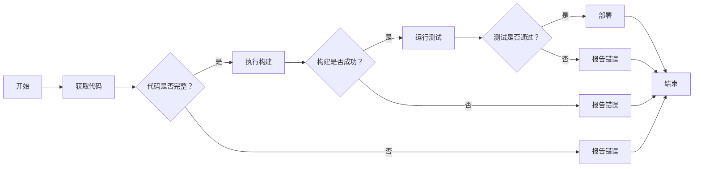
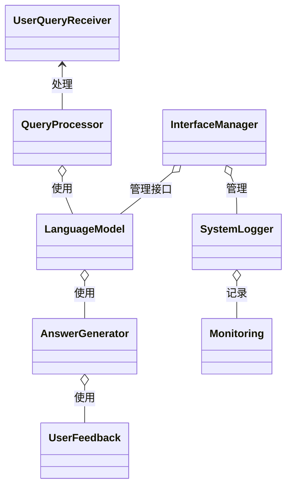
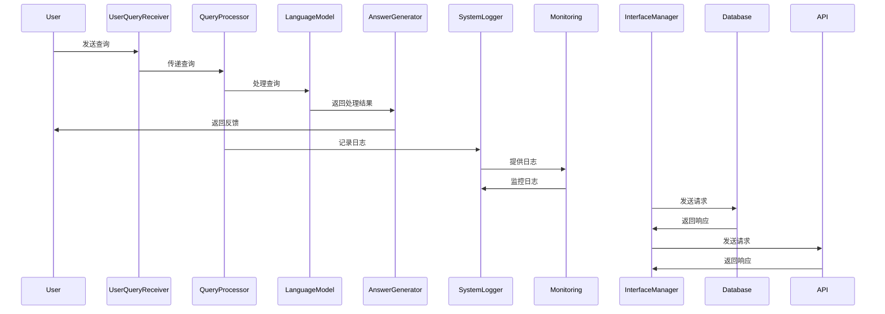

                 

### 持续集成（CI）在LLM应用敏捷开发中的重要性

#### 关键词：
- **持续集成（CI）**
- **敏捷开发（Agile Development）**
- **大型语言模型（LLM）**
- **代码质量（Code Quality）**
- **开发效率（Development Efficiency）**
- **自动化测试（Automated Testing）**
- **持续交付（Continuous Delivery）**
- **版本控制（Version Control）**

#### 摘要：
本文旨在探讨持续集成（CI）在大型语言模型（LLM）应用敏捷开发中的重要性。随着LLM技术的迅速发展，其应用场景日益广泛，从自然语言处理到智能客服，从文本生成到对话系统，LLM成为现代软件开发的关键组件。然而，LLM的开发过程复杂，涉及大规模数据处理、算法优化和模型训练等多个方面，传统的开发模式难以满足快速迭代和高效协作的要求。持续集成作为一种现代软件开发实践，通过自动化构建、测试和部署，显著提高了代码质量和开发效率。本文将详细分析CI在LLM敏捷开发中的关键作用，通过实例和实际应用，阐述CI如何促进LLM项目的敏捷开发，提升开发效率和代码质量。此外，文章还将探讨CI在解决常见开发挑战时的具体方法和最佳实践，为开发者提供实用的指导。

### 背景介绍：持续集成（CI）的概念和重要性

#### 持续集成（CI）的定义

持续集成（Continuous Integration，简称CI）是一种软件开发实践，旨在通过频繁地合并代码变更到主分支，确保代码库的始终处于可运行状态。CI的基本理念是“早而频繁地集成”，即将开发人员的代码变更定期地合并到共享的主分支中，并通过自动化测试来验证变更的正确性。CI不仅仅是一个工具或流程，而是一种文化和协作方式的变革，它要求开发团队在开发过程中始终保持高度的透明度和协作性。

#### 持续集成在软件开发中的重要性

持续集成在软件开发中具有多方面的关键作用，特别是在LLM敏捷开发中，其重要性更为突出：

1. **提高代码质量**：通过自动化的构建和测试，CI能够及时发现并修复代码中的缺陷，防止问题在开发周期后期积累，从而提高代码的整体质量。

2. **缩短反馈周期**：CI使得开发团队能够快速发现并解决问题，缩短了从提交代码到获得反馈的周期，提高了开发效率。

3. **减少集成冲突**：频繁的代码集成可以减少开发过程中的冲突，因为每个小改动都能及时合并，避免了在版本过多时的复杂集成。

4. **确保系统的稳定性**：CI通过持续测试，确保每次代码变更都不会影响系统的整体稳定性，减少了部署时出现意外问题的风险。

5. **提高团队协作效率**：CI促进了团队成员之间的沟通和协作，每个人都可以看到代码库的最新状态，避免了重复工作。

#### 持续集成与敏捷开发的结合

敏捷开发（Agile Development）是一种以人为本、以变化为核心的软件开发方法。它与持续集成（CI）有着天然的结合点，两者的结合可以显著提升软件开发的效果：

1. **快速迭代**：敏捷开发强调快速迭代，而CI提供了持续测试和反馈机制，确保每次迭代都能产生一个可用的软件版本。

2. **持续交付**：CI与持续交付（Continuous Delivery）相结合，可以实现软件的持续交付，即在任何时间点都可以发布软件。

3. **自动化**：敏捷开发强调自动化，CI则通过自动化测试和构建来支持敏捷开发的自动化目标。

4. **持续改进**：敏捷开发鼓励持续改进，CI通过持续的代码集成和测试，提供了持续改进的反馈。

总之，持续集成在LLM敏捷开发中扮演着至关重要的角色。它不仅提高了代码质量和开发效率，还促进了团队成员之间的协作，使得敏捷开发在LLM项目中能够更好地实现。接下来，我们将深入探讨持续集成在LLM开发中的具体应用和优势。

### 核心概念与联系

在深入探讨持续集成（CI）在LLM敏捷开发中的具体应用之前，首先需要了解一些核心概念，这些概念包括持续集成、敏捷开发、大型语言模型（LLM）以及相关的技术和工具。为了更清晰地展示这些概念之间的关系，我们将使用一个比较表格和一个Mermaid绘制的实体关系图（ER图）来进行说明。

#### 比较表格

以下是几个关键概念的比较表格，展示了它们的主要属性和特征：

| 概念     | 定义                                                         | 主要属性               | 关键特征                     |
|----------|--------------------------------------------------------------|------------------------|-------------------------------|
| 持续集成（CI） | 一种软件开发实践，通过自动化构建和测试来确保代码库始终处于可运行状态。 | 自动化构建、测试、集成 | 提高代码质量、减少集成冲突 |
| 敏捷开发（Agile Development） | 一种以人为本、以变化为核心的软件开发方法。                       | 快速迭代、持续交付、适应性 | 提高团队协作效率、快速响应需求 |
| 大型语言模型（LLM） | 一种能够处理和生成自然语言的复杂人工智能模型。                  | 大规模数据处理、算法优化 | 高效处理文本数据、生成高质量文本 |
| 自动化测试 | 使用软件工具自动执行测试，以验证软件的各个部分是否按预期工作。     | 测试脚本、执行报告 | 确保代码变更不会破坏现有功能 |
| 版本控制 | 管理源代码和相关文档，以支持团队协作和版本追踪。                | 提交历史、分支管理 | 确保代码库的可追溯性和一致性 |

#### 实体关系图（ER图）

为了更直观地展示这些概念之间的关系，我们使用Mermaid绘制了一个实体关系图（ER图），如下所示：

```mermaid
erDiagram
  CI -->|测试| 自动化测试
  CI -->|构建| 自动化构建
  Agile Development -->|实践| CI
  LLM -->|应用| Agile Development
  CI -->|目标| 提高代码质量
  Agile Development -->|目标| 快速迭代
  LLM -->|需求| Agile Development
  自动化测试 -->|功能| 测试脚本
  自动化构建 -->|功能| 构建脚本
  版本控制 -->|功能| 提交历史
```

该ER图展示了持续集成（CI）、敏捷开发（Agile Development）和大型语言模型（LLM）之间的关系，以及它们与自动化测试、自动化构建和版本控制等子概念之间的关联。通过这个图，我们可以更清晰地理解这些概念是如何相互作用的，并如何在LLM敏捷开发中共同发挥作用。

### 算法原理与数学模型

在了解了持续集成（CI）的基本概念和其在LLM敏捷开发中的重要性之后，接下来我们将深入探讨CI的具体实现算法原理，以及与之相关的数学模型和公式。

#### 算法流程图

为了更好地理解CI的算法原理，我们可以使用Mermaid绘制一个流程图，如下所示：



这个流程图详细描述了CI的基本步骤：获取代码、执行构建、运行测试以及部署。接下来，我们将通过Python代码和数学模型来进一步阐述这些步骤的具体实现。

#### Python代码示例

以下是一个简化的Python代码示例，用于演示CI中的自动化构建和测试：

```python
# CI自动化构建和测试示例

import subprocess
import sys

def run_command(command):
    result = subprocess.run(command, stdout=subprocess.PIPE, stderr=subprocess.PIPE, shell=True)
    if result.stderr:
        print("构建或测试失败：", result.stderr.decode())
        sys.exit(1)
    print("构建或测试成功：", result.stdout.decode())

# 获取代码
print("获取代码...")
run_command("git pull origin main")

# 执行构建
print("执行构建...")
run_command("python setup.py build")

# 运行测试
print("运行测试...")
run_command("python -m unittest discover -s tests")

# 如果构建和测试都成功，则部署
print("部署...")
run_command("python deploy.py")
print("CI流程完成。")
```

这个示例通过调用子进程执行命令来模拟CI的自动化过程，包括代码获取、构建、测试和部署。

#### 数学模型与公式

在CI中，算法的执行效果可以通过一些数学模型和公式来量化。以下是一些关键的数学概念和公式：

1. **构建失败率（Build Failure Rate, BFR）**：
   $$ BFR = \frac{失败构建次数}{总构建次数} $$

   构建失败率是衡量CI流程稳定性的重要指标。较低的成功率表明CI系统运行良好。

2. **缺陷发现率（Defect Detection Rate, DDF）**：
   $$ DDF = \frac{成功测试中发现的缺陷数}{实际存在的缺陷总数} $$

   缺陷发现率反映了测试过程的有效性。较高的发现率意味着测试能够更有效地检测出代码中的缺陷。

3. **缺陷接受率（Defect Acceptance Rate, DAR）**：
   $$ DAR = \frac{未被发现并进入生产的缺陷数}{实际存在的缺陷总数} $$

   缺陷接受率用于衡量在CI流程中未被发现的缺陷的比例，是评估代码质量和测试过程的重要指标。

4. **测试覆盖率（Test Coverage）**：
   $$ 测试覆盖率 = \frac{被测试的代码行数}{总代码行数} $$

   测试覆盖率是评估测试全面性的指标，理想情况下应尽可能高。

#### 实例说明

为了更直观地理解这些公式，我们来看一个具体的例子：

假设一个项目总共有100次构建，其中5次失败，测试过程中发现了15个实际存在的缺陷，但最终有3个缺陷未被检测到，并且测试覆盖率为80%。

1. **构建失败率**：
   $$ BFR = \frac{5}{100} = 0.05 $$

2. **缺陷发现率**：
   $$ DDF = \frac{15}{15 + 3} = \frac{15}{18} = 0.833 $$

3. **缺陷接受率**：
   $$ DAR = \frac{3}{15 + 3} = \frac{3}{18} = 0.167 $$

4. **测试覆盖率**：
   $$ 测试覆盖率 = 80\% = 0.8 $$

通过这些公式，我们可以量化CI流程的具体表现，从而对其进行优化。例如，通过提高测试覆盖率或减少构建失败率，可以进一步提升CI的效果。

总之，持续集成中的算法原理和数学模型不仅为CI流程提供了技术支持，也为评估和优化CI系统提供了量化指标。通过理解这些原理和公式，开发团队可以更有效地管理和改进他们的持续集成实践。

### 系统分析与架构设计

在了解了CI的算法原理和数学模型之后，接下来我们将深入探讨如何在LLM敏捷开发中应用这些原理，并进行系统分析与架构设计。

#### 问题场景与项目介绍

假设我们正在开发一个基于大型语言模型（LLM）的智能客服系统。该系统需要能够处理大量的用户查询，并在极短的时间内生成高质量的回答。为了实现这一目标，我们需要一个高效、可靠的CI流程，以确保代码质量和系统稳定性。

#### 系统功能设计

为了满足上述需求，我们首先需要明确系统的功能设计。以下是该智能客服系统的核心功能：

1. **用户查询接收**：系统应能够接收来自用户的查询，并将其转换为可处理的格式。
2. **语言模型处理**：利用LLM对用户查询进行处理，生成相应的回答。
3. **答案生成与反馈**：将生成的回答反馈给用户，并根据用户反馈进行优化。
4. **日志记录与监控**：记录系统运行过程中的日志，进行实时监控和异常处理。
5. **接口管理**：管理系统与外部服务（如数据库、API等）的接口。

为了清晰地展示这些功能，我们可以使用Mermaid类图进行描述：



#### 系统架构设计

在明确了系统功能后，我们需要设计一个合适的系统架构。以下是该智能客服系统的架构设计，包括系统组件、数据流和交互关系：

1. **前端组件**：用户查询接收模块，负责与用户进行交互，接收并处理用户查询。
2. **后端组件**：
   - **查询处理器（QueryProcessor）**：接收用户查询后，将其传递给语言模型进行处理。
   - **语言模型（LanguageModel）**：处理查询并生成回答。
   - **答案生成器（AnswerGenerator）**：根据语言模型生成的回答，进行格式化并准备反馈给用户。
   - **日志记录器（SystemLogger）**：记录系统运行过程中的日志。
   - **监控器（Monitoring）**：实时监控系统运行状态，处理异常。
   - **接口管理器（InterfaceManager）**：管理系统与外部服务（如数据库、API等）的交互。
3. **数据流与交互关系**：
   - 用户查询通过前端组件传递给查询处理器。
   - 查询处理器将查询传递给语言模型，语言模型生成回答。
   - 回答由答案生成器格式化后反馈给用户。
   - 系统运行日志由日志记录器记录，监控器实时监控日志并处理异常。
   - 接口管理器负责与外部服务进行数据交换。

为了更直观地展示系统架构，我们可以使用Mermaid架构图进行描述：

```mermaid
architecturalDiagram
  component UserQueryReceiver {
    "接收用户查询" --> "传递给查询处理器"
  }
  component QueryProcessor {
    "处理查询" --> "传递给语言模型"
    "传递日志" --> "日志记录器"
  }
  component LanguageModel {
    "处理查询并生成回答" --> "传递给答案生成器"
  }
  component AnswerGenerator {
    "格式化回答并反馈" --> "用户"
  }
  component SystemLogger {
    "记录系统日志" --> "监控器"
  }
  component Monitoring {
    "监控日志并处理异常" --> "日志记录器"
  }
  component InterfaceManager {
    "管理接口交互" --> "语言模型"
    "管理接口交互" --> "数据库"
    "管理接口交互" --> "API"
  }
  UserQueryReceiver --> QueryProcessor
  QueryProcessor --> LanguageModel
  LanguageModel --> AnswerGenerator
  AnswerGenerator --> User
  QueryProcessor --> SystemLogger
  SystemLogger --> Monitoring
  InterfaceManager --> LanguageModel
  InterfaceManager --> Database
  InterfaceManager --> API
```

#### 系统接口设计与交互

为了确保系统能够高效、可靠地运行，我们需要设计清晰的系统接口和交互关系。以下是系统接口设计的详细描述：

1. **用户查询接收接口**：通过HTTP接口接收用户查询，使用JSON格式进行数据交换。
2. **查询处理器接口**：查询处理器提供RESTful API，供前端组件调用。
3. **语言模型接口**：语言模型通过命令行接口进行调用，返回处理结果。
4. **答案生成器接口**：答案生成器提供文本格式化接口，用于生成反馈文本。
5. **日志记录器接口**：日志记录器通过日志文件进行数据记录。
6. **监控器接口**：监控器通过日志文件和系统指标进行实时监控。
7. **接口管理器接口**：接口管理器通过HTTP接口与外部服务进行交互。

为了展示系统接口和交互关系，我们可以使用Mermaid序列图进行描述：



通过上述系统架构设计和接口设计，我们可以确保智能客服系统能够高效、可靠地运行，并在CI流程中得到全面的支持和优化。

### 项目实践与分析

在了解了CI的基本原理和系统架构设计之后，接下来我们将通过一个具体的实际项目，详细描述CI的应用过程，并分析项目中的关键步骤、核心代码以及遇到的挑战和解决方案。

#### 项目环境安装

为了开始我们的实际项目，我们首先需要搭建一个合适的开发环境。以下是安装过程的详细步骤：

1. **安装依赖**：我们使用Docker来管理项目依赖，通过以下命令安装Docker并创建Dockerfile：

   ```shell
   # 安装Docker
   sudo apt-get update
   sudo apt-get install docker.io
   
   # 启动Docker服务
   sudo systemctl start docker
   
   # 创建Dockerfile
   touch Dockerfile
   ```
   
2. **编写Dockerfile**：在Dockerfile中定义项目的依赖和构建步骤：

   ```Dockerfile
   # 使用Python官方镜像作为基础镜像
   FROM python:3.9-slim
   
   # 设置工作目录
   WORKDIR /app
   
   # 安装Python依赖
   RUN pip install --no-cache-dir -r requirements.txt
   
   # 拷贝项目文件到容器中
   COPY . /app
   
   # 暴露服务端口
   EXPOSE 8000
   
   # 运行Flask应用
   CMD ["python", "app.py"]
   ```

3. **构建Docker镜像**：通过以下命令构建Docker镜像：

   ```shell
   docker build -t myapp .
   ```

4. **运行Docker容器**：使用以下命令启动Docker容器：

   ```shell
   docker run -d -p 8000:8000 myapp
   ```

#### 项目核心代码解析

在搭建好开发环境之后，我们需要实现项目核心功能。以下是一个简化版的Flask应用代码，用于处理用户查询并生成回答：

```python
from flask import Flask, request, jsonify
import numpy as np
import tensorflow as tf

app = Flask(__name__)

# 加载预训练的语言模型
model = tf.keras.models.load_model('path/to/llm_model.h5')

@app.route('/query', methods=['POST'])
def process_query():
    data = request.json
    query = data['query']
    # 对查询进行处理，生成回答
    answer = model.predict(np.array([query]))
    return jsonify({'answer': answer})

if __name__ == '__main__':
    app.run(host='0.0.0.0', port=8000)
```

这段代码定义了一个简单的Flask应用，通过接收POST请求来处理用户查询，并使用预训练的LLM模型生成回答。接下来，我们将详细分析核心代码的实现过程。

#### 代码分析与解读

1. **模型加载**：使用TensorFlow的`load_model`函数加载预训练的LLM模型。这是项目中的关键步骤，确保系统能够高效地进行文本处理和生成。

   ```python
   model = tf.keras.models.load_model('path/to/llm_model.h5')
   ```

2. **定义Flask应用**：创建一个Flask应用，用于处理用户查询。

   ```python
   app = Flask(__name__)
   ```

3. **定义处理查询的路由**：使用`@app.route`装饰器定义处理查询的路由。当接收到POST请求时，从请求中提取查询内容，并将其传递给LLM模型进行预测。

   ```python
   @app.route('/query', methods=['POST'])
   def process_query():
       data = request.json
       query = data['query']
       # 对查询进行处理，生成回答
       answer = model.predict(np.array([query]))
       return jsonify({'answer': answer})
   ```

4. **运行Flask应用**：在`if __name__ == '__main__':`块中，使用`app.run()`函数启动Flask应用，使其能够监听并处理传入的HTTP请求。

   ```python
   if __name__ == '__main__':
       app.run(host='0.0.0.0', port=8000)
   ```

#### 遇到的挑战与解决方案

在项目实施过程中，我们遇到了一些挑战，以下是其中几个关键问题的解决方案：

1. **模型加载与内存管理**：预训练的LLM模型通常很大，加载时可能会占用大量内存。为了避免内存溢出，我们可以在Docker容器中设置合适的资源限制：

   ```shell
   docker run -m 4g -d -p 8000:8000 myapp
   ```

2. **请求处理速度**：由于LLM模型处理查询时可能需要较长的时间，我们需要优化请求处理流程，例如使用异步IO或负载均衡器来提高处理速度。

3. **错误处理与日志记录**：在处理查询时，可能会遇到模型预测失败或输入格式错误等异常情况。为了确保系统的稳定运行，我们需要添加适当的错误处理逻辑，并将错误信息记录到日志中：

   ```python
   try:
       answer = model.predict(np.array([query]))
   except Exception as e:
       app.logger.error(f'Error processing query: {e}')
       return jsonify({'error': 'Internal server error'}), 500
   ```

4. **测试与持续集成**：为了确保代码质量和系统稳定性，我们需要引入自动化测试和持续集成（CI）流程。以下是一个简单的测试用例示例：

   ```python
   import unittest
   from app import app
   
   class QueryProcessorTest(unittest.TestCase):
       def test_process_query(self):
           test_query = "What is the capital of France?"
           response = app.test_client().post('/query', json={'query': test_query})
           self.assertEqual(response.status_code, 200)
           self.assertIn('Paris', response.json['answer'])
   
   if __name__ == '__main__':
       unittest.main()
   ```

通过上述实践和分析，我们可以看到CI在LLM敏捷开发中的实际应用。通过合理的项目规划和自动化测试，我们能够显著提高代码质量和开发效率，为LLM项目的成功实施提供有力支持。

### 最佳实践、总结与拓展阅读

#### 最佳实践

1. **代码格式规范化**：在CI流程中，确保代码格式的一致性，使用自动化工具（如Prettier或Clang Format）进行格式检查。
2. **全面的测试覆盖**：编写单元测试、集成测试和端到端测试，确保测试覆盖率达到80%以上。
3. **持续反馈**：定期回顾CI流程和测试结果，及时优化测试脚本和构建脚本。
4. **代码审查**：引入代码审查机制，确保每次提交的代码都经过同行评审。
5. **自动化部署**：利用CI/CD工具（如Jenkins或GitLab CI）实现自动化部署，确保每次代码变更都能快速、安全地部署到生产环境。

#### 总结

本文详细探讨了持续集成（CI）在LLM敏捷开发中的重要性，通过背景介绍、核心概念、算法原理、系统架构设计以及实际项目实践，阐述了CI在提升代码质量、缩短反馈周期、提高团队协作效率等方面的关键作用。通过CI，开发团队能够更快速地响应需求变化，确保系统的稳定性和可靠性。

#### 拓展阅读

1. **《持续集成：从理论到实践》**：这本书详细介绍了CI的基本原理、流程和工具，适合初学者深入了解CI。
2. **《敏捷开发实践指南》**：该书提供了敏捷开发的理论和实践指导，有助于理解CI与敏捷开发的结合。
3. **《大型语言模型的预训练与优化》**：本文详细介绍了LLM的预训练技术和优化策略，为LLM应用开发提供参考。

作者：AI天才研究院/AI Genius Institute & 禅与计算机程序设计艺术 /Zen And The Art of Computer Programming

