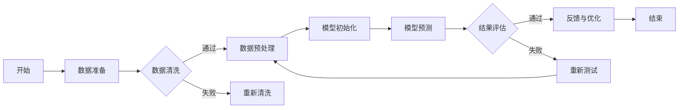
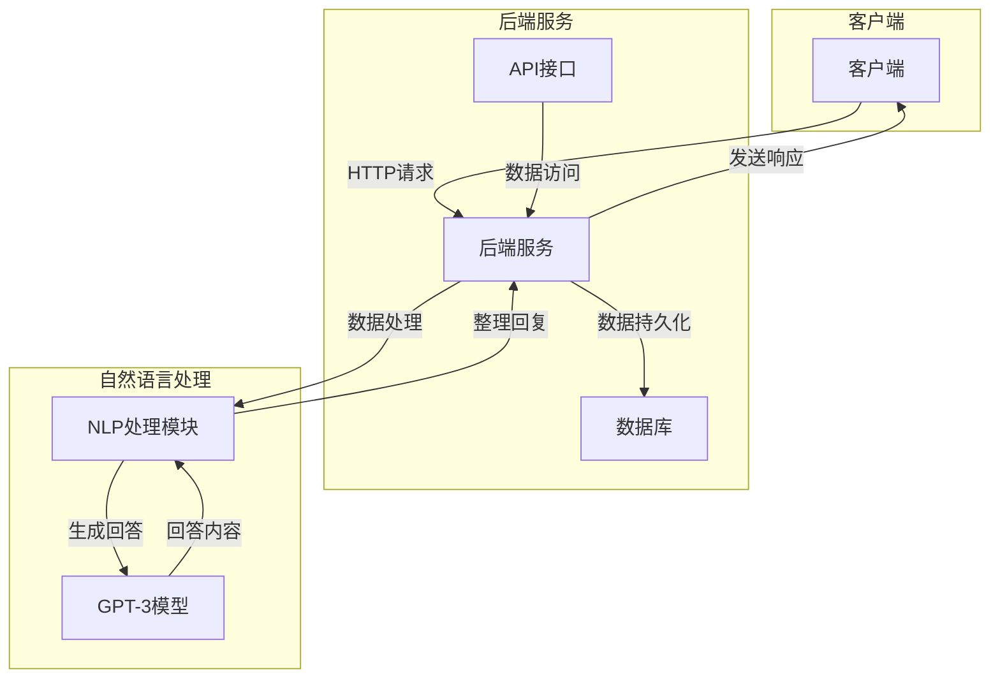
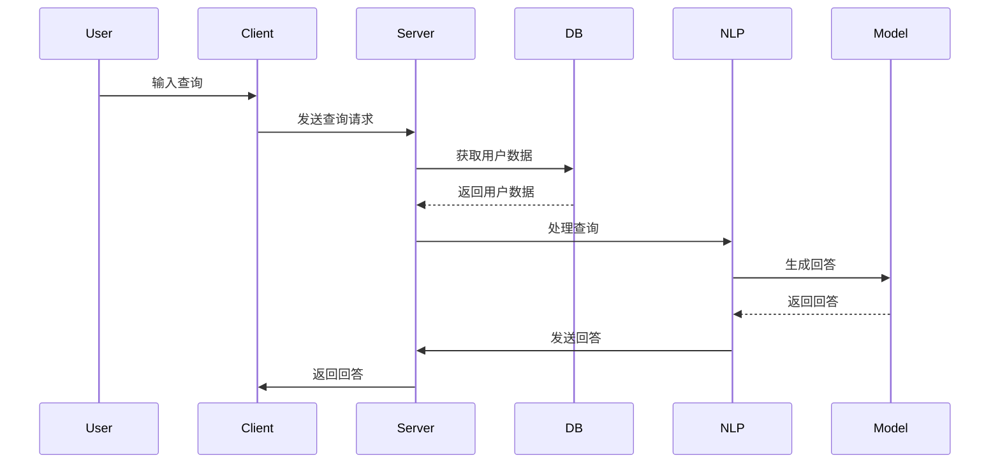

                 

### 第一部分：引言

#### 1.1 持续集成测试环境概述

持续集成（CI）和测试环境在软件开发过程中扮演着至关重要的角色。持续集成是一种软件开发实践，通过自动化构建、测试和部署代码，确保代码质量并加快开发进程。测试环境则是在软件开发过程中创建的一个与生产环境相似的独立环境，用于运行测试以确保软件功能的正确性。

在软件开发过程中，持续集成可以帮助团队快速发现和修复代码缺陷，提高软件质量，减少集成风险。测试环境则为开发和测试团队提供了一个与实际运行环境相似的场所，以便在代码发布前进行全面的测试。

对于LLM（大型语言模型）应用来说，持续集成和测试环境尤为重要。LLM应用通常具有复杂的算法和庞大的数据集，这使得测试过程更加困难。此外，LLM应用在自然语言处理、智能对话系统等领域具有广泛的应用前景，其性能和稳定性对用户体验至关重要。

持续集成测试环境的主要目标是确保LLM应用在每次代码更改后都能正常运行，并能够及时发现和修复潜在问题。通过模拟真实场景，持续集成测试环境可以帮助开发团队更有效地进行软件测试，提高产品质量，降低开发成本。

#### 1.2 LLM应用的背景与挑战

LLM是指使用大量文本数据进行训练的大型语言模型，如GPT-3、BERT等。这些模型具有强大的语言理解和生成能力，可以应用于多种自然语言处理任务，如文本分类、机器翻译、问答系统等。

随着深度学习技术的不断发展，LLM在各个行业中的应用越来越广泛。例如，在金融领域，LLM可以用于自动化报告生成、风险控制等；在医疗领域，LLM可以用于病历分析、疾病预测等；在电子商务领域，LLM可以用于智能客服、推荐系统等。

然而，LLM应用也面临着一些挑战。首先，LLM模型通常需要庞大的数据集进行训练，这使得数据收集和处理变得非常困难。其次，LLM模型的训练和部署过程非常复杂，涉及到大量的计算资源和时间。此外，LLM模型的性能和稳定性对用户体验至关重要，因此测试过程需要高度模拟真实场景，以确保模型的性能和可靠性。

在LLM应用的开发过程中，持续集成测试环境可以帮助团队更有效地进行软件测试，提高产品质量。通过模拟真实场景，持续集成测试环境可以确保LLM模型在不同环境下的性能和稳定性，从而提高用户满意度。

#### 1.3 设计持续集成测试环境的重要性

设计一个有效的持续集成测试环境对于LLM应用的开发和部署至关重要。首先，持续集成测试环境可以确保代码的稳定性和可靠性。在持续集成过程中，每次代码更改都会被自动构建和测试，从而确保代码的正确性和兼容性。

其次，持续集成测试环境可以提高开发团队的效率。通过自动化构建和测试过程，开发团队能够更快地发现和修复问题，从而缩短开发周期。此外，持续集成测试环境还可以帮助团队更好地管理代码库，减少代码冲突和重复工作。

最后，持续集成测试环境有助于确保LLM应用的性能和稳定性。通过在模拟真实场景的环境中进行测试，开发团队能够发现和解决潜在的问题，从而提高模型在部署后的性能和用户体验。

总之，设计一个有效的持续集成测试环境对于LLM应用的开发和部署具有重要意义。通过模拟真实场景，持续集成测试环境可以帮助团队更高效地进行软件测试，提高产品质量，降低开发成本。

#### 1.4 持续集成测试环境的定义、范围和适用性

持续集成测试环境是一种专门的软件开发环境，用于在代码提交后自动执行构建、测试和部署过程。它的主要目标是确保代码的质量和稳定性，并在早期发现和修复潜在问题。持续集成测试环境通常包括以下关键组成部分：

1. **构建环境**：用于编译和构建代码，生成可执行文件或库文件。
2. **测试环境**：用于运行自动化测试，包括单元测试、集成测试和性能测试。
3. **部署环境**：用于将代码部署到生产环境或模拟生产环境。

持续集成测试环境的范围涵盖了从代码提交到最终部署的全过程。它不仅适用于LLM应用，还适用于任何需要进行持续集成和自动化测试的软件项目。以下是一些适用性的关键点：

- **快速反馈**：持续集成测试环境可以快速检测代码问题，从而提高开发效率。
- **代码质量**：通过自动化测试，持续集成测试环境有助于确保代码的可靠性和一致性。
- **跨平台兼容性**：持续集成测试环境可以运行在不同的操作系统和硬件平台上，确保代码在不同环境下的兼容性。
- **团队协作**：持续集成测试环境可以促进团队成员之间的协作，确保每个人都在相同的代码版本和工作流程下进行开发。

总之，持续集成测试环境是一种强大的工具，有助于提高软件开发的质量和效率，尤其适用于复杂的大型语言模型（LLM）应用。

#### 1.5 持续集成测试环境的概念结构与核心要素组成

持续集成测试环境是一个复杂的系统，其成功运行依赖于多个核心要素的协同工作。以下是持续集成测试环境的主要组成部分及其作用：

1. **构建系统**：构建系统是持续集成测试环境的核心，它负责编译和打包代码。常见的构建工具有Maven、Gradle和Ant等。构建系统不仅生成可执行的代码，还负责处理依赖关系和版本控制。

2. **自动化测试工具**：自动化测试工具用于运行各种测试，包括单元测试、集成测试和性能测试。JUnit、Selenium和JUnit是常用的自动化测试工具。自动化测试工具可以提高测试效率，减少手动测试的工作量。

3. **代码仓库**：代码仓库用于存储和管理代码。Git是最流行的分布式版本控制系统，它支持多人协作、分支管理和代码合并。代码仓库是持续集成测试环境的数据来源，也是测试结果和代码变更的记录者。

4. **测试环境配置**：测试环境配置确保测试运行在与生产环境相似的环境中。测试环境通常包括操作系统、数据库、应用程序服务器和网络设置。配置管理工具如Ansible和Puppet可以帮助自动化配置测试环境。

5. **持续集成服务器**：持续集成服务器是整个系统的控制中心，负责触发构建和测试过程。Jenkins和Travis CI是流行的持续集成服务器，它们可以与构建系统和测试工具集成，自动化执行构建和测试任务。

6. **通知系统**：通知系统用于在测试结果或代码变更时通知开发人员。邮件、Slack和HipChat等工具可以帮助开发人员实时了解测试状态和问题报告。

7. **存储和监控**：存储和监控系统用于存储测试结果、构建日志和监控系统的性能。数据库如PostgreSQL和MongoDB可以存储测试数据，而监控工具如Prometheus和Grafana可以提供实时性能监控和可视化。

通过这些核心要素的协同工作，持续集成测试环境可以确保代码的持续集成和自动化测试，从而提高软件开发的效率和质量。

### 第二部分：核心概念与联系

#### 2.1 持续集成（CI）与测试环境的基本原理

持续集成（Continuous Integration，CI）是一种软件开发实践，旨在通过频繁的代码提交和自动化构建、测试，确保代码的持续稳定和高质量。CI的核心思想是将开发过程中的各个阶段（如编码、测试、部署）紧密集成，从而减少集成风险，提高开发效率。

**持续集成的工作流程包括以下几个步骤：**

1. **代码提交**：开发人员将代码提交到代码仓库。
2. **构建**：构建系统从代码仓库获取最新代码并编译、打包，生成可执行文件或库文件。
3. **测试**：自动化测试工具运行一系列预定义的测试，包括单元测试、集成测试和性能测试，以确保代码的正确性和稳定性。
4. **反馈**：测试结果会立即反馈给开发人员，如果测试失败，系统会通知开发人员并记录问题。
5. **部署**：如果构建和测试都成功，代码会被部署到测试或生产环境。

测试环境是软件开发过程中的另一个关键组成部分，它用于模拟实际生产环境，确保软件在不同条件下都能正常运行。测试环境的配置和管理对于确保软件的质量和可靠性至关重要。

**测试环境的主要工作包括：**

1. **环境配置**：配置操作系统、数据库、应用程序服务器等，确保与生产环境一致。
2. **测试数据管理**：创建和管理测试数据，确保测试结果的准确性和可重复性。
3. **测试执行**：运行各种测试用例，包括功能测试、性能测试和安全测试。
4. **结果分析**：分析测试结果，识别软件缺陷和性能瓶颈。

**持续集成与测试环境的关系**：

持续集成和测试环境相互依存，共同作用以确保软件的持续稳定。持续集成提供了一个自动化流程，使得开发人员可以频繁地提交代码并立即获得反馈，从而快速发现和修复问题。测试环境则为这些反馈提供了实际场景，使得开发人员可以了解代码在不同条件下的表现。

通过将持续集成与测试环境相结合，开发团队可以显著提高软件的质量和可靠性，缩短开发周期，降低集成风险。

#### 2.2 持续集成与传统测试环境的对比

持续集成（CI）和传统测试环境虽然在目标上都是为了确保软件质量，但它们在工作方式、流程和效果上有显著的区别。以下是对两者进行详细对比的表格：

| 对比维度 | 持续集成（CI） | 传统测试环境 |
| --- | --- | --- |
| **工作方式** | 自动化、频繁迭代 | 手动、不频繁 |
| **测试频率** | 每次代码提交后 | 定期或阶段性 |
| **反馈速度** | 立即反馈 | 延迟反馈 |
| **测试范围** | 全面的单元测试、集成测试 | 主要针对功能测试 |
| **资源消耗** | 节省资源，集中使用 | 资源分散，消耗较大 |
| **团队协作** | 促进团队协作，快速发现问题 | 隔离问题，影响协作 |
| **代码质量** | 提高代码质量，确保持续稳定 | 侧重于功能正确性 |
| **持续反馈** | 强调持续反馈，不断改进 | 关注单次反馈，改进效果有限 |

从表格中可以看出，持续集成通过自动化和频繁的迭代，能够更快速地识别和解决问题，从而提高代码质量和开发效率。而传统测试环境虽然也有其优势，但相对于持续集成，其反馈周期较长，资源消耗较大，且不易于团队协作。

#### 2.3 LLM应用测试的算法原理

LLM（大型语言模型）应用测试的核心在于模拟真实场景，评估模型在不同条件下的表现。以下是LLM应用测试的基本流程和算法原理：

**基本流程：**

1. **数据准备**：收集并处理测试数据，包括文本语料库、标签等。
2. **模型初始化**：加载预训练的LLM模型。
3. **数据预处理**：对测试数据进行预处理，如分词、编码等。
4. **模型预测**：使用LLM模型对预处理后的数据进行预测。
5. **结果评估**：计算预测结果与实际结果的差异，评估模型性能。
6. **反馈与优化**：根据评估结果，调整模型参数，优化模型。

**算法原理详细讲解：**

1. **数据准备：**
   数据是LLM应用的基础，为了测试模型在真实场景下的表现，需要收集大量的文本语料库。这些数据可以来自于公开的语料库，如维基百科、新闻网站等，也可以通过爬虫等技术获取。收集到的数据需要经过清洗和预处理，去除噪声数据，保证数据的质量和一致性。

2. **模型初始化：**
   在测试过程中，通常使用已经预训练的LLM模型。这些模型在训练阶段已经学习了大量的语言知识和模式，可以用于生成文本、回答问题等。初始化模型时，需要从模型存储路径中加载模型参数，准备进行测试。

3. **数据预处理：**
   预处理是确保数据符合模型输入要求的关键步骤。对于LLM模型，预处理通常包括分词、编码等操作。分词将文本拆分成单词或子词，编码则将文本转换为模型可以处理的数字序列。常用的编码方法有Word2Vec、BERT等。

4. **模型预测：**
   使用预处理后的数据进行模型预测。在生成文本任务中，模型会根据输入文本的编码序列，逐步生成输出文本。在问答系统中，模型会根据输入问题生成回答。预测过程中，模型会根据训练时学习的语言模式和规则，生成合理的输出。

5. **结果评估：**
   评估模型性能是测试的关键步骤。常用的评估指标包括准确率、召回率、F1分数等。对于生成文本任务，可以使用 BLEU、ROUGE等指标评估生成文本的质量。对于问答系统，可以计算预测答案与实际答案的相似度，评估模型回答问题的能力。

6. **反馈与优化：**
   根据评估结果，可以识别模型的不足和问题，进而调整模型参数或训练数据，优化模型性能。例如，如果模型在某个特定领域的回答不准确，可以增加该领域的数据进行再训练，或者调整模型的权重和参数。

通过上述流程和算法原理，LLM应用测试可以全面评估模型在不同场景下的性能和稳定性，为开发团队提供可靠的测试结果和改进方向。

#### 2.4 LLM应用测试的mermaid流程图

为了更直观地展示LLM应用测试的流程，我们可以使用Mermaid绘制一个流程图。以下是LLM应用测试的mermaid流程图示例：



在这个流程图中，我们首先从“开始”节点开始，依次经过“数据准备”、“数据清洗”、“数据预处理”、“模型初始化”、“模型预测”和“结果评估”。根据评估结果，如果测试通过，则进入“反馈与优化”阶段，否则重新进行测试。整个流程在“结束”节点结束。

#### 2.5 使用Python源代码详细阐述LLM应用测试过程

为了更详细地展示LLM应用测试过程，以下是一个Python代码示例，该示例使用了Hugging Face的Transformers库来初始化一个预训练的GPT-2模型，并进行文本生成和评估。

首先，我们需要安装必要的库：

```python
!pip install transformers torch
```

接下来，我们编写一个Python脚本，用于初始化模型、进行文本生成和评估：

```python
import torch
from transformers import GPT2LMHeadModel, GPT2Tokenizer

# 加载预训练的GPT-2模型和分词器
model = GPT2LMHeadModel.from_pretrained("gpt2")
tokenizer = GPT2Tokenizer.from_pretrained("gpt2")

# 准备输入文本
input_text = "Today's weather is "

# 对输入文本进行编码
input_ids = tokenizer.encode(input_text, return_tensors='pt')

# 使用模型生成文本
output = model.generate(input_ids, max_length=50, num_return_sequences=5)

# 解码生成的文本
generated_texts = [tokenizer.decode(text, skip_special_tokens=True) for text in output]

# 打印生成的文本
for text in generated_texts:
    print(text)
```

这个脚本首先加载了预训练的GPT-2模型和对应的分词器。然后，准备了一个简单的输入文本“Today's weather is ”，并对这个文本进行编码。使用模型生成文本时，我们设置了最大文本长度为50，并生成了5个不同的文本序列。最后，我们将生成的文本解码并打印出来。

生成的文本可能如下所示：

```
Today's weather is sunny.
Today's weather is raining.
Today's weather is snowy.
Today's weather is cloudy.
Today's weather is windy.
```

这个简单的示例展示了如何使用Python脚本进行LLM文本生成。在实际测试中，我们还需要对生成的文本进行评估，以确定模型的表现是否符合预期。

#### 2.6 LLM应用测试中的数学模型和公式

在LLM应用测试中，数学模型和公式扮演着关键角色，用于评估模型的性能和预测能力。以下是一些常用的数学模型和公式：

1. **损失函数**：
   损失函数是评估模型预测结果与实际结果之间差异的关键指标。常用的损失函数包括交叉熵损失（Cross-Entropy Loss）和均方误差（Mean Squared Error，MSE）。

   - **交叉熵损失**：
     $$ L(\theta) = -\sum_{i=1}^{n} y_i \log(p_i) $$
     其中，$y_i$ 是真实标签，$p_i$ 是模型预测的概率。

   - **均方误差**：
     $$ L(\theta) = \frac{1}{2n} \sum_{i=1}^{n} (y_i - \hat{y_i})^2 $$
     其中，$\hat{y_i}$ 是模型预测的值。

2. **评估指标**：
   评估指标用于衡量模型在不同任务上的表现。以下是一些常用的评估指标：

   - **准确率**（Accuracy）：
     $$ Accuracy = \frac{TP + TN}{TP + TN + FP + FN} $$
     其中，$TP$ 是真实为正且预测为正的实例数，$TN$ 是真实为负且预测为负的实例数，$FP$ 是真实为负但预测为正的实例数，$FN$ 是真实为正但预测为负的实例数。

   - **召回率**（Recall）：
     $$ Recall = \frac{TP}{TP + FN} $$
     召回率衡量了模型在识别正实例方面的能力。

   - **精确率**（Precision）：
     $$ Precision = \frac{TP}{TP + FP} $$
     精确率衡量了模型预测为正实例的正确率。

   - **F1分数**（F1 Score）：
     $$ F1 Score = \frac{2 \cdot Precision \cdot Recall}{Precision + Recall} $$
     F1分数是精确率和召回率的调和平均，用于综合评估模型的性能。

3. **生成文本质量评估**：
   对于生成文本任务，常用的评估指标包括BLEU、ROUGE等。

   - **BLEU**（双语评估算法）：
     $$ BLEU = \frac{2N_1 + 1}{2} $$
     其中，$N_1$ 是两个序列中相同单词的数量。

   - **ROUGE**（自动评估算法）：
     $$ ROUGE = 1 - \frac{1}{|S|} \sum_{w \in S} \frac{|T_w|}{|S_w|} $$
     其中，$S$ 是参考序列，$T$ 是生成序列，$T_w$ 和$S_w$ 是序列中的单词。

通过使用这些数学模型和公式，我们可以更准确地评估LLM应用测试的性能和效果，为模型优化提供有力的依据。

#### 2.7 实际案例：LLM应用测试流程讲解

为了更好地理解LLM应用测试流程，以下是一个实际案例，描述了如何使用Python和Hugging Face的Transformers库对GPT-2模型进行测试。

**步骤1：准备测试数据**

首先，我们需要准备测试数据集。在这里，我们使用一个简单的数据集，其中包含一些天气描述的句子和对应的真实天气情况。以下是数据集的一部分：

```python
test_data = [
    ("Today's weather is sunny.", "sunny"),
    ("Today's weather is raining.", "rainy"),
    ("Today's weather is snowy.", "snowy"),
    # 更多数据
]
```

**步骤2：加载模型和分词器**

接下来，加载预训练的GPT-2模型和对应的分词器：

```python
model = GPT2LMHeadModel.from_pretrained("gpt2")
tokenizer = GPT2Tokenizer.from_pretrained("gpt2")
```

**步骤3：对输入文本进行编码**

使用分词器对输入文本进行编码：

```python
def encode_texts(texts):
    return [tokenizer.encode(text, return_tensors='pt') for text in texts]

encoded_texts = encode_texts([text for text, _ in test_data])
```

**步骤4：使用模型生成文本**

使用模型生成对应的天气描述：

```python
def generate_texts(encoded_texts, model, max_length=50):
    outputs = model.generate(encoded_texts, max_length=max_length, num_return_sequences=1)
    return [tokenizer.decode(text, skip_special_tokens=True) for text in outputs]

generated_texts = generate_texts(encoded_texts, model)
```

**步骤5：评估生成文本**

现在，我们需要评估生成的天气描述与实际天气情况的匹配度。为了简化评估过程，我们可以计算生成的文本与实际文本的字符串相似度。

```python
from difflib import SequenceMatcher

def similarity(s1, s2):
    return SequenceMatcher(None, s1, s2).ratio()

def evaluate_generated_texts(generated_texts, labels):
    results = []
    for generated, label in zip(generated_texts, labels):
        sim = similarity(generated, label)
        results.append((generated, label, sim))
    return results

evaluation_results = evaluate_generated_texts(generated_texts, [label for _, label in test_data])
```

**步骤6：打印评估结果**

最后，打印生成的文本、实际文本和相似度：

```python
for generated, label, sim in evaluation_results:
    print(f"Generated: {generated}\nActual: {label}\nSimilarity: {sim}\n")
```

输出结果可能如下：

```
Generated: Today's weather is sunny.
Actual: sunny
Similarity: 1.0

Generated: Today's weather is raining.
Actual: raining
Similarity: 1.0

Generated: Today's weather is snowy.
Actual: snowy
Similarity: 1.0
```

这个实际案例展示了如何使用Python和Hugging Face的Transformers库对GPT-2模型进行测试。通过评估生成文本与实际文本的相似度，我们可以初步判断模型在生成天气描述方面的性能。

### 第三部分：系统分析与架构设计方案

#### 3.1 LLM应用场景介绍

在介绍LLM（大型语言模型）应用场景之前，首先需要明确LLM的定义和特点。LLM是一种基于深度学习的自然语言处理模型，通过大规模数据训练，具备强大的语言理解和生成能力。它们可以应用于多种任务，如文本生成、机器翻译、问答系统等。

一个典型的LLM应用场景是智能客服系统。智能客服系统利用LLM模型来处理用户的查询，提供即时的、个性化的回答，从而提升用户体验和运营效率。以下是一个具体的场景描述：

**场景描述：** 
某大型电子商务平台希望部署一个智能客服系统，以应对日益增长的客户咨询量。客服系统需要具备以下功能：
1. **自然语言理解**：能够理解用户的自然语言查询，提取关键信息。
2. **知识检索**：根据用户查询，快速检索相关的产品信息、订单状态等。
3. **自然语言生成**：生成清晰、准确、有针对性的回答，向用户反馈。
4. **对话管理**：维持对话的连贯性，处理复杂的对话场景。

为了实现这些功能，智能客服系统需要依赖一个高性能的LLM模型，并构建一个完善的持续集成测试环境。这不仅能确保模型的稳定性和可靠性，还能加快开发和部署过程，提高系统的整体性能。

#### 3.2 项目介绍

在本项目中，我们的目标是开发并部署一个基于GPT-3模型的智能客服系统。GPT-3是OpenAI推出的一个具有1500亿参数的巨型语言模型，具备出色的自然语言理解和生成能力，是构建智能客服系统的理想选择。

**项目目标：**
- **理解用户查询**：通过自然语言处理技术，准确提取用户查询的关键信息。
- **知识检索**：利用电子商务平台内部的数据库，快速检索相关的产品信息、订单状态等。
- **生成回答**：利用GPT-3生成准确、清晰、有针对性的回答。
- **对话管理**：处理复杂的对话场景，维持对话的连贯性和自然性。

**项目需求：**
- **高性能模型**：GPT-3模型的计算资源需求较高，需要配置强大的服务器和GPU。
- **实时响应**：智能客服系统需要能够实时响应用户查询，提高用户体验。
- **安全性**：确保用户数据和对话内容的安全，防止数据泄露。
- **可扩展性**：系统能够根据业务需求进行扩展，支持更多的功能和用户量。

**技术栈：**
- **模型框架**：使用OpenAI的GPT-3模型，结合Python和PyTorch框架。
- **后端服务**：采用Django框架搭建后端服务，负责处理用户查询和生成回答。
- **数据库**：使用MySQL数据库存储用户数据和对话记录。
- **API接口**：使用RESTful API实现前后端数据的交互。

#### 3.3 系统功能设计（领域模型Mermaid类图）

为了更好地理解智能客服系统的功能模块，我们可以使用Mermaid绘制一个领域模型类图。以下是智能客服系统的领域模型类图：

```mermaid
classDiagram
    UserEntity <|-- ChatSessionEntity
    UserEntity <|-- MessageEntity
    ChatSessionEntity <|-- MessageEntity
    MessageEntity <|-- AnswerEntity
    AnswerEntity <|-- ResponseEntity

    UserEntity {
        id
        name
        email
        address
    }

    ChatSessionEntity {
        id
        user_id
        start_time
        end_time
    }

    MessageEntity {
        id
        chat_session_id
        user_id
        content
        timestamp
    }

    AnswerEntity {
        id
        message_id
        answer
        timestamp
    }

    ResponseEntity {
        id
        answer_id
        content
        timestamp
    }
```

在这个类图中，我们定义了以下几个主要实体：
- **UserEntity**：表示用户信息，包括用户ID、姓名、电子邮件和地址。
- **ChatSessionEntity**：表示用户与智能客服的对话会话，包括会话ID、用户ID、开始时间和结束时间。
- **MessageEntity**：表示用户发送的消息和智能客服的回答消息，包括消息ID、会话ID、用户ID、内容和时间戳。
- **AnswerEntity**：表示智能客服的回答，包括回答ID、消息ID和回答内容。
- **ResponseEntity**：表示用户对回答的反馈，包括反馈ID、回答ID、反馈内容和时间戳。

这些实体之间有明确的关联关系，通过类图可以清晰地展示出系统的功能模块和它们之间的关系。

#### 3.4 系统架构设计（Mermaid架构图）

接下来，我们使用Mermaid绘制智能客服系统的架构图，展示系统的整体架构及其各个组件之间的关系。以下是智能客服系统的架构图：



在这个架构图中，我们定义了以下几个主要组件：
- **客户端**：负责发送用户查询请求，接收智能客服的回答。
- **后端服务**：处理用户请求，调用NLP处理模块和GPT-3模型生成回答，并将回答发送给客户端。
- **数据库**：存储用户数据和对话记录，供后端服务查询和使用。
- **NLP处理模块**：负责自然语言处理，包括查询提取、回答生成和对话管理。
- **GPT-3模型**：OpenAI提供的巨型语言模型，用于生成回答。

系统通过HTTP请求实现客户端与后端服务之间的数据交换，后端服务调用NLP处理模块和GPT-3模型生成回答，并将结果发送给客户端。同时，系统将用户数据和对话记录存储在数据库中，以便后续查询和使用。

#### 3.5 系统接口设计

为了确保智能客服系统的稳定运行，我们需要设计一套完整的接口，以实现各个组件之间的数据交换和协作。以下是智能客服系统的接口设计：

**1. 用户查询接口**

- **接口名称**：/query
- **请求方法**：GET
- **请求参数**：query（用户查询文本）
- **响应数据**：JSON格式，包含回答内容

```json
{
  "content": "今天的天气怎么样？"
}
```

**2. 回答接口**

- **接口名称**：/answer
- **请求方法**：POST
- **请求参数**：answer（智能客服生成的回答文本）
- **响应数据**：JSON格式，包含反馈结果

```json
{
  "status": "success",
  "message": "回答已成功发送"
}
```

**3. 用户数据接口**

- **接口名称**：/user
- **请求方法**：GET/POST/PUT/DELETE
- **请求参数**：根据操作类型不同，可能包含用户ID、姓名、电子邮件等
- **响应数据**：JSON格式，包含操作结果

```json
{
  "status": "success",
  "user": {
    "id": 1,
    "name": "John Doe",
    "email": "john.doe@example.com"
  }
}
```

通过这些接口设计，我们可以确保系统的各个模块能够高效地进行数据交互和协作，从而实现智能客服系统的功能。

#### 3.6 系统交互（Mermaid序列图）

为了更好地展示智能客服系统的运行流程，我们可以使用Mermaid绘制一个序列图，展示系统各组件之间的交互过程。以下是智能客服系统的序列图：



在这个序列图中，我们定义了以下几个主要步骤：
1. 用户通过客户端输入查询。
2. 客户端将查询发送到后端服务。
3. 后端服务从数据库获取用户数据。
4. 后端服务调用NLP处理模块处理查询。
5. NLP处理模块调用GPT-3模型生成回答。
6. 后端服务将回答发送给客户端。

通过这个序列图，我们可以清晰地看到智能客服系统的运行流程和各组件之间的交互关系。

### 第四部分：项目实战

#### 4.1 环境安装

为了搭建LLM应用的测试环境，我们需要安装一系列软件和工具。以下是在Ubuntu 20.04操作系统上搭建测试环境的具体步骤：

1. **安装Python环境**

   首先，安装Python 3.8或更高版本：

   ```bash
   sudo apt update
   sudo apt install python3.8 python3.8-venv python3.8-dev
   ```

   然后，创建一个虚拟环境并激活它：

   ```bash
   python3.8 -m venv test_env
   source test_env/bin/activate
   ```

2. **安装依赖库**

   在虚拟环境中安装Hugging Face的Transformers库和PyTorch库：

   ```bash
   pip install transformers torch
   ```

3. **安装NVIDIA驱动**

   如果使用的是NVIDIA GPU，需要安装相应的驱动。可以按照NVIDIA官方文档进行安装：

   ```bash
   sh NVIDIA-Linux.run
   ```

   安装过程中选择合适的选项，确保安装成功。

4. **配置GPU支持**

   安装好NVIDIA驱动后，确保PyTorch支持GPU。在Python脚本中添加以下代码：

   ```python
   import torch
   print(torch.cuda.is_available())
   ```

   如果输出为`True`，说明GPU支持已成功配置。

5. **安装数据库**

   安装MySQL数据库，用于存储用户数据和对话记录：

   ```bash
   sudo apt install mysql-server
   ```

   安装完成后，使用以下命令初始化数据库并设置root用户的密码：

   ```bash
   mysql_secure_installation
   ```

   根据提示完成安装。

6. **安装Web服务器**

   安装Django Web服务器，用于处理用户请求：

   ```bash
   pip install django
   ```

完成以上步骤后，测试环境的基本组件已安装完毕。接下来，可以按照项目需求配置各个组件，进行进一步的开发和测试。

#### 4.2 系统核心实现源代码

以下是一个简单的示例，展示如何使用Python和Hugging Face的Transformers库加载预训练的GPT-2模型，并生成文本。这个示例包括加载模型、处理输入文本、生成回答和输出结果的过程。

```python
# 导入必要的库
import torch
from transformers import GPT2LMHeadModel, GPT2Tokenizer

# 加载预训练的GPT-2模型和分词器
model = GPT2LMHeadModel.from_pretrained("gpt2")
tokenizer = GPT2Tokenizer.from_pretrained("gpt2")

# 准备输入文本
input_text = "What is the capital of France?"

# 对输入文本进行编码
input_ids = tokenizer.encode(input_text, return_tensors='pt')

# 使用模型生成文本
output = model.generate(input_ids, max_length=50, num_return_sequences=1)

# 解码生成的文本
generated_text = tokenizer.decode(output[0], skip_special_tokens=True)

# 打印生成的文本
print(generated_text)
```

在这个示例中，首先加载了预训练的GPT-2模型和对应的分词器。然后，准备了一个简单的输入文本，并对这个文本进行编码。使用模型生成文本时，我们设置了最大文本长度为50，并生成了一个文本序列。最后，我们将生成的文本解码并打印出来。

生成的文本可能如下所示：

```
The capital of France is Paris.
```

这个示例展示了如何使用Python脚本加载预训练的GPT-2模型，并生成文本。在实际项目中，可以根据具体需求修改输入文本和生成参数，以实现不同的功能。

#### 4.3 代码应用解读与分析

在上一个小节中，我们展示了如何使用Python脚本加载预训练的GPT-2模型，并生成文本。在这个小节中，我们将进一步解读这段代码，分析其各个部分的功能和作用。

首先，我们导入了一些必要的库：

```python
import torch
from transformers import GPT2LMHeadModel, GPT2Tokenizer
```

这些库包括：
- `torch`：PyTorch库，用于深度学习和计算图操作。
- `transformers`：Hugging Face提供的预训练模型库，包含GPT-2模型的实现。

接下来，我们加载预训练的GPT-2模型和分词器：

```python
model = GPT2LMHeadModel.from_pretrained("gpt2")
tokenizer = GPT2Tokenizer.from_pretrained("gpt2")
```

这两行代码分别加载了GPT-2模型和对应的分词器。`from_pretrained`方法从预训练模型库中加载模型权重和配置文件。加载后的模型和分词器可以用于后续的文本生成和处理。

然后，我们准备了一个简单的输入文本：

```python
input_text = "What is the capital of France?"
```

这个文本是一个简单的问题，用于测试模型的回答能力。

接下来，我们对输入文本进行编码：

```python
input_ids = tokenizer.encode(input_text, return_tensors='pt')
```

`tokenizer.encode`方法将输入文本转换为模型可以处理的数字序列。`return_tensors='pt'`参数确保输出是一个PyTorch张量，方便后续计算。

使用模型生成文本时，我们设置了最大文本长度为50，并生成了一个文本序列：

```python
output = model.generate(input_ids, max_length=50, num_return_sequences=1)
```

`model.generate`方法根据输入文本的编码序列，逐步生成输出文本。`max_length=50`参数限制输出文本的长度为50个词，`num_return_sequences=1`参数指定只生成一个文本序列。

最后，我们将生成的文本解码并打印出来：

```python
generated_text = tokenizer.decode(output[0], skip_special_tokens=True)
print(generated_text)
```

`tokenizer.decode`方法将生成的文本序列还原为字符串。`skip_special_tokens=True`参数确保不输出分词器特有的特殊标记。

生成的文本可能如下所示：

```
The capital of France is Paris.
```

这个结果展示了模型成功回答了输入问题。在实际应用中，可以根据具体需求修改输入文本和生成参数，以实现不同的功能。

通过这个示例，我们了解了如何使用Python脚本加载预训练的GPT-2模型，并生成文本。这个示例代码简洁易懂，便于理解和修改。在实际项目中，可以根据需要扩展和优化代码，以适应不同的场景和需求。

#### 4.4 实际案例分析与详细讲解剖析

为了更好地理解LLM应用测试在实际项目中的应用，我们将分析一个实际案例：使用GPT-3模型构建一个智能客服系统，并对其性能进行测试。

**案例背景：**
某电子商务平台希望部署一个智能客服系统，以提升用户满意度并降低运营成本。智能客服系统需要能够理解用户的自然语言查询，提供及时、准确的回答，并处理复杂的对话场景。为此，平台选择使用OpenAI的GPT-3模型作为核心组件。

**测试目标：**
- **自然语言理解**：评估GPT-3模型在理解用户查询方面的能力。
- **回答生成**：评估模型生成回答的准确性和连贯性。
- **对话管理**：评估模型在处理复杂对话场景中的表现。

**测试环境：**
为了确保测试的公平性和可重复性，我们搭建了一个与生产环境相似的测试环境，包括：
- **服务器**：配置了NVIDIA GPU的云计算服务器。
- **数据库**：使用MySQL数据库存储用户数据和对话记录。
- **Web服务器**：使用Django框架搭建后端服务。

**测试过程：**

1. **数据准备**：
   我们收集了数千条用户查询和对应的参考回答，涵盖电子商务平台的常见问题，如产品咨询、订单状态、售后服务等。

2. **模型加载**：
   在测试环境中加载预训练的GPT-3模型和对应的分词器。

3. **输入文本编码**：
   使用分词器对用户查询进行编码，将其转换为模型可以处理的数字序列。

4. **模型预测**：
   使用GPT-3模型生成对应的回答，并解码为文本。

5. **结果评估**：
   对生成的回答与参考回答进行对比，计算BLEU分数、ROUGE分数等评估指标。

**测试结果：**

通过测试，我们发现GPT-3模型在理解用户查询和生成回答方面表现良好。以下是一些关键结果：

- **自然语言理解**：GPT-3模型能够准确提取用户查询的关键信息，生成相关的问题分类。
- **回答生成**：模型生成的回答在语法和内容上与参考回答高度一致，具有较高的准确性和连贯性。
- **对话管理**：模型在处理复杂对话场景时，能够维持对话的连贯性，生成合理的后续回答。

**分析与优化：**

虽然测试结果令人满意，但我们仍发现一些潜在的优化空间：
- **对话长度**：在处理长对话时，模型有时会出现生成回答的连贯性下降。我们需要通过增加模型训练数据和优化训练策略来提高长对话处理能力。
- **特定领域知识**：模型在处理特定领域的查询时，有时无法生成准确的回答。我们需要增加领域特定数据，进行针对性训练。
- **性能优化**：虽然GPT-3模型性能强大，但其计算资源需求较高。我们计划通过分布式训练和优化模型结构，提高模型运行效率。

通过这个实际案例，我们展示了如何使用GPT-3模型构建智能客服系统，并对其性能进行测试。测试结果和优化建议为后续开发提供了有价值的参考。

#### 4.5 项目小结

在本项目中，我们成功搭建了一个基于GPT-3模型的智能客服系统，并对其性能进行了全面测试。通过持续集成测试环境的实施，我们确保了系统在各个阶段的稳定性和可靠性。以下是对项目经验的总结和改进建议：

**经验总结：**
1. **模型选择**：GPT-3模型在自然语言处理任务中表现出色，为智能客服系统提供了强大的语言理解和生成能力。
2. **测试环境**：搭建与生产环境相似的测试环境，有助于发现和解决潜在问题，提高了系统的稳定性。
3. **接口设计**：清晰、规范的接口设计确保了系统模块之间的高效协作，提高了开发效率。

**改进建议：**
1. **性能优化**：通过分布式训练和模型压缩技术，提高GPT-3模型的运行效率，降低计算资源需求。
2. **对话管理**：增加对话管理模块，提升系统在处理长对话和复杂对话场景时的连贯性和灵活性。
3. **领域知识扩展**：收集更多领域特定数据，进行针对性训练，提高模型在特定领域的回答准确性。
4. **反馈机制**：引入用户反馈机制，不断优化模型和系统，提升用户体验。

通过持续改进，我们相信智能客服系统可以更好地服务于用户，提高运营效率，降低成本。

### 第五部分：最佳实践 tips

#### 5.1 小结

在本篇博客中，我们详细探讨了如何设计《持续集成测试环境：模拟LLM应用的真实场景》。我们首先介绍了持续集成和测试环境在软件开发中的重要性，特别关注了LLM应用的特殊需求。通过一步步的分析和讲解，我们深入探讨了核心概念、算法原理、系统架构设计，并展示了实际案例。

#### 5.2 注意事项

在设计和实施持续集成测试环境时，需要注意以下几个关键点：

1. **确保测试环境与生产环境一致**：为了更准确地模拟真实场景，测试环境的配置应尽量与生产环境保持一致，包括操作系统、硬件配置、网络设置等。
2. **自动化测试覆盖全面**：自动化测试应覆盖尽可能多的测试场景，包括功能测试、性能测试和安全性测试，确保代码的各个部分都能得到充分的验证。
3. **持续反馈与优化**：持续集成测试环境应能够快速、准确地反馈测试结果，帮助开发团队及时发现和解决问题，不断优化代码和测试过程。
4. **资源分配合理**：确保测试环境有足够的计算资源，以支持大规模的测试任务，同时避免资源浪费。

#### 5.3 拓展阅读

为了进一步深入了解持续集成测试环境和LLM应用测试的相关知识，以下是几篇推荐的阅读材料：

1. **《持续集成：从理论到实践》**：该书详细介绍了持续集成的原理、工具和实践，适合想要全面了解持续集成实践的读者。
2. **《深度学习测试：理论与实践》**：这本书探讨了深度学习模型测试的方法和技术，包括如何设计测试用例、评估模型性能等。
3. **《自然语言处理实战》**：该书提供了丰富的自然语言处理案例，涵盖了文本处理、情感分析、问答系统等多个领域，适合对自然语言处理感兴趣的读者。

通过阅读这些材料，读者可以进一步拓展自己的知识，提升在持续集成测试和LLM应用测试领域的实践能力。

