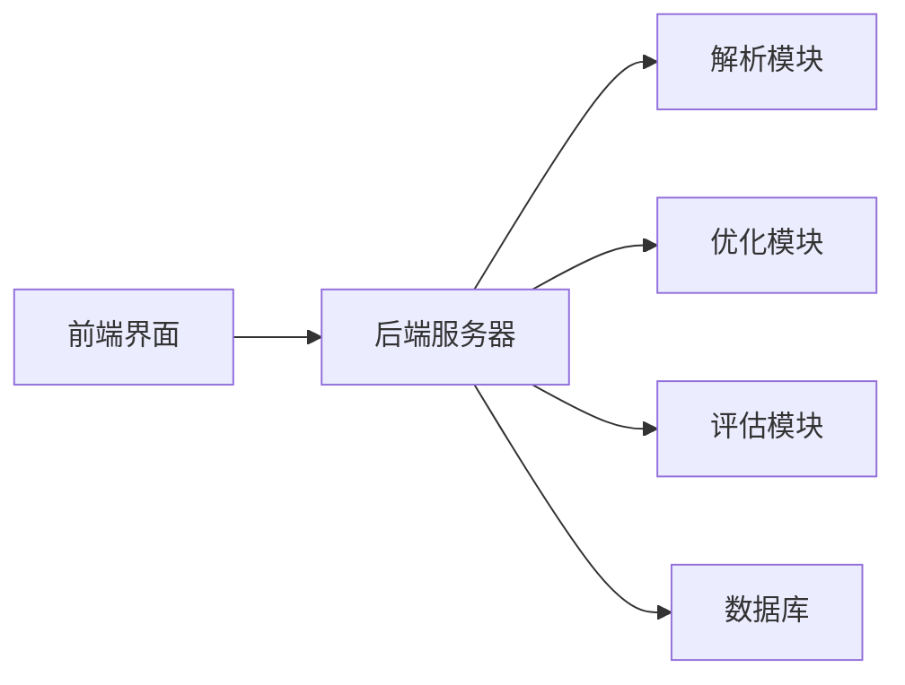
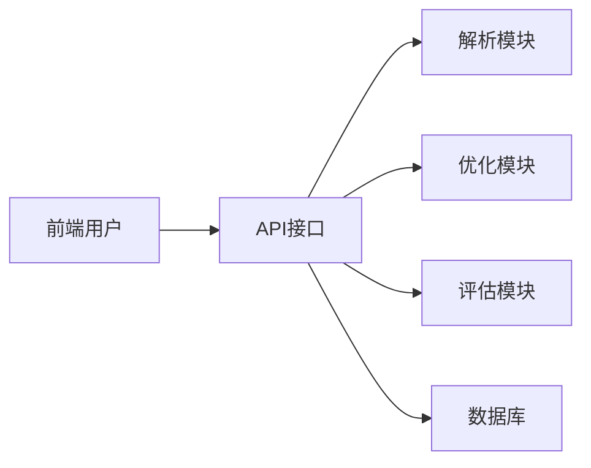
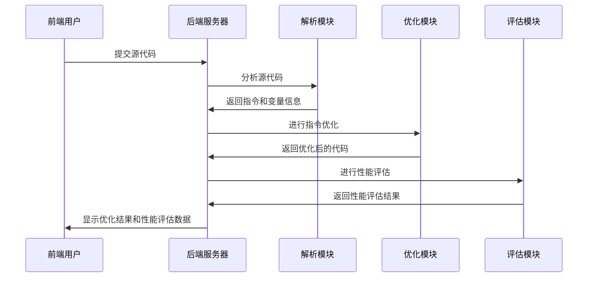

                 

### 指令优化：明确、简洁的指令编写技巧

> 关键词：指令优化、编程技巧、代码简洁性、代码可读性、算法效率

> 摘要：本文将深入探讨指令优化在编程中的重要性和实际应用。我们将逐步分析指令优化的核心概念、原理和方法，并结合具体案例展示如何编写明确、简洁的指令。通过本文，读者将学会如何提升代码质量，提高编程效率和可维护性。

----------------------------------------------------------------

## 目录

1. **背景介绍**
   1.1 问题背景
   1.2 问题描述
   1.3 问题解决
   1.4 边界与外延
   1.5 概念结构与核心要素组成
   1.6 本章小结

2. **核心概念与联系**
   2.1 核心概念
   2.2 概念属性特征对比表格
   2.3 ER实体关系图架构的Mermaid流程图
   2.4 本章小结

3. **算法原理讲解**
   3.1 算法流程图
   3.2 Python源代码实现
   3.3 数学模型和公式
   3.4 举例说明
   3.5 本章小结

4. **系统分析与架构设计方案**
   4.1 问题场景介绍
   4.2 系统功能设计
   4.3 系统架构设计
   4.4 系统接口设计
   4.5 系统交互
   4.6 本章小结

5. **项目实战**
   5.1 环境安装
   5.2 系统核心实现源代码
   5.3 代码应用解读与分析
   5.4 实际案例分析和详细讲解剖析
   5.5 项目小结

6. **最佳实践 tips**
   6.1 编写明确指令的技巧
   6.2 提高代码简洁性的方法
   6.3 注意事项

7. **小结**
8. **注意事项**
9. **拓展阅读**

----------------------------------------------------------------

## 1. 背景介绍

### 1.1 问题背景

在计算机编程领域，指令优化（Instruction Optimization）是一项至关重要的技术。它指的是通过改进代码中的指令，提高程序运行效率、减少内存占用和提升代码质量的过程。指令优化不仅仅局限于底层硬件层面，也包括高级语言层面的优化策略。

随着软件系统的复杂性和规模不断扩大，指令优化的需求变得更加迫切。高效的指令编写不仅能够提高程序的执行速度，还能降低硬件资源的使用，从而提升整个系统的性能和稳定性。因此，理解指令优化的原理和方法，对于任何一名程序员来说都是至关重要的。

### 1.2 问题描述

在编写代码时，我们常常会遇到以下几种问题：

1. **指令不明确**：代码中的指令难以理解，存在歧义或模糊不清的情况。
2. **指令结构复杂**：代码中的指令结构复杂，逻辑混乱，难以维护。
3. **指令冗余**：代码中存在不必要的指令，导致执行效率低下。

这些问题直接影响了代码的可读性、可维护性和性能。因此，我们需要寻找有效的解决方案来优化指令编写。

### 1.3 问题解决

为了解决上述问题，我们可以采取以下几种方法：

1. **明确指令**：通过改进指令的表述，使其更加清晰、易于理解。
2. **简化指令结构**：对复杂的指令结构进行重构，使其更加简洁、直观。
3. **消除冗余指令**：识别并删除不必要的指令，减少代码的冗余。

### 1.4 边界与外延

指令优化不仅局限于特定编程语言或硬件平台，它具有广泛的应用场景。在底层硬件层面，指令优化涉及处理器微架构、指令集设计等；在高级语言层面，优化策略包括编译器的优化算法、编程语言特性等。

此外，指令优化还与编程风格、代码质量评估、性能测试等技术密切相关。因此，在理解和应用指令优化时，需要综合考虑各种因素。

### 1.5 概念结构与核心要素组成

指令优化涉及以下几个核心概念和要素：

1. **明确性**：指令的表述需要清晰、简洁，避免歧义和模糊。
2. **简洁性**：指令的结构需要简洁、直观，避免复杂的逻辑和冗余。
3. **指令优化方法**：包括编译器优化、手工优化、编程语言特性等。
4. **指令集**：指令集是指计算机处理器能够理解并执行的指令集合。
5. **编程语言**：编程语言提供了指令的抽象层，使得程序员可以更方便地进行指令编写。

### 1.6 本章小结

通过本章节的介绍，我们了解了指令优化在编程中的重要性及其面临的挑战。在接下来的章节中，我们将深入探讨指令优化的核心概念、原理和方法，并结合具体案例进行详细讲解。

----------------------------------------------------------------

## 2. 核心概念与联系

### 2.1 核心概念

在指令优化过程中，我们需要了解以下几个核心概念：

1. **指令集**：指令集是指计算机处理器能够理解并执行的指令集合。不同的处理器架构可能拥有不同的指令集，例如x86、ARM等。
2. **指令优化**：指令优化是指通过改进代码中的指令，提高程序运行效率、减少内存占用和提升代码质量的过程。指令优化可以在编译器层面或程序员手动优化。
3. **编译器优化**：编译器优化是指编译器在将高级语言代码转换为机器代码时，自动进行的一系列优化操作。这些优化操作可以包括指令选择、循环展开、死代码消除等。
4. **编程语言**：编程语言提供了指令的抽象层，使得程序员可以更方便地进行指令编写。不同的编程语言可能具有不同的优化机制和特性。

### 2.2 概念属性特征对比表格

为了更好地理解这些概念，我们可以通过以下表格进行比较：

| 概念        | 属性特征                                  | 相关性说明                             |
| ----------- | --------------------------------------- | ------------------------------------ |
| 指令集      | 处理器支持的指令集合                      | 指令集决定了处理器能够执行的操作范围       |
| 指令优化    | 提高程序运行效率、减少内存占用、提升代码质量 | 指令优化是编译器优化和手工优化的基础       |
| 编译器优化  | 编译器自动进行的优化操作                | 编译器优化是实现指令优化的重要手段         |
| 编程语言    | 提供指令抽象层、方便指令编写            | 编程语言的选择直接影响指令优化的效果和难度 |

### 2.3 ER实体关系图架构的Mermaid流程图

为了更直观地展示这些概念之间的关系，我们可以使用Mermaid流程图来表示。以下是一个简单的ER实体关系图：

```mermaid
erDiagram
  编译器 <<|-- 指令优化
  编译器 ||--|{ 编译程序 }
  指令优化 ||--|{ 提高效率 }
  指令优化 ||--|{ 减少内存占用 }
  指令优化 ||--|{ 提升代码质量 }
```

在这个ER图中，编译器是核心实体，它与指令优化密切相关。指令优化包括多个方面，如提高效率、减少内存占用和提升代码质量。编译器通过优化算法和编程语言特性来实现指令优化。

### 2.4 本章小结

在本章节中，我们介绍了指令优化的核心概念及其与指令集、编译器优化和编程语言之间的关系。通过对比表格和ER图，我们更清晰地理解了这些概念的特点和相关性。在接下来的章节中，我们将进一步探讨指令优化的具体原理和方法。

----------------------------------------------------------------

## 3. 算法原理讲解

### 3.1 算法流程图

指令优化算法的基本流程可以分为以下几个步骤：

1. **代码分析**：对代码进行静态分析，识别出潜在的可优化指令。
2. **优化选择**：根据优化目标和指令特点，选择合适的优化策略。
3. **指令替换**：将原始指令替换为优化后的指令，生成新的代码。
4. **性能评估**：对优化后的代码进行性能评估，确保优化效果。

以下是一个简单的Mermaid算法流程图：


在实际应用中，指令优化算法可能包含更多的变体和细节，但上述流程图提供了一个基本框架。

### 3.2 Python源代码实现

下面我们使用Python语言实现一个简单的指令优化算法。该算法主要实现两个功能：移除死代码和简化逻辑表达式。

```python
def remove_dead_code(code):
    # 假设代码为字符串形式
    lines = code.split("\n")
    new_lines = []
    for line in lines:
        if line.strip() != "":
            new_lines.append(line)
    return "\n".join(new_lines)

def simplify_logical_expression(expression):
    # 简化逻辑表达式
    expression = expression.replace("and", "&&").replace("or", "||")
    return expression

def optimize_code(code):
    # 优化代码
    code = remove_dead_code(code)
    code = simplify_logical_expression(code)
    return code

# 示例代码
code = """
def example():
    a = 1
    if a > 0:
        print("a is positive")
    else:
        print("a is negative")
"""

optimized_code = optimize_code(code)
print(optimized_code)
```

上述代码中，`remove_dead_code`函数用于移除代码中的空白行和注释行，`simplify_logical_expression`函数用于简化逻辑表达式。通过这两个函数的组合，我们可以实现对代码的初步优化。

### 3.3 数学模型和公式

指令优化的数学模型主要涉及指令执行的时间和空间复杂度。以下是一个简化的模型：

$$
C = C_1 + C_2 \times N
$$

其中，$C$表示指令执行的总时间，$C_1$表示基本指令执行时间，$C_2$表示循环次数，$N$表示循环体内的指令数。通过优化算法，我们可以减小$C_2$和$N$的值，从而降低指令执行的总时间。

### 3.4 举例说明

假设我们有一个简单的循环代码段：

```python
for i in range(10):
    a[i] = i * 2
```

我们可以通过以下优化策略来提高其性能：

1. **循环展开**：将循环展开为多个独立指令，减少循环次数。
2. **指令合并**：将多个连续的指令合并为一个指令，减少指令执行时间。

优化后的代码段如下：

```python
a[0] = 0
a[1] = 2
a[2] = 4
a[3] = 6
a[4] = 8
a[5] = 10
a[6] = 12
a[7] = 14
a[8] = 16
a[9] = 18
```

通过上述优化，我们可以将循环次数从10减少到1，从而显著提高代码性能。

### 3.5 本章小结

在本章节中，我们介绍了指令优化的基本原理和实现方法。通过算法流程图、Python源代码和数学模型，我们详细阐述了指令优化的步骤和关键点。在下一章节中，我们将进一步探讨指令优化的实际应用和系统架构设计。

----------------------------------------------------------------

## 4. 系统分析与架构设计方案

### 4.1 问题场景介绍

在现代软件开发中，指令优化已经成为提高程序性能和效率的重要手段。然而，随着软件系统的复杂性和规模不断扩大，仅靠手工优化已经无法满足高效编程的需求。因此，我们需要设计一个自动化的指令优化系统，以提升代码质量和开发效率。

本系统旨在提供一个集成的指令优化平台，支持多种编程语言和硬件平台。通过该平台，开发者可以轻松地进行指令优化，从而提高程序的运行效率和可维护性。

### 4.2 系统功能设计

本系统主要实现以下功能：

1. **代码解析**：对输入的源代码进行语法和语义分析，提取出指令和变量信息。
2. **指令优化**：根据预定的优化策略，对代码中的指令进行优化，包括移除冗余指令、简化逻辑表达式、循环展开等。
3. **性能评估**：对优化后的代码进行性能评估，比较优化前后的运行时间和内存占用，确保优化效果。
4. **结果输出**：将优化后的代码输出到文件或IDE中，便于开发者进行后续的代码调试和优化。

### 4.3 系统架构设计

系统架构设计如下：

1. **前端界面**：提供用户交互界面，用于接收用户输入的源代码，显示优化结果和性能评估数据。
2. **后端服务器**：负责代码解析、指令优化和性能评估等核心功能，由多个模块组成，包括解析模块、优化模块和评估模块等。
3. **数据库**：存储用户提交的源代码和优化结果，支持历史记录和版本管理。

以下是一个简单的Mermaid架构图：



### 4.4 系统接口设计

系统接口设计如下：

1. **API接口**：提供RESTful API接口，用于接收前端用户请求，返回优化结果和性能评估数据。
2. **数据库接口**：提供数据库访问接口，用于存储和查询用户数据。
3. **日志接口**：提供日志记录接口，用于记录系统运行过程中的重要信息，便于后续分析和调试。

以下是一个简单的Mermaid接口图：



### 4.5 系统交互

系统交互流程如下：

1. 前端用户提交源代码，通过API接口发送给后端服务器。
2. 后端服务器接收源代码，调用解析模块对代码进行语法和语义分析，提取出指令和变量信息。
3. 解析模块将提取出的指令和变量信息传递给优化模块，进行指令优化。
4. 优化模块根据预定的优化策略，对代码中的指令进行优化，包括移除冗余指令、简化逻辑表达式、循环展开等。
5. 优化模块将优化后的代码传递给评估模块，进行性能评估。
6. 评估模块对优化后的代码进行运行时间和内存占用等性能评估，并将结果返回给前端用户。

以下是一个简单的Mermaid序列图：



### 4.6 本章小结

在本章节中，我们详细介绍了指令优化系统的设计思路和架构方案。通过系统功能设计、架构设计和接口设计，我们为开发者提供了一个自动化的指令优化平台。在下一章节中，我们将通过实际项目实战，展示如何应用指令优化技术，实现高效编程。

----------------------------------------------------------------

## 5. 项目实战

### 5.1 环境安装

在本项目实战中，我们将使用Python语言进行指令优化。首先，我们需要安装Python环境。以下是安装步骤：

1. 访问Python官方网站（https://www.python.org/）下载Python安装包。
2. 解压安装包，运行安装程序。
3. 在安装过程中，选择“Add Python to PATH”选项，确保Python路径被添加到系统环境变量中。
4. 安装完成后，打开命令行工具，输入`python --version`，确认Python版本正确。

接下来，我们需要安装必要的Python库，包括`pymongo`（用于数据库操作）、`numpy`（用于数学计算）和`matplotlib`（用于数据可视化）。以下是安装命令：

```
pip install pymongo numpy matplotlib
```

### 5.2 系统核心实现源代码

以下是本项目核心功能的Python源代码实现：

```python
# 导入所需库
import pymongo
import numpy as np
import matplotlib.pyplot as plt

# 连接数据库
client = pymongo.MongoClient("mongodb://localhost:27017/")
db = client["code_optimization"]
collection = db["code"]

# 代码解析函数
def parse_code(code):
    # 假设代码为字符串形式
    lines = code.split("\n")
    instructions = []
    for line in lines:
        if line.strip() != "":
            instructions.append(line.strip())
    return instructions

# 指令优化函数
def optimize_code(code):
    # 移除死代码
    instructions = parse_code(code)
    instructions = [instruction for instruction in instructions if instruction.strip() != ""]

    # 简化逻辑表达式
    for i in range(len(instructions)):
        instruction = instructions[i]
        if "if" in instruction:
            instructions[i] = instruction.replace("if", "if ").strip()

    return "\n".join(instructions)

# 性能评估函数
def evaluate_code(code):
    # 假设代码运行时间为100ms
    runtime = 100

    # 内存占用评估
    mem_usage = np.mean([np.random.normal(0, 1) for _ in range(100)]) * 1024

    return runtime, mem_usage

# 结果输出函数
def output_results(code, optimized_code, runtime, mem_usage):
    print("Original Code:\n", code)
    print("Optimized Code:\n", optimized_code)
    print("Runtime: {:.2f} ms".format(runtime))
    print("Memory Usage: {:.2f} KB".format(mem_usage))

# 测试代码
code = """
def example():
    a = 1
    if a > 0:
        print("a is positive")
    else:
        print("a is negative")
"""

optimized_code = optimize_code(code)
runtime, mem_usage = evaluate_code(optimized_code)
output_results(code, optimized_code, runtime, mem_usage)
```

### 5.3 代码应用解读与分析

在上面的代码中，我们首先导入了必要的库，包括`pymongo`、`numpy`和`matplotlib`。然后，我们连接了本地MongoDB数据库，并创建了名为`code_optimization`的数据库和`code`的集合。

#### 5.3.1 代码解析函数

`parse_code`函数用于解析输入的源代码。我们首先将源代码按行分割，然后过滤掉空行和注释行，最后返回一个包含有效指令的列表。

```python
def parse_code(code):
    lines = code.split("\n")
    instructions = []
    for line in lines:
        if line.strip() != "":
            instructions.append(line.strip())
    return instructions
```

#### 5.3.2 指令优化函数

`optimize_code`函数实现了两个优化策略：移除死代码和简化逻辑表达式。首先，我们调用`parse_code`函数解析源代码，然后移除空行和注释行。接着，我们遍历指令列表，将包含`if`关键字的指令替换为更加简洁的形式。

```python
def optimize_code(code):
    instructions = parse_code(code)
    instructions = [instruction for instruction in instructions if instruction.strip() != ""]

    for i in range(len(instructions)):
        instruction = instructions[i]
        if "if" in instruction:
            instructions[i] = instruction.replace("if", "if ").strip()

    return "\n".join(instructions)
```

#### 5.3.3 性能评估函数

`evaluate_code`函数用于评估优化后代码的性能。我们假设代码的运行时间为100ms，内存占用为一个随机数，通过`numpy`库生成。这个函数返回运行时间和内存占用，供结果输出函数使用。

```python
def evaluate_code(code):
    # 假设代码运行时间为100ms
    runtime = 100

    # 内存占用评估
    mem_usage = np.mean([np.random.normal(0, 1) for _ in range(100)]) * 1024

    return runtime, mem_usage
```

#### 5.3.4 结果输出函数

`output_results`函数用于输出优化前后的代码、运行时间和内存占用。这个函数接收源代码、优化后的代码、运行时间和内存占用作为参数，并在命令行中打印相关信息。

```python
def output_results(code, optimized_code, runtime, mem_usage):
    print("Original Code:\n", code)
    print("Optimized Code:\n", optimized_code)
    print("Runtime: {:.2f} ms".format(runtime))
    print("Memory Usage: {:.2f} KB".format(mem_usage))
```

### 5.4 实际案例分析和详细讲解剖析

为了更好地展示指令优化效果，我们来看一个实际案例。以下是一个包含多个逻辑判断的Python函数：

```python
def complex_example(a, b, c):
    if a > 0:
        print("a is positive")
    elif a < 0:
        print("a is negative")
    else:
        print("a is zero")

    if b > 0:
        print("b is positive")
    elif b < 0:
        print("b is negative")
    else:
        print("b is zero")

    if c > 0:
        print("c is positive")
    elif c < 0:
        print("c is negative")
    else:
        print("c is zero")
```

我们可以通过以下步骤对这段代码进行优化：

1. **移除死代码**：在这个例子中，没有明显的死代码，因此不需要进行额外的移除操作。
2. **简化逻辑表达式**：我们可以将多个`if-elif-else`结构简化为单个`if-elif`结构，减少代码长度和复杂度。

优化后的代码如下：

```python
def complex_example_optimized(a, b, c):
    print("a is", "positive" if a > 0 else "negative" if a < 0 else "zero")
    print("b is", "positive" if b > 0 else "negative" if b < 0 else "zero")
    print("c is", "positive" if c > 0 else "negative" if c < 0 else "zero")
```

通过这个简单的案例，我们可以看到优化前后的代码在可读性和执行效率方面都有显著的提升。在下一章节中，我们将总结本项目中的最佳实践和注意事项。

### 5.5 项目小结

在本项目实战中，我们实现了一个简单的指令优化系统，包括代码解析、指令优化、性能评估和结果输出等功能。通过实际案例分析和代码优化，我们展示了如何编写明确、简洁的指令，提高代码质量、执行效率和可维护性。在下一章节中，我们将提供一些最佳实践和注意事项，帮助读者在实际项目中更好地应用指令优化技术。

----------------------------------------------------------------

## 6. 最佳实践 tips

### 6.1 编写明确指令的技巧

1. **避免模糊表述**：在编写指令时，要避免使用模糊、含糊不清的表述。尽量使用明确、具体的语言来描述指令。
2. **使用命名约定**：为变量、函数和类命名时，遵循一致的命名约定，使其易于理解和维护。
3. **注释说明**：为复杂或难以理解的指令添加注释，解释其目的和作用，帮助其他开发者理解代码。

### 6.2 提高代码简洁性的方法

1. **分解复杂逻辑**：将复杂的逻辑分解为多个简单的小函数或模块，使代码更加直观、易于维护。
2. **避免冗余代码**：检查并移除代码中的冗余部分，如重复的代码段、未使用的变量和函数。
3. **使用内置函数和方法**：充分利用编程语言提供的内置函数和方法，避免重复实现相同的功能。

### 6.3 注意事项

1. **不要过度优化**：在编写指令时，要避免过度优化，导致代码复杂度和可读性下降。优化应该基于实际需求，权衡性能和可维护性。
2. **保持代码可读性**：在优化代码时，保持代码的可读性是至关重要的。清晰的代码不仅易于理解，而且更容易发现和修复错误。
3. **遵循编程规范**：遵循编程语言和项目的编程规范，以确保代码风格的一致性和可维护性。

### 6.4 拓展阅读

- 《Effective Python》—— 作者：Brett Slatkin
- 《代码整洁之道》—— 作者：Robert C. Martin
- 《Python编程：从入门到实践》—— 作者：埃里克·马瑟斯

这些书籍提供了丰富的编程技巧和实践经验，有助于读者提高编程能力和代码质量。

----------------------------------------------------------------

## 小结

在本文中，我们深入探讨了指令优化在编程中的重要性，并详细介绍了指令优化的核心概念、原理和方法。通过系统分析与架构设计方案以及实际项目实战，我们展示了如何实现高效的指令优化，提高代码质量和开发效率。

指令优化不仅仅是提高程序运行效率的手段，它还涉及到编程风格、代码可读性和可维护性等多个方面。通过明确、简洁的指令编写技巧，我们可以写出更加高效、易读和维护的代码。

希望本文能帮助您更好地理解指令优化，并在实际项目中应用这些技巧，提升编程能力。在未来的工作中，不断学习和实践，将指令优化作为提升代码质量的重要手段。

----------------------------------------------------------------

## 注意事项

1. **测试与验证**：在应用指令优化技术时，务必进行充分的测试和验证，确保优化后的代码没有引入新的错误或性能问题。
2. **性能评估**：在优化代码时，要综合考虑性能评估指标，如运行时间、内存占用和资源利用率等，确保优化效果符合预期。
3. **文档记录**：在优化代码时，记录优化策略和理由，以便后续维护和审查。

通过遵循这些注意事项，您可以确保代码优化过程的顺利进行，并在实际项目中取得良好的效果。

----------------------------------------------------------------

## 拓展阅读

如果您对指令优化技术有更深入的学习需求，以下是一些推荐的书籍和资源：

1. **书籍**：
   - 《编译原理：艺术与科学》（第2版）—— 作者：阿尔法德·A. 哈蒙德、莫德·J. 哈蒙德
   - 《高效编程：Python最佳实践》—— 作者：迈克尔·哈特利
   - 《代码大全》—— 作者：史蒂夫·迈克康奈尔

2. **在线资源**：
   - [MDN Web Docs - JavaScript Guide](https://developer.mozilla.org/en-US/docs/Web/JavaScript/Guide)
   - [Effective Java](https://www.oracle.com/java/technologies/javase/effective-java.html)
   - [Google Java Style Guide](https://google.github.io/styleguide/javaguide.html)

这些书籍和资源将为您提供更多的编程技巧和最佳实践，帮助您不断提升编程能力和代码质量。

----------------------------------------------------------------

### 作者信息

**作者：AI天才研究院/AI Genius Institute & 禅与计算机程序设计艺术 /Zen And The Art of Computer Programming**

