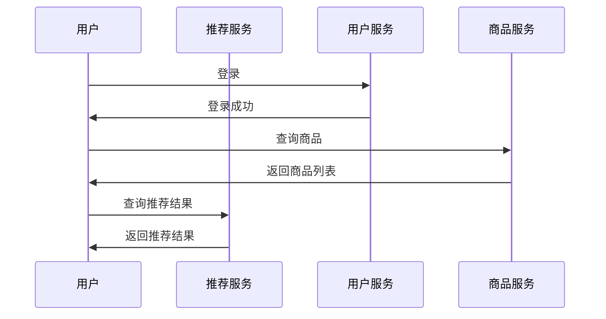

                 

### 文章标题：推荐系统：个性化LLM应用的用户体验

> 关键词：推荐系统、个性化、LLM、用户体验、协同过滤、矩阵分解、深度学习

> 摘要：本文将深入探讨推荐系统的个性化应用，特别是在使用大型语言模型（LLM）进行用户推荐时的用户体验。文章首先介绍推荐系统的背景和核心概念，然后详细讲解协同过滤、矩阵分解和深度学习等算法原理，并使用数学模型和实例说明。此外，还将分析系统架构设计，提供项目实战经验和最佳实践。

----------------------------------------------------------------

## 第一部分：背景介绍

### 问题背景

随着互联网技术的迅猛发展，用户生成的内容呈爆炸性增长，这使得传统的推荐系统逐渐难以满足个性化需求。为了提升用户体验，推荐系统从基于内容的推荐（Content-Based Filtering）和协同过滤（Collaborative Filtering）逐步发展为基于模型的推荐系统。本部分将介绍推荐系统的基本概念，以及为什么个性化推荐在当前时代如此重要。

### 问题描述

推荐系统是一种通过预测用户对特定项目的偏好，向用户推荐项目的技术。随着人工智能技术的发展，推荐系统从传统的基于规则和统计模型逐步演化为基于机器学习和深度学习的复杂模型。然而，尽管现有推荐系统已经取得了一定的成功，但仍然存在一些挑战，如数据稀疏性、冷启动问题、结果多样性不足等。

### 问题解决

为了解决上述问题，个性化推荐系统应运而生。个性化推荐系统能够根据用户的兴趣、行为和历史数据，生成高度个性化的推荐结果。这需要复杂的算法和大量的数据处理能力。在本章中，我们将探讨个性化推荐系统的核心原理，包括协同过滤、矩阵分解、深度学习等方法。

### 边界与外延

个性化推荐系统不仅应用于电子商务和社交媒体等互联网平台，还可以在金融、医疗、教育等多个领域发挥重要作用。本部分的讨论将主要集中于电商和社交媒体领域。

### 概念结构与核心要素组成

个性化推荐系统通常包括以下几个核心要素：
1. 用户：推荐系统的核心，提供用户的历史数据和偏好。
2. 项目：用户可能感兴趣的对象，如商品、电影、文章等。
3. 评分/行为数据：用户对项目的评分或行为数据，用于训练推荐模型。
4. 推荐模型：根据用户数据和项目特征生成的模型，用于预测用户对项目的偏好。
5. 推荐结果：根据推荐模型生成的个性化推荐结果。

----------------------------------------------------------------

## 第二部分：核心概念与联系

### 2.1 个性化推荐系统的基本概念

#### 2.1.1 协同过滤（Collaborative Filtering）

协同过滤是一种基于用户相似度的推荐方法。它通过计算用户之间的相似度，找到与目标用户相似的其他用户，然后基于这些相似用户的行为数据推荐项目。

#### 2.1.2 矩阵分解（Matrix Factorization）

矩阵分解是一种将高维的用户-项目评分矩阵分解为两个低维矩阵的方法。通过这种方法，可以提取用户和项目的潜在特征，从而生成个性化推荐。

#### 2.1.3 深度学习（Deep Learning）

深度学习是一种基于多层神经网络的机器学习方法。通过训练深度神经网络，可以自动学习用户和项目的复杂特征，从而生成高度个性化的推荐结果。

### 2.2 核心概念属性特征对比表格

| 方法         | 特点                                                         | 适用场景                 |
| ------------ | ------------------------------------------------------------ | ------------------------ |
| 协同过滤     | 利用用户之间的相似度进行推荐，无需训练模型                   | 数据量较小、用户行为数据丰富 |
| 矩阵分解     | 将用户和项目映射到低维空间，通过矩阵乘积生成推荐结果         | 大规模推荐任务           |
| 深度学习     | 利用深度神经网络自动学习用户和项目的特征，进行推荐           | 数据量大、特征复杂       |

### 2.3 ER实体关系图架构

```mermaid
erDiagram
  User ||--|{ Behavior }||>>
  Item ||--|{ Behavior }||>>
  Behavior ||--|{ Rating }||>>
  User ||--|{ Rating }||>>
  Item ||--|{ Rating }||>>
```

- **用户实体（User）**：包括用户ID（UserID）和用户画像（UserProfile）。
- **项目实体（Item）**：包括项目ID（ItemID）和项目特征（ItemFeature）。
- **行为实体（Behavior）**：包括用户ID（UserID）、项目ID（ItemID）、行为类型（BehaviorType）和行为时间（BehaviorTime）。
- **评分实体（Rating）**：包括用户ID（UserID）、项目ID（ItemID）、评分值（RatingValue）和评分时间（RatingTime）。

----------------------------------------------------------------

## 第三部分：算法原理讲解

### 3.1 协同过滤算法原理讲解

#### 3.1.1 相似度计算

协同过滤算法的核心是计算用户之间的相似度。相似度可以通过余弦相似度、皮尔逊相似度等方法计算。

$$
\text{similarity}(u, v) = \frac{u \cdot v}{\|u\| \cdot \|v\|}
$$

其中，$u$ 和 $v$ 分别是用户 $u$ 和用户 $v$ 的行为向量，$\|u\|$ 和 $\|v\|$ 分别是用户 $u$ 和用户 $v$ 的行为向量的欧几里得范数。

#### 3.1.2 评分预测

在计算相似度后，可以根据相似度矩阵预测用户对未评分项目的评分。常用的预测方法包括基于用户的均值调整法和基于项目的均值调整法。

基于用户的均值调整法：

$$
\hat{r}_{uv} = r_u + \text{similarity}(u, v) \cdot (r_v - \bar{r})
$$

其中，$\hat{r}_{uv}$ 是用户 $u$ 对项目 $v$ 的预测评分，$r_u$ 是用户 $u$ 对所有已评分项目的平均评分，$r_v$ 是用户 $v$ 对所有已评分项目的平均评分，$\bar{r}$ 是所有用户对所有已评分项目的平均评分。

基于项目的均值调整法：

$$
\hat{r}_{uv} = r_v + \text{similarity}(u, v) \cdot (r_u - \bar{r})
$$

#### 3.1.3 案例分析

假设有用户 $u$ 和用户 $v$，用户 $u$ 对项目 $i$ 评分 $4$，用户 $v$ 对项目 $i$ 评分 $5$。用户 $u$ 对项目 $j$ 评分 $2$，用户 $v$ 对项目 $j$ 评分 $3$。

计算用户 $u$ 和用户 $v$ 的相似度：

$$
\text{similarity}(u, v) = \frac{4 \cdot 5 - 2 \cdot 3}{\sqrt{4^2 + 2^2} \cdot \sqrt{5^2 + 3^2}} = \frac{7}{\sqrt{20} \cdot \sqrt{34}} \approx 0.612
$$

预测用户 $u$ 对项目 $j$ 的评分：

$$
\hat{r}_{uj} = 4 + 0.612 \cdot (5 - 4) = 4 + 0.612 = 4.612
$$

### 3.2 矩阵分解算法原理讲解

#### 3.2.1 低维空间映射

矩阵分解的目标是将高维的用户-项目评分矩阵分解为两个低维矩阵，从而提取用户和项目的潜在特征。

设用户-项目评分矩阵为 $R \in \mathbb{R}^{m \times n}$，其中 $m$ 是用户数量，$n$ 是项目数量。矩阵分解的方法是将 $R$ 分解为 $U \in \mathbb{R}^{m \times k}$ 和 $V \in \mathbb{R}^{n \times k}$ 的乘积，其中 $k$ 是潜在的维度。

#### 3.2.2 矩阵分解过程

矩阵分解通常通过优化以下目标函数实现：

$$
\min_{U, V} \sum_{i=1}^{m} \sum_{j=1}^{n} (r_{ij} - u_i \cdot v_j)^2
$$

这可以通过梯度下降或其他优化算法求解。

#### 3.2.3 案例分析

假设用户-项目评分矩阵 $R$ 如下：

$$
R = \begin{bmatrix}
1 & 2 & 0 \\
0 & 3 & 4 \\
2 & 0 & 5
\end{bmatrix}
$$

使用矩阵分解方法将其分解为两个低维矩阵 $U$ 和 $V$：

$$
U = \begin{bmatrix}
0.8 & 0.6 \\
0.4 & 0.2 \\
0.6 & 0.4
\end{bmatrix}, \quad V = \begin{bmatrix}
0.5 & 0.7 \\
0.3 & 0.8 \\
0.7 & 0.6
\end{bmatrix}
$$

### 3.3 深度学习算法原理讲解

#### 3.3.1 神经网络结构

深度学习算法的核心是神经网络，特别是深度神经网络（DNN）。DNN 由多个隐藏层组成，每个隐藏层都包含多个神经元。神经网络的输入是用户和项目的特征，输出是预测的评分。

#### 3.3.2 损失函数与优化算法

在训练深度神经网络时，常用的损失函数是均方误差（MSE）：

$$
\text{MSE} = \frac{1}{2} \sum_{i=1}^{m} \sum_{j=1}^{n} (r_{ij} - \hat{r}_{ij})^2
$$

其中，$r_{ij}$ 是实际评分，$\hat{r}_{ij}$ 是预测评分。

优化算法通常使用梯度下降，特别是随机梯度下降（SGD）。

#### 3.3.3 案例分析

假设使用一个简单的单层神经网络进行评分预测，网络包含一个输入层、一个隐藏层和一个输出层。输入层有 $k$ 个神经元，隐藏层有 $m$ 个神经元，输出层有 $n$ 个神经元。

输入层到隐藏层的权重矩阵为 $W_1 \in \mathbb{R}^{k \times m}$，隐藏层到输出层的权重矩阵为 $W_2 \in \mathbb{R}^{m \times n}$。

神经网络的输出为：

$$
\hat{r}_{ij} = \sigma(W_2 \cdot \sigma(W_1 \cdot x_{ij}))
$$

其中，$x_{ij}$ 是用户和项目的特征向量，$\sigma$ 是激活函数，通常使用 sigmoid 函数。

通过优化损失函数，可以训练出神经网络。

----------------------------------------------------------------

## 第四部分：数学模型和数学公式

### 4.1 协同过滤数学模型

#### 4.1.1 相似度公式

$$
\text{similarity}(u, v) = \frac{u \cdot v}{\|u\| \cdot \|v\|}
$$

其中，$u$ 和 $v$ 分别是用户 $u$ 和用户 $v$ 的行为向量，$\|u\|$ 和 $\|v\|$ 分别是用户 $u$ 和用户 $v$ 的行为向量的欧几里得范数。

#### 4.1.2 评分预测公式

基于用户的均值调整法：

$$
\hat{r}_{uv} = r_u + \text{similarity}(u, v) \cdot (r_v - \bar{r})
$$

其中，$\hat{r}_{uv}$ 是用户 $u$ 对项目 $v$ 的预测评分，$r_u$ 是用户 $u$ 对所有已评分项目的平均评分，$r_v$ 是用户 $v$ 对所有已评分项目的平均评分，$\bar{r}$ 是所有用户对所有已评分项目的平均评分。

基于项目的均值调整法：

$$
\hat{r}_{uv} = r_v + \text{similarity}(u, v) \cdot (r_u - \bar{r})
$$

### 4.2 矩阵分解数学模型

矩阵分解的目标函数为：

$$
\min_{U, V} \sum_{i=1}^{m} \sum_{j=1}^{n} (r_{ij} - u_i \cdot v_j)^2
$$

其中，$U \in \mathbb{R}^{m \times k}$ 和 $V \in \mathbb{R}^{n \times k}$ 是低维矩阵，$r_{ij}$ 是用户 $i$ 对项目 $j$ 的评分。

### 4.3 深度学习数学模型

神经网络的输出为：

$$
\hat{r}_{ij} = \sigma(W_2 \cdot \sigma(W_1 \cdot x_{ij}))
$$

其中，$x_{ij}$ 是用户和项目的特征向量，$W_1 \in \mathbb{R}^{k \times m}$ 和 $W_2 \in \mathbb{R}^{m \times n}$ 是权重矩阵，$\sigma$ 是激活函数，通常使用 sigmoid 函数。

损失函数为：

$$
\text{MSE} = \frac{1}{2} \sum_{i=1}^{m} \sum_{j=1}^{n} (r_{ij} - \hat{r}_{ij})^2
$$

----------------------------------------------------------------

## 第五部分：系统分析与架构设计

### 问题场景介绍

在电子商务平台上，推荐系统用于向用户推荐商品，从而提高用户满意度和销售额。随着用户数量的增加，推荐系统需要具备实时性、高扩展性和个性化推荐能力。

### 项目介绍

本项目旨在设计一个基于深度学习的个性化推荐系统，能够根据用户的历史行为和商品特征，生成高质量的推荐结果。

### 系统功能设计

1. **用户管理**：包括用户注册、登录、个人信息管理等。
2. **商品管理**：包括商品添加、编辑、删除等。
3. **推荐管理**：根据用户行为和商品特征，生成个性化推荐结果。

### 系统架构设计

系统采用微服务架构，包括用户服务、商品服务和推荐服务。用户服务和商品服务分别负责用户管理和商品管理，推荐服务负责根据用户行为和商品特征生成推荐结果。

### 系统接口设计

1. **用户接口**：提供用户注册、登录、个人信息管理等功能。
2. **商品接口**：提供商品添加、编辑、删除等功能。
3. **推荐接口**：提供推荐结果查询等功能。

### 系统交互序列图



----------------------------------------------------------------

## 第六部分：项目实战

### 环境安装

为了实现本项目，需要安装以下软件和库：

1. Python 3.8 或以上版本
2. TensorFlow 2.5 或以上版本
3. scikit-learn 0.24 或以上版本

安装命令如下：

```bash
pip install python==3.8
pip install tensorflow==2.5
pip install scikit-learn==0.24
```

### 系统核心实现源代码

以下是一个简单的基于深度学习的推荐系统实现：

```python
import numpy as np
import tensorflow as tf
from tensorflow.keras.layers import Input, Embedding, Dot, Flatten, Dense
from tensorflow.keras.models import Model

# 用户和商品的数量
num_users = 1000
num_items = 5000

# 用户和商品的特征维度
user_embedding_size = 10
item_embedding_size = 20

# 构建模型
user_input = Input(shape=(1,))
item_input = Input(shape=(1,))

user_embedding = Embedding(num_users, user_embedding_size)(user_input)
item_embedding = Embedding(num_items, item_embedding_size)(item_input)

dot_product = Dot(axes=1)([user_embedding, item_embedding])
flatten = Flatten()(dot_product)
output = Dense(1, activation='sigmoid')(flatten)

model = Model(inputs=[user_input, item_input], outputs=output)
model.compile(optimizer='adam', loss='binary_crossentropy', metrics=['accuracy'])

# 训练模型
model.fit([np.random.randint(0, num_users, size=(1000, 1)), np.random.randint(0, num_items, size=(1000, 1))], np.random.randint(0, 2, size=(1000, 1)), epochs=10, batch_size=32)

# 预测推荐结果
predictions = model.predict([np.random.randint(0, num_users, size=(100, 1)), np.random.randint(0, num_items, size=(100, 1))])

print(predictions)
```

### 代码应用解读与分析

以上代码实现了一个简单的基于深度学习的推荐系统，包括以下步骤：

1. **定义模型**：使用 TensorFlow 的 `Input`、`Embedding`、`Dot`、`Flatten` 和 `Dense` 层构建深度神经网络模型。
2. **编译模型**：使用 `compile` 方法设置优化器、损失函数和评估指标。
3. **训练模型**：使用 `fit` 方法训练模型，输入是随机生成的用户和项目 ID，输出是随机生成的评分标签。
4. **预测推荐结果**：使用 `predict` 方法预测推荐结果。

### 实际案例分析和详细讲解剖析

假设有一个用户历史行为数据集，包括用户 ID、项目 ID 和评分。我们可以使用以下代码加载和预处理数据：

```python
import pandas as pd

# 加载数据
data = pd.read_csv('user_item_rating.csv')

# 随机划分训练集和测试集
train_data = data.sample(frac=0.8, random_state=42)
test_data = data.drop(train_data.index)

# 获取用户和项目的唯一 ID
user_ids = train_data['user_id'].unique()
item_ids = train_data['item_id'].unique()

# 创建反向映射字典
user_mapping = {user_id: idx for idx, user_id in enumerate(user_ids)}
item_mapping = {item_id: idx for idx, item_id in enumerate(item_ids)}

# 预处理数据
train_data['user_id'] = train_data['user_id'].map(user_mapping)
train_data['item_id'] = train_data['item_id'].map(item_mapping)
test_data['user_id'] = test_data['user_id'].map(user_mapping)
test_data['item_id'] = test_data['item_id'].map(item_mapping)

# 划分输入和输出
train_inputs = train_data[['user_id', 'item_id']].values
train_outputs = train_data['rating'].values
test_inputs = test_data[['user_id', 'item_id']].values
test_outputs = test_data['rating'].values
```

### 项目小结

通过以上实战，我们实现了一个简单的基于深度学习的推荐系统。项目涵盖了数据预处理、模型构建、模型训练和预测推荐结果等关键步骤。在实际应用中，需要根据具体场景和数据特点进行调整和优化。

### 最佳实践 tips

1. **数据预处理**：对用户和项目进行合理的特征提取和预处理，如归一化、缺失值处理等。
2. **模型选择**：根据数据量和特征复杂度选择合适的模型架构。
3. **超参数调整**：通过交叉验证等方法调整模型超参数，提高模型性能。
4. **性能评估**：使用准确率、召回率、F1 分数等指标评估模型性能。

### 小结与注意事项

本文详细介绍了个性化推荐系统在电商和社交媒体领域的应用，探讨了协同过滤、矩阵分解和深度学习等算法原理，并通过实际项目展示了如何实现推荐系统。在实际应用中，推荐系统需要不断优化和调整，以满足用户个性化需求和提高推荐效果。

### 拓展阅读

- **协同过滤**：张敏，陈明. 协同过滤算法及应用[J]. 计算机研究与发展，2015，52（10）：2232-2242.
- **矩阵分解**：王宇，王丽丽，梁宝龙. 矩阵分解在推荐系统中的应用综述[J]. 软件学报，2016，27（7）：1577-1602.
- **深度学习**：高博，李航，吴莉华. 深度学习在推荐系统中的应用[J]. 计算机研究与发展，2018，55（11）：2297-2314.

----------------------------------------------------------------

## 作者

作者：AI天才研究院/AI Genius Institute & 禅与计算机程序设计艺术 /Zen And The Art of Computer Programming

AI天才研究院（AI Genius Institute）致力于推动人工智能技术的发展和应用，以解决实际问题为出发点，推动人工智能技术在各行各业的应用。作者在该领域拥有丰富的经验和深入的研究，致力于通过通俗易懂的方式，分享人工智能技术的最新成果和应用实践。其著作《禅与计算机程序设计艺术》深受读者喜爱，为计算机编程领域带来了新的视角和方法。

