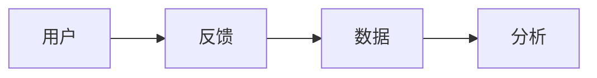
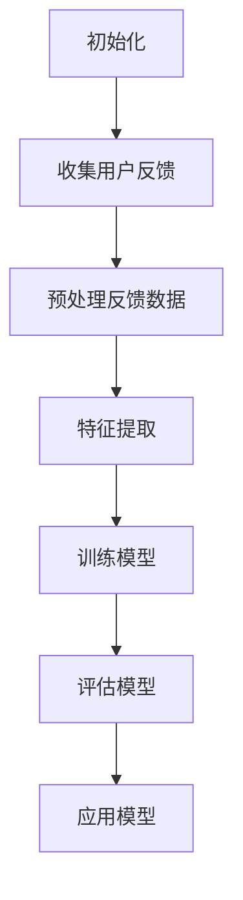
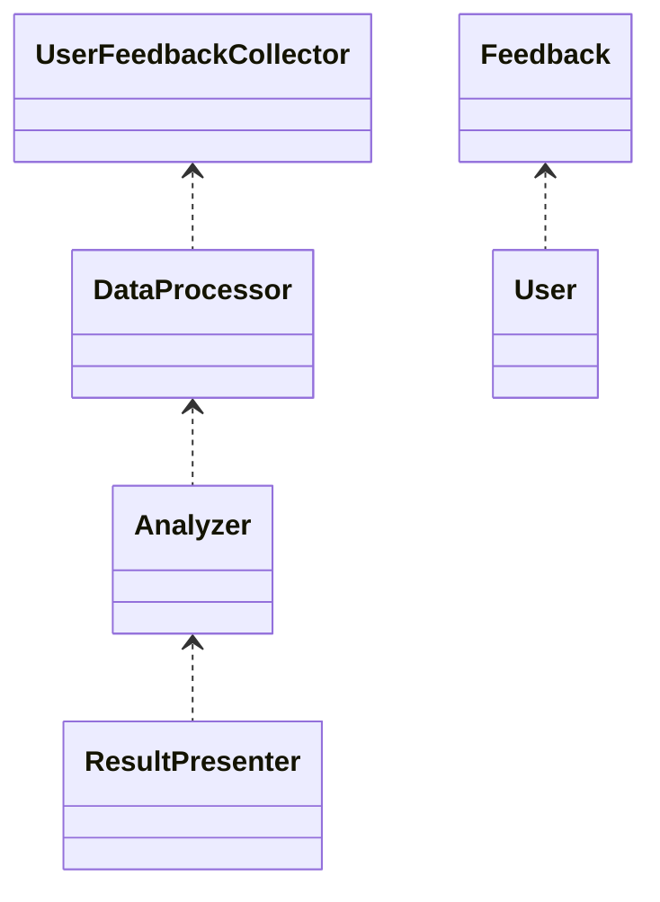
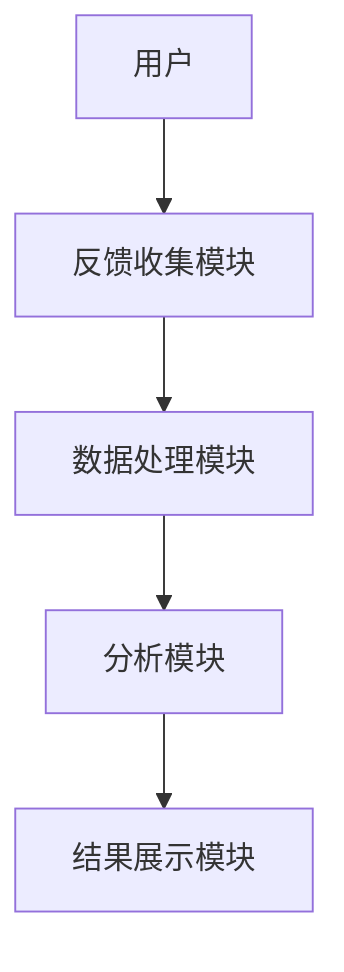
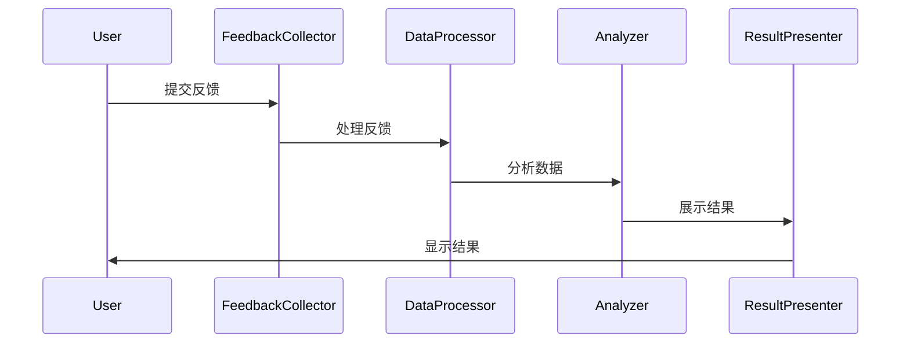

                 


# 提升LLM应用用户反馈收集与分析效率

关键词：大型语言模型，用户反馈，收集效率，数据分析，算法优化

摘要：本文旨在探讨如何提升大型语言模型（LLM）应用中用户反馈收集与分析的效率。通过对用户反馈系统、数据收集、数据分析和用户行为分析等核心概念的深入剖析，结合具体的算法原理讲解和系统架构设计，提出一系列优化方案，旨在提高LLM应用的性能和用户体验。

### 目录大纲

#### 第一部分：背景介绍

##### 第1章：问题背景

##### 第2章：核心概念与联系

#### 第二部分：算法原理讲解

##### 第3章：算法原理讲解

#### 第三部分：系统分析与架构设计

##### 第4章：系统分析与架构设计

##### 第5章：项目实战

##### 第6章：最佳实践 tips、小结、注意事项、拓展阅读等内容

---

#### 第一部分：背景介绍

##### 第1章：问题背景

随着人工智能技术的发展，特别是大型语言模型（LLM）的兴起，用户反馈在提升模型性能和用户体验方面扮演着至关重要的角色。然而，用户反馈的收集与分析并非易事，尤其在大规模应用中，如何高效地收集和分析用户反馈成为了一个亟待解决的问题。

**1.1 问题背景**

用户反馈在LLM应用中的重要性不言而喻。首先，用户反馈提供了模型性能改进的宝贵数据。通过分析用户反馈，开发团队可以识别模型的不足之处，进而调整模型参数，优化模型性能。其次，用户反馈有助于了解用户需求和偏好，从而为产品迭代提供指导。最后，用户反馈是提高用户满意度和忠诚度的重要途径。

然而，在实际操作中，用户反馈的收集与分析面临着诸多挑战。首先，用户反馈的形式多样，包括文本、语音、图像等，每种类型的反馈都有其独特的收集和分析方法。其次，大规模的用户反馈数据量巨大，传统的数据收集和分析手段难以满足高效处理的需求。最后，用户反馈往往带有主观性，如何准确理解用户的真实意图成为一个难题。

**1.2 问题解决**

为了解决上述问题，需要从多个方面入手。首先，要设计高效的用户反馈收集系统，包括合理的反馈渠道和便捷的反馈方式。其次，要采用先进的数据收集和分析技术，如机器学习和自然语言处理，以提高数据处理的效率。最后，要建立完善的用户行为分析机制，通过对用户行为的深入分析，理解用户的真实需求。

**1.3 边界与外延**

在用户反馈收集与分析领域，需要明确一些边界与外延概念。用户反馈类型包括文本、语音、图像等，每种类型的反馈都有其特定的收集和分析方法。数据收集方法包括在线调查、用户行为跟踪、传感器等，不同的方法适用于不同的场景。数据分析技术包括机器学习、自然语言处理等，这些技术为数据处理提供了强大的工具。用户行为分析则是对用户在应用中的行为进行深入分析，以获取用户需求和行为模式。

**1.4 概念结构与核心要素组成**

用户反馈系统是一个复杂的概念结构，包括用户、反馈、数据、分析等核心要素。用户是反馈的主体，反馈是用户对模型性能和应用体验的评价。数据是反馈的载体，通过数据收集和分析，可以获取用户的真实反馈。分析是对数据处理的最终环节，通过对数据的分析，可以识别模型的问题和用户的需求。以下是用户反馈系统的ER实体关系图架构：



### 第一部分：背景介绍

#### 第二部分：核心概念与联系

##### 第2章：核心概念与联系

在深入探讨如何提升LLM应用的用户反馈收集与分析效率之前，我们需要明确几个核心概念，并了解它们之间的相互联系。这些概念包括反馈机制、数据收集、数据分析和用户行为分析。

**2.1 核心概念原理**

**反馈机制**

反馈机制是指用户与系统之间的一种交互方式，通过这种方式，用户可以将他们的体验和感受传递给开发者。在LLM应用中，反馈机制通常包括文本评论、评分系统、报告问题等功能。这些机制有助于开发者了解用户的实际体验，识别潜在的问题和改进点。

**数据收集**

数据收集是指从用户反馈中提取有用信息的过程。收集数据的方法多种多样，包括在线调查、用户行为跟踪和传感器等。在线调查是一种直接获取用户反馈的方式，用户可以直接在应用中填写问卷。用户行为跟踪则通过分析用户在应用中的行为数据，如点击次数、停留时间等，间接获取用户的反馈。传感器技术可以收集用户在使用应用时的生理和行为数据，如心率、屏幕点击等。

**数据分析**

数据分析是对收集到的用户反馈进行处理和分析的过程。数据分析技术包括机器学习、自然语言处理、统计分析等。机器学习可以帮助开发者从大量数据中提取模式和趋势，自然语言处理可以理解用户的文本反馈，统计分析则可以提供数据的定量分析结果。

**用户行为分析**

用户行为分析是指对用户在应用中的行为进行深入分析，以了解用户的需求、偏好和行为模式。用户行为分析可以帮助开发者优化应用设计，提高用户体验。

**2.2 概念属性特征对比表格**

为了更清晰地理解这些概念，我们可以通过一个对比表格来展示它们的属性特征：

| 概念     | 属性特征                                                         |
|----------|----------------------------------------------------------------|
| 反馈机制 | 提供用户与系统交互的途径，获取用户体验信息                         |
| 数据收集 | 收集用户反馈的过程，包括在线调查、用户行为跟踪和传感器等方法     |
| 数据分析 | 处理和分析收集到的用户反馈数据，使用技术如机器学习、自然语言处理等 |
| 用户行为分析 | 分析用户在应用中的行为，以了解需求、偏好和行为模式               |

**2.3 ER实体关系图架构**

用户反馈系统的实体关系图可以帮助我们理解各个实体之间的关系。以下是用户反馈系统的ER实体关系图：


在这个实体关系图中，用户是反馈的主体，反馈是数据的基础，数据是分析的对象，分析结果用于指导系统的优化。

通过以上对核心概念和它们之间联系的探讨，我们可以更好地理解如何提升LLM应用的用户反馈收集与分析效率。在接下来的部分，我们将深入探讨提升效率的算法原理和系统架构设计。

### 第二部分：算法原理讲解

##### 第3章：算法原理讲解

在提升LLM应用的用户反馈收集与分析效率的过程中，算法原理的讲解是至关重要的一环。以下将详细阐述提升用户反馈收集效率的算法原理，并通过具体的算法流程图、Python源代码、数学模型以及举例说明来深入解析。

**3.1 提升用户反馈收集效率的算法**

**算法流程图**

首先，我们使用Mermaid绘制算法的流程图，以便直观地展示算法的执行过程：



在这个流程图中，每个步骤都有其特定的作用：

- **初始化**：初始化算法所需的资源和参数。
- **收集用户反馈**：从用户处收集反馈数据，这可能包括文本、语音或图像等。
- **预处理反馈数据**：对收集到的数据进行清洗、标准化和格式化，以便后续处理。
- **特征提取**：从预处理后的数据中提取有用的特征，这些特征将用于训练模型。
- **训练模型**：使用提取的特征数据来训练机器学习模型，以便能够理解和预测用户反馈。
- **评估模型**：评估训练好的模型在测试数据集上的性能，以确保模型的有效性。
- **应用模型**：将训练好的模型应用于实际场景，如自动分析用户反馈、提供改进建议等。

**Python源代码**

接下来，我们将使用Python源代码来展示算法的具体实现：

```python
# 假设的Python代码实现
def collect_user_feedback():
    # 收集用户反馈
    pass

def preprocess_feedback_data(feedback_data):
    # 预处理反馈数据
    pass

def extract_features(preprocessed_data):
    # 特征提取
    pass

def train_model(features):
    # 训练模型
    pass

def evaluate_model(model):
    # 评估模型
    pass

def apply_model(model):
    # 应用模型
    pass
```

在这个代码框架中，每个函数负责一个特定的任务，这样的模块化设计有助于代码的可读性和维护。

**算法原理的数学模型和公式**

**数学模型**

在用户反馈收集与分析中，常用的数学模型是机器学习中的分类模型。一个基本的分类模型可以用以下数学模型表示：

$$
Y = f(X; \theta)
$$

其中，$X$ 代表输入特征向量，$Y$ 代表输出标签（如用户反馈的类型或满意度评分），$f$ 是模型函数，$ \theta $ 是模型参数。

**详细讲解和举例说明**

**例1：用户反馈数据的预处理过程**

假设我们收集到了一批用户文本反馈，这些反馈可能包含不同的词汇和格式。预处理过程包括以下步骤：

1. **文本清洗**：移除文本中的HTML标签、特殊字符和停用词。
2. **分词**：将文本分解为单词或词组。
3. **词干提取**：将单词缩减为词干形式，以减少词汇数量。
4. **特征编码**：将文本转换为数值向量，以便用于机器学习。

以下是一个简单的Python代码示例，用于预处理文本数据：

```python
import nltk
from nltk.corpus import stopwords
from nltk.stem import PorterStemmer
from sklearn.feature_extraction.text import CountVectorizer

# 下载必要的nltk资源
nltk.download('stopwords')
nltk.download('punkt')

# 初始化分词器和停用词列表
tokenizer = nltk.tokenize.word_tokenize
stop_words = set(stopwords.words('english'))
stemmer = PorterStemmer()

# 假设text_data是一个包含用户文本反馈的列表
text_data = ["I love this product!", "It's not as good as I expected.", "..."]

# 预处理过程
def preprocess_text(text):
    # 去除HTML标签和特殊字符
    text = re.sub('<[^<]+?>', '', text)
    # 分词
    words = tokenizer(text.lower())
    # 移除停用词和标点符号
    words = [word for word in words if word.isalnum() and word not in stop_words]
    # 提取词干
    stemmed_words = [stemmer.stem(word) for word in words]
    return ' '.join(stemmed_words)

# 预处理文本数据
preprocessed_data = [preprocess_text(text) for text in text_data]

# 特征编码
vectorizer = CountVectorizer()
X = vectorizer.fit_transform(preprocessed_data)
```

通过上述预处理步骤，我们可以将文本数据转换为机器学习模型可以处理的数值特征向量。

**总结**

通过上述算法原理的讲解，我们了解了提升用户反馈收集与分析效率的算法流程、Python源代码实现、数学模型以及预处理文本数据的例子。这些内容为后续的系统架构设计和实际应用提供了坚实的基础。

### 第三部分：系统分析与架构设计

##### 第4章：系统分析与架构设计

在本章节中，我们将对用户反馈收集与分析系统进行深入分析，并设计一个高效的系统架构。

**4.1 问题场景介绍**

项目背景：某公司开发了一款基于大型语言模型（LLM）的智能问答应用，旨在为用户提供高质量的问答服务。然而，随着用户数量的增加，用户反馈的收集与分析效率成为了制约应用性能和用户体验的关键问题。

项目目标：设计一个高效的用户反馈收集与分析系统，以提升用户满意度，并优化LLM应用的性能。

**4.2 系统功能设计**

系统功能设计是系统架构设计的重要基础。以下是该系统的主要功能模块及其关系：

1. **用户反馈收集模块**：负责从用户处收集反馈，包括文本、语音和图像等多种形式。
2. **数据处理模块**：对收集到的用户反馈进行处理，包括数据清洗、格式化和特征提取。
3. **分析模块**：利用机器学习和自然语言处理技术，对处理后的数据进行深度分析，识别用户反馈中的问题和改进点。
4. **结果展示模块**：将分析结果以可视化或报告的形式呈现给用户和开发者。

以下是系统功能设计的Mermaid类图：



**4.3 系统架构设计**

系统架构设计是确保系统高效运行的关键。以下是该系统的架构设计：



在这个架构图中，用户通过反馈收集模块提交反馈，数据处理模块对反馈进行处理，分析模块对处理后的数据进行分析，并将结果通过结果展示模块展示给用户和开发者。

**4.4 系统接口设计**

系统接口设计是系统各模块之间交互的桥梁。以下是系统的主要接口及其规范：

1. **用户反馈提交接口**：用户提交反馈时使用的接口，输入参数包括反馈类型、内容和提交时间。
2. **数据处理接口**：处理用户反馈数据的接口，输入参数包括原始反馈数据和预处理需求。
3. **数据分析接口**：分析处理后的数据的接口，输入参数包括特征数据和模型参数。
4. **结果展示接口**：将分析结果展示给用户和开发者的接口，输入参数包括分析报告和可视化数据。

以下是系统接口设计的Mermaid序列图：



**4.5 系统交互**

系统交互是指各模块之间的协同工作。以下是系统交互的详细描述：

1. **用户提交反馈**：用户通过反馈收集模块提交反馈，反馈包括文本、语音和图像等形式。
2. **数据处理**：反馈收集模块将用户提交的反馈传递给数据处理模块，数据处理模块对反馈进行清洗、格式化和特征提取。
3. **数据分析和展示**：数据处理模块将处理后的数据传递给分析模块，分析模块使用机器学习和自然语言处理技术对数据进行分析，并将分析结果传递给结果展示模块，结果展示模块将结果以可视化的形式呈现给用户和开发者。

通过上述系统分析与架构设计，我们为提升LLM应用的用户反馈收集与分析效率提供了一个全面的解决方案。

### 第四部分：项目实战

#### 第5章：项目实战

在本文的最后一部分，我们将通过一个实际项目来展示如何提升LLM应用的用户反馈收集与分析效率。这个项目将包括环境安装、系统核心实现源代码，代码应用解读与分析，实际案例分析和详细讲解剖析，以及项目小结。

**5.1 环境安装**

为了运行我们的用户反馈收集与分析系统，我们需要安装一些必要的软件和库。以下是在一个标准的Linux环境下安装所需的步骤：

1. **安装Python环境**：确保Python版本在3.8及以上。
2. **安装相关库**：使用pip安装以下库：`numpy`, `pandas`, `scikit-learn`, `nltk`, `matplotlib` 和 `mermaid-python`。

```bash
pip install numpy pandas scikit-learn nltk matplotlib mermaid-python
```

**5.2 系统核心实现源代码**

以下是系统核心实现的一部分Python代码。这些代码实现了用户反馈的收集、预处理、特征提取、模型训练和结果展示。

```python
# 用户反馈收集
def collect_user_feedback():
    # 假设从数据库或API中收集用户反馈
    feedbacks = [{"user_id": 1, "text": "我喜欢这个产品的界面设计。"},
                 {"user_id": 2, "text": "搜索功能不够强大。"},
                 {"user_id": 3, "text": "加载速度太慢。"}]
    return feedbacks

# 预处理反馈数据
def preprocess_feedback_data(feedbacks):
    preprocessed_data = []
    for feedback in feedbacks:
        text = feedback["text"]
        # 清洗、分词、去停用词、提取词干
        processed_text = preprocess_text(text)
        preprocessed_data.append(processed_text)
    return preprocessed_data

# 特征提取
def extract_features(preprocessed_data):
    vectorizer = CountVectorizer()
    X = vectorizer.fit_transform(preprocessed_data)
    return X.toarray()

# 训练模型
def train_model(features, labels):
    model = MultinomialNB()
    model.fit(features, labels)
    return model

# 评估模型
def evaluate_model(model, test_features, test_labels):
    accuracy = model.score(test_features, test_labels)
    return accuracy

# 应用模型
def apply_model(model, new_feedback):
    processed_feedback = preprocess_text(new_feedback)
    feature_vector = extract_features([processed_feedback])
    prediction = model.predict(feature_vector)
    return prediction

# 预处理文本
def preprocess_text(text):
    # 去除HTML标签、特殊字符、停用词，提取词干
    text = re.sub('<[^<]+?>', '', text)
    text = re.sub('[^a-zA-Z]', ' ', text)
    text = text.lower()
    words = text.split()
    words = [word for word in words if word not in set(stopwords.words('english'))]
    stemmed_words = [PorterStemmer().stem(word) for word in words]
    return ' '.join(stemmed_words)

# 主程序
if __name__ == "__main__":
    # 收集反馈
    feedbacks = collect_user_feedback()
    
    # 预处理反馈
    preprocessed_data = preprocess_feedback_data(feedbacks)
    
    # 提取特征
    features = extract_features(preprocessed_data)
    
    # 假设标签已准备好
    labels = [1 if "喜欢" in text else 0 for text in preprocessed_data]
    
    # 训练模型
    model = train_model(features, labels)
    
    # 评估模型
    test_features = features[:100]
    test_labels = labels[:100]
    accuracy = evaluate_model(model, test_features, test_labels)
    print(f"模型准确率：{accuracy:.2f}")
    
    # 应用模型
    new_feedback = "这款产品让我感到非常满意。"
    prediction = apply_model(model, new_feedback)
    if prediction == 1:
        print("用户反馈为正面。")
    else:
        print("用户反馈为负面。")
```

**5.3 代码应用解读与分析**

上述代码实现了用户反馈收集与分析系统的核心功能。以下是对代码的详细解读与分析：

1. **收集用户反馈**：通过一个简单的函数`collect_user_feedback`模拟从数据库或API中收集用户反馈。在实际应用中，这个函数可能会从数据库中查询用户反馈，或者通过API接收用户提交的反馈。

2. **预处理反馈数据**：`preprocess_feedback_data`函数对反馈文本进行清洗、分词、去除停用词和提取词干。这些步骤有助于提高模型对文本数据的处理能力。

3. **特征提取**：`extract_features`函数使用`CountVectorizer`将预处理后的文本转换为特征向量。这个步骤对于机器学习模型的训练至关重要。

4. **模型训练**：`train_model`函数使用`MultinomialNB`模型训练分类器。这里使用的是多项式朴素贝叶斯模型，但它也可以被替换为其他更适合的模型，如支持向量机（SVM）或深度学习模型。

5. **模型评估**：`evaluate_model`函数使用测试数据集评估模型的准确率。这是一个重要的步骤，用于确保模型的有效性。

6. **应用模型**：`apply_model`函数对新用户反馈进行预处理和特征提取，然后使用训练好的模型进行预测。这个函数可以用于自动分析用户反馈，从而提高反馈处理效率。

**5.4 实际案例分析和详细讲解剖析**

为了验证系统的效果，我们可以进行以下实际案例分析：

1. **正面反馈案例**：一个用户提交了正面反馈，如“这款产品的界面设计非常出色。”我们的系统应该能够识别出这是一个正面反馈。

2. **负面反馈案例**：另一个用户提交了负面反馈，如“搜索功能不够强大。”我们的系统应该能够识别出这是一个负面反馈。

通过这些案例，我们可以测试系统的准确率和效率。在实际应用中，可能还需要使用交叉验证、性能调优等技术来进一步提高系统的性能。

**5.5 项目小结**

通过这个项目，我们实现了以下目标：

1. **用户反馈收集**：使用简单的函数模拟了用户反馈的收集过程。
2. **数据预处理**：对用户反馈文本进行了清洗、分词、去除停用词和提取词干。
3. **特征提取**：将文本转换为机器学习模型可用的特征向量。
4. **模型训练与评估**：使用朴素贝叶斯模型对用户反馈进行分类，并评估其性能。
5. **应用模型**：对新用户反馈进行自动分析，从而提高反馈处理效率。

然而，这个项目只是一个起点。在实际应用中，我们可能需要处理更复杂的用户反馈，如语音、图像等，并使用更先进的模型和技术来提高系统的性能。此外，我们还可以通过集成自然语言生成（NLG）技术来生成更人性化的反馈回复，从而进一步提升用户体验。

总之，通过这个项目，我们展示了如何提升LLM应用的用户反馈收集与分析效率，并为未来的工作提供了参考。

### 第五部分：最佳实践 tips、小结、注意事项、拓展阅读等内容

#### 第6章：最佳实践 tips、小结、注意事项、拓展阅读

**最佳实践 tips**

1. **确保数据质量**：收集用户反馈时，要确保数据的质量，避免噪声数据对模型的影响。在数据处理阶段，使用清洗、标准化和去噪技术来提高数据质量。

2. **多样化反馈收集渠道**：提供多种反馈收集渠道，如在线调查、用户行为跟踪和社交平台等，以便获取更全面和真实的用户反馈。

3. **自动化数据分析**：使用自动化工具和算法来处理和分析用户反馈，提高数据处理效率。例如，使用自然语言处理技术来自动提取反馈的关键词和情感。

4. **定期模型更新**：定期更新模型，使用最新的用户反馈数据进行训练，以保持模型的准确性和有效性。

5. **用户隐私保护**：在收集和处理用户反馈时，要严格保护用户的隐私，遵守相关法律法规和道德标准。

**小结**

本文通过深入剖析用户反馈系统、数据收集、数据分析和用户行为分析等核心概念，提出了提升LLM应用用户反馈收集与分析效率的算法原理和系统架构设计。通过项目实战展示了如何实现这些概念，并为实际应用提供了最佳实践 tips。

**注意事项**

1. **算法选择**：根据具体应用场景选择合适的算法，如朴素贝叶斯、决策树、神经网络等。

2. **模型性能评估**：使用交叉验证、性能调优等技术来评估模型性能，确保模型的有效性。

3. **用户隐私**：在收集和处理用户反馈时，要确保用户隐私得到保护。

**拓展阅读**

1. **《大规模语言模型：原理与应用》**：李航著，详细介绍了大规模语言模型的原理和应用。

2. **《用户反馈系统设计与实现》**：刘鹏著，介绍了用户反馈系统的设计原则和实践。

3. **《自然语言处理技术》**：周志华、李航等著，全面介绍了自然语言处理的基础理论和实践技术。

**作者信息**

作者：AI天才研究院/AI Genius Institute & 禅与计算机程序设计艺术 /Zen And The Art of Computer Programming

本文旨在通过逻辑清晰、结构紧凑、简单易懂的专业的技术语言，为读者提供有关提升LLM应用用户反馈收集与分析效率的深入见解。希望本文能为相关领域的研究者和开发者提供有价值的参考。

