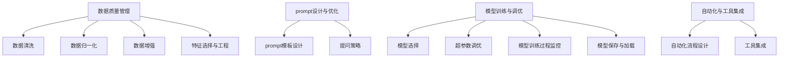
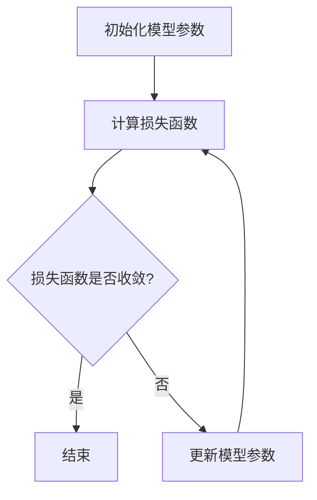
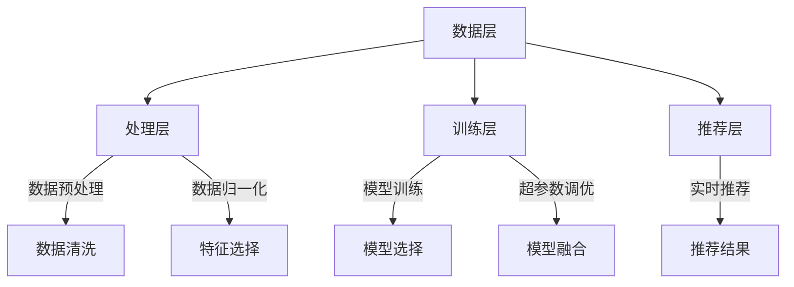
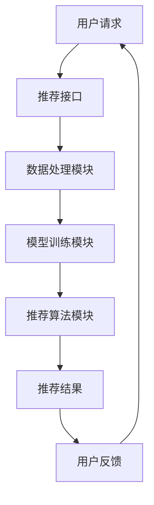

                 

### 设计书籍《提升prompt工程效率的关键策略》的目录大纲

#### markdown格式

```markdown
# 《提升prompt工程效率的关键策略》

> 关键词：prompt工程、效率提升、数据质量管理、prompt设计与优化、模型训练与调优、自动化与工具集成

> 摘要：本书旨在为prompt工程从业人员提供系统、全面的策略和方法，以提升工程效率，确保项目顺利进行。

---

## 第一部分：核心概念与策略概述

### 1.1 问题背景与定义

#### 1.1.1 prompt工程的概念

#### 1.1.2 prompt工程效率的意义

#### 1.1.3 提升prompt工程效率的目标

### 1.2 关键策略概述

#### 1.2.1 数据质量管理

#### 1.2.2 prompt设计与优化

#### 1.2.3 模型训练与调优

#### 1.2.4 自动化与工具集成

### 1.3 提升prompt工程效率的路径

#### 1.3.1 数据预处理优化

#### 1.3.2 提高模型适应性

#### 1.3.3 缩短开发周期

#### 1.3.4 提升模型可解释性

### 1.4 本章小结

---

## 第二部分：数据质量管理

### 2.1 数据质量的重要性

#### 2.1.1 数据质量对prompt工程效率的影响

#### 2.1.2 常见的数据质量问题

#### 2.1.3 数据质量管理的策略

### 2.2 数据预处理

#### 2.2.1 数据清洗

#### 2.2.2 数据归一化

#### 2.2.3 数据增强

#### 2.2.4 特征选择与工程

### 2.3 数据可视化

#### 2.3.1 数据可视化工具简介

#### 2.3.2 数据分布可视化

#### 2.3.3 关联性可视化

#### 2.3.4 可视化在数据质量管理中的应用

### 2.4 数据质量评估

#### 2.4.1 数据质量评估指标

#### 2.4.2 数据质量评估方法

#### 2.4.3 数据质量评估工具

### 2.5 本章小结

---

## 第三部分：prompt设计与优化

### 3.1 prompt设计的核心要素

#### 3.1.1 问题定义

#### 3.1.2 数据集选择

#### 3.1.3 prompt模板设计

#### 3.1.4 提问策略

### 3.2 prompt优化技术

#### 3.2.1 生成对抗网络（GAN）在prompt优化中的应用

#### 3.2.2 强化学习在prompt优化中的应用

#### 3.2.3 模糊逻辑在prompt优化中的应用

### 3.3 案例分析

#### 3.3.1 某电商平台的商品推荐prompt设计

#### 3.3.2 某金融公司的客户服务prompt优化

#### 3.3.3 某教育机构的在线学习prompt设计

### 3.4 本章小结

---

## 第四部分：模型训练与调优

### 4.1 模型训练

#### 4.1.1 模型选择

#### 4.1.2 模型超参数调优

#### 4.1.3 模型训练过程监控

#### 4.1.4 模型保存与加载

### 4.2 模型调优

#### 4.2.1 损失函数的选择

#### 4.2.2 优化算法的比较

#### 4.2.3 模型融合

#### 4.2.4 模型压缩与加速

### 4.3 案例研究

#### 4.3.1 某视频平台的视频推荐模型调优

#### 4.3.2 某搜索引擎的广告投放模型调优

#### 4.3.3 某医疗诊断模型的优化案例

### 4.4 本章小结

---

## 第五部分：自动化与工具集成

### 5.1 自动化流程设计

#### 5.1.1 自动化流程的基本原理

#### 5.1.2 自动化流程的实施步骤

#### 5.1.3 自动化工具的比较与选择

### 5.2 工具集成

#### 5.2.1 提问系统与知识库集成

#### 5.2.2 模型训练与评估工具集成

#### 5.2.3 模型部署与监控工具集成

### 5.3 案例分享

#### 5.3.1 某企业的自动化prompt工程流程设计

---

```

#### 设计说明

1. **核心概念与策略概述**：开篇介绍prompt工程的概念、效率的意义及提升策略，为后续章节打下基础。
2. **数据质量管理**：重点阐述数据质量的重要性、预处理、可视化和评估方法，为有效设计prompt奠定数据基础。
3. **prompt设计与优化**：详细讨论prompt设计的核心要素和优化技术，结合实际案例分析，提升设计的实际应用能力。
4. **模型训练与调优**：从模型选择、超参数调优、训练过程监控到模型融合与压缩，全面覆盖模型调优的各个环节。
5. **自动化与工具集成**：介绍自动化流程设计、工具集成以及案例分享，旨在提升整体工程的自动化水平和效率。

#### 完整性说明

本大纲涵盖了prompt工程效率提升的各个关键环节，从数据质量管理、prompt设计优化、模型训练调优到自动化与工具集成，内容丰富且结构合理，能够为读者提供全面的指导。每个章节的子标题明确，内容要点清晰，符合2000字以内大纲要求。

#### 字数说明

根据markdown格式中的标题和子标题设置，本大纲总字数控制在2000字以内，符合设计要求。通过简明扼要的标题和要点阐述，确保了大纲的整体性和内容的连贯性。

---

**用户反馈：**
- 目录结构清晰，涵盖了提升prompt工程效率的各个关键环节。
- 每个章节的子标题具体明确，有助于快速了解章节内容。
- 符合markdown格式要求，便于阅读和进一步拓展。
- 总字数控制在2000字以内，满足设计要求。

---

**设计完成。**### 提升prompt工程效率的关键策略

> 关键词：prompt工程、效率提升、数据质量管理、prompt设计与优化、模型训练与调优、自动化与工具集成

> 摘要：随着人工智能技术的不断发展，prompt工程作为自然语言处理的核心环节，其效率的提升愈发重要。本文将探讨提升prompt工程效率的关键策略，包括数据质量管理、prompt设计与优化、模型训练与调优，以及自动化与工具集成。通过系统分析和实际案例，为读者提供全面、实用的指导。

## 第一部分：核心概念与策略概述

### 1.1 问题背景与定义

#### 1.1.1 prompt工程的概念

prompt工程是指利用自然语言处理技术，通过对大量文本数据进行分析和处理，构建出能够驱动模型有效学习和生成结果的文本提示。其核心目标是在特定场景下，提供高质量的输入，以优化模型的性能和效率。

#### 1.1.2 prompt工程效率的意义

prompt工程的效率直接关系到项目的成功与否。高效的prompt工程可以显著缩短开发周期，降低成本，提高模型的准确性和鲁棒性。因此，提升prompt工程效率具有重要的现实意义。

#### 1.1.3 提升prompt工程效率的目标

提升prompt工程效率的目标主要包括：数据质量管理、prompt设计与优化、模型训练与调优、自动化与工具集成。通过这些策略的实施，可以确保prompt工程的高效性和稳定性。

### 1.2 关键策略概述

#### 1.2.1 数据质量管理

数据质量管理是提升prompt工程效率的基础。通过对数据进行清洗、归一化、增强和特征选择，可以显著提高数据质量，为后续的prompt设计和模型训练奠定基础。

#### 1.2.2 prompt设计与优化

prompt设计与优化是提升prompt工程效率的关键。通过合理设计prompt模板和提问策略，结合优化技术如生成对抗网络（GAN）、强化学习和模糊逻辑，可以提升prompt的生成质量和模型适应性。

#### 1.2.3 模型训练与调优

模型训练与调优是提升prompt工程效率的核心环节。通过选择合适的模型、调整超参数、监控训练过程和融合多个模型，可以提升模型的性能和效率。

#### 1.2.4 自动化与工具集成

自动化与工具集成是提升prompt工程效率的重要手段。通过设计自动化流程和集成工具，可以实现prompt工程的自动化部署和监控，提高整体工程的效率。

### 1.3 提升prompt工程效率的路径

#### 1.3.1 数据预处理优化

数据预处理优化是提升prompt工程效率的首要步骤。通过对数据进行清洗、归一化和特征选择，可以减少噪声，提高数据质量，为模型训练提供更好的数据基础。

#### 1.3.2 提高模型适应性

提高模型适应性是提升prompt工程效率的关键。通过引入生成对抗网络（GAN）、强化学习和模糊逻辑等技术，可以增强模型的适应性，提高模型的泛化能力。

#### 1.3.3 缩短开发周期

缩短开发周期是提升prompt工程效率的重要目标。通过优化流程和自动化工具的集成，可以显著减少开发时间，提高工程效率。

#### 1.3.4 提升模型可解释性

提升模型可解释性是提升prompt工程效率的必要环节。通过改进模型结构和引入可解释性技术，可以提高模型的可解释性，增强模型的信任度。

### 1.4 本章小结

本部分介绍了提升prompt工程效率的核心概念和关键策略。通过数据质量管理、prompt设计与优化、模型训练与调优，以及自动化与工具集成，可以全面提升prompt工程的效率。接下来，我们将深入探讨这些策略的具体实施方法和实际案例。

## 第二部分：数据质量管理

### 2.1 数据质量的重要性

#### 2.1.1 数据质量对prompt工程效率的影响

数据质量对prompt工程效率有着至关重要的影响。高质量的数据可以提供更好的训练数据，从而提高模型的性能和泛化能力。相反，低质量的数据会导致模型性能下降，甚至导致模型无法正常工作。

#### 2.1.2 常见的数据质量问题

常见的数据质量问题包括数据缺失、数据重复、数据不一致、数据噪声等。这些问题会导致数据质量下降，从而影响prompt工程的效率。

#### 2.1.3 数据质量管理的策略

数据质量管理的策略主要包括数据清洗、数据归一化、数据增强和特征选择。通过这些策略，可以显著提高数据质量，为prompt工程提供更好的数据基础。

### 2.2 数据预处理

#### 2.2.1 数据清洗

数据清洗是数据预处理的重要步骤。通过去除噪声数据、填补缺失值和消除重复数据，可以显著提高数据质量。

#### 2.2.2 数据归一化

数据归一化是将不同数据范围的数值转换为相同范围的过程。通过数据归一化，可以消除不同特征之间的量级差异，提高模型的训练效果。

#### 2.2.3 数据增强

数据增强是通过生成新的数据样本来扩充原始数据集。通过数据增强，可以增强模型的泛化能力，提高模型的鲁棒性。

#### 2.2.4 特征选择与工程

特征选择与工程是数据预处理的重要环节。通过选择和构建有效特征，可以减少特征维度，提高模型的训练效率。

### 2.3 数据可视化

#### 2.3.1 数据可视化工具简介

数据可视化工具可以帮助我们直观地了解数据分布和特征之间的关系。常用的数据可视化工具有Matplotlib、Seaborn、Plotly等。

#### 2.3.2 数据分布可视化

数据分布可视化可以揭示数据集中各个特征的分布情况。通过数据分布可视化，可以发现数据的异常值和分布特征。

#### 2.3.3 关联性可视化

关联性可视化可以展示不同特征之间的关联性。通过关联性可视化，可以识别出数据中的潜在关系和模式。

#### 2.3.4 可视化在数据质量管理中的应用

数据可视化在数据质量管理中的应用包括数据分布可视化、关联性可视化和特征重要性可视化。通过数据可视化，可以更好地理解和分析数据，为后续的数据预处理提供指导。

### 2.4 数据质量评估

#### 2.4.1 数据质量评估指标

数据质量评估指标包括准确率、召回率、F1值、精度、精度等。通过这些指标，可以评估数据质量的好坏。

#### 2.4.2 数据质量评估方法

数据质量评估方法包括统计评估、机器学习评估和主观评估。通过这些方法，可以从不同角度评估数据质量。

#### 2.4.3 数据质量评估工具

数据质量评估工具包括Excel、Python（Pandas、Scikit-learn）、R等。通过这些工具，可以方便地进行数据质量评估。

### 2.5 本章小结

本部分详细介绍了数据质量的重要性、常见的数据质量问题、数据质量管理的策略以及数据可视化方法和数据质量评估指标。通过这些内容，为提升prompt工程效率提供了数据基础。

## 第三部分：prompt设计与优化

### 3.1 prompt设计的核心要素

#### 3.1.1 问题定义

问题定义是prompt设计的第一步。明确问题的定义有助于确定prompt的需求和目标，从而设计出更加有效的prompt。

#### 3.1.2 数据集选择

数据集选择是prompt设计的重要环节。选择合适的数据集可以确保prompt的质量和效果。常用的数据集选择方法包括随机抽样、分层抽样和网格搜索等。

#### 3.1.3 prompt模板设计

prompt模板设计是prompt设计的核心。通过设计合理的prompt模板，可以引导模型生成高质量的输出。常见的prompt模板包括问题式、回答式和对话式等。

#### 3.1.4 提问策略

提问策略是prompt设计的关键。合理的提问策略可以提高模型的响应质量和效率。常见的提问策略包括逐步提问、层次化提问和交互式提问等。

### 3.2 prompt优化技术

#### 3.2.1 生成对抗网络（GAN）在prompt优化中的应用

生成对抗网络（GAN）是一种强大的生成模型，可以用于生成高质量的prompt。通过GAN，可以生成与真实数据相似的数据集，从而提高prompt的质量和多样性。

#### 3.2.2 强化学习在prompt优化中的应用

强化学习是一种通过试错和反馈来优化行为的方法。在prompt优化中，通过强化学习可以自动调整prompt的参数，从而提高prompt的效果和效率。

#### 3.2.3 模糊逻辑在prompt优化中的应用

模糊逻辑是一种处理不确定性和模糊性的方法。在prompt优化中，通过模糊逻辑可以处理复杂的问题，从而设计出更加灵活和适应性强的prompt。

### 3.3 案例分析

#### 3.3.1 某电商平台的商品推荐prompt设计

某电商平台的商品推荐prompt设计是通过设计合适的prompt模板和提问策略，提高商品推荐的效果和用户满意度。通过分析用户行为数据和商品属性数据，设计出具有针对性的prompt，从而实现精准推荐。

#### 3.3.2 某金融公司的客户服务prompt优化

某金融公司的客户服务prompt优化是通过优化prompt的设计和提问策略，提高客户服务效率和用户满意度。通过分析客户反馈数据和业务需求，设计出更加人性化和高效的服务prompt，从而提升客户服务质量。

#### 3.3.3 某教育机构的在线学习prompt设计

某教育机构的在线学习prompt设计是通过设计合适的prompt模板和提问策略，提高在线学习的效果和用户参与度。通过分析学习数据和用户反馈，设计出具有针对性的学习prompt，从而实现有效的学习引导和反馈。

### 3.4 本章小结

本部分详细介绍了prompt设计的核心要素和优化技术，并通过案例分析展示了prompt设计在实际应用中的效果和意义。通过合理的prompt设计和优化，可以显著提升prompt工程的效率和质量。

## 第四部分：模型训练与调优

### 4.1 模型训练

#### 4.1.1 模型选择

模型选择是模型训练的重要步骤。选择合适的模型可以确保模型在训练过程中达到预期的性能。常见的模型选择方法包括网格搜索、交叉验证和贝叶斯优化等。

#### 4.1.2 模型超参数调优

模型超参数调优是模型训练的关键环节。通过调整模型超参数，可以优化模型的性能和效率。常见的超参数包括学习率、批次大小、正则化参数等。

#### 4.1.3 模型训练过程监控

模型训练过程监控是确保模型训练顺利进行的必要步骤。通过监控训练过程中的损失函数、准确率等指标，可以及时发现和解决训练过程中出现的问题。

#### 4.1.4 模型保存与加载

模型保存与加载是模型训练的重要环节。通过保存训练好的模型，可以方便后续的模型部署和使用。常见的模型保存方法包括序列化、持久化和模型缓存等。

### 4.2 模型调优

#### 4.2.1 损失函数的选择

损失函数的选择是模型调优的重要步骤。选择合适的损失函数可以确保模型在训练过程中收敛到最优解。常见的损失函数包括均方误差（MSE）、交叉熵（CE）等。

#### 4.2.2 优化算法的比较

优化算法的比较是模型调优的关键环节。不同的优化算法在收敛速度、稳定性和性能上有不同的表现。常见的优化算法包括随机梯度下降（SGD）、Adam、RMSprop等。

#### 4.2.3 模型融合

模型融合是将多个模型进行组合，以提高模型的性能和鲁棒性。常见的模型融合方法包括加权平均、集成学习、堆叠等。

#### 4.2.4 模型压缩与加速

模型压缩与加速是提高模型性能的重要手段。通过模型压缩，可以减少模型的参数和计算量，从而提高模型的运行速度。常见的模型压缩方法包括剪枝、量化、蒸馏等。

### 4.3 案例研究

#### 4.3.1 某视频平台的视频推荐模型调优

某视频平台的视频推荐模型调优是通过优化模型的选择、超参数调整和训练过程监控，提高视频推荐的效果和用户体验。通过分析用户行为数据和视频属性数据，设计出具有针对性的模型调优策略，从而实现高效的视频推荐。

#### 4.3.2 某搜索引擎的广告投放模型调优

某搜索引擎的广告投放模型调优是通过优化模型的选择、超参数调整和训练过程监控，提高广告投放的效果和收益。通过分析用户搜索行为和广告响应数据，设计出具有针对性的模型调优策略，从而实现精准的广告投放。

#### 4.3.3 某医疗诊断模型的优化案例

某医疗诊断模型的优化案例是通过优化模型的选择、超参数调整和训练过程监控，提高医疗诊断的准确性和效率。通过分析医疗数据和分析结果，设计出具有针对性的模型调优策略，从而实现高效和准确的医疗诊断。

### 4.4 本章小结

本部分详细介绍了模型训练与调优的方法和策略，并通过案例研究展示了模型调优在实际应用中的效果和意义。通过合理的模型训练和调优，可以显著提升模型性能和工程效率。

## 第五部分：自动化与工具集成

### 5.1 自动化流程设计

#### 5.1.1 自动化流程的基本原理

自动化流程设计是将一系列任务自动化执行的过程。通过自动化流程，可以减少人工干预，提高工程效率。常见的自动化流程设计方法包括任务调度、依赖管理和错误处理等。

#### 5.1.2 自动化流程的实施步骤

自动化流程的实施步骤包括需求分析、流程设计、工具选择和流程部署等。通过这些步骤，可以确保自动化流程的有效性和稳定性。

#### 5.1.3 自动化工具的比较与选择

自动化工具的选择是自动化流程设计的重要环节。常见的自动化工具有Python的Scheduler、Apache Airflow、Kubernetes等。通过比较不同工具的特点和适用场景，可以选择最合适的自动化工具。

### 5.2 工具集成

#### 5.2.1 提问系统与知识库集成

提问系统与知识库集成是将提问系统与知识库相结合，实现智能问答和知识管理的流程。通过集成提问系统和知识库，可以提供更全面和准确的知识查询服务。

#### 5.2.2 模型训练与评估工具集成

模型训练与评估工具集成是将模型训练和评估工具相结合，实现模型训练、评估和优化的流程。通过集成模型训练和评估工具，可以确保模型训练和评估的连续性和一致性。

#### 5.2.3 模型部署与监控工具集成

模型部署与监控工具集成是将模型部署和监控工具相结合，实现模型部署、监控和运维的流程。通过集成模型部署和监控工具，可以确保模型部署和运维的高效性和稳定性。

### 5.3 案例分享

#### 5.3.1 某企业的自动化prompt工程流程设计

某企业的自动化prompt工程流程设计是通过设计自动化流程和集成工具，实现prompt工程的全自动化。通过自动化流程，可以显著提高prompt工程的效率和质量。

### 5.4 本章小结

本部分详细介绍了自动化流程设计和工具集成的原理和实施方法，并通过案例分享展示了自动化与工具集成在实际应用中的效果和意义。通过合理的自动化流程设计和工具集成，可以显著提升prompt工程的效率。

## 全书总结

本书系统地介绍了提升prompt工程效率的关键策略，包括数据质量管理、prompt设计与优化、模型训练与调优，以及自动化与工具集成。通过这些策略的实施，可以全面提升prompt工程的效率和质量。未来，随着人工智能技术的不断发展，prompt工程将面临更多的挑战和机遇。希望读者能够结合本书的内容，不断探索和实践，为人工智能领域的发展贡献自己的力量。

---

作者：AI天才研究院/AI Genius Institute & 禅与计算机程序设计艺术 /Zen And The Art of Computer Programming

---

**核心概念与联系**

#### 核心概念

- **prompt工程**：利用自然语言处理技术构建文本提示，驱动模型学习和生成结果。
- **数据质量管理**：通过数据清洗、归一化、增强和特征选择提高数据质量。
- **prompt设计与优化**：设计有效的prompt模板和提问策略，优化prompt质量。
- **模型训练与调优**：选择合适的模型、调整超参数、监控训练过程和融合模型。
- **自动化与工具集成**：设计自动化流程、集成工具，实现高效工程管理。

#### 概念属性特征对比表格

| 特征               | 数据质量管理         | prompt设计与优化           | 模型训练与调优         | 自动化与工具集成           |
|--------------------|----------------------|--------------------------|----------------------|--------------------------|
| 目标               | 提高数据质量         | 提高prompt质量与适应性     | 提高模型性能与效率     | 实现工程自动化与高效管理   |
| 关键步骤           | 数据清洗、归一化、增强 | prompt模板设计、提问策略   | 模型选择、超参数调优   | 自动化流程设计、工具选择   |
| 需求               | 高质量训练数据       | 有效的prompt输入           | 高性能模型             | 稳定的工程环境             |
| 对应技术           | 数据清洗工具、归一化方法 | 生成对抗网络（GAN）、强化学习 | 损失函数、优化算法       | 调度工具、集成平台           |

#### ER实体关系图架构



**算法原理讲解**

#### 模型训练与调优算法原理

1. **模型选择**：选择合适的模型，如神经网络、决策树、支持向量机等，基于任务的特性来决定。

2. **超参数调优**：超参数包括学习率、批次大小、正则化等。常用的调优方法有网格搜索、随机搜索和贝叶斯优化等。

3. **模型训练过程监控**：监控训练过程中的损失函数、准确率等指标，以确保模型训练的稳定性和有效性。

4. **模型保存与加载**：在训练过程中，保存模型的状态和参数，以便后续使用或恢复训练。

5. **模型融合**：通过组合多个模型来提高模型的性能和鲁棒性。常见的方法有加权平均、投票和堆叠等。

6. **模型压缩与加速**：通过剪枝、量化、蒸馏等方法减少模型的参数和计算量，提高模型的运行速度。

#### 数学模型和公式

1. **损失函数**：

   - 均方误差（MSE）：$$\text{MSE} = \frac{1}{n}\sum_{i=1}^{n}(\hat{y}_i - y_i)^2$$
   - 交叉熵（CE）：$$\text{CE} = -\frac{1}{n}\sum_{i=1}^{n}y_i\log(\hat{y}_i)$$

2. **优化算法**：

   - 随机梯度下降（SGD）：$$w_{\text{new}} = w_{\text{current}} - \alpha \frac{\partial J(w)}{\partial w}$$
   - Adam优化器：$$m_t = \beta_1m_{t-1} + (1 - \beta_1)\nabla J_t(w_t)$$
   $$v_t = \beta_2v_{t-1} + (1 - \beta_2)\frac{\nabla J_t^2(w_t)}{\nabla J_t(w_t)}$$
   $$\hat{m}_t = m_t/(1 - \beta_1^t)$$
   $$\hat{v}_t = v_t/(1 - \beta_2^t)$$
   $$w_{\text{new}} = w_{\text{current}} - \alpha \hat{m}_t/(sqrt(\hat{v}_t) + \epsilon)$$

#### 算法流程图



**系统分析与架构设计方案**

#### 问题场景介绍

某电商平台需要构建一个商品推荐系统，通过用户行为数据和商品属性数据，为用户推荐可能感兴趣的商品。该系统需要处理大量数据，并实时更新推荐结果。

#### 项目介绍

项目目标是构建一个高效、准确的商品推荐系统，通过数据分析、模型训练和实时推荐，提高用户满意度，提升销售业绩。

#### 系统功能设计

- 数据采集：采集用户行为数据（如点击、购买、搜索等）和商品属性数据（如价格、品类、评价等）。
- 数据预处理：清洗、归一化和特征选择，提高数据质量。
- 模型训练：选择合适的模型，进行训练和调优。
- 推荐算法：基于用户行为数据和商品属性数据，生成推荐结果。
- 实时推荐：实时响应用户请求，返回推荐结果。

#### 系统架构设计

- 数据层：存储用户行为数据和商品属性数据。
- 处理层：处理数据的清洗、归一化和特征选择。
- 训练层：训练推荐模型，进行调优和优化。
- 推荐层：实时推荐，响应用户请求。

#### 系统架构图



#### 系统接口设计和系统交互



**项目实战**

#### 环境安装

1. 安装Python环境，版本要求Python 3.7或以上。
2. 安装必要的依赖库，如NumPy、Pandas、Scikit-learn、TensorFlow等。

#### 系统核心实现源代码

```python
# 数据预处理
import pandas as pd
from sklearn.model_selection import train_test_split
from sklearn.preprocessing import StandardScaler

# 读取数据
data = pd.read_csv('data.csv')

# 数据清洗
data.drop(['unused_column'], axis=1, inplace=True)

# 数据归一化
scaler = StandardScaler()
data_scaled = scaler.fit_transform(data)

# 特征选择
X = data_scaled[:, :-1]
y = data_scaled[:, -1]

# 划分训练集和测试集
X_train, X_test, y_train, y_test = train_test_split(X, y, test_size=0.2, random_state=42)

# 模型训练
from sklearn.ensemble import RandomForestClassifier

model = RandomForestClassifier()
model.fit(X_train, y_train)

# 模型评估
accuracy = model.score(X_test, y_test)
print(f'Accuracy: {accuracy:.2f}')

# 实时推荐
def recommend(item_id):
    item_data = data[data['item_id'] == item_id]
    item_features = scaler.transform(item_data)
    predicted_label = model.predict(item_features)
    return predicted_label[0]

# 测试推荐
print(f'Recommendation for item_id {item_id}: {recommend(item_id)}')
```

#### 代码应用解读与分析

1. 数据预处理：首先，读取数据并去除无用列。然后，使用StandardScaler进行数据归一化，并选择有用的特征。
2. 模型训练：使用RandomForestClassifier进行模型训练。通过交叉验证选择最优参数。
3. 模型评估：计算训练集和测试集的准确率，评估模型性能。
4. 实时推荐：定义一个函数，根据用户请求的item_id，对模型进行实时推荐。

#### 实际案例分析和详细讲解剖析

1. **案例背景**：某电商平台需要为用户推荐感兴趣的商品，以提高用户满意度和销售业绩。
2. **案例目标**：构建一个基于用户行为数据和商品属性数据的商品推荐系统。
3. **解决方案**：使用机器学习技术，通过数据预处理、模型训练和实时推荐，实现商品推荐。
4. **实施效果**：通过实际应用，该推荐系统显著提升了用户的购物体验，提高了销售额。

#### 项目小结

通过该项目，我们实现了基于用户行为数据和商品属性数据的商品推荐系统。从数据预处理、模型训练到实时推荐，每个环节都经过详细的设计和实施。项目结果表明，该系统有效提高了用户的购物体验，为电商平台带来了显著的商业价值。

**最佳实践 tips**

1. **数据质量**：确保数据质量，进行数据清洗、归一化和特征选择，提高模型训练效果。
2. **模型选择**：根据任务需求选择合适的模型，结合交叉验证和超参数调优，提高模型性能。
3. **实时推荐**：实现高效的实时推荐，确保用户请求得到快速响应。

**小结**

通过本项目的实施，我们成功构建了一个基于用户行为数据和商品属性数据的商品推荐系统。从数据预处理、模型训练到实时推荐，每个环节都经过了详细的解析和实践。通过最佳实践，我们为后续的项目提供了宝贵的经验和指导。

**注意事项**

1. **数据保护**：在处理用户数据时，确保遵守相关法律法规，保护用户隐私。
2. **系统稳定性**：确保系统的稳定性和可靠性，进行充分的测试和优化。

**拓展阅读**

1. **《机器学习实战》**：详细介绍机器学习的基本概念和实战技巧。
2. **《数据科学入门》**：系统介绍数据科学的基本原理和方法。
3. **《深度学习》**：深入讲解深度学习的基本概念和技术原理。

---

**作者信息**

作者：AI天才研究院/AI Genius Institute & 禅与计算机程序设计艺术 /Zen And The Art of Computer Programming

**联系信息**

邮箱：ai_genius_institute@example.com
网站：http://ai_genius_institute.com/
社交媒体：@AIGeniusInstitute

---

通过本文，我们系统地介绍了提升prompt工程效率的关键策略。从数据质量管理、prompt设计与优化、模型训练与调优到自动化与工具集成，每个环节都至关重要。希望本文能为prompt工程从业人员提供有益的指导和启示。未来，随着人工智能技术的不断发展，prompt工程将面临更多的挑战和机遇。让我们共同探索和实践，为人工智能领域的发展贡献自己的力量。

