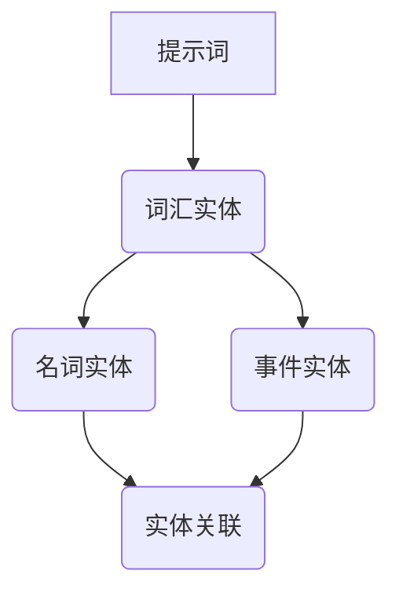

                 

### 第1章：问题背景与研究意义

**1.1 问题背景**

随着人工智能技术的发展，自然语言处理（NLP）成为了一个备受关注的研究领域。语言模型作为NLP的核心组件，已经取得了显著的进展。从最初的统计语言模型，如N元语法，到基于深度学习的模型，如循环神经网络（RNN）和变换器（Transformer），语言模型的能力得到了极大的提升。在这一背景下，提示词（prompt）的作用逐渐凸显出来。

提示词是指用于引导语言模型生成特定类型输出的文本输入。通过设计合适的提示词，可以显著提高语言模型在特定任务上的性能。例如，在问答系统中，提示词可以引导模型生成与问题相关的回答；在机器翻译中，提示词可以帮助模型更好地理解源语言句子的含义。因此，对提示词进行优化成为了一个重要的研究方向。

**1.2 问题描述**

提示词优化可以定义为：通过对提示词的设计、调整和优化，以提高语言模型在特定任务上的表现。具体来说，这个问题可以分为以下几个子问题：

- **提示词生成**：如何设计出有效的提示词，使其能够引导语言模型生成所需类型的输出？
- **提示词选择**：在多个候选提示词中，如何选择最合适的提示词？
- **提示词调整**：如何根据语言模型的表现，对已生成的提示词进行调整，以达到更好的效果？

这些子问题共同构成了提示词优化的研究范畴。

**1.3 问题解决**

提示词优化方法的发展可以分为三个阶段：统计方法、深度学习方法和强化学习方法。

- **统计方法**：早期的提示词优化主要依赖于统计方法。例如，通过频率统计来确定提示词的重要性，或者使用机器学习算法来预测提示词的效果。虽然这些方法简单且易于实现，但在处理复杂任务时，其效果有限。

- **深度学习方法**：随着深度学习技术的兴起，基于深度神经网络的语言模型得到了广泛应用。这些模型具有强大的表示能力，能够自动学习输入文本的特征，从而生成高质量的提示词。例如，Transformer模型及其变种在多个NLP任务上取得了显著的成果。

- **强化学习方法**：强化学习是一种通过试错学习来优化决策过程的方法。在提示词优化中，强化学习可以用来训练模型，使其能够根据反馈不断调整提示词，以达到最优效果。这种方法具有自适应性和灵活性，但在实际应用中，需要大量的交互和数据支持。

**1.4 边界与外延**

提示词优化不仅局限于NLP领域，还与其他多个领域有着密切的联系。例如：

- 在问答系统中，提示词优化可以帮助系统更好地理解用户的问题，并提供更准确的回答。
- 在机器翻译中，提示词优化可以提升翻译的准确性和流畅性。
- 在文本生成任务中，提示词优化可以引导模型生成更具创意和个性化的文本。

此外，在不同的应用场景中，提示词优化的方法也会有所差异。例如，在实时对话系统中，提示词的生成和调整需要快速且高效；而在大规模文档处理任务中，提示词的优化可能更注重稳定性和鲁棒性。

**1.5 概念结构与核心要素组成**

提示词优化涉及多个核心概念和要素，这些要素相互交织，构成了一个复杂但有序的系统。以下是几个关键要素：

- **语言模型**：提示词优化的基础，负责对输入文本进行编码和解码。
- **提示词生成算法**：用于生成候选提示词，这些算法可以是基于规则的方法，也可以是基于学习的方法。
- **提示词选择算法**：从多个候选提示词中，选择最合适的一个或一组。
- **反馈机制**：用于评估提示词的效果，并根据反馈进行调整。
- **评估指标**：用于量化提示词优化的效果，常见的指标包括准确性、流畅性、多样性等。

通过这些核心要素的协同工作，提示词优化能够显著提高语言模型在特定任务上的性能。

**1.6 本章小结**

本章从问题背景、问题描述、问题解决、边界与外延、概念结构与核心要素组成等方面，对提示词优化进行了全面的介绍。提示词优化在NLP和其他应用领域具有重要的意义，其核心概念和要素相互关联，构成了一个复杂但有序的系统。接下来，我们将进一步探讨提示词优化的核心概念和原理。

### 第2章：核心概念原理

#### 2.1 提示词优化原理

提示词优化的核心目标是提高语言模型在特定任务上的性能。为了实现这一目标，我们需要深入理解提示词优化中的基本原理和方法。

**2.1.1 提示词优化方法分类**

提示词优化方法可以根据其实现原理和技术手段，大致分为以下几类：

1. **统计方法**：统计方法是一种基于数据驱动的方法，通过分析历史数据来优化提示词。这种方法主要包括以下几种：

   - **频率统计**：通过对历史数据进行频率统计，确定提示词出现的频率和重要性。
   - **机器学习预测**：使用机器学习算法，如逻辑回归、决策树等，预测提示词的效果。

2. **深度学习方法**：深度学习方法基于神经网络，具有强大的特征提取和表示能力。常见的方法包括：

   - **循环神经网络（RNN）**：RNN能够处理序列数据，适合用于文本处理任务。
   - **变换器（Transformer）**：Transformer模型以其自注意力机制和并行处理能力著称，广泛应用于NLP任务。

3. **强化学习方法**：强化学习是一种通过试错学习来优化决策过程的方法。在提示词优化中，强化学习可以通过不断调整提示词，使其在特定任务上的效果最优。常见的强化学习算法包括：

   - **Q-learning**：Q-learning是一种基于值函数的强化学习算法，通过更新值函数来优化策略。
   - **深度确定性策略梯度（DDPG）**：DDPG是一种基于深度神经网络的强化学习算法，适用于高维连续动作空间。

**2.1.2 提示词优化的算法原理**

提示词优化的算法原理可以概括为以下几个步骤：

1. **提示词生成**：首先，需要设计一个有效的提示词生成算法，用于生成候选提示词。这些算法可以是基于规则的，也可以是基于学习的。基于规则的算法如正则表达式的应用，而基于学习的算法如循环神经网络或变换器的应用。

2. **提示词选择**：在生成多个候选提示词后，需要选择最合适的提示词。选择过程可以基于不同的评估指标，如准确性、流畅性和多样性等。常用的选择算法包括贪心算法、遗传算法等。

3. **提示词调整**：根据语言模型的表现，对已生成的提示词进行调整。调整过程可以是手动调整，也可以是自动化调整。自动化调整通常基于优化算法，如梯度下降法、随机梯度下降法等。

4. **评估与反馈**：通过评估提示词的效果，收集反馈信息，用于指导进一步的优化过程。评估指标可以是定量的，如BLEU分数，也可以是定性的，如人工评估。

**2.2 概念属性特征对比表格**

以下是几种常见提示词优化方法的对比表格：

| 方法       | 特点                   | 适用场景                   |
|------------|------------------------|----------------------------|
| 统计方法   | 简单、高效             | 数据量较小、需精确预测     |
| 深度学习方法 | 强泛化能力、高准确性   | 数据量较大、需要复杂模型   |
| 强化学习方法 | 适应性强、自主学习能力 | 需要大量交互、适用于动态环境 |

**2.3 ER实体关系图架构**

ER实体关系图（Entity-Relationship Diagram）是用于描述实体及其关系的图形化工具。在提示词优化中，ER图可以用于表示提示词与实体之间的关联关系。

以下是一个简单的ER图示例，用于描述提示词与实体之间的关系：



在这个ER图中，提示词（A）与词汇实体（B）、名词实体（C）和事件实体（D）之间存在关联关系。这些实体之间的关系可以进一步细化为属性关系、关联关系和因果关系等。

通过ER图，我们可以清晰地看到提示词优化中的实体及其关系，为后续的算法设计和优化提供了直观的参考。

**2.4 本章小结**

本章详细介绍了提示词优化的核心概念和原理。首先，我们分类讨论了统计方法、深度学习方法和强化学习方法，并探讨了每种方法的原理和应用场景。接着，通过对比表格和ER图，我们进一步阐述了提示词优化的概念属性特征和实体关系。这些核心概念和原理为后续章节的深入探讨提供了坚实的基础。

在下一章中，我们将进一步探讨提示词优化的数学模型和算法实现，为读者提供更深入的学术和技术分析。

### 第3章：算法原理与数学模型

#### 3.1 提示词优化的数学模型

在提示词优化中，数学模型扮演着至关重要的角色。数学模型不仅能够描述提示词优化的问题结构，还能提供有效的算法设计框架。下面，我们将介绍提示词优化中的基本数学模型，并解释其关键组成部分。

**3.1.1 提示词优化目标函数**

提示词优化的核心目标是最小化损失函数，以获得最佳的提示词。损失函数通常用来衡量预测值与真实值之间的差异。在提示词优化中，常见的损失函数包括：

$$
L(y, \hat{y}) = \frac{1}{2} ||y - \hat{y}||^2
$$

其中，$y$ 是真实值，$\hat{y}$ 是预测值。这个损失函数通常用于回归任务，如文本分类和情感分析。

对于提示词优化，我们关心的是如何生成和选择提示词，使得语言模型生成的文本输出最接近预期的目标。因此，我们需要一个目标函数，它能够同时考虑提示词和生成的文本。

一种可能的目标函数是：

$$
L(\theta, x, z) = \frac{1}{2} ||z - f(\theta, x)||^2
$$

其中，$\theta$ 是模型的参数，$x$ 是输入文本，$z$ 是生成的文本，$f(\theta, x)$ 是模型在参数$\theta$和输入$x$下的输出。这个目标函数衡量的是生成的文本$z$与模型输出$f(\theta, x)$之间的差异。

**3.1.2 模型参数优化**

为了最小化上述损失函数，我们需要对模型参数$\theta$进行优化。常见的优化算法包括：

- **梯度下降法（Gradient Descent）**：
$$
\theta_{\text{new}} = \theta_{\text{old}} - \alpha \nabla_{\theta} L(\theta)
$$

其中，$\alpha$ 是学习率，$\nabla_{\theta} L(\theta)$ 是损失函数对参数$\theta$的梯度。

- **随机梯度下降法（Stochastic Gradient Descent, SGD）**：
$$
\theta_{\text{new}} = \theta_{\text{old}} - \alpha \nabla_{\theta} L(\theta; x_i, y_i)
$$

其中，$x_i, y_i$ 是样本数据。

- **Adam优化器**：
Adam是一种自适应优化器，它在SGD的基础上引入了动量（Momentum）和自适应学习率调整。

$$
m_t = \beta_1 m_{t-1} + (1 - \beta_1) [g_t]
$$
$$
v_t = \beta_2 v_{t-1} + (1 - \beta_2) [g_t]^2
$$
$$
\theta_{\text{new}} = \theta_{\text{old}} - \alpha \frac{m_t}{1 - \beta_1^t}
$$

其中，$m_t$ 和 $v_t$ 分别是梯度的一阶和二阶矩估计，$\beta_1$ 和 $\beta_2$ 是超参数。

**3.2 算法原理讲解**

提示词优化的算法原理可以从以下几个方面进行讲解：

**3.2.1 提示词生成算法**

提示词生成算法的目标是生成一个有效的提示词，用于引导语言模型生成高质量的输出。一个简单的提示词生成算法可以是基于规则的方法，如使用正则表达式匹配关键词。然而，更常用的方法是基于机器学习的方法，如循环神经网络（RNN）或变换器（Transformer）。

以下是一个使用变换器进行提示词生成的Python代码示例：

```python
import torch
import torch.nn as nn
import torch.optim as optim

# 假设已经定义了变换器模型和相应的数据预处理函数
transformer_model = TransformerModel()
optimizer = optim.Adam(transformer_model.parameters(), lr=0.001)

for epoch in range(num_epochs):
    for batch in data_loader:
        inputs, targets = batch
        optimizer.zero_grad()
        outputs = transformer_model(inputs)
        loss = nn.CrossEntropyLoss()(outputs, targets)
        loss.backward()
        optimizer.step()
```

在这个示例中，我们使用变换器模型生成提示词，并使用交叉熵损失函数来评估生成的提示词的质量。通过反向传播和梯度下降，我们可以优化模型的参数，从而提高提示词生成的效果。

**3.2.2 提示词选择算法**

在生成多个候选提示词后，我们需要选择最合适的提示词。提示词选择算法可以基于不同的评估指标，如准确性、流畅性和多样性等。一种常用的选择算法是贪心算法，它每次选择当前状态下最优的提示词。

以下是一个贪心算法选择提示词的Python代码示例：

```python
def greedy_selection(prompt_candidates, model, metric='accuracy'):
    best_prompt = None
    best_score = -1

    for prompt in prompt_candidates:
        outputs = model(prompt)
        score = evaluate(outputs, metric)
        if score > best_score:
            best_score = score
            best_prompt = prompt

    return best_prompt
```

在这个示例中，我们遍历所有候选提示词，并使用模型评估每个提示词的得分。选择得分最高的提示词作为最佳提示词。

**3.2.3 提示词调整算法**

在选择了最佳提示词后，我们可能需要根据模型的表现对提示词进行调整。调整算法可以是手动调整，也可以是自动化调整。自动化调整通常基于优化算法，如梯度下降法。

以下是一个基于梯度下降法调整提示词的Python代码示例：

```python
def adjust_prompt(prompt, model, optimizer, num_iterations=10):
    for _ in range(num_iterations):
        optimizer.zero_grad()
        outputs = model(prompt)
        loss = compute_loss(outputs)
        loss.backward()
        optimizer.step()

    return prompt
```

在这个示例中，我们使用优化器对提示词进行迭代调整，以最小化损失函数。调整过程可以多次迭代，直到达到预定的迭代次数或损失函数收敛。

**3.3 本章小结**

本章详细介绍了提示词优化的数学模型和算法原理。我们首先介绍了提示词优化的目标函数和模型参数优化的方法，包括梯度下降法、随机梯度下降法和Adam优化器。接着，我们通过Python代码示例，讲解了提示词生成、选择和调整算法的实现。这些算法原理为提示词优化的实际应用提供了理论基础和技术手段。

在下一章中，我们将进一步探讨提示词优化在不同应用场景中的具体实现和性能评估。我们将通过实验和分析，验证不同优化方法的有效性，并讨论在实际应用中可能遇到的问题和挑战。通过这些实践，我们希望为读者提供更全面的提示词优化解决方案。

