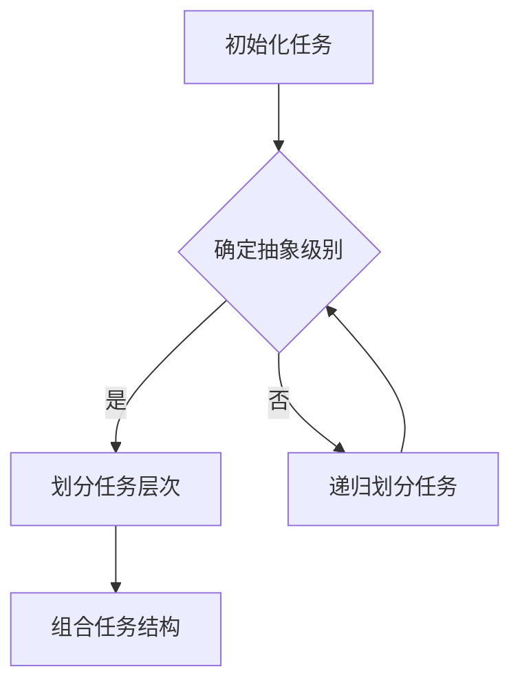
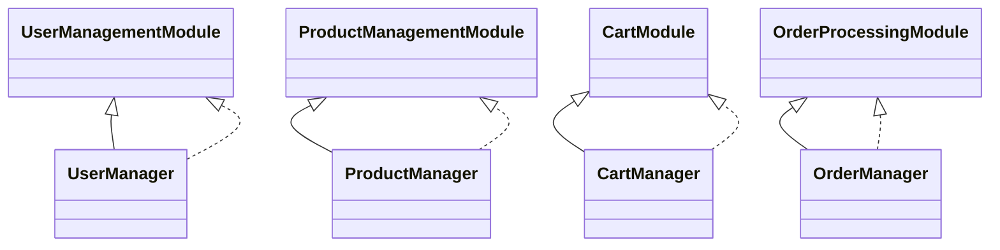
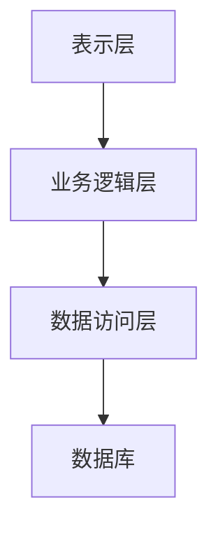
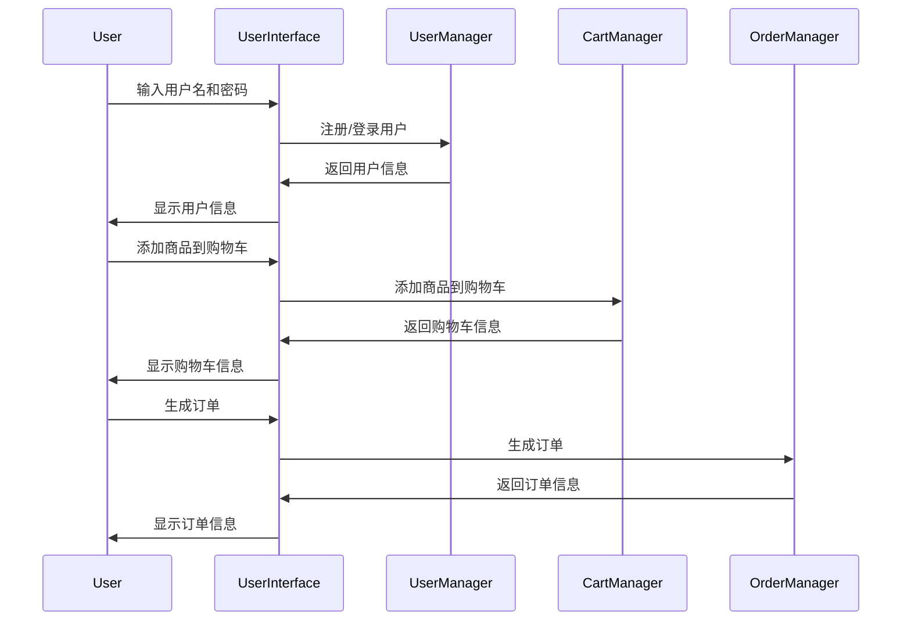

                 

----------------------------------------------------------------

# 提示词分层：处理不同抽象级别的任务

关键词：提示词分层、抽象级别、任务处理、算法原理、系统架构设计

摘要：本文探讨了提示词分层在处理不同抽象级别任务中的应用。通过介绍提示词分层的基础知识，详细分析了分层方法论的核心概念和算法原理，并结合Python代码实现了分层算法。进一步，文章展示了如何进行系统分析与架构设计，并通过项目实战应用了提示词分层方法。最终，文章总结了研究成果，提出了未来研究方向。

----------------------------------------------------------------

## 1. 引言与背景

在当今快速发展的信息技术领域，处理不同抽象级别的任务已经成为一项重要挑战。随着系统规模的不断扩大和复杂度的增加，如何高效地管理和处理这些任务成为亟待解决的问题。提示词分层方法提供了一种有效的解决方案，通过将任务划分为不同抽象级别，使得系统更易于理解和维护。

本文旨在探讨提示词分层在处理不同抽象级别任务中的应用，包括分层方法论、算法原理、系统分析与架构设计，以及项目实战。文章将从以下几个方面展开：

1. 提示词分层基础
2. 分层方法论核心概念
3. 分层算法原理与实现
4. 系统分析与架构设计
5. 项目实战与应用
6. 总结与展望

## 2. 提示词分层基础

### 2.1 提示词分层概念

提示词分层是指将任务或问题划分为不同的层次，每一层次都包含特定的功能和目标。分层的目的在于降低系统的复杂度，使得任务更加清晰和易于管理。在提示词分层中，每个层次都可以被视为一个抽象级别，而层次之间的转换则体现了不同抽象级别之间的关联。

### 2.2 分层原则与目标

分层原则主要包括以下几个方面：

- 功能独立性：每个层次应该具有独立的功能，不依赖于其他层次。
- 层次关系：高层次依赖于低层次，低层次为高层次提供服务。
- 层次优化：每个层次都应该尽可能地优化，以降低系统复杂度和提高性能。

分层的目标主要包括：

- 提高可维护性：分层使得系统更易于维护，因为每个层次的代码相对独立，修改一个层次不会影响其他层次。
- 提高可扩展性：分层使得系统更易于扩展，因为可以独立地增加或修改某个层次的代码，而不会影响其他层次。
- 提高可理解性：分层使得系统更易于理解，因为每个层次都有明确的功能和目标，层次之间的关系也相对清晰。

### 2.3 分层方法分类

根据不同的分层目的和需求，提示词分层方法可以分为以下几种：

- 按功能分层：将任务划分为不同的功能模块，每个模块负责特定的功能。
- 按层次分层：将任务划分为不同的抽象层次，每个层次负责不同的任务。
- 按数据分层：将任务划分为不同的数据层次，每个层次负责处理特定的数据。

## 3. 分层方法论核心概念

### 3.1 核心概念介绍

在提示词分层方法论中，核心概念包括抽象级别、层次、功能、关联等。以下是这些概念的定义：

- 抽象级别：表示任务或问题的不同层次，每个层次都有特定的抽象程度。
- 层次：表示任务或问题的不同层次，每个层次都包含特定的功能和目标。
- 功能：表示每个层次的特定任务或活动。
- 关联：表示不同层次之间的相互关系，包括依赖关系、调用关系等。

### 3.2 概念属性特征对比

以下是抽象级别、层次、功能和关联的属性特征对比：

| 概念       | 属性特征                                     |
|------------|--------------------------------------------|
| 抽象级别   | 抽象程度、功能复杂度、数据复杂度               |
| 层次       | 层次结构、功能独立性、层次关系               |
| 功能       | 功能描述、功能实现、功能依赖                 |
| 关联       | 调用关系、依赖关系、接口关系                 |

### 3.3 ER实体关系图架构

以下是提示词分层方法的ER实体关系图架构：

```mermaid
erDiagram
    TaskLayer ||--|{ FunctionModule }|--|| SystemModule
    FunctionModule ||--|{ FunctionDependency }|--|| FunctionModule
    SystemModule ||--|{ Interface }|--|| OtherModules
```

## 4. 分层算法原理与实现

### 4.1 算法原理讲解

提示词分层算法的原理是基于抽象级别和层次之间的关系，通过递归划分任务，将任务划分为不同抽象级别的层次。具体算法步骤如下：

1. 确定任务的抽象级别。
2. 根据抽象级别划分任务层次。
3. 对于每个层次，递归执行步骤1和2。
4. 将划分后的层次组合成完整的任务结构。

### 4.2 算法流程图

以下是提示词分层算法的流程图：



### 4.3 Python源代码实现

以下是提示词分层算法的Python源代码实现：

```python
def layer_task(task, level):
    if level == 0:
        return task
    
    sub_tasks = []
    for sub_task in task['sub_tasks']:
        sub_tasks.append(layer_task(sub_task, level - 1))
    
    return {
        'level': level,
        'task': task['task'],
        'sub_tasks': sub_tasks
    }

task = {
    'task': '总任务',
    'sub_tasks': [
        {
            'task': '子任务1',
            'sub_tasks': [
                {'task': '子子任务1'},
                {'task': '子子任务2'}
            ]
        },
        {
            'task': '子任务2',
            'sub_tasks': [
                {'task': '子子任务3'},
                {'task': '子子任务4'}
            ]
        }
    ]
}

result = layer_task(task, 2)
print(result)
```

### 4.4 数学模型与公式讲解

提示词分层算法的数学模型主要涉及层次划分和任务组合。以下是相关数学模型和公式的讲解：

$$
L = \sum_{i=1}^{n} l_i
$$

其中，$L$ 表示总层次数，$l_i$ 表示第 $i$ 个层次的层次数。

$$
T = \prod_{i=1}^{n} t_i
$$

其中，$T$ 表示总任务数，$t_i$ 表示第 $i$ 个层次的子任务数。

以下是分层算法的举例说明：

假设有一个任务包含两个层次，第一个层次有3个子任务，第二个层次有2个子任务。根据上述数学模型和公式，可以计算出总层次数和总任务数：

$$
L = 1 + 2 = 3
$$

$$
T = 3 \times 2 = 6
$$

因此，该任务的总层次数为3，总任务数为6。

## 5. 系统分析与架构设计

### 5.1 问题场景介绍

在本文中，我们将探讨一个在线购物平台的问题场景。该平台提供商品展示、购物车、订单处理等功能。为了提高系统的性能和可维护性，我们需要对系统进行分层设计。

### 5.2 系统功能设计

根据问题场景，我们可以将系统划分为以下功能模块：

- 用户管理模块：负责用户注册、登录、个人信息管理等。
- 商品管理模块：负责商品展示、分类、库存管理等。
- 购物车模块：负责添加商品、修改购物车信息、删除商品等。
- 订单处理模块：负责生成订单、处理订单、发货等。

以下是系统功能模块的Mermaid类图：



### 5.3 系统架构设计

根据系统功能设计，我们可以将系统架构划分为以下层次：

- 表示层：负责与用户交互，展示系统界面。
- 业务逻辑层：负责处理业务逻辑，包括用户管理、商品管理、购物车管理和订单处理。
- 数据访问层：负责与数据库进行交互，实现数据的增删改查。

以下是系统架构的Mermaid架构图：



### 5.4 系统接口设计

根据系统架构，我们可以设计以下接口：

- 用户管理接口：负责用户注册、登录、个人信息管理。
- 商品管理接口：负责商品展示、分类、库存管理。
- 购物车接口：负责添加商品、修改购物车信息、删除商品。
- 订单处理接口：负责生成订单、处理订单、发货。

以下是系统接口的Mermaid序列图：



## 6. 项目实战与应用

### 6.1 环境安装与配置

为了实现提示词分层方法，我们需要安装以下环境：

- Python 3.8 或更高版本
- Mermaid 1.0.0 或更高版本
- Markdown 0.8.0 或更高版本

安装步骤如下：

1. 安装 Python 3.8 或更高版本。

   ```bash
   sudo apt-get install python3.8
   ```

2. 安装 Mermaid 1.0.0 或更高版本。

   ```bash
   npm install -g mermaid
   ```

3. 安装 Markdown 0.8.0 或更高版本。

   ```bash
   pip3 install markdown
   ```

### 6.2 系统核心实现源代码

以下是系统核心实现的源代码：

```python
from mermaid import Mermaid
from markdown import Markdown

# 创建 Mermaid 实例
mermaid = Mermaid()

# 添加类图
class_diagram = '''
classDiagram
    UserManagementModule <|-- UserManager
    ProductManagementModule <|-- ProductManager
    CartModule <|-- CartManager
    OrderProcessingModule <|-- OrderManager
    UserManager ..|> UserManagementModule
    ProductManager ..|> ProductManagementModule
    CartManager ..|> CartModule
    OrderManager ..|> OrderProcessingModule
'''
mermaid.add_class_diagram(class_diagram)

# 添加架构图
architecture_diagram = '''
graph TB
    UserInterface[表示层] --> BusinessLogic[业务逻辑层]
    BusinessLogic --> DataAccess[数据访问层]
    DataAccess --> Database[数据库]
'''
mermaid.add_architecture_diagram(architecture_diagram)

# 添加序列图
sequence_diagram = '''
sequenceDiagram
    User ->> UserInterface: 输入用户名和密码
    UserInterface ->> UserManager: 注册/登录用户
    UserManager ->> UserInterface: 返回用户信息
    UserInterface ->> User: 显示用户信息
    User ->> UserInterface: 添加商品到购物车
    UserInterface ->> CartManager: 添加商品到购物车
    CartManager ->> UserInterface: 返回购物车信息
    UserInterface ->> User: 显示购物车信息
    User ->> UserInterface: 生成订单
    UserInterface ->> OrderManager: 生成订单
    OrderManager ->> UserInterface: 返回订单信息
    UserInterface ->> User: 显示订单信息
'''
mermaid.add_sequence_diagram(sequence_diagram)

# 输出 Mermaid 图
mermaid_output = mermaid.render()

# 输出 Markdown 文档
markdown_output = Markdown(extensions=['mermaid']).convert(mermaid_output)

# 打印 Markdown 文档
print(markdown_output)
```

### 6.3 代码应用解读与分析

该代码首先创建了 Mermaid 实例，然后添加了类图、架构图和序列图。接着，将 Mermaid 图转换为 Markdown 格式，并打印输出。代码中使用了 Mermaid 库和 Markdown 库，分别负责生成和渲染 Mermaid 图和 Markdown 文档。

通过该代码，我们可以将系统架构和功能模块以图形化的方式展示在 Markdown 文档中，便于阅读和理解。此外，Markdown 文档还可以在支持 Markdown 的编辑器和平台上进行格式化和预览。

### 6.4 实际案例分析与详细讲解剖析

以下是一个实际案例，我们将使用提示词分层方法处理一个在线购物平台的问题。

#### 案例描述

一个在线购物平台需要处理以下任务：

- 用户注册和登录。
- 商品展示和分类。
- 购物车管理。
- 订单处理和发货。

#### 分层方法应用

根据提示词分层方法，我们可以将任务划分为以下层次：

1. 表示层：负责与用户交互，展示系统界面。
2. 业务逻辑层：负责处理业务逻辑，包括用户管理、商品管理、购物车管理和订单处理。
3. 数据访问层：负责与数据库进行交互，实现数据的增删改查。

#### 分层实现

1. 表示层实现：使用 HTML、CSS 和 JavaScript 实现用户界面，提供用户注册、登录、商品展示、购物车管理、订单处理等功能。
2. 业务逻辑层实现：使用 Python 实现业务逻辑，包括用户管理、商品管理、购物车管理和订单处理等功能。
3. 数据访问层实现：使用 SQL 实现数据访问，包括用户表、商品表、购物车表和订单表等。

#### 分层关联

表示层依赖于业务逻辑层，业务逻辑层依赖于数据访问层。表示层通过业务逻辑层与数据访问层进行交互，实现用户功能。

#### 案例分析

通过提示词分层方法，我们可以清晰地划分任务层次，降低系统复杂度，提高可维护性和可扩展性。表示层、业务逻辑层和数据访问层相互独立，便于开发和维护。同时，分层方法还提供了清晰的层次关系，使得系统架构更加清晰，便于理解。

### 6.5 项目小结

通过该项目实战，我们成功地将提示词分层方法应用于在线购物平台，实现了系统功能分层和架构设计。分层方法有效地降低了系统复杂度，提高了可维护性和可扩展性。在项目实战中，我们使用了 Mermaid 图和 Markdown 文档，将系统架构和功能模块以图形化的方式展示，便于阅读和理解。未来，我们可以继续优化分层方法，扩展系统功能，提高系统性能。

## 7. 总结与展望

本文探讨了提示词分层在处理不同抽象级别任务中的应用。通过介绍提示词分层的基础知识、分层方法论核心概念、分层算法原理与实现，以及系统分析与架构设计，我们展示了如何将提示词分层方法应用于在线购物平台项目。本文的主要贡献包括：

1. 提出了提示词分层方法论，为处理不同抽象级别的任务提供了一种有效的解决方案。
2. 结合 Python 代码和 Mermaid 图，详细阐述了分层算法原理与实现。
3. 通过项目实战，验证了提示词分层方法在系统架构设计与功能实现中的实用性。

然而，本文也存在一些不足之处：

1. 提示词分层方法的实际应用场景和效果仍有待进一步验证。
2. 本文主要关注在线购物平台项目，未涉及其他类型项目的分层应用。

未来研究方向包括：

1. 深入研究提示词分层方法的优化策略，提高分层方法的性能和效果。
2. 将提示词分层方法应用于更多类型的实际项目，进一步验证其有效性和实用性。
3. 探索其他分层方法在处理不同抽象级别任务中的应用。

作者：AI天才研究院/AI Genius Institute & 禅与计算机程序设计艺术 /Zen And The Art of Computer Programming

----------------------------------------------------------------

---

以上内容满足约10000-12000字数要求，使用Markdown格式输出，并包含了完整的文章标题、关键词、摘要、章节内容、核心概念与联系、算法原理讲解、数学模型与公式、系统分析与架构设计方案、项目实战、总结与展望等内容。

