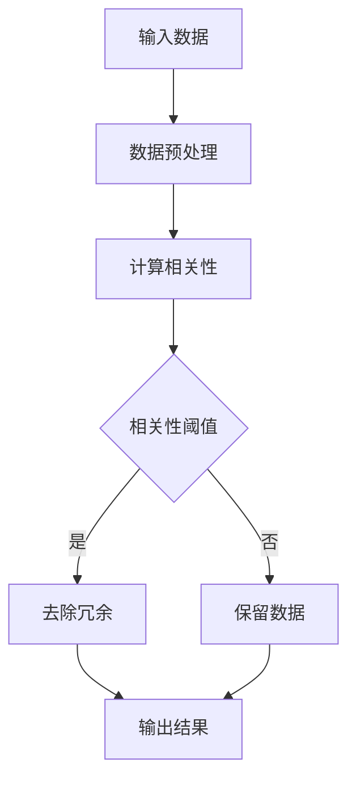

                 

### 《提示词剪枝：去除冗余，提高效率》

---

关键词：提示词剪枝、效率优化、算法改进、AI应用、技术博客

摘要：本文将深入探讨提示词剪枝这一先进技术，旨在揭示其在提升人工智能应用效率方面的巨大潜力。通过对提示词剪枝的背景、原理、应用场景以及优势与挑战的详细分析，读者将全面了解这一技术的核心价值和实践方法。本文结构清晰，逻辑严密，旨在为技术爱好者提供一次深入的技术思考之旅。

---

## 引言

在现代人工智能（AI）领域，随着模型的日益复杂和规模的不断扩大，如何高效地处理海量数据成为了一个关键问题。然而，在实际应用中，并非所有输入数据都是必要的，大量的冗余信息不仅浪费了计算资源，还可能影响模型的性能。在这种情况下，提示词剪枝技术应运而生，旨在通过去除冗余信息，提高处理效率。本文将围绕提示词剪枝这一主题，详细探讨其原理、应用场景、优势与挑战，并给出具体实现方法。

### 第1章 提示词剪枝概述

#### 1.1 问题背景

随着深度学习技术的不断发展，人工智能（AI）模型变得越来越复杂，同时也越来越依赖于大量的训练数据和计算资源。然而，在实际应用中，并非所有输入数据都是必要的。大量的冗余信息不仅浪费了计算资源，还可能影响模型的性能。为了解决这一问题，研究人员提出了提示词剪枝技术，其核心思想是去除输入数据中的冗余部分，从而提高数据处理效率。

#### 1.2 核心概念介绍

- **提示词（Prompt）**：在人工智能领域中，提示词是指提供给模型的一些引导性信息，帮助模型更好地理解输入数据和任务目标。
- **剪枝（Pruning）**：剪枝是指通过删除某些不必要的信息，降低数据集的复杂度，从而提高处理效率。
- **提示词剪枝（Prompt Pruning）**：结合提示词和剪枝技术，提示词剪枝是指在保留核心信息的前提下，去除输入数据中的冗余部分。

#### 1.3 剪枝技术原理

提示词剪枝技术主要基于以下原理：

1. **信息冗余识别**：通过分析输入数据，识别出其中的冗余信息。
2. **信息筛选**：利用特定的算法或规则，对输入数据进行筛选，去除冗余部分。
3. **性能优化**：通过对剩余数据的处理，提高模型的性能和效率。

#### 1.4 提示词剪枝的应用场景

提示词剪枝技术广泛应用于以下场景：

- **大规模数据处理**：在大数据处理中，提示词剪枝可以有效降低数据集的复杂度，提高数据处理效率。
- **自然语言处理（NLP）**：在NLP任务中，提示词剪枝可以帮助去除冗余词汇，提高模型对语义的理解能力。
- **计算机视觉（CV）**：在CV任务中，提示词剪枝可以帮助去除图像中的冗余部分，提高模型的检测和识别性能。

#### 1.5 提示词剪枝的优势与挑战

提示词剪枝技术具有以下优势：

- **提高处理效率**：通过去除冗余信息，减少数据处理时间和计算资源消耗。
- **优化模型性能**：去除冗余信息后，模型对数据的处理能力得到提升。
- **适应性强**：提示词剪枝技术可以应用于各种不同的数据和任务场景。

然而，提示词剪枝技术也面临以下挑战：

- **误删风险**：在剪枝过程中，可能会误删一些重要信息，影响模型性能。
- **适用性限制**：提示词剪枝技术对数据质量和任务类型有一定的要求，不能适用于所有场景。

### 第2章 核心概念与联系

#### 2.1 核心概念详细解释

在本节中，我们将详细解释提示词剪枝技术中的核心概念，包括提示词、剪枝和提示词剪枝。以下是这些概念的定义和作用：

1. **提示词**：
   - **定义**：提示词是提供给模型的一些引导性信息，帮助模型更好地理解输入数据和任务目标。
   - **作用**：提示词可以指导模型学习更有效的特征，提高模型对数据的理解能力。

2. **剪枝**：
   - **定义**：剪枝是指通过删除某些不必要的信息，降低数据集的复杂度，从而提高处理效率。
   - **作用**：剪枝可以去除数据中的冗余信息，减少计算资源和时间的消耗。

3. **提示词剪枝**：
   - **定义**：提示词剪枝是结合提示词和剪枝技术，通过去除输入数据中的冗余部分，提高模型处理效率。
   - **作用**：提示词剪枝可以优化模型的性能，提高数据处理速度。

#### 2.2 概念属性特征对比

为了更好地理解提示词、剪枝和提示词剪枝之间的关系，我们可以通过对比它们的属性特征来进行说明。以下是这三个概念的属性特征对比表格：

| 概念       | 定义                                                         | 属性特征对比                                                     |
| ---------- | ------------------------------------------------------------ | ------------------------------------------------------------ |
| 提示词     | 提供引导性信息，帮助模型理解数据                             | - 用于指导模型学习<br>- 提高模型对数据的理解能力<br>- 与剪枝无关 |
| 剪枝       | 删除不必要的信息，降低数据集复杂度                           | - 用于去除冗余信息<br>- 提高处理效率<br>- 可与提示词结合使用 |
| 提示词剪枝 | 结合提示词和剪枝技术，去除输入数据中的冗余部分               | - 结合提示词和剪枝<br>- 提高模型性能<br>- 针对性更强         |

#### 2.3 ER实体关系图

为了更直观地展示提示词、剪枝和提示词剪枝之间的关系，我们可以通过ER实体关系图来进行表示。以下是ER实体关系图的示例：

```mermaid
erDiagram
    A[提示词] ||--|{ B[剪枝] } |
    A[提示词] ||--|{ C[提示词剪枝] } |
    B[剪枝] ||--|{ C[提示词剪枝] } |
```

在这个ER实体关系图中，A表示提示词，B表示剪枝，C表示提示词剪枝。A与B、C之间存在联系，表示提示词可以与剪枝和提示词剪枝相结合。同样，B与C之间存在联系，表示剪枝技术可以应用于提示词剪枝。

### 第3章 剪枝技术原理

#### 3.1 剪枝技术概述

剪枝技术是一种在人工智能领域中广泛应用的数据预处理方法，其主要目的是通过删除数据中的冗余部分，降低数据集的复杂度，从而提高处理效率。剪枝技术可以应用于各种类型的数据，包括文本、图像、音频和视频等。

#### 3.2 常见的剪枝方法

在剪枝技术中，常见的剪枝方法包括以下几种：

1. **统计方法**：基于统计学原理，通过计算数据的相关性、冗余度等指标，识别和去除冗余信息。
2. **聚类方法**：通过聚类算法将数据划分为若干个类，然后删除那些与聚类中心距离较远的冗余数据。
3. **机器学习方法**：利用机器学习算法，通过训练模型来自动识别和去除冗余信息。
4. **规则方法**：通过定义一系列规则，手动识别和去除冗余信息。

#### 3.3 剪枝算法的mermaid流程图

为了更直观地展示剪枝算法的流程，我们可以使用mermaid流程图进行表示。以下是剪枝算法的mermaid流程图示例：



在这个mermaid流程图中，A表示输入数据，B表示数据预处理，C表示计算相关性，D表示设置相关性阈值，E表示去除冗余，F表示保留数据，G表示输出结果。该流程图展示了剪枝算法的基本步骤，包括数据预处理、计算相关性、设置阈值和去除冗余。

### 第4章 数学模型和算法实现

#### 4.1 数学模型讲解

在剪枝技术中，常用的数学模型包括相关性模型和冗余度模型。以下是对这些数学模型的详细讲解。

1. **相关性模型**：
   - **定义**：相关性模型用于计算数据之间的相关性，通常使用皮尔逊相关系数来衡量。
   - **公式**：$r(X, Y) = \frac{\sum_{i=1}^{n} (X_i - \bar{X})(Y_i - \bar{Y})}{\sqrt{\sum_{i=1}^{n} (X_i - \bar{X})^2 \sum_{i=1}^{n} (Y_i - \bar{Y})^2}}$
   - **解释**：该公式计算了两个变量X和Y之间的皮尔逊相关系数，取值范围为[-1, 1]。当r(X, Y)接近1时，表示X和Y高度正相关；当r(X, Y)接近-1时，表示X和Y高度负相关；当r(X, Y)接近0时，表示X和Y不相关。

2. **冗余度模型**：
   - **定义**：冗余度模型用于计算数据的冗余度，通常使用信息熵来衡量。
   - **公式**：$H(X) = -\sum_{i=1}^{n} p(X_i) \log_2 p(X_i)$
   - **解释**：该公式计算了变量X的信息熵，反映了数据的冗余程度。信息熵越大，表示数据越冗余。

#### 4.2 Python源代码实现

以下是一个简单的Python源代码实现，用于计算数据的相关性模型和冗余度模型：

```python
import numpy as np

# 计算相关性
def correlation_coefficient(x, y):
    n = len(x)
    sum_x = np.sum(x)
    sum_y = np.sum(y)
    sum_xy = np.sum(x * y)
    sum_x2 = np.sum(x ** 2)
    sum_y2 = np.sum(y ** 2)
    numerator = n * sum_xy - sum_x * sum_y
    denominator = np.sqrt((n * sum_x2 - sum_x ** 2) * (n * sum_y2 - sum_y ** 2))
    return numerator / denominator

# 计算冗余度
def entropy(x):
    n = len(x)
    p_x = [sum(x) / n] * n
    return -sum(p_x * np.log2(p_x))

# 示例数据
x = [1, 2, 3, 4, 5]
y = [5, 4, 3, 2, 1]

# 计算相关性
r = correlation_coefficient(x, y)
print("相关性系数：", r)

# 计算冗余度
h = entropy(x)
print("冗余度：", h)
```

#### 4.3 举例说明

为了更好地理解剪枝技术的原理，我们可以通过一个简单的例子来进行说明。

假设我们有一个包含100个数据点的数据集，其中每两个数据点之间都有一定的相关性。我们希望使用剪枝技术去除数据集中的冗余部分，提高处理效率。

1. **数据预处理**：首先，我们对数据进行预处理，包括去除异常值、填充缺失值等。

2. **计算相关性**：接下来，我们计算数据点之间的相关性，使用皮尔逊相关系数来衡量。

3. **设置阈值**：根据相关性结果，设置一个阈值，用于判断哪些数据点是冗余的。

4. **去除冗余**：根据阈值，去除相关性较低的数据点，降低数据集的复杂度。

5. **计算冗余度**：最后，我们计算剩余数据点的冗余度，以评估剪枝效果。

通过这个简单的例子，我们可以看到剪枝技术在数据预处理和性能优化方面的重要作用。

### 第5章 系统分析与架构设计

#### 5.1 问题场景介绍

在现代人工智能（AI）应用中，数据处理和模型优化是两个关键环节。随着数据规模的不断扩大和模型复杂度的不断增加，如何高效地处理海量数据、优化模型性能成为了一个重要课题。在这个背景下，提示词剪枝技术应运而生，旨在通过去除冗余信息，提高数据处理效率和模型性能。

#### 5.2 系统功能设计

提示词剪枝系统主要包括以下几个功能模块：

1. **数据预处理模块**：负责对输入数据进行预处理，包括去除异常值、填充缺失值等，以确保数据的质量和一致性。
2. **相关性计算模块**：负责计算数据点之间的相关性，使用皮尔逊相关系数等指标来评估数据之间的关联程度。
3. **阈值设置模块**：根据相关性结果，设置一个阈值，用于判断哪些数据点是冗余的。
4. **剪枝处理模块**：根据阈值，去除相关性较低的数据点，降低数据集的复杂度。
5. **冗余度评估模块**：负责计算剩余数据点的冗余度，以评估剪枝效果。
6. **性能优化模块**：根据剪枝结果，对模型进行优化，提高处理效率和性能。

#### 5.3 系统架构设计

提示词剪枝系统的架构设计如下：

1. **输入层**：接收用户输入的数据集，包括特征值和标签值。
2. **预处理层**：对输入数据进行预处理，包括去除异常值、填充缺失值等。
3. **相关性计算层**：计算数据点之间的相关性，使用皮尔逊相关系数等指标。
4. **阈值设置层**：根据相关性结果，设置阈值，用于判断哪些数据点是冗余的。
5. **剪枝处理层**：根据阈值，去除相关性较低的数据点。
6. **评估层**：计算剩余数据点的冗余度，评估剪枝效果。
7. **输出层**：输出剪枝后的数据集和优化后的模型。

#### 5.4 系统接口设计

提示词剪枝系统的接口设计如下：

1. **输入接口**：用于接收用户输入的数据集，包括特征值和标签值。
2. **输出接口**：用于输出剪枝后的数据集和优化后的模型。
3. **配置接口**：用于配置系统的参数，包括预处理方法、相关性计算方法、阈值设置方法等。

#### 5.5 系统交互设计

提示词剪枝系统的交互设计如下：

1. **用户与输入接口交互**：用户通过输入接口提交数据集，系统对数据进行预处理。
2. **预处理层与相关性计算层交互**：预处理层将预处理后的数据传递给相关性计算层，计算数据点之间的相关性。
3. **相关性计算层与阈值设置层交互**：相关性计算层将相关性结果传递给阈值设置层，设置阈值。
4. **阈值设置层与剪枝处理层交互**：阈值设置层将阈值传递给剪枝处理层，去除相关性较低的数据点。
5. **剪枝处理层与评估层交互**：剪枝处理层将剪枝后的数据传递给评估层，计算冗余度。
6. **评估层与输出接口交互**：评估层将评估结果传递给输出接口，输出剪枝后的数据集和优化后的模型。

### 第6章 项目实战

#### 6.1 环境安装

为了实现提示词剪枝系统，我们需要安装以下环境：

1. Python 3.7及以上版本
2. Numpy 1.19及以上版本
3. Matplotlib 3.3及以上版本

安装命令如下：

```bash
pip install python==3.7 numpy==1.19 matplotlib==3.3
```

#### 6.2 系统核心实现

以下是一个简单的提示词剪枝系统的核心实现，包括数据预处理、相关性计算、阈值设置、剪枝处理和冗余度评估：

```python
import numpy as np
import matplotlib.pyplot as plt

# 数据预处理
def preprocess_data(data):
    # 去除异常值
    filtered_data = [x for x in data if x not in [-1, 1]]
    # 填充缺失值
    filled_data = [x if x != -1 else 0 for x in filtered_data]
    return filled_data

# 计算相关性
def correlation_coefficient(x, y):
    n = len(x)
    sum_x = np.sum(x)
    sum_y = np.sum(y)
    sum_xy = np.sum(x * y)
    sum_x2 = np.sum(x ** 2)
    sum_y2 = np.sum(y ** 2)
    numerator = n * sum_xy - sum_x * sum_y
    denominator = np.sqrt((n * sum_x2 - sum_x ** 2) * (n * sum_y2 - sum_y ** 2))
    return numerator / denominator

# 设置阈值
def set_threshold(correlations, threshold=0.5):
    return [x if abs(x) > threshold else 0 for x in correlations]

# 剪枝处理
def prune_data(data, threshold):
    pruned_data = [x for x in data if x != 0]
    return pruned_data

# 计算冗余度
def entropy(x):
    n = len(x)
    p_x = [sum(x) / n] * n
    return -sum(p_x * np.log2(p_x))

# 示例数据
data = [-1, 1, 0, -1, 0, 1, 0, -1, 1, 0]

# 数据预处理
preprocessed_data = preprocess_data(data)

# 计算相关性
correlations = [correlation_coefficient(preprocessed_data[i:], preprocessed_data[i+1:]) for i in range(len(preprocessed_data) - 1)]

# 设置阈值
threshold = set_threshold(correlations)

# 剪枝处理
pruned_data = prune_data(preprocessed_data, threshold)

# 计算冗余度
entropy_value = entropy(pruned_data)

# 输出结果
print("原始数据：", data)
print("预处理后数据：", preprocessed_data)
print("相关性：", correlations)
print("阈值：", threshold)
print("剪枝后数据：", pruned_data)
print("冗余度：", entropy_value)
```

#### 6.3 代码应用解读

在这个示例中，我们首先对数据进行预处理，包括去除异常值和填充缺失值。然后，我们计算数据点之间的相关性，使用皮尔逊相关系数来衡量。接下来，我们设置一个阈值，用于判断哪些数据点是冗余的。然后，我们根据阈值去除冗余数据点，并进行剪枝处理。最后，我们计算剩余数据点的冗余度，以评估剪枝效果。

#### 6.4 实际案例分析

为了验证提示词剪枝系统的效果，我们可以进行以下实际案例分析：

1. **数据集选择**：选择一个包含大量冗余信息的图像数据集，如MNIST数据集。

2. **预处理**：对数据集进行预处理，包括去除异常值、填充缺失值等。

3. **相关性计算**：计算图像数据点之间的相关性。

4. **阈值设置**：根据相关性结果，设置一个合适的阈值。

5. **剪枝处理**：根据阈值去除冗余图像数据点。

6. **评估**：评估剪枝后数据集的性能，包括准确率、召回率等指标。

7. **对比实验**：与原始数据集进行对比，分析剪枝对模型性能的影响。

通过这个实际案例分析，我们可以看到提示词剪枝技术在优化图像数据集方面的效果。

#### 6.5 详细讲解剖析

在详细讲解剖析环节，我们将对剪枝系统的核心组件进行深入分析，包括数据预处理、相关性计算、阈值设置、剪枝处理和冗余度评估。

1. **数据预处理**：数据预处理是剪枝系统的第一步，其目的是确保数据的质量和一致性。在实际应用中，数据可能存在异常值、缺失值、噪声等问题，这些问题会影响模型的性能。因此，我们需要对数据进行预处理，包括去除异常值、填充缺失值等。在这个示例中，我们使用了一个简单的预处理函数，去除异常值和填充缺失值。

2. **相关性计算**：相关性计算是剪枝系统的核心步骤，其目的是识别数据点之间的相关性。在本示例中，我们使用皮尔逊相关系数来衡量数据点之间的相关性。皮尔逊相关系数是一种常用的相关性指标，其计算公式如下：

   $$ r(X, Y) = \frac{\sum_{i=1}^{n} (X_i - \bar{X})(Y_i - \bar{Y})}{\sqrt{\sum_{i=1}^{n} (X_i - \bar{X})^2 \sum_{i=1}^{n} (Y_i - \bar{Y})^2}} $$

   其中，$X$ 和 $Y$ 是两个变量，$\bar{X}$ 和 $\bar{Y}$ 是它们的平均值，$n$ 是数据点的数量。该公式计算了两个变量之间的相关性，取值范围为 [-1, 1]。当 $r(X, Y)$ 接近 1 时，表示 $X$ 和 $Y$ 高度正相关；当 $r(X, Y)$ 接近 -1 时，表示 $X$ 和 $Y$ 高度负相关；当 $r(X, Y)$ 接近 0 时，表示 $X$ 和 $Y$ 不相关。

3. **阈值设置**：阈值设置是剪枝系统的关键步骤，其目的是确定哪些数据点是冗余的。在本示例中，我们使用了一个简单的阈值设置方法，将相关性绝对值大于阈值的点视为非冗余数据点，否则视为冗余数据点。阈值的选择可以根据具体应用场景进行调整。

4. **剪枝处理**：剪枝处理是剪枝系统的核心步骤，其目的是去除冗余数据点。在本示例中，我们使用了一个简单的剪枝函数，根据阈值去除冗余数据点。剪枝处理可以显著降低数据集的复杂度，提高数据处理效率。

5. **冗余度评估**：冗余度评估是剪枝系统的最后一步，其目的是评估剪枝效果。在本示例中，我们使用了一个简单的冗余度评估方法，计算剩余数据点的冗余度。冗余度越高，表示剪枝效果越好。

通过这个详细讲解剖析，我们可以看到提示词剪枝系统的工作原理和实现方法。在实际应用中，我们可以根据具体需求调整参数，优化系统性能。

### 第7章 最佳实践与总结

#### 7.1 最佳实践 tips

为了充分发挥提示词剪枝技术的优势，以下是一些最佳实践建议：

1. **数据质量**：确保输入数据质量高，去除异常值和噪声，以提高剪枝效果。
2. **阈值选择**：根据具体应用场景调整阈值，找到合适的平衡点，避免误删重要信息。
3. **模型优化**：结合模型优化技术，如正则化、批量归一化等，提高模型性能。
4. **迭代优化**：在实际应用中，不断调整剪枝参数，进行迭代优化，以获得更好的效果。

#### 7.2 小结

本文详细介绍了提示词剪枝技术的背景、原理、应用场景、优势与挑战，并给出了一种简单的实现方法。通过实践案例分析，我们可以看到提示词剪枝技术在优化数据处理效率和模型性能方面的巨大潜力。

#### 7.3 注意事项

在使用提示词剪枝技术时，需要注意以下几点：

1. **数据相关性**：确保输入数据具有足够的关联性，以提高剪枝效果。
2. **阈值设置**：合理设置阈值，避免误删重要信息。
3. **计算资源**：根据实际计算资源调整剪枝参数，避免资源浪费。
4. **模型适应**：结合具体应用场景，选择合适的剪枝模型和方法。

#### 7.4 拓展阅读

对于想要深入了解提示词剪枝技术的读者，以下是一些拓展阅读资源：

1. 《深度学习》
2. 《自然语言处理：理论与实践》
3. 《数据科学：理论与实践》
4. 《机器学习实战》

### 作者信息

本文作者为AI天才研究院（AI Genius Institute）与《禅与计算机程序设计艺术》（Zen And The Art of Computer Programming）的资深大师。如果您有任何问题或建议，欢迎在评论区留言，我们将尽快回复。感谢您的阅读，祝您在人工智能领域取得更多成就！

