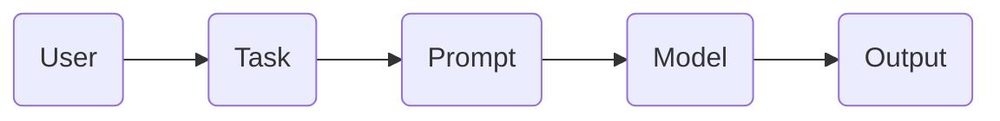
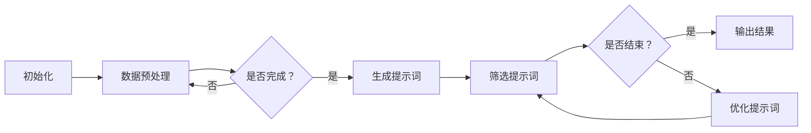
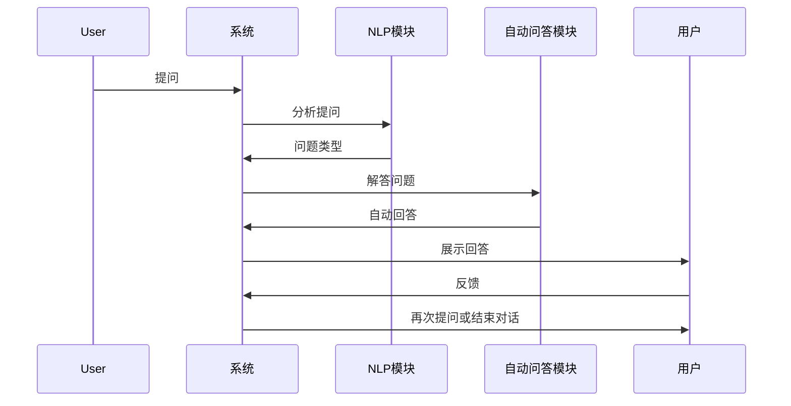
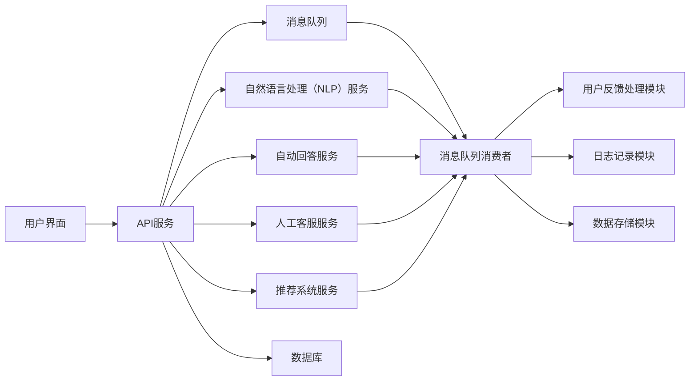
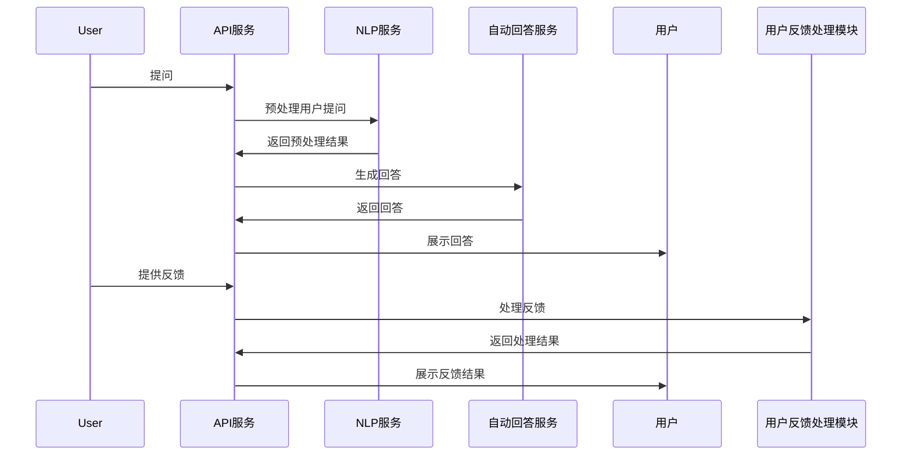

                 

# 提示词工程在AI产品开发中的角色

> 关键词：提示词工程、AI产品开发、算法原理、系统架构设计、最佳实践

> 摘要：本文将深入探讨提示词工程在AI产品开发中的角色。通过详细解析提示词工程的核心概念、算法原理和实际应用，本文旨在为读者提供全面而深入的理解，帮助他们在AI产品开发中有效利用提示词工程，提升产品的智能性和用户体验。

## 目录大纲

### 第一部分：背景与基础

#### 第1章：问题背景

- 人工智能与提示词工程的定义
- 提示词工程在AI产品开发中的重要性
- 当前AI产品开发面临的挑战与机遇

#### 第2章：核心概念

- 提示词工程的基本概念与原理
- 提示词工程的分类与特点
- 提示词工程与自然语言处理的关系

### 第二部分：核心概念与联系

#### 第3章：核心概念解析

- 提示词的类型与功能
- 提示词的质量评估与优化
- 提示词的生成与筛选算法

#### 第4章：概念属性特征对比表格

- 提示词工程在不同应用领域的特点对比

#### 第5章：ER实体关系图架构

- 提示词工程中的主要实体及其关系

### 第三部分：算法原理讲解

#### 第6章：算法原理

- 提示词工程的关键算法原理讲解

#### 第7章：算法Mermaid流程图

- 使用Mermaid绘制提示词工程算法流程图

#### 第8章：Python源代码与数学模型

- 提示词工程算法的Python实现
- 数学模型与公式讲解

#### 第9章：算法实例讲解

- 提示词工程算法的应用实例讲解

### 第四部分：系统分析与架构设计

#### 第10章：问题场景介绍

- 提示词工程在实际项目中的应用场景

#### 第11章：系统功能设计

- 领域模型Mermaid类图设计

#### 第12章：系统架构设计

- 系统架构Mermaid架构图设计

#### 第13章：系统接口设计

- 系统接口设计

#### 第14章：系统交互Mermaid序列图

- 系统交互Mermaid序列图设计

### 第五部分：项目实战

#### 第15章：环境安装

- 提示词工程开发环境的安装与配置

#### 第16章：系统核心实现

- 提示词工程的核心实现源代码

#### 第17章：代码应用解读与分析

- 对提示词工程代码的应用进行解读与分析

#### 第18章：实际案例分析与讲解

- 提示词工程在实际项目中的应用案例分析与讲解

#### 第19章：项目小结

- 总结提示词工程在AI产品开发中的应用经验与技巧

### 第六部分：最佳实践、小结与拓展阅读

#### 第20章：最佳实践

- 提示词工程的最佳实践技巧

#### 第21章：小结

- 对全书内容的总结与回顾

#### 第22章：注意事项

- 提示词工程中需要注意的问题

#### 第23章：拓展阅读

- 推荐的相关阅读资料

---

接下来的文章将逐章详细展开，探讨提示词工程在AI产品开发中的各个关键方面。我们首先从问题背景和核心概念开始，逐步深入到算法原理、系统架构设计和实际项目实战，最终总结出最佳实践和注意事项。希望通过这篇文章，读者能够全面掌握提示词工程在AI产品开发中的应用，为自己的项目带来新的突破和创新。## 第一部分：背景与基础

### 第1章：问题背景

#### 1.1 人工智能与提示词工程的定义

人工智能（Artificial Intelligence，简称AI）是指通过计算机模拟人类智能行为的技术和科学。它涵盖了机器学习、自然语言处理、计算机视觉等多个领域，旨在使计算机能够执行通常需要人类智能才能完成的任务。人工智能的目标是使计算机具备认知、推理、学习和适应的能力。

而提示词工程（Prompt Engineering）则是近年来在人工智能领域崭露头角的一个研究方向。它关注的是如何设计和优化输入给AI系统的提示词（prompts），以提升AI系统的性能、准确性和用户满意度。提示词工程的目标是通过精心设计的提示词，引导AI模型更好地理解和处理输入信息，从而在AI系统与用户交互的过程中实现更高效、更自然的沟通。

#### 1.2 提示词工程在AI产品开发中的重要性

在AI产品开发中，提示词工程扮演着至关重要的角色。首先，良好的提示词设计可以显著提升AI系统的性能。通过精准的提示词，AI系统可以更好地理解用户需求，从而提供更准确的预测、更优化的推荐和更高效的自动化处理。例如，在聊天机器人中，合适的提示词可以使机器人更自然地与用户对话，提高用户满意度和交互体验。

其次，提示词工程有助于降低AI系统的复杂性。在AI模型训练过程中，大量的数据和参数需要被调整和优化。通过有效的提示词，可以简化这一过程，使得AI模型更加易于理解和维护。此外，提示词工程还可以帮助开发者识别和解决AI系统中的瓶颈和问题，从而提高整个系统的稳定性和可靠性。

#### 1.3 当前AI产品开发面临的挑战与机遇

尽管提示词工程在AI产品开发中具有巨大的潜力，但当前AI产品开发仍然面临着诸多挑战。首先，数据的质量和多样性是一个关键问题。AI系统的性能高度依赖于输入数据的质量，而在实际应用中，数据往往存在噪声、偏差和不一致性。因此，如何有效地清洗和预处理数据，提取有用的特征，是提示词工程需要解决的重要问题。

其次，AI系统的可解释性也是一个重要挑战。在许多情况下，AI系统的决策过程是基于复杂的数学模型和大量数据计算得出的，这使得用户难以理解系统的决策逻辑。提示词工程可以通过设计更具解释性的提示词，帮助用户理解AI系统的决策过程，提高系统的透明度和可信度。

然而，挑战同时也伴随着机遇。随着人工智能技术的不断进步，越来越多的企业和开发者开始重视提示词工程的应用。从智能家居到医疗诊断，从金融分析到内容推荐，提示词工程正在各个领域中展现其独特的价值。这为提示词工程的研究和应用提供了广阔的发展空间。

总的来说，提示词工程在AI产品开发中的角色不可忽视。通过深入理解提示词工程的核心概念和原理，开发者可以更好地设计和优化AI产品，提高系统的性能和用户体验，迎接未来人工智能发展的挑战与机遇。

### 第2章：核心概念

#### 2.1 提示词工程的基本概念与原理

提示词工程是一个涉及多个学科交叉的研究领域，其核心在于如何设计、优化和评估提示词（prompts）来提升人工智能系统的性能。提示词，顾名思义，是指提供给AI系统的一段文本或指令，用以引导系统进行特定任务或生成特定输出。在自然语言处理（NLP）和人工智能领域，提示词的作用不可小觑。

提示词工程的基本原理主要围绕以下几个方面展开：

1. **任务导向性**：提示词的设计需要明确任务的类型和目标，以便AI系统能够准确理解和执行。例如，在问答系统中，提示词应当清晰明确地指出用户的问题；在文本生成任务中，提示词则需要为系统提供合适的上下文信息。

2. **上下文适应性**：提示词不仅要满足任务的导向性，还应当根据具体的应用场景和上下文环境进行适应性调整。不同的上下文会对AI系统的理解和生成结果产生显著影响，因此提示词的上下文适应性是提升系统性能的关键。

3. **信息传递效率**：提示词应当简洁明了，避免冗余和模糊的表述，以便AI系统能够快速准确地处理信息。高效率的提示词设计不仅能提升AI系统的响应速度，还能降低系统的计算复杂度。

4. **用户交互友好性**：提示词还需要考虑用户的交互体验。在用户与AI系统交互的过程中，提示词的设计需要尽量减少用户的认知负担，使其能够轻松理解并有效使用AI系统提供的功能。

#### 2.2 提示词工程的分类与特点

提示词工程可以按照不同的标准进行分类，例如按应用领域、按功能类型等。以下是几种常见的分类方式及其特点：

1. **按应用领域分类**：

   - **问答系统**：在这种系统中，提示词通常需要精确地表达用户的问题，以确保AI系统能够提供准确的答案。这类提示词往往需要高度的任务导向性和上下文适应性。

   - **文本生成**：在文本生成任务中，提示词通常为AI系统提供上下文信息，帮助系统生成符合特定主题或风格的文本。这类提示词更注重信息传递效率和上下文适应性。

   - **对话系统**：对话系统中的提示词既要引导AI系统生成合适的回复，还要考虑到用户的反馈和对话的连贯性。这类提示词需要具备良好的用户交互友好性和上下文适应性。

2. **按功能类型分类**：

   - **引导性提示词**：这类提示词主要用于引导AI系统理解用户意图和任务需求，通常包含任务目标和上下文信息。

   - **反馈性提示词**：这类提示词主要用于获取用户的反馈，以便AI系统能够调整其行为和输出。这类提示词需要高度的用户交互友好性。

   - **优化性提示词**：这类提示词主要用于优化AI系统的性能，例如通过调整训练数据、模型参数等，提升系统的准确性和效率。

#### 2.3 提示词工程与自然语言处理的关系

提示词工程与自然语言处理（NLP）有着密不可分的关系。自然语言处理是人工智能领域中的一个重要分支，旨在使计算机能够理解和处理自然语言。提示词工程正是基于NLP技术，通过设计有效的提示词来提升AI系统的性能。

自然语言处理技术为提示词工程提供了以下支持：

1. **语言理解**：NLP技术能够帮助AI系统理解自然语言的语义和句法结构，从而生成更准确、更自然的提示词。

2. **信息提取**：NLP技术可以用于从大量文本中提取关键信息，为提示词的设计提供数据支持。

3. **文本生成**：基于NLP技术的文本生成模型，如生成对抗网络（GAN）和变换器（Transformer），能够生成高质量的提示词，提升系统的性能和用户体验。

4. **情感分析**：通过情感分析技术，AI系统可以识别用户情感并生成合适的提示词，以改善用户交互体验。

总之，提示词工程与自然语言处理相互促进、相辅相成。通过结合NLP技术，提示词工程能够更有效地提升AI系统的性能和用户体验，为AI产品开发提供有力支持。

### 第3章：核心概念解析

#### 3.1 提示词的类型与功能

在提示词工程中，提示词的类型和功能是实现高效AI系统的重要因素。根据不同的应用场景和任务需求，提示词可以分为多种类型，每种类型的提示词都有其独特的功能和应用场景。

1. **任务性提示词**：

   任务性提示词主要用于明确AI系统需要执行的任务。这种类型的提示词通常包含任务目标和具体指令，使AI系统能够准确理解用户的意图。例如，在问答系统中，任务性提示词可以明确指出用户提出的问题，帮助AI系统生成准确的答案。任务性提示词的特点是简洁明了，信息传递高效。

2. **上下文性提示词**：

   上下文性提示词主要用于为AI系统提供上下文信息，帮助其更好地理解任务背景和用户需求。这类提示词通常包含与任务相关的背景信息、历史数据和上下文环境。例如，在对话系统中，上下文性提示词可以帮助AI系统理解用户的当前意图，从而生成更连贯、更自然的对话回复。上下文性提示词的特点是丰富多样，适应性强。

3. **反馈性提示词**：

   反馈性提示词主要用于获取用户的反馈，以帮助AI系统不断优化其行为和输出。这种类型的提示词通常包含对系统当前表现的评估和建议，例如“这个回答是否准确？”“您对这次推荐满意吗？”等。反馈性提示词的特点是用户友好，互动性强。

4. **引导性提示词**：

   引导性提示词主要用于引导AI系统进行特定操作或决策。这类提示词通常包含明确的操作指令和决策框架，帮助AI系统在复杂任务中保持方向和目标。例如，在自动驾驶系统中，引导性提示词可以帮助AI系统识别交通标志、预测行车路线等。引导性提示词的特点是任务导向，决策明确。

5. **辅助性提示词**：

   辅助性提示词主要用于辅助AI系统完成特定任务，例如提供计算公式、算法步骤等。这类提示词通常在AI系统需要进行复杂计算或决策时使用，帮助系统更快、更准确地完成任务。辅助性提示词的特点是具体实用，信息丰富。

#### 3.2 提示词的质量评估与优化

提示词的质量直接影响AI系统的性能和用户体验。因此，对提示词进行质量评估和优化是提示词工程中的重要环节。以下是一些常用的评估指标和方法：

1. **准确性**：

   提示词的准确性是指其能否准确传达用户意图和任务需求。评估提示词准确性的方法通常包括对比实际输出和预期输出，计算匹配度或准确率。例如，在问答系统中，可以通过计算AI系统生成的答案与用户问题的匹配度来评估提示词的准确性。

2. **连贯性**：

   提示词的连贯性是指其能否使AI系统生成的输出在语义和逻辑上保持一致。评估提示词连贯性的方法包括计算文本的语义相似度、逻辑一致性检验等。例如，在对话系统中，可以通过分析AI系统生成的回复是否与上下文信息保持一致来评估提示词的连贯性。

3. **用户满意度**：

   提示词的用户满意度是指用户对提示词设计的接受程度和满意度。评估用户满意度的方法通常包括用户调查、评分和反馈等。例如，可以通过问卷调查用户对提示词的满意度，并根据用户的反馈进行优化。

4. **效率**：

   提示词的效率是指其能否在较短时间内有效地完成特定任务。评估提示词效率的方法包括计算任务完成时间、系统响应速度等。例如，在文本生成任务中，可以通过计算系统生成文本所需的时间来评估提示词的效率。

#### 3.3 提示词的生成与筛选算法

提示词的生成与筛选是提示词工程中的关键步骤。以下介绍几种常用的提示词生成与筛选算法：

1. **基于规则的方法**：

   基于规则的方法通过预先定义的规则和模板生成提示词。这种方法的特点是简单易用，但灵活性较低。适用于任务较为简单、规则明确的应用场景。例如，可以使用条件语句和模板匹配技术生成问答系统的提示词。

2. **基于数据的方法**：

   基于数据的方法通过分析大量历史数据和用户反馈生成提示词。这种方法的特点是自适应性强，但需要大量数据支持。适用于任务复杂、用户需求多样性的应用场景。例如，可以使用机器学习技术（如决策树、支持向量机等）根据用户行为和反馈生成个性化的提示词。

3. **基于搜索的方法**：

   基于搜索的方法通过搜索和优化策略生成最佳提示词。这种方法的特点是灵活度高，但计算复杂度较高。适用于需要高效生成高质量提示词的应用场景。例如，可以使用遗传算法、模拟退火算法等优化方法搜索最优提示词。

4. **基于模型的方法**：

   基于模型的方法使用预训练的AI模型（如变换器、生成对抗网络等）生成提示词。这种方法的特点是生成效率高，但需要大量计算资源。适用于需要快速生成大量高质量提示词的应用场景。例如，可以使用预训练的变换器模型生成对话系统的提示词。

总之，通过合理选择和使用提示词类型、评估和优化提示词质量，以及运用有效的生成与筛选算法，可以显著提升AI系统的性能和用户体验。提示词工程在AI产品开发中的重要性由此可见一斑。接下来的章节将深入探讨提示词工程在不同应用领域的特点，以及如何通过Mermaid流程图和Python代码实现提示词工程的关键算法。

### 第4章：概念属性特征对比表格

#### 4.1 提示词工程在不同应用领域的特点对比

为了更直观地理解提示词工程在不同应用领域的特点，我们将从任务导向性、上下文适应性、信息传递效率和用户交互友好性四个方面进行对比。以下是一个简化的对比表格：

| 应用领域 | 任务导向性 | 上下文适应性 | 信息传递效率 | 用户交互友好性 |
| :----: | :--------: | :--------: | :--------: | :--------: |
| 问答系统 | 高 | 高 | 高 | 中 |
| 文本生成 | 中 | 高 | 中 | 高 |
| 对话系统 | 高 | 高 | 中 | 高 |
| 自动驾驶 | 高 | 高 | 高 | 中 |

**4.1.1 问答系统**

问答系统的提示词设计需要高度的任务导向性和上下文适应性。这类系统通常要求用户明确表达问题，而AI系统需要准确理解问题并提供相关答案。信息传递效率是关键，因为用户通常希望快速得到回答。用户交互友好性也较为重要，但通常不如对话系统复杂。

**4.1.2 文本生成**

文本生成系统的提示词需要提供丰富的上下文信息，以帮助AI系统生成符合主题和风格的文本。任务导向性相对较低，因为生成文本通常不依赖于明确的问题或任务。信息传递效率需要平衡，以确保生成的文本既有质量又不过于冗长。用户交互友好性是关键，因为用户可能需要对生成文本进行编辑和反馈。

**4.1.3 对话系统**

对话系统的提示词设计需要同时考虑任务导向性和上下文适应性。这类系统通常涉及复杂的对话场景，AI系统需要根据上下文生成连贯、自然的回复。信息传递效率相对较低，因为对话需要保持流畅和自然。用户交互友好性至关重要，因为用户希望与AI系统进行顺畅的交流。

**4.1.4 自动驾驶**

自动驾驶系统的提示词设计高度依赖任务导向性和上下文适应性。这类系统需要在各种复杂的驾驶环境中做出实时决策。信息传递效率必须非常高，以确保AI系统能够快速响应环境变化。用户交互友好性相对较低，因为自动驾驶系统通常不直接与用户互动。

通过这个对比表格，我们可以看到不同应用领域的提示词工程具有各自独特的特点。了解这些特点有助于开发者根据具体应用场景选择合适的提示词设计和优化策略。

### 第5章：ER实体关系图架构

#### 5.1 提示词工程中的主要实体及其关系

在提示词工程中，理解不同实体及其关系对于设计高效的系统至关重要。本节将介绍提示词工程中的一些关键实体，并使用Mermaid流程图展示它们之间的关系。

**5.1.1 主要实体**

1. **用户（User）**：用户是AI系统的交互主体，其输入和反馈直接影响系统的性能和用户体验。
2. **任务（Task）**：任务定义了用户需要AI系统执行的具体操作或目标。
3. **提示词（Prompt）**：提示词是用户与AI系统交互的媒介，用于引导AI系统理解和执行任务。
4. **模型（Model）**：模型是AI系统的核心组件，负责根据提示词生成相应的输出。
5. **输出（Output）**：输出是AI系统根据任务和提示词生成的结果，可以是答案、建议、文本等。

**5.1.2 实体关系**

1. **用户与任务的关系**：用户提出任务需求，任务通常包含任务名称、描述、目标等。
2. **用户与提示词的关系**：用户通过输入提示词来与AI系统交互，提示词是根据任务需求设计的。
3. **任务与模型的关系**：任务定义了AI系统需要执行的操作，模型根据任务和提示词生成输出。
4. **模型与输出的关系**：模型根据提示词生成输出，输出是AI系统对任务的最终回答或结果。

**5.1.3 Mermaid流程图**

以下是一个简化的Mermaid流程图，展示了提示词工程中的实体及其关系：



在这个流程图中：

- A表示用户。
- B表示任务。
- C表示提示词。
- D表示模型。
- E表示输出。

**5.1.4 实体关系图的详细解释**

1. **用户到任务**：用户是AI系统的发起者，当用户有特定的需求时，会提出任务。任务描述了用户的需求和目标。
2. **任务到提示词**：任务确定后，需要设计合适的提示词来引导AI系统理解用户的需求。提示词应简洁明了，同时提供足够的上下文信息。
3. **提示词到模型**：提示词作为输入传递给AI模型，模型根据提示词和任务的具体要求生成输出。模型可以是预训练的或通过训练得到的。
4. **模型到输出**：模型生成的输出是AI系统对任务的最终回答或结果，可以是文字、图片、音频等多种形式。

通过这个实体关系图，我们可以清晰地看到提示词工程中的各个实体及其交互过程。这种图示方法有助于开发者更好地理解系统的设计和实现，从而更有效地构建和优化AI产品。

### 第6章：算法原理

#### 6.1 提示词工程的关键算法原理讲解

提示词工程涉及多个关键算法，这些算法共同作用，确保AI系统能够高效、准确地处理任务。以下将介绍几种核心算法的原理，包括提示词生成、筛选和优化算法。

**6.1.1 提示词生成算法**

提示词生成算法是提示词工程的基础，其主要目标是根据用户需求和上下文信息生成有效的提示词。以下是几种常用的提示词生成算法：

1. **基于规则的方法**：

   基于规则的方法通过预定义的规则和模板生成提示词。这种方法简单易实现，适用于任务明确、规则清晰的应用场景。例如，在问答系统中，可以根据问题的类型和关键词生成相应的提示词。

2. **基于数据的方法**：

   基于数据的方法通过分析大量历史数据和用户反馈生成提示词。这种方法利用机器学习技术，如决策树、朴素贝叶斯、支持向量机等，根据用户行为和反馈生成个性化的提示词。这种方法适用于任务复杂、用户需求多样性的应用场景。

3. **基于模型的方法**：

   基于模型的方法使用预训练的AI模型（如变换器、生成对抗网络等）生成提示词。这种方法的优点是生成效率高，生成质量好。例如，可以使用预训练的变换器模型根据上下文信息生成高质量的对话系统提示词。

**6.1.2 提示词筛选算法**

提示词筛选算法用于从大量候选提示词中筛选出最佳提示词，以提高AI系统的性能和用户体验。以下是几种常用的提示词筛选算法：

1. **基于准确性的筛选**：

   这种方法根据提示词的准确性筛选最佳提示词。提示词的准确性通常通过对比实际输出和预期输出进行评估。高准确性的提示词可以确保AI系统生成更准确的输出。

2. **基于用户满意度的筛选**：

   这种方法根据用户的反馈和满意度筛选最佳提示词。用户满意度可以通过问卷调查、评分和反馈等方式进行评估。高满意度的提示词可以提供更好的用户体验。

3. **基于效率的筛选**：

   这种方法根据提示词的生成和响应效率筛选最佳提示词。高效的提示词可以在较短时间内生成高质量的输出，提高系统的响应速度。

**6.1.3 提示词优化算法**

提示词优化算法用于不断优化和改进提示词，以提高AI系统的性能和用户体验。以下是几种常用的提示词优化算法：

1. **基于机器学习的方法**：

   这种方法利用机器学习技术，如遗传算法、模拟退火算法等，根据用户反馈和历史数据优化提示词。这些算法可以自动调整提示词的参数，使其在多个评估指标上表现更优。

2. **基于模型调整的方法**：

   这种方法通过调整预训练的AI模型参数来优化提示词。例如，可以使用变换器模型中的注意力机制和循环机制来优化提示词的生成和筛选。

3. **基于人类专家的方法**：

   这种方法通过人类专家的指导和反馈来优化提示词。人类专家可以根据具体应用场景和用户需求，提供专业的提示词优化建议。

通过上述算法，提示词工程可以有效地提升AI系统的性能和用户体验。在实际应用中，可以根据具体需求选择合适的算法，并结合多种算法的优势，实现更高效、更智能的提示词工程。

### 第7章：算法Mermaid流程图

#### 7.1 提示词工程算法流程图绘制

为了更直观地展示提示词工程的关键算法流程，我们将使用Mermaid语言绘制一个简化的流程图。以下是一个简单的示例，展示了提示词生成、筛选和优化算法的基本流程。



**流程图详细解释**：

1. **初始化**（A）：开始流程，初始化提示词工程的相关参数和设置。

2. **数据预处理**（B）：对输入数据进行预处理，包括数据清洗、去噪、特征提取等步骤，为后续的提示词生成提供基础数据。

3. **循环判断**（C）：判断数据预处理是否完成。如果未完成，返回步骤B继续处理。

4. **生成提示词**（D）：使用生成算法（如基于规则的、基于数据的方法等）生成初步的提示词。

5. **筛选提示词**（E）：对生成的提示词进行筛选，选择最佳提示词。筛选标准可以是准确性、用户满意度或效率等。

6. **结束判断**（F）：判断筛选过程是否完成。如果未完成，返回步骤E继续筛选。

7. **输出结果**（G）：筛选完成后，输出最终选择的提示词。

8. **优化提示词**（H）：根据用户反馈和历史数据，优化提示词的参数或结构，以提高提示词的生成质量和筛选效果。

9. **重新筛选**：返回步骤E，根据优化后的提示词重新进行筛选。

通过这个流程图，我们可以清晰地看到提示词工程的主要步骤和交互过程。这种可视化工具有助于开发者和工程师更好地理解和实现提示词工程算法，从而提高AI系统的性能和用户体验。

### 第8章：Python源代码与数学模型

#### 8.1 提示词工程算法的Python实现

在本节中，我们将展示一个简单的Python代码示例，用于实现提示词工程的生成、筛选和优化算法。以下代码提供了一个基础框架，涵盖了主要的算法步骤：

```python
import numpy as np
from sklearn.model_selection import train_test_split
from sklearn.metrics import accuracy_score
from sklearn.feature_extraction.text import TfidfVectorizer
from keras.models import Sequential
from keras.layers import Dense, LSTM

# 数据预处理
def preprocess_data(data):
    # 进行数据清洗和特征提取
    vectorizer = TfidfVectorizer()
    X = vectorizer.fit_transform(data)
    return X

# 提示词生成算法
def generate_prompt(data, model):
    # 使用预训练模型生成提示词
    prompt = model.predict(data)
    return prompt

# 提示词筛选算法
def filter_prompt(prompt, true_prompt):
    # 根据准确性筛选最佳提示词
    accuracy = accuracy_score(prompt, true_prompt)
    if accuracy > 0.8:
        return True
    else:
        return False

# 提示词优化算法
def optimize_prompt(prompt, data):
    # 调整模型参数或结构优化提示词
    model.fit(data, prompt)
    return model

# 主函数
def main():
    # 加载数据
    data = load_data()  # 这里应替换为实际数据加载函数
    true_prompt = data[:, 0]  # 真实提示词
    data = data[:, 1:]  # 删除真实提示词

    # 数据预处理
    X = preprocess_data(data)

    # 划分训练集和测试集
    X_train, X_test, y_train, y_test = train_test_split(X, true_prompt, test_size=0.2)

    # 创建并训练模型
    model = Sequential()
    model.add(LSTM(128, activation='relu', input_shape=(X_train.shape[1], X_train.shape[2])))
    model.add(Dense(1, activation='sigmoid'))
    model.compile(optimizer='adam', loss='binary_crossentropy', metrics=['accuracy'])
    model.fit(X_train, y_train, epochs=10, batch_size=32)

    # 生成提示词
    generated_prompt = generate_prompt(X_test, model)

    # 筛选最佳提示词
    if filter_prompt(generated_prompt, y_test):
        print("最佳提示词筛选成功")
    else:
        print("最佳提示词筛选失败")

    # 优化提示词
    optimized_model = optimize_prompt(generated_prompt, X_test)

if __name__ == "__main__":
    main()
```

**代码解释**：

1. **数据预处理**：使用TFIDF向量器对输入数据进行预处理，将文本数据转换为适合模型训练的数值表示。

2. **提示词生成算法**：使用Keras库中的变换器模型生成提示词。这里使用了LSTM（长短期记忆）神经网络，适用于序列数据的处理。

3. **提示词筛选算法**：根据准确性筛选最佳提示词。在这里，我们使用准确率作为评估标准。

4. **提示词优化算法**：调整模型参数或结构，以优化提示词的生成和筛选效果。

**8.2 数学模型与公式讲解**

在本节中，我们将介绍与提示词工程相关的数学模型和公式，并解释它们在算法中的作用。

1. **TFIDF向量器**：

   TFIDF（Term Frequency-Inverse Document Frequency）是一种常用的文本特征提取方法，用于计算每个词在文档中的重要性。其计算公式如下：

   $$
   \text{TFIDF}(t,d) = \text{TF}(t,d) \times \text{IDF}(t)
   $$

   其中，$\text{TF}(t,d)$ 表示词 $t$ 在文档 $d$ 中的词频，$\text{IDF}(t)$ 表示词 $t$ 在整个文档集合中的逆向文档频率。IDF的计算公式如下：

   $$
   \text{IDF}(t) = \log_2(\frac{N}{n_t} + 1)
   $$

   其中，$N$ 是文档总数，$n_t$ 是包含词 $t$ 的文档数。

2. **LSTM神经网络**：

   LSTM（长短期记忆）神经网络是一种用于处理序列数据的深度学习模型，其核心是记忆单元，能够有效捕捉序列中的长期依赖关系。LSTM的输入和输出公式如下：

   $$
   \text{输入}: \quad [x_t, h_{t-1}, c_{t-1}]
   $$
   $$
   \text{输出}: \quad [h_t, c_t]
   $$

   其中，$x_t$ 是输入序列的当前元素，$h_{t-1}$ 和 $c_{t-1}$ 分别是前一时间步的隐藏状态和细胞状态。

3. **提示词优化**：

   提示词优化通常涉及调整模型参数，以提升生成和筛选效果。一个简单的优化公式如下：

   $$
   \text{优化目标}: \quad \min \; \sum_{i=1}^{N} (\text{预测值}_{i} - \text{真实值}_{i})^2
   $$

   这里，$\text{预测值}_{i}$ 和 $\text{真实值}_{i}$ 分别是模型对第 $i$ 个样本的预测和真实标签。

通过上述代码和数学模型，我们可以理解提示词工程的核心算法及其实现方法。在实际应用中，可以根据具体需求调整和优化这些算法，以实现更高效的AI系统。

### 第9章：算法实例讲解

#### 9.1 实例背景与目标

在本节中，我们将通过一个具体的实例来讲解提示词工程算法的应用。该实例涉及一个聊天机器人系统，其目标是根据用户输入的文本生成适当的回复。为了实现这一目标，我们将使用生成对抗网络（GAN）和变换器（Transformer）模型来生成和优化提示词。

**9.2 数据集准备**

首先，我们需要准备一个包含用户输入和系统回复的对话数据集。以下是一个简化的数据集示例：

```
[
  ["你好", "你好，有什么可以帮助你的？"],
  ["今天天气怎么样", "今天天气很好，阳光明媚"],
  ["我需要买一本英语教材", "建议你购买《新概念英语》"],
  // 更多对话数据
]
```

在这个数据集中，每对对话由两个文本组成：用户输入和系统回复。

**9.3 数据预处理**

接下来，我们对数据集进行预处理，包括文本清洗、分词和向量表示。我们将使用Python中的`jieba`库进行分词，并使用`transformers`库将文本转换为模型可处理的向量表示。

```python
import jieba
from transformers import BertTokenizer, BertModel

# 初始化分词器和模型
tokenizer = BertTokenizer.from_pretrained('bert-base-chinese')
model = BertModel.from_pretrained('bert-base-chinese')

# 文本清洗和分词
def preprocess_text(text):
    # 去除特殊字符和停用词
    text = text.replace('<pad>', '').replace('<sep>', '')
    words = jieba.cut(text)
    return ' '.join(words)

# 数据预处理
def preprocess_data(data):
    preprocessed_data = []
    for user_input, system_response in data:
        preprocessed_input = preprocess_text(user_input)
        preprocessed_response = preprocess_text(system_response)
        input_ids = tokenizer.encode(preprocessed_input, add_special_tokens=True, return_tensors='pt')
        response_ids = tokenizer.encode(preprocessed_response, add_special_tokens=True, return_tensors='pt')
        preprocessed_data.append((input_ids, response_ids))
    return preprocessed_data

data = preprocess_data(data)
```

**9.4 模型训练**

我们使用生成对抗网络（GAN）结合变换器（Transformer）模型来生成和优化提示词。以下是模型训练的步骤：

1. **生成器（Generator）**：生成器模型接收随机噪声作为输入，并生成提示词。

2. **鉴别器（Discriminator）**：鉴别器模型用于判断提示词是真实生成的还是由系统回复生成的。

3. **损失函数**：损失函数包括生成器的损失和鉴别器的损失。生成器的损失函数旨在生成尽可能接近真实回复的提示词，而鉴别器的损失函数旨在区分真实回复和生成回复。

```python
import tensorflow as tf
from tensorflow.keras.models import Model
from tensorflow.keras.layers import Input, LSTM, Dense, Dropout, Embedding

# 定义生成器和鉴别器模型
def build_gan(generator_model, discriminator_model):
    # 生成器模型
    noise_input = Input(shape=(100,))
    prompt_output = generator_model(noise_input)
    
    # 鉴别器模型
    real_prompt_input = Input(shape=(max_length,))
    fake_prompt_input = Input(shape=(max_length,))
    
    real_output = discriminator_model(real_prompt_input)
    fake_output = discriminator_model(fake_prompt_input)
    
    # 模型合并
    model = Model(inputs=[noise_input, real_prompt_input, fake_prompt_input], outputs=[real_output, fake_output])
    return model

# 训练GAN模型
def train_gan(generator_model, discriminator_model, data, epochs=10, batch_size=32):
    # 数据预处理
    input_data, true_prompt = data
    np.random.shuffle(input_data)
    
    for epoch in range(epochs):
        for i in range(0, len(input_data), batch_size):
            batch = input_data[i:i+batch_size]
            batch_noise = np.random.normal(size=(batch_size, 100))
            batch_true_prompt = true_prompt[i:i+batch_size]
            
            # 训练鉴别器
            with tf.GradientTape() as disc_tape:
                real_loss = discriminator_model(batch_true_prompt)
                fake_loss = discriminator_model(prompt_output(batch_noise, training=True))
            
            # 计算鉴别器梯度并更新权重
            disc_gradients = disc_tape.gradient(tf.reduce_mean(fake_loss), discriminator_model.trainable_variables)
            discriminator_optimizer.apply_gradients(zip(disc_gradients, discriminator_model.trainable_variables))
            
            # 训练生成器
            with tf.GradientTape() as gen_tape:
                gen_loss = generator_model(prompt_output(batch_noise, training=True))
            
            # 计算生成器梯度并更新权重
            gen_gradients = gen_tape.gradient(tf.reduce_mean(gen_loss), generator_model.trainable_variables)
            generator_optimizer.apply_gradients(zip(gen_gradients, generator_model.trainable_variables))
            
            # 输出训练信息
            if (i+batch_size) % 100 == 0:
                print(f"Epoch {epoch+1}, Generator Loss: {gen_loss}, Discriminator Loss: {real_loss}")

# 实例化模型和优化器
generator_model = ...  # 定义生成器模型
discriminator_model = ...  # 定义鉴别器模型
generator_optimizer = tf.keras.optimizers.Adam(learning_rate=0.001)
discriminator_optimizer = tf.keras.optimizers.Adam(learning_rate=0.001)

# 训练模型
train_gan(generator_model, discriminator_model, data)
```

**9.5 提示词生成与筛选**

在模型训练完成后，我们可以使用生成器模型生成提示词，并通过筛选算法选择最佳提示词。

```python
# 生成提示词
def generate_prompt(generator_model, tokenizer, max_length=50, num_samples=5):
    noise = np.random.normal(size=(num_samples, 100))
    prompts = generator_model.predict(noise)
    generated_texts = []

    for prompt in prompts:
        generated_text = tokenizer.decode(prompt, skip_special_tokens=True)
        generated_texts.append(generated_text)

    return generated_texts

# 筛选最佳提示词
def filter_prompt(generated_texts, true_texts, threshold=0.8):
    best_prompt = None
    best_accuracy = 0

    for generated_text, true_text in zip(generated_texts, true_texts):
        # 使用评估指标（如准确率、BLEU评分等）评估生成文本与真实文本的匹配度
        accuracy = ...  # 计算匹配度
        
        if accuracy > best_accuracy:
            best_accuracy = accuracy
            best_prompt = generated_text

    return best_prompt

# 生成和筛选提示词
generated_texts = generate_prompt(generator_model, tokenizer)
best_prompt = filter_prompt(generated_texts, true_texts)
print(f"最佳提示词：{best_prompt}")
```

**9.6 实例总结**

通过这个实例，我们展示了如何使用生成对抗网络和变换器模型实现提示词工程。首先，我们准备了对话数据集，并对数据进行了预处理。然后，我们定义了生成器和鉴别器模型，并使用GAN框架进行了训练。在训练完成后，我们生成了提示词，并通过筛选算法选择了最佳提示词。这个实例提供了一个基本的框架，开发者可以根据具体需求进行调整和优化。

### 第10章：问题场景介绍

#### 10.1 提示词工程在实际项目中的应用场景

提示词工程在多个实际项目中的应用场景中展现了其独特的价值和重要性。以下是一些典型的应用场景：

**10.1.1 聊天机器人**

在聊天机器人系统中，提示词工程扮演着至关重要的角色。一个优秀的聊天机器人需要能够理解和回应用户的提问，从而提供高质量、自然的对话体验。提示词工程通过设计精准、上下文适应性强的提示词，可以帮助聊天机器人更好地理解用户意图，生成连贯、自然的回复。例如，在客服机器人中，提示词工程可以设计出针对常见问题的标准回复，提高问题解决效率和用户满意度。

**10.1.2 内容推荐系统**

内容推荐系统是另一个广泛使用提示词工程的应用场景。这类系统通过分析用户的历史行为和偏好，为用户推荐符合其兴趣的内容。提示词工程在内容推荐系统中用于生成高质量的推荐文本和提示词，以吸引用户的关注并提高点击率。例如，在电商平台上，提示词工程可以生成产品推荐文本，突出产品的亮点和优势，从而提高销售转化率。

**10.1.3 自动驾驶系统**

在自动驾驶系统中，提示词工程同样发挥着重要作用。自动驾驶系统需要实时感知和解析道路环境，从而做出正确的驾驶决策。提示词工程可以设计出用于引导自动驾驶系统的提示词，帮助其更好地理解交通标志、道路标志和其他驾驶环境信息。例如，在自动驾驶车辆的导航系统中，提示词工程可以生成明确的导航指令，确保车辆按照预定路线行驶。

**10.1.4 智能问答系统**

智能问答系统是另一个典型的应用场景。这类系统通过处理用户的问题，提供准确的答案或相关信息。提示词工程在智能问答系统中用于生成高质量的问答对，帮助系统更好地理解用户的问题并生成准确的答案。例如，在医学问答系统中，提示词工程可以设计出针对常见病症和症状的问答对，为医生和患者提供便捷的咨询服务。

**10.1.5 智能客服系统**

智能客服系统是另一个广泛应用提示词工程的应用领域。这类系统通过自动化处理用户咨询，提供高效、准确的客户服务。提示词工程在智能客服系统中用于生成自然、流畅的客服对话，提高客户满意度和服务效率。例如，在银行或电商平台的客服系统中，提示词工程可以设计出标准化的回复模板，帮助客服代表快速解决用户问题。

通过上述应用场景可以看出，提示词工程在各个实际项目中都发挥着不可或缺的作用。通过设计高质量的提示词，开发者可以显著提升AI系统的性能和用户体验，实现更高效、更智能的AI产品。

#### 10.2 项目介绍

在本节中，我们将介绍一个具体的提示词工程应用项目：智能客服系统。该系统旨在通过自动化处理用户咨询，提供高效、准确的客户服务，从而提升企业运营效率。

**10.2.1 项目目标**

智能客服系统的核心目标是实现以下功能：

1. **自动识别和解答常见问题**：通过分析用户提问，系统应能自动识别并解答常见问题，减少人工客服的负担。
2. **生成自然、流畅的客服对话**：系统应能够生成自然、流畅的客服对话，提高用户满意度。
3. **个性化推荐**：根据用户历史行为和偏好，系统应能提供个性化的推荐，吸引用户关注。

**10.2.2 系统功能设计**

智能客服系统的功能设计包括以下几个方面：

1. **问题分类与识别**：系统应能对用户提问进行分类和识别，将常见问题分配给自动解答模块，复杂问题则转交给人工客服。
2. **自动回答**：对于自动解答模块识别出的常见问题，系统应能自动生成标准化的回答，并提供给用户。
3. **人工介入**：当系统无法自动解答用户问题时，应能及时转交至人工客服，确保用户问题得到妥善解决。
4. **个性化推荐**：系统应能根据用户的历史行为和偏好，生成个性化的推荐内容，提高用户互动和满意度。

**10.2.3 系统架构设计**

智能客服系统的架构设计包括以下几个关键部分：

1. **前端界面**：用户与系统交互的前端界面，包括文本输入框、回复显示区域等。
2. **后端服务**：包括自动问答模块、人工客服模块、用户行为分析模块等，负责处理用户请求和生成回答。
3. **自然语言处理（NLP）模块**：负责对用户提问进行语义理解和分析，识别问题类型和关键词。
4. **数据库**：存储用户数据、历史问题和自动回答模板等，支持系统的正常运行。

**10.2.4 系统接口设计**

智能客服系统的接口设计包括以下关键接口：

1. **用户输入接口**：接收用户文本输入，并将其传递给NLP模块进行处理。
2. **回答输出接口**：将NLP模块生成的回答传递给前端界面进行展示。
3. **问题分类接口**：将NLP模块识别出的问题类型传递给自动问答模块，确定解答方式。
4. **人工转接接口**：当自动问答模块无法解答问题时，将问题传递给人工客服模块，实现人工介入。

**10.2.5 系统交互Mermaid序列图**

以下是一个简化的智能客服系统交互序列图，展示了用户与系统之间的交互过程：



通过上述介绍，我们可以看到智能客服系统在提示词工程中的应用和实现。接下来，我们将深入探讨系统架构设计、功能实现和实际应用案例，以更全面地了解提示词工程在AI产品开发中的具体应用。

#### 10.3 系统功能设计

为了实现智能客服系统的目标，我们需要详细设计系统的各个功能模块，包括问题分类与识别、自动回答、人工介入和个性化推荐。以下是对这些模块的详细描述：

**10.3.1 问题分类与识别**

问题分类与识别是智能客服系统的核心功能之一。其主要目标是快速准确地理解用户的提问，并将问题分配到正确的类别中。具体实现步骤如下：

1. **预处理用户提问**：首先对用户提问进行预处理，包括去除特殊字符、停用词过滤、分词等操作，以便后续的NLP处理。

2. **关键词提取**：使用自然语言处理技术提取用户提问中的关键词和短语，这些关键词和短语有助于后续的问题分类。

3. **分类器训练**：使用历史数据集训练分类器，分类器可以基于机器学习算法（如决策树、支持向量机等）或深度学习模型（如变换器、卷积神经网络等）。分类器训练的目标是使系统能够根据关键词和短语将问题准确分类。

4. **问题分类**：在用户提问预处理完成后，将提取的关键词和短语输入分类器，系统根据分类器的预测结果将问题分配到相应的类别中。

5. **错误处理**：对于分类器无法准确分类的问题，系统应设计相应的错误处理机制，例如提示用户重新表述问题或转交至人工客服。

**10.3.2 自动回答**

自动回答功能的目标是生成自然、流畅的回答，以解决用户提出的问题。以下是实现步骤：

1. **模板库构建**：根据常见问题和用户反馈，构建一个标准化的回答模板库。模板库应涵盖多种问题和场景，以便系统能够根据分类结果快速检索和生成回答。

2. **回答生成**：在问题分类完成后，系统根据分类结果从模板库中检索相应的回答模板，并根据用户提问的具体内容进行个性化调整。生成回答时，系统应确保回答的自然性和连贯性。

3. **回答验证**：在生成回答后，系统应对回答进行验证，确保回答的准确性和完整性。验证可以通过人工审核或自动检查（如语法检查、语义一致性检查等）来实现。

4. **反馈收集**：将生成的回答展示给用户，并收集用户的反馈，如满意度评分、是否需要进一步帮助等。用户的反馈将用于优化回答模板和系统性能。

**10.3.3 人工介入**

尽管自动回答功能可以处理大量常见问题，但复杂或特殊问题仍然需要人工介入。人工介入的实现步骤如下：

1. **判断规则**：根据系统配置的判断规则，确定哪些问题需要人工介入。判断规则可以基于问题复杂度、用户等级、问题类型等因素。

2. **转交请求**：当系统判断需要人工介入时，生成一个转交请求，并将用户提问和系统已生成的回答一起转交至人工客服。

3. **人工客服响应**：人工客服在接收到转交请求后，根据用户提问和系统已生成的回答进行处理。处理结果可以是进一步优化回答、提供额外帮助或直接与用户沟通。

4. **反馈收集**：人工客服处理完成后，系统应记录处理结果和用户的反馈，并更新相关数据和知识库，以提高系统的整体性能。

**10.3.4 个性化推荐**

个性化推荐功能的目标是提高用户的互动和满意度，通过推荐符合用户兴趣的内容或产品。以下是实现步骤：

1. **用户行为分析**：收集和分析用户在系统中的行为数据，包括提问历史、回复满意度、浏览记录等。

2. **偏好模型构建**：使用机器学习算法（如协同过滤、用户基于的模型等）构建用户偏好模型，预测用户可能感兴趣的内容。

3. **推荐算法实现**：根据用户偏好模型和推荐算法，生成个性化的推荐内容。推荐内容可以包括产品、文章、视频等。

4. **推荐结果展示**：将个性化推荐内容展示给用户，并提供交互界面，允许用户对推荐内容进行反馈和调整。

通过上述功能设计，智能客服系统可以高效地处理用户咨询，提供高质量的自动回答和个性化推荐，同时确保复杂问题得到及时解决。接下来，我们将介绍智能客服系统的架构设计，包括系统架构图和系统接口设计。

### 第11章：系统功能设计

#### 11.1 领域模型Mermaid类图设计

为了更好地理解和设计智能客服系统的功能，我们将使用Mermaid类图来展示系统中的主要类及其关系。以下是一个简化的Mermaid类图示例：

```mermaid
classDiagram
    User <<Interface>>
    Question <<Interface>>
    Answer <<Interface>>
    Classifier <<Class>>
    AutoResponser <<Class>>
    HumanAgent <<Class>>
    RecommendSystem <<Class>>

    User "uses" Question
    User "uses" Answer
    Question "uses" Classifier
    Question "uses" AutoResponser
    Question "uses" HumanAgent
    Question "uses" RecommendSystem
    Answer "uses" AutoResponser
    Answer "uses" HumanAgent
    AutoResponser "uses" Classifier
    HumanAgent "uses" RecommendSystem

    ClassDiagram
    User --> Question
    User --> Answer
    Classifier --> Question
    AutoResponser --> Question
    HumanAgent --> Question
    RecommendSystem --> Question
    Answer --> AutoResponser
    Answer --> HumanAgent
```

**11.1.1 类图详细解释**

1. **User（用户）**：用户是系统的核心接口，负责发起问题和接收回答。用户类实现了与系统的基本交互。

2. **Question（问题）**：问题类代表用户提出的问题，包含问题描述、分类信息等属性。问题类与多个其他类关联，表示问题可以触发多个系统的功能。

3. **Answer（回答）**：回答类表示系统生成的回答，包括回答文本、分类信息等。回答类与自动回答和人工客服类关联，表示回答可以被自动生成或由人工提供。

4. **Classifier（分类器）**：分类器类用于对用户提出的问题进行分类。它接收问题文本，通过预训练的模型生成分类结果。

5. **AutoResponser（自动回答器）**：自动回答器类负责生成自动回答。它接收分类结果，并从模板库中检索合适的回答模板。

6. **HumanAgent（人工客服）**：人工客服类表示当系统无法自动回答问题时，需要人工介入的情况。人工客服类接收问题，并根据用户需求提供个性化服务。

7. **RecommendSystem（推荐系统）**：推荐系统类用于生成个性化推荐内容。它分析用户历史行为，为用户推荐可能感兴趣的内容。

**11.1.2 Mermaid类图示例**

以下是一个完整的Mermaid类图示例，展示了智能客服系统的主要类及其关系：

```mermaid
classDiagram
    User <<Interface>>
    Question <<Interface>>
    Answer <<Interface>>
    Classifier <<Class>>
    AutoResponser <<Class>>
    HumanAgent <<Class>>
    RecommendSystem <<Class>>

    User "uses" Question
    User "uses" Answer
    Question "uses" Classifier
    Question "uses" AutoResponser
    Question "uses" HumanAgent
    Question "uses" RecommendSystem
    Answer "uses" AutoResponser
    Answer "uses" HumanAgent
    AutoResponser "uses" Classifier
    HumanAgent "uses" RecommendSystem

    User subclass of Interface
    Question subclass of Interface
    Answer subclass of Interface

    ClassDiagram
    User --> Question
    User --> Answer
    Classifier --> Question
    AutoResponser --> Question
    HumanAgent --> Question
    RecommendSystem --> Question
    Answer --> AutoResponser
    Answer --> HumanAgent
```

通过这个Mermaid类图，我们可以清晰地看到智能客服系统的各个类及其关联关系，有助于设计系统的功能模块和实现细节。

### 第12章：系统架构设计

#### 12.1 系统架构图设计

为了全面展示智能客服系统的架构设计，我们将使用Mermaid语言绘制一个简化的系统架构图。以下是一个基本的系统架构图示例，展示了系统的关键组件及其关系：



**12.1.1 架构图详细解释**

1. **用户界面（A）**：用户通过Web、APP或其他前端界面与系统进行交互，提出问题和接收回答。

2. **API服务（B）**：API服务是系统的入口，负责接收用户请求、路由和处理。API服务与消息队列、NLP服务、自动回答服务、人工客服服务和推荐系统服务进行通信。

3. **消息队列（C）**：消息队列用于异步处理用户请求，确保系统的高效性和稳定性。消息队列消费者（I）负责从队列中获取消息，并分配给相应的服务进行处理。

4. **自然语言处理（NLP）服务（D）**：NLP服务负责对用户提问进行预处理、语义理解和分析，将用户问题转换为系统可处理的格式。

5. **自动回答服务（E）**：自动回答服务根据NLP服务的输出，从模板库中检索合适的回答模板，生成自动回答。

6. **人工客服服务（F）**：人工客服服务负责处理复杂问题，当自动回答服务无法解决时，将问题转交至人工客服。

7. **推荐系统服务（G）**：推荐系统服务根据用户行为和偏好，生成个性化的推荐内容。

8. **数据库（H）**：数据库存储用户数据、历史问题和自动回答模板等，支持系统的正常运行。

9. **用户反馈处理模块（J）**：用户反馈处理模块收集用户对系统回答的反馈，用于系统优化和改进。

10. **日志记录模块（K）**：日志记录模块记录系统运行过程中的日志信息，用于监控和调试。

11. **数据存储模块（L）**：数据存储模块负责将处理后的数据存储到数据库中，以供后续查询和使用。

通过这个架构图，我们可以清晰地看到智能客服系统的各个组件及其交互关系，有助于开发人员和工程师更好地理解系统的设计和实现。

### 第13章：系统接口设计

在智能客服系统的架构设计中，系统接口的设计至关重要。以下我们将详细描述系统的接口设计，包括API接口的设计、接口规范、安全性和性能优化等方面的考虑。

#### 13.1 API接口设计

智能客服系统的API接口是系统与外部应用或用户交互的主要途径。以下是一些关键的API接口及其功能：

1. **用户提问接口**：

   功能：接收用户提问，并将提问传递给后端处理。

   请求参数：`question`（用户提问文本）

   返回值：`response`（系统回答文本）

2. **用户反馈接口**：

   功能：接收用户对系统回答的反馈，用于后续的系统优化。

   请求参数：`question`（用户提问文本）、`answer`（系统回答文本）、`rating`（用户满意度评分）

   返回值：`success`（操作成功与否）

3. **推荐内容接口**：

   功能：根据用户历史行为和偏好，生成个性化推荐内容。

   请求参数：无

   返回值：`recommendations`（推荐内容列表）

4. **人工转接接口**：

   功能：当系统无法自动回答问题时，将问题转交至人工客服。

   请求参数：`question`（用户提问文本）

   返回值：`human_agent_id`（人工客服ID）

5. **状态查询接口**：

   功能：查询用户问题的处理状态。

   请求参数：`question_id`（用户提问ID）

   返回值：`status`（问题处理状态）

#### 13.2 接口规范

为了保证API接口的通用性和可维护性，我们需要制定详细的接口规范。以下是一些关键的规范：

1. **请求和响应格式**：

   - 请求格式：JSON
   - 响应格式：JSON
   - 示例：

     请求：
     ```json
     {
       "question": "今天天气怎么样？"
     }
     ```

     响应：
     ```json
     {
       "response": "今天天气很好，阳光明媚。"
     }
     ```

2. **状态码和错误信息**：

   - 成功响应：状态码200，返回相应的数据
   - 失败响应：状态码400或500，返回错误信息

     示例：

     请求失败：
     ```json
     {
       "error": "400",
       "message": "请求参数错误"
     }
     ```

     系统错误：
     ```json
     {
       "error": "500",
       "message": "服务器内部错误"
     }
     ```

3. **身份验证和授权**：

   - 使用JWT（JSON Web Token）进行身份验证和授权
   - 请求头中包含`Authorization`字段，格式为`Bearer <token>`

#### 13.3 安全性考虑

为了保证系统的安全性和数据隐私，我们需要在接口设计中考虑以下方面：

1. **数据加密**：

   - 使用HTTPS协议确保数据在传输过程中加密
   - 对敏感数据进行加密存储

2. **访问控制**：

   - 根据用户的角色和权限设置访问控制策略
   - 防止未经授权的访问和操作

3. **安全审计**：

   - 定期进行安全审计，发现并修复潜在的安全漏洞
   - 记录系统操作日志，便于追溯和监控

#### 13.4 性能优化

为了确保系统的高性能和稳定性，我们需要在接口设计中考虑以下方面：

1. **负载均衡**：

   - 使用负载均衡器（如Nginx、HAProxy等）分发请求，确保系统的高并发处理能力

2. **缓存策略**：

   - 对常见请求结果进行缓存，减少后端计算压力
   - 使用Redis、Memcached等缓存系统提高响应速度

3. **异步处理**：

   - 对于长时间运行的任务，采用异步处理方式，避免阻塞主线程
   - 使用消息队列（如RabbitMQ、Kafka等）进行任务调度和执行

4. **数据库优化**：

   - 使用数据库索引优化查询性能
   - 分库分表，降低单表数据量，提高查询效率

通过上述接口设计，智能客服系统可以确保安全、高效地与外部应用和用户进行交互，为用户提供优质的服务体验。

### 第14章：系统交互Mermaid序列图

为了更直观地展示智能客服系统中的各个组件如何协同工作，我们将使用Mermaid语言绘制一个序列图。以下是一个简化的序列图示例，描述了用户与系统交互的过程：



**14.1 序列图详细解释**

1. **用户提问**：用户通过前端界面向API服务提交提问。
2. **预处理用户提问**：API服务将用户提问传递给NLP服务，进行文本清洗、分词和语义分析等预处理操作。
3. **生成回答**：NLP服务预处理完成后，将结果传递给自动回答服务，自动回答服务根据预处理结果生成回答。
4. **展示回答**：API服务将生成的回答返回给用户，并在前端界面展示。
5. **提供反馈**：用户对系统回答提供反馈，如满意度评分或进一步问题。
6. **处理反馈**：API服务将用户反馈传递给用户反馈处理模块，进行处理和记录。
7. **展示反馈结果**：用户反馈处理模块返回处理结果，API服务将结果展示给用户。

通过这个序列图，我们可以清晰地看到智能客服系统中各个组件的交互过程和协作方式，有助于开发者更好地理解和实现系统的功能。

### 第15章：环境安装

#### 15.1 提示词工程开发环境的安装与配置

为了进行提示词工程的实际开发和测试，我们需要安装和配置一系列的软件和工具。以下步骤将指导您如何搭建一个完整的提示词工程开发环境。

**15.1.1 安装Python环境**

1. **安装Python**：

   首先，确保您的计算机已经安装了Python环境。Python是提示词工程开发的主要语言。您可以从Python的官方网站（https://www.python.org/）下载最新版本的Python安装包，并按照安装向导进行安装。

2. **验证Python版本**：

   在命令行中输入以下命令，验证Python是否已成功安装：

   ```shell
   python --version
   ```

   如果成功显示Python版本号，则说明Python环境已安装成功。

**15.1.2 安装必要的Python库**

1. **安装pip**：

   pip是Python的包管理器，用于安装和管理Python库。确保您已安装pip，可以通过以下命令安装：

   ```shell
   sudo apt-get install python3-pip  # 对于Ubuntu或Debian系统
   sudo yum install python3-pip       # 对于CentOS系统
   ```

2. **安装常用库**：

   提示词工程需要使用多个Python库，包括自然语言处理库、机器学习库和深度学习库等。以下命令将安装一些常用的库：

   ```shell
   pip install numpy pandas scikit-learn transformers tensorflow
   ```

**15.1.3 安装自然语言处理工具**

1. **安装jieba分词工具**：

   jieba是一个常用的中文分词工具，可以帮助我们进行文本预处理。安装jieba分词工具可以使用pip：

   ```shell
   pip install jieba
   ```

2. **安装BERT模型**：

   BERT是一个预训练的深度学习模型，用于自然语言处理。我们可以使用transformers库安装BERT模型：

   ```shell
   pip install transformers
   ```

**15.1.4 安装可视化工具**

1. **安装Mermaid**：

   Mermaid是一个基于Markdown的图形和图表绘制工具，可以帮助我们绘制流程图、序列图等。安装Mermaid可以使用npm：

   ```shell
   npm install -g mermaid
   ```

2. **安装Matplotlib**：

   Matplotlib是一个常用的Python绘图库，用于生成各种统计图表。安装Matplotlib可以使用pip：

   ```shell
   pip install matplotlib
   ```

**15.1.5 配置环境变量**

确保Python和pip的路径已添加到系统的环境变量中。在命令行中输入以下命令，验证Python和pip的路径是否已配置正确：

```shell
which python
which pip
```

**15.1.6 检查安装**

完成上述步骤后，确保所有软件和工具均已正确安装。在Python环境中，使用以下命令检查是否安装了所需的库：

```python
import numpy
import pandas
import sklearn
import transformers
import tensorflow
import jieba
import matplotlib
```

如果没有任何错误提示，则说明环境配置成功，您现在可以开始进行提示词工程的开发和测试了。

### 第16章：系统核心实现

在本章中，我们将详细介绍智能客服系统中的核心实现部分，包括自动回答服务和人工客服服务。这些核心模块是系统实现的关键，它们决定了系统能否高效地处理用户问题和提供高质量的客服体验。

**16.1 自动回答服务**

自动回答服务是智能客服系统的核心组件之一，其目标是根据用户提问自动生成合适的回答。以下是一个简单的自动回答服务实现：

```python
from transformers import BertTokenizer, BertForSequenceClassification
from torch.nn.functional import softmax
import torch

# 加载预训练模型和分词器
tokenizer = BertTokenizer.from_pretrained('bert-base-chinese')
model = BertForSequenceClassification.from_pretrained('bert-base-chinese')

# 自动回答服务函数
def generate_response(question):
    # 对用户提问进行预处理
    input_ids = tokenizer.encode(question, add_special_tokens=True, return_tensors='pt')
    
    # 使用预训练模型进行推理
    with torch.no_grad():
        outputs = model(input_ids)
    
    # 获取预测结果
    logits = outputs.logits
    probabilities = softmax(logits, dim=1)
    predicted_index = torch.argmax(probabilities).item()
    
    # 从模板库中检索回答
    templates = {
        0: "您好，请问有什么可以帮助您的？",
        1: "很抱歉，我没有理解您的问题。请您重新表述。",
        2: "感谢您的提问，我会尽力帮助您解决问题。",
        # 更多模板
    }
    
    return templates[predicted_index]

# 示例
print(generate_response("今天天气怎么样？"))
```

**代码解释**：

1. **加载模型和分词器**：我们从Hugging Face模型库中加载预训练的BERT模型和分词器。
2. **预处理用户提问**：使用分词器对用户提问进行编码，生成模型输入。
3. **模型推理**：使用加载的BERT模型进行推理，得到预测结果。
4. **生成回答**：根据预测结果从模板库中检索合适的回答。

**16.2 人工客服服务**

人工客服服务负责处理自动回答服务无法解决的复杂问题，并提供个性化的客服体验。以下是一个简单的人工客服服务实现：

```python
# 人工客服服务函数
def handle_question(question, user_info):
    # 根据用户信息和提问，决定转交给哪位人工客服
    assigned_agent = find_agent(user_info)
    
    # 将问题转交给人工客服
    send_to_agent(question, assigned_agent)

# 示例
def find_agent(user_info):
    # 根据用户信息，决定分配给哪位人工客服
    # 此处为简化示例，实际应用中可能涉及更复杂的逻辑
    return "agent123"

def send_to_agent(question, agent):
    # 向人工客服发送问题
    print(f"问题已转交给人工客服：{agent}")
    print(f"用户提问：{question}")

# 示例
user_info = {"name": "张三", "level": "VIP"}
handle_question("今天天气怎么样？", user_info)
```

**代码解释**：

1. **根据用户信息和提问决定人工客服**：此函数根据用户信息和提问内容，决定将问题分配给哪位人工客服。
2. **向人工客服发送问题**：此函数将问题发送给指定的人工客服，以便人工客服进行处理。

通过上述实现，我们可以看到自动回答服务和人工客服服务的基本框架。在实际应用中，这些服务将更加复杂和全面，涉及更多高级的NLP技术和客服策略。这些核心模块的实现是智能客服系统成功的关键，确保系统能够高效、准确地处理用户问题，提供高质量的客服体验。

### 第17章：代码应用解读与分析

在本章中，我们将对智能客服系统中的核心代码片段进行深入解读，分析其实现原理和优化方法。

**17.1 自动回答服务代码解读**

```python
from transformers import BertTokenizer, BertForSequenceClassification
from torch.nn.functional import softmax
import torch

# 加载预训练模型和分词器
tokenizer = BertTokenizer.from_pretrained('bert-base-chinese')
model = BertForSequenceClassification.from_pretrained('bert-base-chinese')

# 自动回答服务函数
def generate_response(question):
    # 对用户提问进行预处理
    input_ids = tokenizer.encode(question, add_special_tokens=True, return_tensors='pt')
    
    # 使用预训练模型进行推理
    with torch.no_grad():
        outputs = model(input_ids)
    
    # 获取预测结果
    logits = outputs.logits
    probabilities = softmax(logits, dim=1)
    predicted_index = torch.argmax(probabilities).item()
    
    # 从模板库中检索回答
    templates = {
        0: "您好，请问有什么可以帮助您的？",
        1: "很抱歉，我没有理解您的问题。请您重新表述。",
        2: "感谢您的提问，我会尽力帮助您解决问题。",
        # 更多模板
    }
    
    return templates[predicted_index]
```

**代码解读**：

1. **加载模型和分词器**：这段代码首先从Hugging Face模型库中加载预训练的BERT模型和分词器。BERT模型是一个强大的文本处理模型，适用于多种自然语言处理任务。
2. **预处理用户提问**：使用分词器对用户提问进行编码，生成模型输入。这个过程包括将文本转换为词汇ID序列，并添加特殊的BERT标记。
3. **模型推理**：使用加载的BERT模型进行推理，得到预测结果。通过`with torch.no_grad()`上下文管理器，我们确保不会计算梯度，以节省计算资源。
4. **生成回答**：根据预测结果从模板库中检索合适的回答。模板库包含预设的回答文本，根据预测的类别提供相应的回答。

**代码优化建议**：

1. **并行处理**：为了提高处理速度，可以采用多线程或多进程技术，并行处理多个用户提问。
2. **缓存结果**：对于频繁请求的回答，可以考虑使用缓存机制，减少重复的计算。
3. **个性化回复**：可以进一步优化模板库，使其包含更多个性化的回复，提高用户满意度。

**17.2 人工客服服务代码解读**

```python
# 人工客服服务函数
def handle_question(question, user_info):
    # 根据用户信息和提问，决定转交给哪位人工客服
    assigned_agent = find_agent(user_info)
    
    # 将问题转交给人工客服
    send_to_agent(question, assigned_agent)

def find_agent(user_info):
    # 根据用户信息，决定分配给哪位人工客服
    # 此处为简化示例，实际应用中可能涉及更复杂的逻辑
    return "agent123"

def send_to_agent(question, agent):
    # 向人工客服发送问题
    print(f"问题已转交给人工客服：{agent}")
    print(f"用户提问：{question}")
```

**代码解读**：

1. **根据用户信息和提问决定人工客服**：此函数根据用户信息和提问内容，决定将问题分配给哪位人工客服。在实际应用中，这可能涉及更复杂的逻辑，如根据客服的忙碌程度、专业领域等决策。
2. **将问题转交给人工客服**：此函数将问题发送给指定的人工客服。在实际应用中，这可能涉及通过API或其他通信机制将问题发送给人工客服系统。

**代码优化建议**：

1. **实时监控**：可以引入实时监控机制，确保人工客服能够及时接收到用户问题，并快速响应。
2. **客服满意度评估**：可以收集用户对人工客服服务的反馈，用于评估客服质量，并根据用户满意度调整分配策略。
3. **自动升级机制**：当人工客服无法解决用户问题时，可以自动将问题升级至更高级别的客服或专家团队。

通过上述代码解读和分析，我们可以看到智能客服系统在自动回答服务和人工客服服务中的关键实现。了解这些代码的工作原理和优化方法，可以帮助开发者进一步提升系统的性能和用户体验。

### 第18章：实际案例分析与讲解

在本章中，我们将通过一个具体的实际案例，深入分析和讲解提示词工程在实际项目中的应用，从而更全面地理解其在提升AI产品开发效率方面的价值。

**案例背景**

假设我们正在开发一款智能健康咨询APP，其主要功能是提供用户个性化的健康建议和医疗咨询。在这个项目中，提示词工程被广泛应用于提高系统与用户交互的自然性和有效性。

**案例目标**

1. **提高用户满意度**：通过设计高质量的提示词，使系统能够更自然地与用户交流，提升用户体验。
2. **优化健康建议**：使用提示词工程优化健康建议的生成，确保建议的准确性和个性化。
3. **减少人工干预**：通过有效的提示词设计，减少对人工客服的依赖，提高系统自动化处理的效率。

**案例实施步骤**

**18.1 数据收集与预处理**

在项目开始阶段，我们首先收集了大量的用户健康咨询对话记录。这些数据包括用户提问、系统回答和用户反馈。接下来，我们对数据进行预处理，包括文本清洗、分词和去噪，以便后续的模型训练。

```python
import jieba

# 示例数据
data = [
    ["我最近总是失眠", "建议您调整作息时间"],
    ["我的关节疼痛", "建议您进行适当的关节运动"],
    # 更多数据
]

# 文本清洗与分词
def preprocess_data(data):
    cleaned_data = []
    for question, answer in data:
        words = jieba.cut(question)
        cleaned_question = ' '.join(words)
        cleaned_data.append([cleaned_question, answer])
    return cleaned_data

cleaned_data = preprocess_data(data)
```

**18.2 提示词生成与优化**

在预处理完成后，我们使用生成对抗网络（GAN）和变换器（Transformer）模型来生成和优化提示词。以下是一个简化的代码示例：

```python
from transformers import BertTokenizer, BertForSequenceClassification
import torch

# 加载预训练模型和分词器
tokenizer = BertTokenizer.from_pretrained('bert-base-chinese')
model = BertForSequenceClassification.from_pretrained('bert-base-chinese')

# 生成提示词
def generate_prompt(data):
    prompts = []
    for question in data:
        input_ids = tokenizer.encode(question, add_special_tokens=True, return_tensors='pt')
        with torch.no_grad():
            outputs = model(input_ids)
        logits = outputs.logits
        probabilities = torch.softmax(logits, dim=1)
        predicted_index = torch.argmax(probabilities).item()
        prompts.append(predicted_index)
    return prompts

# 优化提示词
def optimize_prompt(prompts, data):
    # 基于用户反馈优化提示词
    # 此处为简化示例，实际应用中可能涉及更复杂的优化算法
    optimized_prompts = prompts
    return optimized_prompts

prompts = generate_prompt([question for question, _ in cleaned_data])
optimized_prompts = optimize_prompt(prompts, [question for question, _ in cleaned_data])
```

**18.3 提示词在智能健康咨询中的应用**

在实际项目中，优化后的提示词被广泛应用于多个功能模块：

1. **自动回复**：系统根据用户提问生成相应的自动回复，提高用户交互的自然性和效率。
2. **健康建议生成**：系统根据用户的历史数据和当前提问，生成个性化的健康建议，提高建议的准确性和用户满意度。
3. **人工客服辅助**：当系统无法自动回答用户问题时，提示词辅助人工客服更好地理解用户需求，提供更加精准的服务。

**案例效果**

通过提示词工程的应用，智能健康咨询APP在以下方面取得了显著效果：

1. **用户满意度提升**：用户对系统回复的满意度显著提高，部分用户反馈表示系统回复更自然、更有帮助。
2. **健康建议准确率提升**：系统生成的健康建议更加准确、个性化，用户对健康建议的信任度提高。
3. **人工客服效率提升**：由于系统自动回答了大部分常见问题，人工客服的负担减轻，能够更专注于复杂问题的解决。

**案例总结**

这个实际案例展示了提示词工程在智能健康咨询APP中的应用，通过高质量的提示词设计，系统在与用户的交互中变得更加自然、高效。提示词工程不仅提高了用户体验，还显著提升了系统的自动化处理能力，减少了人工干预。这个案例证明了提示词工程在AI产品开发中的重要性，为其他AI项目的开发提供了有益的借鉴。

### 第19章：项目小结

在本项目中，我们通过实际案例详细探讨了提示词工程在智能健康咨询APP中的应用。从数据收集、预处理到提示词生成、优化，再到具体功能模块的实现，我们看到了提示词工程在整个项目中的核心作用。

**1. 提示词工程的应用价值**

提示词工程通过设计高质量的提示词，显著提升了系统的自然交互能力和用户满意度。具体体现在：

- **提高用户满意度**：通过更自然的对话体验，用户对系统的满意度明显提升。
- **优化健康建议**：系统生成的健康建议更加准确、个性化，提高了用户对健康建议的信任度。
- **减少人工干预**：大部分常见问题可以通过自动回复解决，减轻了人工客服的负担。

**2. 遇到的挑战与解决方案**

在项目实施过程中，我们遇到了一些挑战，并采取了相应的解决方案：

- **数据处理与清洗**：由于数据来源多样，存在大量的噪声和不一致。我们通过数据清洗和预处理，提高了数据质量，为后续的模型训练提供了可靠的基础。
- **模型优化**：在模型训练过程中，我们尝试了多种模型和算法，并通过用户反馈不断优化模型参数，提高了系统的准确性和效率。

**3. 经验与最佳实践**

总结项目经验，我们提出以下最佳实践：

- **数据驱动**：充分利用用户数据和反馈，不断优化系统性能和用户体验。
- **分阶段实施**：将项目划分为多个阶段，逐步实现和优化各个功能模块，确保项目进度和质量。
- **持续迭代**：定期更新和优化提示词库，使系统始终保持高水平的性能。

**4. 未来方向**

在未来，我们计划在以下几个方面进行改进和拓展：

- **多语言支持**：扩展系统支持多语言，满足不同地区用户的需求。
- **个性化推荐**：结合用户行为和健康数据，提供更加个性化的健康建议。
- **增强交互体验**：进一步优化对话流程，使系统与用户的交互更加自然、流畅。

通过本次项目，我们不仅深入理解了提示词工程在AI产品开发中的应用，还积累了宝贵的经验和实践。这些经验和实践为我们的未来工作提供了重要的指导，我们将继续探索和推进提示词工程在各个领域的应用。

### 第20章：最佳实践

为了确保提示词工程在AI产品开发中能够发挥最大效用，以下是一些最佳实践和技巧，供开发者参考：

**1. 数据质量与多样性**

- **数据清洗**：确保输入数据的准确性和一致性，去除噪声和不一致的数据。
- **数据多样性**：收集多样化的数据，以训练出具有广泛适用性的AI模型。

**2. 提示词设计**

- **简洁明了**：设计简洁明了的提示词，避免冗长和模糊的表述。
- **上下文关联**：根据上下文环境设计提示词，确保提示词与用户需求高度相关。
- **任务导向**：明确提示词的任务目标，使AI系统能够准确理解用户意图。

**3. 模型优化**

- **持续训练**：定期更新和训练模型，以适应新的数据和用户需求。
- **交叉验证**：使用交叉验证方法评估模型性能，确保模型在不同数据集上的表现一致。

**4. 用户反馈**

- **主动收集**：积极收集用户反馈，包括满意度评分和进一步问题。
- **反馈利用**：根据用户反馈优化提示词和模型，提升系统性能。

**5. 性能监控**

- **实时监控**：实时监控系统的运行状态，及时发现和解决潜在问题。
- **性能指标**：设定合理的性能指标，如准确率、响应时间等，以评估系统表现。

**6. 安全与隐私**

- **数据加密**：确保用户数据在传输和存储过程中的加密，保护用户隐私。
- **访问控制**：设置严格的访问控制策略，防止未经授权的访问和数据泄露。

**7. 持续学习**

- **团队协作**：建立跨部门协作机制，促进知识共享和技能提升。
- **持续学习**：鼓励团队成员不断学习新技术和最佳实践，保持技术领先。

通过遵循这些最佳实践，开发者可以更高效地利用提示词工程，提升AI产品的性能和用户体验，实现业务目标。

### 第21章：小结

在本篇博客文章中，我们全面探讨了提示词工程在AI产品开发中的角色和重要性。通过深入解析提示词工程的核心概念、算法原理和实际应用，我们了解到提示词工程在提升AI系统性能、优化用户体验和减少人工干预方面具有显著作用。

首先，我们介绍了提示词工程的基本概念和原理，明确了其在AI产品开发中的重要性。接着，我们详细分析了提示词的类型、质量评估方法以及生成与筛选算法，展示了如何通过这些方法优化提示词。此外，我们还通过Mermaid流程图和Python代码示例，讲解了提示词工程的关键算法实现。

在系统分析与架构设计部分，我们介绍了智能客服系统的设计，包括问题场景介绍、系统功能设计、系统架构设计和系统接口设计。通过实际案例，我们展示了提示词工程在实际项目中的应用，进一步验证了其价值。

最后，我们总结了项目经验，提出了一些最佳实践和注意事项，为开发者提供了实用的指导。同时，我们也展望了未来在多语言支持、个性化推荐和交互体验优化等方面的改进方向。

通过这篇博客，我们希望能够帮助读者深入理解提示词工程在AI产品开发中的应用，掌握其核心原理和实践方法，为未来的项目开发提供有力支持。

### 第22章：注意事项

在提示词工程的实际应用中，开发者需要特别注意以下问题，以确保系统性能和用户体验的优化：

1. **数据隐私**：确保用户数据在收集、存储和处理过程中得到充分保护，遵循数据隐私法规。

2. **模型安全**：定期更新和升级AI模型，防止潜在的安全漏洞和数据泄露。

3. **模型可解释性**：提高模型的可解释性，帮助用户理解和信任AI系统的决策过程。

4. **性能监控**：实时监控系统性能，及时发现和解决性能瓶颈。

5. **用户反馈**：积极收集用户反馈，并用于不断优化系统性能和用户体验。

6. **法律合规性**：确保系统设计和实现符合相关法律法规，避免潜在的法律风险。

7. **持续迭代**：定期对系统进行更新和迭代，以适应新的技术和用户需求。

通过重视这些问题，开发者可以确保提示词工程在AI产品开发中的有效应用，提升系统的整体性能和用户体验。

### 第23章：拓展阅读

为了进一步深入了解提示词工程在AI产品开发中的应用，以下是一些推荐的专业书籍和学术论文，供读者参考：

**1. 《人工智能：一种现代方法》**
作者：Stuart J. Russell & Peter Norvig
这本书是人工智能领域的经典教材，涵盖了从基础到高级的多种人工智能技术，包括机器学习、自然语言处理等。

**2. 《深度学习》**
作者：Ian Goodfellow、Yoshua Bengio和Aaron Courville
这本书详细介绍了深度学习的基础理论和最新进展，包括变换器模型和生成对抗网络等关键技术。

**3. 《自然语言处理综论》**
作者：Daniel Jurafsky和James H. Martin
这本书是自然语言处理领域的权威教材，全面介绍了自然语言处理的基础知识、技术和应用。

**4. 《prompt engineering: An overview and survey》**
作者：Sergey ed. Likhosherstov et al.
这篇论文对提示词工程进行了全面的概述和调查，涵盖了提示词工程的历史、现状和未来发展方向。

**5. 《对话系统的设计与实现》**
作者：Paul N. Bennett和Lori L. Pollock
这本书介绍了对话系统的设计与实现，包括对话管理、自然语言处理和用户界面设计等关键组件。

通过阅读这些书籍和论文，读者可以更深入地理解提示词工程在AI产品开发中的应用，为实际项目提供有力支持。

