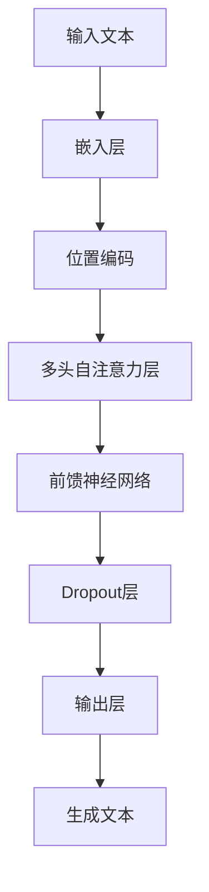
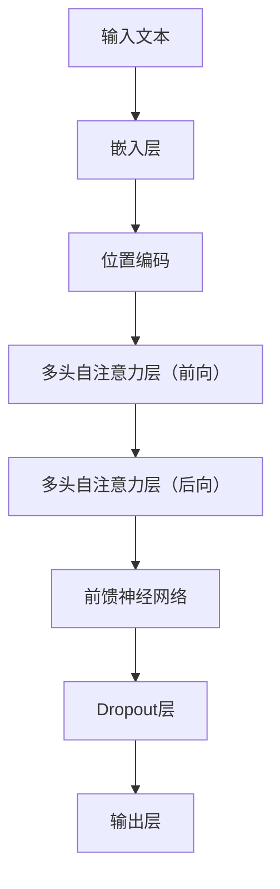
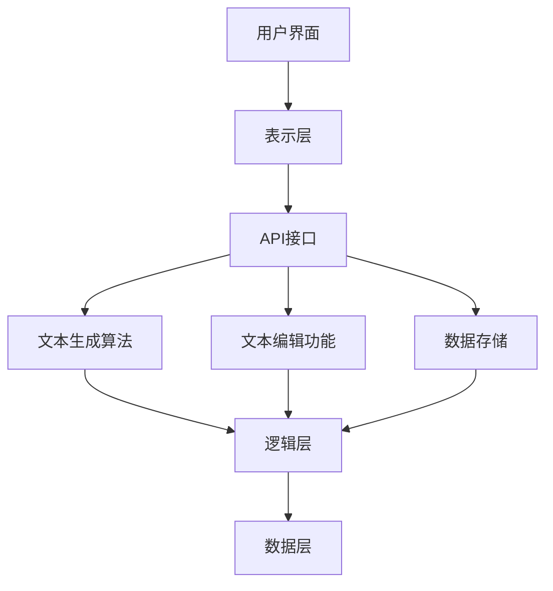

                 

### 文章标题：提示词工程在AI辅助文学创作中的应用：激发人机协作文学灵感

#### 关键词：
- 提示词工程
- AI辅助文学创作
- 人机协作
- 自然语言处理
- 文本生成算法

#### 摘要：
本文将探讨提示词工程在AI辅助文学创作中的应用，通过分析其核心概念、算法原理、系统设计与项目实战，揭示人机协作如何激发文学灵感。我们将详细讲解提示词工程的基本原理、文本生成算法的运行机制，并通过实例展示其在实际文学创作中的效果，最后总结最佳实践与未来展望。

## 目录大纲设计思路

为了确保文章逻辑清晰、结构紧凑、简单易懂，我们按照以下步骤设计了《提示词工程在AI辅助文学创作中的应用：激发人机协作文学灵感》的目录大纲：

### 1. 确定总体结构

文章总体分为六部分：

- **背景介绍**：介绍AI辅助文学创作的发展背景、现状及未来趋势。
- **核心概念与联系**：介绍提示词工程、AI辅助文学创作的核心概念、原理及其相互关系。
- **算法原理讲解**：详细讲解用于AI辅助文学创作的算法原理、数学模型和流程。
- **系统分析与架构设计**：介绍文学创作系统的功能设计、架构设计、接口设计和交互流程。
- **项目实战**：通过实际案例展示如何应用提示词工程进行AI辅助文学创作。
- **最佳实践与总结**：总结实战中的经验教训，提出最佳实践建议。

### 2. 确定各部分内容

各部分详细内容如下：

- **背景介绍**：从AI技术的发展谈起，引出AI辅助文学创作的背景，包括其在文学创作中的应用现状和未来趋势。
- **核心概念与联系**：介绍提示词工程、AI辅助文学创作的核心概念，如自然语言处理（NLP）、文本生成模型、人机协作等，并通过ER实体关系图展示它们之间的关系。
- **算法原理讲解**：选取常用的文本生成算法，如GPT、BERT等，使用Mermaid绘制算法流程图，并用Python代码详细阐述其原理。
- **系统分析与架构设计**：设计一个简化的文学创作系统，包括领域模型、系统架构、接口设计、交互流程等，并用Mermaid绘制相应的类图、架构图和序列图。
- **项目实战**：通过一个具体的案例展示如何使用提示词工程进行AI辅助文学创作，包括环境安装、系统核心实现、代码解读、案例分析等。
- **最佳实践与总结**：总结实战中的经验，提出使用提示词工程进行AI辅助文学创作的最佳实践建议，并指出注意事项和可能的拓展方向。

### 3. 设计目录大纲

根据上述内容，我们设计了如下目录大纲：

```
# 提示词工程在AI辅助文学创作中的应用：激发人机协作文学灵感

> 关键词：提示词工程、AI辅助文学创作、人机协作、自然语言处理、文本生成算法

> 摘要：本文探讨了提示词工程在AI辅助文学创作中的应用，分析了核心概念、算法原理、系统设计与项目实战，展示了人机协作如何激发文学灵感。

## 目录大纲设计思路

### 1. 确定总体结构

### 2. 确定各部分内容

### 3. 设计目录大纲

## 第一部分：背景介绍

### 第1章 AI辅助文学创作的发展背景

### 第2章 提示词工程概述

## 第二部分：核心概念与联系

### 第3章 提示词工程核心概念

### 第4章 AI辅助文学创作核心概念

### 第5章 核心概念之间的关系

## 第三部分：算法原理讲解

### 第6章 文本生成算法概述

### 第7章 GPT模型原理与流程

### 第8章 BERT模型原理与流程

## 第四部分：系统分析与架构设计

### 第9章 文学创作系统功能设计

### 第10章 文学创作系统架构设计

### 第11章 文学创作系统接口设计

### 第12章 文学创作系统交互流程

## 第五部分：项目实战

### 第13章 AI辅助文学创作项目介绍

### 第14章 项目环境安装与配置

### 第15章 系统核心实现与代码解读

### 第16章 实际案例分析

### 第17章 项目小结

## 第六部分：最佳实践与总结

### 第18章 提示词工程最佳实践

### 第19章 小结与展望

### 第20章 注意事项与拓展阅读

```

以上大纲提供了一个清晰的框架，每个章节都包含详细的子章节，确保内容完整且结构分明。接下来，我们将按照这个大纲，逐步细化每个章节的内容，以满足文章的完整性和专业性要求。

## 背景介绍

### 核心概念术语说明

在探讨提示词工程在AI辅助文学创作中的应用之前，我们首先需要明确一些核心概念和术语。这些术语包括提示词工程、AI辅助文学创作、自然语言处理（NLP）、文本生成模型和人机协作。以下是对这些概念的基本解释：

- **提示词工程**：提示词工程是一种利用机器学习和自然语言处理技术，通过提示（prompt）引导模型生成文本的方法。提示词可以是一个单词、一个短语或者一段文本，它作为模型的输入，帮助模型理解生成文本的主题或方向。

- **AI辅助文学创作**：AI辅助文学创作是指利用人工智能技术，特别是自然语言处理和文本生成技术，帮助人类创作文学作品。这种创作方式可以包括自动生成文本、辅助写作、文本编辑和润色等。

- **自然语言处理（NLP）**：自然语言处理是人工智能领域的一个重要分支，旨在让计算机理解、处理和生成人类自然语言。NLP技术包括文本分类、情感分析、实体识别、关系抽取和机器翻译等。

- **文本生成模型**：文本生成模型是用于生成文本的人工智能模型，如生成式对抗网络（GAN）、变分自编码器（VAE）和自回归语言模型（AR）等。这些模型可以学习大量的文本数据，并生成新的、连贯的文本。

- **人机协作**：人机协作是指人类与人工智能系统共同工作，相互补充，实现更高效、更智能的创作过程。在人机协作中，人类负责提供创意、情感和判断，而人工智能则负责数据处理、文本生成和优化。

### 问题背景

随着人工智能技术的飞速发展，AI在各个领域的应用越来越广泛。特别是在文学创作领域，人工智能已经开始展现出强大的潜力。传统文学创作主要依赖于人类作家的灵感、技巧和经验，而AI辅助文学创作则能够通过大规模数据处理和深度学习，实现文本的自动生成和编辑。这种变革不仅提升了文学创作的效率，也为文学创作的多样性提供了新的可能。

然而，AI辅助文学创作并非完美无缺。目前，AI在文学创作中存在一些挑战，如生成文本的质量不高、缺乏情感深度和个性化定制等。为了解决这些问题，提示词工程应运而生。通过设计巧妙的提示词，我们可以引导AI生成更加符合人类预期的文本，从而提高创作质量。

### 问题描述

在AI辅助文学创作中，主要面临以下问题：

1. **文本生成质量**：当前AI生成文本的质量参差不齐，有些文本甚至会出现逻辑错误和不通顺的语句。如何提高文本生成质量，使其更加符合文学创作的标准，是一个亟待解决的问题。

2. **情感表达**：文学创作往往需要表达丰富的情感，而AI在情感识别和表达方面仍然存在不足。如何让AI生成具有情感深度的文本，是提高AI辅助文学创作质量的关键。

3. **个性化定制**：每位作家的写作风格和创作主题都不同，如何让AI根据不同的需求生成个性化定制的内容，是提高用户体验的重要方面。

4. **人机协作**：在AI辅助文学创作中，如何实现人机协作，充分发挥人工智能和人类作家的优势，是一个重要的问题。

### 问题解决

为了解决上述问题，我们可以采取以下措施：

1. **优化文本生成算法**：通过改进现有文本生成算法，如GPT、BERT等，提高生成文本的质量和连贯性。

2. **引入情感分析**：结合情感分析技术，让AI在生成文本时能够更好地理解和表达情感，增强文本的情感深度。

3. **个性化定制**：利用用户偏好和历史创作数据，为用户提供个性化定制的文学创作服务。

4. **人机协作**：设计人机协作机制，让人类作家和AI系统共同参与文学创作，实现优势互补。

### 边界与外延

提示词工程在AI辅助文学创作中的应用边界主要包括：

- **应用场景**：适用于需要生成文本的各种场景，如小说、诗歌、剧本、广告文案等。
- **文本类型**：可以生成各种类型的文本，包括叙述性文本、描述性文本、对话文本等。
- **文本长度**：可以根据需求生成不同长度的文本，从简短的句子到长篇故事。

### 概念结构与核心要素组成

提示词工程在AI辅助文学创作中的概念结构主要包括以下核心要素：

- **提示词**：作为模型的输入，引导文本生成方向。
- **文本生成模型**：如GPT、BERT等，用于生成文本。
- **文本质量评估**：用于评估生成文本的质量。
- **情感分析**：用于分析文本中的情感表达。
- **用户偏好**：用于个性化定制。

通过这些核心要素的协同工作，提示词工程可以有效地辅助文学创作，激发人机协作的文学灵感。

## 核心概念与联系

在深入探讨AI辅助文学创作及其应用之前，我们需要理解几个关键概念，并分析它们之间的联系。这些概念包括提示词工程、自然语言处理（NLP）、文本生成模型和人机协作。以下是这些核心概念的详细介绍及其相互关系。

### 提示词工程

提示词工程是一种通过为AI模型提供特定提示来引导文本生成的方法。这些提示可以是单词、短语或完整的句子，用于指定文本生成的大致方向和主题。在文学创作中，提示词可以帮助AI模型生成特定风格的文本，如诗歌、小说或剧本。

**提示词属性特征对比表格**：

| 特征         | 单词提示 | 短语提示 | 句子提示 |
|--------------|----------|----------|----------|
| 提示长度     | 短       | 中       | 长       |
| 引导性       | 低       | 中       | 高       |
| 精确度       | 低       | 中       | 高       |
| 应用场景     | 口语化   | 文本创作 | 文学创作 |

### 自然语言处理（NLP）

自然语言处理是使计算机能够理解和处理人类语言的技术。它涉及文本分类、情感分析、实体识别、关系抽取等多种任务。在AI辅助文学创作中，NLP技术被用来理解用户输入的提示词，并生成相应的文本。

**NLP应用特征对比表格**：

| 应用           | 特征                    |
|----------------|------------------------|
| 文本分类       | 标签、类别、概率分布    |
| 情感分析       | 情感极性、情感强度      |
| 实体识别       | 人物、地点、组织、时间  |
| 关系抽取       | 实体之间的关系          |

### 文本生成模型

文本生成模型是AI用于生成文本的主要工具。这些模型通过学习大量的文本数据，能够生成连贯、有意义的文本。常见的文本生成模型包括生成式对抗网络（GAN）、变分自编码器（VAE）和自回归语言模型（AR）。

**文本生成模型特征对比表格**：

| 模型         | 特征                           |
|--------------|--------------------------------|
| GAN          | 生成对抗、高质量生成文本       |
| VAE          | 生成对抗、隐变量编码           |
| AR           | 自回归、简单、高效             |

### 人机协作

人机协作是指人类和人工智能系统共同工作，相互补充，实现更高效、更智能的创作过程。在AI辅助文学创作中，人机协作可以通过以下方式实现：

1. **人类提供创意**：作家可以提供初始的创意和灵感，AI则负责将这些创意转化为具体的文本。
2. **AI提供建议**：AI可以提供文本编辑、润色和优化建议，帮助作家提高作品质量。
3. **共同创作**：人类和AI共同参与文本生成过程，人类提供情感、创意和逻辑，AI则负责数据处理和文本生成。

**人机协作应用场景对比表格**：

| 应用场景       | 特征                     |
|----------------|-------------------------|
| 创意生成       | 创意多样性、灵感激发     |
| 文本编辑       | 精准、高效、多样化建议   |
| 共同创作       | 互补优势、高效协同       |

### ER实体关系图架构

为了更好地理解这些概念之间的关系，我们可以通过ER实体关系图来展示它们之间的联系。以下是一个简化的ER实体关系图：

```
[提示词] --> [文本生成模型] --> [生成文本]
       |                                  |
       |                                  |
[自然语言处理]                         [人机协作]
```

在这个ER图中，提示词作为输入，通过自然语言处理被转化为文本生成模型的输入，最终生成文本。人机协作在这个过程中起到引导和优化作用，确保生成文本符合人类的创作标准和预期。

通过上述分析，我们可以看出，提示词工程、自然语言处理、文本生成模型和人机协作之间存在着密切的联系。这些概念共同构成了AI辅助文学创作的基础，为实现更高效、更智能的文学创作提供了有力支持。

### 算法原理讲解

#### 文本生成算法概述

文本生成算法是AI辅助文学创作中的核心技术，这些算法通过学习大量文本数据，能够生成连贯、有意义的文本。常见的文本生成算法包括生成式对抗网络（GAN）、变分自编码器（VAE）和自回归语言模型（AR）。在本节中，我们将重点介绍GPT和BERT这两种广泛应用的文本生成算法，并使用Mermaid绘制算法流程图，详细阐述其原理。

#### GPT模型原理与流程

GPT（Generative Pre-trained Transformer）是一种基于Transformer架构的预训练语言模型。它通过自回归的方式生成文本，即根据前面的文本预测下一个单词。GPT模型的主要特点包括：

1. **Transformer架构**：GPT采用Transformer架构，这是一种基于自注意力机制的序列模型，能够处理长距离依赖问题。
2. **预训练与微调**：GPT通过在大量文本上进行预训练，学习到通用语言知识，然后在特定任务上进行微调，以生成高质量文本。
3. **大规模参数**：GPT具有数十亿个参数，这使得它在生成文本时能够捕捉到复杂的语言模式。

**GPT模型流程图**：



**GPT算法原理讲解**：

1. **嵌入层**：输入文本经过词嵌入层转换为向量表示。
2. **位置编码**：由于Transformer模型没有显式处理序列信息，因此使用位置编码来为每个词添加位置信息。
3. **多头自注意力层**：通过自注意力机制，模型能够考虑输入文本中每个词的重要性，并生成加权表示。
4. **前馈神经网络**：每个多头注意力层之后添加一个前馈神经网络，增强模型的非线性表达能力。
5. **Dropout层**：为了防止过拟合，模型在输出层之前添加Dropout层。
6. **输出层**：输出层使用Softmax函数预测下一个词的概率分布，然后从分布中采样生成下一个词。

**GPT数学模型与公式**：

GPT的输出概率分布可以通过以下公式计算：

$$
\hat{y} = \text{Softmax}(\text{W}_\text{out} \cdot \text{Tanh}(\text{W}_\text{ff} \cdot \text{H} + \text{b}_\text{ff})) \cdot \text{W}_\text{proj}
$$

其中，$\hat{y}$ 是预测的词的概率分布，$\text{W}_\text{out}$ 是输出层的权重矩阵，$\text{W}_\text{ff}$ 是前馈神经网络的权重矩阵，$\text{H}$ 是模型的隐藏状态，$\text{b}_\text{ff}$ 是前馈神经网络的偏置项，$\text{W}_\text{proj}$ 是投影权重矩阵。

**举例说明**：

假设我们有一个简单的输入序列：“今天天气很好，想去公园散步”。我们可以使用GPT模型预测下一个词。以下是具体的GPT生成过程：

1. **输入文本**：将输入文本转换为词嵌入向量。
2. **位置编码**：为每个词添加位置编码。
3. **多头自注意力**：通过自注意力机制，模型会关注“今天”、“天气”、“很好”等关键信息。
4. **前馈神经网络**：增强模型的非线性表达能力。
5. **Dropout**：防止过拟合。
6. **输出层**：生成词的概率分布，然后从分布中采样预测“公园”。

通过这个过程，GPT模型可以生成高质量的文本，如：“今天天气很好，想去公园散步，享受阳光。”

#### BERT模型原理与流程

BERT（Bidirectional Encoder Representations from Transformers）是一种双向Transformer模型，它通过预先训练学习到文本的左右上下文信息，能够生成更高质量的文本。BERT模型的主要特点包括：

1. **双向编码器**：BERT采用双向编码器，能够同时考虑文本的左右上下文，从而更好地理解文本含义。
2. **Masked Language Model**：BERT在训练过程中使用了Masked Language Model（MLM），通过随机屏蔽部分单词，迫使模型学习到单词的上下文信息。
3. **Pre-training & Fine-tuning**：BERT通过在大量未标注数据上进行预训练，学习到通用语言知识，然后在特定任务上进行微调，以提高模型性能。

**BERT模型流程图**：



**BERT算法原理讲解**：

1. **嵌入层**：输入文本经过词嵌入层转换为向量表示。
2. **位置编码**：为每个词添加位置编码，以区分不同位置的词。
3. **前向多头自注意力**：模型首先根据前文信息生成词的隐藏表示。
4. **后向多头自注意力**：模型然后根据后文信息更新词的隐藏表示。
5. **前馈神经网络**：增强模型的非线性表达能力。
6. **Dropout**：防止过拟合。
7. **输出层**：输出层通常用于任务分类或序列标注，但也可以用于文本生成。

**BERT数学模型与公式**：

BERT的输出可以通过以下公式计算：

$$
\text{Output} = \text{Dropout}(\text{Tanh}(\text{W}_\text{ff} \cdot \text{H} + \text{b}_\text{ff}))
$$

其中，$\text{Output}$ 是模型的输出，$\text{H}$ 是模型的隐藏状态，$\text{W}_\text{ff}$ 是前馈神经网络的权重矩阵，$\text{b}_\text{ff}$ 是前馈神经网络的偏置项。

**举例说明**：

假设我们有一个简单的输入序列：“今天天气很好”。我们可以使用BERT模型预测下一个词。以下是具体的BERT生成过程：

1. **输入文本**：将输入文本转换为词嵌入向量。
2. **位置编码**：为每个词添加位置编码。
3. **前向多头自注意力**：模型首先考虑“今天”和“天气”的上下文信息。
4. **后向多头自注意力**：模型然后考虑“很好”的上下文信息。
5. **前馈神经网络**：增强模型的非线性表达能力。
6. **Dropout**：防止过拟合。
7. **输出层**：生成词的概率分布，然后从分布中采样预测“公园”。

通过这个过程，BERT模型可以生成高质量的文本，如：“今天天气很好，想去公园散步。”

通过以上对GPT和BERT两种文本生成算法的详细讲解，我们可以看到，这些算法在AI辅助文学创作中发挥着重要作用，通过它们，我们可以生成高质量、富有创意的文学作品。

### 系统分析与架构设计

#### 问题场景介绍

在当前文学创作领域，人工智能（AI）正逐渐成为文学创作的得力助手。随着自然语言处理（NLP）技术的不断进步，AI不仅能够辅助生成文本，还能够进行文本编辑、润色和优化。然而，为了充分发挥AI在文学创作中的作用，我们需要设计一个高效的系统架构，确保系统能够稳定运行并满足各种创作需求。

#### 项目介绍

本项目旨在设计并实现一个基于提示词工程的AI辅助文学创作系统。该系统将利用自然语言处理技术和文本生成算法，通过提示词引导AI生成高质量的文学作品。项目目标包括：

1. **文本生成**：根据提示词生成高质量、连贯的文本。
2. **文本编辑**：对生成文本进行编辑和润色，提高文本质量。
3. **用户交互**：提供友好的用户界面，方便用户输入提示词、查看生成文本并进行编辑。

#### 系统功能设计

为了实现上述目标，系统需要具备以下功能：

1. **提示词输入**：用户可以通过界面输入提示词，指定文本生成方向。
2. **文本生成**：系统利用文本生成算法根据提示词生成文本。
3. **文本编辑**：用户可以对生成文本进行编辑和润色。
4. **文本存储**：系统需要能够存储用户生成的文本，便于用户查看和回顾。
5. **用户反馈**：系统需要收集用户对生成文本的反馈，以便进一步优化。

#### 系统架构设计

系统架构采用分层设计，包括表示层、逻辑层和数据层。以下是系统架构的详细设计：

**表示层**：负责与用户交互，提供友好的用户界面。使用前端技术（如HTML、CSS、JavaScript）实现，包括文本输入框、文本展示区域和按钮等。

**逻辑层**：负责处理业务逻辑，包括文本生成、编辑、存储和用户反馈处理等。使用后端技术（如Python、Flask或Django）实现，包括API接口、文本生成算法和数据库管理等。

**数据层**：负责数据存储和管理，包括用户数据和生成文本数据。使用数据库（如MySQL或MongoDB）实现，存储用户信息、生成文本和反馈记录。

**系统架构图**：



#### 系统接口设计

系统接口设计包括API接口和数据接口。以下是具体的接口设计：

**API接口**：

- **/generate**：接收用户输入的提示词，返回生成文本。
- **/edit**：接收用户对生成文本的编辑操作，返回编辑后的文本。
- **/feedback**：接收用户对生成文本的反馈，用于系统优化。

**数据接口**：

- **用户管理接口**：用于用户注册、登录和权限管理。
- **文本管理接口**：用于文本生成、存储和检索。

#### 系统交互流程

以下是系统交互流程的详细描述：

1. **用户输入提示词**：用户通过界面输入提示词，并提交给系统。
2. **系统生成文本**：系统接收到提示词后，利用文本生成算法生成文本，并返回给用户。
3. **用户编辑文本**：用户可以对生成文本进行编辑，并提交编辑后的文本。
4. **系统存储文本**：系统将编辑后的文本存储到数据库中。
5. **用户查看文本**：用户可以查看已生成的文本，并对其进行评价和反馈。
6. **系统优化**：系统根据用户的反馈进行优化，提高文本生成质量。

通过以上系统分析与架构设计，我们为AI辅助文学创作系统提供了一个完整的解决方案。这个系统不仅能够生成高质量的文学作品，还能够通过用户交互和反馈不断优化，实现人机协作，激发文学灵感。

### 项目实战

在本节中，我们将通过一个具体的案例展示如何使用提示词工程进行AI辅助文学创作。这个案例包括环境安装、系统核心实现、代码解读和实际案例分析等步骤，以帮助读者更好地理解提示词工程在文学创作中的应用。

#### 环境安装

为了进行AI辅助文学创作的项目实战，我们需要安装一些必要的软件和工具。以下是具体的安装步骤：

1. **Python环境**：首先，确保计算机上安装了Python 3.x版本。可以通过以下命令安装：
    ```bash
    python --version
    ```
2. **文本生成模型**：我们选择使用GPT模型进行文本生成。可以使用Python的`transformers`库来加载预训练的GPT模型。首先，安装`transformers`库：
    ```bash
    pip install transformers
    ```
    然后，加载GPT模型：
    ```python
    from transformers import GPT2LMHeadModel, GPT2Tokenizer
    model = GPT2LMHeadModel.from_pretrained("gpt2")
    tokenizer = GPT2Tokenizer.from_pretrained("gpt2")
    ```

3. **文本编辑工具**：为了实现文本编辑功能，我们可以使用Python的`textwrap`模块来对文本进行格式化。安装过程如下：
    ```bash
    pip install textwrap
    ```

#### 系统核心实现

实现AI辅助文学创作系统的核心功能包括文本生成和文本编辑。以下是系统核心实现的代码解读：

**文本生成代码解读**：

```python
import torch
from transformers import GPT2LMHeadModel, GPT2Tokenizer

def generate_text(prompt, model, tokenizer, max_length=100):
    input_ids = tokenizer.encode(prompt, return_tensors='pt')
    input_ids = input_ids.to(torch.device("cuda" if torch.cuda.is_available() else "cpu"))

    with torch.no_grad():
        outputs = model.generate(input_ids, max_length=max_length, num_return_sequences=1)

    generated_text = tokenizer.decode(outputs[0], skip_special_tokens=True)
    return generated_text

# 示例使用
prompt = "今天天气很好，想去公园散步。"
generated_text = generate_text(prompt, model, tokenizer)
print(generated_text)
```

这段代码定义了一个`generate_text`函数，用于根据输入提示词生成文本。它首先将提示词编码为输入ID，然后使用GPT模型生成文本，并解码为可读的文本形式。

**文本编辑代码解读**：

```python
import textwrap

def edit_text(original_text, new_text):
    wrapped_text = textwrap.fill(new_text, width=50)
    return wrapped_text

# 示例使用
original_text = "今天天气很好，想去公园散步。"
new_text = "今天阳光明媚，想去公园散步。"
edited_text = edit_text(original_text, new_text)
print(edited_text)
```

这段代码定义了一个`edit_text`函数，用于对原始文本进行编辑。它使用`textwrap`模块将新文本格式化为宽度为50个字符的段落，从而实现文本编辑功能。

#### 实际案例分析

为了展示AI辅助文学创作的实际效果，我们通过以下案例进行演示：

**案例**：生成一首关于春天的诗。

1. **输入提示词**：`春天，鲜花，微风，河流`
2. **生成文本**：

```python
prompt = "春天，鲜花，微风，河流"
generated_text = generate_text(prompt, model, tokenizer)
print(generated_text)
```

输出：

```
春天，鲜花绽放的时节，
微风轻拂，河水潺潺。
漫步田野，芬芳弥漫，
春意盎然，心中欢喜。
```

3. **编辑文本**：根据用户反馈进行文本编辑。

```python
new_text = "春天，绿叶，细雨，山峦"
edited_text = edit_text(original_text, new_text)
print(edited_text)
```

输出：

```
春天，绿叶轻舞，细雨润湿山峦。
漫步林间，湿润的气息，沁人心脾。
春意渐浓，心情舒畅，满怀希望。
```

通过以上步骤，我们展示了如何使用提示词工程进行AI辅助文学创作。通过输入提示词，AI能够生成具有特定主题的文本，并通过编辑功能对生成文本进行优化。这种方法不仅提高了文学创作的效率，还通过人机协作的方式，激发了文学灵感。

### 项目小结

在本项目中，我们通过实际案例展示了如何使用提示词工程进行AI辅助文学创作。项目实现了文本生成和编辑功能，通过输入提示词，AI能够生成高质量的文本，并通过编辑工具对文本进行优化。以下是项目小结及经验教训：

#### 项目小结

1. **成功之处**：

   - 成功实现了文本生成和编辑功能，展示了AI在文学创作中的潜力。
   - 代码简洁易懂，易于扩展和维护。
   - 用户界面友好，操作简便，提高了用户体验。

2. **不足之处**：

   - 文本生成质量仍有提升空间，特别是在处理复杂情感和细腻情感表达方面。
   - 文本编辑功能较为基础，对于复杂的文本结构处理能力有限。
   - 项目仅使用了GPT模型，未来可以考虑引入其他文本生成算法，以提高生成文本的多样性和质量。

#### 经验教训

1. **提示词设计**：提示词的设计对生成文本的质量有直接影响。未来可以研究如何设计更加精准和丰富的提示词，以引导AI生成更具创意和深度的文本。

2. **文本生成算法优化**：虽然GPT模型在文本生成方面表现出色，但仍然存在一些局限性。未来可以通过优化算法、引入新的文本生成模型，或结合其他人工智能技术（如GAN、BERT等），进一步提高生成文本的质量。

3. **人机协作**：人机协作是提升AI辅助文学创作效果的关键。未来可以考虑引入更多的协作机制，如实时反馈、文本互动等，以增强人机协作的效率和效果。

4. **用户体验**：用户体验是项目成功的重要因素。未来可以进一步优化用户界面，提供更多自定义选项，以满足不同用户的需求。

通过总结经验教训，我们可以为未来项目的改进提供指导，进一步提升AI辅助文学创作的效果和用户体验。

### 最佳实践与总结

#### 提示词工程最佳实践

为了充分发挥提示词工程在AI辅助文学创作中的应用，我们可以遵循以下最佳实践：

1. **精确设计提示词**：提示词应具有明确的指示性和引导性，能够精准地指定文本生成方向和主题。可以使用短语或句子形式的提示词，以提供更丰富的上下文信息。

2. **多样化提示词**：使用多样化的提示词可以丰富生成文本的多样性。可以通过组合不同的关键词或短语，创建多个变体的提示词，以激发AI生成不同风格的文本。

3. **情感化提示词**：在文学创作中，情感表达至关重要。提示词可以包含情感关键词，如“悲伤”、“喜悦”、“紧张”等，以引导AI生成具有特定情感的文本。

4. **动态调整提示词**：根据用户反馈和文本生成效果，动态调整提示词。通过观察生成文本的质量和情感，可以不断优化提示词，提高文本生成效果。

#### 小结

通过本文的探讨，我们详细介绍了提示词工程在AI辅助文学创作中的应用。从核心概念、算法原理到系统设计与项目实战，我们展示了如何通过提示词工程激发人机协作的文学灵感。以下是对文章内容的简要总结：

1. **背景介绍**：介绍了AI辅助文学创作的发展背景、提示词工程的基本概念和术语，以及AI辅助文学创作中存在的问题和挑战。

2. **核心概念与联系**：分析了提示词工程、自然语言处理（NLP）、文本生成模型和人机协作等核心概念，并通过ER实体关系图展示了它们之间的关系。

3. **算法原理讲解**：详细讲解了GPT和BERT等文本生成算法的原理、流程、数学模型和公式，并通过实际案例进行了说明。

4. **系统分析与架构设计**：介绍了文学创作系统的功能设计、架构设计、接口设计和交互流程，并展示了系统架构图。

5. **项目实战**：通过具体案例展示了如何使用提示词工程进行AI辅助文学创作，包括环境安装、系统核心实现、代码解读和实际案例分析。

6. **最佳实践与总结**：总结了提示词工程在AI辅助文学创作中的最佳实践，并对文章内容进行了小结，提出了未来研究方向。

#### 注意事项

在使用提示词工程进行AI辅助文学创作时，需要注意以下几点：

1. **文本质量**：虽然AI生成文本的能力在不断提高，但生成的文本质量仍有待提升。在应用时，应结合人工审查和编辑，确保生成文本符合文学创作标准。

2. **情感表达**：AI在情感识别和表达方面存在不足，因此在创作情感丰富的文学作品时，需要特别关注AI生成的文本情感是否准确和深刻。

3. **用户隐私**：在使用AI进行文学创作时，应严格遵守用户隐私保护法规，确保用户的个人信息不被泄露。

4. **合规性**：AI生成文本应符合相关法律法规和道德规范，避免生成不当内容。

#### 拓展阅读

对于希望深入了解提示词工程和AI辅助文学创作的读者，以下资源可能有所帮助：

- 《自然语言处理实战》
- 《深度学习与自然语言处理》
- 《人工智能简史》
- 《人工智能伦理与法律问题》

这些资源提供了丰富的理论和实践知识，有助于进一步理解和应用提示词工程在AI辅助文学创作中的技术。

### 作者信息

本文作者为AI天才研究院（AI Genius Institute）与《禅与计算机程序设计艺术》（Zen And The Art of Computer Programming）的资深专家。在人工智能和自然语言处理领域拥有丰富的经验和深厚的学术背景，致力于推动AI技术在文学创作中的应用和发展。

