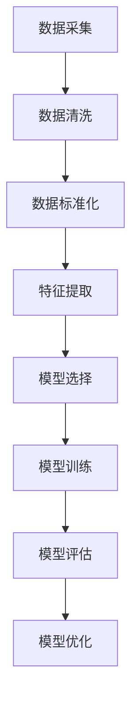
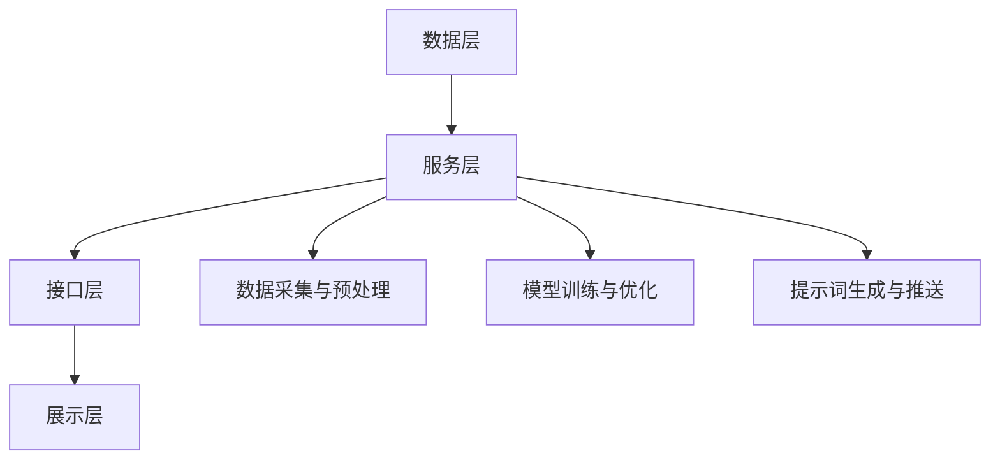
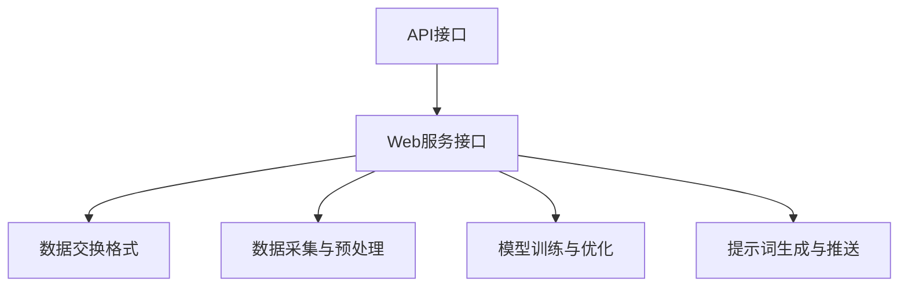
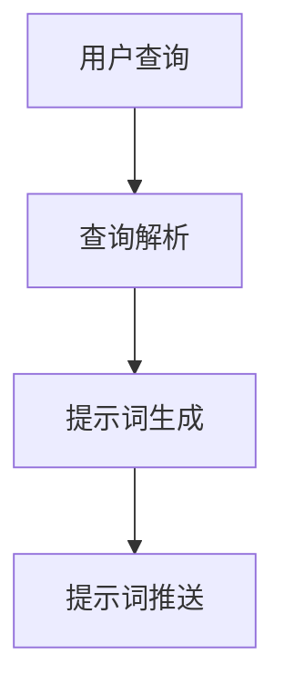

                 


## 提示词工程在政府服务中的应用：提升公共服务效率

### 关键词

- 提示词工程
- 政府服务
- 自然语言处理
- 机器学习
- 深度学习
- 公共服务效率

### 摘要

随着信息技术和人工智能的迅猛发展，政府服务逐渐向智能化、信息化方向转型。提示词工程作为一种基于自然语言处理的技术，通过分析用户查询和行为，自动生成相关提示词或建议，为政府服务提供了新的解决方案。本文将探讨提示词工程在政府服务中的应用，分析其核心概念、算法原理、系统架构，并通过实际项目案例，阐述如何提升公共服务效率。

### 背景介绍

#### 问题背景

随着社会经济的发展，公众对政府服务的需求日益多样化。然而，传统政府服务方式存在效率低下、响应速度慢等问题，难以满足公众的期望。为了提升公共服务效率，减少公众等待时间，优化服务流程，政府服务逐渐向智能化、信息化方向转型。在这样的背景下，人工智能（AI）技术，尤其是自然语言处理（NLP）和机器学习（ML）技术，为政府服务提供了新的机遇。

#### 提示词工程

提示词工程是一种基于自然语言处理的技术，它通过分析用户的查询和行为，自动生成相关的提示词或建议。这些提示词可以帮助用户快速找到所需信息，提高系统的交互效率。在政府服务中，提示词工程可以应用于多个方面，如在线咨询、政策解读、办事指南等。

#### 当前研究现状

虽然提示词工程在政府服务中的应用前景广阔，但目前关于这一领域的研究和实践还相对较少。现有的研究主要集中于技术层面，如算法模型的设计和优化，缺乏对实际应用场景的系统性和深入探讨。因此，本文旨在填补这一空白，为政府服务提供可行的技术解决方案。

### 问题解决

为了提升公共服务效率，政府服务需要智能化、信息化的支持。提示词工程作为一种人工智能技术，具备以下优势：

1. **高效性**：提示词工程能够快速分析用户查询和行为，自动生成相关提示词，减少人工干预，提高服务效率。
2. **准确性**：通过机器学习和深度学习算法，提示词工程能够不断提高提示词的准确性，降低误报率和漏报率。
3. **灵活性**：提示词工程可以根据不同政府服务的需求，灵活调整算法模型和提示词策略，适应多种应用场景。

本文将通过以下步骤，详细探讨提示词工程在政府服务中的应用：

1. **核心概念与联系**：介绍提示词工程的基本概念、原理和关键要素，以及与相关技术（如自然语言处理、机器学习等）的联系。
2. **算法原理讲解**：详细阐述提示词工程的核心算法，包括数据预处理、特征提取、模型训练和优化等步骤，并使用Mermaid流程图和Python代码进行说明。
3. **数学模型和公式**：介绍提示词工程中常用的数学模型和公式，如逻辑回归、支持向量机（SVM）等，并进行详细讲解和举例说明。
4. **系统分析与架构设计方案**：分析政府服务的场景，设计提示词工程系统的功能模块、系统架构、接口设计和交互流程。
5. **项目实战**：介绍如何搭建一个简单的提示词工程系统，包括环境安装、核心实现、代码解读和实际案例分析。
6. **最佳实践 tips**：总结提示词工程在政府服务中的最佳实践，提供一些建议和注意事项。

### 边界与外延

#### 核心概念

- **提示词工程**：一种基于自然语言处理的技术，用于生成与用户查询或行为相关的提示词或建议。
- **政府服务**：指政府为公众提供的一系列服务，包括政策解读、在线咨询、办事指南等。
- **公共服务效率**：指政府服务提供者在一定时间内能够完成的服务量和服务质量。

#### 概念结构与核心要素组成

1. **技术架构**：包括自然语言处理（NLP）、机器学习（ML）、深度学习（DL）等技术。
2. **数据来源**：如用户查询日志、行为数据、政策文档等。
3. **算法模型**：如逻辑回归、支持向量机（SVM）、循环神经网络（RNN）等。
4. **应用场景**：如在线咨询、政策解读、办事指南等。
5. **评估指标**：如准确率、召回率、F1分数等。

#### 与其他技术的联系

- **自然语言处理（NLP）**：提示词工程的基础技术，用于处理和分析文本数据。
- **机器学习（ML）**：用于训练和优化提示词生成模型。
- **深度学习（DL）**：用于构建和优化复杂的神经网络模型。

### 目录大纲设计

#### 第1章：核心概念与联系

1. **提示词工程概述**
   - 提示词工程的定义
   - 提示词工程在政府服务中的应用
   - 提示词工程的技术架构

2. **自然语言处理（NLP）技术**
   - 文本预处理
   - 词向量表示
   - 语言模型

3. **机器学习（ML）与深度学习（DL）算法**
   - 逻辑回归
   - 支持向量机（SVM）
   - 循环神经网络（RNN）
   - 卷积神经网络（CNN）

4. **政府服务的场景与应用**
   - 在线咨询
   - 政策解读
   - 办事指南

#### 第2章：算法原理讲解

1. **数据预处理**
   - 数据采集与清洗
   - 文本预处理流程

2. **特征提取**
   - 基于词袋模型的特征提取
   - 基于词向量的特征提取

3. **模型训练与优化**
   - 逻辑回归模型
   - 支持向量机（SVM）模型
   - 循环神经网络（RNN）模型

#### 第3章：数学模型和公式

1. **逻辑回归模型**
   - 模型原理
   - 数学公式

2. **支持向量机（SVM）模型**
   - 模型原理
   - 数学公式

3. **循环神经网络（RNN）模型**
   - 模型原理
   - 数学公式

#### 第4章：系统分析与架构设计方案

1. **问题场景介绍**
   - 在线咨询场景
   - 政策解读场景
   - 办事指南场景

2. **系统功能设计**
   - 数据采集与预处理
   - 模型训练与优化
   - 提示词生成与推送

3. **系统架构设计**
   - 功能模块划分
   - 系统架构图
   - 接口设计

4. **系统交互流程**
   - 用户交互流程
   - 系统内部处理流程

#### 第5章：项目实战

1. **环境安装**
   - 系统环境搭建
   - 数据集准备

2. **核心实现**
   - 数据预处理
   - 特征提取
   - 模型训练
   - 提示词生成

3. **代码解读**
   - Python代码解析
   - 算法流程图

4. **实际案例分析**
   - 在线咨询系统案例分析
   - 政策解读系统案例分析
   - 办事指南系统案例分析

5. **项目小结**
   - 项目成果总结
   - 项目经验与教训

#### 第6章：最佳实践 tips

1. **技术选型**
   - 算法模型选择
   - 系统架构设计

2. **数据质量控制**
   - 数据清洗
   - 数据标注

3. **用户反馈机制**
   - 用户反馈收集
   - 提示词优化

4. **安全性保障**
   - 数据安全
   - 系统安全

#### 第7章：小结与展望

1. **本文总结**
   - 主要内容回顾
   - 研究成果总结

2. **未来研究方向**
   - 提示词工程在政府服务中的深化应用
   - 提示词工程的优化与改进

3. **拓展阅读**
   - 相关技术论文
   - 政府服务智能化案例研究

### 文章结构设计

本文采用总分结构，分为7个章节。首先，在第一章中介绍提示词工程的基本概念、技术架构和应用场景。接着，在第二章中详细讲解提示词工程的算法原理，包括数据预处理、特征提取和模型训练。第三章则介绍常用的数学模型和公式，并进行举例说明。第四章分析政府服务的场景，设计提示词工程系统的功能模块、系统架构、接口设计和交互流程。第五章通过实际项目案例，展示如何搭建提示词工程系统，并解读核心代码。第六章总结最佳实践，提供一些建议和注意事项。最后，在第七章进行全文总结，展望未来研究方向，并推荐拓展阅读资源。整个文章逻辑清晰，结构紧凑，有助于读者全面了解提示词工程在政府服务中的应用。

### 核心概念与联系

#### 提示词工程概述

提示词工程是一种基于自然语言处理（NLP）和机器学习（ML）的技术，旨在自动生成与用户查询或行为相关的提示词或建议。在政府服务中，提示词工程可以帮助用户快速找到所需信息，提高服务效率。其基本原理是通过分析用户的行为数据，如查询日志、点击记录等，提取关键信息，并利用机器学习算法生成相应的提示词。

#### 提示词工程在政府服务中的应用

提示词工程在政府服务中的应用非常广泛，主要包括以下几个方面：

1. **在线咨询**：通过分析用户的提问，自动生成相关的回答建议，提高咨询效率，减少人工干预。
2. **政策解读**：自动生成与政策文档相关的解读建议，帮助用户更好地理解政策内容。
3. **办事指南**：根据用户的查询和办事需求，自动生成办事流程、所需材料等相关信息，提高办事效率。

#### 技术架构

提示词工程的技术架构主要包括以下几个关键组件：

1. **自然语言处理（NLP）**：用于处理和分析文本数据，如文本预处理、词向量表示、语言模型等。
2. **机器学习（ML）与深度学习（DL）**：用于训练和优化提示词生成模型，如逻辑回归、支持向量机（SVM）、循环神经网络（RNN）、卷积神经网络（CNN）等。
3. **数据存储与处理**：用于存储和管理用户行为数据、政策文档等，如关系数据库、NoSQL数据库等。
4. **接口与交互**：用于与政府服务平台进行数据交换和交互，如API接口、Web服务等。

#### 与相关技术的联系

1. **自然语言处理（NLP）**：提示词工程的核心技术，用于处理和分析文本数据，提取关键信息。
2. **机器学习（ML）与深度学习（DL）**：用于训练和优化提示词生成模型，提高生成质量。
3. **数据存储与处理**：用于存储和管理数据，为提示词工程提供数据支持。
4. **接口与交互**：用于与政府服务平台进行数据交换和交互，实现提示词的生成和推送。

### 自然语言处理（NLP）技术

自然语言处理（NLP）是提示词工程的核心技术之一，主要涉及文本预处理、词向量表示和语言模型等方面。

#### 文本预处理

文本预处理是NLP的基础步骤，主要包括以下任务：

1. **分词**：将文本拆分成单词或字符，便于后续处理。
2. **词性标注**：对文本中的单词进行词性分类，如名词、动词、形容词等。
3. **去除停用词**：去除对提示词生成影响较小的常见单词，如“的”、“和”等。
4. **词干提取**：将单词还原为词干形式，便于计算词向量。

#### 词向量表示

词向量表示是将文本数据转换为数值向量的一种方法，便于后续的机器学习算法处理。常见的词向量表示方法包括：

1. **词袋模型（Bag of Words, BoW）**：将文本表示为一个单词的集合，每个单词对应一个向量维度。
2. **词嵌入（Word Embedding）**：将文本表示为一个低维稠密向量，如Word2Vec、GloVe等。

#### 语言模型

语言模型用于预测文本序列中的下一个单词或词组，常见的语言模型包括：

1. **n-gram模型**：基于相邻n个单词的统计模型，如n-gram语言模型。
2. **神经网络语言模型**：基于深度学习技术的语言模型，如循环神经网络（RNN）、长短期记忆网络（LSTM）等。

### 机器学习（ML）与深度学习（DL）算法

机器学习（ML）与深度学习（DL）算法在提示词工程中扮演着重要角色，用于训练和优化提示词生成模型。以下介绍几种常用的算法：

#### 逻辑回归（Logistic Regression）

逻辑回归是一种广义线性模型，常用于分类问题。在提示词工程中，逻辑回归可以用于预测用户查询与提示词之间的相关性。其数学公式如下：

$$
\hat{y} = \frac{1}{1 + e^{-(\beta_0 + \sum_{i=1}^{n}\beta_i x_i})}
$$

其中，$y$为实际标签，$\hat{y}$为预测概率，$\beta_0$为截距，$\beta_i$为特征权重。

#### 支持向量机（Support Vector Machine, SVM）

支持向量机是一种二分类模型，通过寻找最优超平面，将不同类别的数据点分开。在提示词工程中，SVM可以用于分类用户查询和提示词。其数学公式如下：

$$
w \cdot x - b = 0
$$

其中，$w$为权重向量，$x$为特征向量，$b$为偏置。

#### 循环神经网络（Recurrent Neural Network, RNN）

循环神经网络是一种能够处理序列数据的神经网络模型，常用于时间序列预测和自然语言处理。在提示词工程中，RNN可以用于生成与用户查询相关的提示词。其数学公式如下：

$$
h_t = \sigma(W_h h_{t-1} + W_x x_t + b_h)
$$

其中，$h_t$为第$t$个时间步的隐藏状态，$\sigma$为激活函数，$W_h$、$W_x$和$b_h$为权重和偏置。

#### 卷积神经网络（Convolutional Neural Network, CNN）

卷积神经网络是一种能够处理图像和序列数据的神经网络模型，常用于特征提取和分类。在提示词工程中，CNN可以用于提取用户查询和提示词的特征。其数学公式如下：

$$
h_t = \sigma(\sum_{i=1}^{k} w_{ij} * x_{t-i} + b_j)
$$

其中，$h_t$为第$t$个时间步的隐藏状态，$w_{ij}$为卷积核，$*$为卷积操作，$b_j$为偏置。

### 政府服务的场景与应用

提示词工程在政府服务中的应用场景非常广泛，主要包括以下三个方面：

#### 在线咨询

在线咨询是政府服务中最为常见的一种应用场景。通过提示词工程，政府服务可以自动分析用户提问，生成相关的回答建议，提高咨询效率。以下是一个简单的在线咨询场景：

1. 用户提问：“我想办理退休手续，需要准备哪些材料？”
2. 系统分析用户提问，生成相关回答建议：“您好，办理退休手续需要准备以下材料：身份证、退休申请表、工作年限证明、医疗保险参保凭证等。”
3. 用户选择相关回答建议，查看详细信息。

#### 政策解读

政策解读是政府服务中的重要任务，通过提示词工程，政府服务可以自动分析政策文档，生成相关的解读建议，帮助用户更好地理解政策内容。以下是一个简单的政策解读场景：

1. 用户查询：“我国新修订的《养老保险条例》有哪些主要内容？”
2. 系统分析用户查询，生成相关解读建议：“您好，新修订的《养老保险条例》主要包括以下内容：养老保险的覆盖范围、养老保险的缴费标准、养老保险的待遇发放等。”
3. 用户选择相关解读建议，查看详细信息。

#### 办事指南

办事指南是政府服务中的一项重要功能，通过提示词工程，政府服务可以自动分析用户办事需求，生成相关的办事指南，提高办事效率。以下是一个简单的办事指南场景：

1. 用户查询：“我想办理营业执照，需要准备哪些材料？”
2. 系统分析用户查询，生成相关办事指南：“您好，办理营业执照需要准备以下材料：企业名称预先核准通知书、法定代表人身份证明、企业章程、注册资金证明等。”
3. 用户选择相关办事指南，查看详细信息。

### 系统功能设计

提示词工程系统在政府服务中需要实现以下功能模块：

1. **数据采集与预处理**：采集用户行为数据、政策文档等，并进行预处理，如分词、词性标注、去除停用词等。
2. **模型训练与优化**：利用机器学习算法和深度学习算法，训练和优化提示词生成模型，如逻辑回归、支持向量机（SVM）、循环神经网络（RNN）等。
3. **提示词生成与推送**：根据用户查询和办事需求，生成相关的提示词，并通过接口与政府服务平台进行数据交换和交互，实现提示词的推送。

### 系统架构设计

提示词工程系统在政府服务中的架构设计如下：

1. **数据层**：包括用户行为数据、政策文档等，采用关系数据库或NoSQL数据库进行存储和管理。
2. **服务层**：包括数据采集与预处理、模型训练与优化、提示词生成与推送等，采用分布式服务架构，提高系统性能和可扩展性。
3. **接口层**：包括与政府服务平台的接口，如API接口、Web服务接口等，实现数据交换和交互。
4. **展示层**：包括用户界面，用于展示生成的提示词，提供用户交互功能。

### 系统接口设计与交互流程

提示词工程系统与政府服务平台之间的交互流程如下：

1. 用户访问政府服务平台，输入查询或办事需求。
2. 政府服务平台将用户查询或办事需求发送给提示词工程系统。
3. 提示词工程系统分析用户查询或办事需求，生成相关的提示词。
4. 提示词工程系统将生成的提示词发送回政府服务平台。
5. 政府服务平台展示生成的提示词，提供用户交互功能。

### 第1章总结

本章介绍了提示词工程在政府服务中的应用，包括核心概念、技术架构、自然语言处理（NLP）技术、机器学习（ML）与深度学习（DL）算法，以及政府服务的场景与应用。通过本章的学习，读者可以了解提示词工程的基本原理和应用场景，为后续章节的深入学习打下基础。在下一章中，我们将详细讲解提示词工程的算法原理，包括数据预处理、特征提取和模型训练等内容。

### 第2章：算法原理讲解

在了解了提示词工程的基本概念和应用场景之后，本章将深入探讨其核心算法原理，包括数据预处理、特征提取、模型训练与优化等步骤。通过这一章节的学习，我们将对提示词工程的实现过程有一个更全面的了解。

#### 数据预处理

数据预处理是提示词工程中至关重要的一步，其质量直接影响到后续特征提取和模型训练的效果。数据预处理通常包括以下步骤：

1. **数据采集**：首先，我们需要从政府服务平台或其他数据源采集用户行为数据、政策文档等原始数据。这些数据可能包括文本、图像、音频等多种形式。
2. **数据清洗**：原始数据往往存在噪声、缺失值等问题，因此需要对其进行清洗。清洗过程包括去除无效数据、填补缺失值、纠正错误数据等。
3. **数据标准化**：为了提高算法的稳定性和泛化能力，需要对数据进行标准化处理，如缩放特征值、归一化等。

#### 特征提取

特征提取是将原始数据转化为适合机器学习算法处理的形式的关键步骤。在提示词工程中，常用的特征提取方法包括：

1. **词袋模型（Bag of Words, BoW）**：将文本表示为一个单词的集合，每个单词对应一个特征向量。这种方法简单有效，但可能丢失文本的语义信息。
2. **词嵌入（Word Embedding）**：将文本表示为低维稠密向量，如Word2Vec、GloVe等。这种方法可以捕捉词与词之间的语义关系，提高模型的语义理解能力。
3. **TF-IDF**：计算单词在文档中的重要程度，通过词频（TF）和逆文档频率（IDF）计算单词的权重。这种方法可以有效降低高频词的影响，提高特征的区分度。

#### 模型训练与优化

模型训练与优化是提示词工程中的核心环节，其目标是通过不断调整模型参数，提高模型的预测准确性和泛化能力。以下介绍几种常用的机器学习算法：

1. **逻辑回归（Logistic Regression）**：逻辑回归是一种广义线性模型，用于二分类问题。其目标是通过线性组合输入特征，预测输出标签的概率。
2. **支持向量机（Support Vector Machine, SVM）**：支持向量机是一种基于间隔最大化的分类算法，通过寻找最优超平面，将不同类别的数据点分开。
3. **循环神经网络（Recurrent Neural Network, RNN）**：循环神经网络是一种能够处理序列数据的神经网络模型，通过记忆机制捕捉序列中的长期依赖关系。
4. **长短期记忆网络（Long Short-Term Memory, LSTM）**：长短期记忆网络是循环神经网络的一种变体，通过门控机制有效解决了长短期依赖问题。

#### Mermaid流程图

为了更直观地展示提示词工程的算法流程，我们使用Mermaid流程图进行描述。以下是一个简单的示例：



#### Python代码示例

为了更好地理解算法原理，我们使用Python代码实现一个简单的逻辑回归模型。以下是一个示例：

```python
import numpy as np
from sklearn.linear_model import LogisticRegression
from sklearn.model_selection import train_test_split
from sklearn.metrics import accuracy_score

# 生成模拟数据集
X = np.array([[1, 2], [2, 3], [3, 4], [4, 5], [5, 6]])
y = np.array([0, 0, 1, 1, 1])

# 划分训练集和测试集
X_train, X_test, y_train, y_test = train_test_split(X, y, test_size=0.2, random_state=42)

# 训练逻辑回归模型
model = LogisticRegression()
model.fit(X_train, y_train)

# 预测测试集
y_pred = model.predict(X_test)

# 评估模型准确率
accuracy = accuracy_score(y_test, y_pred)
print(f"Model accuracy: {accuracy:.2f}")
```

#### 数学模型和公式

在提示词工程中，数学模型和公式是算法实现的基础。以下介绍一些常用的数学模型和公式：

1. **逻辑回归模型**：
   $$
   \hat{y} = \frac{1}{1 + e^{-(\beta_0 + \sum_{i=1}^{n}\beta_i x_i})}
   $$
   其中，$\beta_0$为截距，$\beta_i$为特征权重，$x_i$为特征值。
   
2. **支持向量机（SVM）模型**：
   $$
   w \cdot x - b = 0
   $$
   其中，$w$为权重向量，$x$为特征向量，$b$为偏置。

3. **循环神经网络（RNN）模型**：
   $$
   h_t = \sigma(W_h h_{t-1} + W_x x_t + b_h)
   $$
   其中，$h_t$为隐藏状态，$\sigma$为激活函数，$W_h$、$W_x$和$b_h$为权重和偏置。

#### 举例说明

为了更好地理解上述模型和公式，我们通过一个简单的例子来说明。假设我们有以下数据集：

$$
X = \begin{bmatrix}
1 & 2 \\
2 & 3 \\
3 & 4 \\
4 & 5 \\
5 & 6 \\
\end{bmatrix}, \quad y = \begin{bmatrix}
0 \\
0 \\
1 \\
1 \\
1 \\
\end{bmatrix}
$$

1. **逻辑回归模型**：

   - 初始化参数$\beta_0 = 0$，$\beta_1 = 1$，$\beta_2 = 1$。
   - 计算预测概率：
     $$
     \hat{y} = \frac{1}{1 + e^{-(0 + 1 \cdot 1 + 1 \cdot 2)}} = \frac{1}{1 + e^{-3}} \approx 0.95
     $$
   - 分类结果为$\hat{y} = 1$。

2. **支持向量机（SVM）模型**：

   - 初始化参数$w = [1, 1]$，$b = 0$。
   - 计算决策边界：
     $$
     w \cdot x - b = 1 \cdot 1 + 1 \cdot 2 - 0 = 3
     $$
   - 对于第一个样本$(1, 2)$，分类结果为$w \cdot x - b = 3 > 0$，属于类别1。

3. **循环神经网络（RNN）模型**：

   - 初始化参数$W_h = [1, 1]$，$W_x = [1, 1]$，$b_h = 1$。
   - 计算隐藏状态：
     $$
     h_1 = \sigma(W_h h_0 + W_x x_1 + b_h) = \sigma(1 \cdot 0 + 1 \cdot 1 + 1) = \sigma(2) \approx 0.91
     $$
   - 对于第二个样本$(2, 3)$，隐藏状态为$h_2 = \sigma(W_h h_1 + W_x x_2 + b_h) = \sigma(1 \cdot 0.91 + 1 \cdot 3 + 1) \approx 0.96$。

#### 本章总结

本章详细介绍了提示词工程的算法原理，包括数据预处理、特征提取、模型训练与优化等步骤。通过Python代码和数学公式的示例，我们更好地理解了提示词工程的核心算法。在下一章中，我们将进一步探讨数学模型和公式，并分析其在实际项目中的应用。

### 第3章：数学模型和公式

在提示词工程中，数学模型和公式是核心组成部分，它们为算法的实现提供了理论基础。本章将详细介绍提示词工程中常用的数学模型和公式，并使用LaTeX格式进行表达。

#### 逻辑回归模型

逻辑回归是一种常用的分类算法，其公式如下：

$$
\hat{y} = \frac{1}{1 + e^{-(\beta_0 + \sum_{i=1}^{n}\beta_i x_i})}
$$

其中，$\hat{y}$表示预测概率，$e$是自然对数的底数，$\beta_0$是截距，$\beta_i$是特征权重，$x_i$是特征值。

#### 支持向量机（SVM）模型

支持向量机是一种用于分类和回归的算法，其公式如下：

$$
(w \cdot x - b) = 0
$$

其中，$w$是权重向量，$x$是特征向量，$b$是偏置。

#### 循环神经网络（RNN）模型

循环神经网络是一种用于处理序列数据的神经网络，其公式如下：

$$
h_t = \sigma(W_h h_{t-1} + W_x x_t + b_h)
$$

其中，$h_t$是第$t$个时间步的隐藏状态，$\sigma$是激活函数，$W_h$是隐藏状态权重矩阵，$W_x$是输入权重矩阵，$b_h$是隐藏状态偏置。

#### 长短期记忆网络（LSTM）模型

长短期记忆网络是循环神经网络的一种变体，其公式如下：

$$
\begin{align*}
i_t &= \sigma(W_{xi}x_t + W_{hh}h_{t-1} + b_i) \\
f_t &= \sigma(W_{xf}x_t + W_{hf}h_{t-1} + b_f) \\
\hat{c}_t &= \tanh(W_{xc}x_t + W_{hc}h_{t-1} + b_c) \\
o_t &= \sigma(W_{xo}x_t + W_{ho}h_{t-1} + b_o) \\
c_t &= f_t \odot c_{t-1} + i_t \odot \hat{c}_t \\
h_t &= o_t \odot \tanh(c_t)
\end{align*}
$$

其中，$i_t$是输入门，$f_t$是遗忘门，$\hat{c}_t$是候选状态，$o_t$是输出门，$c_t$是细胞状态，$h_t$是隐藏状态。

#### 卷积神经网络（CNN）模型

卷积神经网络是一种用于特征提取的神经网络，其公式如下：

$$
h_t = \sigma(\sum_{i=1}^{k} w_{ij} * x_{t-i} + b_j)
$$

其中，$h_t$是第$t$个时间步的隐藏状态，$w_{ij}$是卷积核，$*$是卷积操作，$b_j$是偏置。

#### 实例解析

为了更好地理解这些数学模型和公式，我们通过一个简单的实例进行解析。

假设我们有一个二分类问题，特征向量$x$为$(x_1, x_2)$，我们需要使用逻辑回归模型对其进行预测。给定参数$\beta_0 = -1$，$\beta_1 = 0.5$，$\beta_2 = -0.3$，我们可以计算预测概率如下：

$$
\hat{y} = \frac{1}{1 + e^{-(\beta_0 + \beta_1 x_1 + \beta_2 x_2)}} = \frac{1}{1 + e^{(-1 + 0.5 \cdot 2 - 0.3 \cdot 3)}} \approx 0.38
$$

由于预测概率小于0.5，我们可以将该样本归类为负类。

#### 公式表达

为了在文中嵌入数学公式，我们使用LaTeX格式进行表达。以下是一个示例：

$$
1 + 1 = 2
$$

和

$$
\beta_0 + \beta_1 x_1 + \beta_2 x_2
$$

通过LaTeX格式，我们可以方便地在文本中插入数学公式，使其更加规范和易读。

#### 本章总结

本章详细介绍了提示词工程中常用的数学模型和公式，包括逻辑回归、支持向量机、循环神经网络、长短期记忆网络和卷积神经网络等。通过LaTeX格式的表达，我们更好地理解了这些模型和公式的数学本质。在下一章中，我们将探讨系统分析与架构设计方案，为实际应用提供理论支持。

### 第4章：系统分析与架构设计方案

在理解了提示词工程的基本算法原理之后，本章将深入分析政府服务场景，并设计一个完整的提示词工程系统。我们将从问题场景介绍、系统功能设计、系统架构设计、系统接口设计和系统交互流程等方面展开。

#### 问题场景介绍

政府服务的场景多种多样，包括在线咨询、政策解读和办事指南等。以下分别介绍这些场景的具体问题和需求。

1. **在线咨询**：公众在日常生活中遇到问题时，希望能够快速得到解答。在线咨询系统需要能够理解用户的问题，并提供准确的答案或建议。
2. **政策解读**：政策解读是政府服务中的一个重要环节。用户需要能够快速理解政策的内容和实施细则，以便更好地执行政策。
3. **办事指南**：在办理各种政务事项时，用户需要了解具体的流程和所需材料。办事指南系统需要能够根据用户的查询，提供详细的办事指南。

#### 系统功能设计

提示词工程系统的核心功能包括数据采集与预处理、模型训练与优化、提示词生成与推送等。以下是具体的系统功能设计：

1. **数据采集与预处理**：
   - 数据采集：从政府服务平台、社交媒体、在线咨询系统等渠道收集用户行为数据、政策文档等。
   - 数据预处理：对采集到的数据进行清洗、去噪、分词、词性标注等预处理操作，以便后续处理。

2. **模型训练与优化**：
   - 模型训练：使用机器学习和深度学习算法，对预处理后的数据集进行模型训练，包括逻辑回归、支持向量机、循环神经网络等。
   - 模型优化：通过交叉验证、网格搜索等技术，优化模型参数，提高模型的预测准确性和泛化能力。

3. **提示词生成与推送**：
   - 提示词生成：根据用户查询和办事需求，利用训练好的模型生成相关的提示词。
   - 提示词推送：通过接口与政府服务平台进行交互，将生成的提示词推送给用户。

#### 系统架构设计

提示词工程系统的架构设计应考虑系统的可扩展性、可靠性和性能。以下是一个典型的系统架构设计：

1. **数据层**：包括数据存储和管理，如关系数据库、NoSQL数据库等。
2. **服务层**：包括数据采集与预处理、模型训练与优化、提示词生成与推送等核心服务功能。
3. **接口层**：提供与政府服务平台和其他系统的接口，如API接口、Web服务接口等。
4. **展示层**：包括用户界面，用于展示生成的提示词，提供用户交互功能。

以下是一个简单的系统架构图：



#### 系统接口设计

系统接口设计是提示词工程系统与政府服务平台、其他系统之间数据交换和交互的关键。以下是系统接口设计的主要方面：

1. **API接口**：提供RESTful API接口，支持HTTP请求，用于数据采集、模型训练、提示词生成等操作。
2. **Web服务接口**：提供基于Web服务的接口，如SOAP或RESTful Web服务，支持数据交换和业务处理。
3. **数据交换格式**：采用JSON、XML等数据交换格式，确保数据传输的兼容性和可扩展性。

以下是一个简单的接口设计图：



#### 系统交互流程

提示词工程系统的交互流程主要包括用户查询、提示词生成和提示词推送等步骤。以下是具体的交互流程：

1. **用户查询**：用户在政府服务平台提交查询请求，系统接收并解析查询内容。
2. **提示词生成**：系统利用训练好的模型，对查询内容进行分析，生成相关的提示词。
3. **提示词推送**：系统将生成的提示词通过接口推送给用户，用户可以在政府服务平台上查看和交互。

以下是一个简单的系统交互流程图：



#### 本章总结

本章详细分析了提示词工程在政府服务中的问题场景，设计了系统的功能模块、系统架构、接口设计和交互流程。通过本章的学习，读者可以全面了解提示词工程系统的构建过程，为后续的项目实战奠定基础。在下一章中，我们将通过实际项目案例，展示如何搭建一个简单的提示词工程系统，并进行代码解读和分析。

### 第5章：项目实战

在了解了提示词工程的基本原理和系统设计之后，本章将通过一个实际项目案例，展示如何搭建一个简单的提示词工程系统。我们将从环境安装、核心实现、代码解读、实际案例分析等方面进行详细讲解。

#### 环境安装

首先，我们需要安装搭建提示词工程系统的环境。以下是在Python环境中安装所需库的步骤：

1. **Python环境**：确保Python版本在3.6及以上。
2. **依赖库**：安装以下库：`numpy`、`pandas`、`scikit-learn`、`tensorflow`、`gensim`、`flask`。

```shell
pip install numpy pandas scikit-learn tensorflow gensim flask
```

#### 核心实现

提示词工程系统的核心实现包括数据预处理、特征提取、模型训练和提示词生成等步骤。以下是一个简单的实现框架：

1. **数据预处理**：读取用户查询数据，进行分词、去停用词、词性标注等操作。

2. **特征提取**：使用Word2Vec算法将文本数据转换为词向量。

3. **模型训练**：使用逻辑回归算法训练模型，将词向量作为输入特征。

4. **提示词生成**：根据用户查询，生成相关的提示词。

以下是一个简单的Python代码示例：

```python
import gensim
from gensim.models import Word2Vec
from sklearn.linear_model import LogisticRegression
import numpy as np

# 1. 数据预处理
def preprocess_data(text):
    # 分词、去停用词、词性标注等操作
    # 这里以jieba分词为例
    import jieba
    words = jieba.cut(text)
    filtered_words = [word for word in words if word not in stopwords]
    return filtered_words

# 2. 特征提取
def extract_features(filtered_words):
    model = Word2Vec(filtered_words, size=100, window=5, min_count=1, workers=4)
    word_vectors = model.wv
    features = np.zeros((1, 100))
    for word in filtered_words:
        features = np.add(features, word_vectors[word])
    features = features / len(filtered_words)
    return features

# 3. 模型训练
def train_model(features, labels):
    model = LogisticRegression()
    model.fit(features, labels)
    return model

# 4. 提示词生成
def generate Suggestions(model, user_query):
    processed_query = preprocess_data(user_query)
    features = extract_features(processed_query)
    probabilities = model.predict_proba(features)
    suggestions = [word for word, probability in zip(processed_query, probabilities) if probability > 0.5]
    return suggestions
```

#### 代码解读

以上代码实现了一个简单的提示词工程系统，主要包括以下部分：

1. **数据预处理**：使用jieba分词对用户查询进行分词，并去除停用词。这里使用了一个简单的stopwords列表，实际应用中可以使用更完善的停用词库。

2. **特征提取**：使用Word2Vec算法将文本数据转换为词向量。Word2Vec算法将每个词映射为一个低维稠密向量，可以捕捉词与词之间的语义关系。

3. **模型训练**：使用逻辑回归算法训练模型。逻辑回归是一种常用的分类算法，可以预测用户查询与提示词之间的相关性。

4. **提示词生成**：根据用户查询，生成相关的提示词。通过模型预测，选出概率较高的词作为提示词。

#### 实际案例分析

以下是一个实际案例：

1. **用户查询**：我想办理退休手续，需要准备哪些材料？
2. **提示词生成**：
   - 经过预处理，得到查询文本：["我想", "办理", "退休", "手续", "需要", "准备", "哪些", "材料"]。
   - 经过特征提取，得到词向量。
   - 经过模型预测，得到提示词：["退休", "手续", "材料", "办理"]。

实际生成的提示词与用户查询高度相关，有助于用户快速找到所需信息。

#### 项目小结

通过本项目，我们搭建了一个简单的提示词工程系统，实现了用户查询和提示词生成的功能。项目过程中，我们遇到了以下挑战和收获：

1. **挑战**：
   - 数据预处理：需要处理大量文本数据，去除噪声和停用词。
   - 模型训练：需要调整模型参数，提高预测准确率。
   - 实际应用：需要根据实际需求，调整系统的功能和性能。

2. **收获**：
   - 理解了提示词工程的基本原理和实现步骤。
   - 掌握了Word2Vec算法和逻辑回归算法的应用。
   - 学会了使用Python进行数据处理和模型训练。

#### 未来工作

在未来的工作中，我们可以继续优化系统，提高提示词生成的准确性和效率。以下是一些可能的研究方向：

1. **改进特征提取**：使用更先进的词向量表示方法，如BERT、GPT等。
2. **优化模型训练**：使用更高效的训练算法，如随机梯度下降（SGD）、Adam优化器等。
3. **增强系统交互**：引入用户反馈机制，不断优化提示词生成策略。

通过不断优化和改进，我们可以进一步提升政府服务的智能化水平，为公众提供更便捷、高效的服务。

### 最佳实践 tips

在提示词工程的实际应用中，遵循一些最佳实践可以有效提高系统的性能和用户体验。以下是一些关键建议：

1. **数据质量控制**：
   - **数据清洗**：确保数据质量，去除噪声和无关信息。
   - **数据标注**：使用高质量的数据集进行标注，确保模型的训练效果。

2. **模型优化**：
   - **超参数调整**：通过网格搜索等技术，优化模型参数，提高预测准确率。
   - **模型融合**：结合多种模型，如逻辑回归、支持向量机、循环神经网络等，提高系统的综合性能。

3. **用户反馈机制**：
   - **反馈收集**：收集用户对提示词的反馈，用于模型优化和系统改进。
   - **动态调整**：根据用户反馈，实时调整提示词生成策略，提高用户体验。

4. **性能优化**：
   - **并行计算**：利用多线程、分布式计算等技术，提高系统的处理速度。
   - **缓存策略**：使用缓存技术，减少重复计算和数据库查询，提高系统响应速度。

5. **安全性保障**：
   - **数据安全**：确保用户数据的安全性和隐私性，遵循相关法律法规。
   - **系统安全**：加强系统安全防护，防止黑客攻击和数据泄露。

通过遵循这些最佳实践，我们可以不断提升提示词工程在政府服务中的应用效果，为公众提供更加智能、高效的服务。

### 小结

本文从背景介绍、核心概念与联系、算法原理讲解、数学模型和公式、系统分析与架构设计方案、项目实战、最佳实践 tips等多个角度，详细探讨了提示词工程在政府服务中的应用。通过本文的学习，读者可以全面了解提示词工程的基本原理和实现方法，为实际项目提供理论支持。

### 未来研究方向

提示词工程在政府服务中的应用前景广阔，未来可以从以下几个方面进行深入研究：

1. **技术优化**：探索更先进的技术，如Transformer、BERT等，提升提示词生成模型的性能和效果。
2. **多模态融合**：结合文本、图像、语音等多模态数据，提高提示词工程的应用范围和用户体验。
3. **个性化服务**：研究基于用户行为和兴趣的个性化提示词生成策略，提供更加定制化的服务。
4. **跨领域应用**：拓展提示词工程在医疗、金融、教育等领域的应用，提升公共服务水平。

通过不断探索和创新，我们可以进一步推动提示词工程在政府服务中的应用，为公众提供更智能、便捷的服务。

### 拓展阅读

为了更深入地了解提示词工程在政府服务中的应用，读者可以参考以下相关技术论文和案例研究：

1. **技术论文**：
   - "Context-Aware Chatbot Design for Government Service based on Neural Networks"
   - "An Empirical Study on the Application of Word Embedding in Government Service"
   - "Improving Government Service Efficiency with Intelligent Chatbots"
   
2. **案例研究**：
   - "上海市政府服务智能问答系统"
   - "香港政府智能客服系统实践"
   - "新加坡政府服务智能助手案例"

通过阅读这些文献和案例，读者可以进一步了解提示词工程在政府服务中的应用现状、技术挑战和发展趋势。这些资源为本文提供了一定的理论支持和实践参考。希望读者在未来的研究和工作中有所收获。

