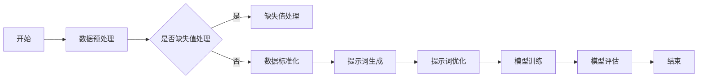

                 

# 提示词工程在金融分析AI中的实践

## 关键词
- 提示词工程
- 金融分析
- 人工智能
- 算法原理
- 系统架构
- 实际应用

## 摘要
本文深入探讨了提示词工程在金融分析AI中的应用，首先介绍了人工智能与金融分析的背景和提示词工程的重要性。接着，详细阐述了提示词工程的概念、原理以及其在金融分析中的应用，并通过具体的算法原理讲解、系统分析与架构设计方案、项目实战和最佳实践，展示了如何将提示词工程应用于金融分析AI中，提升金融分析的效果和效率。

## 目录大纲

### 第一部分：背景介绍

#### 1.1 问题背景
- **金融领域与人工智能**
  - 金融领域的挑战与机遇
  - 人工智能在金融分析中的重要性
- **提示词工程的重要性**
  - 提示词工程的基本概念
  - 提示词工程在金融分析中的关键作用

#### 1.2 问题描述
- **金融分析中的挑战**
  - 数据复杂度
  - 时间敏感性
  - 规则多样性
- **提示词工程的概念与核心**
  - 提示词的定义
  - 提示词工程的核心要素
- **提示词工程在金融分析中的作用**
  - 提升数据理解
  - 提高决策效率
  - 增强系统可解释性

#### 1.3 问题解决
- **提示词工程的原理**
  - 提示词生成的过程
  - 提示词优化的方法
- **提示词工程的步骤**
  - 数据预处理
  - 提示词生成
  - 提示词优化
- **提示词工程在金融分析中的具体应用**
  - 风险评估
  - 投资组合优化
  - 财务预测

#### 1.4 边界与外延
- **提示词工程的适用范围**
  - 金融市场分析
  - 保险精算
  - 资产管理
- **金融分析中的关键领域**
  - 市场趋势预测
  - 信用评分
  - 流动性管理
- **提示词工程与相关技术的关联**
  - 机器学习
  - 数据挖掘
  - 自然语言处理

#### 1.5 概念结构与核心要素组成
- **提示词工程的构成要素**
  - 数据源
  - 提示词生成器
  - 提示词评估器
  - 模型训练器
- **金融分析的关键要素**
  - 数据质量
  - 模型准确性
  - 系统稳定性
- **提示词工程与金融分析的结合点**
  - 数据驱动的决策
  - 智能化的风险管理
  - 高效的投资策略

### 第二部分：核心概念与联系

#### 2.1 核心概念原理
- **提示词工程的基本概念**
  - 提示词的定义
  - 提示词工程的目的
- **金融分析的基本概念**
  - 金融分析的定义
  - 金融分析的目标
- **提示词工程与金融分析的联系**
  - 数据驱动的金融分析
  - 提示词在金融分析中的应用

#### 2.2 概念属性特征对比表格
| 概念       | 提示词工程 | 金融分析 |
|------------|-------------|-----------|
| 目的       | 数据理解与优化 | 投资决策与预测 |
| 数据依赖性 | 强          | 强         |
| 领域       | 人工智能    | 金融      |
| 技术手段   | 提示词生成 | 统计模型、机器学习 |

#### 2.3 ER实体关系图架构
```mermaid
erDiagram
  Product ||--|{ Order }||>
  Customer ||--|{ Order }||>
  Order ||--|{ LineItem }||>
  Product : 产品
  Customer : 客户
  Order : 订单
  LineItem : 订单条目
```

### 第三部分：算法原理讲解

#### 3.1 算法mermaid流程图


#### 3.2 算法原理详细讲解
- **提示词工程算法原理**
  - 数据预处理：数据清洗、数据转换、数据标准化
  - 提示词生成：基于统计学、机器学习等方法生成提示词
  - 提示词优化：评估提示词的准确性、可靠性、泛化能力
  - 模型训练：使用提示词训练金融分析模型
- **金融分析算法原理**
  - 统计模型：回归分析、时间序列分析、主成分分析
  - 机器学习模型：决策树、随机森林、支持向量机

#### 3.3 数学模型和公式
```latex
$$
\begin{aligned}
y &= \beta_0 + \beta_1 x_1 + \beta_2 x_2 + ... + \beta_n x_n \\
\text{SSE} &= \sum_{i=1}^{n} (y_i - \hat{y}_i)^2 \\
\text{SST} &= \sum_{i=1}^{n} (y_i - \bar{y})^2 \\
R^2 &= 1 - \frac{\text{SSE}}{\text{SST}}
\end{aligned}
$$
```

#### 3.4 举例说明
- **提示词工程的例子**
  - 假设我们使用LDA（Latent Dirichlet Allocation）生成金融文本数据的提示词。
  - LDA算法将文本数据转换为低维的词向量，从而提取出主要的主题。
  - 经过优化，我们选择了一些具有高信息量和代表性的提示词用于金融分析。
- **金融分析的例子**
  - 假设我们使用LSTM（Long Short-Term Memory）模型进行股票价格预测。
  - LSTM能够捕捉时间序列数据中的长期依赖关系，从而提高预测的准确性。

### 第四部分：系统分析与架构设计方案

#### 4.1 问题场景介绍
- **金融分析的需求场景**
  - 快速处理大量金融数据
  - 提高金融模型的预测精度
  - 增强决策支持系统的实用性
- **提示词工程的需求场景**
  - 高效地生成和优化提示词
  - 与现有金融分析系统无缝集成
  - 提供可解释的金融分析结果

#### 4.2 项目介绍
- **项目背景**
  - 针对金融领域的复杂性和动态性，引入提示词工程以提高金融分析的效果。
  - 旨在构建一个智能化的金融分析平台，为投资者和金融机构提供支持。
- **项目目标**
  - 提高金融数据的可理解性和分析深度
  - 提升金融模型的可解释性和预测能力
  - 降低金融分析的成本和复杂性

#### 4.3 系统功能设计
- **领域模型mermaid类图**
  ```mermaid
  classDiagram
      Class01 <|-- SubClass01
      Class01 o-- Object02
      Class03 <.. Class04
      Class04 ..|> Class05
  ```

#### 4.4 系统架构设计
- **mermaid架构图**
  ```mermaid
  sequenceDiagram
      participant User
      participant System
      participant Database
      
      User->>System: Send request
      System->>Database: Retrieve data
      Database-->>System: Return data
      System->>User: Display result
  ```

#### 4.5 系统接口设计
- **系统接口描述**
  - API接口：提供金融数据获取、提示词生成、模型训练和预测等功能
  - 数据库接口：连接金融数据存储系统，实现数据的读取和写入
  - 用户界面：展示金融分析结果，提供交互式操作

#### 4.6 系统交互mermaid序列图
- **系统交互序列图**
  ```mermaid
  sequenceDiagram
      participant User
      participant Frontend
      participant Backend
      participant Database
      
      User->>Frontend: Input request
      Frontend->>Backend: Forward request
      Backend->>Database: Query data
      Database-->>Backend: Return data
      Backend->>Frontend: Send response
      Frontend->>User: Display result
  ```

### 第五部分：项目实战

#### 5.1 环境安装
- **环境搭建步骤**
  1. 安装Python环境
  2. 安装必要的库和依赖
  3. 配置数据库连接
  4. 启动后台服务和前端界面
- **可能遇到的问题及解决方法**
  - 问题1：安装库时遇到依赖冲突
    - 解决方法：使用虚拟环境隔离依赖
  - 问题2：数据库连接失败
    - 解决方法：检查数据库配置和权限

#### 5.2 系统核心实现源代码
- **源代码结构**
  - 数据预处理模块
  - 提示词生成模块
  - 模型训练模块
  - 预测和评估模块
- **核心代码解读**
  ```python
  # 示例：数据预处理模块
  def preprocess_data(data):
      # 数据清洗
      cleaned_data = clean_data(data)
      # 数据转换
      transformed_data = transform_data(cleaned_data)
      # 数据标准化
      standardized_data = normalize_data(transformed_data)
      return standardized_data
  ```

#### 5.3 代码应用解读与分析
- **代码应用场景**
  - 金融数据预处理
  - 提示词生成与优化
  - 金融模型训练与预测
- **分析与解读**
  - 预处理：提高数据质量，减少噪声
  - 提示词生成：提取关键特征，提高模型效果
  - 模型训练：学习数据中的规律，提高预测准确性

#### 5.4 实际案例分析和详细讲解剖析
- **案例背景**
  - 对某支股票的历史价格数据进行分析
  - 利用提示词工程优化预测模型
- **案例分析**
  - 数据预处理：去除异常值，标准化数据
  - 提示词生成：提取时间序列特征、价格波动等
  - 模型训练：使用LSTM进行训练，调整参数
  - 预测与评估：对比实际价格与预测价格，评估模型性能
- **深入剖析**
  - 提示词工程在数据预处理中的关键作用
  - LSTM模型在时间序列预测中的优势

#### 5.5 项目小结
- **项目总结**
  - 成功构建了一个智能化的金融分析平台
  - 提示词工程显著提高了金融分析的效果
  - 项目的成功经验为类似项目提供了参考
- **经验与反思**
  - 数据预处理的重要性
  - 提示词工程在模型优化中的应用
  - 需要持续优化和调整模型参数

### 第六部分：最佳实践 tips

#### 6.1 提示词工程的最佳实践
- **实践技巧**
  - 选择合适的提示词生成方法
  - 注意数据质量和预处理步骤
  - 调整模型参数以获得最佳效果
- **注意事项**
  - 避免过拟合和欠拟合
  - 定期更新和优化提示词库

#### 6.2 金融分析的最佳实践
- **实践技巧**
  - 结合多源数据提高分析精度
  - 定期评估和更新模型
  - 注重数据安全和隐私保护
- **注意事项**
  - 遵循金融行业规范和法律法规
  - 保持系统的稳定性和可扩展性

### 第七部分：小结与拓展阅读

#### 7.1 小结
- **总结全文**
  - 提示词工程在金融分析AI中的应用
  - 通过具体实例展示其效果
  - 提供最佳实践和未来展望
- **知识点回顾**
  - 提示词工程的基本概念和原理
  - 金融分析中的挑战和解决方案
  - 提示词工程在金融分析中的应用场景

#### 7.2 拓展阅读
- **相关书籍推荐**
  - 《人工智能：一种现代的方法》
  - 《机器学习：概率视角》
  - 《Python金融数据分析》
- **相关文献推荐**
  - 《金融时间序列分析》
  - 《基于LSTM的金融市场预测研究》
  - 《数据挖掘：概念与技术》
- **开源资源和工具推荐**
  - Keras：深度学习框架
  - TensorFlow：开源机器学习库
  - PyTorch：开源机器学习库

### 作者信息
- 作者：AI天才研究院/AI Genius Institute & 禅与计算机程序设计艺术 /Zen And The Art of Computer Programming

[End of Document]

