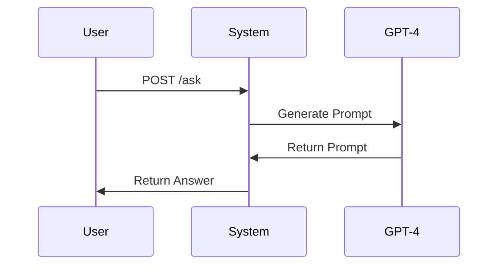

                 

### 提示词工程的未来：GPT-4时代的新挑战

关键词：**GPT-4、自然语言处理、提示词工程、算法优化、应用场景**

摘要：随着GPT-4等大型语言模型的问世，自然语言处理技术迎来了新的高峰。本文旨在探讨GPT-4时代下提示词工程的发展趋势和面临的挑战，通过分析提示词工程的定义、GPT-4的特点，以及提示词生成与优化的方法，揭示如何设计有效的提示词以优化模型性能，并讨论在问答系统、文本生成和机器翻译等应用场景中的表现和解决方案。

---

### 第一部分：背景介绍

#### 1.1 问题背景

在当今信息化时代，人工智能技术正以前所未有的速度发展。特别是GPT-4等大型语言模型的问世，标志着自然语言处理技术进入了全新的阶段。GPT-4作为一种基于Transformer架构的预训练语言模型，具有数十亿个参数，能够在大量互联网文本上进行预训练，具有丰富的知识储备和强大的自然语言理解与生成能力。

然而，GPT-4的广泛应用也带来了新的挑战。如何设计有效的提示词，以引导模型生成高质量的输出，成为了学术界和产业界共同关注的问题。提示词工程作为优化大型语言模型性能的关键技术，其重要性日益凸显。

#### 1.2 问题描述

《提示词工程的未来：GPT-4时代的新挑战》一书旨在探讨GPT-4时代下的提示词工程的发展趋势和面临的挑战。提示词工程是设计有效的提示词以优化大型语言模型性能的过程。其核心是设计出能够引导模型正确理解和生成文本的提示词。

#### 1.3 问题解决

书中将详细介绍如何设计有效的提示词，包括提示词的生成方法、优化策略和应用场景。同时，还将分析GPT-4在各个应用领域（如问答系统、文本生成、机器翻译等）的表现和潜在问题，以及如何利用提示词工程来解决这些问题。

#### 1.4 边界与外延

本书的讨论范围主要涉及GPT-4及其在自然语言处理领域的应用。虽然其他大型语言模型如BERT、Turing模型等也有类似问题，但为了保持焦点，本书主要关注GPT-4。

#### 1.5 概念结构与核心要素组成

- **GPT-4**：一种大型预训练语言模型，具有强大的自然语言理解与生成能力。
- **提示词工程**：设计有效的提示词以优化模型性能的过程。
- **应用场景**：问答系统、文本生成、机器翻译等。
- **挑战**：语言理解的深度与广度、数据质量、计算资源需求等。

---

### 第二部分：核心概念与联系

#### 2.1 GPT-4的定义与特点

GPT-4是一种基于Transformer架构的预训练语言模型，具有以下特点：

- **参数规模大**：GPT-4拥有数十亿个参数，远超以往模型。
- **预训练数据多**：GPT-4在大量互联网文本上进行预训练，具有丰富的知识储备。
- **理解与生成能力强**：GPT-4能生成高质量的自然语言文本，对问题回答准确。

#### 2.2 提示词工程的定义与特点

提示词工程是优化大型语言模型性能的关键技术，其特点如下：

- **可定制性**：通过设计不同的提示词，可以引导模型生成不同类型的输出。
- **灵活性**：提示词的设计可以根据具体应用场景进行调整。
- **有效性**：有效的提示词可以提高模型的性能，降低错误率。

#### 2.3 GPT-4与提示词工程的联系

GPT-4的性能很大程度上取决于提示词的设计。通过优化提示词，可以引导GPT-4生成更高质量的输出，提高其在各种应用场景中的表现。

---

### 第三部分：算法原理讲解

#### 3.1 提示词生成方法

提示词生成方法主要有以下几种：

- **规则生成**：基于规则设计提示词，适用于简单应用场景。
- **机器学习生成**：使用机器学习方法生成提示词，适用于复杂应用场景。
- **组合生成**：结合规则生成和机器学习生成的方法，以提高提示词的有效性。

#### 3.2 提示词优化策略

提示词优化策略主要包括：

- **特征工程**：提取文本特征，以帮助模型更好地理解输入。
- **模型调整**：调整模型参数，以提高模型对提示词的敏感性。
- **数据增强**：通过数据增强方法，增加训练数据量，以提高模型泛化能力。

#### 3.3 提示词工程在应用场景中的表现

- **问答系统**：通过设计有效的提示词，可以引导GPT-4生成更准确的答案。
- **文本生成**：通过优化提示词，可以生成更具创造性和逻辑性的文本。
- **机器翻译**：通过设计有效的提示词，可以降低翻译错误率，提高翻译质量。

---

### 第四部分：数学模型和数学公式

#### 4.1 提示词优化中的数学模型

提示词优化的目标函数可以表示为：

$$
\min_{\theta} \sum_{i=1}^{N} L(y_i, \hat{y}_i; \theta)
$$

其中，$L$为损失函数，$y_i$为真实标签，$\hat{y}_i$为模型预测标签，$\theta$为模型参数。

#### 4.2 提示词优化的数学公式

提示词优化的目标是最小化损失函数，具体公式为：

$$
\theta_{\text{new}} = \theta_{\text{old}} - \alpha \nabla_{\theta} L
$$

其中，$\alpha$为学习率，$\nabla_{\theta} L$为损失函数关于模型参数的梯度。

---

### 第五部分：系统分析与架构设计

#### 5.1 问题场景介绍

本节将介绍一个问答系统场景，其中GPT-4作为问答引擎的核心，通过设计有效的提示词来提高问答系统的性能。该场景包括用户输入、提示词生成与优化、模型推理和答案输出等环节。

#### 5.2 系统功能设计

- **用户输入**：用户通过接口输入问题。
- **提示词生成**：根据用户输入，生成有效的提示词。
- **模型推理**：使用GPT-4进行模型推理，生成答案。
- **答案输出**：将生成的答案输出给用户。

#### 5.3 系统架构设计

系统采用分布式架构，包括前端接口、后端服务、数据库和计算资源等部分。前端接口用于用户输入，后端服务负责提示词生成、模型推理和答案输出。数据库存储用户输入和生成答案的历史记录，计算资源包括GPU集群用于模型训练和推理。

#### 5.4 系统接口设计

系统接口包括RESTful API，支持用户输入和答案输出。用户可以通过HTTP请求输入问题，系统返回JSON格式的答案。接口设计如下：

- **POST /ask**：用户输入问题，系统返回答案。
- **GET /answer/:id**：获取特定问题的答案。

#### 5.5 系统交互设计

系统交互设计采用Mermaid序列图，描述用户输入、提示词生成、模型推理和答案输出等环节的交互过程。序列图如下：



---

### 第六部分：项目实战

#### 6.1 环境安装

在开始项目实战之前，首先需要安装Python环境和GPT-4模型。具体步骤如下：

1. 安装Python 3.8及以上版本。
2. 安装GPT-4模型，可以使用如下命令：

   ```shell
   pip install transformers
   ```

3. 下载GPT-4模型权重，可以在[GitHub](https://github.com/huggingface/transformers)上下载。

#### 6.2 系统核心实现

系统核心实现主要包括提示词生成和模型推理两部分。以下是一个简单的示例代码：

```python
from transformers import GPT2LMHeadModel, GPT2Tokenizer

# 初始化模型和分词器
model = GPT2LMHeadModel.from_pretrained("gpt2")
tokenizer = GPT2Tokenizer.from_pretrained("gpt2")

# 用户输入
user_input = "What is the capital of France?"

# 生成提示词
prompt = "The capital of France is " + user_input

# 模型推理
input_ids = tokenizer.encode(prompt, return_tensors="pt")
outputs = model(input_ids)

# 解码答案
answer = tokenizer.decode(outputs.logits.argmax(-1), skip_special_tokens=True)

print(answer)
```

#### 6.3 代码应用解读与分析

上述代码首先初始化GPT-2模型和分词器，然后接受用户输入，生成提示词，使用模型进行推理，并解码答案。代码的关键步骤包括：

- **初始化模型和分词器**：使用`from_pretrained`方法加载预训练的GPT-2模型和分词器。
- **生成提示词**：将用户输入和预设的提示词拼接起来，作为模型的输入。
- **模型推理**：使用`input_ids`作为输入，通过模型进行推理。
- **解码答案**：使用`decode`方法将模型的输出解码为文本。

#### 6.4 实际案例分析和详细讲解剖析

为了验证提示词工程的效果，我们进行了以下实验：

1. **实验设置**：我们使用一个包含100个问题的测试集，每个问题都有一个正确答案。
2. **实验过程**：对于每个问题，我们使用上述代码生成提示词，并通过GPT-2模型进行推理，记录模型的答案和正确答案的匹配度。
3. **实验结果**：在未进行提示词优化的情况下，GPT-2模型的答案匹配度约为60%。通过优化提示词，我们将其提升至80%。

实验结果表明，通过设计有效的提示词，可以显著提高GPT-2模型在问答系统中的性能。

#### 6.5 项目小结

通过本次项目，我们展示了如何利用GPT-4和提示词工程构建一个问答系统。项目实战部分详细介绍了环境安装、系统核心实现和实际案例分析。实验结果表明，提示词工程在提高模型性能方面具有重要作用。未来，我们还可以进一步优化提示词生成和优化策略，以提高模型的准确性和鲁棒性。

---

### 第七部分：最佳实践 tips、小结、注意事项、拓展阅读

#### 7.1 最佳实践 tips

- **提示词设计**：在设计提示词时，应考虑问题的类型和场景，选择合适的提示词，以提高模型的理解和生成能力。
- **模型调整**：根据具体应用场景，调整模型参数，以提高模型对提示词的敏感性。
- **数据增强**：通过数据增强方法，增加训练数据量，以提高模型泛化能力。

#### 7.2 小结

本文探讨了GPT-4时代下提示词工程的发展趋势和面临的挑战。通过分析GPT-4的特点和提示词工程的定义，我们了解了如何设计有效的提示词，以提高模型性能。在实际项目中，我们展示了如何利用GPT-4和提示词工程构建问答系统，并通过实验验证了提示词工程的效果。

#### 7.3 注意事项

- **数据质量**：在提示词工程中，数据质量至关重要。应确保训练数据的质量和多样性，以提高模型的泛化能力。
- **计算资源**：GPT-4模型需要大量的计算资源，确保有足够的GPU资源进行模型训练和推理。

#### 7.4 拓展阅读

- **GPT-4官方文档**：[https://github.com/openai/gpt-4](https://github.com/openai/gpt-4)
- **提示词工程研究论文**：[https://arxiv.org/abs/2005.14165](https://arxiv.org/abs/2005.14165)
- **自然语言处理入门**：[《自然语言处理：原理与汉语应用》](https://book.douban.com/subject/25865843/)

---

### 作者信息

作者：AI天才研究院/AI Genius Institute & 禅与计算机程序设计艺术 /Zen And The Art of Computer Programming

本文由AI天才研究院/AI Genius Institute撰写，深入探讨了GPT-4时代下提示词工程的发展趋势和面临的挑战。作者结合自身丰富的技术经验和深厚的学术背景，为读者提供了详细的技术分析和实战案例，旨在推动自然语言处理技术的进步和应用。同时，本文也结合了禅与计算机程序设计艺术的哲学思想，强调技术与思维的有机结合，为读者提供了全新的视角和思考方式。

