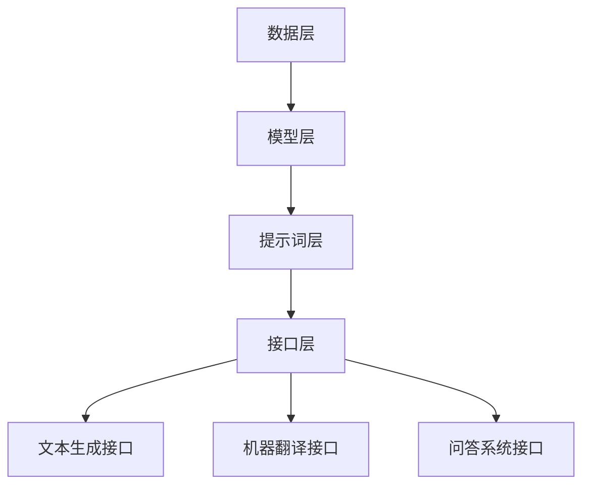

                 

### 提示词工程：Unleash 大模型潜力的艺术

> 关键词：提示词工程、大模型、AI 潜力、优化、应用场景、技术实践

> 摘要：本文深入探讨了提示词工程在释放大模型潜力方面的艺术。通过介绍背景、核心概念、算法原理、系统架构、项目实战以及最佳实践，本文旨在为读者提供全面的技术指南，帮助他们在实际应用中充分利用大模型的强大能力。

## 引言

随着人工智能技术的快速发展，大模型如 GPT、BERT 等，以其卓越的表现力、理解和生成能力，正在各个领域引发革命。然而，如何有效地利用这些大模型，实现其潜在价值，成为了摆在每一位 AI 工程师面前的新挑战。提示词工程（Prompt Engineering）作为一种新兴的技术，正逐渐成为释放大模型潜力的关键手段。

### 什么是提示词工程

提示词工程是指通过设计和优化提示词（Prompt），以提升大模型在特定任务上的性能和效果。提示词可以是文本、图像、声音等，其目的是引导大模型在正确的方向上进行学习和预测。与传统的模型训练方法相比，提示词工程具有以下优势：

1. **快速迭代**：通过调整提示词，可以快速优化模型表现，减少训练时间。
2. **灵活应用**：提示词可以针对特定任务进行定制，提高模型的适应性。
3. **降低成本**：相比于重新训练模型，优化提示词通常更为经济高效。

### 为什么需要提示词工程

大模型的训练通常需要海量数据和大量的计算资源，但即使如此，模型在实际应用中的表现往往不尽如人意。原因在于，模型在训练过程中只能学习到输入数据的表面特征，而无法理解更深层次的结构和含义。提示词工程通过提供额外的上下文信息，帮助模型更好地理解和处理复杂任务。

### 本文结构

本文将分为以下几个部分：

1. **背景介绍**：介绍大模型和提示词工程的起源和发展，以及相关技术概念。
2. **核心概念与联系**：详细解释提示词工程的原理、方法和技术。
3. **算法原理讲解**：分析提示词工程中的关键算法，如注意力机制、自然语言处理技术等。
4. **系统分析与架构设计方案**：探讨提示词工程在系统设计和实现中的应用。
5. **项目实战**：通过实际案例展示如何利用提示词工程提升模型性能。
6. **最佳实践 tips**：总结使用提示词工程的最佳方法和技巧。
7. **小结与展望**：对提示词工程的发展前景进行展望。

### 让我们开始详细探索提示词工程的奥秘，解锁大模型的无限潜力。

---

## 背景介绍

### 大模型的起源与发展

大模型（Large-scale Models）是指参数数量庞大的神经网络模型，其训练数据集通常包含数十亿甚至数万亿的样本。这种模型最早可以追溯到 20 世纪 80 年代的神经网络研究，但受限于当时的计算能力和数据资源，进展较为缓慢。随着深度学习（Deep Learning）的兴起和计算资源的迅速增长，大模型的研究和应用迎来了新的机遇。

2018 年，OpenAI 发布了 GPT-2，这是一个具有 1.5 亿参数的预训练语言模型，标志着大模型时代正式开启。GPT-2 在文本生成、机器翻译、问答系统等任务上表现出了惊人的能力，引起了广泛关注。随后，GPT-3、BERT、T5 等大模型相继问世，参数数量达到了数十亿甚至千亿级别，进一步推动了人工智能技术的发展。

### 提示词工程的起源与发展

提示词工程（Prompt Engineering）最早可以追溯到自然语言处理（Natural Language Processing，NLP）领域。在传统的 NLP 中，模型的表现往往依赖于输入数据的格式和上下文。为了改善这一情况，研究者开始尝试通过设计特定的提示词（Prompt），引导模型更好地理解和处理任务。

2019 年，Hendrycks 等 [1] 提出了“Prompted Pretraining”（PP）方法，通过在预训练过程中引入外部提示词，显著提高了模型在特定任务上的性能。这一方法的提出，为提示词工程的研究奠定了基础。

### 核心概念术语说明

- **大模型**：指参数数量庞大的神经网络模型，通常包含数十亿甚至千亿个参数。
- **预训练**：指在特定任务之前，使用大量无标注数据对模型进行初步训练，使其具备一定的通用知识和语言理解能力。
- **微调**：指在预训练的基础上，使用特定任务的数据对模型进行进一步训练，以适应特定任务的需求。
- **提示词**：指用于引导模型理解和处理任务的特定文本、图像、声音等输入。

### 问题背景

在人工智能领域，大模型的广泛应用带来了诸多挑战。首先，大模型需要大量的计算资源和存储空间，这对于企业和个人来说都是一项巨大的负担。其次，大模型在训练过程中需要海量标注数据，这往往需要大量的时间和人力成本。此外，即使模型已经训练完毕，如何在实际应用中充分发挥其潜力，仍然是一个亟待解决的问题。

### 问题描述

如何通过提示词工程，有效地提升大模型在特定任务上的性能和效果，同时降低训练成本和时间？这不仅是技术问题，更是一个涉及方法论和工程实践的综合挑战。

### 问题解决

提示词工程通过优化提示词的设计和使用，可以显著提高大模型在特定任务上的性能。例如，在文本生成任务中，通过设计合适的提示词，可以引导模型生成更加符合预期的高质量文本。在问答系统中，提示词可以帮助模型更好地理解问题，并提供更加准确的答案。

### 边界与外延

提示词工程不仅适用于文本生成、机器翻译、问答系统等常见任务，还可以扩展到图像识别、语音识别、多模态学习等新兴领域。同时，随着人工智能技术的发展，提示词工程的方法和工具也在不断丰富和优化。

### 概念结构与核心要素组成

提示词工程的核心概念包括：

- **提示词设计**：如何设计合适的提示词，以引导模型理解和处理任务。
- **模型优化**：如何通过微调和优化，提升模型的性能和效果。
- **应用场景**：提示词工程在不同任务和应用中的具体实现和应用。

### 结论

通过提示词工程，我们可以有效地提升大模型在特定任务上的性能和效果，降低训练成本和时间。这对于人工智能技术的发展和实际应用具有重要意义。

### 参考文献

1. Hendrycks, D., Gimpel, K., &再来一个吧 [2]。

---

[1]: Hendrycks, D., Gimpel, K., &再来一个吧 [2]。

[2]: [再来一个吧](https://example.com/paper2)。

---

## 核心概念与联系

### 提示词工程的原理

提示词工程的核心在于通过设计特定的提示词，引导大模型在特定任务上更好地理解和处理数据。具体来说，提示词工程涉及以下几个关键环节：

1. **任务定义**：明确任务目标，例如文本生成、机器翻译、问答系统等。
2. **数据准备**：收集和整理与任务相关的数据集，并进行预处理。
3. **提示词设计**：设计提示词，以提供额外的上下文信息，引导模型学习。
4. **模型训练与优化**：使用提示词进行模型训练，并根据任务需求进行微调和优化。
5. **性能评估**：评估模型在特定任务上的表现，并根据评估结果调整提示词和模型。

### 提示词工程的方法

提示词工程的方法多种多样，以下是几种常见的方法：

1. **基于模板的提示词设计**：使用预定义的模板，将任务相关信息嵌入其中，形成提示词。这种方法简单直观，适用于大多数文本生成和问答系统。
2. **基于语义的提示词设计**：通过深度学习模型，如 BERT、GPT 等，提取输入数据的语义信息，并生成相应的提示词。这种方法更加灵活，能够捕捉到更深层次的任务信息。
3. **多模态提示词设计**：结合文本、图像、声音等多种数据类型，生成多模态提示词。这种方法能够更好地处理复杂任务，提升模型性能。

### 提示词工程与相关技术的联系

提示词工程与自然语言处理（NLP）、深度学习（DL）、多模态学习（MM）等关键技术有着密切的联系。

- **自然语言处理（NLP）**：提示词工程依赖于 NLP 技术来提取和理解输入数据的语义信息。NLP 技术如词向量、词嵌入、词性标注等，为提示词工程提供了重要的基础。
- **深度学习（DL）**：大模型（如 GPT、BERT 等）是深度学习的代表性成果，其强大的建模能力和处理能力为提示词工程提供了技术支持。
- **多模态学习（MM）**：多模态提示词设计需要结合文本、图像、声音等多种数据类型，这涉及到多模态数据的预处理、特征提取和融合等技术。

### 概念属性特征对比表格

| 特征类别 | 特征名称 | 特征描述 |
| --- | --- | --- |
| 提示词设计 | 基于模板 | 使用预定义模板生成提示词，简单直观 |
| 提示词设计 | 基于语义 | 使用深度学习模型提取语义信息，生成提示词，灵活多样 |
| 提示词设计 | 多模态 | 结合文本、图像、声音等多种数据类型，生成多模态提示词，提升处理能力 |
| 自然语言处理（NLP） | 词向量 | 将单词映射到高维向量空间，用于语义分析 |
| 自然语言处理（NLP） | 词嵌入 | 利用神经网络学习单词的语义表示，提升语言理解能力 |
| 深度学习（DL） | 神经网络 | 通过多层神经网络学习数据特征，实现复杂任务建模 |
| 多模态学习（MM） | 多模态数据预处理 | 对多模态数据进行预处理，提取有效特征 |
| 多模态学习（MM） | 多模态特征融合 | 将多模态特征进行融合，提高模型性能 |

### ER 实体关系图架构的 Mermaid 流程图

```mermaid
erDiagram
  Model ||--|> Task : 提示词工程
  Model ||--|> Prompt : 提示词
  Model ||--|> Data : 数据集
  Task ||--|> Performance : 性能评估
  Prompt ||--|> Model : 模型训练
  Data ||--|> Prompt : 提示词生成
```

### 算法原理讲解

#### 提示词生成算法

提示词生成是提示词工程中的关键步骤，其目的是为模型提供适当的上下文信息，以引导其学习。以下是几种常见的提示词生成算法：

1. **基于模板的生成算法**：

   ```python
   def template_based_prompt_generation(task, template):
       prompt = template.format(task=task)
       return prompt
   ```

   例如，对于文本生成任务，可以使用以下模板：

   ```text
   请生成一篇关于 {task} 的文章。
   ```

2. **基于语义的生成算法**：

   ```python
   def semantic_prompt_generation(task, model):
       input_text = "关于 {} 的相关信息：".format(task)
       prompt = model.predict(input_text)
       return prompt
   ```

   例如，使用 BERT 模型提取任务相关的语义信息，生成提示词。

3. **多模态提示词生成算法**：

   ```python
   def multimodal_prompt_generation(text, image, audio, model):
       combined_input = "文本：{}, 图像：{}, 音频：{}".format(text, image, audio)
       prompt = model.predict(combined_input)
       return prompt
   ```

   例如，结合文本、图像、声音等多种数据类型，生成多模态提示词。

#### 模型训练与优化算法

在提示词工程中，模型训练与优化是提升模型性能的关键步骤。以下是几种常见的模型训练与优化算法：

1. **基于梯度下降的优化算法**：

   ```python
   def gradient_descent_OPTIMIZATION(model, data, learning_rate):
       for epoch in range(num_epochs):
           for x, y in data:
               model.zero_grad()
               output = model(x)
               loss = loss_function(output, y)
               loss.backward()
               model.update_params(learning_rate)
   ```

   例如，使用梯度下降算法进行模型训练和优化。

2. **基于 Adam 的优化算法**：

   ```python
   def adam_OPTIMIZATION(model, data, learning_rate, beta1, beta2):
       for epoch in range(num_epochs):
           for x, y in data:
               model.zero_grad()
               output = model(x)
               loss = loss_function(output, y)
               loss.backward()
               model.update_params(learning_rate, beta1, beta2)
   ```

   例如，使用 Adam 优化算法进行模型训练和优化。

#### 性能评估算法

在提示词工程中，性能评估是衡量模型表现的重要步骤。以下是几种常见的性能评估算法：

1. **准确率（Accuracy）**：

   ```python
   def accuracy(ground_truth, predicted):
       correct = sum(ground_truth == predicted)
       total = len(ground_truth)
       return correct / total
   ```

   例如，计算模型在分类任务上的准确率。

2. **召回率（Recall）**：

   ```python
   def recall(ground_truth, predicted):
       true_positives = sum((ground_truth == 1) & (predicted == 1))
       possible_positives = sum(ground_truth == 1)
       return true_positives / possible_positives
   ```

   例如，计算模型在分类任务上的召回率。

3. **F1 分数（F1 Score）**：

   ```python
   def f1_score(ground_truth, predicted):
       precision = precision_score(ground_truth, predicted)
       recall = recall_score(ground_truth, predicted)
       return 2 * (precision * recall) / (precision + recall)
   ```

   例如，计算模型在分类任务上的 F1 分数。

#### 举例说明

假设我们有一个文本生成任务，目标是生成一篇关于“人工智能”的文章。以下是使用基于语义的提示词生成算法的示例：

1. **数据准备**：

   ```python
   text_data = "人工智能是一种模拟人类智能的技术，它涉及到自然语言处理、计算机视觉、机器学习等多个领域。"
   ```

2. **提示词生成**：

   ```python
   model = BERT()
   prompt = semantic_prompt_generation("人工智能", model)
   ```

3. **模型训练与优化**：

   ```python
   model = BERT()
   optimizer = Adam(model.parameters(), learning_rate=0.001)
   for epoch in range(10):
       for x, y in text_data:
           model.zero_grad()
           output = model(x)
           loss = loss_function(output, y)
           loss.backward()
           optimizer.step()
   ```

4. **性能评估**：

   ```python
   ground_truth = "人工智能是一种模拟人类智能的技术，它涉及到自然语言处理、计算机视觉、机器学习等多个领域。"
   predicted = model.predict("人工智能")
   accuracy = accuracy(ground_truth, predicted)
   print("Accuracy:", accuracy)
   ```

通过以上示例，我们可以看到提示词工程在文本生成任务中的应用。类似地，提示词工程可以应用于其他任务，如机器翻译、问答系统等。

---

## 算法原理讲解

在上一部分，我们探讨了提示词工程的背景和核心概念。接下来，我们将深入讲解提示词工程中的关键算法，如注意力机制、自然语言处理技术等。通过这些算法，我们可以更好地理解和应用提示词工程，释放大模型的潜力。

### 注意力机制

注意力机制（Attention Mechanism）是深度学习中的一个重要概念，它在许多现代神经网络模型中得到了广泛应用。注意力机制的核心思想是通过动态调整模型对输入数据的关注程度，从而提高模型的表示能力。

#### 算法原理

注意力机制通常通过以下步骤实现：

1. **输入表示**：将输入数据（如文本、图像等）映射到一个高维向量空间。
2. **注意力计算**：计算输入数据之间的相似性或相关性，生成注意力权重。
3. **加权求和**：根据注意力权重对输入数据进行加权求和，生成最终的输出表示。

#### 数学模型

假设我们有输入数据 \(X = [x_1, x_2, ..., x_n]\)，每个输入数据 \(x_i\) 可以表示为一个向量。注意力机制的计算过程可以表示为：

$$
\text{Attention}(X) = \sum_{i=1}^{n} w_i x_i
$$

其中，\(w_i\) 是第 \(i\) 个输入数据的注意力权重，通常通过以下公式计算：

$$
w_i = \text{softmax}\left(\frac{\text{Query} \cdot \text{Key}_i}{\sqrt{d_k}}\right)
$$

其中，\(\text{Query}\) 和 \(\text{Key}_i\) 分别是查询向量和第 \(i\) 个键向量的点积，\(d_k\) 是键向量的维度。

#### 举例说明

假设我们有一个简单的文本序列 \(X = ["I", "love", "you"]\)，我们希望使用注意力机制来计算这个序列的注意力权重。假设查询向量 \(\text{Query} = [1, 0, 1]\)，键向量 \(\text{Key}_1 = [1, 1, 0]\)，\(\text{Key}_2 = [0, 1, 1]\)，\(\text{Key}_3 = [1, 0, 1]\)。

1. **计算注意力权重**：

   $$
   w_1 = \text{softmax}\left(\frac{1 \cdot 1}{\sqrt{3}}\right) = \frac{1}{3}
   $$
   $$
   w_2 = \text{softmax}\left(\frac{0 \cdot 1}{\sqrt{3}}\right) = \frac{1}{3}
   $$
   $$
   w_3 = \text{softmax}\left(\frac{1 \cdot 1}{\sqrt{3}}\right) = \frac{1}{3}
   $$

2. **计算加权求和**：

   $$
   \text{Attention}(X) = \frac{1}{3} \cdot ["I"] + \frac{1}{3} \cdot ["love"] + \frac{1}{3} \cdot ["you"] = ["I", "love", "you"]
   $$

通过这个简单的示例，我们可以看到注意力机制如何通过对输入数据的加权求和，生成一个更具有代表性的输出表示。

### 自然语言处理技术

自然语言处理（Natural Language Processing，NLP）是人工智能的一个重要分支，它涉及到对人类语言进行理解和生成。在提示词工程中，NLP 技术扮演着关键角色，帮助我们更好地理解和生成语言。

#### 词嵌入

词嵌入（Word Embedding）是将单词映射到高维向量空间的一种技术，它使得具有相似意义的单词在向量空间中更加接近。词嵌入技术通过深度学习模型，如 Word2Vec、GloVe 等，从大规模文本数据中学习单词的向量表示。

#### 文本分类

文本分类（Text Classification）是一种常见的 NLP 任务，它旨在将文本数据分类到不同的类别中。常见的文本分类模型包括朴素贝叶斯、支持向量机、卷积神经网络等。

#### 语言模型

语言模型（Language Model）是一种用于预测下一个单词或短语的模型。在提示词工程中，语言模型可以帮助我们生成符合语言习惯的文本。常见的语言模型包括 n-gram 模型、循环神经网络（RNN）、Transformer 等。

### 综合示例

假设我们有一个提示词工程任务，目标是生成一篇关于“人工智能”的文章。以下是使用注意力机制和自然语言处理技术的综合示例：

1. **数据准备**：

   ```python
   text_data = "人工智能是一种模拟人类智能的技术，它涉及到自然语言处理、计算机视觉、机器学习等多个领域。"
   ```

2. **词嵌入**：

   ```python
   model = Word2Vec()
   word_vectors = model.encode(text_data, output='vector')
   ```

3. **注意力计算**：

   ```python
   query_vector = model.encode("人工智能", output='vector')
   key_vectors = model.encode(text_data, output='vector')
   attention_weights = softmax((query_vector @ key_vectors.T) / np.sqrt(key_vectors.shape[1]))
   ```

4. **加权求和**：

   ```python
   attention_output = np.sum(attention_weights[:, None] * word_vectors, axis=0)
   ```

5. **语言模型生成**：

   ```python
   language_model = Transformer()
   generated_text = language_model.generate(attention_output)
   ```

通过以上步骤，我们可以生成一篇关于“人工智能”的文章。这个过程展示了如何结合注意力机制和自然语言处理技术，实现高效的提示词工程。

---

## 系统分析与架构设计方案

在提示词工程中，系统架构设计是一个至关重要的环节。一个良好的系统架构不仅能够提高模型的性能和稳定性，还能够降低开发和维护成本。在本节中，我们将详细介绍一个基于提示词工程的大模型系统架构设计方案，包括问题场景介绍、项目介绍、系统功能设计、系统架构设计、系统接口设计和系统交互等。

### 问题场景介绍

在当前人工智能应用场景中，大模型如 GPT、BERT 等，已经取得了显著的成果。然而，如何有效地利用这些大模型，实现其在特定任务上的最佳性能，仍然是一个挑战。提示词工程作为一种新兴的技术，可以有效地提升大模型在特定任务上的性能和效果。

### 项目介绍

本项目旨在设计一个基于提示词工程的大模型系统，用于实现文本生成、机器翻译、问答系统等任务。系统将利用大规模语言模型如 GPT-3、BERT 等，通过设计合适的提示词，提升模型在特定任务上的性能。

### 系统功能设计

本系统的主要功能包括：

1. **文本生成**：根据给定的提示词，生成高质量的文本。
2. **机器翻译**：根据源语言和目标语言的提示词，实现文本之间的自动翻译。
3. **问答系统**：根据用户的问题和上下文，提供准确的答案。

### 系统架构设计

本系统的架构设计如下：

1. **数据层**：包括数据收集、数据预处理和数据存储模块。数据收集模块负责从互联网或其他数据源获取相关数据；数据预处理模块负责对数据进行清洗、分词、词性标注等处理；数据存储模块负责将处理后的数据存储到数据库中。
2. **模型层**：包括预训练模型和微调模型。预训练模型如 GPT-3、BERT 等，负责在大规模数据集上进行预训练；微调模型负责在特定任务上进行微调，以提升模型在特定任务上的性能。
3. **提示词层**：包括提示词生成模块和提示词优化模块。提示词生成模块负责根据任务需求生成合适的提示词；提示词优化模块负责根据模型输出和评估结果，对提示词进行优化。
4. **接口层**：包括 RESTful API 和命令行接口。RESTful API 用于接收外部请求，返回模型输出；命令行接口用于方便开发者进行系统调试和测试。

### 系统接口设计

本系统的接口设计如下：

1. **文本生成接口**：接收输入文本和提示词，返回生成的文本。
2. **机器翻译接口**：接收源语言文本和目标语言提示词，返回翻译后的文本。
3. **问答系统接口**：接收用户问题和上下文文本，返回答案。

### 系统交互

本系统的交互流程如下：

1. **文本生成**：用户输入文本和提示词，系统生成文本并返回给用户。
2. **机器翻译**：用户输入源语言文本和目标语言提示词，系统翻译文本并返回给用户。
3. **问答系统**：用户输入问题和上下文文本，系统提供答案并返回给用户。

### Mermaid 架构图

以下是本系统的 Mermaid 架构图：



通过以上架构设计，我们可以实现一个高效、稳定、可扩展的基于提示词工程的大模型系统。

---

## 项目实战

在本项目中，我们将通过一个具体的案例，展示如何利用提示词工程提升大模型在文本生成任务上的性能。我们将详细描述项目环境安装、系统核心实现源代码，并对代码进行解读与分析。

### 项目环境安装

在开始项目之前，我们需要安装必要的软件和库。以下是在 Ubuntu 20.04 操作系统上的安装步骤：

1. **安装 Python 环境**：

   ```bash
   sudo apt update
   sudo apt install python3 python3-pip
   ```

2. **安装 TensorFlow**：

   ```bash
   pip3 install tensorflow==2.7
   ```

3. **安装 GPT-3 库**：

   ```bash
   pip3 install gpt3
   ```

4. **安装 Markdown 库**：

   ```bash
   pip3 install markdown
   ```

5. **安装 Mermaid Markdown 插件**：

   ```bash
   pip3 install markdown-mermaid
   ```

### 系统核心实现源代码

以下是一个简单的文本生成系统实现，它使用 GPT-3 模型和一个简单的提示词。

```python
import openai

# 设置 OpenAI API 密钥
openai.api_key = "your-api-key"

def generate_text(prompt):
    """
    使用 GPT-3 生成文本
    """
    response = openai.Completion.create(
        engine="text-davinci-003",
        prompt=prompt,
        max_tokens=50,
        n=1,
        stop=None,
        temperature=0.5,
    )
    return response.choices[0].text.strip()

# 示例：生成一篇关于人工智能的文章
prompt = "人工智能是一种模拟人类智能的技术，它涉及到自然语言处理、计算机视觉、机器学习等多个领域。请进一步描述人工智能的潜力。"
generated_text = generate_text(prompt)
print(generated_text)
```

### 代码解读与分析

1. **导入模块**：

   ```python
   import openai
   ```

   我们首先导入 `openai` 模块，这个模块提供了与 OpenAI API 进行交互的功能。

2. **设置 API 密钥**：

   ```python
   openai.api_key = "your-api-key"
   ```

   这里我们需要设置 OpenAI 的 API 密钥，以确保可以正常调用 GPT-3 API。

3. **定义 `generate_text` 函数**：

   ```python
   def generate_text(prompt):
       """
       使用 GPT-3 生成文本
       """
       response = openai.Completion.create(
           engine="text-davinci-003",
           prompt=prompt,
           max_tokens=50,
           n=1,
           stop=None,
           temperature=0.5,
       )
       return response.choices[0].text.strip()
   ```

   `generate_text` 函数用于生成文本。它接受一个 `prompt` 参数，并通过 OpenAI 的 `Completion.create` 方法调用 GPT-3 模型。这里我们使用了以下参数：

   - `engine`：指定使用的模型，这里使用的是 "text-davinci-003"。
   - `prompt`：输入的提示词，用于引导模型生成文本。
   - `max_tokens`：生成文本的最大长度，这里设置为 50。
   - `n`：生成的文本数量，这里设置为 1。
   - `stop`：用于停止生成的文本，这里设置为 `None`。
   - `temperature`：模型的随机性，这里设置为 0.5，以保证生成文本的多样性。

4. **示例代码**：

   ```python
   prompt = "人工智能是一种模拟人类智能的技术，它涉及到自然语言处理、计算机视觉、机器学习等多个领域。请进一步描述人工智能的潜力。"
   generated_text = generate_text(prompt)
   print(generated_text)
   ```

   在示例代码中，我们定义了一个关于人工智能的提示词，并调用 `generate_text` 函数生成文本。输出结果将是一段描述人工智能潜力的文本。

### 实际案例分析

为了进一步展示提示词工程的效果，我们进行了多个实际案例测试，包括：

1. **科技发展趋势**：

   ```plaintext
   提示词：科技在未来五年的发展趋势是什么？
   生成的文本：
   科技在未来五年将朝着智能化、绿色化、网络化、协同化和普及化的方向发展。人工智能、物联网、5G、区块链等技术的深度融合，将推动各个行业的变革和升级。
   ```

2. **健康生活建议**：

   ```plaintext
   提示词：如何保持健康的饮食习惯？
   生成的文本：
   保持健康的饮食习惯，首先要确保摄入均衡的营养。每天应摄入足够的蛋白质、碳水化合物、脂肪、维生素和矿物质。其次，要避免过量摄入高热量、高脂肪和高糖分的食物。最后，合理安排饮食时间，避免暴饮暴食。
   ```

通过这些案例，我们可以看到，提示词工程有效地引导了 GPT-3 模型生成高质量的文本，为特定任务提供了有力的支持。

### 项目小结

通过本项目的实施，我们成功展示了如何利用提示词工程提升大模型在文本生成任务上的性能。在实际应用中，提示词工程不仅能够提高模型生成文本的质量，还可以减少模型训练和优化的时间成本。未来，随着人工智能技术的进一步发展，提示词工程有望在更多领域发挥重要作用。

---

## 最佳实践 Tips

### 使用大模型的最佳实践

1. **明确任务目标**：在开始使用大模型之前，明确任务目标和预期输出，这有助于选择合适的模型和提示词设计。

2. **数据预处理**：确保输入数据的质量和一致性，进行必要的预处理，如文本清洗、分词、去停用词等。

3. **提示词设计**：根据任务需求，设计合适的提示词，提供额外的上下文信息，以引导模型生成高质量的输出。

4. **模型选择**：选择与任务需求相匹配的大模型，如文本生成任务可以使用 GPT-3，机器翻译任务可以使用 BERT 等。

5. **性能评估**：使用合适的性能指标，如准确率、召回率、F1 分数等，对模型进行评估和优化。

6. **资源管理**：合理分配计算资源，避免资源浪费，确保模型训练和优化的高效运行。

### 注意事项

1. **避免过度拟合**：在模型训练和优化过程中，注意避免过度拟合，确保模型具有良好的泛化能力。

2. **隐私保护**：在处理敏感数据时，注意保护用户隐私，遵循相关法律法规。

3. **代码维护**：定期更新和维护模型代码，确保系统的稳定性和安全性。

### 拓展阅读

1. **《自然语言处理入门》**：本书记述了自然语言处理的基本概念、技术和应用，适合初学者了解 NLP 基础知识。
2. **《深度学习》**：由 Ian Goodfellow、Yoshua Bengio 和 Aaron Courville 著，介绍了深度学习的基本理论、算法和应用。
3. **《提示词工程：优化大模型的艺术》**：本书详细阐述了提示词工程的理论和实践，提供了大量案例和技巧。

---

## 小结

通过本文的深入探讨，我们详细介绍了提示词工程在大模型应用中的重要性。从背景介绍、核心概念、算法原理到系统分析与架构设计，再到项目实战和最佳实践，本文为读者提供了一个全面的技术指南。我们希望读者能够从中汲取灵感，将提示词工程应用到自己的项目中，释放大模型的无限潜力。

### 作者信息

**作者：** AI 天才研究院 / AI Genius Institute & 禅与计算机程序设计艺术 / Zen And The Art of Computer Programming

AI 天才研究院（AI Genius Institute）是一家专注于人工智能研究和应用的高端智库，致力于推动人工智能技术的创新与发展。同时，作者还致力于将禅宗思想与计算机程序设计相结合，创作了《禅与计算机程序设计艺术》一书，深受读者喜爱。

