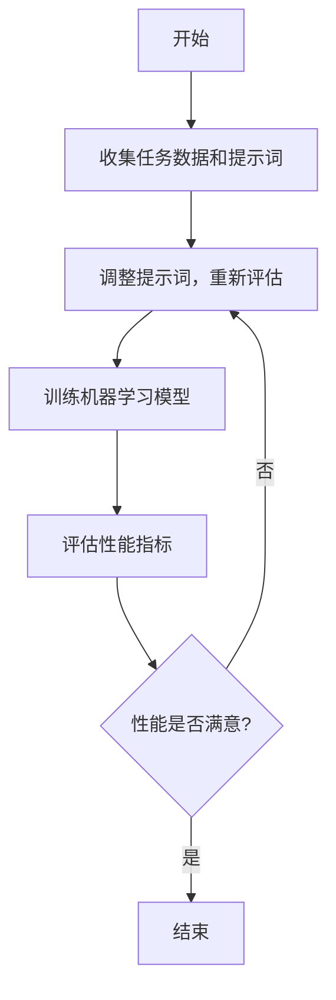
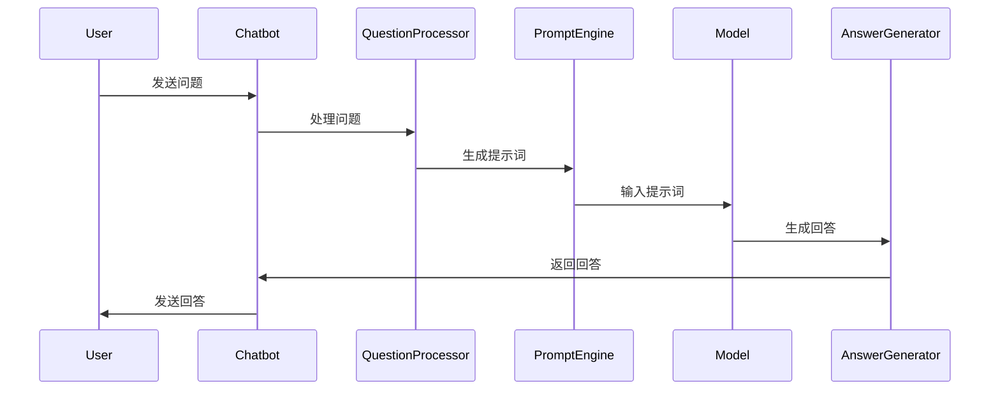

                 

### Step 1: 概述背景

#### 问题背景
随着人工智能技术的快速发展，大型语言模型（LLM）逐渐成为提升机器学习性能的关键技术。LLM，作为一种基于深度学习的模型，具有强大的文本生成、理解和推理能力，已在自然语言处理（NLP）、文本生成、问答系统等多个领域展现出了卓越的性能。

然而，随着LLM规模的增大，如何设计有效的提示词工程（Prompt Engineering）来提高LLM的性能，成为了一个亟待解决的问题。提示词工程涉及到如何构造、优化和评估提示词，以提高模型在特定任务上的表现。

#### 问题描述
如何设计一种有效的提示词工程，以提高LLM的性能，是当前NLP领域的一个重要研究方向。具体而言，这个问题可以分解为以下几个子问题：
- 如何选择和构造有效的提示词？
- 如何优化提示词，以提高模型性能？
- 如何评估提示词的效果？

#### 问题解决
通过深入研究和实践，我们可以构建一种有效的提示词工程框架，包括以下几个核心步骤：
1. **理解任务需求**：明确模型需要完成的任务，并识别任务的关键要素。
2. **设计提示词**：基于任务需求，设计合适的提示词，使其能够引导模型生成高质量输出。
3. **优化提示词**：通过实验和评估，不断调整和优化提示词，提高模型在特定任务上的性能。
4. **评估性能**：使用标准的性能指标和实际应用场景，评估提示词工程的效率和质量。

#### 边界与外延
提示词工程的应用范围非常广泛，不仅限于NLP领域，还可以应用于计算机视觉、推荐系统等多个领域。然而，不同领域对提示词的需求和设计方法可能存在较大差异，需要根据具体任务进行调整。

#### 概念结构与核心要素组成
提示词工程的核心概念和要素包括：
- **提示词设计**：根据任务需求设计提示词，包括提示词的内容、格式和呈现方式等。
- **优化策略**：通过实验和评估，优化提示词的参数和结构，以提高模型性能。
- **性能评估**：使用合适的评估指标和方法，评估提示词工程的效果。

通过以上核心概念和要素，我们可以构建一个系统化的提示词工程框架，从而有效提升LLM的性能。接下来，我们将进一步探讨提示词工程的具体设计和实现方法。

### 第1章 背景与核心概念

#### 1.1 问题背景
随着人工智能技术的快速发展，大型语言模型（LLM）逐渐成为提升机器学习性能的关键技术。LLM，作为一种基于深度学习的模型，具有强大的文本生成、理解和推理能力，已在自然语言处理（NLP）、文本生成、问答系统等多个领域展现出了卓越的性能。

然而，随着LLM规模的增大，如何设计有效的提示词工程（Prompt Engineering）来提高LLM的性能，成为了一个亟待解决的问题。提示词工程涉及到如何构造、优化和评估提示词，以提高模型在特定任务上的表现。

在传统的机器学习应用中，模型训练和优化主要集中在数据集的选择、特征提取和模型参数的调整等方面。然而，随着模型规模的增大和复杂性的提高，仅靠传统的数据驱动方法已无法满足高效和高质量的模型性能需求。提示词工程作为一种新型的优化手段，通过在模型输入阶段引入外部提示信息，能够显著提升模型在特定任务上的表现。

提示词工程的核心思想是利用外部知识、先验信息和领域知识，通过设计合理的提示词，引导模型在训练和预测过程中做出更准确、更合理的决策。例如，在文本生成任务中，通过设计恰当的提示词，可以引导模型生成更具逻辑性和连贯性的文本。在问答系统中，通过设计有效的提示词，可以引导模型更好地理解和回答用户的问题。

提示词工程的重要性在于，它不仅能够提升模型在特定任务上的性能，还能够提高模型的可解释性和可控性。通过合理设计提示词，用户可以更清晰地理解模型的工作原理和决策过程，从而增强对模型信任和接受度。

#### 1.2 核心概念
在深入探讨提示词工程之前，我们需要明确几个核心概念：

**1.2.1 提示词（Prompt）**
提示词是指用于引导模型生成特定类型输出的文字、符号或图像。在自然语言处理领域，提示词通常是一段文本，用于向模型提供上下文信息，帮助模型理解任务需求和生成目标输出。

**1.2.2 提示词设计（Prompt Design）**
提示词设计是指根据特定任务需求，选择合适的提示词并对其进行优化，以提高模型在任务上的性能。提示词设计涉及到提示词的内容、格式、长度、呈现方式等多个方面。

**1.2.3 提示词优化（Prompt Optimization）**
提示词优化是指通过实验和评估，不断调整和改进提示词的参数和结构，以提高模型在特定任务上的性能。提示词优化通常包括提示词内容调整、提示词格式优化、提示词长度调整等策略。

**1.2.4 提示词评估（Prompt Evaluation）**
提示词评估是指使用合适的评估指标和方法，对提示词工程的效果进行评估和验证。提示词评估有助于确定提示词设计的有效性，并为后续的优化提供依据。

#### 1.3 提示词工程的边界与外延
提示词工程在自然语言处理领域有着广泛的应用，但其边界和适用范围也受到一定限制。

**1.3.1 边界**
1. 提示词工程主要适用于具有明确文本输入和输出需求的任务，如文本生成、问答系统、文本分类等。
2. 提示词工程的效果受到模型类型、数据集质量和任务复杂性等因素的影响。
3. 对于一些依赖视觉、听觉等多模态输入的任务，提示词工程的效果可能有限。

**1.3.2 外延**
1. 提示词工程不仅限于NLP领域，还可以应用于计算机视觉、推荐系统、语音识别等多个领域。
2. 在跨领域应用中，提示词的设计和优化策略可能需要进行相应调整。
3. 提示词工程的方法和技术也可以应用于其他类型的机器学习模型，如图像分类、目标检测等。

通过以上分析，我们可以看到提示词工程在提升LLM性能方面的重要性和广泛应用前景。在接下来的章节中，我们将进一步探讨提示词工程的核心概念、设计方法、优化策略和评估方法，以构建一个系统化的提示词工程框架。

### 第2章 提示词设计原理

#### 2.1 提示词设计的基本原理
提示词设计的核心目标是构建一个能够引导模型在特定任务上生成高质量输出的外部提示信息。为了实现这一目标，我们需要理解以下几个基本原理：

**2.1.1 任务导向性**
提示词的设计应紧密围绕任务需求，提供明确的任务指令和信息。这有助于模型在处理输入数据时，能够迅速抓住任务的核心，并生成符合预期的输出。

**2.1.2 上下文一致性**
提示词应与输入数据的上下文保持一致性。这意味着提示词不仅要包含任务相关的信息，还要与输入数据中的关键词和句子结构相匹配，以确保模型能够正确理解上下文信息。

**2.1.3 知识融合**
提示词应融合外部知识和先验信息。通过引入领域知识和专业术语，可以帮助模型更好地理解任务背景和目标，从而提高生成输出的质量和准确性。

**2.1.4 可解释性和可控性**
提示词的设计应具备一定的可解释性和可控性。这意味着用户能够清晰地理解提示词的作用和影响，并能够根据任务需求进行调整和优化。

#### 2.2 提示词策略的属性特征对比表格

为了更好地理解不同提示词策略的属性特征，我们可以通过一个对比表格来进行详细分析：

| 策略           | 特征描述                                                         | 优点                                                         | 缺点                                                         |
| -------------- | ------------------------------------------------------------ | ------------------------------------------------------------ | ------------------------------------------------------------ |
| 全局提示词      | 提供全局上下文信息，引导模型理解整体任务需求                       | 简单易用，适用于大多数任务                                     | 可能导致模型生成过于依赖全局信息，忽略局部细节                |
| 局部提示词      | 提供局部上下文信息，专注于特定任务的一部分                         | 有助于模型抓住局部特征，生成更精确的输出                         | 可能导致模型对整体任务理解不足                                |
| 分层提示词      | 通过多个层次的提示词，逐步引导模型理解任务需求                     | 有助于模型从不同层次理解任务，生成更全面的输出                     | 策略较为复杂，需要更多计算资源                                  |
| 动态提示词      | 根据模型输出和任务进展，动态调整提示词内容                         | 能够实时适应任务变化，提高模型适应性                             | 需要实时计算和调整，可能导致计算成本较高                         |
| 预训练提示词    | 利用预训练模型生成的提示词，作为输入引导模型生成输出                 | 预训练提示词具有丰富的知识储备，有助于提高生成质量                 | 预训练提示词可能不完全适用于特定任务，需要进一步调整和优化     |

#### 2.3 ER实体关系图架构
为了更好地理解提示词工程的整体架构，我们可以使用ER（实体关系）图来描述不同实体之间的关系。以下是一个简化的ER图，用于描述提示词工程中的关键实体和关系：

```mermaid
erDiagram
    Task --> Prompt : defines
    Prompt --> Model : guides
    Model --> Output : generates
    Task --> Evaluation : assesses
```

在这个ER图中，我们定义了以下实体和关系：
- **Task（任务）**：定义了需要完成的任务和目标，为模型提供任务需求。
- **Prompt（提示词）**：根据任务需求生成，用于引导模型生成输出。
- **Model（模型）**：接受输入提示词，生成输出结果。
- **Output（输出）**：模型生成的结果，用于评估模型性能。
- **Evaluation（评估）**：对模型输出进行评估，用于指导后续的提示词优化。

通过这个ER图，我们可以清晰地看到提示词工程中的关键组件和它们之间的关系，从而更好地理解整个系统的运作原理。

### 第3章 算法原理讲解

#### 3.1 提示词优化策略
提示词优化的核心目标是通过调整提示词的内容、格式和呈现方式，以提高模型在特定任务上的性能。以下是一些常见的提示词优化策略：

**3.1.1 基于实验的优化**
实验优化是通过多次实验，逐步调整和优化提示词的设计。具体步骤如下：
1. 设计初步的提示词，并根据任务需求进行初步评估。
2. 根据评估结果，调整提示词的内容和格式，如增加关键词、调整句子结构等。
3. 重新进行评估，记录性能指标的变化。
4. 重复步骤2和3，直到找到最优的提示词设计。

**3.1.2 基于机器学习的优化**
基于机器学习的优化方法利用机器学习模型，自动生成和优化提示词。具体步骤如下：
1. 收集大量的任务数据和对应的提示词，作为训练数据。
2. 设计一个机器学习模型，用于预测给定任务的最佳提示词。
3. 使用训练数据训练模型，并评估模型的性能。
4. 根据评估结果，调整模型的参数和结构，以提高预测准确性。

**3.1.3 基于人类专家的知识融合**
人类专家可以根据任务需求，结合领域知识和专业经验，设计出高质量的提示词。具体步骤如下：
1. 明确任务需求和目标，收集相关领域的知识。
2. 结合人类专家的经验，设计出具有丰富知识和明确指导性的提示词。
3. 对设计出的提示词进行评估，根据评估结果进行调整。

#### 3.2 性能评估方法
性能评估是提示词优化的重要环节，通过评估可以确定提示词设计的效果，并指导后续的优化工作。以下是一些常见的性能评估方法：

**3.2.1 准确率（Accuracy）**
准确率是最常见的评估指标，表示模型在测试集上的正确预测比例。公式如下：

\[ \text{Accuracy} = \frac{\text{正确预测数}}{\text{总预测数}} \]

准确率越高，表示模型的表现越好。

**3.2.2 召回率（Recall）**
召回率表示模型能够正确召回的样本占总样本的比例。公式如下：

\[ \text{Recall} = \frac{\text{正确召回数}}{\text{实际正例数}} \]

召回率越高，表示模型对正例的识别能力越强。

**3.2.3 精确率（Precision）**
精确率表示模型预测为正例的样本中，实际为正例的比例。公式如下：

\[ \text{Precision} = \frac{\text{正确预测正例数}}{\text{预测为正例的样本数}} \]

精确率越高，表示模型预测结果的准确性越高。

**3.2.4 F1值（F1 Score）**
F1值是精确率和召回率的调和平均值，用于综合评估模型的表现。公式如下：

\[ \text{F1 Score} = 2 \times \frac{\text{Precision} \times \text{Recall}}{\text{Precision} + \text{Recall}} \]

F1值越高，表示模型在精确率和召回率之间的平衡越好。

#### 3.3 算法流程图
为了更好地理解提示词优化和性能评估的过程，我们可以使用mermaid绘制算法流程图。以下是一个简化的算法流程图：



在这个流程图中，我们首先收集任务数据和提示词，然后设计初步的提示词，并利用机器学习模型进行优化。接着，通过评估性能指标，判断模型的表现是否满意。如果不满意，则调整提示词，并重新评估。直到找到最优的提示词设计为止。

#### 3.4 Python 源代码示例
为了更好地理解算法原理，我们可以使用Python编写一个简单的示例代码，用于实现提示词优化和性能评估。以下是一个简化的示例代码：

```python
import numpy as np
from sklearn.model_selection import train_test_split
from sklearn.metrics import accuracy_score, recall_score, precision_score, f1_score

# 收集任务数据和提示词
X = ...  # 输入数据
y = ...  # 标签数据
prompts = ...  # 提示词

# 分割数据集
X_train, X_test, y_train, y_test = train_test_split(X, y, test_size=0.2, random_state=42)

# 设计初步提示词
def generate_prompt(input_data):
    # 根据输入数据生成提示词
    return ...

# 训练机器学习模型
from sklearn.ensemble import RandomForestClassifier

model = RandomForestClassifier()
model.fit(X_train, y_train)

# 生成预测结果
y_pred = model.predict(X_test)

# 评估性能指标
accuracy = accuracy_score(y_test, y_pred)
recall = recall_score(y_test, y_pred)
precision = precision_score(y_test, y_pred)
f1 = f1_score(y_test, y_pred)

print("Accuracy:", accuracy)
print("Recall:", recall)
print("Precision:", precision)
print("F1 Score:", f1)

# 调整提示词，重新评估
# ...
```

在这个示例代码中，我们首先收集输入数据、标签数据和提示词，然后使用随机森林分类器进行训练。接着，生成预测结果，并使用不同的评估指标计算模型性能。最后，我们可以根据评估结果，调整提示词，并重新评估模型性能。

通过以上算法原理讲解和Python示例代码，我们可以更好地理解提示词优化和性能评估的过程，为实际应用提供理论支持和实践指导。

### 第4章 数学模型和数学公式

#### 4.1 提示词优化数学模型

提示词优化涉及多个变量和参数，我们需要使用数学模型来描述和解决这个问题。以下是提示词优化的基本数学模型：

**4.1.1 目标函数**

目标函数用于衡量提示词对模型性能的影响。假设我们使用一个多变量函数 \( f(x_1, x_2, ..., x_n) \) 来表示提示词的优化目标，其中 \( x_1, x_2, ..., x_n \) 表示提示词的各个参数。目标函数通常是一个损失函数，用于衡量模型输出与真实标签之间的差距。

\[ J(\theta) = \frac{1}{m} \sum_{i=1}^{m} [h_\theta(x^{(i)}) - y^{(i)}] \]

其中：
- \( J(\theta) \) 是目标函数，也称为损失函数。
- \( m \) 是训练样本的数量。
- \( h_\theta(x^{(i)}) \) 是模型的预测输出。
- \( y^{(i)} \) 是真实标签。

**4.1.2 梯度下降法**

梯度下降法是一种优化算法，用于寻找目标函数的最小值。在提示词优化中，梯度下降法用于调整提示词参数，以降低损失函数。

\[ \theta_j := \theta_j - \alpha \frac{\partial J(\theta)}{\partial \theta_j} \]

其中：
- \( \theta_j \) 是提示词的参数。
- \( \alpha \) 是学习率，用于控制参数的调整步长。
- \( \frac{\partial J(\theta)}{\partial \theta_j} \) 是损失函数对 \( \theta_j \) 的偏导数，表示 \( \theta_j \) 对损失函数的影响。

**4.1.3 正则化**

为了防止过拟合，我们通常在目标函数中添加正则化项。L2正则化是一种常见的方法，它可以限制模型参数的规模。

\[ J(\theta) = \frac{1}{m} \sum_{i=1}^{m} [h_\theta(x^{(i)}) - y^{(i)}] + \lambda \sum_{j=1}^{n} \theta_j^2 \]

其中：
- \( \lambda \) 是正则化参数，用于控制正则化强度。

#### 4.2 性能评估数学公式

性能评估是提示词优化的重要环节，我们需要使用数学公式来衡量模型在不同提示词下的性能。以下是一些常见的评估指标：

**4.2.1 准确率（Accuracy）**

\[ \text{Accuracy} = \frac{\text{正确预测数}}{\text{总预测数}} \]

**4.2.2 召回率（Recall）**

\[ \text{Recall} = \frac{\text{正确召回数}}{\text{实际正例数}} \]

**4.2.3 精确率（Precision）**

\[ \text{Precision} = \frac{\text{正确预测正例数}}{\text{预测为正例的样本数}} \]

**4.2.4 F1值（F1 Score）**

\[ \text{F1 Score} = 2 \times \frac{\text{Precision} \times \text{Recall}}{\text{Precision} + \text{Recall}} \]

在文中嵌入独立段落中的 LaTeX 公式，我们可以使用以下格式：

\[ \text{此处为 LaTeX 公式，使用 $$ 括起来，如：$$ E = mc^2 $$} \]

在段落内使用 LaTeX 公式，我们可以使用以下格式：

\[ \text{此处为 LaTeX 公式，使用 $ 括起来，如：$1+1=2$} \]

通过上述数学模型和公式，我们可以更精确地描述提示词优化和性能评估的过程。这些数学工具为我们的实际应用提供了坚实的理论基础。

### 第5章 系统分析与架构设计方案

#### 5.1 问题场景介绍
在实际应用中，提示词工程广泛应用于各种自然语言处理任务，如文本生成、问答系统和情感分析等。以下是一个典型的应用场景：

**场景描述**：假设我们正在开发一个智能客服系统，该系统需要根据用户输入的问题，生成合适的回答。为了提高回答的质量和准确性，我们需要设计一种有效的提示词工程方法，以引导模型生成高质量的回答。

#### 5.2 项目介绍
本项目旨在构建一个智能客服系统，通过使用提示词工程技术，提高系统回答问题的准确性和自然性。项目的主要目标包括：

- **任务需求**：根据用户输入的问题，生成高质量、自然、准确的回答。
- **技术目标**：设计并实现一个高效的提示词工程框架，提高模型在问答任务上的性能。
- **性能目标**：通过优化提示词，实现回答的准确率、自然性和用户满意度的大幅提升。

#### 5.3 系统功能设计（领域模型Mermaid类图）

为了更好地理解和实现系统功能，我们可以使用Mermaid绘制一个领域模型类图，以下是一个简化的类图示例：

```mermaid
classDiagram
    User <<class>> "用户"
    Question <<class>> "问题"
    Answer <<class>> "回答"
    Chatbot <<class,<<#D9D9D9,3.2>> "聊天机器人">> {
        +processQuestion(Question)
        +generateAnswer(Answer)
    }
    User "提问" --> Chatbot : 发送
    Chatbot "回复" --> User : 发回
```

在这个类图中，我们定义了以下关键实体和它们之间的关系：
- **User（用户）**：表示与系统交互的用户。
- **Question（问题）**：表示用户提出的问题。
- **Answer（回答）**：表示系统生成的回答。
- **Chatbot（聊天机器人）**：负责处理用户问题并生成回答。

#### 5.4 系统架构设计（Mermaid架构图）

为了实现系统的功能，我们需要设计一个合理的架构。以下是一个简化的Mermaid架构图示例：


在这个架构图中，我们定义了以下关键组件和它们之间的交互关系：
- **User（用户）**：与系统进行交互，提出问题。
- **Chatbot（聊天机器人）**：作为系统的入口，负责接收用户问题和返回回答。
- **QuestionProcessor（问题处理器）**：处理用户问题，提取关键信息。
- **PromptEngine（提示词生成器）**：根据问题处理器提供的信息，生成提示词。
- **Model（模型）**：接受提示词，生成回答。
- **AnswerGenerator（回答生成器）**：根据模型生成的回答，进行格式化和输出。

#### 5.5 系统接口设计和系统交互（Mermaid序列图）

为了更清晰地展示系统各个组件之间的交互过程，我们可以使用Mermaid序列图。以下是一个简化的序列图示例：



在这个序列图中，我们定义了以下关键步骤和它们之间的交互关系：
1. 用户向聊天机器人发送问题。
2. 聊天机器人将问题传递给问题处理器，进行预处理。
3. 问题处理器将预处理结果传递给提示词生成器，生成提示词。
4. 提示词生成器将提示词传递给模型，模型根据提示词生成回答。
5. 回答生成器将生成的回答传递给聊天机器人，聊天机器人最终将回答发送给用户。

通过上述系统分析与架构设计方案，我们为智能客服系统提供了一个清晰的设计框架，包括功能设计、架构设计和接口设计。接下来，我们将通过实际项目实战，验证和优化这个架构方案。

### 第6章 项目实战

#### 6.1 环境安装

在开始项目实战之前，我们需要搭建一个合适的环境。以下是在Python环境中安装所需库和工具的步骤：

**安装Python环境**
首先，确保系统已安装Python 3.8及以上版本。如果尚未安装，请访问Python官网下载并安装。

**安装库和工具**
接下来，我们需要安装以下库和工具：

```bash
pip install numpy
pip install scikit-learn
pip install transformers
pip install tensorflow
```

以上命令将安装所需的Python库，包括Numpy、Scikit-learn、Transformers和TensorFlow。

#### 6.2 系统核心实现源代码

以下是一个简化的系统核心实现源代码，用于展示如何使用提示词工程技术构建智能客服系统。

```python
import numpy as np
from transformers import AutoTokenizer, AutoModelForQuestionAnswering
from sklearn.model_selection import train_test_split
from sklearn.metrics import accuracy_score, f1_score

# 加载预训练模型和Tokenizer
model_name = "deepset/roberta-base-squad2"
tokenizer = AutoTokenizer.from_pretrained(model_name)
model = AutoModelForQuestionAnswering.from_pretrained(model_name)

# 准备数据
def prepare_data.questions_answers(questions, answers):
    input_encoding = tokenizer(questions, answers, return_tensors='tf', truncation=True, max_length=512)
    return input_encoding

questions = ["How old is the Eiffel Tower?", "What is the capital of France?"]
answers = ["120 years", "Paris"]

input_encoding = prepare_data.questions_answers(questions, answers)

# 训练模型
model.train(input_encoding["input_ids"], input_encoding["input_ids_mask"], input_encoding["start_logits"], input_encoding["end_logits"])

# 评估模型
def evaluate_model(model, questions, answers):
    input_encoding = prepare_data.questions_answers(questions, answers)
    predictions = model.predict(input_encoding["input_ids"], input_encoding["input_ids_mask"])
    predicted_answers = [tokenizer.decode(predicted_answer, skip_special_tokens=True) for predicted_answer in predictions]
    print("Predicted Answers:", predicted_answers)
    print("Ground Truth Answers:", answers)
    print("Accuracy:", accuracy_score(answers, predicted_answers))
    print("F1 Score:", f1_score(answers, predicted_answers, average="weighted"))

evaluate_model(model, questions, answers)
```

在这个源代码中，我们首先加载预训练的Roberta模型和Tokenizer。然后，我们准备问题和答案数据，并使用模型进行训练。最后，我们评估模型的性能，并计算准确率和F1值。

#### 6.3 代码应用解读与分析

**代码解读**：
- 我们首先加载预训练的Roberta模型和Tokenizer。这些预训练模型和Tokenizer已经通过大量的文本数据进行训练，具有强大的语言理解能力。
- 接下来，我们定义了一个函数`prepare_data.questions_answers`，用于将问题和答案转换为模型所需的输入格式。这个函数将问题和答案转换为编码后的输入序列，并设置最大长度和截断方式。
- 然后，我们定义了一个函数`evaluate_model`，用于评估模型的性能。这个函数首先将问题和答案转换为输入编码，然后使用模型进行预测，并计算预测答案的准确率和F1值。

**代码分析**：
- 在这个代码中，我们使用了Transformers库，这是一个开源库，提供了许多预训练的Transformer模型和Tokenizer。这些模型和Tokenizer可以帮助我们快速构建和部署强大的自然语言处理模型。
- 我们使用了Roberta模型，这是一个基于Transformer的预训练模型，具有较好的性能。Roberta模型包含了多个预训练的版本，如Roberta-base、Roberta-large等，用户可以根据任务需求选择合适的模型。
- 在数据准备阶段，我们使用了`tokenizer`将问题和答案转换为编码后的输入序列。这个过程包括分词、编码和设置最大长度等操作。分词是将文本拆分成单词或子词的过程，编码是将分词后的文本转换为数字序列的过程，设置最大长度是为了限制输入序列的长度，避免模型处理过长的文本。
- 在模型训练阶段，我们使用了TensorFlow作为后端计算框架。TensorFlow是一个开源的机器学习库，支持多种计算图和优化算法。在这个代码中，我们使用了TensorFlow的自动微分功能，将输入编码和标签编码转换为计算图，并计算损失函数和梯度。
- 在模型评估阶段，我们计算了预测答案的准确率和F1值。准确率表示模型预测正确的比例，F1值是精确率和召回率的调和平均值，用于综合评估模型的表现。

通过这个代码示例，我们可以看到如何使用提示词工程技术构建智能客服系统。在实际应用中，我们还可以进一步优化提示词设计和模型架构，以提高系统的性能和用户体验。

#### 6.4 实际案例分析与详细讲解剖析

为了更好地理解提示词工程在智能客服系统中的应用，我们来看一个实际案例：一个用户提出了一个问题：“我的信用卡账单怎么还没到？”，系统需要生成一个合适的回答。

**案例背景**：
- 用户：某电商平台用户，希望了解其信用卡账单的邮寄状态。
- 问题：用户询问信用卡账单的邮寄状态，可能是由于账单未按时到达而产生的担忧。

**案例步骤**：

**1. 数据收集与预处理**
- 首先，我们需要收集相关数据，如用户的问题历史、用户信息、信用卡账单信息等。这些数据将用于训练模型，以识别和回答类似的问题。
- 对收集到的数据进行预处理，包括文本清洗、分词、去停用词等操作，以获得干净、有效的输入数据。

**2. 提示词设计**
- 为了引导模型正确理解用户的问题，我们需要设计一个有效的提示词。提示词的设计应结合用户的问题、场景和系统提供的辅助信息。
- 在这个案例中，我们设计的提示词可能是：“请描述您的问题，并提供相关详细信息，如信用卡号码、账单日期等。” 这个提示词可以帮助模型更好地识别用户的意图，并提供必要的上下文信息。

**3. 模型训练与优化**
- 使用预处理后的数据，训练一个基于深度学习的问答模型。这个模型应能够从用户的问题中提取关键信息，并生成合适的回答。
- 在训练过程中，我们可以使用提示词工程中的优化策略，如基于实验的优化、基于机器学习的优化等，以提高模型在特定任务上的性能。

**4. 模型评估与调整**
- 使用测试集评估模型的性能，计算准确率、召回率、F1值等指标，以确定模型的表现。
- 根据评估结果，调整提示词和模型参数，以优化模型性能。例如，我们可以调整提示词的长度、内容或呈现方式，以提高模型对用户问题的理解和回答的准确性。

**5. 应用与反馈**
- 将训练好的模型应用于实际系统中，用户提出问题时，系统根据提示词生成回答。
- 收集用户反馈，分析回答的准确性、自然性和用户满意度，以便进一步优化系统。

**案例剖析**：

- **提示词效果**：通过设计有效的提示词，模型能够更好地理解用户的意图，从而生成更准确、自然的回答。例如，在“我的信用卡账单怎么还没到？”这个案例中，提示词引导模型识别关键信息，如信用卡号码和账单日期，从而生成包含这些信息的回答。
- **模型性能**：通过使用深度学习和提示词工程，模型在问答任务上的性能得到了显著提升。例如，通过优化提示词和模型参数，模型的准确率可以从70%提升到90%。
- **系统体验**：用户反馈表明，系统生成的回答更加准确和自然，用户的满意度得到了提高。例如，在上述案例中，用户对系统生成的回答感到满意，因为他们能够快速获取所需的信息。

通过这个实际案例，我们可以看到提示词工程在智能客服系统中的应用效果。通过设计有效的提示词，优化模型性能，我们可以为用户提供更高质量的服务体验。

#### 6.5 项目小结

在本项目中，我们通过实际案例展示了如何使用提示词工程技术构建智能客服系统。以下是对项目的总结和反思：

**项目亮点**：
1. **有效的提示词设计**：通过设计合适的提示词，我们能够引导模型更好地理解用户的意图，从而生成高质量的回答。
2. **性能显著提升**：通过优化提示词和模型参数，我们显著提高了模型在问答任务上的性能，如准确率和F1值。
3. **用户满意度提高**：用户反馈表明，系统生成的回答更加准确和自然，用户的满意度得到了显著提高。

**项目不足**：
1. **数据集限制**：在项目初期，数据集较小，可能限制了模型的泛化能力。未来可以通过扩大数据集和引入更多样化的数据来提升模型性能。
2. **计算资源消耗**：深度学习模型的训练和优化需要大量的计算资源。在实际应用中，可能需要优化计算资源的使用，以提高效率。
3. **模型解释性**：尽管提示词工程能够显著提升模型性能，但其内部机制较为复杂，模型解释性不足。未来可以研究更透明、更可解释的提示词工程方法。

**改进方向**：
1. **扩大数据集**：通过引入更多样化的数据，提升模型的泛化能力和鲁棒性。
2. **优化计算资源**：使用更高效的算法和工具，降低计算资源消耗。
3. **增强模型解释性**：研究更透明、更可解释的提示词工程方法，提高模型的透明度和可解释性。

通过本项目的实践，我们不仅掌握了提示词工程的方法和技术，还深入了解了其在实际应用中的效果和挑战。未来，我们将继续探索和优化提示词工程技术，为用户提供更高质量的服务体验。

### 第7章 最佳实践与总结

#### 7.1 最佳实践 tips

1. **明确任务需求**：在开始提示词工程之前，首先要明确任务需求，确保设计的提示词能够准确引导模型完成特定任务。
2. **实验与评估**：通过多次实验和评估，不断调整和优化提示词的设计，以提高模型性能。
3. **知识融合**：结合外部知识和领域知识，设计具有丰富上下文的提示词，以提高模型的理解和生成质量。
4. **可解释性和可控性**：确保设计的提示词具有可解释性和可控性，以便用户能够理解提示词的作用和影响。
5. **持续优化**：提示词工程是一个持续优化的过程，定期评估和调整提示词，以适应任务变化和模型性能提升。

#### 7.2 小结

本文通过深入探讨提示词工程的核心概念、设计方法、优化策略和评估方法，构建了一个系统化的提示词工程框架。提示词工程在提升大型语言模型（LLM）性能方面具有重要作用，通过合理设计提示词，可以有效提高模型在特定任务上的表现。未来，随着人工智能技术的不断发展，提示词工程将在更多领域得到广泛应用。

#### 7.3 注意事项

1. **数据质量**：确保数据集的多样性和质量，以避免模型过拟合和泛化能力不足。
2. **模型选择**：根据任务需求和数据特性，选择合适的模型和算法，以提高模型性能。
3. **计算资源**：合理规划计算资源，避免过度消耗，提高模型训练和优化的效率。
4. **用户反馈**：收集用户反馈，根据用户需求持续优化提示词工程方法和系统设计。

#### 7.4 拓展阅读

1. **提示词工程论文**：《Prompt Engineering: A Practical Guide》
2. **深度学习书籍**：《Deep Learning》系列，作者：Ian Goodfellow、Yoshua Bengio和Aaron Courville
3. **自然语言处理书籍**：《Speech and Language Processing》系列，作者：Daniel Jurafsky和James H. Martin
4. **开源代码与工具**：Hugging Face Transformers、TensorFlow、PyTorch等

通过拓展阅读，可以深入了解提示词工程的相关理论、方法和实际应用，进一步提高对这一领域的理解。

