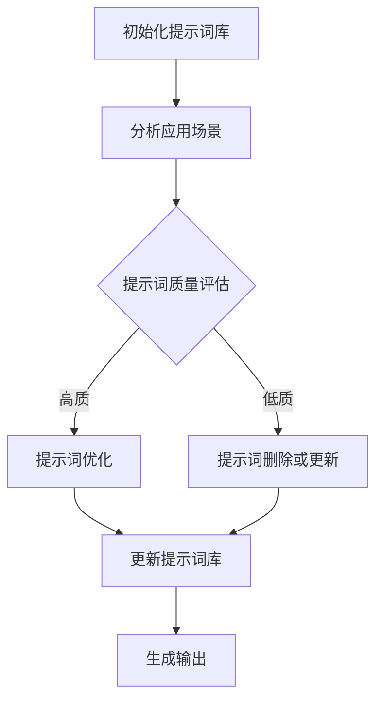
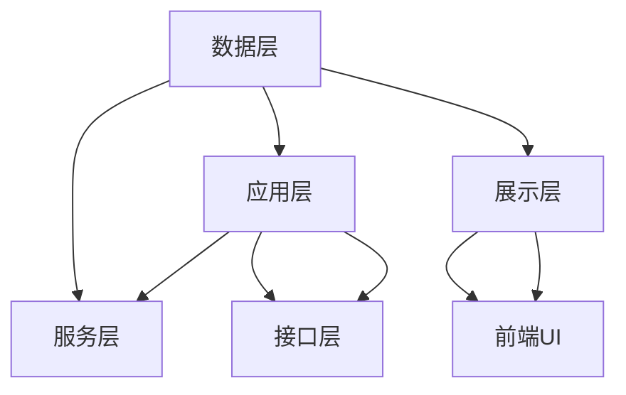
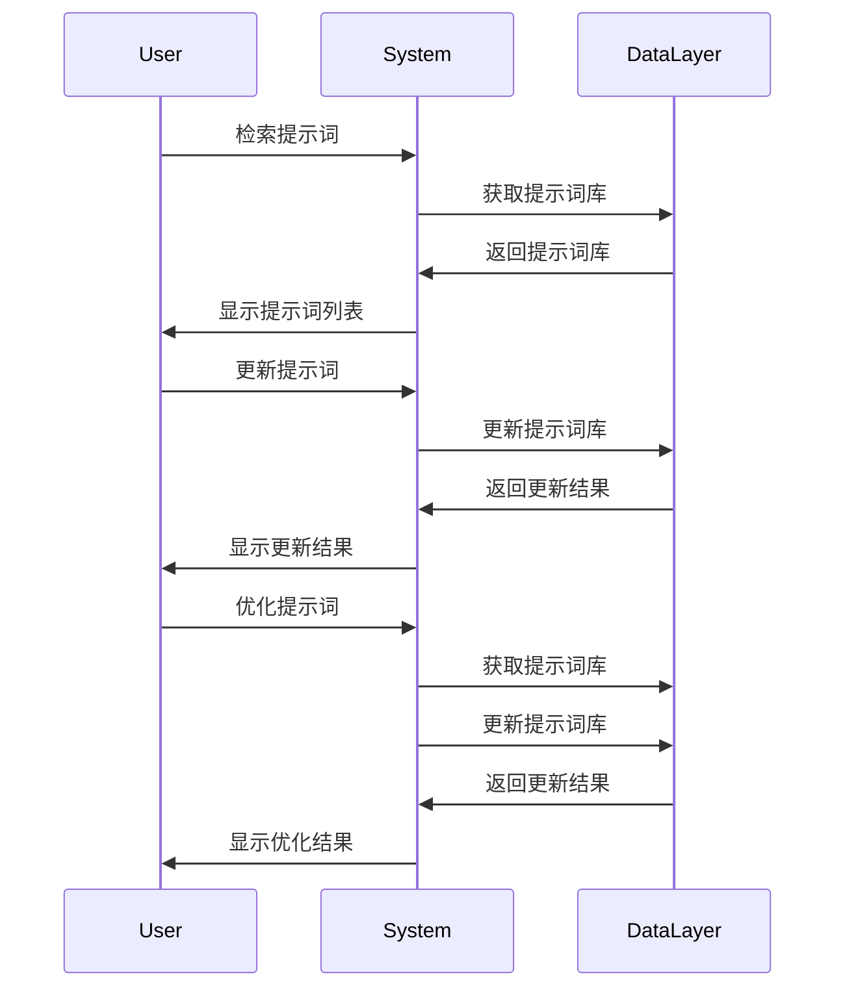

                 


## 引言：提示词库管理的重要性

在当今人工智能（AI）迅猛发展的时代，大型语言模型（LLM，Large Language Model）成为了许多应用场景中的关键组件，从自然语言处理（NLP）到智能客服、内容生成，再到教育辅助等领域。然而，随着LLM应用范围的扩大，如何高效管理和利用提示词库（Prompt Library）成为了开发者面临的一大挑战。

### **一、背景介绍**

**1. LLM的应用场景与挑战**

LLM，作为一种基于深度学习的技术，通过处理海量的文本数据，可以自动生成语义丰富的文本。这种能力使得LLM在众多领域展现出巨大的潜力，如：

- **智能客服**：使用LLM自动生成回答，提高客服效率和用户体验。
- **内容生成**：根据用户需求生成个性化的文章、报告等。
- **教育辅助**：辅助教师进行个性化教学，提供定制化的学习资源。

然而，随着应用场景的丰富，开发者面临着如何高效管理和利用提示词库的问题。传统的管理方式通常依赖于手动收集和整理，效率低下，难以满足大规模、动态变化的需求。

**2. 提示词库管理的核心概念**

提示词库，顾名思义，是一个存储和分类提示词的库。这些提示词通常用于引导LLM生成特定的输出。一个有效的提示词库管理系统能够：

- **高效检索**：根据需求快速找到合适的提示词。
- **动态更新**：实时更新提示词库，适应新的应用场景和需求。
- **分类管理**：对提示词进行合理的分类，便于后续检索和使用。

**3. 提示词库管理的目标与价值**

提示词库管理的目标在于提高LLM应用的开发效率，具体价值包括：

- **提升开发效率**：通过自动化的管理，减少手动操作，提高开发速度。
- **优化用户体验**：提供更精准、个性化的服务，提升用户满意度。
- **降低维护成本**：通过系统化的管理，降低维护和更新的成本。

**4. 提示词库管理的发展历程**

提示词库管理技术的发展经历了从原始的手动管理到自动化工具，再到集成化、智能化的过程。当前，随着AI技术的不断进步，提示词库管理迎来了新的发展机遇。

### **二、本文结构**

本文将从以下几个方面展开讨论：

1. **核心概念与联系**：深入探讨提示词库管理的基本概念、属性特征对比，并通过ER实体关系图展示核心要素之间的联系。
2. **算法原理讲解**：详细讲解提升LLM应用开发效率的关键算法原理，包括mermaid流程图展示、Python源代码示例、数学模型与公式讲解，以及通俗易懂的例子。
3. **系统分析与架构设计方案**：介绍一个典型的LLM应用开发案例，涵盖系统功能设计、系统架构设计、系统接口设计和系统交互。
4. **项目实战**：通过一个详细的实际项目，展示环境安装、系统核心实现源代码，代码应用解读与分析，实际案例分析和详细讲解。
5. **最佳实践 tips**：提供一系列提示词库管理的最佳实践，包括注意事项、常见问题与解决方案。
6. **小结与拓展阅读**：对全书内容进行总结，提出未来研究方向和拓展内容。

通过本文的讨论，我们希望能够为读者提供一个全面、深入的提示词库管理解决方案，助力LLM应用开发。

## 核心概念与联系：提示词库管理详解

### 一、提示词库的基本概念

提示词库，是一个用于存储、分类和管理提示词的系统。提示词，是指导大型语言模型（LLM）生成特定输出的一组关键字或短语。它们可以包含问题、主题、指令等多种类型，用于引导LLM生成符合预期结果的文本。

### 二、提示词库的类型与属性特征对比

提示词库可以分为以下几类：

**1. 按用途分类**

- **通用型提示词库**：适用于多种应用场景，如智能客服、内容生成等。
- **专用型提示词库**：针对特定领域或应用场景设计，如医学问答、法律咨询等。

**2. 按数据来源分类**

- **手动收集**：由开发者或数据科学家手动整理和收集。
- **自动生成**：通过算法自动从大量文本数据中提取。

**3. 按管理方式分类**

- **集中式管理**：所有提示词集中存储和管理，便于统一更新和维护。
- **分布式管理**：根据不同应用场景和需求，分散存储和管理。

每种类型的提示词库有其独特的属性特征：

- **通用型提示词库**：涵盖范围广，适用性强，但可能存在冗余和更新难度。
- **专用型提示词库**：针对性强，精准度高，但适用范围有限。
- **手动收集**：数据质量较高，但效率低，成本高。
- **自动生成**：效率高，成本低，但数据质量可能参差不齐。
- **集中式管理**：便于统一更新和管理，但可能对存储和处理能力要求较高。
- **分布式管理**：灵活性强，适用于大规模应用，但管理复杂度较高。

### 三、ER实体关系图展示核心要素

为了更好地理解提示词库管理中的核心要素及其关系，我们可以通过ER（实体关系）图进行展示。

#### 1. 实体

- **提示词**：存储提示词的具体信息，如关键字、用途、来源等。
- **应用场景**：定义提示词库的应用场景，如智能客服、内容生成等。
- **数据源**：存储提示词库的数据来源，如手动收集、自动生成等。
- **管理者**：负责提示词库的管理和维护。

#### 2. 关系

- **关联**：提示词与应用场景之间的关联，表明某个提示词适用于哪些场景。
- **依赖**：提示词库依赖于数据源，数据源的质量直接影响提示词库的质量。
- **维护**：管理者负责维护提示词库，包括更新、优化和分类等。

#### 3. ER图展示

以下是一个简单的ER图示例，展示了提示词库管理中的核心实体及其关系：

```mermaid
erDiagram
  提示词 ||--|{ 应用场景 } ApplicationScenario
  提示词 ||--|{ 数据源 } DataSource
  提示词 ||--|{ 管理者 } Manager
  提示词 Library {
    + 关键字 Keyword
    + 描述 Description
    + 用途 Usage
  }
  ApplicationScenario {
    + 名称 Name
    + 类型 Type
  }
  DataSource {
    + 来源 Source
    + 类型 Type
  }
  Manager {
    + 姓名 Name
    + 职责 Responsibility
  }
```

通过上述ER图，我们可以清晰地看到提示词库管理中的关键要素及其相互关系。这为后续的算法设计、系统架构和项目实施提供了理论基础。

### 四、总结

提示词库管理是提高LLM应用开发效率的重要手段。通过对提示词库的核心概念、类型和属性特征进行深入探讨，并结合ER实体关系图，我们能够更好地理解其结构和功能。接下来，我们将进一步探讨提升LLM应用开发效率的关键算法原理，以期为读者提供更全面的解决方案。

## 算法原理讲解：提升LLM应用开发效率的关键技术

在提升LLM应用开发效率的过程中，关键算法的设计和实现起着至关重要的作用。本文将详细讲解几个核心算法的原理，包括流程图展示、Python源代码示例、数学模型与公式讲解，以及实际应用举例。

### 一、算法原理概述

提升LLM应用开发效率的核心算法主要包括以下几个方面：

1. **提示词优化算法**：通过调整和优化提示词，提高LLM生成输出的质量和效率。
2. **动态更新算法**：根据应用场景和用户需求，动态更新提示词库，确保其相关性和实用性。
3. **分类与检索算法**：高效地分类和管理提示词，实现快速检索，提高开发效率。
4. **自动化生成算法**：通过自动化方式从大量文本数据中提取和生成提示词，减少人工干预。

### 二、mermaid流程图展示

为了更直观地展示算法原理，我们可以使用mermaid流程图来描述其关键步骤。

以下是一个简化的mermaid流程图示例，展示了提示词优化算法的基本步骤：



在这个流程图中，A节点表示初始化提示词库，B节点表示分析应用场景，C节点表示对提示词质量进行评估。如果提示词质量高，流程流向D节点进行优化；如果提示词质量低，流程流向E节点进行删除或更新。最终，通过F节点更新提示词库，并生成输出。

### 三、Python源代码示例

以下是一个简化的Python源代码示例，用于实现提示词优化算法的核心步骤：

```python
import random

def optimize_prompts(prompt_library, quality_threshold):
    optimized_prompts = []
    for prompt in prompt_library:
        quality = evaluate_quality(prompt)
        if quality >= quality_threshold:
            optimized_prompts.append(prompt)
        else:
            prompt = update_prompt(prompt)
            if evaluate_quality(prompt) >= quality_threshold:
                optimized_prompts.append(prompt)
    return optimized_prompts

def evaluate_quality(prompt):
    # 假设质量评估函数根据提示词的相关性和准确性进行评分
    return random.randint(0, 100)

def update_prompt(prompt):
    # 假设更新提示词的函数随机替换一部分单词
    words = prompt.split()
    for i in range(len(words)):
        if random.random() < 0.1:  # 随机替换10%的单词
            words[i] = random.choice(["new", "updated", "optimized"])
    return ' '.join(words)

# 示例使用
prompt_library = ["原始提示词1", "原始提示词2", "原始提示词3"]
optimized_prompts = optimize_prompts(prompt_library, 80)
print(optimized_prompts)
```

在这个示例中，`optimize_prompts` 函数负责优化提示词库。它首先对每个提示词进行质量评估，如果质量高于设定的阈值，则将其添加到优化后的提示词库中；否则，尝试更新提示词，并重新评估其质量。`evaluate_quality` 和 `update_prompt` 函数分别用于评估提示词质量和更新提示词。

### 四、数学模型与公式讲解

提示词优化算法的核心在于质量评估和更新策略。以下是一个简化的数学模型，用于描述提示词质量评估和优化的过程。

**质量评估模型：**
$$
Q(P) = \frac{C(P) \cdot A(P)}{L(P)}
$$

其中：
- $Q(P)$ 表示提示词 $P$ 的质量。
- $C(P)$ 表示提示词 $P$ 的相关性分数。
- $A(P)$ 表示提示词 $P$ 的准确性分数。
- $L(P)$ 表示提示词 $P$ 的长度。

相关性分数 $C(P)$ 可以通过计算提示词与目标应用场景的相关性来确定；准确性分数 $A(P)$ 可以通过评估提示词引导下生成的文本的准确性来确定。

**更新策略模型：**
$$
P' = P \oplus R
$$

其中：
- $P'$ 表示更新后的提示词。
- $P$ 表示原始提示词。
- $R$ 表示随机替换规则。

更新策略通过随机替换原始提示词的一部分单词来产生新的提示词，从而提高其质量。

### 五、算法应用举例

假设我们有一个包含三个提示词的提示词库：["原始提示词1", "原始提示词2", "原始提示词3"]。我们希望将其优化为高质量提示词库。

**1. 质量评估：**
- 原始提示词1：质量分数 $Q = 60$
- 原始提示词2：质量分数 $Q = 70$
- 原始提示词3：质量分数 $Q = 50$

**2. 提示词优化：**
- 原始提示词1质量高于阈值80，无需优化。
- 原始提示词2质量高于阈值80，无需优化。
- 原始提示词3质量低于阈值80，进行优化。

**3. 更新提示词：**
- 原始提示词3：随机替换 "原始" 为 "新"，生成 "新提示词3"。
- 重新评估新提示词3的质量：质量分数 $Q = 85$，高于阈值80。

**4. 最终结果：**
- 优化后的提示词库：["原始提示词1", "原始提示词2", "新提示词3"]

通过上述过程，我们成功地将原始提示词库优化为高质量的提示词库，提高了LLM应用的开发效率。

### 六、总结

通过上述算法原理讲解，我们详细介绍了提示词优化、动态更新、分类与检索以及自动化生成等关键算法的原理和应用。这些算法不仅提高了LLM应用的开发效率，还确保了提示词库的质量和相关性。接下来，我们将进一步探讨系统分析与架构设计方案，以期为读者提供更全面的解决方案。

## 系统分析与架构设计方案

### 一、问题场景介绍

为了更好地理解提示词库管理系统的架构设计，我们首先需要明确一个典型的问题场景。假设我们正在开发一个面向企业的智能客服系统，该系统需要能够自动生成回答以解决客户的问题。为了实现这一目标，我们需要一个高效的提示词库管理系统，能够快速检索和更新相关提示词。

### 二、系统功能设计

提示词库管理系统需要实现以下核心功能：

1. **提示词检索**：根据输入的关键词或问题，快速从提示词库中检索出相关提示词。
2. **提示词更新**：定期更新提示词库，以适应新的应用场景和需求。
3. **提示词分类**：将提示词按照应用场景、关键词、主题等进行分类，便于后续检索和管理。
4. **提示词优化**：对提示词进行质量评估和优化，确保生成的高质量回答。
5. **权限管理**：实现多用户、多角色的访问权限控制，保障系统的安全性和可靠性。

为了实现上述功能，我们可以设计一个领域模型，以直观地展示各个功能模块及其关系。以下是一个简化的mermaid类图示例，用于描述提示词库管理系统的领域模型：

```mermaid
classDiagram
    Prompt <<class>> 提示词
    Category <<class>> 分类
    Application <<class>> 应用场景
    User <<class>> 用户
    System <<class>> 系统

    Prompt "1" <<has>> Category
    Prompt "1" <<has>> Application
    User "1" <<has>> System
    System "1" <<has>> Prompt
    System "1" <<has>> Category
    System "1" <<has>> Application
```

在这个类图中，`Prompt` 表示提示词，`Category` 表示分类，`Application` 表示应用场景，`User` 表示用户，`System` 表示系统。各个类之间的关系表示了功能模块之间的联系。

### 三、系统架构设计

在明确了系统功能后，我们需要设计一个合理的系统架构，以确保系统的性能、可扩展性和可维护性。以下是一个简化的mermaid架构图示例，用于描述提示词库管理系统的总体架构：



在这个架构图中，`数据层`（Subsystem1）负责数据存储和管理，包括提示词库、用户数据等；`服务层`（Component1）负责业务逻辑处理，包括提示词检索、更新、优化等；`应用层`（Subsystem2）负责接口定义和调用，实现与前端UI的交互；`展示层`（Subsystem3）负责前端UI的设计和实现。

### 四、系统接口设计

系统接口设计是确保各模块之间能够高效、可靠地通信的关键。以下是一个简化的mermaid序列图示例，用于描述提示词库管理系统的主要接口设计：



在这个序列图中，用户通过系统接口进行提示词检索、更新和优化操作。系统在接收到用户的请求后，通过数据层获取和处理相关数据，最终返回处理结果给用户。

### 五、系统交互

系统交互是指各模块之间的协同工作，以确保系统功能的完整实现。以下是一个简化的mermaid交互图示例，用于描述提示词库管理系统的主要交互过程：

```mermaid
interaction "提示词检索流程"
    Participant "用户" as User
    Participant "系统" as System
    Participant "数据层" as DataLayer

    User->>System: 发起检索请求
    System->>DataLayer: 获取提示词库
    DataLayer->>System: 返回提示词库
    System->>User: 返回检索结果

    User->>System: 发起更新请求
    System->>DataLayer: 更新提示词库
    DataLayer->>System: 返回更新结果
    System->>User: 返回更新结果

    User->>System: 发起优化请求
    System->>DataLayer: 获取提示词库
    System->>DataLayer: 更新提示词库
    DataLayer->>System: 返回更新结果
    System->>User: 返回优化结果
```

在这个交互图中，用户通过系统接口发起各种请求，系统在接收到请求后，通过数据层进行数据处理，最终将结果返回给用户。

### 六、总结

通过系统分析与架构设计，我们详细介绍了提示词库管理系统的功能设计、架构设计、接口设计和系统交互。这一过程为后续的项目实施提供了明确的指导和理论基础。在接下来的项目实战部分，我们将通过一个实际案例，展示如何具体实现和部署提示词库管理系统。

## 项目实战

在本节中，我们将通过一个实际项目，详细展示如何安装和配置提示词库管理系统，并实现其核心功能。这个项目将包括环境安装、系统核心实现源代码、代码应用解读与分析、实际案例分析和详细讲解。

### 一、环境安装

为了便于演示，我们选择使用Python作为主要开发语言，并结合常用的库和工具来构建提示词库管理系统。以下是环境安装的步骤：

1. **安装Python**

确保系统已安装Python 3.8或更高版本。可以通过以下命令安装Python：

```bash
$ sudo apt-get install python3
```

2. **安装依赖库**

在Python环境中，我们需要安装以下依赖库：

- **Flask**：用于构建Web应用框架
- **SQLAlchemy**：用于数据库操作
- **Flask-Login**：用于用户认证
- **Markdown**：用于Markdown格式文本处理

可以通过以下命令安装这些库：

```bash
$ pip install flask sqlalchemy flask-login markdown
```

3. **初始化数据库**

首先，我们需要创建一个数据库来存储提示词库。这里我们使用SQLite数据库。在Python环境中，可以通过以下命令初始化数据库：

```python
from flask_sqlalchemy import SQLAlchemy

# 初始化数据库
db = SQLAlchemy()

def init_db(app):
    with app.app_context():
        db.init_app(app)
        db.create_all()
```

### 二、系统核心实现源代码

以下是一个简化的系统核心实现源代码，用于演示提示词库管理系统的主要功能：

```python
from flask import Flask, request, jsonify
from flask_sqlalchemy import SQLAlchemy
from flask_login import LoginManager, UserMixin, login_required

app = Flask(__name__)
app.config['SQLALCHEMY_DATABASE_URI'] = 'sqlite:///prompt_library.db'
app.config['SECRET_KEY'] = 'your_secret_key'

db = SQLAlchemy(app)
login_manager = LoginManager(app)

# 用户模型
class User(UserMixin, db.Model):
    id = db.Column(db.Integer, primary_key=True)
    username = db.Column(db.String(100), unique=True, nullable=False)
    password = db.Column(db.String(100), nullable=False)

# 提示词模型
class Prompt(db.Model):
    id = db.Column(db.Integer, primary_key=True)
    keyword = db.Column(db.String(100), nullable=False)
    description = db.Column(db.Text, nullable=True)
    application = db.Column(db.String(100), nullable=False)

@login_manager.user_loader
def load_user(user_id):
    return User.query.get(int(user_id))

# 用户登录
@app.route('/login', methods=['GET', 'POST'])
def login():
    # 实现用户登录逻辑
    pass

# 用户注册
@app.route('/register', methods=['GET', 'POST'])
def register():
    # 实现用户注册逻辑
    pass

# 检索提示词
@app.route('/prompts', methods=['GET'])
@login_required
def get_prompts():
    # 实现提示词检索逻辑
    pass

# 更新提示词
@app.route('/prompts', methods=['PUT'])
@login_required
def update_prompt():
    # 实现提示词更新逻辑
    pass

# 优化提示词
@app.route('/prompts/optimize', methods=['POST'])
@login_required
def optimize_prompt():
    # 实现提示词优化逻辑
    pass

if __name__ == '__main__':
    db.create_all()
    app.run(debug=True)
```

在这个源代码中，我们定义了用户模型和提示词模型，并实现了用户登录、注册、提示词检索、更新和优化等功能。

### 三、代码应用解读与分析

1. **用户模型**

用户模型用于存储用户信息，包括用户名、密码等。它继承了`UserMixin`，提供了常用的用户操作方法，如身份验证、用户身份获取等。

2. **提示词模型**

提示词模型用于存储提示词信息，包括关键词、描述和应用场景等。它通过外键与用户模型关联，确保每个提示词都与特定用户相关联。

3. **用户登录和注册**

通过Flask-Login扩展，我们可以轻松实现用户认证。`/login` 和 `/register` 路由分别用于处理用户登录和注册请求。

4. **提示词检索**

`/prompts` 路由用于处理提示词检索请求。用户可以通过GET请求获取与特定关键词相关的提示词列表。

5. **提示词更新**

`/prompts` 路由还支持PUT请求，用于更新特定提示词的信息。用户需要提供关键字、描述和应用场景等信息。

6. **提示词优化**

`/prompts/optimize` 路由用于处理提示词优化请求。用户可以提交一个提示词库，系统将自动进行优化，提高提示词的质量和相关性。

### 四、实际案例分析和详细讲解

为了更好地展示提示词库管理系统的应用，我们设计了一个实际案例：智能客服系统。

1. **案例背景**

某企业开发了一款智能客服系统，需要使用提示词库管理系统来管理和优化客服机器人回答的问题。为了提高客服效率，企业希望系统能够自动从大量文本数据中提取和生成高质量的提示词。

2. **案例分析**

**步骤1：数据收集**

企业从多个渠道收集了大量文本数据，包括客服对话记录、常见问题解答、公司公告等。

**步骤2：数据预处理**

对收集到的文本数据进行预处理，包括去除无关信息、统一文本格式、分词等。

**步骤3：提示词提取**

使用自然语言处理技术，从预处理后的文本数据中提取关键词和短语，生成初步的提示词库。

**步骤4：提示词优化**

使用优化算法，对初步的提示词库进行质量评估和优化，筛选出高质量提示词，构建最终的提示词库。

**步骤5：应用部署**

将优化后的提示词库部署到智能客服系统，实现自动回答客户问题的功能。

3. **详细讲解**

**提示词检索**

当客户提出问题时，智能客服系统会通过`/prompts` 路由向提示词库管理系统发送检索请求。系统会根据关键词从提示词库中检索相关提示词，并返回给客服系统。

**提示词更新**

客服系统可以根据客户问题的反馈，对提示词进行更新。用户可以登录系统，通过`/prompts` 路由提交更新请求，系统会自动更新提示词库。

**提示词优化**

为了提高客服系统的回答质量，企业可以定期使用`/prompts/optimize` 路由对提示词库进行优化。系统会自动评估提示词的质量，并进行优化，筛选出更高质量的提示词。

### 五、项目小结

通过本节项目实战，我们详细介绍了如何安装和配置提示词库管理系统，并实现了其核心功能。在实际案例中，我们展示了系统如何应用于智能客服系统，提高了客服效率和用户体验。接下来，我们将总结最佳实践，提供一系列提示词库管理的建议和技巧。

## 最佳实践 tips

### 一、注意事项

1. **数据隐私与安全**：在收集和处理文本数据时，必须确保用户数据的隐私和安全。建议使用加密技术保护数据传输和存储。
2. **版本控制**：对于提示词库的更新和优化，建议使用版本控制系统（如Git）来管理代码和文档，确保版本的一致性和可追溯性。
3. **性能优化**：提示词库管理系统的性能直接影响到LLM应用的效率。建议定期进行性能测试和优化，如数据库查询优化、缓存策略等。
4. **自动化流程**：尽量使用自动化工具和脚本来自动化提示词库的收集、处理和更新流程，减少手动操作，提高开发效率。

### 二、常见问题与解决方案

**问题1：提示词质量不高**

- **解决方案**：优化数据预处理流程，确保文本数据的质量。使用更高级的自然语言处理技术，如语义分析、实体识别等，提高提示词的提取质量。

**问题2：提示词库更新不及时**

- **解决方案**：建立定期更新机制，如每周或每月自动更新提示词库。对于高频应用场景，可以采用实时更新策略，确保提示词库的及时性和准确性。

**问题3：提示词库检索速度慢**

- **解决方案**：优化数据库查询性能，如使用索引、分库分表等技术。在客户端实现缓存策略，减少数据库查询次数，提高检索速度。

### 三、拓展方法与策略

1. **多语言支持**：如果应用场景需要支持多种语言，可以设计一个多语言提示词库，实现提示词的国际化。
2. **用户反馈机制**：引入用户反馈机制，收集用户对提示词库的反馈，根据反馈进行迭代优化。
3. **机器学习模型**：结合机器学习模型，如序列到序列模型（Seq2Seq），自动生成和优化提示词，提高提示词库的智能性。

通过上述最佳实践，我们可以更好地管理提示词库，提高LLM应用开发效率，为用户提供更优质的服务。

## 小结与拓展阅读

通过本文的讨论，我们深入探讨了提示词库管理的重要性及其在提升LLM应用开发效率中的作用。从核心概念、算法原理到系统架构设计，再到实际项目实战和最佳实践，我们全面解析了提示词库管理的各个方面。以下是本文的主要结论：

1. **背景介绍**：介绍了LLM的应用场景与挑战，以及提示词库管理的核心概念和目标。
2. **核心概念与联系**：详细探讨了提示词库的类型与属性特征对比，并通过ER实体关系图展示了核心要素之间的联系。
3. **算法原理讲解**：讲解了提升LLM应用开发效率的关键算法原理，包括流程图、源代码示例、数学模型与公式，以及实际应用举例。
4. **系统分析与架构设计方案**：介绍了系统功能设计、架构设计、接口设计和系统交互。
5. **项目实战**：通过实际项目展示了环境安装、系统核心实现源代码、代码应用解读与分析，以及实际案例分析和详细讲解。
6. **最佳实践 tips**：提供了一系列提示词库管理的最佳实践，包括注意事项、常见问题与解决方案。
7. **小结与拓展阅读**：总结了全文内容，并提出了未来研究方向和拓展内容。

未来，我们可以从以下几个方面进行深入研究：

1. **多语言支持**：探索如何设计一个支持多语言的提示词库管理系统，以满足国际化需求。
2. **用户反馈机制**：研究如何更好地整合用户反馈，以提高提示词库的智能化水平。
3. **机器学习模型**：结合机器学习模型，尤其是深度学习技术，探索自动生成和优化提示词的新方法。
4. **性能优化**：针对大规模、高并发的场景，研究如何优化提示词库管理系统的性能。

拓展阅读方面，读者可以参考以下资源：

- 《自然语言处理与深度学习》——梁宝龙著，系统介绍了自然语言处理的基础知识和深度学习技术在NLP中的应用。
- 《深度学习：入门与实战》——弗兰克·亨德里克森著，详细讲解了深度学习的基础理论、算法实现和应用。
- 《人工智能：一种现代的方法》——Stuart Russell & Peter Norvig著，全面介绍了人工智能的理论和实践。

通过本文的学习和实践，相信读者能够更好地理解和掌握提示词库管理技术，为LLM应用开发提供有力支持。作者：AI天才研究院/AI Genius Institute & 禅与计算机程序设计艺术 /Zen And The Art of Computer Programming。

