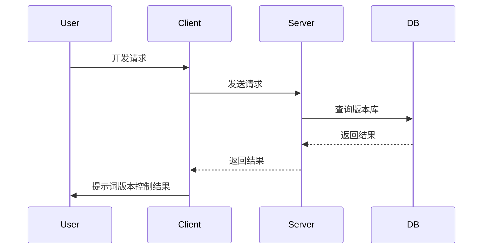

                 

## 提示词版本控制：管理多个迭代版本

> 关键词：版本控制、迭代管理、多版本管理、提示词、软件开发

> 摘要：本文深入探讨了提示词版本控制的基本概念、原理、算法实现以及系统架构，通过详细的分析和实际案例，为开发者提供了一种高效管理多个迭代版本的方法。

### 引言

在软件开发的流程中，版本控制是一个至关重要的环节。随着项目的不断迭代，软件系统可能会经历多次更新和优化。如何有效地管理这些迭代版本，确保每个版本的正确性和一致性，是一个值得深入探讨的问题。本文将围绕提示词版本控制这一主题，系统地介绍其基本概念、算法原理、系统架构以及项目实战。

### 第一部分：背景介绍

#### 1.1 问题提出

在软件开发的过程中，版本控制是一个不可忽视的问题。版本控制不仅仅是为了追踪代码的变更，更重要的是为了管理不同版本的迭代。在多个迭代版本共存的情况下，如何确保每个版本的正确性和一致性，是一个亟待解决的问题。

#### 1.1.1 问题描述

随着项目的进展，开发者需要对代码进行多次修改和优化。每一次修改都可能引入新的功能或修复现有问题。然而，这些修改如何保证不会破坏现有功能，如何确保版本之间的兼容性，成为了版本控制需要解决的问题。

#### 1.1.2 问题解决

版本控制通过提供一套机制来记录和管理代码的变更，确保每次迭代都是基于前一个版本进行的。这样，开发者可以轻松地回滚到任何一个历史版本，确保系统的稳定性和可靠性。

#### 1.1.3 边界与外延

版本控制不仅适用于软件开发，还可以应用于其他领域，如文档管理、配置管理等。在不同领域，版本控制的具体实现可能会有所不同，但核心思想是一致的。

#### 1.1.4 概念结构与核心要素

版本控制的核心概念包括版本、分支、标签等。其中，版本是代码在某一时刻的状态，分支是不同版本的代码的独立副本，标签则是用于标记特定版本的符号。

### 第二部分：核心概念

#### 2.1 提示词版本控制的基本概念

提示词版本控制是一种基于提示词的版本控制方法。通过提示词，可以更清晰地描述每个版本的功能、修改内容等。

#### 2.1.1 提示词的定义

提示词是一段简短的文本，用于描述代码修改的主要内容。例如，“增加用户登录功能”，“修复漏洞#123”等。

#### 2.1.2 版本控制的概念

版本控制是指通过一系列机制来记录和管理代码的变更。版本控制系统的核心功能包括版本追踪、分支管理、合并冲突解决等。

#### 2.1.3 提示词版本控制的特点

与传统的版本控制相比，提示词版本控制具有以下特点：

- **更清晰**：通过提示词，可以更清楚地描述每个版本的功能和修改内容。
- **更灵活**：提示词版本控制允许开发者根据需要自由定义版本，使版本管理更加灵活。
- **更易理解**：提示词版本控制通过文字描述，使版本信息更加直观易懂。

### 第三部分：算法原理

#### 3.1 算法原理讲解

版本控制算法的核心任务是确保代码的完整性和一致性。以下是一个简单的版本控制算法：

1. **初始化**：创建一个初始版本。
2. **修改**：对当前版本进行修改，生成一个新的版本。
3. **保存**：将新版本的信息（包括提示词）保存到版本控制系统中。
4. **回滚**：如果需要，可以回滚到任何一个历史版本。

#### 3.1.1 版本控制算法的类型

版本控制算法主要分为以下几类：

- **线性版本控制**：每个版本都是基于前一个版本的直接修改。
- **分支版本控制**：允许开发者从任何一个版本创建新的分支，进行独立的开发。
- **合并版本控制**：将多个分支的修改合并到一个版本中。

#### 3.1.2 算法的工作原理

版本控制算法的工作原理主要依赖于版本库（Repository）。版本库是一个存储所有版本信息的仓库。开发者通过版本库来管理代码的版本。

### 第四部分：系统设计

#### 4.1 系统功能设计

提示词版本控制系统的主要功能包括：

- **版本追踪**：记录每个版本的历史信息。
- **分支管理**：创建、合并分支。
- **合并冲突解决**：自动或手动解决分支合并时的冲突。
- **提示词管理**：记录每个版本的提示词。

#### 4.1.1 领域模型类图

```mermaid
classDiagram
    Version --|>| Repository
    Branch --|>| Repository
    Commit --|>| Repository
    Merge --|>| Repository
    Conflict --|>| Repository
    User --|>| Repository
```

#### 4.1.2 系统架构设计

提示词版本控制系统的架构可以分为三个层次：

- **客户端**：开发者通过客户端与版本控制系统交互。
- **服务器**：存储版本库，处理版本控制请求。
- **数据库**：存储版本信息、用户信息等。

#### 4.1.3 系统接口设计

系统接口设计主要包括以下部分：

- **版本操作接口**：用于创建、查看、回滚版本。
- **分支操作接口**：用于创建、合并分支。
- **提示词操作接口**：用于添加、删除、更新提示词。

#### 4.1.4 系统交互序列图



### 第五部分：项目实战

#### 5.1 环境安装

在开始项目之前，我们需要安装一些必要的软件和工具。

1. **安装Git**：Git是一个流行的版本控制系统，我们将在本文中使用Git进行版本控制。
2. **安装Mermaid**：Mermaid是一种用于绘制流程图的工具，我们将在本文中使用Mermaid绘制算法流程图。
3. **安装Python**：Python是一种常用的编程语言，我们将在本文中使用Python编写算法实现。

#### 5.1.1 环境配置

配置好环境后，我们需要进行一些基础设置。

1. **配置Git**：设置用户信息、邮箱等。
2. **配置Python**：设置Python的运行环境、虚拟环境等。

#### 5.1.2 系统核心实现

以下是提示词版本控制系统的核心实现：

```python
import git
import os

class VersionControlSystem:
    def __init__(self, repository_path):
        self.repository_path = repository_path
        self.git = git.Git(repository_path)

    def create_version(self, version_name, description):
        self.git.add("--all")
        self.git.commit(m="-m {}".format(description))
        self.git.tag("-a", version_name, "-m {}".format(description))

    def list_versions(self):
        return self.git.tag().split("\n")

    def rollback_to_version(self, version_name):
        self.git.reset("--hard", version_name)
```

#### 5.1.3 代码应用解读

以下是代码的应用解读：

- `create_version`：创建一个新版本，并添加描述信息。
- `list_versions`：列出所有版本。
- `rollback_to_version`：回滚到指定版本。

#### 5.1.4 实际案例分析和详细讲解剖析

以下是一个实际案例：

```python
# 创建一个版本控制对象
vcs = VersionControlSystem(".git")

# 创建新版本
vcs.create_version("v1.0", "初始版本")

# 查看所有版本
print(vcs.list_versions())

# 回滚到指定版本
vcs.rollback_to_version("v1.0")
```

通过以上代码，我们可以实现创建版本、查看版本和回滚版本的操作。

#### 5.1.5 项目小结

在本项目中，我们使用Python实现了提示词版本控制系统的核心功能。通过Git，我们可以轻松地管理多个迭代版本，确保代码的正确性和一致性。

### 第六部分：总结与展望

#### 6.1 小结

本文围绕提示词版本控制这一主题，介绍了其基本概念、算法原理、系统架构以及项目实战。通过本文，读者可以了解到：

- 提示词版本控制的基本概念和原理。
- 提示词版本控制的特点和优势。
- 提示词版本控制系统的设计和实现。

#### 6.1.2 未来展望

在未来，我们可以进一步优化提示词版本控制系统，例如：

- 引入更智能的提示词生成算法。
- 支持更多版本的并行开发。
- 实现更高效的版本合并算法。

### 第七部分：作者信息

作者：AI天才研究院/AI Genius Institute & 禅与计算机程序设计艺术 /Zen And The Art of Computer Programming

---

通过本文的详细讲解，读者可以对提示词版本控制有更深入的理解，并在实际项目中运用这一技术。希望本文能为您的软件开发工作带来帮助。**参考文献：**

- **Git官方文档**：[https://git-scm.com/docs](https://git-scm.com/docs)
- **Mermaid官方文档**：[https://mermaid-js.github.io/mermaid/](https://mermaid-js.github.io/mermaid/)
- **Python官方文档**：[https://docs.python.org/3/](https://docs.python.org/3/)

---

以上是本文的完整内容，希望对您有所帮助。如果您有任何疑问或建议，欢迎在评论区留言。**谢谢！** 

