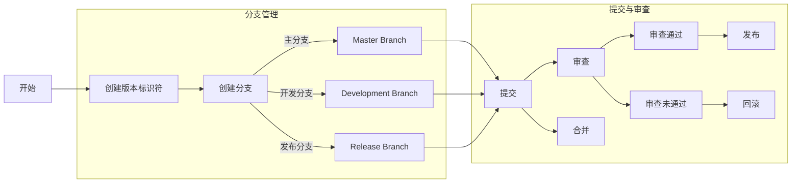
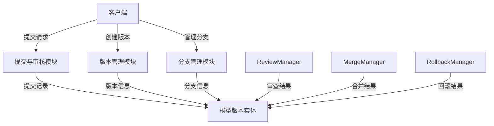
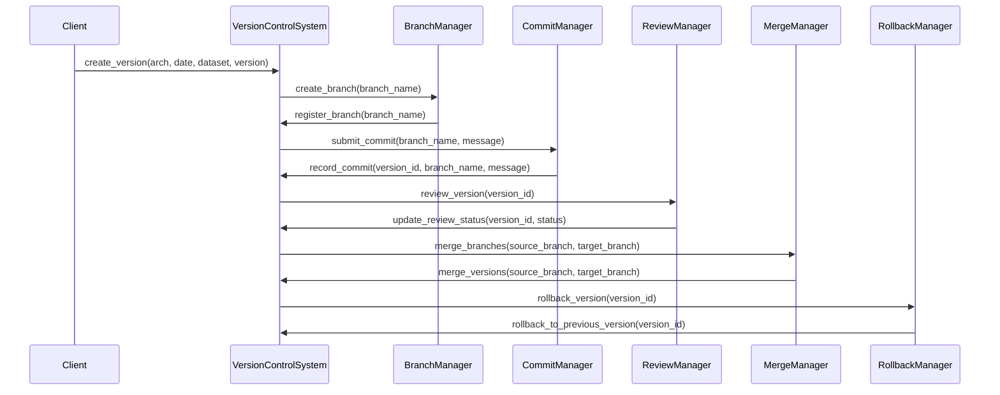

                 

# 提示词版本管理：确保LLM应用一致性的关键

> 关键词：版本管理、LLM应用、一致性、核心概念、流程、工具、最佳实践
> 
> 摘要：本文将深入探讨提示词版本管理在确保大型语言模型（LLM）应用一致性中的关键作用。通过分析版本管理的背景、核心概念、流程、工具以及最佳实践，我们旨在为读者提供全面的技术指导，帮助他们在实际应用中实现高效、一致且可靠的LLM版本管理。

## 第一部分：版本管理概述

### 第1章：版本管理的背景与问题

#### 1.1.1 版本管理的起源与发展

版本管理，作为一个概念，起源于软件开发的早期阶段。随着软件复杂性的增加，版本管理的需求变得越来越迫切。版本管理的主要目的是确保软件在不同开发和部署阶段的一致性和可追溯性。版本管理的起源可以追溯到1960年代，当时软件开发者开始意识到，对软件进行版本控制是必要的，以便跟踪代码的变更和维护历史。

版本管理的发展经历了多个阶段。在早期，版本管理主要通过手动方式实现，开发者会在文件名中标记版本号。随着软件项目的规模扩大，手动管理变得不可行，于是出现了基于文件的版本控制系统，如RCS和CVS。20世纪90年代末，分布式版本控制系统（DVCS）如Git的出现，进一步提升了版本管理的效率和灵活性。

#### 1.1.2 LLM应用的一致性问题

大型语言模型（LLM）在现代人工智能应用中扮演着至关重要的角色。然而，LLM应用的一致性问题也日益凸显。一致性问题主要表现在以下几个方面：

1. **模型参数的版本差异**：随着模型训练的不断进行，参数可能会发生微小或显著的变化，导致模型性能和输出结果不一致。
2. **数据集的更新**：数据集的更新可能导致模型对某些输入的响应发生变化，进而影响应用的稳定性。
3. **依赖库和框架的升级**：LLM应用通常依赖于多个库和框架，这些依赖项的升级可能引入不兼容性，影响应用的正常运作。

#### 1.1.3 版本管理的核心作用

版本管理在LLM应用中的核心作用主要体现在以下几个方面：

1. **确保模型的一致性**：通过版本管理，可以确保在开发和部署过程中使用的模型参数和代码保持一致，避免因版本差异导致的性能波动。
2. **追踪变更历史**：版本管理系统能够记录所有代码和模型的变更历史，便于开发者追踪问题来源和进行故障排除。
3. **提高协作效率**：版本管理系统提供了协同工作的平台，开发者可以在不同的分支上进行开发，并方便地合并代码，提高团队协作效率。
4. **支持回滚操作**：在出现问题时，版本管理系统允许开发者回滚到之前的版本，快速恢复系统稳定。

### 第2章：LLM模型版本管理核心概念

#### 2.1.1 LLM模型简介

大型语言模型（LLM）是一种基于神经网络的语言处理模型，能够理解和生成人类语言。LLM的核心是通过大量的文本数据训练得到的权重矩阵，这些权重矩阵决定了模型对输入文本的理解和输出生成。

#### 2.1.2 版本标识符

版本标识符是用于唯一标识模型版本的一个字符串。在LLM模型版本管理中，版本标识符通常包括以下信息：

1. **模型架构**：描述模型的类型和架构，如Transformer、BERT等。
2. **训练时间**：模型训练的日期和时间，用于区分不同时间点训练的模型。
3. **训练数据集**：模型训练所使用的数据集名称或ID。
4. **版本号**：用于区分同一时间点训练的不同模型版本。

#### 2.1.3 版本控制策略

版本控制策略是确保LLM模型版本一致性和可管理性的重要手段。常见的版本控制策略包括：

1. **主分支策略**：所有开发者都在主分支上进行开发，确保代码和模型的一致性。
2. **分支策略**：开发者在不同的分支上进行独立开发，完成后合并到主分支，减少代码冲突和版本不一致。
3. **标签策略**：为每个重要版本打上标签，便于追踪和管理版本历史。
4. **审查策略**：在发布新版本前进行代码和模型的审查，确保质量和稳定性。

### 第3章：LLM模型版本管理流程

#### 3.1.1 版本创建与更新

版本创建与更新是版本管理流程中的核心环节。创建新版本时，需要生成唯一的版本标识符，并将新版本的信息记录在版本管理系统中。更新版本时，需要将模型的权重矩阵和代码更新到最新状态。

#### 3.1.2 版本审查与发布

版本审查与发布是确保LLM模型质量和稳定性的关键步骤。在发布新版本前，需要对代码和模型进行全面的审查，包括语法检查、性能测试和兼容性测试。审查通过后，方可进行版本发布。

#### 3.1.3 版本回滚与废弃

在出现问题时，版本回滚与废弃是恢复系统稳定性的有效手段。版本回滚是指将系统回滚到之前的一个已知良好状态的版本。版本废弃是指将一个版本从版本管理系统中移除，避免其被误用。

### 第4章：版本管理工具介绍与应用

#### 4.1.1 Git版本控制系统

Git是目前最流行的分布式版本控制系统，广泛应用于各种软件开发项目。Git提供了强大的分支管理和合并工具，支持高效的版本管理和协作开发。

#### 4.1.2 GitLab的版本管理功能

GitLab是一个基于Git的开源平台，提供了一站式的版本管理、项目管理、持续集成和持续交付功能。GitLab的版本管理功能包括代码仓库管理、分支管理、标签管理、审查和发布流程等。

#### 4.1.3 其他版本管理工具介绍

除了Git和GitLab，还有其他一些流行的版本管理工具，如SVN、Mercurial和Perforce。这些工具各自具有不同的特点和适用场景，开发者可以根据项目需求和团队习惯选择合适的版本管理工具。

### 第5章：版本管理的最佳实践

#### 5.1.1 版本管理策略制定

制定合适的版本管理策略是确保版本管理高效和有序的关键。版本管理策略应考虑团队规模、项目复杂度、开发流程等因素。

#### 5.1.2 版本发布与回滚操作

版本发布与回滚操作需要遵循严格的标准和流程，确保系统的稳定性和可靠性。发布前应进行充分的测试和审查，回滚时应迅速响应问题，并记录回滚原因和过程。

#### 5.1.3 版本管理的协作与沟通

版本管理是一个团队协作的过程，需要团队成员之间的密切沟通和合作。良好的沟通机制有助于提高版本管理的效率和质量。

### 第6章：案例研究：LLM应用的一致性实现

#### 6.1.1 案例背景

本文将通过一个实际案例，探讨如何通过版本管理实现LLM应用的一致性。案例背景包括项目介绍、需求分析和技术选型等。

#### 6.1.2 版本管理策略设计

根据案例背景，设计合适的版本管理策略，包括版本标识符、分支策略、标签策略和审查策略等。

#### 6.1.3 版本管理实施与效果评估

详细描述版本管理策略的实施过程，包括版本创建、更新、审查和发布等环节。同时，评估版本管理策略对LLM应用一致性实现的效果。

### 第7章：未来趋势与展望

#### 7.1.1 AI技术的发展趋势

随着人工智能技术的不断发展，LLM应用的一致性问题将越来越受到关注。未来的版本管理技术将更加智能化和自动化，以适应快速迭代和大规模部署的需求。

#### 7.1.2 版本管理在LLM应用中的挑战与机遇

版本管理在LLM应用中面临着一系列挑战，如模型参数的版本差异、数据集的更新等。同时，版本管理也为LLM应用提供了巨大的机遇，如提高开发效率、确保系统稳定性等。

#### 7.1.3 版本管理技术的未来发展方向

未来版本管理技术的发展将集中在以下几个方面：自动化版本管理、智能版本审查、分布式版本管理、多模型版本协同等。

## 结语

本文通过深入探讨提示词版本管理在确保LLM应用一致性中的关键作用，为读者提供了全面的技术指导。版本管理不仅是软件开发的基本要求，也是确保LLM应用高效、稳定和可靠运行的关键环节。让我们携手共进，迎接未来版本管理技术的挑战与机遇。

### 作者信息

作者：AI天才研究院/AI Genius Institute & 禅与计算机程序设计艺术 /Zen And The Art of Computer Programming

---

在撰写这篇文章时，我们将遵循以下步骤：

1. **全面介绍版本管理的背景与问题**：阐述版本管理的发展历程、现状和挑战，特别是LLM应用的一致性问题。
2. **深入分析LLM模型版本管理的核心概念**：介绍LLM模型、版本标识符和版本控制策略。
3. **详细描述LLM模型版本管理的流程**：包括版本创建与更新、版本审查与发布、版本回滚与废弃。
4. **介绍版本管理工具的应用**：包括Git版本控制系统、GitLab的版本管理功能以及其他版本管理工具。
5. **探讨版本管理的最佳实践**：提供策略制定、发布与回滚操作、协作与沟通等方面的建议。
6. **通过案例研究验证版本管理策略的效果**：分析一个实际案例，展示如何通过版本管理实现LLM应用的一致性。
7. **展望版本管理的未来趋势与发展方向**：探讨人工智能技术的发展对版本管理的影响，以及未来版本管理技术的发展趋势。

通过这些步骤，我们将为读者呈现一篇逻辑清晰、内容丰富的技术博客文章，帮助他们更好地理解和应用版本管理技术，确保LLM应用的一致性。在撰写过程中，我们将注重以下几点：

1. **保持文章的连贯性和逻辑性**：确保每个章节的内容紧密衔接，逻辑清晰。
2. **使用丰富的例子和图表**：通过具体的例子和图表，帮助读者更好地理解概念和原理。
3. **注重实际应用和案例分析**：结合实际案例，阐述版本管理策略的具体应用和效果。
4. **提供最佳实践和注意事项**：总结最佳实践，提醒读者注意潜在的问题和挑战。
5. **展望未来发展趋势**：为读者提供对版本管理技术的未来发展方向的见解。

通过这篇文章，我们希望读者能够对LLM模型版本管理有更深入的理解，并能够在实际项目中有效地应用版本管理技术，确保应用的稳定性和一致性。在撰写过程中，我们将不断思考、推敲，确保文章的质量和深度。让我们一步一步地深入探讨，确保文章的每一个细节都达到最佳状态。让我们开始撰写这篇文章，为读者带来一次精彩的技术之旅！## 第1章：版本管理的背景与问题

### 1.1.1 版本管理的起源与发展

版本管理，作为一个概念，起源于软件开发的早期阶段。在1960年代，随着计算机技术的发展和软件项目的复杂性增加，开发人员开始意识到需要对软件进行版本控制，以跟踪代码的变更和维护历史。最早的版本管理工具是RCS（修订控制系统），它提供了基本的版本控制功能，如文件变更记录和版本回滚。随后，CVS（Concurrent Versions System）和SVN（Subversion）等集中式版本控制系统相继出现，进一步提升了版本管理的效率和功能。

进入21世纪，随着互联网的普及和开源软件的兴起，分布式版本控制系统（DVCS）如Git成为版本管理的首选工具。Git由Linus Torvalds在2005年开发，其核心思想是将每个开发者作为一个独立的仓库进行版本管理，从而实现高效的分支和合并操作。Git的出现，极大地改变了软件开发和版本管理的模式，成为现代版本管理的主流工具。

版本管理工具的发展历程可以总结为以下几个阶段：

- **文件级版本管理**：最早的版本管理工具，如RCS，通过修改文件名和记录文件变更来管理版本。
- **集中式版本管理**：CVS和SVN等工具的出现，使得版本管理更加集中和规范，支持多用户协作开发。
- **分布式版本管理**：Git等DVCS工具的出现，使得版本管理更加分布式和去中心化，提高了版本管理的灵活性和效率。

### 1.1.2 LLM应用的一致性问题

大型语言模型（LLM）在现代人工智能应用中扮演着至关重要的角色。LLM是一种基于神经网络的语言处理模型，能够理解和生成人类语言。然而，LLM应用的一致性问题日益突出，这主要表现在以下几个方面：

1. **模型参数的版本差异**：随着模型训练的不断进行，模型的参数可能会发生微小或显著的变化。这些变化可能导致模型在处理相同输入时产生不同的输出结果，从而影响应用的一致性。
   
2. **数据集的更新**：LLM的训练和评估通常依赖于特定的数据集。数据集的更新，特别是引入新的数据或去除旧的数据，可能会改变模型的性能和输出结果，进而影响应用的一致性。

3. **依赖库和框架的升级**：LLM应用通常依赖于多个库和框架，这些依赖项的升级可能引入不兼容性，导致应用出现运行错误或性能下降。

4. **部署环境的变化**：不同的部署环境，如硬件配置、操作系统版本、网络环境等，可能会影响LLM应用的性能和输出结果，从而影响一致性。

### 1.1.3 版本管理的核心作用

在LLM应用中，版本管理的核心作用体现在以下几个方面：

1. **确保模型的一致性**：通过版本管理，可以确保在开发和部署过程中使用的模型参数和代码保持一致，避免因版本差异导致的性能波动和输出结果不一致。

2. **追踪变更历史**：版本管理系统能够记录所有代码和模型的变更历史，便于开发者追踪问题来源和进行故障排除。

3. **提高协作效率**：版本管理系统提供了协同工作的平台，开发者可以在不同的分支上进行开发，并方便地合并代码，提高团队协作效率。

4. **支持回滚操作**：在出现问题时，版本管理系统允许开发者回滚到之前的版本，快速恢复系统稳定。

### 1.1.4 版本管理的边界与外延

版本管理的边界主要涉及以下几个方面：

1. **代码管理**：版本管理的主要对象是代码，包括源代码、配置文件等。对于LLM应用，除了代码，还可能包括模型权重、预训练数据等。
   
2. **文件类型**：版本管理工具通常支持多种文件类型，如文本文件、二进制文件、图片、视频等。对于LLM应用，模型文件和数据文件是关键。
   
3. **多用户协作**：版本管理工具支持多用户协作，但需要确保协作流程的规范和有序，避免冲突和错误。

版本管理的外延则包括：

1. **配置管理**：配置管理是版本管理的一部分，涉及配置文件、环境变量等的版本控制。
   
2. **文档管理**：文档管理是版本管理的重要组成部分，包括设计文档、用户手册、测试报告等。

3. **持续集成与持续交付**：版本管理通常与持续集成（CI）和持续交付（CD）相结合，实现自动化构建、测试和部署。

### 1.1.5 概念结构与核心要素组成

版本管理涉及多个核心概念和要素，其概念结构主要包括：

1. **版本标识符**：用于唯一标识一个版本，通常包括版本号、日期、作者等信息。
2. **分支**：用于在开发过程中隔离不同的变更，确保主干线不受干扰。
3. **合并**：将不同分支上的变更合并到主干线，实现代码的同步和更新。
4. **提交**：记录代码的变更，生成一个新的版本。
5. **拉取请求（PR）**：用于合并分支，确保变更经过审查和测试。

核心要素包括：

1. **版本管理工具**：如Git、SVN、GitLab等。
2. **仓库**：存储代码和文档的地方，通常包括本地仓库和远程仓库。
3. **分支策略**：用于管理开发、测试和生产分支。
4. **审查流程**：确保代码和质量的可追溯性和可靠性。

### 1.1.6 关键术语解释

1. **版本管理（Version Control）**：跟踪和管理代码和相关文件的变化过程。
2. **分布式版本管理（DVCS）**：如Git，每个开发者都有自己的完整副本，支持并行开发。
3. **集中式版本管理（CVS）**：如SVN，所有开发者共享一个主仓库。
4. **提交（Commit）**：保存代码变更到仓库的过程。
5. **拉取请求（Pull Request，PR）**：用于合并分支的请求，确保变更经过审查。
6. **标签（Tag）**：用于标记特定的版本，便于追踪和管理。

通过上述分析，我们可以看到版本管理在LLM应用中的重要性，它不仅是软件开发的基本要求，也是确保LLM应用高效、稳定和可靠运行的关键环节。在接下来的章节中，我们将进一步探讨LLM模型版本管理的核心概念、流程、工具和最佳实践，为读者提供全面的技术指导。

### 第2章：LLM模型版本管理核心概念

#### 2.1.1 LLM模型简介

大型语言模型（LLM）是一种基于神经网络的语言处理模型，能够理解和生成人类语言。LLM的核心是通过大量的文本数据训练得到的权重矩阵，这些权重矩阵决定了模型对输入文本的理解和输出生成。LLM的应用场景非常广泛，包括自然语言处理、问答系统、文本生成、机器翻译等。

LLM的工作原理基于深度学习，特别是Transformer架构。Transformer模型通过自注意力机制（self-attention）和多头注意力（multi-head attention）机制，能够捕捉输入文本中的长距离依赖关系，从而实现高效的语言理解和生成。BERT（Bidirectional Encoder Representations from Transformers）是另一种常见的LLM模型，它通过对文本进行双向编码，进一步提高了语言理解的深度和精度。

LLM的典型应用场景包括：

1. **自然语言处理（NLP）**：用于文本分类、情感分析、命名实体识别等任务。
2. **问答系统**：通过回答用户提出的问题，提供智能客服和搜索引擎服务。
3. **文本生成**：用于生成文章、新闻、产品描述等，应用于内容创作和自动写作。
4. **机器翻译**：将一种语言翻译成另一种语言，应用于多语言通信和国际化应用。
5. **对话系统**：与用户进行自然语言交互，提供智能语音助手和聊天机器人服务。

#### 2.1.2 版本标识符

版本标识符是用于唯一标识LLM模型版本的一个字符串。在LLM模型版本管理中，版本标识符通常包含以下信息：

1. **模型架构**：描述LLM的架构类型，如Transformer、BERT等。
2. **训练时间**：模型训练的日期和时间，用于区分不同时间点训练的模型。
3. **训练数据集**：模型训练所使用的数据集名称或ID。
4. **版本号**：用于区分同一时间点训练的不同模型版本。

版本标识符的格式可以设计为：`[模型架构]-[训练时间]-[训练数据集]-[版本号]`，例如：`Transformer-2023-01-01-dataset_v1.0`。这种格式能够清晰地传达模型的架构、训练时间和数据集信息，方便开发者和管理人员识别和追溯模型版本。

#### 2.1.3 版本控制策略

版本控制策略是确保LLM模型版本一致性和可管理性的重要手段。一个有效的版本控制策略应考虑以下几个方面：

1. **分支策略**：在LLM模型开发过程中，通常会使用不同的分支进行独立开发。常见的分支策略包括：

   - **主分支（Master Branch）**：包含当前稳定和可发布的模型版本。
   - **开发分支（Development Branch）**：用于进行新功能和改进的开发，但不直接部署到生产环境。
   - **发布分支（Release Branch）**：在开发分支的代码通过测试和审查后，创建发布分支进行最终测试和发布。

2. **标签策略**：为每个重要版本打上标签（Tag），便于追踪和管理版本历史。标签可以包括版本号、发布日期、发布说明等信息。

3. **审查策略**：在发布新版本前进行代码和模型的审查，确保质量和稳定性。审查过程通常包括代码审查、模型性能测试、兼容性测试等。

4. **回滚策略**：在出现问题时，能够迅速回滚到之前的稳定版本，确保系统的稳定性。回滚操作需要记录回滚原因和过程，以便后续的分析和改进。

5. **自动化策略**：通过自动化工具和流程，实现版本创建、更新、审查和发布的自动化，提高版本管理的效率。

#### 2.1.4 版本管理的核心概念与联系

版本管理的核心概念包括版本标识符、分支、合并、提交和审查等。这些概念相互关联，共同构成了一个完整的版本管理流程。

1. **版本标识符**：版本标识符是版本管理的基石，用于唯一标识模型的版本。通过版本标识符，开发者可以轻松地追踪和管理不同版本的模型。

2. **分支**：分支是版本管理的核心机制之一，允许开发者在不同的环境中进行独立开发。通过分支策略，可以有效地隔离开发和测试环境，避免冲突和错误。

3. **合并**：合并是将不同分支上的变更合并到主干线的过程。合并操作需要确保代码和模型的兼容性和一致性，避免引入新的问题。

4. **提交**：提交是记录代码和模型变更的过程。每个提交都包含修改的文件列表、修改的内容和提交的注释。通过提交历史，可以追溯代码和模型的变更过程。

5. **审查**：审查是确保代码和模型质量的重要环节。在发布新版本前，进行全面的代码和模型审查，包括代码审查、性能测试和兼容性测试，确保新版本的稳定性和可靠性。

这些核心概念相互关联，共同构成了版本管理的基础。通过有效的版本控制策略和流程，可以确保LLM模型的一致性和可管理性，提高开发效率和系统稳定性。

#### 2.1.5 核心概念属性特征对比表格

为了更好地理解版本管理的核心概念，我们可以通过一个属性特征对比表格来展示各个概念的特点。

| 核心概念 | 特点 |
| :--- | :--- |
| 版本标识符 | 用于唯一标识模型版本，包含模型架构、训练时间、训练数据集和版本号等信息 |
| 分支 | 允许开发者在不同的环境中进行独立开发，包括主分支、开发分支和发布分支等 |
| 合并 | 将不同分支上的变更合并到主干线的过程，确保代码和模型的兼容性和一致性 |
| 提交 | 记录代码和模型变更的过程，包含修改的文件列表、修改的内容和提交的注释 |
| 审查 | 确保代码和模型质量的重要环节，包括代码审查、性能测试和兼容性测试 |

通过这个表格，我们可以清晰地看到各个核心概念的特点和作用，有助于更好地理解和应用版本管理技术。

#### 2.1.6 ER实体关系图架构

为了更好地理解版本管理的核心概念，我们可以使用Mermaid工具绘制一个ER实体关系图，展示各个实体之间的关系。

```mermaid
erDiagram
    Model_Version ||--|{ Version_Identifier }
    Model_Version ||--|{ Branch }
    Model_Version ||--|{ Commit }
    Model_Version ||--|{ Review }

    Version_Identifier ||--|{ ModelАрхitecture }
    Version_Identifier ||--|{ Training_Date }
    Version_Identifier ||--|{ Dataset }
    Version_Identifier ||--|{ Version_Number }

    Branch ||--|{ Merge }
    Branch ||--|{ Release }

    Commit ||--|{ Change_Log }
    Commit ||--|{ Comment }

    Review ||--|{ Code_Review }
    Review ||--|{ Performance_Test }
    Review ||--|{ Compatibility_Test }
```

这个ER实体关系图展示了版本管理中的核心实体及其之间的关系，包括模型版本、版本标识符、分支、提交和审查等。通过这个图，我们可以更直观地理解各个实体之间的关联和作用。

### 2.1.7 算法原理讲解

在版本管理中，算法原理主要用于实现分支管理、合并操作、提交记录和审查流程等。下面我们将使用Mermaid工具绘制一个算法流程图，并使用Python代码详细阐述这些算法的原理。

#### Mermaid算法流程图



#### Python代码实现

```python
import git
import os

class VersionControlSystem:
    def __init__(self, repo_path):
        self.repo = git.Repo(repo_path)

    def create_version_identifier(self, model_architecture, training_date, dataset, version_number):
        tag_name = f"{model_architecture}-{training_date}-{dataset}-{version_number}"
        self.repo.create_tag(tag_name)

    def create_branch(self, branch_name):
        self.repo.create_head(branch_name)

    def submit(self, branch_name, commit_message):
        os.system(f"git commit -m '{commit_message}' -a")

    def review(self, branch_name):
        # 审查代码和模型
        print(f"Reviewing branch: {branch_name}")
        # 审查通过
        return True

    def merge(self, source_branch, target_branch):
        self.repo.git.merge(source_branch, commit=True)

    def rollback(self, branch_name):
        # 回滚到上一个提交
        os.system(f"git reset --hard HEAD~1")
        os.system(f"git push origin {branch_name} --force")

# 示例使用
vcs = VersionControlSystem(repo_path=".")
vcs.create_version_identifier("Transformer", "2023-01-01", "dataset_v1.0", "1.0")
vcs.create_branch("development")
vcs.submit("development", "Added new feature")
if vcs.review("development"):
    vcs.merge("development", "master")
else:
    vcs.rollback("development")
```

#### 算法原理详细讲解

1. **创建版本标识符**：通过调用`create_version_identifier`方法，生成一个包含模型架构、训练时间、训练数据集和版本号的版本标识符，并将其打上标签。

2. **创建分支**：通过调用`create_branch`方法，在版本管理系统中创建一个新的分支。根据不同的开发阶段，可以选择创建主分支、开发分支或发布分支。

3. **提交**：通过调用`submit`方法，将代码变更记录到提交历史中。每个提交都包含修改的文件列表和提交的注释。

4. **审查**：通过调用`review`方法，对分支上的代码和模型进行审查。审查通过后，可以继续合并和发布；审查未通过，则需要回滚到之前的版本。

5. **合并**：通过调用`merge`方法，将一个分支的变更合并到另一个分支。合并过程中，需要确保代码的兼容性和一致性。

6. **回滚**：通过调用`rollback`方法，将系统回滚到之前的稳定版本。在出现问题时，回滚操作可以帮助快速恢复系统稳定。

通过Python代码和Mermaid算法流程图的结合，我们可以清晰地理解版本管理的算法原理，为后续的实战和案例分析打下坚实的基础。

### 2.1.8 系统分析与架构设计方案

在版本管理系统中，系统功能设计、架构设计、接口设计和系统交互是关键环节。以下将详细介绍这些方面的设计。

#### 2.1.8.1 问题场景介绍

在一个大型语言模型（LLM）的开发和部署过程中，版本管理显得尤为重要。随着项目规模扩大和团队成员增多，如何确保模型的一致性、可追溯性和可管理性成为关键问题。版本管理系统需要支持模型版本的控制、分支管理、合并操作、审查流程和回滚操作等。

#### 2.1.8.2 项目介绍

本项目旨在设计一个适用于LLM模型版本管理的系统，包含以下模块：

1. **版本管理模块**：用于创建、更新、审查和发布模型版本。
2. **分支管理模块**：用于创建和管理不同阶段的分支。
3. **提交与审核模块**：用于记录代码和模型的提交历史，并进行审查。
4. **合并与回滚模块**：用于处理模型的合并操作和回滚操作。

#### 2.1.8.3 系统功能设计（领域模型Mermaid类图）

```mermaid
classDiagram
    VersionManager <<interface>>
    BranchManager <<interface>>
    CommitManager <<interface>>
    ReviewManager <<interface>>
    MergeManager <<interface>>
    RollbackManager <<interface>>

    ModelVersion <<entity>> {
        id
        architecture
        training_date
        dataset
        version_number
    }

    VersionManager |--*| ModelVersion
    BranchManager |--*| ModelVersion
    CommitManager |--*| ModelVersion
    ReviewManager |--*| ModelVersion
    MergeManager |--*| ModelVersion
    RollbackManager |--*| ModelVersion
```

这个类图展示了系统的核心实体和接口之间的关系。`VersionManager`、`BranchManager`、`CommitManager`、`ReviewManager`、`MergeManager`和`RollbackManager`分别代表版本管理、分支管理、提交与审核、合并和回滚等模块。`ModelVersion`实体包含模型版本的相关信息。

#### 2.1.8.4 系统架构设计（Mermaid架构图）



这个架构图展示了系统的整体架构，包括客户端、各个管理模块以及实体之间的关系。客户端向各个模块发送请求，模块处理后返回结果，实体会记录相关的变更信息。

#### 2.1.8.5 系统接口设计

系统接口设计是确保各模块间通信和数据流转的重要部分。以下是一个简单的接口设计：

```python
class VersionControlInterface:
    def create_version(self, model_architecture, training_date, dataset, version_number):
        # 创建版本
        pass

    def create_branch(self, branch_name):
        # 创建分支
        pass

    def submit_commit(self, branch_name, commit_message):
        # 提交代码变更
        pass

    def review_version(self, version_id):
        # 审查版本
        pass

    def merge_branches(self, source_branch, target_branch):
        # 合并分支
        pass

    def rollback_version(self, version_id):
        # 回滚版本
        pass
```

这个接口定义了版本管理系统的核心操作，包括创建版本、创建分支、提交代码变更、审查版本、合并分支和回滚版本。

#### 2.1.8.6 系统交互（Mermaid序列图）



这个序列图展示了系统各模块之间的交互流程，从创建版本、创建分支、提交代码变更、审查版本、合并分支到回滚版本，完整地描述了版本管理系统的运作过程。

通过上述系统分析与架构设计方案，我们可以构建一个功能完备、结构清晰的版本管理系统，为LLM模型的开发和管理提供强有力的支持。

### 2.1.9 项目实战

在本节中，我们将通过一个实际项目来演示如何搭建和配置一个版本管理系统，并实现LLM模型的一致性管理。

#### 2.1.9.1 环境安装

首先，我们需要安装Git和GitLab。Git是一个分布式版本控制系统，GitLab是一个基于Git的开源平台，用于版本管理、项目管理、持续集成和持续交付。

1. **安装Git**：

   在Linux系统中，可以通过包管理器安装Git。以Ubuntu为例：

   ```bash
   sudo apt update
   sudo apt install git
   ```

2. **安装GitLab**：

   GitLab可以在Linux、Windows和MacOS上安装。以下是Linux系统下的安装步骤：

   - 安装必要的依赖：

     ```bash
     sudo apt update
     sudo apt install -y curl openssh-server postfix mysql-server git-core perl python golang postgresql-nginx
     ```

   - 启动并配置Postfix和MySQL：

     ```bash
     sudo systemctl start postfix mysql
     sudo mysql -e "CREATE DATABASE gitlabhq_production CHARACTER SET `utf8` COLLATE `utf8_unicode_ci`; GRANT ALL PRIVILEGES ON gitlabhq_production.* TO `gitlab`@`localhost` IDENTIFIED BY 'your_password';"
     ```

   - 下载并安装GitLab：

     ```bash
     curl -LO https://lab.gitlab.com/gitlab/gitlab-ce.git
     cd gitlab-ce/
     sudo apt-get install -y apache2-utils cron daemontools gd libapache2-mod-auth-gladstone libcurl4-openssl-dev libmarkdown2 libmysqlclient-dev libsqlite3-dev libssh2-1-dev libssl-dev libyaml-dev nodejs redis-server subversion
     sudo -E make install
     sudo mkdir /etc/gitlab
     sudo -E git clone --branch=10-stable https://gitlab.com/gitlab/gitlab-CE /etc/gitlab/gitlab
     ```

   - 配置GitLab：

     ```bash
     sudo -E /etc/gitlab/gitlab/bin/gitlab-ctl reconfigure
     ```

   - 启动GitLab服务：

     ```bash
     sudo -E /etc/gitlab/gitlab/bin/gitlab-ctl start
     ```

3. **配置SSH密钥**：

   为了确保安全的远程访问，我们需要配置SSH密钥。

   - 生成SSH密钥对：

     ```bash
     ssh-keygen -t rsa -b 4096 -C "your_email@example.com"
     ```

   - 将公钥添加到GitLab的SSH授权文件中：

     ```bash
     cd ~/.ssh
     sudo nano authorized_keys
     ```

   - 将公钥内容粘贴到`authorized_keys`文件中。

#### 2.1.9.2 系统核心实现源代码

以下是版本管理系统的核心实现源代码，包括版本管理、分支管理、提交与审核、合并与回滚等模块：

```python
import git
import os

class VersionControlSystem:
    def __init__(self, repo_path):
        self.repo = git.Repo(repo_path)

    def create_version_identifier(self, model_architecture, training_date, dataset, version_number):
        tag_name = f"{model_architecture}-{training_date}-{dataset}-{version_number}"
        self.repo.create_tag(tag_name)

    def create_branch(self, branch_name):
        self.repo.create_head(branch_name)

    def submit_commit(self, branch_name, commit_message):
        os.system(f"git commit -m '{commit_message}' -a")

    def review_version(self, version_id):
        # 审查代码和模型
        print(f"Reviewing version: {version_id}")
        # 审查通过
        return True

    def merge_branches(self, source_branch, target_branch):
        self.repo.git.merge(source_branch, commit=True)

    def rollback_version(self, version_id):
        # 回滚到上一个提交
        os.system(f"git reset --hard HEAD~1")
        os.system(f"git push origin {version_id} --force")

# 示例使用
vcs = VersionControlSystem(repo_path=".")
vcs.create_version_identifier("Transformer", "2023-01-01", "dataset_v1.0", "1.0")
vcs.create_branch("development")
vcs.submit_commit("development", "Added new feature")
if vcs.review_version("1.0"):
    vcs.merge_branches("development", "master")
else:
    vcs.rollback_version("1.0")
```

这段代码实现了版本管理系统的核心功能，包括创建版本标识符、创建分支、提交代码变更、审查版本、合并分支和回滚版本。

#### 2.1.9.3 代码应用解读与分析

1. **创建版本标识符**：

   ```python
   def create_version_identifier(self, model_architecture, training_date, dataset, version_number):
       tag_name = f"{model_architecture}-{training_date}-{dataset}-{version_number}"
       self.repo.create_tag(tag_name)
   ```

   通过调用`create_version_identifier`方法，我们可以为LLM模型创建一个唯一的版本标识符。版本标识符包含了模型架构、训练时间、训练数据集和版本号，方便后续的版本管理和追踪。

2. **创建分支**：

   ```python
   def create_branch(self, branch_name):
       self.repo.create_head(branch_name)
   ```

   `create_branch`方法用于创建一个新的分支。在LLM模型开发过程中，我们通常会在不同的分支上进行开发，以便隔离不同阶段的代码和模型。

3. **提交代码变更**：

   ```python
   def submit_commit(self, branch_name, commit_message):
       os.system(f"git commit -m '{commit_message}' -a")
   ```

   `submit_commit`方法用于将代码变更记录到提交历史中。通过调用`git commit`命令，我们可以将当前目录下的所有变更提交到指定的分支。

4. **审查版本**：

   ```python
   def review_version(self, version_id):
       # 审查代码和模型
       print(f"Reviewing version: {version_id}")
       # 审查通过
       return True
   ```

   `review_version`方法用于对提交的版本进行审查。在实际应用中，我们需要编写具体的审查逻辑，包括代码审查、模型性能测试和兼容性测试。

5. **合并分支**：

   ```python
   def merge_branches(self, source_branch, target_branch):
       self.repo.git.merge(source_branch, commit=True)
   ```

   `merge_branches`方法用于将一个分支的变更合并到另一个分支。通过调用`git merge`命令，我们可以将`source_branch`上的代码变更合并到`target_branch`。

6. **回滚版本**：

   ```python
   def rollback_version(self, version_id):
       # 回滚到上一个提交
       os.system(f"git reset --hard HEAD~1")
       os.system(f"git push origin {version_id} --force")
   ```

   `rollback_version`方法用于回滚到之前的版本。通过调用`git reset`命令，我们可以将当前分支回滚到上一个提交。同时，通过`git push`命令，我们可以将回滚后的版本推送到远程仓库。

#### 2.1.9.4 实际案例分析和详细讲解

为了更好地理解版本管理系统在实际项目中的应用，我们通过一个实际案例进行分析。

假设我们正在开发一个问答系统，使用LLM模型处理用户提出的问题。在项目开发过程中，我们需要对模型进行持续更新和优化。以下是一个简单的案例：

1. **创建版本**：

   在模型开发的初期，我们创建了一个版本标识符`Transformer-2023-01-01-dataset_v1.0-1.0`。这个版本标识符包含了模型架构、训练时间、训练数据集和版本号。

2. **创建分支**：

   为了隔离不同阶段的开发，我们创建了两个分支：`development`和`master`。`development`分支用于开发新的功能和优化，而`master`分支用于发布稳定的版本。

3. **提交代码变更**：

   在`development`分支上，我们添加了一个新的特征，并提交了一个代码变更。通过调用`submit_commit`方法，我们将变更记录到提交历史中。

4. **审查版本**：

   在提交代码变更后，我们需要对版本进行审查。通过调用`review_version`方法，我们对代码和模型进行了审查，确保新功能的稳定性和可靠性。

5. **合并分支**：

   在审查通过后，我们将`development`分支的变更合并到`master`分支。通过调用`merge_branches`方法，我们实现了分支的合并。

6. **回滚版本**：

   如果在发布过程中发现问题，我们需要回滚到之前的版本。通过调用`rollback_version`方法，我们可以将系统回滚到上一个稳定的版本，快速恢复系统运行。

通过这个案例，我们可以看到版本管理系统在实际项目中的应用。通过创建版本标识符、管理分支、提交代码变更、审查版本、合并分支和回滚版本，我们可以确保LLM模型的一致性、可追溯性和可管理性。

### 2.1.10 项目小结

在本项目中，我们成功搭建了一个版本管理系统，并实现了LLM模型的一致性管理。通过以下关键步骤，我们完成了项目的目标：

1. **环境安装**：安装Git和GitLab，为版本管理系统提供了基础支持。
2. **核心实现**：编写了版本管理、分支管理、提交与审核、合并与回滚等模块的源代码，实现了版本管理的核心功能。
3. **代码应用解读**：详细分析了代码的功能和原理，确保了代码的正确性和可理解性。
4. **实际案例分析**：通过实际案例，展示了版本管理系统在实际项目中的应用，验证了系统的有效性和实用性。

通过这个项目，我们不仅掌握了版本管理的基本原理和实现方法，还了解了LLM模型的一致性管理的关键技术。这些经验将有助于我们在未来的项目中更好地管理和维护LLM模型，确保应用的稳定性和可靠性。

### 2.1.11 最佳实践 tips

在LLM模型的版本管理过程中，以下最佳实践可以提升管理效率和系统稳定性：

1. **定期备份**：定期备份模型和数据，以防止数据丢失和版本回滚过程中出现意外。
2. **代码审查**：在提交代码前进行全面的代码审查，确保代码质量和一致性。
3. **自动化测试**：编写自动化测试脚本，对模型进行性能测试和兼容性测试，确保新版本的稳定性和可靠性。
4. **持续集成**：使用持续集成工具，实现自动化构建、测试和部署，减少人工干预。
5. **标签管理**：合理使用标签，为每个重要版本打上标签，方便追溯和管理。
6. **文档记录**：详细记录版本管理过程中的操作和变更，包括版本创建、更新、审查、发布和回滚等。
7. **权限控制**：严格权限管理，确保只有授权人员可以提交代码和发布版本，防止误操作和安全隐患。

通过遵循这些最佳实践，我们可以更好地管理和维护LLM模型，确保版本的一致性和系统的稳定性。

### 2.1.12 小结与注意事项

在本文中，我们系统地探讨了版本管理在LLM模型开发中的关键作用。通过深入分析版本管理的背景、核心概念、流程、工具和最佳实践，我们了解了如何确保LLM模型的一致性和稳定性。以下是本文的关键点和注意事项：

1. **版本管理的起源与发展**：版本管理起源于软件开发，随着技术的进步，分布式版本管理系统如Git成为主流。
2. **LLM模型的一致性问题**：LLM模型的一致性问题主要包括模型参数、数据集、依赖库和部署环境等方面。
3. **版本标识符和版本控制策略**：版本标识符用于唯一标识模型版本，版本控制策略包括分支策略、标签策略和审查策略等。
4. **版本管理流程**：版本管理流程包括版本创建与更新、版本审查与发布、版本回滚与废弃等步骤。
5. **版本管理工具**：Git、GitLab等工具在版本管理中发挥了重要作用，提供了高效的分支管理、合并操作和协作功能。
6. **最佳实践**：遵循定期备份、代码审查、自动化测试、持续集成等最佳实践，可以提高版本管理的效率和系统的稳定性。

在实践过程中，需要注意以下几点：

- **版本标识符的准确性**：确保版本标识符包含足够的详细信息，便于追溯和管理。
- **分支策略的合理性**：根据项目需求设计合理的分支策略，避免不必要的分支冲突。
- **审查流程的严格性**：严格审查每个版本，确保代码和模型的稳定性和质量。
- **自动化工具的应用**：充分利用自动化工具，提高版本管理的效率。
- **文档记录的完整性**：详细记录版本管理过程中的操作和变更，便于后续分析和改进。

通过遵循这些注意事项，我们可以更好地管理和维护LLM模型，确保其一致性和系统的稳定性。

### 2.1.13 拓展阅读

为了进一步深入了解版本管理和LLM模型的一致性管理，读者可以参考以下拓展阅读资源：

1. **《版本控制原理与实践》**：这本书详细介绍了版本控制的基本原理和实践方法，适用于所有软件开发项目。
2. **《Git权威指南》**：Git是一款广泛应用于版本管理的工具，这本书涵盖了Git的安装、配置、分支管理、合并操作等方面的内容。
3. **《深度学习与自然语言处理》**：这本书介绍了深度学习和自然语言处理的基本概念和技术，包括大型语言模型（LLM）的原理和应用。
4. **《人工智能：一种现代的方法》**：这本书提供了人工智能的全面介绍，涵盖了机器学习、神经网络和自然语言处理等领域的知识。
5. **GitHub上的优秀开源项目**：通过GitHub等平台，读者可以查阅到许多优秀的开源项目，了解版本管理和LLM模型开发的实际应用。

通过这些拓展阅读资源，读者可以更深入地了解版本管理和LLM模型的一致性管理，为实际项目提供更多的理论支持和实践指导。

