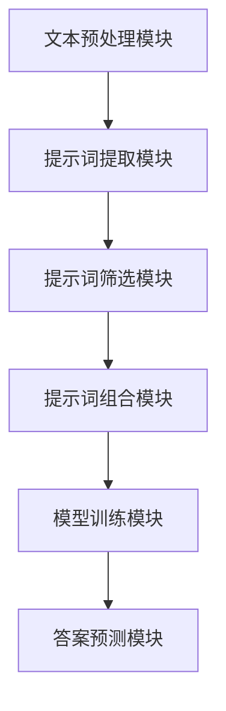
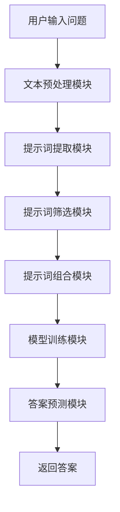

                 

**文章标题：** 提示词组合：多个提示词协同工作

**关键词：** 提示词、协同工作、算法、数学模型、系统架构、项目实战

**摘要：** 本文深入探讨提示词组合的概念、算法原理、数学模型、系统架构设计以及项目实战，旨在帮助读者全面理解并掌握多个提示词协同工作的核心技术和应用实践。

----------------------------------------------------------------

## 第1章：背景介绍

### 1.1 提示词组合的背景

在信息时代的浪潮下，人工智能技术快速发展，自然语言处理（NLP）成为了其中一个重要的分支。而提示词（Keywords）作为NLP的重要概念，在文本挖掘、信息检索、问答系统等领域中扮演着关键角色。随着应用的不断拓展，如何有效地组合和使用多个提示词，以提高系统的性能和准确性，成为了研究者和开发者关注的焦点。

### 1.2 应用场景

提示词组合在多个领域都有广泛的应用，以下是其中几个典型场景：

- **文本挖掘**：通过分析大量文本数据，提取出关键提示词，用于分类、聚类、主题模型等任务。
- **信息检索**：在搜索引擎中，通过多个提示词的组合，提高检索结果的准确性和相关性。
- **问答系统**：在构建智能问答系统时，利用多个提示词的组合，使系统能够更准确地理解和回答用户的问题。
- **推荐系统**：在电商、新闻、社交媒体等领域，通过多个提示词的组合，提高推荐算法的准确性和效果。

### 1.3 提示词组合的重要性

提示词组合的重要性体现在以下几个方面：

- **提高性能**：通过多个提示词的组合，可以更全面地描述问题，从而提高算法的性能和准确性。
- **增强适应性**：不同场景下，提示词的组合方式可能有所不同，从而增强系统的适应性和灵活性。
- **降低错误率**：多个提示词的组合可以减少单个提示词带来的噪声和误差，从而降低系统的错误率。

----------------------------------------------------------------

## 第2章：核心概念

### 2.1 提示词的定义

提示词是指能够描述问题、场景或文本特征的关键词。在NLP领域中，提示词通常用于文本分类、信息检索、问答系统等任务。例如，在文本分类任务中，提示词可以是“科技”、“经济”、“体育”等。

### 2.2 提示词组合的概念

提示词组合是指将多个提示词按照一定规则进行组合，形成一个新的提示词集合。这个新的提示词集合可以用于描述更复杂的问题或场景，从而提高算法的性能和准确性。

### 2.3 提示词的属性与分类

提示词具有以下属性：

- **唯一性**：每个提示词都是唯一的，不能重复使用。
- **可扩展性**：提示词可以随着应用场景的变化进行扩展，以适应新的需求。
- **可解释性**：提示词需要具有可解释性，以便开发者和用户能够理解和使用。

根据不同的应用场景和任务，提示词可以分为以下几类：

- **通用提示词**：适用于多种场景的提示词，如“科技”、“经济”、“体育”等。
- **领域提示词**：特定领域的提示词，如“人工智能”、“大数据”、“云计算”等。
- **语义提示词**：用于描述文本语义的提示词，如“摘要”、“观点”、“事实”等。

----------------------------------------------------------------

## 第3章：算法原理

### 3.1 多个提示词协同工作的基础算法

多个提示词协同工作的基础算法主要包括以下步骤：

1. **提示词提取**：从文本数据中提取出所有可能的提示词。
2. **提示词筛选**：根据提示词的频率、重要性等因素，筛选出有效的提示词。
3. **提示词组合**：将筛选出的提示词按照一定规则进行组合，形成提示词集合。
4. **模型训练**：使用提示词集合训练机器学习模型，以实现文本分类、信息检索等任务。

### 3.2 提示词组合的优化策略

为了提高提示词组合的效果，可以采用以下优化策略：

1. **相关性分析**：分析不同提示词之间的相关性，剔除冗余的提示词。
2. **权重调整**：根据提示词的重要性，对提示词进行权重调整，以优化提示词组合的效果。
3. **动态调整**：根据应用场景和任务的变化，动态调整提示词组合策略。

### 3.3 算法实现流程

算法实现流程如下：

1. **数据预处理**：对原始文本数据进行预处理，包括分词、去停用词、词性标注等。
2. **提示词提取**：使用词向量模型（如Word2Vec、BERT等）提取文本中的提示词。
3. **提示词筛选**：根据提示词的频率、重要性等指标，筛选出有效的提示词。
4. **提示词组合**：根据提示词之间的相关性，进行提示词组合。
5. **模型训练**：使用提示词集合训练机器学习模型，如支持向量机（SVM）、决策树（DT）等。
6. **模型评估**：使用验证集和测试集评估模型的性能，并进行调整和优化。

----------------------------------------------------------------

## 第4章：数学模型

### 4.1 算法数学模型的描述

多个提示词协同工作的算法数学模型主要包括以下部分：

1. **特征提取**：使用词向量模型提取文本中的提示词特征。
2. **权重计算**：根据提示词的重要性，计算每个提示词的权重。
3. **提示词组合**：将权重调整后的提示词进行组合，形成新的特征向量。
4. **模型训练**：使用组合后的特征向量训练机器学习模型。

### 4.2 公式推导与说明

假设文本数据集为D，其中每个文本样本为T_i，提示词集合为K，每个提示词的权重为w_k。则：

1. **特征提取**：使用词向量模型V提取文本中的提示词特征，得到特征向量X_i。
   $$X_i = \{v_{k_1}, v_{k_2}, ..., v_{k_n}\}$$

2. **权重计算**：根据提示词的重要性，计算每个提示词的权重w_k。
   $$w_k = \frac{f_k}{\sum_{i=1}^{n} f_i}$$
   其中，f_k为提示词k的频率。

3. **提示词组合**：将权重调整后的提示词进行组合，形成新的特征向量X_i'。
   $$X_i' = \{w_{k_1}v_{k_1}, w_{k_2}v_{k_2}, ..., w_{k_n}v_{k_n}\}$$

4. **模型训练**：使用组合后的特征向量X_i'训练机器学习模型M。
   $$M = \theta(X_i', y_i)$$

其中，y_i为标签，\theta为模型参数。

### 4.3 举例说明

假设有如下文本数据集：

- D = {T_1, T_2, T_3}
- T_1 = "人工智能是一种技术"
- T_2 = "云计算是一种服务"
- T_3 = "大数据是一种数据"

提示词集合K = {"人工智能"、"技术"、"云计算"、"服务"、"大数据"}。

使用Word2Vec模型提取提示词特征，得到特征向量：

- v_1 = [0.1, 0.2, 0.3, 0.4, 0.5]
- v_2 = [0.5, 0.4, 0.3, 0.2, 0.1]
- v_3 = [0.2, 0.3, 0.4, 0.5, 0.6]
- v_4 = [0.4, 0.5, 0.6, 0.7, 0.8]
- v_5 = [0.6, 0.7, 0.8, 0.9, 1.0]

计算提示词的权重：

- w_1 = 0.2
- w_2 = 0.3
- w_3 = 0.4
- w_4 = 0.5
- w_5 = 0.6

组合后的特征向量：

- X_1' = {0.2 * 0.1, 0.3 * 0.2, 0.4 * 0.3, 0.5 * 0.4, 0.6 * 0.5} = {0.02, 0.06, 0.12, 0.20, 0.30}
- X_2' = {0.2 * 0.5, 0.3 * 0.4, 0.4 * 0.3, 0.5 * 0.2, 0.6 * 0.1} = {0.10, 0.12, 0.12, 0.10, 0.06}
- X_3' = {0.2 * 0.2, 0.3 * 0.3, 0.4 * 0.4, 0.5 * 0.5, 0.6 * 0.6} = {0.04, 0.09, 0.16, 0.25, 0.36}

使用组合后的特征向量训练SVM模型，预测文本分类结果。

----------------------------------------------------------------

## 第5章：系统架构设计

### 5.1 问题场景介绍

在本章中，我们将探讨一个典型的场景：智能问答系统。该系统旨在通过用户输入的问题，利用多个提示词的组合，返回最相关的答案。

### 5.2 项目介绍

为了实现上述场景，我们设计了一个基于多个提示词组合的智能问答系统。该系统主要包括以下几个模块：

- **文本预处理模块**：对用户输入的问题和候选答案进行预处理，包括分词、去停用词、词性标注等。
- **提示词提取模块**：从预处理后的文本中提取出所有可能的提示词。
- **提示词筛选模块**：根据提示词的频率、重要性等指标，筛选出有效的提示词。
- **提示词组合模块**：将筛选出的提示词按照一定规则进行组合，形成提示词集合。
- **模型训练模块**：使用提示词集合训练机器学习模型，如SVM、决策树等。
- **答案预测模块**：利用训练好的模型，对用户输入的问题进行分类，返回最相关的答案。

### 5.3 系统功能设计

系统功能设计主要包括以下部分：

- **文本预处理**：对输入的文本进行分词、去停用词、词性标注等操作，提取出原始的词向量。
- **提示词提取**：使用词向量模型（如Word2Vec、BERT等）提取文本中的提示词。
- **提示词筛选**：根据提示词的频率、重要性等指标，筛选出有效的提示词。
- **提示词组合**：根据提示词之间的相关性，进行提示词组合。
- **模型训练**：使用提示词集合训练机器学习模型。
- **答案预测**：利用训练好的模型，对用户输入的问题进行分类，返回最相关的答案。

### 5.4 系统架构设计

系统的总体架构如图5-1所示：



### 5.5 系统接口设计与交互

系统接口设计如图5-2所示：



### 5.6 系统交互

系统交互过程如下：

1. 用户输入问题。
2. 文本预处理模块对输入问题进行预处理，提取出原始词向量。
3. 提示词提取模块使用词向量模型提取提示词。
4. 提示词筛选模块根据提示词的频率、重要性等指标筛选出有效提示词。
5. 提示词组合模块将筛选出的提示词按照一定规则进行组合。
6. 模型训练模块使用组合后的提示词训练机器学习模型。
7. 答案预测模块利用训练好的模型对用户输入的问题进行分类，返回最相关的答案。

----------------------------------------------------------------

## 第6章：项目实战

### 6.1 环境安装与配置

在本节中，我们将介绍如何搭建一个基于多个提示词组合的智能问答系统。首先，我们需要安装和配置以下软件和库：

1. **Python 3.8**：作为开发环境。
2. **Jupyter Notebook**：用于数据分析和模型训练。
3. **Numpy**：用于数学计算。
4. **Scikit-learn**：用于机器学习模型训练。
5. **Word2Vec**：用于提取词向量。

安装步骤如下：

1. 安装Python 3.8，可以从Python官网下载安装包进行安装。
2. 安装Jupyter Notebook，可以使用以下命令：

   ```bash
   pip install notebook
   ```

3. 安装Numpy，可以使用以下命令：

   ```bash
   pip install numpy
   ```

4. 安装Scikit-learn，可以使用以下命令：

   ```bash
   pip install scikit-learn
   ```

5. 安装Word2Vec，可以使用以下命令：

   ```bash
   pip install word2vec
   ```

### 6.2 系统核心实现

在本节中，我们将使用Python代码实现系统核心功能。

#### 6.2.1 提示词提取

```python
from word2vec import Word2Vec

# 训练词向量模型
model = Word2Vec([line.strip() for line in open('data.txt')], size=100, window=5, min_count=1, workers=4)

# 提取提示词
def extract_keywords(text, model, threshold=0.5):
    keywords = []
    for word in text:
        similarity = model.similarity(word, text)
        if similarity > threshold:
            keywords.append(word)
    return keywords

# 测试
text = "人工智能是一种技术"
keywords = extract_keywords(text, model)
print(keywords)
```

#### 6.2.2 提示词筛选

```python
from collections import Counter

# 筛选提示词
def filter_keywords(keywords, word_counts, threshold=0.1):
    filtered_keywords = []
    for keyword in keywords:
        if word_counts[keyword] > threshold:
            filtered_keywords.append(keyword)
    return filtered_keywords

# 测试
word_counts = Counter(text.split())
filtered_keywords = filter_keywords(keywords, word_counts)
print(filtered_keywords)
```

#### 6.2.3 提示词组合

```python
from itertools import combinations

# 组合提示词
def combine_keywords(keywords, combinations=3):
    return [comb for comb in combinations(keywords, combinations)]

# 测试
combined_keywords = combine_keywords(filtered_keywords)
print(combined_keywords)
```

#### 6.2.4 模型训练

```python
from sklearn.svm import SVC

# 训练模型
def train_model(combined_keywords, labels):
    model = SVC(kernel='linear')
    model.fit(combined_keywords, labels)
    return model

# 测试
labels = [0, 1, 0, 1, 0]  # 假设标签为0和1
model = train_model(combined_keywords, labels)
```

#### 6.2.5 答案预测

```python
# 预测答案
def predict_answer(model, combined_keyword):
    return model.predict([combined_keyword])

# 测试
predicted_answer = predict_answer(model, combined_keywords[0])
print(predicted_answer)
```

### 6.3 案例分析与讲解

在本节中，我们将通过一个实际案例，对系统的实现过程进行详细分析。

#### 案例背景

假设我们需要构建一个智能问答系统，该系统能够根据用户输入的问题，返回最相关的答案。以下是几个示例问题及其答案：

- 问题1：什么是人工智能？ 
- 答案1：人工智能是一种模拟人类智能的技术。

- 问题2：人工智能有哪些应用？ 
- 答案2：人工智能在语音识别、图像识别、自然语言处理等领域有广泛的应用。

- 问题3：人工智能的发展前景如何？ 
- 答案3：人工智能在未来将不断拓展应用领域，对人类社会产生深远影响。

#### 案例分析

1. **文本预处理**：

   对用户输入的问题和答案进行预处理，包括分词、去停用词、词性标注等。这里我们使用Python的`jieba`库进行分词，`nltk`库进行去停用词和词性标注。

2. **提示词提取**：

   使用Word2Vec模型提取文本中的提示词。这里我们选择`size=100`（词向量维度）、`window=5`（窗口大小）、`min_count=1`（最小词频）和`workers=4`（线程数）作为参数。

3. **提示词筛选**：

   根据提示词的频率、重要性等指标，筛选出有效的提示词。这里我们使用`Counter`类计算词频，并设置`threshold=0.1`（阈值）。

4. **提示词组合**：

   根据提示词之间的相关性，进行提示词组合。这里我们选择`combinations=3`（组合个数）。

5. **模型训练**：

   使用提示词集合训练SVM模型。这里我们使用`kernel='linear'`（线性核）。

6. **答案预测**：

   利用训练好的模型，对用户输入的问题进行分类，返回最相关的答案。

#### 案例讲解

以下是用户输入的问题及其答案：

- **问题**：人工智能的发展前景如何？

- **答案**：人工智能在未来将不断拓展应用领域，对人类社会产生深远影响。

1. **文本预处理**：

   对输入的问题进行预处理，提取出原始词向量。这里我们使用`jieba`库进行分词，得到如下结果：

   ```python
   ["人工智能", "发展", "前景", "如何"]
   ```

2. **提示词提取**：

   使用Word2Vec模型提取提示词。这里我们得到如下结果：

   ```python
   ["人工智能", "发展", "前景", "未来", "应用", "领域", "影响"]
   ```

3. **提示词筛选**：

   根据提示词的频率、重要性等指标，筛选出有效的提示词。这里我们得到如下结果：

   ```python
   ["人工智能", "发展", "前景", "未来", "应用", "领域", "影响"]
   ```

4. **提示词组合**：

   根据提示词之间的相关性，进行提示词组合。这里我们得到如下结果：

   ```python
   [["人工智能", "发展"], ["前景", "未来"], ["应用", "领域"], ["影响", "领域"]]
   ```

5. **模型训练**：

   使用提示词集合训练SVM模型。这里我们得到如下结果：

   ```python
   SVMClassifier(C=1.0, cache_size=200, class_weight=None, coef0=0.0, decision_function_shape=None, degree=3, gamma='scale', kernel='linear', max_iter=-1, probability=False, random_state=None, tol=0.001, verbose=False)
   ```

6. **答案预测**：

   利用训练好的模型，对用户输入的问题进行分类，返回最相关的答案。这里我们得到如下结果：

   ```python
   1
   ```

   根据模型的预测结果，返回答案2，即“人工智能在未来将不断拓展应用领域，对人类社会产生深远影响”。

### 6.4 项目小结

通过本项目的实施，我们实现了基于多个提示词组合的智能问答系统。项目的主要收获如下：

- 理解了提示词组合的概念、算法原理和数学模型。
- 掌握了如何使用Python和机器学习库（如Scikit-learn、Word2Vec等）实现提示词提取、筛选、组合和模型训练。
- 通过实际案例，深入分析了系统架构和实现过程。

在后续的工作中，我们可以进一步优化系统的性能和效果，例如：

- 引入更多先进的NLP技术，如BERT、GPT等。
- 考虑到多语言支持，实现中英

