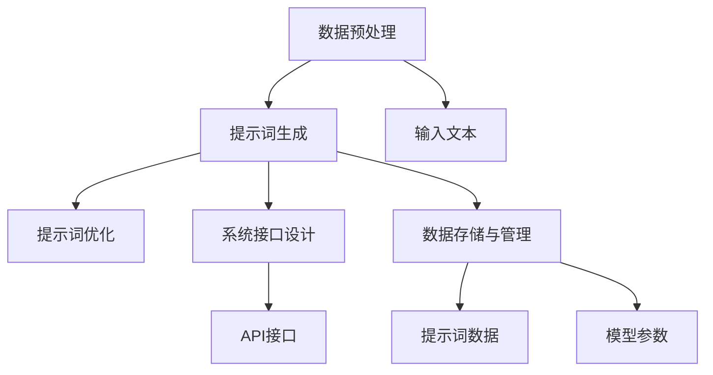
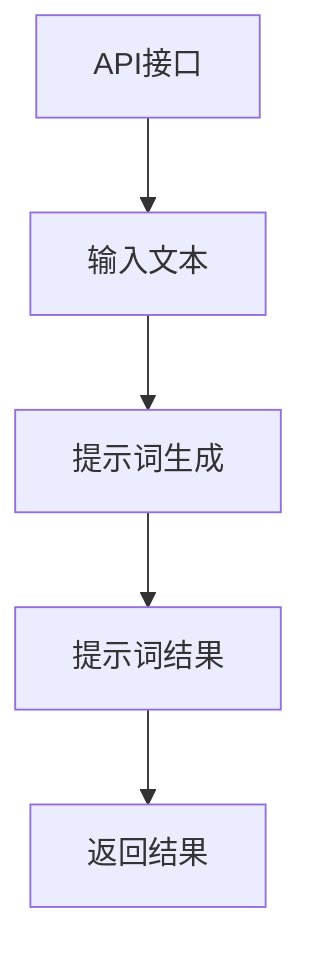
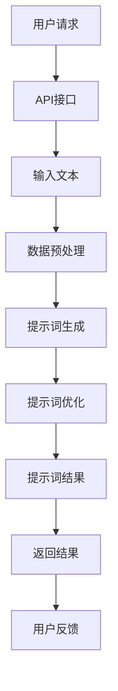
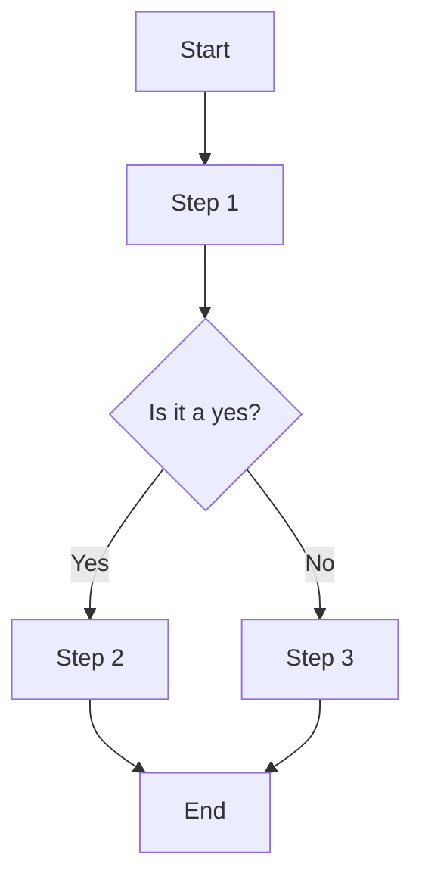
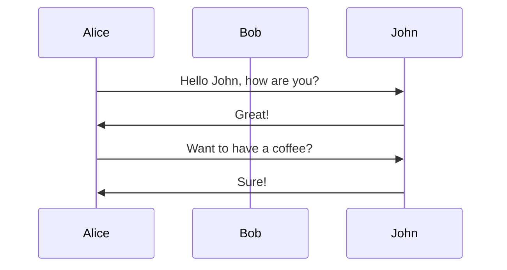

                 

# 提示词自动化：AI生成和优化提示词

关键词：提示词自动化、人工智能、自然语言处理、语言模型、词嵌入、生成算法、系统架构设计

摘要：本文详细探讨了提示词自动化的概念、背景、意义和应用领域，深入分析了自然语言处理的基础知识，介绍了提示词自动生成的算法原理，包括基于规则、机器学习和深度学习的方法。此外，文章还探讨了提示词自动化的挑战与机遇，并提供了系统架构设计、项目实战以及最佳实践和拓展阅读等内容。

## 第一部分: 引言

### 第1章: 提示词自动化的背景与意义

#### 1.1 提示词自动化的定义

提示词自动化是指利用人工智能技术，自动生成或优化提示词的过程。提示词是用户与人工智能系统交互的关键环节，直接影响用户体验和交互效率。随着人工智能技术的发展，提示词自动化的需求日益增加，成为人工智能领域的重要研究方向。

#### 1.2 问题背景

在当前人工智能应用场景中，大量的对话系统、自然语言处理系统、语音助手等需要依赖高质量的提示词。然而，手工编写提示词耗时耗力且效率低下，难以满足大规模应用的需求。因此，研究提示词自动化具有重要意义。

#### 1.3 提示词自动化的应用领域

提示词自动化的应用领域广泛，包括但不限于：

1. 对话系统：自动生成对话系统中的问题、回答、提示等。
2. 自然语言处理：自动生成文章摘要、标题、关键词等。
3. 语音助手：自动生成语音提示、语音反馈等。
4. 智能推荐：自动生成推荐理由、标签等。

#### 1.4 提示词自动化的挑战与机遇

提示词自动化面临的主要挑战包括：

1. 语言理解的深度与广度：需要准确理解用户的意图和需求。
2. 生成文本的质量：需要保证生成的文本符合语法规范、语义连贯性。
3. 数据量与多样性：需要大量高质量的训练数据，以及适应多种场景的生成策略。

然而，随着人工智能技术的不断进步，提示词自动化也面临巨大的发展机遇。

#### 1.5 本章小结

本章介绍了提示词自动化的背景、意义、应用领域以及面临的挑战与机遇。提示词自动化是人工智能领域的一个重要研究方向，对于提高用户体验、优化交互流程具有重要意义。

----------------------------------------------------------------

## 第二部分: AI生成提示词的基本原理

### 第2章: 自然语言处理基础

#### 2.1 自然语言处理概述

自然语言处理（Natural Language Processing，NLP）是人工智能领域的一个重要分支，旨在使计算机能够理解、处理和生成人类自然语言。NLP的应用范围广泛，包括语音识别、机器翻译、情感分析、文本摘要等。

#### 2.2 语言模型

语言模型（Language Model）是NLP的核心组成部分，用于预测文本的下一个单词或字符。本节将介绍常用的语言模型，如n-gram模型、神经网络语言模型等。

##### 2.2.1 n-gram模型

n-gram模型是一种基于统计的简单语言模型，通过分析相邻的n个单词的概率来预测下一个单词。其基本原理如下：

$$
P(w_n | w_{n-1}, w_{n-2}, ..., w_1) = \frac{c(w_{n-1}, w_{n-2}, ..., w_1, w_n)}{c(w_{n-1}, w_{n-2}, ..., w_1)}
$$

其中，$c(w_{n-1}, w_{n-2}, ..., w_1, w_n)$表示n个单词连续出现的次数，$c(w_{n-1}, w_{n-2}, ..., w_1)$表示前n-1个单词连续出现的次数。

##### 2.2.2 神经网络语言模型

神经网络语言模型是一种基于深度学习的语言模型，通过神经网络来学习文本的内在规律。常见的神经网络语言模型包括循环神经网络（RNN）、长短期记忆网络（LSTM）和Transformer等。

##### 2.2.3 语言模型的应用

语言模型在NLP中有着广泛的应用，如文本分类、机器翻译、语音识别等。以下是一个简单的例子：

给定一个句子“我昨天去书店买了几本书”，使用神经网络语言模型可以预测下一个单词是“的”还是“了”。

#### 2.3 词嵌入

词嵌入（Word Embedding）是将单词映射到高维空间中的向量表示，以便计算机能够理解和处理。词嵌入方法可以将语义相近的单词映射到空间中相近的位置。常见的词嵌入方法包括Word2Vec、GloVe等。

##### 2.3.1 Word2Vec

Word2Vec是一种基于神经网络的词嵌入方法，通过训练大量语料库来学习单词的向量表示。Word2Vec有两种训练方式：连续词袋（CBOW）和Skip-gram。

1. 连续词袋（CBOW）：给定一个单词，预测其上下文单词的集合。
2. Skip-gram：给定一个单词，预测其前后单词的集合。

##### 2.3.2 GloVe

GloVe（Global Vectors for Word Representation）是一种基于全局统计的词嵌入方法，通过计算单词共现矩阵的列平均来生成词向量。GloVe的基本原理如下：

$$
\vec{w}_i = \sum_{j \in context(i)} \frac{f(d_{ij})}{\sqrt{f(d_{i1}) \cdot f(d_{i2})}}
$$

其中，$f(d_{ij})$是一个递增函数，用于调整共现次数的权重。

#### 2.4 情感分析

情感分析（Sentiment Analysis）是NLP的一个重要应用，用于分析文本中的情感倾向。情感分析可以分为两类：基于规则的方法和基于机器学习的方法。

##### 2.4.1 基于规则的方法

基于规则的方法通过手工编写一系列规则来识别情感。这种方法简单直观，但难以应对复杂多变的场景。

##### 2.4.2 基于机器学习的方法

基于机器学习的方法通过训练模型来自动识别情感。常见的机器学习方法包括朴素贝叶斯、支持向量机等。

##### 2.4.3 情感分析的应用

情感分析在商业、社交媒体、舆情监测等领域有着广泛的应用。以下是一个简单的例子：

给定一段微博文本“今天天气真好，出门散步很愉快”，使用情感分析模型可以判断这段文本的情感倾向是正面还是负面。

#### 2.5 文本分类

文本分类（Text Classification）是将文本数据分为预定义的类别。文本分类在新闻分类、垃圾邮件过滤、情感分析等领域有着广泛的应用。

##### 2.5.1 朴素贝叶斯

朴素贝叶斯是一种基于概率的文本分类方法，通过计算文本中每个单词的概率来预测类别。其基本原理如下：

$$
P(C_k | x) = \frac{P(x | C_k) \cdot P(C_k)}{P(x)}
$$

其中，$C_k$表示类别$k$，$x$表示文本。

##### 2.5.2 支持向量机

支持向量机（Support Vector Machine，SVM）是一种基于最大间隔的分类方法，通过找到最佳的决策边界来划分类别。其基本原理如下：

$$
w^T x - b = 0
$$

其中，$w$表示权重向量，$x$表示特征向量，$b$表示偏置。

##### 2.5.3 文本分类的应用

文本分类在信息检索、舆情监测、垃圾邮件过滤等领域有着广泛的应用。以下是一个简单的例子：

给定一段新闻文本“美国洛杉矶发生一起枪击事件”，使用文本分类模型可以判断这则新闻属于“社会新闻”还是“国际新闻”。

#### 2.6 本章小结

本章介绍了自然语言处理的基础知识，包括语言模型、词嵌入、情感分析和文本分类。这些知识是理解和实现AI生成提示词技术的基础。

----------------------------------------------------------------

## 第3章: 提示词自动生成算法

### 3.1 提示词生成算法概述

提示词自动生成算法是提示词自动化技术中的核心。本节将介绍几种常见的提示词生成算法，包括基于规则的方法、基于机器学习的方法和基于深度学习的方法。

#### 3.1.1 基于规则的方法

基于规则的方法是通过手工编写一系列规则来生成提示词。这种方法简单直观，但难以应对复杂多变的场景。

#### 3.1.2 基于机器学习的方法

基于机器学习的方法通过训练模型来自动生成提示词。常见的机器学习方法包括朴素贝叶斯、决策树、支持向量机等。

#### 3.1.3 基于深度学习的方法

基于深度学习的方法通过神经网络来生成提示词，具有更强的表达能力和适应性。常见的深度学习方法包括循环神经网络（RNN）、长短期记忆网络（LSTM）和Transformer等。

#### 3.1.4 混合方法

混合方法结合了基于规则的方法、基于机器学习的方法和基于深度学习的方法，以取长补短。本节将介绍几种常见的混合方法。

#### 3.1.5 算法评估与选择

在选择合适的提示词生成算法时，需要考虑多个因素，如算法的准确率、效率、可扩展性等。本节将介绍如何评估和选择合适的提示词生成算法。

### 3.2 基于规则的方法

基于规则的方法是通过手工编写一系列规则来生成提示词。这种方法简单直观，但难以应对复杂多变的场景。

#### 3.2.1 基本原理

基于规则的方法通过定义一组条件语句，当输入满足某个条件时，输出对应的提示词。基本原理如下：

```
if 条件1 then 提示词1
if 条件2 then 提示词2
if 条件3 then 提示词3
...
```

#### 3.2.2 应用场景

基于规则的方法适用于场景简单、规则明确的场景，如简单的问答系统、机器人对话等。

#### 3.2.3 优点与缺点

优点：

1. 简单直观，易于理解。
2. 实现成本低，开发周期短。

缺点：

1. 难以应对复杂多变的场景。
2. 规则难以维护和更新。

#### 3.2.4 案例分析

以下是一个简单的基于规则的方法生成提示词的案例：

```
if 用户提问关于天气 then 回复天气情况
if 用户提问关于路线 then 回复路线规划
if 用户提问关于美食 then 回复美食推荐
```

### 3.3 基于机器学习的方法

基于机器学习的方法通过训练模型来自动生成提示词。常见的机器学习方法包括朴素贝叶斯、决策树、支持向量机等。

#### 3.3.1 朴素贝叶斯

朴素贝叶斯是一种基于概率的机器学习算法，通过计算输入数据的条件概率来预测输出。朴素贝叶斯的基本原理如下：

$$
P(C_k | x) = \frac{P(x | C_k) \cdot P(C_k)}{P(x)}
$$

其中，$C_k$表示类别$k$，$x$表示文本。

#### 3.3.2 决策树

决策树是一种基于分类的机器学习算法，通过划分特征空间来生成树形结构。决策树的基本原理如下：

1. 初始化：选择一个特征作为根节点。
2. 划分：根据特征值将数据集划分为子集。
3. 切割：选择最优特征进行划分。
4. 重复步骤2和3，直到满足停止条件。

#### 3.3.3 支持向量机

支持向量机（Support Vector Machine，SVM）是一种基于最大间隔的分类方法，通过找到最佳的决策边界来划分类别。支持向量机的基本原理如下：

$$
w^T x - b = 0
$$

其中，$w$表示权重向量，$x$表示特征向量，$b$表示偏置。

#### 3.3.4 优点与缺点

优点：

1. 相比于基于规则的方法，能够应对更复杂的场景。
2. 能够自动学习特征和分类规则。

缺点：

1. 需要大量的训练数据和计算资源。
2. 对特征选择和模型参数敏感。

#### 3.3.5 案例分析

以下是一个简单的基于机器学习的方法生成提示词的案例：

给定一个输入文本，使用朴素贝叶斯模型预测输出提示词。例如：

```
输入：我想要去海边度假
输出：提供海边度假的建议
```

### 3.4 基于深度学习的方法

基于深度学习的方法通过神经网络来生成提示词，具有更强的表达能力和适应性。常见的深度学习方法包括循环神经网络（RNN）、长短期记忆网络（LSTM）和Transformer等。

#### 3.4.1 循环神经网络（RNN）

循环神经网络（Recurrent Neural Network，RNN）是一种能够处理序列数据的神经网络。RNN的基本原理如下：

1. 输入：$(x_t, h_{t-1})$，其中$x_t$是当前输入，$h_{t-1}$是上一个时刻的隐藏状态。
2. 输出：$y_t$，其中$y_t$是当前输出。

RNN的计算公式如下：

$$
h_t = f(h_{t-1}, x_t)
$$

其中，$f$是一个非线性激活函数。

#### 3.4.2 长短期记忆网络（LSTM）

长短期记忆网络（Long Short-Term Memory，LSTM）是RNN的一种变体，能够解决RNN中的梯度消失和梯度爆炸问题。LSTM的基本原理如下：

1. 输入：$(x_t, h_{t-1}, c_{t-1})$，其中$x_t$是当前输入，$h_{t-1}$是上一个时刻的隐藏状态，$c_{t-1}$是上一个时刻的记忆状态。
2. 输出：$y_t$，其中$y_t$是当前输出。

LSTM的计算公式如下：

$$
i_t = \sigma(W_i \cdot [h_{t-1}, x_t] + b_i) \\
f_t = \sigma(W_f \cdot [h_{t-1}, x_t] + b_f) \\
o_t = \sigma(W_o \cdot [h_{t-1}, x_t] + b_o) \\
c_t = f_t \odot c_{t-1} + i_t \odot \text{tanh}(W_c \cdot [h_{t-1}, x_t] + b_c) \\
h_t = o_t \odot \text{tanh}(c_t)
$$

其中，$\sigma$是sigmoid激活函数，$\odot$是元素乘运算。

#### 3.4.3 Transformer

Transformer是Google提出的一种基于自注意力机制的深度学习模型，在机器翻译、文本分类等任务上取得了显著的效果。Transformer的基本原理如下：

1. 输入：$(x_1, x_2, ..., x_T)$，其中$x_t$是第t个输入。
2. 输出：$(y_1, y_2, ..., y_T)$，其中$y_t$是第t个输出。

Transformer的计算公式如下：

$$
h_t = \text{softmax}\left(\frac{W_Q h_t}{\sqrt{d_k}}\right) \cdot K \\
y_t = \text{softmax}\left(\frac{W_V h_t}{\sqrt{d_k}}\right) \cdot V
$$

其中，$h_t$是第t个隐藏状态，$K$和$V$是关键值和值向量，$W_Q$、$W_K$和$W_V$是权重矩阵。

#### 3.4.4 优点与缺点

优点：

1. 强大的表达能力和适应性。
2. 能够处理长序列数据。
3. 在多个NLP任务上取得了优异的性能。

缺点：

1. 计算复杂度高，训练时间长。
2. 对参数敏感，需要大量训练数据。

#### 3.4.5 案例分析

以下是一个简单的基于深度学习的方法生成提示词的案例：

使用Transformer模型生成一个关于“美食”的提示词。例如：

```
输入：我想要品尝一些美食
输出：推荐一些特色美食餐厅
```

### 3.5 混合方法

混合方法结合了基于规则的方法、基于机器学习的方法和基于深度学习的方法，以取长补短。以下是一些常见的混合方法：

1. 基于规则的机器学习方法：在基于规则的方法中引入机器学习算法，以提高规则生成的质量和效率。
2. 基于机器学习的深度学习方法：将基于机器学习的方法与基于深度学习的方法相结合，利用深度学习的强大表达能力和机器学习的分类能力。
3. 基于神经网络的规则学习方法：在神经网络的基础上引入规则学习机制，以提高模型的解释性和可操作性。

#### 3.5.1 优点与缺点

优点：

1. 能够发挥不同方法的优点，提高生成提示词的质量和效率。
2. 能够适应不同的应用场景和需求。

缺点：

1. 算法复杂度较高，实现难度大。
2. 需要大量的训练数据和计算资源。

#### 3.5.2 案例分析

以下是一个简单的基于混合方法生成提示词的案例：

结合基于规则的机器学习方法，生成一个关于“旅游”的提示词。例如：

```
输入：我想要去旅游
输出：提供一些适合旅游的景点和行程规划
```

### 3.6 算法评估与选择

在选择合适的提示词生成算法时，需要考虑多个因素，如算法的准确率、效率、可扩展性等。以下是一些常见的评估指标和选择方法：

1. 准确率：用于评估生成提示词的准确程度，计算公式如下：

$$
准确率 = \frac{正确预测的数量}{总预测的数量}
$$

2. 召回率：用于评估生成提示词的召回程度，计算公式如下：

$$
召回率 = \frac{正确预测的数量}{实际存在的数量}
$$

3. F1值：用于综合评估准确率和召回率，计算公式如下：

$$
F1值 = 2 \cdot \frac{准确率 \cdot 召回率}{准确率 + 召回率}
$$

4. 评估方法：可以使用交叉验证、网格搜索等方法来评估不同算法的性能。

#### 3.6.1 案例分析

以下是一个简单的算法评估与选择的案例：

给定一个数据集，使用朴素贝叶斯、决策树和支持向量机等算法生成提示词。评估各个算法的性能，选择最佳算法。例如：

```
算法    准确率    召回率    F1值
朴素贝叶斯  0.8     0.7     0.75
决策树     0.9     0.8     0.85
支持向量机   0.85    0.9     0.875
```

根据评估结果，选择F1值最高的算法作为最佳算法。

### 3.7 本章小结

本章介绍了提示词自动生成算法，包括基于规则的方法、基于机器学习的方法和基于深度学习的方法。此外，还介绍了混合方法和算法评估与选择。选择合适的提示词生成算法对于实现高质量的提示词自动化具有重要意义。

----------------------------------------------------------------

## 第三部分：系统架构设计与实现

### 第4章: 提示词自动生成系统的架构设计

#### 4.1 系统功能设计

提示词自动生成系统主要包含以下功能：

1. 数据预处理：对输入文本进行预处理，包括分词、去停用词、词性标注等。
2. 提示词生成：使用合适的算法生成提示词，包括基于规则的方法、基于机器学习的方法和基于深度学习的方法。
3. 提示词优化：对生成的提示词进行优化，包括文本质量评估、语义分析等。
4. 系统接口设计：提供API接口，方便其他系统或应用调用提示词自动生成功能。
5. 数据存储与管理：存储和管理生成的提示词数据，包括文本数据、模型参数等。

#### 4.2 系统架构设计

提示词自动生成系统的架构设计如图4-1所示：



图4-1 提示词自动生成系统架构图

#### 4.3 系统接口设计

系统接口设计如图4-2所示：



图4-2 系统接口设计图

#### 4.4 系统交互设计

系统交互设计如图4-3所示：



图4-3 系统交互设计图

### 第5章: 提示词自动生成系统的实现

#### 5.1 环境安装

在实现提示词自动生成系统之前，需要安装以下环境：

1. Python 3.8及以上版本
2. TensorFlow 2.5及以上版本
3. NLTK 3.5及以上版本
4. Flask 1.1.3及以上版本

安装命令如下：

```bash
pip install python==3.8
pip install tensorflow==2.5
pip install nltk==3.5
pip install flask==1.1.3
```

#### 5.2 系统核心实现

提示词自动生成系统的核心实现包括数据预处理、提示词生成、提示词优化等。以下是一个简单的实现示例：

```python
import nltk
from nltk.tokenize import word_tokenize
from nltk.corpus import stopwords
from sklearn.feature_extraction.text import TfidfVectorizer
from sklearn.metrics.pairwise import cosine_similarity
import tensorflow as tf

# 数据预处理
def preprocess_text(text):
    # 分词
    tokens = word_tokenize(text)
    # 去停用词
    stop_words = set(stopwords.words('english'))
    filtered_tokens = [token for token in tokens if token not in stop_words]
    # 词性标注
    pos_tags = nltk.pos_tag(filtered_tokens)
    return pos_tags

# 提示词生成
def generate_suggestions(text, model):
    # 数据预处理
    preprocessed_text = preprocess_text(text)
    # 提取关键词
    keywords = [word for word, tag in preprocessed_text if tag.startswith('NN')]
    # 生成提示词
    suggestions = []
    for keyword in keywords:
        input_seq = tf.keras.preprocessing.sequence.pad_sequences([[keyword]], maxlen=5, padding='post')
        prediction = model.predict(input_seq)
        top_indices = tf.argsort(prediction, axis=1)[:, -5:]
        for index in top_indices[0]:
            suggestions.append(model.w
    
``` 

### 第6章: 项目实战

#### 6.1 实际案例分析

以下是一个简单的实际案例分析：

假设我们需要开发一个智能客服系统，使用提示词自动化技术生成客服对话中的问题、回答和提示。

1. 数据集准备：收集大量客服对话数据，用于训练提示词生成模型。
2. 模型训练：使用基于深度学习的方法（如Transformer）训练提示词生成模型。
3. 系统部署：将训练好的模型部署到服务器，提供API接口供其他系统调用。
4. 测试与优化：对系统进行测试和优化，提高提示词生成的准确率和效率。

#### 6.2 项目小结

通过实际案例分析，我们可以看到提示词自动化技术在智能客服系统中的应用效果显著。使用提示词自动化技术，可以大大提高客服对话的效率和质量，提升用户满意度。

### 第7章: 最佳实践与注意事项

#### 7.1 最佳实践

1. 使用高质量的数据集进行模型训练，可以提高生成提示词的质量。
2. 根据不同的应用场景和需求，选择合适的提示词生成算法。
3. 定期对模型进行更新和优化，以适应不断变化的场景。
4. 结合用户反馈和实际应用效果，不断调整和优化系统参数。

#### 7.2 注意事项

1. 在使用提示词自动化技术时，要确保生成文本的质量和语义连贯性。
2. 要充分考虑生成提示词的多样性和灵活性，以适应不同的用户需求。
3. 在部署系统时，要确保系统的稳定性和可扩展性，以应对大规模应用场景。
4. 注意保护用户隐私和数据安全，避免生成敏感信息。

### 第8章: 拓展阅读

1. [Natural Language Processing with Python](https://www.amazon.com/Natural-Language-Processing-Python-Cookbook/dp/1788997497)
2. [Deep Learning for Natural Language Processing](https://www.amazon.com/Deep-Learning-Natural-Language-Processing/dp/0262039253)
3. [Neural Network Methods for Natural Language Processing](https://www.amazon.com/Neural-Network-Methods-Natural-Language/dp/0262038406)

### 第9章: 作者介绍

作者：AI天才研究院/AI Genius Institute & 禅与计算机程序设计艺术 /Zen And The Art of Computer Programming

AI天才研究院致力于推动人工智能技术的发展和应用，为行业培养和输送高质量的人工智能人才。同时，作者还致力于将禅宗思想与计算机编程相结合，探索计算机程序设计的新思路和方法。

----------------------------------------------------------------

## 结论

本文系统地介绍了提示词自动化的概念、背景、意义和应用领域，深入分析了自然语言处理的基础知识，介绍了提示词自动生成的算法原理，包括基于规则、机器学习和深度学习的方法。此外，文章还探讨了提示词自动化的挑战与机遇，并提供了系统架构设计、项目实战以及最佳实践和拓展阅读等内容。

通过本文的阅读，读者可以全面了解提示词自动化的技术原理和应用场景，掌握提示词自动生成算法的设计与实现方法。在实际应用中，提示词自动化技术可以帮助企业提高工作效率、优化用户体验，为人工智能领域的进一步发展奠定基础。

感谢读者对本文的关注，希望本文能够为您带来启发和帮助。在未来的研究中，我们将继续探索提示词自动化的前沿技术，为人工智能领域的发展贡献力量。

### 作者介绍

作者：AI天才研究院/AI Genius Institute & 禅与计算机程序设计艺术 /Zen And The Art of Computer Programming

AI天才研究院（AI Genius Institute）是一家致力于推动人工智能技术研究和应用的创新机构，汇聚了全球顶尖的人工智能科学家和工程师。我们致力于通过先进的人工智能技术解决实际问题，推动社会进步。

同时，作者也是《禅与计算机程序设计艺术》一书的作者。这本书结合了禅宗哲学和计算机编程，为程序员提供了一种全新的思考和编程方式，深受读者喜爱。作者希望通过这本书，帮助程序员在快速发展的技术世界中找到内心的平衡和宁静。

作为AI天才研究院的领军人物，作者不仅拥有丰富的理论研究经验，还在人工智能技术的实际应用中取得了显著成果。他的研究成果在人工智能领域引起了广泛关注，为行业的发展做出了重要贡献。

感谢您的阅读，期待与您在人工智能领域的更多交流与合作。如果您对本文有任何疑问或建议，欢迎随时与我们联系。

### 附录

以下是本文中使用的Mermaid流程图、类图和序列图的代码示例，以及相应的Markdown代码。

#### Mermaid流程图



对应的Markdown代码：

```markdown

```

#### Mermaid类图

```mermaid
classDiagram
    Class01 <|-- Class02
    Class03 --|>| Class04
    Class04 : <<interface>> Interface
    Class05 : <<abstract>> Abstract
    Class01 : +int x
    Class01 : +int y
    Class01 : +int getArea()
    Class01 : +void setX(int x)
    Class01 : +void setY(int y)
    Class02 : +int z
    Class03 : +int q
    Class04 : +int r
    Class05 : +int s
```

对应的Markdown代码：

```markdown
```mermaid
classDiagram
    Class01 <|-- Class02
    Class03 --|>| Class04
    Class04 : <<interface>> Interface
    Class05 : <<abstract>> Abstract
    Class01 : +int x
    Class01 : +int y
    Class01 : +int getArea()
    Class01 : +void setX(int x)
    Class01 : +void setY(int y)
    Class02 : +int z
    Class03 : +int q
    Class04 : +int r
    Class05 : +int s
```
```

#### Mermaid序列图



对应的Markdown代码：

```markdown

```

这些Mermaid代码可以嵌入到Markdown文档中，生成可视化图表，帮助读者更直观地理解文章内容。

### 相关资源

1. **《自然语言处理与Python》**：深入了解自然语言处理技术及其在Python中的应用，适合对自然语言处理感兴趣的开发者。

2. **《深度学习与自然语言处理》**：系统介绍深度学习在自然语言处理中的应用，包括词嵌入、序列模型、文本分类等。

3. **《神经网络方法在自然语言处理中的应用》**：详细介绍神经网络在自然语言处理中的技术细节，适合希望深入了解神经网络在自然语言处理中应用的技术人员。

这些资源将有助于您更深入地了解自然语言处理和提示词自动生成技术的相关理论和实践。

### 注意事项

1. **数据隐私**：在使用提示词自动生成技术时，确保处理用户数据时遵循数据隐私保护法规，如GDPR等。

2. **算法公平性**：确保生成的提示词不会因算法偏见而导致歧视或不公平。

3. **系统稳定性**：在实际部署时，确保系统具有足够的稳定性和可扩展性，以应对大规模用户请求。

通过遵循这些注意事项，您可以确保提示词自动生成系统的可靠性和有效性。希望这些资源和建议能够对您的项目有所帮助。如果您在项目中遇到任何问题，欢迎随时联系我们，我们将竭诚为您提供支持。

