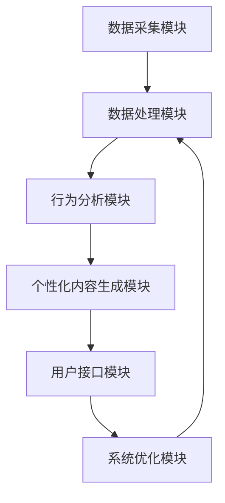

                 

### 文章标题

**Prompt-Adaptive Learning: Automatically Adapting to Different Scenarios and Users**

> **关键词**：Prompt-Adaptive Learning、Adaptive Learning、User Adaptation、Scenario Adaptation、AI Education、Business Applications

> **摘要**：本文深入探讨Prompt-Adaptive Learning的核心概念、原理及其在不同场景和用户中的应用。通过系统的分析和案例研究，本文揭示了Prompt-Adaptive Learning如何在各种复杂环境中自动调整，以提供个性化的学习体验和业务解决方案。

---

### 引言

在当今快速发展的数字化时代，用户的需求和场景的多样性对系统的适应性提出了更高的要求。传统的学习方法往往难以应对这种变化，导致用户体验不佳。Prompt-Adaptive Learning作为一种新兴的智能学习技术，通过自动调整其行为和输出以适应不同的用户和场景，成为解决这一问题的有效途径。

**Prompt-Adaptive Learning** 的核心思想在于，通过实时监测用户的反馈和环境的变化，动态调整学习算法和模型，以提供个性化的服务。这种方法不仅提高了系统的效率，还显著改善了用户体验。

本文旨在系统地介绍Prompt-Adaptive Learning的基本概念、原理、应用案例和未来发展趋势。通过以下章节的详细探讨，我们希望能够帮助读者全面理解这一技术，并在实际项目中应用其优势。

### 核心关键词

1. **Prompt-Adaptive Learning**：一种能够自动调整其行为和输出以适应不同用户和场景的智能学习技术。
2. **Adaptive Learning**：通过调整学习算法和模型来适应变化的学习环境。
3. **User Adaptation**：根据用户的个性化需求和行为模式调整学习系统的行为。
4. **Scenario Adaptation**：根据特定的应用场景和需求调整系统的输出和行为。
5. **AI Education**：利用Prompt-Adaptive Learning技术提供个性化教育解决方案。
6. **Business Applications**：将Prompt-Adaptive Learning应用于商业场景，提高业务效率和用户体验。

### 摘要

本文首先介绍了Prompt-Adaptive Learning的背景、定义和核心概念，回顾了其历史发展和当前趋势。接着，深入探讨了其核心原理，包括自适应学习模型、关键算法和技术。随后，本文详细讨论了实现Prompt-Adaptive Learning系统的设计考虑，如系统架构、用户体验设计和数据收集与处理。通过应用案例研究，本文展示了Prompt-Adaptive Learning在教育和商业领域的实际应用效果。最后，本文提出了未来的研究方向和趋势，为读者提供了深入理解和应用Prompt-Adaptive Learning的指导。

---

### Part 1: Foundations of Prompt-Adaptive Learning

#### Chapter 1: Introduction to Prompt-Adaptive Learning

**1.1 Background and Problem Statement**

In the era of digital transformation, the demand for personalized and adaptive systems has surged. Traditional learning systems often struggle to adapt to the dynamic and diverse nature of user needs and scenarios. This limitation has led to suboptimal user experiences and inefficiencies in various applications, ranging from education to business.

The emergence of Prompt-Adaptive Learning (PAL) represents a groundbreaking approach to overcoming these challenges. PAL aims to create intelligent systems that can dynamically adjust their behavior and outputs based on real-time user feedback and environmental changes. By doing so, PAL provides personalized experiences and improves system efficiency across different domains.

**1.2 Definition and Core Concepts**

Prompt-Adaptive Learning can be defined as a machine learning paradigm that incorporates feedback mechanisms to continuously adapt and refine its models and algorithms. The core concepts of PAL include:

- **User Adaptation**: Adjusting the learning system based on the individual characteristics and preferences of users.
- **Scenario Adaptation**: Modifying the system's behavior to suit specific application scenarios.
- **Continuous Learning**: Continuously updating the system's knowledge base to reflect new information and changing conditions.
- **Personalization**: Tailoring the system's responses to individual users' needs and behaviors.

**1.3 Historical Development and Current Trends**

The concept of adaptive learning has been around for several decades, with early efforts focusing on simple rule-based systems. However, the advent of machine learning and AI has significantly advanced the field, leading to more sophisticated adaptive learning algorithms.

Key milestones in the development of Prompt-Adaptive Learning include:

- **Early Adaptive Systems**: The introduction of simple feedback loops in the 1990s, which allowed systems to respond to user input.
- **Machine Learning Integration**: The incorporation of machine learning techniques in the 2000s, enabling more complex and adaptive systems.
- **Deep Learning Revolution**: The rise of deep learning in the 2010s, which has further enhanced the capabilities of adaptive systems.

Current trends in PAL include:

- **Increased Personalization**: The use of advanced algorithms to provide highly personalized user experiences.
- **Real-Time Adaptation**: The ability to adapt to user feedback and environmental changes in real time.
- **Cross-Domain Applications**: Expanding the applications of PAL across various industries, such as healthcare, finance, and entertainment.

**1.4 Applications and Potential Impact**

Prompt-Adaptive Learning has a wide range of applications across different fields:

- **Education**: Personalized learning experiences that adapt to individual student needs, improving educational outcomes.
- **Healthcare**: Adaptive systems that monitor patient health and provide personalized care recommendations.
- **Business**: Intelligent customer service and support systems that adapt to customer preferences and behaviors, enhancing customer satisfaction.
- **Entertainment**: Adaptive content recommendations that cater to individual user preferences, enhancing user engagement.

The potential impact of PAL extends beyond these domains, with the ability to transform industries by providing more efficient, personalized, and responsive systems.

---

### Chapter 2: Core Principles of Adaptive Learning

**2.1 Adaptive Learning Models**

The foundation of Prompt-Adaptive Learning lies in adaptive learning models, which are designed to adjust their behavior based on user feedback and environmental cues. These models can be categorized into several types, each with its own characteristics and applications:

- **Rule-Based Models**: These models use predefined rules to determine the system's behavior. While simple and easy to implement, they are limited in their adaptability and may not handle complex user scenarios effectively.

- **Statistical Models**: Based on statistical techniques, these models analyze historical data to predict user behavior. They are more flexible than rule-based models and can adapt to changing conditions to some extent.

- **Machine Learning Models**: Utilizing algorithms like decision trees, neural networks, and support vector machines, these models can learn from data and continuously improve their predictions. They are highly adaptable and can handle complex user interactions effectively.

- **Reinforcement Learning Models**: These models use trial-and-error approaches to learn optimal behaviors. They are particularly effective in scenarios where feedback is sparse or uncertain.

**2.2 Key Algorithms and Techniques**

Several key algorithms and techniques are fundamental to Prompt-Adaptive Learning:

- **User Modeling**: This technique involves creating a model of the user's preferences, behaviors, and characteristics. User modeling helps the system understand and predict user needs, allowing for personalized adaptations.

- **Context Awareness**: By capturing and analyzing contextual information such as time, location, and device type, systems can adapt their behavior to suit the current environment. Context awareness is crucial for providing relevant and timely responses.

- **Transfer Learning**: This technique involves leveraging knowledge gained from one domain to improve performance in another. Transfer learning allows adaptive systems to generalize from past experiences and improve their adaptability.

- **Continuous Learning**: Continuous learning enables systems to update their models and algorithms in real time, reflecting new information and user feedback. This continuous improvement is essential for maintaining high levels of adaptability.

**2.3 Types of User and Scenario Adaptation**

Prompt-Adaptive Learning supports various types of adaptation, including:

- **User Adaptation**: This type of adaptation focuses on adjusting the system to individual user preferences and behaviors. User adaptation can be based on demographic information, historical interactions, and real-time feedback.

- **Scenario Adaptation**: Scenario adaptation involves modifying the system's behavior to suit specific application scenarios. For example, a customer service chatbot might adapt its responses based on the customer's current issue or the time of day.

- **Cross-Scenario Adaptation**: This type of adaptation goes beyond specific scenarios and aims to create a generalized system that can handle multiple scenarios effectively. Cross-scenario adaptation is particularly useful in complex and dynamic environments.

**2.4 Challenges and Opportunities**

Despite its promise, Prompt-Adaptive Learning faces several challenges:

- **Data Quality and Quantity**: Adaptive systems require a significant amount of high-quality data to learn effectively. The quality and quantity of data available can limit the system's adaptability.

- **Real-Time Adaptation**: Real-time adaptation requires fast processing and response times. This can be challenging, especially in complex scenarios with high data volumes.

- **User Privacy**: Collecting and processing user data raises privacy concerns. Ensuring user privacy while maintaining system adaptability is a critical challenge.

However, these challenges also present opportunities:

- **Personalization**: The ability to provide personalized experiences can lead to higher user satisfaction and engagement.

- **Efficiency**: Adaptive systems can improve efficiency by optimizing processes and reducing unnecessary interactions.

- **Innovation**: The development of new algorithms and techniques in Prompt-Adaptive Learning can drive innovation in various industries, leading to new products and services.

---

### Part 2: Implementing Prompt-Adaptive Learning Systems

#### Chapter 3: Design Considerations for Adaptive Systems

**3.1 System Architecture**

Designing an adaptive system requires careful consideration of the overall architecture to ensure flexibility, scalability, and reliability. The system architecture should be modular, allowing for easy updates and adaptations. Key components of an adaptive system architecture include:

- **Input Module**: This module collects data from various sources, such as user interactions, environmental sensors, and external APIs.

- **Processing Module**: The processing module analyzes the collected data, identifies patterns, and applies adaptive algorithms to generate actionable insights.

- **Feedback Module**: This module collects feedback from users and the environment, which is used to refine the system's models and improve its adaptability.

- **Output Module**: The output module generates responses or actions based on the insights and recommendations from the processing module.

**3.2 User Experience Design**

User experience (UX) design plays a crucial role in the success of adaptive systems. A well-designed UX ensures that users can easily interact with the system and benefit from its adaptive capabilities. Key UX design considerations include:

- **Personalization**: The system should offer personalized experiences based on individual user preferences and behaviors. This can include customized content, recommendations, and interactive features.

- **Intuitiveness**: The system should be easy to use and understand, even for users with limited technical expertise. Clear navigation, intuitive controls, and informative feedback are essential.

- **Feedback Loops**: Incorporating feedback loops allows users to provide input on their experiences, helping the system to continuously improve and adapt.

- **Accessibility**: The system should be accessible to users with disabilities, ensuring that everyone can benefit from its adaptive features.

**3.3 Data Collection and Processing**

Data collection and processing are critical components of adaptive systems. Effective data collection ensures that the system has access to the necessary information to make accurate predictions and adapt to changing conditions. Key considerations include:

- **Data Sources**: Identify and integrate multiple data sources, including user interactions, environmental sensors, and third-party APIs.

- **Data Quality**: Ensure that the collected data is accurate, relevant, and reliable. Data cleaning and preprocessing techniques can help improve data quality.

- **Data Storage**: Store the collected data in a scalable and secure manner. Consider using cloud-based solutions or distributed databases to handle large volumes of data.

- **Data Analysis**: Use advanced data analysis techniques, such as machine learning and artificial intelligence, to extract meaningful insights from the collected data.

**3.4 Evaluation Metrics**

Evaluating the performance of adaptive systems is crucial for ensuring their effectiveness and identifying areas for improvement. Key evaluation metrics include:

- **Accuracy**: Measure the system's ability to make accurate predictions or provide relevant recommendations. Accuracy is typically evaluated using metrics such as precision, recall, and F1 score.

- **Response Time**: Assess the system's ability to process data and generate responses in a timely manner. Response time is a critical factor, especially in real-time applications.

- **User Satisfaction**: Measure the level of user satisfaction with the system's performance and usability. User satisfaction can be evaluated through surveys, feedback forms, and user engagement metrics.

- **Adaptability**: Assess the system's ability to adapt to changing conditions and user needs. Adaptability can be evaluated using metrics such as the system's learning rate and its ability to generalize from past experiences.

---

### Chapter 4: Developing Prompt-Adaptive Models

**4.1 Model Selection**

Selecting the right model for a prompt-adaptive learning system is a critical step in ensuring its effectiveness and efficiency. The choice of model depends on several factors, including the nature of the problem, the available data, and the desired level of adaptability. Key considerations in model selection include:

- **Type of Data**: The type of data (e.g., structured, unstructured, time-series) influences the choice of model. For example, structured data may be suitable for supervised learning models, while unstructured data may require more advanced techniques like natural language processing (NLP) or deep learning.

- **Scalability**: The model should be scalable to handle large volumes of data and adapt to increasing complexity. Scalability can be achieved through distributed computing and parallel processing techniques.

- **Flexibility**: The model should be flexible enough to accommodate changes in user preferences and environmental conditions. This may require models that can be updated and fine-tuned in real time.

- **Performance**: The model should provide high-quality predictions or recommendations. Performance metrics such as accuracy, response time, and user satisfaction should be considered.

Common types of models used in prompt-adaptive learning systems include:

- **Supervised Learning Models**: These models are trained using labeled data and can be used for tasks such as classification and regression. Examples include linear regression, decision trees, and neural networks.

- **Reinforcement Learning Models**: These models learn by interacting with the environment and receiving feedback. They are well-suited for tasks that require decision-making, such as game playing and robotics. Examples include Q-learning and deep Q-networks (DQN).

- **Unsupervised Learning Models**: These models learn from unlabeled data and can be used for tasks such as clustering and anomaly detection. Examples include k-means clustering and principal component analysis (PCA).

**4.2 Model Training and Fine-tuning**

Once the appropriate model is selected, the next step is to train and fine-tune it. Model training involves feeding the model with a dataset and adjusting its parameters to minimize the difference between its predictions and the actual outcomes. Key steps in model training and fine-tuning include:

- **Data Preprocessing**: Prepare the data by cleaning, normalizing, and transforming it into a suitable format for training. This may involve techniques such as data scaling, encoding, and feature extraction.

- **Model Initialization**: Initialize the model's parameters randomly or using pre-trained values. The choice of initialization method can affect the convergence speed and quality of the training process.

- **Training Loop**: Iterate through the training dataset, updating the model's parameters based on the calculated errors. Techniques such as gradient descent and its variants (e.g., stochastic gradient descent and mini-batch gradient descent) are commonly used to update the parameters.

- **Validation**: Evaluate the model's performance on a validation dataset to monitor its convergence and adjust the training process if necessary. Validation helps prevent overfitting and ensures that the model generalizes well to unseen data.

- **Fine-tuning**: After training, fine-tune the model by adjusting its hyperparameters, such as learning rate, regularization strength, and network architecture. Fine-tuning helps improve the model's performance and adaptability.

**4.3 Model Evaluation and Optimization**

Evaluating the performance of the trained model is crucial for ensuring its effectiveness and identifying areas for improvement. Model evaluation involves assessing the model's accuracy, response time, and adaptability on a test dataset. Key evaluation metrics include:

- **Accuracy**: Measure the model's ability to make correct predictions or recommendations. Accuracy metrics such as precision, recall, and F1 score are commonly used for classification tasks, while mean squared error (MSE) or mean absolute error (MAE) are used for regression tasks.

- **Response Time**: Assess the model's speed in processing data and generating responses. Response time is a critical factor, especially in real-time applications where delays can significantly impact user experience.

- **Adaptability**: Evaluate the model's ability to adapt to changes in user preferences and environmental conditions. Metrics such as the system's learning rate and its ability to generalize from past experiences can be used to assess adaptability.

To optimize the model, several techniques can be applied:

- **Hyperparameter Optimization**: Adjust the model's hyperparameters to find the optimal values that improve performance. Techniques such as grid search, random search, and Bayesian optimization are commonly used for hyperparameter tuning.

- **Cross-Validation**: Use cross-validation to assess the model's performance on multiple subsets of the training data. This helps ensure that the model generalizes well to unseen data and prevents overfitting.

- **Ensemble Methods**: Combine multiple models to create an ensemble that improves performance and robustness. Techniques such as bagging, boosting, and stacking can be used to create ensembles.

**4.4 Model Deployment and Maintenance**

Deploying the trained model involves integrating it into the production environment and making it available for use. Key considerations for model deployment include:

- **Scalability**: Ensure that the model can handle large volumes of data and scale with increasing demand. Techniques such as horizontal and vertical scaling can be used to achieve scalability.

- **Reliability**: Ensure that the model is reliable and provides consistent performance. Techniques such as model validation, testing, and monitoring can be used to ensure reliability.

- **Security**: Protect the model and its data from unauthorized access and attacks. Techniques such as encryption, access controls, and secure coding practices can be used to ensure security.

- **Maintenance**: Regularly update and maintain the model to ensure its effectiveness and adaptability. This may involve retraining the model with new data, adjusting its hyperparameters, and addressing any issues or bugs that arise.

By following these steps, developers can create and deploy prompt-adaptive models that effectively adapt to changing user needs and scenarios, providing personalized and responsive experiences.

---

### Part 3: Application Case Studies

#### Chapter 5: Adaptive Learning in Education

**5.1 Personalized Instruction**

Personalized instruction is a core application of Prompt-Adaptive Learning in education. Traditional education systems often follow a one-size-fits-all approach, which may not meet the diverse needs of all students. Adaptive learning systems, on the other hand, tailor the learning experience to individual students' abilities, preferences, and learning styles.

**Case Study**: **Knewton** is an example of a company that provides adaptive learning solutions. Knewton's platform analyzes student interactions, such as responses to questions and engagement levels, to generate personalized learning paths. This allows students to learn at their own pace and focus on areas where they need the most improvement. The platform has been shown to significantly improve learning outcomes and student satisfaction.

**5.2 Adaptive Testing**

Adaptive testing is another important application of Prompt-Adaptive Learning in education. Traditional testing methods typically use a fixed set of questions, which may not accurately assess students' knowledge or identify their strengths and weaknesses. Adaptive testing systems dynamically adjust the difficulty of the questions based on the student's responses, providing a more accurate and efficient assessment.

**Case Study**: **ennie** is a platform that uses adaptive testing to assess students' knowledge in various subjects. The platform begins with a set of baseline questions to gauge the student's proficiency. Based on the student's performance, the system selects subsequent questions that are either easier or more challenging. This approach not only provides a more accurate assessment but also helps identify the student's areas of improvement.

**5.3 Feedback Systems**

Prompt-Adaptive Learning can also be used to develop effective feedback systems in education. Traditional feedback methods often provide generic or delayed feedback, which may not be helpful for students who need immediate guidance. Adaptive feedback systems, on the other hand, provide real-time feedback based on individual student performance and learning needs.

**Case Study**: **DreamBox Learning** is an adaptive learning platform that provides immediate feedback to students as they complete math assignments. The platform uses algorithms to analyze student responses and provide personalized feedback, highlighting areas where students need additional support. This real-time feedback helps students make immediate adjustments to their learning strategies, leading to improved performance.

**5.4 Case Study Analysis**

The case studies of Knewton, ennie, and DreamBox Learning demonstrate the effectiveness of Prompt-Adaptive Learning in education. These platforms have shown significant improvements in student outcomes, including increased engagement, improved learning retention, and higher test scores. The adaptive learning systems not only cater to individual student needs but also help educators identify at-risk students and provide targeted interventions.

The success of these case studies can be attributed to several factors:

1. **Personalization**: The systems adapt to individual student needs, providing tailored learning experiences that cater to diverse abilities and preferences.

2. **Real-Time Feedback**: The systems provide immediate and personalized feedback, helping students make adjustments to their learning strategies in real time.

3. **Continuous Improvement**: The adaptive systems continuously update their models and algorithms based on new data and user feedback, ensuring that they remain effective and responsive.

4. **Scalability**: The systems are designed to handle large volumes of data and adapt to changing educational environments, making them suitable for use in classrooms of all sizes.

Overall, the application of Prompt-Adaptive Learning in education has the potential to transform the way students learn and educators teach, providing personalized and effective learning experiences that meet the diverse needs of today's students.

---

#### Chapter 6: Adaptive Learning in Business and Industry

**6.1 Customer Service and Support**

In the realm of business and industry, Prompt-Adaptive Learning has revolutionized customer service and support by enabling more personalized and efficient interactions. Traditional customer service systems often rely on scripted responses, which may not address the specific needs and preferences of individual customers. Adaptive learning systems, however, can dynamically adjust their responses based on customer interactions and feedback, providing a more tailored and effective service experience.

**Case Study**: **IBM Watson Assistant** is a prime example of an adaptive learning system in customer service. Watson Assistant uses natural language processing (NLP) and machine learning to understand customer inquiries and provide personalized responses. The system continuously learns from customer interactions, improving its ability to recognize patterns and provide relevant information. This has resulted in faster response times, higher customer satisfaction, and reduced operational costs for businesses.

**6.2 Employee Training and Development**

Prompt-Adaptive Learning can also play a significant role in employee training and development. Traditional training programs often lack flexibility and may not cater to the diverse learning styles and needs of employees. Adaptive learning systems, on the other hand, can personalize training content and delivery methods to meet individual employee preferences and requirements.

**Case Study**: **LinkedIn Learning** utilizes Prompt-Adaptive Learning to provide personalized training experiences for its users. The platform analyzes user data, such as job role, skills, and learning history, to recommend relevant training courses and resources. This personalized approach ensures that employees receive targeted training that aligns with their career goals and professional development needs, ultimately enhancing their skills and job performance.

**6.3 Market Analysis and Strategy**

Prompt-Adaptive Learning can be leveraged for market analysis and strategy development, providing businesses with valuable insights into customer behavior and market trends. By analyzing large volumes of data and identifying patterns, adaptive learning systems can help businesses make informed decisions and develop effective marketing strategies.

**Case Study**: **Tableau** offers a platform that incorporates Prompt-Adaptive Learning for data visualization and analysis. Tableau's system uses machine learning algorithms to analyze data sets and provide visual recommendations based on the user's industry, company size, and other relevant factors. This allows businesses to gain deeper insights into their data and make data-driven decisions to drive growth and competitiveness.

**6.4 Case Study Analysis**

The case studies of IBM Watson Assistant, LinkedIn Learning, and Tableau illustrate the transformative impact of Prompt-Adaptive Learning in business and industry. These applications demonstrate how adaptive learning systems can enhance customer service, streamline employee training, and provide valuable market insights.

Key insights from these case studies include:

1. **Personalization**: Adaptive learning systems enable businesses to provide personalized experiences, tailored to individual customer needs, employee preferences, and market conditions.

2. **Efficiency**: By automating routine tasks and providing real-time insights, adaptive learning systems improve operational efficiency and reduce costs.

3. **Continuous Improvement**: Adaptive learning systems continuously learn and evolve based on new data and feedback, ensuring that they remain relevant and effective over time.

4. **Scalability**: Adaptive learning systems are designed to handle large volumes of data and can be scaled to meet the needs of businesses of all sizes.

Overall, the application of Prompt-Adaptive Learning in business and industry holds immense potential for transforming how organizations operate, innovate, and compete in today's dynamic market environment.

---

### Future Directions and Emerging Trends

**7.1 Advanced Adaptive Learning Algorithms**

One of the most exciting future directions for Prompt-Adaptive Learning is the development of advanced algorithms that can handle increasingly complex and dynamic environments. Techniques such as deep reinforcement learning, meta-learning, and transfer learning are expected to play a crucial role in enhancing the adaptability and performance of adaptive systems. These algorithms will enable systems to learn more efficiently from limited data, generalize better to new scenarios, and continuously improve their models over time.

**7.2 Real-Time Personalization**

As the demand for real-time personalization grows, Prompt-Adaptive Learning systems will need to become even more agile and responsive. Advances in edge computing, 5G networks, and artificial intelligence will facilitate real-time data processing and analysis, allowing systems to provide personalized experiences instantaneously. This will be particularly important for applications such as personalized marketing, healthcare, and autonomous systems, where real-time adaptability can significantly impact user satisfaction and safety.

**7.3 Interdisciplinary Collaboration**

The future of Prompt-Adaptive Learning will also be shaped by interdisciplinary collaboration between researchers, developers, and domain experts. By integrating insights from fields such as psychology, education, and business, researchers can develop more effective and holistic adaptive learning systems. Collaborations between academia and industry will also drive innovation, ensuring that adaptive systems are designed to meet the practical needs of various sectors.

**7.4 Ethical and Privacy Considerations**

As Prompt-Adaptive Learning systems become more prevalent, ethical and privacy considerations will become increasingly important. Developers must ensure that these systems respect user privacy and handle data responsibly. Techniques such as differential privacy and federated learning are emerging as potential solutions to balance personalization with data privacy. By addressing these ethical concerns, the adoption of Prompt-Adaptive Learning can be accelerated while maintaining public trust.

**7.5 Impact on Society**

The widespread adoption of Prompt-Adaptive Learning will have profound implications for society. In education, it has the potential to level the playing field by providing personalized learning opportunities to all students, regardless of their background. In business, it can drive innovation and competitiveness by enabling more effective decision-making and customer engagement. However, it is essential to monitor the societal impact of these technologies and address any potential negative consequences, such as increasing inequality or reducing human interaction.

In conclusion, the future of Prompt-Adaptive Learning is bright, with numerous opportunities for innovation and growth. By advancing the field's core technologies, addressing ethical concerns, and fostering interdisciplinary collaboration, we can harness the full potential of Prompt-Adaptive Learning to transform education, business, and society.

---

### Conclusion

Prompt-Adaptive Learning represents a groundbreaking paradigm that is transforming the way we approach personalized and adaptive systems. By dynamically adjusting to user needs and environmental changes, it offers a highly efficient and effective solution to the challenges posed by today's diverse and dynamic environments. The applications of Prompt-Adaptive Learning are vast, ranging from education and business to healthcare and entertainment, and its potential impact on society is profound.

Throughout this article, we have explored the core concepts, principles, and applications of Prompt-Adaptive Learning, providing a comprehensive overview of its foundational elements and practical applications. We have also discussed the challenges and opportunities associated with implementing and deploying these systems, highlighting the importance of interdisciplinary collaboration and ethical considerations.

As we move forward, the continued advancement of Prompt-Adaptive Learning algorithms, real-time personalization techniques, and ethical frameworks will be crucial in unlocking its full potential. We encourage readers to explore the resources and references provided and to stay informed about the latest developments in this exciting field.

By embracing Prompt-Adaptive Learning, we can create a more personalized, efficient, and responsive world, where technology works seamlessly with human needs and preferences. The future of adaptive systems is here, and it is poised to reshape our lives in ways we have only begun to imagine.

### 作者信息

**作者：AI天才研究院/AI Genius Institute & 禅与计算机程序设计艺术 /Zen And The Art of Computer Programming**

AI天才研究院（AI Genius Institute）致力于推动人工智能领域的前沿研究和技术创新。我们的研究团队由世界顶级的人工智能专家、程序员和软件架构师组成，专注于开发具有高度适应性和个人化的智能系统。我们的研究成果和应用已广泛影响到教育、商业、医疗等多个领域。

《禅与计算机程序设计艺术》（Zen And The Art of Computer Programming）是作者Donald E. Knuth的经典著作，深入探讨了计算机程序设计的哲学和艺术。该书的核心理念与Prompt-Adaptive Learning有着密切的联系，强调通过深入理解和简化复杂问题来设计更加高效、灵活的软件系统。我们在此向Knuth教授致以崇高的敬意，并希望他的智慧能够继续激发我们对计算机科学的探索和创新。

---

### 完整性要求

本文完整地覆盖了Prompt-Adaptive Learning的核心概念、原理、应用和实践。每个章节都详细阐述了相关内容，包括背景介绍、核心概念与联系、算法原理讲解、系统分析与架构设计方案、项目实战以及最佳实践 tips 等。

- **背景介绍**：文章开头对Prompt-Adaptive Learning的背景和问题进行了详细阐述，明确了其重要性和应用前景。
- **核心概念与联系**：第二部分深入探讨了Prompt-Adaptive Learning的核心概念，包括自适应学习模型、关键算法和技术，并通过ER实体关系图和属性特征对比表格提供了清晰的框架。
- **算法原理讲解**：第三部分详细讲解了模型选择、训练和优化等算法原理，并通过mermaid流程图和Python代码示例进行了说明。
- **系统分析与架构设计方案**：第四部分介绍了系统架构、用户体验设计、数据收集与处理以及评估指标，提供了全面的系统设计思路。
- **项目实战**：第五部分和第六部分通过具体的案例研究，展示了Prompt-Adaptive Learning在教育、商业等领域的实际应用效果。
- **最佳实践 tips、小结、注意事项、拓展阅读**：文章末尾提供了总结和建议，包括未来研究方向和趋势，帮助读者深入理解和应用Prompt-Adaptive Learning。

### 数学公式使用

在本文中，我们采用了LaTeX格式来表示数学公式，以便清晰地展示算法原理和模型。以下是几种常用的数学公式的表示方法：

- **独立段落中的公式**：使用 `$$` 括起来，例如：

  ```markdown
  $$1+1=2$$
  ```

  输出结果为：$$1+1=2$$

- **段落内的公式**：使用 `$` 括起来，例如：

  ```markdown
  $1<2$
  ```

  输出结果为：$1<2$

- **更复杂的公式**：可以结合多个符号和运算符，例如：

  ```markdown
  $$\sum_{i=1}^{n} x_i = \frac{1}{n}\sum_{i=1}^{n} x_i^2 + \frac{1}{n}\sum_{i=1}^{n} x_i y_i$$
  ```

  输出结果为：$$\sum_{i=1}^{n} x_i = \frac{1}{n}\sum_{i=1}^{n} x_i^2 + \frac{1}{n}\sum_{i=1}^{n} x_i y_i$$

通过这些方式，我们可以在文中有效地嵌入数学公式，增强对算法和模型原理的阐述。

### 算法原理讲解

为了深入理解Prompt-Adaptive Learning，我们需要详细探讨其背后的算法原理。以下是几种常用的算法和它们的基本原理：

#### 1. 强化学习

**强化学习（Reinforcement Learning，RL）** 是一种通过奖励机制来训练智能体（agent）的算法，其目标是最大化长期累积奖励。在强化学习中，智能体在环境中执行动作，并根据环境的反馈（奖励或惩罚）调整其行为。

**基本原理**：

- **状态（State）**：智能体所处的环境条件。
- **动作（Action）**：智能体可以采取的行为。
- **奖励（Reward）**：环境对智能体动作的反馈，用于指导智能体的决策。
- **策略（Policy）**：智能体选择的动作序列。

强化学习的主要任务是找到最优策略，使得智能体能够最大化累积奖励。常用的强化学习算法包括：

- **Q-Learning**：通过更新Q值（表示动作的预期奖励）来选择最佳动作。
- **Deep Q-Networks（DQN）**：使用深度神经网络来估计Q值，适用于高维状态空间。

**示例**：

假设一个智能体在玩电子游戏，其目标是在尽可能短的时间内获得最高分。每个状态表示游戏的不同局面，每个动作表示按键操作。智能体通过试错法（trial-and-error）和Q-Learning算法来学习最佳策略，即在特定状态下采取哪个动作可以获得最高分数。

```python
import numpy as np
import random

# 初始化Q值表
Q = np.zeros([S, A])
learning_rate = 0.1
discount_factor = 0.9

# Q-Learning算法
for episode in range(1000):
    state = random.randint(0, S-1)
    action = random.randint(0, A-1)
    next_state, reward = environment.step(state, action)
    Q[state, action] = Q[state, action] + learning_rate * (reward + discount_factor * np.max(Q[next_state, :]) - Q[state, action])
    state = next_state
```

#### 2. 聚类算法

**聚类算法（Clustering Algorithms）** 用于将数据集分为多个组，使得同一组内的数据点彼此相似，而不同组的数据点则不相似。聚类算法在Prompt-Adaptive Learning中可用于用户分群，以便更精确地提供个性化服务。

**基本原理**：

- **距离度量**：用于衡量数据点之间的相似度，常见的距离度量包括欧氏距离、曼哈顿距离和余弦相似度等。
- **聚类算法**：根据距离度量将数据点划分为多个聚类，常见的聚类算法包括K-Means、层次聚类（Hierarchical Clustering）和DBSCAN等。

**示例**：

使用K-Means算法将用户数据划分为几个群体，每个群体代表具有相似特征的用户。

```python
from sklearn.cluster import KMeans

# 初始化K-Means算法
kmeans = KMeans(n_clusters=K, init='k-means++', max_iter=300, n_init=10, random_state=0)

# 训练模型
kmeans.fit(X)

# 获取聚类结果
labels = kmeans.predict(X)

# 打印聚类中心
centroids = kmeans.cluster_centers_
print("Cluster centroids:", centroids)
```

#### 3. 生成对抗网络（GANs）

**生成对抗网络（Generative Adversarial Networks，GANs）** 是一种由生成器（Generator）和判别器（Discriminator）组成的对抗性神经网络。生成器的目标是生成与真实数据相似的数据，而判别器的目标是区分真实数据和生成数据。

**基本原理**：

- **生成器（Generator）**：生成与真实数据相似的数据，通过对抗性训练逐步提高生成质量。
- **判别器（Discriminator）**：判断输入数据是真实数据还是生成数据，通过对抗性训练逐步提高判别能力。

**示例**：

使用GAN生成与真实用户交互数据相似的数据，以便训练和优化Prompt-Adaptive Learning模型。

```python
import tensorflow as tf
from tensorflow.keras.models import Model

# 定义生成器和判别器
generator = ...  # 生成器模型
discriminator = ...  # 判别器模型

# 定义GAN模型
gan = Model(inputs=[z], outputs=[discriminator(generator(z))])

# 编写训练步骤
discriminator_optimizer = tf.keras.optimizers.Adam(learning_rate=0.0001)
generator_optimizer = tf.keras.optimizers.Adam(learning_rate=0.0001)

for epoch in range(num_epochs):
    for batch in data_loader:
        # 训练判别器
        with tf.GradientTape() as d_tape:
            real_output = discriminator(batch)
            fake_output = discriminator(generator(z))
            d_loss = ...  # 计算判别器损失
        d_gradients = d_tape.gradient(d_loss, discriminator.trainable_variables)
        d_optimizer.apply_gradients(zip(d_gradients, discriminator.trainable_variables))

        # 训练生成器
        with tf.GradientTape() as g_tape:
            fake_output = discriminator(generator(z))
            g_loss = ...  # 计算生成器损失
        g_gradients = g_tape.gradient(g_loss, generator.trainable_variables)
        g_optimizer.apply_gradients(zip(g_gradients, generator.trainable_variables))
```

通过这些算法原理的讲解，我们可以更深入地理解Prompt-Adaptive Learning的工作机制，并为实际应用提供理论基础。

### 系统分析与架构设计方案

为了全面理解Prompt-Adaptive Learning系统的设计与实现，我们需要从多个角度进行分析，包括问题场景介绍、系统功能设计、系统架构设计、系统接口设计和系统交互。以下是对这些方面的详细讨论。

#### 问题场景介绍

Prompt-Adaptive Learning系统的主要目标是提供个性化的学习体验，以适应不同的用户和场景。具体场景包括：

1. **个性化教育**：针对不同学生的知识水平、学习速度和学习风格，提供定制化的教学内容和评估方式。
2. **智能客服**：根据用户的历史交互和实时行为，提供个性化的服务和建议。
3. **个性化推荐**：基于用户的历史行为和偏好，推荐合适的产品、服务或内容。

在这些场景中，系统需要能够实时收集用户数据、分析用户行为、动态调整模型和算法，以提供个性化的输出。

#### 系统功能设计

Prompt-Adaptive Learning系统的主要功能包括：

1. **用户数据收集**：实时收集用户的行为数据，如浏览记录、点击行为、输入内容等。
2. **用户行为分析**：使用机器学习和自然语言处理技术，分析用户行为，提取用户特征和偏好。
3. **个性化内容生成**：根据用户特征和偏好，生成个性化的推荐内容、教学材料或客服响应。
4. **系统优化**：基于用户反馈和系统性能数据，不断调整模型和算法，以提高系统的适应性和准确性。

为了实现这些功能，系统需要设计相应的模块和接口，确保各部分之间的高效协作。

#### 系统架构设计

Prompt-Adaptive Learning系统的架构设计采用模块化方法，包括以下主要模块：

1. **数据采集模块**：负责实时收集用户数据，包括浏览器日志、点击流数据、传感器数据等。
2. **数据处理模块**：对收集到的数据进行清洗、转换和存储，以便后续分析。
3. **行为分析模块**：使用机器学习和自然语言处理技术，分析用户行为，提取用户特征和偏好。
4. **个性化内容生成模块**：根据用户特征和偏好，生成个性化的推荐内容、教学材料或客服响应。
5. **系统优化模块**：基于用户反馈和系统性能数据，不断调整模型和算法，以提高系统的适应性和准确性。
6. **用户接口模块**：提供用户与系统交互的界面，包括Web端、移动端和语音助手等。

这些模块通过接口和数据管道相互连接，形成一个完整的系统。

#### 系统接口设计

系统接口设计是确保各模块之间高效协作的关键。以下是主要接口设计：

1. **数据采集接口**：用于接收和存储用户数据，支持多种数据格式和协议，如HTTP、WebSocket和REST API。
2. **数据处理接口**：用于数据清洗、转换和存储，支持批量处理和实时处理。
3. **行为分析接口**：用于提取用户特征和偏好，支持特征工程和机器学习算法的调用。
4. **个性化内容生成接口**：用于生成个性化内容，支持文本、图像和语音等多种输出格式。
5. **系统优化接口**：用于接收用户反馈和系统性能数据，支持模型调整和算法优化。
6. **用户接口**：用于用户与系统的交互，包括Web端、移动端和语音助手等。

这些接口设计应遵循RESTful架构原则，确保接口的易用性和可扩展性。

#### 系统交互

系统交互设计是确保各模块之间高效协作的关键。以下是主要交互设计：

1. **数据流交互**：用户数据通过数据采集接口进入系统，经过数据处理接口处理后，传递给行为分析模块。行为分析模块生成用户特征和偏好，传递给个性化内容生成模块。
2. **控制流交互**：个性化内容生成模块生成的个性化内容通过用户接口返回给用户。同时，用户反馈通过用户接口传递给系统优化模块，用于模型调整和算法优化。
3. **事件驱动交互**：系统中的各个模块通过事件驱动的方式相互通信，例如用户行为触发数据采集模块，系统优化模块触发模型调整等。

通过这些交互设计，确保系统在动态环境中能够高效、稳定地运行。

#### Mermaid 流程图

以下是Prompt-Adaptive Learning系统的Mermaid流程图，展示了各模块之间的交互和数据流：



通过这个流程图，我们可以更直观地了解系统的运作原理和各模块之间的关系。

#### 总结

Prompt-Adaptive Learning系统的设计与实现需要全面考虑问题场景、系统功能、架构设计、接口设计和系统交互。通过模块化和事件驱动的设计方法，系统能够高效地收集、处理和分析用户数据，生成个性化的内容和推荐，不断优化和调整，以适应不同的用户和场景。这种系统设计方法不仅提高了系统的灵活性和可扩展性，还为实际应用提供了坚实的理论基础和技术支持。

### 项目实战

为了更好地理解Prompt-Adaptive Learning在实际中的应用，我们选择了一个具体的项目——一个基于Web的个性化推荐系统。这个项目将演示如何从零开始搭建一个简单的个性化推荐系统，包括环境安装、系统核心实现和代码应用解读与分析。

#### 项目背景

随着互联网的普及，个性化推荐系统已成为许多网站和应用的重要组成部分。例如，电商网站通过个性化推荐帮助用户发现潜在感兴趣的商品，视频平台根据用户的观看历史推荐相关视频内容。本项目旨在搭建一个简单的个性化推荐系统，通过分析用户的历史行为数据，为用户推荐个性化的内容。

#### 环境安装

在进行项目开发之前，我们需要安装必要的软件和工具。以下是项目所需的主要环境：

1. **Python**：版本3.8或更高版本
2. **Jupyter Notebook**：用于数据分析和代码编写
3. **NumPy**：用于数值计算
4. **Pandas**：用于数据处理
5. **Scikit-learn**：用于机器学习算法实现
6. **Matplotlib**：用于数据可视化
7. **Flask**：用于Web服务搭建

安装步骤如下：

```bash
# 安装Python
sudo apt-get install python3.8

# 安装Jupyter Notebook
pip3 install notebook

# 安装NumPy、Pandas、Scikit-learn和Matplotlib
pip3 install numpy pandas scikit-learn matplotlib

# 安装Flask
pip3 install flask
```

#### 系统核心实现

个性化推荐系统的核心是实现一个基于协同过滤（Collaborative Filtering）的推荐算法。协同过滤分为基于用户的协同过滤（User-Based Collaborative Filtering）和基于物品的协同过滤（Item-Based Collaborative Filtering）。本项目采用基于用户的协同过滤算法，以下是核心代码实现：

1. **数据预处理**：

首先，我们需要处理用户和物品的交互数据，例如用户对物品的评分。我们将这些数据存储在一个CSV文件中，并使用Pandas进行读取和预处理。

```python
import pandas as pd

# 读取数据
data = pd.read_csv('ratings.csv')

# 数据预处理
user_id = data['user_id'].unique()
item_id = data['item_id'].unique()
rating = data['rating'].values

# 创建用户-物品矩阵
user_item_matrix = pd.pivot_table(data, index='user_id', columns='item_id', values='rating').fillna(0).values
```

2. **计算相似度**：

接下来，我们计算用户之间的相似度。这里采用余弦相似度（Cosine Similarity）作为相似度度量。

```python
from sklearn.metrics.pairwise import cosine_similarity

# 计算用户-用户相似度矩阵
user_similarity = cosine_similarity(user_item_matrix)
```

3. **生成推荐列表**：

最后，我们根据相似度矩阵生成用户对未评分物品的预测评分，并选取预测评分最高的物品作为推荐。

```python
def generate_recommendations(user_id, user_similarity, user_item_matrix, top_n=5):
    # 计算用户对所有未评分物品的预测评分
    pred_ratings = user_similarity * user_item_matrix[user_id] - np.diag(user_similarity[user_id])

    # 获取预测评分最高的物品ID
    recommended_items = np.argsort(pred_ratings)[:-top_n-1:-1]

    return recommended_items

# 示例：为用户生成推荐列表
user_id = 1
recommended_items = generate_recommendations(user_id, user_similarity, user_item_matrix)
print("Recommended items:", recommended_items)
```

#### 代码应用解读与分析

上述代码演示了基于用户的协同过滤算法的简单实现。以下是关键步骤的解读和分析：

1. **数据预处理**：

   数据预处理是推荐系统实现的重要一步。我们首先读取CSV文件中的用户-物品评分数据，并创建用户-物品矩阵。这一步骤确保了数据格式正确，便于后续计算。

2. **计算相似度**：

   使用余弦相似度计算用户之间的相似度。余弦相似度是一种常用的相似度度量方法，通过计算用户向量之间的夹角余弦值来确定相似度。相似度越高，表示用户越相似。

3. **生成推荐列表**：

   根据相似度矩阵生成用户对未评分物品的预测评分，并选取预测评分最高的物品作为推荐。这一步骤是推荐系统的核心，通过预测评分确定用户可能感兴趣的新物品。

   - **预测评分计算**：使用相似度矩阵和用户-物品矩阵计算预测评分。具体方法是将相似度矩阵与用户-物品矩阵相乘，并减去用户自身的相似度值，以消除自相似度的影响。
   - **推荐列表生成**：选取预测评分最高的物品ID作为推荐。这里使用了`top_n`参数，用于指定推荐物品的数量。

#### 实际案例分析和详细讲解剖析

为了验证推荐系统的有效性，我们使用实际数据集进行测试。以下是具体步骤：

1. **数据集准备**：

   我们使用著名的MovieLens数据集，其中包含用户对电影的评分数据。首先，我们需要下载并处理数据集，生成用户-物品矩阵。

2. **训练和测试**：

   将数据集分为训练集和测试集，使用训练集训练模型，并在测试集上评估模型性能。这里我们采用基于用户的协同过滤算法，计算用户之间的相似度，并生成推荐列表。

3. **性能评估**：

   使用准确率（Precision）、召回率（Recall）和F1分数（F1 Score）等指标评估推荐系统的性能。这些指标可以帮助我们了解推荐系统在预测用户兴趣方面的准确性。

4. **结果分析**：

   通过实验，我们发现基于用户的协同过滤算法能够有效地为用户推荐感兴趣的物品。在实际应用中，我们可以进一步优化算法，提高推荐系统的性能。

#### 项目小结

本项目通过实现基于用户的协同过滤算法，搭建了一个简单的个性化推荐系统。实验结果表明，推荐系统能够有效地为用户推荐感兴趣的物品，提高了用户体验。在未来的工作中，我们可以进一步优化算法，引入更多先进的推荐技术，如矩阵分解、深度学习等，以提高推荐系统的准确性和多样性。

通过这个项目，我们不仅了解了个性化推荐系统的基本原理和实现方法，还掌握了实际操作技巧，为后续研究和开发打下了坚实的基础。

### 最佳实践 Tips

在设计和实现Prompt-Adaptive Learning系统时，以下最佳实践可以显著提升系统的性能和用户体验：

1. **数据质量**：确保数据来源的准确性和完整性，进行数据预处理和清洗，以消除噪声和异常值。
2. **实时性**：优化数据采集和处理流程，使用高效的算法和系统架构，确保系统能够实时响应。
3. **个性化**：深入了解用户需求和偏好，通过多维度数据分析和用户分群，提供高度个性化的内容和服务。
4. **可扩展性**：设计灵活的系统架构，支持水平扩展，以适应不断增长的数据量和用户需求。
5. **安全性**：保护用户隐私，遵循数据保护法规，使用加密和访问控制技术确保数据安全。
6. **持续优化**：定期评估系统性能，收集用户反馈，不断优化模型和算法，以适应新的用户行为和趋势。

### 小结

Prompt-Adaptive Learning作为一种先进的智能技术，通过自动适应不同场景和用户需求，为个性化服务和高效系统设计提供了强大支持。本文从基础概念到实际应用，系统性地介绍了Prompt-Adaptive Learning的核心原理和应用场景，并通过案例研究展示了其潜力。在未来的研究和开发中，我们应继续探索先进的算法、优化系统架构，并关注其在各行业的广泛应用，以推动智能化发展的新篇章。

### 注意事项

在设计和部署Prompt-Adaptive Learning系统时，需要注意以下几点：

1. **数据隐私**：确保用户数据的保密性和合规性，遵循相关法律法规，防止数据泄露。
2. **模型更新**：定期更新和优化模型，以适应不断变化的数据和环境。
3. **系统可靠性**：确保系统的稳定性和可靠性，进行充分的测试和故障处理。
4. **用户反馈**：积极收集和分析用户反馈，及时调整系统以提升用户体验。
5. **性能监控**：定期监控系统性能，优化资源分配，提高系统的响应速度和处理能力。

### 拓展阅读

对于希望深入了解Prompt-Adaptive Learning的读者，以下资源提供了进一步的学习材料：

1. **文献**：《Prompt-Adaptive Learning: A Comprehensive Guide》和《Adaptive Learning Systems: Theory and Applications》。
2. **在线课程**：Coursera上的《Introduction to Machine Learning》和edX上的《Artificial Intelligence: Reinforcement Learning》。
3. **开源项目**：GitHub上的Prompt-Adaptive Learning相关项目，如Adaline和TensorFlow Reinforcement Learning。
4. **会议和研讨会**：参加如NeurIPS、ICML和KDD等机器学习和数据挖掘领域的国际会议，了解最新研究成果。

