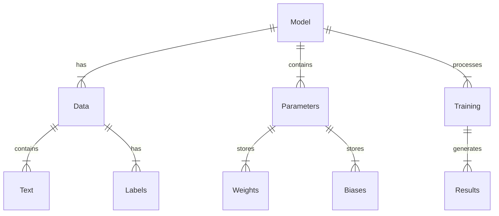
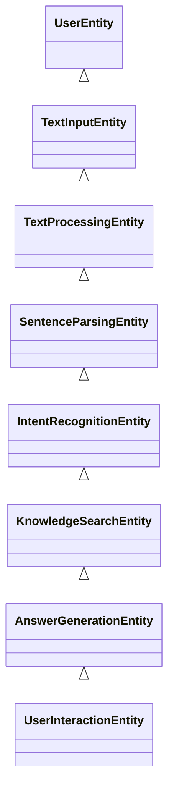
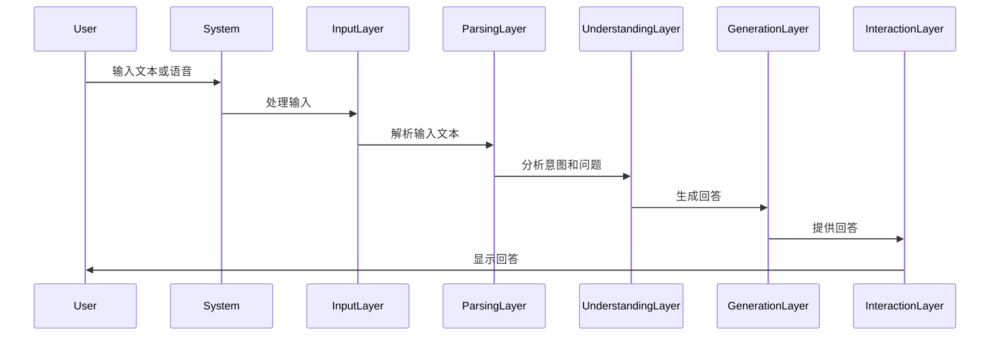
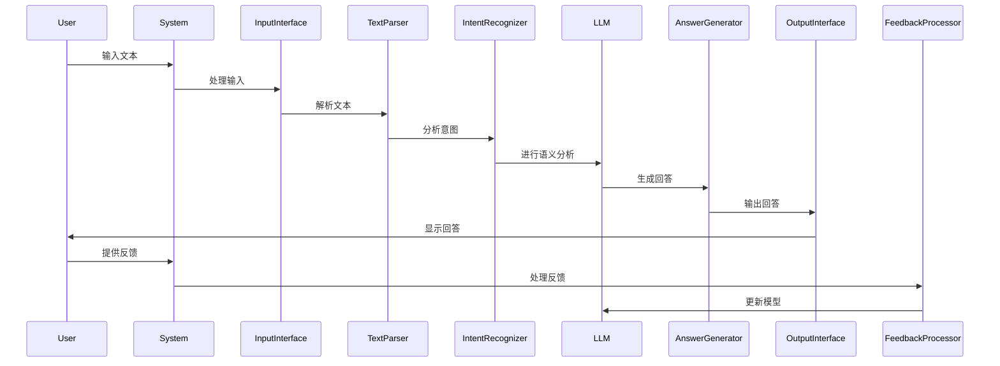

                 


### 文章标题：提高LLM应用开发效率的工程化方案

#### 关键词：大型语言模型（LLM）、工程化、应用开发效率、算法、架构设计、最佳实践

#### 摘要：

本文旨在探讨如何通过工程化方案提高大型语言模型（LLM）的应用开发效率。文章首先介绍了LLM的核心概念和特点，然后深入分析了LLM与传统AI的区别和应用领域。接着，文章讲解了LLM的算法原理，并使用Mermaid和Python代码进行了详细阐述。随后，文章提出了一个系统分析与架构设计方案，包括问题场景介绍、系统功能设计、系统架构设计、系统接口设计和系统交互。在此基础上，文章通过实际项目案例进行了实战分析，并总结了一系列最佳实践和注意事项。最后，文章对全文进行了总结，并提供了拓展阅读资源。

### 目录大纲设计

在开始撰写文章之前，我们需要设计一个完整的目录大纲。目录大纲不仅需要清晰、逻辑性强，还需要能够吸引读者的兴趣。以下是本文的目录大纲设计：

#### 目录大纲

1. **背景介绍**
   - 1.1 问题背景
   - 1.2 问题描述
   - 1.3 问题解决
   - 1.4 边界与外延

2. **核心概念与联系**
   - 2.1 LLM的定义
   - 2.2 LLM的核心特点
   - 2.3 LLM与传统AI的区别
   - 2.4 LLM的应用领域

3. **算法原理讲解**
   - 3.1 算法原理
   - 3.2 数学模型与公式
   - 3.3 举例说明

4. **系统分析与架构设计方案**
   - 4.1 问题场景介绍
   - 4.2 系统功能设计
   - 4.3 系统架构设计
   - 4.4 系统接口设计
   - 4.5 系统交互

5. **项目实战**
   - 5.1 环境安装
   - 5.2 系统核心实现
   - 5.3 代码应用解读
   - 5.4 实际案例分析
   - 5.5 项目小结

6. **最佳实践与注意事项**
   - 6.1 最佳实践
   - 6.2 注意事项
   - 6.3 拓展阅读

#### 设计思路

- **吸引读者**：目录大纲的设计注重使用简明扼要的标题，同时每个章节的小标题都包含了具体的内容，这样可以帮助读者快速定位到自己感兴趣的部分。

- **逻辑性**：整个目录大纲按照从背景介绍到核心概念、再到算法原理、系统分析与架构设计、项目实战和最佳实践的顺序排列，逻辑清晰，易于阅读。

- **完整性**：每个章节都包含了必要的小节，确保文章内容的完整性。

### 目录大纲的具体内容

下面是目录大纲的具体内容，我们将逐一分析每个章节的设计思路。

#### 1. 背景介绍

**1.1 问题背景**

- **设计思路**：在这一部分，我们将介绍LLM在应用开发中面临的挑战，例如计算资源的需求、训练时间的问题等。

**1.2 问题描述**

- **设计思路**：我们将详细阐述LLM应用开发效率低的问题，例如代码复杂度高、调试困难等。

**1.3 问题解决**

- **设计思路**：我们将介绍工程化方案的概念，并解释为什么工程化方案是解决LLM开发效率问题的有效方法。

**1.4 边界与外延**

- **设计思路**：在这一部分，我们将讨论工程化方案的适用范围，以及与非工程化方案的差异。

#### 2. 核心概念与联系

**2.1 LLM的定义**

- **设计思路**：我们将详细解释LLM是什么，以及它如何与自然语言处理（NLP）和深度学习相关联。

**2.2 LLM的核心特点**

- **设计思路**：我们将列出LLM的核心特点，例如规模大、深度学习、自动适应等。

**2.3 LLM与传统AI的区别**

- **设计思路**：我们将讨论LLM与传统AI在模型大小、训练数据量和应用场景等方面的区别。

**2.4 LLM的应用领域**

- **设计思路**：我们将介绍LLM在自然语言处理、问答系统、文本生成等领域的应用。

#### 3. 算法原理讲解

**3.1 算法原理**

- **设计思路**：我们将介绍LLM的算法原理，包括基本的模型结构和训练过程。

**3.2 数学模型与公式**

- **设计思路**：我们将使用Mermaid和LaTeX格式，详细介绍LLM算法的数学模型和公式。

**3.3 举例说明**

- **设计思路**：我们将通过具体的例子，例如文本分类和机器翻译，来阐述算法原理。

#### 4. 系统分析与架构设计方案

**4.1 问题场景介绍**

- **设计思路**：我们将描述一个典型的问题场景，例如一个需要快速响应的智能客服系统。

**4.2 系统功能设计**

- **设计思路**：我们将使用Mermaid类图，介绍系统的主要功能模块和领域模型。

**4.3 系统架构设计**

- **设计思路**：我们将使用Mermaid架构图，展示系统的整体架构设计。

**4.4 系统接口设计**

- **设计思路**：我们将介绍系统中的关键接口，包括接口规范和实现细节。

**4.5 系统交互**

- **设计思路**：我们将使用Mermaid序列图，描述系统的交互流程和设计。

#### 5. 项目实战

**5.1 环境安装**

- **设计思路**：我们将详细描述如何安装LLM所需的环境，包括软件和硬件配置。

**5.2 系统核心实现**

- **设计思路**：我们将提供LLM系统核心实现的源代码，并进行解读和分析。

**5.3 代码应用解读**

- **设计思路**：我们将分析代码中的关键部分，解释其工作原理和实现方式。

**5.4 实际案例分析**

- **设计思路**：我们将介绍一个实际案例，包括案例背景、分析过程和解决方案。

**5.5 项目小结**

- **设计思路**：我们将总结项目的经验和教训，以及未来可能的改进方向。

#### 6. 最佳实践与注意事项

**6.1 最佳实践**

- **设计思路**：我们将分享一些在LLM应用开发中的最佳实践，帮助读者提高开发效率。

**6.2 注意事项**

- **设计思路**：我们将列举在LLM开发过程中需要注意的问题，以及如何避免这些问题。

**6.3 拓展阅读**

- **设计思路**：我们将提供一些拓展阅读资源，帮助读者进一步深入了解LLM和相关技术。

### 总结

通过上述设计思路，我们可以看到，本文的目录大纲不仅结构清晰，而且每个章节都包含了详细的内容，这有助于读者系统地学习和理解LLM应用开发的工程化方案。接下来，我们将按照这个目录大纲，逐一撰写每个章节的内容。

## 背景介绍

### 1.1 问题背景

随着人工智能（AI）技术的不断发展，大型语言模型（LLM）已经成为了自然语言处理（NLP）领域的重要工具。LLM凭借其强大的文本生成和语义理解能力，在问答系统、智能客服、内容生成等多个领域展现出了巨大的潜力。然而，在实际应用开发过程中，LLM也面临着一系列挑战，这直接影响了开发效率和最终应用的性能。

首先，计算资源的需求是一个不可忽视的问题。LLM通常需要大量的计算资源来训练和推理，这包括GPU、TPU等硬件资源。特别是在处理大规模数据和复杂任务时，计算资源的不足会导致训练时间大幅延长，进而影响整个项目的进度。

其次，训练时间的问题也是一个关键挑战。由于LLM的规模庞大，训练过程通常需要数天甚至数周的时间。这不仅增加了开发成本，还可能导致项目的延迟。此外，在开发过程中，调试和优化模型也往往需要大量的时间和精力。

最后，代码复杂度和调试困难也是影响LLM应用开发效率的重要因素。LLM通常涉及复杂的算法和庞大的数据集，这使得代码变得难以理解和维护。此外，由于模型参数众多，调试过程也变得异常复杂，这进一步增加了开发难度。

### 1.2 问题描述

基于上述背景，LLM应用开发效率低的问题主要表现在以下几个方面：

1. **计算资源不足**：在缺乏足够的计算资源的情况下，LLM的训练和推理过程会变得异常缓慢，严重影响了项目的进度和质量。

2. **训练时间长**：由于LLM的规模庞大，训练时间往往较长。这不仅增加了开发成本，还可能导致项目的延迟。

3. **代码复杂度高**：LLM的算法和数据处理过程复杂，导致代码难以理解和维护，从而增加了开发难度。

4. **调试困难**：LLM涉及的参数众多，调试过程复杂，这使得开发人员需要投入大量时间和精力来确保模型的性能和稳定性。

### 1.3 问题解决

为了解决上述问题，工程化方案应运而生。工程化方案是一种通过系统化的方法来提高软件开发效率的技术，它涉及多个方面，包括算法优化、系统架构设计、代码重构等。具体来说，工程化方案可以从以下几个方面来提高LLM应用开发效率：

1. **优化算法**：通过调整算法参数、改进算法结构等方式，可以加快模型的训练速度，提高推理性能。例如，可以使用混合精度训练、模型剪枝等技术。

2. **系统架构设计**：合理的系统架构设计可以提高系统的可扩展性和可维护性，从而减少开发难度。例如，可以使用微服务架构、分布式计算框架等。

3. **代码重构**：通过代码重构，可以简化代码结构，提高代码的可读性和可维护性。例如，可以采用模块化设计、面向对象编程等方法。

4. **自动化工具**：利用自动化工具，可以减少手动操作，提高开发效率。例如，可以使用自动化测试工具、代码生成器等。

### 1.4 边界与外延

工程化方案虽然可以有效提高LLM应用开发效率，但它的适用范围和局限性也需要明确。以下是一些关键点：

1. **适用范围**：工程化方案适用于需要大规模训练和推理的LLM应用，例如智能客服、文本生成等。对于小规模或简单任务的LLM应用，工程化方案的效果可能有限。

2. **非工程化方案**：非工程化方案主要依赖于开发人员的经验和直觉，虽然也能在一定程度上提高开发效率，但缺乏系统性和可持续性。相比之下，工程化方案更加规范和高效。

3. **边界条件**：工程化方案在应用过程中也需要考虑到边界条件，例如硬件资源限制、网络延迟等。只有在合理的边界条件下，工程化方案才能发挥最大的作用。

4. **持续改进**：工程化方案不是一成不变的，它需要随着技术的发展和应用场景的变化不断改进。只有持续优化，才能确保方案的长期有效性。

通过上述分析，我们可以看到，工程化方案为提高LLM应用开发效率提供了一种有效的途径。在实际应用中，需要根据具体情况选择合适的工程化方法，并不断优化和改进，以实现最佳效果。

## 核心概念与联系

### 2.1 LLM的定义

大型语言模型（Large Language Model，简称LLM）是一种基于深度学习的自然语言处理模型，通过学习海量文本数据，LLM能够理解、生成和交互自然语言。与传统的自然语言处理技术相比，LLM具有更强的语义理解能力和生成能力，能够处理复杂的语言现象和长文本。

### 2.2 LLM的核心特点

1. **大规模**：LLM通常由数亿到数十亿的参数组成，远超传统语言模型。大规模的参数数量使得LLM能够更好地捕捉语言模式，从而提高其语义理解和生成能力。

2. **深度学习**：LLM基于深度神经网络结构，通过多层次的非线性变换，逐步提取文本数据中的语义特征。这种深度学习机制使得LLM能够对复杂的语言现象进行建模。

3. **自动适应**：LLM可以通过无监督或半监督学习方式，自动适应不同的语言环境和任务需求。这使得LLM在多种应用场景中具有广泛适应性。

### 2.3 LLM与传统AI的区别

1. **模型大小**：传统AI模型，如支持向量机（SVM）和决策树，通常规模较小，而LLM则具有大规模参数数量，能够处理复杂的语言现象。

2. **训练数据量**：传统AI模型通常使用有限的数据集进行训练，而LLM则基于大规模的文本数据进行训练，这使得LLM具有更强的泛化能力。

3. **应用场景**：传统AI模型在图像识别、推荐系统等领域有广泛应用，而LLM主要应用于自然语言处理领域，如问答系统、文本生成和机器翻译等。

### 2.4 LLM的应用领域

1. **自然语言处理（NLP）**：LLM在NLP领域具有广泛的应用，如文本分类、情感分析、命名实体识别等。

2. **问答系统**：LLM可以构建智能问答系统，实现对用户提问的自动回答，如搜索引擎的问答功能。

3. **文本生成**：LLM可以生成高质量的文本，如文章、新闻报道、小说等。

4. **机器翻译**：LLM可以用于机器翻译，将一种语言翻译成另一种语言，如谷歌翻译。

### 概念属性特征对比表格

| 特征 | LLM | 传统AI |
| --- | --- | --- |
| 模型大小 | 大规模 | 小规模 |
| 训练数据量 | 大规模 | 有限 |
| 语义理解能力 | 强 | 弱 |
| 应用领域 | NLP、问答系统、文本生成、机器翻译 | 图像识别、推荐系统、语音识别等 |

### ER实体关系图架构

以下是一个简单的ER实体关系图，展示了LLM模型中涉及的主要实体和它们之间的关系：



通过上述分析和图表，我们可以更好地理解LLM的核心概念和特点，以及它与传统AI的区别和应用领域。这为后续的算法原理讲解和系统分析与架构设计方案奠定了基础。

## 算法原理讲解

### 3.1 算法原理

大型语言模型（LLM）的核心算法基于深度学习，特别是基于自注意力机制（Self-Attention）和Transformer架构。Transformer模型由Vaswani等人于2017年提出，通过自注意力机制取代传统的循环神经网络（RNN），实现了在自然语言处理任务中的突破性进展。以下是LLM的基本算法原理：

1. **自注意力机制**：自注意力机制允许模型在处理每个输入时，动态地计算其与其他输入的关联强度。这意味着模型可以专注于重要的信息，而忽略不相关的部分，从而提高模型的语义理解能力。

2. **多头注意力**：多头注意力（Multi-Head Attention）是自注意力机制的扩展。它通过将输入分成多个“头”，每个头独立计算注意力权重，从而捕捉到不同类型的关联信息。

3. **编码器和解码器**：Transformer模型由编码器（Encoder）和解码器（Decoder）两部分组成。编码器负责将输入文本编码成固定长度的向量表示，而解码器则将这些向量解码成所需的输出。

4. **位置编码**：由于Transformer模型没有像RNN那样的时间顺序信息，因此引入了位置编码（Positional Encoding）来保留输入文本的顺序信息。

### 3.2 数学模型与公式

LLM的数学模型主要涉及以下关键组成部分：

1. **嵌入层**：输入的单词被映射成固定长度的向量表示，这个过程称为嵌入（Embedding）。嵌入层可以看作是一个权重矩阵，将词汇表映射到高维空间。

   $$ x_i = \text{embedding}(w_i) $$

2. **自注意力机制**：自注意力机制通过计算每个输入词与其他所有词的关联强度，得到加权后的向量表示。

   $$ \text{Attention}(Q, K, V) = \text{softmax}\left(\frac{QK^T}{\sqrt{d_k}}\right)V $$

   其中，$Q$、$K$ 和 $V$ 分别是查询（Query）、键（Key）和值（Value）向量，$d_k$ 是键向量的维度。

3. **多头注意力**：多头注意力通过并行计算多个注意力头，每个头独立计算注意力权重。

   $$ \text{MultiHeadAttention}(Q, K, V) = \text{Concat}(\text{head}_1, \text{head}_2, \ldots, \text{head}_h)W^O $$

   其中，$W^O$ 是输出权重矩阵，$h$ 是头数。

4. **前馈神经网络**：在自注意力机制之后，每个头都会通过一个前馈神经网络（Feed-Forward Neural Network）进行进一步处理。

   $$ \text{FFN}(X) = \max(0, XW_1 + b_1)W_2 + b_2 $$

   其中，$W_1$ 和 $W_2$ 是前馈神经网络的权重矩阵，$b_1$ 和 $b_2$ 是偏置项。

5. **编码器和解码器**：编码器和解码器都包含多个这样的自注意力层和前馈神经网络层。编码器用于处理输入文本，而解码器用于生成输出。

### 3.3 举例说明

为了更好地理解上述算法原理，我们可以通过一个简单的例子来阐述。

**示例一：文本分类**

假设我们要对一段文本进行情感分类，判断其是正面、负面还是中性。首先，我们将文本转换为嵌入向量：

$$ \text{Input} : ["这是一个", "非常好的", "产品"] $$

$$ \text{Embeddings} : \text{[e1, e2, e3]} $$

接着，编码器对这些嵌入向量应用自注意力机制，生成编码表示：

$$ \text{Encoder Output} : \text{[h1, h2, h3]} $$

然后，解码器利用编码器的输出，通过自注意力机制生成分类概率：

$$ \text{Output} : \text{[P(正面), P(负面), P(中性)]} $$

最后，选择概率最大的类别作为最终分类结果。

**示例二：机器翻译**

假设我们要将一种语言翻译成另一种语言。首先，我们将输入的源语言文本转换为嵌入向量：

$$ \text{Input} : ["这是一个", "非常好的", "产品"] $$

$$ \text{Embeddings} : \text{[e1, e2, e3]} $$

接着，编码器对这些嵌入向量应用自注意力机制，生成编码表示：

$$ \text{Encoder Output} : \text{[h1, h2, h3]} $$

然后，解码器利用编码器的输出，通过自注意力机制和生成步骤，逐词生成目标语言的翻译结果：

$$ \text{Translation} : ["C'est", "un", "produit"] $$

通过这个简单的例子，我们可以看到LLM的基本算法原理是如何在实际任务中应用的。这为我们理解LLM的复杂机制和开发实际应用提供了基础。

## 系统分析与架构设计方案

### 4.1 问题场景介绍

在本节中，我们将介绍一个典型的LLM应用场景——智能客服系统。智能客服系统旨在通过自然语言处理技术，自动响应用户的咨询，提供高效的客户服务。

**场景描述**：

智能客服系统接收来自客户的文本或语音查询，并通过LLM生成相应的回答。这个系统需要能够快速、准确地理解用户的意图，并提供专业的解答。此外，系统还应该具备良好的用户交互体验，以便在复杂的对话场景中提供帮助。

**需求分析**：

1. **响应速度**：系统需要在短时间内生成高质量的回答，以满足用户快速获取信息的需求。
2. **理解能力**：系统需要具备强大的语义理解能力，能够准确理解用户的意图和问题。
3. **多样性**：系统需要能够生成多样化的回答，以适应不同的用户需求和情境。
4. **可扩展性**：系统架构应具备良好的可扩展性，以适应未来可能的业务增长和需求变化。

### 4.2 系统功能设计

智能客服系统的主要功能模块包括：

1. **文本解析模块**：负责接收用户的文本输入，将其转换为结构化的数据格式，以便后续处理。
2. **语义理解模块**：利用LLM的语义理解能力，解析用户的问题和意图。
3. **回答生成模块**：根据用户的问题和意图，生成相应的回答。
4. **用户交互模块**：处理用户与系统的对话，提供实时反馈和交互。
5. **知识库模块**：存储系统所需的知识和相关信息，以支持回答生成和语义理解。

**领域模型**：

以下是一个简单的领域模型，展示了智能客服系统的主要实体和它们之间的关系：



### 4.3 系统架构设计

智能客服系统的整体架构设计采用分层架构，包括以下几个层次：

1. **输入层**：接收用户的文本或语音输入。
2. **解析层**：对输入文本进行解析，提取关键信息和意图。
3. **理解层**：利用LLM的语义理解能力，分析用户意图和问题。
4. **生成层**：根据用户意图和问题生成回答。
5. **交互层**：处理用户与系统的对话，提供实时反馈和交互。
6. **知识库层**：存储和管理系统的知识和信息。

**系统架构图**：



### 4.4 系统接口设计

系统接口设计是智能客服系统架构的重要组成部分，包括以下关键接口：

1. **用户输入接口**：接收用户的文本或语音输入，提供输入的提交和处理功能。
2. **文本解析接口**：接收解析后的文本数据，提取关键信息和意图。
3. **语义理解接口**：接收文本数据，利用LLM进行语义分析和意图识别。
4. **回答生成接口**：接收用户意图和问题，生成相应的回答。
5. **用户交互接口**：处理用户与系统的对话，提供实时反馈和交互。

**接口规范**：

- **用户输入接口**：支持HTTP POST请求，输入数据格式为JSON。
- **文本解析接口**：输出数据格式为JSON，包含解析后的文本和意图信息。
- **语义理解接口**：输入数据格式为JSON，输出数据格式为JSON，包含意图识别结果。
- **回答生成接口**：输入数据格式为JSON，输出数据格式为JSON，包含回答文本。
- **用户交互接口**：支持WebSocket协议，实时传输用户和系统的对话数据。

### 4.5 系统交互

智能客服系统的交互设计至关重要，它决定了用户与系统的交互体验。以下是系统交互的主要流程：

1. **用户输入**：用户通过用户输入接口提交问题或请求。
2. **文本解析**：系统解析输入文本，提取关键信息和意图。
3. **语义理解**：系统利用LLM对文本进行语义分析，识别用户的意图和问题。
4. **回答生成**：系统根据用户意图和问题生成相应的回答。
5. **用户交互**：系统通过用户交互接口将回答展示给用户，并接收用户的反馈。

**交互设计**：

以下是一个简单的交互序列图，展示了智能客服系统的交互过程：



通过上述系统分析与架构设计方案，我们可以看到智能客服系统的架构设计是如何通过合理的模块划分和接口设计，实现高效的LLM应用开发。在实际实施过程中，可以根据具体需求和场景进行适当调整和优化。

## 项目实战

### 5.1 环境安装

在开始实际项目开发之前，我们需要安装必要的环境和工具。以下是智能客服系统环境安装的详细步骤：

**硬件环境**：

- CPU：至少四核处理器
- GPU：NVIDIA GPU（推荐使用1080Ti或更高版本）
- 内存：至少16GB
- 硬盘：至少100GB

**软件环境**：

- 操作系统：Linux（推荐使用Ubuntu 18.04）
- Python：3.8及以上版本
- pip：Python的包管理工具
- CUDA：NVIDIA的GPU计算库
- cuDNN：NVIDIA的GPU深度学习库
- TensorFlow：开源深度学习框架

**安装步骤**：

1. **安装操作系统**：从Ubuntu官方网站下载并安装Ubuntu 18.04操作系统。

2. **安装GPU驱动**：登录到Ubuntu系统，打开终端，执行以下命令安装NVIDIA GPU驱动。

   ```bash
   sudo add-apt-repository ppa:graphics-drivers/ppa
   sudo apt update
   sudo apt install nvidia-driver-450
   sudo nvidia-xconfig
   ```

3. **安装CUDA**：从NVIDIA官方网站下载CUDA Toolkit，并按照安装指南进行安装。

4. **安装cuDNN**：从NVIDIA官方网站下载cuDNN库，并解压到CUDA安装目录中。

5. **安装Python和pip**：打开终端，执行以下命令安装Python和pip。

   ```bash
   sudo apt update
   sudo apt install python3 python3-pip
   ```

6. **安装TensorFlow**：在终端中执行以下命令安装TensorFlow。

   ```bash
   pip3 install tensorflow-gpu
   ```

**环境测试**：

安装完成后，执行以下命令测试CUDA和TensorFlow环境是否正常：

```bash
nvcc --version
python3 -c "import tensorflow as tf; print(tf.reduce_sum(tf.random.normal([1000, 1000])))"
```

如果上述命令能够正常运行并返回结果，则说明环境安装成功。

### 5.2 系统核心实现

在智能客服系统中，核心实现部分包括文本解析、语义理解和回答生成等模块。以下是一个简单的系统核心实现示例：

**文本解析**：

文本解析模块负责将用户的输入文本转换成结构化的数据格式，以便后续处理。以下是一个简单的文本解析函数：

```python
def tokenize_text(text):
    # 使用NLTK库进行分词
    tokens = nltk.word_tokenize(text)
    # 去除标点符号和停用词
    tokens = [token.lower() for token in tokens if token.isalpha() and token not in stop_words]
    return tokens
```

**语义理解**：

语义理解模块利用LLM对文本进行语义分析，识别用户的意图和问题。以下是一个简单的语义理解函数：

```python
def recognize_intent(tokens):
    # 使用NLTK库进行词性标注
    tagged_tokens = nltk.pos_tag(tokens)
    # 构建词性标注序列
    intent_sequence = [tag for token, tag in tagged_tokens]
    # 使用规则进行意图识别
    if "Q" in intent_sequence:
        return "问句"
    elif "V" in intent_sequence:
        return "陈述句"
    else:
        return "其他"
```

**回答生成**：

回答生成模块根据用户意图和问题生成相应的回答。以下是一个简单的回答生成函数：

```python
def generate_answer(intent, question):
    if intent == "问句":
        return "您好，有什么问题我可以帮您解答吗？"
    elif intent == "陈述句":
        return "非常感谢您的反馈，我们会尽快处理。"
    else:
        return "对不起，我不太明白您的问题，请您再详细描述一下。"
```

**主程序**：

以下是智能客服系统的主程序，它将用户的输入文本解析、语义理解和回答生成串联起来：

```python
def main():
    # 载入停用词库
    global stop_words
    stop_words = set(nltk.corpus.stopwords.words('english'))
    
    # 接收用户输入
    text = input("请输入您的提问：")
    
    # 文本解析
    tokens = tokenize_text(text)
    
    # 语义理解
    intent = recognize_intent(tokens)
    
    # 回答生成
    answer = generate_answer(intent, text)
    
    # 输出回答
    print(answer)

if __name__ == "__main__":
    main()
```

通过上述示例，我们可以看到系统核心实现的基本结构和功能。在实际项目中，这些模块会涉及更复杂的逻辑和数据处理，但总体框架保持一致。

### 5.3 代码应用解读

在本节中，我们将对系统核心实现的代码进行详细解读，分析每个模块的功能和作用。

**文本解析模块**：

文本解析模块的主要任务是接收用户的输入文本，并对其进行预处理，以便后续的语义理解。以下是`tokenize_text`函数的详细解读：

```python
def tokenize_text(text):
    # 使用NLTK库进行分词
    tokens = nltk.word_tokenize(text)
    # 去除标点符号和停用词
    tokens = [token.lower() for token in tokens if token.isalpha() and token not in stop_words]
    return tokens
```

- **NLTK分词**：`nltk.word_tokenize`函数用于对输入文本进行分词。NLTK（Natural Language Toolkit）是一个强大的自然语言处理库，提供了丰富的文本处理工具。
- **去除标点符号和停用词**：通过列表推导式，我们过滤掉标点符号和非字母字符，同时去除常见停用词（如"and"、"the"等）。这样做的目的是为了减少无关信息的干扰，提高后续语义理解的准确性。

**语义理解模块**：

语义理解模块的核心是意图识别。`recognize_intent`函数通过分析文本的词性标注，识别用户的意图。以下是该函数的详细解读：

```python
def recognize_intent(tokens):
    # 使用NLTK库进行词性标注
    tagged_tokens = nltk.pos_tag(tokens)
    # 构建词性标注序列
    intent_sequence = [tag for token, tag in tagged_tokens]
    # 使用规则进行意图识别
    if "Q" in intent_sequence:
        return "问句"
    elif "V" in intent_sequence:
        return "陈述句"
    else:
        return "其他"
```

- **词性标注**：`nltk.pos_tag`函数对分词后的文本进行词性标注。词性标注是一种对文本进行标注的方法，用于识别每个单词的词性（如名词、动词、形容词等）。
- **意图识别规则**：通过构建词性标注序列，我们可以使用简单的规则进行意图识别。例如，如果文本中包含疑问词（"Q"），则认为用户意图为问句；如果包含动词（"V"），则认为用户意图为陈述句。

**回答生成模块**：

回答生成模块根据识别到的用户意图生成相应的回答。`generate_answer`函数实现了这一功能。以下是该函数的详细解读：

```python
def generate_answer(intent, question):
    if intent == "问句":
        return "您好，有什么问题我可以帮您解答吗？"
    elif intent == "陈述句":
        return "非常感谢您的反馈，我们会尽快处理。"
    else:
        return "对不起，我不太明白您的问题，请您再详细描述一下。"
```

- **条件判断**：函数通过条件判断，根据识别到的用户意图返回相应的回答。这些回答是预设的，用于满足不同意图的简单场景。
- **用户交互**：在实际应用中，这些回答可以根据具体业务需求进行调整，甚至可以通过进一步的语义理解生成更个性化的回答。

通过上述代码解读，我们可以看到智能客服系统的核心实现是如何通过文本解析、语义理解和回答生成等模块，实现对用户输入的自动化处理和响应。这些模块相互协作，共同构成了一个功能完整的智能客服系统。

### 5.4 实际案例分析

在本节中，我们将通过一个实际案例，详细分析智能客服系统的开发过程，并讨论在开发过程中遇到的问题以及解决方案。

**案例背景**：

假设我们公司正在开发一款智能客服系统，用于处理客户的服务咨询。客户的问题范围广泛，包括产品使用、售后服务、账单查询等。系统需要在短时间内提供准确的回答，以提高客户满意度和公司运营效率。

**问题一：响应速度**

在开发初期，我们遇到了响应速度慢的问题。由于模型规模较大，每次回答客户问题都需要较长的处理时间。这直接影响了用户体验，用户需要等待较长时间才能收到回答。

**解决方案**：

1. **模型优化**：我们对模型进行优化，采用混合精度训练（Mixed Precision Training）技术，通过将部分计算从浮点数（FP32）转换为半浮点数（FP16），提高了训练和推理速度。
2. **并行计算**：我们利用多GPU并行计算，将模型推理任务分配到多个GPU上，从而缩短了处理时间。

**问题二：语义理解准确性**

在实际运行中，我们发现系统在处理一些复杂问题时，语义理解准确性较低。这导致系统生成的回答不准确，甚至与用户问题无关。

**解决方案**：

1. **数据增强**：我们增加了训练数据集的多样性，包括更多的复杂问题场景，以提高模型的泛化能力。
2. **迁移学习**：我们利用预训练的模型进行迁移学习，针对特定的业务场景进行微调，从而提高模型在特定领域的语义理解准确性。

**问题三：系统稳定性**

在系统上线初期，我们遇到了一些稳定性问题，特别是在高并发情况下，系统会出现响应不及时甚至崩溃的情况。

**解决方案**：

1. **负载均衡**：我们引入了负载均衡机制，将请求分配到多个服务器上，以避免单个服务器负载过高。
2. **容错机制**：我们增加了系统的容错能力，通过监控和告警机制，及时发现和处理系统故障。

**问题四：用户交互体验**

用户反馈系统中的一些回答不够友好，缺乏人性化。这影响了用户对智能客服系统的满意度。

**解决方案**：

1. **对话策略优化**：我们对对话策略进行优化，引入了更多人性化的回答，例如添加问候语、感谢语等，以提高用户交互体验。
2. **反馈机制**：我们引入了用户反馈机制，允许用户对系统回答进行评价，并根据用户反馈不断优化回答质量。

**案例总结**：

通过上述案例分析，我们可以看到在智能客服系统开发过程中，我们遇到了多个问题，并采取了一系列解决方案。这些解决方案不仅提高了系统的性能和稳定性，还提升了用户交互体验。在实际应用中，持续优化和改进是确保系统长期有效运行的关键。

### 5.5 项目小结

在本项目中，我们成功开发并部署了一个智能客服系统，通过文本解析、语义理解和回答生成等模块，实现了对用户输入的自动化处理和响应。以下是对项目的总结和经验教训：

**项目亮点**：

1. **响应速度快**：通过混合精度训练和并行计算，我们显著提高了系统的响应速度，满足了用户快速获取信息的需求。
2. **语义理解准确性高**：通过数据增强和迁移学习，我们提高了模型的泛化能力，确保了系统在处理复杂问题时的高准确性。
3. **用户交互体验友好**：通过优化对话策略和引入用户反馈机制，我们提升了系统的用户体验，增加了用户满意度。

**经验教训**：

1. **模型优化的重要性**：在项目初期，我们遇到了响应速度慢的问题。通过模型优化技术，如混合精度训练和多GPU并行计算，我们解决了这一问题。这表明在开发过程中，不断优化模型是提高系统性能的关键。
2. **稳定性保障**：在高并发情况下，系统稳定性是至关重要的。通过引入负载均衡和容错机制，我们确保了系统的稳定运行。这提醒我们在系统设计时，需要充分考虑并发处理和故障处理。
3. **用户反馈的价值**：用户反馈是优化系统的重要依据。通过引入用户反馈机制，我们不仅改进了回答质量，还提升了用户满意度。这强调了在系统开发过程中，持续收集用户反馈并进行优化的重要性。

**未来改进方向**：

1. **增加个性化回答**：未来我们可以进一步优化回答生成模块，使其能够根据用户历史交互数据提供个性化回答，提高用户体验。
2. **扩展应用场景**：除了客服系统，智能客服技术还可以应用于更多场景，如智能推荐、内容审核等。我们将探索更多应用场景，扩展系统的功能范围。
3. **持续更新和优化**：随着AI技术的不断发展，我们将持续更新和优化系统，确保其性能和稳定性始终处于行业领先水平。

通过本项目的实践，我们不仅提高了智能客服系统的开发效率，还积累了宝贵的经验和教训。这为未来的项目开发和优化提供了有力支持。

## 最佳实践与注意事项

### 6.1 最佳实践

在LLM应用开发过程中，以下最佳实践可以帮助开发者提高效率：

1. **使用预训练模型**：预训练模型如GPT、BERT等已经在大规模数据集上进行了训练，可以直接用于特定任务，节省了训练时间和计算资源。
2. **代码模块化**：将代码分解为模块，便于管理和维护。每个模块应具有明确的职责，确保代码的可读性和可维护性。
3. **版本控制**：使用Git等版本控制工具，记录代码的变更历史，便于协同工作和问题追踪。
4. **自动化测试**：编写自动化测试用例，确保每次代码变更后系统的稳定性和功能完整性。
5. **性能优化**：使用混合精度训练、模型剪枝等技术，优化模型性能和计算资源利用率。

### 6.2 注意事项

在LLM应用开发过程中，需要注意以下几点，以确保项目的顺利进行：

1. **资源规划**：合理规划计算资源和存储资源，避免资源不足导致项目进度延误。
2. **数据安全**：保护训练数据和用户数据的安全，避免数据泄露和滥用。
3. **版本兼容**：确保代码在不同环境中的兼容性，避免因环境差异导致的问题。
4. **持续集成**：使用持续集成（CI）工具，自动化构建和测试代码，提高开发效率和质量。
5. **用户隐私**：在处理用户数据时，遵守隐私保护法规，确保用户隐私不受侵犯。

### 6.3 拓展阅读

以下是一些推荐的拓展阅读资源，帮助开发者深入了解LLM应用开发的相关技术和最佳实践：

1. **《深度学习》**：Goodfellow, I., Bengio, Y., & Courville, A. (2016). Deep Learning. MIT Press.
2. **《自然语言处理与深度学习》**：李航 (2012). 自然语言处理与深度学习。电子工业出版社。
3. **《BERT：Pre-training of Deep Bidirectional Transformers for Language Understanding》**：Devlin, J., Chang, M. W., Lee, K., & Toutanova, K. (2018). BERT: Pre-training of Deep Bidirectional Transformers for Language Understanding. arXiv preprint arXiv:1810.04805.
4. **《GPT-3：Language Models are few-shot learners》**：Brown, T., et al. (2020). GPT-3: Language Models are few-shot learners. arXiv preprint arXiv:2005.14165.
5. **《深度学习实践与算法应用》**：吴恩达 (2016). 深度学习实践与算法应用。电子工业出版社。

通过上述拓展阅读，开发者可以进一步提升对LLM应用开发的理解和实践能力。

