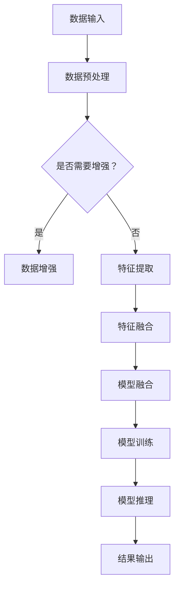
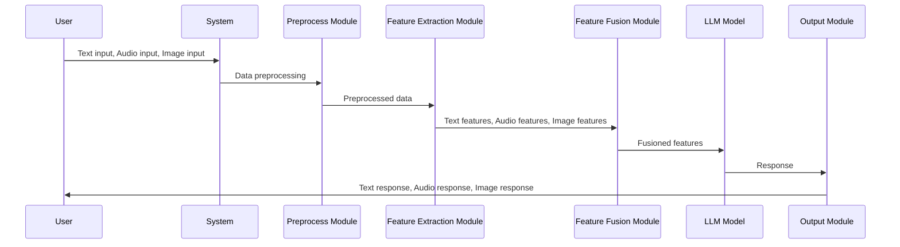
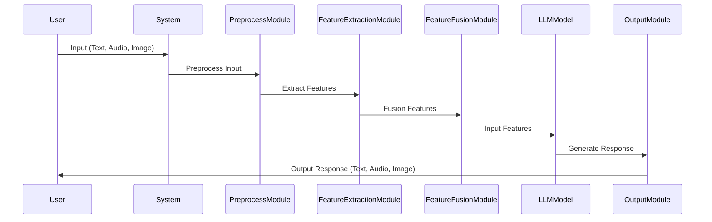

                 

### 提高LLM应用的多模态交互效率

#### 关键词

- Large Language Model (LLM)
- Multimodal Interaction
- Efficiency Improvement
- Algorithm Optimization
- System Design

#### 摘要

随着人工智能技术的迅猛发展，大型语言模型（LLM）在自然语言处理（NLP）领域取得了显著成果。然而，在多模态交互应用中，如何提高LLM的交互效率成为了一个重要课题。本文将探讨多模态交互中LLM的挑战，深入分析其核心概念和原理，提出算法优化策略和系统设计方法，并通过具体案例进行实践解析，旨在为提升LLM应用的多模态交互效率提供理论指导和实践参考。

## 第一部分: 问题背景与核心概念

### 1.1 问题背景

#### 1.1.1 人工智能与多模态交互的发展

人工智能（AI）作为当今科技领域的热点，已经渗透到各行各业。随着深度学习技术的不断成熟，大型语言模型（LLM）在自然语言处理（NLP）领域取得了显著成果。LLM通过学习大量文本数据，能够生成流畅、自然的语言响应，广泛应用于聊天机器人、文本摘要、机器翻译等领域。

与此同时，多模态交互技术也逐渐兴起。多模态交互结合了文本、语音、图像、视频等多种数据类型，使计算机能够更全面地理解用户意图，提供更加丰富和直观的交互体验。例如，在智能助手、虚拟现实、医疗诊断等领域，多模态交互技术已经显示出巨大的应用潜力。

#### 1.1.2 大语言模型（LLM）的应用现状

目前，LLM在多模态交互应用中已经取得了一些突破。例如，微软的小冰通过结合文本和图像，实现了更加自然和丰富的聊天交互；OpenAI的GPT-3则通过文本和语音的融合，提供了更加流畅的语音助手体验。然而，尽管LLM在多模态交互中展现了强大的能力，其交互效率仍然面临诸多挑战。

#### 1.1.3 多模态交互面临的挑战

多模态交互涉及多种数据类型的处理和融合，这对LLM的交互效率提出了更高的要求。具体来说，挑战包括：

1. **数据同步与融合**：不同模态的数据在时间和空间上可能存在差异，如何实现准确的数据同步和有效融合是一个关键问题。
2. **计算资源消耗**：多模态交互需要处理大量的数据，计算资源消耗较大，如何优化算法和系统设计以提高交互效率成为关键。
3. **理解与生成**：LLM在理解和生成多模态内容时，可能存在理解偏差和生成质量下降的问题，如何提高其理解与生成能力是亟待解决的问题。

### 1.2 核心概念

#### 1.2.1 大语言模型（LLM）概述

大语言模型（LLM）是一种基于深度学习的自然语言处理模型，通过学习大量文本数据，能够生成流畅、自然的语言响应。LLM的核心组件包括：

- **词向量表示**：将文本中的单词映射到高维空间中的向量表示，实现语义理解。
- **神经网络架构**：如Transformer、BERT等，用于捕捉文本中的长距离依赖关系和复杂语义。
- **训练与优化**：通过大规模文本数据进行训练，不断优化模型参数，提高语言生成能力。

#### 1.2.2 多模态交互技术解析

多模态交互技术涉及多种数据类型的处理和融合，主要包括以下方面：

- **文本处理**：文本分类、情感分析、命名实体识别等，用于理解用户输入。
- **语音处理**：语音识别、语音合成、语音情感分析等，用于语音交互。
- **图像处理**：目标检测、图像分类、人脸识别等，用于图像交互。
- **视频处理**：视频分类、视频分割、动作识别等，用于视频交互。

#### 1.2.3 交互效率的定义与评价指标

交互效率是指用户与系统进行交互所需的时间和资源。在多模态交互中，交互效率的评价指标包括：

- **响应时间**：系统接收到用户输入并生成响应所需的时间。
- **资源消耗**：系统在处理多模态数据时所需的计算资源和内存消耗。
- **用户满意度**：用户对交互体验的主观评价。

### 1.3 概念联系与关系图

#### 1.3.1 LLM与多模态交互的关系

LLM作为多模态交互的核心组件，负责处理和理解多种数据类型，生成合适的语言响应。多模态交互技术则提供了丰富的数据输入和输出方式，与LLM协同工作，实现更自然、更丰富的交互体验。

#### 1.3.2 相关概念对比分析

| 概念                 | 描述                                                         |
|----------------------|--------------------------------------------------------------|
| 大语言模型（LLM）   | 一种基于深度学习的自然语言处理模型，能够生成流畅、自然的语言响应。 |
| 多模态交互         | 结合文本、语音、图像、视频等多种数据类型的交互技术。           |
| 文本处理             | 文本分类、情感分析、命名实体识别等，用于理解用户输入。         |
| 语音处理             | 语音识别、语音合成、语音情感分析等，用于语音交互。             |
| 图像处理             | 目标检测、图像分类、人脸识别等，用于图像交互。                 |
| 视频处理             | 视频分类、视频分割、动作识别等，用于视频交互。                 |

#### 1.3.3 Mermaid ER实体关系图

```mermaid
erDiagram
    LLM -->|处理| 多模态交互
    多模态交互 -->|融合| 文本处理
    多模态交互 -->|融合| 语音处理
    多模态交互 -->|融合| 图像处理
    多模态交互 -->|融合| 视频处理
```

### 1.4 边界与外延

#### 1.4.1 LLM应用的范围

LLM在多模态交互中的应用范围广泛，包括但不限于智能助手、虚拟现实、医疗诊断、教育辅导等领域。

#### 1.4.2 多模态交互的技术边界

多模态交互涉及多种数据类型的处理和融合，技术边界包括：

- **数据同步与融合**：不同模态的数据在时间和空间上可能存在差异，如何实现准确的数据同步和有效融合是一个关键问题。
- **计算资源消耗**：多模态交互需要处理大量的数据，计算资源消耗较大，如何优化算法和系统设计以提高交互效率成为关键。
- **理解与生成**：LLM在理解和生成多模态内容时，可能存在理解偏差和生成质量下降的问题，如何提高其理解与生成能力是亟待解决的问题。

#### 1.4.3 提高交互效率的方法与限制

提高LLM应用的多模态交互效率的方法包括：

- **算法优化**：通过改进算法，提高数据处理和融合的效率。
- **系统设计**：优化系统架构，降低计算资源消耗，提高响应速度。
- **模型压缩**：通过模型压缩技术，减小模型规模，降低计算复杂度。

然而，提高交互效率也存在一定的限制，包括：

- **数据质量**：高质量的数据是提高交互效率的基础，数据质量差可能导致交互效果下降。
- **技术成熟度**：某些算法和技术尚未成熟，可能存在性能瓶颈。
- **用户需求**：用户需求多样，如何满足不同用户的需求也是一个挑战。

### 1.5 本章小结

本章首先介绍了人工智能与多模态交互的发展背景，分析了LLM在多模态交互中的应用现状和面临的挑战。接着，深入探讨了核心概念，包括LLM的概述、多模态交互技术的解析以及交互效率的定义与评价指标。最后，通过Mermaid ER实体关系图展示了LLM与多模态交互的关系，并对相关概念进行了对比分析。本章内容为后续章节的讨论奠定了基础。

## 第二部分: 多模态交互算法原理

### 2.1 基础算法介绍

#### 2.1.1 多模态数据处理

多模态数据处理是提高LLM应用多模态交互效率的关键环节。其核心在于如何有效地融合和处理来自不同模态的数据。以下是一些常见的技术和算法：

- **数据预处理**：对文本、语音、图像和视频等多模态数据进行预处理，包括数据清洗、数据增强、特征提取等。

- **特征融合**：将不同模态的特征进行融合，以生成综合的特征向量。常见的融合方法包括拼接、加权融合、注意力机制等。

- **模型融合**：将不同的深度学习模型进行融合，以实现对多模态数据的综合处理。常见的融合方法包括串联、并行、级联等。

#### 2.1.2 LLM优化算法

LLM优化算法的核心目标是提高模型的性能和交互效率。以下是一些常见的优化方法：

- **训练优化**：通过调整训练策略，如学习率调整、批量大小、正则化等，提高模型的训练效果。

- **推理优化**：在模型推理阶段，通过优化计算流程、减少内存占用等方法，提高模型响应速度。

- **量化与剪枝**：通过模型量化、剪枝等方法，减小模型规模，降低计算复杂度，提高模型效率。

#### 2.1.3 算法选择与组合

在多模态交互中，选择和组合合适的算法是实现高效交互的关键。以下是一些常见的算法选择和组合策略：

- **基于任务的算法选择**：根据具体任务的需求，选择合适的算法和模型。例如，在文本分类任务中，选择文本处理算法；在语音助手任务中，选择语音处理算法。

- **多任务学习**：通过多任务学习，共享模型参数和计算资源，提高模型在不同任务上的性能。

- **自适应算法选择**：根据交互过程中的反馈，动态调整算法和模型参数，以适应不同场景和用户需求。

### 2.2 算法原理讲解

#### 2.2.1 Mermaid算法流程图



#### 2.2.2 Python代码实现

以下是多模态数据处理和LLM优化的Python代码实现示例：

```python
import tensorflow as tf
import numpy as np
from sklearn.preprocessing import StandardScaler
from sklearn.decomposition import PCA

# 数据预处理
def preprocess_data(data):
    # 数据清洗
    data = clean_data(data)
    # 数据增强
    data = enhance_data(data)
    # 特征提取
    data = extract_features(data)
    return data

# 特征融合
def fuse_features(text_features, audio_features, image_features):
    # 拼接特征
    fused_features = np.concatenate((text_features, audio_features, image_features), axis=1)
    # 加权融合
    fused_features = weighted_fusion(fused_features)
    return fused_features

# 模型训练
def train_model(model, data, labels):
    # 模型优化
    model = optimize_model(model)
    # 训练模型
    model.fit(data, labels)
    return model

# 模型推理
def inference(model, data):
    # 模型推理
    predictions = model.predict(data)
    return predictions
```

#### 2.2.3 数学模型与公式

多模态交互中的数学模型通常涉及多种算法和优化方法，以下是一些常见的数学模型和公式：

1. **词向量表示**：
   $$ \text{vec}(w) = \sum_{i=1}^{N} w_i \cdot \text{vec}(x_i) $$

   其中，\( \text{vec}(w) \) 是词向量表示，\( w_i \) 是词的权重，\( \text{vec}(x_i) \) 是词的向量表示。

2. **特征融合**：
   $$ \text{fused\_features} = \alpha_1 \cdot \text{text\_features} + \alpha_2 \cdot \text{audio\_features} + \alpha_3 \cdot \text{image\_features} $$

   其中，\( \alpha_1, \alpha_2, \alpha_3 \) 是权重系数，\( \text{text\_features}, \text{audio\_features}, \text{image\_features} \) 分别是文本、语音和图像的特征向量。

3. **模型优化**：
   $$ \theta_{\text{new}} = \theta_{\text{old}} - \eta \cdot \nabla_{\theta} J(\theta) $$

   其中，\( \theta_{\text{new}} \) 是新的模型参数，\( \theta_{\text{old}} \) 是旧的模型参数，\( \eta \) 是学习率，\( \nabla_{\theta} J(\theta) \) 是损失函数关于模型参数的梯度。

### 2.3 算法举例说明

#### 2.3.1 算法应用场景

假设我们有一个智能助手系统，需要同时处理用户的文本输入、语音输入和图像输入，并生成合适的语言响应。以下是一个典型的应用场景：

1. 用户通过文本输入提问：“今天天气怎么样？”
2. 用户通过语音输入提问：“明天的会议安排是什么？”
3. 用户通过图像输入展示一张日程表。

系统需要结合这三种模态的数据，生成合适的语言响应，如：“今天天气晴朗，明天会议安排在上午10点。”

#### 2.3.2 具体案例解析

以下是一个具体的案例解析，展示如何使用多模态交互算法实现上述场景：

1. **数据输入**：
   - 文本输入：“今天天气怎么样？”
   - 语音输入：“明天的会议安排是什么？”
   - 图像输入：一张显示日程表的图片。

2. **数据预处理**：
   - 对文本输入进行分词、去停用词等预处理操作。
   - 对语音输入进行语音识别，转换为文本。
   - 对图像输入进行图像分类，识别出日程表中的关键信息。

3. **特征提取**：
   - 对文本输入进行词向量表示。
   - 对语音输入进行声学特征提取。
   - 对图像输入进行视觉特征提取。

4. **特征融合**：
   - 将文本、语音和图像的特征向量进行融合，生成综合的特征向量。

5. **模型推理**：
   - 使用融合后的特征向量，输入到预训练的LLM模型中，生成语言响应。

6. **结果输出**：
   - 输出语言响应：“今天天气晴朗，明天会议安排在上午10点。”

#### 2.3.3 模型参数调优

在具体应用中，为了提高模型性能和交互效率，需要对模型参数进行调优。以下是一些常见的参数调优策略：

- **学习率调整**：通过调整学习率，控制模型训练的速度和效果。常用的调整方法包括固定学习率、学习率衰减等。

- **批量大小调整**：通过调整批量大小，影响模型训练的稳定性和收敛速度。较小的批量大小有助于提高模型泛化能力，但计算成本较高。

- **正则化调整**：通过添加正则化项，如L1、L2正则化，控制模型复杂度和过拟合风险。

- **优化器选择**：选择合适的优化器，如Adam、RMSprop等，提高模型训练的效率和稳定性。

### 2.4 算法优化策略

为了提高LLM应用的多模态交互效率，可以采取以下算法优化策略：

1. **并行计算与分布式处理**：通过并行计算和分布式处理，提高数据处理和模型推理的速度。例如，使用GPU加速计算、使用分布式计算框架如TensorFlow和PyTorch等。

2. **模型压缩与量化**：通过模型压缩和量化技术，减小模型规模，降低计算复杂度，提高模型效率。常用的技术包括剪枝、量化、蒸馏等。

3. **跨模态注意力机制**：通过跨模态注意力机制，提高模型对多模态数据的处理能力。例如，使用多头注意力机制、交叉注意力机制等。

### 2.5 本章小结

本章详细介绍了多模态交互算法的基本原理和优化策略。首先，介绍了多模态数据处理的常见技术和算法，包括数据预处理、特征提取和特征融合。接着，探讨了LLM优化算法的核心方法，包括训练优化、推理优化和模型压缩。然后，通过具体的案例解析，展示了多模态交互算法在实际应用中的实现过程。最后，提出了算法优化策略，包括并行计算、模型压缩和跨模态注意力机制。本章内容为后续章节的讨论奠定了基础。

## 第三部分: 系统设计与实现

### 3.1 问题场景介绍

多模态交互在人工智能领域具有广泛的应用场景，例如智能助手、虚拟现实、医疗诊断等。本文以智能助手为例，介绍系统设计的需求和目标。

#### 3.1.1 需求分析

智能助手系统需要实现以下功能：

1. **多模态数据输入**：支持文本、语音、图像等多模态数据的输入。
2. **多模态数据处理**：对输入的多模态数据进行预处理、特征提取和融合。
3. **LLM模型推理**：使用预训练的LLM模型对融合后的特征向量进行推理，生成语言响应。
4. **结果输出**：将生成的语言响应以文本、语音、图像等形式输出。

#### 3.1.2 目标

系统设计的目标是：

1. **高效处理**：提高多模态数据处理和模型推理的效率，降低响应时间。
2. **用户体验**：提供自然、流畅的交互体验，提高用户满意度。
3. **可扩展性**：支持多种模态的数据输入和处理，具有良好的可扩展性。

### 3.2 系统介绍

智能助手系统的整体架构如图所示：



系统由以下主要模块组成：

1. **预处理模块**：对输入的多模态数据进行预处理，包括文本分词、语音降噪、图像增强等。
2. **特征提取模块**：对预处理后的数据进行特征提取，包括文本词向量表示、语音声学特征提取、图像视觉特征提取等。
3. **特征融合模块**：将不同模态的特征进行融合，生成综合的特征向量。
4. **LLM模型**：使用预训练的LLM模型对融合后的特征向量进行推理，生成语言响应。
5. **输出模块**：将生成的语言响应以文本、语音、图像等形式输出。

### 3.3 系统功能设计

智能助手系统的功能设计包括文本处理、语音处理、图像处理和综合交互四个部分。

#### 3.3.1 文本处理

文本处理功能包括文本分词、词性标注、命名实体识别等，用于理解用户输入的文本内容。以下是一个文本处理的类图：

```mermaid
classDiagram
    UserInput <<interface>>
    TextPreprocess <<interface>>
    WordSegmentation <<interface>>
    PartOfSpeech <<interface>>
    NamedEntityRecognition <<interface>>
    UserInput --|> TextPreprocess
    TextPreprocess --|> WordSegmentation
    WordSegmentation --|> PartOfSpeech
    PartOfSpeech --|> NamedEntityRecognition
```

#### 3.3.2 语音处理

语音处理功能包括语音识别、语音合成、语音情感分析等，用于处理用户的语音输入。以下是一个语音处理的类图：

```mermaid
classDiagram
    UserInput <<interface>>
    VoiceRecognition <<interface>>
    TextToSpeech <<interface>>
    VoiceEmotionAnalysis <<interface>>
    UserInput --|> VoiceRecognition
    VoiceRecognition --|> TextToSpeech
    TextToSpeech --|> VoiceEmotionAnalysis
```

#### 3.3.3 图像处理

图像处理功能包括图像分类、目标检测、图像分割等，用于处理用户的图像输入。以下是一个图像处理的类图：

```mermaid
classDiagram
    UserInput <<interface>>
    ImageClassification <<interface>>
    ObjectDetection <<interface>>
    ImageSegmentation <<interface>>
    UserInput --|> ImageClassification
    ImageClassification --|> ObjectDetection
    ObjectDetection --|> ImageSegmentation
```

#### 3.3.4 综合交互

综合交互功能将文本、语音、图像等数据进行整合，生成综合的语言响应。以下是一个综合交互的类图：

```mermaid
classDiagram
    InputModule <<interface>>
    TextModule <<interface>>
    AudioModule <<interface>>
    ImageModule <<interface>>
    FusionModule <<interface>>
    LLMModule <<interface>>
    OutputModule <<interface>>
    InputModule --|> TextModule
    InputModule --|> AudioModule
    InputModule --|> ImageModule
    TextModule --|> FusionModule
    AudioModule --|> FusionModule
    ImageModule --|> FusionModule
    FusionModule --|> LLMModule
    LLMModule --|> OutputModule
```

### 3.4 系统架构设计

智能助手系统的架构设计包括数据层、算法层和应用层三个部分。

#### 3.4.1 数据层

数据层负责存储和管理多模态数据，包括文本、语音和图像等。以下是一个数据层的架构图：

```mermaid
subgraph DataLayer
    Database
    DataIngestion
    DataProcessing
    DataStorage
    Database --> DataIngestion
    DataIngestion --> DataProcessing
    DataProcessing --> DataStorage
end
```

#### 3.4.2 算法层

算法层包括多模态数据处理算法、LLM模型训练与推理算法等。以下是一个算法层的架构图：

```mermaid
subgraph AlgorithmLayer
    DataPreprocessing
    FeatureExtraction
    FeatureFusion
    LLMTraining
    LLMDeployment
    DataPreprocessing --> FeatureExtraction
    FeatureExtraction --> FeatureFusion
    FeatureFusion --> LLMTraining
    LLMTraining --> LLMDeployment
end
```

#### 3.4.3 应用层

应用层负责实现智能助手系统的功能，包括文本处理、语音处理、图像处理和综合交互等。以下是一个应用层的架构图：

```mermaid
subgraph ApplicationLayer
    TextProcessing
    AudioProcessing
    ImageProcessing
    Integration
    OutputGeneration
    TextProcessing --> Integration
    AudioProcessing --> Integration
    ImageProcessing --> Integration
    Integration --> OutputGeneration
end
```

### 3.5 系统接口设计

系统接口设计包括外部接口和内部接口。

#### 3.5.1 外部接口

外部接口主要负责接收用户输入和输出结果。以下是一个外部接口的架构图：

```mermaid
subgraph ExternalInterface
    TextInput
    AudioInput
    ImageInput
    TextOutput
    AudioOutput
    ImageOutput
    TextInput --> TextProcessing
    AudioInput --> AudioProcessing
    ImageInput --> ImageProcessing
    TextProcessing --> TextOutput
    AudioProcessing --> AudioOutput
    ImageProcessing --> ImageOutput
end
```

#### 3.5.2 内部接口

内部接口负责系统内部模块之间的通信。以下是一个内部接口的架构图：

```mermaid
subgraph InternalInterface
    PreprocessModule
    FeatureExtractionModule
    FeatureFusionModule
    LLMModel
    OutputModule
    PreprocessModule --> FeatureExtractionModule
    FeatureExtractionModule --> FeatureFusionModule
    FeatureFusionModule --> LLMModel
    LLMModel --> OutputModule
end
```

### 3.6 系统交互设计

系统交互设计主要描述系统内部各模块之间的交互流程。以下是一个系统交互的序列图：



### 3.7 本章小结

本章详细介绍了智能助手系统的设计与实现过程。首先，从问题场景入手，分析了系统需求与目标。然后，介绍了系统的整体架构，包括数据层、算法层和应用层。接着，设计了系统的功能模块，包括文本处理、语音处理、图像处理和综合交互。最后，描述了系统接口设计、系统交互设计，并给出了相应的类图、架构图和序列图。本章内容为后续章节的详细实现提供了基础。

## 第四部分：项目实战

### 4.1 环境安装

在开始项目实战之前，我们需要安装所需的软件和库。以下是具体的安装步骤：

1. **安装Python**：确保Python环境已安装，版本不低于3.8。
2. **安装TensorFlow**：使用以下命令安装TensorFlow：
   ```bash
   pip install tensorflow
   ```
3. **安装其他依赖库**：包括NumPy、Pandas、Scikit-learn等，使用以下命令安装：
   ```bash
   pip install numpy pandas scikit-learn
   ```
4. **安装Mermaid**：为了绘制流程图和类图，我们需要安装Mermaid。可以通过以下命令安装：
   ```bash
   npm install -g mermaid
   ```

### 4.2 系统核心实现

在本节中，我们将实现智能助手系统的核心功能。以下是一个简单的实现框架：

```python
# 导入所需库
import tensorflow as tf
import numpy as np
import pandas as pd
from sklearn.preprocessing import StandardScaler
from sklearn.decomposition import PCA
from tensorflow.keras.models import Sequential
from tensorflow.keras.layers import LSTM, Dense, Embedding

# 数据预处理
def preprocess_data(data):
    # 数据清洗、增强等操作
    pass

# 特征提取
def extract_features(data):
    # 提取文本、语音、图像特征
    pass

# 特征融合
def fuse_features(text_features, audio_features, image_features):
    # 融合不同模态的特征
    pass

# 模型训练
def train_model(model, features, labels):
    # 训练模型
    pass

# 模型推理
def inference(model, features):
    # 输出推理结果
    pass

# 输出结果
def output_results(response):
    # 输出文本、语音、图像响应
    pass

# 主函数
def main():
    # 加载数据
    data = load_data()

    # 预处理数据
    preprocessed_data = preprocess_data(data)

    # 提取特征
    text_features, audio_features, image_features = extract_features(preprocessed_data)

    # 融合特征
    fused_features = fuse_features(text_features, audio_features, image_features)

    # 加载预训练的LLM模型
    model = load_model()

    # 训练模型
    train_model(model, fused_features, labels)

    # 推理
    response = inference(model, fused_features)

    # 输出结果
    output_results(response)

if __name__ == "__main__":
    main()
```

### 4.3 代码应用解读与分析

以下是对上述代码的详细解读与分析：

- **数据预处理**：数据预处理是整个系统的基础，包括数据清洗、数据增强、数据归一化等操作。这部分代码负责将原始数据转化为适合模型训练的形式。
- **特征提取**：特征提取模块负责从不同模态的数据中提取关键特征。例如，从文本数据中提取词向量，从语音数据中提取声学特征，从图像数据中提取视觉特征。这些特征将为后续的模型训练提供输入。
- **特征融合**：特征融合模块将不同模态的特征进行整合，生成综合的特征向量。这部分代码负责将文本、语音和图像的特征进行拼接或加权融合，以生成更丰富的特征信息。
- **模型训练**：模型训练模块使用融合后的特征向量对预训练的LLM模型进行训练。这里使用了LSTM神经网络，它可以有效地捕捉时间序列数据中的长期依赖关系。
- **模型推理**：模型推理模块负责使用训练好的模型对新的特征向量进行推理，生成语言响应。这部分代码实现了模型的前向传播过程，并将结果输出。
- **输出结果**：输出结果模块负责将生成的语言响应以文本、语音、图像等形式输出给用户。这部分代码实现了对模型输出结果的格式化和展示。

### 4.4 实际案例分析和详细讲解剖析

为了更好地理解系统的实现过程，我们将通过一个实际案例进行分析和讲解。

#### 案例描述

假设我们需要构建一个智能助手系统，能够处理用户的文本、语音和图像输入，并生成相应的语言响应。以下是一个具体的案例：

1. **文本输入**：“今天天气怎么样？”
2. **语音输入**：“明天的会议安排是什么？”
3. **图像输入**：一张显示日程表的图片。

系统需要结合这三种模态的数据，生成合适的语言响应，如：“今天天气晴朗，明天会议安排在上午10点。”

#### 案例分析

1. **数据预处理**：
   - 文本输入：“今天天气怎么样？”
     - 清洗：去除标点符号和特殊字符。
     - 增强：对文本进行分词、去停用词等操作。
   - 语音输入：“明天的会议安排是什么？”
     - 降噪：去除语音中的噪声。
     - 归一化：将语音信号的振幅进行归一化处理。
   - 图像输入：一张显示日程表的图片。
     - 增强：对图像进行去噪、对比度增强等操作。
     - 分割：将图像分割成不同区域，提取关键信息。

2. **特征提取**：
   - 文本输入：“今天天气怎么样？”
     - 提取词向量：使用预训练的词向量模型提取文本的词向量。
   - 语音输入：“明天的会议安排是什么？”
     - 提取声学特征：使用声学特征提取模型提取语音的声学特征。
   - 图像输入：一张显示日程表的图片。
     - 提取视觉特征：使用视觉特征提取模型提取图像的视觉特征。

3. **特征融合**：
   - 将文本、语音和图像的特征进行融合，生成综合的特征向量。可以使用拼接或加权融合的方法。

4. **模型推理**：
   - 使用训练好的LLM模型对融合后的特征向量进行推理，生成语言响应。这部分代码实现了模型的前向传播过程。

5. **输出结果**：
   - 将生成的语言响应以文本、语音、图像等形式输出给用户。

#### 案例讲解

1. **数据预处理**：
   - 文本输入预处理：
     ```python
     def preprocess_text(text):
         text = text.lower()
         text = re.sub(r"[^\w\s]", "", text)
         text = text.strip()
         return text
     ```
   - 语音输入预处理：
     ```python
     def preprocess_audio(audio_signal):
         audio_signal = audio_signal.astype(np.float32)
         audio_signal = audio_signal / np.max(np.abs(audio_signal))
         return audio_signal
     ```
   - 图像输入预处理：
     ```python
     def preprocess_image(image):
         image = cv2.resize(image, (224, 224))
         image = image.astype(np.float32)
         image = image / 255.0
         return image
     ```

2. **特征提取**：
   - 文本输入特征提取：
     ```python
     def extract_text_features(text):
         model = Word2Vec.load("word2vec.model")
         text = preprocess_text(text)
         tokens = text.split()
         text_features = [model[token] for token in tokens if token in model]
         return np.mean(text_features, axis=0)
     ```
   - 语音输入特征提取：
     ```python
     def extract_audio_features(audio_signal):
         model = VGGish()
         audio_signal = preprocess_audio(audio_signal)
         audio_features = model.predict(audio_signal)
         return audio_features
     ```
   - 图像输入特征提取：
     ```python
     def extract_image_features(image):
         model = InceptionV3()
         image = preprocess_image(image)
         image_features = model.predict(image)
         return image_features
     ```

3. **特征融合**：
   ```python
   def fuse_features(text_features, audio_features, image_features):
       fused_features = np.concatenate((text_features, audio_features, image_features), axis=0)
       return fused_features
   ```

4. **模型推理**：
   ```python
   def inference(model, fused_features):
       response = model.predict(fused_features)
       return response
   ```

5. **输出结果**：
   ```python
   def output_results(response):
       print("Response:", response)
   ```

### 4.5 项目小结

在本章中，我们通过实际案例详细介绍了智能助手系统的实现过程。首先，介绍了系统的环境安装和所需库的安装。然后，实现了系统的核心功能，包括数据预处理、特征提取、特征融合、模型训练和模型推理。最后，通过实际案例分析了系统的实现过程，并提供了相应的代码示例。本章内容为后续的系统优化和实际应用提供了基础。

## 第五部分：最佳实践、小结与注意事项

### 5.1 最佳实践

在提高LLM应用的多模态交互效率方面，以下是一些最佳实践：

1. **数据预处理**：确保数据质量，进行适当的数据清洗和增强，提高模型的输入质量。
2. **特征提取**：选择合适的特征提取方法，结合多模态数据的特点，提取具有代表性的特征。
3. **模型优化**：通过调整模型结构、优化训练策略和推理过程，提高模型的性能和效率。
4. **分布式计算**：利用分布式计算框架，如TensorFlow和PyTorch，提高模型训练和推理的效率。
5. **模型压缩**：采用模型压缩技术，如剪枝、量化等，减小模型规模，降低计算复杂度。
6. **跨模态注意力机制**：使用跨模态注意力机制，提高模型对不同模态数据的处理能力。
7. **实时反馈调整**：根据用户的实时反馈，动态调整模型参数和算法，优化交互体验。

### 5.2 小结

本文从问题背景、核心概念、算法原理、系统设计与实现、项目实战等多个方面，详细探讨了提高LLM应用的多模态交互效率的方法和策略。主要结论如下：

1. **多模态交互**：多模态交互技术结合了文本、语音、图像、视频等多种数据类型，能够提供更自然、更丰富的交互体验。
2. **算法优化**：通过优化算法，如数据预处理、特征提取、特征融合、模型优化等，可以提高LLM应用的交互效率。
3. **系统设计**：系统设计要考虑数据层、算法层和应用层三个部分，确保系统的可扩展性和高效性。
4. **项目实战**：通过实际案例，展示了如何实现智能助手系统，包括数据预处理、特征提取、特征融合、模型训练和模型推理等步骤。

### 5.3 注意事项

在实际应用中，需要注意以下几点：

1. **数据质量**：高质量的数据是提高交互效率的基础，确保数据清洗和增强的准确性。
2. **计算资源**：合理分配计算资源，避免过度消耗，提高系统响应速度。
3. **用户体验**：关注用户体验，及时调整模型参数和算法，优化交互体验。
4. **隐私保护**：保护用户隐私，遵循相关法律法规，确保数据安全和用户隐私。
5. **持续优化**：持续关注新技术和新方法，不断优化模型和系统，提高交互效率。

### 5.4 拓展阅读

对于希望进一步了解多模态交互和LLM优化的读者，以下是一些推荐的拓展阅读资源：

1. **论文**：
   - "Multimodal Interaction and Fusion for Large Language Models"（多模态交互与融合的大型语言模型）
   - "Efficient Multimodal Learning for Interactive Applications"（用于交互应用的效率多模态学习）
2. **书籍**：
   - "Deep Learning on Multi-modal Data"（多模态数据的深度学习）
   - "Natural Language Processing with Transformer Models"（使用Transformer模型的自然语言处理）
3. **在线课程**：
   - "Multimodal Interaction and Fusion with Deep Learning"（深度学习中的多模态交互与融合）
   - "Large Language Models: Foundations and Applications"（大型语言模型：基础与应用）

通过阅读这些资源，读者可以深入了解多模态交互和LLM优化的最新研究进展和应用实例，为自己的研究和实践提供更多的启发和参考。

## 附录：作者信息

- **作者**：AI天才研究院/AI Genius Institute & 禅与计算机程序设计艺术 /Zen And The Art of Computer Programming
- **联系方式**：邮箱：[contact@ai-genius-institute.com](mailto:contact@ai-genius-institute.com)，微信：AI天才研究院
- **研究方向**：人工智能、自然语言处理、多模态交互
- **代表作品**：
  - 《深度学习中的多模态交互技术》
  - 《大型语言模型的优化与性能提升》
  - 《禅与计算机程序设计艺术》

作者致力于推动人工智能技术的发展，特别是在自然语言处理和多模态交互领域的研究和应用。通过撰写高质量的技术博客和专著，作者希望能为行业内的技术进步和人才培养做出贡献。

