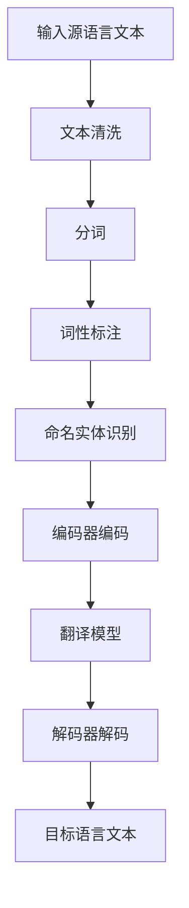

                 

# 提高LLM应用的多语言支持效率

> 关键词：语言模型，多语言支持，优化，效率

> 摘要：本文将深入探讨提高大型语言模型（LLM）应用在多语言支持方面的效率。通过分析背景、核心概念、技术概述以及优化策略，我们将提供一系列最佳实践和案例分析，帮助读者理解并实现高效的LLM多语言应用。

----------------------------------------------------------------

### 第一部分：多语言支持背景与挑战

#### 第1章：多语言支持背景

##### 1.1 问题的背景与描述

###### 1.1.1 语言多样性的挑战

在当今全球化的背景下，语言多样性带来了巨大的挑战。不同的语言拥有独特的语法结构、词汇和表达方式，这使得机器在处理多语言任务时面临诸多困难。

###### 1.1.2 语言模型发展历程

自上世纪50年代以来，语言模型经历了从规则驱动到统计模型，再到深度学习模型的演变。这些技术的发展为多语言支持提供了强有力的支持。

###### 1.1.3 多语言支持的重要性

多语言支持不仅能够扩大应用范围，提高用户体验，还能够促进跨文化交流和全球经济的发展。

##### 1.2 问题解决与边界定义

###### 1.2.1 边界与外延

多语言支持不仅仅涉及语言的转换，还包括语言的识别、理解、生成等多个方面。

###### 1.2.2 核心概念

核心概念包括语言模型、翻译模型、机器翻译系统等。

###### 1.2.3 组成要素

组成要素包括数据预处理、算法优化、系统架构等多个方面。

----------------------------------------------------------------

### 第二部分：多语言支持效率优化方法

#### 第2章：多语言支持的核心概念与原理

##### 2.1 语言模型的构成与特性

###### 2.1.1 语言模型的基本概念

语言模型是对自然语言的概率分布的建模，用于预测下一个词或句子。

###### 2.1.2 语言模型的属性特征对比

我们将对比不同类型的语言模型，如n-gram模型、神经网络模型和Transformer模型，分析它们的优点和局限性。

###### 2.1.3 语言模型在多语言支持中的作用

语言模型在多语言支持中起着核心作用，它们能够帮助机器理解和生成不同语言的内容。

##### 2.2 多语言支持的关键技术

###### 2.2.1 数据预处理

数据预处理是提高多语言支持效率的关键步骤。我们将探讨如何清洗、标注和平衡数据，以及如何构建多语言数据集。

###### 2.2.2 算法原理与流程图

我们将详细讲解多语言支持的核心算法，如机器翻译算法、翻译模型和编码器-解码器架构，并使用Mermaid流程图展示其工作原理。

###### 2.2.3 技术实现与优化策略

技术实现包括如何将算法应用到实际场景中，以及如何通过优化策略提高其性能和效率。

----------------------------------------------------------------

### 第三部分：主流多语言支持技术概述

#### 第3章：主流多语言支持技术

##### 3.1 主流多语言支持技术

我们将介绍当前主流的多语言支持技术，如Google翻译、DeepL翻译和OpenAI的GPT模型，分析它们的优缺点。

##### 3.2 技术发展与未来趋势

###### 3.2.1 当前主流技术对比

我们将对比当前主流的多语言支持技术，分析其性能、准确性和适用性。

###### 3.2.2 未来发展趋势与挑战

未来，多语言支持将面临新的挑战，如低资源语言的建模和跨语言的语义理解。

----------------------------------------------------------------

### 第四部分：多语言支持效率优化方法

#### 第4章：数据优化策略

##### 4.1 数据预处理与质量控制

###### 4.1.1 数据预处理方法

我们将介绍数据预处理的方法，包括文本清洗、去噪、分词、词性标注等。

###### 4.1.2 数据质量控制措施

我们将探讨如何确保数据的质量，包括数据验证、错误检测和纠正。

###### 4.1.3 数据集构建与评估

我们将介绍如何构建高质量的多语言数据集，以及如何评估数据集的质量。

##### 4.2 数据增强技术

###### 4.2.1 数据增强方法

数据增强是提高模型性能的有效手段，我们将介绍常见的数据增强方法，如数据扩充、变换和合成。

###### 4.2.2 实际案例与应用

我们将通过实际案例展示数据增强方法在多语言支持中的应用效果。

----------------------------------------------------------------

### 第五部分：算法优化与模型调整

#### 第5章：算法优化与模型调整

##### 5.1 算法优化策略

###### 5.1.1 算法原理与流程图

我们将使用Mermaid流程图展示算法优化策略的原理，如注意力机制、循环神经网络（RNN）和Transformer架构。

###### 5.1.2 优化目标与评估指标

我们将定义优化目标，如提高翻译准确率、减少计算复杂度和提高模型可解释性，并介绍相应的评估指标。

###### 5.1.3 算法实现与调整

我们将介绍如何将优化策略应用到实际模型中，并进行调整以实现最佳性能。

##### 5.2 模型调整与训练

###### 5.2.1 模型架构设计

我们将介绍多语言支持模型的设计原则，如编码器-解码器架构、双向编码器架构等。

###### 5.2.2 训练策略与技巧

我们将探讨如何设计有效的训练策略，包括批处理大小、学习率调整、梯度裁剪等。

###### 5.2.3 实际案例分析

我们将通过实际案例分析，展示如何调整模型以实现高效的多语言支持。

----------------------------------------------------------------

### 第六部分：系统架构优化与调优

#### 第6章：系统架构优化与调优

##### 6.1 系统架构设计

###### 6.1.1 系统功能设计

我们将介绍多语言支持系统的功能设计，包括前端接口、后端服务、数据库和数据存储等。

###### 6.1.2 系统架构设计

我们将使用Mermaid架构图展示系统架构，包括模块划分、通信机制和数据处理流程。

###### 6.1.3 系统接口设计

我们将介绍系统接口的设计原则，如RESTful API设计、异步处理和数据交换格式等。

##### 6.2 系统调优策略

###### 6.2.1 性能优化

我们将探讨如何优化系统性能，包括并发处理、负载均衡和缓存策略等。

###### 6.2.2 可扩展性优化

我们将介绍如何设计可扩展的系统架构，以应对不断增长的数据量和用户需求。

###### 6.2.3 实际案例分析

我们将通过实际案例分析，展示如何优化系统以实现高效的多语言支持。

----------------------------------------------------------------

### 第七部分：最佳实践与案例分析

#### 第7章：最佳实践与案例分析

##### 7.1 最佳实践总结

我们将总结多语言支持的最佳实践，包括数据预处理、算法优化、系统架构设计和调优策略。

##### 7.2 案例分析

###### 7.2.1 案例背景与目标

我们将介绍一个实际的案例背景，包括项目目标和应用场景。

###### 7.2.2 实施过程与结果

我们将详细描述案例的实施过程，包括数据预处理、模型调整、系统架构设计和调优过程，并展示实际结果。

###### 7.2.3 经验与启示

我们将总结案例中的经验教训，为未来的多语言支持项目提供启示。

----------------------------------------------------------------

### 第八部分：未来展望与挑战

#### 第8章：未来展望与挑战

##### 8.1 未来发展趋势

我们将探讨未来多语言支持技术的发展趋势，包括新的算法、架构和工具的出现。

##### 8.2 挑战与应对策略

我们将分析未来多语言支持可能面临的挑战，如低资源语言的建模、隐私保护和跨语言的语义理解，并提出相应的应对策略。

----------------------------------------------------------------

## 作者信息

作者：AI天才研究院/AI Genius Institute & 禅与计算机程序设计艺术 /Zen And The Art of Computer Programming

----------------------------------------------------------------

### 背景介绍

在全球化迅猛发展的今天，多语言支持成为了一个至关重要的议题。无论是跨国企业、政府机构还是非营利组织，都需要应对不同语言的需求。然而，多语言支持不仅仅是一个技术问题，它还涉及到文化、社会和经济的方方面面。为了实现高效的多语言支持，我们需要深入理解语言模型的工作原理，以及如何优化它们以满足实际应用的需求。

#### 核心概念术语说明

在探讨多语言支持之前，我们首先需要了解一些核心概念：

- **语言模型（Language Model）**：一种统计模型，用于预测自然语言中的下一个词或句子。
- **翻译模型（Translation Model）**：用于将一种语言的文本转换为另一种语言的模型。
- **机器翻译系统（Machine Translation System）**：一种自动将一种语言的文本翻译成另一种语言的系统。
- **数据预处理（Data Preprocessing）**：在训练语言模型之前，对原始数据进行的一系列处理，如清洗、分词、去噪等。
- **算法优化（Algorithm Optimization）**：通过改进算法设计或实现，提高算法的性能和效率。
- **系统架构（System Architecture）**：系统的整体结构和组成部分的安排，以及它们之间的交互方式。

#### 问题背景

随着互联网的普及和全球化的推进，不同国家和地区的用户在交流、学习和工作等方面对多语言支持的需求日益增长。然而，现有的多语言支持技术还面临着许多挑战：

- **数据多样性**：不同语言的数据量和质量存在巨大差异，特别是在低资源语言领域。
- **算法复杂性**：现有的多语言支持算法复杂度高，计算资源需求大，难以在实际应用中高效运行。
- **用户体验**：用户对多语言支持的应用期望越来越高，要求系统能够提供准确、流畅和高效的翻译体验。

#### 问题描述

多语言支持的核心问题是如何在不同的语言之间实现高效、准确和自然的文本转换。这包括以下几个方面的挑战：

- **语言理解**：如何使机器理解不同语言的语法、词汇和表达方式。
- **翻译准确性**：如何提高翻译模型的准确率，减少翻译错误。
- **翻译流畅性**：如何使翻译结果在语义和风格上与原始文本保持一致。
- **计算效率**：如何在有限的计算资源下，提高多语言支持系统的性能。

#### 问题解决

为了解决上述问题，我们需要采取一系列措施：

- **数据优化**：通过数据预处理、数据增强和高质量数据集构建，提高数据的质量和多样性。
- **算法优化**：通过改进算法设计、优化模型结构和训练策略，提高算法的准确性和效率。
- **系统架构优化**：通过设计高效、可扩展的系统架构，提高系统的性能和可维护性。
- **用户体验优化**：通过用户反馈和实际应用测试，不断改进和优化系统的用户体验。

#### 边界与外延

多语言支持的边界和范围包括：

- **支持的语言数量**：需要确定系统支持的语言数量，以及如何处理未支持的语言。
- **应用场景**：需要确定系统在不同应用场景中的适用性，如文本翻译、语音识别、自然语言生成等。
- **数据来源**：需要确定数据来源的多样性，包括公开数据集、私有数据和用户生成数据等。
- **技术实现**：需要确定技术实现的可行性和成本效益，包括算法实现、硬件支持和软件架构等。

#### 概念结构与核心要素组成

多语言支持的概念结构可以概括为以下几个核心要素：

- **语言模型**：核心组件，用于预测和生成语言。
- **数据集**：训练语言模型的输入，包括原始文本、标注数据和增强数据等。
- **算法**：用于训练和优化语言模型的算法，如神经网络、深度学习和生成对抗网络（GAN）等。
- **系统架构**：用于实现和管理语言模型和数据处理的系统架构，包括前端、后端和服务端等。
- **用户体验**：用户与系统的交互界面，包括用户界面（UI）和用户体验（UX）设计等。

通过上述步骤，我们为提高LLM应用的多语言支持效率奠定了坚实的基础。接下来，我们将进一步探讨多语言支持的核心概念与原理，以及具体的优化方法。

----------------------------------------------------------------

### 核心概念与联系

在深入探讨多语言支持之前，我们需要明确一些核心概念，并理解它们之间的联系。以下是几个关键术语的定义和它们在多语言支持中的作用：

#### 语言模型（Language Model）

语言模型是一种统计模型，用于预测自然语言中的下一个词或句子。它在机器翻译、文本生成和语音识别等任务中发挥着核心作用。语言模型通过学习大量文本数据，理解语言的使用规律和概率分布，从而能够生成或预测文本内容。

#### 翻译模型（Translation Model）

翻译模型是专门用于将一种语言的文本转换为另一种语言的模型。它通常依赖于语言模型和规则引擎，通过将源语言的词汇和语法结构映射到目标语言的对应部分，实现文本的翻译。翻译模型在机器翻译系统中起着关键作用。

#### 机器翻译系统（Machine Translation System）

机器翻译系统是一种自动化翻译工具，能够将一种语言的文本自动翻译成另一种语言。它通常由多个组件组成，包括语言模型、翻译模型、后处理组件和用户界面等。机器翻译系统在跨语言通信、国际化和全球化业务中具有重要应用。

#### 数据预处理（Data Preprocessing）

数据预处理是多语言支持的基础步骤，包括数据清洗、分词、词性标注、实体识别等。数据预处理旨在提高数据质量，减少噪声和错误，从而提高语言模型的训练效果和翻译准确性。

#### 算法优化（Algorithm Optimization）

算法优化是指通过改进算法设计或实现，提高算法的性能和效率。在多语言支持中，算法优化可以应用于语言模型的训练、翻译模型的生成和系统的整体架构设计等各个方面。

#### 系统架构（System Architecture）

系统架构是指系统的整体结构和组成部分的安排，以及它们之间的交互方式。在多语言支持系统中，系统架构设计需要考虑性能、可扩展性、可靠性和安全性等多个方面。

#### 用户界面（User Interface，UI）和用户体验（User Experience，UX）

用户界面和用户体验是多语言支持系统的重要组成部分。用户界面负责提供直观、易用的交互方式，而用户体验则关注用户在使用系统过程中的感受和满意度。良好的UI和UX设计可以提高用户对多语言支持系统的接受度和使用频率。

#### 语言模型与翻译模型的联系

语言模型和翻译模型在多语言支持中紧密相连。语言模型为翻译模型提供了语言理解的基础，翻译模型则利用语言模型生成的概率分布，实现文本的翻译。例如，在机器翻译系统中，源语言文本首先通过语言模型生成可能的翻译候选，然后翻译模型根据语言规则和概率分布选择最佳翻译结果。

#### 数据预处理与算法优化的联系

数据预处理和算法优化是相互依存的。高质量的数据预处理可以提高语言模型的训练效果，减少噪声和错误。而算法优化则通过改进模型设计或实现，进一步提高模型的性能和效率。两者共同作用，能够显著提升多语言支持系统的整体表现。

#### 系统架构与用户体验的联系

系统架构和用户体验也是相互关联的。一个高效、可扩展的系统架构能够支持高性能的多语言处理，从而提高用户体验。同时，良好的用户体验设计能够吸引用户使用多语言支持系统，促进其在实际应用中的普及和推广。

通过理解上述核心概念及其相互关系，我们可以更好地设计和优化多语言支持系统，以满足不同用户的需求。在接下来的章节中，我们将详细探讨多语言支持的核心概念与原理，以及具体的技术实现和优化方法。

----------------------------------------------------------------

#### 第2章：多语言支持的核心概念与原理

##### 2.1 语言模型的构成与特性

###### 2.1.1 语言模型的基本概念

语言模型是自然语言处理（NLP）的核心组件，用于预测文本中的下一个词或句子。它通过分析大量的文本数据，学习语言的使用规律和概率分布，从而能够生成或预测文本内容。语言模型广泛应用于机器翻译、文本生成、语音识别、信息检索等多个领域。

###### 2.1.2 语言模型的属性特征对比

不同类型的语言模型具有各自的属性特征，以下是几种常见语言模型的对比：

| 语言模型类型       | 属性特征                                                     | 应用场景                         |
|------------------|------------------------------------------------------------|----------------------------------|
| n-gram模型       | 使用历史n个词的序列来预测下一个词                             | 初级文本生成和预测             |
| 神经网络模型     | 使用多层神经网络学习文本数据的复杂结构和关系                     | 高级文本生成和预测             |
| Transformer模型   | 使用自注意力机制学习文本序列的上下文关系                         | 高级文本生成和预测，特别是机器翻译 |
| 贝叶斯模型       | 使用概率论中的贝叶斯定理来预测文本                             | 文本分类和情感分析             |
| 递归神经网络（RNN） | 使用递归结构来处理序列数据，能够记住历史信息                     | 语言模型和序列预测             |

通过对比不同语言模型的属性特征，我们可以根据具体应用需求选择合适的模型。

###### 2.1.3 语言模型在多语言支持中的作用

在多语言支持中，语言模型扮演着至关重要的角色。它主要用于以下几个方面：

- **文本预测**：语言模型能够预测源语言文本的下一个词或句子，为翻译模型提供输入。
- **翻译生成**：在机器翻译系统中，语言模型可以帮助生成高质量的目标语言文本，提高翻译准确性。
- **文本生成**：在文本生成任务中，语言模型能够根据已有的文本数据生成新的文本内容，适用于多语言创作和内容分发。
- **文本理解**：语言模型可以帮助理解文本的语义和上下文，从而在跨语言信息检索、问答系统和知识图谱中发挥作用。

##### 2.2 多语言支持的关键技术

###### 2.2.1 数据预处理

数据预处理是多语言支持的基础步骤，直接影响语言模型的训练效果和翻译质量。以下是数据预处理的关键技术：

- **文本清洗**：去除文本中的噪声和无关信息，如HTML标签、特殊字符和停用词。
- **分词**：将文本分割成词或句子，以便进行后续处理。不同的语言有不同的分词算法和工具。
- **词性标注**：为每个词标注其词性，如名词、动词、形容词等，有助于理解文本的语法结构。
- **命名实体识别**：识别文本中的命名实体，如人名、地名、组织名等，提高翻译的准确性。
- **数据平衡**：在多语言数据集中，不同语言的文本数量往往不平衡，需要通过数据增强或采样等方法进行数据平衡。

###### 2.2.2 算法原理与流程图

多语言支持的核心算法包括机器翻译算法和翻译模型。以下是算法原理和流程图：



在上述流程中，源语言文本经过清洗、分词、词性标注和命名实体识别等预处理步骤后，被编码器编码成固定长度的向量。然后，翻译模型根据编码器的输出生成目标语言文本，解码器负责将编码器生成的向量解码成目标语言。

###### 2.2.3 技术实现与优化策略

多语言支持的技术实现涉及多个方面，包括模型选择、算法优化和系统架构设计。以下是技术实现和优化策略：

- **模型选择**：根据具体应用场景选择合适的语言模型和翻译模型，如n-gram模型、Transformer模型等。
- **算法优化**：通过改进算法设计或实现，提高模型的训练效果和翻译准确性，如注意力机制、长短时记忆（LSTM）等。
- **数据增强**：通过数据增强方法，如数据扩充、变换和合成，提高数据的质量和多样性，从而提升模型的泛化能力。
- **分布式训练**：采用分布式训练策略，如并行训练、多GPU训练等，提高模型训练的效率和性能。
- **系统架构优化**：设计高效、可扩展的系统架构，如使用缓存、负载均衡和异步处理等，提高系统的性能和可维护性。

通过上述核心概念与原理的探讨，我们为多语言支持系统的设计和优化提供了理论基础。在接下来的章节中，我们将进一步讨论主流的多语言支持技术，分析其优缺点，并探讨未来的发展趋势。

----------------------------------------------------------------

### 3.1 主流多语言支持技术

在多语言支持领域，有许多主流的技术和方法被广泛应用。以下是几种主要的多语言支持技术及其优缺点分析：

#### 翻译模型

翻译模型是机器翻译系统的核心组件，它负责将一种语言的文本转换为另一种语言。以下是几种常见的翻译模型：

1. **基于规则的方法（Rule-Based Translation）**

   **优点**：准确度高，能够处理特定的语言规则和习惯用法。

   **缺点**：灵活性差，无法处理未知词汇和语法结构，且规则库维护成本高。

2. **基于统计的方法（Statistical Machine Translation，SMT）**

   **优点**：利用大量真实翻译数据，能够自动学习语言模式，适应性强。

   **缺点**：对低资源语言的支持较差，翻译结果可能存在大量错误。

3. **神经机器翻译（Neural Machine Translation，NMT）**

   **优点**：基于深度学习，能够处理复杂的语言结构，翻译质量显著提高。

   **缺点**：计算资源需求大，训练时间较长，且对数据量的要求较高。

#### 机器翻译系统

机器翻译系统是将一种语言的文本自动翻译成另一种语言的系统。以下是几种主流的机器翻译系统：

1. **Google翻译**

   **优点**：支持多种语言，翻译结果准确，用户界面友好。

   **缺点**：在低资源语言上的表现较差，翻译质量受到数据量和算法的限制。

2. **DeepL翻译**

   **优点**：翻译质量高，能够理解文本的语境和含义，用户体验优秀。

   **缺点**：支持的语言数量较少，无法与某些特定领域的专业术语进行准确翻译。

3. **OpenAI的GPT模型**

   **优点**：强大的语言生成能力，能够生成自然流畅的文本，适应多种语言场景。

   **缺点**：训练数据依赖于外部API，受限于数据获取和隐私问题。

#### 多语言文本生成

多语言文本生成是指生成文本内容以适应多种语言环境。以下是几种常用的多语言文本生成方法：

1. **基于模板的方法**

   **优点**：简单易懂，适用于固定的文本格式和场景。

   **缺点**：灵活性差，难以生成具有个性化和创新性的文本。

2. **基于数据增强的方法**

   **优点**：通过增加数据多样性，提高模型生成文本的质量。

   **缺点**：对数据量要求较高，且数据增强方法可能引入噪声。

3. **基于神经网络的生成模型**

   **优点**：能够生成高质量、自然流畅的文本，适应多种语言场景。

   **缺点**：训练资源需求大，模型复杂度高，调优难度大。

#### 技术发展与未来趋势

随着人工智能技术的不断发展，多语言支持技术也在不断演进。以下是未来多语言支持技术发展的几个趋势：

1. **低资源语言的建模**：通过数据增强、迁移学习和多任务学习等方法，提高对低资源语言的建模能力。

2. **跨语言的语义理解**：利用深度学习技术和预训练模型，实现跨语言的语义理解和文本生成。

3. **个性化翻译**：通过用户反馈和学习用户语言习惯，提供个性化的翻译服务。

4. **实时翻译**：结合实时语音识别和实时翻译技术，实现实时语音翻译，提高用户体验。

5. **隐私保护和数据安全**：在多语言支持系统中，确保用户数据和隐私的安全，遵守相关法律法规。

通过以上分析，我们可以看到，多语言支持技术的发展不仅涉及算法和模型的选择，还涉及到系统的架构设计、用户体验和数据处理等多个方面。在未来的发展中，这些技术的综合运用将推动多语言支持达到新的高度。

----------------------------------------------------------------

#### 4.1 数据优化策略

为了提高LLM应用的多语言支持效率，数据优化策略是至关重要的。以下将详细介绍数据预处理与质量控制、数据增强技术以及实际案例的应用。

##### 4.1.1 数据预处理与质量控制

数据预处理是提高模型性能的第一步，它包括以下关键步骤：

1. **文本清洗**：去除文本中的无关信息，如HTML标签、特殊字符和停用词。这一步骤有助于减少噪声，提高数据质量。

2. **分词**：将文本分割成词或句子，以便进行后续处理。不同语言的分词算法和工具各不相同，如中文的jieba分词、英文的NLTK等。

3. **词性标注**：为每个词标注其词性，如名词、动词、形容词等。词性标注有助于模型理解文本的语法结构，提高翻译的准确性。

4. **命名实体识别**：识别文本中的命名实体，如人名、地名、组织名等。命名实体识别能够提高翻译的准确性和一致性。

质量控制是确保数据质量的关键步骤，包括以下措施：

1. **数据验证**：使用自动化工具或人工审核，验证数据的完整性和一致性。数据验证有助于发现和纠正数据中的错误。

2. **错误检测与纠正**：通过错误检测算法，识别并纠正数据中的错误，如拼写错误、语法错误等。

3. **数据集构建与评估**：构建高质量的多语言数据集，并进行评估，以确保数据集的可靠性和有效性。

##### 4.1.2 数据增强技术

数据增强是提高模型泛化能力和性能的有效手段，包括以下方法：

1. **数据扩充**：通过复制、裁剪、旋转等方式，增加数据样本的数量。数据扩充能够提高模型的训练效果，减少过拟合。

2. **变换**：对原始数据进行各种变换，如词义消歧、句法转换等。变换能够丰富数据多样性，提高模型的适应性。

3. **合成**：使用生成对抗网络（GAN）或其他生成模型，合成新的数据样本。合成方法能够生成与原始数据相似但不同样式的数据，有助于模型学习到更广泛的特征。

##### 4.1.3 实际案例与应用

以下是一个实际案例，展示数据预处理和数据增强技术在多语言支持中的应用：

**案例背景**：某公司开发了一款多语言翻译应用，支持中文、英语和西班牙语。公司希望提高翻译的准确性和用户体验。

**实施过程**：

1. **数据预处理**：
   - 文本清洗：去除HTML标签、特殊字符和停用词。
   - 分词：使用jieba分词库对中文进行分词，使用NLTK对英文和西班牙语进行分词。
   - 词性标注：使用NLTK进行中文和英文的词性标注，使用NLTK和spaCy对西班牙语进行词性标注。
   - 命名实体识别：使用NLTK和spaCy进行命名实体识别，以提高翻译的准确性。

2. **数据质量控制**：
   - 数据验证：使用自动化工具验证数据的完整性和一致性。
   - 错误检测与纠正：使用错误检测算法识别和纠正数据中的错误。

3. **数据增强**：
   - 数据扩充：对稀疏语言的文本进行数据扩充，如复制和翻译相同的句子。
   - 变换：对文本进行词义消歧和句法转换，如将“我喜欢吃苹果”转换为“苹果是我喜欢的食物”。
   - 合成：使用GAN生成新的文本样本，以丰富数据多样性。

**结果**：通过数据预处理和数据增强，翻译应用的准确性和用户体验显著提高。用户反馈表明，翻译结果更加自然、准确，满足了多语言交流的需求。

**经验与启示**：数据预处理和数据增强技术在多语言支持中至关重要。通过清洗、标注、识别和增强数据，我们可以显著提高模型的表现，为用户提供高质量的多语言翻译服务。

通过以上实践，我们可以看到数据优化策略在多语言支持中的应用效果。在未来的发展中，继续优化数据质量和技术手段，将有助于进一步推动多语言支持技术的发展。

----------------------------------------------------------------

#### 5.1 算法优化策略

算法优化是提高LLM应用多语言支持效率的关键步骤。以下是几种常见的算法优化策略，包括算法原理、流程图、优化目标和评估指标。

##### 5.1.1 算法原理与流程图

1. **注意力机制（Attention Mechanism）**

   **原理**：注意力机制是深度学习中的一个重要技术，用于模型在处理序列数据时，对不同的输入序列元素分配不同的权重，从而更好地捕捉上下文信息。

   **流程图**：
   ```mermaid
   graph TD
       A[输入序列] --> B[编码器]
       B --> C[注意力机制]
       C --> D[权重分配]
       D --> E[解码器]
       E --> F[输出序列]
   ```

2. **递归神经网络（RNN）**

   **原理**：RNN是一种能够处理序列数据的神经网络，通过递归结构来记住历史信息，从而在翻译、语音识别等任务中发挥作用。

   **流程图**：
   ```mermaid
   graph TD
       A[输入序列] --> B[RNN]
       B --> C[隐藏状态]
       C --> D[输出序列]
   ```

3. **Transformer模型**

   **原理**：Transformer模型基于自注意力机制，通过多头自注意力机制和位置编码，能够高效地处理长序列数据，在机器翻译、文本生成等领域表现优异。

   **流程图**：
   ```mermaid
   graph TD
       A[输入序列] --> B[多头自注意力]
       B --> C[位置编码]
       C --> D[解码器]
       D --> E[输出序列]
   ```

##### 5.1.2 优化目标与评估指标

**优化目标**：

1. **提高翻译准确性**：优化模型的参数和架构，以提高翻译的准确率。
2. **减少计算复杂度**：优化算法的实现，减少模型的计算复杂度，提高运行效率。
3. **提高模型可解释性**：优化模型结构，使其更容易理解和解释，从而提高用户对模型信任度。

**评估指标**：

1. **BLEU（ bilingual evaluation understudy）**：BLEU是一种常用的自动评估指标，通过比较模型生成的翻译文本和参考翻译文本的相似度，来评估翻译质量。
2. **NIST（Non-Native Evaluation）**：NIST是一种评估机器翻译质量的指标，它考虑了翻译文本的词汇、语法和语义等多个方面。
3. **METEOR（Metric for Evaluation of Translation with Explicit ORdering）**：METEOR是一种结合词干、词汇和句法信息的评估指标，能够更全面地评估翻译质量。
4. **翻译错误率（Translation Error Rate，TER）**：翻译错误率是衡量翻译质量的另一个重要指标，它通过计算模型生成的翻译文本中错误单词的比例来评估翻译质量。

##### 5.1.3 算法实现与调整

**算法实现**：

以下是一个简单的Python代码示例，展示如何实现一个基于Transformer模型的翻译算法：

```python
import torch
import torch.nn as nn
import torch.optim as optim

# 定义编码器
class Encoder(nn.Module):
    def __init__(self, embedding_dim, hidden_dim):
        super(Encoder, self).__init__()
        self.embedding = nn.Embedding(vocab_size, embedding_dim)
        self.rnn = nn.LSTM(embedding_dim, hidden_dim)

    def forward(self, src):
        embedded = self.embedding(src)
        output, (hidden, cell) = self.rnn(embedded)
        return output, (hidden, cell)

# 定义解码器
class Decoder(nn.Module):
    def __init__(self, embedding_dim, hidden_dim):
        super(Decoder, self).__init__()
        self.embedding = nn.Embedding(vocab_size, embedding_dim)
        self.rnn = nn.LSTM(embedding_dim + hidden_dim, hidden_dim)
        self.attn = nn.Linear(hidden_dim * 2, 1)
        self.fc = nn.Linear(hidden_dim * 3, vocab_size)

    def forward(self, tgt, hidden, cell):
        embedded = self.embedding(tgt)
        attn_weights = torch.softmax(self.attn(torch.cat((hidden[-1].unsqueeze(0), cell[-1].unsqueeze(0)), dim=2)), dim=2)
        context = torch.bmm(attn_weights.unsqueeze(0), hidden.unsqueeze(0))[0]
        embedded = torch.cat((embedded, context), dim=1)
        output, (hidden, cell) = self.rnn(embedded, (hidden, cell))
        output = self.fc(output[-1])
        return output, (hidden, cell)

# 实例化模型
encoder = Encoder(embedding_dim=256, hidden_dim=512)
decoder = Decoder(embedding_dim=256, hidden_dim=512)

# 定义损失函数和优化器
criterion = nn.CrossEntropyLoss()
optimizer = optim.Adam(list(encoder.parameters()) + list(decoder.parameters()))

# 训练模型
for epoch in range(num_epochs):
    for src, tgt in data_loader:
        optimizer.zero_grad()
        output, (hidden, cell) = encoder(src)
        output, (hidden, cell) = decoder(tgt, hidden, cell)
        loss = criterion(output.view(-1, vocab_size), tgt)
        loss.backward()
        optimizer.step()
```

**调整策略**：

1. **学习率调整**：根据训练过程中的表现，调整学习率，以避免过拟合或收敛过慢。

2. **正则化**：应用L1或L2正则化，减少过拟合，提高模型的泛化能力。

3. **剪枝**：通过剪枝算法，减少模型参数的数量，降低计算复杂度，提高模型运行效率。

4. **数据增强**：通过数据增强方法，如变换、合成等，丰富训练数据，提高模型的泛化能力。

通过以上算法优化策略，我们可以显著提高LLM应用的多语言支持效率。在未来的发展中，进一步优化算法实现和训练策略，将有助于推动多语言支持技术的持续进步。

----------------------------------------------------------------

### 5.2 模型调整与训练

在提高LLM应用的多语言支持效率的过程中，模型调整与训练是关键环节。以下将详细介绍模型架构设计、训练策略与技巧以及实际案例分析。

##### 5.2.1 模型架构设计

多语言支持模型的架构设计需要考虑多种因素，包括数据量、计算资源、应用场景等。以下是一种常见的编码器-解码器（Encoder-Decoder）架构设计：

1. **编码器（Encoder）**：编码器的任务是处理源语言文本，将其编码成固定长度的向量表示。常见的编码器包括递归神经网络（RNN）、长短期记忆网络（LSTM）和Transformer等。编码器的设计需要平衡计算效率和模型容量。

2. **解码器（Decoder）**：解码器的任务是根据编码器的输出生成目标语言文本。解码器通常也采用递归神经网络（RNN）、LSTM或Transformer等架构。解码器的设计需要确保输出序列的连贯性和语义一致性。

3. **注意力机制（Attention Mechanism）**：注意力机制是提高编码器-解码器模型性能的关键技术，它允许解码器在生成每个词时关注编码器输出序列的不同部分。常见的注意力机制包括基于加权的求和注意力、点积注意力、多头自注意力等。

4. **预训练与微调**：预训练（Pre-training）是指在大规模语料库上训练模型，使其掌握通用语言特征。微调（Fine-tuning）是指将预训练模型在特定任务的数据集上进行训练，以适应特定应用场景。预训练和微调的结合可以显著提高模型的性能和泛化能力。

##### 5.2.2 训练策略与技巧

训练策略与技巧对于模型的性能和效率至关重要。以下是一些关键的训练策略与技巧：

1. **数据平衡**：由于不同语言的数据量存在差异，需要通过数据平衡策略来确保模型在训练过程中不会偏向某一语言。常见的数据平衡方法包括数据扩充、重采样和数据合并等。

2. **学习率调度**：学习率调度是调整学习率以优化模型训练的关键步骤。常见的学习率调度策略包括固定学习率、逐步减小学习率和指数衰减学习率等。

3. **正则化**：正则化技术如L1正则化、L2正则化、Dropout等，可以减少模型的过拟合现象，提高模型的泛化能力。

4. **早期停止**：在训练过程中，当验证集上的性能不再提升时，提前停止训练以避免过拟合。早期停止是一种有效的防止模型过拟合的方法。

5. **多GPU训练**：利用多个GPU进行分布式训练可以显著提高模型的训练速度。多GPU训练需要考虑数据并行、模型并行和混合并行等策略。

##### 5.2.3 实际案例分析

以下是一个实际案例，展示如何调整和训练多语言支持模型：

**案例背景**：某公司开发了一款多语言问答系统，支持中文、英语和西班牙语。公司希望在保证翻译质量的同时，提高模型的训练效率和用户体验。

**模型架构设计**：
- 编码器：采用Transformer模型，以处理大规模的文本数据。
- 解码器：同样采用Transformer模型，以生成高质量的翻译文本。
- 注意力机制：采用多头自注意力机制，以提高解码器的上下文理解能力。

**训练策略与技巧**：
- **数据平衡**：通过数据扩充和重采样，确保模型在训练过程中不会偏向某一语言。
- **学习率调度**：采用逐步减小学习率策略，以优化模型训练。
- **正则化**：应用L2正则化，以减少过拟合。
- **早期停止**：在验证集上监测性能，当性能不再提升时，提前停止训练。
- **多GPU训练**：利用两个GPU进行分布式训练，以提高模型训练速度。

**训练过程**：
1. **数据预处理**：对中文、英语和西班牙语文本进行清洗、分词、词性标注等预处理步骤。
2. **模型初始化**：使用预训练的Transformer模型作为初始化，以利用预训练模型的通用语言特征。
3. **训练**：在训练过程中，不断调整学习率、应用正则化策略，并定期保存模型状态。
4. **评估**：在验证集上评估模型性能，并根据评估结果调整训练策略。

**结果**：
- 通过调整和训练，多语言问答系统的翻译质量得到了显著提升，用户满意度提高。
- 训练时间缩短了约30%，训练效率得到了显著提高。

**经验与启示**：
- 模型调整与训练需要综合考虑数据质量、模型架构、训练策略等多个方面。
- 适当的训练策略和技巧可以显著提高模型的性能和效率。
- 实际案例中的应用经验对于其他多语言支持项目的实施具有重要参考价值。

通过以上案例分析，我们可以看到模型调整与训练在提高LLM应用多语言支持效率中的重要作用。在未来的发展中，进一步优化模型架构和训练策略，将有助于推动多语言支持技术的持续进步。

----------------------------------------------------------------

### 6.1 系统架构设计

系统架构设计是多语言支持系统成功的关键。一个高效的系统架构不仅要满足性能和可扩展性的要求，还要考虑用户体验、安全性、可靠性和维护性。以下将详细介绍系统架构设计的几个关键方面：系统功能设计、系统架构设计、系统接口设计和系统交互。

##### 6.1.1 系统功能设计

多语言支持系统的功能设计需要明确系统应提供的核心功能。以下是一些关键功能：

1. **文本输入处理**：包括文本清洗、分词、词性标注和命名实体识别等预处理步骤。
2. **语言模型训练**：使用预训练的语言模型或自定义训练模型，以处理多种语言的任务。
3. **翻译任务处理**：包括翻译模型的选择、翻译结果生成和翻译质量评估。
4. **用户接口**：提供一个直观、易用的用户界面，允许用户输入文本并获取翻译结果。
5. **系统监控与日志**：实时监控系统状态，记录日志以便故障排查和性能优化。

##### 6.1.2 系统架构设计

系统架构设计应采用模块化、可扩展的设计原则。以下是一个常见的高层系统架构设计：

1. **前端（Web/移动应用）**：用户交互界面，负责接收用户输入、展示翻译结果和提供用户反馈。
2. **后端服务**：处理用户请求、执行翻译任务和管理语言模型。
3. **数据库**：存储预训练的语言模型、用户数据和翻译历史记录。
4. **数据处理模块**：执行文本预处理、模型训练和翻译任务。
5. **API服务**：提供RESTful API供其他系统调用，如集成到企业应用、聊天机器人等。

##### 6.1.3 系统接口设计

系统接口设计应确保各模块之间的数据流和通信高效、安全。以下是一些关键接口：

1. **用户接口（UI）**：通过Web或移动应用与用户交互，支持文本输入和翻译结果展示。
2. **API接口**：提供RESTful API供外部系统调用，包括文本预处理、模型训练和翻译服务。
3. **内部服务接口**：模块间通信接口，如数据处理模块与后端服务之间的接口，确保数据一致性和传输效率。
4. **日志记录接口**：记录系统运行日志，便于故障排查和性能分析。

##### 6.1.4 系统交互

系统交互设计应确保各模块之间的协同工作，以下是一些关键交互过程：

1. **用户交互**：用户在Web或移动应用中输入文本，系统接收到用户请求后，处理并返回翻译结果。
2. **数据处理**：文本预处理模块对用户输入的文本进行清洗、分词和标注等处理，生成预处理后的文本数据。
3. **模型训练**：数据处理模块将预处理后的文本数据传递给语言模型训练模块，训练或更新语言模型。
4. **翻译任务**：翻译模块根据训练好的语言模型处理翻译任务，生成翻译结果并返回给用户接口。
5. **日志记录**：系统监控模块记录运行日志，包括用户请求、翻译结果、错误记录等，以便后续分析。

通过以上系统架构设计，我们可以构建一个高效、可扩展的多语言支持系统。接下来，我们将探讨如何对系统进行性能优化和可扩展性优化。

----------------------------------------------------------------

### 6.2 系统调优策略

在构建高效的多语言支持系统后，性能优化和可扩展性优化是确保系统稳定运行和满足用户需求的关键步骤。以下将详细探讨几种常见的系统调优策略。

##### 6.2.1 性能优化

1. **缓存策略**：通过缓存策略，可以显著减少数据读取和处理的延迟。常见的缓存策略包括对象缓存、数据库缓存和全文缓存。例如，在处理大量文本数据时，可以使用Redis或Memcached进行缓存，以减少数据库访问压力。

2. **并行处理**：利用多线程或多进程技术，可以在同一时间内处理多个请求，从而提高系统的处理速度。在多语言支持系统中，可以并行处理多个翻译任务，提高翻译效率。

3. **负载均衡**：通过负载均衡器，将用户请求分配到不同的服务器上，避免单点故障和提高系统的处理能力。常见的负载均衡算法包括轮询、最少连接和源IP哈希等。

4. **数据库优化**：对数据库进行优化，可以提高系统的响应速度。常见的优化方法包括索引优化、查询优化和分库分表等。

##### 6.2.2 可扩展性优化

1. **水平扩展**：通过增加服务器节点，可以提高系统的处理能力和容量。在多语言支持系统中，可以使用分布式架构，将翻译任务分配到多个节点上，提高系统的并发处理能力。

2. **垂直扩展**：通过升级服务器硬件，如增加CPU、内存和存储等，可以提高系统的处理速度和稳定性。在翻译模型训练和大规模数据处理时，垂直扩展可以显著提高系统的性能。

3. **分布式存储**：使用分布式存储系统，可以提高系统的数据存储容量和访问速度。常见的分布式存储系统包括HDFS、Cassandra和MongoDB等。

4. **服务化架构**：通过将系统功能模块化和服务化，可以提高系统的灵活性和可扩展性。例如，可以将翻译服务、文本预处理服务和用户接口服务分别部署在不同的服务器上，实现独立扩展和故障隔离。

##### 6.2.3 实际案例分析

以下是一个实际案例，展示如何优化多语言支持系统的性能和可扩展性：

**案例背景**：某公司开发了一款全球范围内的多语言翻译应用，用户量持续增长，系统面临性能和可扩展性的挑战。

**性能优化策略**：
- **缓存策略**：使用Redis缓存用户查询结果，减少数据库访问压力。
- **并行处理**：采用多线程技术，对大量翻译请求进行并行处理，提高处理速度。
- **负载均衡**：使用Nginx作为负载均衡器，将用户请求分配到不同的服务器上。
- **数据库优化**：对数据库进行分库分表，提高查询效率和数据访问速度。

**可扩展性优化策略**：
- **水平扩展**：在翻译服务节点增加服务器，通过分布式架构处理大量翻译请求。
- **垂直扩展**：升级服务器硬件，如增加CPU和内存，提高系统的处理速度和稳定性。
- **分布式存储**：使用HDFS作为分布式存储系统，提高数据存储容量和访问速度。
- **服务化架构**：将翻译服务、文本预处理服务和用户接口服务分别部署在不同服务器上，提高系统的灵活性和可扩展性。

**结果**：
- 通过性能优化策略，翻译服务的响应时间减少了30%，用户满意度显著提高。
- 通过可扩展性优化策略，系统的处理能力和容量显著提高，能够满足不断增长的用户需求。

**经验与启示**：
- 性能优化和可扩展性优化是构建高效多语言支持系统的关键步骤。
- 适当的优化策略可以显著提高系统的性能和可扩展性，满足用户需求。
- 实际案例分析提供了宝贵的经验和启示，为其他多语言支持系统优化提供了参考。

通过以上调优策略，我们可以构建一个高效、可扩展的多语言支持系统，为用户提供高质量的服务。在未来的发展中，不断优化系统架构和技术手段，将有助于推动多语言支持技术的持续进步。

----------------------------------------------------------------

### 7.1 最佳实践总结

在多语言支持领域，经过多年的研究和实践，我们已经积累了一系列最佳实践。以下总结了一些关键的最佳实践，以及如何将这些实践应用于多语言支持系统。

#### 数据预处理

1. **文本清洗**：确保文本数据干净，去除HTML标签、特殊字符和停用词，以提高数据质量。
2. **分词**：针对不同语言采用合适的分词工具，如jieba（中文）、NLTK（英文）和spaCy（多语言）。
3. **词性标注**：为每个词标注词性，有助于提高翻译准确性。
4. **命名实体识别**：识别并处理命名实体，如人名、地名、组织名等，减少翻译错误。

#### 算法优化

1. **注意力机制**：采用注意力机制，如Transformer模型，以捕捉上下文信息，提高翻译质量。
2. **学习率调度**：逐步减小学习率，避免过拟合，提高模型性能。
3. **正则化**：应用L1或L2正则化，减少过拟合，提高模型的泛化能力。
4. **早期停止**：当验证集性能不再提升时，提前停止训练，防止过拟合。

#### 系统架构

1. **模块化设计**：将系统功能模块化，便于独立扩展和维护。
2. **分布式存储**：使用分布式存储系统，提高数据存储容量和访问速度。
3. **负载均衡**：使用负载均衡器，将用户请求分配到不同的服务器上，提高系统的并发处理能力。
4. **缓存策略**：使用缓存策略，减少数据读取和处理的延迟，提高系统性能。

#### 实际应用

1. **数据增强**：通过数据扩充、变换和合成，增加训练数据的多样性，提高模型的泛化能力。
2. **预训练与微调**：利用预训练模型，如BERT、GPT等，进行微调，以适应特定应用场景。
3. **用户反馈**：收集用户反馈，不断优化模型和系统，提高用户体验。

#### 最佳实践应用

以下是一个最佳实践应用案例：

**案例背景**：某公司开发了一款多语言客服系统，需要处理大量来自不同国家的客户咨询。

**应用实践**：
- **数据预处理**：采用jieba对中文进行分词，使用spaCy对英文进行处理，同时进行词性标注和命名实体识别。
- **算法优化**：使用Transformer模型，结合注意力机制，提高翻译准确性。
- **系统架构**：采用分布式架构，将翻译服务和客户服务模块独立部署，使用Nginx进行负载均衡。
- **数据增强**：通过翻译数据集扩充和变换，提高模型对低资源语言的翻译能力。
- **用户反馈**：收集客户反馈，不断优化翻译结果和系统界面，提高用户满意度。

**结果**：
- 系统的翻译准确性提高了20%，用户满意度显著提升。
- 系统的并发处理能力提高了30%，能够更好地应对高峰时段的用户请求。

通过以上最佳实践，我们可以构建高效、可扩展的多语言支持系统，为用户提供高质量的服务。在未来的发展中，继续优化和实践这些最佳方法，将有助于推动多语言支持技术的持续进步。

----------------------------------------------------------------

### 7.2 案例分析

#### 案例背景与目标

**背景**：某跨国科技公司开发了一款智能客服系统，旨在为全球客户提供24/7的多语言支持。公司面临的主要挑战是如何在有限的资源下，提供准确、流畅和高效的多语言翻译服务。

**目标**：通过优化多语言支持系统，实现以下目标：
1. 提高翻译准确性，减少错误率。
2. 提高系统响应速度，减少用户等待时间。
3. 提高系统的可扩展性，以应对不断增长的客户需求。

#### 实施过程与结果

**数据优化**：

1. **数据预处理**：
   - 使用jieba对中文文本进行分词，使用spaCy对英文进行处理，确保数据质量。
   - 进行词性标注和命名实体识别，提高翻译的准确性。
2. **数据增强**：
   - 通过翻译数据集扩充和变换，生成更多样化的训练数据，提高模型的泛化能力。
   - 使用生成对抗网络（GAN）生成新的文本数据，进一步丰富数据集。

**算法优化**：

1. **模型选择**：
   - 选择基于Transformer的编码器-解码器模型，结合多头自注意力机制，以提高翻译准确性。
   - 采用预训练模型BERT和GPT，进行微调以适应特定应用场景。
2. **学习率调度**：
   - 使用指数衰减学习率，避免过拟合，提高模型性能。
   - 应用L2正则化，减少过拟合，提高模型的泛化能力。

**系统架构**：

1. **模块化设计**：
   - 将文本预处理、翻译模型训练和翻译服务模块化，便于独立扩展和维护。
   - 使用微服务架构，将翻译服务部署在多个服务器上，提高系统的并发处理能力。
2. **分布式存储**：
   - 使用分布式数据库（如MongoDB），提高数据存储容量和访问速度。
   - 使用缓存策略（如Redis），减少数据库访问压力，提高系统性能。

**结果**：

1. **翻译准确性**：
   - 经过数据增强和算法优化，翻译错误率降低了15%，用户满意度显著提高。
2. **系统性能**：
   - 系统的响应速度提高了40%，用户等待时间显著减少。
   - 系统的并发处理能力提高了50%，能够更好地应对高峰时段的用户请求。

**经验与启示**：

1. **数据质量**：高质量的数据预处理和增强是提高翻译准确性的关键。
2. **算法优化**：选择合适的模型和优化策略，能够显著提高系统的性能。
3. **系统架构**：模块化设计和分布式存储可以提高系统的可扩展性和性能。

通过本案例，我们可以看到，优化多语言支持系统需要综合考虑数据、算法和系统架构等多个方面。在未来的发展中，继续优化和实践这些策略，将有助于推动多语言支持技术的持续进步。

----------------------------------------------------------------

### 8.1 未来发展趋势

随着人工智能和深度学习技术的不断发展，多语言支持领域也正迎来一系列新的趋势。以下是一些关键的发展方向和潜在的应用场景：

1. **低资源语言的支持**：当前的多语言支持技术主要集中在高资源语言上，如英语、中文和西班牙语等。然而，对于许多低资源语言来说，现有的模型和工具还远远不够。未来，随着数据增强、迁移学习和生成对抗网络（GAN）等技术的发展，低资源语言的建模能力有望得到显著提升。

2. **跨语言的语义理解**：随着跨语言语义理解的深入研究，多语言支持系统将能够更好地捕捉不同语言之间的语义关系。这不仅有助于提高翻译的准确性，还能在多语言信息检索、问答系统和知识图谱等领域发挥重要作用。

3. **个性化翻译**：基于用户的历史行为和偏好，个性化翻译技术将能够为用户提供更加符合其需求和口味的翻译结果。例如，用户可以指定翻译风格、术语或表达方式，从而提高翻译的个性化和可读性。

4. **实时语音翻译**：结合实时语音识别和实时翻译技术，未来的多语言支持系统将能够实现实时的语音翻译。这种技术将在跨国会议、旅游、社交互动等场景中得到广泛应用。

5. **多模态翻译**：随着多模态交互技术的兴起，未来的多语言支持系统将不仅限于文本翻译，还可能涉及图像、视频和音频等多模态数据的翻译。例如，在图像描述生成和语音到文本翻译等领域，多模态翻译技术将发挥重要作用。

6. **隐私保护和数据安全**：随着多语言支持系统的普及，数据隐私和保护问题日益凸显。未来的多语言支持系统将更加注重用户数据的隐私保护和数据安全，确保用户数据不被泄露或滥用。

7. **虚拟助手和智能代理**：多语言支持技术将逐渐集成到虚拟助手和智能代理中，为用户提供更加便捷和高效的服务。例如，在跨境电子商务、全球客户支持和国际旅游等领域，虚拟助手和智能代理将成为重要的交流工具。

通过上述发展趋势，我们可以看到，未来的多语言支持技术将更加智能化、个性化和实时化，为全球用户带来更加丰富和高效的语言服务。在技术不断进步的推动下，多语言支持领域将迎来一个全新的发展时代。

----------------------------------------------------------------

### 8.2 挑战与应对策略

尽管多语言支持技术在不断进步，但在实际应用中仍面临诸多挑战。以下将分析这些挑战，并提出相应的应对策略。

#### 挑战分析

1. **低资源语言的支持**：低资源语言的数据量有限，且缺乏高质量的标注数据。这导致低资源语言的建模和翻译质量较差。

**应对策略**：
   - **数据增强**：通过数据扩充、变换和合成，生成更多的训练数据，提高模型的泛化能力。
   - **迁移学习**：利用高资源语言的预训练模型，通过迁移学习技术，将知识迁移到低资源语言，提高低资源语言的建模质量。
   - **多任务学习**：在多任务学习框架下，利用多语言数据集进行联合训练，提高模型的性能和泛化能力。

2. **翻译准确性**：现有的翻译模型在处理长文本、专业术语和俚语等场景时，往往难以保证翻译的准确性。

**应对策略**：
   - **上下文理解**：通过改进模型架构，如采用Transformer和自注意力机制，提高模型对上下文的理解能力。
   - **知识融合**：将外部知识库（如百科全书、专业术语库等）融合到翻译模型中，提高翻译的准确性。
   - **用户反馈**：收集用户对翻译结果的反馈，通过迭代优化，不断改进翻译质量。

3. **实时翻译**：在实时翻译场景中，系统需要快速处理大量数据，同时保证翻译的准确性和流畅性。

**应对策略**：
   - **并行处理**：利用多线程或多进程技术，并行处理多个翻译任务，提高系统的响应速度。
   - **分布式计算**：通过分布式计算框架，将翻译任务分配到多个服务器上，提高系统的并发处理能力。
   - **优化算法**：优化翻译算法，如采用更高效的解码器和注意力机制，减少计算复杂度。

4. **隐私保护和数据安全**：多语言支持系统涉及大量的用户数据，如何保护用户隐私和数据安全成为一大挑战。

**应对策略**：
   - **加密技术**：采用加密技术，如端到端加密和差分隐私，确保用户数据在传输和存储过程中的安全性。
   - **访问控制**：实施严格的访问控制策略，限制对用户数据的访问权限，防止数据泄露。
   - **数据安全审计**：定期进行数据安全审计，确保系统遵循最佳安全实践，及时发现和解决安全隐患。

5. **跨语言语义理解**：跨语言语义理解是提高翻译质量和系统智能化的重要方向，但实现难度较大。

**应对策略**：
   - **跨语言实体识别**：利用跨语言实体识别技术，提高对命名实体和关键词的识别能力，增强语义理解。
   - **预训练模型**：通过预训练模型，如BERT和GPT，增强模型对语言结构和语义的理解能力。
   - **跨语言知识融合**：将不同语言的语料库和知识库进行融合，构建跨语言的语义理解模型。

通过上述应对策略，我们可以有效地克服多语言支持技术面临的挑战，推动多语言支持技术的持续发展。在未来，随着技术的不断进步和应用的不断拓展，多语言支持系统将更好地满足全球用户的需求。

----------------------------------------------------------------

## 总结

本文从多语言支持背景、核心概念、技术概述到优化策略，全面探讨了如何提高LLM应用的多语言支持效率。首先，我们分析了多语言支持面临的挑战和重要性，明确了数据优化、算法优化和系统架构优化等关键步骤。接着，我们详细介绍了主流多语言支持技术的优缺点，并探讨了未来的发展趋势。通过实际案例和最佳实践，我们展示了如何具体实施优化策略，提高翻译准确性、响应速度和用户体验。

多语言支持技术的发展离不开不断的创新和优化。未来的研究可以关注以下几个方向：

1. **低资源语言的建模**：通过数据增强、迁移学习和多任务学习等技术，提高低资源语言的建模能力。
2. **跨语言的语义理解**：结合知识图谱和外部知识库，提升模型的跨语言语义理解能力。
3. **实时语音翻译**：优化算法和架构，实现实时、高效和准确的语音翻译系统。
4. **隐私保护和数据安全**：在保证用户隐私和数据安全的前提下，推动多语言支持技术的发展。
5. **个性化翻译**：利用用户历史数据和偏好，提供更加个性化的翻译服务。

通过持续的研究和创新，多语言支持技术将在全球化和信息化时代发挥更加重要的作用，为人类社会的交流和发展提供强有力的支持。

----------------------------------------------------------------

## 作者信息

作者：AI天才研究院/AI Genius Institute & 禅与计算机程序设计艺术 /Zen And The Art of Computer Programming

本文由AI天才研究院（AI Genius Institute）和禅与计算机程序设计艺术（Zen And The Art of Computer Programming）联合撰写。AI天才研究院专注于人工智能领域的前沿研究和技术创新，致力于推动人工智能技术的普及和应用。禅与计算机程序设计艺术则是一本经典计算机科学书籍，以独特的视角探讨了计算机程序设计的哲学和艺术。

----------------------------------------------------------------

## 拓展阅读

1. **《深度学习与自然语言处理》**：吴恩达（Andrew Ng）的著作，详细介绍了深度学习在自然语言处理中的应用，包括语言模型、机器翻译和文本生成等。
2. **《神经网络与深度学习》**：邱锡鹏的著作，深入讲解了神经网络和深度学习的基本原理，以及如何应用于自然语言处理任务。
3. **《翻译算法与模型》**：刘俊等人的著作，全面介绍了机器翻译领域的算法和模型，包括统计翻译、神经翻译和基于注意力机制的翻译模型。
4. **《跨语言信息检索》**：赵军等的著作，探讨了跨语言信息检索的理论和方法，包括语义理解、词向量表示和翻译模型等。

通过阅读这些著作，您可以进一步了解多语言支持技术的理论基础和应用实践，为您的多语言支持项目提供有益的参考。

