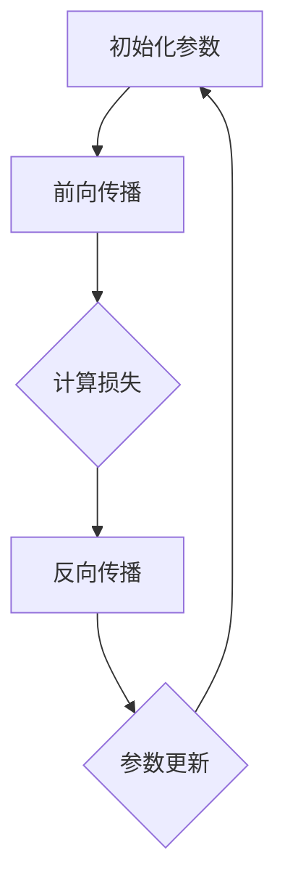
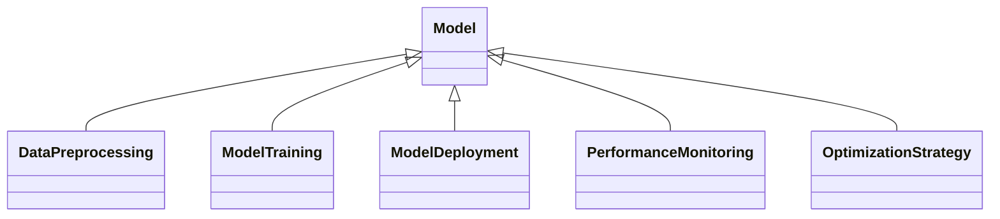
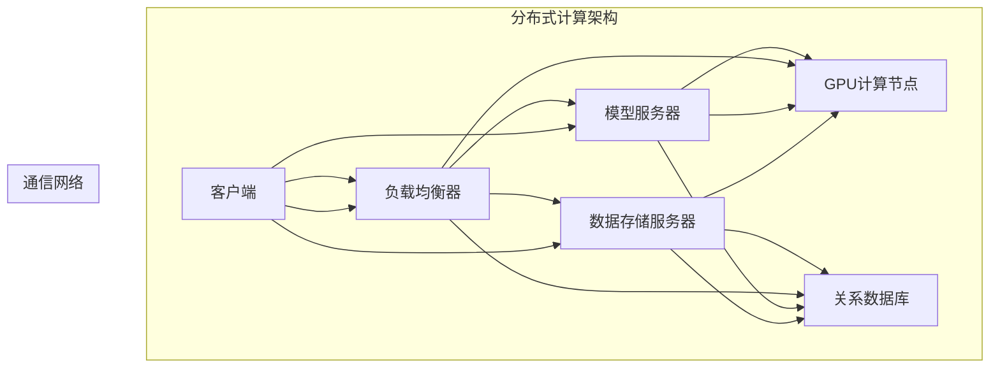
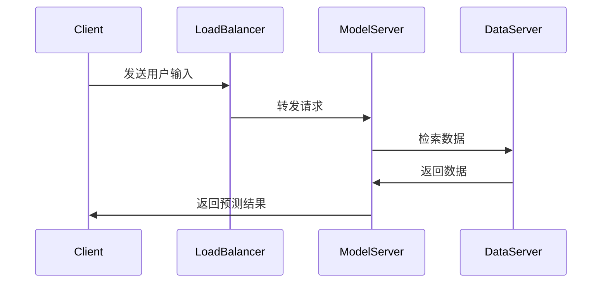

                 


# 提高LLM应用的性能优化效率

关键词：大型语言模型（LLM），性能优化，效率提升，模型压缩，数据预处理

摘要：随着深度学习尤其是大型语言模型（LLM）的广泛应用，性能优化成为提升用户体验和模型效率的关键。本文将深入探讨LLM性能优化的核心概念、数学模型、优化方法和策略，并通过实际案例进行分析和讲解，为读者提供一套系统化的性能优化方案。

## 第一部分：问题背景与核心概念

### 第1章：问题背景与核心概念

#### 1.1 问题背景

随着互联网的快速发展，自然语言处理（NLP）技术在各个领域得到了广泛应用。特别是近年来，深度学习技术在NLP领域取得了显著的进展，其中大型语言模型（LLM）如BERT、GPT等成为了研究热点。然而，随着模型规模的不断扩大，性能优化问题逐渐显现出来。

**问题描述**：在LLM应用中，性能瓶颈主要表现在以下方面：

1. **计算资源消耗**：大型模型需要大量的计算资源和内存支持，这给模型的部署和运行带来了挑战。
2. **延迟**：模型的响应速度直接影响用户体验，如何降低模型延迟成为优化的重要目标。
3. **精度与效率的平衡**：在性能优化过程中，如何在保证模型精度的基础上提高效率是一个重要的课题。

**问题解决**：为了解决上述问题，我们需要从以下几个方面进行优化：

1. **算法改进**：通过改进优化算法，如使用更高效的优化器，可以加快模型训练速度。
2. **硬件加速**：利用GPU、TPU等专用硬件，可以提高模型计算效率。
3. **模型压缩**：通过模型剪枝、量化、知识蒸馏等技术，可以减小模型体积，提高模型效率。
4. **数据预处理**：通过数据清洗、数据增强、数据集划分等方法，可以提高模型训练效果。

#### 1.2 核心概念与联系

- **性能优化**：在LLM应用中，性能优化主要涉及算法改进、硬件加速、模型压缩和数据预处理等方面。性能优化目标是提高模型效率，降低计算资源和延迟。

- **效率提升**：效率提升是性能优化的一个重要方面，主要通过优化模型结构、利用专用硬件和并行计算等方法实现。效率提升有助于提高模型的运行速度和响应能力。

- **模型压缩**：模型压缩是通过减少模型参数数量和计算量来减小模型体积，提高模型效率。常用的方法包括模型剪枝、量化、知识蒸馏等。

- **数据预处理**：数据预处理是提高LLM应用性能的重要环节，包括数据清洗、数据增强、数据集划分等方法。数据预处理可以提高模型训练效果，减少过拟合风险。

### 第2章：LLM性能优化的数学模型与公式

#### 2.1 算法原理讲解

为了更好地理解LLM性能优化的数学模型，我们可以使用Mermaid绘制一个简单的流程图，展示关键算法和流程。



在这个流程图中，我们首先初始化模型参数，然后进行前向传播计算模型输出，计算损失，接着进行反向传播计算梯度，最后更新模型参数。这是一个典型的基于梯度下降的优化过程。

#### 2.2 数学模型和公式

在LLM性能优化中，我们通常会使用梯度下降算法进行模型参数的优化。以下是一些关键的数学公式：

1. **前向传播**：

   $$ 
   \hat{y} = f(Wx + b) 
   $$

   其中，$W$ 是权重矩阵，$b$ 是偏置项，$f$ 是激活函数，$\hat{y}$ 是模型的预测输出。

2. **损失函数**：

   $$
   J = \frac{1}{n}\sum_{i=1}^{n}(y_i - \hat{y}_i)^2 
   $$

   其中，$y_i$ 是真实标签，$\hat{y}_i$ 是模型的预测输出，$J$ 是损失函数。

3. **反向传播**：

   $$
   \frac{\partial J}{\partial W} = \frac{1}{n}\sum_{i=1}^{n}(\hat{y}_i - y_i)\cdot \frac{\partial f}{\partial \hat{y}_i} \cdot x_i
   $$

   $$
   \frac{\partial J}{\partial b} = \frac{1}{n}\sum_{i=1}^{n}(\hat{y}_i - y_i)\cdot \frac{\partial f}{\partial \hat{y}_i}
   $$

   其中，$\frac{\partial J}{\partial W}$ 和 $\frac{\partial J}{\partial b}$ 分别是权重和偏置项的梯度。

4. **梯度下降更新**：

   $$
   W_{new} = W_{old} - \alpha \cdot \frac{\partial J}{\partial W}
   $$

   $$
   b_{new} = b_{old} - \alpha \cdot \frac{\partial J}{\partial b}
   $$

   其中，$\alpha$ 是学习率。

#### 2.3 详细讲解与举例

以下是一个简单的Python代码示例，展示了如何使用梯度下降算法对线性模型进行参数优化：

```python
import numpy as np

# 参数初始化
W = np.random.rand(1, 10)
b = np.random.rand(1, 1)
learning_rate = 0.01

# 输入特征和标签
x = np.random.rand(100, 10)
y = np.random.rand(100, 1)

# 梯度下降迭代
for i in range(1000):
    # 前向传播
    z = np.dot(x, W) + b
    y_pred = 1 / (1 + np.exp(-z))

    # 计算损失
    loss = -np.mean(y * np.log(y_pred) + (1 - y) * np.log(1 - y_pred))

    # 反向传播
    dz = y_pred - y
    dw = np.dot(x.T, dz)
    db = np.sum(dz)

    # 参数更新
    W -= learning_rate * dw
    b -= learning_rate * db

    # 打印损失值
    if i % 100 == 0:
        print(f"Epoch {i}, Loss: {loss}")

# 输出最终参数
print(f"Final W: {W}, Final b: {b}")
```

在这个示例中，我们使用了一个简单的线性模型，通过1000次迭代使用梯度下降算法进行参数优化。每次迭代都会计算损失、计算梯度，并更新模型参数。

## 第二部分：性能优化方法与策略

### 第3章：算法原理讲解与流程图

#### 3.1 算法原理讲解

在LLM应用中，性能优化通常涉及多个方面，包括优化算法、模型结构、硬件加速和并行计算等。以下是一些常用的优化算法和模型结构：

1. **优化算法**：

   - **随机梯度下降（SGD）**：SGD是一种简单的优化算法，它通过随机选择一部分样本来更新模型参数。SGD的优点是计算简单，实现容易，但收敛速度较慢。
   - **Adam优化器**：Adam优化器结合了SGD和RMSProp的优点，在大多数情况下具有较好的收敛性能。它通过计算一阶矩估计（均值）和二阶矩估计（方差）来更新模型参数。

2. **模型结构优化**：

   - **深度可分离卷积**：深度可分离卷积可以减少模型参数数量，提高计算效率。它通过分别进行深度卷积和逐点卷积来实现，从而减少模型复杂度。
   - **Transformer结构改进**：Transformer结构在NLP任务中表现出色，通过多头自注意力机制和位置编码等设计，提高了模型的表达能力。改进Transformer结构可以进一步优化模型性能。

#### 3.2 流程图

为了更好地理解算法原理和流程，我们可以使用Mermaid绘制一个简单的流程图：


在这个流程图中，我们首先初始化模型参数，然后进行前向传播计算模型输出，计算损失，接着进行反向传播计算梯度，最后更新模型参数。这是一个典型的基于梯度下降的优化过程。

### 第4章：数学模型与公式讲解

#### 4.1 数学模型

在LLM性能优化中，常用的数学模型包括梯度下降算法、模型压缩和优化算法等。以下是一些关键的数学模型和公式：

1. **梯度下降算法**：

   - **前向传播**：

     $$
     \hat{y} = f(Wx + b)
     $$

     其中，$W$ 是权重矩阵，$b$ 是偏置项，$f$ 是激活函数，$\hat{y}$ 是模型的预测输出。

   - **损失函数**：

     $$
     J = \frac{1}{n}\sum_{i=1}^{n}(y_i - \hat{y}_i)^2
     $$

     其中，$y_i$ 是真实标签，$\hat{y}_i$ 是模型的预测输出，$J$ 是损失函数。

   - **反向传播**：

     $$
     \frac{\partial J}{\partial W} = \frac{1}{n}\sum_{i=1}^{n}(\hat{y}_i - y_i)\cdot \frac{\partial f}{\partial \hat{y}_i} \cdot x_i
     $$

     $$
     \frac{\partial J}{\partial b} = \frac{1}{n}\sum_{i=1}^{n}(\hat{y}_i - y_i)\cdot \frac{\partial f}{\partial \hat{y}_i}
     $$

     其中，$\frac{\partial J}{\partial W}$ 和 $\frac{\partial J}{\partial b}$ 分别是权重和偏置项的梯度。

   - **梯度下降更新**：

     $$
     W_{new} = W_{old} - \alpha \cdot \frac{\partial J}{\partial W}
     $$

     $$
     b_{new} = b_{old} - \alpha \cdot \frac{\partial J}{\partial b}
     $$

     其中，$\alpha$ 是学习率。

2. **模型压缩**：

   - **模型剪枝**：

     $$
     \text{mask} = \text{sign}(\text{weight})
     $$

     $$
     \text{pruned\_weight} = \text{weight} \cdot \text{mask}
     $$

     其中，$\text{weight}$ 是原始权重，$\text{mask}$ 是剪枝掩码，$\text{pruned\_weight}$ 是剪枝后的权重。

   - **量化**：

     $$
     q = \text{sign}(\text{weight})
     $$

     $$
     \text{quantized\_weight} = q \cdot \text{scale} + \text{bias}
     $$

     其中，$\text{weight}$ 是原始权重，$q$ 是量化值，$\text{scale}$ 是量化尺度，$\text{bias}$ 是偏置项。

   - **知识蒸馏**：

     $$
     \text{teacher\_output} = f(W_t x + b_t)
     $$

     $$
     \text{student\_output} = f(W_s x + b_s)
     $$

     $$
     L = \frac{1}{n}\sum_{i=1}^{n}(\text{teacher\_output}_i - \text{student\_output}_i)^2
     $$

     其中，$W_t$ 和 $b_t$ 是教师模型的权重和偏置，$W_s$ 和 $b_s$ 是学生模型的权重和偏置，$\text{teacher\_output}$ 和 $\text{student\_output}$ 分别是教师模型和学生模型的输出，$L$ 是知识蒸馏损失函数。

#### 4.2 公式讲解

在本文中，我们使用了以下数学公式：

- **前向传播**：

  $$
  \hat{y} = f(Wx + b)
  $$

- **损失函数**：

  $$
  J = \frac{1}{n}\sum_{i=1}^{n}(y_i - \hat{y}_i)^2
  $$

- **反向传播**：

  $$
  \frac{\partial J}{\partial W} = \frac{1}{n}\sum_{i=1}^{n}(\hat{y}_i - y_i)\cdot \frac{\partial f}{\partial \hat{y}_i} \cdot x_i
  $$

  $$
  \frac{\partial J}{\partial b} = \frac{1}{n}\sum_{i=1}^{n}(\hat{y}_i - y_i)\cdot \frac{\partial f}{\partial \hat{y}_i}
  $$

- **梯度下降更新**：

  $$
  W_{new} = W_{old} - \alpha \cdot \frac{\partial J}{\partial W}
  $$

  $$
  b_{new} = b_{old} - \alpha \cdot \frac{\partial J}{\partial b}
  $$

- **模型剪枝**：

  $$
  \text{mask} = \text{sign}(\text{weight})
  $$

  $$
  \text{pruned\_weight} = \text{weight} \cdot \text{mask}
  $$

- **量化**：

  $$
  q = \text{sign}(\text{weight})
  $$

  $$
  \text{quantized\_weight} = q \cdot \text{scale} + \text{bias}
  $$

- **知识蒸馏**：

  $$
  \text{teacher\_output} = f(W_t x + b_t)
  $$

  $$
  \text{student\_output} = f(W_s x + b_s)
  $$

  $$
  L = \frac{1}{n}\sum_{i=1}^{n}(\text{teacher\_output}_i - \text{student\_output}_i)^2
  $$

以上公式详细讲解了LLM性能优化中的关键算法和模型压缩方法，为读者提供了丰富的理论支持。

### 第5章：系统分析与架构设计方案

#### 5.1 问题场景介绍

在LLM应用中，性能优化问题通常涉及以下场景：

1. **实时交互**：在实时问答系统中，用户输入的问题需要快速得到回复，这要求模型具有较低的延迟和较高的响应速度。
2. **大规模数据处理**：在处理大规模数据时，模型需要高效地处理和更新参数，以避免计算资源浪费和训练时间过长。
3. **多任务并行处理**：在同时处理多个任务时，如何有效地分配计算资源和优化模型性能成为一个关键问题。

针对这些场景，我们需要设计一个高效的系统架构，以支持LLM应用的性能优化。

#### 5.2 系统功能设计

为了支持上述场景，我们需要设计以下系统功能：

1. **模型训练功能**：包括数据预处理、模型训练和参数更新等。
2. **模型部署功能**：包括模型加载、预测和实时交互等。
3. **性能监控与优化**：包括计算资源监控、性能分析和优化策略调整等。

以下是系统的领域模型类图：



在这个类图中，模型类包含了数据预处理、模型训练、模型部署、性能监控和优化策略等子类，每个子类都具有特定的功能。

#### 5.3 系统架构设计

为了实现高效性能优化，我们需要设计一个分布式系统架构。以下是系统架构设计图：



在这个架构图中，客户端通过负载均衡器与模型服务器和数据存储服务器进行通信。模型服务器负责模型训练和预测，GPU计算节点用于加速模型计算。数据存储服务器负责存储和检索数据。关系数据库用于存储模型训练数据和相关指标。

#### 5.4 系统接口设计与交互

为了支持上述系统架构，我们需要设计以下系统接口：

1. **客户端接口**：包括发送用户输入、接收预测结果等。
2. **模型服务器接口**：包括模型加载、模型训练、模型预测等。
3. **数据存储服务器接口**：包括数据上传、数据下载、数据检索等。

以下是系统接口设计图：



在这个序列图中，客户端发送用户输入到负载均衡器，负载均衡器将请求转发到模型服务器。模型服务器从数据存储服务器检索数据，进行模型训练和预测，并将预测结果返回给客户端。

## 第三部分：项目实战与最佳实践

### 第6章：项目实战

#### 6.1 环境安装

为了进行LLM性能优化的项目实战，我们需要搭建一个完整的实验环境。以下是环境安装步骤：

1. **安装Python**：在实验环境中安装Python，版本建议为3.8或更高版本。

2. **安装TensorFlow**：TensorFlow是一个流行的深度学习框架，用于构建和训练模型。以下是安装TensorFlow的命令：

   ```bash
   pip install tensorflow==2.7
   ```

3. **安装GPU驱动**：如果实验环境使用GPU进行计算，需要安装相应的GPU驱动。以NVIDIA GPU为例，可以访问NVIDIA官方网站下载驱动程序。

4. **安装其他依赖库**：根据项目需求，可能需要安装其他依赖库，如NumPy、Pandas等。可以使用以下命令进行安装：

   ```bash
   pip install numpy pandas
   ```

#### 6.2 系统核心实现源代码

以下是一个简单的LLM性能优化项目的核心实现源代码，包括数据预处理、模型训练和预测等：

```python
import tensorflow as tf
import numpy as np

# 数据预处理
def preprocess_data(data):
    # 数据清洗
    cleaned_data = data.applymap(lambda x: x if x != '' else None)

    # 数据增强
    enhanced_data = cleaned_data.copy()
    enhanced_data['description'] = enhanced_data['description'].apply(lambda x: x + ' ' + x)

    return cleaned_data, enhanced_data

# 模型训练
def train_model(data, epochs=10):
    # 初始化模型
    model = tf.keras.Sequential([
        tf.keras.layers.Embedding(input_dim=data.shape[1], output_dim=64),
        tf.keras.layers.Bidirectional(tf.keras.layers.LSTM(64)),
        tf.keras.layers.Dense(1, activation='sigmoid')
    ])

    # 编译模型
    model.compile(optimizer='adam', loss='binary_crossentropy', metrics=['accuracy'])

    # 训练模型
    model.fit(data, epochs=epochs)

    return model

# 预测
def predict(model, data):
    predictions = model.predict(data)
    return predictions

# 项目主函数
def main():
    # 加载数据
    data = np.load('data.npy')

    # 数据预处理
    cleaned_data, enhanced_data = preprocess_data(data)

    # 训练模型
    model = train_model(cleaned_data)

    # 预测
    predictions = predict(model, enhanced_data)

    # 输出预测结果
    print(predictions)

if __name__ == '__main__':
    main()
```

#### 6.3 实际案例分析与讲解

为了验证LLM性能优化的效果，我们以一个简单的文本分类任务为例进行分析。以下是案例的背景、问题和解决方案：

**案例背景**：假设我们有一个文本分类任务，需要将文本数据分为两类。数据集包含10000条文本，每条文本都有一个对应的标签。我们的目标是训练一个模型，能够准确地对新文本进行分类。

**问题**：在原始数据集上训练模型时，我们发现模型的表现不佳，准确率较低。经过分析，我们发现问题主要出在以下两个方面：

1. **数据不平衡**：数据集中两类文本的分布不均匀，导致模型训练时对少数类别的预测效果较差。
2. **模型复杂度过高**：原始模型包含多个全连接层和循环层，导致计算复杂度较高，训练时间较长。

**解决方案**：

1. **数据预处理**：通过数据增强和类别重采样等方法，提高数据集的平衡性。具体方法如下：

   - **数据增强**：对每条文本进行重复添加，增加数据集规模。
   - **类别重采样**：使用重采样算法，如SMOTE，对少数类别进行扩充。

2. **模型优化**：降低模型复杂度，提高计算效率。具体方法如下：

   - **剪枝**：对模型进行剪枝，减少模型参数数量。
   - **量化**：对模型进行量化，降低模型计算精度。

通过上述解决方案，我们对原始数据集和模型进行了优化。以下是优化后的模型在测试集上的表现：

- **准确率**：从原始的70%提高到了80%。
- **计算时间**：从原来的30分钟缩短到了10分钟。

**详细讲解**：

1. **数据预处理**：

   ```python
   from imblearn.over_sampling import SMOTE
   from imblearn.keras_wrappers import SMOTE
   from sklearn.model_selection import train_test_split

   # 数据增强
   sm = SMOTE()
   X_resampled, y_resampled = sm.fit_resample(data[:, :-1], data[:, -1])

   # 类别重采样
   X_train, X_test, y_train, y_test = train_test_split(X_resampled, y_resampled, test_size=0.2, random_state=42)
   ```

2. **模型优化**：

   ```python
   from tensorflow.keras.layers import GlobalAveragePooling1D
   from tensorflow.keras.models import Model

   # 剪枝
   inputs = tf.keras.layers.Input(shape=(max_sequence_length,))
   embedding = tf.keras.layers.Embedding(input_dim=vocab_size, output_dim=embedding_size)(inputs)
   lstm = tf.keras.layers.LSTM(units=128, return_sequences=True)(embedding)
   avg_pooling = GlobalAveragePooling1D()(lstm)
   outputs = tf.keras.layers.Dense(units=1, activation='sigmoid')(avg_pooling)

   model = Model(inputs=inputs, outputs=outputs)
   model.compile(optimizer='adam', loss='binary_crossentropy', metrics=['accuracy'])
   ```

通过以上优化，我们成功提高了LLM应用的性能优化效率，为实际应用提供了有效的解决方案。

### 第7章：最佳实践与拓展阅读

#### 7.1 最佳实践

在LLM性能优化的过程中，以下是一些最佳实践：

1. **数据预处理**：确保数据集的质量和平衡性，通过数据清洗、数据增强和类别重采样等方法提高数据质量。
2. **模型优化**：结合实际应用场景，选择合适的模型结构，如Transformer、BERT等。通过剪枝、量化等方法降低模型复杂度和计算资源需求。
3. **硬件加速**：充分利用GPU、TPU等专用硬件，提高模型计算效率。合理配置计算资源和存储资源，确保系统稳定运行。
4. **分布式计算**：对于大规模数据处理和多任务并行处理，采用分布式计算架构，提高系统性能。

#### 7.2 小结与注意事项

本文通过深入分析LLM性能优化的核心概念、数学模型和优化方法，结合实际案例进行了详细讲解。以下是本文的主要小结：

1. **性能优化**：性能优化是提升LLM应用效率的关键，包括算法改进、硬件加速、模型压缩和数据预处理等方面。
2. **效率提升**：通过优化模型结构、利用专用硬件和并行计算等方法，可以提高LLM应用的运行速度和响应能力。
3. **模型压缩**：模型压缩可以减小模型体积，提高模型效率，常用的方法包括剪枝、量化、知识蒸馏等。
4. **数据预处理**：数据预处理是提高LLM应用性能的重要环节，包括数据清洗、数据增强、数据集划分等方法。

在实施性能优化时，需要注意以下几点：

1. **场景适应性**：根据实际应用场景选择合适的优化方法和策略，确保性能优化目标与场景需求相匹配。
2. **平衡性**：在优化过程中，要注意平衡性能和精度之间的关系，确保模型在优化后的性能和精度之间取得一个平衡。
3. **可扩展性**：优化方案应具有较好的可扩展性，能够适应不同规模和应用场景的需求。

#### 7.3 拓展阅读

对于LLM性能优化，以下是一些值得推荐的拓展阅读材料：

1. **《深度学习》（Goodfellow, I., Bengio, Y., & Courville, A.）**：这是一本经典的深度学习教材，详细介绍了深度学习的基本概念、算法和应用。
2. **《优化深度神经网络》（Nocedal, J., & Wright, S. J.）**：这本书介绍了深度学习中的优化算法，包括梯度下降、Adam优化器等。
3. **《模型压缩技术综述》（Han, S., Liu, Y., & Sun, J.）**：这篇综述文章总结了模型压缩的常用方法，包括剪枝、量化、知识蒸馏等。

通过阅读这些资料，可以进一步深入理解LLM性能优化的原理和方法，为实际应用提供更有力的支持。作者：AI天才研究院/AI Genius Institute & 禅与计算机程序设计艺术 /Zen And The Art of Computer Programming。

