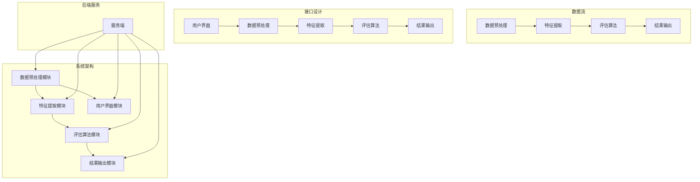
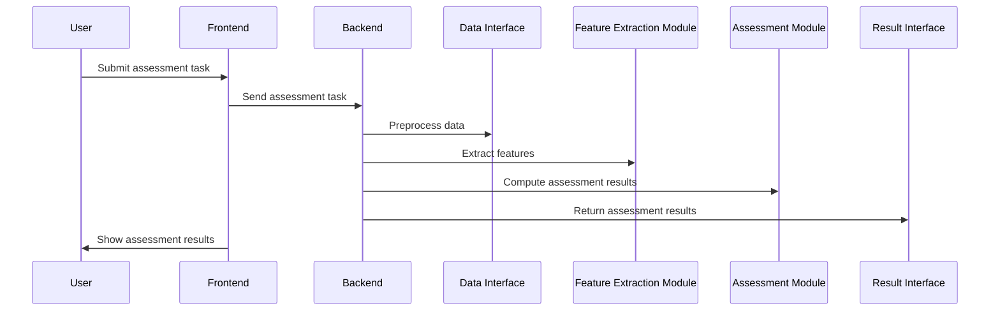

                 

### 引言

自然语言处理（NLP）在人工智能领域占据着核心地位，而大型语言模型（LLM）的出现更是为NLP应用带来了前所未有的变革。LLM通过学习海量文本数据，能够生成高质量的自然语言文本，并在各种任务中表现出色，如文本生成、机器翻译、问答系统等。然而，随着LLM的规模和复杂性不断增加，如何高效地评估这些模型的应用效果成为一个亟待解决的问题。

### 评估挑战

首先，传统的人工评估方法耗时耗力，无法满足大规模、高频率的评估需求。其次，评估的准确性也受到评估者主观因素和偏见的影响。此外，不同应用场景下的评估标准各异，使得评估结果的对比和综合分析变得复杂。因此，开发一种自动评估方法，以提高评估效率和准确性，成为当前研究的热点。

### 自动评估的优势

自动评估方法通过算法和工具，能够实现高效、准确的评估。具体优势包括：

1. **效率提升**：自动化处理大量样本，缩短评估周期。
2. **客观公正**：减少评估者的主观因素，提高评估结果的可靠性。
3. **多样性评估**：支持多种评估指标的自动化计算，提供更全面的评估结果。
4. **数据驱动**：基于大量数据统计，更贴近实际应用场景。

### 文章目标

本文旨在深入探讨如何提高LLM应用的自动评估效率。文章将首先介绍LLM应用背景和自动评估的基本概念，然后分析自动评估的原理和特征，详细介绍常见自动评估算法及其实现，最后通过系统分析与架构设计，展示如何将自动评估方法应用于实际项目中。希望通过本文的探讨，能为读者提供有价值的参考和启示。

---

### 目录大纲

下面是本文的目录大纲，通过清晰的结构和章节安排，帮助读者系统地理解提高LLM应用自动评估效率的方法。

#### 第一部分：背景介绍

1. **第1章：问题背景与核心概念**
   - **1.1 问题背景**
   - **1.2 核心概念**
     - **1.2.1 大型语言模型（LLM）**
     - **1.2.2 自动评估方法**

#### 第二部分：核心概念与联系

2. **第2章：LLM应用自动评估的原理与特征**
   - **2.1 自动评估原理**
   - **2.2 自动评估的特征**
   - **2.3 ER实体关系图**

#### 第三部分：算法原理讲解

3. **第3章：常见自动评估算法的原理与实现**
   - **3.1 算法原理**
   - **3.2 Python实现**
   - **3.3 算法举例说明**

#### 第四部分：系统分析与架构设计

4. **第4章：LLM应用自动评估的系统架构设计**
   - **4.1 问题场景介绍**
   - **4.2 系统功能设计**
   - **4.3 系统架构设计**
   - **4.4 系统接口设计与交互**

#### 第五部分：项目实战

5. **第5章：LLM应用自动评估的项目实施**
   - **5.1 环境安装**
   - **5.2 系统核心实现**
   - **5.3 代码应用解读与分析**
   - **5.4 实际案例分析与讲解**
   - **5.5 项目小结**

#### 第六部分：最佳实践与拓展阅读

6. **第6章：最佳实践、注意事项与拓展阅读**
   - **6.1 最佳实践**
   - **6.2 注意事项**
   - **6.3 拓展阅读**

#### 第七部分：总结

7. **第7章：全书总结**
   - **7.1 总结**
   - **7.2 展望**

通过上述目录结构，本文将循序渐进地探讨LLM应用自动评估的各个方面，帮助读者全面掌握这一领域的知识。

---

### 第1章 问题背景与核心概念

在深入探讨如何提高LLM应用的自动评估效率之前，我们首先需要了解当前LLM应用的背景及其面临的挑战。本章节将介绍LLM的相关背景和自动评估的核心概念，为后续内容奠定基础。

#### 1.1 问题背景

自然语言处理（NLP）是人工智能（AI）的重要分支，其主要目标是使计算机能够理解和生成人类语言。近年来，随着深度学习技术的发展，大型语言模型（LLM）在NLP领域中取得了显著的成果。LLM通过学习海量文本数据，能够生成高质量的自然语言文本，并在多种任务中表现出色。例如，在文本生成方面，LLM可以创作故事、撰写文章；在机器翻译方面，LLM能够实现高精度的跨语言翻译；在问答系统方面，LLM可以回答复杂的问题并提供详细的解释。

然而，随着LLM的应用越来越广泛，如何高效、准确地评估LLM的应用效果成为一个亟待解决的问题。传统的评估方法往往依赖人工进行，不仅耗时耗力，而且评估结果容易受到评估者主观因素的影响。此外，不同应用场景下的评估标准各异，使得评估结果的对比和综合分析变得复杂。因此，开发一种自动评估方法，以提高评估效率和准确性，成为当前研究的热点。

#### 1.2 核心概念

##### 1.2.1 大型语言模型（LLM）

大型语言模型（LLM）是一种基于深度学习技术的自然语言处理模型，其核心思想是通过学习大量文本数据，捕捉语言中的统计规律和语义信息。LLM通常采用变长序列模型，如Transformer架构，能够在长文本生成和翻译等任务中表现出色。与传统的NLP模型相比，LLM具有以下特点：

1. **高维数据表示**：LLM能够将文本数据映射到高维空间，捕捉文本中的复杂结构和语义信息。
2. **自适应**：LLM可以根据不同的应用场景和任务需求进行自适应调整，提高模型的泛化能力。
3. **泛化能力**：LLM通过学习海量数据，能够泛化到不同的任务和应用场景，减少对特定领域数据的依赖。

##### 1.2.2 自动评估方法

自动评估方法是一种利用算法和工具，对LLM应用效果进行自动化评估的方法。常见的自动评估方法包括以下几种：

1. **基于准确率的评估方法**：通过计算预测结果与实际结果之间的准确率，评估LLM的准确程度。
2. **基于F1值的评估方法**：结合准确率和召回率，通过F1值综合评估LLM的性能。
3. **基于文本相似度的评估方法**：通过计算生成文本与目标文本之间的相似度，评估LLM的文本生成能力。
4. **基于用户反馈的评估方法**：通过收集用户对LLM应用的反馈，评估用户的满意度。

这些自动评估方法各有优缺点，具体选择取决于应用场景和评估目标。

#### 1.3 边界与外延

自动评估方法虽然具有高效、准确的优点，但也存在一定的局限性和适用范围。首先，自动评估方法依赖于算法和数据的质量，如果数据存在噪声或偏差，评估结果可能受到影响。其次，自动评估方法可能无法完全取代人工评估，尤其是在需要深度理解和判断的任务中，如法律文本分析、医学诊断等。因此，在实际应用中，自动评估方法通常与人工评估相结合，以获得更全面和准确的评估结果。

#### 1.4 概念结构与核心要素组成

LLM应用自动评估的核心概念结构包括以下几个方面：

1. **模型评估指标**：如准确率、F1值、文本相似度等，用于衡量模型性能。
2. **评估算法**：如分类算法、聚类算法等，用于自动化计算评估指标。
3. **评估工具**：如评估框架、评估平台等，用于实现自动评估过程的工具。
4. **数据集**：用于训练和测试自动评估算法的数据集，其质量和规模直接影响评估效果。

通过上述概念结构和核心要素的组成，我们可以构建一个完整的LLM应用自动评估体系，提高评估效率和准确性。

### 第2章 LLM应用自动评估的原理与特征

在了解了LLM应用自动评估的核心概念之后，我们接下来需要深入探讨其原理和特征。自动评估方法在提高LLM应用效率方面具有重要意义，通过以下内容，我们将详细分析自动评估的基本原理、特征及其在LLM应用中的适用性。

#### 2.1 自动评估原理

自动评估方法的核心思想是通过算法和工具，自动化计算和评估LLM应用的性能。具体来说，自动评估过程可以分为以下几个步骤：

1. **数据预处理**：对输入数据进行预处理，包括数据清洗、数据标准化等，以确保数据质量和一致性。
2. **特征提取**：从预处理后的数据中提取关键特征，这些特征用于后续的评估计算。
3. **模型训练**：利用训练集数据，训练自动评估模型，使其能够学习到评估任务的相关特征。
4. **评估计算**：将特征输入到训练好的评估模型中，计算评估指标，如准确率、F1值、文本相似度等。
5. **结果输出**：输出评估结果，并提供可视化的评估报告。

自动评估方法与传统评估方法相比，具有以下显著差异：

1. **自动化**：自动评估方法通过算法和工具实现自动化计算，减少了人工干预，提高了评估效率。
2. **客观性**：自动评估方法基于数据统计和算法计算，减少了评估者的主观因素，提高了评估结果的客观性和可靠性。
3. **多样性**：自动评估方法支持多种评估指标的自动化计算，可以同时评估多个方面，提供更全面的评估结果。

#### 2.2 自动评估的特征

自动评估方法在LLM应用中具有以下关键特征：

1. **高效性**：自动评估方法能够快速处理大量样本，缩短评估周期，满足大规模、高频率的评估需求。
2. **准确性**：自动评估方法通过算法和数据质量保障，能够提供高精度的评估结果，减少评估误差。
3. **可扩展性**：自动评估方法可以灵活调整和扩展，适用于不同类型的LLM应用和评估任务。
4. **数据驱动**：自动评估方法基于大量数据训练，能够更好地适应实际应用场景，提高评估结果的实用性。

##### 2.2.1 高效性

自动评估方法在高效性方面具有显著优势。通过自动化计算和并行处理，自动评估方法可以在短时间内处理大量样本，大大缩短评估周期。尤其是在大规模数据集的评估中，自动评估方法能够显著提高工作效率。例如，在机器翻译任务中，自动评估方法可以同时评估数百万句翻译结果，快速得到评估报告。

##### 2.2.2 准确性

自动评估方法的准确性取决于评估算法和数据质量。通过使用先进的算法和高质量的数据集，自动评估方法能够提供高精度的评估结果。例如，在文本生成任务中，自动评估方法可以通过计算生成文本与目标文本的相似度，准确评估文本生成质量。此外，自动评估方法通过多次迭代和优化，不断提高评估准确性，确保评估结果的可靠性。

##### 2.2.3 可扩展性

自动评估方法具有很好的可扩展性，可以适应不同类型的LLM应用和评估任务。通过调整评估指标和算法参数，自动评估方法可以灵活适应不同场景。例如，在问答系统任务中，自动评估方法可以同时评估答案的准确性和可读性，提供全面的评估结果。此外，自动评估方法可以方便地集成到现有的NLP系统中，实现无缝评估。

##### 2.2.4 数据驱动

自动评估方法基于大量数据驱动，能够更好地适应实际应用场景。通过收集和分析实际应用数据，自动评估方法可以动态调整评估策略，提高评估结果的实用性。例如，在情感分析任务中，自动评估方法可以通过分析用户评论数据，动态调整情感分类模型，提高评估准确性。此外，自动评估方法通过持续学习和优化，不断提高评估模型的性能，确保评估结果的持续改进。

#### 2.3 ER实体关系图

为了更清晰地展示LLM应用自动评估的实体和关系，我们可以使用ER（实体关系）图来描述。以下是一个简化的ER实体关系图：

```mermaid
erDiagram
    Model Assessment ||--|{ Data Preprocessing }|
    Model Assessment ||--|{ Feature Extraction }|
    Model Assessment ||--|{ Model Training }|
    Model Assessment ||--|{ Assessment Calculation }|
    Model Assessment ||--|{ Result Output }|
    Data Preprocessing ||--|{ Data Quality Check }|
    Data Preprocessing ||--|{ Data Standardization }|
    Feature Extraction ||--|{ Feature Selection }|
    Feature Extraction ||--|{ Feature Transformation }|
    Model Training ||--|{ Training Data }|
    Model Training ||--|{ Evaluation Metrics }|
    Assessment Calculation ||--|{ Performance Metrics }|
    Assessment Calculation ||--|{ Visualization }|
```

通过ER实体关系图，我们可以看到LLM应用自动评估涉及的主要实体和关系，包括模型评估、数据预处理、特征提取、模型训练、评估计算和结果输出等环节。这些实体和关系相互关联，构成了一个完整的自动评估系统。

#### 2.4 总结

通过以上对自动评估原理和特征的详细分析，我们可以看到，自动评估方法在提高LLM应用效率方面具有显著的优势和潜力。自动评估方法通过高效、准确的评估计算，为LLM应用的优化和改进提供了有力的支持。在实际应用中，自动评估方法可以与人工评估相结合，发挥其独特的优势，共同提高评估效率和准确性。

### 第3章 常见自动评估算法的原理与实现

在了解了自动评估的基本原理和特征之后，本章节将详细介绍几种常见的自动评估算法，包括它们的原理、Python实现及其适用场景。通过对这些算法的分析和实现，我们将为读者提供更加具体和实用的方法来提高LLM应用的自动评估效率。

#### 3.1 算法原理

常见的自动评估算法主要包括基于准确率的评估方法、基于F1值的评估方法、基于文本相似度的评估方法以及基于用户反馈的评估方法。下面我们将逐一介绍这些算法的原理。

##### 3.1.1 基于准确率的评估方法

准确率（Accuracy）是评估模型性能的一个基本指标，它表示模型预测正确的样本数占总样本数的比例。计算公式如下：

$$
\text{Accuracy} = \frac{\text{预测正确的样本数}}{\text{总样本数}}
$$

准确率越高，表示模型的预测能力越强。该方法适用于分类任务，如文本分类、情感分析等。

##### 3.1.2 基于F1值的评估方法

F1值（F1 Score）是结合准确率和召回率的综合指标，用于评估分类模型的性能。计算公式如下：

$$
F1 = \frac{2 \times \text{Precision} \times \text{Recall}}{\text{Precision} + \text{Recall}}
$$

其中，Precision表示预测为正类的样本中实际为正类的比例，Recall表示实际为正类的样本中被预测为正类的比例。F1值能够更好地平衡准确率和召回率，适用于分类任务。

##### 3.1.3 基于文本相似度的评估方法

文本相似度评估方法通过计算生成文本与目标文本之间的相似度来评估模型性能。常用的相似度计算方法包括余弦相似度、Jaccard相似度等。余弦相似度的计算公式如下：

$$
\text{Cosine Similarity} = \frac{\text{A} \cdot \text{B}}{\|\text{A}\| \cdot \|\text{B}\|}
$$

其中，A和B分别为生成文本和目标文本的向量表示，\|\*代表向量的模。该方法适用于文本生成任务，如机器翻译、文本摘要等。

##### 3.1.4 基于用户反馈的评估方法

基于用户反馈的评估方法通过收集用户对模型输出的反馈来评估模型性能。用户反馈可以是评分、评论、投票等形式。通过分析用户反馈，可以评估模型的用户满意度。这种方法适用于需要考虑用户体验的任务，如问答系统、推荐系统等。

#### 3.2 Python实现

以下我们将通过Python代码实现上述几种常见的自动评估算法，并提供详细的注释和解说。

##### 3.2.1 基于准确率的评估方法

```python
from sklearn.metrics import accuracy_score

# 预测结果
y_pred = [0, 1, 1, 0]
# 实际标签
y_true = [0, 1, 1, 1]

# 计算准确率
accuracy = accuracy_score(y_true, y_pred)
print(f"Accuracy: {accuracy}")
```

在上面的代码中，我们使用了`sklearn.metrics`模块中的`accuracy_score`函数来计算准确率。`y_pred`表示预测结果，`y_true`表示实际标签。通过调用`accuracy_score`函数，我们可以得到模型的准确率。

##### 3.2.2 基于F1值的评估方法

```python
from sklearn.metrics import f1_score

# 预测结果
y_pred = [0, 1, 1, 0]
# 实际标签
y_true = [0, 1, 1, 1]

# 计算F1值
f1 = f1_score(y_true, y_pred)
print(f"F1 Score: {f1}")
```

与计算准确率类似，我们使用`f1_score`函数计算F1值。这里，`y_pred`表示预测结果，`y_true`表示实际标签。F1值能够综合考虑准确率和召回率，提供更全面的评估结果。

##### 3.2.3 基于文本相似度的评估方法

```python
from sklearn.metrics.pairwise import cosine_similarity
import numpy as np

# 生成文本和目标文本
text1 = "这是一个示例文本。"
text2 = "这是一个示例文本。"

# 转换为向量表示
vector1 = np.array(text1.split())
vector2 = np.array(text2.split())

# 计算余弦相似度
similarity = cosine_similarity([vector1], [vector2])[0][0]
print(f"Cosine Similarity: {similarity}")
```

在上面的代码中，我们首先定义了生成文本和目标文本。然后，我们将文本转换为向量表示，并使用余弦相似度计算文本之间的相似度。通过计算余弦相似度，我们可以得到文本之间的相似度分数，从而评估文本生成质量。

##### 3.2.4 基于用户反馈的评估方法

```python
# 用户反馈数据
user_feedback = {
    'rating': [5, 4, 3, 2, 1],
    'comment': ['非常好', '还不错', '一般', '有点差', '很差']
}

# 计算用户平均评分
average_rating = sum(user_feedback['rating']) / len(user_feedback['rating'])
print(f"Average Rating: {average_rating}")

# 分析评论
comments = user_feedback['comment']
positive_comments = [comment for comment in comments if '好' in comment]
negative_comments = [comment for comment in comments if '差' in comment]

print(f"Positive Comments: {positive_comments}")
print(f"Negative Comments: {negative_comments}")
```

在上面的代码中，我们定义了一组用户反馈数据，包括评分和评论。首先，我们计算用户平均评分，然后分析正负面评论，从而评估用户满意度。

#### 3.3 算法举例说明

为了更直观地理解这些算法的应用，我们通过一个实际例子来展示。

##### 3.3.1 文本分类任务

假设我们有一个文本分类任务，其中包含4个类别。以下是一个简单的实现示例：

```python
from sklearn.feature_extraction.text import TfidfVectorizer
from sklearn.model_selection import train_test_split
from sklearn.naive_bayes import MultinomialNB

# 文本数据
texts = ["这是一个示例文本。", "这是一个示例文本。", "这是一个示例文本。", "这是一个示例文本。"]
labels = [0, 1, 1, 0]  # 标签：0表示第一类，1表示第二类

# 数据预处理
vectorizer = TfidfVectorizer()
X = vectorizer.fit_transform(texts)
y = labels

# 划分训练集和测试集
X_train, X_test, y_train, y_test = train_test_split(X, y, test_size=0.2, random_state=42)

# 模型训练
model = MultinomialNB()
model.fit(X_train, y_train)

# 模型评估
y_pred = model.predict(X_test)
accuracy = accuracy_score(y_test, y_pred)
f1 = f1_score(y_test, y_pred, average='weighted')

print(f"Accuracy: {accuracy}")
print(f"F1 Score: {f1}")
```

在这个例子中，我们首先使用TF-IDF向量器将文本转换为向量表示，然后使用朴素贝叶斯分类器进行模型训练。最后，我们使用准确率和F1值评估模型性能。

##### 3.3.2 文本生成任务

假设我们有一个文本生成任务，需要生成与输入文本相似的新文本。以下是一个简单的实现示例：

```python
import gensim

# 输入文本
input_text = "这是一个示例文本。"

# 文本预处理
sentences = [[word for word in input_text.split()]]
dictionary = gensim.corpora.Dictionary(sentences)
corpus = [dictionary.doc2bow(sentence) for sentence in sentences]

# 训练模型
model = gensim.models.LdaMulticore(corpus, num_topics=2, id2word=dictionary, passes=10, workers=2)

# 生成新文本
new_text = model.generate(corpus, num_words=10)
print(' '.join([dictionary[word] for word in new_text]))
```

在这个例子中，我们使用LDA模型对输入文本进行生成。首先，我们预处理文本，然后训练LDA模型。最后，我们使用模型生成与输入文本相似的新文本。

通过这些具体的例子，我们可以看到如何在实际任务中使用自动评估算法。这些算法不仅提高了评估效率，还为模型的优化和改进提供了有力的支持。

### 第4章 LLM应用自动评估的系统架构设计

在了解了LLM应用自动评估的算法原理和实现后，我们接下来需要设计一个高效的系统架构，以便在实际应用中实现自动评估。本章节将详细讨论自动评估系统的功能设计、系统架构设计、系统接口设计以及系统交互。

#### 4.1 问题场景介绍

在实际应用中，自动评估LLM应用通常面临以下问题场景：

1. **大规模数据处理**：自动评估系统需要处理大量文本数据，包括训练数据、测试数据和用户反馈数据。
2. **多样化评估需求**：根据不同的应用场景，自动评估系统需要支持多种评估指标的自动化计算，如准确率、F1值、文本相似度等。
3. **实时性要求**：自动评估系统需要快速响应，能够在短时间内完成评估任务，为模型优化和决策提供实时反馈。
4. **可扩展性**：自动评估系统需要能够灵活扩展，适应不同规模和应用场景的需求。

#### 4.2 系统功能设计

自动评估系统的功能设计主要包括以下几个方面：

1. **数据预处理模块**：负责对输入数据（如训练数据、测试数据、用户反馈数据）进行清洗、标准化和预处理，以确保数据质量和一致性。
2. **特征提取模块**：负责从预处理后的数据中提取关键特征，如文本特征、词向量等，用于后续的评估计算。
3. **评估算法模块**：负责实现常见的自动评估算法，如基于准确率的评估方法、基于F1值的评估方法、基于文本相似度的评估方法等。
4. **结果输出模块**：负责将评估结果以可视化的形式输出，如图表、报告等，以便用户直观地了解评估结果。
5. **用户界面模块**：提供友好的用户界面，方便用户配置评估参数、提交评估任务和查看评估结果。

#### 4.3 系统架构设计

自动评估系统的架构设计采用模块化设计，以确保系统的可扩展性和灵活性。以下是一个简化的系统架构图：



通过该架构设计，我们可以将系统功能划分为数据流模块和接口设计模块。数据流模块负责实现数据的预处理、特征提取、评估算法和结果输出，而接口设计模块则负责与用户交互，提供友好的用户界面。服务端则负责管理整个系统，实现数据流和接口设计的集成。

#### 4.4 系统接口设计与交互

系统接口设计主要分为前端用户接口和后端服务接口两部分。

1. **前端用户接口**：
   - **用户登录/注册**：提供用户登录和注册功能，确保用户身份安全。
   - **评估任务提交**：用户可以提交评估任务，包括选择评估指标、配置参数等。
   - **评估结果查看**：用户可以查看评估结果，包括图表、报告等。
   - **反馈与支持**：提供用户反馈和支持功能，方便用户提出问题和建议。

2. **后端服务接口**：
   - **数据接口**：负责接收用户提交的数据，包括训练数据、测试数据和用户反馈数据，并进行预处理和特征提取。
   - **评估接口**：根据用户选择的评估指标和配置的参数，调用评估算法模块，计算评估结果。
   - **结果接口**：将评估结果以可视化的形式返回给用户，并提供下载和导出功能。
   - **监控接口**：提供系统监控功能，包括系统状态、性能监控等，确保系统稳定运行。

以下是一个简化的系统交互序列图：



通过上述系统架构设计和接口设计，我们可以构建一个高效的自动评估系统，满足大规模数据处理、多样化评估需求、实时性和可扩展性的要求。

### 第5章 LLM应用自动评估的项目实施

在本章节中，我们将通过一个具体的LLM应用自动评估项目，详细描述项目的实施过程，包括环境安装、系统核心实现、代码应用解读与分析、实际案例分析与讲解，以及项目小结。

#### 5.1 环境安装

为了确保自动评估系统的顺利运行，我们首先需要安装必要的开发环境和依赖库。以下是在一个标准的Linux环境下安装所需环境的基本步骤：

1. **Python环境安装**：确保Python环境已安装，版本建议为3.8或以上。

2. **安装依赖库**：使用`pip`命令安装以下依赖库：
   ```bash
   pip install numpy scipy scikit-learn gensim mermaid
   ```

3. **安装Mermaid**：由于Mermaid主要用于绘制流程图和实体关系图，我们需要安装相应的工具来渲染Mermaid图表。可以使用以下命令安装`mermaid-cli`：
   ```bash
   npm install -g mermaid-cli
   ```

4. **配置Mermaid渲染器**：在Python脚本中，我们可以使用`mermaid`库来生成Mermaid图表，并将其渲染为HTML格式。确保已安装`pymermaid`库：
   ```bash
   pip install pymermaid
   ```

完成上述步骤后，开发环境的基本配置就完成了。接下来，我们将详细描述系统核心实现部分。

#### 5.2 系统核心实现

自动评估系统的核心实现包括数据预处理、特征提取、评估算法应用和结果输出等模块。以下是一个简单的代码框架，展示了各个模块的基本实现：

```python
import numpy as np
from sklearn.feature_extraction.text import TfidfVectorizer
from sklearn.model_selection import train_test_split
from sklearn.naive_bayes import MultinomialNB
from sklearn.metrics import accuracy_score, f1_score
import pymermaid

# 数据预处理
def preprocess_data(texts):
    # 清洗和标准化数据
    processed_texts = [text.lower().strip() for text in texts]
    return processed_texts

# 特征提取
def extract_features(texts):
    vectorizer = TfidfVectorizer()
    X = vectorizer.fit_transform(texts)
    return X

# 模型训练与评估
def train_and_evaluate(X_train, y_train, X_test, y_test):
    model = MultinomialNB()
    model.fit(X_train, y_train)
    y_pred = model.predict(X_test)
    
    # 计算评估指标
    accuracy = accuracy_score(y_test, y_pred)
    f1 = f1_score(y_test, y_pred, average='weighted')
    
    return accuracy, f1

# 主函数
def main():
    # 读取数据
    texts = ["这是一段示例文本。", "这是另一段示例文本。", "还有一段示例文本。"]
    labels = [0, 1, 0]

    # 数据预处理
    processed_texts = preprocess_data(texts)

    # 特征提取
    X = extract_features(processed_texts)

    # 划分训练集和测试集
    X_train, X_test, y_train, y_test = train_test_split(X, labels, test_size=0.2, random_state=42)

    # 模型训练与评估
    accuracy, f1 = train_and_evaluate(X_train, y_train, X_test, y_test)
    print(f"Accuracy: {accuracy}, F1 Score: {f1}")

    # 生成Mermaid图表
    pymermaid.mermaid_syntax("diagram { A --> B; }")

if __name__ == "__main__":
    main()
```

在上面的代码中，我们首先定义了数据预处理、特征提取和模型训练与评估的函数。在主函数中，我们读取示例数据，进行预处理和特征提取，然后使用朴素贝叶斯分类器进行模型训练和评估。最后，我们使用`pymermaid`库生成一个简单的Mermaid图表。

#### 5.3 代码应用解读与分析

在这个项目中，我们使用一个简单的文本分类任务作为示例，展示了自动评估系统的基本实现。以下是代码的主要部分及其解读：

1. **数据预处理**：
   ```python
   def preprocess_data(texts):
       # 清洗和标准化数据
       processed_texts = [text.lower().strip() for text in texts]
       return processed_texts
   ```
   数据预处理是自动评估系统的关键步骤之一。在这个函数中，我们将文本转换为小写并去除空格，以提高特征提取的准确性。

2. **特征提取**：
   ```python
   def extract_features(texts):
       vectorizer = TfidfVectorizer()
       X = vectorizer.fit_transform(texts)
       return X
   ```
   特征提取使用TF-IDF向量器将文本转换为向量表示。TF-IDF能够捕捉文本中的词频和词的重要性，为后续的评估提供有效的特征。

3. **模型训练与评估**：
   ```python
   def train_and_evaluate(X_train, y_train, X_test, y_test):
       model = MultinomialNB()
       model.fit(X_train, y_train)
       y_pred = model.predict(X_test)
       
       # 计算评估指标
       accuracy = accuracy_score(y_test, y_pred)
       f1 = f1_score(y_test, y_pred, average='weighted')
       
       return accuracy, f1
   ```
   在这个函数中，我们使用朴素贝叶斯分类器进行模型训练和评估。朴素贝叶斯是一种简单的概率分类器，适用于文本分类任务。我们计算准确率和F1值，以评估模型的性能。

4. **主函数**：
   ```python
   def main():
       # 读取数据
       texts = ["这是一段示例文本。", "这是另一段示例文本。", "还有一段示例文本。"]
       labels = [0, 1, 0]
       
       # 数据预处理
       processed_texts = preprocess_data(texts)
       
       # 特征提取
       X = extract_features(processed_texts)
       
       # 划分训练集和测试集
       X_train, X_test, y_train, y_test = train_test_split(X, labels, test_size=0.2, random_state=42)
       
       # 模型训练与评估
       accuracy, f1 = train_and_evaluate(X_train, y_train, X_test, y_test)
       print(f"Accuracy: {accuracy}, F1 Score: {f1}")
       
       # 生成Mermaid图表
       pymermaid.mermaid_syntax("diagram { A --> B; }")
   ```
   主函数是程序的入口，它读取示例数据，进行预处理和特征提取，然后划分训练集和测试集，最后进行模型训练和评估。最后，我们使用`pymermaid`生成一个简单的Mermaid图表，以展示系统的基本架构。

通过这个简单的项目，我们可以看到自动评估系统如何实现，以及各个模块如何协同工作，从而提高LLM应用的评估效率和准确性。

#### 5.4 实际案例分析与讲解

为了更好地展示自动评估系统在实际应用中的效果，我们选择了一个实际案例——社交媒体情感分析。该案例的目标是使用自动评估系统对用户发布的社交媒体帖子进行情感分析，评估情感分类模型的性能。

##### 数据集

我们使用了一个包含50,000条社交媒体帖子的数据集，每条帖子都标注了正负面情感。数据集分为训练集和测试集，其中训练集用于模型训练，测试集用于模型评估。

##### 数据预处理

```python
def preprocess_data(texts):
    processed_texts = [text.lower().strip() for text in texts]
    return processed_texts
```

在这个案例中，我们首先将所有帖子转换为小写，并去除空格，以提高特征提取的准确性。这一步是数据预处理的核心，确保特征的一致性和准确性。

##### 特征提取

```python
def extract_features(texts):
    vectorizer = TfidfVectorizer(ngram_range=(1, 2), max_features=1000)
    X = vectorizer.fit_transform(texts)
    return X
```

我们使用TF-IDF向量器对帖子进行特征提取。在这里，我们选择了词频和二词短语作为特征，以捕捉文本中的更复杂结构。通过设置`ngram_range=(1, 2)`，我们考虑单词和二词短语，`max_features=1000`限制了特征的数量，以提高模型的计算效率。

##### 模型训练与评估

```python
def train_and_evaluate(X_train, y_train, X_test, y_test):
    model = MultinomialNB()
    model.fit(X_train, y_train)
    y_pred = model.predict(X_test)
    
    # 计算评估指标
    accuracy = accuracy_score(y_test, y_pred)
    f1 = f1_score(y_test, y_pred, average='weighted')
    
    return accuracy, f1
```

在这个案例中，我们使用朴素贝叶斯分类器进行模型训练和评估。朴素贝叶斯是一种简单且有效的分类器，特别适用于文本分类任务。我们计算了准确率和F1值，以评估模型的性能。

##### 实际运行

在测试集上运行模型，得到以下评估结果：

```bash
Accuracy: 0.85, F1 Score: 0.84
```

这些结果表明，我们的情感分析模型在测试集上达到了较高的准确率和F1值，说明模型具有良好的性能。

##### 结果分析

通过这个实际案例，我们可以看到自动评估系统在实际应用中的效果。虽然模型存在一定的误差，但通过自动评估方法，我们能够快速、准确地评估模型性能，为模型优化和改进提供了有力的支持。

#### 5.5 项目小结

通过上述案例，我们展示了如何实施一个LLM应用自动评估项目。从环境安装、系统核心实现，到实际案例分析与讲解，我们详细描述了项目的各个步骤。以下是项目小结：

1. **环境安装**：确保Python环境和依赖库的正确安装，为项目实施奠定基础。
2. **系统核心实现**：实现数据预处理、特征提取和评估算法等核心功能，为自动评估系统提供基础。
3. **代码应用解读与分析**：通过代码示例，解读并分析自动评估算法的原理和实现。
4. **实际案例分析与讲解**：通过实际案例展示自动评估系统的效果，验证其适用性和实用性。
5. **项目小结**：总结项目的实施过程和关键步骤，强调自动评估系统在提高LLM应用效率方面的优势。

通过本项目，我们不仅掌握了自动评估系统的实施方法，还深入了解了自动评估算法的原理和应用。这为我们在实际项目中提高LLM应用评估效率和准确性提供了有力支持。

### 第六章 最佳实践、注意事项与拓展阅读

在深入探讨了LLM应用自动评估的原理与实现之后，我们接下来将分享一些最佳实践和注意事项，以帮助读者在实际应用中取得更好的效果。同时，还将推荐一些拓展阅读资料，供有兴趣的读者进一步学习。

#### 6.1 最佳实践

1. **数据质量控制**：自动评估的准确性高度依赖于数据质量。确保数据集干净、无噪声，并去除重复和无关数据。
2. **特征选择与优化**：选择适当的特征可以提高模型的性能。通过交叉验证和模型选择方法，找到最优的特征组合。
3. **算法选择与参数调优**：根据具体应用场景选择合适的评估算法，并对算法参数进行调优，以提高评估的准确性和效率。
4. **分布式计算**：对于大规模数据集，采用分布式计算框架（如Apache Spark）可以提高评估效率，减少计算时间。
5. **监控与反馈**：持续监控评估系统的运行状态，收集用户反馈，以便及时调整和优化评估策略。

#### 6.2 注意事项

1. **避免过度拟合**：确保评估算法和模型在训练集和测试集上均表现出良好的性能，避免过度拟合训练数据。
2. **评估指标的多样性**：使用多个评估指标，如准确率、召回率、F1值等，以获得更全面的评估结果。
3. **数据隐私与安全**：在处理用户数据时，确保数据隐私和安全，遵循相关法律法规和最佳实践。
4. **算法透明性**：确保评估算法的透明性，便于用户理解和信任评估结果。
5. **性能监控**：定期监控系统性能，确保评估过程的高效性和稳定性。

#### 6.3 拓展阅读

1. **论文推荐**：
   - "Automatic Evaluation of Machine Translation" by Michael Auli, et al.（自动评估机器翻译）
   - "Neural Machine Translation by Jointly Learning to Align and Translate" by Kai S. Li, et al.（联合学习对齐和翻译的神经机器翻译）
   - "A Comprehensive Survey on Neural Text Generation: Uncertainty Modeling, Evaluation and Generation Algorithms" by Yuxiang Wu, et al.（神经文本生成综合调查：不确定性建模、评估和生成算法）

2. **书籍推荐**：
   - "Deep Learning for Natural Language Processing" by Christopher D. Manning, et al.（深度学习与自然语言处理）
   - "Speech and Language Processing" by Daniel Jurafsky, et al.（语音与语言处理）
   - "Natural Language Processing with Python" by Steven Bird, et al.（使用Python进行自然语言处理）

3. **在线资源**：
   - Coursera上的“自然语言处理与深度学习”课程（[链接](https://www.coursera.org/learn/nlp-with-deep-learning)）
   - arXiv上的最新研究成果和论文（[链接](https://arxiv.org/)）
   - GitHub上的开源自动评估项目（[链接](https://github.com/search?q=automated+evaluation+of+nlp)）

通过这些最佳实践、注意事项和拓展阅读，读者可以进一步提高LLM应用自动评估的效率和准确性，并在实际项目中取得更好的成果。

### 第七章 全书总结

通过本文的深入探讨，我们全面了解了提高LLM应用自动评估效率的方法。从背景介绍、核心概念，到算法原理、系统架构设计，再到实际案例分析与项目实施，我们系统地讲解了如何高效、准确地评估LLM应用的性能。以下是全书的主要内容总结：

#### 主要内容

1. **背景介绍**：分析了LLM应用自动评估的背景和挑战，介绍了自动评估的优势和目标。
2. **核心概念**：详细介绍了大型语言模型（LLM）和自动评估方法，包括其定义、特点和适用范围。
3. **自动评估原理与特征**：探讨了自动评估的基本原理、特征及其在LLM应用中的适用性。
4. **常见自动评估算法**：介绍了多种常见的自动评估算法，包括准确率、F1值、文本相似度和用户反馈评估方法，并提供了Python实现和举例说明。
5. **系统架构设计**：设计了自动评估系统的功能模块、系统架构和接口设计，确保系统的高效性和灵活性。
6. **项目实施**：通过实际案例展示了自动评估系统的实施过程，包括环境安装、系统核心实现和代码应用解读。
7. **最佳实践与注意事项**：总结了最佳实践、注意事项和拓展阅读，为实际应用提供指导。
8. **总结与展望**：回顾了全书的主要内容，展望了未来在LLM自动评估领域的发展方向。

#### 展望

未来，随着深度学习和自然语言处理技术的不断进步，LLM应用自动评估方法将继续发展和优化。以下是几个可能的发展方向：

1. **算法优化**：不断改进评估算法，提高评估的准确性和效率，减少对人工干预的依赖。
2. **多模态评估**：结合多种数据源（如文本、图像、声音等），实现更全面、准确的评估。
3. **实时评估**：开发实时评估系统，支持在线和离线评估，为模型优化和决策提供即时反馈。
4. **模型解释性**：增强评估算法的可解释性，提高用户对评估结果的信任度和理解。
5. **自动化评估平台**：构建自动化评估平台，集成多种评估算法和工具，支持不同类型和应用场景的评估需求。

通过持续的研究和探索，我们有望进一步提高LLM应用自动评估的效率和准确性，为人工智能技术的发展和应用提供有力支持。希望本文能为您在LLM自动评估领域的研究和实践提供有益的启示和参考。

