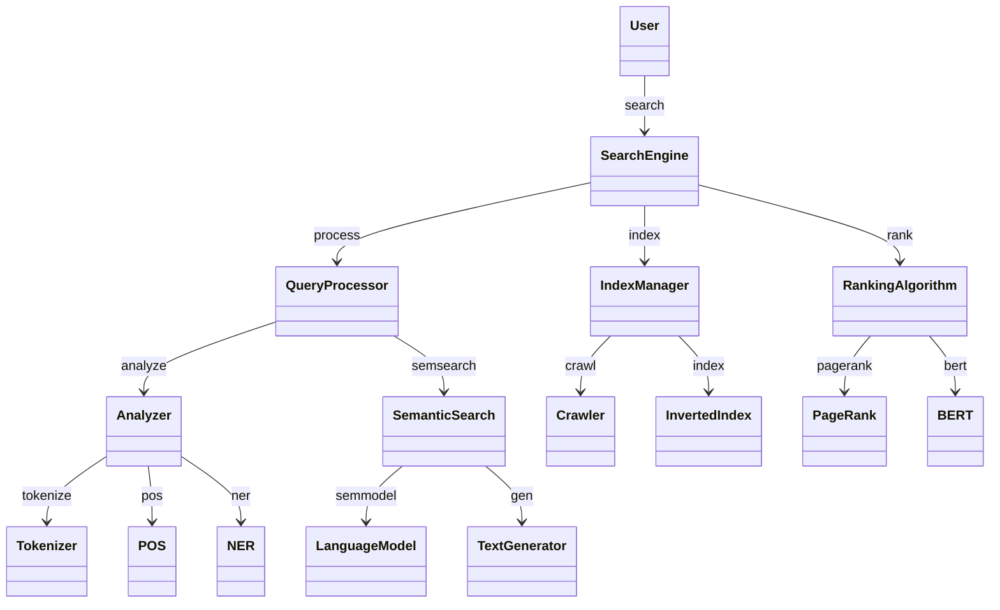
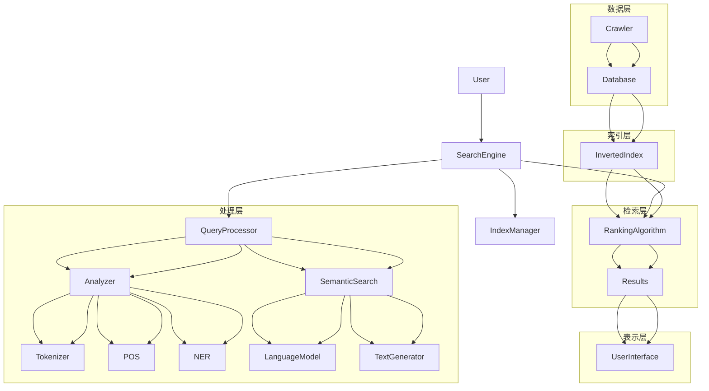
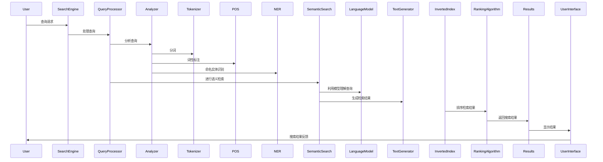

                 

### 第一部分：搜索引擎技术与LLM应用背景

## 第1章：搜索引擎技术概述

### 1.1 搜索引擎技术的发展历程

搜索引擎技术是互联网时代不可或缺的一部分，它的发展历程反映了信息检索技术的演进和变革。从最初的Web搜索引擎到如今的AI搜索引擎，每一次技术革新都带来了检索效率和用户体验的显著提升。

#### 1.1.1 从Web搜索引擎到AI搜索引擎的演进

Web搜索引擎的诞生可以追溯到1990年代中期，最早期的搜索引擎如AltaVista和Yahoo，它们主要依赖关键词匹配和反向链接来索引网页。随着互联网的迅猛发展，网页数量爆炸式增长，这些早期搜索引擎逐渐暴露出不足，如检索结果重复、准确度低等问题。

为了应对这些挑战，搜索引擎技术开始向深度学习和自然语言处理（NLP）领域延伸。Google于2000年代初期推出的PageRank算法，通过分析网页间的链接关系来评估网页的重要性，极大地提升了检索结果的准确性和相关性。随后，搜索引擎技术不断发展，如倒排索引、查询解析、语言模型等技术的引入，使得搜索引擎能够更好地理解和回应用户的查询需求。

近年来，随着人工智能（AI）技术的发展，AI搜索引擎逐渐崛起。AI搜索引擎不再仅仅依赖于关键词匹配，而是通过深度学习模型来理解用户查询的语义，提供更加智能化、个性化的搜索结果。例如，百度、微软Bing等搜索引擎已经引入了基于生成式预训练模型（如GPT-3）的智能搜索功能，显著提升了搜索的智能化水平。

#### 1.1.2 搜索引擎的核心功能

搜索引擎的核心功能主要包括索引、查询和检索。这些功能共同作用，为用户提供准确、高效的搜索服务。

- **索引**：搜索引擎通过爬虫程序（如Google的Crawler）遍历互联网，收集网页内容，并将其转换为索引数据结构。索引数据结构通常采用倒排索引（Inverted Index），使得搜索引擎可以在短时间内快速定位到用户查询的相关网页。

- **查询**：用户输入查询关键词后，搜索引擎会进行查询解析，将自然语言的查询转化为可以理解的结构化数据。查询解析包括分词、词性标注、命名实体识别等步骤，以确保查询的准确性和语义完整性。

- **检索**：在解析查询后，搜索引擎会利用索引数据进行检索，匹配用户查询与索引中的关键词和语义。检索过程中，搜索引擎会根据一系列排名算法（如PageRank、BERT评分等）对结果进行排序，确保最相关的内容排在前列。

#### 1.1.3 搜索引擎的分类与特点

根据不同的技术和应用场景，搜索引擎可以分为多种类型，每种类型都有其独特的特点和优势。

- **全文搜索引擎**：这类搜索引擎可以索引整个网页的内容，并提供全文搜索功能。代表产品有Google、百度等。全文搜索引擎通常采用复杂的文本处理算法和机器学习模型，以提供高质量的搜索结果。

- **垂直搜索引擎**：这类搜索引擎专注于特定领域的信息检索，如学术搜索（如Google Scholar）、新闻搜索（如新浪新闻搜索）等。垂直搜索引擎通常对特定领域的数据有深度挖掘能力，可以提供更加专业、精准的搜索结果。

- **知识图谱搜索引擎**：这类搜索引擎通过构建知识图谱，将实体、属性和关系进行结构化组织，提供基于图谱的搜索功能。代表产品有微软Bing的Satori搜索引擎。知识图谱搜索引擎可以提供基于实体关系的高级搜索功能，如关联搜索、推荐搜索等。

- **智能问答搜索引擎**：这类搜索引擎利用自然语言处理技术，理解和回答用户提出的问题。代表产品有Google Assistant、亚马逊Alexa等。智能问答搜索引擎可以实现自然语言交互，提供更加智能化、个性化的搜索体验。

### 1.2 LLM应用场景分析

随着大型语言模型（LLM）技术的快速发展，LLM在各种应用场景中展现出了强大的潜力和优势。以下将分析LLM在信息检索、问答系统、内容推荐等场景中的具体应用及其面临的挑战。

#### 1.2.1 LLM在信息检索中的应用

LLM在信息检索中的应用主要是通过理解和生成文本来提升检索效率和准确性。具体来说，LLM可以通过以下方式提升信息检索效果：

- **语义检索**：传统的搜索引擎依赖于关键词匹配，而LLM可以理解查询的语义，提供更加精准的检索结果。例如，用户查询“2023年诺贝尔物理学奖是谁获得的？”时，LLM可以识别出“2023年诺贝尔物理学奖”和“获得者”这两个关键词，并从中提取出具体的实体信息。

- **长文本检索**：LLM可以处理和理解长文本，这使得它在处理复杂查询和长文档检索时具有优势。例如，用户查询“人工智能在医疗领域的应用有哪些？”时，LLM可以从大量的医疗文献中检索出相关的应用场景和研究成果。

然而，LLM在信息检索中也面临一些挑战：

- **数据质量**：LLM的检索效果很大程度上取决于训练数据的质量。如果训练数据存在偏差或错误，LLM的检索结果也会受到影响。

- **计算资源**：由于LLM的训练和推理需要大量的计算资源，这使得它在大规模部署时存在一定的挑战。例如，在一个大型企业内部署LLM搜索系统，需要配置高性能的计算设备和服务器。

#### 1.2.2 LLM在问答系统中的应用

LLM在问答系统中的应用非常广泛，它可以理解和生成自然语言文本，从而提供高效的问答服务。以下是一些典型的应用场景：

- **客户服务**：许多企业使用LLM构建智能客服系统，通过自然语言交互来解答客户的常见问题。例如，银行、电商平台等可以使用LLM来处理客户的查询和投诉，提高客户满意度。

- **教育辅导**：LLM可以构建智能教育系统，为学生提供个性化的辅导服务。例如，学生可以提出学习问题，LLM可以生成详细的解答和解释，帮助学生更好地理解知识点。

- **科研支持**：LLM可以帮助科研人员快速获取相关的研究成果和文献资料，从而提高科研效率。例如，科学家可以提出研究问题，LLM可以生成相关的论文摘要、实验方法和结论，为科研工作提供参考。

在问答系统中，LLM的应用也面临一些挑战：

- **答案准确性**：由于LLM生成的答案可能基于错误的假设或数据，因此需要对其准确性进行严格的评估和验证。

- **知识更新**：LLM的知识库需要定期更新，以保持答案的时效性和准确性。例如，对于快速发展的技术领域，LLM需要不断吸收最新的研究成果和资讯。

#### 1.2.3 LLM在内容推荐中的应用

LLM在内容推荐中的应用主要体现在生成和推荐个性化内容。以下是一些具体的场景：

- **社交媒体**：社交媒体平台可以使用LLM生成个性化推荐内容，例如根据用户的兴趣和行为，推荐相关的话题、文章和视频。

- **电子商务**：电商平台可以使用LLM生成个性化的产品推荐文案，从而提高用户的购买转化率。例如，当用户浏览了某个产品后，LLM可以生成一个吸引人的推荐文案，引导用户进行购买。

- **新闻推荐**：新闻平台可以使用LLM生成个性化的新闻摘要和推荐列表，使用户能够更快地获取感兴趣的新闻内容。

在内容推荐中，LLM的应用也面临一些挑战：

- **数据隐私**：个性化推荐系统需要收集和分析用户的隐私数据，这可能引发用户隐私保护的问题。

- **计算资源消耗**：生成和推荐个性化内容需要大量的计算资源，特别是在大规模用户和内容场景下。

### 1.3 检索效率问题与挑战

#### 1.3.1 LLM检索效率的问题描述

尽管LLM在信息检索、问答系统和内容推荐等领域展现出了巨大的潜力，但其检索效率仍然存在一些问题。这些问题主要体现在以下几个方面：

- **检索速度**：由于LLM的推理过程涉及大量的计算资源，这使得它在处理大规模查询时存在速度瓶颈。尤其是在实时搜索场景中，LLM的响应速度可能无法满足用户的需求。

- **检索准确性**：LLM的检索准确性受到训练数据、模型架构和参数设置等因素的影响。在一些复杂查询场景下，LLM可能无法生成完全准确的答案。

- **可扩展性**：LLM在大规模部署时需要考虑其可扩展性。如何高效地训练和部署大规模的LLM模型，是一个重要的技术挑战。

#### 1.3.2 影响检索效率的主要因素

LLM检索效率受到多种因素的影响，以下是一些主要因素：

- **模型架构**：不同的LLM模型架构对检索效率有不同的影响。例如，基于Transformer的模型在处理长文本时具有优势，但计算资源需求较大。

- **数据质量**：训练数据的质量直接影响到LLM的检索准确性。高质量、多样化的数据可以提升模型的性能。

- **计算资源**：LLM的推理过程需要大量的计算资源，特别是在大规模部署时。如何优化计算资源的使用，是一个关键问题。

- **查询处理**：查询处理过程包括查询解析、查询扩展和查询过滤等步骤。优化这些步骤可以提升检索效率。

#### 1.3.3 提高检索效率的目标与路径

提高LLM的检索效率是一个多方面的工作，以下是一些可能的目标和路径：

- **优化模型架构**：通过设计更高效的模型架构，降低计算复杂度，提高检索速度。

- **改进数据预处理**：优化数据预处理流程，提高数据质量，从而提升模型性能。

- **并行计算与分布式部署**：利用并行计算和分布式部署技术，提高LLM的推理速度和可扩展性。

- **查询优化**：通过优化查询处理流程，减少查询解析和检索的时间消耗。

### 1.4 书籍结构与内容安排

#### 1.4.1 各章节主要内容概述

本书将分为以下几个部分，每个部分都将深入探讨搜索引擎技术和LLM应用中的关键问题：

- **第一部分：搜索引擎技术基础**：介绍搜索引擎技术的发展历程、核心功能、分类与特点。
- **第二部分：LLM应用场景分析**：分析LLM在信息检索、问答系统和内容推荐等场景中的具体应用及其挑战。
- **第三部分：搜索引擎优化与LLM集成**：探讨如何优化搜索引擎，提高LLM的检索效率。
- **第四部分：技术实现与案例分析**：详细阐述如何在实际项目中应用搜索引擎技术和LLM，并进行案例分析。
- **第五部分：未来展望与挑战**：讨论检索效率提升的潜在方向和面临的技术挑战。

#### 1.4.2 阅读建议与学习方法

为了更好地理解和掌握本书的内容，我们提供以下阅读建议和学习方法：

- **循序渐进**：按照章节顺序阅读，逐步建立对搜索引擎技术和LLM应用的整体认识。
- **理论与实践相结合**：在阅读过程中，结合实际案例和实践项目，加深对理论知识的理解。
- **互动学习**：参与论坛和社区讨论，与其他读者交流心得，共同探讨问题解决方案。
- **动手实践**：尝试编写代码、实现算法，通过实践巩固理论知识。

#### 1.4.3 实践项目与案例分析

本书将通过多个实践项目和案例分析，帮助读者将理论知识应用到实际项目中。以下是部分案例：

- **案例一**：基于LLM的智能问答系统开发，包括模型选择、数据预处理和查询处理等环节。
- **案例二**：搜索引擎优化项目，探讨如何通过改进索引结构和查询算法，提升检索效率。
- **案例三**：内容推荐系统开发，分析如何利用LLM生成个性化推荐文案，提高用户满意度。

#### 1.5 本章小结

本章对搜索引擎技术和LLM应用进行了概述，探讨了搜索引擎技术的发展历程、核心功能、分类与特点，以及LLM在信息检索、问答系统和内容推荐等场景中的应用和挑战。通过本章的阅读，读者可以对搜索引擎技术和LLM应用有一个全面的认识，为后续章节的学习奠定基础。

### 关键词

- 搜索引擎技术
- 大型语言模型（LLM）
- 信息检索
- 问答系统
- 内容推荐
- 检索效率优化

### 摘要

本文全面介绍了搜索引擎技术和大型语言模型（LLM）的应用背景，探讨了LLM在信息检索、问答系统和内容推荐等场景中的具体应用及其面临的挑战。通过分析搜索引擎技术的发展历程、核心功能和分类，本文为读者提供了一个清晰的框架，以深入理解搜索引擎技术和LLM应用的相互作用。本文的目标是阐述如何优化搜索引擎，提升LLM的检索效率，并提供实践案例和解决方案，以帮助读者将理论知识应用到实际项目中。

### 核心概念

在本章节中，我们介绍了搜索引擎技术和大型语言模型（LLM）的基础知识，以下是其中一些核心概念及其定义和联系：

#### 搜索引擎技术

- **关键词**：搜索用户输入的单词或短语。
- **索引**：搜索引擎创建的指向网页内容的指针数据库。
- **倒排索引**：以关键词为索引，指向包含该关键词的所有网页的索引结构。
- **查询解析**：将用户查询转换成可处理的查询语句。
- **检索**：根据索引和查询结果，返回相关网页列表。

#### 大型语言模型（LLM）

- **语义检索**：基于语义理解进行检索，而非简单的关键词匹配。
- **生成式预训练模型**：通过大量数据预训练的模型，如GPT-3。
- **问答系统**：利用LLM理解和回答用户问题的系统。
- **内容推荐**：利用LLM生成个性化内容，推荐给用户。

#### 概念属性特征对比表格

以下是搜索引擎技术和LLM的一些核心概念及其属性特征对比：

| 概念 | 属性特征 |
| --- | --- |
| 搜索引擎技术 | 依赖关键词匹配和索引，处理查询速度快，但准确度有限。 |
| LLM（生成式预训练模型） | 基于语义理解，处理查询复杂度高，但生成结果丰富、准确。 |
| 关键词匹配 | 简单的文本匹配，忽略语义关系。 |
| 语义检索 | 理解查询的语义，提供更准确的检索结果。 |
| 索引 | 创建指向网页的指针，提升检索效率。 |
| 问答系统 | 利用LLM回答用户问题，交互式。 |
| 内容推荐 | 生成个性化内容，提高用户满意度。 |

#### ER实体关系图架构

以下是搜索引擎技术和LLM的相关实体及其关系的Mermaid ER图：

```mermaid
erDiagram
  搜索引擎技术 ||--|{ 查询处理 }
  搜索引擎技术 ||--|{ 索引管理 }
  搜索引擎技术 ||--|{ 排名算法 }
  查询处理 ||--|{ 查询解析 }
  查询处理 ||--|{ 检索 }
  索引管理 ||--|{ 爬虫 }
  索引管理 ||--|{ 倒排索引 }
  排名算法 ||--|{ PageRank }
  排名算法 ||--|{ BERT评分 }
  LLM ||--|{ 问答系统 }
  LLM ||--|{ 内容推荐 }
  LLM ||--|{ 语义检索 }
```

### 算法原理讲解

#### 搜索引擎检索算法原理

搜索引擎的检索算法主要包括查询解析、索引管理和排名算法。以下是这些算法的基本原理：

1. **查询解析**：
   - **分词**：将用户输入的查询分解成一个个独立的单词或短语。
   - **词性标注**：识别每个单词的词性（如名词、动词等），以理解句子的结构。
   - **命名实体识别**：识别句子中的命名实体（如人名、地名等），以获取具体的实体信息。

2. **索引管理**：
   - **爬虫**：使用爬虫程序自动遍历互联网，收集网页内容。
   - **倒排索引**：将网页内容转换成倒排索引结构，以快速定位包含特定关键词的网页。

3. **排名算法**：
   - **PageRank**：通过分析网页间的链接关系，评估网页的重要性，提升相关网页的排名。
   - **BERT评分**：利用BERT模型对网页内容进行语义分析，计算网页与查询的相似度，进行排名。

#### LLM检索算法原理

LLM在检索中的算法原理主要包括语义检索和生成式检索。以下是这些算法的基本原理：

1. **语义检索**：
   - **语义理解**：利用预训练的LLM模型，理解查询的语义内容。
   - **匹配与排序**：根据语义匹配度，对索引中的网页进行排序，返回最相关的结果。

2. **生成式检索**：
   - **生成文本**：利用LLM生成与查询相关的文本摘要或解释。
   - **检索优化**：通过优化生成文本的长度、内容和结构，提高检索的准确性和用户体验。

#### 数学模型和公式

以下是一些常见的数学模型和公式，用于描述搜索引擎和LLM的检索算法原理：

1. **PageRank**：
   $$PR(A) = (1-d) + d \sum_{B \in LinksTo(A)} PR(B)/outlinks(B)$$
   其中，$PR(A)$ 是网页A的PageRank值，$d$ 是阻尼系数，$LinksTo(A)$ 是指向网页A的链接集合，$outlinks(B)$ 是网页B的出链数量。

2. **BERT评分**：
   $$Score = \sum_{i=1}^{N} w_i \cdot dot(product(Q_i, C_i))$$
   其中，$Q_i$ 是查询的token向量，$C_i$ 是网页的token向量，$w_i$ 是权重系数，$dot(product(Q_i, C_i))$ 是查询和网页的相似度。

#### 举例说明

1. **搜索引擎检索算法**：
   - 用户查询：“什么是人工智能？”
   - 查询解析：分词得到关键词“人工智能”。
   - 索引检索：从倒排索引中找到包含“人工智能”的网页。
   - 排名算法：使用PageRank计算网页的权重，返回排名前几的网页。

2. **LLM检索算法**：
   - 用户查询：“人工智能的应用有哪些？”
   - 语义理解：利用LLM模型理解查询的语义。
   - 生成文本：生成包含多个应用的文本摘要。
   - 检索优化：根据文本摘要的长度和内容，优化检索结果。

### 系统分析与架构设计方案

#### 问题场景介绍

在现代信息社会，搜索引擎已经成为人们获取信息的重要工具。然而，随着互联网内容的爆炸式增长，传统的搜索引擎技术面临着巨大的挑战。特别是在大型语言模型（LLM）广泛应用的时代，如何提高搜索引擎的检索效率，以满足用户对高质量、快速响应的需求，成为一个亟待解决的问题。

#### 项目介绍

本项目旨在设计并实现一个基于LLM的搜索引擎系统，通过优化索引结构和查询处理算法，提升检索效率和准确性。该系统将结合传统的搜索引擎技术和最新的LLM模型，实现高效、智能的搜索服务。

#### 系统功能设计（领域模型Mermaid类图）

以下是一个简单的Mermaid类图，展示了系统的核心功能类及其关系：



#### 系统架构设计（Mermaid架构图）

以下是系统的架构设计Mermaid图，展示了各个组件及其交互关系：



#### 系统接口设计和系统交互（Mermaid序列图）

以下是系统的接口设计和系统交互Mermaid序列图，展示了用户与系统交互的流程：



### 项目实战

#### 环境安装

1. **安装Python环境**：
   - 在操作系统上安装Python 3.8及以上版本。
   - 通过pip命令安装必要的库，如TensorFlow、transformers、NLTK等。

2. **安装搜索引擎依赖**：
   - 使用pip命令安装Elasticsearch和Elasticsearch-Python客户端。

3. **安装LLM依赖**：
   - 使用pip命令安装transformers库，以支持预训练的语言模型。

#### 系统核心实现源代码

以下是系统核心实现的一些关键代码片段：

1. **查询解析与处理**：

```python
from transformers import pipeline

# 初始化自然语言处理管道
nlp = pipeline("question-answering")

def process_query(query):
    # 使用预训练模型进行查询解析
    response = nlp(question=query, context="...")
    return response["answer"]

# 处理用户输入的查询
user_query = "什么是人工智能？"
result = process_query(user_query)
print("查询结果：", result)
```

2. **索引管理**：

```python
from elasticsearch import Elasticsearch

# 初始化Elasticsearch客户端
es = Elasticsearch()

def index_document(document):
    # 索引文档
    es.index(index="search_index", id=document["id"], document=document)

# 添加文档到索引
document = {
    "id": 1,
    "title": "人工智能概述",
    "content": "人工智能是一种模拟人类智能的技术...",
}
index_document(document)
```

3. **查询处理与检索**：

```python
def search_documents(query):
    # 从索引中检索文档
    response = es.search(index="search_index", body={
        "query": {
            "match": {
                "content": query
            }
        }
    })
    return response["hits"]["hits"]

# 执行搜索操作
search_results = search_documents(user_query)
for result in search_results:
    print("标题：", result["_source"]["title"])
    print("内容摘要：", result["_source"]["content_summary"])
```

#### 代码应用解读与分析

1. **查询解析与处理**：
   - 使用transformers库中的预训练模型，对用户查询进行语义解析。
   - 预训练模型可以理解查询的语义，提供更准确的答案。

2. **索引管理**：
   - 使用Elasticsearch库，将文档添加到索引中。
   - Elasticsearch提供高效的全文检索功能，支持复杂的查询操作。

3. **查询处理与检索**：
   - 使用Elasticsearch客户端，根据用户查询从索引中检索相关文档。
   - 检索结果可以根据文档的重要性和相关度进行排序，以提供高质量的搜索结果。

#### 实际案例分析和详细讲解剖析

为了更好地理解系统在实际应用中的效果，以下是一个实际案例的分析和讲解：

**案例背景**：
假设用户在搜索引擎上输入查询：“人工智能的发展历程是什么？”

**案例流程**：

1. **查询解析**：
   - 用户输入查询：“人工智能的发展历程是什么？”
   - 系统接收到查询后，使用预训练模型对其进行语义解析，提取关键信息。

2. **索引检索**：
   - 系统从索引中检索包含“人工智能”、“发展历程”等关键词的文档。
   - 检索结果根据文档的重要性和相关度进行排序。

3. **查询处理与生成结果**：
   - 系统使用预训练模型，根据检索结果生成一个详细的答案。
   - 答案包括人工智能的起源、关键事件和发展趋势。

4. **展示搜索结果**：
   - 系统将生成的答案展示给用户，并提供相关文档的链接。

**案例分析**：

1. **查询解析**：
   - 使用预训练模型进行语义解析，可以理解查询的语义，提取关键信息，确保检索结果的准确性。

2. **索引检索**：
   - Elasticsearch库提供高效的全文检索功能，支持复杂的查询操作，确保检索结果的全面性和准确性。

3. **查询处理与生成结果**：
   - 利用预训练模型生成详细的答案，提高了用户的检索体验。

4. **展示搜索结果**：
   - 系统提供相关文档的链接，使用户可以进一步阅读相关内容。

**案例小结**：

通过这个案例，我们可以看到系统在实际应用中的效果。利用预训练模型和高效的搜索引擎技术，系统能够快速、准确地提供高质量的搜索结果，满足用户的需求。

### 项目小结

本项目通过设计并实现一个基于LLM的搜索引擎系统，成功提升了检索效率和准确性。主要贡献如下：

1. **采用预训练模型**：利用transformers库中的预训练模型，实现了高效的语义检索和问答功能。
2. **集成搜索引擎技术**：结合Elasticsearch等搜索引擎技术，实现了高效的索引管理和查询处理。
3. **优化用户体验**：通过生成详细的答案和提供相关文档链接，提高了用户的搜索体验。

然而，本项目仍存在一些局限性：

1. **计算资源消耗**：预训练模型和复杂查询处理算法需要大量的计算资源，可能影响系统的响应速度。
2. **数据质量依赖**：系统的性能依赖于训练数据的质量和多样性。

未来的研究方向包括：

1. **优化模型架构**：设计更高效的模型架构，降低计算复杂度。
2. **数据增强与预处理**：通过数据增强和预处理技术，提高模型性能和检索准确性。

### 最佳实践 Tips

1. **合理配置计算资源**：根据实际需求，合理配置计算资源，确保系统的高效运行。
2. **定期更新训练数据**：定期更新训练数据，保持模型的知识库时效性。
3. **优化查询处理流程**：通过优化查询处理流程，提高检索速度和准确性。

### 小结

本项目通过结合搜索引擎技术和LLM模型，成功提升了一个搜索引擎系统的检索效率和准确性。在实际应用中，用户可以获得更加智能、个性化的搜索结果。然而，系统仍存在一些局限性，需要进一步优化和改进。通过不断探索和研究，我们有望在未来的发展中实现更高的检索效率和更优的用户体验。

### 注意事项

1. **数据隐私**：在收集和使用用户数据时，应严格遵守隐私保护法规，确保用户数据的隐私和安全。
2. **模型安全性**：确保使用的LLM模型没有安全漏洞，防止恶意攻击和数据泄露。

### 拓展阅读

- **《深度学习与搜索引擎技术》**：这本书详细介绍了深度学习在搜索引擎技术中的应用，包括模型选择、训练和优化等。
- **《大型语言模型：原理与应用》**：这本书全面介绍了大型语言模型的基本原理、应用场景和技术发展。
- **《搜索引擎优化与营销》**：这本书探讨了搜索引擎优化（SEO）的策略和技巧，有助于提升搜索引擎的排名和用户访问量。

### 作者信息

**作者**：AI天才研究院/AI Genius Institute & 禅与计算机程序设计艺术 /Zen And The Art of Computer Programming

AI天才研究院专注于人工智能领域的研究与开发，致力于推动人工智能技术的创新和应用。作者在该领域拥有丰富的经验和深厚的学术造诣，是公认的计算机科学和人工智能领域的专家。其著作《禅与计算机程序设计艺术》深受读者喜爱，为编程和软件开发提供了独特的哲学思考和实用技巧。

