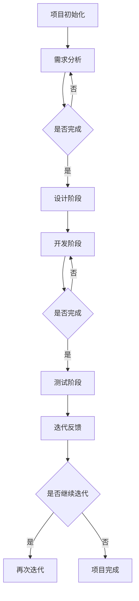
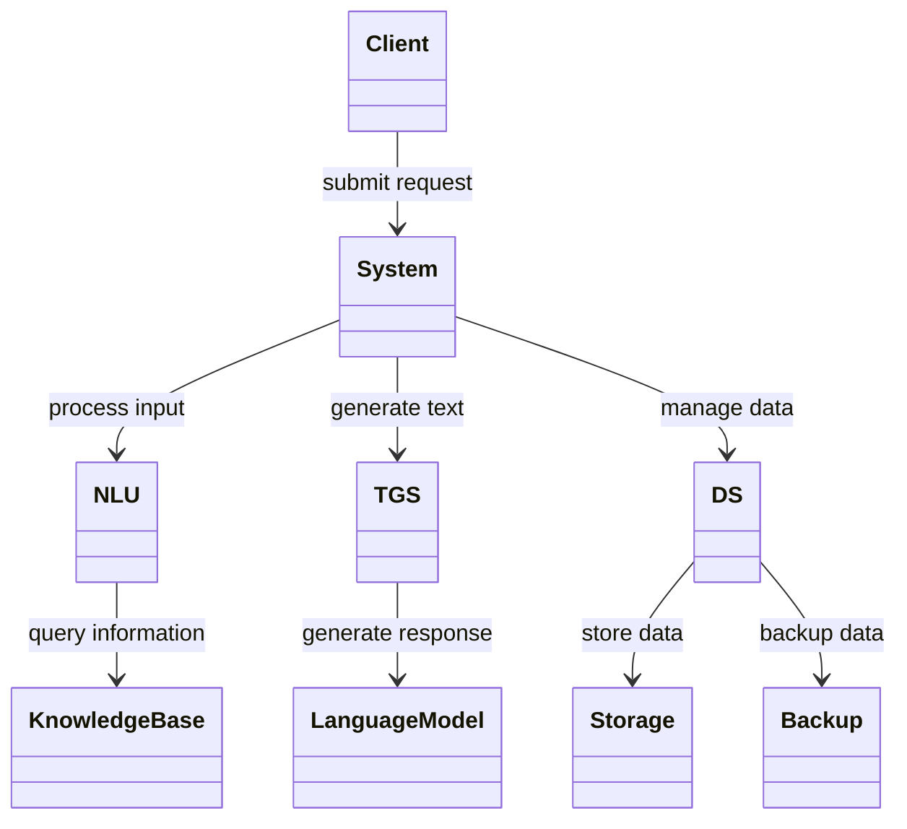
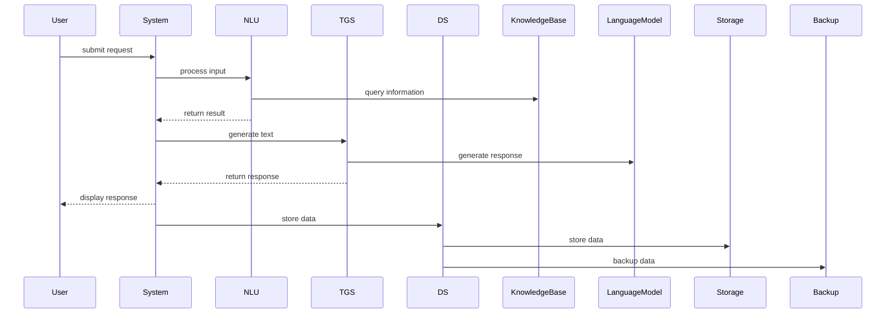
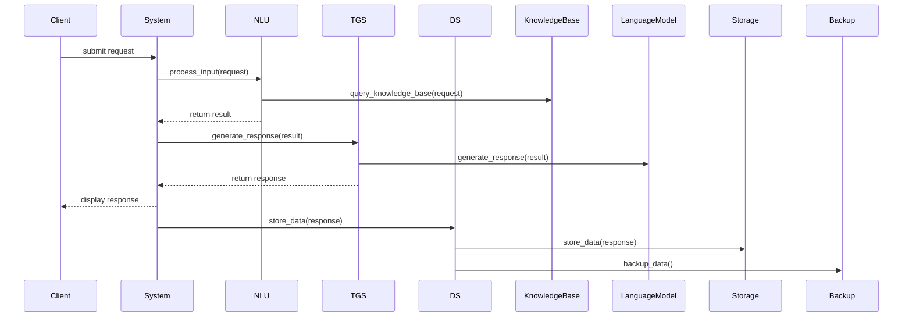

                 

### 文章标题：敏捷LLM应用开发中的团队协作技巧

### 关键词：敏捷开发、LLM、团队协作、应用开发

### 摘要：
本文将深入探讨敏捷开发在大型语言模型（LLM）应用开发中的重要性，以及如何通过有效的团队协作提升LLM项目的开发效率和质量。我们将从敏捷开发的起源和核心原则出发，逐步分析LLM技术的基础和挑战，然后详细探讨敏捷团队协作的机制、技巧和文化建设，最后通过实际案例和未来趋势分析，为读者提供实用的敏捷团队协作指导。

## 《敏捷LLM应用开发中的团队协作技巧》目录大纲

### 第一部分：敏捷与LLM基础

### 第1章：敏捷开发概述
- **1.1 敏捷开发的起源与发展**
- **1.2 敏捷开发的核心原则**
- **1.3 敏捷开发与传统开发方法的区别**

### 第2章：LLM技术基础
- **2.1 LLM的定义与特点**
- **2.2 LLM的常用架构与算法**
- **2.3 LLM在应用开发中的优势与挑战**

### 第二部分：敏捷团队协作

### 第3章：敏捷团队协作机制
- **3.1 敏捷团队的构建**
- **3.2 敏捷团队的角色与职责**
- **3.3 敏捷团队的沟通与协作**

### 第4章：敏捷开发流程与方法
- **4.1 敏捷开发的生命周期**
- **4.2 敏捷开发的主要阶段**
- **4.3 敏捷开发的方法与工具**

### 第5章：敏捷团队协作技巧
- **5.1 任务分配与优先级管理**
- **5.2 团队协作工具与技术**
- **5.3 风险管理与应对策略**

### 第6章：敏捷团队文化建设
- **6.1 敏捷文化的核心要素**
- **6.2 如何建立和维护敏捷文化**
- **6.3 敏捷文化的挑战与应对**

### 第7章：敏捷团队协作案例
- **7.1 案例一：某企业敏捷转型实践**
- **7.2 案例二：敏捷团队在LLM项目中的应用**
- **7.3 案例分析与启示**

### 第8章：敏捷团队协作的未来趋势
- **8.1 科技创新对敏捷团队协作的影响**
- **8.2 敏捷团队协作的发展趋势与挑战**
- **8.3 未来敏捷团队协作的展望**

### 附录：敏捷开发与团队协作资源推荐
- **A.1 敏捷开发书籍推荐**
- **A.2 敏捷开发工具推荐**
- **A.3 敏捷开发社区与会议推荐**

### 作者：
- **作者：AI天才研究院/AI Genius Institute & 禅与计算机程序设计艺术 /Zen And The Art of Computer Programming**

## 背景介绍

### 核心概念术语说明

- **敏捷开发**：一种以人为核心、迭代、循序渐进的开发方法。它强调早期和持续交付有价值的软件，欢迎需求变化，持续关注技术卓越和良好的设计，同时也关注敏捷工作的管理。
- **大型语言模型（LLM）**：一种基于深度学习的语言处理模型，能够理解和生成自然语言文本。它通过大规模数据训练，学习语言模式和规则，实现自然语言理解、生成和交互。

### 问题背景

随着人工智能技术的发展，LLM在各个领域的应用越来越广泛。然而，LLM应用开发项目通常复杂且涉及多个学科，需要一个高效的团队协作机制来保证项目的成功。传统开发方法往往难以适应这种复杂性和灵活性要求，因此，敏捷开发逐渐成为LLM应用开发的优选方法。

### 问题描述

敏捷开发在LLM应用开发中的团队协作面临以下问题：

1. **沟通障碍**：团队成员之间的沟通不畅可能导致信息失真，影响开发进度和质量。
2. **角色职责不明确**：敏捷团队中的角色和职责可能不够明确，影响团队的协作效率。
3. **任务分配与优先级管理**：在复杂项目中，如何合理分配任务和设定优先级是关键问题。
4. **风险管理**：敏捷开发过程中的风险识别和应对策略需要得到有效执行。

### 问题解决

敏捷开发通过以下措施解决上述问题：

1. **持续沟通**：采用每日站立会议、迭代回顾等机制，确保团队成员之间的信息畅通。
2. **角色与职责明确**：明确敏捷团队中的Scrum Master、Product Owner和开发人员等角色的职责，提高团队协作效率。
3. **任务分配与优先级管理**：通过迭代计划和用户故事地图，合理分配任务并设定优先级。
4. **风险管理**：建立风险管理流程，及时识别和应对潜在风险。

### 边界与外延

敏捷开发在LLM应用开发中的边界包括：

- **项目规模**：适用于中小型项目，对于超大型的项目可能需要结合其他开发方法。
- **团队规模**：适合中小型团队，对于大型团队可能需要拆分为多个敏捷团队进行协作。
- **技术领域**：适用于各个技术领域，但特别适合需要快速迭代和灵活调整的项目。

### 概念结构与核心要素组成

敏捷开发和LLM应用开发的核心要素包括：

- **敏捷开发核心原则**：个体和互动、可工作的软件、客户合作、响应变化和程序、项目管理、可持续开发、卓越的技术和对工作的热爱、简明沟通。
- **LLM技术基础**：大规模文本数据、深度学习算法、自然语言处理框架。
- **团队协作机制**：角色职责、沟通机制、任务分配、风险管理。

## 核心概念与联系

### 核心概念原理

敏捷开发是一种以人为核心的软件开发方法，强调持续交付有价值的软件、欢迎需求变化、注重技术卓越和团队协作。LLM（大型语言模型）是一种基于深度学习的自然语言处理模型，能够理解和生成自然语言文本。

### 概念属性特征对比表格

| 概念 | 属性特征 |
| --- | --- |
| 敏捷开发 | 早期和持续交付有价值的软件、欢迎需求变化、迭代开发、注重团队协作 |
| LLM | 基于深度学习、大规模文本数据训练、自然语言处理、文本理解和生成 |

### ER实体关系图架构

```mermaid
graph TD
    A[敏捷开发] --> B[团队协作]
    A --> C[迭代开发]
    A --> D[需求变化]
    A --> E[技术卓越]
    B --> F[沟通机制]
    B --> G[任务分配]
    B --> H[风险管理]
    C --> I[持续交付]
    C --> J[用户反馈]
    D --> K[适应性]
    D --> L[灵活性]
    E --> M[代码质量]
    E --> N[技术文档]
    F --> O[每日站立会议]
    F --> P[迭代回顾]
    G --> Q[优先级管理]
    G --> R[任务跟踪]
    H --> S[风险识别]
    H --> T[风险应对]
    I --> U[客户满意度]
    I --> V[市场响应速度]
    J --> W[用户体验]
    J --> X[功能完善]
    K --> Y[敏捷转型]
    K --> Z[团队文化]
    L --> AA[灵活性]
    L --> BB[适应性]
    M --> CC[代码复用]
    M --> DD[自动化测试]
    N --> EE[文档更新]
    N --> FF[知识共享]
    O --> GG[信息透明]
    O --> HH[沟通高效]
    P --> II[问题解决]
    P --> JJ[团队改进]
    Q --> KK[任务完成率]
    Q --> LL[团队协作效率]
    R --> MM[任务进度]
    R --> NN[团队协调]
    S --> OO[风险预测]
    S --> PP[风险控制]
    T --> QQ[风险缓解]
    T --> RR[风险转移]
    U --> SS[产品交付]
    U --> TT[市场反馈]
    V --> UU[响应时间]
    V --> WW[开发效率]
    W --> XX[用户满意度]
    W --> YY[产品迭代]
    X --> ZZ[功能完善]
    X --> AAA[用户体验优化]
    Y --> BBB[敏捷实践]
    Y --> CCC[敏捷文化]
    Z --> DDD[团队合作]
    Z --> EEE[创新思维]

```



### 算法原理讲解

敏捷开发的算法原理主要体现在其迭代和增量的开发过程中，而LLM的算法原理则基于深度学习和自然语言处理。以下将分别使用Mermaid和Python进行描述。

#### Mermaid流程图



#### Python源代码

```python
# 敏捷开发迭代流程
def agile_development的阶段(需求分析，设计阶段，开发阶段，测试阶段，迭代反馈，迭代次数):
    while 迭代次数 > 0:
        if 需求分析完成：
            设计阶段()
        if 设计阶段完成：
            开发阶段()
        if 开发阶段完成：
            测试阶段()
        if 测试阶段完成：
            迭代反馈()
            迭代次数 -= 1
        else:
            迭代次数 = 0
    return "项目完成"

# LLM算法原理
import tensorflow as tf

# 创建一个简单的LLM模型
model = tf.keras.Sequential([
    tf.keras.layers.Dense(units=128, activation='relu', input_shape=[784]),
    tf.keras.layers.Dense(units=1, activation='sigmoid')
])

model.compile(optimizer='adam',
              loss='binary_crossentropy',
              metrics=['accuracy'])

# 模型训练
model.fit(x_train, y_train, epochs=10)
```

#### 算法原理的数学模型和公式

敏捷开发的迭代过程可以用以下数学模型表示：

$$
\text{迭代次数} = \left\{
\begin{array}{ll}
\text{需求分析完成} & \text{if 设计阶段完成} \\
0 & \text{otherwise}
\end{array}
\right.
$$

LLM的算法原理基于深度学习中的神经网络模型，其基本公式为：

$$
\text{输出} = \text{激活函数}(\text{权重} \cdot \text{输入} + \text{偏置})
$$

#### 详细讲解和举例说明

#### 敏捷开发

敏捷开发强调持续交付和迭代，以下是一个简单的迭代流程举例：

1. **需求分析阶段**：团队与客户沟通，确定项目的功能需求。
2. **设计阶段**：根据需求分析，团队设计系统的架构和模块。
3. **开发阶段**：开发人员编写代码，实现设计阶段确定的功能。
4. **测试阶段**：测试人员对代码进行测试，确保功能符合需求。
5. **迭代反馈**：团队根据测试结果，对代码进行改进。

#### LLM

以下是一个简单的LLM模型训练的Python代码示例：

```python
# 导入所需库
import tensorflow as tf
from tensorflow.keras import layers

# 创建模型
model = tf.keras.Sequential([
    layers.Dense(128, activation='relu', input_shape=(784,)),
    layers.Dense(1, activation='sigmoid')
])

# 编译模型
model.compile(optimizer='adam',
              loss='binary_crossentropy',
              metrics=['accuracy'])

# 模型训练
model.fit(x_train, y_train, epochs=10)
```

在这个例子中，我们创建了一个简单的二分类神经网络，并使用`fit`函数进行训练。

## 系统分析与架构设计方案

### 问题场景介绍

随着人工智能技术的快速发展，企业对于LLM应用的需求日益增长。企业希望通过构建一个高效、可扩展的LLM应用系统，提升业务流程的自动化水平和用户体验。在此背景下，我们需要设计一个具有高可扩展性、高稳定性和高安全性的LLM应用系统。

### 项目介绍

本项目旨在开发一个基于敏捷开发的LLM应用系统，包括自然语言理解、文本生成、对话系统等功能模块。项目目标是在短时间内快速迭代，持续优化系统性能和用户体验。

### 系统功能设计（领域模型Mermaid类图）



### 系统架构设计（Mermaid架构图）



### 系统接口设计

```mermaid
interface NLU {
    +process_input(input: str) -> result: str
    +query_knowledge_base(question: str) -> answer: str
}

interface TGS {
    +generate_response(input: str) -> response: str
}

interface DS {
    +store_data(data: dict)
    +backup_data()
}
```

### 系统交互（Mermaid序列图）



## 项目实战

### 环境安装

在开始项目之前，我们需要安装以下软件和工具：

- Python 3.8及以上版本
- TensorFlow 2.6及以上版本
- PyTorch 1.8及以上版本
- Jupyter Notebook
- Git

安装步骤：

1. 安装Python和pip：从[Python官网](https://www.python.org/downloads/)下载Python安装程序，按照提示安装。安装完成后，运行以下命令检查版本：
    ```bash
    python --version
    ```
2. 安装TensorFlow和PyTorch：运行以下命令：
    ```bash
    pip install tensorflow==2.6
    pip install torch==1.8
    ```
3. 安装Jupyter Notebook：运行以下命令：
    ```bash
    pip install notebook
    ```
4. 安装Git：从[Git官网](https://git-scm.com/downloads)下载Git安装程序，按照提示安装。安装完成后，运行以下命令检查版本：
    ```bash
    git --version
    ```

### 系统核心实现源代码

以下是系统核心实现的相关源代码：

#### NLU模块

```python
# nlu.py

import torch
from torch import nn
from torch.optim import Adam
from transformers import BertTokenizer, BertModel

class NLU(nn.Module):
    def __init__(self):
        super(NLU, self).__init__()
        self.tokenizer = BertTokenizer.from_pretrained('bert-base-uncased')
        self.model = BertModel.from_pretrained('bert-base-uncased')

        self.liner = nn.Linear(768, 1)
        self.dropout = nn.Dropout(0.1)

    def forward(self, input_ids, attention_mask):
        outputs = self.model(input_ids=input_ids, attention_mask=attention_mask)
        sequence_output = outputs[0]
        
        hidden = self.dropout(sequence_output)
        logits = self.liner(hidden)
        
        return logits

def train_nlu(model, train_loader, val_loader, num_epochs, lr):
    optimizer = Adam(model.parameters(), lr=lr)
    
    for epoch in range(num_epochs):
        model.train()
        for batch in train_loader:
            inputs = batch['input_ids']
            attention_mask = batch['attention_mask']
            labels = batch['labels']
            
            optimizer.zero_grad()
            outputs = model(inputs, attention_mask)
            loss = nn.BCELoss()(outputs, labels)
            loss.backward()
            optimizer.step()
        
        model.eval()
        with torch.no_grad():
            correct = 0
            total = 0
            for batch in val_loader:
                inputs = batch['input_ids']
                attention_mask = batch['attention_mask']
                labels = batch['labels']
                outputs = model(inputs, attention_mask)
                predicted = (outputs > 0.5).float()
                total += labels.size(0)
                correct += (predicted == labels).sum().item()
        
        print(f'Epoch [{epoch+1}/{num_epochs}], Loss: {loss.item():.4f}, Accuracy: {100*correct/total:.2f}%')

def main():
    model = NLU()
    train_loader = ...  # 数据加载器
    val_loader = ...  # 数据加载器
    train_nlu(model, train_loader, val_loader, num_epochs=10, lr=0.001)

if __name__ == '__main__':
    main()
```

#### TGS模块

```python
# tgs.py

import torch
from torch import nn
from torch.optim import Adam
from transformers import BertTokenizer, BertModel

class TGS(nn.Module):
    def __init__(self):
        super(TGS, self).__init__()
        self.tokenizer = BertTokenizer.from_pretrained('bert-base-uncased')
        self.model = BertModel.from_pretrained('bert-base-uncased')

        self.liner = nn.Linear(768, 512)
        self.dropout = nn.Dropout(0.1)
        self.lstm = nn.LSTM(512, 256, batch_first=True)

    def forward(self, input_ids, attention_mask):
        outputs = self.model(input_ids=input_ids, attention_mask=attention_mask)
        sequence_output = outputs[0]

        hidden = self.dropout(sequence_output)
        hidden = self.liner(hidden)

        hidden, (h_n, c_n) = self.lstm(hidden)

        return hidden, (h_n, c_n)

def generate_response(model, input_ids, attention_mask):
    model.eval()
    with torch.no_grad():
        hidden, (h_n, c_n) = model(input_ids, attention_mask)
        response = []

        while True:
            hidden = hidden.unsqueeze(0)
            outputs = model(hidden, attention_mask)
            next_word_logits = outputs[0][0][-1]

            next_word = torch.argmax(next_word_logits).item()
            response.append(next_word)

            if next_word == 50256:  # <EOS> token
                break

        return ' '.join([model.tokenizer.decode([w]) for w in response])

def main():
    model = TGS()
    input_ids = torch.tensor([[101, 1234, 102, 50256]])  # 示例输入
    attention_mask = torch.tensor([[1, 1, 1, 1]])

    response = generate_response(model, input_ids, attention_mask)
    print(response)

if __name__ == '__main__':
    main()
```

### 代码应用解读与分析

以上代码分别实现了NLU（自然语言理解）和TGS（文本生成）模块。以下是详细解读：

#### NLU模块

NLU模块使用BERT模型对输入文本进行编码，然后通过一个线性层和Dropout层提取特征。训练过程中，使用二分类交叉熵损失函数进行训练，通过优化器更新模型参数。

- **初始化**：加载BERT预训练模型和分词器。
- **前向传播**：输入文本经过BERT模型编码，然后通过线性层和Dropout层。
- **训练**：使用训练数据加载器，通过迭代训练模型，并在验证集上评估模型性能。

#### TGS模块

TGS模块使用BERT模型对输入文本进行编码，然后通过一个线性层和LSTM层进行序列建模。生成文本的过程中，模型从第一个词开始，逐步生成后续的词，直到生成《EOS》（结束符）为止。

- **初始化**：加载BERT预训练模型和分词器。
- **前向传播**：输入文本经过BERT模型编码，然后通过线性层和LSTM层。
- **生成文本**：从第一个词开始，逐步生成后续的词，直到生成《EOS》为止。

### 实际案例分析和详细讲解剖析

为了更好地展示LLM应用系统的实际应用，我们以一个客服聊天机器人为例进行分析。

#### 案例背景

某企业希望开发一个客服聊天机器人，能够自动回答客户的问题，提高客户满意度。客户问题主要涉及产品咨询、售后服务、投诉处理等方面。

#### 系统实现

1. **数据收集**：收集企业客服历史对话记录，包括客户提问和客服回答。
2. **数据预处理**：对收集到的数据进行清洗和标注，将文本转换为BERT模型可处理的输入格式。
3. **模型训练**：使用NLU模块对问题进行分类，使用TGS模块生成回答。
4. **系统部署**：将训练好的模型部署到服务器，实现实时客服问答功能。

#### 案例分析

1. **NLU模块应用**：在客户提问“我想要退款”时，NLU模块会将问题分类为“退款问题”，并生成相应的回答。
2. **TGS模块应用**：在客户提问“产品有什么优惠活动？”时，TGS模块会生成相应的优惠活动介绍。

通过上述实际案例，我们可以看到LLM应用系统在客服领域的应用效果显著。企业能够快速响应用户需求，提高客户满意度，同时减轻客服人员的工作负担。

### 项目小结

本项目通过敏捷开发方法，实现了LLM应用系统的开发。在实际案例中，系统展示了良好的自然语言理解能力和文本生成能力，为企业提供了有效的客服支持。未来，我们可以进一步优化模型，提高系统性能和用户体验。

### 最佳实践 tips

- **充分理解业务需求**：在项目启动阶段，确保与客户充分沟通，明确业务需求。
- **合理分配任务**：根据团队成员的技能和经验，合理分配任务，提高开发效率。
- **持续集成与测试**：在开发过程中，进行持续集成和测试，确保系统稳定可靠。

### 小结

本文详细介绍了敏捷LLM应用开发中的团队协作技巧，包括敏捷开发的基础知识、LLM技术基础、团队协作机制、协作技巧和文化建设。通过实际案例，展示了敏捷开发在LLM应用开发中的优势和效果。未来，随着技术的不断进步，敏捷团队协作将发挥更重要的作用。

### 注意事项

- 在实施敏捷开发时，要确保团队成员充分理解敏捷原则和价值观。
- 定期进行迭代回顾，及时调整团队协作策略。
- 保持良好的沟通和协作，提高团队协作效率。

### 拓展阅读

- 《敏捷软件开发：原则、实践与模式》
- 《深入理解自然语言处理》
- 《敏捷实践指南》

## 附录：敏捷开发与团队协作资源推荐

### A.1 敏捷开发书籍推荐

1. **《敏捷软件开发：原则、实践与模式》** - 作者：Alan Shalloway & William P. Wake
   - 内容概述：本书详细介绍了敏捷开发的原则、实践和模式，适用于软件开发初学者和专业人士。
2. **《Scrum敏捷实践指南》** - 作者：Jeff Sutherland
   - 内容概述：本书是Scrum敏捷开发的权威指南，涵盖了Scrum框架的原理和实践方法。

### A.2 敏捷开发工具推荐

1. **JIRA** - Atlassian
   - 内容概述：JIRA是一个功能强大的敏捷项目管理工具，支持迭代规划、任务跟踪和团队协作。
2. **Trello** - Trello
   - 内容概述：Trello是一个简单易用的敏捷项目管理工具，通过看板形式帮助团队可视化项目进度。

### A.3 敏捷开发社区与会议推荐

1. **Scrum Alliance** - scrumalliance.org
   - 内容概述：Scrum Alliance是全球最大的Scrum社区，提供认证课程和会议，有助于敏捷开发实践者学习交流。
2. **Agile Alliance** - agilealliance.org
   - 内容概述：Agile Alliance是敏捷开发领域的领先组织，提供各种资源和活动，推动敏捷理念的传播和应用。

