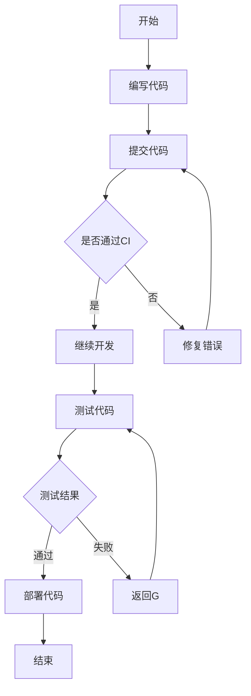
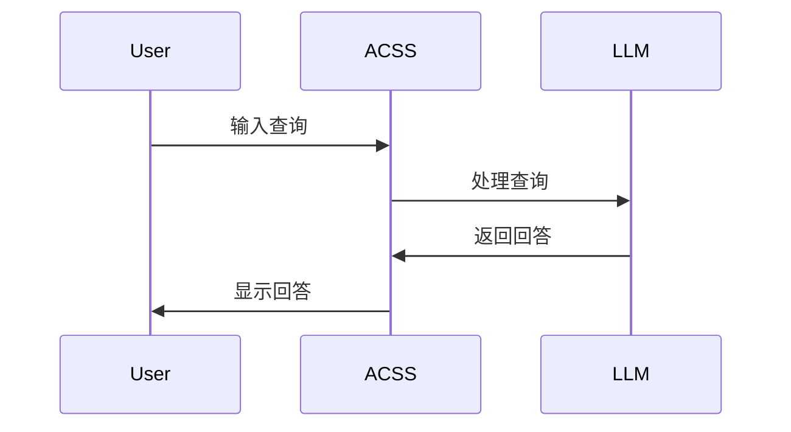
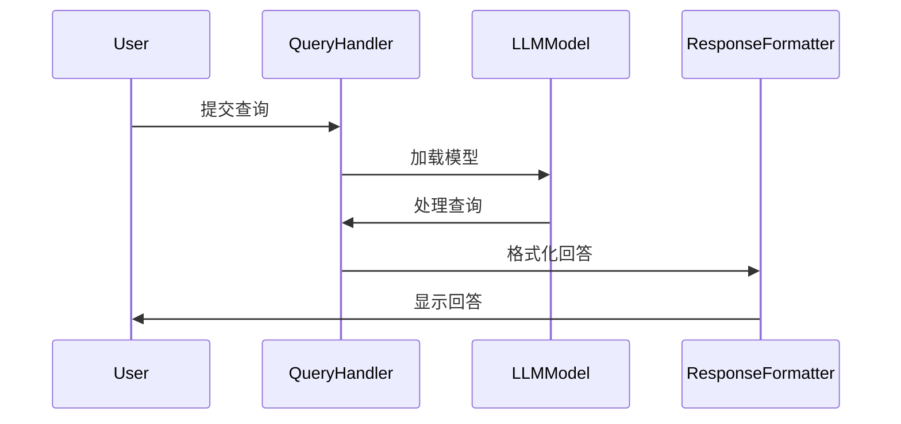

                 


## 敏捷LLM应用开发中的持续集成策略

### 引言

在当今快速发展的技术世界中，人工智能（AI）尤其是大型语言模型（LLM）的应用越来越广泛。这些模型的复杂性和规模要求我们在开发过程中采用敏捷方法，以确保项目的高效和高质量。而持续集成（CI）作为一种自动化构建和测试流程，已经成为敏捷开发不可或缺的一部分。本文将深入探讨敏捷LLM应用开发中的持续集成策略，旨在帮助开发者和团队更好地理解和应用这一关键实践。

### 背景介绍

#### 核心概念术语说明

- **敏捷开发**：一种以人为核心、迭代、渐进的方法论，强调灵活性、协作和快速响应变化。
- **持续集成（CI）**：一种软件开发实践，通过自动化构建、测试和部署来确保代码的持续可集成性。

#### 问题背景

随着LLM模型的规模和复杂性不断增加，传统的开发方法已经无法满足现代软件开发的需求。LLM项目通常涉及大量的代码、数据和模型，并且需要频繁的版本更新和迭代。在这种环境下，敏捷开发和持续集成显得尤为重要。

#### 问题描述

在敏捷LLM应用开发中，如何设计并实施一个有效的持续集成策略，以确保代码的质量、可靠性和可维护性？

#### 问题解决

要解决这个问题，我们需要从以下几个方面入手：

1. **理解LLM项目的特点**：了解LLM项目的基本架构和开发流程，包括数据预处理、模型训练、模型评估和部署。
2. **设计CI流程**：基于LLM项目的特点，设计一个包括自动化构建、测试和部署的CI流程。
3. **选择合适的工具和平台**：根据项目的需求和规模，选择合适的CI工具和平台。
4. **持续优化CI流程**：通过不断的实践和反馈，优化CI流程，以提高其效率和效果。

#### 边界与外延

- **边界**：本文主要讨论敏捷LLM应用开发中的持续集成策略，不包括其他类型的软件开发。
- **外延**：虽然本文以LLM应用开发为例，但持续集成策略同样适用于其他复杂软件开发项目。

### 核心概念与联系

#### 核心概念

- **敏捷开发**：迭代、增量、协作、适应性。
- **持续集成**：自动化构建、测试、部署。

#### 概念属性特征对比表格

| 特征         | 敏捷开发               | 持续集成               |
| ------------ | ---------------------- | ---------------------- |
| 目的         | 快速响应变化           | 确保代码质量           |
| 方法         | 迭代、渐进             | 自动化、持续           |
| 参与者       | 开发者、产品经理、客户 | 开发者、测试人员、运维 |
| 关键要素     | 用户故事、迭代、回顾   | 构建脚本、测试脚本、部署脚本 |

#### 概念结构与核心要素组成

- **敏捷开发**：核心要素包括用户故事、迭代、回顾。
- **持续集成**：核心要素包括构建脚本、测试脚本、部署脚本。

### 算法原理讲解

#### 算法mermaid流程图



#### Python源代码实现

```python
import os

def ci_pipeline(code_folder, test_folder):
    os.chdir(code_folder)
    os.system("python setup.py build")
    os.chdir(test_folder)
    os.system("python test.py")

    if os.system("python test.py") == 0:
        os.system("python deploy.py")
    else:
        print("Tests failed. Please fix the errors.")

if __name__ == "__main__":
    code_folder = "path/to/code"
    test_folder = "path/to/test"
    ci_pipeline(code_folder, test_folder)
```

#### 算法原理的数学模型和公式

持续集成策略的核心在于减少集成风险。根据风险管理的原理，集成风险可以通过以下公式计算：

$$ R_i = R_s \times P_i $$

其中，\( R_i \) 是集成风险，\( R_s \) 是单个模块的风险，\( P_i \) 是模块间依赖的概率。

#### 详细讲解和举例说明

假设我们有两个模块A和B，它们之间存在依赖关系。模块A的风险为\( R_s(A) = 0.1 \)，模块B的风险为\( R_s(B) = 0.2 \)。由于模块A依赖于模块B，模块间依赖的概率为\( P_i = 0.8 \)。

根据公式，集成风险为：

$$ R_i = R_s(A) \times R_s(B) \times P_i = 0.1 \times 0.2 \times 0.8 = 0.016 $$

这意味着集成风险相对较低，项目可以继续进行。

### 系统分析与架构设计方案

#### 问题场景介绍

假设我们要开发一个基于LLM的客户服务系统，该系统需要实时处理用户的查询并返回相应的回答。

#### 项目介绍

项目名称：AI客户服务系统（AI Customer Service System，ACSS）
目标：提供高效、准确的客户服务，提高客户满意度。

#### 系统功能设计（领域模型mermaid类图）

```mermaid
classDiagram
Class01 <|-- Class02
Class03 --|aron Class04
Class05 : +int x
Class06 : +int y
Class07 : +int z

Class01 {
    +int a
    +int b
}

Class02 {
    +int c
    +int d
}

Class03 {
    +int e
    +int f
}

Class04 {
    +int g
    +int h
}

Class05 {
    +setX(int x)
    +getX():int
    +setY(int y)
    +getY():int
    +setZ(int z)
    +getZ():int
}

Class06 {
    +add(int a, int b):int
}

Class07 {
    +subtract(int a, int b):int
}
```

#### 系统架构设计（mermaid架构图）



#### 系统接口设计和系统交互（mermaid序列图）



### 项目实战

#### 环境安装

1. 安装Python环境
2. 安装LLM依赖库（如Hugging Face）
3. 安装持续集成工具（如Jenkins）

#### 系统核心实现源代码

```python
# query_handler.py
def handle_query(query):
    model = load_model()
    response = model.predict(query)
    return format_response(response)

# response_formatter.py
def format_response(response):
    return f"您的问题答案是：{response}"

# main.py
if __name__ == "__main__":
    query = input("请输入您的查询：")
    response = handle_query(query)
    print(response_formatter.format_response(response))
```

#### 代码应用解读与分析

1. **QueryHandler**：负责接收用户的查询，并调用LLM模型进行预测。
2. **ResponseFormatter**：负责将LLM模型的预测结果格式化成易于理解的形式。

#### 实际案例分析和详细讲解剖析

假设用户输入了一个查询：“我最近在减肥，有什么好的建议吗？”

1. **QueryHandler**：加载LLM模型，并将查询传递给模型。
2. **LLMModel**：使用预训练的模型对查询进行预测，并返回一个回答。
3. **ResponseFormatter**：将回答格式化，并显示给用户。

#### 项目小结

通过持续集成策略，我们能够确保代码的质量和可靠性，从而提高项目的开发效率和用户满意度。

### 最佳实践 tips

1. 定期更新LLM模型，以保持预测的准确性。
2. 为测试代码编写详细的测试用例，确保代码的每个功能都经过测试。
3. 使用版本控制系统（如Git）管理代码，确保代码的可追踪性和可维护性。

### 小结

敏捷LLM应用开发中的持续集成策略是确保项目成功的关键。通过理解LLM项目的特点，设计并实施有效的CI流程，我们可以提高代码的质量、可靠性和可维护性。

### 注意事项

1. 持续集成并非一劳永逸，需要持续优化和调整。
2. 选择合适的CI工具和平台，确保它们能够满足项目的需求。

### 拓展阅读

1. 《敏捷软件开发：原则、实践与模式》
2. 《持续集成：从理论到实践》
3. 《大型语言模型：原理、实现与应用》

### 作者信息

作者：AI天才研究院/AI Genius Institute & 禅与计算机程序设计艺术 /Zen And The Art of Computer Programming

