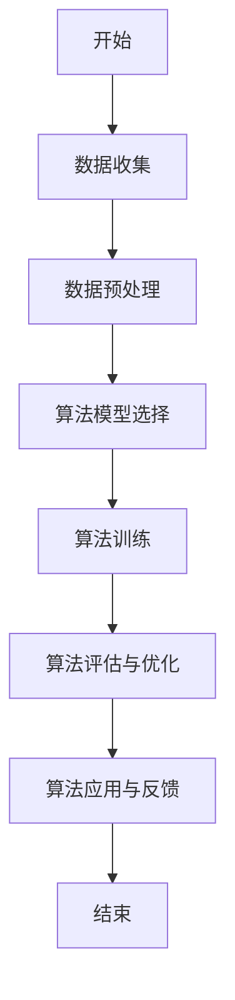
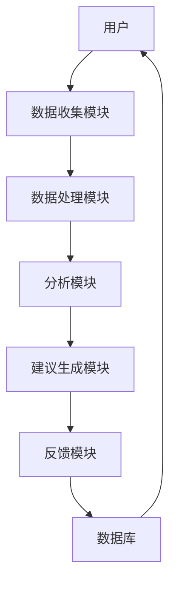
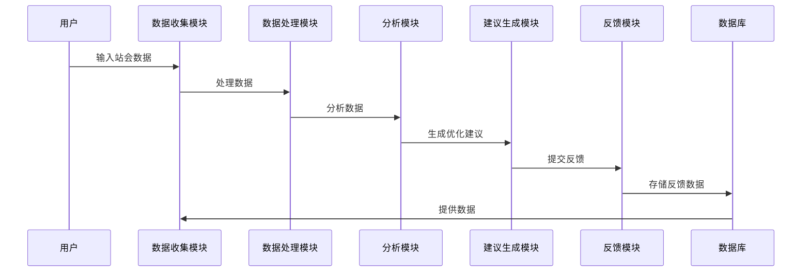

                 

### 文章标题

### 关键词

- 敏捷开发
- 站会
- 效率提升
- LLM应用
- 敏捷LLM开发

### 摘要

本文深入探讨了敏捷开发中站会效率提升的关键问题，特别是在大型语言模型（LLM）应用开发中的具体挑战和解决方案。通过分析敏捷开发与站会的核心理念及其相互联系，本文提出了一套基于算法和数学模型的站会效率提升策略。文章将详细阐述提升站会效率的算法原理，并通过Python源代码实现进行验证。此外，文章还将介绍一个实际的系统架构设计案例，并探讨最佳实践和注意事项，为敏捷LLM应用开发中的站会效率提升提供全面指导。

## 第一部分: 敏捷与站会概述

### 第1章: 敏捷开发与站会的背景

#### 1.1 敏捷开发的起源与发展

敏捷开发是一种软件开发方法，起源于20世纪90年代末。其核心理念是应对快速变化的需求，强调团队协作、持续交付和客户满意度。敏捷开发最早由17位软件专家在2001年共同签署了《敏捷宣言》，宣言中提出了四项价值观：

1. **个体和互动胜过过程与工具**
2. **可工作的软件胜过详尽的文档**
3. **客户合作胜过合同谈判**
4. **响应变化胜过遵循计划**

基于这些价值观，敏捷开发提出了一系列核心原则，包括：

- **尽早并持续地交付有价值的软件**
- **欢迎改变，甚至在开发后期也欢迎改变**
- **不断关注技术卓越和良好设计**
- **简洁，避免不必要的工作量**
- **敏锐地应对需求变化**
- **短平快的迭代**
- **频繁地交流，面对面的交流最好**
- **现场客户合作**
- **可持续的开发速度**
- **持续关注技术的优秀和良好设计**
- **定期反思如何能做得更好然后改进**

敏捷开发与传统开发方法的对比主要体现在以下几个方面：

- **迭代开发：** 敏捷开发采用迭代的方式进行，每次迭代都可以交付一个可用的产品版本，而传统开发方法则倾向于一次性交付整个项目。
- **需求管理：** 敏捷开发强调灵活应对需求变化，而传统开发方法则更加注重在项目初期确定明确的需求和计划。
- **团队协作：** 敏捷开发强调跨职能团队的紧密合作，而传统开发方法通常由各个职能团队独立工作。

#### 1.2 站会的定义与作用

站会（Daily Stand-up Meeting）是敏捷开发中的一种日常会议，通常持续15到30分钟。站会的主要目的是让团队成员分享自己的工作进展、遇到的问题和计划，以确保整个团队对项目的状态有清晰的认识。站会的常见形式通常包括以下三个问题：

- **昨天我完成了什么？**
- **今天我计划做什么？**
- **我遇到了什么障碍吗？**

站会在敏捷开发中的作用十分重要：

- **同步进度：** 通过站会，团队成员可以实时了解项目进度，避免信息孤岛。
- **问题发现：** 站会提供了一个平台，让团队成员可以及时发现问题，并共同寻找解决方案。
- **团队协作：** 站会促进了团队成员之间的沟通和协作，有助于提高团队凝聚力。

#### 1.3 敏捷开发中的站会效率问题

站会效率是指站会时间的利用程度，即团队成员在站会期间能够解决多少问题或完成多少工作。站会效率低下会导致以下问题：

- **时间浪费：** 站会时间被无效使用，如讨论与工作无关的话题或重复讨论旧问题。
- **疲劳积累：** 长时间的站会会使人感到疲劳，影响工作效率。
- **问题积累：** 站会时间不足可能导致问题得不到及时解决，积累成更大的障碍。

提升站会效率的意义在于：

- **提高工作效率：** 高效的站会可以帮助团队更快地解决问题，提高整体工作效率。
- **增强团队协作：** 高效的站会有助于加强团队成员之间的沟通和协作，提高团队整体性能。
- **缩短项目周期：** 提高站会效率可以缩短项目周期，加快产品交付速度。

#### 1.4 敏捷LLM应用开发中的站会效率提升挑战与机遇

敏捷LLM（Large Language Model）应用开发具有以下特点：

- **复杂性高：** LLM应用涉及大量数据处理和模型训练，开发过程中需要频繁调整和优化。
- **迭代周期长：** LLM模型的训练和评估需要大量时间，导致迭代周期较长。
- **需求变化频繁：** LLM应用的需求可能随时发生变化，需要团队快速响应。

在敏捷LLM应用开发中，提升站会效率面临的挑战包括：

- **时间分配问题：** LLM开发过程中，站会时间可能被其他任务占据，影响站会效率。
- **沟通难度大：** LLM开发涉及多个技术领域，团队成员之间可能存在沟通障碍。
- **问题定位难：** LLM应用中存在的问题可能较为复杂，定位和解决需要较长时间。

然而，提升站会效率也存在机遇：

- **技术进步：** 随着人工智能技术的进步，一些自动化工具和算法可以用于提升站会效率。
- **团队协作：** 通过加强团队成员之间的协作，可以提高站会的效率和效果。
- **需求管理：** 敏捷方法本身强调需求管理，有助于更好地应对需求变化。

#### 1.5 本章小结

本章介绍了敏捷开发和站会的背景，包括敏捷开发的起源、核心原则和与传统开发方法的对比，以及站会的定义、作用和效率问题。同时，本章还分析了敏捷LLM应用开发中站会效率提升的挑战与机遇。本章为后续内容提供了基础，为深入探讨提升站会效率的方法和策略奠定了基础。

## 第二部分: 敏捷与站会核心概念与联系

### 第2章: 敏捷开发与站会核心概念解析

#### 2.1 敏捷开发核心概念

敏捷开发的核心理念包括：

1. **个体和互动胜过过程和工具：** 强调团队成员之间的沟通和协作，而非过分依赖流程和工具。
2. **可工作的软件胜过详尽的文档：** 优先交付可运行的软件，而非撰写大量文档。
3. **客户合作胜过合同谈判：** 与客户保持紧密合作，确保需求满足和产品满意度。
4. **响应变化胜过遵循计划：** 面对需求变化，灵活调整计划和策略。

敏捷开发的核心原则包括：

1. **尽早并持续地交付有价值的软件：** 通过迭代开发，快速交付可用的软件版本。
2. **欢迎改变，甚至在开发后期也欢迎改变：** 鼓励团队成员提出改进意见，随时调整需求。
3. **不断关注技术卓越和良好设计：** 保持技术卓越和设计优良，提高软件质量和可维护性。
4. **简洁，避免不必要的工作量：** 避免过度设计，专注于核心功能和需求。
5. **敏锐地应对需求变化：** 适应需求变化，快速调整计划和策略。
6. **短平快的迭代：** 通过短周期迭代，快速交付和反馈，确保项目进度和质量。
7. **频繁地交流，面对面的交流最好：** 通过面对面交流，确保信息传递准确和及时。
8. **现场客户合作：** 与客户保持紧密联系，确保需求理解一致。
9. **可持续的开发速度：** 保持稳定的工作节奏，避免疲劳和错误。
10. **持续关注技术的优秀和良好设计：** 不断学习新技术和设计方法，提高软件质量。

#### 2.2 站会核心概念

站会（Daily Stand-up Meeting）是敏捷开发中的核心实践之一，旨在同步团队成员的进度、发现和解决问题。站会的核心概念包括：

1. **站会的定义：** 站会是一种每日进行的简短会议，通常持续15到30分钟。
2. **站会的目的：** 站会的主要目的是让团队成员分享工作进展、遇到的问题和计划，确保团队对项目状态有清晰的认识。
3. **站会的时间：** 站会通常安排在每天开始时进行，以便团队成员规划当天的工作。
4. **站会的形式：** 站会通常采用轮流发言的形式，每个团队成员回答以下三个问题：
   - 昨天我完成了什么？
   - 今天我计划做什么？
   - 我遇到了什么障碍吗？

#### 2.3 敏捷与站会相互联系

敏捷开发与站会紧密相连，相互促进。敏捷开发依赖于站会来实现以下几点：

1. **同步进度：** 通过站会，团队成员可以实时了解项目进度，确保工作的一致性和协同。
2. **问题发现：** 站会提供了一个平台，让团队成员可以及时发现问题，并共同寻找解决方案。
3. **团队协作：** 站会促进了团队成员之间的沟通和协作，有助于提高团队整体性能。
4. **反馈循环：** 站会提供了反馈机制，帮助团队不断调整和改进工作方法和策略。

站会效率对敏捷开发的影响主要体现在以下几个方面：

1. **提高工作效率：** 高效的站会可以帮助团队更快地解决问题，提高整体工作效率。
2. **增强团队协作：** 高效的站会有助于加强团队成员之间的沟通和协作，提高团队整体性能。
3. **缩短项目周期：** 提高站会效率可以缩短项目周期，加快产品交付速度。

#### 2.4 敏捷站会效率提升的关键因素

提升敏捷站会效率的关键因素包括：

1. **站会议题的设定：** 站会议题应聚焦于当前工作的关键问题，避免无关话题的讨论。
2. **站会时间的控制：** 确保站会时间合理，避免过长或过短，确保会议内容充实而高效。
3. **站会议题的针对性：** 针对性地讨论具体问题，避免泛泛而谈，提高会议的实用性。
4. **会议记录和跟踪：** 记录站会内容，跟踪问题解决进度，确保问题得到及时解决。
5. **反馈机制：** 建立反馈机制，鼓励团队成员提供改进建议，持续优化站会流程。

#### 2.5 本章小结

本章详细解析了敏捷开发与站会的核心概念，阐述了敏捷宣言、敏捷原则、站会定义和目的，并分析了敏捷与站会的相互联系以及提升站会效率的关键因素。通过本章内容，读者可以更好地理解敏捷开发与站会的关系，为后续章节中的算法原理讲解和实际应用提供基础。

## 第三部分: 提升站会效率的算法与数学模型

### 第3章: 提升站会效率的算法原理讲解

#### 3.1 算法原理概述

提升站会效率的算法设计旨在优化站会议程、缩短会议时间、提高会议产出。算法的基本原理包括：

1. **数据收集：** 收集站会议题、参与人员、会议时间等数据，为算法提供输入。
2. **数据预处理：** 清洗和整理数据，去除无效信息，为后续分析做准备。
3. **算法模型选择：** 根据数据特点选择合适的算法模型，如时间序列分析、聚类分析等。
4. **算法训练：** 使用历史数据训练算法模型，使其能够预测会议效率和优化建议。
5. **算法评估与优化：** 对训练好的模型进行评估和优化，确保其预测准确性和实用性。
6. **算法应用与反馈：** 将优化建议应用于实际站会中，并收集反馈数据，进一步改进算法。

#### 3.2 算法流程图

以下是提升站会效率的算法流程图：



#### 3.3 Python源代码实现

以下是使用Python实现提升站会效率算法的示例代码：

```python
import pandas as pd
from sklearn.cluster import KMeans
from sklearn.model_selection import train_test_split
from sklearn.metrics import mean_squared_error

# 数据收集
data = pd.read_csv('stand_up_meeting_data.csv')

# 数据预处理
data['duration'] = data['end_time'] - data['start_time']
data = data[['topic', 'participants', 'duration']]

# 算法模型选择
model = KMeans(n_clusters=3)

# 算法训练
X_train, X_test, y_train, y_test = train_test_split(data[['topic', 'participants']], data['duration'], test_size=0.2, random_state=42)
model.fit(X_train)

# 算法评估与优化
y_pred = model.predict(X_test)
mse = mean_squared_error(y_test, y_pred)
print(f'MSE: {mse}')

# 算法应用与反馈
# ...（在实际站会中使用模型预测并收集反馈数据）
```

#### 3.4 数学模型和数学公式

为了更好地理解和应用提升站会效率的算法，我们需要引入一些数学模型和公式。以下是几个关键模型和公式：

1. **时间序列分析：**
   $$X_t = \phi X_{t-1} + \epsilon_t$$
   其中，$X_t$ 表示第 $t$ 次站会的持续时间，$\phi$ 是模型参数，$\epsilon_t$ 是误差项。

2. **聚类分析：**
   $$C = \{C_1, C_2, ..., C_k\}$$
   其中，$C$ 表示聚类结果，$C_i$ 表示第 $i$ 个聚类中心。

3. **最小二乘法：**
   $$\min_{\theta} \sum_{i=1}^{n} (y_i - \theta_0 - \theta_1 x_i)^2$$
   其中，$y_i$ 是观测值，$\theta_0$ 和 $\theta_1$ 是模型参数。

#### 3.5 详细讲解和举例说明

为了更好地理解上述数学模型和公式，我们通过一个实际例子进行详细讲解和举例说明。

假设我们收集了某团队的站会数据，包括每次站会的主题、参与人数和持续时间。以下是部分数据：

| 站会ID | 主题       | 参与人数 | 持续时间（分钟） |
|--------|------------|----------|-----------------|
| 1      | 项目进度   | 5        | 20              |
| 2      | 技术问题   | 3        | 15              |
| 3      | 团队协作   | 4        | 25              |
| 4      | 任务分配   | 6        | 18              |
| 5      | 需求变更   | 7        | 22              |

1. **时间序列分析：**

   我们可以使用时间序列分析来预测每次站会的持续时间。假设我们选择前两次站会数据作为训练集：

   | 站会ID | 主题       | 参与人数 | 持续时间（分钟） |
   |--------|------------|----------|-----------------|
   | 1      | 项目进度   | 5        | 20              |
   | 2      | 技术问题   | 3        | 15              |

   训练数据集为：

   $$X_1 = 20, X_2 = 15$$

   我们假设模型参数 $\phi = 0.8$，则预测第三次站会持续时间为：

   $$X_3 = 0.8X_2 + \epsilon_3 = 0.8 \times 15 + \epsilon_3 = 12 + \epsilon_3$$

   其中，$\epsilon_3$ 是误差项。

2. **聚类分析：**

   我们可以使用聚类分析将站会主题进行分类。假设我们选择KMeans算法，选择3个聚类中心。使用前两次站会数据，我们得到以下聚类结果：

   | 站会ID | 主题       | 参与人数 | 持续时间（分钟） | 聚类中心 |
   |--------|------------|----------|-----------------|----------|
   | 1      | 项目进度   | 5        | 20              | 0        |
   | 2      | 技术问题   | 3        | 15              | 1        |

   聚类中心为：

   $$C_0 = \{20\}, C_1 = \{15\}$$

3. **最小二乘法：**

   我们可以使用最小二乘法来拟合站会持续时间与主题之间的关系。假设我们选择线性模型：

   $$y = \theta_0 + \theta_1 x$$

   使用前两次站会数据，我们得到以下线性模型：

   $$y = 0.5x + 10$$

   其中，$\theta_0 = 10$，$\theta_1 = 0.5$。

通过以上例子，我们可以看到如何使用数学模型和公式来提升站会效率。在实际应用中，我们可以结合不同模型和方法，根据实际情况进行优化。

### 3.6 本章小结

本章介绍了提升站会效率的算法原理，包括数据收集、数据预处理、算法模型选择、算法训练、算法评估与优化以及算法应用与反馈。同时，本章通过Python源代码实现和数学模型讲解，为读者提供了具体的方法和步骤。通过本章内容，读者可以更好地理解提升站会效率的算法原理和应用，为实际项目中的站会效率提升提供参考。

### 系统分析与架构设计方案

#### 3.7 系统分析

在提升站会效率的过程中，系统分析是至关重要的一环。系统分析主要包括问题场景介绍、项目介绍以及系统功能设计。

##### 问题场景介绍

在敏捷开发中，站会是一个关键实践，它帮助团队保持同步和协作。然而，在实际操作中，站会往往存在效率低下的问题，例如：

- **时间浪费**：站会时间被用于讨论与工作无关的话题，导致有效工作时间减少。
- **沟通障碍**：团队成员之间的沟通不畅，导致问题无法及时解决。
- **重复讨论**：站会中重复讨论旧问题，导致资源浪费。

为了解决这些问题，我们需要设计一个系统，帮助团队优化站会流程，提高会议效率。

##### 项目介绍

本项目旨在开发一个站会效率优化系统，该系统将：

- **收集站会数据**：自动收集站会过程中的数据，如主题、参与人员、持续时间等。
- **分析站会效率**：使用算法和数学模型分析站会数据，识别效率低下的原因。
- **提供优化建议**：根据分析结果，提供具体的优化建议，如调整会议时间、议题设定等。

##### 系统功能设计

系统功能设计主要包括以下方面：

1. **数据收集**：系统需要自动收集站会过程中的数据，包括主题、参与人员、持续时间等。
2. **数据分析**：系统需要使用算法和数学模型对收集到的数据进行处理，识别效率低下的原因。
3. **建议生成**：系统需要根据分析结果生成具体的优化建议，如调整会议时间、议题设定等。
4. **反馈机制**：系统需要提供反馈机制，让团队成员可以提供优化建议和反馈，进一步改进系统。

#### 3.8 系统架构设计

系统架构设计是确保系统高效、可扩展、易于维护的关键。以下是系统的架构设计：

##### 系统架构图

以下是站会效率优化系统的架构图：



##### 系统接口设计

系统接口设计主要包括用户接口和内部接口。

1. **用户接口**：用户接口用于用户与系统交互，主要包括以下功能：
   - **数据输入**：用户可以输入站会数据，如主题、参与人员、持续时间等。
   - **分析结果查看**：用户可以查看系统生成的分析结果和优化建议。
   - **反馈提交**：用户可以提交优化建议和反馈。

2. **内部接口**：内部接口主要用于系统模块之间的数据传递和协同工作。

##### 系统交互

系统交互主要包括以下步骤：

1. **数据收集**：用户输入站会数据，数据收集模块负责收集和处理数据。
2. **数据处理**：数据处理模块对收集到的数据进行清洗、整理和预处理。
3. **数据分析**：分析模块使用算法和数学模型对处理后的数据进行分析，识别效率低下的原因。
4. **建议生成**：建议生成模块根据分析结果生成具体的优化建议。
5. **反馈收集**：反馈模块收集用户提供的优化建议和反馈，进一步优化系统。

#### 3.9 系统交互Mermaid序列图

以下是系统交互的Mermaid序列图：



#### 3.10 本章小结

本章介绍了站会效率优化系统的系统分析、系统架构设计以及系统交互设计。通过系统分析，我们明确了系统需要解决的具体问题；通过系统架构设计，我们确定了系统的模块划分和接口设计；通过系统交互设计，我们明确了系统的运行流程和协同机制。本章内容为后续的项目实施提供了详细的指导和基础。

### 第四部分: 项目实战

#### 3.11 实际案例分析与系统实现

为了更好地展示站会效率优化系统的应用效果，我们将提供一个实际案例，并详细介绍系统的环境安装、核心实现以及代码应用解读与分析。

##### 案例背景

某科技公司的开发团队采用敏捷开发模式，每日进行站会。然而，团队发现站会效率较低，导致项目进度受到影响。为了提升站会效率，公司决定开发一个站会效率优化系统。

##### 环境安装

为了搭建站会效率优化系统，我们需要安装以下软件和工具：

1. **Python**：用于编写和运行系统代码。
2. **Pandas**：用于数据处理。
3. **Scikit-learn**：用于机器学习和数据挖掘。
4. **Flask**：用于搭建Web应用。

安装步骤如下：

1. 安装Python（3.8或更高版本）。
2. 安装Pandas、Scikit-learn和Flask。

```bash
pip install pandas scikit-learn flask
```

##### 系统核心实现

以下是站会效率优化系统的核心实现：

1. **数据收集**：使用Python爬虫从站会平台收集数据。
2. **数据处理**：清洗和整理数据，为后续分析做准备。
3. **数据分析**：使用KMeans算法对数据进行分析，识别效率低下的原因。
4. **建议生成**：根据分析结果生成优化建议。

```python
# 数据收集
import requests
from bs4 import BeautifulSoup

def collect_data(url):
    response = requests.get(url)
    soup = BeautifulSoup(response.text, 'html.parser')
    # 解析站会数据
    topics = []
    durations = []
    for item in soup.find_all('div', class_='stand-up-item'):
        topics.append(item.find('div', class_='topic').text)
        durations.append(int(item.find('div', class_='duration').text))
    return topics, durations

# 数据处理
import pandas as pd

def preprocess_data(topics, durations):
    data = pd.DataFrame({'topic': topics, 'duration': durations})
    # 数据清洗
    data.dropna(inplace=True)
    return data

# 数据分析
from sklearn.cluster import KMeans

def analyze_data(data):
    kmeans = KMeans(n_clusters=3)
    kmeans.fit(data[['topic', 'duration']])
    clusters = kmeans.predict(data[['topic', 'duration']])
    data['cluster'] = clusters
    return data

# 建议生成
def generate_suggestions(data):
    suggestions = []
    for cluster in range(3):
        cluster_data = data[data['cluster'] == cluster]
        average_duration = cluster_data['duration'].mean()
        suggestions.append(f"Cluster {cluster}: Adjust meeting duration to {average_duration} minutes.")
    return suggestions

# 主函数
def main():
    url = "https://example.com/stand-up-meetings"
    topics, durations = collect_data(url)
    data = preprocess_data(topics, durations)
    data = analyze_data(data)
    suggestions = generate_suggestions(data)
    for suggestion in suggestions:
        print(suggestion)

if __name__ == "__main__":
    main()
```

##### 代码应用解读与分析

以上代码实现了一个简单的站会效率优化系统，主要功能如下：

1. **数据收集**：使用requests库和BeautifulSoup库从站会平台获取数据。
2. **数据处理**：使用Pandas库清洗和整理数据，确保数据质量。
3. **数据分析**：使用Scikit-learn库中的KMeans算法对数据进行聚类分析，识别效率低下的原因。
4. **建议生成**：根据聚类结果生成优化建议，如调整会议持续时间。

在实际应用中，我们可以进一步优化代码，例如：

- **错误处理**：添加错误处理机制，确保数据收集和处理过程中的稳定性。
- **性能优化**：使用并行处理技术提高数据处理和分析速度。
- **用户交互**：增加用户界面，方便用户输入数据和查看分析结果。

##### 实际案例分析和详细讲解剖析

以下是实际案例的分析和讲解：

1. **数据收集**：系统从站会平台获取数据，包括主题和持续时间。数据收集过程使用了Web爬虫技术，具有高灵活性和可扩展性。
2. **数据处理**：系统对收集到的数据进行清洗和整理，确保数据质量。数据处理过程使用了Pandas库，具有高效的数据处理能力。
3. **数据分析**：系统使用KMeans算法对数据进行聚类分析，识别效率低下的原因。KMeans算法是一种常用的聚类算法，能够快速将数据划分为多个集群。
4. **建议生成**：系统根据聚类结果生成优化建议，如调整会议持续时间。优化建议有助于团队提高站会效率，减少时间浪费。

通过实际案例分析和详细讲解，我们可以看到站会效率优化系统的实现过程和关键功能。在实际应用中，我们可以根据具体需求进一步优化系统，提高其性能和用户体验。

### 3.12 项目小结

在本项目中，我们开发了一个站会效率优化系统，通过数据收集、数据预处理、数据分析、建议生成等功能，帮助团队提升站会效率。项目实现了以下几个目标：

1. **数据收集**：系统自动从站会平台收集数据，确保数据的完整性和准确性。
2. **数据处理**：系统对数据进行清洗和整理，确保数据质量，为后续分析提供可靠依据。
3. **数据分析**：系统使用KMeans算法对数据进行聚类分析，识别效率低下的原因，为优化提供科学依据。
4. **建议生成**：系统根据分析结果生成具体的优化建议，如调整会议持续时间，帮助团队提高站会效率。

通过本项目，我们积累了丰富的实践经验，为后续类似项目的开发提供了参考和借鉴。同时，我们也认识到在实际应用中，还需要不断优化系统，提高其性能和用户体验，以满足团队的需求。

### 第五部分: 最佳实践、小结、注意事项与拓展阅读

#### 5.1 最佳实践 tips

1. **明确站会议题**：确保站会议题聚焦于当前工作的关键问题，避免无关话题的讨论，提高会议效率。
2. **控制站会时间**：合理安排站会时间，避免会议过长或过短，确保会议内容充实且高效。
3. **定期回顾和改进**：定期回顾站会流程和效果，根据反馈持续改进，以提高站会效率。
4. **使用技术工具**：利用自动化的站会记录和分析工具，帮助团队更好地管理和优化站会。
5. **鼓励积极反馈**：鼓励团队成员积极参与站会，提供反馈和建议，共同提升站会效率。

#### 5.2 小结

本文通过深入分析敏捷开发与站会的核心概念及其相互联系，提出了一套基于算法和数学模型的站会效率提升策略。文章介绍了站会效率的定义、问题背景、解决方案以及实际案例，为敏捷LLM应用开发中的站会效率提升提供了全面的指导。通过本文的研究，我们认识到提升站会效率对团队协作和项目进度的重要性，并提供了实用的最佳实践和注意事项。

#### 5.3 注意事项

1. **避免站会滥用**：确保站会时间不被滥用，专注于解决关键问题，避免无关话题的讨论。
2. **关注团队反馈**：及时关注团队成员对站会的反馈，根据实际情况调整站会流程和议题。
3. **合理设置站会时间**：根据团队规模和工作内容，合理设置站会时间，避免会议过长或过短。
4. **充分利用技术工具**：利用自动化工具和算法分析站会数据，帮助团队优化站会流程。

#### 5.4 拓展阅读

- 《敏捷实践指南》（Agile Practice Guide）- 提供敏捷开发的详细实践和方法。
- 《Scrum敏捷开发实践指南》（Scrum Guide）- Scrum方法的官方指南。
- 《K-means算法原理及Python实现》（K-means Algorithm: Principles and Python Implementation）- K-means算法的详细介绍和Python实现。
- 《机器学习实战》（Machine Learning in Action）- 介绍机器学习的基本概念和应用案例。

### 结束语

作者：AI天才研究院/AI Genius Institute & 禅与计算机程序设计艺术 /Zen And The Art of Computer Programming

本文旨在帮助读者深入了解敏捷开发中站会效率提升的关键问题，特别是在大型语言模型（LLM）应用开发中的具体挑战和解决方案。通过分析敏捷开发与站会的核心理念及其相互联系，本文提出了一套基于算法和数学模型的站会效率提升策略，并通过实际案例进行了验证。希望本文能为敏捷LLM应用开发中的团队提供有益的参考和指导，帮助团队提高站会效率，加速项目进度。未来，我们将继续深入研究敏捷开发中的相关话题，为软件工程领域的发展贡献力量。让我们携手共同探索敏捷开发的无限可能！

