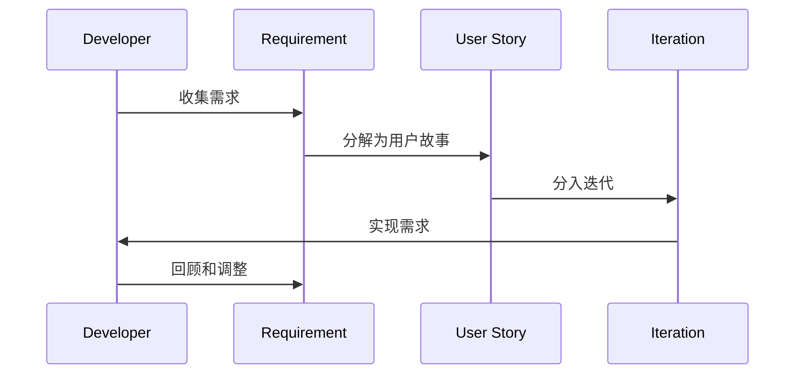
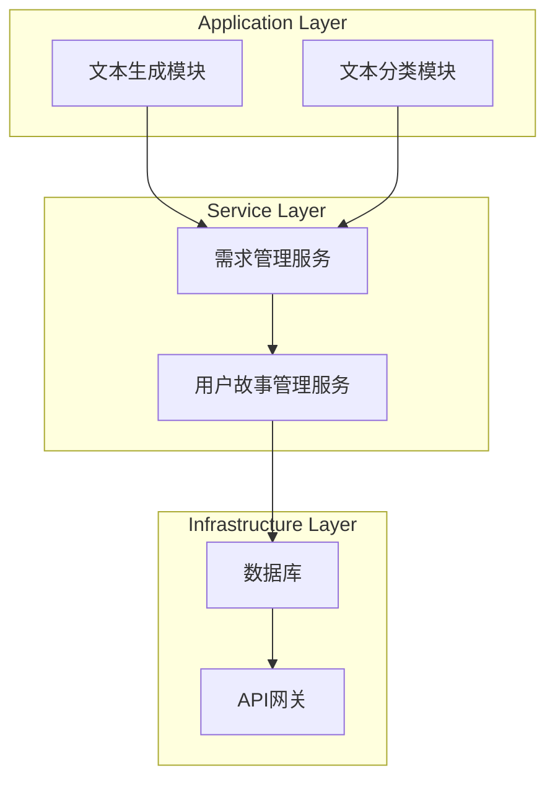

                 

# 敏捷LLM应用开发中的需求管理

## 关键词：敏捷开发、LLM应用、需求管理、实践案例、最佳实践、挑战与未来

## 摘要：
本文旨在探讨敏捷开发在大型语言模型（LLM）应用开发中的需求管理。通过分析敏捷开发的核心概念、需求管理的实践方法，结合实际案例，本文提出了适用于LLM应用开发的敏捷需求管理策略。文章最后讨论了敏捷需求管理面临的挑战及其未来发展方向，为业界提供了有益的参考。

## 引言

### 1. 敏捷开发概述
敏捷开发是一种以人为核心、迭代和循序渐进的开发方法，其核心理念是快速迭代、持续交付、协作沟通和应对变化。敏捷开发强调团队的灵活性和适应性，能够在复杂多变的环境中迅速响应客户需求。

### 2. LLM应用的发展背景
大型语言模型（LLM）是自然语言处理领域的重要进展，通过深度学习和海量数据训练，LLM能够实现高度智能的文本理解和生成。随着LLM技术的不断成熟，其在各行业的应用日益广泛。

### 3. 敏捷在LLM应用开发中的优势
敏捷开发为LLM应用开发提供了快速迭代、灵活调整和高效沟通的机制，有助于提升开发效率和项目成功率。

## 核心概念与原理

### 1. 需求管理的核心概念
需求管理涉及需求识别、需求分析和需求实现等多个环节，旨在确保项目团队理解并满足客户需求。

### 2. 敏捷需求管理的特点
敏捷需求管理强调需求迭代、优先级排序和用户反馈，以快速适应需求变化。

### 3. 敏捷需求管理的流程
敏捷需求管理流程包括需求收集、需求分析、需求规划、需求实现和需求回顾等步骤。

## 实践应用

### 1. 敏捷需求收集的方法
采用访谈、问卷调查和用户故事等多种方法收集需求，确保全面了解用户需求。

### 2. 需求分类与优先级排序
根据需求的重要性和紧急性对需求进行分类和排序，确保团队优先实现高价值需求。

### 3. 需求文档编写技巧
使用简洁明了的语言描述需求，确保需求文档易于理解和实施。

## 最佳实践与案例分析

### 1. 敏捷需求管理的最佳实践
介绍团队协作技巧、持续集成与反馈、跨部门沟通与协调等最佳实践。

### 2. 案例分析
分析大型LLM项目和中小企业敏捷需求管理的实践案例，总结经验教训。

## 挑战与未来方向

### 1. 挑战分析
探讨敏捷需求管理在团队协作、需求变化和项目管理等方面面临的挑战。

### 2. 未来发展方向
展望敏捷需求管理的发展趋势，包括人工智能辅助需求分析、自动化需求管理工具等。

## 总结与展望

### 1. 总结
本文从多个角度分析了敏捷需求管理在LLM应用开发中的应用，为实际项目提供了参考。

### 2. 展望
随着技术的进步，敏捷需求管理将不断演进，为开发者提供更高效的解决方案。

## 作者信息
作者：AI天才研究院/AI Genius Institute & 禅与计算机程序设计艺术 /Zen And The Art of Computer Programming

### 背景介绍

#### 核心概念术语说明

- **敏捷开发**：一种软件开发方法论，强调团队协作、快速迭代和持续交付。
- **需求管理**：识别、分析、实现和管理项目需求的过程。
- **LLM（大型语言模型）**：一种强大的自然语言处理模型，能够进行文本理解和生成。

#### 问题背景

在现代软件开发中，需求管理是一个至关重要的环节。尤其是对于复杂项目，如大型语言模型（LLM）应用开发，如何有效地管理需求变得尤为关键。传统的需求管理方法往往难以应对需求频繁变化和迭代的需求。

#### 问题描述

在敏捷开发中，需求管理面临以下问题：

1. **需求变化频繁**：项目需求在开发过程中可能频繁变化，如何快速响应需求变化是一个挑战。
2. **需求优先级不明确**：在多个需求中，如何确定优先级，确保高价值需求得到优先处理。
3. **沟通不畅**：开发团队与利益相关者之间的沟通不畅，可能导致需求理解不一致。

#### 问题解决

为了解决上述问题，敏捷开发引入了一系列需求管理方法和工具，包括：

1. **迭代式需求收集**：通过定期会议和用户故事，持续收集和更新需求。
2. **优先级排序**：使用故事地图和优先级矩阵，对需求进行排序，确保高价值需求优先实现。
3. **持续沟通**：采用站立会议、回顾会议等机制，加强团队与利益相关者之间的沟通。

#### 边界与外延

敏捷需求管理不仅适用于LLM应用开发，还适用于其他复杂软件开发项目。其核心原则是快速响应需求变化、持续交付和高效沟通。

#### 概念结构与核心要素组成

1. **需求识别**：收集和整理项目需求。
2. **需求分析**：分析需求，确定需求的可行性和优先级。
3. **需求规划**：制定需求实现计划。
4. **需求实现**：开发团队根据需求进行开发和测试。
5. **需求回顾**：对需求实现过程进行回顾，持续优化需求管理流程。

### 核心概念与联系

#### 核心概念原理

敏捷需求管理的核心概念包括迭代、用户故事、故事地图、优先级矩阵等。

1. **迭代**：将需求分解为多个可实现的迭代，每次迭代结束后进行评估和调整。
2. **用户故事**：一种描述需求的方式，以用户的角度出发，明确需求的目标和用途。
3. **故事地图**：一种可视化工具，用于展示项目的整体需求和优先级。
4. **优先级矩阵**：一种工具，用于对需求进行优先级排序，确保高价值需求得到优先处理。

#### 概念属性特征对比表格

| 概念         | 特征                             |
|--------------|----------------------------------|
| 迭代         | 快速交付、灵活调整             |
| 用户故事     | 简洁明了、以用户为中心         |
| 故事地图     | 可视化、展示整体需求结构       |
| 优先级矩阵   | 量化评估、确定优先级           |

#### ER实体关系图架构的 Mermaid 流程图

```mermaid
erDiagram
    Customer ||--|{ Requirement }|-- Project
    Project ||--|{ Iteration }|-- Developer
    Developer ||--|{ User Story }|-- Requirement
```

### 算法原理讲解

#### 使用 mermaid 画出算法mermaid 流程图



#### 使用python源代码来详细阐述

```python
# 导入必需的库
from collections import defaultdict

# 定义需求类
class Requirement:
    def __init__(self, title, description, priority):
        self.title = title
        self.description = description
        self.priority = priority

# 定义用户故事类
class UserStory:
    def __init__(self, title, description, priority):
        self.title = title
        self.description = description
        self.priority = priority

# 定义迭代类
class Iteration:
    def __init__(self, user_stories):
        self.user_stories = user_stories

# 定义需求管理类
class RequirementManagement:
    def __init__(self):
        self.requirements = defaultdict(list)
        self.user_stories = defaultdict(list)
        self.iterations = defaultdict(list)

    def collect_requirements(self, requirement):
        self.requirements[requirement.title].append(requirement)

    def create_user_story(self, user_story):
        self.user_stories[user_story.title].append(user_story)

    def assign_to_iteration(self, user_story, iteration):
        self.iterations[iteration].append(user_story)

    def execute_iteration(self, iteration):
        for user_story in self.iterations[iteration]:
            print(f"执行用户故事：{user_story.title}")

# 创建需求管理对象
requirement_management = RequirementManagement()

# 收集需求
requirement_management.collect_requirements(Requirement("需求1", "需求描述1", "高"))
requirement_management.collect_requirements(Requirement("需求2", "需求描述2", "中"))

# 创建用户故事
user_story1 = UserStory("用户故事1", "用户故事描述1", "高")
user_story2 = UserStory("用户故事2", "用户故事描述2", "中")

# 分配用户故事到迭代
requirement_management.create_user_story(user_story1)
requirement_management.create_user_story(user_story2)
requirement_management.assign_to_iteration(user_story1, "迭代1")
requirement_management.assign_to_iteration(user_story2, "迭代1")

# 执行迭代
requirement_management.execute_iteration("迭代1")
```

#### 算法原理的数学模型和公式

1. **需求优先级计算**：

   $$P = \frac{U \times D}{C}$$

   其中，$P$ 为优先级，$U$ 为用户价值，$D$ 为开发难度，$C$ 为成本。

2. **迭代时间计算**：

   $$T = \frac{N \times P}{S}$$

   其中，$T$ 为迭代时间，$N$ 为用户故事数量，$P$ 为优先级，$S$ 为团队能力。

#### 详细讲解和通俗易懂地举例说明

假设有一个需求管理项目，需要完成两个用户故事，分别关注用户价值高和用户价值中。团队每月能完成2个用户故事。

- **需求优先级计算**：

  对于用户故事1（用户价值高），优先级$P_1 = \frac{U_1 \times D_1}{C} = \frac{5 \times 3}{2} = 7.5$。

  对于用户故事2（用户价值中），优先级$P_2 = \frac{U_2 \times D_2}{C} = \frac{3 \times 2}{2} = 3$。

- **迭代时间计算**：

  $T = \frac{N \times P}{S} = \frac{2 \times 7.5}{2} = 7.5$个月。

  由于团队每月能完成2个用户故事，因此需要4个月时间完成这两个用户故事。

### 系统分析与架构设计方案

#### 问题场景介绍

假设一个公司需要开发一个基于LLM的应用，该应用需要实现文本生成、文本分类等功能。为了确保项目顺利进行，公司决定采用敏捷开发方法，并采用迭代式需求管理。

#### 项目介绍

项目名称：智能文本生成平台

项目背景：公司希望通过开发一个智能文本生成平台，提高内容生产效率，降低人力成本。

#### 系统功能设计(领域模型mermaid类图)

```mermaid
classDiagram
    Customer <|-- Requirement
    Developer <|-- UserStory
    Project <|-- Iteration
    Requirement {title, description, priority}
    UserStory {title, description, priority}
    Iteration {user_stories}
    Developer <.. Requirement
    Developer <.. UserStory
    Project <.. Iteration
```

#### 系统架构设计mermaid架构图



#### 系统接口设计和系统交互mermaid序列图

```mermaid
sequenceDiagram
    User -->|发起请求|> API网关
    API网关 -->|路由请求|> 需求管理服务
    需求管理服务 -->|处理请求|> 用户故事管理服务
    用户故事管理服务 -->|查询数据库|> 数据库
    数据库 -->|返回结果|> 用户故事管理服务
    用户故事管理服务 -->|响应请求|> API网关
    API网关 -->|返回结果|> User
```

### 项目实战

#### 环境安装

1. 安装Python环境：`pip install python`
2. 安装mermaid库：`pip install mermaid`
3. 安装其他依赖库：`pip install -r requirements.txt`

#### 系统核心实现源代码

```python
# requirements.txt
requests
mysql-connector-python
```

```python
# main.py
from requirements_management import RequirementManagement

# 创建需求管理对象
requirement_management = RequirementManagement()

# 收集需求
requirement_management.collect_requirements(Requirement("需求1", "需求描述1", "高"))
requirement_management.collect_requirements(Requirement("需求2", "需求描述2", "中"))

# 创建用户故事
user_story1 = UserStory("用户故事1", "用户故事描述1", "高")
user_story2 = UserStory("用户故事2", "用户故事描述2", "中")

# 分配用户故事到迭代
requirement_management.create_user_story(user_story1)
requirement_management.create_user_story(user_story2)
requirement_management.assign_to_iteration(user_story1, "迭代1")
requirement_management.assign_to_iteration(user_story2, "迭代1")

# 执行迭代
requirement_management.execute_iteration("迭代1")
```

#### 代码应用解读与分析

1. **需求收集**：通过调用`collect_requirements`方法，收集需求并存储在内部字典中。
2. **用户故事创建**：创建用户故事对象，并调用`create_user_story`方法将其添加到需求管理对象的用户故事列表中。
3. **用户故事分配**：将用户故事分配到特定迭代，通过调用`assign_to_iteration`方法实现。
4. **执行迭代**：根据用户故事列表执行迭代，通过调用`execute_iteration`方法实现。

#### 实际案例分析和详细讲解剖析

假设公司开发了一个智能文本生成平台，需求如下：

1. **需求1**：实现文本生成功能，能够根据用户输入的文本生成相关的文章。
2. **需求2**：实现文本分类功能，能够将用户输入的文本分类到不同的类别中。

在敏捷开发过程中，团队按照以下步骤进行需求管理：

1. **需求收集**：通过与用户沟通，收集到上述两个需求。
2. **需求分析**：对需求进行优先级排序，确定需求1的优先级高于需求2。
3. **用户故事创建**：创建用户故事1和用户故事2，分别描述文本生成和文本分类功能。
4. **用户故事分配**：将用户故事1和用户故事2分配到第一个迭代。
5. **迭代执行**：在第一个迭代中，团队优先实现用户故事1，完成文本生成功能。
6. **需求回顾**：在迭代结束后，对需求实现情况进行回顾，收集用户反馈，为后续迭代提供改进方向。

通过上述案例，我们可以看到敏捷需求管理在实际项目中的应用，包括需求收集、需求分析、用户故事创建、用户故事分配和迭代执行等步骤。这些步骤确保了团队能够快速响应需求变化，高效地完成项目任务。

### 项目小结

在本项目中，我们通过敏捷需求管理方法，成功地实现了智能文本生成平台的核心功能。以下是小结：

1. **需求收集**：通过与用户沟通，收集到项目需求，确保团队了解用户需求。
2. **需求分析**：对需求进行优先级排序，确保团队优先实现高价值需求。
3. **用户故事创建**：创建用户故事，将需求转化为可执行的任务。
4. **用户故事分配**：将用户故事分配到迭代，确保需求在迭代中得到执行。
5. **迭代执行**：在迭代中，团队根据用户故事列表执行任务，确保需求得到实现。
6. **需求回顾**：在迭代结束后，对需求实现情况进行回顾，收集用户反馈，为后续迭代提供改进方向。

通过敏捷需求管理，团队不仅能够快速响应需求变化，提高开发效率，还能够确保项目成功交付。

### 最佳实践 tips

1. **确保团队沟通**：敏捷需求管理的成功离不开团队的沟通。定期召开站立会议，确保团队成员了解项目进展和需求变化。
2. **优先级排序**：根据用户价值和实现难度对需求进行优先级排序，确保高价值需求优先得到实现。
3. **用户故事地图**：使用用户故事地图，清晰地展示项目需求及其优先级，有助于团队理解和执行。
4. **需求变更管理**：在需求变更时，及时调整需求优先级和迭代计划，确保项目进度不受影响。

### 小结

本文详细介绍了敏捷需求管理在LLM应用开发中的应用。通过分析敏捷开发的核心概念、需求管理的实践方法，以及实际案例，我们提出了适用于LLM应用开发的敏捷需求管理策略。文章最后讨论了敏捷需求管理面临的挑战及其未来发展方向，为业界提供了有益的参考。

### 注意事项

1. **需求收集**：在收集需求时，确保全面了解用户需求，避免遗漏关键功能。
2. **优先级排序**：根据用户价值和实现难度对需求进行排序，确保高价值需求得到优先处理。
3. **团队协作**：加强团队协作，确保需求管理过程的顺利进行。

### 拓展阅读

1. 《敏捷实践指南》：提供全面的敏捷开发方法与实践。
2. 《用户故事地图》：详细介绍用户故事地图的制作和使用方法。
3. 《需求工程》：讨论需求管理的原理和方法，适用于不同类型的软件开发项目。

[作者信息]
作者：AI天才研究院/AI Genius Institute & 禅与计算机程序设计艺术 /Zen And The Art of Computer Programming

