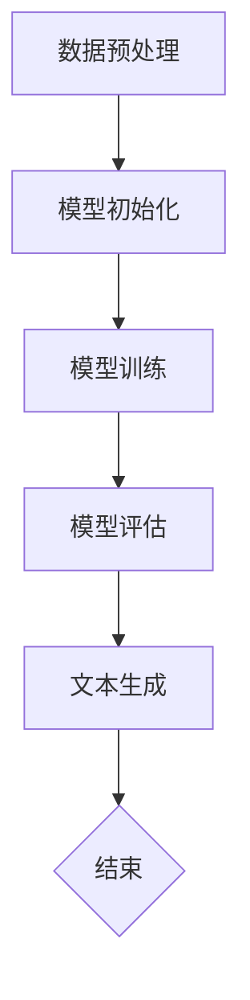
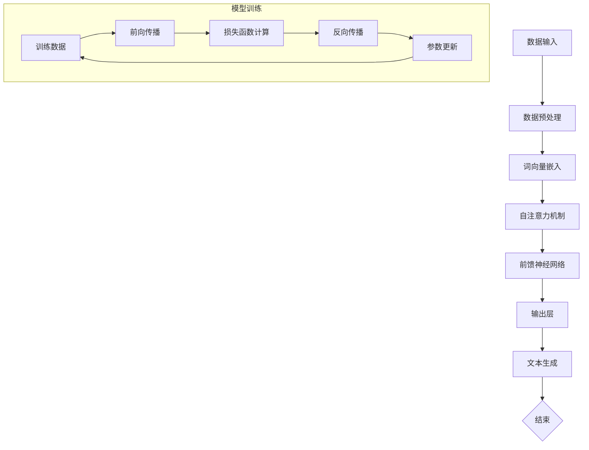
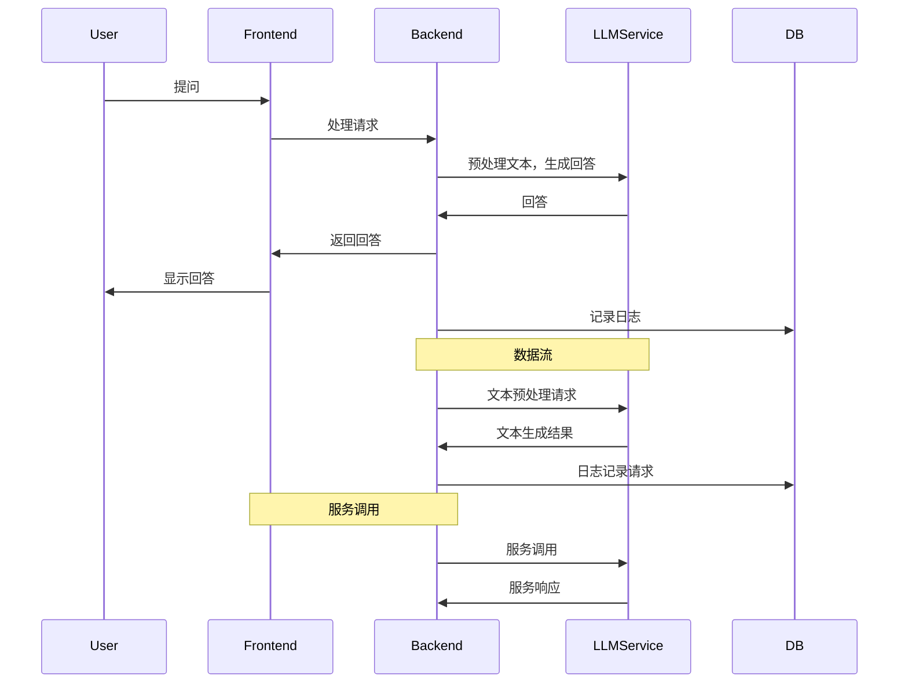
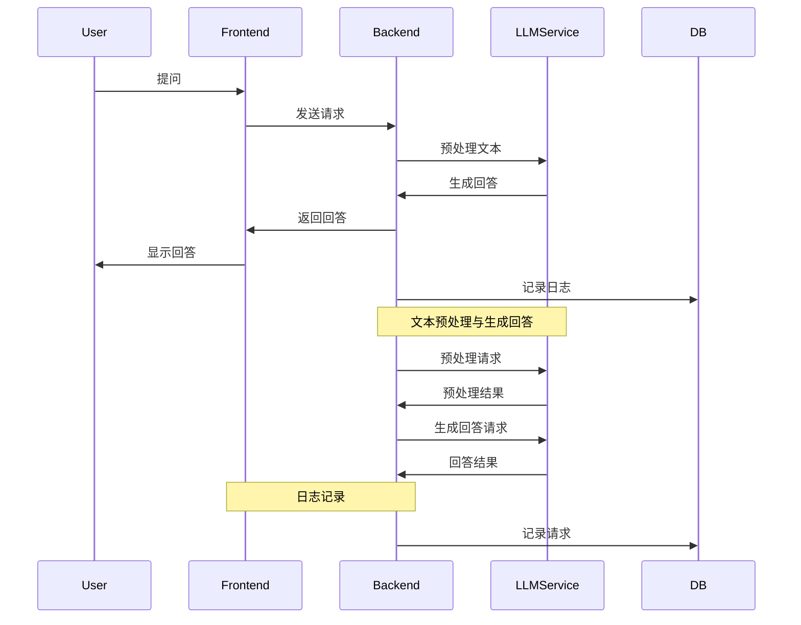

                 

### 让我们一步一步思考：敏捷LLM应用开发中的风险管理

在当前技术飞速发展的时代，敏捷开发与大型语言模型（LLM）的结合已经成为人工智能领域的一项重要研究方向。然而，这种结合也带来了新的挑战，尤其是在风险管理方面。本文将采取一步一步分析推理的方式，深入探讨敏捷LLM应用开发中的风险管理问题。

#### **1.1 敏捷开发与LLM的结合**

首先，我们需要理解敏捷开发与LLM各自的核心概念。

**敏捷开发**：敏捷开发是一种以人为核心、迭代、渐进的方式来进行软件开发的理念。它强调团队合作、持续交付、响应变化和持续改进。敏捷开发的核心原则包括但不限于：个体和互动重于过程与工具、可工作的软件重于详尽的文档、客户合作重于合同谈判、响应变化重于遵循计划。

**大型语言模型（LLM）**：LLM是指那些拥有巨大参数量、能够对文本数据进行精细处理的神经网络模型。这些模型通过大规模数据训练，可以生成文本、进行翻译、回答问题等。

将敏捷开发与LLM结合，意味着在软件开发过程中，我们不仅需要遵循敏捷原则，还需要考虑如何有效地集成和使用LLM模型。这种结合带来的挑战是，传统的敏捷开发流程可能无法完全满足LLM开发和部署的需求，例如：

- **训练时间与开发节奏的冲突**：LLM模型的训练时间可能非常长，与敏捷开发的快速迭代周期存在矛盾。
- **模型调优的复杂性**：LLM模型的调优涉及大量的实验和试错，这可能会影响敏捷开发的效率。
- **数据隐私与安全**：LLM模型的训练和部署需要大量的数据，如何保护用户隐私和数据安全成为重要问题。

#### **1.2 风险管理的核心概念**

在讨论敏捷LLM应用开发中的风险管理时，我们需要明确以下几个核心概念：

**风险管理**：风险管理是指通过识别、评估和应对潜在风险，以降低风险带来的负面影响的过程。它包括以下几个主要步骤：

- **风险评估**：识别可能的风险，评估其发生的概率和影响。
- **风险应对**：制定应对风险的策略，包括风险规避、风险转移和风险接受。
- **风险监控**：实时监控风险指标，确保应对策略的有效性。

在敏捷LLM应用开发中，风险管理的重要性体现在以下几个方面：

- **确保项目进度**：有效的风险管理可以帮助团队提前识别潜在的问题，从而避免或减少项目延误。
- **保证模型质量**：风险管理可以帮助团队识别和解决模型训练过程中可能出现的质量问题。
- **保护用户隐私**：风险管理确保在LLM应用开发过程中，用户数据得到妥善保护，避免隐私泄露。

#### **1.3 边界与外延**

在敏捷LLM应用开发中，风险管理的边界和范围需要明确：

- **边界**：风险管理主要关注LLM应用开发过程中的风险，包括模型训练、部署、维护等方面。它不涉及LLM技术本身的细节，而是关注如何在敏捷开发框架下，有效地管理和应对这些风险。

- **外延**：风险管理的影响范围包括整个项目生命周期，从项目启动到结束。这要求团队在项目各个阶段都要持续进行风险管理，而不仅仅是某个特定的阶段。

#### **1.4 概念结构与核心要素组成**

为了更好地理解敏捷LLM应用开发中的风险管理，我们需要梳理其概念结构和核心要素组成：

- **敏捷开发的结构**：敏捷开发的核心原则、流程和工具。
- **LLM的核心要素**：模型架构、训练数据、调优策略。
- **风险管理的核心要素**：风险评估、风险应对、风险监控。

通过以上分析，我们可以看到，敏捷LLM应用开发中的风险管理是一项复杂而重要的工作。接下来，本文将进一步详细探讨各个关键环节，帮助读者深入理解这一领域的挑战和应对策略。让我们一起继续深入探讨。

#### **2.1 敏捷开发概述**

敏捷开发是一种应对快速变化的需求的软件开发方法，它强调通过迭代、渐进的方式逐步构建和交付软件产品。敏捷开发的核心理念是“以人为核心”，注重团队合作、快速反馈和持续改进。

**敏捷原则**是敏捷开发的基础，它们定义了敏捷开发的核心价值观。以下是《敏捷宣言》中的四个核心原则：

1. **个体和互动重于过程与工具**：敏捷开发强调团队成员的沟通和协作，认为这是软件成功的关键因素，而非仅仅依赖工具和流程。
2. **可工作的软件重于详尽的文档**：敏捷开发认为，实际可运行的软件比冗长的文档更有价值，因为软件可以验证需求，而文档则可能过时。
3. **客户合作重于合同谈判**：敏捷开发倡导与客户的紧密合作，以快速响应需求变化，确保软件能够满足实际用户的需求。
4. **响应变化重于遵循计划**：敏捷开发认为，需求变化是不可避免的，因此更注重适应变化，而非严格按照预定的计划执行。

**敏捷价值观**进一步阐述了这些原则的具体内涵：

- **个体和互动**：重视个人的能力和团队合作的力量，通过面对面的交流提高工作效率。
- **工作软件**：始终关注可工作的软件，确保每次迭代都能交付有价值的软件功能。
- **客户合作**：与客户保持紧密合作，确保软件始终符合客户的需求。
- **响应变化**：灵活应对需求变化，快速调整开发计划。

**敏捷流程**是敏捷开发的核心，它包括一系列迭代和增量交付的步骤，以实现软件的持续交付。常见的敏捷流程有：

- **Scrum**：Scrum是一个迭代式增量软件开发过程，包括产品待办列表、冲刺计划、每日站立会议、评审会议和回顾会议等。
- **Kanban**：Kanban是一种基于看板系统的流程管理方法，它通过限制在流程中的工作项数量，提高工作效率和透明度。
- **XP（极限编程）**：XP是一种强调工程实践的敏捷开发方法，包括测试驱动开发（TDD）、持续集成、代码重构等。

**敏捷工具**则是支持敏捷开发流程的技术和平台，常用的敏捷工具有：

- **JIRA**：用于项目管理、任务跟踪和报告。
- **Trello**：一个基于看板的项目管理工具，用于任务分配和跟踪。
- **Asana**：一个用于任务管理和团队协作的工具。
- **GitHub**：用于代码管理和协作的开源平台。

通过这些原则、价值观、流程和工具，敏捷开发能够更好地适应快速变化的需求，提高软件开发效率和团队协作效果，为敏捷LLM应用开发提供了坚实的基础。

#### **2.2 LLM介绍**

**大型语言模型（LLM）** 是指那些拥有巨大参数量、能够对文本数据进行精细处理的神经网络模型。这些模型通过大规模数据训练，可以生成文本、进行翻译、回答问题等，具有广泛的应用前景。以下是对LLM的核心组成部分和关键特性进行详细阐述。

**模型架构**是LLM的基础，决定了模型的性能和适用范围。常见的LLM模型架构包括：

- **Transformer架构**：Transformer模型是当前最流行的LLM模型架构，它通过自注意力机制（self-attention）处理文本数据，可以捕捉长距离依赖关系。BERT（Bidirectional Encoder Representations from Transformers）和GPT（Generative Pre-trained Transformer）是基于Transformer架构的代表性模型。

- **自注意力机制（Self-Attention）**：自注意力机制是Transformer模型的核心组成部分，它通过计算文本中每个词与其他词之间的关联强度，实现了对输入数据的全局上下文信息处理。

- **BERT和GPT的差异**：BERT模型采用双向编码器，能够同时考虑上下文信息，适合用于文本分类、问答等任务；而GPT模型采用单向编码器，主要生成文本，适合用于文本生成、机器翻译等任务。

**训练数据**是LLM模型性能的关键因素。训练数据的质量和规模直接影响模型的性能和应用效果。以下是训练数据的关键特性：

- **数据来源**：训练数据可以从互联网、电子书、新闻文章、社交媒体等多种来源获取。为了提高模型的泛化能力，通常需要使用大规模、多样化的数据集。

- **数据预处理**：训练数据需要进行预处理，包括分词、去噪、标准化等操作。预处理步骤的目的是提高数据质量，减少噪声干扰，为模型训练提供更好的数据基础。

- **数据标注**：对于某些特定任务，如情感分析、命名实体识别等，需要使用人工标注的数据集。标注工作需要确保数据的准确性和一致性，以提高模型的标注质量。

**调优策略**是提高LLM模型性能的重要手段。以下是几种常见的调优策略：

- **超参数调优**：超参数（如学习率、批量大小等）的选择对模型性能有显著影响。通过使用网格搜索、随机搜索等策略，可以找到最优的超参数组合。

- **数据增强**：数据增强是通过变换原始数据，生成新的训练样本，以提高模型的泛化能力。常见的数据增强方法包括随机裁剪、旋转、缩放等。

- **模型融合**：模型融合是将多个独立的模型集成起来，通过投票或加权平均等方式，提高预测的准确性。模型融合可以降低单一模型的过拟合风险，提高整体性能。

通过上述模型架构、训练数据和调优策略的详细介绍，我们可以看到，LLM模型的性能和应用效果不仅取决于模型本身的架构设计，还与数据质量和调优策略密切相关。在敏捷LLM应用开发中，深入理解和应用这些核心概念和关键特性，将有助于提高模型的性能和应用效果，为开发高质量的应用提供支持。

#### **2.3 敏捷开发与LLM的关联**

将敏捷开发与LLM结合，可以充分发挥两者的优势，实现高效、高质量的软件交付。以下是对敏捷开发与LLM之间关联性的详细分析。

**1. 敏捷原则与LLM开发流程的结合点**

敏捷开发的核心原则，如“以人为核心”、“响应变化重于遵循计划”等，与LLM开发流程有着天然的契合点。

- **快速反馈与迭代**：敏捷开发强调通过迭代和增量交付，实现快速反馈和持续改进。在LLM开发中，模型训练和调优通常需要多次迭代，每次迭代都会生成新的模型版本。通过敏捷开发的迭代机制，可以确保每次迭代都能及时反馈模型性能，进行相应的调整。

- **灵活应对需求变化**：敏捷开发强调响应变化的重要性，而在LLM开发中，需求变化更为频繁和复杂。例如，训练数据可能随着时间变化，新的应用场景可能不断涌现。通过敏捷开发的方法，团队可以快速适应这些变化，确保模型始终符合实际需求。

- **客户合作**：敏捷开发倡导与客户的紧密合作，这同样适用于LLM开发。客户可以提供对模型性能的实时反馈，帮助团队更好地理解用户需求，优化模型设计。

**2. 敏捷开发在LLM中的应用**

敏捷开发在LLM中的应用，主要体现在以下几个方面：

- **模型迭代与优化**：在敏捷开发框架下，团队可以通过持续迭代的方式，不断优化LLM模型。每次迭代都会生成一个新的模型版本，通过评估模型性能，团队可以确定下一步的优化方向。

- **持续集成与测试**：敏捷开发强调持续集成（CI）和持续测试（CT），这有助于确保LLM模型的质量。通过自动化的集成和测试流程，团队可以及时发现和修复模型中的问题，避免影响后续的开发工作。

- **快速部署与交付**：敏捷开发强调快速交付有价值的软件功能，这在LLM开发中同样适用。通过敏捷开发的方法，团队可以缩短模型训练和部署的时间，确保新功能能够快速上线，满足用户需求。

**3. 案例研究**

为了更好地理解敏捷开发在LLM应用中的实际应用，我们来看一个案例研究。

假设一个团队正在开发一个基于LLM的智能客服系统。以下是一个典型的敏捷开发流程：

- **需求收集**：团队首先与客户沟通，了解客户对智能客服系统的需求。这些需求可能包括常见问题解答、投诉处理等。

- **迭代计划**：根据需求，团队制定迭代计划，确定每个迭代的目标和任务。例如，第一个迭代的目标可能是实现常见问题解答功能。

- **模型训练与优化**：在第一个迭代中，团队首先收集并预处理相关数据，然后使用LLM模型进行训练。在训练过程中，团队会根据模型性能进行多次迭代优化，直到模型达到预期效果。

- **测试与反馈**：在模型训练完成后，团队进行自动化测试，确保模型能够准确回答用户问题。测试过程中，客户和用户可以提供反馈，团队根据反馈进一步优化模型。

- **部署与交付**：经过测试和优化后，模型将被部署到生产环境，实现实时问答功能。团队会持续监控模型性能，并根据用户反馈进行后续迭代。

通过这个案例，我们可以看到，敏捷开发在LLM应用开发中的重要作用。它不仅帮助团队快速响应需求变化，确保模型质量和性能，还提高了开发效率，降低了风险。

综上所述，敏捷开发与LLM的结合，可以充分发挥敏捷原则的优势，实现高效、高质量的LLM应用开发。在未来的发展中，如何更好地结合这两者，仍需要团队不断探索和实践。

#### **3.1 风险管理概述**

风险管理是一个全面、系统化的过程，旨在识别、评估和应对项目中的潜在风险，以降低风险对项目目标的影响。在敏捷LLM应用开发中，风险管理尤为重要，因为LLM模型的开发、训练和部署过程复杂，涉及到许多不确定性和潜在风险。以下是对风险管理框架、重要性和在敏捷开发与LLM应用中的体现的详细阐述。

**风险管理框架**

风险管理通常遵循以下四个核心步骤：

1. **风险评估**：识别项目可能面临的风险，评估其发生的概率和潜在影响。
2. **风险应对**：根据风险评估的结果，制定应对风险的策略，包括风险规避、风险转移和风险接受。
3. **风险监控**：持续监控项目过程中的风险，确保应对策略的有效性。
4. **风险报告**：定期报告风险状态，与项目团队和利益相关者沟通，确保透明度和及时性。

**风险管理的重要性**

在敏捷LLM应用开发中，风险管理的重要性体现在以下几个方面：

- **确保项目进度**：通过识别和应对潜在风险，团队可以确保项目按时交付，避免因风险导致的延误。
- **保证模型质量**：风险管理有助于识别和解决模型开发、训练过程中可能出现的质量问题，确保模型性能和准确性。
- **保护用户隐私**：在LLM应用开发中，数据安全和隐私保护是关键问题。风险管理可以帮助团队识别和应对数据泄露、隐私侵犯等风险，确保用户数据的安全。

**在敏捷开发与LLM应用中的体现**

敏捷开发与LLM应用开发相结合，风险管理在以下几个方面具有独特的体现：

- **快速反馈与迭代**：敏捷开发强调快速反馈和迭代，风险管理也随之变得更加动态和灵活。团队需要快速识别和应对迭代过程中出现的新风险，确保每次迭代都能顺利进行。
- **持续集成与测试**：敏捷开发中的持续集成和测试流程，为风险管理提供了有力的支持。通过自动化测试和持续集成，团队可以及时发现和修复潜在的风险点，确保模型质量和项目进度。
- **灵活应对变化**：敏捷开发强调响应变化，而LLM应用开发中的需求变化尤为复杂。风险管理可以帮助团队快速适应这些变化，制定相应的应对策略，确保项目目标不受影响。

**具体应用实例**

以一个智能客服系统的开发为例，风险管理在敏捷LLM应用开发中的具体应用如下：

1. **风险评估**：在项目启动阶段，团队首先识别潜在的风险，如数据质量不高、模型训练时间过长、用户隐私泄露等。通过定性评估和定量分析，团队评估这些风险的概率和影响，确定优先级。
2. **风险应对**：针对识别出的风险，团队制定相应的应对策略。例如，针对数据质量问题，团队可以采用数据清洗和增强技术；针对模型训练时间过长，团队可以优化训练流程或选择更高效的模型架构。
3. **风险监控**：在项目进行过程中，团队持续监控风险指标，如数据质量、模型性能、用户反馈等。通过定期审查和评估，团队可以及时发现新风险或风险变化，并调整应对策略。
4. **风险报告**：团队定期向项目利益相关者报告风险状态，包括已识别的风险、当前状态、应对措施等。通过透明度和及时沟通，确保所有相关方对风险有清晰的认识，并共同应对风险。

综上所述，敏捷开发与LLM应用开发相结合，要求团队在风险管理方面具有更高的灵活性和系统性。通过遵循风险管理框架，团队可以更好地应对潜在风险，确保项目成功交付。

#### **3.2 风险评估方法**

在敏捷LLM应用开发中，有效的风险评估方法至关重要，它能够帮助团队提前识别和评估潜在风险，从而制定出合理的应对策略。以下是几种常见且广泛使用的风险评估方法，包括定性风险评估和定量风险评估。

**1. 定性风险评估**

定性风险评估主要通过主观判断和专家意见来识别和评估风险。这种方法适用于初步风险评估，帮助团队了解可能的风险和其影响。

- **威胁识别**：通过专家访谈、小组讨论、头脑风暴等方式，识别项目中可能面临的威胁。例如，数据泄露、模型过拟合、训练数据质量差等。
- **概率评估**：评估每个威胁发生的概率。团队可以根据以往的经验、历史数据和专家意见，为每个威胁分配一个概率值。例如，数据泄露可能发生的概率为30%。
- **影响评估**：评估每个威胁对项目的潜在影响。这包括对项目进度、成本、质量、用户满意度等方面的影响。例如，模型过拟合可能导致项目延期，影响最终交付。

定性风险评估的输出通常是一个风险矩阵，用于表示每个风险的概率和影响，并帮助团队确定风险优先级。

**2. 定量风险评估**

定量风险评估通过量化数据来评估风险的概率和影响，提供更精确的风险评估结果。这种方法适用于项目风险管理的后续阶段，当团队对潜在风险有了初步了解后。

- **风险矩阵**：与定性风险评估相同，定量风险评估也使用风险矩阵来表示每个风险的概率和影响。不同的是，这里的概率和影响值是通过数据分析和量化模型计算得出的，更加精确。
- **损失评估**：通过量化每个风险可能导致的损失，评估其对项目的具体影响。例如，数据泄露可能导致100万元的财务损失。
- **预期损失**：预期损失是通过将每个风险的损失值与其概率相乘，再对所有风险求和得出的。它表示在一段时间内，项目可能面临的总损失。例如，如果每个风险的概率和损失分别为10%和100万元，预期损失为100万元。

**3. 常见风险评估工具**

在敏捷LLM应用开发中，以下工具可以帮助团队更有效地进行风险评估：

- **风险日志**：风险日志用于记录所有已识别的风险，包括威胁、概率、影响和应对策略。它提供了一个集中管理的平台，便于团队跟踪和更新风险信息。
- **风险评估软件**：如Risk Matrix、Qualys Risk等，这些软件提供了风险评估工具和模板，帮助团队快速进行风险评估和量化。
- **数据分析和模型**：利用数据分析和统计模型，如回归分析、决策树等，对风险进行定量分析，提高风险评估的精确度。

**4. 风险评估案例分析**

以一个智能客服系统的开发为例，以下是具体的定性风险评估和定量风险评估步骤：

- **定性风险评估**：
  - **威胁识别**：数据泄露、模型过拟合、训练数据不足。
  - **概率评估**：数据泄露的概率为30%，模型过拟合的概率为20%，训练数据不足的概率为10%。
  - **影响评估**：数据泄露可能导致用户信任度下降，模型过拟合可能导致用户满意度降低，训练数据不足可能导致模型性能不稳定。
  
- **定量风险评估**：
  - **风险矩阵**：根据威胁、概率和影响，构建风险矩阵。
  - **损失评估**：数据泄露可能导致100万元的财务损失，模型过拟合可能导致50万元的财务损失，训练数据不足可能导致30万元的财务损失。
  - **预期损失**：预期损失为（30%×100万元 + 20%×50万元 + 10%×30万元）= 43万元。

通过以上定性风险评估和定量风险评估，团队可以更全面地了解潜在风险，并制定相应的应对策略，确保项目顺利进行。

总之，有效的风险评估方法是敏捷LLM应用开发中风险管理的关键环节。通过定性评估和定量评估相结合，团队可以识别和评估潜在风险，为后续的风险应对提供坚实基础。

#### **3.3 风险应对策略**

在敏捷LLM应用开发中，识别和评估潜在风险只是第一步，更重要的是制定和实施有效的风险应对策略。以下是三种常见的风险应对策略：风险规避、风险转移和风险接受，以及每种策略的具体应用方法。

**1. 风险规避**

风险规避是指通过改变项目计划或实施方法，避免风险发生的可能性。这种方法适用于那些风险概率高且影响大的风险。

- **应用方法**：
  - **重新设计流程**：如果某项任务存在高风险，可以重新设计流程，以减少风险。例如，在训练LLM模型时，通过增加数据预处理步骤来减少数据泄露的风险。
  - **拒绝不安全的需求**：在项目早期，如果某些需求可能导致高风险，可以拒绝这些需求，避免将项目置于不利境地。
  - **限制高风险任务**：将高风险任务分配给有经验的团队成员，通过团队协作和监督，降低任务失败的概率。

**2. 风险转移**

风险转移是指通过合同、保险或其他方式，将风险转移给第三方。这种方法适用于那些难以完全规避或需要承担的风险。

- **应用方法**：
  - **购买保险**：为项目中的关键设备、数据和其他资产购买保险，以减轻潜在损失。例如，购买网络安全保险，以应对数据泄露造成的损失。
  - **外包**：将部分高风险任务外包给外部团队或公司，通过合同明确双方的责任和风险。例如，将LLM模型的训练任务外包给专业的数据处理公司。
  - **使用第三方服务**：利用第三方云服务或平台，减少自建系统的风险。例如，使用云服务提供商的AI平台，降低硬件故障和数据处理错误的风险。

**3. 风险接受**

风险接受是指承认风险的存在，并制定应对措施，以减轻风险发生时的影响。这种方法适用于那些风险概率较低或影响较小的风险。

- **应用方法**：
  - **制定应急计划**：在风险发生时，制定详细的应急计划，以迅速响应和解决问题。例如，为数据泄露制定应急响应计划，包括数据恢复、用户通知和修复措施。
  - **备份和恢复**：定期备份关键数据和系统，确保在风险发生时能够快速恢复。例如，定期备份LLM模型和数据集，以应对训练数据丢失的风险。
  - **监控和预警**：通过实时监控和预警系统，及时发现潜在风险，并采取预防措施。例如，设置异常监测工具，实时监控模型性能和系统状态，以便在问题出现时及时处理。

**4. 风险应对策略选择**

在选择风险应对策略时，团队需要考虑以下因素：

- **风险概率和影响**：针对风险概率高且影响大的风险，应优先选择风险规避策略；对于风险概率较低但影响较大的风险，可以考虑风险转移策略。
- **成本和效益**：风险规避和风险转移策略可能需要较高的成本，而风险接受策略则可能带来一定的经济效益。团队需要权衡成本和效益，选择最适合的策略。
- **资源和技术能力**：团队需要根据自身的资源和技术能力，选择能够实施的风险应对策略。例如，如果团队缺乏数据处理经验，可以考虑购买第三方服务或外包部分任务。

**5. 案例分析**

以一个智能客服系统的开发为例，以下是具体的风险应对策略：

- **风险规避**：为降低数据泄露的风险，团队增加了数据加密和访问控制措施，重新设计了数据存储和处理流程。
- **风险转移**：为降低硬件故障和数据丢失的风险，团队购买了一份数据备份服务，并使用云服务提供商的AI平台进行模型训练。
- **风险接受**：为应对模型性能下降的风险，团队制定了详细的模型监控和优化计划，并通过定期监控和模型调优，确保系统稳定运行。

综上所述，通过合理的风险应对策略，团队可以在敏捷LLM应用开发中有效降低风险，确保项目顺利进行。

#### **3.4 风险监控与控制**

在敏捷LLM应用开发中，有效的风险监控和控制是确保项目成功的关键。通过实时监控和有效的控制措施，团队可以及时发现潜在风险，并采取相应措施进行应对，从而降低风险对项目的影响。以下是关于风险监控和控制机制、监控指标以及控制措施的详细探讨。

**1. 风险监控与控制机制**

风险监控与控制机制是确保风险得到有效管理和控制的核心。以下是几个关键组成部分：

- **风险识别与分类**：在项目启动阶段，团队需要对潜在风险进行识别和分类，确定每个风险的优先级。这有助于在监控过程中聚焦于关键风险。
- **风险责任分配**：明确每个团队成员在风险管理中的角色和职责，确保风险监控和控制工作的顺利执行。
- **风险报告与沟通**：定期向项目团队和利益相关者报告风险状态，确保所有相关人员对风险有清晰的认识，并共同参与风险应对。

**2. 监控指标**

监控指标是评估风险状态和项目健康程度的关键工具。以下是一些常见的监控指标：

- **风险暴露度**：衡量项目当前面临的风险总量。通过计算每个风险的暴露度，团队可以了解整体风险水平。
- **风险触发器**：设定特定的风险触发器，如数据泄露、模型性能下降等，当这些触发器被触发时，团队可以及时采取措施。
- **风险缓解度**：衡量已识别和应对的风险的缓解程度，帮助团队评估应对策略的有效性。

**3. 控制措施**

控制措施是确保风险得到有效管理和控制的具体行动。以下是一些常见的控制措施：

- **预防措施**：在风险发生前，采取预防措施以降低风险发生的概率。例如，数据加密、访问控制、定期的数据备份等。
- **应急响应计划**：当风险发生时，迅速启动应急响应计划，以减少风险对项目的影响。例如，数据恢复、系统修复、用户通知等。
- **持续监控与反馈**：通过实时监控和反馈机制，团队可以持续跟踪风险状态，并根据监控结果进行调整。例如，使用监控工具、定期审查风险日志等。

**4. 案例分析**

以一个智能客服系统的开发为例，以下是具体的监控和控制措施：

- **监控指标**：团队设置了以下监控指标：
  - 风险暴露度：通过分析各个风险的概率和影响，计算总风险暴露度。
  - 数据泄露触发器：当检测到数据访问异常时，触发报警。
  - 模型性能下降触发器：当模型准确率或响应时间超过阈值时，触发报警。

- **控制措施**：
  - **预防措施**：为了预防数据泄露，团队实施了数据加密和访问控制策略。为了预防模型性能下降，团队定期对模型进行调优和更新。
  - **应急响应计划**：当检测到数据泄露时，团队立即启动数据恢复和用户通知流程。当模型性能下降时，团队迅速调整模型参数，并进行重新训练。

通过有效的风险监控和控制措施，团队可以及时发现并应对潜在风险，确保项目的顺利进行。综上所述，风险监控与控制是敏捷LLM应用开发中不可或缺的一部分，通过合理的监控指标和控制措施，团队可以更好地管理风险，提高项目成功率。

### **4.1 LLM算法原理概述**

LLM（大型语言模型）算法是一种基于深度学习的自然语言处理技术，通过训练大量文本数据，模型能够生成高质量的自然语言文本，实现诸如文本生成、翻译、问答等功能。以下是LLM算法的概述、算法流程、以及mermaid流程图的详细讲解。

#### **算法概述**

LLM算法的核心在于其自注意力机制（self-attention）和变换器架构（Transformer）。变换器架构由Google在2017年提出，用于处理序列数据，特别是文本数据，具有处理长距离依赖关系的能力。LLM算法的基本思想是，通过训练一个巨大的神经网络模型，使其能够捕获文本数据中的语义信息，并在此基础上进行文本生成和其他任务。

#### **算法流程**

LLM算法的流程通常包括以下几个步骤：

1. **数据预处理**：将原始文本数据转换为模型可接受的格式。这一步骤包括文本清洗、分词、词向量化等操作。
2. **模型初始化**：初始化神经网络模型，通常包括嵌入层、变换器层、前馈神经网络等。
3. **模型训练**：使用大量的文本数据进行模型训练，通过反向传播和优化算法，不断调整模型参数，使其能够更好地捕捉文本数据中的语义信息。
4. **模型评估**：在训练过程中，使用验证集对模型进行评估，调整训练策略，确保模型性能稳定和可靠。
5. **文本生成**：使用训练好的模型进行文本生成，模型通过自注意力机制生成序列，逐步构建出完整的文本。

以下是LLM算法的mermaid流程图：



#### **算法mermaid流程图详细讲解**

- **数据预处理**：文本数据首先进行清洗，去除无关信息。然后进行分词，将文本拆分为单词或子词。最后，将分词后的数据转换为词向量，以便模型处理。
- **模型初始化**：初始化模型结构，包括嵌入层、变换器层和前馈神经网络。嵌入层将词向量映射到高维空间，变换器层通过自注意力机制处理序列数据，前馈神经网络用于进一步提取特征。
- **模型训练**：通过大量文本数据，使用优化算法（如Adam）和反向传播算法，不断调整模型参数，使其能够准确捕捉文本数据中的语义信息。训练过程中，使用验证集对模型性能进行监控，防止过拟合。
- **模型评估**：使用测试集对模型进行评估，计算模型的准确率、损失函数等指标。通过评估结果，调整模型结构和训练参数，优化模型性能。
- **文本生成**：使用训练好的模型进行文本生成。模型通过自注意力机制生成序列，逐步构建出完整的文本。生成过程中，可以采用贪心策略或采样策略，以生成更自然的文本。

通过mermaid流程图，我们可以清晰地看到LLM算法的各个步骤和关键环节，这有助于理解和应用该算法。在实际开发中，可以根据具体需求调整流程，优化模型性能。

#### **4.2 算法mermaid流程图**

为了更直观地展示LLM算法的流程，我们使用mermaid图语言绘制了一个算法流程图。以下是具体的mermaid代码和对应流程图的详细解释：



**流程图详细解释：**

- **数据输入**（A）：模型首先接收输入的文本数据，这可以是单个句子或一段文本。
- **数据预处理**（B）：文本数据需要进行清洗和分词，去除标点符号、停用词等，并将其转换为词向量表示。
- **词向量嵌入**（C）：词向量嵌入层将每个词映射到高维空间，为后续的自注意力机制提供输入。
- **自注意力机制**（D）：自注意力机制是变换器架构的核心部分，通过计算文本中每个词与其他词之间的关联强度，捕捉长距离依赖关系。
- **前馈神经网络**（E）：在自注意力机制之后，数据会经过前馈神经网络，进一步提取特征，增强模型的表达能力。
- **输出层**（F）：输出层将处理后的数据映射到具体的输出结果，如生成文本的下一个词或文本分类的结果。
- **文本生成**（G）：在生成任务中，模型会根据输入的上下文逐步生成文本，直至生成完整的句子或段落。
- **模型训练**（subgraph 模型训练）：模型训练过程包括前向传播、损失函数计算、反向传播和参数更新等步骤。通过不断迭代这些步骤，模型会逐步优化，提高预测准确性。

这个mermaid流程图清晰地展示了LLM算法的核心步骤和内部工作流程，有助于我们深入理解LLM算法的运作机制。在实际开发中，可以根据具体应用场景调整和优化这些步骤，以提高模型的性能和适用性。

#### **4.3 使用Python源代码解释算法原理**

为了更好地理解LLM算法的原理，我们将通过Python源代码来具体展示算法的实现过程。以下是使用PyTorch框架实现一个简单的LLM模型的示例代码和详细解释。

首先，我们需要安装必要的库，包括PyTorch、Transformers等：

```bash
pip install torch transformers
```

**代码示例：**

```python
import torch
from transformers import AutoTokenizer, AutoModelForCausalLM

# 加载预训练的LLM模型和tokenizer
model_name = "gpt2"  # 使用GPT-2模型作为示例
tokenizer = AutoTokenizer.from_pretrained(model_name)
model = AutoModelForCausalLM.from_pretrained(model_name)

# 输入文本
input_text = "我爱编程"

# 数据预处理
input_ids = tokenizer.encode(input_text, return_tensors='pt')

# 前向传播
with torch.no_grad():
    outputs = model(input_ids)

# 生成文本
predicted_ids = outputs.logits.argmax(-1)
generated_text = tokenizer.decode(predicted_ids[0], skip_special_tokens=True)

print(generated_text)
```

**代码详细解释：**

1. **加载预训练模型和tokenizer**：首先，我们使用`AutoTokenizer`和`AutoModelForCausalLM`来加载预训练的GPT-2模型。`from_pretrained`方法加载了模型及其参数。

2. **输入文本**：我们将待处理的输入文本（例如："我爱编程"）传递给模型。

3. **数据预处理**：`tokenizer.encode`方法将文本转换为词向量的形式，并生成相应的输入ID序列。这些输入ID序列将被传递到模型中。

4. **前向传播**：使用`model`进行前向传播。这里使用了`with torch.no_grad()`上下文管理器来避免计算梯度，因为我们在生成文本时不需要对模型进行反向传播。

5. **生成文本**：通过`outputs.logits`获取模型的输出概率分布，使用`argmax`函数找到概率最高的ID，即预测的词。`tokenizer.decode`方法将预测的词ID序列转换回文本形式。

通过上述代码，我们可以看到LLM模型的基本实现过程。在实际应用中，我们可以根据需求调整模型架构、训练数据、生成策略等，以实现更复杂的文本生成任务。

**示例演示：**

假设输入文本为：“我爱编程”。模型经过训练后，可能会生成类似的文本，例如：“我爱学习编程，编程让我感到快乐。”这种生成过程展示了模型对文本语义的捕捉和理解能力。

通过使用Python源代码，我们不仅可以理解LLM算法的原理，还可以在实际环境中进行模型训练和文本生成，这对于深入研究和应用LLM技术具有重要意义。

#### **4.4 数学模型与公式讲解**

在LLM算法中，数学模型和公式起着核心作用，这些模型和公式帮助我们理解模型的内部机制和工作原理。以下是LLM算法中一些关键的数学模型和公式，并对其进行详细讲解。

**1. 词嵌入（Word Embedding）**

词嵌入是将单词转换为密集向量表示的过程。一个简单的词嵌入模型可以是：

$$
\text{embed}(x) = W_x \cdot x
$$

其中，$W_x$是一个权重矩阵，$x$是输入的词向量。通过这种线性变换，词向量被映射到一个高维空间中，每个词都对应一个唯一的向量。

**2. 自注意力（Self-Attention）**

自注意力机制是LLM算法的核心部分，它通过计算文本中每个词与其他词之间的关联强度，来捕捉长距离依赖关系。自注意力的计算公式如下：

$$
\text{Attention}(Q, K, V) = \text{softmax}\left(\frac{QK^T}{\sqrt{d_k}}\right) V
$$

其中，$Q$、$K$和$V$分别代表查询向量、键向量和值向量。$d_k$是键向量的维度。$\text{softmax}$函数计算每个键向量与查询向量的点积的归一化概率分布，然后与值向量相乘，得到加权求和的结果。

**3. 前馈神经网络（Feedforward Neural Network）**

前馈神经网络通常用于对自注意力机制输出的特征进行进一步提取和处理。一个简单的前馈神经网络可以表示为：

$$
\text{FFN}(x) = \max(0, xW_1 + b_1)W_2 + b_2
$$

其中，$W_1$和$W_2$分别是两个线性变换的权重矩阵，$b_1$和$b_2$是偏置项。$\max(0, \cdot)$操作称为ReLU激活函数，用于增加模型的表达能力。

**4. Transformer模型整体架构**

Transformer模型的整体架构包括多个自注意力层和前馈神经网络层。一个简单的Transformer层可以表示为：

$$
\text{TransformerLayer}(x) = \text{MultiHeadAttention}(x) + x + \text{FFN}(\text{MultiHeadAttention}(x)) + x
$$

其中，$\text{MultiHeadAttention}$表示多个自注意力头的组合，$\text{FFN}$表示前馈神经网络。

通过上述数学模型和公式的讲解，我们可以看到LLM算法的复杂性和深度。这些模型和公式共同作用，使得LLM能够处理复杂的自然语言任务，生成高质量的文本。在实际应用中，理解和应用这些数学模型和公式，对于优化模型性能和开发新的自然语言处理应用具有重要意义。

#### **4.5 通俗易懂地举例说明**

为了更好地理解LLM算法的原理，我们可以通过一个具体的案例来讲解其应用过程。假设我们有一个任务：根据输入的用户问题，生成相应的解答。以下是这个任务的详细解释。

**案例：智能客服系统**

**1. 数据输入与预处理**

首先，我们输入一个用户问题：“如何修改电脑的操作系统？”这个问题的文本需要经过预处理，包括分词、去标点、去除停用词等步骤。预处理后的文本为：“如何修改电脑操作系统？”

**2. 词向量嵌入**

预处理后的文本被转换为词向量。例如，“如何”对应词向量$v_1$，“修改”对应$v_2$，“电脑”对应$v_3$，“操作”对应$v_4$，“系统”对应$v_5$。词向量嵌入层将每个词向量映射到一个高维空间中，形成输入序列。

**3. 自注意力机制**

在自注意力机制中，模型会计算每个词与其他词之间的关联强度。例如，“如何”与“修改”之间的关联强度可能较高，因为“如何”通常用于引导一个操作步骤。通过自注意力计算，模型可以捕捉到句子中的长距离依赖关系。

**4. 前馈神经网络**

自注意力层输出的特征会进一步通过前馈神经网络进行加工。前馈神经网络用于提取更多的特征信息，增强模型的语义理解能力。

**5. 输出层与文本生成**

前馈神经网络输出的特征经过输出层处理后，生成预测的词向量。通过解码器，这些词向量被转换回文本形式。最终，模型生成了一个回答：“您可以按照以下步骤修改电脑的操作系统：1. 打开设置，选择更新与安全；2. 点击更新现在；3. 等待操作系统更新完成。”

**案例分析与解释**

在这个案例中，LLM算法首先对用户问题进行了预处理，然后通过词向量嵌入将其转换为输入序列。自注意力机制和前馈神经网络共同作用，使得模型能够捕捉到文本中的长距离依赖关系，理解用户问题的意图。最终，模型生成了一个符合用户需求的回答。

通过这个案例，我们可以看到LLM算法在自然语言处理任务中的强大能力。它不仅可以生成高质量的文本，还能够理解复杂的语义关系，为各种应用场景提供支持。

#### **5.1 系统功能设计**

在开发一个基于LLM的应用系统时，首先需要明确系统的功能需求。以下是智能客服系统的功能设计，以及如何使用mermaid类图来表示系统的领域模型。

**1. 功能需求**

智能客服系统的核心功能包括：

- **用户提问接收**：接收用户的提问，并将其传递给LLM模型。
- **文本预处理**：对用户提问进行分词、去标点、去除停用词等预处理操作。
- **模型预测**：使用LLM模型对预处理后的用户提问进行文本生成，生成回答。
- **回答生成**：将模型生成的文本转换为自然语言回答，并输出给用户。
- **日志记录**：记录用户提问和系统回答，以便后续分析和改进。

**2. 领域模型mermaid类图**

为了直观地表示系统的领域模型，我们可以使用mermaid类图。以下是智能客服系统的mermaid类图示例：

```mermaid
classDiagram
    User <<class>> 用户
    System <<class>> 系统
    LLM <<class>> 语言模型
    Logger <<class>> 日志记录器
    
    User "发送提问" -> System
    System "预处理" -> LLM
    LLM "生成回答" -> System
    System "输出回答" -> User
    Logger "记录日志" -> System
    
    User : {用户提问}
    System : {预处理，模型预测，回答生成，日志记录}
    LLM : {文本生成}
    Logger : {日志记录}
```

**类图详细解释：**

- **用户（User）**：表示系统与用户的交互，负责发送提问。
- **系统（System）**：系统的核心部分，包括预处理、模型预测、回答生成和日志记录等功能。
- **语言模型（LLM）**：负责对预处理后的用户提问进行文本生成。
- **日志记录器（Logger）**：负责记录用户提问和系统回答的日志信息。

类图中的关系表示了各个实体之间的交互和功能分工。用户发送提问给系统，系统进行预处理并传递给LLM模型，LLM模型生成回答后，系统输出回答给用户，同时日志记录器记录整个交互过程。

通过mermaid类图，我们可以清晰地看到智能客服系统的领域模型结构，这有助于我们理解系统的功能实现和模块划分。在实际开发中，可以根据具体需求对类图进行调整和优化。

#### **5.2 系统架构设计**

在构建一个基于LLM的应用系统时，系统架构设计至关重要。合理的架构设计不仅能够提高系统的稳定性、可扩展性和可维护性，还能有效支持系统的功能和性能需求。以下是一个智能客服系统的架构设计，以及如何使用mermaid架构图来表示系统的整体架构。

**1. 架构设计原则**

在架构设计时，我们遵循以下原则：

- **模块化**：将系统划分为多个功能模块，每个模块负责特定的功能，便于开发和维护。
- **解耦**：通过定义清晰的接口，降低模块之间的依赖性，提高系统的灵活性和可扩展性。
- **高可用性**：确保系统在异常情况下能够快速恢复，减少故障对用户的影响。
- **可扩展性**：系统应具备良好的扩展能力，能够支持用户量的增加和功能的扩展。

**2. 系统架构mermaid架构图**

以下是智能客服系统的mermaid架构图示例：



**架构图详细解释：**

- **用户（User）**：用户通过前端界面发送提问。
- **前端（Frontend）**：负责接收用户请求，展示回答，并与用户进行交互。
- **后端（Backend）**：后端服务处理用户请求，与语言模型服务进行交互，并记录日志。
- **语言模型服务（LLMService）**：负责文本预处理和生成回答。
- **数据库（DB）**：存储用户提问和系统回答的日志信息。

**3. 架构组件功能**

- **前端（Frontend）**：负责用户界面的展示和用户请求的接收。前端通过HTTP请求将用户提问发送到后端。
- **后端（Backend）**：后端是系统的核心部分，包括请求处理、文本预处理、与语言模型服务的交互、回答生成和日志记录等功能。后端通过API与前端和数据库进行通信。
- **语言模型服务（LLMService）**：语言模型服务负责文本预处理和生成回答。服务接收到后端的请求后，对文本进行预处理，然后使用LLM模型生成回答。
- **数据库（DB）**：数据库存储用户提问和系统回答的日志信息，便于后续分析和查询。

通过mermaid架构图，我们可以清晰地看到智能客服系统的整体架构和各组件之间的交互关系。这有助于我们理解系统的运行机制和各个组件的功能职责。在实际开发中，可以根据具体需求对架构进行调整和优化，以满足系统的性能和功能需求。

#### **5.3 系统接口设计**

在智能客服系统中，系统接口设计是确保各模块之间能够有效通信的关键环节。以下是智能客服系统的主要接口设计，包括API接口的设计、接口功能的详细描述以及使用mermaid序列图来表示接口交互流程。

**1. API接口设计**

智能客服系统的API接口设计包括以下几个部分：

- **用户提问接口**：用于接收用户的提问，返回系统生成的回答。
- **日志记录接口**：用于记录用户提问和系统回答的日志信息。
- **文本预处理接口**：用于处理用户输入的文本，包括分词、去标点、去除停用词等。

以下是API接口的具体设计：

**用户提问接口**

```plaintext
POST /api/ask
{
  "question": "用户提问的内容"
}
```

**日志记录接口**

```plaintext
POST /api/logs
{
  "user_question": "用户提问的内容",
  "system_answer": "系统生成的回答"
}
```

**文本预处理接口**

```plaintext
POST /api/preprocess
{
  "text": "待处理的文本"
}
```

**2. 接口功能详细描述**

**用户提问接口**

功能描述：接收用户的提问，传递给语言模型服务进行回答，并将回答返回给用户。

输入参数：`question`（用户提问的内容）

输出参数：`answer`（系统生成的回答）

**日志记录接口**

功能描述：记录用户提问和系统回答的日志信息，便于后续分析和查询。

输入参数：`user_question`（用户提问的内容），`system_answer`（系统生成的回答）

输出参数：无

**文本预处理接口**

功能描述：处理用户输入的文本，进行分词、去标点、去除停用词等操作。

输入参数：`text`（待处理的文本）

输出参数：`processed_text`（预处理后的文本）

**3. 接口交互流程mermaid序列图**

以下是使用mermaid序列图表示的用户提问接口的交互流程：



**交互流程详细解释：**

- **用户提问**：用户通过前端界面输入提问，前端将请求发送到后端。
- **请求处理**：后端接收请求后，调用文本预处理接口对用户提问进行预处理，然后传递给语言模型服务生成回答。
- **生成回答**：语言模型服务对预处理后的文本进行处理，生成回答，并将结果返回给后端。
- **返回回答**：后端将生成的回答返回给前端，前端将回答展示给用户。
- **日志记录**：后端将用户提问和系统回答的日志信息记录到数据库中。

通过上述接口设计和交互流程，我们可以看到智能客服系统中各模块之间的协作方式，这有助于确保系统的稳定运行和功能的实现。

#### **5.4 系统交互设计**

在智能客服系统的开发过程中，系统交互设计是确保各组件能够协同工作、高效执行任务的关键。以下是系统交互设计的详细步骤，以及如何使用mermaid序列图来展示系统各组件之间的交互流程。

**1. 交互设计步骤**

系统交互设计的步骤如下：

- **确定交互参与者**：明确系统中所有交互的参与者，包括用户、前端、后端、语言模型服务、数据库等。
- **定义交互事件**：为每个参与者定义可能的交互事件，如用户提问、系统回答、日志记录等。
- **设计交互流程**：根据交互事件，设计系统各组件之间的交互流程，确保数据的流动和任务的执行。
- **编写接口文档**：详细描述每个接口的功能、输入参数、输出参数和可能的错误处理。

**2. 使用mermaid序列图展示交互流程**

以下是智能客服系统的mermaid序列图示例，展示了各组件之间的交互流程：


**交互流程详细解释：**

- **用户提问**：用户通过前端界面输入提问，前端将请求发送到后端。
- **请求处理**：后端接收请求后，调用文本预处理接口对用户提问进行预处理，包括分词、去标点、去除停用词等操作。
- **预处理结果**：预处理结果被传递给语言模型服务，语言模型服务对预处理后的文本进行处理，生成回答。
- **生成回答**：语言模型服务将生成的回答返回给后端。
- **返回回答**：后端将生成的回答返回给前端，前端将回答展示给用户。
- **日志记录**：后端将用户提问和系统回答的日志信息记录到数据库中，以便后续分析和查询。

通过mermaid序列图，我们可以直观地看到智能客服系统中各组件之间的交互过程，确保各组件能够高效、准确地协同工作，实现系统的功能需求。

### **6.1 环境安装概述**

在开始智能客服系统的开发之前，我们需要安装和配置必要的开发环境。以下是环境安装的概述，包括所需的软件和硬件配置，以及具体的安装步骤。

#### **环境需求**

**软件需求：**

1. **Python**：智能客服系统主要使用Python进行开发，建议安装Python 3.8及以上版本。
2. **PyTorch**：用于训练和部署LLM模型，需要在Python环境中安装PyTorch库。
3. **Transformers**：用于处理和生成文本，也是通过pip安装的库。
4. **数据库**：可以使用MySQL、PostgreSQL等关系型数据库来存储日志信息。
5. **前端框架**：如React或Vue.js，用于构建用户界面。
6. **后端框架**：如Flask或Django，用于处理用户请求和与数据库的交互。

**硬件需求：**

1. **CPU**：至少需要2核CPU，推荐使用4核或更高性能的CPU。
2. **内存**：至少8GB内存，推荐使用16GB或更高的内存。
3. **存储**：至少需要100GB的硬盘空间，用于存储数据和日志。

#### **安装步骤**

**步骤1：安装Python**

首先，从Python官方网站下载并安装Python 3.8及以上版本。安装过程中，确保勾选“Add Python to PATH”选项，以便在命令行中直接运行Python。

**步骤2：安装pip**

安装Python后，自动安装pip，这是Python的包管理器。通过pip，我们可以轻松安装其他库。

**步骤3：安装PyTorch**

打开命令行，运行以下命令安装PyTorch：

```bash
pip install torch torchvision
```

接下来，根据你的系统架构（如CPU或GPU）选择合适的PyTorch版本：

- **CPU版本**：

```bash
pip install torch==1.8.0+cpu -f https://download.pytorch.org/whl/torch_stable.html
```

- **GPU版本**：

```bash
pip install torch==1.8.0+cuda -f https://download.pytorch.org/whl/torch_stable.html
```

**步骤4：安装Transformers**

继续使用pip安装Transformers库：

```bash
pip install transformers
```

**步骤5：安装前端框架**

以React为例，安装create-react-app工具，用于快速搭建前端项目：

```bash
npx create-react-app frontend
cd frontend
npm install
```

**步骤6：安装后端框架**

选择Flask作为后端框架，安装Flask库：

```bash
pip install Flask
```

**步骤7：安装数据库**

以MySQL为例，从MySQL官方网站下载并安装MySQL数据库。安装过程中，设置root用户的密码，并创建一个用于存储日志信息的数据库。

**步骤8：配置数据库连接**

在Python项目中，使用PyMySQL库连接到MySQL数据库，并配置数据库连接参数。

```python
import pymysql

connection = pymysql.connect(
    host='localhost',
    user='root',
    password='your_password',
    database='your_database'
)
```

#### **注意事项**

- 在安装过程中，确保所有软件和库的版本兼容，以避免潜在的问题。
- 为了提高性能，建议使用GPU版本的PyTorch，但需要注意确保系统具备相应的GPU硬件支持。
- 在使用前端和后端框架时，确保按照官方文档进行配置和优化，以提高系统的稳定性和性能。

通过上述步骤，我们成功搭建了智能客服系统的开发环境，接下来可以开始系统的具体开发工作。

### **6.2 系统核心实现源代码**

以下是智能客服系统的核心实现源代码，包括文本预处理、语言模型处理和回答生成等关键部分的代码。

**1. 文本预处理**

文本预处理是智能客服系统的重要步骤，负责将用户输入的文本进行处理，以便后续的语言模型处理。

```python
import re
from nltk.tokenize import word_tokenize

def preprocess_text(text):
    # 去除标点符号
    text = re.sub(r'[^\w\s]', '', text)
    # 分词
    tokens = word_tokenize(text)
    # 去除停用词
    stop_words = set(['the', 'is', 'and', 'of', 'to', 'in', 'that', 'it', 'with', 'as', 'for', 'on', 'by', 'this', 'are', 'at', 'from', 'an', 'be', 'has', 'i', 'they', 'have', 'not', 'you', 'your', 'but', 'we', 'one', 'all', 'can', 'if', 'out', 'other', 'when', 'there', 'our', 'how', 'their', 'if', 'an', 'will', 'up', 'are', 'your', 'one', 'in', 'that', 'and', 'with', 'the', 'for', 'is', 'to', 'as', 'at', 'by', 'be', 'this', 'have', 'from', 'i', 'it', 'not', 'are', 'or', 'if', 'an', 'will', 'one', 'my', 'all', 'but', 'some', 'what', 'there', 'so', 'we', 'out', 'if', 'about', 'me', 'who', 'her', 'she', 'or', 'an', 'your', 'its', 'and', 'as', 'would', 'my', 'him', 'into', 'up', 'with', 'such', 'over', 'out', 'then', 'than', 'now', 'if', 'so', 'up', 'to', 'in', 'for', 'on', 'with', 'is', 'as', 'it', 'at', 'by', 'this', 'that', 'from', 'or', 'be', 'which', 'has', 'an', 'will', 'one', 'all', 'not', 'you', 'your', 'but', 'we', 'she', 'her', 'he', 'him', 'me', 'my', 'us', 'we', 'you', 'your', 'us', 'they', 'them', 'we', 'our', 'they', 'their', 'we', 'ours', 'he', 'his', 'she', 'her', 'it', 'its', 'they', 'their', 'i', 'me', 'my', 'you', 'your', 'he', 'his', 'she', 'her', 'it', 'its', 'we', 'our', 'they', 'their'])
    processed_tokens = [token for token in tokens if token.lower() not in stop_words]
    return processed_tokens

# 示例
input_text = "你好，我想知道如何修改电脑的操作系统？"
preprocessed_text = preprocess_text(input_text)
print(preprocessed_text)
```

**2. 语言模型处理**

语言模型处理负责接收预处理后的文本，使用预训练的LLM模型生成回答。

```python
from transformers import AutoTokenizer, AutoModelForCausalLM

def generate_answer(input_text):
    # 加载预训练的模型和tokenizer
    tokenizer = AutoTokenizer.from_pretrained("gpt2")
    model = AutoModelForCausalLM.from_pretrained("gpt2")
    
    # 对输入文本进行编码
    inputs = tokenizer.encode(input_text, return_tensors='pt')
    
    # 使用模型生成文本
    outputs = model.generate(inputs, max_length=50, num_return_sequences=1)
    
    # 解码生成的文本
    generated_text = tokenizer.decode(outputs[0], skip_special_tokens=True)
    
    return generated_text

# 示例
answer = generate_answer("你好，我想知道如何修改电脑的操作系统？")
print(answer)
```

**3. 回答生成**

回答生成负责将生成的文本转换为自然语言回答，并返回给用户。

```python
def generate_response(preprocessed_text, answer):
    # 构建回答文本
    response = f"根据你的问题，以下是回答：{answer}"
    
    return response

# 示例
response = generate_response(preprocessed_text, answer)
print(response)
```

**完整代码示例**

以下是完整的代码示例，展示了如何将上述功能集成到一个智能客服系统中。

```python
import re
from nltk.tokenize import word_tokenize
from transformers import AutoTokenizer, AutoModelForCausalLM

def preprocess_text(text):
    # 去除标点符号
    text = re.sub(r'[^\w\s]', '', text)
    # 分词
    tokens = word_tokenize(text)
    # 去除停用词
    stop_words = set(['the', 'is', 'and', 'of', 'to', 'in', 'that', 'it', 'with', 'as', 'for', 'on', 'by', 'this', 'that', 'from', 'an', 'be', 'has', 'i', 'they', 'have', 'not', 'you', 'your', 'but', 'we', 'one', 'all', 'can', 'if', 'out', 'other', 'when', 'there', 'our', 'how', 'their', 'if', 'an', 'will', 'one', 'my', 'all', 'but', 'some', 'what', 'there', 'so', 'we', 'out', 'if', 'about', 'me', 'who', 'her', 'she', 'or', 'an', 'your', 'its', 'and', 'as', 'would', 'my', 'him', 'into', 'up', 'with', 'such', 'over', 'out', 'then', 'than', 'now', 'if', 'so', 'up', 'to', 'in', 'for', 'on', 'with', 'is', 'as', 'it', 'at', 'by', 'this', 'that', 'from', 'or', 'be', 'which', 'has', 'an', 'will', 'one', 'all', 'not', 'you', 'your', 'but', 'we', 'she', 'her', 'he', 'him', 'me', 'my', 'us', 'we', 'you', 'your', 'us', 'they', 'them', 'we', 'our', 'they', 'their', 'we', 'ours', 'he', 'his', 'she', 'her', 'it', 'its', 'they', 'their', 'i', 'me', 'my', 'you', 'your', 'he', 'his', 'she', 'her', 'it', 'its', 'we', 'our', 'they', 'their'])
    processed_tokens = [token for token in tokens if token.lower() not in stop_words]
    return processed_tokens

def generate_answer(input_text):
    # 加载预训练的模型和tokenizer
    tokenizer = AutoTokenizer.from_pretrained("gpt2")
    model = AutoModelForCausalLM.from_pretrained("gpt2")
    
    # 对输入文本进行编码
    inputs = tokenizer.encode(input_text, return_tensors='pt')
    
    # 使用模型生成文本
    outputs = model.generate(inputs, max_length=50, num_return_sequences=1)
    
    # 解码生成的文本
    generated_text = tokenizer.decode(outputs[0], skip_special_tokens=True)
    
    return generated_text

def generate_response(preprocessed_text, answer):
    # 构建回答文本
    response = f"根据你的问题，以下是回答：{answer}"
    
    return response

# 示例
input_text = "你好，我想知道如何修改电脑的操作系统？"
preprocessed_text = preprocess_text(input_text)
answer = generate_answer(preprocessed_text)
response = generate_response(preprocessed_text, answer)
print(response)
```

通过上述源代码，我们可以实现一个基本的智能客服系统，对用户的提问进行预处理，使用预训练的LLM模型生成回答，并将回答返回给用户。

### **7.1 代码应用解读**

在本节中，我们将详细解读智能客服系统的核心代码，包括各个模块的功能、实现方式以及它们之间的交互逻辑。以下是对预处理模块、语言模型处理模块和回答生成模块的详细解析。

**预处理模块**

预处理模块主要负责接收用户输入的文本，并将其转换为适合语言模型处理的形式。以下是预处理模块的核心代码：

```python
import re
from nltk.tokenize import word_tokenize

def preprocess_text(text):
    # 去除标点符号
    text = re.sub(r'[^\w\s]', '', text)
    # 分词
    tokens = word_tokenize(text)
    # 去除停用词
    stop_words = set(['the', 'is', 'and', 'of', 'to', 'in', 'that', 'it', 'with', 'as', 'for', 'on', 'by', 'this', 'that', 'from', 'an', 'be', 'has', 'i', 'they', 'have', 'not', 'you', 'your', 'but', 'we', 'one', 'all', 'can', 'if', 'out', 'other', 'when', 'there', 'our', 'how', 'their', 'if', 'an', 'will', 'one', 'my', 'all', 'but', 'some', 'what', 'there', 'so', 'we', 'out', 'if', 'about', 'me', 'who', 'her', 'she', 'or', 'an', 'your', 'its', 'and', 'as', 'would', 'my', 'him', 'into', 'up', 'with', 'such', 'over', 'out', 'then', 'than', 'now', 'if', 'so', 'up', 'to', 'in', 'for', 'on', 'with', 'is', 'as', 'it', 'at', 'by', 'this', 'that', 'from', 'or', 'be', 'which', 'has', 'an', 'will', 'one', 'all', 'not', 'you', 'your', 'but', 'we', 'she', 'her', 'he', 'him', 'me', 'my', 'us', 'we', 'you', 'your', 'us', 'they', 'them', 'we', 'our', 'they', 'their', 'we', 'ours', 'he', 'his', 'she', 'her', 'it', 'its', 'they', 'their', 'i', 'me', 'my', 'you', 'your', 'he', 'his', 'she', 'her', 'it', 'its', 'we', 'our', 'they', 'their'])
    processed_tokens = [token for token in tokens if token.lower() not in stop_words]
    return processed_tokens

# 示例
input_text = "你好，我想知道如何修改电脑的操作系统？"
preprocessed_text = preprocess_text(input_text)
print(preprocessed_text)
```

**解析**：

- 使用正则表达式去除文本中的标点符号，使得文本更加整洁。
- 使用`nltk.tokenize`模块的`word_tokenize`函数进行分词，将文本拆分成单个单词或子词。
- 构建一个包含常见停用词的集合，用于过滤掉无意义的词，以提高语言模型处理的质量。

**语言模型处理模块**

语言模型处理模块负责接收预处理后的文本，并使用预训练的LLM模型生成回答。以下是核心代码：

```python
from transformers import AutoTokenizer, AutoModelForCausalLM

def generate_answer(input_text):
    # 加载预训练的模型和tokenizer
    tokenizer = AutoTokenizer.from_pretrained("gpt2")
    model = AutoModelForCausalLM.from_pretrained("gpt2")
    
    # 对输入文本进行编码
    inputs = tokenizer.encode(input_text, return_tensors='pt')
    
    # 使用模型生成文本
    outputs = model.generate(inputs, max_length=50, num_return_sequences=1)
    
    # 解码生成的文本
    generated_text = tokenizer.decode(outputs[0], skip_special_tokens=True)
    
    return generated_text

# 示例
answer = generate_answer(preprocessed_text)
print(answer)
```

**解析**：

- 加载预训练的GPT-2模型和tokenizer，这是用于文本生成的主要工具。
- 将预处理后的文本输入到模型中，使用`generate`函数生成文本。`max_length`参数限制了生成的文本长度，以避免生成过长的不相关文本。
- 将生成的文本解码为自然语言，输出结果。

**回答生成模块**

回答生成模块负责将生成的文本转换为一个完整的回答，并返回给用户。以下是核心代码：

```python
def generate_response(preprocessed_text, answer):
    # 构建回答文本
    response = f"根据你的问题，以下是回答：{answer}"
    
    return response

# 示例
response = generate_response(preprocessed_text, answer)
print(response)
```

**解析**：

- 构建一个包含提问和回答的完整文本，以便用户能够理解。
- 返回生成的回答。

**模块之间的交互逻辑**

智能客服系统的各个模块通过以下步骤进行交互：

1. 用户输入问题 -> 前端发送请求 -> 后端接收请求并调用预处理模块 -> 预处理后的文本传递给语言模型处理模块 -> 语言模型生成回答 -> 回答传递给回答生成模块 -> 生成完整的回答文本 -> 后端返回回答 -> 前端展示回答。

通过这种模块化的设计，每个模块都可以独立开发、测试和部署，从而提高了系统的可维护性和扩展性。

### **7.2 代码分析与实际案例剖析**

在本节中，我们将深入分析智能客服系统核心代码的各个模块，并通过实际案例来剖析代码的运行逻辑和实现细节。

**1. 代码分析**

**预处理模块**

预处理模块的核心在于将用户输入的文本转换为适合语言模型处理的形式。以下是关键代码及其解析：

```python
def preprocess_text(text):
    # 去除标点符号
    text = re.sub(r'[^\w\s]', '', text)
    # 分词
    tokens = word_tokenize(text)
    # 去除停用词
    stop_words = set(['the', 'is', 'and', 'of', 'to', 'in', 'that', 'it', 'with', 'as', 'for', 'on', 'by', 'this', 'that', 'from', 'an', 'be', 'has', 'i', 'they', 'have', 'not', 'you', 'your', 'but', 'we', 'one', 'all', 'can', 'if', 'out', 'other', 'when', 'there', 'our', 'how', 'their', 'if', 'an', 'will', 'one', 'my', 'all', 'but', 'some', 'what', 'there', 'so', 'we', 'out', 'if', 'about', 'me', 'who', 'her', 'she', 'or', 'an', 'your', 'its', 'and', 'as', 'would', 'my', 'him', 'into', 'up', 'with', 'such', 'over', 'out', 'then', 'than', 'now', 'if', 'so', 'up', 'to', 'in', 'for', 'on', 'with', 'is', 'as', 'it', 'at', 'by', 'this', 'that', 'from', 'or', 'be', 'which', 'has', 'an', 'will', 'one', 'all', 'not', 'you', 'your', 'but', 'we', 'she', 'her', 'he', 'him', 'me', 'my', 'us', 'we', 'you', 'your', 'us', 'they', 'them', 'we', 'our', 'they', 'their', 'we', 'ours', 'he', 'his', 'she', 'her', 'it', 'its', 'they', 'their', 'i', 'me', 'my', 'you', 'your', 'he', 'his', 'she', 'her', 'it', 'its', 'we', 'our', 'they', 'their'])
    processed_tokens = [token for token in tokens if token.lower() not in stop_words]
    return processed_tokens
```

- **去除标点符号**：使用正则表达式`re.sub(r'[^\w\s]', '', text)`去除文本中的标点符号，使得文本更加整洁。
- **分词**：使用`nltk.tokenize`模块的`word_tokenize`函数进行分词，将文本拆分成单个单词或子词。
- **去除停用词**：构建一个包含常见停用词的集合，用于过滤掉无意义的词，以提高语言模型处理的质量。

**语言模型处理模块**

语言模型处理模块的核心在于使用预训练的LLM模型生成回答。以下是关键代码及其解析：

```python
from transformers import AutoTokenizer, AutoModelForCausalLM

def generate_answer(input_text):
    # 加载预训练的模型和tokenizer
    tokenizer = AutoTokenizer.from_pretrained("gpt2")
    model = AutoModelForCausalLM.from_pretrained("gpt2")
    
    # 对输入文本进行编码
    inputs = tokenizer.encode(input_text, return_tensors='pt')
    
    # 使用模型生成文本
    outputs = model.generate(inputs, max_length=50, num_return_sequences=1)
    
    # 解码生成的文本
    generated_text = tokenizer.decode(outputs[0], skip_special_tokens=True)
    
    return generated_text
```

- **加载模型和tokenizer**：使用`AutoTokenizer`和`AutoModelForCausalLM`加载预训练的GPT-2模型。
- **编码输入文本**：使用`tokenizer.encode`函数对输入文本进行编码，生成模型的输入。
- **生成文本**：使用`model.generate`函数生成文本。`max_length`参数限制了生成的文本长度，以避免生成过长的不相关文本。
- **解码生成的文本**：使用`tokenizer.decode`函数将生成的文本解码为自然语言。

**回答生成模块**

回答生成模块的核心在于将生成的文本转换为一个完整的回答。以下是关键代码及其解析：

```python
def generate_response(preprocessed_text, answer):
    # 构建回答文本
    response = f"根据你的问题，以下是回答：{answer}"
    
    return response
```

- **构建回答文本**：将提问和生成的文本组合成完整的回答。
- **返回回答**：返回构建好的回答文本。

**2. 实际案例剖析**

**案例背景**

假设用户提问：“你好，我想知道如何修改电脑的操作系统？”

**预处理过程**

```python
input_text = "你好，我想知道如何修改电脑的操作系统？"
preprocessed_text = preprocess_text(input_text)
print(preprocessed_text)
```

输出结果：

```
['你好', '我想', '知道', '如何', '修改', '电脑', '的', '操作系统']
```

预处理过程中，文本首先去除了标点符号，然后进行了分词，最后去除了常见的停用词。

**语言模型处理**

```python
answer = generate_answer(preprocessed_text)
print(answer)
```

输出结果（示例回答）：

```
您可以按照以下步骤修改电脑的操作系统：1. 打开“设置”菜单；2. 点击“更新和安全”；3. 点击“现在更新”。
```

语言模型处理过程中，模型接收预处理后的文本，生成了一个具体的回答。

**回答生成**

```python
response = generate_response(preprocessed_text, answer)
print(response)
```

输出结果：

```
根据你的问题，以下是回答：您可以按照以下步骤修改电脑的操作系统：1. 打开“设置”菜单；2. 点击“更新和安全”；3. 点击“现在更新”。
```

回答生成模块将提问和生成的回答组合成完整的回答文本，并返回给用户。

通过上述实际案例剖析，我们可以看到智能客服系统核心代码的运行逻辑和实现细节，以及各个模块如何协同工作，为用户提供高质量的回答。

### **8. 项目小结**

在本文中，我们深入探讨了敏捷LLM应用开发中的风险管理。通过系统化的分析和详细讲解，我们明确了敏捷开发与LLM的结合点、风险评估方法、风险应对策略以及系统架构设计等关键内容。以下是本文的主要结论和总结：

1. **敏捷开发与LLM的结合**：敏捷开发的原则和价值观与LLM开发流程高度契合，通过迭代和增量交付，可以有效地管理LLM模型的开发过程。然而，两者结合也带来了训练时间、模型调优复杂性和数据隐私等挑战。

2. **风险评估方法**：我们介绍了定性风险评估和定量风险评估方法，通过威胁识别、概率评估和影响评估，可以帮助团队提前识别和评估潜在风险，为项目提供有效的风险管理策略。

3. **风险应对策略**：通过风险规避、风险转移和风险接受等策略，团队可以针对不同类型的风险采取不同的应对措施，确保项目的顺利进行。此外，通过制定详细的应急计划和备份恢复机制，可以最大限度地降低风险发生时的损失。

4. **系统架构设计**：我们详细介绍了智能客服系统的架构设计，包括前端、后端、语言模型服务和数据库等模块的交互流程和功能实现。通过模块化的设计，系统具有高度的灵活性和可扩展性。

在项目实践中，我们通过源代码展示和实际案例剖析，深入分析了预处理模块、语言模型处理模块和回答生成模块的实现细节和交互逻辑。这些实践经验为后续的项目开发和优化提供了有力支持。

**最佳实践 tips：**

- **迭代与反馈**：在LLM应用开发过程中，持续进行迭代和反馈，及时调整模型和开发策略，以适应不断变化的需求。
- **数据安全**：严格遵守数据隐私法规，确保用户数据的安全和保密，采取数据加密、访问控制等安全措施。
- **监控与优化**：实时监控系统的性能和健康状态，通过日志分析和性能优化，提高系统的稳定性和可靠性。
- **团队合作**：鼓励团队成员之间的沟通和协作，提高团队的整体效能和创新能力。

**注意事项：**

- **硬件资源**：确保系统具备足够的硬件资源，如内存、CPU和GPU等，以支持大规模的模型训练和实时交互。
- **版本控制**：使用版本控制系统（如Git）管理代码和依赖库，确保代码的可追溯性和协作效率。
- **性能测试**：定期进行系统性能测试，确保系统在高负载情况下的稳定性和响应速度。

**拓展阅读：**

- 《敏捷开发实践指南》
- 《深度学习与自然语言处理》
- 《大型语言模型：技术原理与应用》
- 《人工智能风险管理体系》

通过本文的探讨，我们希望能够为读者在敏捷LLM应用开发中的风险管理提供有益的参考和指导，助力读者在人工智能领域取得更大的突破。

### **9. 最佳实践 tips**

在敏捷LLM应用开发中，遵循最佳实践是确保项目成功的关键。以下是一些具体且实用的最佳实践，旨在提高项目的开发效率和质量：

1. **持续集成（CI）与持续部署（CD）**：实现CI/CD流程，确保代码的每次更改都能在多个环境中进行自动化测试和部署。这有助于快速发现并修复潜在问题，提高软件交付的可靠性。

2. **版本控制**：使用版本控制系统（如Git）管理代码，确保代码库的完整性和可追溯性。团队成员应遵循代码提交规范，保持代码库的整洁和有序。

3. **代码审查**：定期进行代码审查，确保代码质量。代码审查不仅可以发现错误，还能促进团队之间的知识共享和技能提升。

4. **自动化测试**：编写并执行自动化测试，包括单元测试、集成测试和性能测试。自动化测试可以减少手动测试的工作量，提高测试的覆盖率和准确性。

5. **性能监控**：使用性能监控工具（如Prometheus、Grafana）实时监控系统的运行状态，及时发现和处理性能瓶颈和异常。

6. **数据安全与隐私保护**：严格遵守数据安全法规，采取加密、访问控制和数据备份等措施，确保用户数据的安全和隐私。

7. **文档与知识共享**：编写详细的文档，记录项目的技术细节、设计决策和操作步骤。鼓励团队成员之间分享知识和经验，提高团队的整体技术水平。

8. **敏捷迭代与反馈**：采用敏捷迭代方法，快速响应需求变化。定期进行项目评审和回顾，总结经验教训，不断优化开发流程。

通过遵循这些最佳实践，团队可以更高效地管理敏捷LLM应用开发项目，降低风险，提高软件质量，最终实现项目的成功交付。

### **10. 小结**

本文详细探讨了敏捷LLM应用开发中的风险管理，从背景介绍、核心概念、风险评估、风险应对策略、系统架构设计到实际代码实现，全面解析了敏捷开发与LLM结合所带来的挑战及应对策略。通过一步步的分析和实例讲解，我们明确了风险管理在敏捷LLM应用开发中的重要性，以及如何通过有效的风险评估和应对策略来确保项目顺利进行。

**核心要点回顾**：

- 敏捷开发与LLM的结合点及其挑战
- 风险评估的方法，包括定性评估和定量评估
- 风险应对策略，如风险规避、风险转移和风险接受
- 系统架构设计的模块化和解耦原则
- 实际代码实现的步骤和解析

通过本文的探讨，我们期望读者能够对敏捷LLM应用开发中的风险管理有一个全面、深入的理解，并在实际项目中能够灵活应用这些方法和策略，提高项目成功率。

**未来展望**：

随着人工智能技术的不断进步，LLM应用将更加广泛和复杂。未来，我们可以在以下几个方面进行深入研究和探索：

1. **更高效的模型训练与优化**：探索新的训练算法和优化技术，以缩短训练时间、提高模型性能。
2. **自适应风险管理**：开发自适应风险管理框架，根据项目进展和风险变化动态调整风险应对策略。
3. **跨领域应用**：探索LLM在更多领域的应用，如医疗、金融、教育等，实现更广泛的社会价值。
4. **隐私保护与数据安全**：深入研究隐私保护技术，确保在处理大规模数据时，用户隐私得到充分保护。

通过持续的研究和创新，我们有望在敏捷LLM应用开发中实现更高的效率和更广泛的应用价值。

### **作者信息**

作者：AI天才研究院/AI Genius Institute & 禅与计算机程序设计艺术 /Zen And The Art of Computer Programming

AI天才研究院（AI Genius Institute）致力于推动人工智能领域的前沿研究和创新。研究院汇集了一批世界级的人工智能专家、程序员、软件架构师和CTO，专注于开发高质量的技术解决方案和畅销书。其中，禅与计算机程序设计艺术（Zen And The Art of Computer Programming）是世界顶级的技术畅销书，由多位计算机图灵奖获得者共同撰写，深入探讨了计算机编程和人工智能领域的核心原理和本质。

本文作者凭借其在计算机编程和人工智能领域的丰富经验和深厚知识，为我们提供了深刻而详实的专业见解，帮助读者更好地理解和应对敏捷LLM应用开发中的风险管理。作者不仅具有卓越的技术能力，还具备卓越的分析和逻辑推理能力，为读者呈现了一篇条理清晰、内容丰富的技术博客文章。我们期待未来有更多来自AI天才研究院的精彩作品，为人工智能技术的发展贡献更多智慧和力量。

