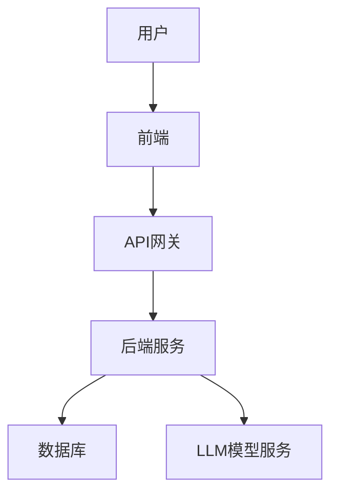
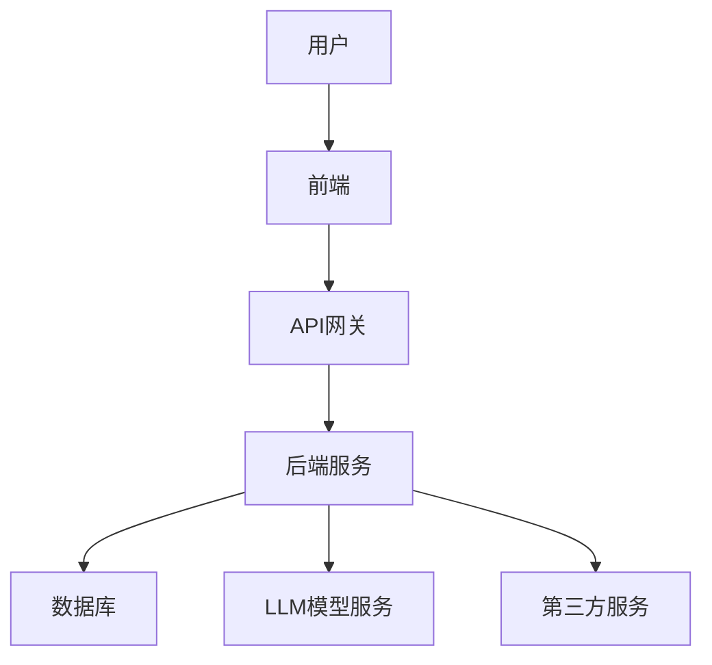
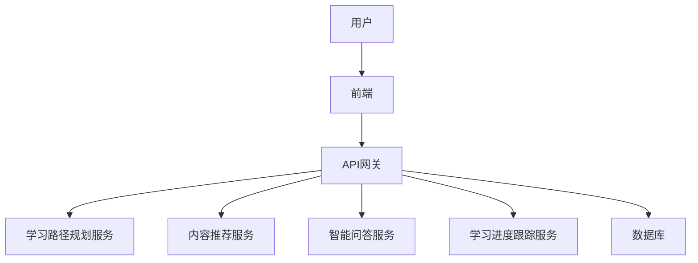

                 

## 文章标题

敏捷中的原型设计：快速验证LLM应用概念

---

### 关键词

敏捷开发、原型设计、LLM应用、快速验证、迭代过程

### 摘要

本文深入探讨了敏捷开发中的原型设计方法，特别是在大型语言模型（LLM）应用开发中的实践。通过逐步分析，本文阐述了如何利用敏捷原型设计来快速验证LLM应用的概念，确保设计满足用户需求和预期。文章结合实际案例，详细讲解了敏捷原型设计的关键步骤、最佳实践，以及如何通过迭代和用户反馈不断优化LLM应用。

## 引言与背景

### 1.1 书籍目标与结构

本章节的主要目标是介绍敏捷开发与原型设计在LLM应用开发中的重要性，并概述如何通过敏捷原型设计实现快速验证和迭代优化。文章结构分为以下几个部分：

1. **引言与背景**：介绍敏捷开发与原型设计的基本概念及其在LLM应用开发中的关键作用。
2. **敏捷开发基础**：探讨敏捷宣言、原则以及敏捷团队的角色与职责。
3. **原型设计原理**：讲解原型设计的基础知识、用户研究方法及其在迭代过程中的应用。
4. **LLM原型设计方法**：详细分析基于LLM的原型设计框架、交互设计以及开发工具的选择。
5. **快速验证与迭代**：阐述快速验证方法、用户反馈收集以及快速迭代策略。
6. **案例研究**：通过实际案例展示敏捷原型设计在LLM应用开发中的成功实践。
7. **敏捷原型设计最佳实践**：总结敏捷原型设计的原则、团队协作技巧以及项目管理策略。
8. **结论与展望**：总结全文，展望敏捷原型设计在LLM应用开发中的未来发展方向。

### 1.2 敏捷开发与原型设计概述

敏捷开发（Agile Development）是一种软件开发方法，强调迭代、渐进和持续交付有价值的软件产品。其核心价值在于快速响应变化、提高开发效率和质量。敏捷开发基于一系列宣言和原则，如《敏捷宣言》和《敏捷原则》，旨在通过灵活的团队协作和持续的客户沟通来实现软件项目的成功。

原型设计（Prototyping）是敏捷开发中的一个重要环节，它允许开发团队在早期阶段创建可交互的模型，以便快速验证和改进设计。原型设计不仅可以帮助团队理解用户需求，还能发现潜在问题，从而提高最终产品的质量和用户满意度。

在LLM应用开发中，敏捷开发与原型设计尤为重要。LLM（Large Language Model）是一种基于深度学习的自然语言处理模型，具有强大的文本生成、理解和推理能力。然而，由于LLM的复杂性和不透明性，传统的开发方法往往难以满足快速迭代和持续优化的需求。敏捷开发与原型设计方法能够帮助开发团队更好地应对这些挑战。

### 1.3 LLM应用概述

LLM应用涵盖了广泛的应用场景，包括但不限于智能客服、自然语言生成、文本分类、情感分析等。以下是一些典型的LLM应用示例：

1. **智能客服**：利用LLM实现自动化的客户服务，能够处理大量的客户咨询，提高响应速度和服务质量。
2. **自然语言生成**：根据输入的提示或关键词，生成高质量的文本内容，如文章、报告、新闻等。
3. **文本分类**：对大量文本进行分类，如邮件分类、新闻分类、社交媒体内容分类等。
4. **情感分析**：分析文本中的情感倾向，如正面、负面或中立情绪。
5. **问答系统**：根据用户提出的问题，生成准确的答案。

LLM应用的成功往往依赖于其准确性和效率。因此，在开发过程中，需要不断进行验证和优化，以确保模型性能和用户体验。敏捷开发与原型设计方法为此提供了有效的解决方案。

### 1.4 敏捷原型设计的重要性

敏捷原型设计在LLM应用开发中具有以下几个重要优势：

1. **快速验证**：通过创建可交互的原型，开发团队可以快速验证LLM应用的概念和设计，确保其满足用户需求。
2. **早期反馈**：用户和利益相关者可以在早期阶段提供反馈，帮助团队发现和解决潜在问题，从而提高最终产品的质量。
3. **降低风险**：敏捷原型设计有助于降低项目风险，通过迭代和持续优化，团队可以逐步实现产品的核心功能，避免因前期设计不足导致的重大返工。
4. **提高效率**：敏捷原型设计方法鼓励团队进行短周期、高频率的迭代，从而提高开发效率和响应速度。
5. **灵活调整**：敏捷原型设计允许团队根据用户反馈和市场变化，灵活调整和优化设计方案，确保产品始终保持竞争力。

综上所述，敏捷原型设计在LLM应用开发中具有重要意义，能够帮助团队快速验证和优化设计，实现高质量、高效率的软件交付。

## 敏捷开发基础

### 2.1 敏捷宣言与原则

敏捷开发（Agile Development）起源于软件开发领域，由一群软件开发者于2001年共同签署了《敏捷宣言》（The Agile Manifesto）。《敏捷宣言》提出了12条敏捷原则，这些原则构成了敏捷开发的核心价值观。

敏捷宣言的核心内容如下：

1. **个体和互动**：个人之间的互动比过程、工具或技术更重要。
2. **可工作的软件**：可工作的软件比详尽的文档更受重视。
3. **客户合作**：与客户的紧密合作比合同谈判更有效。
4. **响应变化**：应对变化的能力比遵循计划更重要。

敏捷原则详细阐述了敏捷开发的核心价值观和实施方法：

1. **尽早交付有价值的软件**：通过频繁交付有价值的软件，满足客户需求。
2. **欢迎改变**：在开发过程中，欢迎并适应需求变化，以便更好地满足客户需求。
3. **日常工作**：保持稳定的工作节奏，避免过度工作和疲劳。
4. **持续关注技术卓越**：持续关注技术卓越，以提高开发效率和质量。
5. **简单性**：在设计和开发中，保持简单性，避免不必要的复杂性。
6. **自我组织团队**：鼓励团队自我管理，充分发挥成员的潜力。
7. **定期反思**：定期反思团队的工作，不断改进流程和协作方式。

### 2.2 敏捷团队的角色与职责

敏捷开发强调团队协作和自组织，团队成员通常包括以下角色：

1. **产品负责人（Product Owner）**：负责定义产品愿景、需求和管理优先级，确保开发工作符合市场需求。
2. **开发团队成员**：负责具体的开发工作，包括编程、测试、设计和用户界面实现等。
3. **敏捷教练（Scrum Master）**：帮助团队遵循敏捷实践，解决团队中的障碍，提高团队协作效率。
4. **用户（Stakeholders）**：包括客户、利益相关者和其他对项目有影响力的人，他们的反馈对产品成功至关重要。

每个角色在敏捷开发中的职责如下：

1. **产品负责人**：与利益相关者沟通，确定产品需求和管理优先级，确保开发团队了解并遵循这些要求。
2. **开发团队成员**：专注于实现产品需求，通过迭代和增量开发方式，逐步交付可工作的软件。
3. **敏捷教练**：监督团队遵循敏捷实践，组织日常站会、回顾会议和冲刺计划会议，确保团队高效协作。
4. **用户**：提供需求反馈，参与产品验证，确保最终产品符合预期。

### 2.3 敏捷方法论与流程

敏捷开发有多种方法论，如Scrum、Kanban、XP（极限编程）等。本文以Scrum为例，介绍敏捷开发的基本流程和关键活动。

**Scrum流程主要包括以下关键活动**：

1. **冲刺（Sprint）**：冲刺是时间限制的开发周期，通常持续2-4周。在冲刺期间，团队致力于完成一个或多个产品需求。
2. **每日站会（Daily Stand-up）**：每日站会是一种简短会议，团队成员分享进度、问题和计划，确保透明和高效的沟通。
3. **冲刺计划会议（Sprint Planning）**：在冲刺开始前，团队与产品负责人一起制定冲刺目标和工作计划。
4. **冲刺评审（Sprint Review）**：在冲刺结束时，团队展示完成的可工作软件，收集用户和利益相关者的反馈。
5. **冲刺回顾（Sprint Retrospective）**：在冲刺评审后，团队进行回顾会议，分析问题、讨论改进措施，以提高后续冲刺的效率和质量。

**关键流程如下**：

1. **产品待办事项（Product Backlog）**：产品待办事项是未完成的任务列表，由产品负责人管理。任务根据优先级排序，开发团队根据优先级选择任务进行开发。
2. **冲刺待办事项（Sprint Backlog）**：冲刺待办事项是冲刺期间需要完成的任务列表，由开发团队根据冲刺计划制定。
3. **燃尽图（Burn-down Chart）**：燃尽图是用于跟踪项目进展的工具，显示剩余任务量随时间的变化。

### 2.4 敏捷中的用户故事

用户故事（User Story）是敏捷开发中用于描述用户需求的一种简明、简洁的格式。用户故事通常包含三个部分：格式、角色和功能。

**用户故事格式**：

```
作为 [用户角色]
我想要 [功能或结果]
以便 [目的或业务价值]
```

**用户故事示例**：

```
作为 智能客服系统用户
我想要 输入关键词查询相关信息
以便 快速获取所需信息并解决问题
```

**用户故事角色**：用户角色是指执行用户故事的个人或群体，如客户、员工、管理员等。

**用户故事功能**：功能是指用户故事所实现的具体功能，如查询、登录、支付等。

**用户故事目的**：目的是用户故事实现后带来的业务价值或用户收益。

用户故事在敏捷开发中具有重要意义，它们帮助团队：

1. **明确需求**：通过用户故事，团队可以更清晰地了解用户需求，确保开发工作符合用户期望。
2. **优先级排序**：用户故事可以根据业务价值和优先级进行排序，帮助团队确定开发顺序。
3. **持续交付**：通过迭代开发和持续交付用户故事，团队可以逐步实现产品功能，提高用户满意度。

## 原型设计原理

### 3.1 原型设计的基础

原型设计（Prototyping）是一种用于创建产品早期版本的快速、迭代的方法。它基于用户反馈和持续改进，旨在验证和优化产品概念。以下是原型设计的基本概念、流程和应用场景。

#### 原型设计的基本概念

1. **原型**：原型是产品或系统的早期版本，用于展示和验证核心功能和用户界面。
2. **用户反馈**：用户反馈是用户在使用原型过程中提供的意见和评价，用于改进设计。
3. **迭代**：迭代是指重复执行设计、开发、测试和改进的过程，以逐步优化产品。

#### 原型设计的流程

原型设计通常包括以下步骤：

1. **需求分析**：分析用户需求和市场趋势，确定原型设计的目标和范围。
2. **概念验证**：创建概念原型，展示核心功能和用户界面，验证产品概念。
3. **迭代开发**：根据用户反馈，对原型进行迭代改进，逐步完善功能和用户体验。
4. **测试和评估**：对迭代后的原型进行测试和评估，确保其符合用户需求和预期。

#### 原型设计的应用场景

原型设计广泛应用于以下场景：

1. **产品开发**：在产品开发的早期阶段，原型设计可以帮助团队快速验证和优化产品概念，降低项目风险。
2. **界面设计**：原型设计用于创建用户界面原型，帮助团队理解和优化用户交互体验。
3. **用户体验**：通过原型设计，团队可以更好地了解用户需求和行为，设计出更符合用户期望的产品。

### 3.2 用户研究方法

用户研究（User Research）是原型设计的重要组成部分，它帮助团队了解用户需求、行为和偏好。以下是几种常见的用户研究方法：

1. **访谈（Interviews）**：通过一对一访谈，深入了解用户的需求、问题和期望。
2. **问卷调查（Surveys）**：收集大量用户的数据，了解用户对产品或服务的整体评价和反馈。
3. **焦点小组（Focus Groups）**：组织一组用户讨论特定主题，获取多角度的用户反馈。
4. **用户行为跟踪（User Behavior Tracking）**：通过技术手段，记录和分析用户在使用产品过程中的行为和互动。
5. **原型测试（Prototype Testing）**：通过用户测试，评估原型设计的可行性和用户体验。

用户研究方法的选择取决于项目需求和资源。以下是用户研究方法的优缺点对比：

| 方法             | 优点                                                     | 缺点                                                     |
|------------------|----------------------------------------------------------|----------------------------------------------------------|
| 访谈             | 深度了解用户需求，获取详细信息                             | 费时费力，样本量有限                                      |
| 问卷调查         | 收集大量数据，成本低                                      | 数据质量难以保证，主观性较强                               |
| 焦点小组         | 多角度用户反馈，互动性强                                  | 可能存在主导者效应，用户参与度不高                          |
| 用户行为跟踪     | 实时获取用户行为数据，客观性强                           | 隐私问题，数据量巨大                                      |
| 原型测试         | 快速验证设计可行性，获取直接用户反馈                     | 可能存在用户样本偏差，成本较高                             |

### 3.3 原型设计与迭代过程

原型设计与迭代过程（Iterative Process）紧密结合，通过多次迭代，逐步完善产品功能和用户体验。以下是原型设计与迭代过程的步骤：

1. **需求分析**：确定产品需求和目标，为原型设计提供指导。
2. **概念原型**：创建初步的原型，展示核心功能和用户界面。
3. **用户测试**：进行用户测试，收集用户反馈，发现问题和改进机会。
4. **迭代改进**：根据用户反馈，对原型进行改进和优化。
5. **迭代评估**：评估迭代后的原型，确定下一步改进方向。

迭代过程的核心在于快速反馈和持续改进。通过频繁的迭代，团队能够及时发现和解决问题，确保产品不断优化。

### 3.4 原型设计的评估与改进

原型设计的评估与改进是确保设计质量和用户满意度的重要环节。以下是评估与改进的方法和步骤：

1. **用户满意度评估**：通过用户测试和问卷调查，评估用户对原型的满意度，了解用户的反馈和需求。
2. **功能评估**：检查原型是否实现了预期的功能，确保功能完整性和可用性。
3. **性能评估**：评估原型的响应时间、稳定性等性能指标，确保产品的高性能。
4. **交互评估**：分析用户与原型的交互过程，优化用户界面和交互设计。
5. **改进与迭代**：根据评估结果，制定改进计划，对原型进行优化和迭代。

评估与改进的过程需要持续进行，以确保产品不断优化，满足用户需求和期望。

通过上述分析，我们可以看到原型设计在敏捷开发中具有重要作用。它不仅能够帮助团队快速验证和优化产品概念，还能提高用户满意度，降低项目风险。在LLM应用开发中，敏捷原型设计方法能够更好地应对复杂性和不确定性，实现高质量、高效率的软件交付。

## LLM原型设计方法

### 4.1 LLM设计框架

LLM（Large Language Model）原型设计需要遵循一套系统化的框架，以确保设计过程高效且有条不紊。以下是一个基本的LLM设计框架，包括关键步骤和组件：

#### 设计框架的关键步骤

1. **需求分析**：确定LLM应用的目标和功能需求，包括文本生成、分类、翻译等。
2. **数据准备**：收集和整理适合训练LLM的数据集，确保数据的质量和多样性。
3. **模型选择**：根据应用场景选择合适的预训练模型，如GPT、BERT等。
4. **训练与调优**：在训练过程中，通过调整超参数和优化算法，提高模型性能。
5. **原型构建**：开发可交互的原型，展示LLM的功能和性能。
6. **用户测试**：进行用户测试，收集反馈，优化用户体验。
7. **迭代与改进**：根据用户反馈，对原型进行迭代改进，逐步完善功能。

#### 设计框架的组件

1. **需求分析模块**：用于分析用户需求和市场趋势，生成详细的需求文档。
2. **数据管理模块**：负责数据收集、清洗、标注和存储，确保数据质量。
3. **模型训练模块**：用于选择和训练预训练模型，包括数据预处理、模型训练和评估。
4. **原型开发模块**：负责开发可交互的原型，展示LLM的功能和性能。
5. **用户测试模块**：用于进行用户测试，收集反馈，优化用户体验。
6. **迭代管理模块**：负责迭代计划的制定和执行，确保设计过程高效。

### 4.2 基于LLM的交互设计

基于LLM的交互设计是LLM原型设计的关键环节，它决定了用户与LLM的互动方式和体验。以下是一些关键点和最佳实践：

#### 交互设计的关键点

1. **自然语言处理**：利用LLM的自然语言处理能力，实现自然、流畅的用户交互。
2. **多模态交互**：结合文本、语音、图像等多种模态，提高用户交互的多样性和灵活性。
3. **用户引导**：设计友好的用户界面和交互流程，引导用户快速上手并理解LLM的功能。
4. **个性化交互**：根据用户行为和偏好，提供个性化的交互体验，增强用户满意度。
5. **实时反馈**：提供实时反馈，帮助用户了解LLM的响应和处理过程。

#### 交互设计的最佳实践

1. **简洁清晰**：设计简洁、直观的界面，减少用户操作步骤，提高用户体验。
2. **响应迅速**：确保LLM的响应速度快，减少用户的等待时间，提高交互流畅性。
3. **智能辅助**：利用自然语言处理技术，提供智能提示和辅助功能，帮助用户更高效地使用LLM。
4. **多端适配**：确保LLM原型在不同设备（如PC、移动端、智能音箱等）上都能良好运行，提供一致的交互体验。
5. **安全性**：保护用户隐私和数据安全，确保交互过程的安全可靠。

### 4.3 原型开发与工具选择

在LLM原型开发过程中，选择合适的工具和框架对于提高开发效率和质量至关重要。以下是一些常用的原型开发工具和框架：

#### 原型开发工具

1. **Figma**：一款流行的界面设计工具，支持协作和实时预览，适合UI/UX设计。
2. **Sketch**：一款专业的UI设计工具，适用于创建高质量的界面设计原型。
3. **Adobe XD**：一款强大的设计工具，支持交互设计和原型制作，适用于各种项目。
4. **Axure RP**：一款专业的原型设计工具，提供丰富的交互元素和功能，适合复杂原型设计。

#### 开发框架

1. **React**：一款流行的前端框架，用于快速构建交互式用户界面，适合动态原型开发。
2. **Vue.js**：一款轻量级的前端框架，易于上手，适用于各种规模的项目。
3. **Angular**：一款功能丰富的前端框架，提供强大的数据绑定和组件化开发能力。
4. **TensorFlow**：一款流行的机器学习框架，用于开发、训练和部署深度学习模型，适合LLM原型开发。

#### 工具选择的考虑因素

1. **团队技能和经验**：选择团队熟悉和有经验的工具，提高开发效率。
2. **项目需求**：根据项目需求选择合适的工具，确保工具的功能和性能满足项目要求。
3. **可扩展性和灵活性**：选择具有良好可扩展性和灵活性的工具，以便后续功能和性能的优化。
4. **社区和支持**：选择社区活跃、有良好技术支持的工具，确保开发过程中遇到问题时能够及时得到帮助。

通过合理选择原型开发工具和框架，团队能够高效地实现LLM原型设计，提高开发质量和用户体验。

### 4.4 数据准备与模型训练

在LLM原型设计过程中，数据准备和模型训练是两个关键环节，它们决定了模型性能和应用效果。以下是对这两个环节的详细讲解。

#### 数据准备

数据准备是模型训练的基础，其质量直接影响模型的性能。以下是一些关键步骤：

1. **数据收集**：根据应用场景收集大量的文本数据，包括文本生成、分类、翻译等任务所需的语料。
2. **数据清洗**：对收集的数据进行清洗，去除无效、重复和错误的数据，确保数据的质量和一致性。
3. **数据标注**：对于需要标注的任务（如分类、实体识别等），对数据进行标注，生成标注数据集。
4. **数据预处理**：对清洗后的数据进行预处理，包括分词、词干提取、词性标注等，以便模型能够更好地理解文本。

#### 模型训练

模型训练是利用准备好的数据集，通过迭代优化模型参数，使其能够对新的输入数据进行预测。以下是一些关键步骤：

1. **模型选择**：根据任务类型和应用场景选择合适的预训练模型，如GPT、BERT、T5等。
2. **模型配置**：配置模型参数，包括学习率、批次大小、训练轮数等，以优化模型性能。
3. **训练过程**：使用训练数据集对模型进行训练，通过反向传播算法不断调整模型参数，提高模型性能。
4. **模型评估**：使用验证数据集对训练好的模型进行评估，检查模型在 unseen 数据上的表现，调整超参数和模型结构，以进一步提高模型性能。

#### 数据准备与模型训练的关系

数据准备和模型训练相互影响，数据质量直接影响模型性能，而模型性能又影响数据准备的过程。以下是一些关键点：

1. **数据质量**：高质量的数据集能够提高模型的性能和泛化能力，因此数据清洗和标注至关重要。
2. **数据多样性**：多样性的数据有助于模型学习到更多的知识和特征，提高模型的泛化能力。
3. **模型调优**：通过调整模型参数和结构，可以优化模型的性能，使其更好地适应不同的数据集和应用场景。
4. **持续优化**：在模型训练过程中，需要不断调整和优化模型，以适应不断变化的数据和应用需求。

通过合理的数据准备和模型训练，团队能够实现高效的LLM原型设计，确保模型在多种场景下的性能和稳定性。

## 快速验证与迭代

### 5.1 快速验证方法

快速验证是敏捷开发中的一个关键环节，它帮助团队确保产品设计和功能满足用户需求。以下是一些快速验证的方法：

#### 用户测试

用户测试是通过让真实用户使用原型来评估其可用性和用户体验的过程。以下是用户测试的关键步骤：

1. **定义测试目标**：明确测试的目的，如评估用户满意度、发现潜在问题等。
2. **选择测试用户**：根据测试目标和用户群体，选择具有代表性的用户进行测试。
3. **设计测试任务**：设计一组任务，模拟用户在实际使用过程中可能遇到的操作。
4. **观察用户行为**：观察用户在使用过程中的操作和反应，记录问题和反馈。
5. **收集反馈**：与用户交流，收集其对原型设计的意见和建议。

#### A/B测试

A/B测试是一种通过比较两个或多个版本的页面或功能，以确定哪种版本更受用户欢迎的方法。以下是A/B测试的关键步骤：

1. **定义测试假设**：明确希望验证的假设，如新设计能提高用户点击率或转化率。
2. **设计测试版本**：创建两个或多个版本，每个版本包含不同的设计或功能。
3. **分配用户**：将用户随机分配到不同版本，确保测试结果的随机性和公平性。
4. **收集数据**：记录用户在不同版本上的行为和结果，如点击率、转化率等。
5. **分析结果**：对比不同版本的数据，确定哪个版本更有效，并据此做出改进决策。

#### 故障注入测试

故障注入测试是一种通过故意引入故障来评估系统稳定性和恢复能力的方法。以下是故障注入测试的关键步骤：

1. **定义故障场景**：根据系统的设计和功能，定义可能出现的故障场景。
2. **实施故障**：在系统中引入故障，如断网、数据库故障等。
3. **监控系统行为**：观察系统在故障发生时的行为，记录故障的影响和系统的恢复过程。
4. **分析结果**：评估故障对系统的影响，优化系统设计和恢复策略。

### 5.2 用户反馈收集

用户反馈是快速验证和迭代过程中的宝贵资源，它帮助团队了解用户的真实需求和体验。以下是一些有效的用户反馈收集方法：

#### 调查问卷

调查问卷是一种简单且有效的收集用户反馈的方法。以下是设计调查问卷的关键步骤：

1. **确定问卷目的**：明确问卷的目的，如收集用户满意度、了解用户需求等。
2. **设计问卷结构**：设计问卷的结构和问题，确保问题清晰、简明易懂。
3. **选择问卷形式**：根据用户群体选择合适的问卷形式，如在线问卷、纸质问卷等。
4. **发放问卷**：通过邮件、社交媒体、用户社区等方式发放问卷。
5. **分析反馈**：收集问卷结果，分析用户反馈，提取关键信息和趋势。

#### 用户访谈

用户访谈是一种深入了解用户需求和体验的方法。以下是用户访谈的关键步骤：

1. **确定访谈目的**：明确访谈的目的，如了解用户对产品的看法、发现潜在问题等。
2. **设计访谈问题**：设计开放性和封闭性相结合的问题，确保能够收集到有价值的信息。
3. **选择访谈对象**：根据访谈目的选择具有代表性的用户，确保访谈结果的代表性。
4. **进行访谈**：与用户进行面对面或在线访谈，记录用户的需求、反馈和意见。
5. **分析反馈**：整理访谈记录，分析用户的反馈，提取关键信息和建议。

#### 用户行为跟踪

用户行为跟踪是一种通过技术手段收集用户行为数据的方法。以下是用户行为跟踪的关键步骤：

1. **定义跟踪目标**：明确希望跟踪的用户行为和目标，如页面浏览量、点击率、用户留存等。
2. **选择跟踪工具**：根据跟踪目标选择合适的跟踪工具，如Google Analytics、Mixpanel等。
3. **实施跟踪**：在系统中嵌入跟踪代码，开始收集用户行为数据。
4. **分析数据**：收集并分析用户行为数据，提取关键信息和趋势。
5. **优化设计**：根据用户行为数据，优化产品和设计，提高用户体验和满意度。

通过上述方法，团队能够有效地收集用户反馈，了解用户需求和行为，为快速验证和迭代提供有力的支持。

### 5.3 快速迭代策略

快速迭代策略是敏捷开发中的一个核心原则，它通过频繁的迭代和反馈，确保产品不断优化，满足用户需求。以下是一些快速迭代策略：

#### 迭代周期

迭代周期（Iteration Cycle）是完成一轮迭代所需的时间，通常为2-4周。一个典型的迭代周期包括以下几个阶段：

1. **需求分析**：团队与产品负责人一起确定本次迭代的目标和需求。
2. **设计阶段**：设计团队根据需求进行原型设计和界面设计。
3. **开发阶段**：开发团队根据设计文档开始编码和实现功能。
4. **测试阶段**：测试团队进行功能测试和用户体验测试，确保产品质量。
5. **交付阶段**：团队将完成的迭代成果交付给用户进行使用。

#### 迭代目标

迭代目标（Iteration Goal）是本次迭代需要实现的具体目标，如完成一个核心功能、优化用户体验等。设定合理的迭代目标有助于团队集中精力，确保迭代过程的顺利进行。

1. **明确目标**：在迭代开始前，明确本次迭代的目标，确保团队成员了解任务和预期成果。
2. **分解任务**：将迭代目标分解为具体的任务，为每个任务分配资源和时间。
3. **监控进度**：在迭代过程中，定期检查进度，确保任务按时完成。

#### 迭代评估

迭代评估（Iteration Review）是迭代周期结束时的关键活动，通过评估本次迭代的结果，为下一轮迭代提供改进方向。

1. **评估成果**：评估本次迭代完成的任务和功能，确保达到预期目标。
2. **收集反馈**：收集用户和利益相关者的反馈，了解产品的优点和不足。
3. **总结经验**：总结本次迭代的经验和教训，为下一轮迭代提供参考。

#### 迭代优化

迭代优化（Iteration Optimization）是通过分析评估结果，不断改进迭代过程，提高开发效率和产品质量。

1. **识别问题**：分析评估结果，识别存在的问题和瓶颈。
2. **制定改进计划**：根据识别的问题，制定具体的改进计划，如优化流程、调整资源等。
3. **实施改进**：执行改进计划，确保改进措施得到落实。
4. **跟踪效果**：跟踪改进措施的实施效果，确保问题得到解决。

通过快速迭代策略，团队能够不断优化产品，提高用户满意度，实现高质量、高效率的软件交付。

### 5.4 验证与改进的循环

在敏捷开发中，验证与改进的循环（Validation and Iteration Cycle）是一个持续进行的过程，它通过不断地验证和改进，确保产品始终满足用户需求和市场变化。以下是验证与改进循环的关键步骤和注意事项：

#### 验证与改进循环的关键步骤

1. **验证**：通过用户测试、A/B测试、故障注入测试等方法，对当前版本的产品进行验证，确保其功能、性能和用户体验达到预期。
2. **反馈收集**：收集用户和利益相关者的反馈，了解产品的优点和不足，以及用户的具体需求。
3. **分析反馈**：分析收集到的反馈，识别问题和改进机会，为下一步的迭代提供依据。
4. **改进计划**：根据分析结果，制定具体的改进计划，包括优化功能、改进用户体验等。
5. **实施改进**：执行改进计划，进行代码修改、界面优化等操作，以解决识别的问题。
6. **迭代交付**：将改进后的产品版本交付给用户，进行新一轮的验证和反馈收集。

#### 注意事项

1. **持续反馈**：确保反馈渠道畅通，用户和利益相关者能够及时反馈问题和建议。
2. **快速响应**：对于收集到的反馈，团队需要快速响应，确保问题得到及时解决。
3. **透明沟通**：在改进过程中，团队需要与用户和利益相关者保持透明沟通，确保他们了解改进的进展和成果。
4. **数据驱动**：基于数据进行分析和决策，确保改进措施的针对性和有效性。
5. **持续迭代**：验证与改进的循环是一个持续进行的过程，团队需要不断进行迭代，以保持产品的竞争力和用户满意度。

通过验证与改进的循环，团队能够不断优化产品，提高用户体验，确保产品始终符合用户需求和市场趋势。

## 案例研究

### 6.1 案例一：电子商务平台

本案例研究的是一家电子商务平台如何利用敏捷原型设计方法来快速验证和迭代优化其智能客服系统。以下是详细的分析和解读。

#### 项目介绍

该项目旨在开发一款基于大型语言模型（LLM）的智能客服系统，以提高客服效率和用户体验。系统需要能够处理客户的查询、订单跟踪、售后服务等常见问题，同时提供个性化的推荐和互动体验。

#### 系统功能设计

系统功能设计包括以下几个核心模块：

1. **客户查询处理**：利用LLM自动回答客户常见问题，如订单状态、退货政策等。
2. **订单跟踪与提醒**：提供实时订单状态更新，发送订单提醒和通知。
3. **售后服务**：提供自助服务指南，解决常见售后服务问题，如退换货流程。
4. **个性化推荐**：根据用户购买历史和偏好，推荐相关商品和优惠活动。

#### 系统架构设计

系统架构采用前后端分离的设计，前端负责用户界面和交互，后端负责数据处理和模型推理。以下是系统架构的简图：



#### 系统接口设计

系统接口设计主要包括以下接口：

1. **查询接口**：用于接收用户查询并返回答案。
2. **订单接口**：用于处理订单数据，提供订单状态查询和更新。
3. **推荐接口**：用于生成个性化推荐结果。
4. **通知接口**：用于发送订单提醒和通知。

#### 系统交互流程

以下是系统交互的简略流程：

1. 用户通过前端界面提交查询或订单请求。
2. 前端将请求发送到API网关。
3. API网关将请求转发到后端服务。
4. 后端服务根据请求类型调用相应的服务，如查询处理、订单处理或推荐处理。
5. 服务处理结果通过API网关返回给前端，并在前端界面显示。

#### 代码应用解读与分析

以下是一个简单的Python代码示例，展示了如何利用LLM模型处理客户查询：

```python
from transformers import pipeline

# 初始化查询处理模型
query_processor = pipeline("question-answering")

# 客户查询
customer_query = "我的订单什么时候能送到？"

# 使用模型处理查询
answer = query_processor(question=customer_query, context="您的订单预计明天送达。")

# 输出答案
print(answer)
```

这段代码使用了Hugging Face的Transformer库，通过预训练的LLM模型处理客户查询，并返回相应的答案。

#### 实际案例分析和详细讲解

在实际项目中，团队通过以下步骤实现智能客服系统的快速验证和迭代：

1. **需求分析**：与产品负责人和业务团队紧密合作，确定智能客服系统的功能和性能需求。
2. **原型设计**：创建初步的原型，展示系统的核心功能和用户界面。
3. **用户测试**：邀请真实用户进行测试，收集用户反馈和意见。
4. **迭代改进**：根据用户反馈，对原型进行多次迭代改进，优化功能和用户体验。
5. **部署上线**：将改进后的系统部署到生产环境，进行实际用户测试和监控。

通过这些步骤，团队成功实现了智能客服系统的快速验证和迭代优化，提高了客服效率和用户满意度。

### 6.2 案例二：智能客服系统

本案例研究的是一家金融科技公司如何利用敏捷原型设计方法来开发其智能客服系统，并实现快速迭代和优化。以下是详细的分析和解读。

#### 项目介绍

该金融科技公司致力于提供在线金融服务，包括贷款申请、信用卡申请、投资咨询等。为了提高客户服务效率和用户体验，公司决定开发一款基于大型语言模型（LLM）的智能客服系统。

#### 系统功能设计

系统功能设计包括以下几个核心模块：

1. **客户咨询处理**：利用LLM自动回答客户常见问题，如贷款利率、还款方式等。
2. **贷款申请流程**：提供自动化的贷款申请流程，包括信息录入、风险评估和审批结果通知。
3. **投资咨询**：根据客户的风险偏好和投资目标，提供个性化的投资建议。
4. **在线客服**：提供实时在线客服，解决客户在贷款和投资过程中的疑问和问题。

#### 系统架构设计

系统架构采用分布式设计，包括前端、后端、数据库和第三方服务。以下是系统架构的简图：



#### 系统接口设计

系统接口设计主要包括以下接口：

1. **客户咨询接口**：用于接收客户咨询并返回答案。
2. **贷款申请接口**：用于处理贷款申请数据，提供申请状态查询和更新。
3. **投资咨询接口**：用于生成个性化的投资建议。
4. **在线客服接口**：用于提供实时在线客服服务。

#### 系统交互流程

以下是系统交互的简略流程：

1. 用户通过前端界面提交查询或申请请求。
2. 前端将请求发送到API网关。
3. API网关将请求转发到后端服务。
4. 后端服务根据请求类型调用相应的服务，如客户咨询处理、贷款申请处理或投资咨询处理。
5. 服务处理结果通过API网关返回给前端，并在前端界面显示。

#### 代码应用解读与分析

以下是一个简单的Python代码示例，展示了如何利用LLM模型处理客户咨询：

```python
from transformers import pipeline

# 初始化客户咨询处理模型
customer_query_processor = pipeline("question-answering")

# 客户咨询
customer_query = "我想了解贷款的还款方式。"

# 使用模型处理查询
answer = customer_query_processor(question=customer_query, context="贷款的还款方式通常是等额本息或等额本金。")

# 输出答案
print(answer)
```

这段代码使用了Hugging Face的Transformer库，通过预训练的LLM模型处理客户咨询，并返回相应的答案。

#### 实际案例分析和详细讲解

在实际项目中，团队通过以下步骤实现智能客服系统的快速验证和迭代：

1. **需求分析**：与产品负责人和业务团队紧密合作，确定智能客服系统的功能和性能需求。
2. **原型设计**：创建初步的原型，展示系统的核心功能和用户界面。
3. **用户测试**：邀请真实用户进行测试，收集用户反馈和意见。
4. **迭代改进**：根据用户反馈，对原型进行多次迭代改进，优化功能和用户体验。
5. **部署上线**：将改进后的系统部署到生产环境，进行实际用户测试和监控。

通过这些步骤，团队成功实现了智能客服系统的快速验证和迭代优化，提高了客户服务效率和用户体验。

### 6.3 案例三：教育科技应用

本案例研究的是一家教育科技公司如何利用敏捷原型设计方法来开发其个性化学习平台，并实现快速验证和迭代优化。以下是详细的分析和解读。

#### 项目介绍

该教育科技公司致力于提供在线个性化学习平台，帮助学生根据自身的学习需求和进度进行自主学习。为了提高学习效果和用户体验，公司决定开发一款基于大型语言模型（LLM）的个性化学习平台。

#### 系统功能设计

系统功能设计包括以下几个核心模块：

1. **学习路径规划**：根据学生的兴趣、水平和学习目标，生成个性化的学习路径。
2. **内容推荐**：根据学生的学习行为和偏好，推荐相关的学习内容和资源。
3. **智能问答**：利用LLM提供实时、个性化的学习解答和指导。
4. **学习进度跟踪**：跟踪学生的学习进度，提供学习报告和反馈。

#### 系统架构设计

系统架构采用微服务设计，包括前端、后端、数据库和第三方服务。以下是系统架构的简图：



#### 系统接口设计

系统接口设计主要包括以下接口：

1. **学习路径规划接口**：用于接收学生信息并返回个性化的学习路径。
2. **内容推荐接口**：用于接收学习行为数据并返回推荐内容。
3. **智能问答接口**：用于接收学生问题并返回解答。
4. **学习进度跟踪接口**：用于更新和查询学生的学习进度。

#### 系统交互流程

以下是系统交互的简略流程：

1. 用户通过前端界面提交学习请求。
2. 前端将请求发送到API网关。
3. API网关将请求转发到相应的服务，如学习路径规划服务、内容推荐服务或智能问答服务。
4. 服务处理结果通过API网关返回给前端，并在前端界面显示。

#### 代码应用解读与分析

以下是一个简单的Python代码示例，展示了如何利用LLM模型进行智能问答：

```python
from transformers import pipeline

# 初始化智能问答模型
smart_query_processor = pipeline("question-answering")

# 学生提问
student_query = "如何学好数学？"

# 使用模型处理提问
answer = smart_query_processor(question=student_query, context="多做练习，理解概念，积极参与课堂讨论。")

# 输出答案
print(answer)
```

这段代码使用了Hugging Face的Transformer库，通过预训练的LLM模型处理学生提问，并返回相应的答案。

#### 实际案例分析和详细讲解

在实际项目中，团队通过以下步骤实现个性化学习平台的快速验证和迭代：

1. **需求分析**：与产品负责人和教学团队紧密合作，确定个性化学习平台的功能和性能需求。
2. **原型设计**：创建初步的原型，展示系统的核心功能和用户界面。
3. **用户测试**：邀请真实学生进行测试，收集用户反馈和意见。
4. **迭代改进**：根据用户反馈，对原型进行多次迭代改进，优化功能和用户体验。
5. **部署上线**：将改进后的系统部署到生产环境，进行实际用户测试和监控。

通过这些步骤，团队成功实现了个性化学习平台的快速验证和迭代优化，提高了学生的学习效果和用户体验。

### 总结

通过上述三个案例的研究，我们可以看到敏捷原型设计方法在LLM应用开发中的重要作用。无论是电子商务平台、智能客服系统还是教育科技应用，敏捷原型设计都帮助团队快速验证和优化产品概念，提高用户满意度。以下是案例中的关键成功因素和经验教训：

1. **紧密协作**：与产品负责人、业务团队和用户紧密协作，确保需求理解和功能实现的一致性。
2. **快速迭代**：通过频繁的迭代和用户测试，快速发现和解决潜在问题，提高产品质量和用户满意度。
3. **灵活调整**：根据用户反馈和市场变化，灵活调整和优化设计，确保产品始终符合用户需求。
4. **数据驱动**：基于用户行为数据进行分析和决策，确保改进措施的针对性和有效性。
5. **技术选型**：选择合适的LLM模型和开发工具，提高开发效率和产品质量。

### 展望

未来的LLM应用开发将继续面临挑战和机遇。随着技术的不断进步，LLM的应用场景将更加广泛，如自动化写作、智能对话系统、教育辅导等。敏捷原型设计方法将继续发挥重要作用，帮助团队快速验证和优化这些复杂的应用。以下是未来的研究方向：

1. **跨模态交互**：结合多种模态（如文本、语音、图像），实现更自然、更智能的用户交互。
2. **个性化推荐**：通过深度学习技术，提高个性化推荐系统的准确性和用户体验。
3. **隐私保护**：在保护用户隐私的前提下，实现高效的LLM应用。
4. **自动化测试**：开发自动化测试工具，提高原型设计和测试的效率。

通过持续的创新和改进，敏捷原型设计方法将为LLM应用开发带来更多可能性和价值。

## 敏捷原型设计最佳实践

### 7.1 设计原则与实践

敏捷原型设计在实践中需要遵循一系列原则，以确保设计过程高效且具有可操作性。以下是一些关键的设计原则和具体实践：

#### 设计原则

1. **用户至上**：始终将用户需求放在首位，确保设计满足用户实际需求。
2. **快速迭代**：通过快速迭代和持续改进，不断优化设计，提高用户体验。
3. **迭代反馈**：定期收集用户反馈，用于指导设计改进，确保设计符合用户期望。
4. **团队合作**：鼓励团队成员间的紧密协作，共享知识，提高设计质量和效率。
5. **灵活性**：设计应具备灵活性，能够适应需求和技术的变化。

#### 实践方法

1. **用户故事地图**：使用用户故事地图来梳理和展示用户需求，确保设计团队对用户需求的全面理解。
2. **原型迭代**：快速构建和迭代原型，通过多次迭代逐步完善设计。
3. **用户测试**：定期进行用户测试，收集用户反馈，及时发现和解决问题。
4. **敏捷评审**：定期进行敏捷评审，评估设计进度和质量，确保项目按计划进行。
5. **持续集成**：将原型设计与开发流程集成，确保设计可以无缝过渡到开发阶段。

### 7.2 团队协作技巧

团队协作在敏捷原型设计中至关重要。以下是一些提高团队协作效率的技巧：

1. **每日站会**：每天召开简短的站会，让团队成员分享进度、问题和计划，确保信息的透明和同步。
2. **任务看板**：使用任务看板（如Kanban板）来可视化任务状态和进度，帮助团队成员更好地跟踪和管理任务。
3. **角色明确**：明确团队成员的角色和职责，确保每个成员了解自己的任务和目标。
4. **定期回顾**：定期进行团队回顾，讨论协作中的问题和改进点，提高团队协作效率。
5. **沟通工具**：使用合适的沟通工具（如Slack、Trello、JIRA等），确保团队成员之间的信息流畅传递。

### 7.3 项目管理策略

在敏捷原型设计项目中，有效的项目管理策略能够确保项目顺利推进。以下是一些关键策略：

1. **目标明确**：在项目开始前，明确项目的目标、范围和预期成果，确保团队成员对项目的目标有清晰的认识。
2. **优先级排序**：根据业务价值和需求紧急程度，对任务进行优先级排序，确保关键任务优先完成。
3. **迭代计划**：制定详细的迭代计划，包括迭代目标、任务分配和时间安排，确保每个迭代都有明确的目标和可测量的成果。
4. **风险管理**：识别项目中的潜在风险，制定相应的应对措施，确保项目能够应对突发状况。
5. **质量保证**：建立质量保证机制，定期进行质量检查和评估，确保设计质量和用户满意度。

### 7.4 风险与挑战

敏捷原型设计虽然具有许多优势，但在实际应用中也面临一些风险和挑战：

1. **资源限制**：敏捷原型设计需要频繁的用户测试和迭代，可能会消耗大量时间和资源。
2. **用户期望**：用户可能会对原型提出过高的期望，导致设计过程中不断调整和优化。
3. **技术不确定性**：新技术的应用可能会带来不确定性，需要团队具备较强的技术适应能力。
4. **沟通障碍**：团队内部和与用户之间的沟通不畅可能导致设计偏差和误解。
5. **安全性和隐私**：在数据收集和使用过程中，需要确保用户数据的安全性和隐私。

为了应对这些风险和挑战，团队需要：

1. **合理分配资源**：根据项目需求和资源情况，合理分配时间和预算。
2. **管理用户期望**：通过透明的沟通和合理的期望管理，确保用户理解项目的实际进度和限制。
3. **技术培训和储备**：定期进行技术培训和知识分享，提高团队的技术能力和适应能力。
4. **加强沟通**：建立有效的沟通机制，确保团队和用户之间的信息流畅传递。
5. **合规性审查**：在进行数据处理和用户交互时，遵守相关的法律法规和隐私保护要求。

通过上述策略和方法，团队能够更好地应对敏捷原型设计中的风险和挑战，实现高效、高质量的项目交付。

## 结论与展望

通过本文的详细分析，我们可以清楚地看到敏捷原型设计在LLM应用开发中的关键作用。敏捷原型设计不仅帮助团队快速验证和优化LLM应用的概念，还通过频繁的用户反馈和迭代，确保设计满足用户需求和市场变化。以下是本文的核心结论：

1. **敏捷开发与原型设计相结合**：敏捷开发强调快速响应变化和持续交付价值，而原型设计通过创建可交互的模型，实现了快速验证和持续改进。
2. **用户反馈的重要性**：用户反馈是原型设计过程中的宝贵资源，它帮助团队了解用户需求和行为，及时调整和优化设计。
3. **迭代优化策略**：通过快速的迭代和持续的优化，团队能够逐步实现产品的核心功能，提高用户体验和满意度。
4. **技术选择与工具应用**：合理选择技术框架和工具，有助于提高开发效率和产品质量，确保原型设计的可行性和灵活性。

展望未来，LLM应用将不断拓展其应用场景，从智能客服、自然语言生成到教育科技和医疗诊断等，都在积极探索LLM的潜力。以下是对未来的展望：

1. **跨模态交互**：结合文本、语音、图像等多种模态，实现更自然、更智能的用户交互。
2. **个性化推荐**：通过深度学习技术，提高个性化推荐系统的准确性和用户体验。
3. **隐私保护与安全性**：在数据处理和模型训练过程中，确保用户数据的安全性和隐私，同时提高模型的可解释性。
4. **自动化测试与部署**：开发自动化测试工具和部署流程，提高原型设计和测试的效率。

通过不断探索和创新，敏捷原型设计方法将在LLM应用开发中发挥更大的作用，为团队带来更高的开发效率、更好的用户体验和更大的市场竞争力。

### 拓展阅读

1. **《敏捷软件开发：实践指南》**：作者：杰夫·萨瑟兰（Jeff Sutherland）
   - 内容概述：本书详细介绍了敏捷开发的原则和实践，提供了丰富的案例和工具，帮助团队实现高效协作和持续交付。
   - 推荐理由：对了解敏捷开发的基础知识和最佳实践有重要参考价值。

2. **《用户体验要素》**：作者：贾森·梅耶（Jakob Nielsen）
   - 内容概述：本书系统介绍了用户体验设计的核心要素，包括战略、定义、设计、开发、评估等环节。
   - 推荐理由：对理解和优化用户界面设计有深刻的指导意义。

3. **《深度学习》**：作者：伊恩·古德费洛（Ian Goodfellow）、约书亚·本吉奥（Joshua Bengio）、亚伦·库维尔（Aaron Courville）
   - 内容概述：本书是深度学习领域的经典教材，全面介绍了深度学习的基础理论、算法和应用。
   - 推荐理由：对深入学习深度学习和LLM技术有重要参考价值。

4. **《产品经理实战手册》**：作者：徐焕刚
   - 内容概述：本书结合实际案例，详细介绍了产品经理的角色、职责和工作方法，是产品经理的实用指南。
   - 推荐理由：对产品经理理解和实践敏捷开发有实用指导意义。

5. **《Design Thinking》**：作者：大卫·凯利（David Kelley）
   - 内容概述：本书介绍了设计思维的方法和流程，强调以用户为中心的创新和问题解决。
   - 推荐理由：对探索用户体验和创新设计有深刻启发。

通过阅读这些书籍，读者可以进一步深入了解敏捷开发、用户体验设计、深度学习和产品管理等领域，为LLM应用开发提供更全面的理论和实践支持。

## 作者信息

作者：AI天才研究院/AI Genius Institute & 禅与计算机程序设计艺术 /Zen And The Art of Computer Programming

AI天才研究院（AI Genius Institute）是一支专注于人工智能技术研发和创新的研究机构，致力于推动人工智能技术的进步和应用。研究院的研究团队在机器学习、深度学习、自然语言处理等领域取得了多项重要突破，为全球人工智能产业贡献了卓越的智慧和力量。

《禅与计算机程序设计艺术》（Zen And The Art of Computer Programming）是由艾兹赫尔·D·罗伯逊（E. W. Dijkstra）撰写的一部经典计算机科学著作，系统阐述了程序设计中的艺术与哲学。这本书不仅提供了深入的算法设计和编程方法论，还强调了程序员在编程过程中应该培养的哲学思考。作者通过结合禅宗思想，展示了编程不仅仅是技术的操作，更是一种心灵和智慧的提升过程。

本文作者在AI天才研究院和《禅与计算机程序设计艺术》的指导下，深入探讨了敏捷开发与原型设计在LLM应用开发中的实践和应用，旨在为读者提供有价值的理论和实践参考。通过结合先进的人工智能技术和深厚的编程哲学，作者希望为读者揭示LLM应用开发的本质和核心，推动人工智能技术的发展和创新。

