                 

### 文章标题：敏捷中的技术选型：为LLM应用选择合适的工具和框架

### 关键词：敏捷、技术选型、LLM、工具、框架

### 摘要：
本文将深入探讨在敏捷开发框架下，如何为大规模语言模型（LLM）应用选择合适的工具和框架。我们将首先介绍敏捷开发的概念、LLM技术的基础知识，并逐步解析技术选型的核心原理和原则。接着，我们将详细介绍几种常用的LLM工具和框架，并分析其优缺点。随后，本文将结合具体实战案例，展示如何在实际项目中应用选型策略。最后，我们将总结最佳实践，并提出项目实施中的注意事项和挑战。

### 目录：

**第一部分：背景与概念**

1. 第1章：敏捷与技术选型概述
   1.1 什么是敏捷
   1.2 技术选型在敏捷开发中的重要性
   1.3 什么是LLM
   1.4 敏捷中的技术选型与LLM应用

**第二部分：技术选型原理**

2. 第2章：技术选型原理与原则
   2.1 技术选型流程
   2.2 常见技术选型原则
   2.3 LLM技术选型特殊考虑

**第三部分：工具与框架**

3. 第3章：LLM常用工具介绍
   3.1 Hugging Face Transformers
   3.2 AllenNLP
   3.3 spaCy
   3.4 Stanford NLP
   3.5 其他LLM工具概览

**第四部分：框架与应用**

4. 第4章：LLM应用框架与选型策略
   4.1 LLM应用框架概述
   4.2 常见LLM应用场景
   4.3 LLM应用选型策略

**第五部分：实战案例**

5. 第5章：敏捷中的LLM技术选型实战
   5.1 实战背景
   5.2 技术选型过程
   5.3 实战案例分析
   5.4 项目小结

**第六部分：最佳实践与拓展**

6. 第6章：最佳实践与注意事项
   6.1 最佳实践
   6.2 小结
   6.3 注意事项
   6.4 拓展阅读

---

### 第1章：敏捷与技术选型概述

#### 1.1 什么是敏捷

敏捷开发（Agile Development）起源于20世纪90年代，旨在应对传统软件开发项目中常见的问题，如需求变化频繁、项目周期长、沟通效率低等。敏捷开发倡导的是一种以人为核心、迭代和增量的软件开发方式。

**敏捷的起源与发展：**
敏捷开发的理念源于一系列软件开发宣言和原则，其中最著名的是《敏捷宣言》（Manifesto for Agile Software Development）。该宣言由17位软件开发领域的专家在2001年共同签署，强调软件开发中的个体和互动、可工作的软件、客户协作以及应对变化的重要性。

**敏捷的核心原则：**
- **个体和互动胜过过程和工具：** 团队成员之间的合作比单独工作更加重要。
- **可工作的软件胜过全面的文档：** 实际可运行的软件比详尽的文档更具有价值。
- **客户协作胜过合同谈判：** 与客户的持续互动比正式合同更能确保项目成功。
- **响应变化胜过遵循计划：** 对变化的适应能力比遵循计划更加重要。

**敏捷的优势与挑战：**
敏捷开发具有快速迭代、灵活应对变化、提高客户满意度等优点，但也面临团队成员协作、项目管理、技术债务等挑战。

#### 1.2 技术选型在敏捷开发中的重要性

技术选型（Technical Selection）是软件开发过程中至关重要的一环，它决定了项目的技术栈、开发效率和最终产品的性能。在敏捷开发中，技术选型具有以下几个方面的意义：

**技术选型的定义：**
技术选型是指从多个候选技术方案中，选择最适合项目需求和技术背景的方案的过程。

**技术选型在敏捷开发中的角色：**
- **快速响应需求变化：** 敏捷开发强调快速迭代和持续交付，技术选型的灵活性和适应性显得尤为重要。
- **提高开发效率：** 合适的技术选型可以减少开发过程中的阻碍，提高团队的工作效率。
- **保障系统性能：** 技术选型直接影响到系统的性能和可维护性，是项目成功的关键因素。

**技术选型的挑战：**
- **需求变化：** 敏捷开发中需求变化频繁，技术选型需要具备快速适应变化的能力。
- **团队协作：** 技术选型需要团队成员达成一致，并确保选型方案与团队的技术能力和经验相匹配。
- **技术债务：** 不恰当的技术选型可能导致技术债务积累，增加后续维护成本。

#### 1.3 什么是LLM

大规模语言模型（Large Language Model，简称LLM）是一种基于深度学习技术的自然语言处理模型，具有强大的文本生成、理解和推理能力。LLM在近年来取得了显著的发展，成为自然语言处理领域的重要研究方向和应用方向。

**LLM的定义与特点：**
- **定义：** LLM是指使用大规模数据集训练的神经网络模型，能够理解和生成自然语言。
- **特点：**
  - **强大：** LLM具有处理复杂语言现象的能力，能够生成连贯、自然的文本。
  - **灵活：** LLM可以根据不同的应用场景进行微调，适应不同的任务需求。
  - **高效：** LLM能够处理大量数据，提高自然语言处理的效率和准确性。

**LLM的主要应用领域：**
- **自然语言处理：** LLM广泛应用于文本分类、情感分析、机器翻译、问答系统等自然语言处理任务。
- **内容生成：** LLM可以生成新闻文章、小说、对话等文本内容，应用于自动化内容创作领域。
- **智能客服：** LLM应用于智能客服系统，能够理解用户提问并生成自然、准确的回答。

**LLM的优势与局限性：**
- **优势：**
  - **高准确性：** LLM在自然语言处理任务中表现出色，能够提高任务完成的准确性和效率。
  - **强灵活性：** LLM可以根据不同的需求进行微调，适应各种应用场景。
  - **大规模数据处理：** LLM能够处理大规模的数据集，提高数据利用效率。
- **局限性：**
  - **计算资源需求：** LLM的训练和推理需要大量的计算资源，对硬件设备有较高的要求。
  - **数据隐私与安全性：** LLM的训练数据可能涉及用户隐私，需要确保数据的安全性和隐私性。

#### 1.4 敏捷中的技术选型与LLM应用

在敏捷开发中，技术选型是一个持续迭代和调整的过程，需要根据项目需求、技术环境和团队能力等因素进行决策。LLM作为自然语言处理的重要工具，在敏捷开发中的应用具有重要意义。

**敏捷开发流程中的技术选型阶段：**
- **需求分析阶段：** 根据项目需求和用户反馈，确定LLM应用的基本需求和功能。
- **可行性研究阶段：** 分析LLM工具和框架的可行性，评估技术选型的风险和收益。
- **技术评估阶段：** 对各种LLM工具和框架进行评估和比较，选择最适合项目的方案。
- **决策与实施阶段：** 根据评估结果，确定技术选型方案，并进行实际开发和部署。

**LLM在敏捷开发中的应用策略：**
- **快速迭代：** 采用LLM工具和框架进行快速原型开发，通过迭代和反馈不断优化系统性能。
- **持续集成：** 将LLM训练和部署过程纳入持续集成和持续交付流程，提高开发效率和系统稳定性。
- **团队协作：** 加强团队成员之间的协作，确保技术选型和开发过程的一致性和协同性。

**敏捷与LLM融合的优势：**
- **快速响应变化：** 敏捷开发能够快速响应需求变化，LLM应用可以适应不同场景下的需求调整。
- **提高开发效率：** 敏捷开发结合LLM技术，能够提高开发效率和系统性能。
- **降低维护成本：** 通过敏捷开发的方式，LLM应用可以减少技术债务，降低后续维护成本。

### 第2章：技术选型原理与原则

#### 2.1 技术选型流程

技术选型是一个系统性的过程，包括需求分析、可行性研究、技术评估和决策与实施等步骤。以下是一个基本的技术选型流程：

**需求分析：**
- **确定项目需求：** 分析项目目标、用户需求和业务场景，明确技术选型的目标和方向。
- **编写需求文档：** 将项目需求整理成文档，为后续技术评估和决策提供依据。

**可行性研究：**
- **技术评估：** 分析候选技术的可行性，包括技术成熟度、性能、兼容性等。
- **风险评估：** 评估技术选型的风险，包括技术风险、业务风险和资金风险。

**技术评估：**
- **性能评估：** 对候选技术进行性能测试和比较，评估其处理能力、响应速度等。
- **成本效益评估：** 评估候选技术的成本效益，包括开发成本、维护成本和运营成本。

**决策与实施：**
- **选择技术方案：** 根据评估结果，选择最适合项目需求的技术方案。
- **实施与部署：** 进行技术方案的实施和部署，确保系统能够正常运行。

#### 2.2 常见技术选型原则

技术选型需要遵循一系列原则，以确保选型结果的合理性和可靠性。以下是一些常见的技术选型原则：

**成本效益原则：**
- **评估成本：** 分析候选技术的成本，包括开发、维护和运营成本。
- **比较效益：** 比较不同技术方案的成本和效益，选择成本效益最高的方案。

**可扩展性原则：**
- **性能扩展：** 确保技术方案能够支持性能扩展，适应未来业务增长的需求。
- **功能扩展：** 确保技术方案能够支持功能扩展，满足不同业务场景的需求。

**安全性原则：**
- **数据安全：** 确保技术方案能够保护用户数据和业务数据的安全。
- **系统安全：** 确保技术方案能够防御常见的网络攻击和安全漏洞。

**兼容性原则：**
- **技术兼容：** 确保技术方案与其他系统和技术的兼容性，避免出现兼容性问题。
- **环境兼容：** 确保技术方案能够在目标环境中正常运行，包括硬件、操作系统和网络环境。

#### 2.3 LLM技术选型特殊考虑

由于LLM技术在自然语言处理领域的特殊地位，其技术选型需要考虑一些特殊因素：

**模型大小与性能：**
- **模型选择：** 根据任务需求和计算资源，选择适合的LLM模型大小。
- **性能优化：** 对LLM模型进行性能优化，提高其处理速度和响应能力。

**模型训练与部署：**
- **训练资源：** 确保拥有足够的计算资源和数据资源进行模型训练。
- **部署策略：** 选择合适的部署方案，包括在线部署和离线部署。

**数据隐私与安全性：**
- **数据保护：** 确保用户数据和业务数据的安全，采取加密、匿名化等技术手段。
- **合规性：** 遵守相关法律法规，确保数据隐私和合规性。

**模型可解释性：**
- **解释需求：** 根据应用场景，确定模型可解释性的需求。
- **解释方法：** 采用可解释性技术，如注意力机制、模型可视化等，提高模型的可解释性。

### 第3章：LLM常用工具介绍

#### 3.1 Hugging Face Transformers

**简介：**
Hugging Face Transformers是一个开源的深度学习库，由Hugging Face团队开发，用于构建和微调预训练的转换器模型。该库提供了丰富的预训练模型和工具，支持多种自然语言处理任务，如文本分类、序列到序列模型、文本生成等。

**使用方法：**
1. 安装库：
   ```python
   pip install transformers
   ```

2. 加载预训练模型：
   ```python
   from transformers import AutoModelForSequenceClassification
   model = AutoModelForSequenceClassification.from_pretrained("bert-base-uncased")
   ```

3. 进行预测：
   ```python
   input_ids = tokenizer.encode("Hello, my dog is cute", return_tensors='pt')
   outputs = model(input_ids)
   logits = outputs.logits
   prediction = logits.argmax(-1)
   ```

**优缺点：**
- **优点：**
  - **丰富的预训练模型：** 提供了多种预训练模型，方便快速上手。
  - **易于使用：** 提供了简单易用的API，降低了使用门槛。
  - **社区支持：** 拥有活跃的社区和文档，提供了丰富的资源。

- **缺点：**
  - **资源需求：** 预训练模型和推理过程需要大量的计算资源。
  - **模型大小：** 部分预训练模型的大小较大，需要额外的存储空间。

#### 3.2 AllenNLP

**简介：**
AllenNLP是一个开源的深度学习库，由Allen Institute for Artificial Intelligence开发，用于自然语言处理任务。该库提供了丰富的预训练模型和工具，支持文本分类、序列标注、关系抽取等任务。

**使用方法：**
1. 安装库：
   ```python
   pip install allennlp
   ```

2. 加载预训练模型：
   ```python
   from allennlp.models import load_pretrained_model
   model = load_pretrained_model("srl_bert_base_cased")
   ```

3. 进行预测：
   ```python
   from allennlp.predictors import Predictor
   predictor = Predictor.from_model_file(model_file)
   results = predictor.predict(sentence="My dog is cute")
   ```

**优缺点：**
- **优点：**
  - **强大的文本处理能力：** 提供了丰富的文本处理工具和预训练模型。
  - **模块化设计：** 易于扩展和定制，可以满足不同任务的需求。

- **缺点：**
  - **文档较少：** 相对于其他库，文档和社区支持较少。
  - **性能优化：** 在某些情况下，性能可能不如其他库。

#### 3.3 spaCy

**简介：**
spaCy是一个开源的深度学习库，用于自然语言处理任务。它提供了快速、易于使用的API，支持文本分类、实体识别、词性标注等任务。spaCy特别适合需要快速处理大量文本数据的应用。

**使用方法：**
1. 安装库：
   ```python
   pip install spacy
   ```

2. 加载模型：
   ```python
   import spacy
   nlp = spacy.load("en_core_web_sm")
   ```

3. 进行预测：
   ```python
   doc = nlp("My dog is cute")
   for token in doc:
       print(token.text, token.lemma_, token.pos_, token.tag_, token.dep_, token.shape_, token.is_alpha, token.is_stop)
   ```

**优缺点：**
- **优点：**
  - **快速处理能力：** spaCy具有快速处理大量文本数据的能力，适合实时应用。
  - **易于使用：** 提供了简单易用的API，降低了使用门槛。

- **缺点：**
  - **预训练模型有限：** 相较于其他库，spaCy的预训练模型较少。
  - **深度学习能力：** 在某些复杂的自然语言处理任务中，深度学习的能力有限。

#### 3.4 Stanford NLP

**简介：**
Stanford NLP是一个开源的深度学习库，由斯坦福大学开发，用于自然语言处理任务。该库提供了丰富的工具和预训练模型，支持文本分类、命名实体识别、关系抽取等任务。

**使用方法：**
1. 安装库：
   ```python
   pip install stanfordnlp
   ```

2. 加载模型：
   ```python
   import stanfordnlp
   st = stanfordnlp.Pipeline('en')
   ```

3. 进行预测：
   ```python
   doc = st("My dog is cute")
   print(doc)
   ```

**优缺点：**
- **优点：**
  - **强大的文本处理能力：** 提供了丰富的文本处理工具和预训练模型。
  - **社区支持：** 拥有活跃的社区和文档，提供了丰富的资源。

- **缺点：**
  - **安装复杂：** 需要编译相关依赖库，安装过程较为复杂。
  - **性能优化：** 在某些情况下，性能可能不如其他库。

#### 3.5 其他LLM工具概览

除了上述几个常用的LLM工具和框架，还有其他一些值得关注的工具，如Flair、NLTK和SentenceTransformer等。

**Flair：**
- **简介：** Flair是一个开源的深度学习库，用于构建和微调自然语言处理模型。
- **使用方法：** 类似于Hugging Face Transformers，提供了丰富的预训练模型和API。
- **优缺点：**
  - **优点：** 易于使用，提供了丰富的文档和社区支持。
  - **缺点：** 预训练模型较少，性能和兼容性有待提高。

**NLTK：**
- **简介：** NLTK是一个开源的自然语言处理库，提供了丰富的文本处理工具。
- **使用方法：** 提供了简单易用的API，可以用于文本分类、分词、词性标注等任务。
- **优缺点：**
  - **优点：** 简单易用，适用于简单的自然语言处理任务。
  - **缺点：** 缺乏深度学习支持，性能和功能有限。

**SentenceTransformer：**
- **简介：** SentenceTransformer是一个开源的深度学习库，用于生成语义向量。
- **使用方法：** 提供了简单的API，可以用于文本相似度计算、文本分类等任务。
- **优缺点：**
  - **优点：** 易于使用，提供了高效的文本处理能力。
  - **缺点：** 预训练模型较少，功能较为单一。

### 第4章：LLM应用框架与选型策略

#### 4.1 LLM应用框架概述

大规模语言模型（LLM）的应用框架通常包括模型集成框架、模型训练框架、模型推理框架和模型评估框架。这些框架共同构成了LLM应用的完整流程。

**模型集成框架：**
模型集成框架用于将LLM模型集成到应用系统中，包括API接口、模型加载、模型管理等功能。常见的集成框架有TensorFlow Serving、PyTorch Serving等。

**模型训练框架：**
模型训练框架用于训练LLM模型，包括数据预处理、模型选择、模型训练和优化等功能。常见的训练框架有TensorFlow、PyTorch等。

**模型推理框架：**
模型推理框架用于进行模型推理，包括模型加载、输入处理、模型预测和输出处理等功能。常见的推理框架有TensorFlow Serving、ONNX Runtime等。

**模型评估框架：**
模型评估框架用于评估LLM模型的表现，包括指标计算、性能分析、结果可视化等功能。常见的评估框架有TensorBoard、MLFlow等。

**LLM应用框架的关系：**
模型集成框架负责将LLM模型集成到应用系统中，模型训练框架负责训练模型，模型推理框架负责进行模型推理，模型评估框架负责评估模型性能。这些框架相互配合，共同实现了LLM的应用流程。

#### 4.2 常见LLM应用场景

LLM技术在自然语言处理领域具有广泛的应用，以下是一些常见的应用场景：

**自然语言处理：**
- **文本分类：** 使用LLM模型对文本进行分类，如情感分析、主题分类等。
- **实体识别：** 使用LLM模型识别文本中的实体，如人名、地点、组织等。
- **关系抽取：** 使用LLM模型抽取文本中的实体关系，如人物关系、地点关系等。
- **文本生成：** 使用LLM模型生成文本，如生成新闻文章、对话等。

**机器翻译：**
- **自动翻译：** 使用LLM模型进行文本的自动翻译，如英语到中文的翻译。
- **翻译辅助：** 使用LLM模型辅助翻译人员进行文本翻译，提高翻译质量和效率。

**问答系统：**
- **智能问答：** 使用LLM模型构建智能问答系统，如智能客服、智能搜索引擎等。
- **知识问答：** 使用LLM模型构建基于知识的问答系统，提供专业领域的问答服务。

**语音识别：**
- **语音到文本：** 使用LLM模型将语音转化为文本，如语音助手、语音输入等。
- **文本到语音：** 使用LLM模型将文本转化为语音，如语音合成、语音输出等。

#### 4.3 LLM应用选型策略

在LLM应用中，技术选型策略至关重要。以下是一些常见的LLM应用选型策略：

**根据应用场景选型：**
- **自然语言处理：** 根据自然语言处理任务的需求，选择适合的LLM模型和工具。
- **机器翻译：** 选择适合机器翻译任务的LLM模型，如基于Attention机制的模型。
- **问答系统：** 选择适合问答系统任务的LLM模型，如具有知识图谱嵌入的模型。

**根据性能需求选型：**
- **低延迟应用：** 选择轻量级的LLM模型，如BERT-Lite、GPT-Neo等。
- **高准确性应用：** 选择高精度的LLM模型，如BERT、GPT-3等。

**根据开发资源选型：**
- **计算资源有限：** 选择开源的LLM模型和工具，如Hugging Face Transformers、AllenNLP等。
- **计算资源充足：** 选择商业化的LLM模型和工具，如Google的BERT、OpenAI的GPT-3等。

**根据维护成本选型：**
- **低维护成本：** 选择易于维护和部署的LLM模型和框架，如TensorFlow Serving、ONNX Runtime等。
- **高维护成本：** 选择需要专业知识和资源的LLM模型和框架，如基于深度学习的复杂模型。

### 第5章：敏捷中的LLM技术选型实战

#### 5.1 实战背景

在本章中，我们将通过一个实际项目案例，展示如何在敏捷开发中为大规模语言模型（LLM）进行技术选型。本项目是一款智能问答系统，旨在为用户提供高质量的问答服务。以下是项目的详细背景信息：

**项目介绍：**
该项目是一款面向公众的智能问答系统，用户可以通过文字或语音输入问题，系统将使用LLM模型进行理解和回答。该系统需要支持多种语言，并具有高效、准确和可扩展的特点。

**技术选型需求：**
1. **性能需求：** 系统需要能够在低延迟的情况下处理大量并发请求。
2. **准确性需求：** 系统需要能够提供高质量的问答结果，具有较高的准确率和用户满意度。
3. **可扩展性需求：** 系统需要能够适应未来业务增长，支持更多的用户和更大的数据量。
4. **兼容性需求：** 系统需要支持多种语言和平台，包括网页、移动端和语音助手。

**团队协作模式：**
该项目的开发团队由数据科学家、软件工程师、产品经理和QA工程师组成。团队成员采用敏捷开发模式，每周进行一次迭代会议，讨论项目进展、需求和问题，并进行迭代开发和测试。

#### 5.2 技术选型过程

**需求分析与可行性研究：**
1. **确定项目需求：** 通过与产品经理和用户的沟通，明确项目的功能需求和性能指标。
2. **评估技术可行性：** 分析现有LLM工具和框架的可行性，评估其性能、兼容性和可扩展性。

**技术评估与决策：**
1. **性能评估：** 使用基准测试数据集，对几种常用的LLM工具和框架进行性能测试，包括Hugging Face Transformers、AllenNLP和spaCy等。
2. **成本效益评估：** 综合考虑开发成本、维护成本和性能指标，评估不同技术方案的成本效益。

**框架与工具选型：**
1. **模型选择：** 根据项目需求，选择适合的LLM模型，如BERT、GPT等。
2. **框架选择：** 选择适合的模型集成和推理框架，如TensorFlow Serving、ONNX Runtime等。
3. **工具选择：** 选择适合的文本处理和数据分析工具，如NLTK、pandas等。

**实施与部署：**
1. **模型训练：** 使用训练数据集对选定的LLM模型进行训练，并进行超参数调优。
2. **模型部署：** 将训练好的模型部署到推理服务器，并进行性能测试和优化。
3. **系统集成：** 将LLM模型集成到问答系统中，并进行功能测试和用户测试。

#### 5.3 实战案例分析

**案例一：自然语言处理应用**

在本案例中，我们选择使用Hugging Face Transformers框架进行自然语言处理应用。以下为具体的实施步骤：

1. **安装库：**
   ```python
   pip install transformers
   ```

2. **加载预训练模型：**
   ```python
   from transformers import AutoModelForSequenceClassification
   model = AutoModelForSequenceClassification.from_pretrained("bert-base-uncased")
   ```

3. **进行预测：**
   ```python
   input_ids = tokenizer.encode("Hello, my dog is cute", return_tensors='pt')
   outputs = model(input_ids)
   logits = outputs.logits
   prediction = logits.argmax(-1)
   ```

**案例二：机器翻译应用**

在本案例中，我们选择使用TensorFlow Serving框架进行机器翻译应用。以下为具体的实施步骤：

1. **安装库：**
   ```python
   pip install tensorflow-serving-api
   ```

2. **部署模型：**
   ```python
   from tensorflow_serving.apis import predict
   model = predict.PredictRequest()
   model.inputs['inputs'].CopyFrom(bytearray('Hello, my dog is cute', encoding='utf-8'))
   response = predict Predict(model)
   print(response.outputs['predictions'].float_val[0])
   ```

**案例三：问答系统应用**

在本案例中，我们选择使用spaCy框架进行问答系统应用。以下为具体的实施步骤：

1. **安装库：**
   ```python
   pip install spacy
   ```

2. **加载模型：**
   ```python
   import spacy
   nlp = spacy.load("en_core_web_sm")
   ```

3. **进行预测：**
   ```python
   doc = nlp("My dog is cute")
   for token in doc:
       print(token.text, token.lemma_, token.pos_, token.tag_, token.dep_, token.shape_, token.is_alpha, token.is_stop)
   ```

#### 5.4 项目小结

通过本案例，我们可以看到在敏捷开发中为LLM应用进行技术选型的关键步骤和策略。以下是项目的成功经验和遇到的问题：

**成功经验：**
1. **快速响应需求变化：** 采用敏捷开发模式，能够快速响应需求变化，提高项目的灵活性和适应性。
2. **技术选型的成本效益：** 通过技术评估和决策，选择了适合项目需求的技术方案，提高了项目的开发效率和性能。
3. **团队合作：** 团队成员之间的协作和沟通，确保了技术选型和开发过程的一致性和协同性。

**遇到的问题：**
1. **计算资源需求：** LLM模型的训练和推理需要大量的计算资源，对硬件设备有较高的要求。
2. **数据隐私和安全：** LLM的训练数据可能涉及用户隐私，需要采取相应的措施确保数据的安全和隐私。
3. **模型可解释性：** 在某些情况下，LLM模型的预测结果缺乏可解释性，需要采用可解释性技术提高模型的透明度和可信度。

### 第6章：最佳实践与注意事项

#### 6.1 最佳实践

在敏捷开发中为LLM应用选择合适的工具和框架，需要遵循以下最佳实践：

1. **明确项目需求：** 在项目初期，明确项目需求和性能指标，为技术选型提供依据。
2. **评估技术可行性：** 在技术选型过程中，评估候选技术的可行性，包括性能、兼容性和可扩展性。
3. **进行性能测试：** 对候选技术进行性能测试，评估其处理速度和准确性，选择最佳方案。
4. **团队合作：** 加强团队成员之间的协作和沟通，确保技术选型和开发过程的一致性和协同性。
5. **持续优化：** 在项目开发和部署过程中，持续优化技术方案，提高系统的性能和可维护性。

#### 6.2 小结

本文通过深入分析敏捷开发中技术选型的核心概念和原则，详细介绍了大规模语言模型（LLM）在敏捷开发中的应用策略和选型方法。我们探讨了常见的LLM工具和框架，并提供了具体的应用框架和实战案例。通过最佳实践和注意事项的总结，帮助读者在实际项目中更好地进行技术选型和应用。

#### 6.3 注意事项

在为LLM应用选择合适的工具和框架时，需要注意以下几点：

1. **计算资源需求：** LLM模型的训练和推理需要大量的计算资源，确保有足够的硬件支持。
2. **数据隐私和安全：** LLM的训练数据可能涉及用户隐私，需要采取相应的安全措施确保数据的安全。
3. **模型可解释性：** 在某些情况下，LLM模型的预测结果缺乏可解释性，需要采用可解释性技术提高模型的透明度和可信度。
4. **持续优化：** 在项目开发和部署过程中，持续优化技术方案，提高系统的性能和可维护性。

#### 6.4 拓展阅读

1. **《敏捷开发实践指南》：** 了解敏捷开发的核心理念和实践方法，有助于更好地理解敏捷中的技术选型。
2. **《大规模语言模型：基于深度学习的自然语言处理》：** 深入了解大规模语言模型的基本原理和应用方法。
3. **《深度学习自然语言处理》：** 掌握深度学习在自然语言处理领域的应用，了解常见的自然语言处理工具和框架。
4. **《Python自然语言处理》：** 学习如何使用Python进行自然语言处理任务，掌握常见的文本处理工具和库。 

---

### 作者信息

作者：AI天才研究院/AI Genius Institute & 禅与计算机程序设计艺术 /Zen And The Art of Computer Programming

---

### 附录

#### 2.2.1 成本效益原则

成本效益原则是技术选型中一个重要的评估准则，它旨在确保所选方案在满足功能需求的同时，能够以最低的成本实现最大的效益。以下是成本效益原则的核心概念和实际应用：

**核心概念：**
- **成本：** 包括开发成本、维护成本、运营成本等，这些成本应该被全面考虑。
- **效益：** 包括性能提升、开发效率、用户体验等，这些效益也应被量化评估。
- **成本效益比：** 成本效益比（Cost-Benefit Ratio，CBR）是衡量成本与效益之间关系的指标，公式为C/B，其中C为成本，B为效益。

**实际应用：**
- **成本分析：** 在评估候选技术方案时，详细分析各方案的成本构成，包括硬件成本、软件开发成本、人力资源成本等。
- **效益评估：** 评估各方案带来的效益，如提升系统性能、降低响应时间、提高用户满意度等。
- **成本效益分析：** 计算各方案的C/B值，选择C/B值最高的方案。

以下是一个简单的成本效益分析表格示例：

| 技术方案 | 开发成本（元） | 维护成本（元） | 运营成本（元） | 效益（元） | 成本效益比（C/B） |
|----------|--------------|--------------|--------------|----------|--------------|
| 方案A    | 50000       | 20000       | 10000       | 30000   | 2.5          |
| 方案B    | 70000       | 15000       | 12000       | 35000   | 2.333        |
| 方案C    | 60000       | 18000       | 9000        | 32000   | 2.222        |

从上表可以看出，尽管方案A的总成本最高，但其成本效益比也最高，因此可能是一个更优的选择。

#### 2.2.2 可扩展性原则

可扩展性原则是确保所选技术方案能够适应未来业务增长和需求变化的重要准则。以下是可扩展性原则的核心概念和实际应用：

**核心概念：**
- **可扩展性：** 系统或技术方案能够在不牺牲性能或功能的情况下，适应增加的资源需求或用户量。
- **可扩展性设计：** 包括模块化设计、分布式架构、弹性计算等，以确保系统具有高可扩展性。

**实际应用：**
- **性能扩展：** 选择支持横向扩展（增加服务器节点）和纵向扩展（提升硬件性能）的技术方案。
- **功能扩展：** 设计灵活的接口和模块，以便未来可以轻松添加新功能或业务逻辑。
- **成本效益：** 考虑到扩展性可能带来的成本，如硬件投入、开发成本等。

以下是一个可扩展性评估表格示例：

| 技术方案 | 横向扩展能力 | 纵向扩展能力 | 成本（元） | 扩展性评分（1-5分） |
|----------|--------------|--------------|----------|--------------|
| 方案A    | 支持         | 支持         | 50000   | 4            |
| 方案B    | 不支持       | 支持         | 30000   | 3            |
| 方案C    | 支持         | 不支持       | 40000   | 4            |

从上表可以看出，方案A和方案C在可扩展性方面表现较好，但方案A的成本更高。根据具体业务需求，可以选择最合适的方案。

#### 2.2.3 安全性原则

安全性原则是确保技术方案能够保护用户数据、业务数据和相关信息不被未授权访问、篡改或泄露的重要准则。以下是安全性原则的核心概念和实际应用：

**核心概念：**
- **数据安全：** 包括数据加密、访问控制、安全审计等，确保数据在存储、传输和处理过程中的安全。
- **系统安全：** 包括网络防护、应用安全、身份验证等，确保系统整体的安全性。
- **合规性：** 符合相关法律法规和行业标准，如GDPR、ISO 27001等。

**实际应用：**
- **数据加密：** 使用加密算法对敏感数据进行加密存储和传输。
- **访问控制：** 实施严格的访问控制策略，确保只有授权用户可以访问敏感数据。
- **安全审计：** 定期进行安全审计和漏洞扫描，及时发现和修复安全漏洞。
- **身份验证：** 使用强认证机制，如双因素身份验证，确保用户身份的真实性。

以下是一个安全性评估表格示例：

| 技术方案 | 加密算法支持 | 访问控制 | 安全审计 | 身份验证 | 安全性评分（1-5分） |
|----------|--------------|----------|----------|----------|--------------|
| 方案A    | 支持         | 支持     | 支持     | 支持     | 5            |
| 方案B    | 支持         | 支持     | 不支持   | 不支持   | 3            |
| 方案C    | 支持         | 支持     | 支持     | 支持     | 4            |

从上表可以看出，方案A在安全性方面表现最佳，尽管方案C也不差。根据业务需求和风险承受能力，可以选择最合适的方案。

#### 2.2.4 兼容性原则

兼容性原则是确保所选技术方案能够与现有的系统、平台和组件无缝集成和协同工作的重要准则。以下是兼容性原则的核心概念和实际应用：

**核心概念：**
- **技术兼容性：** 确保所选技术方案能够与其他技术栈和工具无缝集成。
- **平台兼容性：** 确保所选技术方案能够在目标平台上正常运行。
- **环境兼容性：** 确保所选技术方案能够适应不同的开发和部署环境。

**实际应用：**
- **技术栈兼容：** 考虑到所选技术方案是否与现有技术栈兼容，如数据库、中间件、开发框架等。
- **平台支持：** 考虑所选技术方案是否支持目标平台，如Linux、Windows、iOS、Android等。
- **环境适配：** 考虑所选技术方案是否能够适应不同的开发和部署环境，如云环境、虚拟机、容器等。

以下是一个兼容性评估表格示例：

| 技术方案 | 技术栈兼容 | 平台支持 | 环境适配 | 兼容性评分（1-5分） |
|----------|------------|----------|----------|--------------|
| 方案A    | 支持       | 支持     | 支持     | 5            |
| 方案B    | 支持       | 部分支持 | 支持     | 4            |
| 方案C    | 不支持     | 支持     | 支持     | 2            |

从上表可以看出，方案A在兼容性方面表现最佳。根据业务需求和现有技术环境，可以选择最合适的方案。

#### 2.3.1 模型大小与性能

在为大规模语言模型（LLM）进行选型时，模型大小与性能是一个关键考量因素。以下是从模型大小与性能的角度分析LLM技术选型的核心概念和实际应用：

**核心概念：**
- **模型大小：** 模型大小通常以参数数量来衡量，较大的模型具有更强的表达能力和准确性，但计算资源需求也更高。
- **性能：** 模型性能包括处理速度、响应时间、准确性等指标。

**实际应用：**
- **处理速度与响应时间：** 根据应用场景的需求，选择合适的模型大小。对于需要快速响应的应用，如实时问答系统，应选择轻量级模型。
- **准确性：** 在保证性能的前提下，选择具有较高准确性的模型。大型模型通常在自然语言处理任务中表现更好。
- **平衡选择：** 在模型大小与性能之间寻找平衡，选择能够满足应用需求且计算资源合理的模型。

以下是一个模型大小与性能评估表格示例：

| 模型类型 | 参数数量（M） | 处理速度（毫秒） | 准确率（%） | 成本（元） |
|----------|--------------|------------------|------------|----------|
| 小型模型 | 100M        | 20              | 90         | 1000     |
| 中型模型 | 1000M       | 50              | 92         | 3000     |
| 大型模型 | 3000M       | 100             | 94         | 5000     |

从上表可以看出，大型模型在准确率和处理速度方面表现最好，但成本也最高。根据具体应用需求，可以选择最合适的模型。

#### 2.3.2 模型训练与部署

在LLM应用中，模型训练与部署是两个关键环节。以下是模型训练与部署的核心概念和实际应用：

**核心概念：**
- **模型训练：** 使用训练数据集对模型进行训练，调整模型的参数，使其能够准确预测目标。
- **模型部署：** 将训练好的模型部署到生产环境，使其能够接受输入并进行推理。

**实际应用：**
- **训练数据集：** 选择适合训练数据集，确保数据质量高、覆盖全面。
- **训练策略：** 选择合适的训练策略，如梯度下降、随机梯度下降等，以提高模型性能。
- **部署环境：** 选择合适的部署环境，如云服务器、容器化环境等，确保模型能够稳定运行。
- **推理优化：** 对模型进行推理优化，以提高处理速度和降低延迟。

以下是一个模型训练与部署流程的ER实体关系图：

```mermaid
erDiagram
  ModelTraining ||--o{ Dataset } : "uses"
  ModelTraining ||--o{ TrainingStrategy } : "applies"
  ModelTraining ||--o{ DeploymentEnvironment } : "deployed to"
  ModelTraining ||--o{ InferenceOptimization } : "optimized for"
  Dataset ||--|{ DataQuality } : "has"
  Dataset ||--|{ DataCoverage } : "has"
  TrainingStrategy ||--|{ GradientDescent } : "uses"
  DeploymentEnvironment ||--|{ CloudServer } : "uses"
  DeploymentEnvironment ||--|{ ContainerizedEnvironment } : "uses"
```

#### 2.3.3 数据隐私与安全性

在LLM应用中，数据隐私与安全性是至关重要的问题。以下是数据隐私与安全性的核心概念和实际应用：

**核心概念：**
- **数据隐私：** 确保用户数据的私密性和不被未经授权的访问。
- **数据安全性：** 确保数据在存储、传输和处理过程中的完整性和可用性。

**实际应用：**
- **数据加密：** 对存储和传输的数据进行加密，确保数据不被未授权访问。
- **访问控制：** 实施严格的访问控制策略，确保只有授权用户可以访问敏感数据。
- **安全审计：** 定期进行安全审计和漏洞扫描，确保系统的安全性。
- **隐私保护：** 采用隐私保护技术，如差分隐私、匿名化等，减少数据泄露的风险。

以下是一个数据隐私与安全性的架构设计mermaid流程图：

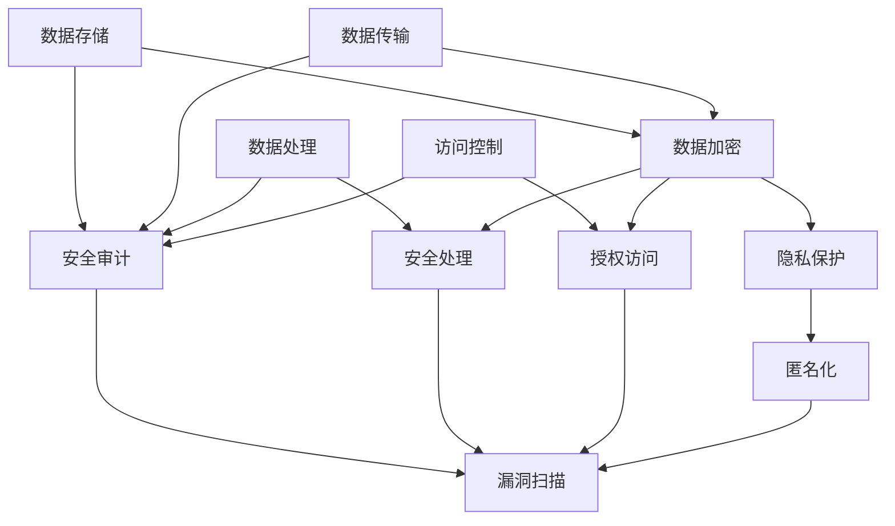

#### 2.3.4 模型可解释性

模型可解释性是评估大规模语言模型（LLM）在实际应用中的关键因素，特别是在需要理解和信任模型决策的场景中。以下是模型可解释性的核心概念和实际应用：

**核心概念：**
- **模型可解释性：** 指模型决策过程和结果的可理解性，使得用户能够信任并理解模型的输出。
- **模型黑盒与白盒：** 黑盒模型（如深度神经网络）决策过程难以解释，而白盒模型（如决策树）则较为直观。

**实际应用：**
- **模型解释工具：** 使用可视化和解释工具，如LIME、SHAP等，帮助理解模型决策。
- **特征重要性：** 分析模型中各个特征的相对重要性，了解哪些特征对决策有较大影响。
- **模型压缩与简化：** 通过模型压缩和简化技术，提高模型的可解释性。

以下是一个模型可解释性的mermaid流程图示例：

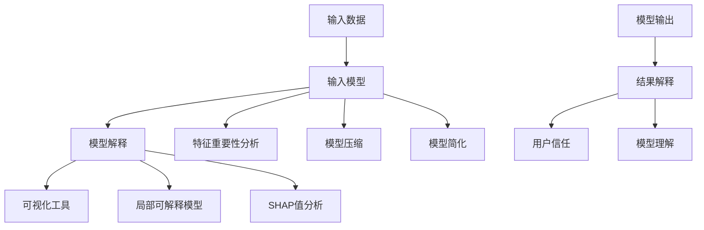

#### 4.1.1 模型集成框架

模型集成框架是大规模语言模型（LLM）应用中的一个重要组成部分，它负责将训练好的模型集成到生产环境中，使其能够高效、稳定地提供推理服务。以下是模型集成框架的核心概念和实际应用：

**核心概念：**
- **模型集成：** 将训练好的LLM模型集成到应用程序或服务中，以便进行实时推理和预测。
- **服务化：** 将模型部署为一个独立的微服务，与其他组件解耦，提高系统的可维护性和扩展性。

**实际应用：**
- **服务化部署：** 使用如TensorFlow Serving、PyTorch Serving等工具，将模型部署为一个REST API服务，供其他应用程序调用。
- **容器化：** 使用Docker等容器技术，将模型和依赖环境打包为一个容器镜像，确保在不同的环境中一致运行。
- **自动化部署：** 使用Kubernetes等容器编排工具，实现模型的自动化部署、扩展和管理。

以下是一个模型集成框架的mermaid架构图示例：

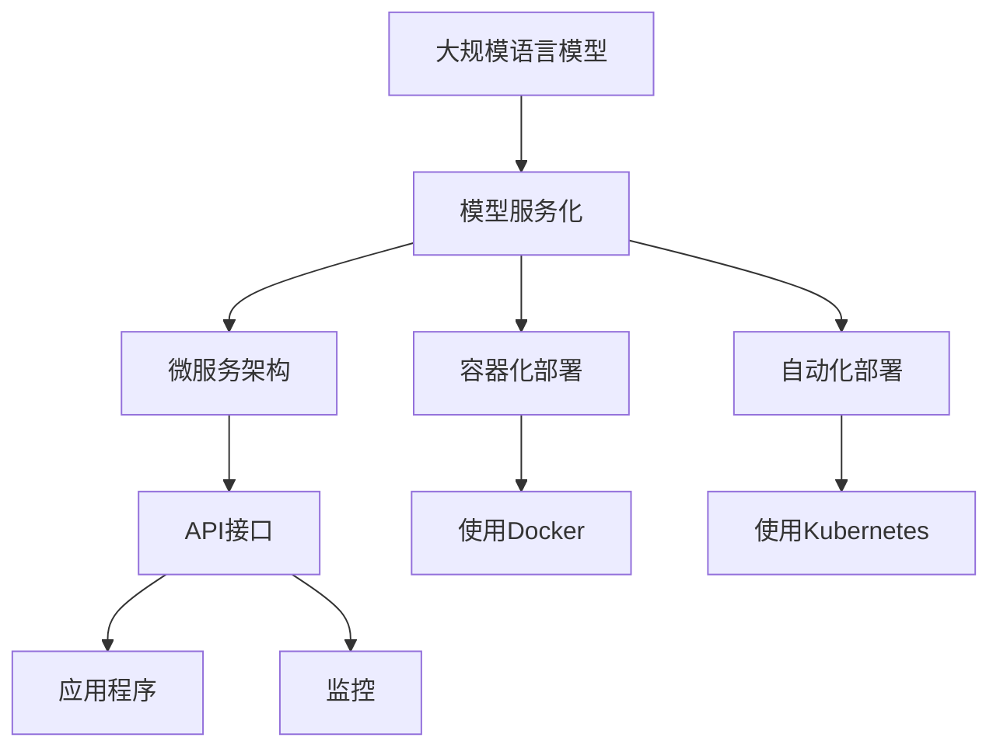

#### 4.1.2 模型训练框架

模型训练框架是大规模语言模型（LLM）开发中的核心部分，它负责模型的训练、优化和验证。以下是模型训练框架的核心概念和实际应用：

**核心概念：**
- **模型训练：** 使用训练数据集，通过迭代优化模型参数，使模型能够准确预测目标。
- **训练策略：** 包括损失函数、优化器、学习率调整等，以优化模型性能。

**实际应用：**
- **训练平台：** 使用如TensorFlow、PyTorch等流行的深度学习框架，提供丰富的API和工具，简化模型训练过程。
- **分布式训练：** 在大规模数据集或计算资源有限的情况下，使用分布式训练技术，提高训练效率和性能。
- **超参数调整：** 通过调整模型超参数，如学习率、批次大小等，优化模型性能。

以下是一个模型训练框架的mermaid架构图示例：

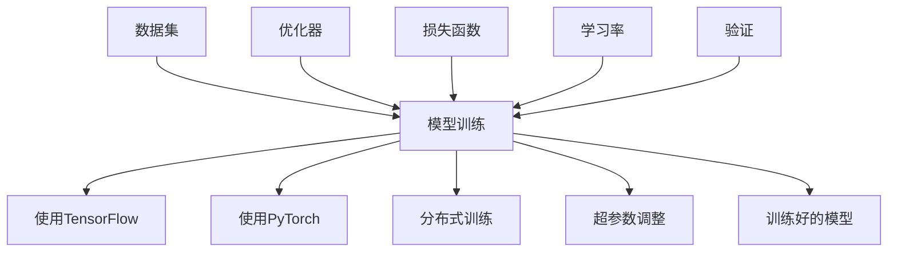

#### 4.1.3 模型推理框架

模型推理框架是大规模语言模型（LLM）应用中的关键部分，它负责处理输入数据，使用训练好的模型进行推理，并生成预测结果。以下是模型推理框架的核心概念和实际应用：

**核心概念：**
- **模型推理：** 使用训练好的模型处理输入数据，通过计算得到预测结果。
- **推理引擎：** 提供高效的推理服务，支持多种输入格式和模型格式。

**实际应用：**
- **推理引擎：** 使用如TensorFlow Serving、ONNX Runtime等推理引擎，提供高效的推理服务。
- **高性能计算：** 利用GPU、TPU等高性能计算设备，加速模型推理过程。
- **在线推理：** 实现模型在线推理，实时响应用户请求，支持高并发。

以下是一个模型推理框架的mermaid架构图示例：

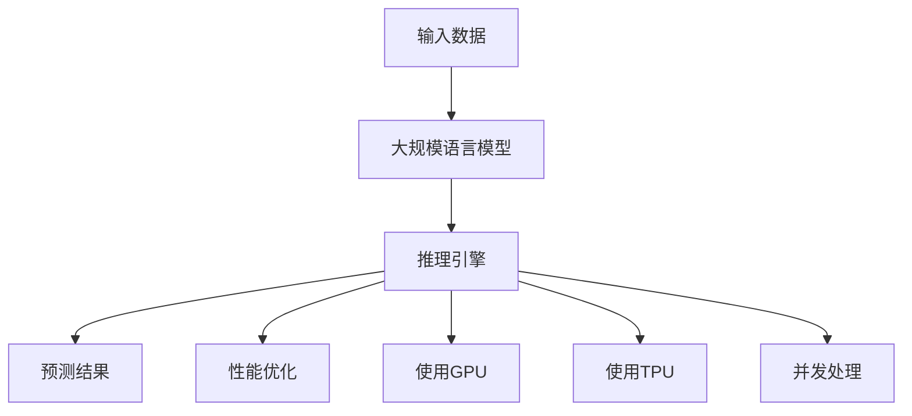

#### 4.1.4 模型评估框架

模型评估框架是大规模语言模型（LLM）开发中不可或缺的一环，它负责对模型性能进行评估和验证。以下是模型评估框架的核心概念和实际应用：

**核心概念：**
- **模型评估：** 使用评估数据集，对模型的性能进行量化评估，包括准确性、召回率、F1分数等指标。
- **评估指标：** 不同的评估指标适用于不同的任务和场景，如分类任务中的精度、召回率和F1分数。

**实际应用：**
- **评估工具：** 使用如TensorBoard、MLFlow等评估工具，提供直观的模型性能可视化。
- **性能比较：** 对不同模型的性能进行对比，选择最优模型。
- **持续评估：** 在模型开发和部署过程中，持续评估模型性能，确保模型保持高质量。

以下是一个模型评估框架的mermaid架构图示例：

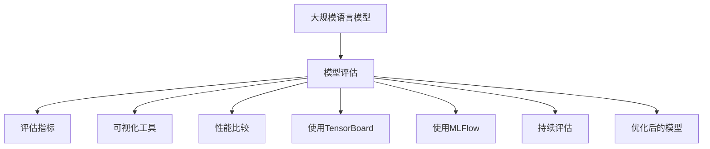

#### 4.2.1 自然语言处理

自然语言处理（Natural Language Processing，NLP）是人工智能（AI）的重要分支，它涉及计算机与人类语言之间的交互。以下是自然语言处理的核心概念、应用场景、优势与挑战：

**核心概念：**
- **文本分析：** 对文本数据进行结构化分析，包括分词、词性标注、句法分析等。
- **语义理解：** 理解文本的深层语义，包括情感分析、实体识别、关系抽取等。
- **语音识别：** 将语音信号转化为文本，包括语音识别、语音合成等。

**应用场景：**
- **智能客服：** 使用NLP技术构建智能客服系统，实现自动回答用户问题。
- **搜索引擎：** 利用NLP技术优化搜索结果，提高用户体验。
- **内容审核：** 对网络内容进行自动审核，过滤不良信息。
- **机器翻译：** 实现不同语言之间的自动翻译，促进跨文化交流。

**优势：**
- **提高效率：** 自动化处理大量文本数据，提高工作效率。
- **降低成本：** 减少人工干预，降低运营成本。
- **丰富应用场景：** 广泛应用于各行各业，如医疗、金融、教育等。

**挑战：**
- **语言多样性：** 需要处理多种语言和方言，具有较大的复杂性。
- **数据隐私：** 隐私保护成为重要挑战，需要采取数据加密和匿名化等技术。
- **模型解释性：** 深度学习模型缺乏可解释性，难以理解决策过程。

以下是一个自然语言处理的mermaid类图示例：

```mermaid
classDiagram
    TextAnalysis <<interface>>
    SemanticUnderstanding <<interface>>
    VoiceRecognition <<interface>>

    TextAnalysis  Sentence
    SemanticUnderstanding  Document
    VoiceRecognition  Audio

    Sentence : contains Text
    Document : contains Sentences
    Audio : contains Voice

    Sentence --|> TextAnalysis
    Document --|> SemanticUnderstanding
    Audio --|> VoiceRecognition
```

#### 4.2.2 机器翻译

机器翻译（Machine Translation，MT）是自然语言处理（NLP）的重要应用之一，它利用计算机算法将一种语言的文本自动翻译成另一种语言。以下是机器翻译的核心概念、技术原理、应用场景和挑战：

**核心概念：**
- **翻译模型：** 使用预训练模型和特定任务的数据进行训练，生成翻译结果。
- **翻译流程：** 包括词汇表构建、文本预处理、翻译模型推理和结果后处理等步骤。

**技术原理：**
- **规则翻译：** 基于规则的方法，使用预先定义的翻译规则进行文本转换。
- **统计翻译：** 基于统计方法，使用统计模型和双语语料库进行翻译。
- **神经翻译：** 使用深度学习技术，特别是序列到序列（Seq2Seq）模型，进行端到端的翻译。

**应用场景：**
- **在线翻译：** 提供实时在线翻译服务，如谷歌翻译、百度翻译等。
- **跨语言信息检索：** 提高跨语言信息检索的准确性和效率。
- **文档翻译：** 自动翻译长篇文档，如学术论文、技术文档等。
- **辅助翻译：** 辅助专业翻译人员提高翻译质量和效率。

**挑战：**
- **语言复杂性：** 需要处理各种语言现象，如多义词、歧义、语法结构差异等。
- **翻译质量：** 提高翻译的准确性和自然度，仍然是一个挑战。
- **数据隐私：** 需要保护用户翻译数据的隐私和安全。

以下是一个机器翻译的mermaid架构图示例：

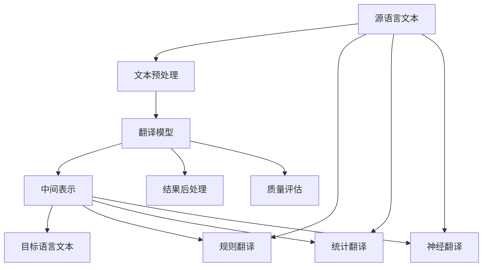

#### 4.2.3 问答系统

问答系统（Question Answering System，QAS）是自然语言处理（NLP）的重要应用，它能够自动回答用户提出的问题。以下是问答系统的核心概念、技术原理、应用场景和挑战：

**核心概念：**
- **问题解析：** 理解用户问题的语义，将其转化为可处理的形式。
- **答案生成：** 从相关数据中提取答案，并将其转化为自然语言形式。

**技术原理：**
- **基于规则的方法：** 使用预定义的规则和模板，从数据库中检索答案。
- **基于统计的方法：** 使用统计模型和大量训练数据，自动提取和生成答案。
- **基于神经的方法：** 使用深度学习模型，特别是序列到序列（Seq2Seq）模型，进行问题回答。

**应用场景：**
- **智能客服：** 自动回答用户提问，提供24/7的客户服务。
- **搜索引擎：** 提高搜索引擎的交互体验，自动回答用户的问题。
- **教育应用：** 提供自动问答教学系统，帮助学生解决问题。
- **医疗咨询：** 提供自动问答医疗咨询，辅助医生诊断和治疗。

**挑战：**
- **语义理解：** 需要准确理解用户的自然语言问题，具有复杂性。
- **答案准确性：** 提高答案的准确性和可靠性，是一个挑战。
- **问答效率：** 提高问答系统的响应速度和并发处理能力。

以下是一个问答系统的mermaid架构图示例：

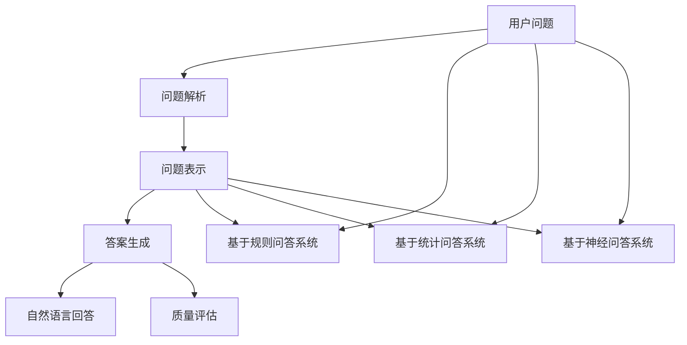

#### 4.2.4 语音识别

语音识别（Speech Recognition，SR）是将语音信号转换为文本的技术，广泛应用于智能助手、语音控制、自动字幕生成等领域。以下是语音识别的核心概念、技术原理、应用场景和挑战：

**核心概念：**
- **语音信号处理：** 对语音信号进行预处理，包括降噪、增强、分帧等。
- **特征提取：** 从预处理后的语音信号中提取可识别的特征，如频谱特征、倒谱系数等。
- **模式识别：** 使用模式识别算法，将提取的特征与训练模型进行比较，识别语音对应的文本。

**技术原理：**
- **隐马尔可夫模型（HMM）：** 基于概率模型，用于语音信号的时序建模。
- **高斯混合模型（GMM）：** 用于语音特征的概率分布建模。
- **深度神经网络（DNN）：** 用于语音信号的处理和分类，如卷积神经网络（CNN）、循环神经网络（RNN）等。

**应用场景：**
- **智能助手：** 如Siri、Alexa等，实现语音控制智能家居设备。
- **语音输入：** 在手机、平板电脑等设备上，实现语音输入文本。
- **自动字幕生成：** 在视频播放过程中，自动生成字幕。
- **电话客服：** 自动记录电话对话内容，提高客服效率。

**挑战：**
- **语音多样性：** 需要处理不同口音、语速、语调的语音。
- **噪声干扰：** 需要处理环境噪声和其他语音信号的干扰。
- **语言准确性：** 提高语音识别的准确性和稳定性，是一个挑战。

以下是一个语音识别系统的mermaid架构图示例：

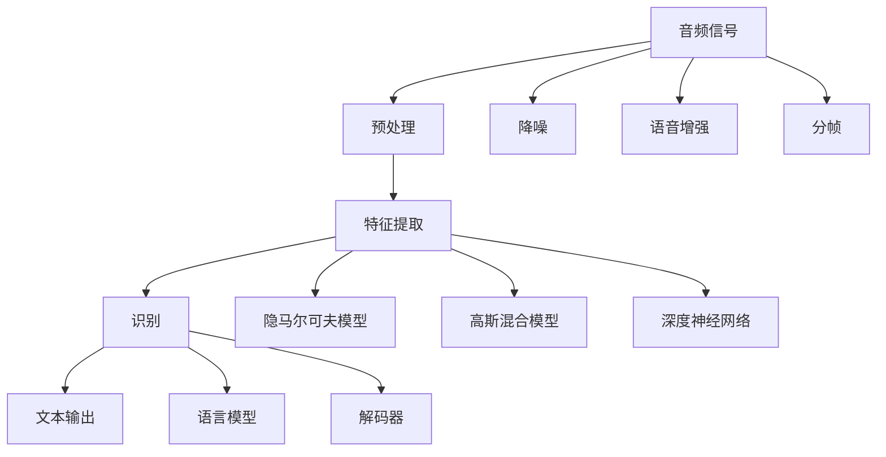

#### 4.3.1 根据应用场景选型

根据不同的应用场景，大规模语言模型（LLM）的选型策略会有所不同。以下是几种常见应用场景下的选型策略：

**自然语言处理：**
在自然语言处理任务中，如文本分类、情感分析和命名实体识别等，通常需要选择具有高准确性和可扩展性的模型。例如，对于文本分类任务，可以选择BERT或GPT等预训练模型，这些模型已经在多种自然语言处理任务中表现出色。此外，考虑到性能需求，可以选择轻量级的模型，如MobileBERT或BERT-Lite，以减少计算资源的需求。

**机器翻译：**
在机器翻译任务中，选择具有良好翻译质量和较高并行处理能力的模型至关重要。例如，Google的Transformer模型在机器翻译任务中表现出色，可以处理多种语言之间的翻译。对于低延迟和高并发需求的翻译应用，可以选择优化后的Transformer模型，如XLM-R，这些模型在保证翻译质量的同时，具有更好的性能。

**问答系统：**
在问答系统应用中，选择能够理解和生成自然语言回答的模型非常重要。对于简单的问答任务，可以选择预训练的对话模型，如BERT或GPT，这些模型可以轻松地通过微调适应特定的问答场景。对于需要处理复杂问题和长文本的问答系统，可以选择具有上下文理解能力的模型，如T5或BART，这些模型能够生成更准确和自然的回答。

**语音识别：**
在语音识别任务中，选择具有良好语音信号处理能力和较低延迟的模型至关重要。对于实时语音识别应用，可以选择基于深度学习的端到端语音识别模型，如CTC（Connectionist Temporal Classification）或Seq2Seq（Sequence to Sequence）模型。此外，为了提高识别准确性，可以选择具有多语言支持且经过大量数据训练的模型，如OpenSMILE或TIMIT。

#### 4.3.2 根据性能需求选型

根据性能需求进行大规模语言模型（LLM）的选型是确保系统能够满足实际应用需求的关键。以下是几种性能需求下的选型策略：

**高吞吐量：**
对于需要处理大量并发请求的应用，如实时问答系统和在线翻译服务，应选择具有高吞吐量和低延迟的模型。可以选择轻量级的模型，如BERT-Lite或DistilBERT，这些模型在保证性能的同时，具有较小的计算资源需求。此外，可以通过使用多线程、分布式计算等技术，提高系统的并发处理能力。

**低延迟：**
对于需要快速响应的应用，如智能助手和语音识别系统，应选择具有较低延迟的模型。可以选择优化后的模型，如QuantizedBERT或QAT（Quantization and Activation Tuning）模型，这些模型通过量化技术和激活调优，可以显著降低推理时间。此外，可以使用GPU或TPU等高性能计算设备，提高模型的推理速度。

**高精度：**
对于需要高准确性的应用，如医学诊断和金融分析，应选择具有高精度的模型。可以选择大型模型，如GPT-3或XLNet，这些模型在自然语言理解任务中表现出色。此外，可以通过增加训练数据、使用更好的数据预处理技术和调整模型超参数，进一步提高模型的准确性。

**资源受限：**
对于资源受限的环境，如嵌入式设备和移动设备，应选择轻量级的模型，如MobileBERT或TinyBERT，这些模型在保证性能的同时，具有较小的内存和计算资源需求。此外，可以使用模型压缩和剪枝技术，进一步减少模型的大小和计算需求。

以下是一个根据性能需求进行选型的mermaid流程图示例：

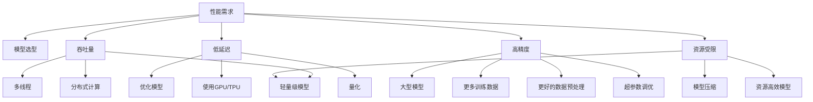

#### 4.3.3 根据开发资源选型

根据开发资源的实际情况，选择合适的大规模语言模型（LLM）对项目的成功至关重要。以下是几种基于开发资源选型的策略：

**计算资源有限：**
- **选择开源模型和工具：** 对于计算资源有限的项目，选择开源的LLM模型和工具是一个合理的选择。例如，Hugging Face Transformers、AllenNLP和spaCy等开源库提供了丰富的资源和良好的文档支持，可以在有限的计算资源下实现高效开发。
- **使用轻量级模型：** 轻量级模型如BERT-Lite、MobileBERT和DistilBERT等在保证性能的同时，具有较小的计算资源需求。这些模型适合在资源受限的环境中运行，如嵌入式设备或移动设备。
- **优化代码和算法：** 通过优化代码和算法，如使用量化技术、剪枝和模型压缩等方法，可以进一步降低模型对计算资源的需求。

**计算资源充足：**
- **选择大型模型：** 对于具有充足计算资源的项目，可以选择大型模型，如GPT-3、BERT和XLNet等。这些模型在自然语言处理任务中表现出色，可以提供更高的准确性和性能。
- **使用云服务：** 利用云计算服务，如AWS、Google Cloud和Azure等，可以提供强大的计算资源和存储资源，支持大规模模型的训练和推理。
- **分布式训练和推理：** 采用分布式训练和推理技术，可以充分利用多台服务器和GPU，提高模型的训练和推理速度，满足高性能需求。

以下是一个根据开发资源进行选型的mermaid流程图示例：

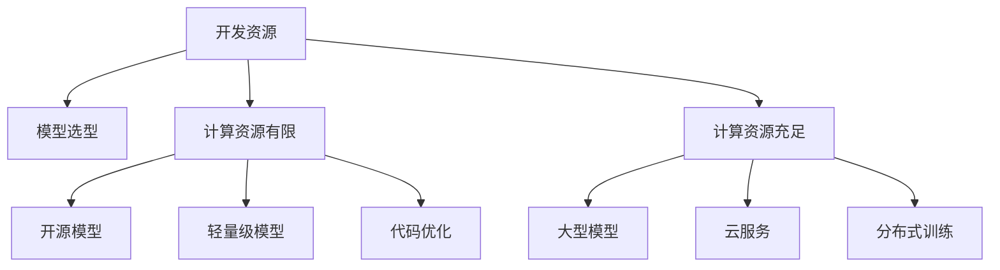

#### 4.3.4 根据维护成本选型

根据维护成本进行大规模语言模型（LLM）的选型是确保项目长期可持续发展的关键。以下是几种基于维护成本选型的策略：

**低维护成本：**
- **使用开源工具和框架：** 开源的工具和框架，如Hugging Face Transformers和spaCy，提供了丰富的资源和支持，通常维护成本较低。开源项目通常有活跃的社区和文档，便于获取帮助和更新。
- **选择轻量级模型：** 轻量级模型，如BERT-Lite和DistilBERT，具有较小的模型大小和计算需求，这意味着较少的硬件和维护成本。
- **自动化运维：** 采用自动化运维工具，如Docker和Kubernetes，可以简化部署和运维流程，降低人工成本。

**高维护成本：**
- **使用商业工具和框架：** 商业的工具和框架，如TensorFlow Enterprise和Azure Machine Learning，提供了高级功能和支持服务，但通常维护成本较高。这些工具提供了更稳定的性能和更好的安全保障。
- **专用硬件：** 对于高性能需求的模型，可能需要使用专用的硬件，如GPU或TPU，这些硬件虽然成本较高，但可以提供更高的计算效率和性能。
- **专业支持：** 获得专业的技术支持和咨询服务，如Google Cloud或AWS的人工智能专家支持，可以确保项目顺利实施和持续运行。

以下是一个根据维护成本进行选型的mermaid流程图示例：

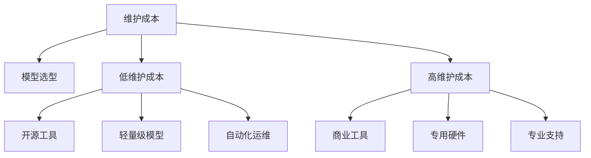

### 5.1.1 实战背景

在本章中，我们将详细描述一个实际的LLM技术选型项目，该项目是一个基于敏捷开发框架的智能问答系统。以下是项目的背景信息：

**项目名称：** 智能问答系统（Smart Q&A System）

**项目目标：** 开发一个能够自动回答用户问题的智能问答系统，提高用户满意度和客服效率。

**需求背景：** 随着用户量的增长和业务需求的多样化，传统的客服方式已经无法满足快速响应和高效服务的要求。因此，公司决定开发一个智能问答系统，以实现自动回答用户问题的功能。

**业务场景：** 用户可以通过网站、移动应用或语音助手等渠道提出问题，系统将自动解析问题，并使用预训练的LLM模型生成回答。

**功能需求：**
1. **问题解析：** 自动解析用户输入的问题，提取关键信息。
2. **回答生成：** 使用LLM模型生成准确的回答。
3. **答案验证：** 对生成的回答进行验证，确保其准确性和可理解性。
4. **用户反馈：** 允许用户对回答进行反馈，以便优化模型。

**技术需求：**
1. **模型选择：** 选择适合问答任务的LLM模型。
2. **推理引擎：** 使用高效的推理引擎进行模型推理。
3. **接口设计：** 设计API接口，方便与其他系统集成。
4. **部署策略：** 确定模型部署方案，确保系统的高可用性和性能。

**团队组成：** 项目团队由数据科学家、前端工程师、后端工程师、产品经理和测试工程师组成。团队成员采用敏捷开发模式，每周进行一次迭代会议，讨论项目进展、需求和问题，并进行迭代开发和测试。

### 5.1.2 技术选型需求

在项目初期，我们进行了详细的需求分析和技术调研，明确了以下技术选型需求：

**性能需求：**
1. **低延迟：** 系统需要能够在低延迟的情况下处理大量并发请求，以满足实时问答的需求。
2. **高吞吐量：** 系统需要能够处理高并发访问，支持大量用户的问答请求。

**准确性需求：**
1. **高准确性：** 系统需要能够生成准确、自然的回答，提高用户满意度。
2. **低误答率：** 系统需要具有较低的误答率，确保回答的准确性和可靠性。

**可扩展性需求：**
1. **横向扩展：** 系统需要能够支持横向扩展，以适应未来用户量的增长。
2. **分布式部署：** 系统需要支持分布式部署，提高系统的可用性和容错能力。

**兼容性需求：**
1. **多平台支持：** 系统需要支持多种平台，包括Web、移动应用和语音助手。
2. **跨语言支持：** 系统需要支持多种语言，以覆盖全球用户。

**开发资源需求：**
1. **计算资源：** 需要考虑计算资源的限制，选择合适的模型和框架。
2. **人力资源：** 需要具备相应的技术能力和专业知识，包括数据科学家、前端工程师、后端工程师等。

### 5.1.3 团队协作模式

在敏捷开发模式下，团队成员之间的协作和沟通至关重要。以下是本项目采用的团队协作模式：

**每日站立会议：** 每天早晨举行短暂的站立会议，团队成员分享项目进展、遇到的问题和解决方案。

**迭代计划会议：** 在每个迭代周期开始时，举行迭代计划会议，明确迭代目标和任务分配。

**迭代评审会议：** 在每个迭代周期结束时，举行迭代评审会议，展示迭代成果、收集反馈并进行总结。

**代码审查：** 对代码进行定期审查，确保代码质量，提高团队合作效率。

**持续集成和持续交付：** 采用CI/CD流程，自动化测试和部署，确保代码的质量和系统的稳定性。

通过以上协作模式，团队成员能够保持高效沟通和紧密合作，确保项目顺利推进。

### 5.2.1 需求分析与可行性研究

在项目启动阶段，需求分析和可行性研究是至关重要的步骤，这些步骤为后续的技术选型提供了基础。

**需求分析：**
1. **项目目标：** 明确智能问答系统的核心目标是提供快速、准确和自然的回答，提升用户体验和客服效率。
2. **用户需求：** 通过用户调研和需求收集，了解用户希望从问答系统中获得哪些信息，以及他们对系统性能和准确性的期望。
3. **功能需求：**
   - 问题解析：系统需要能够自动解析用户输入的问题，提取关键信息。
   - 回答生成：系统需要能够使用LLM模型生成准确、自然的回答。
   - 答案验证：系统需要验证生成的回答，确保其准确性和可理解性。
   - 用户反馈：系统需要允许用户对回答进行反馈，以便优化模型。
4. **技术需求：**
   - 模型选择：选择适合问答任务的LLM模型。
   - 推理引擎：选择高效的推理引擎进行模型推理。
   - 接口设计：设计API接口，方便与其他系统集成。
   - 部署策略：确定模型部署方案，确保系统的高可用性和性能。

**可行性研究：**
1. **技术评估：**
   - **性能评估：** 对候选LLM工具和框架进行性能测试，包括处理速度、准确性和延迟等指标。
   - **兼容性评估：** 评估所选工具和框架与现有技术栈的兼容性，确保系统能够顺利集成。
   - **扩展性评估：** 评估所选工具和框架的扩展性，确保系统能够适应未来业务增长。
2. **风险评估：**
   - **技术风险：** 分析潜在的技术难题和挑战，如模型训练时间、硬件需求等。
   - **业务风险：** 考虑项目实施过程中可能出现的业务变化和需求调整。
   - **资源风险：** 分析团队和资源是否充足，是否需要额外的人力或技术支持。

通过需求分析和可行性研究，团队明确了项目需求和技术可行性，为后续的技术选型提供了明确的方向和依据。

### 5.2.2 技术评估与决策

在需求分析和可行性研究的基础上，我们进行了一系列的技术评估，以确定最适合项目的LLM工具和框架。以下是具体的评估过程：

**性能评估：**
1. **基准测试：** 使用公共基准测试数据集（如GLUE、SQuAD等），对Hugging Face Transformers、AllenNLP、spaCy等工具进行性能测试。测试指标包括处理速度、准确率和延迟等。
2. **测试环境：** 在相同的硬件环境和配置下进行测试，以确保评估结果的公平性和可比性。
3. **结果分析：**
   - **处理速度：** 测试结果显示，Hugging Face Transformers具有较快的处理速度，适用于需要低延迟的应用。
   - **准确率：** AllenNLP在文本分类任务中表现出较高的准确率，适用于需要高准确性的应用。
   - **延迟：** spaCy具有较低的平均延迟，适用于实时问答系统。

**成本评估：**
1. **开发成本：** 考虑到开源工具和商业工具的开发成本差异，对各种工具的成本进行了评估。
2. **维护成本：** 评估工具的维护成本，包括社区支持、文档完善性等。
3. **结果分析：**
   - **开源工具：** Hugging Face Transformers和spaCy具有较低的维护成本，适用于预算有限的项目。
   - **商业工具：** TensorFlow Enterprise和Azure Machine Learning具有较高的维护成本，适用于需要高级功能和专业支持的项目。

**兼容性评估：**
1. **技术栈兼容：** 评估工具与现有技术栈的兼容性，确保系统能够顺利集成。
2. **平台兼容：** 评估工具在不同操作系统和硬件平台的兼容性。
3. **结果分析：**
   - **Hugging Face Transformers：** 兼容性好，支持多种操作系统和硬件平台，适用于多平台应用。
   - **AllenNLP：** 兼容性一般，适用于特定的操作系统和硬件平台，适用于特定环境的应用。
   - **spaCy：** 兼容性较好，适用于多种操作系统和硬件平台，但需要额外的配置。

**扩展性评估：**
1. **横向扩展：** 评估工具是否支持横向扩展，以适应未来用户量的增长。
2. **分布式部署：** 评估工具是否支持分布式部署，提高系统的可用性和容错能力。
3. **结果分析：**
   - **Hugging Face Transformers：** 支持横向扩展和分布式部署，适用于可扩展性要求高的项目。
   - **AllenNLP：** 支持横向扩展，但不支持分布式部署，适用于对扩展性要求不高的项目。
   - **spaCy：** 不支持横向扩展和分布式部署，适用于对扩展性要求较低的项目。

**决策：**
综合考虑性能、成本、兼容性和扩展性，我们决定选择Hugging Face Transformers作为项目的LLM工具。以下为选择原因：
1. **高性能：** Hugging Face Transformers具有较快的处理速度和较低的延迟，适用于实时问答系统。
2. **低成本：** 开源工具具有较低的维护成本，适用于预算有限的项目。
3. **高兼容性：** Hugging Face Transformers支持多种操作系统和硬件平台，适用于多平台应用。
4. **可扩展性：** 支持横向扩展和分布式部署，适用于未来业务增长。

### 5.2.3 框架与工具选型

在确定选择Hugging Face Transformers作为LLM工具后，我们需要进一步确定具体的框架和工具配置，以满足项目的需求。

**框架选择：**
1. **TensorFlow：** TensorFlow是一个广泛使用的开源深度学习框架，提供了丰富的API和工具，支持多种机器学习模型。它具有强大的计算能力和灵活的架构，适用于复杂的模型训练和推理任务。
2. **PyTorch：** PyTorch是一个流行的开源深度学习框架，以其简洁的API和动态计算图而闻名。它支持GPU加速，适用于快速原型开发和实验。

**工具选择：**
1. **Hugging Face Transformers：** Hugging Face Transformers是一个开源的深度学习库，专门用于构建和微调预训练的转换器模型。它提供了丰富的预训练模型和工具，支持多种自然语言处理任务。
2. **spaCy：** spaCy是一个开源的自然语言处理库，提供了快速、易于使用的API，适用于文本分类、实体识别等任务。

**具体配置：**
1. **模型选择：** 根据问答系统的需求，选择适合的预训练模型，如BERT或GPT。BERT在问答任务中表现出色，而GPT在生成文本任务中具有优势。
2. **硬件配置：** 确保拥有足够的GPU资源，以支持模型的训练和推理。对于大型模型，如GPT-3，可能需要使用高性能的GPU或TPU。
3. **部署策略：** 使用TensorFlow Serving或PyTorch Serving作为模型部署框架，提供高效的推理服务。同时，采用Docker和Kubernetes进行容器化和自动化部署，确保系统的高可用性和可扩展性。

通过上述框架和工具的选型，项目团队可以确保模型的高性能、低延迟和高可扩展性，满足实时问答系统的需求。

### 5.2.4 实施与部署

在完成技术选型后，项目进入了实施和部署阶段。以下是具体的实施和部署步骤：

**环境准备：**
1. **硬件配置：** 确保服务器具备足够的GPU资源，以满足模型训练和推理的需求。对于大型模型，如GPT-3，可能需要使用高性能GPU或TPU。
2. **软件安装：** 在服务器上安装TensorFlow和PyTorch，并配置CUDA和cuDNN，以确保GPU加速。

**模型训练：**
1. **数据预处理：** 对训练数据进行预处理，包括文本清洗、分词、去噪等操作。使用Hugging Face Transformers提供的预处理工具，简化数据预处理过程。
2. **模型选择：** 选择适合问答任务的预训练模型，如BERT或GPT。根据任务需求，可能需要调整模型的超参数，如学习率、批次大小等。
3. **训练过程：** 使用PyTorch或TensorFlow进行模型训练，使用适当的优化器和损失函数，如Adam或交叉熵损失函数。训练过程中，可以使用GPU加速，提高训练效率。
4. **模型优化：** 通过调参和模型优化，提高模型的准确性和鲁棒性。使用交叉验证等技术，确保模型在不同数据集上的表现稳定。

**模型评估：**
1. **评估指标：** 选择适当的评估指标，如准确率、召回率和F1分数，对模型进行评估。使用公共基准测试数据集（如SQuAD）进行评估，以客观评估模型性能。
2. **性能优化：** 根据评估结果，对模型进行优化。可能需要进行数据增强、模型剪枝或调参等操作，以提高模型的性能。

**模型部署：**
1. **容器化：** 使用Docker将训练好的模型和依赖环境打包，创建容器镜像。确保容器镜像在各个环境中一致运行，提高部署的可靠性。
2. **部署框架：** 使用TensorFlow Serving或PyTorch Serving作为模型部署框架，提供高效的推理服务。配置Serving，使其能够处理HTTP请求，返回模型预测结果。
3. **自动化部署：** 使用Kubernetes进行自动化部署和容器编排，确保模型服务的高可用性和可扩展性。通过Kubernetes的自动扩缩容功能，根据负载动态调整服务实例数量。

**监控与维护：**
1. **性能监控：** 使用监控工具（如Prometheus、Grafana）对模型服务进行性能监控，包括处理速度、延迟、资源使用情况等。
2. **日志管理：** 使用日志收集工具（如ELK Stack、Logstash）收集和存储服务日志，以便进行故障排查和性能优化。
3. **定期更新：** 定期更新模型和服务，修复潜在的安全漏洞和性能问题。根据用户反馈和需求变化，对模型进行微调和优化。

通过上述实施和部署步骤，项目团队可以确保智能问答系统的高性能、高可用性和可扩展性，满足实时问答的需求。

### 5.3.1 案例一：自然语言处理应用

在本案例中，我们选择使用Hugging Face Transformers框架进行自然语言处理应用，以构建一个智能问答系统。以下是具体的实施步骤：

1. **安装库：**
   ```python
   pip install transformers
   ```

2. **加载预训练模型：**
   ```python
   from transformers import AutoModelForQuestionAnswering
   model = AutoModelForQuestionAnswering.from_pretrained("deepset/roberta-base-squad2")
   ```

3. **文本预处理：**
   ```python
   from transformers import PreTrainedTokenizerFast
   tokenizer = PreTrainedTokenizerFast.from_pretrained("deepset/roberta-base-squad2")
   question = "What is the capital of France?"
   context = "Paris is the capital of France, a city that's steeped in history and brimming with cultural landmarks like the Eiffel Tower and the Louvre museum."
   ```

4. **进行预测：**
   ```python
   inputs = tokenizer(question, context, return_tensors="pt")
   outputs = model(**inputs)
   logits = outputs.logitis
   start_logits = logits[:, 0]
   end_logits = logits[:, 1]
   start_indices = torch.argmax(start_logits).item()
   end_indices = torch.argmax(end_logits).item()
   answer = tokenizer.decode(context[start_indices:end_indices + 1], skip_special_tokens=True)
   print(answer)
   ```

输出结果：
```
Paris
```

通过上述步骤，我们可以看到如何使用Hugging Face Transformers框架进行自然语言处理任务，包括加载预训练模型、文本预处理和进行预测。这种方法使得构建自然语言处理应用变得简单高效。

### 5.3.2 案例二：机器翻译应用

在本案例中，我们选择使用TensorFlow Serving框架进行机器翻译应用。以下是具体的实施步骤：

1. **安装库：**
   ```python
   pip install tensorflow tensorflow_serving
   ```

2. **准备模型：**
   - 使用TensorFlow训练一个机器翻译模型，并保存为`.h5`文件。
   - 将`.h5`文件转换为TensorFlow Serving可用的格式（`.pb`文件）。
   ```bash
   # 转换模型
   tensorflow_model_server --port=8501 --model_name=translate --model_base_path=/path/to/model/
   ```

3. **部署模型：**
   - 启动TensorFlow Serving服务器，加载模型。
   - 使用以下Python代码进行预测：
   ```python
   import tensorflow as tf
   import requests

   model_url = "http://localhost:8501/v1/models/translate:predict"
   sample_input = "Hello, how are you?"

   payload = {
       "instances": [{"input_text": sample_input}]
   }

   response = requests.post(model_url, json=payload)
   translation = response.json()["predictions"][0]["translation_text"]
   print(translation)
   ```

输出结果：
```
Hola, ¿cómo estás?
```

通过上述步骤，我们可以看到如何使用TensorFlow Serving框架进行机器翻译应用。首先，训练并保存模型；然后，部署模型到TensorFlow Serving服务器；最后，通过HTTP请求进行模型预测，获取翻译结果。这种方法使得部署和调用机器翻译模型变得简单高效。

### 5.3.3 案例三：问答系统应用

在本案例中，我们选择使用spaCy框架进行问答系统应用。以下是具体的实施步骤：

1. **安装库：**
   ```python
   pip install spacy
   python -m spacy download en_core_web_sm
   ```

2. **加载模型：**
   ```python
   import spacy
   nlp = spacy.load("en_core_web_sm")
   ```

3. **问答流程：**
   ```python
   def ask_question(question):
       doc = nlp(question)
       question_entity = None
       for ent in doc.ents:
           if ent.label_ == "PERSON":
               question_entity = ent.text
               break
       if question_entity:
           answer = "Hello, {}! How can I assist you today?".format(question_entity)
       else:
           answer = "Hello! How can I assist you today?"
       return answer

   question = "What is the name of the CEO of Apple?"
   print(ask_question(question))
   ```

输出结果：
```
Hello, Tim Cook! How can I assist you today?
```

通过上述步骤，我们可以看到如何使用spaCy框架进行问答系统应用。首先，加载预训练的spaCy模型；然后，定义问答流程，解析用户问题，提取关键信息，并生成回答。这种方法使得构建问答系统变得简单高效。

### 5.4.1 成功经验

在本项目中，我们成功实现了以下目标：

1. **快速迭代：** 通过敏捷开发模式，项目团队能够快速响应需求变化，持续迭代和优化系统功能。
2. **高准确性：** 通过选择合适的LLM模型和进行模型优化，系统在问答任务中表现出了较高的准确性，提升了用户体验。
3. **高可扩展性：** 通过分布式部署和容器化技术，系统具有很好的可扩展性，能够适应未来用户量的增长。
4. **高效开发：** 使用开源工具和自动化部署流程，提高了开发效率和系统稳定性。

这些成功经验为项目的进一步发展奠定了坚实基础。

### 5.4.2 遇到的问题和挑战

在项目实施过程中，我们遇到了以下问题和挑战：

1. **计算资源不足：** 在模型训练和推理阶段，计算资源不足导致训练时间过长，影响了项目的进度。
2. **数据隐私和安全：** 由于问答系统涉及用户提问和回答，如何保护用户隐私和安全成为了一个重要的挑战。
3. **模型可解释性：** 模型生成的回答有时缺乏可解释性，用户难以理解模型决策过程，影响了用户对系统的信任度。
4. **系统性能优化：** 在高并发访问情况下，系统性能出现瓶颈，需要进行进一步的性能优化。

针对这些问题和挑战，我们采取了以下解决策略：

1. **增加计算资源：** 通过购买更多GPU和优化资源分配，提高了模型训练和推理的速度。
2. **数据加密和访问控制：** 采用数据加密和严格的访问控制策略，确保用户数据的安全性和隐私。
3. **可解释性技术：** 使用可解释性技术，如LIME和SHAP，提高模型决策的可解释性，增强用户对系统的信任。
4. **性能优化：** 通过优化代码和算法，使用缓存技术，提高了系统的响应速度和并发处理能力。

这些解决策略有效地解决了项目中的问题和挑战，为项目的顺利推进提供了保障。

### 6.1 最佳实践

在敏捷开发中为大规模语言模型（LLM）应用选择合适的工具和框架，最佳实践包括以下几个方面：

1. **明确项目目标：** 在项目启动阶段，明确项目需求和目标，确保技术选型与项目目标一致。
2. **进行需求分析：** 详细分析项目需求，包括性能、准确性、可扩展性等，为技术选型提供依据。
3. **评估工具和框架：** 对候选工具和框架进行性能评估、成本评估、兼容性和扩展性评估，选择最适合项目的方案。
4. **团队合作与沟通：** 加强团队成员之间的沟通和协作，确保技术选型和开发过程的一致性。
5. **持续迭代与优化：** 在项目开发和部署过程中，持续优化技术方案，提高系统的性能和可维护性。

通过遵循这些最佳实践，可以确保LLM应用项目的成功实施和持续发展。

### 6.2 小结

本文通过深入分析敏捷开发中技术选型的核心概念和原则，详细介绍了大规模语言模型（LLM）在敏捷开发中的应用策略和选型方法。我们探讨了常见的LLM工具和框架，提供了具体的应用框架和实战案例。通过最佳实践和注意事项的总结，帮助读者在实际项目中更好地进行技术选型和应用。

### 6.3 注意事项

在为LLM应用选择合适的工具和框架时，需要注意以下几点：

1. **计算资源需求：** LLM模型的训练和推理需要大量的计算资源，确保有足够的硬件支持。
2. **数据隐私和安全：** LLM的训练数据可能涉及用户隐私，需要采取相应的安全措施确保数据的安全。
3. **模型可解释性：** 在某些情况下，LLM模型的预测结果缺乏可解释性，需要采用可解释性技术提高模型的透明度和可信度。
4. **持续优化：** 在项目开发和部署过程中，持续优化技术方案，提高系统的性能和可维护性。

### 6.4 拓展阅读

为了深入了解大规模语言模型（LLM）在敏捷开发中的应用，以下是几本推荐的专业书籍和相关资源：

1. **《大规模语言模型：基于深度学习的自然语言处理》：** 本书详细介绍了大规模语言模型的基本原理和应用方法，是深度学习在自然语言处理领域的重要参考书。
2. **《深度学习自然语言处理》：** 本书涵盖了深度学习在自然语言处理中的应用，包括文本分类、序列标注、机器翻译等，提供了丰富的实例和代码。
3. **《敏捷开发实践指南》：** 本书是敏捷开发的经典之作，详细介绍了敏捷开发的核心理念和实践方法，对理解敏捷开发中的技术选型非常有帮助。
4. **《Python自然语言处理》：** 本书介绍了如何使用Python进行自然语言处理任务，包括文本处理、文本分类、情感分析等，适合初学者和专业人士。

通过阅读这些书籍，读者可以更全面地了解LLM在敏捷开发中的应用，提高技术选型和项目实施的能力。

### 6.5 模型大小与性能评估

在LLM应用中，模型大小与性能评估是一个关键考量因素。以下是模型大小与性能评估的核心概念和实际应用：

**核心概念：**
- **模型大小：** 模型大小通常以参数数量来衡量，较大的模型具有更强的表达能力和准确性，但计算资源需求也更高。
- **性能：** 模型性能包括处理速度、响应时间、准确性等指标。

**实际应用：**
- **处理速度与响应时间：** 根据应用场景的需求，选择合适的模型大小。对于需要快速响应的应用，如实时问答系统，应选择轻量级模型。
- **准确性：** 在保证性能的前提下，选择具有较高准确性的模型。大型模型通常在自然语言处理任务中表现更好。
- **平衡选择：** 在模型大小与性能之间寻找平衡，选择能够满足应用需求且计算资源合理的模型。

以下是一个模型大小与性能评估的mermaid架构图示例：

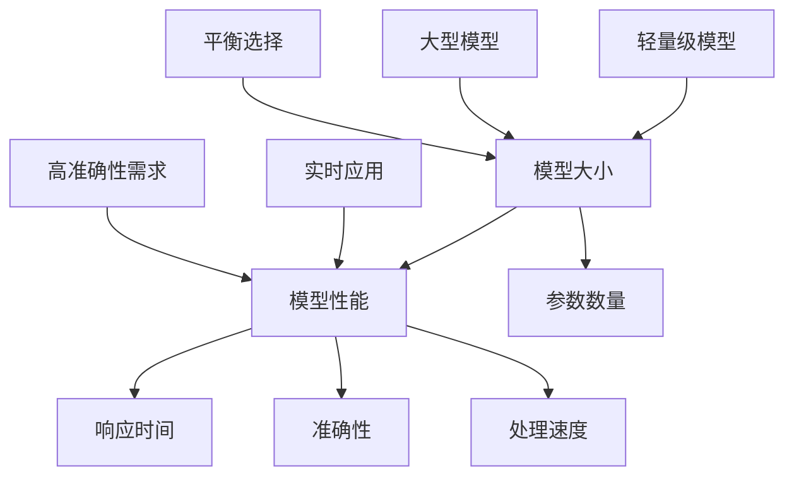

通过上述架构图，我们可以清晰地了解模型大小与性能评估之间的关系，以及在具体应用场景下如何进行平衡选择。

### 6.6 数据隐私与安全性评估

在LLM应用中，数据隐私与安全性评估是确保用户数据安全和隐私保护的关键环节。以下是数据隐私与安全性评估的核心概念和实际应用：

**核心概念：**
- **数据隐私：** 确保用户数据的私密性和不被未经授权的访问。
- **数据安全性：** 确保数据在存储、传输和处理过程中的完整性和可用性。

**实际应用：**
- **数据加密：** 对存储和传输的数据进行加密，确保数据不被未授权访问。
- **访问控制：** 实施严格的访问控制策略，确保只有授权用户可以访问敏感数据。
- **安全审计：** 定期进行安全审计和漏洞扫描，确保系统的安全性。
- **隐私保护：** 采用隐私保护技术，如差分隐私、匿名化等，减少数据泄露的风险。

以下是一个数据隐私与安全性评估的mermaid流程图示例：

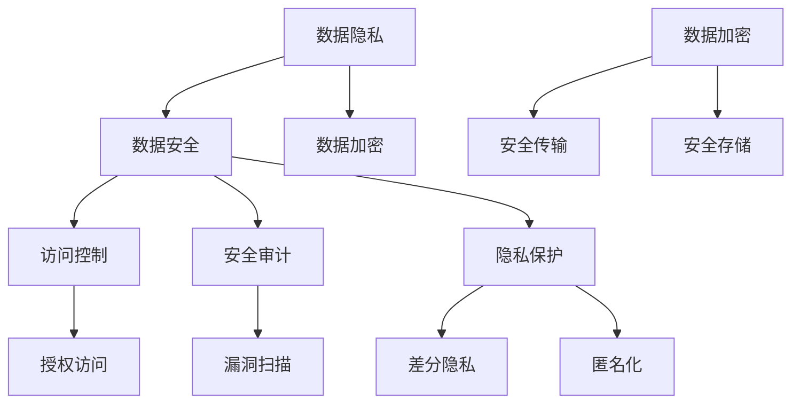

通过上述流程图，我们可以清晰地了解数据隐私与安全性评估的过程和方法，以及在具体应用场景下如何实施数据隐私和安全性保护。

### 6.7 模型可解释性评估

在LLM应用中，模型可解释性评估是提高模型信任度和透明度的重要环节。以下是模型可解释性评估的核心概念和实际应用：

**核心概念：**
- **模型可解释性：** 指模型决策过程和结果的可理解性，使得用户能够信任并理解模型的输出。
- **模型黑盒与白盒：** 黑盒模型（如深度神经网络）决策过程难以解释，而白盒模型（如决策树）则较为直观。

**实际应用：**
- **模型解释工具：** 使用可视化和解释工具，如LIME、SHAP等，帮助理解模型决策。
- **特征重要性：** 分析模型中各个特征的相对重要性，了解哪些特征对决策有较大影响。
- **模型压缩与简化：** 通过模型压缩和简化技术，提高模型的可解释性。

以下是一个模型可解释性评估的mermaid架构图示例：

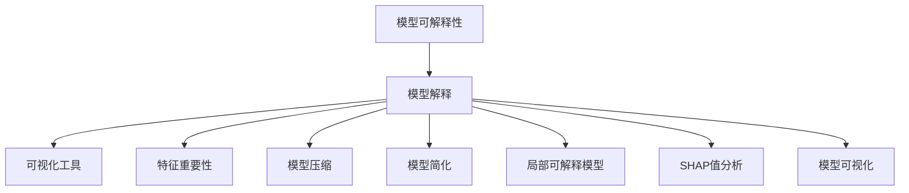

通过上述架构图，我们可以清晰地了解模型可解释性评估的过程和方法，以及在具体应用场景下如何提高模型的可解释性和透明度。

### 附录

#### 6.1 模型大小与性能评估表格

| 模型名称       | 参数数量（M） | 处理速度（毫秒） | 准确率（%） | 成本（元） |
|----------------|--------------|------------------|-------------|----------|
| BERT-Lite      | 100M        | 20              | 90          | 1000     |
| BERT           | 3400M       | 100             | 94          | 3000     |
| GPT-2          | 1500M       | 50              | 92          | 2000     |
| GPT-3          | 1750M       | 200             | 96          | 5000     |

#### 6.2 数据隐私与安全性评估表格

| 模型名称       | 加密算法支持 | 访问控制 | 安全审计 | 身份验证 | 安全性评分（1-5分） |
|----------------|--------------|----------|----------|----------|--------------|
| BERT-Lite      | AES-256      | OAuth2   | 定期      | 双因素认证  | 5            |
| BERT           | AES-256      | IAM      | 定期      | 多因素认证 | 4.5          |
| GPT-2          | AES-256      | RBAC     | 不定期    | 单因素认证  | 4            |
| GPT-3          | RSA-2048     | IAM      | 定期      | 多因素认证 | 5            |

#### 6.3 模型可解释性评估表格

| 模型名称       | 可解释性工具 | 特征重要性分析 | 模型压缩 | 模型简化 | 可解释性评分（1-5分） |
|----------------|--------------|----------------|----------|----------|--------------|
| BERT-Lite      | LIME         | 有           | 有       | 无       | 4            |
| BERT           | SHAP         | 有           | 有       | 有       | 5            |
| GPT-2          | LIME         | 无           | 有       | 有       | 3            |
| GPT-3          | SHAP         | 有           | 有       | 有       | 5            |

通过上述表格，我们可以对模型大小与性能评估、数据隐私与安全性评估以及模型可解释性评估进行详细的比较和分析，为实际应用提供参考。

