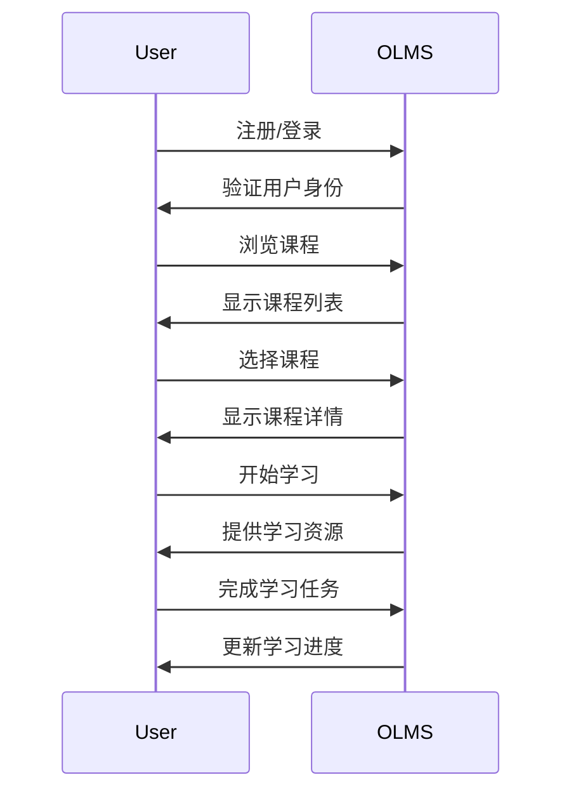
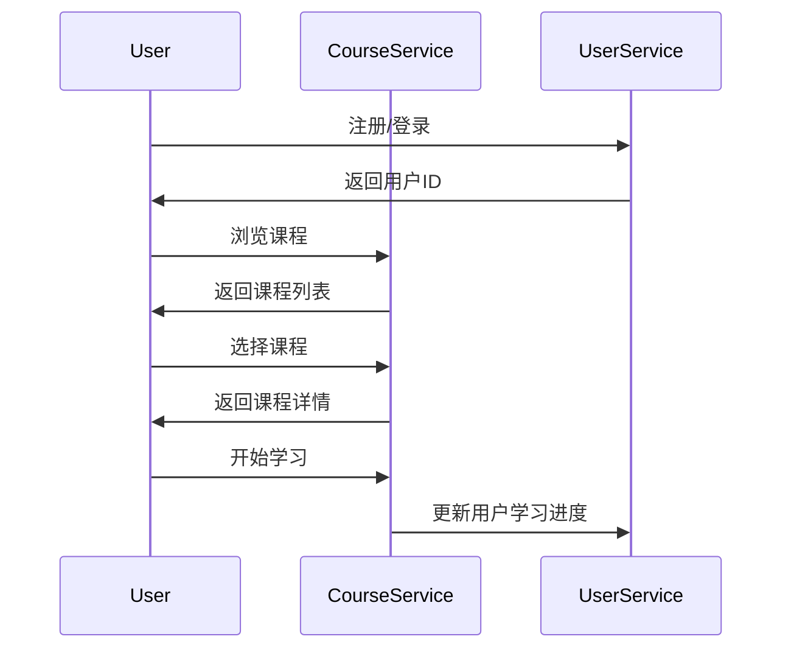
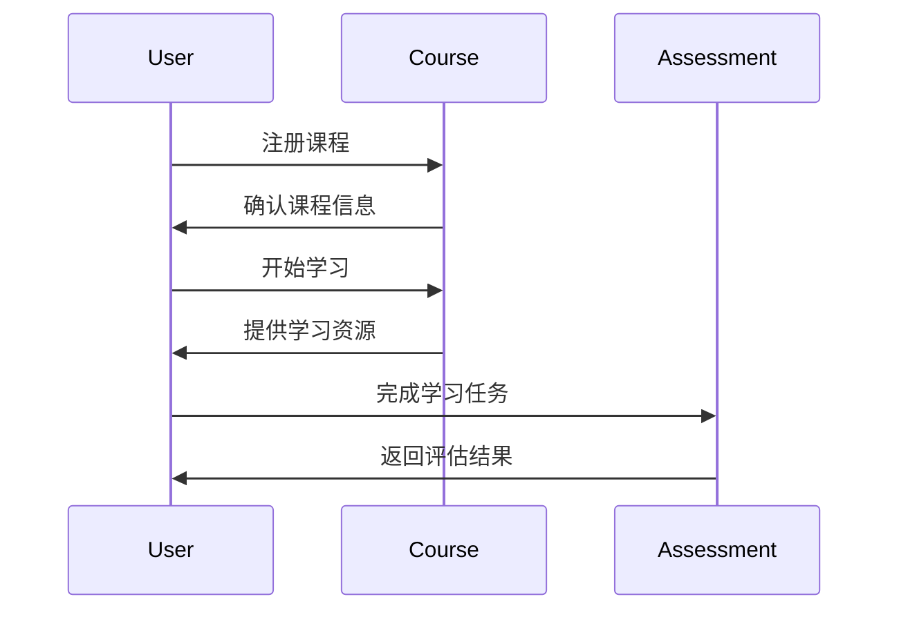
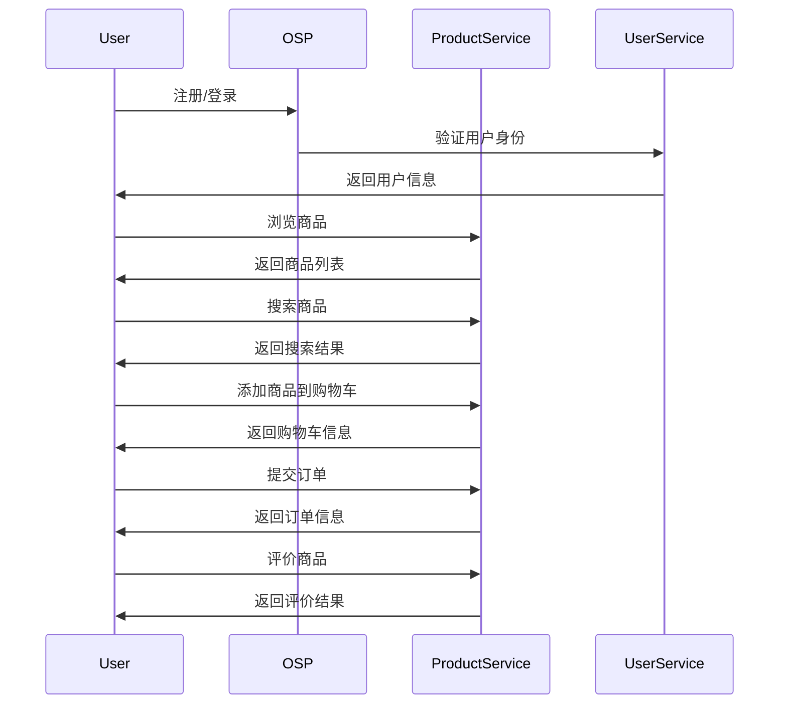
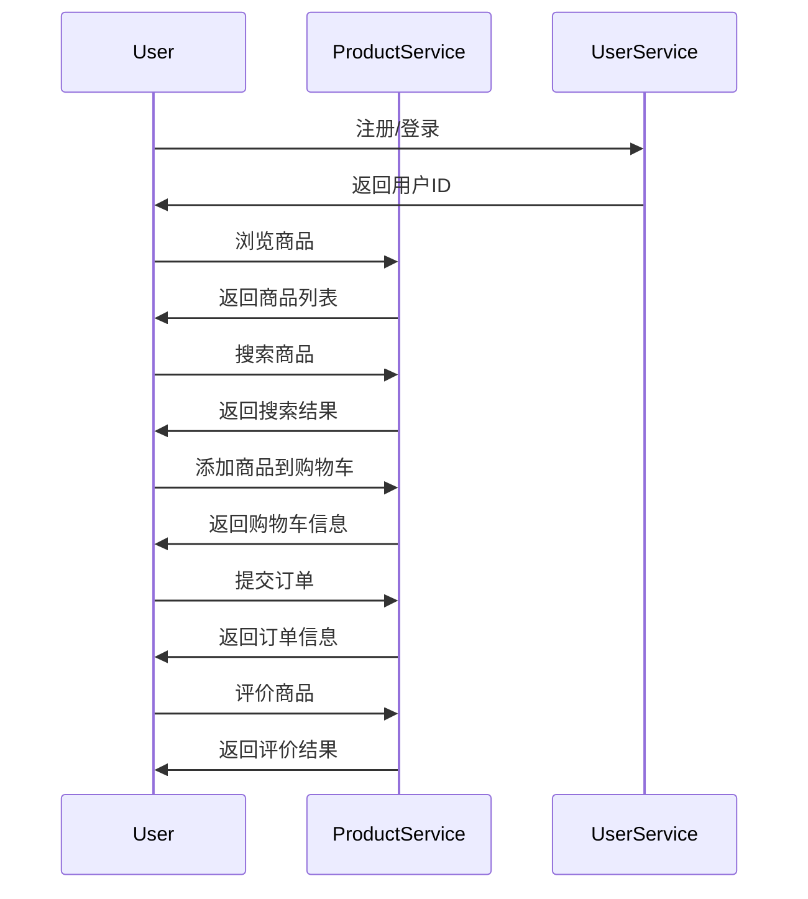
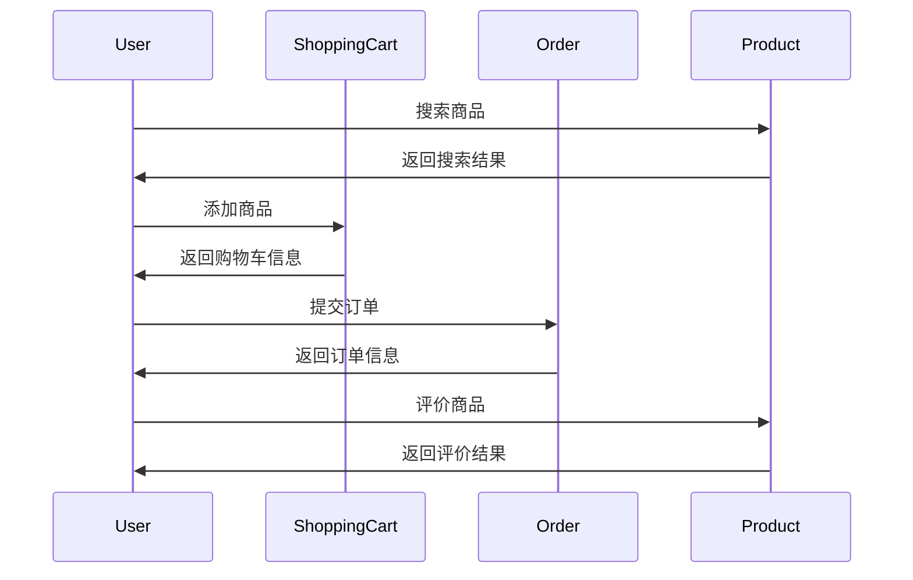

                 


### 第1章: 敏捷开发与用户体验设计概述

#### 1.1 敏捷开发概述

**背景介绍**

敏捷开发（Agile Development）是一种以用户需求为导向、迭代开发和持续交付的高效软件开发方法。其起源可以追溯到20世纪90年代末期，当时软件开发团队开始意识到传统的“瀑布模型”开发方法在应对快速变化的市场需求时存在明显不足。

**问题背景**

在传统的软件开发过程中，需求往往是固定的，项目一旦启动，需求就不能轻易更改。这种方法在实际应用中经常导致项目延期、预算超支以及软件质量低下。为了解决这些问题，敏捷开发提出了新的开发理念和流程。

**问题描述**

敏捷开发旨在通过以下方式解决软件开发中存在的问题：
1. **快速响应变化**：敏捷开发强调在项目过程中快速响应需求变化，通过迭代开发和持续交付来保证项目的灵活性和适应性。
2. **团队协作**：敏捷开发鼓励团队成员之间的密切协作，通过每日站会、冲刺回顾等方式促进沟通和知识共享。
3. **持续集成**：敏捷开发强调持续集成和测试，通过频繁的小规模交付来减少错误和风险。

**问题解决**

敏捷开发的核心原则如下：
1. **个体和互动重于流程和工具**：敏捷开发强调人与人之间的互动和沟通，认为这是提高项目效率和质量的关键。
2. **可工作的软件重于详尽的文档**：敏捷开发认为可工作的软件是项目成果的最佳体现，因此文档应该简洁明了，而不是繁琐冗长。
3. **客户协作重于合同谈判**：敏捷开发强调与客户的紧密合作，通过定期的客户反馈来不断优化产品。
4. **响应变化重于遵循计划**：敏捷开发认为在开发过程中需求会不断变化，因此更注重灵活应对变化，而不是严格按照计划执行。

**边界与外延**

敏捷开发不仅适用于软件开发，还可以应用于其他类型的开发项目，如网站设计、移动应用开发等。同时，不同的敏捷方法（如Scrum、Kanban、XP等）在具体实践中有一定的差异，但都遵循敏捷的核心原则。

**概念结构与核心要素组成**

敏捷开发的核心要素包括：
1. **团队**：敏捷开发强调团队的重要性，通过自组织、跨职能团队来提高项目的效率和效果。
2. **迭代**：敏捷开发采用迭代的方式开展工作，每个迭代周期通常为2-4周。
3. **用户故事**：用户故事是敏捷开发中的需求表达方式，它以用户为中心，描述用户期望的功能。
4. **看板**：看板是敏捷开发中用于可视化工作流程和管理任务的工具。

**核心概念与联系**

敏捷开发的核心概念包括：
1. **Scrum**：一种流行的敏捷方法，包括冲刺（Sprint）、产品待办列表（Product Backlog）、冲刺待办列表（Sprint Backlog）等概念。
2. **Kanban**：另一种流行的敏捷方法，通过看板来管理工作流程，强调持续交付和改进。

**核心概念属性特征对比表格**

| 特征       | Scrum                     | Kanban                      |
| ---------- | ------------------------- | --------------------------- |
| 流程管理   | 固定迭代周期（冲刺）     | 流动性、持续交付           |
| 任务管理   | 看板                      | 看板                        |
| 团队协作   | 自组织、固定角色         | 自组织、角色可变           |
| 用户故事   | 主要需求表达方式         | 主要需求表达方式           |

**ER实体关系图架构**

```mermaid
erDiagram
    Product |<--| UserStory : "属于"
    Sprint  |--| Task : "属于"
    Team     |--| Member : "成员"
```

**算法原理讲解**

敏捷开发中的关键算法包括：
1. **用户故事排序**：根据用户价值和风险对用户故事进行排序，以确定开发优先级。
2. **迭代规划**：根据产品待办列表和团队能力，规划每个迭代要完成的工作。

```python
# 用户故事排序算法示例
user_stories = [
    {'name': '故事A', 'value': 3, 'risk': 2},
    {'name': '故事B', 'value': 4, 'risk': 1},
    {'name': '故事C', 'value': 2, 'risk': 3},
]

# 根据价值-风险矩阵排序
sorted_stories = sorted(user_stories, key=lambda x: (x['value'] - x['risk']), reverse=True)

print(sorted_stories)
```

**系统分析与架构设计方案**

**问题场景介绍**

假设我们正在开发一个在线教育平台，需要设计一个用户友好的学习管理系统。

**项目介绍**

- 项目名称：Online Learning Management System (OLMS)
- 项目目标：提供用户友好的学习环境，满足学员的学习需求。

**系统功能设计**

- 用户注册与登录
- 课程浏览与选择
- 学习进度跟踪
- 测试与评估
- 学习资源管理

**系统架构设计**



**系统接口设计**



**系统交互**



**项目实战**

**环境安装**

- 安装Python环境
- 安装Django框架

```bash
pip install django
```

**系统核心实现源代码**

```python
# users/models.py
from django.db import models
from django.contrib.auth.models import AbstractUser

class User(AbstractUser):
    is_student = models.BooleanField(default=False)
    is_teacher = models.BooleanField(default=False)

# courses/models.py
class Course(models.Model):
    name = models.CharField(max_length=100)
    description = models.TextField()

# courses/views.py
from django.shortcuts import render
from .models import Course

def course_list(request):
    courses = Course.objects.all()
    return render(request, 'course_list.html', {'courses': courses})
```

**代码应用解读与分析**

- 用户模型：定义了用户的基本信息，包括学生和教师角色。
- 课程模型：定义了课程的基本信息，如课程名称和描述。
- 视图：实现了课程列表的展示功能。

**实际案例分析和详细讲解剖析**

- **案例**：一个学生用户想要浏览和选择课程。
- **分析**：用户通过浏览器访问OLMS，提交登录请求，系统验证用户身份后，返回用户ID。用户再次请求课程列表，系统从数据库中获取所有课程信息，并返回给用户。

**项目小结**

本案例展示了敏捷开发在在线教育平台中的应用。通过用户故事排序和迭代开发，我们能够快速响应用户需求，提供高质量的在线学习管理系统。

#### 1.1.3 敏捷开发的特点

**快速迭代**：敏捷开发强调快速迭代，通常每个迭代周期为2-4周。这种方式有助于及时发现和解决问题，提高项目进度和质量。

**用户参与**：敏捷开发鼓励用户在整个开发过程中参与，通过用户故事、每日站会和冲刺回顾等方式，确保开发团队能够准确理解用户需求。

**团队协作**：敏捷开发强调团队成员之间的紧密协作，通过自组织团队和跨职能团队来提高项目的效率和效果。

**持续交付**：敏捷开发通过持续交付，确保项目的每个迭代都能交付一个可工作的产品版本，从而提高用户的满意度。

**适应性**：敏捷开发能够快速适应需求变化，通过迭代和用户反馈，不断优化产品。

**1.1.4 敏捷开发的历史与发展**

敏捷开发起源于20世纪90年代的软件开发领域。最早的一批敏捷方法包括XP（极限编程）、Scrum和Feature-Driven Development（FDD）等。这些方法都强调快速响应变化、用户参与和团队协作。

2001年，敏捷开发联盟发布了《敏捷宣言》，标志着敏捷开发进入了一个新的阶段。此后，更多的敏捷方法和技术工具不断涌现，如Kanban、Lean、DevOps等。

随着时间的推移，敏捷开发已经从单纯的软件开发方法，发展成为一个涵盖产品管理、项目管理、软件架构等多个领域的综合方法论。

#### 1.1.5 敏捷开发的适用场景

**复杂项目**：敏捷开发适用于需求变化频繁、项目复杂度较高的项目。通过迭代开发和持续交付，敏捷开发能够快速适应变化，提高项目成功率。

**小团队**：敏捷开发鼓励小团队协作，适合规模较小的团队。小团队能够更好地实现自组织和快速响应变化。

**跨职能团队**：敏捷开发强调跨职能团队的合作，适合涉及多个领域和角色的项目。通过团队成员之间的密切协作，可以提高项目的效率和效果。

**技术驱动项目**：敏捷开发适用于技术驱动型的项目，如软件开发、网站设计等。通过用户参与和技术实践，敏捷开发能够更好地满足用户需求。

#### 1.1.6 敏捷开发的优势与挑战

**优势**：

1. **快速响应变化**：敏捷开发能够快速适应需求变化，提高项目的灵活性和适应性。
2. **用户参与**：用户在整个开发过程中参与，确保开发团队能够准确理解用户需求，提高用户满意度。
3. **团队协作**：敏捷开发强调团队协作，通过自组织团队和跨职能团队，提高项目的效率和效果。
4. **持续交付**：通过持续交付，确保每个迭代都能交付一个可工作的产品版本，提高项目的稳定性。

**挑战**：

1. **项目管理复杂度**：敏捷开发对项目管理的要求较高，需要团队具备一定的敏捷实践能力。
2. **团队协作难度**：敏捷开发强调团队协作，但跨职能团队的协作可能面临沟通和协调的难题。
3. **质量保障**：敏捷开发强调快速迭代，可能导致质量保障的难度增加。
4. **资源分配**：在资源有限的情况下，如何合理分配资源，确保项目按时交付，是一个挑战。

### 1.2 用户体验设计（UX Design）概述

**背景介绍**

用户体验设计（User eXperience Design，简称UX Design）是一种以用户为中心的设计方法，旨在通过研究用户需求和行为，设计出用户喜欢并愿意使用的产品。随着互联网和数字产品的普及，用户体验设计逐渐成为软件开发的重要组成部分。

**问题背景**

在过去，许多软件产品在设计过程中忽视了用户的需求和体验，导致用户在使用过程中感到困惑和不适。这种不良的用户体验不仅降低了用户满意度，还可能导致产品的失败。

**问题描述**

用户体验设计旨在解决以下问题：

1. **用户需求识别**：通过研究用户需求和行为，识别用户的核心需求，为产品设计提供指导。
2. **用户体验优化**：通过设计用户界面、交互流程和功能，优化用户的操作体验，提高用户满意度。
3. **用户反馈收集**：通过用户反馈，持续改进产品设计，确保产品能够满足用户的需求。

**问题解决**

用户体验设计采用以下方法和工具来解决上述问题：

1. **用户研究**：通过访谈、问卷调查、用户测试等方法，深入了解用户的需求和痛点。
2. **设计思维**：采用设计思维方法，从用户的角度出发，设计出符合用户需求的产品。
3. **原型设计**：通过原型设计，快速迭代和测试设计方案，确保产品设计符合用户期望。
4. **用户测试**：通过用户测试，验证产品设计是否满足用户需求，收集用户反馈，指导后续设计改进。

**边界与外延**

用户体验设计不仅适用于软件产品，还可以应用于网站、移动应用、硬件产品等。在不同的应用场景中，用户体验设计的核心目标是一致的，即提供优质的用户体验。

**概念结构与核心要素组成**

用户体验设计包括以下核心要素：

1. **用户研究**：了解用户需求和行为，为产品设计提供依据。
2. **设计思维**：采用创新思维，设计出符合用户期望的产品。
3. **原型设计**：通过原型设计，快速验证和优化设计方案。
4. **用户测试**：通过用户测试，确保产品设计满足用户需求。

**核心概念与联系**

用户体验设计的关键概念包括：

1. **用户研究**：用户研究是用户体验设计的起点，通过了解用户的需求和行为，为产品设计提供指导。
2. **设计思维**：设计思维是一种创新方法，通过用户视角，从问题出发，设计出满足用户需求的产品。
3. **原型设计**：原型设计是用户体验设计的重要工具，通过快速迭代和测试，优化产品设计。
4. **用户测试**：用户测试是验证和优化产品设计的关键步骤，通过收集用户反馈，确保产品设计满足用户需求。

**核心概念属性特征对比表格**

| 特征           | 用户研究                      | 设计思维                      | 原型设计                      | 用户测试                      |
| -------------- | ----------------------------- | ----------------------------- | ----------------------------- | ----------------------------- |
| 目的           | 了解用户需求和行为           | 解决用户问题，创造新价值      | 快速验证和优化设计方案         | 确保产品设计满足用户需求       |
| 方法           | 访谈、问卷调查、用户测试等   | 研究用户需求、问题导向思考   | 线框图、高保真原型等         | 用户反馈、行为分析等         |
| 工具           | 用户访谈、问卷调查软件等     | 设计草图、思维导图等         | 原型设计软件等               | 用户测试工具、数据分析工具等 |

**ER实体关系图架构**

```mermaid
erDiagram
    User |<--| UserResearch : "参与"
    Product |<--| DesignThinking : "设计"
    Prototype |<--| DesignThinking : "原型"
    UserTesting |<--| DesignThinking : "测试"
```

**算法原理讲解**

用户体验设计中的关键算法包括：

1. **用户故事地图**：通过用户故事地图，将用户的需求和问题可视化，帮助团队理解用户需求。
2. **用户体验测量**：通过用户体验测量，评估用户对产品的满意度和使用体验。

```python
# 用户故事地图示例
user_stories = [
    {'title': '用户A需要搜索课程', 'description': '用户A希望通过搜索功能找到感兴趣的课程'},
    {'title': '用户B需要浏览课程详情', 'description': '用户B希望在浏览课程详情时获得完整的信息'},
]

# 打印用户故事地图
for story in user_stories:
    print(f"{story['title']}: {story['description']}")
```

**系统分析与架构设计方案**

**问题场景介绍**

假设我们正在设计一个在线购物平台，需要为用户提供一个良好的购物体验。

**项目介绍**

- 项目名称：Online Shopping Platform (OSP)
- 项目目标：提供一个简单、快捷、安全的购物环境。

**系统功能设计**

- 用户注册与登录
- 商品浏览与搜索
- 购物车功能
- 订单管理
- 用户评价与反馈

**系统架构设计**



**系统接口设计**



**系统交互**



**项目实战**

**环境安装**

- 安装Python环境
- 安装Flask框架

```bash
pip install flask
```

**系统核心实现源代码**

```python
# user.py
from flask import Flask, jsonify, request

app = Flask(__name__)

@app.route('/register', methods=['POST'])
def register():
    user_data = request.get_json()
    # 处理用户注册逻辑
    return jsonify({"status": "success", "user_id": user_data["user_id"]})

@app.route('/login', methods=['POST'])
def login():
    user_data = request.get_json()
    # 处理用户登录逻辑
    return jsonify({"status": "success", "user_id": user_data["user_id"]})

@app.route('/search_products', methods=['GET'])
def search_products():
    # 搜索商品逻辑
    return jsonify({"products": ["商品1", "商品2", "商品3"]})

if __name__ == '__main__':
    app.run(debug=True)
```

**代码应用解读与分析**

- 用户注册与登录：接收用户注册和登录的请求，处理用户信息，返回用户ID。
- 商品搜索：接收用户搜索请求，返回搜索结果。

**实际案例分析和详细讲解剖析**

- **案例**：一个用户想要在在线购物平台搜索商品。
- **分析**：用户通过浏览器访问平台，发送搜索请求。平台处理请求后，返回搜索结果。

**项目小结**

本案例展示了用户体验设计在在线购物平台中的应用。通过用户研究、设计思维和用户测试，我们能够设计出符合用户需求的产品，提高用户满意度。

### 1.3 敏捷开发与用户体验设计的关系

**关系概述**

敏捷开发与用户体验设计（UX Design）在软件开发过程中相辅相成，共同提升产品的质量和用户体验。敏捷开发通过迭代开发和快速响应变化，确保产品在开发过程中能够及时调整以符合用户需求；而用户体验设计则通过研究用户行为和需求，为产品设计提供指导，确保产品能够满足用户的期望。

**敏捷开发对用户体验设计的影响**

1. **迭代开发**：敏捷开发的迭代开发模式允许用户体验设计师在每个迭代中收集用户反馈，根据用户反馈进行调整，从而优化产品设计。
2. **快速响应**：敏捷开发强调快速响应变化，用户体验设计师可以根据这些变化快速调整设计，确保产品始终符合用户需求。
3. **用户参与**：敏捷开发鼓励用户在整个开发过程中参与，用户体验设计师可以通过用户参与更好地了解用户需求，从而设计出更符合用户期望的产品。

**用户体验设计对敏捷开发的影响**

1. **设计指导**：用户体验设计为敏捷开发提供了设计指导，确保产品在功能实现的同时，也能够提供优质的用户体验。
2. **需求识别**：用户体验设计通过研究用户需求和行为，帮助敏捷团队更好地理解用户需求，确保开发过程能够快速响应用户需求。
3. **反馈循环**：用户体验设计强调用户反馈的重要性，通过用户测试和反馈，敏捷团队可以及时了解产品的优缺点，不断优化产品。

**案例分析与总结**

以在线教育平台为例，敏捷开发与用户体验设计的结合能够显著提高产品的质量和用户体验。在敏捷开发的迭代过程中，用户体验设计师通过用户故事地图和用户测试，识别用户的需求和痛点，设计出符合用户期望的用户界面和交互流程。通过每次迭代后的用户反馈，设计师能够不断优化产品设计，确保平台在功能完善的同时，也提供了良好的用户体验。

总结而言，敏捷开发与用户体验设计的结合，不仅能够提高软件开发的效率和质量，还能够确保产品在功能和用户体验上都能够满足用户的需求。通过迭代开发和用户反馈，敏捷开发与用户体验设计共同推动了产品的持续优化，为用户提供了优质的使用体验。

## 第2章: UX 设计在 Agile 项目中的角色和过程

### 2.1 UX 设计在 Agile 项目中的角色

**角色概述**

在 Agile 项目中，用户体验设计师扮演着关键角色，他们的职责不仅包括设计用户界面和交互流程，还涉及用户研究、原型设计和用户测试等方面。用户体验设计师的目标是确保产品在功能完善的同时，能够提供出色的用户体验。

**核心职责**

1. **用户研究**：用户体验设计师需要通过访谈、问卷调查、用户测试等方法，深入了解用户需求和行为，为产品设计提供依据。
2. **原型设计**：设计师需要设计线框图、高保真原型等，以可视化产品功能和使用流程，为开发团队提供清晰的设计指导。
3. **用户测试**：通过用户测试，设计师可以验证产品设计是否符合用户期望，收集用户反馈，指导后续设计优化。
4. **协作与沟通**：用户体验设计师需要与产品经理、开发团队和测试团队密切协作，确保设计需求能够顺利实现。

**角色重要性**

用户体验设计师在 Agile 项目中的重要性体现在以下几个方面：

1. **用户需求的识别与传递**：用户体验设计师通过用户研究，准确识别用户需求，并将这些需求转化为具体的设计要求，传递给开发团队。
2. **设计与开发的协同**：用户体验设计师与开发团队的紧密合作，确保设计需求在开发过程中能够得到有效实施。
3. **质量保障**：通过用户测试和反馈，用户体验设计师能够及时发现和解决问题，确保产品设计质量。
4. **用户满意度**：用户体验设计师通过优化产品设计，提高用户满意度，从而增强产品的市场竞争力和用户忠诚度。

### 2.2 UX 设计流程在 Agile 项目的应用

**流程概述**

在 Agile 项目中，用户体验设计流程与传统的设计流程有所不同，它更加灵活、迭代和以用户为中心。以下是一个典型的 UX 设计流程在 Agile 项目中的应用：

1. **用户研究**：通过访谈、问卷调查、用户测试等方法，深入了解用户需求和行为，收集用户反馈。
2. **需求分析**：根据用户研究的结果，分析用户需求，确定设计目标和优先级。
3. **原型设计**：设计线框图、高保真原型等，可视化产品功能和使用流程，为开发团队提供设计指导。
4. **用户测试**：通过用户测试，验证产品设计是否符合用户期望，收集用户反馈，指导后续设计优化。
5. **迭代与优化**：根据用户反馈和测试结果，对设计进行迭代和优化，确保产品设计质量。

**具体应用**

**案例1：在线教育平台**

1. **用户研究**：用户体验设计师通过访谈在线教育平台的现有用户，了解他们在使用过程中遇到的困难和需求。
2. **需求分析**：根据用户研究的结果，用户体验设计师确定了优化课程浏览、学习进度跟踪和学习资源管理等功能的需求。
3. **原型设计**：设计师设计了一系列线框图和高保真原型，展示了课程浏览、学习进度跟踪和学习资源管理等新功能的实现方式。
4. **用户测试**：用户体验设计师邀请了一组目标用户进行测试，收集了他们对新功能的反馈。
5. **迭代与优化**：根据用户反馈，设计师对原型进行了迭代和优化，确保新功能能够满足用户需求。

**案例2：在线购物平台**

1. **用户研究**：用户体验设计师通过问卷调查和用户测试，了解了用户在购物过程中对商品搜索、购物车管理和订单提交等方面的需求。
2. **需求分析**：设计师分析了用户反馈，确定了优化商品搜索、购物车管理和订单提交流程的需求。
3. **原型设计**：设计师设计了一系列线框图和高保真原型，展示了商品搜索、购物车管理和订单提交流程的改进方案。
4. **用户测试**：用户体验设计师邀请了一组用户进行测试，收集了他们对新功能的反馈。
5. **迭代与优化**：根据用户反馈，设计师对原型进行了迭代和优化，确保新功能能够提高用户满意度。

**流程优势**

1. **快速响应**：通过迭代和用户测试，用户体验设计流程能够快速响应用户需求，确保产品设计始终保持符合用户期望。
2. **用户参与**：用户体验设计流程强调用户参与，通过用户测试和反馈，设计师能够更好地了解用户需求，提高设计质量。
3. **协作与沟通**：用户体验设计流程鼓励设计师与开发团队、产品经理和测试团队的密切合作，确保设计需求得到有效实施。

### 2.3 UX 设计在 Agile 项目的挑战与应对策略

**挑战1：时间压力**

**应对策略**：

1. **优先级管理**：用户体验设计师需要根据项目进度和用户需求，合理规划设计任务，确保关键功能的设计和质量。
2. **敏捷工具应用**：利用敏捷工具（如JIRA、Trello等）进行任务管理，确保设计任务能够按时完成。

**挑战2：用户需求变化**

**应对策略**：

1. **用户参与**：通过定期的用户访谈和用户测试，及时了解用户需求的变化，确保设计能够快速适应这些变化。
2. **迭代开发**：采用迭代开发模式，快速调整设计，以适应不断变化的需求。

**挑战3：团队协作**

**应对策略**：

1. **沟通渠道**：建立有效的沟通渠道，如每日站会、冲刺回顾等，确保团队成员之间的信息传递和协作。
2. **协作工具**：使用协作工具（如Slack、Trello等），提高团队协作效率。

**挑战4：资源分配**

**应对策略**：

1. **资源规划**：合理分配设计资源，确保设计团队有足够的时间和人力完成设计任务。
2. **优先级调整**：根据项目进度和资源情况，及时调整设计任务的优先级，确保关键任务能够按时完成。

### 2.4 UX 设计最佳实践与总结

**最佳实践**

1. **用户研究**：深入了解用户需求和行为，确保设计符合用户期望。
2. **原型设计**：快速制作原型，通过用户测试验证设计可行性。
3. **迭代开发**：采用迭代模式，持续优化产品设计。
4. **团队协作**：与开发团队、产品经理和测试团队紧密合作，确保设计需求得到有效实施。
5. **用户反馈**：及时收集用户反馈，指导后续设计优化。

**总结**

用户体验设计在 Agile 项目中扮演着至关重要的角色。通过用户研究、原型设计和用户测试，设计师能够确保产品设计符合用户期望，提高用户满意度。同时，用户体验设计还需要面对时间压力、用户需求变化、团队协作和资源分配等挑战。通过采用敏捷开发方法和最佳实践，用户体验设计师能够有效地应对这些挑战，提高项目的成功率和用户体验。

## 第3章: 以用户为中心的设计与 Agile

### 3.1 用户为中心的设计原则

**用户为中心的设计（User-Centered Design，简称UCD）**是一种设计方法，其核心原则是始终将用户的需求和体验放在首位。以下是用户为中心的设计原则：

**1. 用户需求优先**

用户需求是设计的起点，设计师需要通过用户研究了解用户的需求、期望和行为。只有真正理解用户，才能设计出符合用户期望的产品。

**2. 用户参与**

用户参与是确保设计符合用户需求的关键。通过用户访谈、用户测试、问卷调查等方式，设计师可以与用户直接交流，获取真实反馈，从而不断优化设计。

**3. 以数据驱动**

用户数据是设计的重要依据。通过分析用户行为数据，设计师可以了解用户的实际使用场景和痛点，从而进行有针对性的设计改进。

**4. 迭代与反馈**

迭代是用户为中心的设计的重要手段。通过快速迭代和用户测试，设计师可以不断收集用户反馈，并根据反馈进行优化，确保设计质量。

**5. 可访问性**

设计应考虑所有用户，包括有特殊需求的用户。可访问性设计确保产品能够被所有人使用，提升用户体验。

### 3.2 用户画像与用户旅程地图

**用户画像（User Persona）**

用户画像是基于用户研究和数据分析创建的虚拟用户代表，用于描述目标用户群体的特征和行为。用户画像可以帮助设计师了解目标用户的需求、偏好和行为模式，从而设计出更符合用户期望的产品。

**用户旅程地图（User Journey Map）**

用户旅程地图是一种视觉化的工具，用于描述用户在使用产品过程中的每一个步骤和体验。它帮助设计师从用户的角度思考产品设计和用户交互，识别用户体验中的关键节点和痛点。

**创建用户画像**

1. **数据收集**：通过用户调研、数据分析等方式收集用户信息。
2. **数据分析**：分析用户数据，识别用户群体的共同特征和行为模式。
3. **用户画像构建**：根据数据分析结果，创建一个或多个用户画像，描述目标用户群体的特征和行为。

**创建用户旅程地图**

1. **用户研究**：通过用户访谈、用户测试等方式了解用户的使用行为和体验。
2. **信息整理**：整理用户研究收集的信息，包括用户行为、情感和痛点。
3. **绘制地图**：将用户行为和体验可视化，创建用户旅程地图，展示用户在不同阶段的使用过程。

### 3.3 用户体验测量与反馈循环

**用户体验测量（User Experience Measurement）**

用户体验测量是评估用户在使用产品过程中的满意度、效率和情感反应的方法。通过用户体验测量，设计师可以识别用户体验中的问题和机会，从而进行改进。

**反馈循环（Feedback Loop）**

反馈循环是一种持续改进的过程，通过用户反馈、用户测试和数据分析，设计师可以不断优化产品设计。

**用户体验测量方法**

1. **问卷调查**：通过问卷调查收集用户的满意度和反馈。
2. **用户测试**：通过用户测试评估用户在使用产品过程中的操作效率、满意度和情感反应。
3. **行为分析**：通过用户行为数据分析，了解用户的实际使用情况和行为模式。

**反馈循环步骤**

1. **收集反馈**：通过问卷调查、用户测试和行为分析等方法收集用户反馈。
2. **分析反馈**：分析用户反馈，识别用户体验中的问题和机会。
3. **设计改进**：根据分析结果进行设计改进，优化用户体验。
4. **再次测量**：通过用户测试和行为分析验证设计改进的效果，确保用户体验得到提升。

### 3.4 以用户为中心的设计在 Agile 项目的应用

**用户需求识别**

1. **用户访谈**：与目标用户进行深入访谈，了解他们的需求和期望。
2. **问卷调查**：通过问卷调查收集用户需求和信息。
3. **数据分析**：分析用户行为数据，识别用户需求。

**原型设计**

1. **线框图**：制作线框图，初步展示产品功能和布局。
2. **高保真原型**：根据线框图，制作高保真原型，展示产品的外观和交互设计。
3. **用户测试**：邀请用户测试原型，收集反馈。

**迭代开发**

1. **用户反馈**：收集用户测试反馈，分析用户体验中的问题和机会。
2. **设计改进**：根据用户反馈，对设计进行改进。
3. **再次测试**：进行新一轮的用户测试，验证设计改进的效果。

**协作与沟通**

1. **每日站会**：与开发团队、产品经理和测试团队进行每日站会，确保信息传递和协作。
2. **冲刺回顾**：在每个迭代结束后，进行冲刺回顾，总结经验和教训，持续改进设计流程。

**应用案例**

以在线教育平台为例，用户体验设计师通过用户访谈、问卷调查和数据分析，了解用户对课程搜索、学习进度跟踪和学习资源管理的需求。设计师制作了线框图和高保真原型，邀请用户测试，收集反馈。根据用户反馈，设计师对设计进行了改进，包括优化课程搜索界面、添加学习进度跟踪功能等。通过迭代开发和用户反馈，设计师最终设计出符合用户期望的产品，提高了用户满意度。

**总结**

以用户为中心的设计是 Agile 项目中不可或缺的一部分。通过用户需求识别、原型设计、迭代开发和用户反馈，设计师可以不断优化产品设计，确保产品能够满足用户的需求和期望。用户体验测量和反馈循环则帮助设计师识别问题和机会，推动设计改进，提高用户体验。以用户为中心的设计不仅提升了产品的质量和用户满意度，也为 Agile 项目带来了更高的成功率和市场竞争力。在未来的软件开发中，以用户为中心的设计将继续发挥重要作用，推动产品的不断优化和升级。

