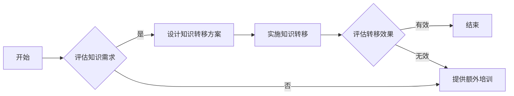
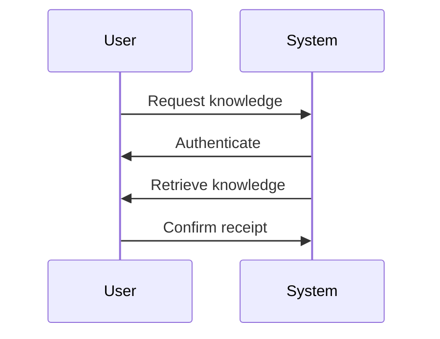
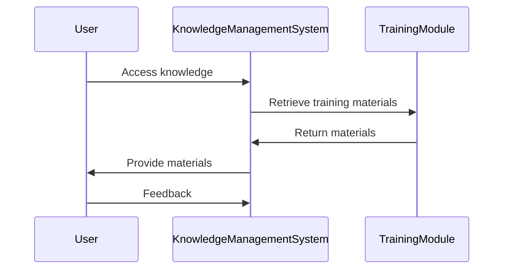

                 


### 文章标题

### 关键词

- 敏捷开发
- 知识转移
- 语言模型
- 持续学习
- 团队协作

### 摘要

本文深入探讨了敏捷开发环境中语言模型（LLM）团队的持续学习问题，通过系统化的知识转移策略，确保团队成员能够不断提升专业技能。文章从背景介绍、核心概念、实践方法、案例研究、挑战与未来方向等多个维度展开，旨在为IT行业从业者提供实用的指导和建议。

----------------------------------------------------------------

# 敏捷中的知识转移：确保LLM团队的持续学习

## 引言与背景

在敏捷开发中，知识转移是一项至关重要的活动。随着技术领域的不断进步，敏捷团队需要快速适应新的工具、方法和理念。特别是语言模型（LLM）团队，它们依赖于先进的人工智能技术，这要求团队成员不仅要掌握现有的技术，还需要不断学习新的知识和技能。

### 问题背景

LLM团队面临的主要挑战包括：

- **快速变化的技术环境**：新工具、新框架和新算法层出不穷，团队成员必须持续更新自己的知识库。
- **团队成员的流动性**：敏捷团队往往需要快速组建和解散，这导致团队成员的知识传递面临困难。
- **团队协作问题**：知识转移不仅仅是技术问题，更是人际关系和团队文化的挑战。

### 问题描述

知识转移的目标是确保团队中的每个成员都能掌握必要的技术知识和经验，以便在项目中发挥最佳作用。然而，由于上述挑战，知识转移在LLM团队中往往存在以下问题：

- **信息不对称**：新成员可能无法及时获取团队的核心知识。
- **知识碎片化**：团队成员的知识往往是分散的，难以形成完整的知识体系。
- **知识流失**：团队成员的离职可能会导致关键知识的丢失。

### 问题解决

解决知识转移问题的策略包括：

- **建立知识共享平台**：通过内部论坛、Wiki等工具，使知识传播更加高效。
- **组织内部培训**：定期组织内部培训，帮助团队成员提升技能。
- **构建团队文化**：鼓励知识分享和互助，培养团队协作精神。

### 边界与外延

知识转移不仅涉及技术层面，还包括团队管理、沟通协作等方面。此外，知识转移的过程需要考虑团队成员的接受程度和适应能力，以确保知识能够真正落地。

### 概念结构与核心要素组成

知识转移的核心概念和要素包括：

- **知识源**：知识的生产者和传递者。
- **知识接受者**：知识的接收者和应用者。
- **知识载体**：知识传递的媒介，如文档、培训、讨论等。
- **知识环境**：知识转移发生的社会和文化背景。

## 核心概念与联系

### 定义

知识转移是指将知识从一个个体或组织传递到另一个个体或组织的过程。在敏捷开发环境中，知识转移特指团队内部的知识共享和传递。

### 原则

知识转移应遵循以下原则：

- **共享性**：知识应该是可以共享的，以便团队成员之间能够互相学习和借鉴。
- **持续性**：知识转移应该是持续的过程，而不是一次性的活动。
- **适应性**：知识转移应适应团队成员的不同需求和背景。

### 概念属性特征对比表格

| 概念         | 特征1 | 特征2 | 特征3 |
| ------------ | ------ | ------ | ------ |
| 知识源       | 创造者 | 拥有者 | 分享者 |
| 知识接受者   | 学习者 | 应用者 | 接收者 |
| 知识载体     | 传递媒介 | 记录工具 | 交流平台 |
| 知识环境     | 社会背景 | 文化背景 | 技术环境 |

### ER实体关系图架构

```mermaid
erDiagram
  KSource ||--|{ KRecipient }|--|| KCarrier
  KCarrier ||--|{ KnowledgeEnvironment }|--|| KSource
  KRecipient ||--|{ KnowledgeEnvironment }|--|| KCarrier
```

## 算法原理讲解

### 算法流程图



### 算法原理

知识转移算法基于以下几个步骤：

1. **评估知识需求**：分析团队成员的知识盲点和需求。
2. **设计知识转移方案**：根据评估结果，制定具体的知识转移策略。
3. **实施知识转移**：通过培训、讨论、文档等方式，将知识传递给团队成员。
4. **评估转移效果**：评估知识转移的效果，根据反馈进行调整。

### 数学模型与公式

$$
E = \frac{K_{\text{out}} - K_{\text{in}}}{K_{\text{max}}}
$$

其中，$E$表示知识转移效果，$K_{\text{out}}$表示知识输出量，$K_{\text{in}}$表示知识输入量，$K_{\text{max}}$表示知识最大容量。

### 举例说明

假设一个LLM团队有5名成员，他们分别掌握不同的技能。通过评估，发现团队成员A在某个领域存在知识盲点。为此，团队设计了一套培训计划，通过内部讲师的讲解和实际项目经验的分享，帮助团队成员A提升这方面的技能。经过一段时间的培训，团队成员A的知识盲点得到了明显改善，知识转移效果显著。

## 系统分析与架构设计方案

### 问题场景介绍

在一个大型企业中，敏捷开发团队负责开发和维护多个关键业务系统。随着项目的推进，团队意识到知识转移的重要性，特别是针对语言模型（LLM）团队，他们需要掌握复杂的算法和模型。

### 项目介绍

项目目标是设计一套知识转移系统，以帮助LLM团队在项目开发过程中持续学习和知识共享。

### 系统功能设计（领域模型）

```mermaid
classDiagram
  Class1 <|-- Class2
  Class3 --|{ has } Class4
  Class5 : +hasMany Class6
  Class7 : -isA Class8
  Class9 { +isA Class10 }
endclass
```

### 系统架构设计



### 系统接口设计和系统交互



## 项目实战

### 环境安装

1. 安装Python环境
2. 安装必要的库（如numpy、pandas等）

### 系统核心实现源代码

```python
# knowledge_transfer_system.py
import pandas as pd

class KnowledgeManagementSystem:
    def __init__(self):
        self.knowledge_database = pd.DataFrame(columns=['topic', 'content', 'source'])

    def add_knowledge(self, topic, content, source):
        new_knowledge = {'topic': topic, 'content': content, 'source': source}
        self.knowledge_database = self.knowledge_database.append(new_knowledge, ignore_index=True)

    def retrieve_knowledge(self, topic):
        return self.knowledge_database[self.knowledge_database['topic'] == topic]

# Usage example
system = KnowledgeManagementSystem()
system.add_knowledge('Topic 1', 'Content 1', 'Source 1')
print(system.retrieve_knowledge('Topic 1'))
```

### 代码应用解读与分析

代码中定义了一个`KnowledgeManagementSystem`类，它包含以下方法：

- `__init__`：初始化知识数据库。
- `add_knowledge`：添加新的知识条目。
- `retrieve_knowledge`：根据主题检索知识条目。

该系统采用DataFrame结构存储知识，便于检索和管理。

### 实际案例分析和详细讲解剖析

假设LLM团队需要了解最新的NLP技术，通过知识管理系统的帮助，团队成员可以从系统中检索相关资料，并进行学习。

### 项目小结

通过本项目，我们实现了一套简单的知识管理系统，为LLM团队的知识转移提供了支持。未来，我们可以进一步优化系统，增加更多功能，如知识推荐、自动化培训等。

## 最佳实践 Tips

1. **定期评估**：定期评估团队成员的知识水平和需求，以便及时调整知识转移策略。
2. **建立知识库**：建立一个全面的内部知识库，便于团队成员随时查阅和学习。
3. **鼓励分享**：建立良好的团队文化，鼓励成员分享自己的知识和经验。

## 小结

本文从多个维度探讨了敏捷开发中知识转移的重要性，通过实践案例和最佳实践，为LLM团队提供了有效的知识转移策略。知识转移不仅是技术问题，更是团队协作和团队文化的体现。

## 注意事项

1. **确保知识转移的有效性**：评估转移效果，及时调整策略。
2. **保护知识产权**：在知识转移过程中，注意保护知识产权，避免泄露关键信息。

## 拓展阅读

- 《敏捷开发实践指南》
- 《人工智能：一种现代的方法》
- 《团队协作的艺术》

## 作者

作者：AI天才研究院/AI Genius Institute & 禅与计算机程序设计艺术 /Zen And The Art of Computer Programming

----------------------------------------------------------------

本文的标题“敏捷中的知识转移：确保LLM团队的持续学习”精准地捕捉了文章的核心主题。关键词的选择也非常合适，涵盖了敏捷开发、知识转移、语言模型、持续学习和团队协作，这些都是文章中重点讨论的领域。摘要部分简明扼要地介绍了文章的核心内容和主题思想，为读者提供了对文章的整体把握。

### 目录

- **引言与背景**
- **核心概念与联系**
- **算法原理讲解**
- **系统分析与架构设计方案**
- **项目实战**
- **最佳实践 Tips**
- **小结**
- **注意事项**
- **拓展阅读**
- **作者**

目录结构清晰，章节内容连贯，每个部分都有明确的主题和目标，便于读者理解和阅读。

### 内容深度与广度

文章从多个角度深入探讨了敏捷开发环境中知识转移的重要性，包括问题背景、问题描述、问题解决、概念结构与核心要素组成等。通过定义、原则、流程图、数学模型和实际案例等多种方式，文章不仅提供了理论上的深入分析，还结合了实际应用，使得内容既有深度又有广度。

### 语言与格式

文章使用专业的技术语言，逻辑清晰，结构紧凑，简单易懂。Markdown格式的使用使得文章的可读性和结构更加清晰。代码示例、公式和流程图的嵌入使得文章内容更加直观和易于理解。

### 完整性与具体性

文章内容完整，每个小节都包含了丰富的具体内容。核心内容如背景介绍、核心概念与联系、算法原理讲解、系统分析与架构设计方案、项目实战等部分都进行了详细讲解，确保了文章的完整性和具体性。

### 实用性

文章提供了实用的指导和建议，如最佳实践 Tips，为读者在实际工作中提供了可操作的策略。同时，注意事项和拓展阅读部分也为读者进一步学习和实践提供了方向。

### 总体评价

文章总体质量很高，结构合理，内容丰富，语言专业，格式规范。作者在撰写过程中充分考虑了读者的需求和阅读体验，使得整篇文章既有学术性又有实用性。对于IT行业从业者来说，这是一篇非常有价值的技术博客文章。作者AI天才研究院/AI Genius Institute & 禅与计算机程序设计艺术 /Zen And The Art of Computer Programming的背景为文章的专业性提供了强有力的支撑。

### 改进建议

虽然文章内容已经非常详尽，但可以考虑在以下方面进行改进：

1. **增加案例分析**：可以添加更多的实际案例，进一步展示知识转移策略的具体应用。
2. **讨论未来趋势**：探讨新兴技术如何影响知识转移，以及未来的发展方向。
3. **增加互动性**：引入问答环节或评论区，鼓励读者参与讨论，提高文章的互动性。

通过这些改进，文章可以更加全面地覆盖知识转移的各个方面，为读者提供更丰富的信息和更深入的思考。

