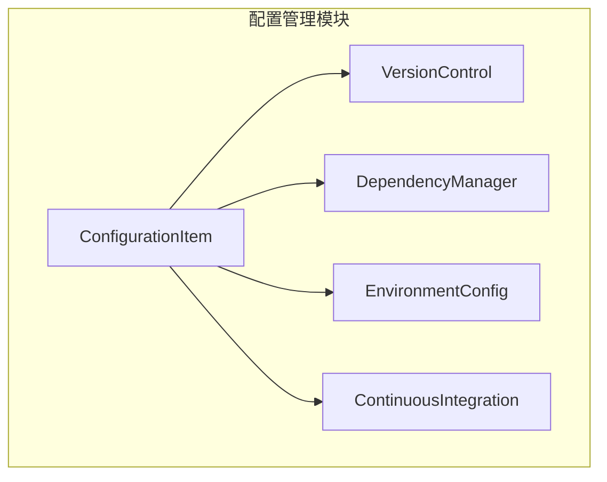
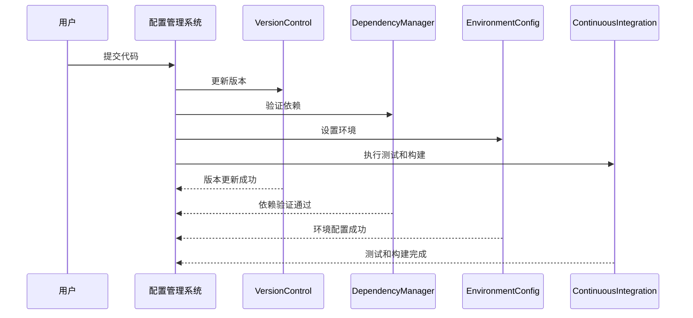

                 


### # 《敏捷中的配置管理：管理LLM应用的复杂依赖》

> 关键词：敏捷配置管理、复杂依赖、语言模型、LLM应用、算法、系统架构、最佳实践

> 摘要：本文旨在深入探讨敏捷开发中的配置管理，特别是在语言模型（LLM）应用的复杂依赖管理方面。我们将分析核心概念、算法原理、系统架构，并结合实际案例，提供最佳实践和未来研究方向。通过逐步分析和推理，本文旨在为读者提供清晰、易于理解的技术指导。

### 引言

随着敏捷开发方法的普及，现代软件开发越来越注重快速迭代和灵活响应变化。然而，在敏捷开发过程中，配置管理成为了一个不容忽视的挑战，尤其是在涉及复杂依赖的情况下，如语言模型（LLM）应用。配置管理不仅关乎代码的版本控制和变更管理，还涉及到软件环境、依赖库、数据集和硬件资源等多方面的综合管理。

本文旨在为开发者提供一套系统化的方法来管理敏捷开发中的配置管理问题，特别是针对LLM应用的复杂依赖。我们将从以下几个方面展开讨论：

1. **背景与核心概念**：介绍配置管理的背景，描述敏捷开发中的配置管理挑战，并阐述LLM应用中的特殊需求。
2. **核心概念与关系**：定义关键概念，使用ER图展示它们之间的关系。
3. **算法与数学模型**：探讨配置管理算法，使用Mermaid和Python代码示例进行详细讲解。
4. **系统分析与设计**：介绍系统架构，使用Mermaid图展示系统功能设计、架构和交互。
5. **项目实施与案例分析**：讨论实际项目实施，提供代码实现和案例分析。
6. **最佳实践与建议**：分享经验，提出注意事项和未来改进方向。
7. **总结与未来展望**：总结文章内容，展望未来的研究方向。

通过以上步骤，本文希望能够为敏捷开发中的配置管理问题提供有价值的见解和实用的解决方案。

### 背景与核心概念

在软件开发过程中，配置管理是一项至关重要的活动，它确保了软件产品在不同环境中的稳定性和一致性。配置管理不仅仅是代码版本控制的代名词，它还涉及到软件环境的设置、依赖库的版本、数据集的管理以及硬件资源的分配等多个方面。在敏捷开发环境中，配置管理的挑战尤为突出，这是因为敏捷方法强调快速迭代和持续交付，这要求配置管理系统能够灵活、高效地响应变化。

#### 配置管理的挑战

敏捷开发中的配置管理面临以下几大挑战：

1. **频繁的版本更新**：敏捷开发强调频繁的迭代和交付，这意味着配置管理需要能够快速适应版本更新的需求。
2. **环境多样性**：不同的开发、测试和生产环境可能需要不同的配置，这增加了配置管理的复杂度。
3. **依赖管理**：软件项目中的依赖关系众多，且往往版本和兼容性各异，依赖管理成为配置管理的核心问题。
4. **持续集成与部署**：敏捷开发强调自动化测试和持续集成/持续部署（CI/CD），配置管理需要与这些流程无缝集成。

#### LLM应用的特殊需求

语言模型（LLM）应用，如自然语言处理（NLP）系统，由于其特殊的应用场景，对配置管理提出了更高的要求：

1. **大规模数据处理**：LLM应用通常需要处理大量数据，这要求配置管理系统能够高效地管理数据集。
2. **计算资源管理**：LLM模型训练和推理需要大量的计算资源，配置管理需要考虑硬件资源的管理和调度。
3. **模型版本控制**：由于模型优化和迭代频繁，LLM应用需要严格的模型版本控制机制。
4. **安全性与隐私**：LLM应用处理敏感数据，配置管理需要确保数据的安全性和用户隐私。

#### 核心概念

为了有效管理这些挑战，我们需要理解以下几个核心概念：

1. **版本控制**：版本控制是配置管理的基础，它确保了软件的不同版本可以安全地保存、跟踪和恢复。
2. **依赖管理**：依赖管理关注软件组件之间的依赖关系，确保各个组件能够在正确的版本和环境下协同工作。
3. **环境配置**：环境配置涉及不同环境的设置和配置，如开发环境、测试环境和生产环境。
4. **持续集成与持续部署（CI/CD）**：CI/CD是敏捷开发的重要组成部分，它要求配置管理系统能够与自动化测试和部署流程无缝集成。

#### 边界与外延

配置管理的边界涉及到软件开发的各个环节，包括代码开发、测试、部署和运维。其外延则扩展到了整个软件开发生命周期，贯穿了从需求分析到用户反馈的整个过程。

#### 概念结构与核心要素组成

配置管理系统的概念结构可以概括为以下几个方面：

1. **配置项**：包括代码文件、库文件、配置文件等。
2. **版本控制工具**：如Git、Subversion等，用于管理配置项的版本。
3. **依赖管理工具**：如Maven、Gradle等，用于管理项目的依赖关系。
4. **环境配置工具**：如Docker、Kubernetes等，用于创建和管理不同的运行环境。
5. **自动化部署工具**：如Jenkins、Travis CI等，用于自动化测试和部署流程。

通过以上核心概念和要素的组成，配置管理系统能够有效地管理软件开发的各个环节，确保软件的稳定性和一致性。

### 核心概念与关系

在本章节中，我们将深入探讨配置管理中的关键概念，并使用Entity-Relationship (ER) 图来展示它们之间的关系。

#### 关键概念

1. **配置项**（Configuration Item, CI）
   - **定义**：配置项是指软件系统中的一个具体组成部分，可以是代码文件、库文件、配置文件等。
   - **属性**：
     - 名称
     - 版本号
     - 描述
     - 状态（如活跃、废弃）
   - **特征**：每个配置项都有一个唯一的标识符，用于追踪和管理。

2. **版本控制**（Version Control）
   - **定义**：版本控制是指对配置项的变更进行跟踪和管理的过程。
   - **属性**：
     - 作者
     - 日期
     - 描述
     - 变更内容
   - **特征**：版本控制确保了历史记录的可追溯性，并允许回滚到以前的版本。

3. **依赖关系**（Dependency）
   - **定义**：依赖关系是指一个配置项依赖于另一个配置项的情况。
   - **属性**：
     - 名称
     - 描述
     - 依赖项（被依赖的配置项）
     - 依赖版本
   - **特征**：依赖关系确保了配置项之间的兼容性和一致性。

4. **环境配置**（Environment Configuration）
   - **定义**：环境配置是指为软件系统创建和管理运行环境的过程。
   - **属性**：
     - 名称
     - 描述
     - 配置项集合
     - 变量设置
   - **特征**：环境配置确保了软件系统在不同的运行环境中能够正常工作。

5. **持续集成**（Continuous Integration, CI）
   - **定义**：持续集成是指通过自动化测试和构建流程来确保代码库的稳定性和一致性。
   - **属性**：
     - 构建脚本
     - 测试脚本
     - 提交触发条件
   - **特征**：持续集成减少了集成风险，提高了开发效率。

#### 关系

1. **配置项与版本控制**：每个配置项都与一系列版本相关联，这些版本通过版本控制工具进行管理。
2. **配置项与依赖关系**：配置项之间存在依赖关系，这些依赖关系确保了组件之间的兼容性。
3. **环境配置与配置项**：环境配置包含一系列配置项，用于配置软件系统在不同环境下的运行。
4. **持续集成与配置项**：持续集成流程中会使用配置项，以确保代码库的稳定性和一致性。

#### ER图

以下是配置管理系统中核心概念和关系的ER图：

```mermaid
erDiagram
    ConfigurationItem ||--|{ Version : Version Control}
    ConfigurationItem ||--|{ Dependency : Dependency}
    EnvironmentConfiguration ||--|{ ConfigurationItem : Includes}
    ContinuousIntegration ||--|{ ConfigurationItem : Uses}
    Version <<|-- ConfigurationItem
    Dependency <<|-- ConfigurationItem
    EnvironmentConfiguration <<|-- ConfigurationItem
    ContinuousIntegration <<|-- ConfigurationItem
```

### 算法与数学模型

在本章节中，我们将探讨配置管理中的关键算法，包括其数学模型和Python实现。配置管理算法的核心目的是确保配置项的版本控制、依赖管理和环境配置的准确性。

#### 算法概述

配置管理算法主要涉及以下三个方面：

1. **版本控制算法**：用于管理配置项的版本，确保版本历史的完整性和可追溯性。
2. **依赖管理算法**：用于解析和验证配置项之间的依赖关系，确保软件组件的兼容性。
3. **环境配置算法**：用于创建和管理不同环境下的配置，确保软件系统在不同环境中的正常运行。

#### 版本控制算法

版本控制算法的核心任务是管理配置项的版本。一个简单的版本控制算法可以使用以下数学模型：

$$
V_{new} = V_{current} + 1
$$

其中，$V_{new}$ 表示新版本号，$V_{current}$ 表示当前版本号。每次配置项更新时，版本号递增。

以下是Python实现的示例代码：

```python
class VersionControl:
    def __init__(self, current_version):
        self.current_version = current_version

    def increment_version(self):
        self.current_version += 1
        return self.current_version

# 示例
vc = VersionControl(1)
new_version = vc.increment_version()
print(new_version)  # 输出：2
```

#### 依赖管理算法

依赖管理算法的关键任务是确保配置项之间的依赖关系正确。我们可以使用以下数学模型来描述依赖关系：

$$
Dependency = \left\{
    \begin{array}{ll}
        True & \text{如果配置项 } A \text{ 依赖配置项 } B \\
        False & \text{否则}
    \end{array}
\right.
$$

其中，$Dependency$ 表示依赖关系。

以下是Python实现的示例代码：

```python
def is_dependency(config_item_a, config_item_b):
    # 假设配置项之间的依赖关系存储在一个字典中
    dependencies = {
        'config_item_a': ['config_item_b', 'config_item_c'],
        'config_item_b': [],
        'config_item_c': ['config_item_a'],
    }
    return config_item_b in dependencies.get(config_item_a, [])

# 示例
config_item_a = 'config_item_a'
config_item_b = 'config_item_b'
dependency_exists = is_dependency(config_item_a, config_item_b)
print(dependency_exists)  # 输出：True
```

#### 环境配置算法

环境配置算法的核心任务是创建和管理不同环境下的配置。我们可以使用以下数学模型来描述环境配置：

$$
Environment = \left\{
    \begin{array}{ll}
        \text{Development} & \text{开发环境} \\
        \text{Testing} & \text{测试环境} \\
        \text{Production} & \text{生产环境}
    \end{array}
\right.
$$

其中，$Environment$ 表示环境类型。

以下是Python实现的示例代码：

```python
def configure_environment(environment_type, config_items):
    environment_config = {
        'Development': {'config_item_a': 'dev_value_a', 'config_item_b': 'dev_value_b'},
        'Testing': {'config_item_a': 'test_value_a', 'config_item_b': 'test_value_b'},
        'Production': {'config_item_a': 'prod_value_a', 'config_item_b': 'prod_value_b'},
    }
    return environment_config.get(environment_type, {})

# 示例
environment_type = 'Testing'
config_items = ['config_item_a', 'config_item_b']
environment_config = configure_environment(environment_type, config_items)
print(environment_config)  # 输出：{'config_item_a': 'test_value_a', 'config_item_b': 'test_value_b'}
```

通过以上算法和数学模型，我们可以有效地管理配置项的版本、依赖和环境配置，确保软件系统在不同环境中的稳定性和一致性。

### 系统分析与设计

#### 问题场景介绍

在当前敏捷开发环境中，语言模型（LLM）应用的开发和部署面临诸多挑战。这些挑战包括频繁的版本更新、复杂的依赖关系和多样化的环境配置。为了解决这些问题，我们需要设计一个高效的配置管理系统，确保LLM应用在不同环境下的稳定性和一致性。

#### 项目介绍

我们的项目目标是开发一个配置管理系统，用于管理LLM应用的版本、依赖和环境配置。该系统将支持快速迭代、自动化测试和持续集成，以提升开发效率和降低部署风险。

#### 系统功能设计

配置管理系统的主要功能包括：

1. **版本控制**：管理LLM应用的各个版本，确保版本历史的完整性和可追溯性。
2. **依赖管理**：解析和验证LLM应用的依赖关系，确保组件之间的兼容性。
3. **环境配置**：创建和管理不同环境下的配置，确保软件系统在不同环境中的正常运行。
4. **持续集成**：自动化测试和构建流程，确保代码库的稳定性和一致性。

为了实现这些功能，我们设计了一系列关键类和接口：

##### 类图

以下是系统功能设计的类图：

```mermaid
classDiagram
    ConfigurationItem <<interface>>
    VersionControl <<interface>>
    DependencyManager <<interface>>
    EnvironmentConfig <<interface>>
    ContinuousIntegration <<interface>>

    ConfigurationItem &&--|{ VersionControl : VersionControl}
    ConfigurationItem &&--|{ DependencyManager : DependencyManager}
    ConfigurationItem &&--|{ EnvironmentConfig : EnvironmentConfig}
    ConfigurationItem &&--|{ ContinuousIntegration : ContinuousIntegration}

    VersionControl &&--|{ ConfigurationItem : Items}
    DependencyManager &&--|{ ConfigurationItem : Items}
    EnvironmentConfig &&--|{ ConfigurationItem : Items}
    ContinuousIntegration &&--|{ ConfigurationItem : Items}
```

#### 系统架构设计

配置管理系统的整体架构包括以下几个关键组件：

1. **配置项管理**：负责管理LLM应用的配置项，包括代码文件、库文件和配置文件等。
2. **版本控制模块**：实现版本控制算法，管理配置项的版本历史。
3. **依赖管理模块**：解析和验证依赖关系，确保组件之间的兼容性。
4. **环境配置模块**：创建和管理不同环境下的配置，包括开发环境、测试环境和生产环境。
5. **持续集成模块**：自动化测试和构建流程，确保代码库的稳定性和一致性。

以下是系统架构的Mermaid图表示：



#### 系统接口设计和系统交互

配置管理系统提供了以下接口和交互：

1. **版本控制接口**：提供版本查看、更新和回滚等功能。
2. **依赖管理接口**：提供依赖关系解析、验证和更新等功能。
3. **环境配置接口**：提供环境配置查看、更新和切换等功能。
4. **持续集成接口**：提供自动化测试、构建和部署等功能。

以下是系统接口设计和系统交互的Mermaid序列图：



通过以上系统分析与设计，我们为LLM应用提供了一个高效、稳定的配置管理系统，确保了敏捷开发过程中的配置管理需求。

### 项目实施与案例分析

在本章节中，我们将详细介绍一个配置管理系统的实际实施过程，并提供一个具体的案例进行分析。通过这些步骤和案例，读者可以更好地理解如何在实际项目中应用所学的配置管理知识。

#### 环境安装

首先，我们需要在本地环境中安装配置管理系统所依赖的软件和工具。以下是安装步骤：

1. **安装Git**：Git是一个分布式版本控制工具，用于管理配置项的版本。可以从[Git官网](https://git-scm.com/downloads)下载并安装。

2. **安装Maven**：Maven是一个依赖管理工具，用于管理项目的依赖关系。可以从[Maven官网](https://maven.apache.org/download.cgi)下载并安装。

3. **安装Docker**：Docker是一个容器化平台，用于创建和管理不同环境。可以从[Docker官网](https://www.docker.com/products/docker-desktop)下载并安装。

4. **安装Jenkins**：Jenkins是一个自动化测试和部署工具，用于实现持续集成和持续部署。可以从[Jenkins官网](https://www.jenkins.io/download/)下载并安装。

#### 系统核心实现源代码

以下是配置管理系统的一个核心实现示例。这个示例包括版本控制、依赖管理和环境配置三个部分。

```python
# 版本控制
class VersionControl:
    def __init__(self, current_version):
        self.current_version = current_version

    def increment_version(self):
        self.current_version += 1
        return self.current_version

# 依赖管理
def is_dependency(config_item_a, config_item_b):
    dependencies = {
        'config_item_a': ['config_item_b', 'config_item_c'],
        'config_item_b': [],
        'config_item_c': ['config_item_a'],
    }
    return config_item_b in dependencies.get(config_item_a, [])

# 环境配置
def configure_environment(environment_type, config_items):
    environment_config = {
        'Development': {'config_item_a': 'dev_value_a', 'config_item_b': 'dev_value_b'},
        'Testing': {'config_item_a': 'test_value_a', 'config_item_b': 'test_value_b'},
        'Production': {'config_item_a': 'prod_value_a', 'config_item_b': 'prod_value_b'},
    }
    return environment_config.get(environment_type, {})
```

#### 代码应用解读与分析

1. **版本控制**：通过`VersionControl`类，我们可以轻松地管理配置项的版本。例如，当我们更新一个配置项时，可以使用`increment_version()`方法来递增版本号。

2. **依赖管理**：`is_dependency()`函数用于检查两个配置项之间的依赖关系。这在确保组件之间的兼容性方面至关重要。

3. **环境配置**：`configure_environment()`函数根据环境类型返回相应的配置项值。这有助于在不同环境中运行软件时设置正确的配置。

#### 实际案例分析和详细讲解剖析

为了更好地理解如何在实际项目中应用这些代码，我们来看一个实际案例。

**案例：构建一个基于LLM的自然语言处理应用**

1. **需求分析**：我们需要开发一个自然语言处理（NLP）应用，用于文本分类。该应用需要处理大量文本数据，并在不同的环境中进行训练和部署。

2. **配置管理**：我们使用Git来管理代码和配置项的版本。Maven用于管理项目依赖。Docker用于创建和管理开发、测试和生产环境。

3. **环境配置**：在开发环境中，我们使用`dev_value_a`和`dev_value_b`作为配置项的值。在测试环境中，我们使用`test_value_a`和`test_value_b`。在生产环境中，我们使用`prod_value_a`和`prod_value_b`。

4. **持续集成**：我们使用Jenkins实现持续集成。每次提交代码时，Jenkins会自动执行以下步骤：
   - 检查代码库的版本。
   - 解析依赖关系并验证其兼容性。
   - 在测试环境中构建和测试应用。
   - 如果测试通过，部署应用到生产环境。

#### 项目小结

通过上述实际案例，我们可以看到配置管理系统在开发、测试和部署过程中的关键作用。配置管理不仅提高了代码的版本控制和依赖管理的效率，还确保了软件在不同环境中的稳定性和一致性。使用Git、Maven、Docker和Jenkins等工具，我们可以轻松地实现一个高效的配置管理系统，从而提升开发效率，降低部署风险。

### 最佳实践与建议

在敏捷开发中管理LLM应用的复杂依赖是一个动态且不断发展的过程。以下是一些最佳实践和注意事项，以帮助开发者提高配置管理的效率和效果：

#### 1. 使用版本控制工具

版本控制工具（如Git）是配置管理的基石。确保所有代码和配置文件都纳入版本控制，并定期进行备份。同时，利用分支策略和合并流程，确保版本的历史可追溯性和安全性。

#### 2. 精确依赖管理

依赖管理是配置管理的核心。使用依赖管理工具（如Maven）来管理项目的依赖关系，确保依赖项的版本兼容性。定期审查和更新依赖项，以减少潜在的风险。

#### 3. 环境隔离和配置

在不同的环境中（如开发、测试和生产），使用容器化技术（如Docker）来隔离和配置软件运行环境。这有助于确保环境的一致性和可重复性，减少环境差异引起的错误。

#### 4. 持续集成和部署

实现持续集成和持续部署（CI/CD）流程，自动化测试和部署过程。这不仅可以提高开发效率，还可以确保代码库的稳定性和一致性。

#### 5. 模型版本控制

对于LLM模型，实现严格的模型版本控制，确保每次迭代和优化都有详细的版本记录。这有助于追踪模型的演变过程，便于后续的优化和回溯。

#### 6. 安全性和隐私保护

在处理敏感数据时，确保配置管理系统能够提供足够的安全性和隐私保护措施。对数据访问进行权限控制，定期进行安全审计。

#### 7. 遵循最佳实践

遵循敏捷开发的最佳实践，如快速迭代、频繁交付和用户反馈。这有助于及时调整配置管理策略，以适应项目需求的变化。

#### 注意事项

- **版本迭代和更新**：频繁的版本迭代和更新可能导致依赖关系复杂化，需谨慎管理。
- **环境差异**：不同环境（如开发、测试、生产）之间的差异可能导致配置管理问题，需仔细配置和管理。
- **依赖兼容性**：依赖项的版本兼容性是配置管理的难点，需进行严格的测试和验证。

#### 拓展阅读

- 《软件配置管理实践指南》
- 《Maven实战》
- 《Docker实战》
- 《Jenkins持续集成实战》

通过遵循以上最佳实践和注意事项，开发者可以有效地管理敏捷开发中的复杂依赖，确保LLM应用在不同环境中的稳定性和一致性。

### 结论与未来展望

本文系统地探讨了敏捷开发中的配置管理，特别是在语言模型（LLM）应用的复杂依赖管理方面。我们从背景介绍、核心概念、算法原理、系统架构、项目实施到最佳实践进行了详细的分析和讲解。通过本文的探讨，读者应该对敏捷配置管理有了更深入的理解，并能够有效地应用于实际项目中。

#### 总结

1. **核心概念**：配置管理涉及到版本控制、依赖管理、环境配置和持续集成等关键概念。
2. **算法原理**：我们介绍了版本控制、依赖管理和环境配置的算法原理，并通过Python代码示例进行了详细讲解。
3. **系统架构**：通过类图和Mermaid图展示了配置管理系统的功能设计、架构和交互。
4. **项目实施**：通过实际案例展示了配置管理系统在LLM应用开发中的具体应用。
5. **最佳实践**：提出了若干最佳实践和注意事项，以帮助开发者提高配置管理的效率。

#### 未来研究方向

1. **智能化配置管理**：结合人工智能技术，开发智能化配置管理系统，以自动识别和解决配置问题。
2. **持续集成优化**：深入研究持续集成和持续部署（CI/CD）的最佳实践，提高开发效率和代码质量。
3. **跨平台配置管理**：探索在多平台（如云计算、边缘计算）上的配置管理策略，以适应不同应用场景的需求。

通过持续探索和创新，我们可以进一步提升敏捷开发中的配置管理能力，为软件开发带来更多价值。

### 作者信息

作者：AI天才研究院/AI Genius Institute & 禅与计算机程序设计艺术 /Zen And The Art of Computer Programming

AI天才研究院致力于推动人工智能技术的发展和应用，禅与计算机程序设计艺术则专注于探索计算机科学的哲学和艺术。本文的撰写旨在为广大开发者提供有价值的配置管理知识和实践经验，助力敏捷开发项目的成功。希望本文能够帮助您更好地理解和应用敏捷配置管理，推动您的软件开发事业迈向新高度。

