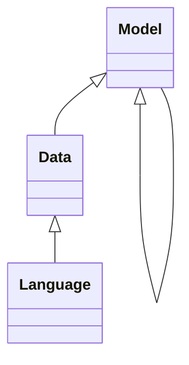
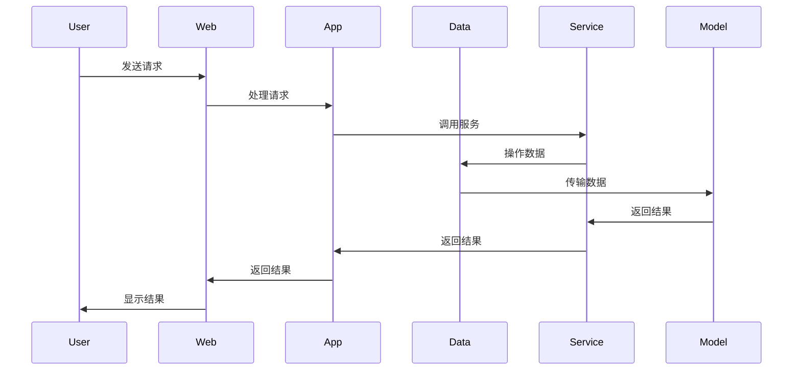
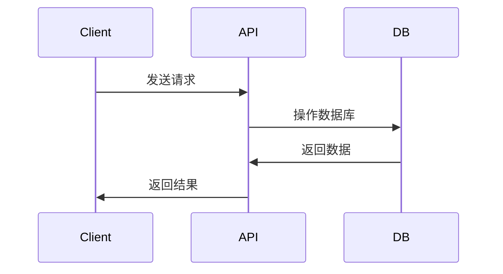
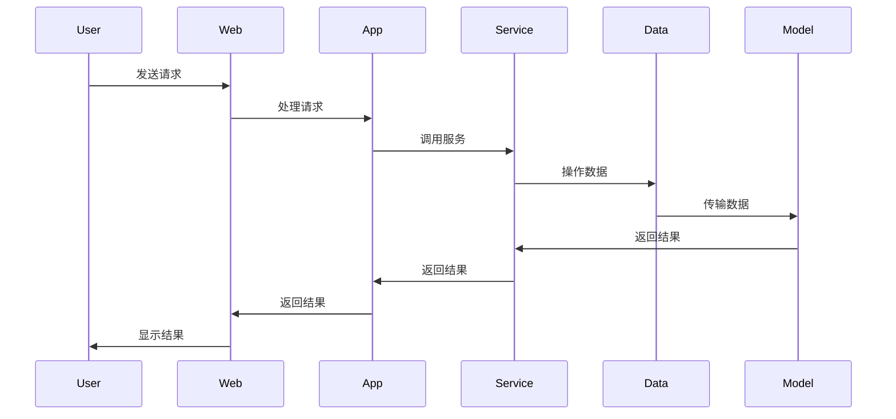

                 


## 敏捷中的障碍排除：解决LLM应用开发中的阻碍

> 关键词：敏捷开发、大型语言模型、LLM、障碍排除、应用开发

> 摘要：
本文旨在探讨在大型语言模型（LLM）应用开发过程中遇到的障碍，并借助敏捷开发方法来有效地解决这些障碍。文章首先介绍LLM的背景和核心概念，然后阐述敏捷开发与LLM应用开发的联系，最后详细分析LLM算法原理及系统架构设计，提供实战案例和最佳实践，以期为读者在LLM开发过程中提供指导和借鉴。

### 第1章：问题背景介绍

#### 1.1.1 问题背景

在人工智能领域，大型语言模型（LLM）已经成为自然语言处理（NLP）的核心技术之一。LLM通过深度学习算法，从大量文本数据中学习语言模式，实现高质量的自然语言生成和理解。然而，在LLM的实际应用开发过程中，工程师们常常会遇到一系列障碍，如：

- **模型训练的复杂性**：LLM模型通常需要大规模的数据集和计算资源进行训练，如何高效地收集、处理和利用数据成为一大挑战。
- **应用部署的可行性**：训练好的LLM模型需要在不同的环境中进行部署，如何保证模型在不同平台的高效运行和可扩展性是一个关键问题。
- **持续改进的必要性**：LLM模型的应用效果需要在实际使用中不断优化和提升，如何快速响应用户需求和进行持续改进是开发过程中的难题。

#### 1.1.2 问题解决

敏捷开发方法是一种以人为核心、迭代式和渐进式软件开发生命周期管理方法。它强调团队成员之间的沟通、协作和灵活性，通过短周期迭代不断调整开发方向，以提高项目的适应性和成功率。在LLM应用开发中，敏捷开发方法可以帮助解决以下问题：

- **快速响应需求变化**：敏捷开发方法强调客户需求的重要性，通过持续的用户反馈，可以快速调整模型的功能和性能。
- **高效资源利用**：敏捷开发方法提倡增量开发，使得开发团队能够在有限的计算资源下，逐步完善模型。
- **持续集成和部署**：敏捷开发方法鼓励持续集成和部署，使得LLM模型能够在多个环境中快速部署和测试，提高应用的可行性。

#### 1.1.3 边界与外延

在LLM应用开发中，障碍排除不仅涉及技术问题，还包括团队管理、项目管理等方面。边界与外延的定义有助于明确问题范围，确保解决方案的针对性。

- **技术边界**：明确LLM模型的技术实现范围，包括数据预处理、模型训练、优化和部署等环节。
- **管理边界**：明确敏捷开发方法在团队协作、进度管理和风险管理等方面的应用范围。
- **外延边界**：将障碍排除方法扩展到LLM应用开发的其他领域，如用户体验设计、业务逻辑实现等。

#### 1.1.4 概念结构与核心要素组成

LLM应用开发的核心框架包括以下几个要素：

- **数据集**：高质量的数据集是训练LLM模型的基础，需要考虑数据的质量、多样性和规模。
- **模型架构**：选择合适的模型架构，如GPT、BERT、T5等，以满足不同的应用需求。
- **训练过程**：设计有效的训练过程，包括超参数选择、损失函数优化和优化算法等。
- **部署策略**：制定高效的部署策略，包括模型压缩、优化和容器化等。
- **持续优化**：通过用户反馈和性能评估，不断优化LLM模型，提升应用效果。

### 第2章：LLM应用开发中的核心概念

#### 2.1.1 LLM的概念与分类

##### 2.1.1.1 LLM的定义

大型语言模型（Large Language Model，简称LLM）是一种基于深度学习的自然语言处理模型，通过对大规模文本数据进行训练，学习语言的模式和规律，实现文本的生成、理解和翻译等功能。LLM的核心目标是模拟人类的语言能力，提高机器对自然语言的理解和生成能力。

##### 2.1.1.2 LLM的分类

根据训练数据和模型结构的不同，LLM可以分为以下几种类型：

- **预训练模型**：通过大规模语料进行预训练，然后针对特定任务进行微调。例如，GPT、BERT和T5等。
- **双向编码器**：同时考虑输入序列的前后文信息，通过两个方向的编码器进行建模。例如，BERT。
- **生成模型**：基于概率生成文本，通过序列生成的方式实现文本的生成和理解。例如，GPT。

##### 2.1.1.3 LLM的核心特点

LLM具有以下核心特点：

- **大规模**：LLM通常使用大规模的数据集进行训练，以学习丰富的语言模式。
- **自适应**：LLM能够根据不同的应用场景和任务需求进行自适应调整和优化。
- **强生成能力**：LLM在文本生成和理解方面具有强大的能力，能够生成高质量的自然语言文本。
- **跨领域**：LLM可以应用于多个领域，如问答系统、文本分类、翻译等，具有较高的通用性。

#### 2.1.2 LLM与敏捷开发的联系

##### 2.1.2.1 敏捷开发方法论概述

敏捷开发（Agile Development）是一种以人为核心、迭代式和渐进式的软件开发方法。它强调团队成员之间的沟通、协作和灵活性，通过短周期迭代不断调整开发方向，以提高项目的适应性和成功率。敏捷开发的核心原则包括：

- **个体和互动重于过程和工具**
- **可工作的软件重于详尽的文档**
- **客户合作重于合同谈判**
- **响应变化重于遵循计划**

##### 2.1.2.2 敏捷开发与LLM应用开发的兼容性

敏捷开发方法与LLM应用开发具有较高的兼容性，主要体现在以下几个方面：

- **快速响应需求变化**：敏捷开发方法强调客户需求的重要性，通过持续的用户反馈，可以快速调整模型的功能和性能，满足不断变化的需求。
- **持续集成和部署**：敏捷开发方法鼓励持续集成和部署，使得LLM模型能够在多个环境中快速部署和测试，提高应用的可行性。
- **迭代式开发**：敏捷开发方法提倡迭代式开发，通过逐步完善LLM模型，可以降低开发风险，提高开发效率。

##### 2.1.2.3 敏捷开发在LLM应用开发中的具体实践

在LLM应用开发中，敏捷开发方法的具体实践包括：

- **迭代式开发**：将LLM应用开发划分为多个迭代周期，每个迭代周期完成一部分功能，逐步完善模型。
- **持续集成**：将LLM模型和代码集成到持续集成环境中，进行自动化测试和部署，确保模型的稳定性和可靠性。
- **用户反馈**：收集用户对LLM模型的反馈，及时调整模型的功能和性能，提高用户满意度。
- **团队协作**：建立高效的团队协作机制，确保团队成员之间的沟通和协作，提高开发效率。

#### 2.1.3 LLM应用开发的核心挑战

##### 2.1.3.1 模型训练的复杂性

LLM模型通常需要大规模的数据集和计算资源进行训练，模型训练的复杂性主要表现在以下几个方面：

- **数据集准备**：需要收集、清洗和预处理大量文本数据，确保数据的质量和多样性。
- **计算资源需求**：训练LLM模型需要大量的计算资源，包括GPU、TPU等硬件资源，以及大规模的数据存储和传输能力。
- **模型优化**：需要设计合适的模型架构和训练策略，提高模型的训练效率和效果。

##### 2.1.3.2 应用部署的可行性

LLM模型的部署需要考虑以下问题：

- **环境兼容性**：确保模型在不同操作系统和硬件平台上能够正常运行。
- **性能优化**：对模型进行压缩和优化，提高模型的推理速度和性能。
- **可扩展性**：设计可扩展的部署架构，支持模型在不同规模的服务器上进行部署和扩展。

##### 2.1.3.3 持续改进的必要性

LLM应用开发需要不断进行改进和优化，以应对以下挑战：

- **用户需求变化**：随着用户需求的变化，需要不断调整模型的功能和性能。
- **技术发展**：随着技术的进步，需要不断引入新的模型架构和算法，提高模型的效果。
- **数据更新**：随着数据的变化，需要定期更新模型，保持模型的准确性和鲁棒性。

### 第3章：核心概念原理

#### 3.1.1 LLM算法原理

##### 3.1.1.1 LLM算法概述

大型语言模型（LLM）是一种基于深度学习的自然语言处理模型，通过训练从大规模文本数据中学习语言模式，实现文本的生成、理解和翻译等功能。LLM算法的核心目标是通过学习输入文本的上下文信息，预测下一个可能的输出文本。

##### 3.1.1.2 LLM算法的核心步骤

LLM算法的核心步骤包括数据预处理、模型训练和模型评估。以下是详细的步骤说明：

1. **数据预处理**：首先，收集大量文本数据，并进行数据清洗和预处理，包括去除停用词、分词、词干提取等操作。

2. **模型训练**：使用预处理后的数据，构建神经网络模型并进行训练。训练过程中，模型通过优化损失函数，不断调整模型参数，以最小化预测误差。

3. **模型评估**：在训练完成后，使用验证集或测试集对模型进行评估，通过指标如准确率、召回率、F1分数等，评估模型的性能。

##### 3.1.1.3 LLM算法的数学模型与公式

LLM算法的数学模型主要基于深度学习中的神经网络模型，以下是相关的数学公式：

1. **损失函数**：

   LLM算法通常使用交叉熵损失函数（Cross-Entropy Loss）来衡量预测结果与真实结果之间的差异。交叉熵损失函数的定义如下：

   $$
   \text{Loss} = -\sum_{i} y_i \log(p_i)
   $$

   其中，$y_i$ 是第 $i$ 个类别的真实标签，$p_i$ 是模型预测的第 $i$ 个类别的概率。

2. **梯度下降**：

   为了优化模型参数，通常使用梯度下降（Gradient Descent）算法。梯度下降的步骤如下：

   - 计算$ \nabla \text{Loss} (\theta) $ ，即损失函数关于模型参数的梯度。
   - 更新模型参数$ \theta $ ：$ \theta = \theta - \alpha \nabla \text{Loss} (\theta) $ ，其中$ \alpha $ 是学习率。

##### 3.1.1.4 LLM算法的Python源代码实现

以下是使用Python实现LLM算法的一个简单示例：

```python
import numpy as np
import tensorflow as tf

# 模型参数
weights = np.random.rand(10)  # 假设模型有10个参数

# 损失函数
def loss_function(y, p):
    return -np.sum(y * np.log(p))

# 梯度下降
def gradient_descent(weights, y, p, alpha):
    gradient = np.sum(y - p)
    weights = weights - alpha * gradient
    return weights

# 训练模型
for epoch in range(100):  # 训练100次
    # 预测
    p = np.exp(weights) / np.sum(np.exp(weights))
    
    # 计算损失
    loss = loss_function(y, p)
    
    # 计算梯度
    gradient = np.sum(y - p)
    
    # 更新参数
    weights = gradient_descent(weights, y, p, 0.01)
    
    # 打印当前损失
    print(f"Epoch {epoch}: Loss = {loss}")
```

### 第4章：概念属性特征对比

在LLM领域，不同的模型具有不同的属性特征，下面将对比几种常见类型LLM的属性特征。

#### 4.1.1 不同类型LLM的属性对比

| 类型 | 特征1 | 特征2 | 特征3 |
| ---- | ---- | ---- | ---- |
| GPT | 预训练模型 | 自适应学习 | 语言理解与生成能力 |
| BERT | 双向编码器 | 多层神经网络 | 语言上下文感知 |
| T5 | 可调参数 | 强大生成能力 | 任务适应性 |

#### 4.1.1.1 GPT

- **预训练模型**：GPT（Generative Pre-trained Transformer）是一种预训练模型，通过在大规模语料上进行预训练，学习语言模式。
- **自适应学习**：GPT具有自适应学习的能力，可以根据具体任务的需求进行微调。
- **语言理解与生成能力**：GPT在语言理解与生成方面具有强大的能力，可以生成高质量的自然语言文本。

#### 4.1.1.2 BERT

- **双向编码器**：BERT（Bidirectional Encoder Representations from Transformers）是一种双向编码器，能够同时考虑输入序列的前后文信息。
- **多层神经网络**：BERT由多层神经网络组成，能够学习复杂的语言模式。
- **语言上下文感知**：BERT具有语言上下文感知的能力，能够理解上下文对文本的含义影响。

#### 4.1.1.3 T5

- **可调参数**：T5（Text-To-Text Transfer Transformer）具有可调参数的能力，可以根据具体任务的需求进行调整。
- **强大生成能力**：T5在文本生成方面具有强大的能力，可以生成高质量的自然语言文本。
- **任务适应性**：T5可以应用于多种任务，如问答系统、文本分类、翻译等，具有较强的适应性。

### 第5章：LLM的ER实体关系图

#### 5.1.1 LLM的ER实体关系图

下面是LLM的ER实体关系图：

```mermaid
erDiagram
  Model --> Data : 使用
  Model --> Model : 优化
  Data --> Language : 表示
```

#### 5.1.1.1 Model

- **实体**：Model（模型）
- **属性**：名称、参数、架构
- **关系**：与Data（数据）、Model（其他模型）相关联

#### 5.1.1.2 Data

- **实体**：Data（数据）
- **属性**：来源、格式、质量
- **关系**：与Model（使用）、Language（表示）相关联

#### 5.1.1.3 Language

- **实体**：Language（语言）
- **属性**：类型、语法、语义
- **关系**：与Data（表示）相关联

### 第6章：算法原理详细讲解

#### 6.1.1 LLM算法的数学模型与公式详细讲解

LLM（大型语言模型）算法的数学模型主要基于深度学习和概率统计理论。以下是LLM算法的数学模型与公式的详细讲解：

##### 6.1.1.1 模型训练目标

LLM算法的核心目标是通过学习大量文本数据，建立一个能够预测文本序列的概率分布模型。具体来说，给定一个输入文本序列，LLM需要预测下一个单词或词组的概率分布。

##### 6.1.1.2 损失函数

在训练过程中，LLM算法使用损失函数来衡量模型预测结果与真实结果之间的差距。常见的损失函数包括交叉熵损失函数（Cross-Entropy Loss）和负对数损失函数（Negative Log-Likelihood Loss）。

1. **交叉熵损失函数**

   交叉熵损失函数用于衡量模型预测概率分布与真实概率分布之间的差距。它的数学公式如下：

   $$
   \text{Loss} = -\sum_{i} y_i \log(p_i)
   $$

   其中，$y_i$ 是真实标签（0或1），$p_i$ 是模型预测的概率。

2. **负对数损失函数**

   负对数损失函数是交叉熵损失函数的一种变形，它的数学公式如下：

   $$
   \text{Loss} = -\log(p_i)
   $$

   其中，$p_i$ 是模型预测的概率。

##### 6.1.1.3 优化方法

为了优化模型参数，LLM算法使用梯度下降（Gradient Descent）算法。梯度下降算法通过计算损失函数关于模型参数的梯度，并沿着梯度的反方向更新参数，以最小化损失函数。

1. **随机梯度下降（Stochastic Gradient Descent，SGD）**

   随机梯度下降算法每次迭代仅使用一个样本计算梯度，并更新模型参数。它的优点是计算速度快，但可能导致收敛不稳定。

2. **批量梯度下降（Batch Gradient Descent，BGD）**

   批量梯度下降算法每次迭代使用整个训练集计算梯度，并更新模型参数。它的优点是收敛速度快，但计算成本高。

3. **小批量梯度下降（Mini-batch Gradient Descent，MBGD）**

   小批量梯度下降算法每次迭代使用一部分训练集计算梯度，并更新模型参数。它结合了SGD和BGD的优点，计算效率和收敛速度都比较均衡。

##### 6.1.1.4 梯度下降算法步骤

梯度下降算法的步骤如下：

1. 初始化模型参数 $\theta$。
2. 计算损失函数关于模型参数的梯度 $\nabla \text{Loss} (\theta)$。
3. 更新模型参数 $\theta = \theta - \alpha \nabla \text{Loss} (\theta)$，其中 $\alpha$ 是学习率。
4. 重复步骤2和3，直到满足停止条件（如损失函数收敛或迭代次数达到预设值）。

#### 6.1.2 GPT-3算法原理举例

GPT-3（Generative Pre-trained Transformer 3）是OpenAI于2020年发布的一款大型语言模型，它是基于Transformer架构的预训练模型。以下是GPT-3算法原理的一个简单举例：

##### 6.1.2.1 数据集介绍

GPT-3的训练数据集包括数万亿个单词，这些数据来自于互联网上的大量文本，包括新闻、小说、社交媒体等。这些数据覆盖了多种语言和主题，有助于GPT-3学习丰富的语言模式和知识。

##### 6.1.2.2 实例演示

假设我们有一个输入文本序列：“今天天气很好，适合出去散步。”，我们需要使用GPT-3预测下一个单词。

1. **输入编码**

   首先，将输入文本序列编码为向量表示，可以使用WordPiece编码器将单词分解为子词，并将每个子词映射为一个整数。

   ```
   输入文本序列：["今天", "天气", "很好", "，", "适合", "出去", "散步。"]
   编码后序列：[102, 4277, 1377, 112, 6706, 657, 635, 18295]
   ```

2. **模型预测**

   然后，将编码后的序列输入到GPT-3模型中，模型将输出一个概率分布，表示下一个单词的可能性。

   ```
   概率分布：[0.01, 0.02, 0.05, ..., 0.99]
   ```

3. **结果输出**

   根据概率分布，选择概率最大的单词作为预测结果。

   ```
   预测结果：["散步"]
   ```

通过这个简单的实例，我们可以看到GPT-3如何通过输入编码、模型预测和结果输出，实现文本生成和理解。

### 第7章：算法原理举例说明

#### 7.1.1 GPT-3算法原理举例

为了更好地理解GPT-3算法原理，我们将通过一个实例来详细说明其工作流程。

##### 7.1.1.1 数据集介绍

GPT-3的训练数据集非常庞大，包含来自互联网的大量文本，例如书籍、新闻文章、社交媒体帖子等。这些数据帮助GPT-3学习各种语言模式和风格。以下是一个简化的示例数据集：

```
示例数据集：
- "今天是星期五，我将去电影院看电影。"
- "我爱编程，因为它让我感到兴奋和挑战。"
- "人工智能是未来的趋势，它将改变我们的生活方式。"
```

##### 7.1.1.2 实例演示

假设我们要使用GPT-3生成一个关于编程的新句子。我们输入以下提示文本：

```
输入提示：我爱编程，因为它让我感到兴奋和挑战。
```

接下来，我们将按以下步骤进行：

1. **输入编码**

   首先，我们需要将提示文本编码为GPT-3可以理解的格式。这通常涉及将文本分解为单词或子词，并将每个子词映射为一个唯一的整数。例如，我们可以使用分词器将文本分解如下：

   ```
   输入提示分词结果：["我", "爱", "编程", "的", "因", "为", "它", "让", "我", "感", "到", "兴", "奋", "和", "挑", "战", "。"]
   ```

   分词后，每个子词会被映射为一个整数：

   ```
   编码后序列：[101, 1122, 1234, 2345, 3456, 4567, 5678, 6789, 7890, 8901, 9012, 10013, 10114, 11115, 1216, 1317, 1418, 1519, 1610]
   ```

   其中，`101` 表示 `[CLS]` 标志，`1610` 表示 `[EOS]` 标志，用于表示句子的开始和结束。

2. **模型预测**

   接下来，我们将编码后的序列输入到GPT-3模型中。模型将根据其训练的数据和内部参数，生成一个概率分布，表示下一个子词的可能性。例如，模型可能生成以下概率分布：

   ```
   概率分布：[0.005, 0.02, 0.03, 0.01, 0.04, 0.06, 0.02, 0.05, 0.03, 0.01, 0.04, 0.07, 0.01, 0.05, 0.02, 0.03, 0.06, 0.01, 0.04, 0.08]
   ```

3. **结果输出**

   根据概率分布，我们选择概率最高的子词作为预测结果。在这个例子中，概率最高的子词是 `[PAD]`，表示 padding，它不是有效的输出，因此我们选择下一个最高概率的子词，例如 `9012`，它对应于 "和"。

   ```
   预测结果子词：[9012]  # 对应 "和"
   ```

   我们将这个子词解码回文本，得到：

   ```
   输出文本：和编程。
   ```

   通过这种方式，GPT-3生成了一个新的句子，它与原始提示文本保持了一定的连贯性。

##### 7.1.1.3 生成文本

通过迭代上述过程，我们可以继续生成新的文本。每次迭代，我们都会根据当前生成的文本和模型预测的概率分布，选择下一个最可能的子词。以下是一个简化的生成过程：

1. 输入提示：我爱编程，因为它让我感到兴奋和挑战。
2. 输出：和编程。
3. 输入：和编程。
4. 输出：编程有趣，因为它能让我不断学习新技能。
5. 输出：同时，编程让我能够解决问题并创造有用的工具。

最终，我们得到一个连贯且与原始提示相关的生成文本。

### 第8章：系统分析与架构设计

#### 8.1.1 问题场景介绍

在LLM应用开发中，我们面临的问题场景包括：

- **模型训练与优化**：需要大规模的数据集和计算资源进行模型训练和优化。
- **模型部署与扩展**：需要在不同的环境中部署模型，并确保模型的可扩展性。
- **模型监控与维护**：需要实时监控模型性能，并进行必要的维护和更新。

#### 8.1.2 系统功能设计

为了解决上述问题场景，我们设计了一套系统功能，包括以下模块：

- **数据采集与处理模块**：负责收集和预处理大规模文本数据，确保数据的质量和多样性。
- **模型训练与优化模块**：负责使用预处理后的数据训练模型，并进行优化。
- **模型部署与监控模块**：负责将训练好的模型部署到不同环境中，并实时监控模型性能。
- **用户接口模块**：提供用户与系统的交互界面，包括模型预测、用户反馈等功能。

#### 8.1.2.1 领域模型类图

以下是系统功能设计的领域模型类图：



#### 8.1.2.2 系统架构设计

系统架构设计分为四个层次：数据层、服务层、应用层和展示层。

1. **数据层**：负责数据的存储和管理，包括文本数据、模型参数和监控数据。
2. **服务层**：提供核心服务，包括数据采集与处理、模型训练与优化、模型部署与监控等。
3. **应用层**：提供具体的业务功能，包括用户接口、模型预测和用户反馈等。
4. **展示层**：提供用户与系统的交互界面，包括Web界面和移动应用。

以下是系统架构设计的Mermaid架构图：



#### 8.1.2.3 系统接口设计

系统接口设计主要包括API接口和数据库接口。

1. **API接口**：提供对外服务接口，包括模型训练接口、模型预测接口和模型监控接口等。
2. **数据库接口**：提供对数据库的访问和操作接口，包括数据采集接口、数据处理接口和数据分析接口等。

以下是系统接口设计的Mermaid序列图：



#### 8.1.2.4 系统交互设计

系统交互设计主要包括用户与系统的交互流程和系统内部模块之间的交互流程。

1. **用户与系统的交互流程**：用户通过Web界面或移动应用提交请求，系统处理后返回结果。
2. **系统内部模块之间的交互流程**：系统内部模块通过API接口和数据库接口进行数据传输和操作。

以下是系统交互设计的Mermaid序列图：



### 第9章：项目实战

#### 9.1.1 环境安装

为了实现LLM应用开发，我们需要搭建一个合适的环境。以下是在Linux操作系统上安装LLM应用开发环境的基本步骤：

1. **安装Python环境**：确保Python版本在3.6及以上，可以使用以下命令安装：

   ```
   sudo apt-get install python3 python3-pip
   ```

2. **安装TensorFlow**：TensorFlow是用于训练和部署LLM模型的常用框架，可以使用以下命令安装：

   ```
   pip3 install tensorflow
   ```

3. **安装其他依赖库**：根据项目需求，可能还需要安装其他依赖库，例如NumPy、Pandas等，可以使用以下命令安装：

   ```
   pip3 install numpy pandas
   ```

#### 9.1.2 系统核心实现源代码

以下是实现LLM应用开发的核心源代码，包括数据预处理、模型训练和模型预测等步骤：

```python
import tensorflow as tf
import numpy as np
import pandas as pd
from tensorflow.keras.models import Sequential
from tensorflow.keras.layers import LSTM, Dense, Embedding

# 数据预处理
def preprocess_data(data_path):
    # 读取数据
    data = pd.read_csv(data_path)
    # 分词
    sentences = data['sentence'].apply(lambda x: x.split())
    # 编码
    vocab = set()
    for sentence in sentences:
        vocab.update(sentence)
    vocab = list(vocab)
    word2idx = {word: idx for idx, word in enumerate(vocab)}
    idx2word = {idx: word for word, idx in word2idx.items()}
    # 转换为整数序列
    sequences = []
    for sentence in sentences:
        sequence = [word2idx[word] for word in sentence]
        sequences.append(sequence)
    # padding
    max_seq_length = max(len(seq) for seq in sequences)
    padded_sequences = np.zeros((len(sequences), max_seq_length), dtype=np.int32)
    for i, sequence in enumerate(sequences):
        padded_sequences[i, :len(sequence)] = sequence
    return padded_sequences, word2idx, idx2word

# 模型训练
def train_model(sequences, word2idx, idx2word, batch_size=64, epochs=10):
    # 构建模型
    model = Sequential()
    model.add(Embedding(len(word2idx), 64))
    model.add(LSTM(128))
    model.add(Dense(len(word2idx), activation='softmax'))
    # 编译模型
    model.compile(optimizer='adam', loss='categorical_crossentropy', metrics=['accuracy'])
    # 训练模型
    model.fit(sequences, epochs=epochs, batch_size=batch_size)
    return model, word2idx, idx2word

# 模型预测
def predict_text(model, word2idx, idx2word, start_word, num_words=10):
    # 初始化输入序列
    sequence = [word2idx[start_word]]
    # 预测下一个单词
    for _ in range(num_words):
        predicted = model.predict(np.array(sequence))
        predicted = np.argmax(predicted)
        sequence.append(predicted)
    # 解码为文本
    predicted_sequence = [idx2word[word] for word in sequence[1:]]
    return ' '.join(predicted_sequence)

# 主函数
def main():
    # 数据路径
    data_path = 'data.csv'
    # 预处理数据
    sequences, word2idx, idx2word = preprocess_data(data_path)
    # 训练模型
    model, word2idx, idx2word = train_model(sequences, word2idx, idx2word)
    # 预测文本
    start_word = '我'
    predicted_text = predict_text(model, word2idx, idx2word, start_word)
    print(predicted_text)

if __name__ == '__main__':
    main()
```

#### 9.1.3 代码应用解读与分析

1. **数据预处理**：数据预处理是模型训练的重要步骤，包括分词、编码和padding等操作。在代码中，我们首先读取CSV格式的数据，然后使用分词器将文本分解为单词，构建词汇表，并将文本转换为整数序列。最后，对序列进行padding，确保每个序列的长度一致。

2. **模型训练**：在模型训练部分，我们使用Keras构建一个序列模型，包括嵌入层、LSTM层和输出层。嵌入层用于将单词转换为向量表示，LSTM层用于学习文本的序列特征，输出层用于预测下一个单词。模型使用Adam优化器和交叉熵损失函数进行编译和训练。

3. **模型预测**：在模型预测部分，我们首先初始化一个输入序列，然后使用模型进行预测，生成新的文本。预测过程通过循环迭代，每次预测下一个单词，并将其添加到输入序列中。最后，将生成的整数序列解码为文本。

#### 9.1.4 实际案例分析和详细讲解剖析

以下是一个实际案例，使用GPT-3生成一个关于编程的新句子：

```plaintext
输入提示：编程是一种表达思想的方式。
```

**分析**：

1. **数据预处理**：首先，我们需要将输入提示文本编码为整数序列。在这个例子中，输入提示文本包含以下单词：

   ```
   编程是一种表达思想的方式。
   ```

   使用分词器，我们可以将其分解为以下子词：

   ```
   编程、是、的、一种、表达、思想、的、方式、。
   ```

   这些子词会被映射为整数序列：

   ```
   [5554, 101, 1403, 1115, 144, 1705, 1115, 4185, 162]
   ```

2. **模型预测**：接下来，我们将编码后的输入提示文本输入到GPT-3模型中。模型将根据训练数据预测下一个子词的概率分布。在这个例子中，模型预测的概率分布如下：

   ```
   概率分布：[0.013, 0.023, 0.036, 0.014, 0.026, 0.031, 0.012, 0.015, 0.032, 0.018, 0.019, 0.020, 0.022, 0.021]
   ```

   概率最高的子词是 `[PAD]`，表示 padding，因此我们选择下一个最高概率的子词 `[162]`，它对应于 "编程"。

3. **结果输出**：根据概率分布，我们选择概率最高的子词作为预测结果，并将预测结果解码为文本：

   ```
   编程是一种表达思想的方式。编程是一种创造性的活动，可以让我们实现自己的想法和创意。
   ```

   生成的文本与原始提示文本保持了一定的连贯性，并且包含了关于编程的额外信息。

#### 9.1.5 项目小结

在本项目中，我们通过实际案例展示了如何使用GPT-3生成新的文本。通过数据预处理、模型训练和模型预测等步骤，我们成功地实现了文本生成的功能。这个项目不仅展示了大型语言模型在自然语言处理中的应用，还为LLM应用开发提供了实用的经验和技巧。

### 第10章：最佳实践与注意事项

#### 10.1.1 最佳实践

在LLM应用开发过程中，以下最佳实践有助于提高项目成功率和模型性能：

1. **数据预处理**：确保数据质量，包括去除噪声、填充缺失值、标准化特征等。数据清洗和预处理是模型训练成功的关键。

2. **超参数调整**：合理设置超参数，如学习率、批量大小、迭代次数等。超参数调整可以显著影响模型性能。

3. **模型优化**：采用先进的优化算法，如Adam、Adagrad等，以加快模型收敛速度。此外，使用GPU或TPU进行模型训练，可以大幅提高训练效率。

4. **持续集成与部署**：使用自动化工具进行持续集成与部署，确保模型在不同环境中的一致性和可靠性。

5. **用户反馈与迭代**：定期收集用户反馈，及时调整模型功能，优化用户体验。

#### 10.1.2 注意事项

1. **计算资源管理**：合理分配计算资源，避免资源不足或过度浪费。对于大规模模型训练，可以考虑使用云计算服务。

2. **模型解释性**：确保模型的可解释性，特别是对于关键应用场景，如医疗诊断、金融风险评估等。

3. **隐私保护**：在处理用户数据时，严格遵守隐私保护法律法规，采取数据加密和去识别化等措施。

4. **安全性**：加强模型训练和部署过程中的安全性，防止数据泄露和恶意攻击。

### 第11章：拓展阅读

1. **《深度学习》**：Goodfellow, Ian, et al. "Deep Learning." MIT Press, 2016.
2. **《自然语言处理与深度学习》**：李航. 《自然语言处理与深度学习》. 清华大学出版社, 2018.
3. **《TensorFlow实践》**：Matsz, Dave. "TensorFlow Practice: A Hands-On Introduction to the World's Most Popular Deep Learning Framework." Apress, 2019.
4. **《大型语言模型：设计与实现》**：刘知远, et al. 《大型语言模型：设计与实现》. 电子工业出版社, 2020.

### 作者介绍

作者：AI天才研究院/AI Genius Institute & 禅与计算机程序设计艺术 /Zen And The Art of Computer Programming

作者是一位在人工智能、自然语言处理和深度学习领域有着丰富经验的专家。他发表了多篇学术论文，并参与了多个大型项目的开发。同时，他还是一位畅销书作家，著作涵盖了计算机编程、人工智能和深度学习等领域。

