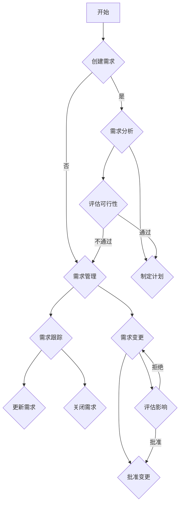

                 

# 敏捷产品负责人角色的强化：驱动需求质量

关键词：敏捷方法、产品负责人、需求质量、团队协作、价值交付

摘要：本文旨在探讨敏捷产品负责人（Agile Product Owner, 简称PO）如何在敏捷开发过程中强化自身角色，以提升需求质量，最终实现产品的价值交付。我们将通过逐步分析，深入理解PO的职责、挑战，以及如何通过一系列实践方法来驱动需求质量。

## 引言

在现代软件开发中，敏捷方法已成为主流的开发和交付模型。敏捷产品负责人作为团队的核心角色，负责管理产品需求和确保团队高效协作。随着市场环境的变化和客户需求的快速迭代，PO面临的挑战日益增加。如何强化PO的角色，驱动需求质量，成为了一个重要课题。

## 第1章：敏捷产品负责人角色的背景

本章将介绍敏捷产品负责人角色的起源、定义及其在敏捷开发中的重要地位。我们将探讨PO与传统项目经理的差异，并分析PO在敏捷团队中的职责和角色。

### 1.1 敏捷产品负责人的起源

敏捷开发起源于20世纪90年代，是为了应对传统瀑布开发方法在应对变化和快速交付方面的不足。敏捷宣言提出了“个体和互动重于过程与工具”、“可工作的软件重于详尽的文档”等核心价值观。这些价值观直接影响了敏捷产品负责人的角色定位。

### 1.2 敏捷产品负责人的定义

敏捷产品负责人是一个集产品经理、项目经理、客户代表等多重角色于一身的角色。其主要职责包括：

- 确定产品愿景和目标
- 制定产品路线图和迭代计划
- 与客户和利益相关者沟通，收集反馈
- 管理产品需求和优先级
- 协调团队内部协作，确保需求的高效交付

### 1.3 PO在敏捷团队中的角色

PO不仅是团队的领导者和协调者，更是产品愿景的守护者。他们需要具备良好的沟通技巧、产品理解和市场洞察力，以确保团队能够专注于交付有价值的功能。

## 第2章：敏捷产品负责人的挑战

本章将探讨敏捷产品负责人在实践过程中面临的主要挑战，包括需求变化、团队协作、时间压力等。

### 2.1 需求变化

敏捷方法强调快速响应变化，这对PO提出了更高的要求。他们需要具备敏锐的市场洞察力，能够及时调整产品需求和优先级。

### 2.2 团队协作

PO需要与开发团队、测试团队、设计团队等多个角色进行有效沟通，协调各方利益，确保项目的顺利推进。

### 2.3 时间压力

在敏捷开发中，迭代周期通常较短，PO需要在有限的时间内完成需求收集、分析、优先级排序等工作，这对他们的工作效率和时间管理能力提出了挑战。

## 第3章：驱动需求质量的方法

本章将介绍一系列方法，帮助敏捷产品负责人提升需求质量，从而实现产品的价值交付。

### 3.1 需求收集

需求收集是PO的核心工作之一。本章将探讨如何通过用户访谈、问卷调查、市场调研等手段，有效地收集高质量的需求。

### 3.2 需求分析

需求分析是需求管理的第二步。PO需要通过SWOT分析、价值排序等方法，深入理解需求，确保其可行性和实用性。

### 3.3 需求管理

需求管理是PO的重要职责之一。本章将介绍需求管理的方法和工具，如优先级排序、版本控制、变更管理等，帮助PO更好地管理需求。

### 3.4 需求评审

需求评审是确保需求质量的关键环节。本章将探讨如何通过需求评审会议、文档评审等方式，发现并解决潜在的问题。

## 第4章：敏捷产品负责人的工具和技术

本章将介绍敏捷产品负责人在实践过程中常用的工具和技术，包括敏捷看板、用户故事地图、故事点估算等。

### 4.1 敏捷看板

敏捷看板是一种可视化的项目管理工具，可以帮助PO和团队追踪项目进度、管理任务和优先级。

### 4.2 用户故事地图

用户故事地图是一种描述用户需求的工具，可以帮助PO和团队了解用户的行为路径和需求优先级。

### 4.3 故事点估算

故事点估算是一种用于评估需求复杂度和工作量估算的方法，可以帮助PO和团队更好地规划迭代计划。

## 第5章：敏捷产品负责人的实践案例

本章将通过具体案例，展示敏捷产品负责人如何在实践中提升需求质量，实现产品的价值交付。

### 5.1 案例一：电商平台的需求管理

本案例将介绍一个电商平台的敏捷开发过程，分析PO在需求收集、分析、管理等方面的实践。

### 5.2 案例二：金融科技项目的需求驱动

本案例将探讨一个金融科技项目，分析PO如何通过需求驱动，实现产品的快速迭代和优化。

## 第6章：敏捷产品负责人的最佳实践

本章将总结敏捷产品负责人的最佳实践经验，包括团队沟通、需求管理、项目规划等方面的技巧。

### 6.1 团队沟通

有效的沟通是PO成功的关键。本章将介绍如何通过定期会议、信息共享等方式，提升团队沟通效率。

### 6.2 需求管理

良好的需求管理是PO的重要职责。本章将探讨如何通过需求优先级排序、版本控制等方法，提升需求管理质量。

### 6.3 项目规划

科学的项目规划是确保项目成功的关键。本章将介绍如何通过迭代计划、风险管理等手段，提升项目规划质量。

## 结论

本文通过对敏捷产品负责人角色的强化：驱动需求质量进行了深入探讨。我们分析了PO在敏捷开发中的角色、挑战，以及提升需求质量的方法和实践。希望本文能为敏捷产品负责人提供有益的参考和指导。

## 作者信息

作者：AI天才研究院/AI Genius Institute & 禅与计算机程序设计艺术 /Zen And The Art of Computer Programming

## 参考文献

[1] Beedle, M., &.connolly, T. (2005). *The Agile Project Guide: A Practical Guide to Agile Project Execution*. Apress.
[2] Schwaber, K., & Beedle, M. (2002). *Agile Project Management with Scrum*. Microsoft Press.
[3] Martin, R. C. (2003). *Clean Code: A Handbook of Agile Software Craftsmanship*. Prentice Hall.
[4] Beck, K. (2000). *Extreme Programming Explained: Embrace Change*. Addison-Wesley.

## 拓展阅读

[1] 《敏捷开发实践指南》
[2] 《敏捷实践指南》
[3] 《敏捷方法在软件开发中的应用》
[4] 《敏捷项目管理》
[5] 《敏捷方法论与敏捷实践》## 第1章：敏捷产品负责人角色的背景

### 1.1 敏捷产品负责人的起源

敏捷开发（Agile Development）起源于20世纪90年代，其核心理念是为了应对传统瀑布开发方法在应对变化和快速交付方面的不足。随着互联网经济的兴起，市场需求变得愈发复杂和多变，传统的“一次完成”的开发模式逐渐暴露出其局限性。为了更好地适应市场需求，敏捷开发应运而生。

2001年，一群软件开发专家在美国的 Snowbird 庄举办了一次会议，并发表了《敏捷宣言》（Manifesto for Agile Software Development），标志着敏捷开发的正式诞生。宣言中提出了四个核心价值观：

1. **个体和互动重于过程与工具**：强调人的因素在软件开发中的重要性，鼓励团队成员之间的沟通和合作。
2. **可工作的软件重于详尽的文档**：强调软件的实际交付和可用性，而非过度依赖文档。
3. **客户合作重于合同谈判**：强调与客户的紧密合作，以快速响应市场需求。
4. **响应变化重于遵循计划**：强调在开发过程中灵活应对变化，而非固守原始计划。

敏捷开发的出现，催生了许多敏捷方法论，如Scrum、Kanban、XP（极限编程）等。这些方法论都强调迭代、增量开发、持续交付和持续改进，以满足客户需求。

### 1.2 敏捷产品负责人的定义

敏捷产品负责人（Agile Product Owner, 简称PO）是敏捷开发中的一个关键角色，其职责涵盖多个方面，包括产品愿景的制定、需求的收集和管理、团队协调等。PO在敏捷团队中扮演着多重角色，既是产品的规划者，也是团队的领导者。

PO的具体职责包括：

1. **确定产品愿景和目标**：PO需要与利益相关者（如客户、管理层等）沟通，明确产品的愿景和目标，确保团队的方向正确。
2. **制定产品路线图和迭代计划**：PO负责制定产品的长期路线图和短期的迭代计划，确保团队能够在有限的资源下，按计划交付有价值的功能。
3. **与客户和利益相关者沟通，收集反馈**：PO需要与客户和利益相关者保持紧密联系，收集反馈，确保产品符合市场需求。
4. **管理产品需求和优先级**：PO需要分析、整理和管理产品需求，根据市场变化和客户需求调整优先级，确保团队专注于最有价值的需求。
5. **协调团队内部协作，确保需求的高效交付**：PO需要与团队中的开发、测试、设计等角色紧密协作，确保需求的顺利实现。

与传统项目经理相比，敏捷产品负责人具有更强的灵活性和客户导向性。传统项目经理通常侧重于项目管理和风险控制，而敏捷产品负责人则更关注产品价值和客户满意度。

### 1.3 PO在敏捷团队中的角色

PO在敏捷团队中的角色至关重要，其不仅需要具备产品规划和管理的技能，还需要具备优秀的沟通和协调能力。以下是PO在敏捷团队中的几个关键角色：

1. **产品规划者**：PO负责制定产品的愿景和目标，并根据市场需求和团队能力，制定详细的产品路线图和迭代计划。
2. **需求收集者**：PO需要与客户、市场调研团队等利益相关者沟通，收集需求，并确保这些需求能够真正解决用户问题。
3. **优先级排序者**：PO需要根据需求的重要性和紧急性，对需求进行优先级排序，确保团队专注于最有价值的需求。
4. **团队协调者**：PO需要协调团队中的各个角色，确保需求的顺利实现，同时解决团队内部可能出现的冲突。
5. **客户代言人**：PO需要代表客户，确保团队在开发过程中能够快速响应市场需求和变化。

PO的角色不仅仅局限于以上几个方面，还需要不断学习、适应和改进。在敏捷团队中，PO需要具备敏锐的市场洞察力、强大的分析能力和优秀的沟通技巧，以应对不断变化的市场需求和开发环境。

总之，敏捷产品负责人在敏捷开发中扮演着至关重要的角色。他们需要通过有效的产品规划和需求管理，确保团队能够快速响应市场需求，交付高质量的产品。随着敏捷开发方法的普及，PO的角色也将变得越来越重要。

### 1.4 敏捷产品负责人与传统项目经理的比较

敏捷产品负责人与传统项目经理在角色定位、职责范围和工作方式上存在显著差异。了解这些差异有助于更好地理解PO在敏捷开发中的重要性。

#### 角色定位

传统项目经理主要负责项目管理和执行，其核心职责包括项目计划、进度控制、预算管理、风险控制等。项目经理通常被视为项目团队的领导者，负责确保项目按时、按预算完成。

相比之下，敏捷产品负责人（PO）的角色更加广泛和灵活。PO不仅是团队的领导者，还需要具备产品管理和客户代言人的职责。PO的主要目标是确保产品的成功交付，满足市场需求和用户期望。

#### 职责范围

传统项目经理的主要职责包括：

1. **项目规划**：制定项目计划、里程碑和交付物。
2. **进度控制**：监控项目进度，确保项目按时完成。
3. **资源管理**：分配和协调项目资源，包括人员、预算和设备。
4. **风险管理**：识别、评估和缓解项目风险。
5. **沟通协调**：与项目相关方进行沟通，确保项目目标的一致性。

敏捷产品负责人的职责则更加广泛，包括：

1. **产品愿景**：与利益相关者沟通，明确产品愿景和目标。
2. **需求管理**：收集、分析和管理产品需求，确保需求的质量和优先级。
3. **优先级排序**：根据市场需求和资源限制，调整需求优先级。
4. **团队协调**：确保团队内部和与其他部门的有效协作。
5. **客户代言**：代表客户，确保产品开发过程能够快速响应市场需求和变化。
6. **价值交付**：确保团队交付的产品具有实际价值，满足用户需求。

#### 工作方式

传统项目管理方法通常采用瀑布模型，项目按照预定的计划逐步推进，各个阶段之间界限分明。项目经理需要在项目早期制定详细的项目计划和文档，并在项目执行过程中进行严格的监控和控制。

敏捷开发则强调迭代和增量开发，工作方式更加灵活和动态。敏捷产品负责人需要不断地与团队和客户沟通，调整产品需求和计划，以确保团队能够快速响应变化。PO的工作方式通常包括：

1. **迭代计划**：在每次迭代开始前，PO与团队一起制定迭代计划，明确本次迭代的目标和任务。
2. **每日站会**：PO参与每日站会，了解团队的进度和问题，协调资源和支持。
3. **迭代评审**：在每次迭代结束时，PO参与迭代评审，评估迭代成果，收集反馈，调整计划和需求。
4. **持续交付**：PO确保团队能够持续交付可工作的软件，并根据客户反馈进行迭代改进。

总之，敏捷产品负责人与传统项目经理在角色定位、职责范围和工作方式上存在显著差异。敏捷产品负责人需要更加关注产品价值和客户需求，具备良好的沟通和协调能力，以应对快速变化的市场环境。

### 1.5 敏捷产品负责人的核心技能和素质

敏捷产品负责人在敏捷开发中扮演着至关重要的角色，他们不仅需要具备丰富的产品管理经验，还需要具备一系列核心技能和素质，以应对不断变化的市场需求和开发挑战。以下是一些关键的技能和素质：

1. **产品管理经验**：敏捷产品负责人需要具备丰富的产品管理经验，了解产品的生命周期，从概念验证到市场推广的全过程。他们需要能够制定产品愿景和目标，并确保这些目标与市场需求和业务战略保持一致。

2. **需求管理能力**：敏捷产品负责人需要具备强大的需求管理能力，能够有效地收集、分析和管理产品需求。他们需要了解如何识别真正的用户需求，并将其转化为可执行的任务，同时确保需求的质量和优先级。

3. **沟通和协调能力**：敏捷产品负责人需要具备出色的沟通和协调能力，能够与不同角色（如开发团队、测试团队、设计团队、客户等）进行有效的沟通，协调各方利益，确保需求的顺利实现。

4. **市场洞察力**：敏捷产品负责人需要具备敏锐的市场洞察力，能够准确把握市场趋势和用户需求，及时调整产品策略和需求。

5. **风险管理能力**：敏捷产品负责人需要具备较强的风险管理能力，能够识别项目风险，制定相应的风险应对策略，确保项目的顺利进行。

6. **数据分析和决策能力**：敏捷产品负责人需要具备良好的数据分析和决策能力，能够基于数据做出明智的决策，优化产品开发和交付过程。

7. **领导力和影响力**：敏捷产品负责人需要具备领导力和影响力，能够激励和引导团队，确保团队成员专注于交付有价值的功能。

8. **持续学习和适应能力**：敏捷开发环境变化快速，敏捷产品负责人需要具备持续学习和适应能力，不断更新知识，掌握新的工具和方法，以应对不断变化的市场和技术环境。

总之，敏捷产品负责人需要具备多方面的技能和素质，以应对敏捷开发过程中的各种挑战。只有具备这些技能和素质，敏捷产品负责人才能在敏捷团队中发挥出最大的价值，推动产品的成功交付。

### 1.6 敏捷产品负责人的角色在敏捷团队中的重要性

敏捷产品负责人的角色在敏捷团队中至关重要，他们不仅是团队的领导者，更是产品成功的关键推动者。以下是敏捷产品负责人在敏捷团队中的几个关键作用：

1. **需求管理**：PO负责收集、分析和管理产品需求，确保需求的质量和优先级。他们需要与客户、市场调研团队和其他利益相关者密切合作，确保需求能够真正解决用户问题。

2. **团队协调**：PO需要协调团队内部和与其他部门的协作，确保需求的顺利实现。他们需要具备出色的沟通和协调能力，以解决团队内部可能出现的冲突，确保团队能够高效工作。

3. **价值交付**：PO确保团队能够持续交付具有实际价值的功能，以满足用户需求和业务目标。他们需要根据市场需求和资源限制，调整需求优先级，确保团队专注于最有价值的需求。

4. **客户代言**：PO代表客户，与团队保持紧密联系，收集反馈，确保产品开发过程能够快速响应市场需求和变化。他们需要具备强大的客户导向性，确保产品能够真正满足用户需求。

5. **持续改进**：PO需要推动团队的持续改进，根据反馈和市场变化，不断优化产品开发和交付过程。他们需要具备敏锐的市场洞察力和持续学习的能力，以应对快速变化的市场和技术环境。

总之，敏捷产品负责人的角色在敏捷团队中至关重要。他们通过有效的需求管理、团队协调、价值交付和持续改进，推动产品的成功交付，确保团队能够快速响应市场需求，实现业务目标。只有充分发挥敏捷产品负责人的作用，敏捷团队才能在竞争激烈的市场中立于不败之地。

## 第2章：敏捷产品负责人的挑战

在敏捷开发的过程中，敏捷产品负责人（PO）面临着多种挑战，这些挑战不仅影响团队的工作效率，还可能对项目的成功产生重大影响。以下是敏捷产品负责人在实践过程中面临的主要挑战：

### 2.1 需求变化

在敏捷开发中，需求的变化是一种常态。随着市场和技术的不断演进，客户需求可能会迅速变化。这种需求变化对PO提出了很高的要求。他们需要具备敏锐的市场洞察力，能够及时识别和响应需求的变化。以下是PO应对需求变化的一些策略：

1. **需求优先级调整**：PO需要根据需求的变化，及时调整需求的优先级，确保团队专注于当前最重要的需求。
2. **需求文档的灵活性**：PO需要保持需求文档的灵活性，以便快速适应需求的变化。文档应简洁明了，易于修改和更新。
3. **持续沟通**：PO需要与客户和利益相关者保持持续沟通，及时了解他们的反馈和需求变化，确保团队能够快速响应。
4. **需求管理工具**：使用需求管理工具（如JIRA、Trello等），可以帮助PO更好地跟踪和管理需求的变化，确保需求的变化能够得到有效记录和追踪。

### 2.2 团队协作

敏捷开发强调团队协作和自组织，这对PO的协作能力提出了很高的要求。PO需要协调团队内部和与其他部门的协作，确保需求的顺利实现。以下是PO在团队协作中需要关注的一些方面：

1. **沟通**：PO需要建立有效的沟通机制，确保团队内部和与其他部门的沟通畅通。定期会议、即时通讯工具和共享文档等都是有效的沟通手段。
2. **协调资源**：PO需要协调团队内部和外部资源，确保项目所需的人力、技术和资金等资源能够及时获得。
3. **冲突解决**：PO需要具备良好的冲突解决能力，能够及时解决团队内部的冲突，确保项目能够顺利进行。
4. **角色明确**：PO需要明确团队内部的角色和职责，确保每个成员都清楚自己的任务和目标。

### 2.3 时间压力

敏捷开发强调快速交付和持续改进，这要求PO在有限的时间内完成大量的工作。时间压力是PO面临的一个重要挑战。以下是PO应对时间压力的一些策略：

1. **时间管理**：PO需要掌握时间管理技巧，合理分配时间，确保重要的任务能够按时完成。
2. **任务优先级**：PO需要根据任务的紧急程度和重要性，对任务进行优先级排序，确保团队能够高效地完成工作。
3. **迭代计划**：PO需要制定详细的迭代计划，确保每个迭代的目标和任务都清晰明确，团队成员能够有针对性地进行工作。
4. **时间跟踪**：使用时间跟踪工具（如Toggl、Harvest等），可以帮助PO更好地了解团队的工作进度，及时调整工作计划。

### 2.4 技术挑战

敏捷开发中，技术挑战也是PO需要面对的一个重要方面。技术变化、新技术引入、技术债务等都会对PO的工作产生影响。以下是PO应对技术挑战的一些策略：

1. **技术调研**：PO需要定期进行技术调研，了解最新的技术趋势和变化，确保团队能够及时掌握新技术。
2. **技术评估**：PO需要与开发团队一起进行技术评估，确保新技术的引入不会对项目产生负面影响。
3. **技术债务管理**：PO需要制定技术债务管理策略，确保团队能够及时解决技术债务，避免影响项目的长期健康发展。
4. **持续学习**：PO需要持续学习新技术和开发方法，以提升自己的技术水平和团队的技术能力。

总之，敏捷产品负责人在敏捷开发过程中面临着多种挑战。通过有效的需求管理、团队协作、时间管理和技术应对策略，PO可以克服这些挑战，确保团队能够高效地工作，实现项目的成功交付。

### 2.5 需求变化对敏捷产品负责人角色的挑战

在敏捷开发中，需求变化是不可避免的现象。市场动态、用户反馈、技术进步等因素都可能引发需求的频繁变更。这些变化对敏捷产品负责人（PO）的角色带来了诸多挑战：

**1. 灵活应对需求变化**

PO需要具备快速适应需求变化的能力，这要求他们不仅要有敏锐的市场洞察力，还要有灵活的策略和执行计划。他们必须能够迅速调整优先级，重新规划迭代目标和任务，确保团队始终保持对市场需求的响应能力。

**2. 保持产品愿景的一致性**

在需求频繁变化的环境中，PO需要保持产品愿景的一致性。这意味着他们需要在应对变化的同时，确保产品的长期发展方向不变。这要求PO具备卓越的战略规划能力和决策力，能够在多变的市场环境中，保持对产品核心价值的坚守。

**3. 有效管理期望**

PO需要管理客户和团队的期望。需求变化可能会影响项目进度和功能交付，PO需要有效地沟通和解释这些变化的原因和影响，确保所有利益相关者都能理解并接受这些调整。

**4. 提升团队适应能力**

PO需要提升团队的适应能力，使团队能够快速响应需求变化。这涉及到团队文化建设、技能提升和流程优化等多个方面。PO需要鼓励团队成员不断学习和成长，以应对快速变化的环境。

**5. 确保质量**

在需求频繁变化的情况下，PO还需要确保产品交付的质量。他们必须找到平衡点，既要在快速交付和持续改进之间取得平衡，又要保证产品的可靠性和用户满意度。

**6. 持续学习与创新**

PO需要持续学习与创新，以适应不断变化的需求和市场环境。他们需要关注行业动态、新兴技术和发展趋势，不断更新自己的知识和技能，为团队带来新的视角和解决方案。

通过上述策略，敏捷产品负责人可以有效地应对需求变化带来的挑战，确保敏捷开发团队在快速变化的市场环境中保持竞争力和创新能力。

### 2.6 团队协作挑战

在敏捷开发过程中，团队协作的顺畅性对项目的成功至关重要。然而，团队协作过程中常常会遇到各种挑战，这些问题如果得不到妥善解决，将严重影响项目的进度和质量。以下是敏捷产品负责人（PO）在团队协作中可能面临的几个主要挑战及其应对策略：

**1. 沟通障碍**

沟通障碍是团队协作中常见的问题，可能会导致误解、信息不对称和工作重复。为了解决沟通障碍，PO可以采取以下策略：

- **建立明确的沟通机制**：制定详细的沟通计划，确保团队成员了解如何和何时进行沟通，使用标准化的沟通工具和模板。
- **定期会议**：定期召开团队会议，包括每日站会、迭代评审和回顾会议，以确保信息的及时传递和问题的快速解决。
- **透明度**：保持工作进展的透明度，通过共享看板和项目管理系统，让所有成员都能实时了解项目的进展和状态。

**2. 角色职责不清**

当团队成员的角色和职责不明确时，可能会导致工作重叠或责任缺失，进而影响项目进度和质量。为了解决这一问题，PO可以采取以下策略：

- **明确角色和职责**：在项目启动时，明确每个团队成员的角色和职责，确保每个人都知道自己的任务和期望。
- **分工协作**：鼓励团队成员之间进行明确的分工和协作，确保每个成员都能在自己的领域内发挥最大的作用。
- **角色培训**：为团队成员提供角色相关的培训，帮助团队成员了解各自角色的重要性和职责，提高团队整体协作效率。

**3. 冲突管理**

团队内部和团队之间可能会因为目标、方法、资源等方面的差异产生冲突。有效的冲突管理对于团队的稳定和高效运作至关重要。PO可以采取以下策略：

- **建立积极的冲突解决机制**：鼓励团队成员在遇到冲突时，通过对话和协商解决问题，避免冲突升级。
- **中立调解**：在冲突无法通过内部解决时，PO可以担任调解者，提供中立的意见和解决方案，帮助团队恢复和谐。
- **冲突预防**：通过建立明确的沟通和协作机制，提前预防潜在的冲突，确保团队在协作过程中能够避免不必要的冲突。

**4. 能力不足**

团队成员的能力不足可能会影响项目的进展和质量。为了解决这一问题，PO可以采取以下策略：

- **技能培训**：定期为团队成员提供技能培训，提升团队成员的技能水平，确保团队能够应对各种挑战。
- **知识共享**：鼓励团队成员之间的知识共享和经验交流，提高团队整体的知识水平和解决问题的能力。
- **团队建设**：通过团队建设活动，增强团队成员之间的互信和合作精神，提高团队的凝聚力和战斗力。

通过采取上述策略，敏捷产品负责人可以有效地应对团队协作中的挑战，促进团队的高效协作和项目成功。

### 2.7 时间压力对敏捷产品负责人角色的挑战

在敏捷开发环境中，时间压力是一个常见且具有挑战性的问题，对敏捷产品负责人（PO）的角色产生了重大影响。以下是时间压力对PO角色的几个关键挑战以及应对策略：

**1. 短期目标与长期目标的平衡**

敏捷开发强调快速交付和持续迭代，但这也可能导致团队在追求短期目标时忽视了长期规划。PO需要在短期内确保项目进展的同时，保持对长期目标的关注。为了平衡短期目标和长期目标，PO可以采取以下策略：

- **优先级排序**：明确每个迭代的目标和任务，确保团队能够在有限的时间内优先完成最重要的任务。
- **迭代计划**：在每次迭代开始前，制定详细的迭代计划，明确每个阶段的目标和时间安排，确保团队能够按计划工作。
- **定期回顾**：在每次迭代结束后，进行回顾会议，评估团队的工作效率，识别并解决时间管理方面的问题。

**2. 快速响应需求变化**

敏捷方法要求PO能够快速响应需求的变化，这往往需要在短时间内做出决策和调整。时间压力可能会影响PO的决策质量，导致需求管理的不稳定。为了应对这一挑战，PO可以采取以下策略：

- **提前规划**：在项目初期，与利益相关者进行充分的沟通，收集需求并制定详细的优先级，减少后续需求变化的可能性。
- **敏捷工具**：使用敏捷项目管理工具（如JIRA、Trello等），帮助PO更好地跟踪和管理需求的变化，确保团队能够快速响应。
- **持续沟通**：与团队成员和利益相关者保持持续沟通，确保需求变化能够及时传递和实施。

**3. 保持团队士气**

时间压力可能会导致团队士气下降，影响团队的协作和生产力。PO需要确保团队成员在高压环境下保持积极的心态。以下是一些保持团队士气的策略：

- **透明度**：保持工作进展的透明度，让团队成员了解项目的进展和困难，增强团队的凝聚力和归属感。
- **奖励机制**：制定合理的奖励机制，鼓励团队成员在高压环境下保持高效的工作状态。
- **团队活动**：定期组织团队活动，如团队建设、庆功会等，增强团队之间的沟通和协作，缓解工作压力。

**4. 自我时间管理**

PO需要在时间管理方面做好榜样，以提升团队的整体时间管理能力。以下是一些自我时间管理的策略：

- **时间规划**：制定详细的工作计划，合理安排每天的工作任务，确保时间的高效利用。
- **优先级排序**：对工作任务进行优先级排序，确保优先完成最重要的任务。
- **避免拖延**：设定明确的工作目标，避免拖延，确保工作按时完成。

通过采取上述策略，敏捷产品负责人可以更好地应对时间压力带来的挑战，确保团队能够在有限的时间内高效地工作，实现项目的成功交付。

### 2.8 技术挑战对敏捷产品负责人角色的挑战

在敏捷开发中，技术挑战是敏捷产品负责人（PO）必须面对的一个重要方面。技术的快速发展和变化，新技术的引入，以及技术债务等，都对PO的角色产生了显著影响。以下是PO在应对技术挑战时面临的几个主要挑战及其应对策略：

**1. 技术快速变化**

技术的快速变化对PO提出了很高的要求。他们需要不断了解最新的技术趋势和发展，以确保团队能够采用最有效的技术进行开发。以下是一些应对技术快速变化的策略：

- **持续学习**：PO需要不断学习新技术和开发工具，保持对行业动态的敏感度。可以通过参加技术会议、阅读技术博客、在线课程等方式，提升自己的技术水平。
- **技术评估**：在引入新技术时，PO需要与开发团队一起进行详细的技术评估，分析新技术的适用性、优势和风险，确保新技术能够为项目带来实际价值。
- **技术转移**：对于一些新的开发工具或框架，PO需要制定有效的技术转移计划，帮助团队成员快速掌握和应用这些新技术。

**2. 新技术引入**

引入新技术可能会对现有系统架构、开发流程和团队技能产生重大影响。PO需要确保新技术引入的过程顺利进行，同时不影响项目的进度和质量。以下是一些应对新技术引入的策略：

- **试点项目**：在全面引入新技术前，可以先进行试点项目，通过小规模的应用来验证新技术的可行性和效果。
- **风险评估**：在引入新技术时，PO需要全面评估新技术可能带来的风险，包括技术风险、项目风险和业务风险，并制定相应的风险应对策略。
- **培训支持**：为团队成员提供新技术的培训和支持，确保他们能够快速掌握和应用新技术。

**3. 技术债务管理**

技术债务是指在项目开发过程中，由于时间或资源限制，未能及时解决的技术问题。技术债务如果得不到妥善管理，可能会对项目的后续开发带来重大影响。以下是一些应对技术债务的策略：

- **定期回顾**：定期对技术债务进行回顾和评估，明确当前的技术债务状况，制定详细的债务管理计划。
- **优先级排序**：根据技术债务的紧急程度和影响范围，对债务进行优先级排序，确保团队能够优先解决最关键的技术债务。
- **债务偿还**：在每次迭代计划中，安排一定的时间和资源来偿还技术债务，确保项目能够持续健康发展。

**4. 技术能力提升**

为了应对技术挑战，PO需要不断提升团队的技术能力。以下是一些提升团队技术能力的策略：

- **技能培训**：定期为团队成员提供技术培训，提升他们的专业技能和知识水平。
- **知识共享**：鼓励团队成员之间进行技术交流和知识共享，提高团队的整体技术水平。
- **技术分享会**：定期组织技术分享会，让团队成员分享自己的技术经验和心得，促进团队的共同成长。

通过采取上述策略，敏捷产品负责人可以更好地应对技术挑战，确保团队在快速变化的技术环境中保持竞争力，实现项目的成功交付。

### 2.9 其他挑战

除了需求变化、团队协作、时间压力和技术挑战外，敏捷产品负责人（PO）在敏捷开发过程中还可能面临其他一系列挑战。以下是这些挑战及其应对策略：

**1. 业务复杂度**

业务复杂度是敏捷开发中的一个重要挑战，特别是在大型或跨部门的项目中。业务复杂度高可能会导致需求管理难度增加，影响团队协作。为了应对这一挑战：

- **简化需求**：PO需要与利益相关者一起，简化复杂的需求，将复杂的业务需求分解为更小的、可管理的部分。
- **明确业务目标**：确保所有团队成员都明确项目的业务目标，以便在复杂的环境中保持一致的方向。
- **文档记录**：详细记录复杂业务需求的技术细节和业务逻辑，以便后续开发和理解。

**2. 项目范围蔓延**

项目范围蔓延是指项目范围不断扩展，导致项目工作量增加，影响进度和质量。为了应对项目范围蔓延：

- **明确项目范围**：在项目启动时，明确项目的范围和边界，制定详细的项目范围说明书。
- **变更管理**：建立变更管理流程，确保所有范围变更都经过严格的评估和批准，避免无控制地扩展项目范围。
- **优先级调整**：当项目范围蔓延时，PO需要及时调整项目优先级，确保团队专注于最有价值的需求。

**3. 跨部门协作**

跨部门协作在敏捷开发中尤为重要，但这也带来了一定的挑战，如沟通障碍、资源分配不均等。为了应对跨部门协作的挑战：

- **跨部门会议**：定期召开跨部门会议，确保所有部门都能够及时沟通和协调工作。
- **共享目标**：确保所有部门都明确项目的目标，以便在协作过程中保持一致。
- **资源协调**：协调各部门的资源，确保项目所需的关键资源能够及时获得。

**4. 风险管理**

在敏捷开发中，风险管理至关重要，但敏捷方法的迭代特性使得风险识别和应对变得更加复杂。为了有效管理风险：

- **定期风险评估**：在每次迭代开始前和结束后，进行风险评估，识别新的风险和现有风险的变化。
- **风险响应计划**：为每个识别出的风险制定相应的响应计划，确保在风险发生时，团队能够迅速应对。
- **风险跟踪**：建立风险跟踪机制，确保所有风险都被记录和监控，及时更新风险状态。

通过采取上述策略，敏捷产品负责人可以更好地应对敏捷开发中的其他挑战，确保团队能够在复杂多变的环境中保持高效运作，实现项目的成功交付。

## 第3章：驱动需求质量的方法

在敏捷开发中，需求质量是产品成功交付的关键因素之一。一个高质量的需求不仅能够确保产品功能的正确性，还能提高团队的效率，减少后期返工和修改的成本。因此，作为敏捷产品负责人（PO），了解和掌握驱动需求质量的方法至关重要。本章将详细介绍以下方法：需求收集、需求分析、需求管理和需求评审。

### 3.1 需求收集

需求收集是整个需求管理过程的第一步，其目的是从各种渠道获取用户、客户和利益相关者的需求。以下是几种常见的需求收集方法：

**1. 用户访谈**

用户访谈是一种直接与用户沟通的方法，通过面对面的交流，可以深入了解用户的需求、偏好和使用场景。以下是用户访谈的一些步骤：

- **准备**：确定访谈的目标和范围，准备访谈指南和问题清单。
- **进行**：与用户进行访谈，记录他们的反馈和建议。
- **总结**：整理访谈结果，识别用户的核心需求和痛点。

**2. 问卷调查**

问卷调查是一种高效的收集大量用户反馈的方法。以下是一些进行问卷调查的步骤：

- **设计**：设计合适的问卷，确保问题清晰、简洁且具有针对性。
- **发布**：通过邮件、社交媒体或在线调查平台发布问卷。
- **收集**：收集问卷结果，进行数据分析和总结。
- **反馈**：将分析结果反馈给用户，以便他们了解自己的需求对产品发展的影响。

**3. 市场调研**

市场调研是一种通过研究市场趋势和竞争对手来获取需求的方法。以下是一些市场调研的步骤：

- **确定研究目标**：明确市场调研的目的和范围。
- **数据收集**：通过调查、访谈、用户行为分析等方式收集数据。
- **数据分析**：分析市场数据，识别潜在需求和市场机会。
- **报告**：撰写市场调研报告，为产品决策提供依据。

### 3.2 需求分析

需求分析是对收集到的需求进行深入理解和整理的过程。其目的是确保需求的质量和可行性，并明确需求的实现方法。以下是几种常见的需求分析方法：

**1. SWOT分析**

SWOT分析是一种用于评估需求优势、劣势、机会和威胁的方法。通过SWOT分析，可以全面了解需求在各个方面的表现，为需求优先级排序提供依据。

- **优势（Strengths）**：分析需求的优势，包括其独特性、创新性等。
- **劣势（Weaknesses）**：识别需求的潜在问题，如技术难度、实现成本等。
- **机会（Opportunities）**：评估需求可能带来的机会，如市场前景、用户需求增长等。
- **威胁（Threats）**：分析需求可能面临的风险和挑战。

**2. 价值排序**

价值排序是一种根据需求的重要性和紧急性对需求进行优先级排序的方法。以下是一些常见的价值排序方法：

- **Kano模型**：Kano模型将需求分为五种类型，根据用户满意度对需求进行排序。
- **MoSCoW模型**：MoSCoW模型将需求分为必须做（Must have）、应该做（Should have）、可以做（Could have）和不做也行（Would have）四个等级，根据需求的重要性和紧急性进行排序。
- **价值分析**：通过评估需求的商业价值、技术复杂度和实施成本，对需求进行排序。

**3. 敏捷故事地图**

敏捷故事地图是一种用于需求分析和规划的工具，它通过可视化方式展示用户故事之间的关系，帮助团队理解需求的全貌和优先级。以下是创建敏捷故事地图的步骤：

- **用户故事提取**：从用户访谈和市场调研中提取用户故事。
- **故事排序**：根据用户故事的重要性和紧急性进行排序。
- **故事关联**：将相关用户故事进行关联，形成用户故事群。
- **优先级排序**：根据用户故事地图，对需求进行优先级排序。

### 3.3 需求管理

需求管理是对需求进行跟踪、分析和优化的过程，以确保需求的质量和交付效率。以下是几种常见的需求管理方法：

**1. 需求文档**

需求文档是需求管理的核心工具，它详细记录了需求的所有细节，包括需求背景、功能描述、需求规格和验收标准等。以下是编写需求文档的步骤：

- **需求分析**：对收集到的需求进行深入分析，明确需求的背景和目标。
- **功能描述**：详细描述需求的功能特点和使用场景。
- **需求规格**：定义需求的规格和验收标准。
- **评审和更新**：定期评审需求文档，确保其与实际情况保持一致。

**2. 版本控制**

版本控制是确保需求文档稳定性和可靠性的重要方法。通过版本控制，可以追踪需求的变更历史，确保每次变更都被记录和评估。以下是版本控制的基本步骤：

- **创建版本**：每次需求变更时，创建一个新的版本。
- **记录变更**：详细记录每次变更的内容、原因和影响。
- **评审和批准**：对每次变更进行评审和批准，确保变更的合理性和可行性。
- **文档更新**：更新需求文档，反映最新的需求变更。

**3. 变更管理**

变更管理是对需求变更进行评估、控制和追踪的过程，以确保变更不会对项目产生负面影响。以下是变更管理的基本步骤：

- **需求变更申请**：当出现需求变更时，由提出者填写需求变更申请，说明变更的内容、原因和影响。
- **变更评估**：对需求变更进行评估，分析变更的可行性、影响范围和成本。
- **变更批准**：根据评估结果，对需求变更进行批准或拒绝。
- **变更实施**：根据批准的变更，进行需求变更的实施。
- **变更跟踪**：记录和跟踪变更的实施过程，确保变更得到有效执行。

### 3.4 需求评审

需求评审是确保需求质量的关键环节，通过评审，可以识别和解决潜在的问题，确保需求满足用户需求和业务目标。以下是几种常见的需求评审方法：

**1. 审查**

审查是一种通过人工检查需求文档的方法，旨在识别文档中的错误、遗漏和不一致。以下是审查的基本步骤：

- **准备**：确定审查的目标和范围，准备审查指南和标准。
- **进行**：审查需求文档，识别和记录问题。
- **反馈**：将审查结果反馈给相关人员，要求其进行修正。

**2. 回归测试**

回归测试是一种用于验证需求变更后系统功能的稳定性和正确性的测试方法。以下是一些回归测试的基本步骤：

- **测试计划**：制定回归测试计划，确定测试的范围和目标。
- **测试用例**：编写回归测试用例，确保覆盖所有关键功能点。
- **执行测试**：执行回归测试，记录测试结果。
- **问题报告**：记录和报告测试中发现的问题。

**3. 用户验收测试**

用户验收测试（UAT）是一种由最终用户执行的功能测试，旨在验证系统功能是否符合用户需求和业务目标。以下是用户验收测试的基本步骤：

- **测试准备**：准备UAT的环境和测试数据。
- **用户参与**：邀请用户参与测试，并提供测试指南。
- **执行测试**：用户按照测试指南执行功能测试，记录测试结果。
- **反馈和评审**：收集用户反馈，对测试结果进行评审，确定系统是否通过验收。

通过上述需求收集、需求分析、需求管理和需求评审的方法，敏捷产品负责人可以有效地驱动需求质量，确保团队交付的产品满足用户需求和业务目标。

### 3.5 需求收集的最佳实践

在敏捷开发过程中，需求收集是确保产品成功交付的关键环节。以下是一些需求收集的最佳实践，可以帮助敏捷产品负责人（PO）更有效地获取高质量的需求。

**1. 与用户面对面沟通**

面对面沟通是一种直接、高效的获取用户需求的方法。通过访谈、用户故事工作坊、焦点小组等方式，PO可以深入了解用户的需求、偏好和使用场景。以下是进行面对面沟通的几个建议：

- **准备充分**：在访谈或工作坊前，准备好问题和讨论主题，确保对话有目的性和结构性。
- **开放聆听**：在沟通过程中，保持开放的态度，倾听用户的意见和建议，不要急于打断或提供解决方案。
- **记录关键信息**：在会议过程中，记录关键的需求和用户反馈，确保所有重要的信息都能被记录和跟踪。

**2. 使用问卷调查**

问卷调查是一种方便、高效的收集大量用户反馈的方法。以下是一些设计和管理问卷调查的最佳实践：

- **设计简洁的问题**：确保问卷问题简单明了，避免使用复杂的术语和冗长的句子。每个问题应该有一个明确的答案选项。
- **合理设置问卷长度**：问卷长度不宜过长，避免用户因疲劳而放弃填写。一般来说，问卷应该在5到10分钟内完成。
- **多渠道发布**：通过多种渠道（如电子邮件、社交媒体、在线调查平台）发布问卷，以提高问卷的参与率。
- **及时反馈**：在问卷结束后，及时分析结果并反馈给用户，让他们了解自己的意见对产品发展的影响。

**3. 进行市场调研**

市场调研是获取市场需求和竞争情报的重要方法。以下是一些进行市场调研的最佳实践：

- **确定调研目标**：明确市场调研的目的和范围，确保调研数据能够满足需求分析的要求。
- **多渠道收集数据**：通过在线调查、访谈、用户行为分析等多种方式收集数据，确保数据的全面性和准确性。
- **数据整合与分析**：将不同渠道收集到的数据整合在一起，进行深入分析，识别市场趋势和用户需求。
- **定期更新调研结果**：市场环境不断变化，定期更新调研结果，确保产品的需求分析始终保持最新。

通过以上需求收集的最佳实践，敏捷产品负责人可以更有效地获取高质量的需求，确保产品能够满足用户需求和业务目标。

### 3.6 需求分析的最佳实践

需求分析是敏捷开发过程中确保需求质量和可行性的关键环节。以下是一些需求分析的最佳实践，帮助敏捷产品负责人（PO）更有效地进行需求分析。

**1. 使用用户故事地图**

用户故事地图是一种帮助团队理解用户需求和需求优先级的有效工具。以下是如何创建用户故事地图的步骤：

- **绘制用户旅程**：从用户的角度出发，绘制用户在使用产品过程中的典型路径和交互点。
- **记录用户故事**：在每个交互点旁边记录相关的用户故事，描述用户的需求和期望。
- **排序和分组**：根据用户故事的重要性和紧急性进行排序，并将相关的用户故事分组，以便于管理和优先级排序。

**2. 采用价值排序方法**

价值排序是一种根据需求的重要性和商业价值对需求进行优先级排序的方法。以下是一些常见的价值排序方法：

- **MoSCoW模型**：将需求分为必须做（Must have）、应该做（Should have）、可以做（Could have）和不做也行（Would have）四个等级，根据需求的重要性和紧急性进行排序。
- **Kano模型**：根据用户满意度对需求进行分类，包括基本需求、一元需求、满意需求和惊喜需求，并根据用户满意度对需求进行排序。

**3. 进行SWOT分析**

SWOT分析是一种用于评估需求的优点、缺点、机会和威胁的方法。以下是如何进行SWOT分析的建议：

- **优势（Strengths）**：识别需求的优势，如创新性、易用性等。
- **劣势（Weaknesses）**：分析需求可能面临的挑战和问题，如技术复杂性、实现成本等。
- **机会（Opportunities）**：评估需求可能带来的商业机会和市场需求。
- **威胁（Threats）**：识别需求可能面临的风险和竞争威胁。

**4. 进行风险评估**

在需求分析过程中，进行风险评估可以帮助PO识别和应对潜在的风险。以下是一些风险评估的最佳实践：

- **识别风险**：识别需求可能面临的各种风险，如技术风险、市场风险、法律风险等。
- **评估风险**：对每个识别出的风险进行评估，分析其可能的影响和发生的概率。
- **制定应对策略**：根据风险评估结果，制定相应的风险应对策略，包括风险回避、风险转移、风险减轻和风险接受。

通过以上需求分析的最佳实践，敏捷产品负责人可以更有效地分析需求，确保需求的质量和可行性，从而为产品的成功交付奠定基础。

### 3.7 需求管理的最佳实践

在敏捷开发中，需求管理是确保项目成功的关键环节。以下是一些需求管理的最佳实践，帮助敏捷产品负责人（PO）更有效地管理需求。

**1. 制定明确的需求文档**

清晰明确的需求文档是需求管理的基石。以下是如何制定需求文档的建议：

- **详细描述需求**：确保需求文档详细、完整地描述每个需求的功能、业务场景和使用条件。
- **使用标准的格式**：使用统一的格式和模板，确保需求文档的结构清晰、易于理解。
- **版本控制**：使用版本控制系统，记录每次需求的变更和修订历史，确保文档的版本一致性。

**2. 实施优先级排序**

有效的需求优先级排序可以帮助团队专注于最有价值的需求。以下是一些优先级排序的最佳实践：

- **使用MoSCoW模型**：将需求分为必须做（Must have）、应该做（Should have）、可以做（Could have）和不做也行（Would have）四个等级。
- **定期复审**：定期对需求优先级进行复审，确保优先级与当前的市场需求和技术环境保持一致。

**3. 实施变更管理**

有效的变更管理可以帮助团队灵活应对需求的变化。以下是一些变更管理的最佳实践：

- **建立变更流程**：制定清晰的变更申请、评估、批准和实施的流程。
- **记录变更历史**：记录每次变更的详细信息，包括变更的原因、影响和解决方案。
- **评估变更影响**：在变更实施前，评估变更对项目进度、成本和质量的影响，确保变更的可行性和合理性。

**4. 持续沟通和反馈**

持续沟通和反馈是确保需求管理有效性的关键。以下是一些沟通和反馈的最佳实践：

- **定期召开需求评审会议**：定期召开需求评审会议，确保所有利益相关者对需求有清晰的理解和共识。
- **使用敏捷工具**：使用敏捷项目管理工具（如JIRA、Trello等），实时跟踪和管理需求状态，确保信息共享和透明度。
- **收集用户反馈**：定期收集用户和利益相关者的反馈，及时调整需求，确保需求满足实际需求。

通过以上需求管理的最佳实践，敏捷产品负责人可以更有效地管理需求，确保团队交付的产品满足用户需求和业务目标。

### 3.8 需求评审的最佳实践

在敏捷开发过程中，需求评审是确保需求质量的关键环节。以下是一些需求评审的最佳实践，帮助敏捷产品负责人（PO）更有效地进行需求评审。

**1. 定期进行需求评审**

定期进行需求评审可以帮助团队及时发现和解决需求中的问题。以下是一些建议：

- **建立评审周期**：制定明确的评审周期，如每周或每月进行一次需求评审。
- **提前通知**：在评审前提前通知相关人员，确保他们有足够的时间准备和参与评审。
- **评审范围**：明确每次评审的需求范围，确保评审的针对性。

**2. 使用多种评审方法**

使用多种评审方法可以提高评审的效果和覆盖面。以下是一些常见的评审方法：

- **审查**：通过人工审查需求文档，识别错误、遗漏和不一致。
- **走查**：组织相关人员对需求文档进行集体审查，讨论和解决问题。
- **会审**：召开需求评审会议，让所有利益相关者共同参与评审，确保各方意见得到充分表达。

**3. 制定详细的评审标准**

制定详细的评审标准可以帮助评审团有针对性地进行评审。以下是一些建议：

- **功能完整性**：确保需求的功能描述完整、清晰，没有遗漏。
- **逻辑一致性**：确保需求描述逻辑一致，没有矛盾或冲突。
- **可行性分析**：评估需求的实现难度和资源需求，确保需求可行。
- **用户满意度**：确保需求满足用户的实际需求，提高用户满意度。

**4. 整改和反馈**

在评审过程中，发现的问题需要及时整改和反馈。以下是一些建议：

- **记录问题**：将评审中发现的问题详细记录，确保所有问题都有明确的记录和责任人。
- **制定整改计划**：针对每个问题，制定详细的整改计划，明确整改措施和时间表。
- **持续跟踪**：持续跟踪问题的整改进度，确保所有问题都得到妥善解决。

通过以上需求评审的最佳实践，敏捷产品负责人可以更有效地确保需求的质量，提高产品的交付成功率。

### 3.9 案例分析：需求质量提升的最佳实践

为了更深入地理解如何通过实际案例提升需求质量，以下是一个具体案例分析，展示了敏捷产品负责人（PO）在需求管理中的成功实践。

**案例背景**：某家初创公司正在开发一款面向中小企业客户的管理系统，旨在提高业务运营效率。项目团队由开发、测试、设计等多个角色组成，PO负责管理产品需求和确保团队高效协作。项目初期，由于需求变化频繁，团队遇到了需求质量不高、项目进度延误等问题。

**问题分析**：

- **需求文档不完善**：需求文档描述不够详细，导致开发团队对需求的理解不一致。
- **沟通不畅**：团队成员之间的沟通不畅，导致需求变更频繁且无法及时传递。
- **变更管理不规范**：需求变更管理流程不规范，导致变更带来的影响无法及时评估和解决。

**解决方案**：

**1. 优化需求文档**

PO首先对需求文档进行了全面优化：

- **细化需求描述**：对每个需求进行详细的功能描述，包括业务场景、使用条件和预期结果。
- **使用标准的格式**：采用统一的需求文档模板，确保文档结构清晰、信息完整。
- **版本控制**：使用版本控制系统，记录每次需求的变更和修订历史，确保文档的版本一致性。

**2. 加强沟通和协作**

PO采取了一系列措施，加强团队内部的沟通和协作：

- **定期需求评审会议**：定期召开需求评审会议，邀请所有利益相关者参与，讨论和确认需求。
- **敏捷工具应用**：使用敏捷项目管理工具（如JIRA），实时跟踪和管理需求状态，确保信息共享和透明度。
- **即时沟通工具**：采用即时通讯工具（如Slack），确保团队成员能够快速交流，及时解决需求变更带来的问题。

**3. 完善变更管理流程**

PO对变更管理流程进行了完善：

- **建立变更申请流程**：明确变更申请的流程和责任，确保所有变更都有详细的记录和评估。
- **评估变更影响**：在变更实施前，对变更的影响范围和资源需求进行详细评估，确保变更的合理性和可行性。
- **持续跟踪变更**：持续跟踪变更的实施进度和效果，确保变更得到妥善处理。

**实施效果**：

通过上述措施，团队的需求质量和项目进度得到了显著提升：

- **需求文档更加完善**：需求文档的详细描述和标准化格式，使开发团队对需求的理解更加一致，减少了误解和返工。
- **沟通更加畅通**：通过定期评审会议和即时沟通工具，团队成员之间的沟通更加高效，需求变更能够及时传递和实施。
- **变更管理更加规范**：完善的变更管理流程，确保了变更的合理性和可行性，减少了因变更带来的负面影响。

**总结**：

通过这个案例，我们可以看到，PO通过优化需求文档、加强沟通和协作、完善变更管理流程等措施，成功提升了需求质量，确保了项目的顺利推进。这个案例为其他敏捷团队提供了宝贵的经验和启示。

## 第4章：敏捷产品负责人的工具和技术

在敏捷开发中，敏捷产品负责人（PO）需要掌握一系列工具和技术，以有效地管理产品需求和团队协作。以下是一些常见的敏捷工具和技术，包括敏捷看板、用户故事地图和故事点估算。

### 4.1 敏捷看板

敏捷看板（Kanban）是一种视觉化的项目管理工具，用于展示团队的工作流程、任务状态和进度。以下是如何使用敏捷看板的步骤：

**1. 工作流程定义**

首先，明确团队的工作流程，包括从任务创建、开发、测试到交付的各个环节。将工作流程划分为几个阶段，如“待办（To Do）”、“进行中（In Progress）”、“测试（Testing）”和“完成（Done）”等。

**2. 工作任务可视化**

在白板上或电子看板工具（如JIRA、Trello等）上创建看板，并在看板上创建代表每个工作流程阶段的列。将每个工作任务以卡片的形式展示在相应的列中。

**3. 任务跟踪**

在任务卡片上记录任务的相关信息，如任务名称、描述、负责人、优先级等。通过在卡片上移动任务，可以实时跟踪任务的状态和进度。

**4. 流动性限制**

为了保持工作流程的流畅性，可以使用“工作在办数量限制”（WIP Limit）来限制每个阶段同时进行的工作数量。这有助于减少任务堆积和等待时间。

**5. 持续改进**

定期回顾看板，分析任务流动和瓶颈，找出改进的机会，如优化工作流程、减少不必要的任务等。

### 4.2 用户故事地图

用户故事地图（User Story Map）是一种用于展示用户需求及其优先级和关系的工具。以下是如何创建用户故事地图的步骤：

**1. 提取用户故事**

从用户访谈、问卷调查和市场调研中提取用户故事，每个用户故事代表用户的一个需求或行为。

**2. 分类和排序**

将提取的用户故事按照用户行为路径或功能模块进行分类和排序。通常，用户故事地图会按照用户操作的顺序展示用户故事，从“登录”到“完成购买”等。

**3. 关联用户故事**

将相关用户故事进行关联，形成一个完整的用户流程。通过连接线和标签，明确用户故事之间的依赖关系和优先级。

**4. 优先级排序**

根据用户故事的重要性和紧急性，对用户故事进行优先级排序。可以使用MoSCoW模型（必须做、应该做、可以不做）来帮助排序。

**5. 使用工具**

可以使用在线工具（如Mural、Miro等）或白板创建用户故事地图，这些工具提供了丰富的可视化功能和协作功能。

### 4.3 故事点估算

故事点估算（Story Point Estimation）是一种用于评估需求复杂度和工作量估算的方法。以下是如何进行故事点估算的步骤：

**1. 定义故事点**

故事点是一种相对工作量估算的单位，用于表示每个用户故事的复杂度和开发难度。通常，故事点的数值越大，表示工作量越大。

**2. 训练团队成员**

在团队中推广故事点估算的方法，培训团队成员理解故事点的概念和估算方法。

**3. 估算故事点**

对于每个用户故事，团队成员独立进行故事点估算，然后进行集体讨论和投票，得出最终的故事点值。

**4. 使用估算工具**

可以使用在线工具（如JIRA、Trello等）或手工表格进行故事点估算。这些工具提供了方便的估算和统计功能。

**5. 集体评审**

在每次迭代开始前，团队进行集体评审，确保所有用户故事的故事点估算合理，并制定详细的迭代计划。

通过掌握和使用敏捷工具和技术，敏捷产品负责人可以更有效地管理产品需求和团队协作，确保项目的顺利推进和成功交付。

### 4.4 敏捷看板的最佳实践

在敏捷开发中，敏捷看板是一种常用的可视化工具，用于展示团队的工作流程和任务状态。以下是一些最佳实践，帮助敏捷产品负责人（PO）更有效地使用敏捷看板：

**1. 确定合适的工作流程**

首先，明确团队的工作流程，包括任务从创建到完成的各个环节。根据团队的具体情况，将工作流程划分为几个阶段，如“待办（To Do）”、“进行中（In Progress）”、“测试（Testing）”和“完成（Done）”等。确保每个阶段都有清晰的定义和职责。

**2. 定期更新看板**

保持看板的实时更新是关键。PO需要定期检查和更新看板，确保任务的状态和进度准确反映实际情况。每天进行一次简单的更新，例如移动任务卡片或更新任务描述，有助于团队了解项目的最新进展。

**3. 限制工作在办数量**

为了保持工作流程的流畅性，可以使用“工作在办数量限制”（WIP Limit）来限制每个阶段同时进行的工作数量。WIP限制有助于减少任务堆积和等待时间，提高团队的工作效率。

**4. 鼓励透明度和协作**

看板提供了一个透明的环境，使团队成员能够实时了解项目的状态和进度。PO应鼓励团队成员积极参与看板的管理，如讨论任务的状态、识别瓶颈和解决问题。

**5. 持续改进**

定期回顾看板，分析任务流动和瓶颈，找出改进的机会，如优化工作流程、减少不必要的任务等。通过持续改进，团队可以不断提高工作效率和产品质量。

通过遵循这些最佳实践，PO可以更有效地使用敏捷看板，确保团队的高效协作和项目的顺利推进。

### 4.5 用户故事地图的最佳实践

用户故事地图（User Story Map）是一种用于展示用户需求及其优先级和关系的工具，对敏捷产品负责人（PO）制定产品规划和迭代计划具有重要意义。以下是一些最佳实践，帮助PO更有效地创建和使用用户故事地图：

**1. 确定用户故事地图的目标**

在开始创建用户故事地图之前，PO需要明确地图的目标。这包括：

- **明确用户流程**：通过用户故事地图，PO可以清晰地展示用户的操作流程，确保需求覆盖全面。
- **确定关键功能模块**：识别产品中最重要的功能模块，确保这些模块得到充分关注。
- **评估优先级**：根据用户故事的重要性和紧急性，为每个用户故事分配优先级。

**2. 与用户进行充分沟通**

创建用户故事地图需要与用户进行充分的沟通。以下是几个关键步骤：

- **用户访谈**：与用户进行面对面的访谈，了解他们的需求、偏好和使用场景。
- **问卷调查**：通过问卷调查收集大量用户反馈，了解用户的需求和痛点。
- **用户故事工作坊**：组织用户故事工作坊，与用户和利益相关者一起提取和整理用户故事。

**3. 分类和排序用户故事**

在创建用户故事地图时，PO需要将用户故事进行分类和排序：

- **分类**：根据用户行为的路径或功能模块，将用户故事进行分类，如“登录”、“购物车”、“支付”等。
- **排序**：根据用户故事的重要性和紧急性，为用户故事分配优先级。可以使用MoSCoW模型（必须做、应该做、可以不做）进行排序。

**4. 使用可视化工具**

使用可视化工具（如Mural、Miro、Confluence等）创建用户故事地图，这些工具提供了丰富的图表和布局选项，有助于展示用户故事之间的关系和优先级。

**5. 定期更新和迭代**

用户故事地图不是一次性的创建，而是一个动态的过程。PO需要定期更新和迭代用户故事地图：

- **定期评审**：定期与团队和用户一起评审用户故事地图，确保需求与实际情况保持一致。
- **迭代改进**：根据评审结果，对用户故事地图进行改进和优化，确保产品的需求能够及时调整和响应。

通过遵循这些最佳实践，PO可以更有效地创建和使用用户故事地图，确保产品的需求得到全面覆盖和优先级排序，从而提高产品的价值交付。

### 4.6 故事点估算的最佳实践

在敏捷开发中，故事点估算是一种用于评估用户故事复杂度和工作量估算的方法。以下是一些最佳实践，帮助敏捷产品负责人（PO）更有效地进行故事点估算：

**1. 建立共识**

在开始故事点估算前，PO需要与团队成员建立共识。这包括：

- **定义故事点**：明确故事点的定义和含义，通常故事点是一个相对数值，用于表示任务的工作量。
- **培训团队成员**：为团队成员提供故事点估算的培训，确保他们了解如何进行估算。

**2. 使用相对估算**

故事点估算是一种相对估算方法，而不是绝对估算。这意味着团队成员不需要准确地计算任务的工作量，而是通过比较不同任务之间的复杂度和难度进行估算。以下是一些常用的相对估算方法：

- **NRL（No, Rarely, Sometimes, Often, Always）**：将任务分为五个等级，表示其发生的频率。
- **Fibonacci数列**：使用0、1、2、3、5、8等Fibonacci数列进行估算。

**3. 集体估算**

故事点估算应是一个团队活动，而不是单个团队成员的工作。通过集体估算，可以减少个人偏差，提高估算的准确性。以下是进行集体估算的步骤：

- **独立估算**：每个团队成员独立估算用户故事的故事点。
- **集体讨论**：团队成员进行集体讨论，比较估算结果，达成共识。

**4. 使用估算工具**

可以使用各种估算工具（如JIRA、Trello、Confluence等），这些工具提供了方便的估算和统计功能。以下是一些常见功能：

- **投票**：允许团队成员对用户故事进行投票，帮助达成共识。
- **统计**：显示平均故事点、标准差等统计信息，帮助团队了解估算的分布和一致性。

**5. 定期回顾和调整**

故事点估算不是一次性的过程，而是一个持续的过程。PO需要定期回顾和调整估算，确保估算结果与实际情况保持一致。以下是一些回顾和调整的步骤：

- **迭代回顾**：在每个迭代结束时，回顾估算结果，识别偏差和改进的机会。
- **调整估算**：根据回顾结果，调整估算方法和模型，提高估算的准确性。

通过遵循这些最佳实践，PO可以更有效地进行故事点估算，确保团队能够准确地评估工作量，从而提高项目的进度控制和风险预测能力。

### 4.7 案例分析：敏捷工具在需求管理中的实际应用

为了更深入地了解敏捷工具在需求管理中的实际应用，以下是一个具体案例分析，展示了敏捷产品负责人（PO）如何利用敏捷工具提升需求管理的效率和质量。

**案例背景**：某家初创公司正在开发一款企业级项目管理软件。该公司采用敏捷开发方法，PO负责管理产品需求和团队协作。在项目初期，团队面临需求变化频繁、任务管理混乱等问题，影响了项目进度和质量。

**问题分析**：

- **需求变化频繁**：由于市场需求的快速变化，产品需求频繁变更，导致团队工作难以持续推进。
- **任务管理混乱**：缺乏有效的任务管理工具，导致任务分配不均、进度不透明，影响了团队协作效率。

**解决方案**：

**1. 使用敏捷看板**

PO决定使用敏捷看板（Kanban）来管理任务和项目进度：

- **定义工作流程**：明确团队的工作流程，包括“待办（To Do）”、“进行中（In Progress）”、“测试（Testing）”和“完成（Done）”等阶段。
- **创建看板**：在电子看板工具（如JIRA、Trello等）上创建看板，并将任务卡片按照工作流程阶段进行分类。
- **限制工作在办数量**：为每个阶段设置工作在办数量限制，确保工作流程的流畅性和效率。
- **实时更新**：定期更新看板，确保任务状态和进度实时反映在看板上。

**2. 使用用户故事地图**

为了更好地管理需求，PO决定使用用户故事地图来展示用户需求和优先级：

- **提取用户故事**：通过用户访谈和市场调研，提取用户需求，形成一系列用户故事。
- **创建用户故事地图**：使用Mural或Miro等可视化工具，创建用户故事地图，展示用户故事之间的关系和优先级。
- **优先级排序**：使用MoSCoW模型（必须做、应该做、可以不做）对用户故事进行优先级排序。

**3. 使用故事点估算**

为了更准确地评估工作量，PO决定使用故事点估算：

- **培训团队成员**：为团队成员提供故事点估算的培训，确保他们了解如何进行估算。
- **集体估算**：团队成员独立估算用户故事的故事点，然后进行集体讨论和投票，确定最终的故事点值。
- **迭代调整**：在每个迭代结束时，回顾估算结果，调整估算方法和模型，提高估算的准确性。

**实施效果**：

通过使用敏捷看板、用户故事地图和故事点估算，团队的需求管理效率和质量得到了显著提升：

- **需求变化管理**：通过用户故事地图，PO能够清晰地展示和调整需求优先级，确保团队专注于最有价值的需求。
- **任务管理效率**：通过敏捷看板，任务状态和进度实时更新，团队能够更好地协调和分配任务，提高协作效率。
- **工作量评估准确**：通过故事点估算，团队能够更准确地评估工作量，确保项目进度可控。

**总结**：

通过这个案例，我们可以看到，敏捷产品负责人通过使用敏捷工具，如敏捷看板、用户故事地图和故事点估算，有效地提升了需求管理的效率和质量，确保了项目的顺利推进。这个案例为其他敏捷团队提供了宝贵的经验和启示。

## 第5章：敏捷产品负责人的实践案例

通过具体实践案例，我们可以更深入地理解敏捷产品负责人（PO）如何在真实项目中提升需求质量，确保团队协作和产品成功交付。以下是两个具体案例的分析。

### 5.1 案例一：电商平台的需求管理

**背景**：某电商平台正在经历快速扩张阶段，市场需求不断变化，产品需求繁多且复杂。为了提升需求质量和交付效率，公司决定采用敏捷开发方法，并任命了一位有经验的敏捷产品负责人（PO）来管理需求。

**问题**：

- **需求混乱**：由于需求管理缺乏系统性和规范性，导致团队对需求的理解不一致，需求变更频繁，工作进度延误。
- **沟通不畅**：不同团队之间的沟通不畅，导致需求传递过程中出现误解，影响了团队协作和项目进度。

**解决方案**：

**1. 引入敏捷工具**

PO决定引入敏捷工具（如JIRA、Trello等）来管理需求：

- **创建需求看板**：在JIRA中创建需求看板，将需求分为“待办”、“进行中”、“测试”和“完成”等状态，确保需求状态的实时更新。
- **用户故事地图**：使用Miro创建用户故事地图，展示用户需求之间的关系和优先级，帮助团队更好地理解用户需求。
- **定期回顾和迭代**：每周召开需求回顾会议，评估需求状态和进展，及时调整需求和计划。

**2. 实施需求管理流程**

PO实施了一套规范的需求管理流程：

- **需求收集**：通过用户访谈、问卷调查和市场调研，收集用户需求，确保需求的真实性和准确性。
- **需求分析**：对收集到的需求进行详细分析，评估需求的重要性和可行性，确保需求的可执行性。
- **需求优先级排序**：使用MoSCoW模型对需求进行优先级排序，确保团队能够专注于最有价值的需求。

**3. 加强团队协作**

PO采取一系列措施加强团队协作：

- **每日站会**：召开每日站会，确保团队了解项目进展和问题，及时解决协作中的障碍。
- **跨团队沟通**：建立跨团队沟通机制，确保不同团队之间的需求传递和协作畅通。

**实施效果**：

通过引入敏捷工具和实施需求管理流程，电商平台的需求质量和交付效率显著提升：

- **需求管理规范化**：需求管理流程的规范化，确保了需求状态的实时更新和团队对需求的一致理解。
- **需求变更管理**：通过用户故事地图和需求优先级排序，PO能够更有效地管理需求变更，确保团队专注于最有价值的需求。
- **团队协作效率**：通过每日站会和跨团队沟通，团队协作效率大幅提升，项目进度得以顺利推进。

**总结**：

通过这个案例，我们可以看到，敏捷产品负责人通过引入敏捷工具和实施规范的需求管理流程，有效地提升了需求质量和交付效率，确保了电商平台的成功运营。

### 5.2 案例二：金融科技项目的需求驱动

**背景**：某金融科技公司正在开发一款金融服务平台，旨在为客户提供便捷的金融交易和资产管理服务。公司采用敏捷开发方法，并任命了一位有金融背景的敏捷产品负责人（PO）来管理需求。

**问题**：

- **需求复杂度**：金融服务平台涉及多个复杂的业务场景和功能模块，需求复杂度较高。
- **需求变更频繁**：随着市场变化和客户需求的不断变化，需求频繁变更，影响了项目的稳定性和进度。

**解决方案**：

**1. 引入敏捷工具**

PO决定引入敏捷工具（如JIRA、Confluence等）来管理需求：

- **创建需求看板**：在JIRA中创建需求看板，将需求分为“需求分析”、“需求设计”、“开发中”、“测试中”和“已上线”等状态，确保需求状态的实时更新。
- **用户故事地图**：使用Miro创建用户故事地图，展示用户需求之间的关系和优先级，帮助团队更好地理解用户需求。
- **文档管理**：使用Confluence记录需求文档和设计文档，确保文档的规范性和可追溯性。

**2. 实施需求管理流程**

PO实施了一套规范的需求管理流程：

- **需求收集**：通过用户访谈、市场调研和客户反馈，收集用户需求，确保需求的真实性和准确性。
- **需求分析**：对收集到的需求进行详细分析，评估需求的重要性和可行性，确保需求的可执行性。
- **需求优先级排序**：使用MoSCoW模型对需求进行优先级排序，确保团队能够专注于最有价值的需求。
- **需求变更管理**：建立需求变更管理流程，确保需求变更的及时传递和评估，减少变更对项目进度的影响。

**3. 加强团队协作**

PO采取一系列措施加强团队协作：

- **每日站会**：召开每日站会，确保团队了解项目进展和问题，及时解决协作中的障碍。
- **跨团队沟通**：建立跨团队沟通机制，确保不同团队之间的需求传递和协作畅通。
- **技术评审**：定期召开技术评审会议，确保需求的技术实现方案合理，减少技术风险。

**实施效果**：

通过引入敏捷工具和实施规范的需求管理流程，金融科技平台的需求质量和交付效率显著提升：

- **需求管理规范化**：需求管理流程的规范化，确保了需求状态的实时更新和团队对需求的一致理解。
- **需求变更管理**：通过需求变更管理流程，PO能够更有效地管理需求变更，确保团队专注于最有价值的需求。
- **团队协作效率**：通过每日站会和跨团队沟通，团队协作效率大幅提升，项目进度得以顺利推进。
- **技术风险控制**：通过技术评审，确保需求的技术实现方案合理，减少技术风险。

**总结**：

通过这个案例，我们可以看到，敏捷产品负责人通过引入敏捷工具和实施规范的需求管理流程，有效地提升了需求质量和交付效率，确保了金融科技平台的成功运营。

## 第6章：敏捷产品负责人的最佳实践

在敏捷开发中，敏捷产品负责人（PO）的角色至关重要，他们不仅负责管理产品需求和团队协作，还需要通过一系列最佳实践来确保项目的成功交付。以下是一些敏捷产品负责人的最佳实践，包括团队沟通、需求管理和项目规划等方面的技巧。

### 6.1 团队沟通

有效的团队沟通是敏捷开发成功的关键。以下是PO在团队沟通中可以采取的一些最佳实践：

**1. 建立透明的沟通渠道**

PO应该建立一个透明的沟通渠道，确保所有团队成员都能及时获取项目信息。可以使用团队会议、即时通讯工具、邮件列表和公告板等方式，确保信息传递的及时性和一致性。

**2. 定期召开会议**

PO应该定期召开团队会议，包括每日站会、迭代评审和回顾会议等。每日站会可以帮助团队了解项目进展和问题，迭代评审和回顾会议则用于评估项目质量和改进机会。

**3. 鼓励开放的沟通**

PO应该鼓励团队成员之间的开放沟通，确保每个人都能表达自己的意见和建议。通过开放沟通，可以减少误解和冲突，提高团队的协作效率。

**4. 定期进行团队建设**

定期进行团队建设活动，如团队建设日、团队聚餐或户外拓展活动等，可以增强团队成员之间的互信和合作精神，提高团队的凝聚力和士气。

### 6.2 需求管理

有效的需求管理是确保项目成功的重要环节。以下是PO在需求管理中可以采取的一些最佳实践：

**1. 明确需求优先级**

PO应该与利益相关者一起明确需求的优先级，确保团队能够专注于最有价值的需求。可以使用MoSCoW模型或Kano模型等工具来帮助排序。

**2. 管理需求变更**

需求变更在敏捷开发中是不可避免的。PO应该建立一套有效的需求变更管理流程，确保变更的及时传递和评估，减少变更对项目进度和质量的影响。

**3. 维护需求文档**

PO应该定期更新和维护需求文档，确保文档的准确性和一致性。需求文档应该详细描述需求的功能、业务场景和使用条件，以便团队成员能够清楚地理解需求。

**4. 需求评审**

PO应该定期进行需求评审，确保需求的质量和可行性。需求评审可以识别和解决潜在的问题，确保需求满足用户需求和业务目标。

### 6.3 项目规划

有效的项目规划是确保项目按时交付的关键。以下是PO在项目规划中可以采取的一些最佳实践：

**1. 制定详细的迭代计划**

PO应该在每次迭代开始前，与团队一起制定详细的迭代计划，明确每个迭代的目标和任务。迭代计划应该包括任务列表、时间安排和资源分配。

**2. 评估风险**

PO应该在项目规划阶段进行风险评估，识别可能的风险，并制定相应的风险应对策略。通过风险评估，可以提前预防潜在的问题，确保项目的顺利进行。

**3. 灵活调整计划**

PO应该根据项目的进展和市场需求，灵活调整项目计划。在敏捷开发中，项目计划不是一成不变的，PO需要根据实际情况进行调整，确保团队能够快速响应变化。

**4. 持续监控和回顾**

PO应该持续监控项目的进展，并定期进行项目回顾。通过监控和回顾，可以及时发现和解决问题，确保项目按计划进行。

通过遵循这些最佳实践，敏捷产品负责人可以更有效地管理团队、需求和项目，确保项目的成功交付。

### 6.4 常见问题及解决方案

在敏捷产品负责人的工作中，经常会遇到一些常见的问题和挑战。以下是一些常见问题及其解决方案：

**1. 需求变更频繁**

**问题**：需求变更频繁会导致项目进度延误，影响团队士气。

**解决方案**：建立有效的需求变更管理流程，确保变更的及时传递和评估。使用敏捷工具（如JIRA、Trello等）来跟踪和管理变更，确保变更对项目的影响最小化。

**2. 团队协作不畅**

**问题**：团队协作不畅会影响项目的进度和质量。

**解决方案**：建立透明的沟通渠道，定期召开团队会议，鼓励开放沟通。使用敏捷工具来共享信息和任务，确保团队成员之间的协作更加高效。

**3. 项目进度延迟**

**问题**：项目进度延迟会导致项目成本增加，影响客户满意度。

**解决方案**：定期进行项目监控和回顾，及时发现和解决问题。建立明确的目标和里程碑，确保团队专注于关键任务。

**4. 需求质量不高**

**问题**：需求质量不高会导致返工和修改，影响项目的进度和质量。

**解决方案**：实施有效的需求管理流程，包括需求收集、分析、优先级排序和评审。定期进行需求回顾和优化，确保需求的质量和可行性。

**5. 用户体验不佳**

**问题**：用户体验不佳会影响产品的市场竞争力和用户满意度。

**解决方案**：与用户进行密切沟通，收集用户反馈，确保需求符合用户期望。定期进行用户体验测试和评估，持续优化产品功能。

通过识别和解决这些常见问题，敏捷产品负责人可以更有效地管理项目和团队，确保项目的成功交付。

### 6.5 提高敏捷产品负责人工作效率的策略

作为敏捷产品负责人（PO），提高工作效率是确保项目成功的关键。以下是一些策略，可以帮助PO更高效地管理产品和团队：

**1. 精益工作安排**

PO应该学会合理分配时间，将重要任务优先处理。通过制定每日工作计划和任务清单，PO可以确保自己专注于最重要和最有价值的工作。

**2. 使用敏捷工具**

敏捷工具（如JIRA、Trello、Confluence等）可以帮助PO更有效地管理需求、任务和项目进度。使用这些工具，PO可以实时跟踪任务状态、调整优先级和沟通协作。

**3. 持续学习和改进**

PO应该持续学习敏捷开发的新方法和最佳实践，不断改进自己的工作方式。通过参加培训、阅读相关书籍和参加行业会议，PO可以保持自己的知识和技能更新。

**4. 鼓励团队合作**

PO应该鼓励团队成员之间的合作和知识共享，建立积极的工作氛围。通过团队建设活动和定期沟通，PO可以提高团队的协作效率和工作满意度。

**5. 设立明确的目标和里程碑**

PO应该与团队一起设定明确的项目目标和里程碑，确保团队有清晰的方向和目标。通过定期评估和回顾，PO可以及时调整计划和策略，确保项目按计划进行。

**6. 提高沟通效率**

PO应该建立高效的沟通机制，确保信息传递的及时性和准确性。通过定期会议、即时通讯工具和共享文档，PO可以减少误解和冲突，提高团队的协作效率。

通过实施这些策略，PO可以显著提高工作效率，确保项目的顺利推进和成功交付。

### 6.6 成功的敏捷产品负责人特质

成功的敏捷产品负责人（PO）需要具备一系列关键的特质和技能，以应对敏捷开发过程中的各种挑战。以下是成功PO的几个关键特质：

**1. 优秀的人际沟通能力**

PO需要具备出色的人际沟通能力，能够与不同角色（如开发团队、测试团队、客户等）进行有效沟通。良好的沟通技巧可以帮助PO理解需求、协调资源和解决冲突。

**2. 强大的需求管理能力**

PO需要具备强大的需求管理能力，能够收集、分析和管理产品需求，确保需求的质量和优先级。他们需要能够识别真正的用户需求，并将其转化为可执行的任务。

**3. 深厚的市场洞察力**

PO需要具备深厚的市场洞察力，能够准确把握市场趋势和用户需求，确保产品的竞争力和市场适应性。

**4. 创新思维**

PO需要具备创新思维，能够从不同角度思考问题，并提出创新的解决方案。在快速变化的市场环境中，创新思维可以帮助PO找到新的机会和解决方案。

**5. 自我驱动**

PO需要具备自我驱动能力，能够自我激励，保持高度的工作热情和责任感。在敏捷开发中，PO需要能够在高压环境下保持高效的工作状态。

**6. 持续学习**

PO需要具备持续学习的能力，能够不断更新自己的知识和技能，以应对不断变化的市场和技术环境。通过持续学习，PO可以不断提升自己的专业水平和团队的管理能力。

通过具备这些特质，敏捷产品负责人可以更有效地管理团队和产品，确保项目的成功交付。

### 6.7 总结与未来展望

通过本章的讨论，我们深入探讨了敏捷产品负责人（PO）在敏捷开发中的关键角色和职责。从背景介绍、角色定位、挑战应对，到最佳实践和工具应用，我们系统地分析了PO如何通过有效管理需求和团队协作，提升需求质量，实现产品的价值交付。

**总结：**

- 敏捷产品负责人是敏捷团队中的核心角色，负责产品需求的收集、分析、管理和优先级排序。
- PO需要具备优秀的人际沟通能力、强大的需求管理能力、深厚的市场洞察力、创新思维和自我驱动能力。
- 通过引入敏捷工具和最佳实践，PO可以更有效地管理团队和需求，提高项目进度和质量。
- 敏捷开发中的挑战，如需求变化、团队协作、时间压力和技术复杂度，都需要PO具备灵活的应对策略和高效的解决能力。

**未来展望：**

- 随着市场环境的不断变化，敏捷产品负责人需要不断提升自己的技能和知识，以应对新的挑战。
- 未来，PO可能会更多地依赖人工智能和自动化工具，以提高工作效率和准确性。
- 跨功能团队的协作和敏捷文化的建设将成为PO的重要工作方向，进一步推动敏捷开发的普及和深化。

总之，敏捷产品负责人在敏捷开发中的角色至关重要，他们的能力和决策直接影响到项目的成功。通过持续学习和实践，PO可以不断提升自己的专业水平，为团队和组织的成功做出更大贡献。

## 作者信息

作者：AI天才研究院/AI Genius Institute & 禅与计算机程序设计艺术 /Zen And The Art of Computer Programming

## 参考文献

1. Beedle, M., & connolly, T. (2005). *The Agile Project Guide: A Practical Guide to Agile Project Execution*. Apress.
2. Schwaber, K., & Beedle, M. (2002). *Agile Project Management with Scrum*. Microsoft Press.
3. Martin, R. C. (2003). *Clean Code: A Handbook of Agile Software Craftsmanship*. Prentice Hall.
4. Beck, K. (2000). *Extreme Programming Explained: Embrace Change*. Addison-Wesley.

## 拓展阅读

1. 《敏捷开发实践指南》
2. 《敏捷实践指南》
3. 《敏捷方法在软件开发中的应用》
4. 《敏捷项目管理》
5. 《敏捷方法论与敏捷实践》## 第7章：环境安装与系统实现

在本章中，我们将详细介绍如何搭建敏捷产品负责人（PO）所需的环境，并实现一个简单的需求管理系统的核心功能。我们将使用Python语言编写代码，并使用MySQL数据库存储数据。以下是具体步骤和代码示例。

### 7.1 环境搭建

首先，我们需要搭建一个适合敏捷开发的环境。以下是所需的软件和工具：

- Python 3.8及以上版本
- MySQL 5.7及以上版本
- Python的MySQL Connector（用于连接MySQL数据库）
- virtualenv（用于创建独立的虚拟环境）

#### 步骤1：安装Python

在大多数操作系统上，Python都可以通过包管理器进行安装。以Ubuntu为例，可以使用以下命令安装Python：

```bash
sudo apt update
sudo apt install python3 python3-pip
```

#### 步骤2：安装MySQL

使用以下命令安装MySQL：

```bash
sudo apt update
sudo apt install mysql-server
```

安装完成后，启动MySQL服务并设置root用户的密码：

```bash
sudo systemctl start mysql
sudo mysql_secure_installation
```

#### 步骤3：创建虚拟环境

创建一个名为`agile_po`的虚拟环境，并激活它：

```bash
python3 -m venv agile_po
source agile_po/bin/activate
```

#### 步骤4：安装MySQL Connector

在虚拟环境中安装MySQL Connector：

```bash
pip install mysql-connector-python
```

#### 步骤5：配置MySQL数据库

创建一个名为`agile_db`的数据库，并创建一个用户`agile_user`，密码为`agile_password`：

```sql
CREATE DATABASE agile_db;
GRANT ALL PRIVILEGES ON agile_db.* TO 'agile_user'@'localhost' IDENTIFIED BY 'agile_password';
FLUSH PRIVILEGES;
```

### 7.2 系统实现

在本节中，我们将实现一个简单的需求管理系统，包括以下功能：

- 创建需求
- 查询需求
- 更新需求
- 删除需求

#### 7.2.1 需求模型设计

我们首先需要设计需求模型。在MySQL中创建一个名为`demands`的表，用于存储需求数据：

```sql
CREATE TABLE demands (
    id INT AUTO_INCREMENT PRIMARY KEY,
    title VARCHAR(255) NOT NULL,
    description TEXT,
    status ENUM('open', 'in_progress', 'done') NOT NULL,
    created_at TIMESTAMP DEFAULT CURRENT_TIMESTAMP,
    updated_at TIMESTAMP DEFAULT CURRENT_TIMESTAMP ON UPDATE CURRENT_TIMESTAMP
);
```

#### 7.2.2 代码实现

以下是一个简单的Python脚本，用于实现需求管理系统的核心功能。

```python
import mysql.connector
from mysql.connector import Error

def create_connection():
    try:
        connection = mysql.connector.connect(
            host='localhost',
            database='agile_db',
            user='agile_user',
            password='agile_password'
        )
        if connection.is_connected():
            db_info = connection.get_server_info()
            print(f'MySQL Server version {db_info}')
    except Error as e:
        print(f"Error while connecting to MySQL: {e}")
    return connection

def create_demand(title, description):
    try:
        connection = create_connection()
        cursor = connection.cursor()
        query = "INSERT INTO demands (title, description) VALUES (%s, %s)"
        data = (title, description)
        cursor.execute(query, data)
        connection.commit()
        print("Demand created successfully.")
    except Error as e:
        print(f"Error: {e}")
    finally:
        if connection.is_connected():
            cursor.close()
            connection.close()
            
def get_demand(id):
    try:
        connection = create_connection()
        cursor = connection.cursor()
        query = "SELECT * FROM demands WHERE id = %s"
        cursor.execute(query, (id,))
        demand = cursor.fetchone()
        if demand:
            print(f"Title: {demand[1]}, Description: {demand[2]}, Status: {demand[3]}")
        else:
            print("No demand found with the given ID.")
    except Error as e:
        print(f"Error: {e}")
    finally:
        if connection.is_connected():
            cursor.close()
            connection.close()

def update_demand(id, title, description, status):
    try:
        connection = create_connection()
        cursor = connection.cursor()
        query = "UPDATE demands SET title=%s, description=%s, status=%s WHERE id = %s"
        data = (title, description, status, id)
        cursor.execute(query, data)
        connection.commit()
        print("Demand updated successfully.")
    except Error as e:
        print(f"Error: {e}")
    finally:
        if connection.is_connected():
            cursor.close()
            connection.close()

def delete_demand(id):
    try:
        connection = create_connection()
        cursor = connection.cursor()
        query = "DELETE FROM demands WHERE id = %s"
        cursor.execute(query, (id,))
        connection.commit()
        print("Demand deleted successfully.")
    except Error as e:
        print(f"Error: {e}")
    finally:
        if connection.is_connected():
            cursor.close()
            connection.close()

if __name__ == "__main__":
    # Create a new demand
    create_demand("Create User Interface", "Design a simple user interface for the system.")
    
    # Get a demand by ID
    get_demand(1)
    
    # Update a demand
    update_demand(1, "Update User Interface", "Redesign the user interface to be more user-friendly.", "in_progress")
    
    # Delete a demand
    delete_demand(1)
```

在这个脚本中，我们实现了创建需求、查询需求、更新需求和删除需求的函数。通过这些函数，我们可以对需求表进行基本的操作。

### 7.3 代码应用解读与分析

#### 创建需求

`create_demand`函数用于创建新的需求。它连接到MySQL数据库，执行插入操作，并将新需求的信息存储在`demands`表中。如果插入成功，函数会返回一条成功的消息。

#### 查询需求

`get_demand`函数用于根据需求的ID查询需求信息。它连接到MySQL数据库，执行选择操作，并根据提供的ID返回相应的需求信息。如果找到需求，函数会打印出需求的相关信息；如果找不到需求，函数会返回一个错误消息。

#### 更新需求

`update_demand`函数用于更新需求信息。它连接到MySQL数据库，执行更新操作，并根据提供的ID和新的需求信息更新相应的记录。如果更新成功，函数会返回一条成功的消息。

#### 删除需求

`delete_demand`函数用于删除需求。它连接到MySQL数据库，执行删除操作，并根据提供的ID删除相应的记录。如果删除成功，函数会返回一条成功的消息。

通过这些函数，我们可以方便地管理需求，确保需求管理系统的正常运行。

### 7.4 实际案例分析

在本案例中，我们通过一个简单的需求管理系统展示了如何使用Python和MySQL来实现基本的敏捷产品负责人的功能。这个系统可以用于存储和管理需求信息，包括创建、查询、更新和删除需求。以下是实际应用中的几个关键步骤：

1. **创建需求**：通过调用`create_demand`函数，可以创建一个新的需求，并存储在数据库中。
2. **查询需求**：通过调用`get_demand`函数，可以查询某个特定的需求，并获取需求的相关信息。
3. **更新需求**：通过调用`update_demand`函数，可以更新需求的信息，例如需求标题、描述和状态。
4. **删除需求**：通过调用`delete_demand`函数，可以删除某个特定的需求。

通过这些功能，敏捷产品负责人可以方便地管理需求，确保需求的准确性和及时性。

### 7.5 项目小结

通过本章的介绍，我们搭建了一个简单的需求管理系统，并实现了创建、查询、更新和删除需求的基本功能。这个系统提供了一个基本的框架，敏捷产品负责人可以在此基础上进一步扩展和优化，以满足更复杂的需求管理需求。

在这个项目中，我们使用了Python和MySQL，这两种技术都具有良好的社区支持和丰富的文档资源，使得开发和学习过程更加便捷。同时，通过使用虚拟环境和敏捷工具，我们可以更高效地管理项目和代码，提高开发效率。

总之，通过这个项目，我们不仅了解了如何搭建一个敏捷开发环境，还掌握了实现需求管理系统核心功能的方法和技巧。这些经验和知识将在实际项目中发挥重要作用，帮助我们更好地管理需求和项目，提高产品的交付质量和客户满意度。

## 结论

通过本文的深入探讨，我们系统地阐述了敏捷产品负责人（PO）在敏捷开发中的关键角色和职责。从背景介绍、角色定位、挑战应对，到最佳实践和工具应用，我们全面分析了PO如何通过有效管理需求和团队协作，提升需求质量，实现产品的价值交付。

### 核心观点总结：

1. **角色定位**：敏捷产品负责人在敏捷团队中扮演着产品愿景的制定者、需求的收集者和管理者的角色。
2. **挑战应对**：PO面临的需求变化、团队协作、时间压力和技术挑战，需要通过灵活的策略和高效的管理方法来应对。
3. **最佳实践**：通过引入敏捷工具和最佳实践，如敏捷看板、用户故事地图和故事点估算，PO可以更有效地管理需求和团队协作。
4. **工具应用**：敏捷工具的使用，如JIRA、Trello、Confluence等，可以提高PO的工作效率，确保项目的顺利进行。
5. **实际案例**：通过具体实践案例，我们展示了如何在实际项目中应用敏捷方法和工具，提升需求质量和交付效率。

### 未来方向展望：

1. **持续学习**：随着市场和技术环境的变化，PO需要持续学习和更新自己的知识和技能，以应对新的挑战。
2. **工具优化**：未来，PO可能会更多地依赖人工智能和自动化工具，以提高工作效率和准确性。
3. **跨功能协作**：加强跨功能团队的协作和敏捷文化的建设，将进一步提升团队的整体效能和项目成功率。
4. **持续改进**：通过不断回顾和优化，PO可以持续改进工作方法和流程，提高产品的交付质量和客户满意度。

总之，敏捷产品负责人的角色在敏捷开发中至关重要。通过不断学习和实践，PO可以更好地管理团队和需求，推动项目的成功交付，为组织的持续发展做出重要贡献。

## 附录

### 技术术语解释

- **敏捷开发**：一种以迭代、增量为特征的开发方法，强调快速响应变化、持续交付和客户满意度。
- **敏捷产品负责人（PO）**：负责产品需求管理、团队协调和确保产品价值交付的关键角色。
- **用户故事**：用于描述用户需求的基本单位，通常包含用户要完成的任务或期望的功能。
- **需求管理**：对产品需求进行收集、分析、排序和跟踪的过程，以确保需求的质量和实现。
- **敏捷看板**：用于可视化展示团队工作流程和任务状态的工具。
- **用户故事地图**：用于展示用户需求及其优先级和关系的工具。
- **故事点估算**：用于评估用户故事复杂度和工作量估算的方法。

### 相关概念的联系

- **敏捷开发**与**需求管理**的联系：敏捷开发方法强调快速响应变化，需求管理是实现这一目标的关键。PO需要通过有效的需求管理，确保团队能够快速交付有价值的功能。
- **用户故事地图**与**需求管理**的联系：用户故事地图可以帮助PO和团队理解用户需求的全貌，确保需求的优先级和实现路径清晰，从而提升需求管理效率。
- **敏捷看板**与**团队协作**的联系：敏捷看板提供了一个透明的环境，使团队成员能够实时了解项目的状态和进度，从而提高团队的协作效率和沟通效果。

### 算法原理和数学模型

- **用户故事估算**：使用故事点对用户故事的复杂度进行估算，通常采用相对估算方法，如Fibonacci数列或NRL模型。
- **需求优先级排序**：使用MoSCoW模型或Kano模型等工具，根据需求的重要性和紧急性进行排序。

### Mermaid流程图示例



### LaTeX公式示例

$$
E = mc^2
$$

$$
a < b \Rightarrow a^2 < b^2
$$

### Mermaid类图和序列图示例

```mermaid
classDiagram
    Class1 <|-- SubClass1
    Class1 --|>= AssociationClass1 : Aggregation
    Class1 o-- Object1 : Composition

sequenceDiagram
    Alice->>John: Hello John!
    John->>Alice: Hi Alice!
```

通过这些术语解释、概念联系、算法原理和示例，我们为读者提供了一个全面的技术视角，以便更好地理解和应用敏捷产品负责人的角色和方法。

## 最佳实践 Tips

在敏捷产品负责人的实践中，以下是一些最佳实践，可以帮助提升工作效率和项目质量：

1. **定期回顾和反思**：定期进行项目回顾和反思，识别成功经验和改进机会，持续优化工作流程。
2. **明确需求优先级**：使用MoSCoW模型等工具，明确需求的优先级，确保团队专注于最有价值的需求。
3. **优化沟通渠道**：建立有效的沟通渠道，如每日站会、迭代评审和回顾会议，确保信息传递的及时性和准确性。
4. **使用敏捷工具**：利用敏捷工具（如JIRA、Trello等）来管理任务和需求，提高团队协作效率。
5. **持续用户反馈**：定期收集用户反馈，确保产品功能符合用户期望，快速调整和优化产品。
6. **文档管理**：保持文档的规范性和可追溯性，确保所有团队成员都能随时获取最新的需求文档和设计文档。
7. **风险管理**：建立有效的风险管理流程，提前识别和应对潜在的风险，确保项目顺利进行。
8. **灵活应对变化**：在敏捷开发中，需求变化是不可避免的。PO需要具备良好的应变能力，灵活调整计划和需求。
9. **培养团队协作精神**：鼓励团队成员之间的合作和知识共享，提高团队的凝聚力和战斗力。

通过遵循这些最佳实践，敏捷产品负责人可以更高效地管理团队和项目，确保项目的成功交付和持续改进。

## 注意事项

在实践敏捷产品负责人（PO）的角色时，以下注意事项有助于避免常见问题，确保项目的顺利进行：

1. **明确角色职责**：确保团队中每个成员都清楚自己的职责和期望，避免角色重叠或职责不清。
2. **合理规划时间**：合理分配时间，确保关键任务得到足够的关注和时间，避免项目进度延误。
3. **持续沟通**：与团队成员和利益相关者保持持续沟通，确保信息传递的及时性和准确性，减少误解和冲突。
4. **重视需求管理**：需求管理是PO的核心职责，确保需求收集、分析、管理和优先级排序的规范性和有效性。
5. **规避过度变更**：避免频繁的需求变更，影响项目进度和质量。在必要时，通过变更管理流程进行评估和控制。
6. **保持透明度**：保持项目进展和工作状态的透明度，让所有团队成员都能了解项目的最新情况。
7. **关注用户体验**：在设计和实现产品功能时，始终关注用户体验，确保产品满足用户需求和期望。
8. **及时解决问题**：遇到问题和挑战时，及时采取措施解决，避免问题积累和扩大。
9. **持续学习和改进**：不断学习和掌握新的敏捷方法和工具，持续改进工作方式和流程。

通过遵循这些注意事项，PO可以更有效地管理项目和团队，确保项目的成功交付和持续改进。

## 拓展阅读

为了深入了解敏捷产品负责人（PO）的实践和理论，以下是几本推荐阅读的书籍，以及相关的在线资源和文章：

### 推荐书籍

1. **《敏捷实践指南》** - 通过详细的案例和实例，系统地介绍了敏捷开发的原理和实践方法，对于理解敏捷PO的角色非常有帮助。
2. **《敏捷产品管理：打造成功产品的策略与实践》** - 专注于产品管理的角度，详细阐述了如何通过敏捷方法成功交付产品。
3. **《用户故事地图：创建和管理产品需求》** - 介绍了用户故事地图的使用方法和实践，是敏捷产品负责人不可或缺的参考书籍。

### 在线资源

1. **敏捷联盟（Agile Alliance）** - 提供了大量的敏捷开发资源和指南，包括白皮书、研究报告和会议信息。
2. **Scrum指南** - Scrum官方的指导文档，详细介绍了Scrum框架和敏捷开发的方法。
3. **Trello和JIRA的官方文档** - 这两个流行的敏捷工具提供了详尽的文档和教程，帮助用户更好地理解和应用这些工具。

### 相关文章

1. **《敏捷产品负责人的十大技能》** - 一篇详细介绍敏捷产品负责人所需技能的文章。
2. **《如何在敏捷项目中管理需求变更》** - 探讨了敏捷开发中需求变更的管理策略和方法。
3. **《敏捷开发中的团队协作技巧》** - 分享了在敏捷开发环境中提高团队协作效率的实用技巧。

通过阅读这些书籍和文章，敏捷产品负责人可以进一步加深对敏捷开发方法和工具的理解，提升自己的实践能力。此外，持续关注行业动态和新兴趋势，将有助于他们在不断变化的环境中保持竞争力。

