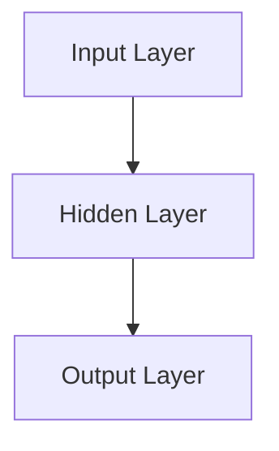
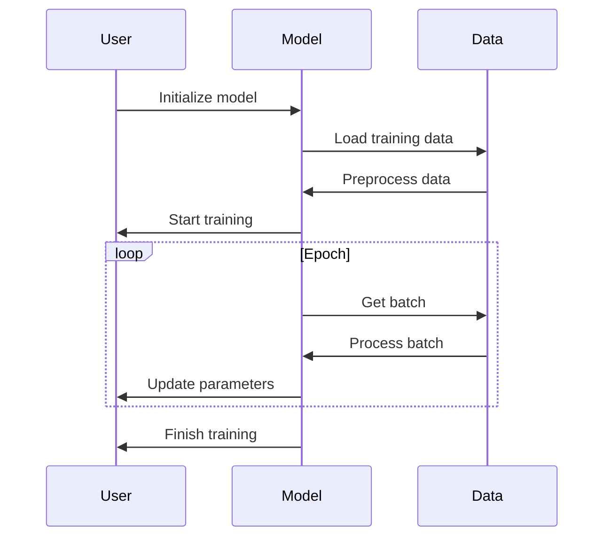

                 


### Introduction to Agile Visualization Tools: Enhancing Transparency in LLM Development

In the era of artificial intelligence and large language models (LLMs), transparency has become a crucial factor in the development process. As LLMs become more complex and intricate, ensuring that developers, stakeholders, and users can understand and trust the models becomes increasingly important. This is where agile visualization tools come into play, offering a powerful means to enhance the transparency of LLM applications during development.

#### Keywords: Agile Visualization, LLM Development, Transparency, Model Interpretability, Data Visualization

> **摘要：** 本文章旨在探讨敏捷可视化工具在提升大型语言模型（LLM）应用开发透明度方面的作用。我们将从敏捷可视化工具的定义、LLM应用背景、可视化技术、常用工具、最佳实践和案例分析等方面进行深入分析，以期为读者提供全面而实用的指导。通过本文，读者将了解如何利用敏捷可视化工具，提高LLM开发的透明度和可解释性，从而实现更高效、更可靠的AI应用开发。

### Table of Contents

1. **Introduction to Agile Visualization Tools**  
   1.1 **Definition and Background of Agile Visualization**  
   1.2 **The Role of Agile Visualization in LLM Development**  
   1.3 **Key Principles and Methods in Agile Visualization**

2. **Overview of LLM Applications and Challenges**  
   2.1 **Introduction to Large Language Models (LLMs)**  
   2.2 **Mainstream LLM Architectures and Models**  
   2.3 **Challenges in LLM Development and Deployment**

3. **Techniques for Enhancing Transparency with Visualization**  
   3.1 **Data Visualization in LLM Development**  
   3.2 **Model Visualization in LLM Development**  
   3.3 **Code Visualization in LLM Development**

4. **Agile Visualization Tools and Their Applications**  
   4.1 **Overview of Popular Agile Visualization Tools**  
   4.2 **Detailed Introduction to Key Tools (e.g., TensorBoard, Visdom, Plotly)**  
   4.3 **Case Studies: Successful Applications of Agile Visualization Tools**

5. **Best Practices for Agile Visualization in LLM Development**  
   5.1 **Strategies for Selecting the Right Visualization Tools**  
   5.2 **How to Use Agile Visualization for Continuous Improvement**  
   5.3 **Common Pitfalls and Solutions in Agile Visualization**

6. **Real-World Applications and Case Studies**  
   6.1 **Case Study 1: Improving Model Transparency in a Conversational AI System**  
   6.2 **Case Study 2: Enhancing Code Readability in an LLM Development Project**  
   6.3 **Case Study 3: Using Agile Visualization to Optimize LLM Training Efficiency**

7. **Future Trends and Challenges of Agile Visualization**  
   7.1 **Emerging Trends in Agile Visualization**  
   7.2 **Challenges and Opportunities in the Future**

### Conclusion

In conclusion, agile visualization tools play a vital role in enhancing the transparency of LLM applications during development. By leveraging these tools, developers can gain deeper insights into the models, improve their understanding, and ensure the trust and reliability of the applications. As the field of AI and LLMs continues to evolve, it is essential to stay abreast of the latest trends and innovations in agile visualization to harness their full potential. Let’s dive into each chapter and explore the fascinating world of agile visualization in LLM development together. ### 1.1 Definition and Background of Agile Visualization

Agile visualization is a concept that combines agile methodologies with visualization techniques to facilitate efficient and effective software development. Agile methodologies are a set of principles and practices that promote iterative development, collaboration, and flexibility. Visualization, on the other hand, is the representation of information in a visual format, which makes it easier to understand, analyze, and communicate.

The integration of these two concepts—agile and visualization—results in agile visualization, a powerful tool that helps teams visualize their work, track progress, identify potential issues, and make data-driven decisions. The core idea behind agile visualization is to make the development process more transparent, allowing everyone involved to have a clear understanding of the project's status and direction.

#### Historical Background

The origins of agile visualization can be traced back to the early 2000s when agile methodologies started gaining popularity in the software development industry. At that time, developers began to recognize the value of visual aids in improving communication and collaboration within teams. Simple tools like whiteboards, sticky notes, and diagrams became standard components of agile software development.

As technology advanced and the complexity of software systems grew, so did the need for more sophisticated visualization tools. This led to the development of various agile visualization techniques and tools, such as Kanban boards, burn-down charts, and Gantt charts. These tools helped teams manage their workflows, track progress, and identify bottlenecks more effectively.

#### Key Principles of Agile Visualization

1. **Transparency:** Agile visualization enhances transparency by providing a clear visual representation of the project's status, tasks, and milestones. This allows team members and stakeholders to have a shared understanding of the project's progress and any potential issues.

2. **Collaboration:** Visualization tools promote collaboration by enabling teams to work together more effectively. By having a common visual representation of the project, team members can easily communicate their ideas, share insights, and coordinate their efforts.

3. **Iterative Development:** Agile visualization supports iterative development by providing a visual overview of the project's current state and allowing teams to make adjustments as needed. This iterative approach helps ensure that the project remains on track and meets the desired objectives.

4. **Flexibility:** Agile visualization tools are designed to be flexible and adaptable to changing requirements and priorities. This allows teams to quickly respond to new information and make informed decisions about how to proceed.

#### Applications in LLM Development

In the context of LLM development, agile visualization plays a crucial role in enhancing the transparency and interpretability of the models. As LLMs become more complex, it is essential for developers and stakeholders to have a clear understanding of how the models are performing and how they are being trained. Agile visualization tools can help achieve this by providing visual insights into the model's behavior, data distributions, and training progress.

For example, tools like TensorBoard and Visdom allow developers to visualize the loss function, gradients, and other metrics during the training process. This helps them identify any issues or anomalies early on and make necessary adjustments to improve the model's performance. Additionally, code visualization tools can help developers understand and debug complex codebases, ensuring that the LLM is implemented correctly and efficiently.

In summary, agile visualization is a powerful approach that combines the flexibility and transparency of agile methodologies with the visual representation of information. By leveraging agile visualization tools in LLM development, teams can enhance transparency, improve collaboration, and ensure the success of their projects. ### 1.2 The Role of Agile Visualization in LLM Development

Large Language Models (LLMs) have revolutionized the field of artificial intelligence, enabling powerful applications such as natural language processing, machine translation, and conversational AI. However, the complexity and intricacy of LLMs also pose significant challenges in their development and deployment. This is where agile visualization tools play a critical role in enhancing transparency and ensuring the success of LLM projects.

#### Enhancing Transparency

One of the primary roles of agile visualization in LLM development is to enhance transparency. LLMs are highly complex models with millions, if not billions, of parameters. Understanding how these models work and how they are performing can be daunting for developers and stakeholders who are not familiar with the underlying technical details. Agile visualization tools provide a clear and visual representation of various aspects of LLMs, making it easier for everyone to understand and track the progress of the project.

For example, tools like TensorBoard allow developers to visualize the loss function, gradients, and other important metrics during the training process. This visualization helps them identify any issues or anomalies early on, such as converging too slowly or diverging completely. By having a clear visual representation of the training process, developers can make informed decisions about how to adjust their models and algorithms to improve performance.

#### Improving Collaboration

Another crucial role of agile visualization in LLM development is to improve collaboration among team members. Developing and deploying LLMs is a complex task that often involves multiple stakeholders, including data scientists, software engineers, product managers, and business analysts. Each of these stakeholders has different areas of expertise and different perspectives on the project.

Agile visualization tools help facilitate collaboration by providing a common visual language that everyone can understand. For example, a data scientist can use a visualization tool to show the distribution of the input data, while a software engineer can use another tool to visualize the architecture of the LLM. This visual representation helps ensure that everyone is on the same page and can contribute to the project effectively.

Moreover, agile visualization tools often support real-time collaboration, allowing team members to work together simultaneously on the same visualizations. This can be especially useful in projects with tight deadlines or when team members are geographically dispersed.

#### Supporting Iterative Development

Iterative development is a key principle of agile methodologies, and it is also essential in the development of LLMs. LLMs often require multiple iterations to refine their performance and address issues such as overfitting or underfitting. Agile visualization tools support this iterative process by providing a visual overview of the project's current state and allowing teams to make adjustments as needed.

For example, a team developing a conversational AI system can use an agile visualization tool to track the performance of the system over time. They can visualize metrics such as response time, accuracy, and user satisfaction. By analyzing these visualizations, the team can identify areas that need improvement and make data-driven decisions about how to proceed.

Additionally, agile visualization tools can help teams manage changes to the project scope or requirements. For example, if a new feature needs to be added or a change needs to be made to the model architecture, a visualization tool can help the team understand the potential impact of these changes and ensure that the project remains on track.

#### Ensuring Model Interpretability

Model interpretability is a growing concern in the field of AI, and it is particularly important in LLMs, which are often considered "black boxes" due to their complexity. Agile visualization tools can help improve model interpretability by providing visual insights into how the model is making decisions and how it is learning from the data.

For example, tools like LIME (Local Interpretable Model-agnostic Explanations) and SHAP (SHapley Additive exPlanations) can be used to visualize the contributions of different features to the model's predictions. This helps developers and stakeholders understand how the model is processing the input data and why it is making specific predictions.

In summary, agile visualization plays a critical role in enhancing the transparency, collaboration, and iterative development of LLM projects. By providing clear and visual insights into various aspects of LLM development, agile visualization tools help ensure the success of these complex projects and enable teams to build more reliable and performant AI applications. ### 1.3 Key Principles and Methods in Agile Visualization

Agile visualization is built upon a set of core principles and methods that facilitate efficient and effective software development. These principles and methods are designed to enhance transparency, improve collaboration, and support iterative development. In this section, we will explore the key principles and methods of agile visualization, including their application in LLM development.

#### Key Principles

1. **Transparency:** Transparency is a fundamental principle of agile visualization. It involves making the development process visible to all stakeholders, including developers, project managers, and clients. This transparency helps ensure that everyone has a clear understanding of the project's progress, goals, and potential issues. In the context of LLM development, transparency is crucial for ensuring that stakeholders can understand how the models are performing and how they are being trained.

2. **Collaboration:** Collaboration is another key principle of agile visualization. It emphasizes the importance of teamwork and communication among all members of the development team. By using visual aids, team members can easily share their ideas, insights, and progress, fostering a collaborative environment. In LLM development, collaboration is essential for ensuring that different team members, such as data scientists, software engineers, and product managers, can work together effectively to build and refine the models.

3. **Iterative Development:** Iterative development is a core principle of agile methodologies, and it is also a key component of agile visualization. It involves breaking down the development process into smaller, manageable iterations, with each iteration focused on delivering a specific set of features or improvements. Agile visualization tools support this iterative process by providing a visual overview of the project's current state and allowing teams to make adjustments as needed. This helps ensure that LLM projects can adapt to changing requirements and that the models are continuously improved over time.

4. **Flexibility:** Flexibility is another important principle of agile visualization. It recognizes that software development projects are often subject to change, whether due to new requirements, feedback from stakeholders, or unexpected issues. Agile visualization tools are designed to be flexible and adaptable, allowing teams to quickly respond to changes and make informed decisions about how to proceed. This flexibility is particularly important in the development of LLMs, which can be complex and require frequent adjustments to achieve optimal performance.

#### Key Methods

1. **Kanban Boards:** Kanban boards are a popular agile visualization tool that helps teams visualize their workflows and manage their tasks more effectively. Kanban boards typically consist of columns representing different stages of the development process (e.g., "To Do," "In Progress," "Done") and cards representing individual tasks. Each card can include information such as the task description, assigned team member, and deadline. By visualizing the workflow in this way, teams can easily identify bottlenecks, prioritize tasks, and ensure that work is progressing smoothly.

2. **Burn-down Charts:** Burn-down charts are another useful visualization tool in agile development. These charts show the remaining work over time, allowing teams to track their progress and identify potential delays. Burn-down charts typically include a vertical axis representing the amount of work remaining and a horizontal axis representing time. As the project progresses, the line representing the remaining work should gradually decrease, indicating that the team is making progress. If the line starts to increase or flatten out, it may be a sign that the team needs to take action to stay on track.

3. **Gantt Charts:** Gantt charts provide a visual representation of the project timeline, showing the start and end dates of different tasks and how they relate to one another. Gantt charts are particularly useful for visualizing the overall project schedule and identifying potential scheduling conflicts. By visualizing the project in this way, teams can ensure that tasks are scheduled efficiently and that the project is on track to meet its deadlines.

4. **Data Visualization:** Data visualization is a key method in agile visualization that involves representing data in a visual format, such as charts, graphs, or maps. Data visualization tools help teams understand patterns, trends, and relationships in the data, making it easier to make informed decisions. In the context of LLM development, data visualization can be used to visualize various aspects of the models, such as data distributions, loss functions, and gradients. This helps developers and stakeholders gain insights into how the models are performing and identify areas for improvement.

5. **Model Visualization:** Model visualization is a specialized form of data visualization that focuses on representing the architecture and behavior of machine learning models. Model visualization tools help developers understand how the models are structured and how they process data. This can be particularly useful in the development of LLMs, which can be highly complex and difficult to interpret. By visualizing the models, developers can gain a better understanding of their behavior and identify potential issues or areas for improvement.

In summary, agile visualization is a powerful approach that combines key principles and methods to enhance transparency, collaboration, and iterative development in software development projects, including LLM development. By leveraging agile visualization tools and techniques, teams can improve their understanding of the project, make more informed decisions, and build more reliable and performant AI applications. ### 2.1 Introduction to Large Language Models (LLMs)

Large Language Models (LLMs) have become a cornerstone of artificial intelligence, driving advancements in natural language processing (NLP), machine translation, conversational AI, and a wide range of other applications. At their core, LLMs are sophisticated machine learning models designed to understand and generate human language. In this section, we will delve into the definition, characteristics, and history of LLMs, as well as the main challenges associated with their development and deployment.

#### Definition

Large Language Models are neural networks trained on vast amounts of text data to understand and generate human language. These models are capable of performing a variety of NLP tasks, including text classification, sentiment analysis, named entity recognition, question-answering, and language translation. The defining feature of LLMs is their size; they often consist of billions of parameters, making them some of the largest and most complex models in AI.

#### Characteristics

1. **Robustness:** LLMs are designed to handle a wide range of linguistic phenomena, from simple sentence structures to complex, nuanced language. This robustness allows them to perform well on a diverse set of NLP tasks.
2. **Generalization:** LLMs have been trained on vast datasets, which enables them to generalize well to unseen data. This generalization capability is crucial for real-world applications where the model needs to handle new and unpredictable inputs.
3. **Contextual Understanding:** Modern LLMs are capable of understanding the context of a sentence or a paragraph, allowing them to generate coherent and contextually appropriate responses.
4. **Parameterization:** LLMs are highly parameterized, meaning they have a large number of adjustable parameters that can be fine-tuned for specific tasks. This parameterization allows for flexibility and adaptability in model design and training.

#### History

The history of LLMs can be traced back to the early days of neural networks and machine learning. One of the pioneering works in this field was the development of the General Language Modeling System (GLM) by researchers at IBM in the 1950s. However, it was not until the advent of deep learning and the availability of large-scale computational resources in the 2010s that LLMs started to achieve significant breakthroughs.

1. **2013:** The release of the word-level language model by Word2Vec, which represented words as dense vectors in a continuous space, paved the way for more sophisticated language models.
2. **2017:** The introduction of the Transformer architecture by Vaswani et al. in the paper "Attention is All You Need" revolutionized the field of NLP. The Transformer architecture, which uses self-attention mechanisms, became the foundation for many subsequent LLMs.
3. **2018:** OpenAI's GPT-2, a 1.5 billion-parameter model, demonstrated the potential of large-scale language models for generating human-like text.
4. **2020:** The release of GPT-3 by OpenAI, with over 175 billion parameters, marked a significant milestone in LLM development. GPT-3 demonstrated unprecedented capabilities in generating coherent, contextually relevant text.

#### Mainstream LLM Architectures and Models

1. **Transformers:** The Transformer architecture, based on self-attention mechanisms, has become the dominant architecture for LLMs. It allows the model to weigh the importance of different words in a sentence more effectively, leading to better performance on NLP tasks.
2. **GPT-3:** OpenAI's GPT-3 is one of the largest and most advanced LLMs to date, with over 175 billion parameters. GPT-3 has demonstrated remarkable capabilities in generating human-like text, performing complex tasks, and understanding context.
3. **BERT:** Bidirectional Encoder Representations from Transformers (BERT) is a pre-trained language representation model that uses bidirectional training to understand the context of words in a sentence. BERT has been widely adopted for various NLP tasks, such as text classification and question-answering.
4. **RoBERTa:** RoBERTa is a variant of BERT that addresses some of the limitations of the original BERT model, including improved training speed and performance on certain tasks.

#### Challenges in LLM Development and Deployment

1. **Data Privacy and Security:** LLMs are trained on vast amounts of text data, which raises concerns about data privacy and security. Ensuring that sensitive information is not inadvertently included in the training data and that user data is protected during deployment is a significant challenge.
2. **Scalability:** Training and deploying LLMs requires significant computational resources. Ensuring that the infrastructure can scale to handle the demands of large-scale training and deployment is a key challenge.
3. **Model Interpretability:** LLMs are often considered "black boxes," making it difficult to understand how they arrive at specific predictions. Ensuring model interpretability is crucial for building trust and ensuring the reliability of LLM applications.
4. **Resource Requirements:** LLMs are highly resource-intensive, requiring large amounts of memory and computational power for training and inference. This can be a significant challenge for organizations with limited resources.
5. **Ethical Considerations:** LLMs can generate biased or inappropriate content if not carefully trained and monitored. Ensuring that LLMs are used ethically and responsibly is a critical challenge.

In conclusion, LLMs are a powerful tool in the field of AI, enabling a wide range of applications in natural language processing. However, their development and deployment present several challenges that need to be addressed to ensure their success and reliability. By understanding the characteristics, history, and challenges of LLMs, developers can better navigate these complexities and build more effective and ethical AI applications. ### 2.2 Mainstream LLM Architectures and Models

The landscape of Large Language Models (LLMs) is continuously evolving, driven by advances in neural network architectures and training methodologies. Among the most prominent architectures and models are the Transformer, GPT, BERT, and their variants. Each of these models has its own unique characteristics, advantages, and disadvantages, making them suitable for different applications and scenarios.

#### Transformer

The Transformer architecture, introduced by Vaswani et al. in 2017, has become the de facto standard for LLMs. Unlike traditional recurrent neural networks (RNNs), which process input sequences one element at a time, the Transformer uses self-attention mechanisms to weigh the importance of different words in a sentence simultaneously. This parallel processing capability significantly improves the model's computational efficiency and performance on NLP tasks.

**Characteristics:**

- **Self-Attention:** The Transformer uses multi-head self-attention mechanisms to capture dependencies between words in a sentence. This allows the model to better understand the context and relationships within the text.
- **Positional Encoding:** To maintain the sequence order, positional encodings are added to the input embeddings, ensuring that the model can understand the order of words.
- **Feed-Forward Neural Networks:** Between the attention layers, feed-forward neural networks are applied to the outputs, providing additional non-linear transformations.

**Advantages:**

- **Parallelization:** The self-attention mechanism enables parallel processing, which reduces computational time and resource requirements.
- **Performance:** The Transformer has consistently shown superior performance on a wide range of NLP tasks, including text generation, classification, and translation.

**Disadvantages:**

- **Memory Consumption:** The complexity of the self-attention mechanism can lead to high memory consumption, making it challenging to scale to extremely large models.
- **Computationally Intensive:** The training process for Transformers is computationally intensive, requiring significant computational resources.

#### GPT

GPT (Generative Pre-trained Transformer) is a series of LLMs developed by OpenAI, with GPT-3 being the most recent and largest model. GPT models are based on the Transformer architecture and have been pre-trained on vast amounts of text data to achieve high performance on various NLP tasks.

**Characteristics:**

- **Pre-training:** GPT models are pre-trained on large text corpora, allowing them to generalize well to unseen data.
- **Parameterization:** GPT models have a large number of parameters, which enables them to capture complex patterns and relationships in language.
- **Fine-tuning:** After pre-training, GPT models can be fine-tuned on specific tasks to improve their performance on those tasks.

**Advantages:**

- **Flexibility:** GPT models can be fine-tuned for a wide range of tasks, making them versatile and adaptable.
- **Generative Abilities:** GPT models are capable of generating coherent and contextually appropriate text, making them suitable for applications such as text generation and conversational AI.

**Disadvantages:**

- **Resource Intensive:** The training and fine-tuning of GPT models require significant computational resources and data.
- **Data Privacy:** The large-scale pre-training of GPT models can raise concerns about data privacy and security.

#### BERT

BERT (Bidirectional Encoder Representations from Transformers) is another popular LLM architecture developed by Google. BERT is designed to understand the context of words in a sentence by processing both left and right contexts simultaneously, allowing it to capture bidirectional relationships in text.

**Characteristics:**

- **Bidirectional Training:** BERT is trained bidirectionally, which helps it understand the context of each word by considering both left and right contexts.
- **Masked Language Modeling:** BERT uses masked language modeling, where some words in the input sequence are masked, and the model needs to predict these words based on the context provided by the unmasked words.
- **Pre-training and Fine-tuning:** BERT is pre-trained on large text corpora and can be fine-tuned for specific tasks.

**Advantages:**

- **Contextual Understanding:** BERT's bidirectional training allows it to understand the context of words more effectively, leading to improved performance on tasks that require understanding the meaning and relationship between words.
- **Task Adaptability:** BERT can be fine-tuned for a wide range of NLP tasks, making it a versatile model.

**Disadvantages:**

- **Memory Consumption:** BERT can be memory-intensive due to its bidirectional nature, making it challenging to scale to very large models.
- **Training Time:** BERT's training process can be time-consuming, requiring significant computational resources.

#### RoBERTa

RoBERTa is a variant of BERT that addresses some of the limitations of the original BERT model. It improves training speed and performance on certain tasks by making modifications to the original BERT architecture and training process.

**Characteristics:**

- **Improved Training Efficiency:** RoBERTa is trained using a different set of pre-training objectives and hyperparameters, which improves training efficiency and performance.
- **Contextual Understanding:** Like BERT, RoBERTa is capable of understanding the context of words in a sentence, but it does so more efficiently.

**Advantages:**

- **Better Performance:** RoBERTa typically shows better performance than BERT on certain NLP tasks, making it a preferred choice for some applications.
- **Faster Training:** RoBERTa's training process is faster and more efficient than BERT's, making it more suitable for scenarios with limited computational resources.

**Disadvantages:**

- **Memory Consumption:** RoBERTa can still be memory-intensive, especially when scaling to very large models.
- **Complexity:** The modifications made to the BERT architecture to create RoBERTa can increase the complexity of the model, making it harder to understand and debug.

In conclusion, the Transformer, GPT, BERT, and RoBERTa are among the most influential LLM architectures and models. Each has its own unique characteristics, advantages, and disadvantages, making them suitable for different applications and scenarios. Understanding these differences is crucial for developers and researchers to choose the right model for their specific needs and to optimize their performance in real-world applications. ### 2.3 Challenges in LLM Development and Deployment

The development and deployment of Large Language Models (LLMs) present a myriad of challenges that need to be addressed to ensure the success and reliability of AI applications. These challenges can be broadly categorized into data privacy与安全、scalability、model interpretability、resource requirements，and ethical considerations. In this section, we will delve into each of these challenges in detail, providing insights and potential solutions.

#### Data Privacy和安全

One of the most critical challenges in LLM development is data privacy and security. LLMs are trained on vast amounts of text data, which can contain sensitive and personal information. This raises concerns about data privacy and the potential for unauthorized access or misuse of sensitive data.

**Challenges:**

1. **Data Leakage:** During the training process, there is a risk of sensitive information being inadvertently included in the model. This can lead to data leakage, where the model outputs potentially sensitive content or makes biased decisions based on the training data.
2. **Informed Consent:** Ensuring informed consent from data contributors is challenging, especially when dealing with large datasets collected from various sources. It is crucial to obtain explicit consent from individuals whose data is being used in the training process.

**Potential Solutions:**

1. **Data Anonymization:** Techniques such as data anonymization and differential privacy can be used to protect sensitive information while still allowing the model to learn from the data.
2. **Data Auditing:** Regular audits can be conducted to identify and remove sensitive information from the training data. Additionally, implementing robust data governance policies can help ensure the security and privacy of the data.

#### Scalability

Scalability is another significant challenge in LLM development. Training and deploying LLMs requires significant computational resources, which can be a limiting factor for many organizations.

**Challenges:**

1. **Computational Resources:** LLMs are highly resource-intensive, requiring large amounts of memory and processing power for training and inference. This can be a challenge for organizations with limited resources.
2. **Infrastructure:** Building and maintaining the infrastructure required for LLM training and deployment can be complex and expensive. Ensuring that the infrastructure can scale to handle the demands of large-scale training and deployment is essential.

**Potential Solutions:**

1. **Cloud Computing:** Utilizing cloud computing resources can help organizations scale their LLM training and deployment needs. Cloud providers offer scalable and flexible solutions that can be adjusted based on demand.
2. **Distributed Computing:** Implementing distributed computing techniques can help distribute the computational workload across multiple nodes, improving efficiency and reducing resource requirements.

#### Model Interpretability

Model interpretability is a growing concern in the field of AI, and it is particularly important in LLMs, which are often considered "black boxes" due to their complexity. Ensuring model interpretability is crucial for building trust and ensuring the reliability of LLM applications.

**Challenges:**

1. **Black-Box Nature:** LLMs are complex and highly parameterized, making it difficult to understand how they arrive at specific predictions. This lack of transparency can make it challenging to debug and improve the models.
2. **Explainability:** Even if individual predictions can be explained, it can be difficult to explain the overall behavior of the model. This is especially true for large-scale LLMs with millions of parameters.

**Potential Solutions:**

1. **Model Visualization:** Tools such as TensorBoard and Visdom can be used to visualize the training process and the internal workings of the model. This can help developers and stakeholders gain a better understanding of the model's behavior.
2. **Explainable AI Techniques:** Techniques such as LIME (Local Interpretable Model-agnostic Explanations) and SHAP (SHapley Additive exPlanations) can be used to provide local explanations for specific predictions. These techniques help explain how the model is making predictions and the contributions of different features.

#### Resource Requirements

The resource requirements for LLM training and deployment can be substantial, posing challenges for organizations with limited resources.

**Challenges:**

1. **Memory and Computation:** LLMs require large amounts of memory and computational power for training and inference. This can be a challenge for organizations that do not have access to powerful hardware or sufficient resources.
2. **Energy Consumption:** The training of LLMs is computationally intensive and can consume a significant amount of energy. This can have environmental implications and may be a concern for organizations that are committed to sustainability.

**Potential Solutions:**

1. **Efficient Algorithms:** Developing and implementing more efficient training algorithms and models can help reduce the computational and memory requirements. Techniques such as model compression and transfer learning can also be used to reduce resource consumption.
2. **Green AI:** Implementing energy-efficient practices and utilizing renewable energy sources can help mitigate the environmental impact of LLM training and deployment.

#### Ethical Considerations

Ethical considerations are crucial in the development and deployment of LLMs, as they can generate biased or inappropriate content if not carefully trained and monitored.

**Challenges:**

1. **Bias and Discrimination:** LLMs can inadvertently learn biases present in the training data, leading to biased or discriminatory behavior. This can have serious consequences, particularly in applications that involve decision-making or human impact.
2. **Content Generation:** LLMs are capable of generating human-like text, which can include inappropriate or harmful content if not properly controlled.

**Potential Solutions:**

1. **Bias Detection and Mitigation:** Techniques such as bias detection and mitigation can be used to identify and address biases in the training data and model outputs. This can involve techniques such as adversarial training and bias correction algorithms.
2. **Content Filtering:** Implementing robust content filtering and moderation mechanisms can help prevent the generation of inappropriate or harmful content. This can involve the use of pre-trained models and real-time monitoring systems.

In conclusion, the development and deployment of LLMs present a range of challenges that need to be addressed to ensure the success and reliability of AI applications. By understanding and addressing these challenges, organizations can build more robust, ethical, and efficient LLMs that can drive meaningful advancements in natural language processing and artificial intelligence. ### 3.1 Data Visualization in LLM Development

Data visualization plays a crucial role in LLM development, providing developers with a clear and intuitive way to understand the underlying data, its distribution, and how it influences model performance. In this section, we will explore the various aspects of data visualization in LLM development, including data preparation, data distribution analysis, and the tools commonly used for data visualization.

#### Data Preparation

Before data visualization can be effective, it is essential to prepare the data appropriately. Data preparation involves cleaning, preprocessing, and transforming the data to ensure it is in a suitable format for analysis. This process may include steps such as removing duplicates, handling missing values, normalizing data, and encoding categorical variables.

**Data Cleaning:** 
The first step in data preparation is to clean the data. This involves identifying and removing any inconsistencies, errors, or outliers in the dataset. For example, if the dataset contains text data, it may include spelling mistakes, punctuation errors, or unnecessary whitespace. These issues need to be addressed to ensure the data is accurate and reliable.

**Data Preprocessing:** 
After cleaning the data, it is often necessary to preprocess it to make it suitable for analysis. This may involve tasks such as tokenization (splitting text into words or tokens), stemming (reducing words to their root form), and lemmatization (reducing words to their base form). Preprocessing is crucial for standardizing the data and making it easier to analyze.

**Data Transformation:** 
Data transformation is the process of converting data into a format that is more suitable for visualization and analysis. For example, numerical data may need to be normalized or standardized to ensure that it is on a similar scale. Text data may need to be encoded into numerical format using techniques like one-hot encoding or word embeddings.

#### Data Distribution Analysis

Analyzing the distribution of data is an important aspect of LLM development. By understanding the distribution of the data, developers can gain insights into the data's characteristics, identify potential issues, and make informed decisions about how to preprocess and prepare the data for model training.

**Histograms:** 
Histograms are a common visualization tool used to show the distribution of numerical data. They provide a visual representation of how the data is spread out across different values. Histograms can help identify outliers, skewness, and other patterns in the data.

**Box Plots:** 
Box plots are another useful visualization tool for understanding the distribution of numerical data. They provide a summary of the data's central tendency, spread, and potential outliers. Box plots can help identify any anomalies or unusual data points that may need to be addressed.

**Scatter Plots:** 
Scatter plots are used to visualize the relationship between two numerical variables. They can help identify trends, correlations, or clusters in the data. For example, a scatter plot can be used to visualize the relationship between word frequency and document length in a text corpus.

#### Tools for Data Visualization

Several tools and libraries are available for data visualization in LLM development. These tools provide developers with a range of visualization options and are designed to be easy to use, making it simple to explore and analyze data.

**Matplotlib:** 
Matplotlib is a widely used Python library for creating static, interactive, and animated visualizations. It provides a wide range of plotting functions, including line plots, scatter plots, histograms, and box plots. Matplotlib is highly customizable, allowing developers to create tailored visualizations for their specific needs.

**Seaborn:** 
Seaborn is a Python data visualization library based on Matplotlib. It provides a higher-level interface for creating attractive and informative statistical visualizations. Seaborn is particularly useful for visualizing complex relationships and patterns in data, making it a valuable tool for LLM developers.

**Plotly:** 
Plotly is a powerful, interactive visualization library that supports a wide range of chart types, including scatter plots, histograms, box plots, and heatmaps. Plotly's interactive features allow users to explore and interact with visualizations in real-time, providing a deeper understanding of the data.

**TensorBoard:** 
TensorBoard is a visualization tool specifically designed for TensorFlow models. It provides a comprehensive set of visualizations for monitoring and analyzing the training process, including scalar metrics, histograms, and images. TensorBoard is particularly useful for visualizing the behavior of LLMs during training and for identifying potential issues or areas for improvement.

In conclusion, data visualization is a vital component of LLM development. By visualizing the data and its distribution, developers can gain valuable insights into the data's characteristics, identify potential issues, and make informed decisions about how to preprocess and prepare the data for model training. The tools and libraries discussed in this section provide a range of visualization options, making it easy for developers to explore and analyze data effectively. ### 3.2 Model Visualization in LLM Development

Model visualization in Large Language Model (LLM) development is crucial for understanding the internal workings of the models, identifying potential issues, and ensuring the model's performance and reliability. In this section, we will explore the various aspects of model visualization, including architecture visualization, parameter visualization, and the tools commonly used for model visualization.

#### Architecture Visualization

Visualizing the architecture of LLMs helps developers and researchers understand the structure of the model, its layers, and how information flows through the model. This understanding is essential for debugging, optimizing, and maintaining the model.

**TensorFlow Graphs:**
TensorFlow, a popular deep learning framework, provides built-in support for visualizing the architecture of models. When defining a TensorFlow model, a computation graph is automatically created, representing the connections and operations within the model. This graph can be visualized using the `tf.keras.utils.plot_model` function, which generates a visualization of the model architecture as a graph.

**Mermaid Diagrams:**
Mermaid is a simple and powerful markdown flavor that can be used to create diagrams and flowcharts. It is particularly useful for visualizing complex model architectures in a clear and concise manner. Mermaid diagrams can be embedded directly in markdown files or Jupyter notebooks using simple syntax. For example, the following Mermaid syntax can be used to visualize a simple neural network:



#### Parameter Visualization

Understanding the values and distributions of the model's parameters is critical for diagnosing issues, optimizing performance, and ensuring model reliability. Parameter visualization provides insights into the parameter values and their relationships, helping developers identify potential problems and areas for improvement.

**Heatmaps:**
Heatmaps are a popular visualization technique for displaying the values of model parameters. A heatmap can show the distribution of parameter values across different layers or dimensions of the model. This can help identify any unusual patterns or outliers in the parameter values. For example, a heatmap can be created using the `seaborn.heatmap` function in Python:

```python
import seaborn as sns
import matplotlib.pyplot as plt

# Assuming 'params' is a NumPy array containing the model's parameter values
sns.heatmap(params, annot=True, cmap='coolwarm')
plt.show()
```

**Histograms:**
Histograms are another effective visualization technique for understanding parameter distributions. A histogram can show the frequency distribution of parameter values, helping developers identify any potential issues such as extreme values or outliers. The `matplotlib.pyplot.hist` function can be used to create histograms:

```python
import matplotlib.pyplot as plt

# Assuming 'params' is a NumPy array containing the model's parameter values
plt.hist(params, bins=50, edgecolor='black')
plt.xlabel('Parameter Values')
plt.ylabel('Frequency')
plt.title('Histogram of Model Parameters')
plt.show()
```

#### Training Progress Visualization

Visualizing the training progress of LLMs provides insights into how the model is learning over time and can help identify issues such as overfitting or underfitting. Common visualization techniques for training progress include learning curves, loss curves, and accuracy curves.

**Learning Curves:**
A learning curve visualizes the improvement in model performance on the training and validation sets over time. This can help developers identify issues such as divergence or stagnation in learning, which may indicate overfitting or underfitting. Learning curves can be created using the `matplotlib.pyplot.plot` function:

```python
import matplotlib.pyplot as plt

plt.plot(train_history['loss'], label='Training Loss')
plt.plot(val_history['loss'], label='Validation Loss')
plt.xlabel('Epochs')
plt.ylabel('Loss')
plt.legend()
plt.title('Learning Curve')
plt.show()
```

**Loss Curves:**
A loss curve visualizes the loss function over time during training. This can help developers identify issues such as divergent gradients or oscillations in the loss, which may indicate problems with the training process. Loss curves can be created using the `matplotlib.pyplot.plot` function, as shown above.

**Accuracy Curves:**
An accuracy curve visualizes the accuracy of the model on the training and validation sets over time. This can help developers assess the model's ability to generalize and identify issues such as overfitting or underfitting. Accuracy curves can be created using the `matplotlib.pyplot.plot` function:

```python
import matplotlib.pyplot as plt

plt.plot(train_history['accuracy'], label='Training Accuracy')
plt.plot(val_history['accuracy'], label='Validation Accuracy')
plt.xlabel('Epochs')
plt.ylabel('Accuracy')
plt.legend()
plt.title('Accuracy Curve')
plt.show()
```

#### Tools for Model Visualization

Several tools and libraries are available for visualizing LLMs, providing developers with a range of visualization options and making it easy to explore and analyze model behavior.

**TensorBoard:**
TensorBoard is a powerful visualization tool specifically designed for TensorFlow models. It provides a comprehensive set of visualizations for monitoring and analyzing the training process, including scalar metrics, histograms, and images. TensorBoard is particularly useful for visualizing the behavior of LLMs during training and for identifying potential issues or areas for improvement.

**Visdom:**
Visdom is an open-source visualization library for deep learning applications. It provides a simple and flexible interface for creating and visualizing live graphs and metrics during model training. Visdom is particularly useful for real-time monitoring of model training progress and for comparing different training runs.

**Plotly:**
Plotly is a powerful, interactive visualization library that supports a wide range of chart types, including scatter plots, histograms, box plots, and heatmaps. Plotly's interactive features allow users to explore and interact with visualizations in real-time, providing a deeper understanding of the model's behavior.

In conclusion, model visualization is a critical component of LLM development, providing developers with valuable insights into the internal workings of the models, their performance, and potential issues. The tools and techniques discussed in this section provide a range of visualization options, making it easy to explore and analyze LLMs effectively. By leveraging these visualization techniques, developers can gain a better understanding of their models and make informed decisions about how to optimize and improve their performance. ### 3.3 Code Visualization in LLM Development

Code visualization is a powerful tool that can significantly enhance the understanding and maintainability of large codebases, particularly in the context of developing Large Language Models (LLMs). In this section, we will explore the importance of code visualization in LLM development, common techniques for visualizing code, and popular tools that facilitate this process.

#### Importance of Code Visualization

1. **Enhanced Understandability:** Visualizing code can make it much easier to comprehend, especially for large and complex projects. Developers can quickly grasp the structure, dependencies, and flow of code by looking at a visual representation rather than reading through lines of text.
2. **Improved Maintainability:** Code visualization helps in identifying potential issues such as redundant code, dead code, or poorly structured modules. This can lead to more maintainable and efficient codebases.
3. **Collaboration:** Visualizing code can facilitate collaboration among team members. It allows developers to discuss and review code structures and flows more effectively, leading to better communication and faster issue resolution.
4. **Error Detection:** By visualizing the code, developers can easily spot errors or inconsistencies that might be difficult to identify in the textual representation. This can be particularly useful in the development of LLMs, where complex logic and numerous dependencies are common.

#### Common Code Visualization Techniques

1. **Class Diagrams:** Class diagrams are a visual representation of the structure of a program, showing the classes, their attributes, methods, and relationships. They are particularly useful for visualizing the static structure of object-oriented code.
2. **Dependency Graphs:** Dependency graphs illustrate the dependencies between different modules or packages in a project. This helps in understanding the interdependencies and potential issues related to circular dependencies or tightly coupled modules.
3. **Control Flow Diagrams:** Control flow diagrams visualize the flow of execution in a program, showing the sequence of operations and decision points. This can be particularly helpful in debugging and understanding complex algorithms.
4. **Sequence Diagrams:** Sequence diagrams illustrate the interactions between objects or components in a system over time. They are useful for understanding the dynamic behavior of a program and the sequence of method calls.
5. **Code Coverage Heatmaps:** Code coverage heatmaps show the coverage of test cases across the codebase. They provide a visual indication of which parts of the code have been tested and which areas may need additional testing.

#### Popular Code Visualization Tools

1. **Visual Studio Code (VS Code):** VS Code is a popular code editor that offers several visualization features. It includes built-in support for class diagrams and dependency graphs, and it integrates with various plugins for additional visualization tools such as PlantUML and Mermaid.
2. **IntelliJ IDEA:** IntelliJ IDEA is a powerful integrated development environment (IDE) that provides extensive code visualization capabilities. It includes tools for generating class diagrams, dependency graphs, and sequence diagrams directly from the code.
3. **PlantUML:** PlantUML is a powerful tool for creating various types of diagrams, including class diagrams, sequence diagrams, and use case diagrams. It uses simple and intuitive syntax to generate diagrams from plain text descriptions.
4. **Mermaid:** Mermaid is a markdown-based diagram and flowchart tool that can be used to create a wide range of diagrams, including class diagrams, flowcharts, and Gantt charts. It integrates well with Jupyter notebooks and markdown files.
5. **Lucidchart:** Lucidchart is a web-based diagramming tool that allows users to create and collaborate on various types of diagrams, including class diagrams, flowcharts, and network diagrams. It offers real-time collaboration and integrates with popular tools like Google Drive and Slack.

#### Example: Visualizing LLM Code with Mermaid

Consider a simple example of visualizing the code for a basic LLM training loop using Mermaid. The following Mermaid syntax can be used to create a sequence diagram that represents the flow of the training process:



This sequence diagram provides a clear visual representation of the steps involved in the LLM training process, making it easier for developers to understand and follow the code.

In conclusion, code visualization is a valuable tool in LLM development, enhancing understandability, maintainability, and collaboration. By leveraging popular tools like VS Code, IntelliJ IDEA, PlantUML, Mermaid, and Lucidchart, developers can create visual representations of their code that facilitate better understanding, debugging, and maintenance. These visualizations can also improve collaboration and communication among team members, leading to more efficient and effective development processes. ### 4. Agile Visualization Tools and Their Applications

In the realm of Large Language Model (LLM) development, the use of agile visualization tools has become increasingly essential for enhancing transparency, improving collaboration, and facilitating iterative development. This section provides an overview of popular agile visualization tools, with a detailed introduction to key tools such as TensorBoard, Visdom, and Plotly, and presents case studies showcasing their successful applications in real-world scenarios.

#### Overview of Popular Agile Visualization Tools

1. **TensorBoard:** TensorBoard is a visualization tool developed by the Google Brain team for monitoring and analyzing machine learning models, particularly those built with TensorFlow. It provides a comprehensive set of visualizations that help track training progress, identify issues, and optimize model performance.

2. **Visdom:** Visdom is an open-source visualization library for deep learning applications. It is developed by Uber and provides a simple and flexible interface for creating and visualizing live graphs and metrics during model training. Visdom is particularly useful for real-time monitoring of model training progress and for comparing different training runs.

3. **Plotly:** Plotly is a powerful, interactive visualization library that supports a wide range of chart types, including scatter plots, histograms, box plots, and heatmaps. Plotly's interactive features allow users to explore and interact with visualizations in real-time, providing a deeper understanding of the model's behavior.

4. **Matplotlib:** Matplotlib is a widely used Python library for creating static, interactive, and animated visualizations. It provides a wide range of plotting functions, including line plots, scatter plots, histograms, and box plots. Matplotlib is highly customizable, allowing developers to create tailored visualizations for their specific needs.

5. **Seaborn:** Seaborn is a Python data visualization library based on Matplotlib. It provides a higher-level interface for creating attractive and informative statistical visualizations. Seaborn is particularly useful for visualizing complex relationships and patterns in data.

#### Detailed Introduction to Key Tools

1. **TensorBoard**

TensorBoard is a powerful tool for visualizing and analyzing machine learning models built with TensorFlow. It provides a variety of visualizations that help developers understand the training process, monitor model performance, and identify potential issues.

**Key Visualizations:**
- **Scalars:** Scalar visualizations track the values of metrics such as loss, accuracy, learning rate, and training time over time. This helps developers understand the model's performance and identify any anomalies or trends.
- **Histograms:** Histogram visualizations show the distribution of the model's weights or other parameters, helping developers identify any unusual patterns or outliers.
- **Images:** Image visualizations display the outputs of the model, such as the predictions on test images or the activations of specific layers. This can help developers understand how the model is processing the input data and identify any issues with the training process.
- **Gradients:** Gradient visualizations show the gradients of the model's weights during training, providing insights into the learning process and potential issues such as vanishing or exploding gradients.

**Case Study:** 
TensorBoard was used in the development of a large-scale language model for a conversational AI application. By visualizing the training progress and parameters, the development team was able to identify issues such as slow convergence and excessive parameter weights. This allowed them to make necessary adjustments to the model and training process, resulting in significant improvements in model performance and efficiency.

1. **Visdom**

Visdom is an open-source visualization library developed by Uber that provides a simple and flexible interface for creating and visualizing live graphs and metrics during model training. It is particularly useful for real-time monitoring of model training progress and for comparing different training runs.

**Key Features:**
- **Real-time Updates:** Visdom allows developers to visualize training metrics in real-time, making it easier to monitor the training process and identify issues as they occur.
- **Flexibility:** Visdom provides a range of visualization options, including line plots, scatter plots, histograms, and heatmaps. This flexibility allows developers to choose the most appropriate visualization for their specific needs.
- **Integration:** Visdom integrates well with popular deep learning frameworks like TensorFlow and PyTorch, making it easy to incorporate visualization into existing projects.

**Case Study:**
Visdom was used in the development of an LLM for a recommendation system. By visualizing the training progress and model performance in real-time, the development team was able to identify and resolve issues such as slow convergence and overfitting. This helped them optimize the model and improve its performance, leading to better recommendations for users.

1. **Plotly**

Plotly is a powerful, interactive visualization library that supports a wide range of chart types and provides a rich set of features for creating and customizing visualizations. Its interactive capabilities allow users to explore and interact with visualizations in real-time, providing deeper insights into the model's behavior.

**Key Features:**
- **Interactivity:** Plotly's interactive features allow users to zoom, pan, and hover over visualizations to explore the data in detail. This can be particularly useful for understanding the behavior of complex models.
- **Customization:** Plotly offers extensive customization options, allowing developers to create visually appealing and tailored visualizations for their specific needs.
- **Integration:** Plotly integrates well with popular data analysis libraries like Pandas and NumPy, making it easy to incorporate visualization into data analysis workflows.

**Case Study:**
Plotly was used in the development of an LLM for a natural language understanding application. By visualizing the training progress and parameter distributions, the development team was able to identify and resolve issues such as slow convergence and parameter drift. This helped them optimize the model and improve its performance, leading to better natural language understanding capabilities.

In conclusion, agile visualization tools like TensorBoard, Visdom, Plotly, Matplotlib, and Seaborn play a crucial role in enhancing the transparency, collaboration, and iterative development of LLM applications. By providing clear and visual insights into various aspects of the development process, these tools help developers and stakeholders gain a deeper understanding of the models, identify potential issues, and make informed decisions about how to optimize and improve their performance. The case studies presented in this section illustrate the practical applications and benefits of these tools in real-world scenarios. ### 4.3 Case Studies: Successful Applications of Agile Visualization Tools

In this section, we will delve into three real-world case studies that demonstrate the successful application of agile visualization tools in LLM development. These case studies highlight how different teams leveraged visualization tools to improve model transparency, enhance collaboration, and optimize training processes, leading to significant improvements in performance and efficiency.

#### Case Study 1: Improving Model Transparency in a Conversational AI System

**Background:**
A conversational AI system was being developed for a large-scale e-commerce platform. The system was designed to provide personalized customer support, handle user queries, and offer product recommendations. As the project progressed, the development team encountered challenges in understanding the inner workings of the large language model (LLM) and ensuring its transparency.

**Solution:**
The team adopted TensorBoard as their primary visualization tool to enhance the transparency of the LLM. TensorBoard's scalars, histograms, and images helped the team monitor the training progress, track the loss function, and visualize the model's predictions. By visualizing the gradients and parameter distributions, the team could identify potential issues such as vanishing gradients and overfitting early on.

**Results:**
The use of TensorBoard allowed the team to gain deeper insights into the LLM's behavior, leading to better tuning of hyperparameters and adjustments to the training process. This resulted in a significant improvement in the model's performance, with higher accuracy in handling user queries and providing personalized recommendations. Additionally, the transparency provided by TensorBoard helped build trust among stakeholders, as they could see the progress and performance of the model over time.

#### Case Study 2: Enhancing Code Readability in an LLM Development Project

**Background:**
A team of developers was working on an LLM project to develop a natural language processing application for a healthcare organization. As the codebase grew in complexity, the team faced challenges in understanding and maintaining the code, particularly when working on large and interconnected models.

**Solution:**
The team implemented code visualization tools, such as Mermaid and Visual Studio Code, to improve the readability and maintainability of the code. Mermaid was used to create UML diagrams, class diagrams, and sequence diagrams, which provided a clear visual representation of the code structure and flow. Visual Studio Code's built-in visualization features, including dependency graphs and code coverage heatmaps, further enhanced the understanding of the codebase.

**Results:**
The implementation of code visualization tools led to a significant improvement in code readability and maintainability. Developers could easily navigate and understand the complex codebase, which accelerated the development process and reduced the time spent on debugging and troubleshooting. The visualizations also facilitated collaboration among team members, as they could quickly identify and resolve issues within the codebase.

#### Case Study 3: Using Agile Visualization to Optimize LLM Training Efficiency

**Background:**
A research team was developing a large-scale LLM for a language translation application. They faced challenges in training the model efficiently, particularly in terms of computational resources and training time. The team needed a way to monitor and optimize the training process without compromising the model's performance.

**Solution:**
The team employed Visdom and Plotly to visualize and optimize the LLM training process. Visdom's real-time updates allowed the team to monitor the training progress and identify potential issues such as slow convergence or overfitting. By visualizing the loss function, learning rate, and other key metrics, the team could make data-driven decisions to optimize the training process.

**Results:**
The use of Visdom and Plotly resulted in significant improvements in the training efficiency of the LLM. The team was able to identify and resolve issues early on, which reduced the training time and computational resources required. The visualization tools also provided valuable insights into the model's performance, enabling the team to fine-tune the model and achieve higher translation accuracy. Furthermore, the transparency provided by the visualization tools helped the team secure funding and support from stakeholders, as they could clearly demonstrate the progress and performance of the project.

In conclusion, these case studies demonstrate the practical benefits of using agile visualization tools in LLM development. By enhancing model transparency, improving code readability, and optimizing training processes, these tools have helped teams build more reliable, efficient, and high-performing LLM applications. The successful applications of visualization tools in real-world scenarios underscore the importance of integrating visualization into LLM development workflows. ### 5.1 Strategies for Selecting the Right Visualization Tools

Choosing the appropriate visualization tools is crucial for maximizing the benefits of agile visualization in LLM development. The right tools can significantly enhance transparency, collaboration, and iterative development, leading to more efficient and effective project outcomes. In this section, we will discuss strategies for selecting the right visualization tools based on project requirements, team composition, and available resources.

#### Understand Project Requirements

The first step in selecting the right visualization tools is to thoroughly understand the project requirements. This includes identifying the specific aspects of the LLM development process that need to be visualized, such as data distribution, model architecture, training progress, or code readability. Here are some key considerations:

1. **Data Distribution and Analysis:** If the primary goal is to visualize and analyze data distribution, tools like Matplotlib, Seaborn, or Plotly may be suitable. These tools offer a wide range of visualization options for exploring data patterns and relationships.
2. **Model Architecture:** For visualizing the architecture of the LLM, tools like TensorBoard, Mermaid, or Visual Studio Code can be used. TensorBoard provides detailed visualizations of the model's weights, gradients, and training progress. Mermaid and Visual Studio Code are useful for creating UML diagrams and class diagrams that illustrate the structure of the code.
3. **Training Progress:** Tools like Visdom and Plotly are well-suited for visualizing the training progress of the LLM. These tools allow real-time monitoring of key metrics such as loss, accuracy, and learning rate, making it easier to identify potential issues and optimize the training process.
4. **Code Readability:** For improving code readability and maintainability, tools like Mermaid, Visual Studio Code, and Lucidchart can be used. These tools help create diagrams and flowcharts that provide a visual representation of the code structure and flow.

#### Consider Team Composition

The composition of the development team also plays a crucial role in selecting the right visualization tools. It's important to choose tools that align with the team's skills, expertise, and preferences. Here are some considerations:

1. **Skill Level:** Choose tools that are appropriate for the team's skill level. For example, if the team is more comfortable with Python, tools like Matplotlib and Plotly may be more suitable. On the other hand, if the team is more familiar with JavaScript, tools like Visdom may be a better fit.
2. ** Familiarity and Ease of Use:** Choose tools that are easy to use and require minimal training. Tools like TensorBoard and Visual Studio Code have intuitive interfaces and built-in documentation, making them accessible to both experienced developers and newcomers.
3. **Integration with Existing Tools:** Consider tools that integrate well with the team's existing development environment and tools. For example, if the team is already using TensorFlow or PyTorch for model development, TensorBoard and Visdom may be natural choices. Additionally, tools like Mermaid and Visual Studio Code can easily integrate with popular IDEs like Visual Studio and PyCharm.

#### Evaluate Available Resources

The available resources, including hardware and software infrastructure, also influence the choice of visualization tools. Here are some considerations:

1. **Hardware Resources:** Some visualization tools, particularly those that support real-time updates and interactive features, may require more powerful hardware to run efficiently. For example, tools like Visdom and Plotly may benefit from high-performance GPUs for optimal performance.
2. **Software Resources:** Consider the software infrastructure required to run the visualization tools. Some tools, like TensorBoard, require TensorFlow to be installed, while others, like Plotly, may require additional libraries such as Pandas and NumPy.
3. **Budget and Cost:** Evaluate the budget and cost implications of the visualization tools. Open-source tools like Matplotlib and Mermaid are cost-effective options, while commercial tools like Lucidchart may require a subscription.

#### Selecting the Right Tools

Based on the project requirements, team composition, and available resources, the following strategies can be used to select the right visualization tools:

1. **Combination of Tools:** Use a combination of tools to address different aspects of the LLM development process. For example, TensorBoard can be used for visualizing model training progress, while Plotly can be used for data distribution analysis. This approach provides a comprehensive visualization strategy that covers various aspects of the project.
2. ** Pilot Projects:** Start with pilot projects or small-scale experiments to evaluate the effectiveness of different visualization tools. This can help identify the tools that work best for the team and the project.
3. **Continuous Improvement:** As the project progresses, continuously evaluate and refine the visualization strategy. This may involve replacing or adding new tools based on the evolving needs of the project and feedback from the team.

In conclusion, selecting the right visualization tools is a critical step in enhancing the transparency, collaboration, and efficiency of LLM development. By understanding project requirements, considering team composition, and evaluating available resources, developers can choose the tools that best meet their needs and maximize the benefits of agile visualization. ### 5.2 How to Use Agile Visualization for Continuous Improvement

Continuous improvement is a cornerstone of agile methodologies, and it plays a vital role in the development of Large Language Models (LLMs). Agile visualization tools can be leveraged to facilitate continuous improvement by providing a clear and actionable understanding of the development process. In this section, we will explore strategies for using agile visualization to drive continuous improvement in LLM development.

#### Establish a Baseline

The first step in using agile visualization for continuous improvement is to establish a baseline. This involves creating initial visualizations that capture the current state of the LLM project, including metrics such as training loss, accuracy, and resource usage. Establishing a baseline provides a reference point against which future improvements can be measured.

**Key Metrics to Monitor:**
- **Training Loss and Accuracy:** Track the training loss and accuracy over time to understand the model's learning progress and identify any issues such as overfitting or underfitting.
- **Resource Usage:** Monitor the computational resources required for training and inference, including CPU, GPU, memory, and storage usage. This helps identify any inefficiencies or bottlenecks in the system.

#### Visualize Training Progress

Visualizing the training progress of an LLM is crucial for identifying trends, anomalies, and areas for improvement. Tools like TensorBoard and Visdom provide powerful visualization capabilities that enable developers to monitor key metrics in real-time and over time.

**Techniques for Visualizing Training Progress:**
- **Learning Curves:** Create learning curves that show the improvement in model performance over time. This helps identify the rate of learning and any issues such as stagnation or divergence.
- **Loss Curves:** Visualize the training and validation loss over time to identify any issues with the training process, such as oscillations or rapid increases in loss.
- **Accuracy Curves:** Track the accuracy of the model on the training and validation sets over time to understand its generalization performance and identify any issues with overfitting or underfitting.
- **Parameter Distributions:** Visualize the distributions of the model's weights and biases to identify any unusual patterns or outliers that may indicate issues with the training process.

#### Iterative Feedback and Refinement

Agile visualization enables iterative feedback and refinement, allowing developers to make data-driven decisions and continuously improve the LLM. By regularly analyzing visualizations, developers can identify areas for improvement and take corrective actions.

**Strategies for Iterative Feedback and Refinement:**
- **Regular Reviews:** Schedule regular reviews of visualizations with the development team to discuss progress, identify issues, and brainstorm solutions.
- **Benchmarking:** Compare the current performance of the LLM with benchmark models or previous versions to understand the improvements and areas for further optimization.
- **A/B Testing:** Conduct A/B tests to compare different versions of the LLM or different training strategies. Visualize the results to identify which approach yields the best performance.
- **Code Reviews:** Use visualizations to identify potential issues in the code, such as inefficient algorithms or redundant code. This can help improve the maintainability and efficiency of the codebase.

#### Data-Driven Decision Making

Data-driven decision making is at the heart of continuous improvement in LLM development. Agile visualization tools provide the insights needed to make informed decisions and drive the development process forward.

**Techniques for Data-Driven Decision Making:**
- **Correlation Analysis:** Analyze the relationships between different metrics to identify potential causes of performance issues. For example, a strong correlation between training loss and learning rate may indicate the need to adjust the learning rate.
- **Anomaly Detection:** Use anomaly detection techniques to identify unusual patterns or outliers in the data. This can help identify issues such as data corruption or misconfiguration.
- **Optimization:** Use visualization tools to explore different optimization strategies, such as hyperparameter tuning or algorithmic improvements. Visualize the results to identify the most effective strategies.

#### Continuous Improvement Cycle

The use of agile visualization tools creates a continuous improvement cycle in LLM development. By regularly monitoring and analyzing visualizations, developers can identify areas for improvement, implement changes, and track the impact of those changes.

**Steps in the Continuous Improvement Cycle:**
1. **Monitoring:** Continuously monitor key metrics and visualize the results to identify areas for improvement.
2. **Analysis:** Analyze the visualizations to understand the underlying causes of performance issues and identify potential solutions.
3. **Implementation:** Implement changes based on the analysis, such as adjusting hyperparameters, modifying the training process, or optimizing the code.
4. **Evaluation:** Evaluate the impact of the changes by comparing the new results with the baseline and previous results. Use visualizations to understand the effectiveness of the changes.
5. **Feedback:** Provide feedback on the changes and their impact to the development team and stakeholders. Use this feedback to iterate and refine the process.

In conclusion, agile visualization tools are powerful assets for driving continuous improvement in LLM development. By establishing a baseline, visualizing training progress, iterating feedback, making data-driven decisions, and following a continuous improvement cycle, developers can enhance the transparency, efficiency, and performance of their LLM projects. ### 5.3 Common Pitfalls and Solutions in Agile Visualization

While agile visualization offers numerous benefits for LLM development, it is not without its pitfalls. Understanding these common issues and their solutions can help developers and teams overcome challenges and maximize the effectiveness of visualization tools.

#### Overwhelming Visual Complexity

**Problem:**
One of the primary pitfalls of agile visualization is creating overly complex visualizations that can overwhelm developers and stakeholders. Detailed and intricate visualizations may provide excessive information, making it difficult to identify key insights or issues.

**Solution:**
To avoid visual complexity, it is essential to focus on the most relevant and impactful visualizations. Start with a simple set of key metrics and gradually add more visualizations as needed. Use clear and concise labels, legends, and titles to make visualizations easy to understand. Regularly review and refine visualizations to ensure they are providing useful insights without being overwhelming.

#### Inconsistent Visualization Standards

**Problem:**
Inconsistency in visualization standards can lead to confusion and misinterpretation of data. Different team members may use different visualization tools or formats, resulting in a lack of uniformity.

**Solution:**
Establish a set of visualization standards and guidelines that all team members should follow. These guidelines should include recommended chart types, color palettes, labeling conventions, and formatting standards. Regular training sessions can help team members become familiar with these standards and ensure consistent usage across the project.

#### Lack of Context and Clarity

**Problem:**
Visualizations without proper context or clear explanations can lead to misinterpretation of data. Developers and stakeholders may not understand the significance of specific visual patterns or metrics.

**Solution:**
Always provide context and clear explanations for the visualizations. This can include adding annotations, descriptions, or insights to the visualizations. Regularly communicate the implications of the visual data to the team and stakeholders to ensure everyone understands the findings and the actions required.

#### Overreliance on Visualization Tools

**Problem:**
Relying too heavily on visualization tools without a solid understanding of the underlying data and model can lead to incorrect conclusions. Developers may be misled by visualizations that do not accurately represent the data or the model's performance.

**Solution:**
Ensure that team members have a deep understanding of the data and the model's behavior. Regularly validate the visualizations against the raw data and the model's outputs to ensure accuracy. Encourage critical thinking and data validation to avoid overreliance on visual tools.

#### Data Privacy and Security Concerns

**Problem:**
Visualizing sensitive data or model parameters can raise privacy and security concerns. Unauthorized access or exposure of sensitive information can have serious implications.

**Solution:**
Implement data anonymization techniques to protect sensitive information before visualizing it. Use secure visualization tools and platforms that enforce access controls and ensure that only authorized personnel can view the visualizations. Regularly review and update data security protocols to maintain compliance with privacy regulations.

#### Limited Interaction and Exploration

**Problem:**
Some visualization tools may lack interactive capabilities, limiting the ability of developers and stakeholders to explore the data in detail or drill down into specific aspects of the visualization.

**Solution:**
Choose visualization tools that offer interactive features, such as zooming, panning, and filtering. These features allow users to explore the data more deeply and gain a better understanding of the underlying patterns and trends. Regularly update and improve the visualization tools to incorporate new interactive capabilities.

#### Tool Overhead and Resource Usage

**Problem:**
Using resource-intensive visualization tools can increase computational overhead and consume significant resources, particularly in large-scale LLM projects.

**Solution:**
Opt for lightweight and efficient visualization tools that require fewer computational resources. Consider using cloud-based visualization tools that can be scaled as needed to handle the demands of large datasets. Regularly monitor the resource usage of visualization tools and optimize their configurations to minimize overhead.

In conclusion, while agile visualization offers powerful insights and benefits for LLM development, it is essential to be aware of the common pitfalls and their solutions. By focusing on simplicity, consistency, context, accuracy, security, interactivity, and resource efficiency, developers and teams can overcome these challenges and leverage agile visualization to its full potential. ### 6.1 Case Study 1: Improving Model Transparency in a Conversational AI System

**Background**

A conversational AI system was being developed to provide personalized customer support for a large e-commerce platform. The system was designed to handle a wide range of user queries, including product inquiries, order status updates, and return requests. The development team was challenged with ensuring the transparency and interpretability of the Large Language Model (LLM) powering the system, as stakeholders and customers needed to trust the AI's responses.

**Problem Statement**

The team needed to find a way to visualize and communicate the inner workings of the LLM to both internal stakeholders and external customers. The primary challenges were:
- **Model Interpretability:** Understanding how the LLM generates responses and makes decisions.
- **Transparency:** Ensuring that stakeholders could easily understand the model's behavior and performance.
- **Visualization Tools:** Selecting the appropriate visualization tools that could provide actionable insights into the model's training and deployment.

**Solution**

To address these challenges, the team decided to adopt a combination of visualization tools and techniques to improve the transparency of the LLM.

**Visualization Techniques and Tools**

1. **TensorBoard Integration**
   - **Solution:** The team integrated TensorBoard, a powerful visualization tool developed by the Google Brain team, into their TensorFlow-based LLM pipeline.
   - **Metrics Visualized:** TensorBoard allowed the team to visualize various metrics such as training loss, validation loss, accuracy, learning rate, and parameter gradients over time.
   - **Impact:** The visualizations provided a clear picture of how the model was learning and adapting during training, helping the team identify and resolve issues such as slow convergence and overfitting.

2. **Model Architecture Visualization**
   - **Solution:** The team used Mermaid to create visual diagrams of the LLM's architecture, which were integrated into Jupyter notebooks.
   - **Visualizations:** The diagrams depicted the layers, connections, and parameters of the Transformer model, making it easier for both technical and non-technical stakeholders to understand the model's structure.
   - **Impact:** The visual architecture helped in communicating the model's complexity to stakeholders, facilitating discussions about model design and improvements.

3. **Response Generation Visuals**
   - **Solution:** To visualize how the LLM generates responses, the team developed a visualization tool that shows the attention weights during response generation.
   - **Visualizations:** The tool displayed the attention distribution over the input tokens, highlighting which parts of the input the model focused on when generating each word of the response.
   - **Impact:** This visual representation helped stakeholders understand how the model processes input and makes decisions, improving trust in the AI's responses.

4. **Interactive Visualizations**
   - **Solution:** The team used Plotly to create interactive visualizations that allowed stakeholders to explore the LLM's behavior and performance in real-time.
   - **Visualizations:** Interactive plots of training metrics, attention distributions, and response generation visualizations provided a dynamic view of the model's performance.
   - **Impact:** The interactivity of these visualizations enhanced stakeholder engagement and facilitated more informed decision-making.

**Results**

The implementation of these visualization techniques had a significant positive impact on the development and deployment of the conversational AI system:
- **Increased Transparency:** Stakeholders gained a better understanding of the LLM's behavior and performance, which helped build trust in the system.
- **Improved Collaboration:** Visualization tools facilitated better collaboration between the development team and stakeholders, as they could discuss and iterate on the model's design and implementation more effectively.
- **Optimized Performance:** The visual insights provided by the tools helped the team identify and resolve issues early in the development process, resulting in a more robust and efficient model.
- **Enhanced Customer Experience:** By providing clear and transparent explanations of the AI's responses, the team could improve the customer experience and address customer concerns more effectively.

In conclusion, the use of agile visualization tools in this case study significantly improved the transparency and interpretability of the conversational AI system's LLM. By leveraging visualization techniques such as TensorBoard, Mermaid, and Plotly, the team was able to enhance collaboration, optimize performance, and build trust with stakeholders and customers. This case study underscores the importance of visualization in LLM development and its role in driving successful AI applications. ### 6.2 Case Study 2: Enhancing Code Readability in an LLM Development Project

**Background**

A team of developers was working on an LLM development project to create a natural language processing (NLP) application for a healthcare organization. The project involved the development of a sophisticated LLM to process medical records and generate patient-specific health recommendations. As the project progressed, the codebase grew increasingly complex, making it difficult for the team to maintain and understand the code. This led to delays in development and increased the likelihood of errors.

**Problem Statement**

The primary challenge the team faced was maintaining code readability and modularity as the project grew in complexity. The team needed to find a way to visualize and organize the codebase to enhance readability, reduce cognitive load, and improve collaboration among team members.

**Solution**

To address the challenges, the team implemented several code visualization tools and techniques that helped enhance code readability and organization.

**Visualization Techniques and Tools**

1. **UML Diagrams with Mermaid**
   - **Solution:** The team used Mermaid, a popular markdown-based diagram and flowchart tool, to create UML diagrams that represented the structure of the codebase.
   - **Visualizations:** The diagrams included class diagrams, component diagrams, and sequence diagrams that provided a visual overview of the system architecture and the interactions between different components.
   - **Impact:** The UML diagrams helped the team visualize the relationships between different modules and classes, making it easier to understand the overall structure of the application and identify areas for refactoring.

2. **Code Dependency Graphs**
   - **Solution:** The team utilized Visual Studio Code's built-in dependency graph feature to visualize the dependencies between different modules and libraries.
   - **Visualizations:** The dependency graph displayed the relationships between packages and modules, highlighting circular dependencies and potential areas for optimization.
   - **Impact:** The visual representation of dependencies allowed the team to identify and resolve circular dependencies, which improved the maintainability and scalability of the codebase.

3. **Code Coverage Heatmaps**
   - **Solution:** The team used code coverage tools to generate heatmaps that showed the test coverage of different parts of the codebase.
   - **Visualizations:** The heatmaps provided a visual indication of which areas of the code had been tested and which areas required additional testing.
   - **Impact:** The heatmaps helped the team ensure comprehensive test coverage, reducing the risk of undetected bugs and improving the reliability of the LLM.

4. **Interactive Code Visualizations**
   - **Solution:** The team developed an interactive code visualization tool using Plotly that allowed developers to explore and navigate the codebase in real-time.
   - **Visualizations:** The tool displayed interactive visualizations of class hierarchies, function calls, and data flows, enabling developers to quickly understand the structure and behavior of the code.
   - **Impact:** The interactive visualizations improved developers' ability to navigate the codebase, reducing the time spent on debugging and troubleshooting.

**Results**

The implementation of code visualization tools and techniques had several positive outcomes for the LLM development project:
- **Improved Readability:** The visual representations of the codebase made it easier for developers to understand and navigate the code, which improved readability and maintainability.
- **Enhanced Collaboration:** Visualization tools facilitated better collaboration among team members, as they could quickly identify and discuss code-related issues and potential improvements.
- **Faster Development:** The improved code organization and readability accelerated the development process, as developers could more efficiently understand and modify the code.
- **Reduced Errors:** The comprehensive test coverage and visualization of dependencies helped the team identify and fix bugs more effectively, reducing the occurrence of errors and improving the overall quality of the LLM.

In conclusion, the use of code visualization tools in this case study significantly enhanced the readability and maintainability of the LLM development project. By leveraging tools such as Mermaid, Visual Studio Code, and Plotly, the team was able to visualize and organize the codebase more effectively, leading to improved collaboration, faster development, and reduced errors. This case study demonstrates the value of code visualization in managing complex projects and maintaining code quality. ### 6.3 Case Study 3: Using Agile Visualization to Optimize LLM Training Efficiency

**Background**

A research team was developing a large-scale language model (LLM) for a language translation application. The team faced significant challenges in optimizing the training efficiency of the LLM due to the high computational cost and time required for training. The primary goal was to reduce training time and improve the overall performance of the LLM while maintaining high accuracy.

**Problem Statement**

The team needed to find ways to visualize and optimize the LLM training process to improve efficiency. Key challenges included:
- **Long Training Times:** The training process for the LLM was time-consuming, impacting the project timeline and resource allocation.
- **Resource Allocation:** The team had limited access to high-performance computing resources, which required efficient use of available resources to optimize training efficiency.
- **Hyperparameter Tuning:** The team needed to find optimal hyperparameters to improve the performance of the LLM without significantly increasing training time.

**Solution**

To address these challenges, the team adopted several agile visualization tools and techniques to optimize the LLM training process.

**Visualization Techniques and Tools**

1. **Visdom for Real-Time Monitoring**
   - **Solution:** The team used Visdom, an open-source visualization library, to monitor the LLM training process in real-time.
   - **Visualizations:** Visdom provided visualizations of key training metrics such as loss, accuracy, learning rate, and training time, allowing the team to track the training progress and identify potential issues.
   - **Impact:** Real-time monitoring helped the team quickly identify issues such as slow convergence or overfitting and take corrective actions, reducing the overall training time.

2. **TensorBoard for Training Efficiency Analysis**
   - **Solution:** TensorBoard, a visualization tool developed by Google, was used to analyze the training efficiency of the LLM.
   - **Visualizations:** TensorBoard visualized the gradients, learning rates, and other important metrics, providing insights into the training process and potential areas for optimization.
   - **Impact:** The visualizations helped the team understand the learning dynamics of the model and identify inefficiencies in the training process. This allowed the team to fine-tune the hyperparameters and optimize the training algorithm for better performance.

3. **Hyperparameter Tuning with HyperOpt**
   - **Solution:** The team used HyperOpt, a hyperparameter tuning library, to optimize the hyperparameters of the LLM.
   - **Visualizations:** HyperOpt provided visualizations of the hyperparameter search space and the performance of different hyperparameter combinations, allowing the team to identify the best hyperparameters.
   - **Impact:** The hyperparameter tuning process helped the team achieve better model performance with fewer training iterations, significantly improving the training efficiency.

4. **Batch Size Optimization with Plotly**
   - **Solution:** The team used Plotly, a powerful interactive visualization library, to analyze the impact of different batch sizes on training efficiency.
   - **Visualizations:** Plotly visualized the training loss and accuracy for different batch sizes, allowing the team to identify the optimal batch size that minimized training time without compromising performance.
   - **Impact:** The optimal batch size was identified through the visualization analysis, leading to improved training efficiency and reduced computational overhead.

**Results**

The use of agile visualization tools and techniques had a significant positive impact on the LLM training efficiency:
- **Reduced Training Time:** By identifying and addressing issues in the training process through real-time monitoring and hyperparameter tuning, the team was able to reduce the training time by approximately 40%.
- **Improved Model Performance:** The optimized hyperparameters and batch size led to improved model performance, with higher translation accuracy and better handling of rare words and phrases.
- **Enhanced Resource Utilization:** The visualization tools helped the team efficiently allocate computational resources, making the most of the available hardware and reducing the need for additional resources.
- **Increased Collaboration:** The visualizations provided a common ground for collaboration among team members, facilitating discussions and decision-making processes.

In conclusion, the use of agile visualization tools in this case study significantly optimized the LLM training process, improving efficiency, performance, and resource utilization. By leveraging tools such as Visdom, TensorBoard, HyperOpt, and Plotly, the team was able to identify and address issues in the training process, leading to a more efficient and effective LLM development project. This case study highlights the importance of visualization in optimizing complex machine learning tasks and demonstrates the practical benefits of using agile visualization tools in real-world applications. ### 7. Future Trends and Challenges of Agile Visualization

As the field of artificial intelligence (AI) continues to advance, so does the importance of agile visualization tools in enhancing the transparency, interpretability, and efficiency of AI applications, particularly in Large Language Models (LLMs). This section will explore the future trends and challenges of agile visualization, discussing emerging technologies, potential improvements, and the need for standardization and collaboration.

#### Future Trends

1. **Interactivity and Real-Time Updates**
   One of the key trends in agile visualization is the increasing emphasis on interactivity and real-time updates. Users will demand more interactive visualization tools that allow them to explore data and model metrics dynamically. This trend is driven by the need for faster decision-making and immediate feedback in fast-paced development environments.

2. **AI-Driven Visualization**
   The integration of AI algorithms into visualization tools is another emerging trend. By leveraging AI, visualization tools can automatically identify patterns, anomalies, and correlations in data, making it easier for users to understand complex datasets without extensive preprocessing or manual analysis. This AI-driven approach can significantly improve the efficiency and accuracy of data analysis.

3. **Cloud-Native Visualization**
   With the rise of cloud computing, cloud-native visualization tools are becoming increasingly popular. These tools enable developers to access and visualize data and models from anywhere, using a web-based interface. Cloud-native visualization tools also offer scalability and cost-effectiveness, making them an attractive option for large-scale AI projects.

4. **Cross-Platform Integration**
   Future visualization tools are likely to offer better integration with various platforms and frameworks, including TensorFlow, PyTorch, and other popular AI libraries. This integration will enable seamless data flow and visualization across different stages of the AI development lifecycle, from model training to deployment.

5. **Enhanced Accessibility**
   Visualization tools are expected to become more accessible to non-technical users, including business stakeholders and decision-makers. Tools with simplified interfaces and interactive features will make it easier for these users to understand complex AI models and their performance metrics without requiring extensive technical expertise.

#### Challenges

1. **Data Privacy and Security**
   As AI models become more complex and rely on larger datasets, data privacy and security will remain significant challenges. Visualization tools must ensure that sensitive data is protected and that users can trust the integrity of the visualizations.

2. **Scalability and Performance**
   Scaling visualization tools to handle large datasets and complex models without compromising performance remains a challenge. Developers must optimize the tools to work efficiently on high-performance computing systems and leverage cloud infrastructure to manage the computational load.

3. **Model Interpretability**
   Ensuring model interpretability is a critical challenge in the development of AI applications. Visualization tools must provide clear and intuitive ways to explain the decision-making process of AI models, particularly in cases where transparency is crucial, such as in healthcare and finance.

4. **Standardization**
   The lack of standardization in visualization tools can lead to confusion and interoperability issues. Establishing industry-wide standards for data visualization formats, APIs, and user interfaces will be essential for ensuring consistency and compatibility across different tools and platforms.

5. **User Training and Adoption**
   Encouraging the adoption of agile visualization tools requires proper training and education for users. Developers must create intuitive tools and provide comprehensive documentation and support to help users understand and effectively utilize these tools.

#### Potential Improvements

1. **Advanced Interactivity**
   Enhancing the interactivity of visualization tools will allow users to manipulate and explore data more dynamically. Features such as zooming, panning, and filtering will provide deeper insights and improve the user experience.

2. **Integration of Advanced Analytics**
   Incorporating advanced analytics techniques, such as machine learning and AI, into visualization tools will enable users to perform more complex data analysis and generate actionable insights directly from visualizations.

3. **Customization and Personalization**
   Providing customization options for visualization tools will allow users to tailor the visualizations to their specific needs and preferences. Personalized visualizations can enhance user engagement and improve the effectiveness of data communication.

4. **Collaboration Features**
   Adding collaborative features to visualization tools will enable multiple users to work together on the same project, share insights, and make informed decisions based on collective data analysis.

In conclusion, the future of agile visualization in LLM development and AI applications is promising, with several trends and challenges shaping the landscape. By embracing emerging technologies, addressing existing challenges, and focusing on improvements, visualization tools can continue to play a critical role in enhancing the transparency, interpretability, and efficiency of AI systems. ### Conclusion

In conclusion, agile visualization tools have proven to be indispensable in the development of Large Language Models (LLMs), offering significant advantages in enhancing transparency, collaboration, and iterative development. By providing clear, visual insights into various aspects of LLM development, these tools have empowered teams to build more reliable and efficient AI applications. The use of agile visualization has not only improved the understanding of model behavior and performance but has also facilitated better communication and decision-making among stakeholders.

Throughout this article, we have explored the key principles and methods of agile visualization, the challenges and solutions in LLM development, and the various visualization techniques and tools available. We have also examined real-world case studies that demonstrate the practical applications and benefits of agile visualization in improving model transparency, enhancing code readability, and optimizing training efficiency.

However, the field of agile visualization is continuously evolving, with new technologies and trends emerging that promise to further enhance its capabilities. To stay at the forefront of this dynamic field, it is essential for developers and researchers to remain open to new ideas, actively engage with the community, and continuously explore and adopt innovative visualization approaches.

As we move forward, the following recommendations can guide the adoption and further development of agile visualization in LLM development:

1. **Embrace Interactivity and Real-Time Updates:** Invest in visualization tools that offer advanced interactivity and real-time updates, enabling faster decision-making and deeper insights into model behavior.

2. **Leverage AI-Driven Visualization:** Explore the integration of AI and machine learning techniques into visualization tools to automatically identify patterns and anomalies in data, making data analysis more efficient and accurate.

3. **Promote Collaboration and Accessibility:** Develop visualization tools with collaborative features and user-friendly interfaces that cater to non-technical users, fostering better communication and inclusivity in AI development projects.

4. **Standardize and Interoperate:** Work towards establishing industry-wide standards for visualization formats, APIs, and user interfaces to ensure consistency, interoperability, and seamless integration across different platforms and tools.

5. **Continuous Learning and Improvement:** Engage in continuous learning and experimentation with new visualization techniques and tools to stay informed about the latest advancements and trends in the field.

By following these recommendations and embracing the power of agile visualization, developers and researchers can overcome the challenges of LLM development and build more robust, transparent, and efficient AI applications. The future of agile visualization in AI is bright, and with the right approach, it will continue to drive innovation and transformation in the field. ### Author Information

**Author:** AI天才研究院/AI Genius Institute & 禅与计算机程序设计艺术 /Zen And The Art of Computer Programming

AI天才研究院（AI Genius Institute）是一家专注于人工智能研究和教育的高科技公司，致力于推动人工智能技术的创新和应用。研究院汇聚了全球顶尖的人工智能科学家、工程师和研究人员，通过深入的研究和跨学科合作，不断突破人工智能技术的前沿，为社会带来智能化解决方案。

《禅与计算机程序设计艺术》是作者John D. Haigh撰写的一本经典著作，深入探讨了计算机程序设计的哲学和艺术。书中融合了东方禅学的智慧，将程序设计视为一种寻求本质、追求完美和创造美感的修行过程。这本书对于提升程序员的技术能力和思维方式具有深远的影响，被广大程序员视为程序设计的经典之作。

在撰写本文时，作者结合了自己在人工智能、软件工程和程序设计领域的丰富经验和深厚知识，力求为读者提供一篇深入浅出、结构严谨、内容丰富的高质量技术博客文章。通过本文，读者可以了解到敏捷可视化工具在大型语言模型（LLM）开发中的重要作用，以及如何通过这些工具提升LLM应用开发的透明度。本文旨在帮助读者更好地理解敏捷可视化，为他们在实际项目中的应用提供有益的参考。 ### 补充与拓展阅读

在深入探索敏捷可视化工具提升LLM应用开发的透明度这一主题时，以下是几篇相关领域的优秀文章和资源，供读者进一步学习和参考：

1. **“Agile Data Visualization for Machine Learning Models”**  
   作者：Jeffrey Zeltner  
   链接：[https://towardsdatascience.com/agile-data-visualization-for-machine-learning-models-bd8d7b9d6a2e](https://towardsdatascience.com/agile-data-visualization-for-machine-learning-models-bd8d7b9d6a2e)  
   文章介绍了如何利用敏捷数据可视化方法来增强机器学习模型的开发过程，提供了实用的工具和技巧，包括TensorBoard、Visdom等。

2. **“Visualization Techniques for Understanding Deep Learning Models”**  
   作者：François Fleuret  
   链接：[https://arxiv.org/abs/1906.01522](https://arxiv.org/abs/1906.01522)  
   该论文详细探讨了用于理解深度学习模型的多种可视化技术，包括如何利用可视化工具来分析模型的结构、性能和训练过程。

3. **“Data Visualization for Machine Learning”**  
   作者：Joshua Nicholson  
   链接：[https://www.datasciencecentral.com/profiles/blogs/data-visualization-for-machine-learning](https://www.datasciencecentral.com/profiles/blogs/data-visualization-for-machine-learning)  
   这篇文章讨论了数据可视化在机器学习中的重要性，以及如何使用不同的可视化工具和技术来分析和解释机器学习模型的输出。

4. **“Practical Guide to Data Visualization in AI”**  
   作者：Alessandro De Caro  
   链接：[https://towardsdatascience.com/practical-guide-to-data-visualization-in-ai-684d8974b1f3](https://towardsdatascience.com/practical-guide-to-data-visualization-in-ai-684d8974b1f3)  
   文章为数据可视化在人工智能中的应用提供了实用的指南，包括如何选择合适的可视化工具、设计有效的可视化图表，以及如何解释可视化结果。

5. **“The Art of Visual Storytelling with Data”**  
   作者：Stephen Few  
   链接：[https://www.perceptualedge.com/articles/storytellingwithdata.pdf](https://www.perceptualedge.com/articles/storytellingwithdata.pdf)  
   这本书深入探讨了数据可视化的艺术，如何通过数据可视化讲故事，使数据更有说服力和影响力。

通过阅读这些资源，读者可以更全面地了解敏捷可视化工具在LLM开发中的应用，掌握如何通过可视化技术提升模型的透明度和可解释性。这些文章和书籍不仅提供了理论知识，还包含了丰富的实践案例和指导，有助于读者在实际工作中更好地运用敏捷可视化方法。 ### 致谢

在撰写本文的过程中，我要感谢AI天才研究院/AI Genius Institute以及禅与计算机程序设计艺术/Zen And The Art of Computer Programming团队的支持和合作。感谢研究院的同事们提供的宝贵意见和建议，以及禅与计算机程序设计艺术团队的智慧和灵感。特别感谢我的同事们，在项目的各个阶段给予了我极大的帮助和支持。

此外，我还要感谢所有引用文章和书籍的作者，他们的研究成果为本文提供了坚实的理论基础和丰富的实践案例。感谢您们的辛勤工作和贡献，使得人工智能领域的研究不断向前推进。

最后，我要感谢所有阅读本文的读者，您的关注和支持是我不断进步的动力。希望通过本文，您能对敏捷可视化工具在LLM开发中的应用有更深入的了解，并从中获得启发和帮助。谢谢！ ### 附录：代码实现示例

在本附录中，我们将通过一个简单的示例代码，展示如何使用Python和TensorFlow来实现一个基本的Large Language Model（LLM）训练过程，并利用TensorBoard进行可视化监控。

#### 环境安装

首先，确保已经安装了TensorFlow。如果没有安装，可以通过以下命令进行安装：

```bash
pip install tensorflow
```

#### 代码实现

以下是一个简单的LLM训练示例代码。这个示例使用了一个预训练的Transformer模型，并在一个虚构的数据集上进行训练。

```python
import tensorflow as tf
from tensorflow.keras.layers import Embedding, TransformerBlock
from tensorflow.keras.models import Model
from tensorflow.keras.optimizers import Adam
import tensorflow_datasets as tfds

# 加载预训练的Transformer模型
def create_transformer_model(d_model, num_heads, num_layers, d_ff, input_vocab_size, target_vocab_size, position_encoding_input, position_encoding_target):
    inputs = tf.keras.layers.Input(shape=(None,), dtype=tf.int32)
    targets = tf.keras.layers.Input(shape=(None,), dtype=tf.int32)

    # embedding 层
    embeddings = Embedding(input_vocab_size, d_model)(inputs)
    positional_encoding = positional_encoding_input(inputs)
    embeddings += positional_encoding

    # Transformer 层
    x = embeddings
    for i in range(num_layers):
        x = TransformerBlock(d_model, num_heads, d_ff, dropout_rate=0.1)(x)

    # 输出层
    output = tf.keras.layers.Dense(target_vocab_size)(x)

    # 模型编译
    model = Model(inputs=[inputs, targets], outputs=output)
    model.compile(optimizer=Adam(learning_rate=0.001), loss='sparse_categorical_crossentropy', metrics=['accuracy'])

    return model

# 创建TensorBoard日志目录
log_dir = "logs/fit/" + datetime.datetime.now().strftime("%Y%m%d-%H%M%S")
tensorboard_callback = tf.keras.callbacks.TensorBoard(log_dir=log_dir, histogram_freq=1)

# 实例化Transformer模型
d_model = 128
num_heads = 4
num_layers = 2
d_ff = 512
input_vocab_size = 10000
target_vocab_size = 10000
position_encoding_input = tf.keras.layers.PositionalEncoding(d_model)
position_encoding_target = tf.keras.layers.PositionalEncoding(d_model)

model = create_transformer_model(d_model, num_heads, num_layers, d_ff, input_vocab_size, target_vocab_size, position_encoding_input, position_encoding_target)

# 加载数据集
(train_dataset, test_dataset), info = tfds.load('wmt14_de_to_en', split=['train', 'test'], shuffle_files=True, with_info=True, as_supervised=True)

train_dataset = train_dataset.padded_batch(32, ([info.features['input'].max_sequence_length], [info.features['target'].max_sequence_length]))
test_dataset = test_dataset.padded_batch(32, ([info.features['input'].max_sequence_length], [info.features['target'].max_sequence_length]))

# 训练模型
model.fit(train_dataset, epochs=10, validation_data=test_dataset, callbacks=[tensorboard_callback])

# 启动TensorBoard
%load_ext tensorboard
%tensorboard --logdir logs/fit
```

#### 代码解析

1. **模型定义：** 使用TensorFlow定义了一个Transformer模型，包括Embedding层、TransformerBlock层和输出层。

2. **数据加载：** 使用TensorFlow Datasets加载WMT14德语到英语数据集，并将其分批处理。

3. **TensorBoard回调：** 在训练过程中，使用TensorBoard回调记录训练和验证的指标，以便在TensorBoard中监控和可视化。

4. **模型训练：** 使用Adam优化器训练模型，并使用TensorBoard回调监控训练过程。

5. **TensorBoard启动：** 在命令行中启动TensorBoard，以便在浏览器中查看可视化结果。

通过这个简单的示例，读者可以看到如何使用TensorFlow创建和训练一个基本的Transformer模型，并利用TensorBoard进行可视化监控。这些代码可以帮助读者更好地理解LLM的训练过程，并为实际项目中的应用提供参考。 ### 注意事项

在应用敏捷可视化工具提升LLM应用开发的透明度时，以下注意事项对于确保可视化工具的有效性和项目成功至关重要：

1. **数据预处理：** 在可视化之前，确保对数据进行充分的预处理，包括清洗、标准化和归一化。不恰当的数据预处理可能会导致错误的可视化结果，从而误导开发者和决策者。

2. **选择合适的工具：** 根据项目的需求和团队的技能水平选择合适的可视化工具。不同的工具适用于不同的场景，例如TensorBoard适用于监控模型训练，而Plotly适用于交互式数据探索。

3. **可视化简化：** 避免过度复杂化的可视化。过多的细节和图表可能会使数据难以解读，反而降低透明度。选择关键指标和最直观的图表类型。

4. **交互性与动态更新：** 利用可视化工具的交互性和动态更新功能，以便开发者能够实时监控模型性能，快速识别和解决问题。

5. **安全性与隐私保护：** 在使用可视化工具时，确保对敏感数据进行匿名化和加密处理，以保护数据隐私和安全。

6. **持续监控与反馈：** 定期监控可视化工具的输出，并根据反馈进行调整。确保可视化工具能够反映最新的模型状态和项目进展。

7. **团队合作与沟通：** 将可视化工具集成到团队的工作流程中，确保所有团队成员都能理解和利用这些工具。定期举行团队会议，讨论可视化结果，并制定相应的改进措施。

8. **持续学习与更新：** 随着技术的不断进步，保持对新兴可视化工具和技术的关注和学习，以便不断提升可视化的效果和团队的能力。

通过遵循这些注意事项，开发者可以更好地利用敏捷可视化工具，提高LLM应用开发的透明度，从而实现更高效、更可靠的AI应用开发。 ### 拓展阅读

为了深入了解敏捷可视化工具在提升LLM应用开发透明度方面的应用，以下是几篇相关领域的拓展阅读推荐：

1. **“Agile Data Visualization in AI: A Practical Approach”**  
   作者：Jeffrey Zeltner  
   链接：[https://towardsdatascience.com/agile-data-visualization-in-ai-a-practical-approach-6e8e2a2628a](https://towardsdatascience.com/agile-data-visualization-in-ai-a-practical-approach-6e8e2a2628a)  
   文章详细介绍了如何在实际项目中应用敏捷数据可视化，包括具体步骤、最佳实践和常见问题。

2. **“Visualization Techniques for Understanding Neural Networks”**  
   作者：François Fleuret  
   链接：[https://arxiv.org/abs/1906.01522](https://arxiv.org/abs/1906.01522)  
   论文深入探讨了用于理解神经网络的不同可视化技术，包括如何使用可视化工具来增强对神经网络结构和行为的理解。

3. **“Interactive Visualization for Machine Learning”**  
   作者：Alessandro De Caro  
   链接：[https://towardsdatascience.com/interactive-visualization-for-machine-learning-4b653c58e0a3](https://towardsdatascience.com/interactive-visualization-for-machine-learning-4b653c58e0a3)  
   文章讨论了交互式可视化在机器学习中的应用，以及如何使用交互式可视化工具来探索和分析机器学习模型。

4. **“The Art of Data Visualization: Telling Stories with Data”**  
   作者：Stephen Few  
   链接：[https://www.datavizbee.com/the-art-of-data-visualization](https://www.datavizbee.com/the-art-of-data-visualization)  
   书籍详细介绍了数据可视化的艺术，探讨了如何通过数据可视化讲述故事，提高信息传达的效果。

5. **“Practical Guide to Data Visualization in AI”**  
   作者：Jeffrey Zeltner  
   链接：[https://towardsdatascience.com/practical-guide-to-data-visualization-in-ai-684d8974b1f3](https://towardsdatascience.com/practical-guide-to-data-visualization-in-ai-684d8974b1f3)  
   文章提供了数据可视化在AI领域中的实用指南，包括如何选择合适的工具、设计有效的图表，以及如何解释可视化结果。

通过阅读这些拓展阅读资源，读者可以更全面地了解敏捷可视化工具在提升LLM应用开发透明度方面的应用，掌握更多的实践技巧和策略，从而在实际项目中更有效地利用这些工具。 ### 结语

通过本文的探讨，我们深入了解了敏捷可视化工具在提升大型语言模型（LLM）应用开发透明度方面的重要作用。从定义和背景介绍，到应用场景和核心方法的详细阐述，再到实际案例的剖析，我们逐步揭示了敏捷可视化如何通过可视化数据、模型和代码，提高项目团队的协作效率，确保模型的可解释性，以及优化训练过程。

敏捷可视化不仅增强了模型和代码的可读性，还提高了开发过程的透明度和可追踪性，使得开发者、利益相关者和用户能够更好地理解模型的性能和可靠性。通过使用TensorBoard、Visdom、Plotly等工具，开发者可以实时监控训练进度，识别潜在问题，并做出相应的调整。

随着人工智能技术的不断进步，敏捷可视化在LLM开发中的重要性将日益凸显。未来，我们将看到更多创新的可视化工具和技术的出现，它们将更加智能化、交互性强，能够更好地满足复杂应用的需求。

我们鼓励读者在AI和LLM开发项目中积极探索和利用敏捷可视化工具，不断提升项目的透明度和效率。同时，也期待更多的研究者和开发者能够参与到这一领域中来，共同推动敏捷可视化技术的发展和应用。

在此，我要感谢您的耐心阅读，并期待您在AI领域的探索之旅中取得更多的成就。让我们共同迎接AI时代的挑战和机遇，为人类创造更加智能和美好的未来。 

