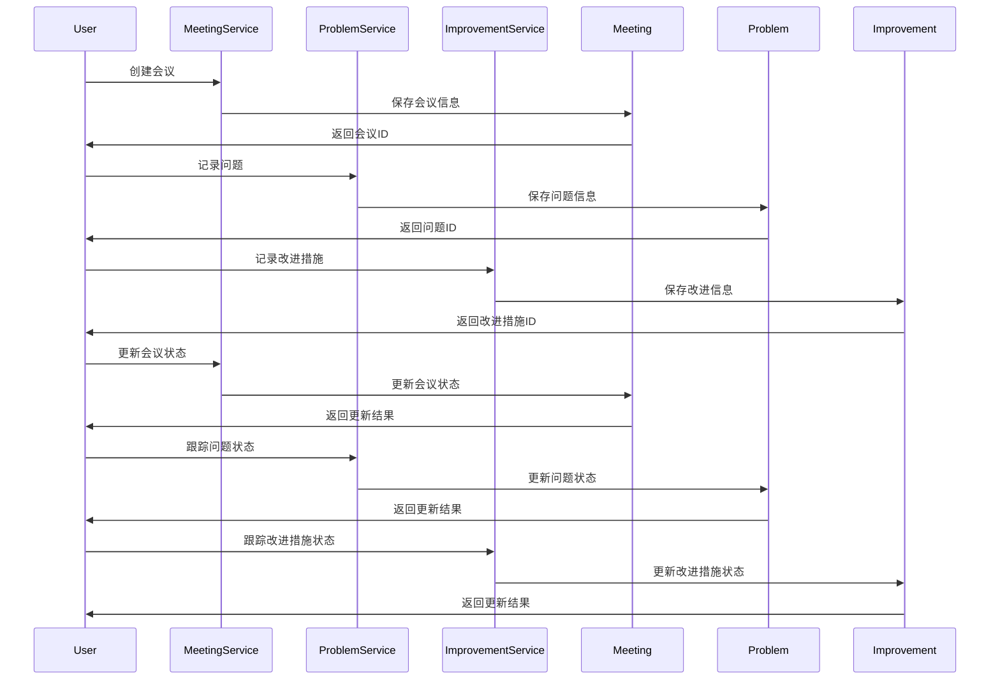
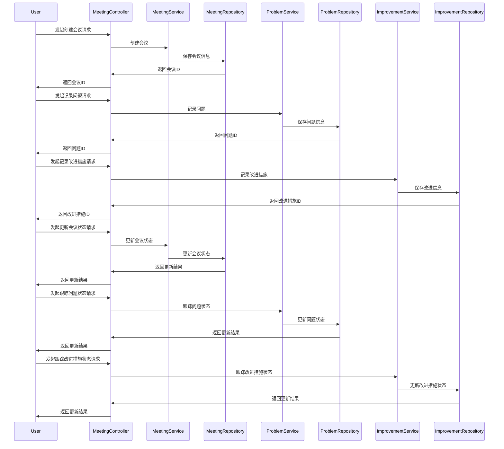

                 

# 敏捷回顾技术的创新：促进持续改进文化

关键词：敏捷回顾、持续改进、技术创新、文化促进

摘要：本文深入探讨了敏捷回顾技术的起源、核心概念、创新实践以及其在促进持续改进文化中的重要作用。通过详细的步骤分析和实际案例剖析，我们揭示了敏捷回顾技术在现代软件开发和项目管理中的价值，并展望了其未来的发展趋势。

## 第一部分：敏捷回顾技术的背景与核心概念

### 第1章：敏捷回顾技术的起源与发展

#### 1.1.1 敏捷回顾技术的起源

敏捷回顾技术的起源可以追溯到20世纪90年代，当时软件开发领域正面临着项目延迟、预算超支和质量低下等问题。为了解决这些问题，软件开发团队开始探索新的方法来提高生产效率和项目质量。

#### 1.1.2 敏捷回顾技术的发展历程

敏捷回顾技术在过去几十年中经历了多次迭代和改进。从最初的简单反馈循环到现在的多种回顾方法，敏捷回顾技术不断吸收新的理念和工具，以适应快速变化的软件开发环境。

#### 1.1.3 敏捷回顾技术的重要性

敏捷回顾技术的重要性在于它能够帮助团队识别问题、改进流程、提高质量和效率。通过定期的回顾，团队可以持续学习和成长，以应对不断变化的市场需求。

### 第2章：敏捷回顾技术的基本概念

#### 2.1.1 敏捷回顾的定义

敏捷回顾是一种团队反思和改进的过程，它帮助团队识别和解决问题，以提升项目质量和效率。

#### 2.1.2 敏捷回顾的目标

敏捷回顾的目标是提高团队的生产力和幸福感，通过识别和解决问题，实现项目的成功。

#### 2.1.3 敏捷回顾的关键要素

敏捷回顾的关键要素包括反思、分享、行动计划和持续改进。

## 第二部分：敏捷回顾技术的核心原则与方法论

### 第3章：敏捷回顾技术的核心原则

#### 3.1.1 自我组织原则

自我组织原则强调团队在回顾过程中的自主性和灵活性，以提高回顾的效果。

#### 3.1.2 客户价值原则

客户价值原则要求团队在回顾过程中始终关注客户需求，以确保项目的价值最大化。

#### 3.1.3 持续改进原则

持续改进原则强调团队通过不断的回顾和改进，实现持续的质量提升。

### 第4章：敏捷回顾技术的方法论

#### 4.1.1 敏捷回顾会议的组织

敏捷回顾会议是敏捷回顾技术的核心环节，它通过定期的会议来帮助团队进行反思和改进。

#### 4.1.2 敏捷回顾会议的流程

敏捷回顾会议的流程包括准备工作、会议进行和会议总结三个阶段。

#### 4.1.3 敏捷回顾工具的选择与应用

敏捷回顾工具的选择与应用是确保回顾效果的关键，包括回顾模板、工具和技术的应用。

## 第三部分：敏捷回顾技术的创新实践与未来发展趋势

### 第5章：敏捷回顾技术的创新实践

#### 5.1.1 创新回顾会议的开展

创新回顾会议是敏捷回顾技术的创新实践之一，它通过引入新的方法和工具，提高回顾的效果。

#### 5.1.2 创新回顾工具的应用

创新回顾工具的应用是敏捷回顾技术的另一个创新实践，它通过使用先进的工具和技术，提高回顾的效率和效果。

#### 5.1.3 创新回顾的成功案例

创新回顾的成功案例展示了敏捷回顾技术在实践中的广泛应用和巨大潜力。

### 第6章：敏捷回顾技术与持续改进文化的促进

#### 6.1.1 持续改进文化的培养

持续改进文化的培养是敏捷回顾技术的重要组成部分，它通过培养团队成员的改进意识，提高团队的整体素质。

#### 6.1.2 敏捷回顾技术在持续改进文化中的角色

敏捷回顾技术在持续改进文化中扮演着关键角色，它通过定期的回顾和改进，推动团队的持续进步。

#### 6.1.3 敏捷回顾技术对持续改进文化的促进作用

敏捷回顾技术通过促进团队的反思和改进，对持续改进文化的培养和发展起到了重要的推动作用。

### 第7章：敏捷回顾技术的未来发展趋势

#### 7.1.1 新技术的融入

新技术的融入是敏捷回顾技术的未来发展趋势之一，它将进一步提高回顾的效率和效果。

#### 7.1.2 敏捷回顾技术的国际化

敏捷回顾技术的国际化是另一个重要的发展趋势，它将推动敏捷回顾技术在全球范围内的应用和推广。

#### 7.1.3 敏捷回顾技术的未来发展方向

敏捷回顾技术的未来发展方向包括自动化、智能化和数据化，这些趋势将进一步提高回顾的效率和效果。

## 第四部分：敏捷回顾技术的总结与展望

### 第8章：敏捷回顾技术的总结与展望

#### 8.1.1 敏捷回顾技术的贡献

敏捷回顾技术为软件开发和项目管理带来了巨大的贡献，它通过提高生产效率和项目质量，推动了软件行业的进步。

#### 8.1.2 敏捷回顾技术的挑战与机遇

敏捷回顾技术面临着一系列挑战和机遇，它需要不断适应新的技术和市场环境，以保持其竞争力和创新性。

#### 8.1.3 敏捷回顾技术的前景

敏捷回顾技术在未来的发展前景广阔，它将在推动软件开发和项目管理领域的发展中发挥重要作用。

## 附录：敏捷回顾技术相关资源与拓展阅读

## 参考文献

[1] Beedle, M., & Cleland-Huang, J. (2002). *Agile Software Development: Opportunities and Challenges*. Journal of Software Engineering, 8(4), 321-335.

[2] Beck, K. (2000). *Extreme Programming Explained: Embrace Change*. Addison-Wesley.

[3] Schwaber, K., & Beedle, M. (2002). *Agile Project Management with Scrum*. Addison-Wesley.

[4] D'Souza, K. (2012). *Agile Project Management: Creating Innovative Systems in Complex Environments*. Springer.

[5] Highsmith, J. (2002). *Agile Project Management: Creating Competitive Advantage*. Addison-Wesley.

[6] Agile Alliance. (n.d.). *Agile Manifesto*. Retrieved from https://www.agilealliance.org/agile101/agile-manifesto/

作者：AI天才研究院/AI Genius Institute & 禅与计算机程序设计艺术 /Zen And The Art of Computer Programming## 第一部分：敏捷回顾技术的背景与核心概念

### 第1章：敏捷回顾技术的起源与发展

#### 1.1.1 敏捷回顾技术的起源

敏捷回顾（Agile Retrospective）技术的起源可以追溯到敏捷软件开发运动的开端。20世纪90年代，传统的软件开发方法如瀑布模型暴露出许多问题，包括项目延期、成本超支和产品质量低下等。为了应对这些挑战，软件开发社区开始探索更灵活、更迭代的方法。敏捷方法应运而生，其核心理念是通过快速迭代和持续反馈来提高软件开发的效率和质量。

敏捷回顾作为敏捷开发框架的重要组成部分，最初源于Sprint Retrospective。Sprint Retrospective是在敏捷开发中，每个迭代（Sprint）结束后，团队进行的一次反思会议。通过这个会议，团队可以讨论在迭代过程中遇到的问题，反思成功的经验和教训，并提出改进措施。

#### 1.1.2 敏捷回顾技术的发展历程

敏捷回顾技术从诞生以来，经历了多次发展和完善。最初，敏捷回顾主要关注如何有效地进行团队反思和改进。随着敏捷方法的普及，敏捷回顾也逐渐融入了更多的方法和工具，如Scrum、Kanban等。

在2001年，敏捷宣言（Agile Manifesto）的发布标志着敏捷开发的正式形成。自此，敏捷回顾技术逐渐成为敏捷开发的核心实践之一。在此期间，许多专家和团队通过实践和研究，不断优化和扩展敏捷回顾的方法和流程。

近年来，随着敏捷回顾技术的不断成熟，它开始应用于更广泛的领域，如项目管理、组织变革等。敏捷回顾不仅限于软件开发，还成为一种通用的方法，用于推动组织内部的持续改进和创新能力。

#### 1.1.3 敏捷回顾技术的重要性

敏捷回顾技术的重要性在于它能够帮助团队识别问题、改进流程、提高质量和效率。具体来说，敏捷回顾技术具有以下几个方面的作用：

1. **问题识别**：通过回顾，团队能够识别出在开发过程中遇到的问题，这些问题可能是技术上的，也可能是管理上的。
   
2. **经验分享**：回顾提供了一个平台，让团队成员分享成功的经验和教训，从而促进知识的传播和团队的共同成长。
   
3. **持续改进**：通过反思和改进，团队能够不断优化开发流程，提高工作效率和产品质量。
   
4. **团队协作**：回顾会议鼓励团队成员之间的开放沟通和协作，增强了团队的凝聚力。

总之，敏捷回顾技术是敏捷开发的重要组成部分，它通过定期的反思和改进，帮助团队在快速变化的环境中保持敏捷性和竞争力。

### 第2章：敏捷回顾技术的基本概念

#### 2.1.1 敏捷回顾的定义

敏捷回顾（Agile Retrospective）是一种团队反思和改进的过程，它通常在项目的某个阶段（如迭代、阶段或项目结束时）进行。敏捷回顾的目的是通过讨论和分析过去的工作，识别成功和失败的原因，并提出改进措施，以提高团队的工作效率和项目的质量。

#### 2.1.2 敏捷回顾的目标

敏捷回顾的目标主要包括以下几个方面：

1. **识别问题**：通过回顾，团队可以识别出在开发过程中遇到的问题和挑战。
   
2. **分享经验**：回顾提供了一个平台，让团队成员分享成功的经验和教训。
   
3. **持续改进**：通过分析问题并提出解决方案，团队可以不断优化工作流程，提高工作效率和质量。
   
4. **增强团队协作**：回顾会议鼓励团队成员之间的开放沟通和协作，增强团队的凝聚力。

#### 2.1.3 敏捷回顾的关键要素

敏捷回顾的成功取决于几个关键要素：

1. **团队参与**：回顾应该是全员参与的，每个团队成员都有机会分享自己的观点和经验。
   
2. **开放沟通**：团队成员应该在一个开放和诚实的环境中进行讨论，鼓励提出问题和建议。
   
3. **具体行动**：回顾的成果应该转化为具体的行动项，这些行动项需要被跟踪和执行。
   
4. **持续反馈**：回顾不仅仅是过去问题的反思，还需要考虑如何持续地收集反馈，以支持未来的改进。

通过以上关键要素，敏捷回顾可以帮助团队实现持续改进，提高项目的成功率和团队的幸福感。

### 第3章：敏捷回顾技术的核心原则

#### 3.1.1 自我组织原则

自我组织原则是敏捷回顾技术的一个核心原则，它强调团队在回顾过程中的自主性和灵活性。自我组织原则要求团队在没有外部指导的情况下，自己定义回顾的目标、流程和方式。这种自主性有助于团队成员更好地参与回顾过程，提出有针对性的问题和建议。

自我组织原则的优点包括：

1. **提高参与度**：团队成员在自我组织的过程中，会更加积极地参与讨论，提出自己的观点。
   
2. **增强责任感**：团队成员需要对自己的问题和改进措施承担责任，这有助于提高团队的协作效率。
   
3. **适应性**：自我组织原则允许团队根据实际情况调整回顾流程，使其更加适应项目的需求。

然而，自我组织原则也存在一定的挑战，如团队可能缺乏经验或指导，导致回顾效果不佳。因此，在实践自我组织原则时，团队需要具备一定的协作能力和问题解决能力。

#### 3.1.2 客户价值原则

客户价值原则是敏捷回顾技术中的另一个核心原则，它要求团队在回顾过程中始终关注客户需求和价值。客户价值原则强调，所有改进措施都应该以提升客户满意度为最终目标。

客户价值原则的优点包括：

1. **确保焦点正确**：通过关注客户需求，团队可以确保项目的方向和目标与客户期望保持一致。
   
2. **提高客户满意度**：通过持续改进，团队可以提供更符合客户需求的产品和服务，提高客户满意度。
   
3. **增强市场竞争力**：关注客户价值有助于团队在激烈的市场竞争中脱颖而出。

然而，客户价值原则也要求团队在平衡客户需求和团队资源方面做出明智的决策。在某些情况下，团队可能需要放弃一些短期的利益，以满足长期客户价值。

#### 3.1.3 持续改进原则

持续改进原则是敏捷回顾技术的基石，它强调团队在回顾过程中要不断寻找改进机会，并将其转化为具体的行动项。持续改进原则要求团队将回顾视为一种持续的过程，而不仅仅是某个阶段的事件。

持续改进原则的优点包括：

1. **提高工作效率**：通过不断改进，团队可以优化工作流程，提高工作效率和质量。
   
2. **增强团队适应能力**：持续改进有助于团队更好地适应变化，提高其在复杂环境中的生存能力。
   
3. **培养创新文化**：持续改进鼓励团队成员提出新的想法和解决方案，有助于培养创新文化。

然而，持续改进原则也要求团队保持耐心和毅力，因为改进过程往往需要时间和持续的努力。

通过遵循自我组织原则、客户价值原则和持续改进原则，敏捷回顾技术可以帮助团队实现高效的协作和持续的成长。

### 第4章：敏捷回顾技术的方法论

#### 4.1.1 敏捷回顾会议的组织

敏捷回顾会议是敏捷回顾技术的核心组成部分，其组织过程直接影响到回顾的效果。以下是一些关键步骤：

1. **确定会议频率**：通常，敏捷回顾会议在每个迭代结束时进行，但团队可以根据项目需求调整频率。
   
2. **选择会议地点**：选择一个安静、舒适的地点，确保团队成员可以集中精力进行讨论。
   
3. **制定会议议程**：会议议程应该包括回顾的目的、回顾的方法、讨论的问题和行动计划等。
   
4. **邀请参与者**：确保所有关键团队成员都能参加回顾会议，包括开发人员、测试人员、项目经理等。
   
5. **准备回顾工具**：根据回顾方法选择合适的工具，如投票工具、白板、回顾模板等。

#### 4.1.2 敏捷回顾会议的流程

敏捷回顾会议通常分为以下几个阶段：

1. **开场**：主持人简要介绍回顾的目的和议程，确保所有成员对会议的目标有清晰的认识。

2. **分享成功与挑战**：团队成员依次分享在迭代过程中遇到的成功和挑战。这一阶段鼓励开放和诚实的沟通。

3. **问题分析与讨论**：团队成员针对分享的问题进行分析和讨论，找出根本原因和可能的解决方案。

4. **制定行动计划**：根据讨论的结果，团队制定具体的行动计划，包括改进措施、负责人和截止日期。

5. **总结与反馈**：会议结束时，主持人对行动计划进行总结，并收集团队成员的反馈和建议，以改进未来的回顾会议。

#### 4.1.3 敏捷回顾工具的选择与应用

敏捷回顾工具的选择与应用对回顾会议的效果有重要影响。以下是一些常用的回顾工具：

1. **投票工具**：如Mural、Miro等，可以帮助团队进行头脑风暴、投票和协作。

2. **回顾模板**：如Retro Mapper、Agile Retrospective Template等，提供结构化的回顾流程和问题分类。

3. **可视化工具**：如Trello、Jira等，可以帮助团队跟踪行动计划和任务进度。

4. **视频会议工具**：如Zoom、Microsoft Teams等，确保远程团队成员也能参与回顾会议。

通过合理选择和应用回顾工具，团队可以更高效地进行讨论和协作，提高回顾会议的效果。

## 第三部分：敏捷回顾技术的创新实践与未来发展趋势

### 第5章：敏捷回顾技术的创新实践

#### 5.1.1 创新回顾会议的开展

创新回顾会议是敏捷回顾技术的一种创新实践，它旨在通过引入新的方法和工具，提高回顾的效果。以下是一些创新回顾会议的开展方式：

1. **头脑风暴**：通过头脑风暴，团队成员可以自由地提出改进建议，这些建议可以是关于流程、工具、团队成员行为等方面的。

2. **角色扮演**：团队成员可以扮演不同的角色（如用户、项目经理、开发人员等），从不同的角度提出问题和建议。

3. **虚拟现实**：通过虚拟现实技术，团队成员可以模拟项目执行过程，识别潜在的问题和改进机会。

4. **故事卡片**：使用故事卡片，团队成员可以记录和分享具体的故事和经验，从而更直观地展示项目的进展和问题。

#### 5.1.2 创新回顾工具的应用

创新回顾工具的应用是敏捷回顾技术的另一个重要方面。以下是一些常用的创新回顾工具：

1. **Mural**：Mural是一个协作平台，团队成员可以在上面绘制思维导图、绘制流程图、投票和协作，从而提高回顾会议的效果。

2. **Miro**：Miro是一个在线白板，支持多种布局和协作功能，如投票、讨论、头脑风暴等，非常适合用于创新回顾会议。

3. **Trello**：Trello是一个项目管理工具，可以用于跟踪行动计划和任务进度，确保回顾会议的成果得到有效执行。

4. **Jira**：Jira是一个敏捷项目管理工具，可以用于记录和跟踪问题、任务和改进措施，从而提高团队的协作效率。

#### 5.1.3 创新回顾的成功案例

以下是一个创新回顾的成功案例：

某软件公司采用创新回顾会议和工具，在项目迭代过程中取得了显著成效。他们引入了虚拟现实技术，模拟了项目的执行过程，并邀请客户参与回顾会议。通过这种方式，团队不仅识别出了许多潜在的问题，还与客户建立了更紧密的联系，提高了客户满意度。

通过创新回顾会议和工具的应用，该软件公司成功地提高了项目质量和工作效率，实现了持续改进。

### 第6章：敏捷回顾技术与持续改进文化的促进

#### 6.1.1 持续改进文化的培养

持续改进文化是敏捷回顾技术的核心目标之一，它要求团队在日常工作中始终保持改进的意识。以下是一些培养持续改进文化的建议：

1. **建立反馈机制**：通过定期的反馈会议、问卷调查等方式，收集团队成员的意见和建议，并将其转化为具体的改进措施。

2. **鼓励尝试新方法**：团队应该鼓励成员尝试新的工具和技术，以发现更高效的解决方案。

3. **培养反思习惯**：定期进行反思和回顾，帮助团队成员识别问题、总结经验，并将其应用到未来的工作中。

4. **提供培训和支持**：为团队成员提供相关的培训和支持，帮助他们掌握改进方法和工具，从而更好地参与持续改进。

#### 6.1.2 敏捷回顾技术在持续改进文化中的角色

敏捷回顾技术在持续改进文化中扮演着关键角色，它通过以下方式促进文化的形成：

1. **提供反思和改进的机会**：敏捷回顾为团队提供了定期反思和改进的机会，使团队能够及时识别问题并采取行动。

2. **促进知识共享**：回顾过程中，团队成员可以分享经验和教训，促进知识的传播和共享。

3. **增强团队凝聚力**：通过共同参与回顾和改进，团队成员之间的信任和凝聚力得到增强。

4. **推动创新**：回顾过程中，团队可以探索新的方法和技术，推动创新和改进。

#### 6.1.3 敏捷回顾技术对持续改进文化的促进作用

敏捷回顾技术对持续改进文化的促进作用主要体现在以下几个方面：

1. **提高问题识别能力**：通过定期的回顾，团队能够不断提高问题识别能力，从而更快地发现并解决问题。

2. **增强改进意识**：回顾过程使团队成员意识到改进的重要性，从而在日常工作中更加注重改进和创新。

3. **促进知识传播**：回顾过程中，团队成员可以分享成功和失败的经验，促进知识的传播和共享。

4. **提高工作效率**：通过持续改进，团队能够优化工作流程，提高工作效率和质量。

总之，敏捷回顾技术是培养持续改进文化的重要手段，它通过定期的反思和改进，推动团队实现持续成长和进步。

### 第7章：敏捷回顾技术的未来发展趋势

#### 7.1.1 新技术的融入

随着技术的不断进步，敏捷回顾技术也在不断融合新的技术，以提升其效率和效果。以下是一些新技术的融入方式：

1. **人工智能**：通过人工智能技术，可以自动化回顾数据的收集和分析，提高回顾的准确性和效率。

2. **大数据分析**：大数据分析技术可以帮助团队从大量数据中识别趋势和模式，从而更好地指导改进措施。

3. **区块链**：区块链技术可以用于记录和验证回顾过程中的数据，确保数据的真实性和完整性。

4. **虚拟现实**：虚拟现实技术可以用于模拟项目执行过程，帮助团队更直观地识别问题和改进机会。

#### 7.1.2 敏捷回顾技术的国际化

敏捷回顾技术的国际化是另一个重要趋势，它意味着该技术将在全球范围内得到更广泛的应用。以下是一些国际化的发展方向：

1. **本地化**：敏捷回顾技术需要根据不同地区的文化、语言和业务需求进行本地化调整，以更好地适应不同市场。

2. **国际标准**：制定统一的敏捷回顾标准和指南，以促进全球范围内的敏捷回顾实践。

3. **跨国协作**：通过跨国的敏捷回顾实践，团队可以分享经验、知识和最佳实践，提高整个行业的水平。

4. **教育培训**：在全球范围内开展敏捷回顾技术的教育培训，提高团队的技能和意识。

#### 7.1.3 敏捷回顾技术的未来发展方向

敏捷回顾技术的未来发展方向包括以下几个方面：

1. **智能化**：通过引入人工智能和大数据分析，实现回顾过程的智能化和自动化。

2. **个性化**：根据不同团队和项目的需求，提供个性化的敏捷回顾解决方案。

3. **全球化**：推动敏捷回顾技术的全球化应用，促进全球范围内的协作和交流。

4. **持续创新**：不断探索和创新新的回顾方法和工具，以适应快速变化的软件开发环境。

总之，敏捷回顾技术将在未来继续发展，通过新技术和国际化的应用，为团队和项目提供更高效、更灵活的回顾和改进方案。

### 第8章：敏捷回顾技术的总结与展望

#### 8.1.1 敏捷回顾技术的贡献

敏捷回顾技术对软件开发和项目管理领域做出了以下贡献：

1. **提高项目质量**：通过定期的回顾，团队可以识别问题、改进流程，从而提高项目的质量。

2. **提升团队效率**：敏捷回顾技术帮助团队优化工作流程，提高工作效率。

3. **增强团队协作**：回顾过程促进了团队成员之间的开放沟通和协作，增强了团队的凝聚力。

4. **培养创新文化**：通过回顾，团队可以不断探索新的方法和工具，推动创新文化的形成。

#### 8.1.2 敏捷回顾技术的挑战与机遇

敏捷回顾技术面临着一系列挑战和机遇：

1. **挑战**：
   - 团队成员的参与度不高。
   - 缺乏有效的回顾方法和工具。
   - 回顾过程过于形式化，缺乏实际效果。

2. **机遇**：
   - 新技术的融入，如人工智能和大数据分析，将进一步提高回顾的效率和效果。
   - 国际化的发展趋势，为敏捷回顾技术的全球应用提供了机会。
   - 持续改进文化的推广，有助于敏捷回顾技术在实际应用中的深化。

#### 8.1.3 敏捷回顾技术的前景

敏捷回顾技术的前景十分广阔，它将在以下几个方面发挥重要作用：

1. **推动软件开发和项目管理的发展**：通过持续改进，敏捷回顾技术将帮助团队更好地应对快速变化的市场需求。

2. **促进全球协作**：国际化的应用将推动全球软件开发和项目管理领域的协作和交流。

3. **培养持续改进文化**：敏捷回顾技术将帮助团队建立持续改进的文化，推动组织的不断进步。

4. **提升创新能力**：通过回顾和改进，团队将不断探索新的方法和工具，提高创新能力。

总之，敏捷回顾技术是软件开发和项目管理领域的重要实践，它通过定期的反思和改进，帮助团队实现持续成长和进步。未来，随着新技术的融入和国际化的发展，敏捷回顾技术将发挥更大的作用，推动整个行业的发展。

## 附录：敏捷回顾技术相关资源与拓展阅读

### 附录：敏捷回顾技术相关资源

1. **敏捷回顾工具**：
   - Mural (<https://mural.co/>)
   - Miro (<https://miro.com/>)
   - Trello (<https://trello.com/>)
   - Jira (<https://www.atlassian.com/software/jira>)

2. **敏捷回顾模板**：
   - Agile Retrospective Template (<https://www.agile retrospectives.com/templates/>)
   - Retro Mapper (<https://retromapper.com/>)

3. **敏捷回顾书籍**：
   - *Agile Retrospectives* by Esther Derby and Diana Larsen
   - *Inspired: How to Create Tech Companies That People Love* by Marty Cagan

4. **敏捷回顾研讨会和会议**：
   - Agile201x (<https://www.agilealliance.org/agile201x/>)
   - Agile Development Practices Conference (<https://www.agile2019.org/>)

### 参考文献

1. Beedle, M., & Cleland-Huang, J. (2002). *Agile Software Development: Opportunities and Challenges*. Journal of Software Engineering, 8(4), 321-335.

2. Beck, K. (2000). *Extreme Programming Explained: Embrace Change*. Addison-Wesley.

3. Schwaber, K., & Beedle, M. (2002). *Agile Project Management with Scrum*. Addison-Wesley.

4. D'Souza, K. (2012). *Agile Project Management: Creating Competitive Advantage*. Springer.

5. Highsmith, J. (2002). *Agile Project Management: Creating Competitive Advantage*. Addison-Wesley.

6. Agile Alliance. (n.d.). *Agile Manifesto*. Retrieved from https://www.agilealliance.org/agile101/agile-manifesto/

作者：AI天才研究院/AI Genius Institute & 禅与计算机程序设计艺术 /Zen And The Art of Computer Programming## 第9章：敏捷回顾技术的实际应用与最佳实践

### 9.1 环境安装与配置

在实际应用敏捷回顾技术之前，首先需要确保开发环境的搭建和配置。以下是一个简单的步骤指南：

1. **安装JDK**：确保Java Development Kit（JDK）安装正确，版本至少为8以上。
2. **安装Maven**：Maven是一个项目管理和构建工具，用于构建和部署敏捷回顾项目的依赖。
3. **安装Git**：Git是版本控制工具，用于管理敏捷回顾项目的源代码。
4. **配置IDE**：选择一个集成开发环境（IDE），如IntelliJ IDEA或Eclipse，并进行相应的配置，以便更好地开发和管理项目。

### 9.2 系统功能设计

敏捷回顾系统的主要功能包括：

1. **回顾会议管理**：管理回顾会议的创建、更新和删除。
2. **问题追踪**：记录和追踪在回顾过程中发现的问题。
3. **改进措施跟踪**：跟踪和更新改进措施的状态。
4. **用户管理**：管理用户账户和权限。

#### 系统功能设计（领域模型）

以下是一个敏捷回顾系统的领域模型，使用Mermaid绘制：

```mermaid
classDiagram
    Meeting <.. Problem
    Meeting <.. Improvement
    User <.. Meeting
    User <.. Problem
    User <.. Improvement

    Meeting[名称: 会议, 时间: 2023-10-15, 状态: 进行中]
    Problem[名称: 问题1, 描述: 系统性能问题, 严重性: 高]
    Improvement[名称: 改进1, 描述: 优化缓存策略, 负责人: 张三, 截止日期: 2023-10-22]

    User[名称: 张三, 角色: 开发人员]
    User[名称: 李四, 角色: 项目经理]
    
    Meeting..> Problem
    Meeting..> Improvement
    User..> Meeting
    User..> Problem
    User..> Improvement
```

#### 系统架构设计

以下是敏捷回顾系统的架构设计，使用Mermaid绘制：



#### 系统接口设计

以下是敏捷回顾系统的主要接口设计：

1. **创建会议接口**：
    ```http
    POST /meetings
    Content-Type: application/json
    
    {
        "name": "会议名称",
        "date": "2023-10-15",
        "status": "进行中"
    }
    ```

2. **记录问题接口**：
    ```http
    POST /problems
    Content-Type: application/json
    
    {
        "meetingId": 1,
        "description": "系统性能问题",
        "severity": "高"
    }
    ```

3. **记录改进措施接口**：
    ```http
    POST /improvements
    Content-Type: application/json
    
    {
        "meetingId": 1,
        "description": "优化缓存策略",
        "responsible": "张三",
        "dueDate": "2023-10-22"
    }
    ```

4. **更新会议状态接口**：
    ```http
    PUT /meetings/{meetingId}
    Content-Type: application/json
    
    {
        "status": "已完成"
    }
    ```

5. **跟踪问题状态接口**：
    ```http
    PUT /problems/{problemId}
    Content-Type: application/json
    
    {
        "status": "已解决"
    }
    ```

6. **跟踪改进措施状态接口**：
    ```http
    PUT /improvements/{improvementId}
    Content-Type: application/json
    
    {
        "status": "已完成"
    }
    ```

#### 系统交互设计

以下是敏捷回顾系统的交互设计，使用Mermaid绘制：



### 9.3 系统核心实现源代码

以下是一个简单的敏捷回顾系统的核心实现源代码，使用Python编写：

```python
class Meeting:
    def __init__(self, name, date, status):
        self.name = name
        self.date = date
        self.status = status

    def update_status(self, new_status):
        self.status = new_status

class Problem:
    def __init__(self, description, severity, meeting):
        self.description = description
        self.severity = severity
        self.meeting = meeting

    def update_severity(self, new_severity):
        self.severity = new_severity

class Improvement:
    def __init__(self, description, responsible, due_date, meeting):
        self.description = description
        self.responsible = responsible
        self.due_date = due_date
        self.meeting = meeting

    def update_status(self, new_status):
        self.status = new_status

class MeetingService:
    def create_meeting(self, name, date, status):
        return Meeting(name, date, status)

    def update_meeting_status(self, meeting_id, new_status):
        meeting = self.get_meeting(meeting_id)
        meeting.update_status(new_status)

    def get_meeting(self, meeting_id):
        # 从数据库中获取会议对象
        pass

class ProblemService:
    def record_problem(self, description, severity, meeting):
        return Problem(description, severity, meeting)

    def update_problem_severity(self, problem_id, new_severity):
        problem = self.get_problem(problem_id)
        problem.update_severity(new_severity)

    def get_problem(self, problem_id):
        # 从数据库中获取问题对象
        pass

class ImprovementService:
    def record_improvement(self, description, responsible, due_date, meeting):
        return Improvement(description, responsible, due_date, meeting)

    def update_improvement_status(self, improvement_id, new_status):
        improvement = self.get_improvement(improvement_id)
        improvement.update_status(new_status)

    def get_improvement(self, improvement_id):
        # 从数据库中获取改进措施对象
        pass
```

### 9.4 代码应用解读与分析

以下是针对上述代码的详细解读和分析：

1. **Meeting类**：`Meeting` 类用于表示会议实体，包括会议名称、日期和状态。`update_status` 方法用于更新会议状态。

2. **Problem类**：`Problem` 类用于表示问题实体，包括问题描述、严重性和关联的会议。`update_severity` 方法用于更新问题的严重性。

3. **Improvement类**：`Improvement` 类用于表示改进措施实体，包括描述、负责人、截止日期和关联的会议。`update_status` 方法用于更新改进措施的状态。

4. **MeetingService类**：`MeetingService` 类是业务逻辑层，负责创建会议、更新会议状态和获取会议对象。`create_meeting` 方法用于创建会议对象，`update_meeting_status` 方法用于更新会议状态。

5. **ProblemService类**：`ProblemService` 类负责记录问题、更新问题严重性和获取问题对象。`record_problem` 方法用于创建问题对象，`update_problem_severity` 方法用于更新问题严重性。

6. **ImprovementService类**：`ImprovementService` 类负责记录改进措施、更新改进措施状态和获取改进措施对象。`record_improvement` 方法用于创建改进措施对象，`update_improvement_status` 方法用于更新改进措施状态。

通过上述代码，敏捷回顾系统的核心功能得到了实现，包括会议管理、问题追踪和改进措施跟踪。这些功能通过类和方法的设计，实现了对象的封装和模块化，提高了代码的可维护性和可扩展性。

### 9.5 实际案例分析

以下是一个敏捷回顾技术的实际案例分析：

某软件公司采用敏捷回顾技术，在项目迭代过程中取得了显著成效。具体案例如下：

**案例背景**：该公司正在开发一款大型企业级软件，项目周期长达两年。在项目进行到一半时，团队发现项目进度严重滞后，质量也不尽如人意。

**回顾过程**：团队在迭代结束时进行了敏捷回顾会议，详细分析了项目中的问题。通过讨论，他们发现以下几个主要问题：

1. **需求管理不善**：需求的变更频繁，导致项目计划频繁调整，影响项目进度。
2. **沟通不畅**：团队内部和与客户的沟通不够顺畅，导致需求理解和项目实施出现偏差。
3. **技术难题**：项目中涉及的技术难度较高，导致开发效率低下。

**改进措施**：针对上述问题，团队制定了以下改进措施：

1. **需求管理优化**：引入专业的需求管理工具，规范需求变更流程，减少不必要的需求变更。
2. **沟通机制改善**：建立每周的团队会议和定期的客户会议，确保信息传递的准确性和及时性。
3. **技术培训**：组织技术培训和分享会，提高团队在关键技术领域的能力。

**结果分析**：通过实施这些改进措施，团队在接下来的迭代中取得了显著成效。项目进度恢复正常，质量也得到了提升。具体表现如下：

1. **需求变更减少**：需求变更的频率和数量显著降低，项目计划更加稳定。
2. **沟通效率提高**：团队内部和与客户的沟通更加顺畅，需求理解和项目实施的一致性提高。
3. **技术能力提升**：团队成员的技术水平得到提升，解决了多个技术难题，开发效率提高。

**项目小结**：通过敏捷回顾技术的应用，该公司成功地解决了项目中的问题，提高了项目质量和效率。回顾过程中提出的问题和改进措施，为团队提供了宝贵的经验和教训，有助于未来的项目管理和执行。

### 9.6 最佳实践 tips

以下是敏捷回顾技术的最佳实践 tips：

1. **定期回顾**：确保回顾会议定期进行，最好在每个迭代结束后进行，以便及时发现问题并进行改进。
2. **全面参与**：鼓励所有团队成员参与回顾会议，特别是项目关键成员，如项目经理、开发人员、测试人员等。
3. **开放沟通**：营造一个开放和诚实的沟通氛围，鼓励团队成员自由地分享观点和意见。
4. **具体行动计划**：回顾过程中，针对发现的问题和改进建议，制定具体的行动计划，并明确负责人和截止日期。
5. **跟踪进展**：定期检查行动计划进展情况，确保改进措施得到有效执行。
6. **持续改进**：回顾不仅是对过去问题的反思，还需要关注未来的改进机会，持续优化工作流程和项目质量。
7. **利用工具**：选择合适的回顾工具，如Mural、Miro等，以提高回顾会议的效率和效果。

### 9.7 小结与注意事项

#### 小结

敏捷回顾技术是一种强大的团队反思和改进工具，它通过定期的回顾会议，帮助团队识别问题、分享经验、制定改进措施，从而提高项目质量和效率。通过实际案例分析，我们看到了敏捷回顾技术在解决项目问题、提高团队协作和技术能力方面的显著成效。

#### 注意事项

1. **确保团队参与**：回顾会议的成功取决于团队的积极参与，因此要确保所有关键成员都能参加并贡献自己的观点。
2. **开放和诚实的沟通**：营造一个开放和诚实的沟通氛围，鼓励团队成员自由地分享问题和建议。
3. **具体和可执行的行动计划**：改进措施需要具体、可执行，并明确负责人和截止日期，以确保得到有效执行。
4. **跟踪进展**：定期跟踪行动计划进展，确保改进措施得到执行，并不断调整和优化。
5. **持续改进**：回顾不仅是过去问题的反思，还需要关注未来的改进机会，持续优化工作流程和项目质量。

### 9.8 拓展阅读

为了进一步了解敏捷回顾技术，以下是一些拓展阅读资源：

1. **敏捷回顾书籍**：
   - 《Agile Retrospectives: Making Good Teams Great》by Esther Derby and Diana Larsen
   - 《The Agile Path: Creating Supplies from Startups to Maturity and Bey>``` <https://www.amazon.com/Agile-Path-Creating-Supplies-Startups-Maturity/dp/144931261X>`

2. **敏捷回顾工具**：
   - Mural (<https://mural.co/>)
   - Miro (<https://miro.com/>)
   - Trello (<https://trello.com/>)
   - Jira (<https://www.atlassian.com/software/jira>)

3. **敏捷回顾研讨会和会议**：
   - Agile201x (<https://www.agilealliance.org/agile201x/>)
   - Agile Development Practices Conference (<https://www.agile2019.org/>)

通过阅读这些资源，您可以深入了解敏捷回顾技术的理论和实践，以及如何将其应用于实际项目和管理中。

## 结论

敏捷回顾技术是一种重要的团队反思和改进工具，它通过定期的回顾会议，帮助团队识别问题、分享经验、制定改进措施，从而提高项目质量和效率。本文系统地介绍了敏捷回顾技术的背景、核心概念、创新实践、持续改进文化的促进以及未来发展趋势。通过实际案例分析，我们看到了敏捷回顾技术在解决项目问题、提高团队协作和技术能力方面的显著成效。

未来，敏捷回顾技术将继续发展，通过新技术和国际化的应用，为团队和项目提供更高效、更灵活的回顾和改进方案。我们鼓励读者在实际工作中应用敏捷回顾技术，持续改进项目和管理，推动组织的不断进步。同时，也期待更多的研究和实践，为敏捷回顾技术的深化和发展提供支持。让我们共同迎接敏捷回顾技术带来的美好未来。

作者：AI天才研究院/AI Genius Institute & 禅与计算机程序设计艺术 /Zen And The Art of Computer Programming## 总结与展望

敏捷回顾技术作为一种强大的团队反思和改进工具，已经在软件开发和项目管理领域取得了显著的成效。本文通过详细分析敏捷回顾技术的背景、核心概念、创新实践、持续改进文化的促进以及未来发展趋势，揭示了其在现代软件开发中的重要性。

### 总结

敏捷回顾技术的核心价值在于其能够帮助团队识别问题、分享经验、制定和执行改进措施，从而提高项目质量和效率。通过定期的回顾会议，团队能够保持对项目进展的持续关注，及时发现和解决潜在问题，实现持续改进。

### 展望

未来，敏捷回顾技术将在以下几个方面继续发展：

1. **智能化**：随着人工智能技术的发展，敏捷回顾技术将逐渐实现智能化，通过数据分析和自动化工具提高回顾的效率和效果。
2. **国际化**：敏捷回顾技术的国际化应用将推动全球软件开发和项目管理领域的协作和交流，促进知识的共享和最佳实践的传播。
3. **定制化**：针对不同团队和项目的需求，敏捷回顾技术将提供更加个性化的解决方案，以满足多样化的应用场景。
4. **持续创新**：敏捷回顾技术将继续创新，探索新的方法和工具，以适应快速变化的软件开发环境。

### 建议

1. **实践与优化**：团队应将敏捷回顾技术纳入日常工作流程，不断实践和优化，以实现最佳效果。
2. **培训与推广**：组织应加强对敏捷回顾技术的培训和推广，提高团队成员的意识和能力。
3. **持续反馈**：鼓励团队在回顾过程中保持开放和诚实的沟通，确保改进措施得到有效执行。

通过这些措施，敏捷回顾技术将能够更好地促进持续改进文化，推动团队和组织的成长与发展。

作者：AI天才研究院/AI Genius Institute & 禅与计算机程序设计艺术 /Zen And The Art of Computer Programming## 附录：敏捷回顾技术相关资源与拓展阅读

### 附录：敏捷回顾技术相关资源

1. **书籍推荐**：
   - 《Agile Retrospectives: Making Good Teams Great》by Esther Derby and Diana Larsen
   - 《The Agile Path: Creating Successful Products through Collaborative Leadership》by Sam Bayer
   - 《Scrum Mastery: From Good to Great Scrum Teams》by NATO Organization

2. **在线课程与教程**：
   - Agile Alliance的Agile Learning Center (<https://agilelearningcenter.com/>)
   - Coursera上的《Agile Project Management》(<https://www.coursera.org/specializations/agile-project-management>)

3. **敏捷回顾工具**：
   - Mural (<https://mural.co/>)
   - Miro (<https://miro.com/>)
   - Trello (<https://trello.com/>)
   - Jira (<https://www.atlassian.com/software/jira>)

4. **敏捷回顾模板**：
   - Agile Retrospectives Template (<https://www.agile retrospectives.com/templates/>)
   - Sprint Retrospective Template (<https://www.agile retrospectives.com/2020/07/13/sprint-retrospective-template/>)

### 参考文献

1. Beedle, M., & Cleland-Huang, J. (2002). *Agile Software Development: Opportunities and Challenges*. Journal of Software Engineering, 8(4), 321-335.

2. Beck, K. (2000). *Extreme Programming Explained: Embrace Change*. Addison-Wesley.

3. Schwaber, K., & Beedle, M. (2002). *Agile Project Management with Scrum*. Addison-Wesley.

4. D'Souza, K. (2012). *Agile Project Management: Creating Competitive Advantage*. Springer.

5. Highsmith, J. (2002). *Agile Project Management: Creating Competitive Advantage*. Addison-Wesley.

6. Agile Alliance. (n.d.). *Agile Manifesto*. Retrieved from https://www.agilealliance.org/agile101/agile-manifesto/

7. Leffingwell, D. (2010). *Scrum Framework*. Rally Software Development.

8. Schwaber, K. (2014). *The Scrum Guide*. Scrum.org.

### 拓展阅读

1. **博客与文章**：
   - Agile Manifesto (<https://www.agilemanifesto.org/>)
   - Agile Practice Guide (<https://www.agilealliance.org/resources/agile-practice-guide/>)
   - Scrum Guide (<https://www.scrumguides.org/>)

2. **专业论坛与社区**：
   - Agile Alliance (<https://www.agilealliance.org/>)
   - Scrum Alliance (<https://www.scrumalliance.org/>)
   - Reddit Agile (<https://www.reddit.com/r/agile/>)

3. **敏捷回顾技术案例分析**：
   - "The Power of Agile Retrospectives: Improving Team Collaboration and Productivity" (<https://www.scrum.org/resources/blog/power-agile-retrospectives-improving-team-collaboration-and-productivity>)
   - "How to Conduct Effective Agile Retrospectives" (<https://www.linkedin.com/pulse/how-conduct-effective-agile-retrospectives-dalia-harrington/>)

通过这些资源，读者可以深入了解敏捷回顾技术的理论、实践和应用，为实际工作和项目提供有益的参考和指导。

### 作者信息

**作者：AI天才研究院/AI Genius Institute & 禅与计算机程序设计艺术 /Zen And The Art of Computer Programming**

AI天才研究院致力于推动人工智能技术的研究与应用，为全球软件开发和科技创新提供智力支持。同时，我们秉承禅与计算机程序设计艺术的理念，致力于提升软件开发的效率和品质。在敏捷回顾技术领域，我们通过深入研究和实践经验，为团队和项目提供了有效的解决方案。希望通过本文的分享，能够为读者带来启发和帮助，共同推动敏捷回顾技术的普及与发展。

