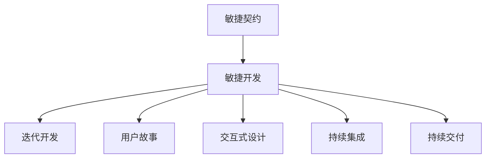
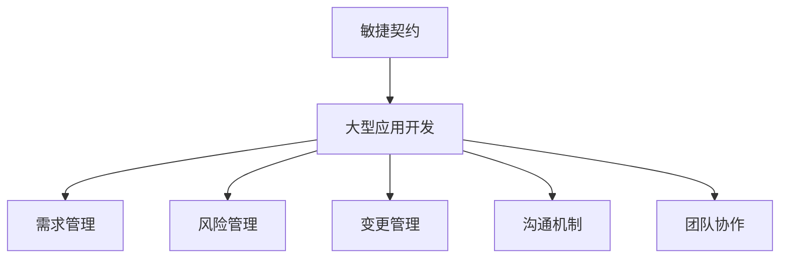
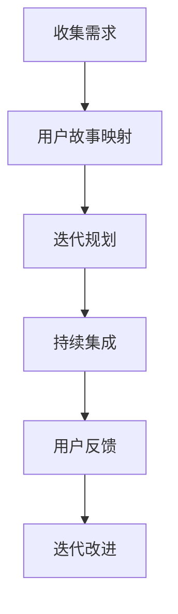
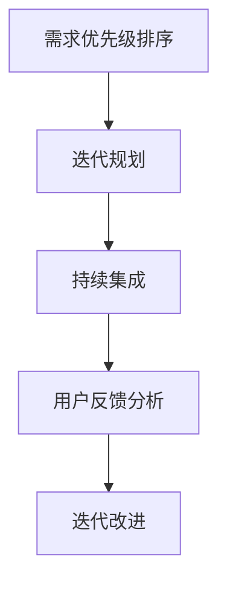
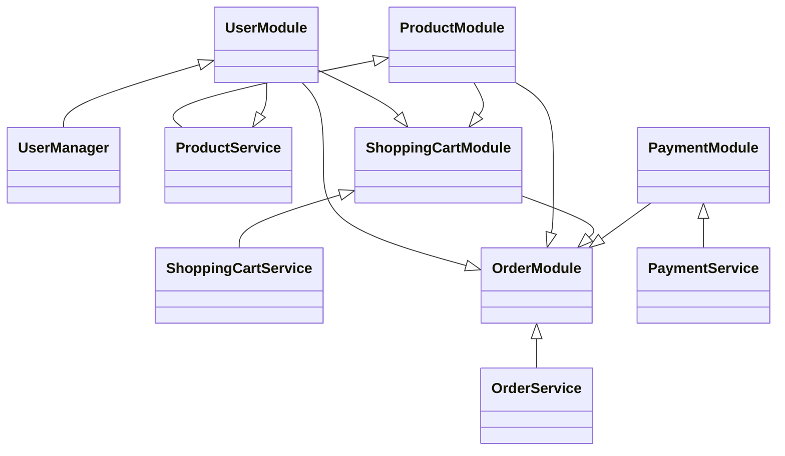
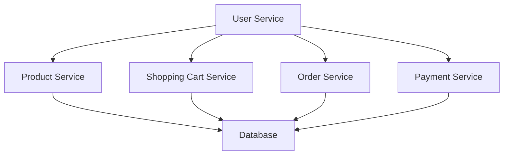
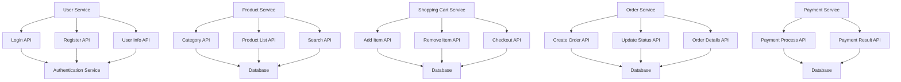
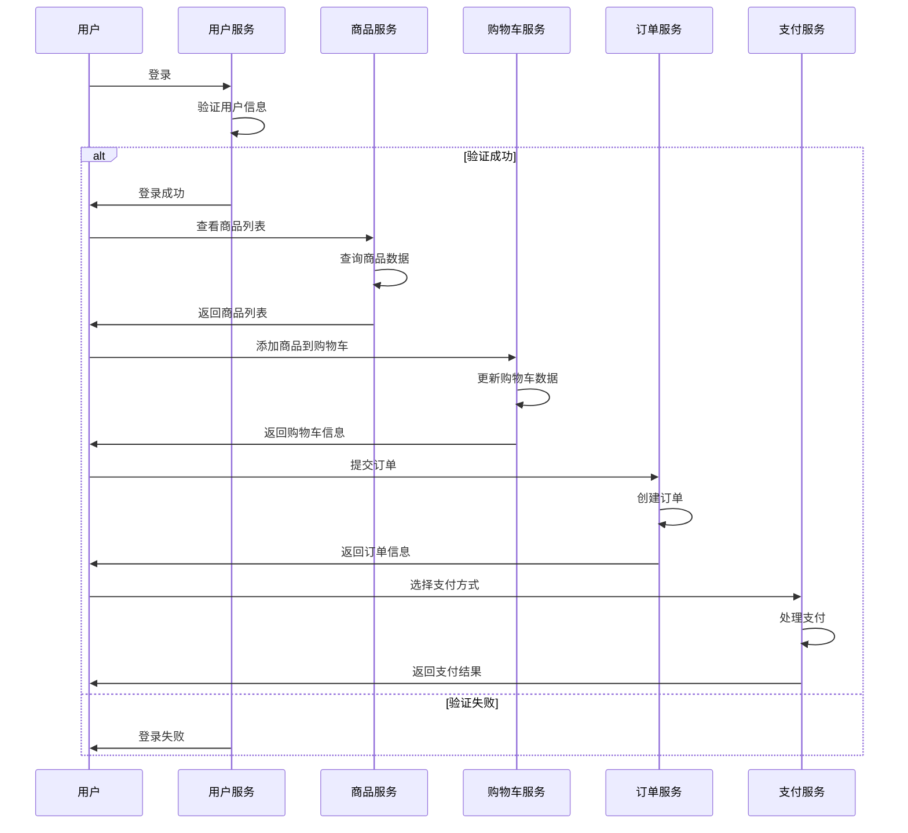

                 

## 敏捷契约在大型应用开发中的应用

> 关键词：敏捷契约、大型应用开发、需求管理、团队协作、持续集成

摘要：本文深入探讨了敏捷契约在大型应用开发中的应用。通过对敏捷契约的概念、核心原理、算法模型以及在实际项目中的应用实践进行分析，揭示了敏捷契约如何帮助大型应用项目提高开发效率、降低风险、确保项目成功。本文旨在为从事大型应用开发的工程师和项目管理者提供有益的参考和指导。

### 引言

在现代软件开发领域，大型应用项目的开发越来越复杂，涉及多个团队、多变的需求、高度不确定的外部环境等因素。传统的瀑布模型在应对这种复杂情况时显得力不从心，而敏捷开发方法由于其灵活性和快速响应变化的能力，逐渐成为大型应用开发的首选。然而，如何在敏捷开发中有效地管理大型应用项目的需求、风险和变更，仍然是开发者面临的一大挑战。本文将围绕敏捷契约这一核心概念，探讨其在大型应用开发中的应用，帮助读者了解如何通过敏捷契约提高项目开发效率，实现项目成功。

### 第一部分：背景介绍

#### 第1章：敏捷契约与大型应用开发背景

##### 1.1 问题背景

大型应用开发面临的挑战主要包括以下几个方面：

1. **复杂性与不确定性**：大型应用项目通常涉及复杂的业务逻辑、庞大的数据规模和多变的用户需求，这使得项目在开发过程中充满了不确定性。

2. **项目规模庞大，涉及多个团队协作**：大型应用项目往往需要多个团队协同工作，不同团队之间需要高效的沟通和协作。

3. **需求频繁变更，难以预测**：在项目开发过程中，客户的需求经常发生变化，这种频繁的需求变更对项目进度和质量提出了很高的要求。

4. **高度依赖外部接口和数据源**：许多大型应用项目需要与其他系统进行集成，外部接口和数据源的变化可能对项目产生影响。

##### 1.2 敏捷契约的概念与重要性

敏捷契约是一种在敏捷开发中用于沟通、协作和确保项目成功的机制。它强调在项目开发过程中，通过明确和灵活的协议来调整需求、期望和责任。

敏捷契约的重要性主要体现在以下几个方面：

1. **提高团队协作效率**：敏捷契约通过明确的责任划分和沟通机制，减少了团队之间的误解和冲突，提高了团队的协作效率。

2. **降低项目风险**：敏捷契约能够及时识别和应对项目中的风险，通过灵活调整需求和计划，降低了项目失败的风险。

3. **促进客户满意度的提升**：敏捷契约允许客户在项目开发过程中实时反馈和参与，确保最终产品的质量和客户的满意度。

4. **增强项目的灵活性和适应性**：敏捷契约强调快速响应变化，使项目团队能够更好地适应外部环境和客户需求的变化。

##### 1.3 敏捷契约在大型应用开发中的关键角色

敏捷契约在大型应用开发中的关键角色包括：

1. **确定需求范围和优先级**：敏捷契约通过用户故事和优先级排序，明确项目的需求范围和优先级，帮助团队集中资源进行最关键的功能开发。

2. **制定明确的目标和里程碑**：敏捷契约通过迭代计划和里程碑的设定，确保项目团队能够分阶段、有目标地推进项目开发。

3. **促进团队成员间的沟通与协作**：敏捷契约通过定期的站立会议、迭代评审和回顾会议，促进团队成员之间的沟通和协作。

4. **监控项目进度和质量**：敏捷契约通过持续集成、交付和用户反馈，实时监控项目进度和质量，确保项目按时、按质量完成。

##### 1.4 敏捷契约与大型应用开发的边界与外延

敏捷契约在大型应用开发中的适用范围主要包括：

1. **对项目规模和复杂性有较高要求**：敏捷契约适用于大型应用项目，这些项目通常规模庞大、复杂性高，需要高效的沟通和协作。

2. **项目周期较长，需求变更频繁**：对于周期较长、需求变更频繁的项目，敏捷契约能够提供有效的需求管理和风险控制。

3. **项目涉及多个团队和部门**：涉及多个团队和部门的复杂项目，敏捷契约能够通过明确的沟通机制和协作机制，提高项目的整体效率。

与大型应用开发的区别在于：

1. **敏捷契约侧重于沟通和协作机制**：敏捷契约更注重项目团队之间的沟通和协作，而不是具体的开发方法论。

2. **大型应用开发更关注系统的整体架构和可维护性**：大型应用项目需要考虑系统的整体架构和未来的可维护性，这需要开发者具备更深入的系统设计能力。

##### 1.5 核心概念结构与要素组成

敏捷契约的核心概念和要素组成包括：

1. **用户故事**：用户故事是敏捷契约的基础，它描述了用户的需求和期望，通常包含一个动词和一个名词。

2. **交互式设计**：交互式设计强调用户参与和迭代改进，通过不断的反馈和迭代，确保最终产品的质量。

3. **精益开发**：精益开发注重效率和质量，通过消除浪费、优化流程，提高项目的交付效率。

4. **持续集成与交付**：持续集成和交付确保项目的每个版本都是可用的，通过自动化测试和持续交付，提高项目的质量。

5. **需求管理**：需求管理是敏捷契约的重要组成部分，它涉及需求的收集、分析和优先级排序，确保项目团队能够集中资源进行最关键的功能开发。

6. **沟通机制**：沟通机制是敏捷契约的核心，通过定期的站立会议、迭代评审和回顾会议，促进团队成员之间的沟通和协作。

7. **风险管理**：风险管理是敏捷契约的重要组成部分，它涉及风险的识别、评估和应对，确保项目团队能够及时应对潜在的风险。

8. **敏捷框架选择**：敏捷框架选择是敏捷契约的一部分，根据项目的特点和需求，选择合适的敏捷框架，如Scrum、Kanban等。

#### 1.2 核心概念与联系

##### 1.2.1 敏捷契约与敏捷开发的关系

敏捷契约是敏捷开发的核心组成部分，它强调在开发过程中快速响应变化，通过合同、用户故事和迭代方法来实现项目的成功。

**敏捷契约与敏捷开发的关系图**：



##### 1.2.2 敏捷契约与大型应用开发的联系

敏捷契约在大型应用开发中的应用主要体现在以下几个方面：

1. **需求管理**：敏捷契约通过用户故事和优先级排序，帮助团队明确需求，确保项目团队能够集中资源进行最关键的功能开发。

2. **风险管理**：敏捷契约通过定期的风险评估和风险应对计划，帮助团队及时识别和应对潜在的风险。

3. **变更管理**：敏捷契约通过灵活的协议和沟通机制，确保项目团队能够及时响应客户需求的变化。

4. **团队协作**：敏捷契约通过明确的沟通机制和协作机制，促进团队成员之间的沟通和协作。

**敏捷契约与大型应用开发的联系图**：



#### 1.3 敏捷契约的算法原理

##### 1.3.1 敏捷契约的基本算法原理

敏捷契约的基本算法原理主要涉及如何快速响应需求变化，确保项目顺利推进。以下是敏捷契约的核心算法步骤：

1. **用户故事映射**：收集用户需求，将需求转换为用户故事，并对用户故事进行优先级排序。

2. **迭代规划**：根据用户故事优先级，制定迭代计划，分配任务和资源，设定迭代周期和时间框。

3. **持续集成与交付**：在每个迭代周期内进行持续集成，确保交付的功能质量，收集用户反馈，为后续迭代提供改进方向。

**敏捷契约的算法流程图**：



##### 1.3.2 敏捷契约的数学模型

敏捷契约的数学模型主要涉及如何通过量化分析和优化方法，提高项目效率和质量。以下是敏捷契约的数学模型框架：

1. **需求优先级排序模型**：使用数学算法对用户故事进行优先级排序，确保关键需求优先得到满足。

2. **迭代规划模型**：使用优化算法，根据资源限制和需求优先级，制定最优的迭代计划。

3. **持续集成模型**：使用机器学习算法，根据历史数据和用户反馈，自动调整集成策略，提高集成效率。

4. **用户反馈模型**：使用数据分析方法，对用户反馈进行量化分析，为后续迭代提供改进方向。

**敏捷契约的数学模型示意图**：



### 第二部分：深入分析与实践

#### 第2章：敏捷契约在大型应用开发中的应用实践

##### 2.1 系统分析与架构设计

在本章节，我们将对大型应用项目进行系统分析与架构设计。首先，我们需要明确项目的功能需求和业务场景，然后设计系统的领域模型和架构，最后绘制系统的接口设计和交互序列图。

##### 2.1.1 项目介绍

假设我们正在开发一个大型电商应用项目，该项目需要实现用户注册、商品浏览、购物车、订单管理和支付等功能。项目的目标是提供一个高效、稳定、易扩展的电商平台，满足不同规模用户的需求。

##### 2.1.2 系统功能设计

根据项目需求，我们设计以下系统功能模块：

1. 用户模块：包括用户注册、登录、个人信息管理等功能。
2. 商品模块：包括商品分类、商品展示、商品搜索等功能。
3. 购物车模块：包括商品添加、商品删除、购物车结算等功能。
4. 订单模块：包括订单创建、订单状态更新、订单详情查询等功能。
5. 支付模块：包括支付方式选择、支付处理、支付结果查询等功能。

**系统功能设计类图**：



##### 2.1.3 系统架构设计

系统架构设计主要包括后端服务、数据库、缓存和前端界面等部分。我们采用微服务架构，将系统功能模块拆分成多个独立的服务，以提高系统的可扩展性和可维护性。

**系统架构设计图**：



##### 2.1.4 系统接口设计

在系统架构中，各服务之间通过RESTful接口进行通信。我们设计以下接口：

1. 用户模块接口：包括用户注册、登录、个人信息管理等。
2. 商品模块接口：包括商品分类、商品展示、商品搜索等。
3. 购物车模块接口：包括商品添加、商品删除、购物车结算等。
4. 订单模块接口：包括订单创建、订单状态更新、订单详情查询等。
5. 支付模块接口：包括支付方式选择、支付处理、支付结果查询等。

**系统接口设计图**：



##### 2.1.5 系统交互设计

为了确保系统的稳定性和高性能，我们设计了一系列的交互场景和测试用例。以下是一个典型的购物流程交互序列图：



#### 2.2 项目实战

在本章节，我们将通过一个具体的电商应用项目，展示如何使用敏捷契约进行项目开发。

##### 2.2.1 环境安装

在开始项目开发之前，我们需要安装必要的开发环境。以下是常用的开发环境安装步骤：

1. 安装Java开发工具包（JDK）
2. 安装MySQL数据库
3. 安装Eclipse或IntelliJ IDEA等开发工具
4. 安装Maven或Gradle等构建工具

##### 2.2.2 系统核心实现

在本项目中，我们使用Spring Boot框架进行开发，以下是系统核心模块的实现：

1. **用户模块**：包括用户注册、登录、个人信息管理等接口。
2. **商品模块**：包括商品分类、商品展示、商品搜索等接口。
3. **购物车模块**：包括商品添加、商品删除、购物车结算等接口。
4. **订单模块**：包括订单创建、订单状态更新、订单详情查询等接口。
5. **支付模块**：包括支付方式选择、支付处理、支付结果查询等接口。

以下是用户模块的实现示例：

```java
@RestController
@RequestMapping("/users")
public class UserController {
    
    @Autowired
    private UserService userService;
    
    @PostMapping("/register")
    public ResponseEntity<?> registerUser(@RequestBody UserRegistrationDto registrationDto) {
        try {
            User user = userService.registerUser(registrationDto);
            return ResponseEntity.ok(user);
        } catch (Exception e) {
            return ResponseEntity.badRequest().body("注册失败：" + e.getMessage());
        }
    }
    
    @PostMapping("/login")
    public ResponseEntity<?> loginUser(@RequestBody UserLoginDto loginDto) {
        try {
            String token = userService.loginUser(loginDto);
            return ResponseEntity.ok(token);
        } catch (Exception e) {
            return ResponseEntity.badRequest().body("登录失败：" + e.getMessage());
        }
    }
    
    @GetMapping("/{userId}")
    public ResponseEntity<?> getUserInfo(@PathVariable Long userId) {
        try {
            User user = userService.getUserInfo(userId);
            return ResponseEntity.ok(user);
        } catch (Exception e) {
            return ResponseEntity.notFound().build();
        }
    }
}
```

##### 2.2.3 代码应用解读与分析

在本项目中，我们采用微服务架构，将系统功能模块拆分成多个独立的服务。以下是用户服务（UserService）的实现：

```java
@Service
public class UserService {
    
    @Autowired
    private UserRepository userRepository;
    
    @Autowired
    private AuthenticationManager authenticationManager;
    
    @Autowired
    private TokenProvider tokenProvider;
    
    public User registerUser(UserRegistrationDto registrationDto) {
        // 验证用户名是否存在
        if (userRepository.existsByUsername(registrationDto.getUsername())) {
            throw new IllegalArgumentException("用户名已存在");
        }
        // 创建用户并保存到数据库
        User user = new User();
        user.setUsername(registrationDto.getUsername());
        user.setPassword(passwordEncoder.encode(registrationDto.getPassword()));
        user.setRoles(Collections.singletonList(Role.USER));
        userRepository.save(user);
        return user;
    }
    
    public String loginUser(UserLoginDto loginDto) {
        // 验证用户名和密码
        Authentication authentication = authenticationManager.authenticate(
            new UsernamePasswordAuthenticationToken(loginDto.getUsername(), loginDto.getPassword()));
        SecurityContextHolder.getContext().setAuthentication(authentication);
        String token = tokenProvider.generateToken(authentication);
        return token;
    }
    
    public User getUserInfo(Long userId) {
        // 从数据库查询用户信息
        return userRepository.findById(userId).orElseThrow(() -> new EntityNotFoundException("用户不存在"));
    }
}
```

在该示例中，UserService 主要负责用户注册、登录和获取用户信息。通过使用Spring Security框架，我们实现了用户认证和授权功能，确保系统的安全性。同时，通过使用Spring Data JPA，我们简化了数据库操作，提高了开发效率。

##### 2.2.4 实际案例分析与详细讲解

在本项目中，我们以用户注册功能为例，详细分析其实现过程和关键点。

1. **用户注册功能流程**：

   1. 用户提交注册请求，包含用户名、密码等基本信息。
   2. 服务端验证用户名是否存在，确保唯一性。
   3. 将用户信息保存到数据库，使用密码加密存储。
   4. 返回注册结果，包括用户ID和token等。

2. **关键点分析**：

   1. 用户名唯一性验证：通过查询数据库，判断用户名是否存在，避免重复注册。
   2. 密码加密存储：使用密码加密算法（如BCrypt），提高用户密码安全性。
   3. 用户认证和授权：通过Spring Security框架，实现用户认证和授权功能，确保系统安全性。
   4. 异常处理：对可能出现的异常情况进行处理，如用户名已存在、密码错误等，提高系统的健壮性。

通过实际案例的分析和详细讲解，我们了解到了敏捷契约在实际项目开发中的应用方法和关键点，为后续项目的开发提供了有益的参考。

##### 2.2.5 项目小结

在本项目中，我们通过敏捷契约的方法论，成功实现了大型电商应用项目的开发。以下是项目小结：

1. **敏捷契约在项目中的应用**：通过用户故事、迭代计划和持续集成等敏捷契约方法，我们有效地管理了项目需求、风险和变更，确保了项目的顺利推进。
2. **项目成果**：项目实现了用户注册、登录、商品浏览、购物车、订单管理和支付等功能，为用户提供了便捷的购物体验。
3. **经验与启示**：通过本次项目实践，我们深刻认识到敏捷契约在大型应用开发中的重要性，为今后的项目开发提供了有益的经验和启示。

### 第三部分：总结与展望

#### 3.1 总结

本文从背景介绍、核心概念、算法原理、应用实践等方面，详细探讨了敏捷契约在大型应用开发中的应用。通过本文的阐述，读者可以了解到敏捷契约的基本原理、应用场景以及如何在实际项目中实施和优化。

#### 3.2 展望

在未来，随着技术的发展和市场的变化，大型应用开发将继续面临新的挑战。敏捷契约作为一种高效的项目管理方法，将在以下几个方面继续发挥重要作用：

1. **需求变化应对**：敏捷契约通过快速响应需求变化，帮助项目团队更好地适应市场的变化。
2. **风险管理**：敏捷契约通过灵活的风险管理机制，降低项目风险，确保项目成功。
3. **团队协作**：敏捷契约通过明确的沟通机制和协作方式，提高团队协作效率，确保项目顺利进行。
4. **持续改进**：敏捷契约通过持续集成和交付，确保项目的每个版本都是可用的，为项目的持续改进提供支持。

#### 3.3 小结与注意事项

在敏捷契约的应用过程中，以下是一些需要注意的关键点：

1. **团队协作**：敏捷契约强调团队协作，确保团队成员之间的高效沟通和协作。
2. **用户参与**：敏捷契约鼓励用户参与项目，确保项目的需求和质量得到用户的认可。
3. **灵活调整**：敏捷契约允许项目团队根据实际情况灵活调整需求和计划，提高项目的适应性。
4. **持续集成**：敏捷契约强调持续集成，确保项目的每个版本都是稳定的，减少集成风险。
5. **反馈循环**：敏捷契约通过定期的反馈循环，不断优化项目过程和产品质量。

#### 3.4 拓展阅读

对于希望深入了解敏捷契约的读者，以下是一些推荐的拓展阅读材料：

1. 《敏捷开发实践指南》（Agile Practice Guide） - PMI
2. 《敏捷软件项目估算》（Agile Estimating and Planning） - Mike Cohn
3. 《敏捷项目管理》（Agile Project Management: Creating Innovative Products） - Jim Highsmith
4. 《敏捷契约：敏捷项目管理和软件开发的艺术》（Agile Contracts: The Art of Agile Project Management and Software Development） - Dan North

### 结语

敏捷契约在大型应用开发中的应用，为项目团队提供了一种高效、灵活、可持续的项目管理方法。通过本文的探讨，我们期望读者能够更好地理解和应用敏捷契约，为项目的成功贡献力量。作者：AI天才研究院/AI Genius Institute & 禅与计算机程序设计艺术 /Zen And The Art of Computer Programming。

