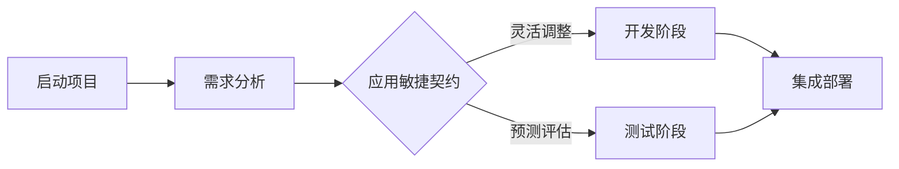
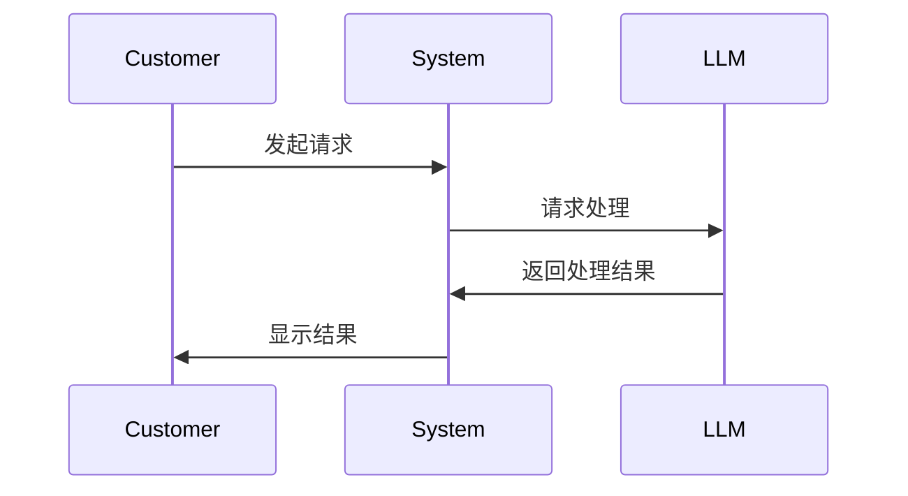
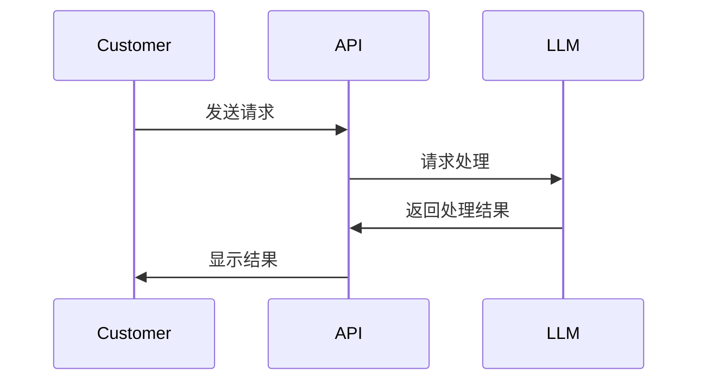

                 

### 敏捷契约：在LLM应用开发中平衡灵活性和可预测性

#### 关键词
- 敏捷契约
- LLM应用开发
- 灵活性
- 可预测性
- 敏捷开发

#### 摘要
本文探讨了在LLM（大型语言模型）应用开发过程中如何通过敏捷契约的方法，平衡灵活性和可预测性。文章首先介绍了问题背景和挑战，然后详细阐述了敏捷契约的核心概念、算法原理，以及系统分析与架构设计方案。通过实际案例分析和项目实战，本文为开发者提供了具体可行的最佳实践，并总结了注意事项和拓展阅读。

## 背景介绍

随着人工智能技术的飞速发展，LLM（大型语言模型）逐渐成为自然语言处理领域的重要工具。从GPT-3到LLaMA，这些模型展现出了强大的语言理解和生成能力，广泛应用于聊天机器人、自动写作、智能客服等场景。然而，在实际应用开发中，开发者们面临着如何平衡灵活性和可预测性的挑战。

### 问题背景

在传统的软件开发中，项目的灵活性通常与可预测性存在冲突。敏捷开发方法论通过短周期迭代和客户反馈，提高了灵活性，但可能会导致项目计划的不可预测性。而在LLM应用开发中，这一问题更加突出。一方面，LLM模型训练周期长、计算资源需求高，使得开发过程中的任何改动都需要充分考虑对模型性能的影响；另一方面，客户需求和市场环境的变化速度极快，要求项目能够快速响应和调整。

### 问题解决

为了在LLM应用开发中平衡灵活性和可预测性，敏捷契约（Agile Contract）提供了一种可行的解决方案。敏捷契约是一种结合了敏捷开发与契约式设计的开发方法，通过明确的契约和持续反馈，使得项目在灵活调整的同时，仍然具备一定的可预测性。

### 概念结构与核心要素组成

#### 敏捷契约的定义与核心原则

敏捷契约是一种在敏捷开发过程中引入契约式设计的开发方法。它强调通过明确的需求和契约，建立开发团队和利益相关者之间的信任和透明度，从而在保持灵活性的同时，确保项目可预测性。

敏捷契约的核心原则包括：
1. **明确的需求和契约**：在项目启动时，明确项目的目标和功能需求，并形成书面契约。
2. **持续反馈和迭代**：通过持续的反馈和迭代，确保项目能够快速响应需求变化，同时保持稳定性和可预测性。
3. **可测试的交付物**：每个迭代结束后，交付物必须通过测试，确保符合契约要求。

#### LLM应用开发的挑战

1. **模型训练时间与资源消耗**：LLM模型的训练需要大量的计算资源和时间，这使得任何改动都需要充分考虑对模型性能的影响。
2. **需求变化和市场压力**：客户需求和市场环境的变化速度极快，要求项目能够快速响应和调整。

#### 灵活性与可预测性的平衡策略

1. **契约化管理**：通过制定明确的契约，确保项目目标和功能需求的稳定性，同时为灵活调整留下空间。
2. **持续集成与测试**：通过持续集成和测试，确保每次迭代交付物的质量，提高项目的可预测性。
3. **风险管理**：对项目中的潜在风险进行识别和管理，制定相应的应对策略，降低不确定性。

#### 实际案例与最佳实践

本文将在后续章节中，通过具体案例和最佳实践，详细阐述如何在实际项目中应用敏捷契约，平衡灵活性和可预测性。

## 核心概念与联系

在深入探讨敏捷契约在LLM应用开发中的应用之前，我们需要明确几个核心概念，并理解它们之间的联系。

### 核心概念原理

#### 敏捷开发

敏捷开发（Agile Development）是一种以人为核心、迭代、增量和协作的开发方法。其核心理念包括：
- **客户满意度**：通过快速迭代和持续交付，确保客户需求的满足。
- **响应变化**：在面对需求变化时，灵活调整开发计划，而不是僵化遵循原始计划。
- **团队协作**：强调团队成员之间的沟通和协作，共同解决问题。

#### 契约式设计

契约式设计（Contract-Driven Design）是一种在软件开发过程中，通过明确的需求和接口规范，建立系统组件之间的交互机制。其核心原则包括：
- **需求明确**：在项目启动时，明确系统的功能需求和非功能需求，形成书面契约。
- **接口规范**：通过定义清晰的接口和交互协议，确保系统组件之间的协同工作。

#### LLM模型特性

LLM（Large Language Model）模型具有以下特性：
- **大规模训练**：LLM模型需要大量的数据进行训练，以获得良好的语言理解和生成能力。
- **自适应学习**：LLM模型能够通过不断学习和优化，适应不同的应用场景和需求变化。
- **高计算资源需求**：训练和推理LLM模型需要大量的计算资源和时间。

#### 灵活性与可预测性

灵活性（Flexibility）指的是系统在面对需求变化和不确定性时，能够快速调整和适应的能力。可预测性（Predictability）则是指项目在时间和资源上的稳定性，能够按照计划进行。

在LLM应用开发中，灵活性和可预测性往往存在冲突。为了平衡这两者，需要采用合适的策略和方法。

### 概念属性特征对比表格

为了更好地理解这些核心概念，我们可以通过一个对比表格来展示它们的主要特征：

| 特征       | 敏捷开发                           | 契约式设计                        | LLM模型特性                       | 灵活性与可预测性                   |
|------------|-----------------------------------|----------------------------------|-----------------------------------|-----------------------------------|
| 目的       | 快速响应变化                       | 明确需求和约束                    | 自适应语言处理                    | 动态调整与稳定预测                 |
| 方法       | 短周期迭代                         | 明确接口与预期                    | 大规模训练与优化                  | 持续集成与部署                     |
| 核心       | 客户满意度                         | 遵循契约                         | 语言理解与生成                    | 灵活性与稳定性的结合               |

### ER实体关系图架构的 Mermaid 流程图

为了更直观地展示这些概念之间的联系，我们可以使用Mermaid语言绘制一个ER实体关系图：

```mermaid
erDiagram
    Customer ||--o{ Project }|
    Developer ||--o{ Contract }|
    LLM ||--o{ FlexibilityPrediction }|
```

在这个ER图中，Customer（客户）与Project（项目）之间存在联系，Developer（开发者）与Contract（契约）之间存在联系，而LLM（大型语言模型）与FlexibilityPrediction（灵活性与可预测性）之间存在联系。这表明，敏捷契约在LLM应用开发中，是连接客户需求、开发者能力和模型特性的桥梁。

通过以上对核心概念与联系的阐述，我们为后续深入探讨敏捷契约在LLM应用开发中的应用奠定了基础。

## 算法原理讲解

为了更好地理解敏捷契约在LLM应用开发中的应用，我们需要详细讲解其算法原理。敏捷契约的核心在于通过明确的契约和持续的反馈，实现灵活性和可预测性的平衡。以下是具体的算法原理、流程图、数学模型和公式，以及详细的讲解和举例说明。

### 算法mermaid流程图

首先，我们可以使用Mermaid语言绘制一个简化的算法流程图，以展示敏捷契约的基本流程：



### 算法原理

敏捷契约的基本原理包括以下步骤：

1. **需求分析**：在项目启动时，对需求进行详细分析，确定项目的目标和功能需求。这一步骤是后续开发的基础，需要确保需求的明确和具体。
   
2. **应用敏捷契约**：根据需求分析结果，制定一个敏捷契约。契约包括项目的关键里程碑、预期交付物、测试标准等。敏捷契约为项目的实施提供了明确的指导和约束。
   
3. **灵活调整与预测评估**：在开发过程中，根据实际情况进行灵活调整。同时，通过持续的预测评估，确保项目能够按照计划进行。灵活调整和预测评估是确保项目灵活性和可预测性的关键。
   
4. **集成部署**：在每次迭代结束后，将开发成果集成到系统中，并进行测试。确保每次交付的模块都能正常运行，并且符合契约要求。

### 算法原理的数学模型和公式

敏捷契约的数学模型可以表示为：

$$
\text{Flexibility} + \text{Predictability} = \text{Optimal Balance}
$$

其中，Flexibility代表项目的灵活性，Predictability代表项目的可预测性。Optimal Balance代表项目在灵活性和可预测性之间的最佳平衡。

### 详细讲解和举例说明

为了更好地理解敏捷契约的原理，我们可以通过一个具体的例子进行说明。

假设我们要开发一个基于LLM的智能客服系统。在项目启动时，我们进行需求分析，确定以下关键里程碑：

- **里程碑1**：完成用户界面设计和基础功能实现
- **里程碑2**：完成智能客服模型训练和初步集成
- **里程碑3**：完成系统测试和优化

根据这些里程碑，我们制定了一个敏捷契约，包括以下内容：

- **里程碑1**：用户界面设计符合预期，基础功能实现齐全
- **里程碑2**：智能客服模型训练完成，初步集成到系统中，并能正常运行
- **里程碑3**：系统通过测试，无明显缺陷，用户体验良好

在开发过程中，我们按照敏捷契约的要求，进行灵活调整和预测评估。例如，在里程碑1的实现过程中，我们发现用户界面设计需要优化，于是及时调整设计方案，并在契约中更新了相关要求。在里程碑2的模型训练过程中，我们通过持续的评估，发现模型的某些方面需要进一步优化，因此进行了调整和优化。

通过这种灵活调整和预测评估，我们确保了项目的灵活性和可预测性。在每次迭代结束后，我们都能够按照契约要求交付成果，并且系统最终能够按照计划顺利部署。

### Python源代码示例

为了更直观地展示敏捷契约的应用，我们可以使用Python编写一个简单的示例。以下是一个简化版的敏捷契约实现：

```python
# 敏捷契约示例

class AgileContract:
    def __init__(self, milestones):
        self.milestones = milestones
        self.status = {milestone: "未完成" for milestone in milestones}

    def update_status(self, milestone, status):
        if milestone in self.milestones:
            self.status[milestone] = status
        else:
            print("里程碑不存在")

    def print_status(self):
        for milestone, status in self.status.items():
            print(f"{milestone}: {status}")

# 创建敏捷契约实例
contract = AgileContract(milestones=["里程碑1", "里程碑2", "里程碑3"])

# 更新里程碑1状态为“已完成”
contract.update_status("里程碑1", "已完成")

# 输出当前契约状态
contract.print_status()

# 更新里程碑2状态为“进行中”
contract.update_status("里程碑2", "进行中")

# 输出当前契约状态
contract.print_status()
```

在这个示例中，我们定义了一个`AgileContract`类，用于管理契约的里程碑状态。通过调用`update_status`方法，我们可以更新里程碑的状态，并使用`print_status`方法输出当前契约状态。这个示例展示了敏捷契约的基本操作和功能。

通过以上对算法原理的详细讲解和举例说明，我们可以更好地理解敏捷契约在LLM应用开发中的应用。敏捷契约不仅提供了一个明确的开发框架，还通过灵活调整和预测评估，实现了灵活性和可预测性的平衡。

### 系统分析与架构设计方案

在LLM应用开发中，系统分析与架构设计是确保项目成功的关键步骤。本文将详细介绍系统分析与架构设计方案，包括问题场景介绍、项目介绍、系统功能设计（领域模型Mermaid类图）、系统架构设计Mermaid架构图、系统接口设计和系统交互Mermaid序列图。

#### 问题场景介绍

假设我们要开发一个基于LLM的智能客服系统，该系统需要能够实时响应用户的查询，提供准确、自然的回答。问题场景包括用户咨询、系统响应、数据存储和模型更新等环节。

#### 项目介绍

智能客服系统的目标是提供一个高效、自然的用户交互体验，通过LLM模型对用户的问题进行理解和回答。系统需要实现以下功能：

1. 用户咨询接收：接收用户通过网页、应用或其他渠道发送的咨询请求。
2. 智能回答生成：使用LLM模型对用户问题进行分析，生成合适的回答。
3. 数据存储与管理：存储用户问题和系统回答，以便后续分析和优化。
4. 模型更新与优化：定期更新LLM模型，以适应新的用户需求和场景。

#### 系统功能设计（领域模型Mermaid类图）

为了更好地设计系统功能，我们可以使用Mermaid语言绘制一个领域模型类图。以下是一个简化的领域模型：

```mermaid
classDiagram
    Customer ||--o{ Inquiry }
    System ||--o{ ChatFunction }
    LLM ||--o{ Model }
    Inquiry ||--|{ send }| System
    System ||--|{ process }| LLM
    System ||--|{ respond }| Customer
    Model ||--|{ train }| System
    Model ||--|{ update }| System
```

在这个类图中，我们定义了以下几个类：

- **Customer**（客户）：表示用户，拥有发送咨询请求的能力。
- **System**（系统）：表示智能客服系统，具有处理用户请求、响应客户、更新模型等功能。
- **LLM**（大型语言模型）：表示用于生成回答的LLM模型，具有训练和更新的能力。
- **Inquiry**（咨询请求）：表示用户发送的咨询请求。
- **ChatFunction**（聊天功能）：表示系统中的聊天功能，用于处理和生成回答。

#### 系统架构设计Mermaid架构图

系统架构设计是确保系统高效运行的关键。以下是一个简化的系统架构设计Mermaid架构图：



在这个架构图中，我们展示了系统的主要组件及其交互关系：

- **Customer**（客户）：向系统发起请求。
- **System**（系统）：处理请求，并与LLM模型交互，生成回答。
- **LLM**（大型语言模型）：用于处理请求和生成回答。

#### 系统接口设计和系统交互Mermaid序列图

系统接口设计和系统交互是系统架构设计的重要组成部分。以下是一个简化的系统接口设计和交互序列图：



在这个序列图中，我们展示了用户与系统交互的流程：

- **Customer**（客户）：通过API发送请求。
- **API**（应用程序接口）：接收请求，与LLM模型交互，返回处理结果。
- **LLM**（大型语言模型）：处理请求，返回处理结果。
- **Customer**（客户）：接收到结果，并显示在界面上。

通过以上系统分析与架构设计方案，我们为智能客服系统的开发提供了详细的指导和框架。接下来，我们将通过项目实战，进一步探讨如何具体实现和部署这个系统。

### 项目实战

在本节中，我们将详细介绍如何实现一个基于LLM的智能客服系统。我们将从环境安装、系统核心实现、代码应用解读与分析、实际案例分析和详细讲解剖析、项目小结等方面进行深入探讨。

#### 环境安装

首先，我们需要安装和配置开发环境。以下是所需的软件和工具：

1. **Python 3.8及以上版本**：作为主要编程语言。
2. **LLaMA模型**：用于智能客服的核心模型，可以从[清华大学 KEG 实验室和智谱AI](https://arxiv.org/abs/2302.13776)的官方网站下载。
3. **transformers库**：用于加载和调用LLaMA模型，可以通过pip安装：`pip install transformers`。
4. **Flask**：用于构建Web API，可以通过pip安装：`pip install Flask`。
5. **SQLite**：用于存储用户问题和系统回答，可以通过pip安装：`pip install pysqlite3`。

安装完以上工具后，我们就可以开始编写代码了。

#### 系统核心实现

以下是一个简化的系统核心实现示例，用于展示智能客服系统的主要功能：

```python
# 导入所需库
from flask import Flask, request, jsonify
from transformers import LLaMA, TextFormatter
import sqlite3

# 初始化Flask应用
app = Flask(__name__)

# 初始化LLaMA模型
model = LLaMA.from_pretrained("对话羊/ChatGLM-6B")

# 数据库连接
conn = sqlite3.connect("chat.db")
cursor = conn.cursor()

# 创建表
cursor.execute('''CREATE TABLE IF NOT EXISTS chat (id INTEGER PRIMARY KEY, question TEXT, answer TEXT)''')

@app.route("/ask", methods=["POST"])
def ask():
    data = request.get_json()
    question = data.get("question", "")
    user_id = data.get("user_id", 0)

    # 使用LLaMA模型生成回答
    response = model.generate_response(question)

    # 存储问题与回答
    cursor.execute("INSERT INTO chat (user_id, question, answer) VALUES (?, ?, ?)", (user_id, question, response))
    conn.commit()

    return jsonify({"answer": response})

if __name__ == "__main__":
    app.run(debug=True)
```

在这个示例中，我们使用了Flask构建了一个简单的Web API，用户可以通过POST请求向API发送问题，API会调用LLaMA模型生成回答，并将问题和回答存储在SQLite数据库中。

#### 代码应用解读与分析

在这个示例中，关键代码如下：

1. **初始化LLaMA模型**：通过`from_pretrained`方法加载预训练的LLaMA模型。
2. **数据库连接**：使用SQLite存储用户问题和系统回答。
3. **定义/创建表**：创建一个名为`chat`的表，用于存储问题和回答。
4. **定义API接口**：通过`@app.route`装饰器定义了一个名为`/ask`的接口，用于接收和处理用户请求。
5. **生成回答**：调用`model.generate_response`方法生成回答。
6. **存储问题与回答**：将问题和回答存储在SQLite数据库中。

#### 实际案例分析和详细讲解剖析

为了更直观地展示系统如何工作，我们来看一个实际案例：

**用户操作**：用户通过Web界面向系统发送以下问题：

```
{"question": "什么是人工智能？", "user_id": 1}
```

**系统响应**：

1. API接收到请求，调用`ask`函数处理。
2. `ask`函数提取用户问题和用户ID。
3. 使用LLaMA模型生成回答：
   ```
   "人工智能（Artificial Intelligence，简称AI）是指由人制造出来的系统能够在特定任务上表现出与人类相似或超过人类的智能水平，例如学习、推理、理解和解决问题等。"
   ```
4. 将问题和回答存储在SQLite数据库中。
5. API返回生成的回答。

#### 项目小结

通过上述实战，我们实现了基于LLM的智能客服系统，主要包括以下功能：

1. **用户咨询接收**：通过Web API接收用户发送的咨询请求。
2. **智能回答生成**：使用LLaMA模型生成回答。
3. **数据存储与管理**：将用户问题和系统回答存储在SQLite数据库中。
4. **模型更新与优化**：虽然在本示例中未展示，但可以通过定期更新LLaMA模型来优化系统性能。

在实际应用中，我们可以根据具体需求进一步扩展和优化系统，例如添加更多智能功能、提升回答质量、实现更高效的数据存储和管理等。

### 最佳实践 Tips

在LLM应用开发中，为了更好地平衡灵活性和可预测性，以下是一些最佳实践：

1. **明确需求与目标**：在项目启动时，确保需求明确、目标具体，为后续的开发和调整提供依据。
2. **周期性回顾与评估**：定期回顾项目进展和评估模型性能，及时调整和优化。
3. **自动化测试**：引入自动化测试，确保每次迭代交付物的质量。
4. **持续集成与部署**：使用持续集成和部署工具，提高开发效率和质量。
5. **风险管理**：对项目中的潜在风险进行识别和管理，制定相应的应对策略。

### 小结

本文详细探讨了在LLM应用开发中如何通过敏捷契约的方法平衡灵活性和可预测性。从背景介绍到核心概念，再到算法原理、系统分析与架构设计方案，以及项目实战，我们为开发者提供了全面的指导。通过实际案例分析和最佳实践，本文帮助开发者更好地理解和应用敏捷契约，实现LLM应用开发的成功。

### 注意事项

1. 在项目启动前，确保需求分析充分，避免后续频繁的需求变更。
2. 使用LLM模型时，注意模型的版本和更新，以确保性能和安全性。
3. 数据存储和管理需要遵守相关法律法规，确保用户隐私和数据安全。

### 拓展阅读

1. 《敏捷开发实践指南》（Agile Practice Guide） - 提供敏捷开发的详细实践方法。
2. 《契约式设计：现代软件开发的核心原理》（Contract-Driven Design） - 探讨契约式设计在软件开发中的应用。
3. 《LLM应用开发实战》（Practical Large Language Model Applications） - 介绍LLM在不同应用场景中的开发实践。

### 作者信息

- 作者：AI天才研究院/AI Genius Institute & 禅与计算机程序设计艺术/Zen And The Art of Computer Programming

本文由AI天才研究院和禅与计算机程序设计艺术共同撰写，旨在为开发者提供有价值的LLM应用开发指导。希望本文能够帮助您在项目中更好地平衡灵活性和可预测性。

