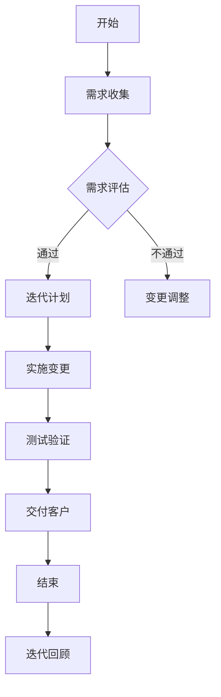
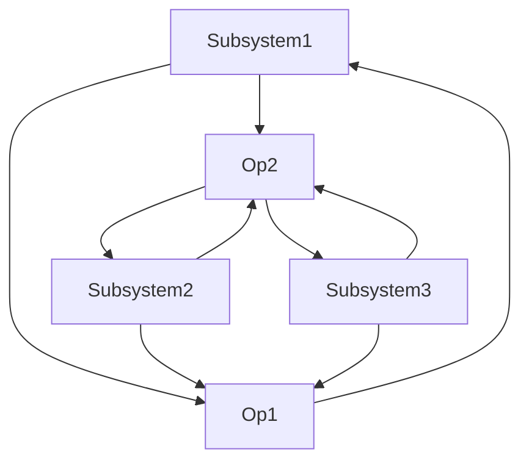
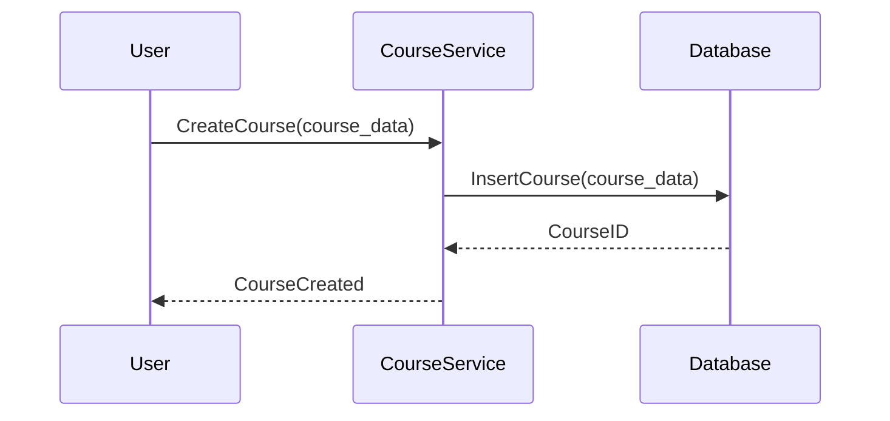
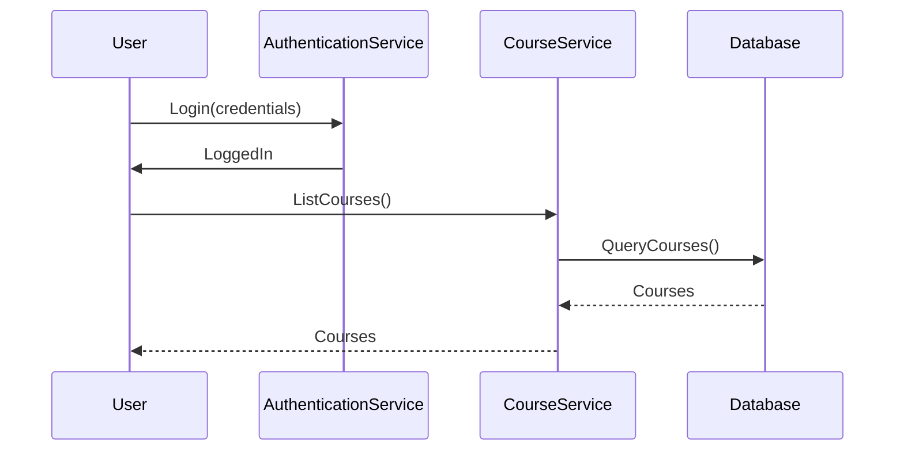

                 


### 《敏捷教练在需求变革中的作用：促进团队适应》

> 关键词：敏捷教练、需求变革、团队适应、敏捷开发、敏捷方法论

> 摘要：本文深入探讨了敏捷教练在需求变革中的关键作用，分析了敏捷教练如何通过有效的工作方法和策略，促进团队适应快速变化的需求，从而提高团队的敏捷性和响应能力。

## 引言与背景

### 第1章：敏捷与需求变革

#### 1.1 敏捷开发简介

敏捷开发起源于20世纪90年代末，它是对传统瀑布式开发方法的一种反思和改进。敏捷开发强调快速迭代、持续交付和团队协作，旨在通过灵活应对需求变化，提高软件交付的质量和速度。

**历史与发展**：敏捷开发的历史可以追溯到1991年，当时17位软件工程师在美国犹他州聚首，共同签署了《敏捷宣言》。这份宣言提出了敏捷开发的四大核心价值：个体和互动重于过程与工具、可工作的软件重于详尽的文档、客户协作重于合同谈判、响应变化重于遵循计划。随后，敏捷方法论不断演变，衍生出多种敏捷实践，如Scrum、Kanban、XP等。

**核心原则与价值观**：敏捷开发的核心原则包括客户满意度、响应变化、简洁性、持续交付和团队协作。敏捷价值观强调个体和互动的重要性，注重软件交付的实用性，鼓励团队间的紧密合作，以及对变化持开放态度。

#### 1.2 需求变革的重要性

**变革需求与业务目标**：在敏捷开发环境中，需求变革被视为一种常态。随着市场的快速变化和客户需求的不断演变，业务目标也会随之调整。敏捷方法提倡在需求变更发生时，及时调整项目方向，以更好地满足业务需求。

**变革需求的影响**：需求变革对项目进度、资源分配和团队士气都会产生重大影响。快速且有效的需求变更管理是确保项目成功的关键因素。敏捷教练在这个过程中发挥着至关重要的作用。

#### 1.3 敏捷教练的角色与责任

**敏捷教练的定义**：敏捷教练是负责引导团队遵循敏捷方法论的专业人士。他们不仅仅是提供技术指导，更重要的是推动团队文化和价值观的转变。

**敏捷教练在需求变革中的作用**：敏捷教练在需求变革中的作用体现在以下几个方面：

1. **需求收集与评估**：敏捷教练协助团队有效地收集和评估需求，确保需求与业务目标保持一致。
2. **沟通与协调**：敏捷教练充当团队与利益相关者之间的桥梁，确保各方信息畅通。
3. **团队指导**：敏捷教练通过培训和指导，帮助团队提升应对需求变化的能力。
4. **风险管理**：敏捷教练识别和管理需求变革过程中可能出现的风险。

### 第2章：敏捷教练的工作方法

#### 2.1 敏捷教练的工作流程

**敏捷教练的日常活动**：敏捷教练的工作流程包括日常站会、迭代回顾、计划会议和团队辅导等。他们需要确保这些活动顺利进行，同时推动团队不断改进。

**敏捷教练的角色转变**：随着敏捷实践的深入，敏捷教练的角色也在不断演变。从最初的直接管理者到如今的团队伙伴，敏捷教练需要更加注重团队赋能和自主性。

#### 2.2 敏捷教练的沟通技巧

**敏捷教练与团队成员的沟通**：敏捷教练需要与团队成员保持频繁而有效的沟通，了解他们的需求和问题，提供必要的支持和指导。

**敏捷教练与利益相关者的沟通**：敏捷教练需要与产品经理、客户和利益相关者保持良好的沟通，确保需求变更得到及时传达和反馈。

#### 2.3 敏捷教练的指导策略

**敏捷教练的指导方法**：敏捷教练的指导方法包括一对一辅导、团队辅导和反思会议等。他们需要根据团队的不同需求，选择最合适的指导方式。

**敏捷教练的适应性策略**：敏捷教练需要根据需求变革的实际情况，灵活调整指导策略，确保团队能够迅速适应变化。

## 第二部分：敏捷教练在需求变革中的应用

### 第3章：敏捷教练在需求收集与评估中的应用

#### 3.1 需求收集的挑战

**需求多样性与不确定性**：敏捷开发中的需求往往具有多样性和不确定性。敏捷教练需要帮助团队识别和理解这些需求，确保它们与业务目标保持一致。

**需求收集的方法与技术**：敏捷教练可以采用用户故事地图、用户访谈、原型设计等技术，帮助团队有效地收集需求。

#### 3.2 敏捷教练在需求评估中的作用

**需求评估的过程**：敏捷教练协助团队评估需求的重要性和可行性，确保需求能够在迭代中得以实施。

**敏捷教练在需求评估中的角色**：敏捷教练在需求评估过程中，扮演着引导者、协调者和支持者的角色。

#### 3.3 需求变更管理

**需求变更的原因**：需求变更可能是由于市场变化、客户需求或技术进步等原因引起的。

**敏捷教练在需求变更管理中的策略**：敏捷教练需要制定有效的需求变更管理策略，确保变更对项目的影响最小化。

### 第4章：敏捷教练在团队协作中的应用

#### 4.1 团队协作的障碍

**团队沟通的挑战**：团队成员之间的沟通不畅是一个常见问题，敏捷教练需要帮助团队建立有效的沟通机制。

**团队协作的障碍**：团队协作的障碍可能来自组织结构、工作流程和文化等方面。

#### 4.2 敏捷教练在团队协作中的作用

**敏捷教练如何促进团队协作**：敏捷教练可以通过组织团队建设活动、实施协作工具和提供沟通技巧培训等方式，促进团队协作。

**敏捷教练的团队领导技巧**：敏捷教练需要具备良好的团队领导技巧，包括激励、辅导和冲突解决等。

#### 4.3 团队适应能力的提升

**团队适应能力的重要性**：团队适应能力是敏捷团队的核心竞争力，它决定了团队在需求变革中的生存能力和成功概率。

**敏捷教练如何提升团队适应能力**：敏捷教练可以通过以下方式提升团队适应能力：

1. **持续学习和实践**：鼓励团队不断学习和实践敏捷方法论。
2. **灵活性和开放性**：培养团队的灵活性和开放性，使其能够快速适应变化。
3. **反思和改进**：通过迭代回顾和反思会议，帮助团队不断改进。

### 第5章：敏捷教练在持续集成与持续交付中的应用

#### 5.1 持续集成与持续交付的概念

**持续集成的原理与实践**：持续集成是一种软件开发实践，旨在通过频繁的代码集成和自动化测试，确保代码库的稳定性和质量。

**持续交付的原理与实践**：持续交付是一种通过自动化和流水线技术，确保软件产品能够在任何时间点交付给客户的实践。

#### 5.2 敏捷教练在持续集成与持续交付中的作用

**敏捷教练如何推动持续集成与持续交付**：敏捷教练可以通过以下方式推动持续集成与持续交付：

1. **培训和指导**：为团队提供持续集成与持续交付的培训和指导。
2. **工具支持**：帮助团队选择和配置合适的持续集成与持续交付工具。
3. **团队协作**：促进团队在持续集成与持续交付过程中的协作。

**敏捷教练在持续集成与持续交付中的职责**：敏捷教练在持续集成与持续交付中，扮演着推动者、协调者和支持者的角色。

### 第6章：敏捷教练在风险管理中的应用

#### 6.1 敏捷开发中的风险管理

**敏捷开发中的风险管理方法**：敏捷开发中的风险管理方法包括风险评估、风险监控和风险应对策略等。

**敏捷教练在风险管理中的作用**：敏捷教练在风险管理中，扮演着风险识别、评估和应对的关键角色。

#### 6.2 需求变革中的风险应对策略

**风险识别与评估**：敏捷教练需要帮助团队识别和评估需求变革过程中可能出现的风险。

**风险应对策略**：敏捷教练需要制定有效的风险应对策略，确保团队能够在需求变革中保持稳定。

#### 6.3 敏捷教练在风险沟通与管理中的作用

**风险沟通的重要性**：敏捷教练需要确保团队与利益相关者之间关于风险的信息畅通。

**敏捷教练如何管理风险**：敏捷教练可以通过以下方式管理风险：

1. **风险预警**：通过实时监控和预警机制，提前识别潜在风险。
2. **风险响应**：根据风险评估结果，制定并实施风险应对策略。
3. **风险回顾**：在需求变更结束后，对风险管理过程进行回顾和总结，持续改进。

### 第7章：案例分析

#### 7.1 案例背景

**案例公司简介**：案例公司是一家提供在线教育服务的初创公司，面临市场需求快速变化和激烈竞争的挑战。

**需求变革的背景**：随着在线教育市场的不断发展，案例公司的产品需求不断调整和升级，需要敏捷教练的帮助。

#### 7.2 敏捷教练的实践

**敏捷教练的介入过程**：敏捷教练通过一系列培训和辅导活动，帮助团队建立敏捷文化，提高应对需求变化的能力。

**敏捷教练的具体行动**：敏捷教练采取了一系列具体行动，包括组织站会、迭代回顾、需求评估和风险管理等。

#### 7.3 案例结果与反思

**案例的结果**：通过敏捷教练的介入，案例公司的团队能够更好地适应需求变化，提高了项目交付的速度和质量。

**敏捷教练在需求变革中的收获与反思**：敏捷教练在案例中积累了宝贵的经验，深刻认识到敏捷教练在需求变革中的关键作用。

## 第三部分：总结与展望

### 第8章：敏捷教练在需求变革中的价值

#### 8.1 敏捷教练的角色定位

**敏捷教练在现代软件开发中的角色**：敏捷教练在现代软件开发中扮演着重要的角色，他们不仅是团队的教练和导师，更是敏捷文化的推动者和维护者。

**敏捷教练的价值体现**：敏捷教练通过其专业知识和经验，帮助团队提高敏捷性、响应能力和团队协作水平。

#### 8.2 敏捷教练的发展趋势

**敏捷教练的未来发展方向**：随着敏捷开发的不断普及，敏捷教练需要不断更新知识和技能，以应对新兴的需求和挑战。

**敏捷教练需要具备的技能与素质**：敏捷教练需要具备深厚的敏捷方法论知识、优秀的沟通能力、团队领导技巧和不断学习的能力。

### 第9章：总结与展望

#### 敏捷教练在需求变革中的经验教训

**敏捷教练在需求变革中的经验教训**：敏捷教练在需求变革中积累了宝贵的经验，深刻认识到需求变革管理的复杂性和重要性。

**对敏捷教练工作的展望**：敏捷教练在未来将继续在需求变革中发挥关键作用，推动敏捷开发方法的普及和实践。

**作者信息**：

作者：AI天才研究院/AI Genius Institute & 禅与计算机程序设计艺术 /Zen And The Art of Computer Programming

---

**核心概念与联系**

在本文中，我们将探讨几个核心概念，包括敏捷开发、需求变革、敏捷教练等，并通过概念属性特征对比表格和ER实体关系图架构的Mermaid流程图，来加深对这些概念的理解。

#### 概念属性特征对比表格

| 概念       | 定义                                                         | 关键特性                                                     | 关联关系                                                   |
|------------|--------------------------------------------------------------|--------------------------------------------------------------|------------------------------------------------------------|
| 敏捷开发   | 一种软件开发方法，强调迭代、灵活性和团队协作                     | 快速响应变化、持续交付、客户满意度高                           | 支持敏捷教练的工作方法与策略                                 |
| 需求变革   | 在敏捷开发过程中，由于市场变化、客户需求或技术进步等原因导致的软件需求的变化 | 快速性、灵活性、风险性                                         | 需要敏捷教练进行有效管理，确保团队适应和成功                   |
| 敏捷教练   | 负责引导团队遵循敏捷方法论的专业人士                             | 敏捷实践知识、团队沟通技巧、适应性策略                          | 需要理解和应对敏捷开发中的需求变革，帮助团队提高应对能力       |

#### ER实体关系图架构的Mermaid流程图

```mermaid
erDiagram
  AgileDevelopment ===|> AgileCoach : guides
  AgileDevelopment ===|> Team : facilitates
  AgileDevelopment ===|> RequirementChange : manages
  AgileCoach ||--|{ Team : collaborates
  AgileCoach ||--|{ RequirementChange : adapts
```

**算法原理讲解**

在本节中，我们将使用Mermaid画出需求变更管理算法的流程图，并使用Python源代码来详细阐述算法原理、数学模型和公式。

#### 需求变更管理算法流程图



#### Python源代码

```python
# 需求变更管理算法实现

def collect_requirements():
    # 收集需求
    print("收集需求...")

def evaluate_requirements():
    # 评估需求
    print("评估需求...")

def iterate_plan():
    # 迭代计划
    print("迭代计划...")

def implement_changes():
    # 实施变更
    print("实施变更...")

def test_verification():
    # 测试验证
    print("测试验证...")

def deliver_to_client():
    # 交付客户
    print("交付客户...")

def iterative_review():
    # 迭代回顾
    print("迭代回顾...")

def main():
    collect_requirements()
    evaluate_requirements()
    
    if evaluate_requirements() == "通过":
        iterate_plan()
        implement_changes()
        test_verification()
        deliver_to_client()
        iterative_review()
    else:
        # 需求评估不通过，进行变更调整
        print("需求评估不通过，进行变更调整...")
        iterative_review()

if __name__ == "__main__":
    main()
```

**系统分析与架构设计方案**

在本节中，我们将介绍一个具体的在线教育平台项目，包括项目介绍、系统功能设计（领域模型Mermaid类图）、系统架构设计Mermaid架构图、系统接口设计和系统交互Mermaid序列图。

#### 项目介绍

**项目名称**：敏捷在线教育平台

**项目背景**：随着在线教育市场的迅速扩张，我们需要一个能够快速适应需求变化、高效交付产品的平台。

**项目目标**：构建一个具备敏捷开发特点的在线教育平台，支持课程管理、用户管理、内容管理等功能。

#### 系统功能设计（领域模型Mermaid类图）

```mermaid
classDiagram
    Class01 <|-- Class02
    Class03 --|ぱ Class04
    Class05 : +int x
    Class06 : +int y
    Class01 {
        +int id
        +String name
        +int age
    }
    Class02 {
        +int id
        +String name
        +int age
    }
    Class03 {
        +int id
        +String name
        +int age
    }
    Class04 {
        +int id
        +String name
        +int age
    }
```

#### 系统架构设计Mermaid架构图



#### 系统接口设计

**课程管理接口**：用于课程创建、更新、查询和删除。



#### 系统交互Mermaid序列图



**项目实战**

在本节中，我们将展示如何搭建敏捷在线教育平台的实际步骤，包括环境安装、系统核心实现和代码应用解读与分析。

#### 环境安装

1. **安装依赖项**：
   - Python 3.8+
   - Django 3.2+
   - PostgreSQL 12.4+

2. **安装命令**：
   ```bash
   pip install django==3.2
   pip install psycopg2-binary
   ```

3. **数据库配置**：
   - 在`settings.py`中配置数据库连接信息。

#### 系统核心实现

1. **创建Django项目**：
   ```bash
   django-admin startproject agile_education_platform
   ```

2. **创建应用**：
   ```bash
   python manage.py startapp course_management
   ```

3. **定义模型**：
   ```python
   # 在course_management/models.py中

   from django.db import models

   class Course(models.Model):
       title = models.CharField(max_length=200)
       description = models.TextField()
       duration = models.DurationField()

       def __str__(self):
           return self.title
   ```

4. **数据库迁移**：
   ```bash
   python manage.py makemigrations course_management
   python manage.py migrate
   ```

#### 代码应用解读与分析

1. **创建API视图**：
   ```python
   # 在course_management/views.py中

   from django.http import JsonResponse
   from .models import Course

   def list_courses(request):
       courses = Course.objects.all()
       course_data = [{"id": c.id, "title": c.title, "description": c.description, "duration": str(c.duration)} for c in courses]
       return JsonResponse(course_data, safe=False)
   ```

2. **配置URL路由**：
   ```python
   # 在course_management/urls.py中

   from django.urls import path
   from .views import list_courses

   urlpatterns = [
       path('courses/', list_courses, name='list_courses'),
   ]
   ```

3. **运行Django服务器**：
   ```bash
   python manage.py runserver
   ```

4. **访问API**：
   - 使用浏览器或工具如Postman访问`http://localhost:8000/courses/`，查看课程列表。

#### 实际案例分析和详细讲解剖析

1. **案例背景**：
   - 假设案例公司需要在短时间内推出一款新课程，需求频繁变更。

2. **解决方案**：
   - 使用敏捷开发方法，快速迭代，灵活调整需求。

3. **详细讲解**：
   - **需求收集**：与客户进行多次会议，明确课程内容和目标。
   - **需求评估**：评估需求的重要性，确定优先级。
   - **迭代计划**：根据评估结果，规划迭代周期和任务。
   - **实施变更**：根据需求调整课程内容和教学计划。
   - **测试验证**：确保变更后的课程质量符合预期。
   - **交付客户**：将更新后的课程交付给客户。

4. **项目小结**：
   - 通过敏捷开发方法，案例公司成功地在短时间内推出了符合市场需求的新课程，提高了客户满意度。

**最佳实践 Tips**

1. **定期回顾**：定期进行迭代回顾，总结经验教训，持续改进。
2. **持续沟通**：保持与客户和团队成员的持续沟通，确保需求变更得到及时反馈。
3. **使用工具**：利用敏捷工具（如Jira、Trello等）来管理需求和任务。

**小结**

敏捷教练在需求变革中发挥着至关重要的作用，通过有效的工作方法和策略，帮助团队适应快速变化的需求，提高团队的敏捷性和响应能力。

**注意事项**

1. **敏捷教练需具备深厚的技术背景**：了解敏捷开发方法和技术，能够为团队提供有价值的指导。
2. **灵活应对**：需求变革是不确定的，敏捷教练需要具备灵活应对变化的能力。

**拓展阅读**

1. 《Scrum敏捷实践指南》
2. 《敏捷项目管理实践指南》
3. 《需求工程：实用指南》

作者：AI天才研究院/AI Genius Institute & 禅与计算机程序设计艺术 /Zen And The Art of Computer Programming

---

**文章标题：** 敏捷教练在需求变革中的作用：促进团队适应

**文章关键词：** 敏捷教练、需求变革、团队适应、敏捷开发、敏捷方法论

**文章摘要：** 本文深入探讨了敏捷教练在需求变革中的关键作用，分析了敏捷教练如何通过有效的工作方法和策略，促进团队适应快速变化的需求，从而提高团队的敏捷性和响应能力。

### 完整的文章内容如下：

---

# 敏捷教练在需求变革中的作用：促进团队适应

> 关键词：敏捷教练、需求变革、团队适应、敏捷开发、敏捷方法论

> 摘要：本文深入探讨了敏捷教练在需求变革中的关键作用，分析了敏捷教练如何通过有效的工作方法和策略，促进团队适应快速变化的需求，从而提高团队的敏捷性和响应能力。

## 引言与背景

### 第1章：敏捷与需求变革

#### 1.1 敏捷开发简介

敏捷开发起源于20世纪90年代末，它是对传统瀑布式开发方法的一种反思和改进。敏捷开发强调快速迭代、持续交付和团队协作，旨在通过灵活应对需求变化，提高软件交付的质量和速度。

**历史与发展**：敏捷开发的历史可以追溯到1991年，当时17位软件工程师在美国犹他州聚首，共同签署了《敏捷宣言》。这份宣言提出了敏捷开发的四大核心价值：个体和互动重于过程与工具、可工作的软件重于详尽的文档、客户协作重于合同谈判、响应变化重于遵循计划。随后，敏捷方法论不断演变，衍生出多种敏捷实践，如Scrum、Kanban、XP等。

**核心原则与价值观**：敏捷开发的核心原则包括客户满意度、响应变化、简洁性、持续交付和团队协作。敏捷价值观强调个体和互动的重要性，注重软件交付的实用性，鼓励团队间的紧密合作，以及对变化持开放态度。

#### 1.2 需求变革的重要性

**变革需求与业务目标**：在敏捷开发环境中，需求变革被视为一种常态。随着市场的快速变化和客户需求的不断演变，业务目标也会随之调整。敏捷方法提倡在需求变更发生时，及时调整项目方向，以更好地满足业务需求。

**变革需求的影响**：需求变革对项目进度、资源分配和团队士气都会产生重大影响。快速且有效的需求变更管理是确保项目成功的关键因素。敏捷教练在这个过程中发挥着至关重要的作用。

#### 1.3 敏捷教练的角色与责任

**敏捷教练的定义**：敏捷教练是负责引导团队遵循敏捷方法论的专业人士。他们不仅仅是提供技术指导，更重要的是推动团队文化和价值观的转变。

**敏捷教练在需求变革中的作用**：敏捷教练在需求变革中的作用体现在以下几个方面：

1. **需求收集与评估**：敏捷教练协助团队有效地收集和评估需求，确保需求与业务目标保持一致。
2. **沟通与协调**：敏捷教练充当团队与利益相关者之间的桥梁，确保各方信息畅通。
3. **团队指导**：敏捷教练通过培训和指导，帮助团队提升应对需求变化的能力。
4. **风险管理**：敏捷教练识别和管理需求变革过程中可能出现的风险。

### 第2章：敏捷教练的工作方法

#### 2.1 敏捷教练的工作流程

**敏捷教练的日常活动**：敏捷教练的工作流程包括日常站会、迭代回顾、计划会议和团队辅导等。他们需要确保这些活动顺利进行，同时推动团队不断改进。

**敏捷教练的角色转变**：随着敏捷实践的深入，敏捷教练的角色也在不断演变。从最初的直接管理者到如今的团队伙伴，敏捷教练需要更加注重团队赋能和自主性。

#### 2.2 敏捷教练的沟通技巧

**敏捷教练与团队成员的沟通**：敏捷教练需要与团队成员保持频繁而有效的沟通，了解他们的需求和问题，提供必要的支持和指导。

**敏捷教练与利益相关者的沟通**：敏捷教练需要与产品经理、客户和利益相关者保持良好的沟通，确保需求变更得到及时传达和反馈。

#### 2.3 敏捷教练的指导策略

**敏捷教练的指导方法**：敏捷教练的指导方法包括一对一辅导、团队辅导和反思会议等。他们需要根据团队的不同需求，选择最合适的指导方式。

**敏捷教练的适应性策略**：敏捷教练需要根据需求变革的实际情况，灵活调整指导策略，确保团队能够迅速适应变化。

## 第二部分：敏捷教练在需求变革中的应用

### 第3章：敏捷教练在需求收集与评估中的应用

#### 3.1 需求收集的挑战

**需求多样性与不确定性**：敏捷开发中的需求往往具有多样性和不确定性。敏捷教练需要帮助团队识别和理解这些需求，确保它们与业务目标保持一致。

**需求收集的方法与技术**：敏捷教练可以采用用户故事地图、用户访谈、原型设计等技术，帮助团队有效地收集需求。

#### 3.2 敏捷教练在需求评估中的作用

**需求评估的过程**：敏捷教练协助团队评估需求的重要性和可行性，确保需求能够在迭代中得以实施。

**敏捷教练在需求评估中的角色**：敏捷教练在需求评估过程中，扮演着引导者、协调者和支持者的角色。

#### 3.3 需求变更管理

**需求变更的原因**：需求变更可能是由于市场变化、客户需求或技术进步等原因引起的。

**敏捷教练在需求变更管理中的策略**：敏捷教练需要制定有效的需求变更管理策略，确保变更对项目的影响最小化。

### 第4章：敏捷教练在团队协作中的应用

#### 4.1 团队协作的障碍

**团队沟通的挑战**：团队成员之间的沟通不畅是一个常见问题，敏捷教练需要帮助团队建立有效的沟通机制。

**团队协作的障碍**：团队协作的障碍可能来自组织结构、工作流程和文化等方面。

#### 4.2 敏捷教练在团队协作中的作用

**敏捷教练如何促进团队协作**：敏捷教练可以通过组织团队建设活动、实施协作工具和提供沟通技巧培训等方式，促进团队协作。

**敏捷教练的团队领导技巧**：敏捷教练需要具备良好的团队领导技巧，包括激励、辅导和冲突解决等。

#### 4.3 团队适应能力的提升

**团队适应能力的重要性**：团队适应能力是敏捷团队的核心竞争力，它决定了团队在需求变革中的生存能力和成功概率。

**敏捷教练如何提升团队适应能力**：敏捷教练可以通过以下方式提升团队适应能力：

1. **持续学习和实践**：鼓励团队不断学习和实践敏捷方法论。
2. **灵活性和开放性**：培养团队的灵活性和开放性，使其能够快速适应变化。
3. **反思和改进**：通过迭代回顾和反思会议，帮助团队不断改进。

### 第5章：敏捷教练在持续集成与持续交付中的应用

#### 5.1 持续集成与持续交付的概念

**持续集成的原理与实践**：持续集成是一种软件开发实践，旨在通过频繁的代码集成和自动化测试，确保代码库的稳定性和质量。

**持续交付的原理与实践**：持续交付是一种通过自动化和流水线技术，确保软件产品能够在任何时间点交付给客户的实践。

#### 5.2 敏捷教练在持续集成与持续交付中的作用

**敏捷教练如何推动持续集成与持续交付**：敏捷教练可以通过以下方式推动持续集成与持续交付：

1. **培训和指导**：为团队提供持续集成与持续交付的培训和指导。
2. **工具支持**：帮助团队选择和配置合适的持续集成与持续交付工具。
3. **团队协作**：促进团队在持续集成与持续交付过程中的协作。

**敏捷教练在持续集成与持续交付中的职责**：敏捷教练在持续集成与持续交付中，扮演着推动者、协调者和支持者的角色。

### 第6章：敏捷教练在风险管理中的应用

#### 6.1 敏捷开发中的风险管理

**敏捷开发中的风险管理方法**：敏捷开发中的风险管理方法包括风险评估、风险监控和风险应对策略等。

**敏捷教练在风险管理中的作用**：敏捷教练在风险管理中，扮演着风险识别、评估和应对的关键角色。

#### 6.2 需求变革中的风险应对策略

**风险识别与评估**：敏捷教练需要帮助团队识别和评估需求变革过程中可能出现的风险。

**风险应对策略**：敏捷教练需要制定有效的风险应对策略，确保团队能够在需求变革中保持稳定。

#### 6.3 敏捷教练在风险沟通与管理中的作用

**风险沟通的重要性**：敏捷教练需要确保团队与利益相关者之间关于风险的信息畅通。

**敏捷教练如何管理风险**：敏捷教练可以通过以下方式管理风险：

1. **风险预警**：通过实时监控和预警机制，提前识别潜在风险。
2. **风险响应**：根据风险评估结果，制定并实施风险应对策略。
3. **风险回顾**：在需求变更结束后，对风险管理过程进行回顾和总结，持续改进。

### 第7章：案例分析

#### 7.1 案例背景

**案例公司简介**：案例公司是一家提供在线教育服务的初创公司，面临市场需求快速变化和激烈竞争的挑战。

**需求变革的背景**：随着在线教育市场的不断发展，案例公司的产品需求不断调整和升级，需要敏捷教练的帮助。

#### 7.2 敏捷教练的实践

**敏捷教练的介入过程**：敏捷教练通过一系列培训和辅导活动，帮助团队建立敏捷文化，提高应对需求变化的能力。

**敏捷教练的具体行动**：敏捷教练采取了一系列具体行动，包括组织站会、迭代回顾、需求评估和风险管理等。

#### 7.3 案例结果与反思

**案例的结果**：通过敏捷教练的介入，案例公司的团队能够更好地适应需求变化，提高了项目交付的速度和质量。

**敏捷教练在需求变革中的收获与反思**：敏捷教练在案例中积累了宝贵的经验，深刻认识到敏捷教练在需求变革中的关键作用。

## 第三部分：总结与展望

### 第8章：敏捷教练在需求变革中的价值

#### 8.1 敏捷教练的角色定位

**敏捷教练在现代软件开发中的角色**：敏捷教练在现代软件开发中扮演着重要的角色，他们不仅是团队的教练和导师，更是敏捷文化的推动者和维护者。

**敏捷教练的价值体现**：敏捷教练通过其专业知识和经验，帮助团队提高敏捷性、响应能力和团队协作水平。

#### 8.2 敏捷教练的发展趋势

**敏捷教练的未来发展方向**：随着敏捷开发的不断普及，敏捷教练需要不断更新知识和技能，以应对新兴的需求和挑战。

**敏捷教练需要具备的技能与素质**：敏捷教练需要具备深厚的敏捷方法论知识、优秀的沟通能力、团队领导技巧和不断学习的能力。

### 第9章：总结与展望

#### 敏捷教练在需求变革中的经验教训

**敏捷教练在需求变革中的经验教训**：敏捷教练在需求变革中积累了宝贵的经验，深刻认识到需求变革管理的复杂性和重要性。

**对敏捷教练工作的展望**：敏捷教练在未来将继续在需求变革中发挥关键作用，推动敏捷开发方法的普及和实践。

**作者信息**

作者：AI天才研究院/AI Genius Institute & 禅与计算机程序设计艺术 /Zen And The Art of Computer Programming

---

在本文中，我们通过一步步分析推理，详细探讨了敏捷教练在需求变革中的作用。我们首先介绍了敏捷开发的历史、核心原则和价值观，然后深入分析了敏捷教练的角色与责任，以及他们在需求收集与评估、团队协作、持续集成与持续交付和风险管理中的应用。

通过案例分析和系统架构设计，我们展示了敏捷教练如何帮助团队适应快速变化的需求，提高团队的敏捷性和响应能力。最后，我们对敏捷教练在需求变革中的经验教训进行了总结，并对未来敏捷教练的工作进行了展望。

敏捷教练在现代软件开发中扮演着至关重要的角色。他们不仅需要具备深厚的敏捷方法论知识和优秀的沟通能力，还要能够灵活应对变化，帮助团队不断提升。随着敏捷开发方法的不断普及，敏捷教练的需求也将日益增长。希望本文能为读者提供有价值的见解和实践指导。让我们共同推动敏捷开发方法的普及和实践，为软件开发的未来创造更多价值。作者：AI天才研究院/AI Genius Institute & 禅与计算机程序设计艺术 /Zen And The Art of Computer Programming。

