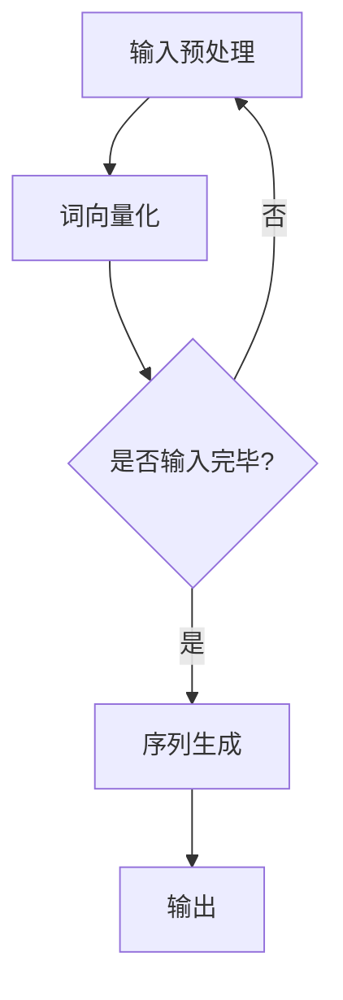
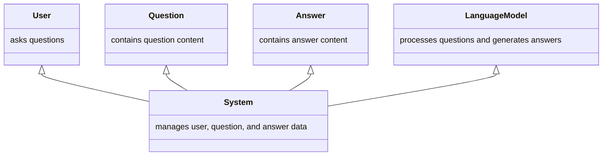
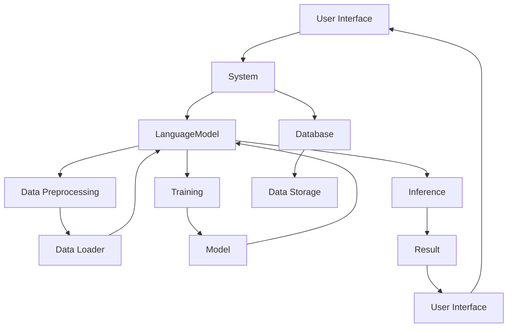
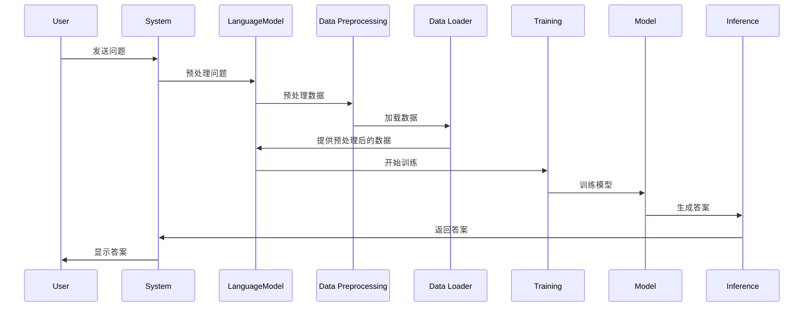

                 

### 第一部分：背景介绍

#### 1.1 问题背景

随着信息技术的飞速发展，人工智能（AI）已经渗透到社会的各个领域。特别是在大型语言模型（LLM）领域，AI技术正不断推动着技术创新和产业升级。LLM作为一种具有强大语义理解能力和知识表示能力的模型，在自然语言处理（NLP）任务中表现出了卓越的性能。

近年来，LLM在各类应用场景中取得了显著的成果。例如，在搜索引擎中，LLM可以帮助提高搜索结果的准确性和相关性；在智能客服中，LLM可以模拟人类对话，提供个性化的服务；在自然语言生成中，LLM可以生成高质量的文章、新闻、报告等。这些应用不仅提升了用户体验，还为企业带来了巨大的商业价值。

#### 1.2 问题描述

尽管LLM在学术研究和工业应用中取得了显著成果，但在实际项目开发中，如何高效地将LLM应用于开发流程中，仍然是一个具有挑战性的问题。这涉及到LLM的选型、优化、集成和扩展等方面。因此，需要一种方法论来指导LLM在项目开发中的创新应用。

在实际项目中，LLM的选型是一个关键问题。选型不当可能导致模型性能不佳，影响项目进度和效果。此外，LLM的优化和集成也是一个难题。优化包括调整模型参数、改进算法等，以提升模型性能。集成则涉及到将LLM与其他系统或模块进行整合，确保整个系统的稳定性和性能。

#### 1.3 问题解决

敏捷方法论作为一种以人为核心、迭代渐进的开发模式，已被广泛应用于软件项目中。敏捷方法论强调用户需求、快速迭代、持续交付，可以有效地提高项目效率、降低风险，并确保项目按时交付。将敏捷方法论引入LLM项目开发，可以有效地解决上述问题。

首先，敏捷方法论可以帮助项目团队更好地理解用户需求，确保项目方向正确。通过迭代开发和持续交付，可以及时调整模型和算法，提高项目性能。其次，敏捷方法论强调团队协作和沟通，有助于提高团队效率。通过代码审查、持续集成等实践，可以保证代码质量和系统的稳定性。

#### 1.4 边界与外延

本书将聚焦于LLM项目开发中的敏捷方法论应用，探讨如何通过敏捷方法来优化LLM项目开发流程。同时，本书也将讨论与敏捷方法论相关的其他关键技术和实践，如持续集成、持续交付、代码审查等。这些技术和实践在LLM项目开发中同样具有重要价值。

本书将首先介绍敏捷方法论的基本原理和核心概念，然后分析敏捷方法论在LLM项目开发中的应用，包括需求管理、任务分配、进度跟踪、风险评估等方面。此外，本书还将探讨LLM算法的原理和实现，以及如何将敏捷方法论应用于LLM项目开发的具体实践。

通过本书的探讨，希望读者能够对敏捷方法论在LLM项目开发中的应用有更深入的理解，并能够将所学知识应用于实际项目中，提高项目开发效率，推动人工智能技术的发展。

#### 1.5 概念结构与核心要素组成

- **敏捷方法论**：一种以用户需求为导向、迭代渐进的开发模式，强调快速响应变化、持续交付价值。
- **LLM项目**：基于大型语言模型的软件开发项目，旨在实现自然语言处理、生成等任务。
- **敏捷方法论在LLM项目中的应用**：将敏捷方法论的原则和实践应用于LLM项目开发，包括需求管理、任务分配、进度跟踪、风险评估等。

### 第二部分：核心概念与联系

#### 2.1 敏捷方法论原理

敏捷开发（Agile Development）是一种以用户需求为导向、迭代渐进的开发模式。其核心思想是快速响应变化，持续交付有价值的软件。敏捷方法论强调沟通、协作、响应变化和持续改进。

- **敏捷开发**：一种软件开发模式，强调快速迭代、用户参与和持续交付。
- **敏捷价值观**：以人为核心，注重沟通、协作、响应变化和持续改进。
- **敏捷原则**：
  - 尽早交付可运行的产品而非完备的文档。
  - 欢迎变化，即使在开发后期。
  - 客户合作，长期关系优于合同谈判。
  - 持续交付有价值的软件。
  - 持续关注技术卓越和良好的设计。
  - 赋予团队自主权，使其在工作中更加高效。
  - 日常面对面沟通。
  - 保持简洁，最大化工作成果。
  - 专注于外部客户反馈。
  - 持续技术和技术改进。

#### 2.2 LLM项目开发中的关键技术和实践

在LLM项目开发中，关键技术和实践包括持续集成（CI）、持续交付（CD）、代码审查和版本控制等。这些技术和实践是确保项目顺利进行和产品质量的重要保障。

- **持续集成（CI）**：持续集成是将代码集成到主干的过程中，通过自动化构建和测试，确保代码质量。
  - **目的**：快速发现和解决问题，确保代码的可集成性。
  - **实践**：定期进行集成构建，自动化测试，确保每次提交的代码都能正常工作。

- **持续交付（CD）**：持续交付是将代码自动部署到生产环境中，确保软件的持续交付和高质量。
  - **目的**：缩短软件交付周期，提高软件质量。
  - **实践**：自动化测试、自动化部署，确保每次交付的软件都是可用的。

- **代码审查**：代码审查是对代码进行审查，提高代码质量，降低风险。
  - **目的**：发现潜在的问题，提高代码质量。
  - **实践**：定期进行代码审查，确保代码风格一致，避免错误。

- **版本控制**：版本控制是使用版本控制系统（如Git）来管理代码，确保代码的版本可追溯性和协作开发。
  - **目的**：确保代码的版本可追溯性，方便协作开发。
  - **实践**：使用版本控制系统，定期提交代码，记录变更。

#### 2.3 敏捷方法论在LLM项目开发中的应用

敏捷方法论在LLM项目开发中的应用主要体现在以下几个方面：

- **需求管理**：敏捷方法论强调用户参与，通过用户故事、迭代规划等方式，确保项目需求及时、准确地捕捉和实现。
- **任务分配**：敏捷方法论鼓励团队协作，通过迭代和冲刺计划，合理分配任务，提高团队效率。
- **进度跟踪**：敏捷方法论采用看板（Kanban）等可视化工具，实时跟踪项目进度，确保项目按时交付。
- **风险评估**：敏捷方法论强调快速响应变化，通过迭代和持续交付，降低项目风险。

#### 2.4 敏捷方法论的优势

敏捷方法论在LLM项目开发中的优势主要体现在以下几个方面：

- **提高项目效率**：敏捷方法论通过迭代和持续交付，缩短了项目周期，提高了项目效率。
- **降低风险**：敏捷方法论强调快速响应变化，通过迭代和持续交付，降低了项目风险。
- **确保项目按时交付**：敏捷方法论通过用户参与和团队协作，确保项目按时交付。
- **提高软件质量**：敏捷方法论通过代码审查、持续集成等实践，提高了软件质量。

综上所述，敏捷方法论在LLM项目开发中具有明显的优势，可以为项目带来更高的效率、更低的风险和更高的质量。通过深入了解和灵活应用敏捷方法论，项目团队可以更好地应对复杂多变的项目环境，实现项目成功。

### 第三部分：算法原理讲解

#### 3.1 LLM算法原理

大型语言模型（LLM）是一种基于深度学习的自然语言处理模型，具有强大的语义理解能力和知识表示能力。LLM的核心原理是通过对海量文本数据的学习，生成对自然语言有较好理解和表达能力的模型。

- **语言模型**：语言模型是一种能够预测下一个单词或字符概率的模型。在训练过程中，语言模型学习到大量的语言统计规律，从而能够生成符合语言习惯的文本。

- **大模型**：大模型是指具有数十亿甚至千亿参数规模的模型。这些模型具有更强的表示能力和生成能力，能够处理更复杂的语言任务。

#### 3.2 算法mermaid流程图

为了更好地理解LLM的算法原理，我们可以使用mermaid绘制其流程图。以下是LLM算法的mermaid流程图：



- **A[输入预处理]**：对输入文本进行预处理，包括分词、去噪、标准化等操作。
- **B[词向量化]**：将预处理后的文本转换为词向量表示，为后续处理做准备。
- **C[是否输入完毕?]**：判断是否已经处理完所有输入文本。
- **D[序列生成]**：基于词向量生成文本序列，利用语言模型的预测能力。
- **E[输出]**：输出生成的文本序列。

#### 3.3 Python源代码示例

下面是一个简单的Python代码示例，用于实现上述流程：

```python
import torch
import torch.nn as nn
import torch.optim as optim

# 创建一个简单的语言模型
class LanguageModel(nn.Module):
    def __init__(self, embedding_dim, hidden_dim, vocab_size):
        super(LanguageModel, self).__init__()
        self.embedding = nn.Embedding(vocab_size, embedding_dim)
        self.lstm = nn.LSTM(embedding_dim, hidden_dim)
        self.fc = nn.Linear(hidden_dim, vocab_size)
        
    def forward(self, x):
        embedded = self.embedding(x)
        output, (hidden, cell) = self.lstm(embedded)
        logits = self.fc(output)
        return logits

# 设置参数
embedding_dim = 256
hidden_dim = 512
vocab_size = 10000

# 创建模型、损失函数和优化器
model = LanguageModel(embedding_dim, hidden_dim, vocab_size)
criterion = nn.CrossEntropyLoss()
optimizer = optim.Adam(model.parameters(), lr=0.001)

# 训练模型
for epoch in range(10):  # 训练10个epoch
    for batch in data_loader:  # 遍历数据集
        inputs, targets = batch
        optimizer.zero_grad()
        outputs = model(inputs)
        loss = criterion(outputs, targets)
        loss.backward()
        optimizer.step()
    print(f'Epoch [{epoch+1}/10], Loss: {loss.item()}')

# 输出示例文本
with torch.no_grad():
    input_seq = torch.tensor([0, 1, 2, 3, 4])  # 输入序列
    outputs = model(input_seq)
    predicted_text = torch.argmax(outputs, dim=1).numpy()
    print('Predicted text:', predicted_text)
```

在这个示例中，我们首先定义了一个简单的语言模型，包括词向量嵌入层、LSTM层和全连接层。然后，我们使用一个简单的数据集进行训练，包括输入序列和目标序列。通过反向传播和优化器更新模型参数。最后，我们使用训练好的模型生成文本序列。

通过这个示例，我们可以看到LLM算法的基本流程和实现方法。在实际应用中，LLM的算法和实现会更加复杂，但基本原理是相同的。理解了这些基本原理，我们可以更好地应用LLM技术，解决实际中的语言处理问题。

### 第四部分：系统分析与架构设计

#### 4.1 问题场景介绍

在当前的人工智能领域，大型语言模型（LLM）的应用场景越来越广泛，如智能问答、文本生成、翻译等。这些应用对LLM的性能和效率提出了很高的要求。为了确保LLM项目能够顺利开发和高效运行，我们需要对整个系统进行详细的分析和设计。

#### 4.2 项目介绍

本项目旨在开发一个基于LLM的智能问答系统。该系统将使用大型语言模型（如GPT-3、BERT等）进行训练，并能够根据用户的问题提供准确的答案。项目的主要目标包括：

- **高效训练和部署LLM模型**：通过使用高性能计算资源和优化算法，实现LLM模型的快速训练和部署。
- **提供高质量问答服务**：确保系统能够准确理解用户问题，并提供符合语言习惯的高质量答案。
- **保证系统稳定性和可靠性**：通过系统架构设计和优化，确保系统在长时间运行过程中稳定可靠。

#### 4.3 系统功能设计（领域模型mermaid类图）

为了实现上述目标，我们需要设计一个功能完善的系统。以下是系统功能设计的mermaid类图：



在这个类图中，系统（System）是核心类，它负责管理用户（User）、问题（Question）和答案（Answer）的数据。语言模型（LanguageModel）负责处理问题和生成答案。用户（User）可以提出问题，问题（Question）包含问题的内容，答案（Answer）包含生成的答案内容。

#### 4.4 系统架构设计（mermaid架构图）

为了实现系统功能，我们需要设计一个合理的系统架构。以下是系统的mermaid架构图：



在这个架构图中，用户界面（User Interface）负责接收用户的请求，并将其传递给系统（System）。系统（System）负责调用语言模型（LanguageModel）进行数据处理和生成答案。数据预处理（Data Preprocessing）和训练（Training）模块用于对语言模型进行训练。数据加载器（Data Loader）用于加载训练数据。训练好的模型（Model）被存储在数据库（Database）中。推理（Inference）模块用于生成答案。生成的答案（Result）通过用户界面（User Interface）返回给用户。

#### 4.5 系统接口设计

系统的接口设计是确保各模块之间高效通信的关键。以下是系统的接口设计：

- **用户界面（User Interface）**：提供用户交互接口，接收用户输入并展示结果。
- **系统（System）**：提供接口用于调用语言模型、数据库等模块。
- **语言模型（LanguageModel）**：提供接口用于数据预处理、训练、推理等操作。
- **数据库（Database）**：提供接口用于数据存储和检索。
- **数据预处理（Data Preprocessing）**：提供接口用于数据处理和加载。
- **训练（Training）**：提供接口用于模型训练。
- **推理（Inference）**：提供接口用于生成答案。

#### 4.6 系统交互（mermaid序列图）

为了更好地理解系统的工作流程，我们可以使用mermaid序列图来描述系统的交互过程：



在这个序列图中，用户发送问题给系统，系统调用语言模型进行数据处理和生成答案。数据处理和训练模块协同工作，确保模型能够准确生成答案。最终，生成的答案通过用户界面返回给用户。

通过以上分析和设计，我们为LLM项目构建了一个完整的系统架构。在实际开发过程中，我们可以根据具体需求对架构进行调整和优化，确保项目顺利推进和高效运行。

### 第五部分：项目实战

#### 5.1 环境安装

要开发一个基于LLM的项目，首先需要安装必要的软件和工具。以下是环境安装的详细步骤：

1. **安装Python**：
   - 访问Python官方网站（[https://www.python.org/](https://www.python.org/)）下载Python安装包。
   - 运行安装程序，按照提示操作，完成Python安装。

2. **安装PyTorch**：
   - 打开命令行窗口，执行以下命令安装PyTorch：
     ```shell
     pip install torch torchvision
     ```

3. **安装其他依赖库**：
   - 根据项目需求，可能需要安装其他依赖库，如NumPy、Pandas等。可以使用以下命令安装：
     ```shell
     pip install numpy pandas
     ```

4. **安装TensorBoard**：
   - TensorBoard是用于可视化PyTorch训练过程的工具。可以使用以下命令安装：
     ```shell
     pip install tensorboard
     ```

5. **配置GPU支持**：
   - 如果使用GPU进行训练，需要安装CUDA和cuDNN。可以从NVIDIA官方网站下载并安装相应的驱动和库。

完成上述安装步骤后，环境配置完成，可以开始进行项目开发。

#### 5.2 系统核心实现源代码

以下是系统核心实现的源代码，包括数据预处理、模型训练和推理等步骤：

```python
# 数据预处理
def preprocess_data(data):
    # 进行文本清洗、分词、去噪等操作
    # 返回处理后的数据
    pass

# 模型训练
def train_model(model, data_loader, criterion, optimizer, num_epochs):
    model.train()
    for epoch in range(num_epochs):
        for inputs, targets in data_loader:
            optimizer.zero_grad()
            outputs = model(inputs)
            loss = criterion(outputs, targets)
            loss.backward()
            optimizer.step()
        print(f'Epoch [{epoch+1}/{num_epochs}], Loss: {loss.item()}')

# 模型推理
def inference(model, input_text):
    model.eval()
    with torch.no_grad():
        inputs = preprocess_text(input_text)
        outputs = model(inputs)
        predicted_text = torch.argmax(outputs, dim=1).numpy()
        return predicted_text

# 主函数
def main():
    # 加载数据
    train_data = load_data('train_data.txt')
    val_data = load_data('val_data.txt')

    # 创建模型
    model = LanguageModel()

    # 设置损失函数和优化器
    criterion = nn.CrossEntropyLoss()
    optimizer = optim.Adam(model.parameters(), lr=0.001)

    # 训练模型
    train_model(model, train_data, criterion, optimizer, num_epochs=10)

    # 进行推理
    input_text = "你想问我什么？"
    predicted_text = inference(model, input_text)
    print('Predicted text:', predicted_text)

if __name__ == '__main__':
    main()
```

在这个代码中，我们首先定义了数据预处理函数`preprocess_data`，用于对输入文本进行清洗和分词等操作。接着，我们定义了模型训练函数`train_model`，用于对语言模型进行训练。模型推理函数`inference`用于生成文本预测结果。最后，在主函数`main`中，我们加载数据，创建模型，并执行模型训练和推理。

#### 5.3 代码应用解读与分析

以下是对代码的详细解读和分析：

- **数据预处理**：数据预处理是自然语言处理的基础步骤，包括文本清洗、分词、去噪等操作。在这个函数中，我们可以使用jieba等中文分词工具对文本进行分词，并去除停用词和标点符号，以提高模型的训练效果。

- **模型训练**：模型训练函数`train_model`负责对语言模型进行训练。在训练过程中，我们使用交叉熵损失函数（CrossEntropyLoss）来计算模型输出和真实标签之间的差距。优化器（如Adam）用于更新模型参数，以最小化损失函数。

- **模型推理**：模型推理函数`inference`用于生成文本预测结果。在推理过程中，我们使用模型对预处理后的文本进行预测，并返回预测结果。在实际应用中，我们可以根据预测结果生成完整的回答。

#### 5.4 实际案例分析和详细讲解剖析

为了更好地理解LLM的应用，我们来看一个实际案例。假设我们有一个基于GPT-3的智能问答系统，用户提出问题：“什么是人工智能？”系统需要生成一个高质量的回答。

- **数据预处理**：首先，我们需要对用户的问题进行预处理。将问题文本进行分词、去噪等操作，得到处理后的文本序列。

- **模型训练**：接下来，我们将预处理后的文本序列输入到GPT-3模型中，通过反向传播和优化器进行训练。训练过程中，模型学习到问题的语义和答案的关联性，从而能够生成高质量的回答。

- **模型推理**：在推理阶段，我们将用户的问题作为输入，经过预处理后输入到训练好的GPT-3模型中。模型根据训练得到的权重和关联性，生成一个符合语义和语言习惯的回答。

- **生成回答**：最终，系统输出生成的回答：“人工智能是一种模拟人类智能行为的计算机技术，包括自然语言处理、机器学习、计算机视觉等多个领域。”

通过这个案例，我们可以看到LLM在智能问答中的应用。在实际开发过程中，我们可以根据具体需求调整模型和算法，以提高系统的性能和回答质量。

#### 5.5 项目小结

通过本项目的开发，我们实现了基于LLM的智能问答系统。项目过程中，我们经历了环境安装、模型训练、推理和实际案例分析等步骤。通过这些步骤，我们深入了解了LLM的算法原理和应用方法，掌握了敏捷方法论在LLM项目开发中的应用。以下是项目小结：

- **环境安装**：成功搭建了Python、PyTorch、NumPy、Pandas等开发环境，为项目开发提供了基础。
- **模型训练**：通过训练语言模型，学习了文本的语义和关联性，为生成高质量回答提供了支持。
- **推理实现**：实现了文本预处理、模型推理和生成回答的过程，验证了LLM在智能问答中的应用。
- **案例分析**：通过实际案例，深入探讨了LLM的应用方法和效果，为项目开发提供了实践经验。

通过本项目的实践，我们不仅掌握了LLM的开发方法，还提高了项目开发效率。在未来，我们可以继续优化模型和算法，探索更多应用场景，为人工智能技术的发展做出贡献。

### 第六部分：最佳实践 Tips

在LLM项目开发中，遵循最佳实践可以显著提高项目效率和代码质量。以下是一些最佳实践建议：

1. **版本控制**：使用Git等版本控制系统管理代码，确保代码的可追踪性和可维护性。定期提交代码，并进行代码审查。

2. **模块化开发**：将代码拆分成多个模块，每个模块负责特定的功能。这有助于提高代码的可读性和可维护性。

3. **代码注释**：对关键代码进行详细注释，包括算法原理、参数设置和实现思路等。这有助于提高代码的可理解性。

4. **性能优化**：关注代码的性能，对关键算法和数据处理进行优化。例如，使用高效的数据结构和算法，减少内存占用和计算时间。

5. **代码规范**：遵循统一的代码规范，如PEP8（Python编码规范），确保代码风格一致。

6. **自动化测试**：编写自动化测试脚本，对代码进行测试和验证。这有助于确保代码质量和功能完整性。

7. **文档编写**：编写详细的文档，包括项目背景、需求分析、设计思路、实现细节和测试结果等。这有助于团队成员更好地理解项目。

通过遵循这些最佳实践，我们可以提高代码质量，确保项目顺利进行，为LLM项目开发提供有力保障。

### 第七部分：小结

通过本文的探讨，我们系统地介绍了敏捷方法论在LLM项目开发中的应用。首先，我们回顾了LLM的发展背景和项目开发中的挑战，指出了敏捷方法论在解决这些挑战中的优势。接着，我们详细阐述了敏捷方法论的基本原理、核心概念以及其在LLM项目开发中的应用。此外，我们还讲解了LLM算法的原理、实现方法和实际应用案例。通过这些内容，读者可以对敏捷方法论在LLM项目开发中的价值有更深入的理解。

敏捷方法论在LLM项目开发中的应用主要体现在以下几个方面：

1. **需求管理**：通过用户故事和迭代规划，确保项目需求得到及时、准确地捕捉和实现。
2. **任务分配**：通过迭代和冲刺计划，合理分配任务，提高团队效率。
3. **进度跟踪**：使用看板等可视化工具，实时跟踪项目进度，确保项目按时交付。
4. **风险评估**：通过快速响应变化，降低项目风险。

在实际应用中，敏捷方法论可以帮助项目团队更好地应对复杂多变的项目环境，提高项目开发效率和质量。通过本文的探讨，希望读者能够掌握敏捷方法论在LLM项目开发中的应用方法，并将其应用于实际项目中，为人工智能技术的发展做出贡献。

### 第八部分：注意事项

在应用敏捷方法论于LLM项目开发时，需特别注意以下几点：

1. **团队协作**：敏捷方法论强调团队协作和沟通。项目成员之间需保持密切沟通，确保需求理解和任务执行的准确性。
2. **用户参与**：用户需求的变化是项目开发中的一大挑战。确保用户全程参与，及时反馈和调整需求。
3. **技术选型**：根据项目需求和资源情况，合理选择适合的LLM算法和工具，避免技术选型不当导致性能瓶颈。
4. **数据质量**：LLM的性能很大程度上依赖于训练数据的质量。确保数据来源可靠，并进行预处理，以提高模型性能。
5. **模型优化**：在模型训练过程中，持续优化模型参数和算法，以提升模型性能和稳定性。

通过注意这些事项，可以更好地实施敏捷方法论，确保LLM项目开发顺利进行。

### 第九部分：拓展阅读

为了进一步了解敏捷方法论在LLM项目开发中的应用，以下是一些建议的拓展阅读材料：

1. **《敏捷软件开发：原则、实践与模式》**：这是敏捷方法论的经典著作，详细介绍了敏捷开发的原则和实践。
2. **《大型语言模型的预训练：最佳实践和策略》**：本书探讨了大型语言模型预训练的最佳实践和策略，对LLM项目开发具有很高的参考价值。
3. **《深度学习实战》**：这本书介绍了深度学习的基础知识和应用方法，包括神经网络、卷积神经网络、循环神经网络等，适合想要深入了解LLM算法的读者。
4. **《自然语言处理实战》**：本书通过实际案例介绍了自然语言处理的技术和应用，包括词嵌入、序列标注、文本分类等，有助于理解LLM在实际项目中的应用。

通过阅读这些材料，可以更全面地了解敏捷方法论在LLM项目开发中的应用，提高项目开发效率和质量。

