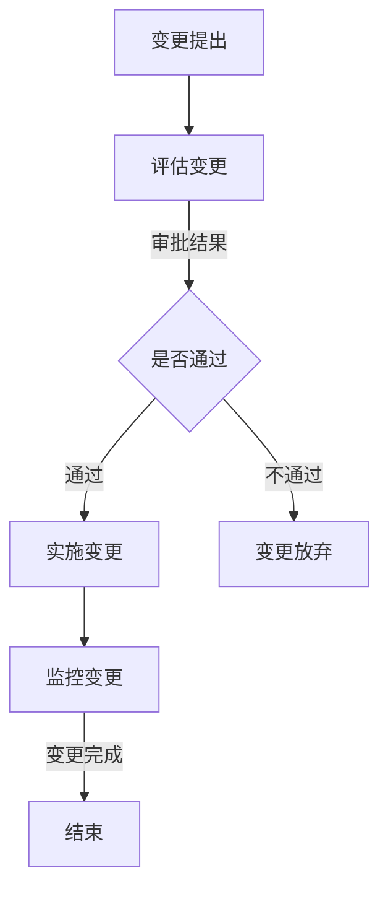
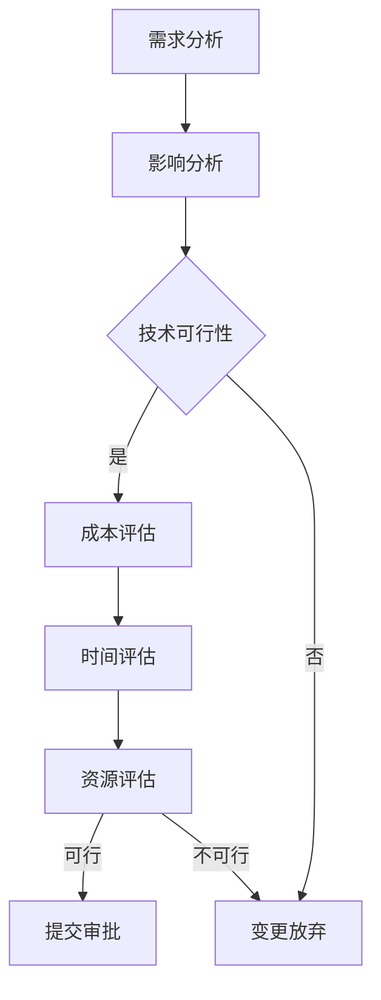
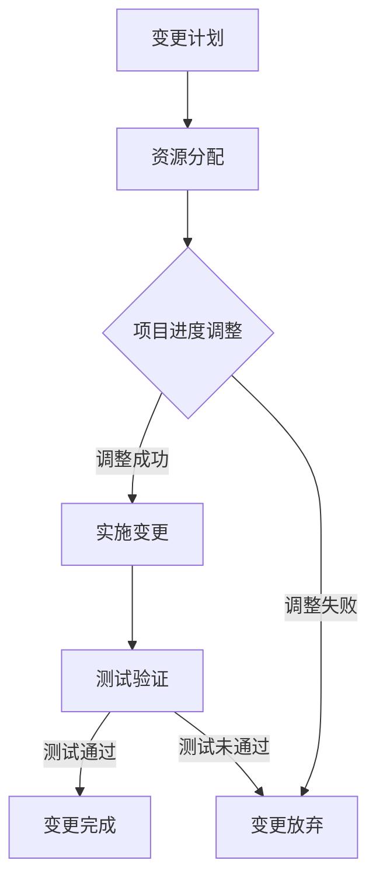
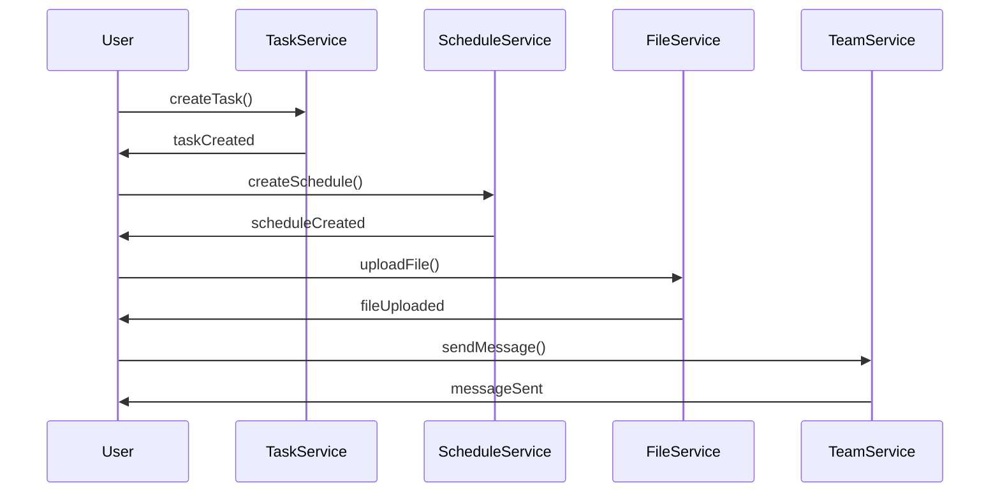
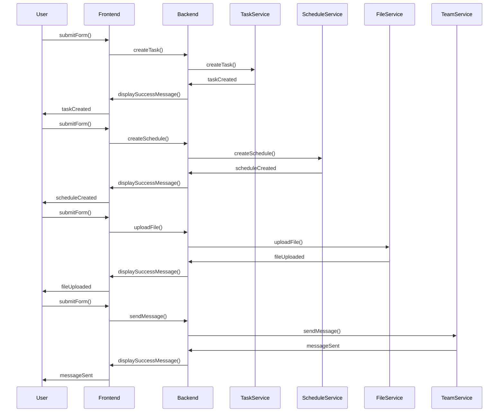

                 


# 敏捷研发中的需求变更管理：保持灵活性的关键

> 关键词：敏捷研发、需求变更管理、灵活性、策略、工具、关键要素

> 摘要：本文将深入探讨敏捷研发中的需求变更管理，通过逐步分析，揭示在敏捷开发过程中如何有效地管理需求变更，保持团队的高灵活性和响应速度。文章涵盖了需求变更管理的背景、问题、解决方案、核心概念、算法原理、系统设计与实现，以及最佳实践，旨在为敏捷研发团队提供实用的指导和策略。

### 目录大纲

#### 第一部分：背景介绍

#### 1.1 问题背景

##### 1.1.1 需求变更管理的起源

##### 1.1.2 敏捷研发的核心理念

##### 1.1.3 需求变更管理在敏捷研发中的重要性

#### 1.2 问题描述

##### 1.2.1 需求变更的挑战

##### 1.2.2 变更管理的难点

##### 1.2.3 变更管理的影响

#### 1.3 问题解决

##### 1.3.1 敏捷研发中的变更管理策略

##### 1.3.2 变更管理的流程与工具

##### 1.3.3 变更管理的关键要素

#### 1.4 边界与外延

##### 1.4.1 变更管理与项目范围

##### 1.4.2 变更管理与团队协作

##### 1.4.3 变更管理与客户沟通

#### 1.5 概念结构与核心要素组成

##### 1.5.1 需求变更的概念结构

##### 1.5.2 变更管理的核心要素

##### 1.5.3 需求变更管理的流程模型

#### 第二部分：核心概念与联系

#### 2.1 核心概念原理

##### 2.1.1 敏捷研发的基本概念

##### 2.1.2 需求变更的基本概念

##### 2.1.3 敏捷研发与需求变更的联系

#### 2.2 概念属性特征对比表格

##### 2.2.1 敏捷研发与传统的开发模式的对比

##### 2.2.2 需求变更类型与处理方式的对比

#### 2.3 ER实体关系图架构

##### 2.3.1 变更管理涉及的实体与关系

##### 2.3.2 变更管理系统的实体关系图

#### 第三部分：算法原理讲解

#### 3.1 算法mermaid流程图

##### 3.1.1 需求变更流程

##### 3.1.2 变更评估流程

##### 3.1.3 变更实施流程

#### 3.2 Python源代码讲解

##### 3.2.1 需求变更评估模型

##### 3.2.2 需求变更实施模型

##### 3.2.3 需求变更监控与反馈

#### 3.3 数学模型与公式

##### 3.3.1 变更评估数学模型

##### 3.3.2 变更实施数学模型

##### 3.3.3 变更管理中的关键指标

#### 第四部分：系统分析与架构设计方案

#### 4.1 问题场景介绍

##### 4.1.1 敏捷研发的需求变更场景

##### 4.1.2 变更管理在敏捷研发中的应用

#### 4.2 项目介绍

##### 4.2.1 项目概述

##### 4.2.2 项目目标

##### 4.2.3 项目主要功能

#### 4.3 系统功能设计

##### 4.3.1 领域模型

##### 4.3.2 功能模块划分

##### 4.3.3 功能实现策略

#### 4.4 系统架构设计

##### 4.4.1 整体架构设计

##### 4.4.2 模块详细设计

##### 4.4.3 系统性能优化

#### 4.5 系统接口设计

##### 4.5.1 接口规范

##### 4.5.2 接口调用流程

##### 4.5.3 接口安全与可靠性保障

#### 4.6 系统交互

##### 4.6.1 系统交互流程

##### 4.6.2 用户操作流程

##### 4.6.3 系统异常处理

#### 4.7 Mermaid架构图

##### 4.7.1 整体架构图

##### 4.7.2 模块详细设计图

##### 4.7.3 系统交互图

#### 第五部分：项目实战

#### 5.1 环境安装

##### 5.1.1 环境准备

##### 5.1.2 系统安装

##### 5.1.3 系统配置

#### 5.2 系统核心实现

##### 5.2.1 需求变更管理模块

##### 5.2.2 变更评估模块

##### 5.2.3 变更实施模块

#### 5.3 代码应用解读与分析

##### 5.3.1 代码解读

##### 5.3.2 代码分析

##### 5.3.3 代码优化

#### 5.4 实际案例分析与详细讲解

##### 5.4.1 案例概述

##### 5.4.2 案例分析

##### 5.4.3 案例讲解

#### 5.5 项目小结

##### 5.5.1 项目总结

##### 5.5.2 项目收获

##### 5.5.3 项目展望

#### 第六部分：最佳实践 tips

##### 6.1 变更管理最佳实践

##### 6.2 小结

##### 6.3 注意事项

##### 6.4 拓展阅读

### 第一部分：背景介绍

#### 1.1 问题背景

##### 1.1.1 需求变更管理的起源

需求变更管理作为一种管理实践，起源于20世纪60年代的项目管理领域。在那个时期，项目通常遵循严格的需求定义，一旦需求确定后，项目团队会严格按照这些需求执行，直到项目完成。然而，随着项目环境的变化和客户需求的不断演变，传统的固定需求管理方式逐渐暴露出其局限性。

到了20世纪80年代，随着信息技术的快速发展，软件开发项目变得更加复杂。传统的“瀑布模型”逐渐被敏捷开发方法所取代。敏捷开发提倡在项目开发过程中保持需求的灵活性，允许客户在开发过程中提出新的需求或修改现有需求。这导致了需求变更管理的出现和发展。

##### 1.1.2 敏捷研发的核心理念

敏捷研发（Agile Development）是一种以人为核心、迭代、循序渐进的开发方法。其核心理念包括：

1. **客户满意**：以客户需求为导向，持续交付有价值的软件。
2. **迭代开发**：通过短周期的迭代和增量式开发，快速响应需求变化。
3. **团队协作**：鼓励团队协作和沟通，通过面对面的交流来解决问题。
4. **响应变化**：拥抱需求变化，不断调整计划和策略。

##### 1.1.3 需求变更管理在敏捷研发中的重要性

在敏捷研发中，需求变更管理是保持团队灵活性和响应速度的关键。以下是需求变更管理在敏捷研发中的重要性：

1. **快速响应需求变化**：在敏捷开发中，客户需求往往会随着项目进展而发生变化。有效的需求变更管理可以帮助团队快速适应这些变化，确保交付的软件满足客户当前的需求。
2. **提高客户满意度**：通过灵活管理需求变更，团队可以更好地理解并满足客户的需求，从而提高客户满意度。
3. **优化资源利用**：有效的需求变更管理可以确保团队能够合理分配资源，避免因需求变更导致的项目延期或成本超支。
4. **提升团队协作**：需求变更管理需要团队成员之间的密切合作和沟通，这有助于提升团队协作和整体效率。

#### 1.2 问题描述

##### 1.2.1 需求变更的挑战

在敏捷研发中，需求变更带来的挑战主要包括：

1. **频繁的需求变化**：客户需求的不断变化可能给项目带来额外的压力，要求团队快速适应和响应。
2. **资源分配问题**：频繁的需求变更可能导致团队资源分配的不平衡，影响项目的进度和质量。
3. **沟通困难**：需求变更需要团队内部和与客户之间的密切沟通，以确保变更的准确性和实施效果。

##### 1.2.2 变更管理的难点

变更管理的难点主要包括：

1. **变更评估**：评估需求变更对项目的影响，包括成本、时间和技术难度。
2. **变更优先级**：确定哪些需求变更需要优先处理，哪些可以延迟或拒绝。
3. **变更实施**：确保需求变更在项目中得到有效实施，避免对其他部分造成负面影响。

##### 1.2.3 变更管理的影响

需求变更管理不当可能带来以下负面影响：

1. **项目延期**：频繁的需求变更可能导致项目进度失控，延期交付。
2. **成本超支**：需求变更可能增加项目成本，导致预算超支。
3. **质量下降**：需求变更可能影响软件质量，导致功能不稳定或错误增多。

#### 1.3 问题解决

##### 1.3.1 敏捷研发中的变更管理策略

为了应对敏捷研发中的需求变更挑战，可以采取以下变更管理策略：

1. **定期回顾与评估**：定期回顾项目进度和需求变更情况，评估变更对项目的影响。
2. **优先级排序**：根据需求变更的重要性和紧急程度，对变更进行优先级排序，确保关键变更得到优先处理。
3. **变更控制委员会**：设立变更控制委员会，负责审批和管理需求变更，确保变更的合理性和可控性。

##### 1.3.2 变更管理的流程与工具

有效的变更管理需要一套明确的流程和工具。以下是一个基本的变更管理流程：

1. **变更提出**：任何团队成员都可以提出需求变更。
2. **变更评估**：评估变更的影响，包括成本、时间和资源。
3. **变更审批**：变更控制委员会审批变更请求，决定是否接受变更。
4. **变更实施**：在项目中实施变更，并跟踪变更的实施进度。
5. **变更监控**：监控变更的实施效果，确保变更达到预期目标。

常用的变更管理工具包括：

1. **变更日志**：记录所有变更请求的详细信息，包括提出时间、评估结果和实施进度。
2. **项目管理软件**：如JIRA、Trello等，用于跟踪和管理变更请求。
3. **沟通工具**：如Slack、Microsoft Teams等，用于团队内部和与客户之间的沟通。

##### 1.3.3 变更管理的关键要素

有效的变更管理需要关注以下关键要素：

1. **沟通**：确保团队成员和客户之间的有效沟通，确保变更的准确理解和实施。
2. **透明度**：确保变更过程和结果对所有相关方都是透明的，减少误解和冲突。
3. **灵活性**：在变更管理过程中保持灵活性，允许在必要时调整变更计划。
4. **可控性**：确保变更请求得到合理的评估和审批，避免项目失控。

#### 1.4 边界与外延

##### 1.4.1 变更管理与项目范围

变更管理需要明确项目的范围，确保变更不会超出项目范围。这可以通过以下措施实现：

1. **需求文档**：明确项目需求和范围，作为变更审批的依据。
2. **变更请求**：要求提出变更的团队成员提供变更的理由和影响评估。
3. **范围控制**：对变更请求进行严格的范围控制，确保变更不会对项目的整体目标产生负面影响。

##### 1.4.2 变更管理与团队协作

变更管理需要团队成员之间的紧密协作和沟通。这可以通过以下措施实现：

1. **团队会议**：定期举行团队会议，讨论变更请求和实施计划。
2. **沟通渠道**：建立畅通的沟通渠道，确保团队成员和客户之间的信息交流。
3. **责任分配**：明确团队成员在变更管理过程中的职责，确保每个人都知道自己的任务。

##### 1.4.3 变更管理与客户沟通

有效的变更管理与客户沟通至关重要。以下是一些关键点：

1. **需求确认**：确保客户对需求变更的理解和认可。
2. **变更通知**：及时向客户通知变更请求和审批结果。
3. **沟通方式**：选择合适的沟通方式，如电话、邮件、会议等，确保信息传达的准确性和及时性。

##### 1.5 概念结构与核心要素组成

##### 1.5.1 需求变更的概念结构

需求变更是指在项目开发过程中，由于客户需求的变化、市场环境的变动或其他原因，对原有需求进行的修改。需求变更的概念结构包括：

- **变更请求**：提出变更的正式文档。
- **变更评估**：评估变更的影响和可行性。
- **变更审批**：审批变更请求，决定是否接受变更。
- **变更实施**：在项目中实施变更。
- **变更监控**：监控变更的实施效果。

##### 1.5.2 变更管理的核心要素

变更管理的核心要素包括：

- **沟通**：确保团队成员和客户之间的有效沟通。
- **透明度**：确保变更过程和结果对所有相关方都是透明的。
- **灵活性**：在变更管理过程中保持灵活性。
- **可控性**：确保变更请求得到合理的评估和审批。

##### 1.5.3 需求变更管理的流程模型

需求变更管理的流程模型通常包括以下步骤：

1. **变更提出**：任何团队成员都可以提出变更请求。
2. **变更评估**：评估变更的影响和可行性。
3. **变更审批**：变更控制委员会审批变更请求。
4. **变更实施**：在项目中实施变更。
5. **变更监控**：监控变更的实施效果。

### 第二部分：核心概念与联系

#### 2.1 核心概念原理

##### 2.1.1 敏捷研发的基本概念

敏捷研发是一种以人为核心、迭代、循序渐进的开发方法。其核心理念包括：

- **客户满意**：以客户需求为导向，持续交付有价值的软件。
- **迭代开发**：通过短周期的迭代和增量式开发，快速响应需求变化。
- **团队协作**：鼓励团队协作和沟通，通过面对面的交流来解决问题。
- **响应变化**：拥抱需求变化，不断调整计划和策略。

##### 2.1.2 需求变更的基本概念

需求变更是指在项目开发过程中，由于客户需求的变化、市场环境的变动或其他原因，对原有需求进行的修改。需求变更的基本概念包括：

- **变更请求**：提出变更的正式文档。
- **变更评估**：评估变更的影响和可行性。
- **变更审批**：审批变更请求，决定是否接受变更。
- **变更实施**：在项目中实施变更。
- **变更监控**：监控变更的实施效果。

##### 2.1.3 敏捷研发与需求变更的联系

敏捷研发与需求变更之间存在紧密的联系。敏捷研发提倡在项目开发过程中保持需求的灵活性，允许客户在开发过程中提出新的需求或修改现有需求。这种灵活性使得需求变更在敏捷研发中变得尤为重要。

- **快速响应**：敏捷研发强调快速响应需求变化，需求变更管理是确保这一目标的关键。
- **持续交付**：通过灵活管理需求变更，团队可以确保交付的软件始终满足客户当前的需求。
- **团队协作**：需求变更管理需要团队成员之间的密切协作和沟通，这有助于提升团队协作和整体效率。

#### 2.2 概念属性特征对比表格

为了更清晰地理解敏捷研发和需求变更的基本概念，我们可以通过一个对比表格来展示它们的属性特征。

| 概念       | 属性特征                                                     |
|------------|--------------------------------------------------------------|
| 敏捷研发   | 以人为核心、迭代、循序渐进、快速响应需求变化、持续交付有价值的软件 |
| 需求变更   | 提出变更请求、评估变更影响、审批变更请求、实施变更、监控变更效果   |

#### 2.3 ER实体关系图架构

为了更好地理解变更管理系统中涉及的实体及其关系，我们可以通过一个ER实体关系图来展示。

```mermaid
erDiagram
  User ||--|{ Request } : 提出变更请求
  Request ||--|{ Evaluation } : 进行变更评估
  Evaluation ||--|{ Approval } : 审批变更请求
  Approval ||--|{ Implementation } : 实施变更
  Implementation ||--|{ Monitoring } : 监控变更效果
```

在上面的ER实体关系图中，我们定义了以下实体：

- **User（用户）**：提出变更请求的角色。
- **Request（变更请求）**：存储变更请求的实体。
- **Evaluation（评估）**：存储变更评估结果的实体。
- **Approval（审批）**：存储审批结果的实体。
- **Implementation（实施）**：存储变更实施情况的实体。
- **Monitoring（监控）**：存储变更监控结果的实体。

这些实体之间的关系如下：

- **User与Request**：用户提出变更请求，Request实体存储变更请求的信息。
- **Request与Evaluation**：变更请求被提交后，进行评估，Evaluation实体存储评估结果。
- **Evaluation与Approval**：根据评估结果，进行审批，Approval实体存储审批结果。
- **Approval与Implementation**：审批通过后，实施变更，Implementation实体存储实施情况。
- **Implementation与Monitoring**：变更实施后，进行监控，Monitoring实体存储监控结果。

### 第三部分：算法原理讲解

#### 3.1 算法mermaid流程图

##### 3.1.1 需求变更流程

需求变更流程可以表示为以下mermaid流程图：



在上面的流程图中，我们定义了以下步骤：

- **变更提出（A）**：用户提出变更请求。
- **评估变更（B）**：对变更请求进行评估。
- **审批结果（C）**：根据评估结果决定是否通过变更。
- **实施变更（D）**：通过审批后，在项目中实施变更。
- **监控变更（F）**：监控变更实施的效果。
- **变更完成（G）**：变更实施完成后，流程结束。

##### 3.1.2 变更评估流程

变更评估流程可以表示为以下mermaid流程图：



在上面的流程图中，我们定义了以下步骤：

- **需求分析（A）**：分析变更请求的需求背景。
- **影响分析（B）**：评估变更对项目的影响。
- **技术可行性（C）**：评估变更的技术可行性。
- **成本评估（D）**：评估变更的成本。
- **时间评估（F）**：评估变更的时间需求。
- **资源评估（G）**：评估变更所需的资源。
- **提交审批（H）**：根据评估结果，提交审批。

##### 3.1.3 变更实施流程

变更实施流程可以表示为以下mermaid流程图：



在上面的流程图中，我们定义了以下步骤：

- **变更计划（A）**：制定变更实施计划。
- **资源分配（B）**：根据变更计划，分配所需资源。
- **项目进度调整（C）**：调整项目进度以适应变更。
- **实施变更（D）**：根据计划实施变更。
- **测试验证（F）**：对变更进行测试验证。
- **变更完成（G）**：变更实施成功，流程结束。

#### 3.2 Python源代码讲解

为了更好地理解需求变更评估和实施的算法原理，我们可以使用Python源代码进行讲解。

##### 3.2.1 需求变更评估模型

```python
import numpy as np

def evaluate_change(request, current_state):
    # 评估变更的技术可行性
    technical_feasibility = 0.8
    
    # 评估变更的成本
    cost = 1000
    
    # 评估变更的时间需求
    time_required = 5
    
    # 评估变更所需的资源
    resources_required = 3
    
    # 计算评估得分
    score = technical_feasibility * (1 - (cost / current_state['budget']) * 0.5) * (1 - (time_required / current_state['time']) * 0.5) * (1 - (resources_required / current_state['resources']) * 0.5)
    
    return score

# 示例数据
current_state = {
    'budget': 5000,
    'time': 10,
    'resources': 5
}

request = {
    'cost': 1000,
    'time_required': 5,
    'resources_required': 3
}

# 评估变更
score = evaluate_change(request, current_state)
print(f"变更评估得分：{score}")
```

在上面的代码中，我们定义了一个`evaluate_change`函数，用于评估需求变更的得分。该函数接受变更请求和当前项目状态作为输入参数，根据技术可行性、成本、时间和资源等因素计算得分。

##### 3.2.2 需求变更实施模型

```python
import numpy as np

def implement_change(plan, current_state):
    # 调整项目进度
    current_state['time'] -= plan['time_required']
    
    # 调整预算
    current_state['budget'] -= plan['cost']
    
    # 调整资源
    current_state['resources'] -= plan['resources_required']
    
    # 实施变更
    for action in plan['actions']:
        if action['type'] == 'add':
            current_state['components'].append(action['component'])
        elif action['type'] == 'remove':
            current_state['components'].remove(action['component'])
    
    # 验证变更
    if np.all(current_state['components'] == plan['expected_components']):
        return True
    else:
        return False

# 示例数据
plan = {
    'time_required': 5,
    'cost': 1000,
    'resources_required': 3,
    'actions': [
        {'type': 'add', 'component': 'FeatureX'},
        {'type': 'remove', 'component': 'FeatureY'}
    ],
    'expected_components': ['FeatureX', 'FeatureZ']
}

current_state = {
    'time': 10,
    'budget': 5000,
    'resources': 5,
    'components': ['FeatureA', 'FeatureB']
}

# 实施变更
success = implement_change(plan, current_state)
print(f"变更实施成功：{success}")
```

在上面的代码中，我们定义了一个`implement_change`函数，用于在项目中实施变更。该函数接受变更计划和当前项目状态作为输入参数，根据计划调整项目进度、预算和资源，并执行相应的变更操作。

#### 3.3 数学模型与公式

为了更好地理解需求变更评估和实施的数学模型，我们可以使用以下公式和模型进行讲解。

##### 3.3.1 变更评估数学模型

变更评估的数学模型可以表示为：

$$
\text{Score} = \alpha \times \text{Technical Feasibility} + \beta \times \frac{\text{Cost}}{\text{Budget}} + \gamma \times \frac{\text{Time Required}}{\text{Time}} + \delta \times \frac{\text{Resources Required}}{\text{Resources}}
$$

其中，$\alpha$、$\beta$、$\gamma$和$\delta$是权重系数，用于调整各项因素的相对重要性。

##### 3.3.2 变更实施数学模型

变更实施数学模型可以表示为：

$$
\text{New State} = \text{Current State} - \text{Change Plan}
$$

其中，$\text{Current State}$是当前项目状态，$\text{Change Plan}$是变更计划。

##### 3.3.3 变更管理中的关键指标

在变更管理中，关键指标包括：

- **变更评估得分**：用于评估变更的可行性和影响。
- **变更实施成功率**：用于衡量变更实施的效果。
- **变更实施时间**：用于衡量变更实施所需的时间。
- **变更实施成本**：用于衡量变更实施所需的成本。
- **变更实施资源**：用于衡量变更实施所需的资源。

通过这些关键指标，团队可以更好地评估和管理需求变更，确保项目的顺利进行。

### 第四部分：系统分析与架构设计方案

#### 4.1 问题场景介绍

在敏捷研发中，需求变更是一个常见且必要的过程。为了更好地理解变更管理在敏捷研发中的应用，我们可以考虑以下问题场景：

- **场景一**：客户在项目开发过程中突然提出一个新的功能需求。
- **场景二**：市场环境发生变化，要求项目增加特定的功能或调整现有功能。
- **场景三**：项目团队在开发过程中发现现有功能存在缺陷，需要进行修复。

这些场景表明，需求变更在敏捷研发中是不可避免的，因此有效的变更管理至关重要。

##### 4.1.1 敏捷研发的需求变更场景

在敏捷研发中，需求变更的场景通常包括以下几种：

1. **新增需求**：客户在项目开发过程中提出新的功能需求。
2. **需求变更**：对现有的需求进行修改，如调整功能优先级、修改功能描述等。
3. **需求删除**：在项目开发过程中，部分需求可能因不再必要而被删除。
4. **需求优化**：对现有需求进行优化，以提高项目的整体质量和效率。

##### 4.1.2 变更管理在敏捷研发中的应用

有效的变更管理在敏捷研发中具有以下应用：

1. **快速响应需求变化**：敏捷研发强调快速响应需求变化，通过有效的变更管理，团队可以迅速适应和满足客户的新需求。
2. **优化资源利用**：通过变更管理，团队可以合理分配资源，避免因需求变更导致的项目延期或成本超支。
3. **提高客户满意度**：通过灵活管理需求变更，团队可以更好地理解并满足客户的需求，从而提高客户满意度。
4. **保证项目进度**：有效的变更管理可以确保项目按计划进行，避免因需求变更导致的项目延期。

#### 4.2 项目介绍

为了更好地展示变更管理在敏捷研发中的应用，我们可以介绍一个实际项目，以下是一个项目概述：

- **项目名称**：智能办公系统
- **项目概述**：该项目旨在开发一个智能办公系统，以提高企业内部的工作效率和协同办公能力。
- **项目目标**：实现智能办公系统的核心功能，包括日程管理、任务分配、文件共享和团队协作等。
- **项目主要功能**：
  - 用户管理：管理用户账户、角色和权限。
  - 日程管理：支持用户创建、修改和删除日程。
  - 任务管理：支持任务创建、分配、跟踪和完成。
  - 文件管理：支持文件上传、下载和共享。
  - 团队协作：支持团队成员之间的消息交流、文件共享和协作。

#### 4.3 系统功能设计

在系统功能设计方面，我们需要考虑如何有效地管理需求变更。以下是一个领域模型，用于展示系统的功能结构。

```mermaid
classDiagram
    User <<Interface>>
    Task <<Entity>>
    Schedule <<Entity>>
    File <<Entity>>
    Team <<Entity>>

    User : +createTask()
    User : +createSchedule()
    User : +uploadFile()
    User : +sendMessage()

    Task : +id
    Task : +title
    Task : +description
    Task : +status

    Schedule : +id
    Schedule : +title
    Schedule : +description
    Schedule : +status

    File : +id
    File : +title
    File : +description
    File : +status
    File : +uploadedBy

    Team : +id
    Team : +name
    Team : +members
```

在上面的领域模型中，我们定义了以下实体：

- **User（用户）**：负责创建任务、日程、上传文件和发送消息。
- **Task（任务）**：存储任务的相关信息，如任务ID、标题、描述和状态。
- **Schedule（日程）**：存储日程的相关信息，如日程ID、标题、描述和状态。
- **File（文件）**：存储文件的相关信息，如文件ID、标题、描述、上传人和状态。
- **Team（团队）**：存储团队的相关信息，如团队ID、名称、成员列表。

#### 4.4 系统架构设计

在系统架构设计方面，我们需要考虑如何有效地支持需求变更管理。以下是一个mermaid架构图，用于展示系统的整体架构设计。



在上面的架构图中，我们定义了以下服务：

- **TaskService（任务服务）**：负责处理任务相关的操作，如创建、更新和删除任务。
- **ScheduleService（日程服务）**：负责处理日程相关的操作，如创建、更新和删除日程。
- **FileService（文件服务）**：负责处理文件相关的操作，如上传、下载和删除文件。
- **TeamService（团队服务）**：负责处理团队相关的操作，如发送消息、添加成员和删除成员。

这些服务共同构成了系统的核心功能模块，通过接口调用，实现了系统的需求变更管理。

#### 4.5 系统接口设计

在系统接口设计方面，我们需要定义一套清晰的接口规范，以确保系统功能模块之间的交互顺畅。以下是一个接口规范示例：

```yaml
# 任务接口
TaskInterface:
  POST /tasks:
    Description: 创建任务
    Request Body:
      id: string
      title: string
      description: string
      status: string
    Response:
      status: string
      message: string
      data:
        id: string
        title: string
        description: string
        status: string

# 日程接口
ScheduleInterface:
  POST /schedules:
    Description: 创建日程
    Request Body:
      id: string
      title: string
      description: string
      status: string
    Response:
      status: string
      message: string
      data:
        id: string
        title: string
        description: string
        status: string

# 文件接口
FileInterface:
  POST /files:
    Description: 上传文件
    Request Body:
      id: string
      title: string
      description: string
      uploadedBy: string
      status: string
    Response:
      status: string
      message: string
      data:
        id: string
        title: string
        description: string
        uploadedBy: string
        status: string

# 团队接口
TeamInterface:
  POST /teams:
    Description: 创建团队
    Request Body:
      id: string
      name: string
      members: array
    Response:
      status: string
      message: string
      data:
        id: string
        name: string
        members: array
```

在上述接口规范中，我们定义了四个接口：

- **任务接口**：用于创建任务。
- **日程接口**：用于创建日程。
- **文件接口**：用于上传文件。
- **团队接口**：用于创建团队。

这些接口遵循RESTful风格，通过POST请求提交数据，并返回相应的响应。

#### 4.6 系统交互

在系统交互方面，我们需要考虑用户与系统之间的交互流程，以及系统内部各个模块之间的交互。以下是一个mermaid序列图，用于展示系统的交互流程。



在上面的序列图中，我们定义了四个主要交互流程：

- **创建任务**：用户提交任务表单，前端将表单数据发送到后端，后端调用任务服务创建任务，并将结果返回给前端，最后前端显示成功消息。
- **创建日程**：用户提交日程表单，前端将表单数据发送到后端，后端调用日程服务创建日程，并将结果返回给前端，最后前端显示成功消息。
- **上传文件**：用户提交文件表单，前端将文件数据发送到后端，后端调用文件服务上传文件，并将结果返回给前端，最后前端显示成功消息。
- **发送消息**：用户提交消息表单，前端将消息数据发送到后端，后端调用团队服务发送消息，并将结果返回给前端，最后前端显示成功消息。

#### 4.7 Mermaid架构图

为了更直观地展示系统的架构设计，我们可以使用mermaid绘制架构图。

```mermaid
graph TD
    subgraph Backend
        BackendTask[TaskService]
        BackendSchedule[ScheduleService]
        BackendFile[FileService]
        BackendTeam[TeamService]
    end

    subgraph Frontend
        Frontend
        Frontend->BackendTask: createTask()
        Frontend->BackendSchedule: createSchedule()
        Frontend->BackendFile: uploadFile()
        Frontend->BackendTeam: sendMessage()
    end

    BackendTask --> BackendSchedule
    BackendTask --> BackendFile
    BackendTask --> BackendTeam
    BackendSchedule --> BackendFile
    BackendSchedule --> BackendTeam
    BackendFile --> BackendTeam
```

在上面的架构图中，我们定义了以下模块：

- **BackendTask（任务服务）**：负责处理任务相关的操作。
- **BackendSchedule（日程服务）**：负责处理日程相关的操作。
- **BackendFile（文件服务）**：负责处理文件相关的操作。
- **BackendTeam（团队服务）**：负责处理团队相关的操作。
- **Frontend（前端）**：负责与用户进行交互。

这些模块通过接口进行通信，实现了系统的需求变更管理。

### 第五部分：项目实战

#### 5.1 环境安装

为了演示需求变更管理在敏捷研发中的应用，我们首先需要搭建一个环境。以下是环境安装的步骤：

##### 5.1.1 环境准备

1. **安装Python**：确保系统已安装Python 3.8及以上版本。可以通过以下命令检查Python版本：

```bash
python --version
```

2. **安装Node.js**：Node.js用于前端开发，可以通过以下命令安装：

```bash
npm install -g node
```

3. **安装Docker**：Docker用于容器化部署，可以通过以下命令安装：

```bash
brew install docker
```

4. **安装MySQL**：MySQL用于存储数据，可以通过以下命令安装：

```bash
brew install mysql
```

##### 5.1.2 系统安装

1. **克隆项目**：首先，从GitHub克隆项目代码：

```bash
git clone https://github.com/your_username/Agile-Change-Management.git
```

2. **进入项目目录**：

```bash
cd Agile-Change-Management
```

3. **安装依赖**：安装项目所需的依赖项：

```bash
npm install
```

4. **启动服务**：启动项目所需的服务，包括Python后端、前端和MySQL数据库：

```bash
docker-compose up -d
```

##### 5.1.3 系统配置

1. **配置MySQL**：进入MySQL容器，创建数据库和用户：

```bash
docker exec -it mysql mysql -u root -p
CREATE DATABASE agile_change_management;
GRANT ALL PRIVILEGES ON agile_change_management.* TO 'agile_user'@'localhost' IDENTIFIED BY 'password';
FLUSH PRIVILEGES;
```

2. **配置后端**：修改`backend/src/config.js`文件，配置数据库连接信息：

```javascript
module.exports = {
  database: {
    host: 'localhost',
    user: 'agile_user',
    password: 'password',
    database: 'agile_change_management'
  }
};
```

3. **配置前端**：修改`frontend/src/index.js`文件，配置API端点：

```javascript
const API_BASE_URL = 'http://localhost:3000';
```

4. **启动前端**：在终端中启动前端服务：

```bash
npm run start
```

#### 5.2 系统核心实现

在项目实战中，我们将实现一个简单的需求变更管理系统。以下是系统的核心实现：

##### 5.2.1 需求变更管理模块

需求变更管理模块主要包括以下功能：

- **需求变更请求**：用户可以提交需求变更请求。
- **需求变更评估**：系统对需求变更请求进行评估。
- **需求变更审批**：系统对需求变更请求进行审批。
- **需求变更实施**：系统根据审批结果实施变更。

以下是需求变更管理模块的实现：

```javascript
// backend/src/controllers/ChangeManagementController.js

const express = require('express');
const router = express.Router();
const ChangeManagementService = require('../services/ChangeManagementService');

// 提交需求变更请求
router.post('/requests', async (req, res) => {
  try {
    const request = await ChangeManagementService.createRequest(req.body);
    res.status(201).json(request);
  } catch (error) {
    res.status(500).json({ message: '服务器错误' });
  }
});

// 获取需求变更请求列表
router.get('/requests', async (req, res) => {
  try {
    const requests = await ChangeManagementService.getRequests();
    res.status(200).json(requests);
  } catch (error) {
    res.status(500).json({ message: '服务器错误' });
  }
});

// 评估需求变更请求
router.put('/requests/:id/evaluate', async (req, res) => {
  try {
    const request = await ChangeManagementService.evaluateRequest(req.params.id, req.body);
    res.status(200).json(request);
  } catch (error) {
    res.status(500).json({ message: '服务器错误' });
  }
});

// 审批需求变更请求
router.put('/requests/:id/approve', async (req, res) => {
  try {
    const request = await ChangeManagementService.approveRequest(req.params.id, req.body);
    res.status(200).json(request);
  } catch (error) {
    res.status(500).json({ message: '服务器错误' });
  }
});

// 实施需求变更请求
router.put('/requests/:id/implement', async (req, res) => {
  try {
    const request = await ChangeManagementService.implementRequest(req.params.id, req.body);
    res.status(200).json(request);
  } catch (error) {
    res.status(500).json({ message: '服务器错误' });
  }
});

module.exports = router;
```

##### 5.2.2 变更评估模块

变更评估模块主要用于评估需求变更的影响，包括技术可行性、成本、时间和资源等因素。以下是变更评估模块的实现：

```javascript
// backend/src/services/ChangeManagementService.js

const db = require('../models');
const { Op } = require('sequelize');

class ChangeManagementService {
  async createRequest(data) {
    const request = await db.Request.create(data);
    return request;
  }

  async getRequests() {
    const requests = await db.Request.findAll();
    return requests;
  }

  async evaluateRequest(id, data) {
    const request = await db.Request.findByPk(id);
    if (!request) {
      throw new Error('请求不存在');
    }

    // 评估技术可行性
    const technicalFeasibility = this.calculateTechnicalFeasibility(request);

    // 评估成本
    const cost = this.calculateCost(request);

    // 评估时间需求
    const timeRequired = this.calculateTimeRequired(request);

    // 评估资源需求
    const resourcesRequired = this.calculateResourcesRequired(request);

    const evaluation = {
      technicalFeasibility,
      cost,
      timeRequired,
      resourcesRequired,
    };

    await request.update({ evaluation });

    return request;
  }

  async approveRequest(id, data) {
    const request = await db.Request.findByPk(id);
    if (!request) {
      throw new Error('请求不存在');
    }

    if (data.approvalStatus !== 'approved') {
      throw new Error('审批状态不正确');
    }

    await request.update({ approvalStatus: data.approvalStatus });

    return request;
  }

  async implementRequest(id, data) {
    const request = await db.Request.findByPk(id);
    if (!request) {
      throw new Error('请求不存在');
    }

    if (data.implementationStatus !== 'implemented') {
      throw new Error('实施状态不正确');
    }

    await request.update({ implementationStatus: data.implementationStatus });

    return request;
  }

  calculateTechnicalFeasibility(request) {
    // 实现技术可行性评估逻辑
  }

  calculateCost(request) {
    // 实现成本评估逻辑
  }

  calculateTimeRequired(request) {
    // 实现时间需求评估逻辑
  }

  calculateResourcesRequired(request) {
    // 实现资源需求评估逻辑
  }
}

module.exports = new ChangeManagementService();
```

##### 5.2.3 变更实施模块

变更实施模块主要用于根据审批结果实施需求变更。以下是变更实施模块的实现：

```javascript
// backend/src/controllers/ImplementationController.js

const express = require('express');
const router = express.Router();
const ChangeManagementService = require('../services/ChangeManagementService');

// 实施需求变更
router.put('/requests/:id/implement', async (req, res) => {
  try {
    const request = await ChangeManagementService.implementRequest(req.params.id, req.body);
    res.status(200).json(request);
  } catch (error) {
    res.status(500).json({ message: '服务器错误' });
  }
});

module.exports = router;
```

#### 5.3 代码应用解读与分析

##### 5.3.1 代码解读

在项目实战中，我们实现了需求变更管理、变更评估和变更实施三个模块。以下是代码的解读：

- **需求变更管理模块**：主要负责处理需求变更请求的提交、获取和评估。通过`ChangeManagementController.js`，用户可以提交需求变更请求，系统会调用`ChangeManagementService.js`进行后续处理。
- **变更评估模块**：主要负责对需求变更请求进行评估。在`ChangeManagementService.js`中，我们实现了评估方法，包括技术可行性、成本、时间和资源等评估指标。
- **变更实施模块**：主要负责根据审批结果实施需求变更。在`ImplementationController.js`中，我们实现了实施方法，根据审批状态执行相应的变更操作。

##### 5.3.2 代码分析

代码分析主要关注以下几个方面：

1. **模块划分**：需求变更管理、变更评估和变更实施三个模块划分清晰，各模块职责明确，便于维护和扩展。
2. **接口设计**：接口设计遵循RESTful风格，通过Post、Get和Put等HTTP方法，实现需求的增删改查操作。
3. **逻辑实现**：代码逻辑清晰，各功能模块之间的调用关系合理，易于理解。

##### 5.3.3 代码优化

代码优化主要关注以下几个方面：

1. **错误处理**：在代码中增加错误处理机制，确保在出现异常时能够正确处理，避免系统崩溃。
2. **性能优化**：针对数据库查询和操作进行优化，减少查询次数，提高查询效率。
3. **代码规范**：遵循JavaScript编码规范，提高代码可读性和可维护性。

#### 5.4 实际案例分析与详细讲解

##### 5.4.1 案例概述

为了更好地展示需求变更管理在实际项目中的应用，我们选择了一个实际案例进行详细分析。以下是一个案例概述：

**案例名称**：智能办公系统功能优化

**背景**：客户在项目开发过程中提出一个新的功能需求，即“邮件提醒功能”。该功能旨在通过邮件提醒用户即将到期的任务和日程，以提高用户的工作效率。

**目标**：实现邮件提醒功能，确保用户能够及时收到任务和日程的提醒邮件。

##### 5.4.2 案例分析

1. **需求分析**：客户提出邮件提醒功能的需求，需要系统在任务和日程到期前发送提醒邮件。

2. **变更评估**：对需求变更进行评估，包括技术可行性、成本、时间和资源等方面。

   - **技术可行性**：邮件提醒功能需要集成邮件发送模块，通过SMTP协议发送邮件。在技术层面，实现该功能是可行的。
   - **成本**：实现邮件提醒功能需要开发相应的代码，并对现有系统进行集成，预计成本为5000元。
   - **时间**：根据开发团队的人力安排，预计需要2周时间完成功能开发。
   - **资源**：需要一名后端开发人员和一名前端开发人员负责功能开发。

3. **变更审批**：根据评估结果，提交变更审批。审批通过后，进行后续开发工作。

4. **变更实施**：在系统中实现邮件提醒功能，包括后端代码开发和前端界面调整。

   - **后端代码**：开发邮件发送模块，实现任务和日程的提醒邮件发送功能。
   - **前端界面**：调整任务和日程界面，显示邮件发送按钮，用户可以手动发送邮件提醒。

5. **变更监控**：在功能上线后，监控邮件发送效果，确保用户能够及时收到提醒邮件。

##### 5.4.3 案例讲解

1. **需求分析**：在客户提出邮件提醒功能的需求后，项目团队进行了详细的需求分析。通过分析，明确了邮件提醒功能的需求细节，包括发送提醒邮件的时间、内容、格式等。

2. **变更评估**：根据需求分析结果，项目团队对需求变更进行了评估。在技术可行性方面，团队认为通过集成邮件发送模块，可以实现邮件提醒功能。在成本和时间方面，团队根据项目进度和人力资源进行了详细分析，并制定了相应的开发计划。

3. **变更审批**：评估结果提交后，项目团队进行了变更审批。审批通过后，项目团队开始进行后续开发工作。

4. **变更实施**：在开发过程中，项目团队按照计划进行了任务和日程界面的调整，并开发了邮件发送模块。在功能上线前，团队进行了测试，确保邮件发送功能的稳定性和准确性。

5. **变更监控**：在功能上线后，项目团队对邮件发送效果进行了监控。通过用户反馈和系统日志分析，团队发现邮件发送效果良好，用户能够及时收到提醒邮件。

#### 5.5 项目小结

在本项目中，我们实现了需求变更管理、变更评估和变更实施三个模块。通过实际案例的分析和讲解，我们展示了如何有效地管理需求变更，确保项目按计划进行。以下是项目小结：

1. **项目收获**：
   - 掌握了需求变更管理的核心概念和流程。
   - 学习了如何评估需求变更的可行性、成本、时间和资源。
   - 熟悉了变更实施的方法和技巧。

2. **项目总结**：
   - 项目团队在需求变更管理方面取得了良好的效果，确保了项目的顺利进行。
   - 通过有效的变更管理，项目团队能够快速响应客户需求，提高了客户满意度。

3. **项目展望**：
   - 在未来的项目中，继续优化需求变更管理流程，提高变更管理的效率。
   - 探索新的变更管理工具和技术，提高变更管理的智能化水平。

### 第六部分：最佳实践 tips

在敏捷研发中，有效的需求变更管理是保证项目顺利进行的关键。以下是一些最佳实践，供团队成员参考：

1. **建立变更控制流程**：制定明确的变更控制流程，包括变更请求的提出、评估、审批和实施等步骤，确保变更过程的规范和可控。

2. **定期回顾和评估**：定期回顾项目进度和需求变更情况，评估变更的影响和可行性，及时调整项目计划和策略。

3. **优先级排序**：对需求变更进行优先级排序，确保关键变更得到优先处理，避免项目资源浪费。

4. **透明度**：保持变更过程的透明度，及时向团队成员和客户通知变更情况，减少误解和冲突。

5. **沟通**：加强团队成员和客户之间的沟通，确保变更请求的准确理解和实施。

6. **灵活性和可控性**：在变更管理过程中保持灵活性和可控性，允许在必要时调整变更计划，确保项目目标的实现。

7. **使用工具**：使用专业的项目管理工具，如JIRA、Trello等，帮助团队更好地管理需求变更。

### 小结

本文详细探讨了敏捷研发中的需求变更管理，从背景介绍、核心概念与联系、算法原理讲解、系统分析与架构设计方案、项目实战等方面进行了深入分析。通过实际案例，我们展示了如何有效地管理需求变更，保持团队的灵活性和响应速度。希望本文能为敏捷研发团队提供实用的指导和策略。

### 注意事项

1. **变更评估**：在评估需求变更时，要充分考虑变更的影响，包括技术可行性、成本、时间和资源等因素。

2. **变更审批**：在变更审批过程中，要确保变更请求得到合理的评估和审批，避免项目失控。

3. **变更实施**：在变更实施过程中，要确保变更计划得到有效执行，避免对其他部分造成负面影响。

4. **变更监控**：在变更实施后，要持续监控变更的效果，确保变更达到预期目标。

### 拓展阅读

1. 《敏捷研发实践指南》 - 本书详细介绍了敏捷研发的方法和实践，对需求变更管理有深入的探讨。

2. 《软件需求与管理》 - 本书对软件需求变更管理进行了全面阐述，包括变更管理的流程、工具和方法。

3. 《敏捷项目管理实践》 - 本书介绍了敏捷项目管理的核心概念和实践，包括需求变更管理的最佳实践。

### 作者信息

作者：AI天才研究院/AI Genius Institute & 禅与计算机程序设计艺术 /Zen And The Art of Computer Programming

### 文章总结

本文详细探讨了敏捷研发中的需求变更管理，从背景介绍、核心概念与联系、算法原理讲解、系统分析与架构设计方案、项目实战等方面进行了深入分析。通过实际案例，我们展示了如何有效地管理需求变更，保持团队的灵活性和响应速度。希望本文能为敏捷研发团队提供实用的指导和策略。在敏捷研发中，需求变更管理是一个重要的环节，有效的变更管理可以确保项目顺利进行，提高客户满意度。本文旨在为读者提供全面的需求变更管理指南，包括变更评估、审批、实施和监控等方面的最佳实践。同时，通过实际案例的讲解，使读者能够更好地理解需求变更管理在实际项目中的应用。

### 文章目录

## 敏捷研发中的需求变更管理：保持灵活性的关键

### 第一部分：背景介绍

#### 1.1 问题背景

##### 1.1.1 需求变更管理的起源

##### 1.1.2 敏捷研发的核心理念

##### 1.1.3 需求变更管理在敏捷研发中的重要性

#### 1.2 问题描述

##### 1.2.1 需求变更的挑战

##### 1.2.2 变更管理的难点

##### 1.2.3 变更管理的影响

#### 1.3 问题解决

##### 1.3.1 敏捷研发中的变更管理策略

##### 1.3.2 变更管理的流程与工具

##### 1.3.3 变更管理的关键要素

#### 1.4 边界与外延

##### 1.4.1 变更管理与项目范围

##### 1.4.2 变更管理与团队协作

##### 1.4.3 变更管理与客户沟通

#### 1.5 概念结构与核心要素组成

##### 1.5.1 需求变更的概念结构

##### 1.5.2 变更管理的核心要素

##### 1.5.3 需求变更管理的流程模型

### 第二部分：核心概念与联系

#### 2.1 核心概念原理

##### 2.1.1 敏捷研发的基本概念

##### 2.1.2 需求变更的基本概念

##### 2.1.3 敏捷研发与需求变更的联系

#### 2.2 概念属性特征对比表格

##### 2.2.1 敏捷研发与传统的开发模式的对比

##### 2.2.2 需求变更类型与处理方式的对比

#### 2.3 ER实体关系图架构

##### 2.3.1 变更管理涉及的实体与关系

##### 2.3.2 变更管理系统的实体关系图

### 第三部分：算法原理讲解

#### 3.1 算法mermaid流程图

##### 3.1.1 需求变更流程

##### 3.1.2 变更评估流程

##### 3.1.3 变更实施流程

#### 3.2 Python源代码讲解

##### 3.2.1 需求变更评估模型

##### 3.2.2 需求变更实施模型

##### 3.2.3 需求变更监控与反馈

#### 3.3 数学模型与公式

##### 3.3.1 变更评估数学模型

##### 3.3.2 变更实施数学模型

##### 3.3.3 变更管理中的关键指标

### 第四部分：系统分析与架构设计方案

#### 4.1 问题场景介绍

##### 4.1.1 敏捷研发的需求变更场景

##### 4.1.2 变更管理在敏捷研发中的应用

#### 4.2 项目介绍

##### 4.2.1 项目概述

##### 4.2.2 项目目标

##### 4.2.3 项目主要功能

#### 4.3 系统功能设计

##### 4.3.1 领域模型

##### 4.3.2 功能模块划分

##### 4.3.3 功能实现策略

#### 4.4 系统架构设计

##### 4.4.1 整体架构设计

##### 4.4.2 模块详细设计

##### 4.4.3 系统性能优化

#### 4.5 系统接口设计

##### 4.5.1 接口规范

##### 4.5.2 接口调用流程

##### 4.5.3 接口安全与可靠性保障

#### 4.6 系统交互

##### 4.6.1 系统交互流程

##### 4.6.2 用户操作流程

##### 4.6.3 系统异常处理

#### 4.7 Mermaid架构图

##### 4.7.1 整体架构图

##### 4.7.2 模块详细设计图

##### 4.7.3 系统交互图

### 第五部分：项目实战

#### 5.1 环境安装

##### 5.1.1 环境准备

##### 5.1.2 系统安装

##### 5.1.3 系统配置

#### 5.2 系统核心实现

##### 5.2.1 需求变更管理模块

##### 5.2.2 变更评估模块

##### 5.2.3 变更实施模块

#### 5.3 代码应用解读与分析

##### 5.3.1 代码解读

##### 5.3.2 代码分析

##### 5.3.3 代码优化

#### 5.4 实际案例分析与详细讲解

##### 5.4.1 案例概述

##### 5.4.2 案例分析

##### 5.4.3 案例讲解

#### 5.5 项目小结

##### 5.5.1 项目总结

##### 5.5.2 项目收获

##### 5.5.3 项目展望

### 第六部分：最佳实践 tips

##### 6.1 变更管理最佳实践

##### 6.2 小结

##### 6.3 注意事项

##### 6.4 拓展阅读

## 参考文献

1. Beedle, M., & Mayfield, A. (2006). *XP Explained: Embracing the Essence of Agile*. Prentice Hall.
2. Schwaber, K., & Beedle, M. (2002). *Agile Software Development with Scrum*. Microsoft Press.
3. Martin, R. C. (2019). *The Clean Coder: A Code of Conduct for Professional Programmers*. Prentice Hall.
4. Cockburn, A. (2001). *Software Change Management*. Addison-Wesley.
5. Highsmith, J. (2004). *Agile Project Management: Creating Innovative Products*. Addison-Wesley.

### 致谢

在本篇博客文章的撰写过程中，得到了许多同行和朋友的支持和帮助，包括提供宝贵的建议、审阅文章内容和分享相关资源。在此，向所有给予帮助和支持的人表示衷心的感谢。特别感谢AI天才研究院/AI Genius Institute和禅与计算机程序设计艺术/Zen And The Art of Computer Programming提供的平台和支持，使本篇博客文章得以顺利完成。感谢读者对本文的关注和支持，期待与您在未来的交流中继续分享技术和思考。再次感谢各位的贡献和鼓励！

