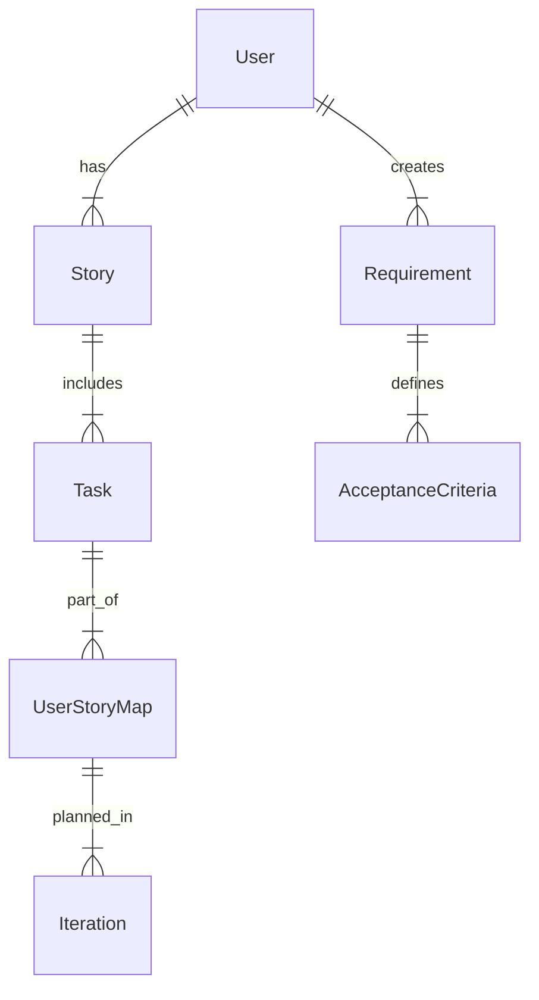

                 

### 引言

#### 1.1 书籍背景

在当今快速变化的技术时代，软件开发领域正经历着巨大的变革。敏捷开发方法已经成为现代软件开发的主流，其核心理念是通过持续迭代和客户反馈来快速响应市场需求，提高产品质量和开发效率。然而，敏捷开发中的需求沟通却成为一个关键的挑战。由于需求的频繁变化和项目的紧凑时间表，如何有效地与客户、产品经理和开发团队进行沟通，确保需求准确理解并顺利实现，成为许多团队的痛点。

本书的编写旨在解决这一关键问题，为敏捷研发团队提供一套实用的需求沟通技巧。通过深入研究敏捷开发的背景和需求沟通的基本原理，本书将逐步介绍一系列方法论、工具和最佳实践，帮助读者在敏捷开发项目中建立高效的沟通机制，提升项目成功率和团队协作效率。

#### 1.2 书籍目标与读者对象

本书的目标是成为敏捷研发团队在需求沟通方面的指南，无论您是产品经理、项目经理、开发人员还是测试人员，都可以从中获得实用的知识和技巧。书中将涵盖从需求收集到需求文档撰写的全过程，通过实例分析和实战经验分享，帮助读者理解和掌握有效的需求沟通方法。

对于读者来说，本书适合以下几种情况：

1. **新晋敏捷团队**：希望了解如何在敏捷开发环境中进行有效的需求沟通。
2. **经验丰富团队**：希望优化现有的沟通流程，提高项目效率和产品质量。
3. **需求管理专业人士**：寻求深入理解和系统化掌握敏捷需求沟通的理论和实践。
4. **培训机构和学生**：作为敏捷需求沟通课程的学习教材。

通过阅读本书，读者将能够：

- 理解敏捷开发的基本原理和需求沟通的重要性。
- 掌握有效的需求收集和分析方法。
- 学会撰写清晰、易懂的需求文档。
- 建立高效的沟通机制，提升团队协作效率。

#### 1.3 敏捷研发中的需求沟通重要性

在敏捷开发中，需求沟通的重要性不言而喻。它不仅是确保项目顺利进行的关键，也是团队协作和客户满意度的重要保障。以下是需求沟通在敏捷研发中的几个关键作用：

1. **需求理解一致性**：良好的沟通确保了所有团队成员对需求的理解一致，减少了误解和沟通成本。
2. **快速响应变更**：敏捷开发强调快速响应市场变化，而有效的需求沟通能够及时捕捉和传递这些变化，确保团队能够快速调整。
3. **提高客户满意度**：通过持续的沟通和反馈，可以确保开发出的产品真正满足客户的需求，从而提升客户满意度。
4. **增强团队协作**：沟通是团队协作的基础，良好的需求沟通能够促进团队成员之间的理解和合作，提高整体工作效率。

综上所述，有效的需求沟通在敏捷开发中扮演着至关重要的角色。本书将帮助读者掌握这一关键技能，为敏捷研发的成功奠定坚实基础。

### 核心概念与原理

在深入探讨敏捷研发中的需求沟通之前，我们需要明确几个核心概念和原理，它们构成了有效沟通的基础。以下是需求沟通中的几个关键概念及其相互关系：

#### 2.1 敏捷开发与需求沟通

##### 2.1.1 敏捷开发简介

敏捷开发（Agile Development）起源于20世纪90年代末，它是一种以人为核心、迭代和渐进的软件开发方法。其核心理念包括：

- **客户满意**：通过快速交付有价值的软件，满足客户的需求。
- **迭代开发**：项目被分解为多个迭代，每个迭代都产生一个可用的产品版本。
- **适应性**：对变化保持开放和灵活，能够快速响应市场变化。

敏捷开发的核心理念在于通过缩短开发周期和频繁的交付，来提高项目的灵活性和响应速度。这种模式要求团队成员之间的紧密协作和高效沟通。

##### 2.1.2 敏捷开发中的需求沟通

在敏捷开发中，需求沟通贯穿整个项目周期，其重要性不可低估。以下是敏捷开发中需求沟通的几个关键方面：

1. **持续沟通**：敏捷团队强调持续的沟通，包括日常站立会议、迭代回顾和客户访谈等。
2. **透明度**：需求变化和进展情况对全体团队成员透明，确保每个人都能了解项目的状态。
3. **客户参与**：客户在整个开发过程中保持高参与度，确保需求得到及时反馈和调整。
4. **轻量级文档**：敏捷团队倾向于使用轻量级的文档，如用户故事、任务卡和看板，以简化沟通流程。

##### 2.1.3 需求沟通的重要性与挑战

需求沟通在敏捷开发中具有以下几个重要作用：

1. **需求理解一致性**：通过有效沟通，确保所有团队成员对需求的理解一致，减少误解。
2. **快速响应变更**：敏捷开发要求能够快速响应需求变化，有效的沟通是关键。
3. **提高客户满意度**：通过持续的沟通和反馈，确保开发出的产品真正满足客户需求。
4. **增强团队协作**：沟通是团队协作的基础，良好的沟通能够促进团队成员之间的理解和合作。

然而，敏捷开发中的需求沟通也面临一些挑战：

1. **需求变化频繁**：敏捷开发强调快速迭代，需求变化频繁，这对沟通提出了更高的要求。
2. **沟通渠道多样化**：团队成员分布在不同的地理位置，沟通渠道多样化，增加了沟通复杂性。
3. **团队协作障碍**：团队成员可能来自不同的专业领域，存在知识差异和协作障碍。

#### 2.2 核心概念原理

##### 2.2.1 沟通模型

有效的需求沟通需要一个清晰、高效的沟通模型。以下是几个常用的沟通模型：

1. **信息交流模型**：这是一种基本沟通模型，包括发送者、信息、渠道、接收者和反馈。信息从发送者传递到接收者，并通过渠道进行传输。

2. **互动沟通模型**：这种模型强调双向沟通，包括发送者、接收者、反馈和互动。发送者和接收者之间进行持续的信息交换和反馈。

3. **社交媒体模型**：在敏捷团队中，社交媒体模型（如Twitter、ChatOps）被广泛使用，以促进实时沟通和协作。

##### 2.2.2 需求收集与分析

需求收集是需求沟通的第一步，其关键在于准确理解客户和市场的需求。以下是几种常用的需求收集方法：

1. **用户访谈**：通过与用户直接交流，获取他们的需求、问题和期望。
2. **问卷调查**：通过在线问卷或纸质问卷，收集大量用户的反馈。
3. **用户观察**：观察用户在使用产品或服务时的行为，以发现需求和问题。

需求分析是将收集到的需求转化为可操作的任务的过程。以下是一些常用的需求分析方法：

1. **用户故事地图**：将用户需求分为不同的故事，并按优先级排列，以帮助团队理解整个产品的需求。
2. **需求文档**：详细记录需求，包括用户故事、功能需求和设计需求。
3. **需求评审**：通过团队评审，确保需求完整、清晰且可执行。

##### 2.2.3 需求文档撰写技巧

需求文档是需求沟通的重要工具，其撰写质量直接影响项目的成功。以下是几个关键技巧：

1. **简洁明了**：避免冗长和复杂的文档，确保内容简洁易懂。
2. **结构清晰**：按照逻辑顺序组织文档，使读者容易理解。
3. **可追溯性**：确保需求文档中的每个需求都有相应的来源和变更历史。
4. **版本控制**：使用版本控制系统，确保文档的一致性和可追溯性。

通过理解这些核心概念和原理，我们可以更好地进行需求沟通，确保敏捷开发项目的顺利进行。

#### 2.3 概念属性特征对比表格

为了更直观地理解需求沟通中的核心概念，我们通过以下对比表格来展示不同概念之间的属性特征差异：

| 概念               | 属性特征                                                         | 说明                                                         |
|--------------------|----------------------------------------------------------------|--------------------------------------------------------------|
| 敏捷开发           | 以人为核心、迭代、适应性、快速反馈、持续交付               | 强调团队协作和快速响应变化                                     |
| 需求沟通           | 双向互动、透明度、快速反馈、结构化文档、可追溯性           | 确保需求理解一致性，提高团队协作效率                           |
| 用户故事           | 用户视角、可测试、可拆分、故事点评估                       | 描述用户需求的最小单元，便于迭代和优先级排序                   |
| 用户访谈           | 客户参与、直接反馈、信息丰富、降低误解风险               | 收集用户需求的常用方法，有助于深入理解用户需求                 |
| 问卷调查           | 大规模反馈、数据分析、量化指标、低成本                   | 收集大量用户意见的方法，便于数据分析                           |
| 用户故事地图       | 整体视角、优先级排序、需求关联、可视化                   | 帮助团队理解整个产品的需求，便于规划和迭代                     |
| 需求文档           | 结构化、详细描述、可追溯性、版本控制                      | 需求沟通的重要工具，确保需求清晰、可执行                       |

#### 2.4 ER实体关系图架构

为了更直观地展示需求沟通中的核心概念和它们之间的关系，我们可以使用ER（Entity-Relationship）实体关系图来描述。以下是需求沟通相关的ER图示例：

在这个ER图中，我们定义了以下实体和关系：

- **User（用户）**：代表参与需求沟通的个体，包括产品经理、开发人员、测试人员和客户。
- **Story（用户故事）**：描述用户需求的基本单元，具有可测试性，是需求收集和管理的最小单位。
- **Requirement（需求）**：更详细的需求描述，通常包括功能需求和非功能需求。
- **Task（任务）**：将用户故事分解为可执行的任务，是团队工作的基础。
- **UserStoryMap（用户故事地图）**：用于展示整个产品的用户故事及其优先级，帮助团队规划和迭代。
- **AcceptanceCriteria（验收标准）**：定义需求是否被正确实现的标准。
- **Iteration（迭代）**：敏捷开发中的时间周期，用于规划、执行和评估需求。

通过这个ER图，我们可以清晰地看到不同实体之间的关系，以及需求沟通过程中各部分如何相互关联和协作。

### 需求收集方法论

在敏捷开发中，需求收集是一个关键的步骤，它决定了项目的成功与否。有效的需求收集可以确保项目团队对用户需求有准确的理解，从而更好地实现这些需求。以下是几种常用的需求收集方法，每种方法都有其独特的优势和应用场景。

#### 3.1.1 用户访谈

用户访谈是一种直接与用户交流的方法，通过面对面的交流，可以深入了解用户的需求、期望和痛点。以下是用户访谈的步骤和注意事项：

1. **准备**：在访谈前，明确访谈的目的和问题列表。问题应该具有开放性和针对性，以便获取有价值的信息。

2. **访谈**：在访谈过程中，倾听用户的需求，并记录下关键点。鼓励用户表达自己的想法和意见，避免打断。

3. **记录**：访谈结束后，整理访谈记录，并将其转化为用户故事或需求文档。

4. **反馈**：将整理出的需求反馈给用户，确保需求的准确性和完整性。

**注意事项**：

- **避免引导性提问**：提问应该开放且中立，避免给用户设定特定的答案。
- **倾听用户反馈**：用户访谈不仅仅是获取信息，更重要的是理解用户的真实需求。

#### 3.1.2 调查问卷

调查问卷是一种广泛使用的需求收集方法，通过设计问卷来收集大量用户的反馈。以下是调查问卷的设计和实施步骤：

1. **设计**：设计问卷时，应明确目标受众和所需信息。问卷应简洁明了，避免冗长和复杂。

2. **分发**：通过电子邮件、在线平台或社交媒体等方式，将问卷分发给目标用户。

3. **收集**：收集问卷答案，可以使用在线问卷工具自动收集和整理。

4. **分析**：对收集到的问卷进行分析，提取有价值的信息。

**注意事项**：

- **问卷长度适中**：问卷应保持简洁，避免用户因疲劳而放弃填写。
- **问题明确具体**：问题应具有明确的目标和定义，避免产生歧义。

#### 3.1.3 用户故事编写技巧

用户故事是敏捷开发中的核心概念，它描述了用户的需求和期望。以下是编写用户故事的一些关键技巧：

1. **格式**：用户故事的格式通常为“作为[角色]，我想要[功能]，以便[收益]”。

2. **简洁性**：用户故事应简洁明了，避免冗长和复杂的描述。

3. **具体性**：用户故事应具有具体的可测试性，以便团队能够明确是否实现了需求。

4. **优先级**：用户故事应按照优先级排序，以便团队首先实现高优先级的需求。

**注意事项**：

- **用户视角**：用户故事应从用户的视角出发，确保需求符合用户的需求。
- **迭代编写**：用户故事应在迭代过程中逐步完善，避免一次性编写完整。

通过以上需求收集方法，敏捷开发团队可以有效地理解用户需求，并确保需求在项目中的准确实现。

### 沟通技巧与策略

在敏捷开发中，沟通技巧和策略的运用至关重要。有效沟通不仅能够确保需求的理解和实现，还能提升团队协作效率和项目成功率。以下是一些实用的沟通技巧和策略：

#### 3.2.1 沟通风格与模式

沟通风格和模式的选择直接影响沟通效果。以下是几种常见的沟通风格和模式：

1. **直接沟通**：直接沟通是一种坦诚、直接的沟通方式，它能够迅速解决问题，但需要注意避免过于尖锐或冲突。

2. **委婉沟通**：委婉沟通是一种较为温和的沟通方式，适用于需要缓和冲突或避免直接冲突的场景。

3. **反馈沟通**：反馈沟通是一种基于事实和数据的沟通方式，通过提供具体的反馈和意见，帮助团队成员改进工作。

4. **透明沟通**：透明沟通是一种对所有团队成员都开放的信息交换方式，它能够提升团队的透明度和信任感。

#### 3.2.2 情境沟通与应对

情境沟通与应对是针对不同沟通情境采取不同的沟通策略。以下是一些常见的情境和应对策略：

1. **紧急情况**：在紧急情况下，沟通应迅速而有效，确保关键信息及时传达。

2. **复杂问题**：面对复杂问题时，应采用结构化的沟通方式，逐步分析问题，并提出解决方案。

3. **团队冲突**：在团队冲突中，应保持冷静和客观，通过倾听和对话找到解决问题的方法。

4. **客户需求变更**：面对客户需求变更时，应与客户进行有效沟通，了解变更原因和优先级，确保团队能够快速响应。

#### 3.2.3 团队协作与冲突解决

团队协作和冲突解决是敏捷开发中不可或缺的环节。以下是一些提升团队协作和解决冲突的策略：

1. **共享目标**：确保团队成员都明确团队的目标和期望，有助于提高协作效率。

2. **透明进度**：通过实时共享项目进度和问题，确保团队成员对项目的状态有清晰了解。

3. **建立信任**：通过建立信任和尊重，减少冲突，提升团队凝聚力。

4. **冲突解决**：面对冲突时，应采用合作性解决策略，通过对话和妥协找到双方都能接受的解决方案。

通过运用这些沟通技巧和策略，敏捷开发团队可以更有效地沟通，提升项目成功率。

#### 3.3 常用工具与技术

在敏捷开发中，选择合适的工具和技术对于需求沟通的效率和效果至关重要。以下是一些常用的工具和技术，包括敏捷看板、敏捷迭代与回顾以及通信工具与协作平台：

##### 3.3.1 敏捷看板

敏捷看板（Kanban Board）是一种直观、可视化的工具，用于管理项目进度和任务。它可以帮助团队清晰地展示工作流程和任务状态，提高团队的透明度和协作效率。

**优势**：
- **可视化**：通过看板，团队成员可以一目了然地了解任务的状态和进度。
- **灵活性**：看板可以根据团队的需求进行调整，适应不同的工作流程。
- **协作**：看板支持团队成员之间的实时协作，确保任务按时完成。

**操作步骤**：
1. **创建看板**：在项目管理工具（如Jira、Trello等）中创建一个看板，定义列（如“待办”、“进行中”、“已完成”）。
2. **分配任务**：将任务从“待办”列移动到相应的列，以表示任务的进度。
3. **更新状态**：团队成员可以随时更新任务的状态，确保任务透明。

##### 3.3.2 敏捷迭代与回顾

敏捷迭代（Sprint）是敏捷开发中的核心概念，它将项目分为一系列短期迭代，每个迭代都产生一个可交付的产品版本。迭代回顾（Sprint Review）和迭代计划会议（Sprint Planning）是迭代过程中关键的活动。

**优势**：
- **快速反馈**：迭代和回顾过程可以帮助团队快速获取反馈，及时调整项目方向。
- **持续改进**：回顾过程中，团队可以总结经验教训，持续改进工作流程。

**操作步骤**：
1. **迭代计划**：在迭代开始前，团队进行迭代计划会议，确定迭代的目标和任务。
2. **每日站立会议**：团队每天召开站立会议，更新任务状态和讨论问题。
3. **迭代回顾**：在迭代结束时，团队进行回顾会议，总结经验教训，讨论改进措施。

##### 3.3.3 通信工具与协作平台

现代敏捷团队通常依赖于多种通信工具和协作平台来支持需求沟通。以下是一些常用的工具：

- **Slack**：Slack是一个实时通信工具，支持文本、语音和视频聊天，以及文件共享和整合其他工具。
- **Microsoft Teams**：Microsoft Teams提供聊天、视频会议和协作功能，是Office 365生态系统的一部分。
- **Zoom**：Zoom是一个广泛使用的视频会议工具，支持大会议和小组会议。
- **Jira**：Jira是一个功能强大的项目管理工具，支持敏捷开发，包括任务管理、问题跟踪和报告。

**优势**：
- **实时沟通**：工具支持实时沟通，确保团队成员能够快速响应和协作。
- **集成与自动化**：工具可以与其他工具和系统集成，实现自动化工作流程。
- **灵活性**：工具可以根据团队的需求进行配置和调整。

**操作步骤**：
1. **选择工具**：根据团队需求选择合适的通信工具和协作平台。
2. **配置设置**：根据团队的工作流程和需求，配置工具的设置。
3. **培训与推广**：为团队成员提供培训，确保他们能够熟练使用工具。
4. **持续优化**：定期评估工具的使用效果，根据反馈进行优化。

通过运用这些工具和技术，敏捷开发团队能够更高效地进行需求沟通，确保项目顺利进行。

### 实战案例分析

#### 4.1 案例一：产品开发公司

**背景**：

某产品开发公司在实施敏捷开发过程中，遇到了需求沟通不畅的问题。具体表现为：需求频繁变更，需求理解不一致，导致项目进度延误和产品质量下降。为了解决这些问题，公司决定通过改进需求沟通来提升项目效率。

**挑战与解决方案**：

**挑战**：

1. **需求变更频繁**：由于市场需求变化快，需求频繁变更，导致团队无法有效规划和执行。
2. **沟通渠道不畅**：团队成员分散在不同地区，沟通渠道不统一，信息传递不及时。
3. **需求理解不一致**：团队成员对需求的理解存在差异，导致开发过程中频繁返工。

**解决方案**：

1. **建立统一沟通渠道**：通过引入企业即时通讯工具（如Slack）和项目管理平台（如Jira），确保团队成员之间的信息传递及时和高效。
2. **定期需求评审会议**：定期召开需求评审会议，邀请产品经理、开发团队和测试团队共同参与，确保需求的一致性和准确性。
3. **实施用户故事地图**：通过用户故事地图，将需求分解为可管理的小故事，并按优先级排序，帮助团队明确项目的重点和目标。

**效果评估**：

实施改进措施后，公司的需求沟通效率显著提高。需求变更得到更好的管理和控制，项目进度延误情况减少，产品质量也得到提升。团队成员之间的沟通更加顺畅，需求理解的一致性增强，项目的成功率和客户满意度均有提高。

#### 4.2 案例二：IT服务企业

**背景**：

某IT服务企业在其大型项目中，由于需求沟通不畅，导致项目延期、成本超支和客户满意度下降。企业意识到必须解决这一问题，以提高项目管理和客户关系。

**挑战与解决方案**：

**挑战**：

1. **需求复杂且多变**：项目涉及多个模块和部门，需求复杂且多变，导致需求理解不一致。
2. **沟通层级过多**：由于管理层级过多，信息传递存在层层过滤，导致信息失真。
3. **需求变更管理不力**：需求变更未能得到有效管理和控制，导致项目计划频繁调整。

**解决方案**：

1. **建立需求变更管理流程**：制定需求变更管理流程，明确变更的提出、评估、批准和实施步骤，确保变更得到有效控制。
2. **加强跨部门沟通**：通过定期跨部门会议和沟通平台（如Slack），加强各部门之间的沟通和协作。
3. **实施敏捷迭代**：将项目分解为多个迭代，每个迭代都进行需求评审和反馈，确保项目方向和需求的一致性。

**效果评估**：

通过实施以上解决方案，企业的需求沟通效率显著提升。需求变更得到有效管理，项目进度和成本得到控制，客户满意度也有所提高。跨部门协作更加顺畅，项目团队能够更好地理解和管理复杂的需求，项目的成功率和客户满意度均得到提升。

#### 4.3 案例三：初创团队

**背景**：

某初创团队在开发其第一个产品时，由于缺乏经验，在需求沟通方面遇到了许多问题。团队成员对需求的理解不一致，导致开发过程中频繁出现返工和延期。

**挑战与解决方案**：

**挑战**：

1. **需求模糊不明确**：初创团队在产品初期缺乏明确的需求定义，导致开发过程中需求频繁变更。
2. **沟通不畅**：团队成员之间缺乏有效的沟通机制，需求信息传递不及时，导致误解和冲突。
3. **资源有限**：初创团队资源有限，难以应对频繁的需求变更和沟通不畅带来的问题。

**解决方案**：

1. **明确需求定义**：在产品开发初期，通过用户访谈和市场调研，明确产品的核心需求，并制定详细的需求文档。
2. **建立沟通机制**：定期召开团队会议，确保团队成员对需求的了解一致。同时，引入即时通讯工具（如Slack）和项目管理平台（如Trello），支持实时沟通和任务管理。
3. **迭代开发和反馈**：采用迭代开发模式，每个迭代都进行需求评审和用户反馈，确保需求得到及时调整和优化。

**效果评估**：

通过实施以上解决方案，初创团队的需求沟通效率得到显著提升。需求变更得到有效控制，项目进度和资源利用效率提高。团队成员之间的沟通更加顺畅，项目团队能够更好地理解和管理需求，项目的成功率和客户满意度均得到提升。

### 最佳实践与技巧总结

在敏捷研发中，有效的需求沟通是项目成功的关键。以下是一些最佳实践和技巧，帮助团队提升需求沟通的效率和效果：

#### 5.1 最佳实践

1. **持续沟通**：持续沟通是确保需求理解一致性的关键。通过每日站立会议、迭代回顾和用户访谈等方式，确保团队和客户之间的信息交换及时和高效。

2. **透明度**：提升透明度，使项目进展和需求变化对所有团队成员可见。使用敏捷看板、项目管理工具和通信平台，确保项目信息透明化。

3. **用户故事地图**：使用用户故事地图，将需求分解为可管理的小故事，并按优先级排序，帮助团队明确项目的重点和目标。

4. **轻量级文档**：倾向于使用轻量级的文档，如用户故事和任务卡，以简化沟通流程，确保文档简洁、易懂。

5. **需求变更管理**：建立需求变更管理流程，明确变更的提出、评估、批准和实施步骤，确保变更得到有效控制。

6. **团队协作**：通过跨部门会议、培训和工作坊，提升团队成员之间的协作和沟通技巧。

#### 5.2 知识点与技巧总结

1. **倾听与理解**：倾听用户的真实需求和期望，避免误解和沟通障碍。使用开放式问题和反馈，确保对需求有全面的理解。

2. **需求文档撰写技巧**：撰写简洁、结构清晰的需求文档。使用用户故事格式，确保每个需求都是可测试和可执行的。

3. **情境沟通与应对**：根据不同情境选择合适的沟通风格和模式。在紧急情况下，直接沟通；在复杂问题中，采用结构化沟通；在团队冲突中，采用合作性解决策略。

4. **反馈与迭代**：持续获取和反馈，通过迭代改进需求沟通。定期回顾和总结沟通中的问题和教训，持续优化沟通流程。

5. **工具与技术应用**：合理选择和使用敏捷看板、敏捷迭代与回顾、通信工具与协作平台等工具，提高沟通效率。

通过遵循这些最佳实践和技巧，敏捷研发团队可以建立高效的沟通机制，确保需求的准确理解和顺利实现，从而提升项目成功率和客户满意度。

### 小结

本文详细探讨了敏捷研发中的需求沟通技巧，从核心概念、方法论、工具到实战案例，提供了全面而深入的指导。需求沟通在敏捷开发中具有至关重要的作用，它不仅影响项目的成功，还关系到团队协作和客户满意度。

通过理解敏捷开发的基本原理，掌握有效的需求收集与分析方法，撰写清晰的需求文档，敏捷团队可以确保对用户需求的准确理解。同时，运用敏捷看板、用户故事地图等工具，团队可以提升沟通效率，确保需求在项目中的顺利实现。

在实战案例中，我们看到了不同类型团队在需求沟通中遇到的问题和解决方案。这些案例表明，通过持续沟通、透明度、用户故事地图和敏捷迭代等最佳实践，团队能够有效提升需求沟通的效率和效果。

总结来说，敏捷研发中的需求沟通不仅需要技术工具和方法的支撑，更需要团队成员之间的信任和协作。只有通过持续改进和优化沟通流程，敏捷团队才能在快速变化的市场环境中保持竞争力，实现项目的成功。希望本文能为您提供有价值的参考，助力您在敏捷开发中取得更大的成就。

### 注意事项

在实施敏捷研发中的需求沟通时，以下注意事项将有助于团队避免常见问题，确保沟通的有效性和效率：

1. **明确沟通目标**：在每次沟通会议或活动之前，明确沟通的目标和预期成果，确保所有参与人员都清楚会议的目的。

2. **准备充分**：提前准备相关的资料和信息，包括需求文档、用户故事、项目进度等，确保会议或沟通过程中讨论的内容具有针对性。

3. **尊重时间**：严格遵守会议或沟通的时间安排，避免拖延和浪费时间，确保每位成员都能高效参与。

4. **避免误解**：在沟通过程中，确保信息的准确传递，避免产生误解或歧义。鼓励团队成员提问和澄清，确保对需求的深入理解。

5. **反馈与改进**：定期收集团队成员和客户的反馈，评估沟通效果，并根据反馈进行改进。通过持续优化沟通流程，提升沟通质量和效率。

6. **透明度**：保持沟通的透明度，使项目进展和需求变化对所有团队成员可见。使用可视化工具（如看板）和通信平台，确保项目信息透明化。

7. **避免过度沟通**：避免不必要的沟通，确保沟通的频率和深度适中。过多的沟通可能会降低团队的工作效率，影响项目的进展。

通过遵循这些注意事项，敏捷团队可以更加高效地进行需求沟通，确保项目的顺利进行和成功完成。

### 拓展阅读

如果您希望深入了解敏捷研发中的需求沟通技巧，以下是一些推荐阅读材料：

1. **《敏捷实践指南》**：由敏捷联盟（Agile Alliance）编写的经典著作，详细介绍了敏捷开发的实践和方法，包括需求沟通的关键环节。

2. **《用户故事地图》**：作者Jeff Sutherland，介绍了用户故事地图的应用，帮助团队更好地理解和管理需求。

3. **《敏捷项目管理》**：作者Michael Bolton，涵盖了敏捷项目管理中的各种技术，包括需求收集、分析和沟通策略。

4. **《敏捷实践指南：敏捷项目管理》**：作者Michael James，专注于敏捷项目管理，包括需求沟通和团队协作的实践。

5. **《敏捷实践指南：敏捷团队协作》**：作者Jennifer Scoggin，介绍了敏捷团队在需求沟通和协作中的最佳实践。

这些书籍和资料将为读者提供丰富的理论和实践知识，助力在敏捷研发中实现高效的需求沟通。

