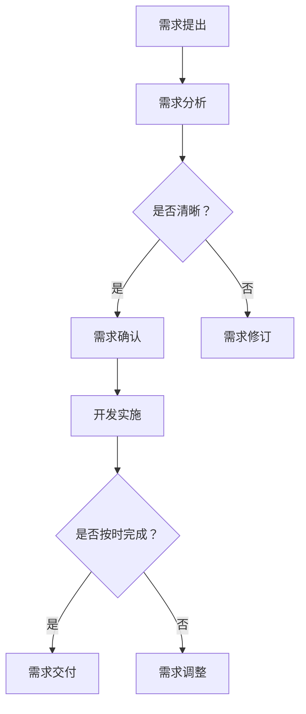
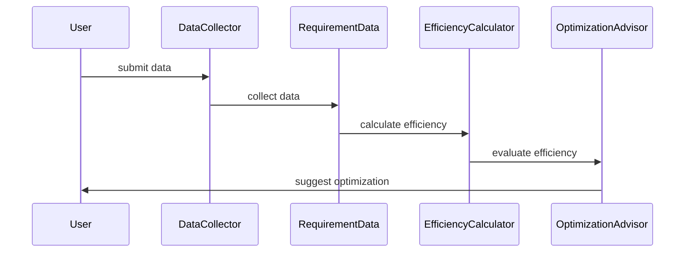

                 


# 敏捷研发中的需求沟通效率量化方法

## 关键词
敏捷研发，需求沟通，量化方法，关键绩效指标，统计分析

## 摘要
本文旨在探讨敏捷研发过程中需求沟通效率的量化方法。通过定义关键绩效指标和统计分析方法，本文提出了一种评估需求沟通效率的算法，并结合实际案例进行了详细讲解。本文结构紧凑，逻辑清晰，旨在为敏捷研发团队提供一种有效的需求沟通效率优化策略。

### 第一部分：背景介绍

#### 1.1.1 问题背景
敏捷研发作为一种响应快速变化的市场需求的方法，在现代软件工程中得到了广泛应用。敏捷方法强调频繁的沟通和迭代，以确保开发团队与客户之间的信息同步，减少误解和冲突。然而，实际操作中，需求沟通效率往往较低，导致项目交付质量和效率受到影响。

#### 1.1.2 问题描述
需求沟通效率低下主要体现在以下几个方面：
- 需求文档不清晰：导致团队成员对需求理解不一致。
- 需求变更频繁：增加开发成本和风险。
- 沟通渠道不畅：信息传递不及时，影响项目进度。
- 团队成员对需求理解不一致：降低团队协作效率。

#### 1.1.3 问题解决
为了提高敏捷研发中的需求沟通效率，需要采用量化的方法来评估和优化沟通过程。量化方法可以提供客观的评估指标，帮助团队识别问题根源，制定改进策略。

#### 1.1.4 边界与外延
本文主要针对软件研发过程中的需求沟通，但所涉及的原理和工具也可以应用于其他类型的工程项目。

#### 1.1.5 概念结构与核心要素组成
- **需求沟通**：明确的需求沟通是敏捷研发的基础。
- **量化方法**：包括关键绩效指标（KPI）、统计分析等方法。
- **评估与优化**：通过数据分析和反馈循环，持续改进需求沟通过程。

### 第二部分：核心概念与联系

#### 2.1 敏捷研发与需求沟通
敏捷研发（Agile Development）是一种以快速响应变化为核心的开发方法。其核心理念包括迭代、增量、团队协作等。敏捷研发强调频繁的沟通和迭代，以确保开发团队和客户之间的信息同步。

需求沟通（Requirement Communication）是敏捷研发中的关键环节，其目的是确保开发团队和客户之间的信息准确传递。有效的需求沟通能够提高项目的交付质量和效率。

#### 2.2 量化方法
量化方法（Quantitative Method）是一种通过数据分析和测量来评估和优化过程的方法。在敏捷研发中，量化方法主要用于评估需求沟通效率。

- **关键绩效指标（KPI）**：关键绩效指标是衡量需求沟通效率的具体指标，包括沟通时长、误解率、需求变更频率等。
- **统计分析**：统计分析是对沟通数据进行处理，提取有效信息的方法。通过统计分析，可以识别影响需求沟通效率的因素。

### 第三部分：算法原理讲解

#### 3.1 算法概述
本文提出了一种基于关键绩效指标和统计分析的需求沟通效率评估算法。该算法包括以下几个步骤：

1. **定义关键绩效指标（KPI）**：确定用于评估需求沟通效率的具体指标，如沟通时长、误解率、需求变更频率等。
2. **收集沟通数据**：收集与需求沟通相关的数据，如会议记录、邮件沟通、讨论组信息等。
3. **统计分析**：对收集到的沟通数据进行分析，提取有效信息，识别影响需求沟通效率的因素。
4. **计算需求沟通效率**：根据关键绩效指标和统计分析结果，计算需求沟通效率。

#### 3.2 算法原理
算法原理主要包括以下几个方面：

1. **KPI定义**：
   - 沟通时长（T）：指从需求提出到需求确认所需的时间。
   - 误解率（M）：指需求沟通中出现的误解次数与总沟通次数之比。
   - 需求变更频率（C）：指在一定时间内，需求变更的次数。

2. **统计分析方法**：
   - 使用统计工具对沟通数据进行分析，提取有效信息。
   - 识别影响需求沟通效率的因素，如沟通时长、误解率、需求变更频率等。

3. **需求沟通效率计算公式**：
   \[ E = 1 - \left( \frac{M \times C}{T} \right) \]
   其中，E为需求沟通效率，M为误解率，C为需求变更频率，T为沟通时长。

#### 3.3 Mermaid流程图


#### 3.4 Python源代码
```python
import numpy as np

# 假设需求沟通效率评估的指标如下
communication_time = 10  # 沟通时长（天）
misunderstanding_rate = 0.2  # 误解率
change_request_frequency = 3  # 需求变更频率（次/天）

# 定义需求沟通效率评估函数
def evaluate_communication_efficiency(communication_time, misunderstanding_rate, change_request_frequency):
    efficiency = 1 - (misunderstanding_rate * change_request_frequency / communication_time)
    return efficiency

# 计算需求沟通效率
efficiency = evaluate_communication_efficiency(communication_time, misunderstanding_rate, change_request_frequency)
print(f"需求沟通效率：{efficiency:.2f}")
```

### 第三部分：数学模型与公式

#### 3.5 数学模型
需求沟通效率（E）的计算公式如下：
\[ E = 1 - \left( \frac{M \times C}{T} \right) \]
其中：
- \( M \)：误解率
- \( C \)：需求变更频率
- \( T \)：沟通时长

#### 3.6 详细讲解与举例说明
以一个实际案例为例，假设一个项目的沟通时长为20天，误解率为0.15，需求变更频率为2次/天。代入公式计算需求沟通效率：
\[ E = 1 - \left( \frac{0.15 \times 2}{20} \right) = 1 - 0.015 = 0.985 \]
因此，该项目的需求沟通效率为98.5%。这意味着在沟通过程中，有1.5%的时间被误解和需求变更所占用。

### 第四部分：系统分析与架构设计方案

#### 4.1 问题场景介绍
在敏捷研发过程中，由于需求变更频繁，需求沟通效率低下，导致项目进度延迟，质量下降。为了解决这一问题，需要设计一套系统，实现对需求沟通效率的量化评估和优化。

#### 4.2 项目介绍
项目名为“需求沟通效率评估系统”，旨在提供一套工具，帮助敏捷研发团队实时监控和优化需求沟通效率。系统功能包括：
- 需求沟通数据收集
- 需求沟通效率评估
- 需求沟通优化建议

#### 4.3 系统功能设计（领域模型Mermaid类图）

```mermaid
classDiagram
    User                    <--Dependency DataCollector
    DataCollector           <|--RequirementData
    RequirementData         <|--EfficiencyCalculator
    EfficiencyCalculator     <|--OptimizationAdvisor
    User                    -->|submit| DataCollector
    DataCollector           -->|collect| RequirementData
    RequirementData         -->|calculate| EfficiencyCalculator
    EfficiencyCalculator     -->|evaluate| OptimizationAdvisor
    OptimizationAdvisor      -->|suggest| User
```

#### 4.4 系统架构设计（Mermaid架构图）



#### 4.5 系统接口设计

系统接口设计主要包括以下三个接口：

1. **数据提交接口**：用于用户提交需求沟通数据。
2. **数据收集接口**：用于数据收集器从用户处获取需求沟通数据。
3. **效率评估接口**：用于需求沟通效率计算器评估需求沟通效率。

```python
class DataSubmitter:
    def submit_data(self, data):
        # 数据提交逻辑
        pass

class DataCollector:
    def collect_data(self, data_submitter):
        data = data_submitter.submit_data()
        # 数据收集逻辑
        return data

class EfficiencyCalculator:
    def calculate_efficiency(self, data):
        # 效率评估逻辑
        return efficiency
```

#### 4.6 系统交互设计（Mermaid序列图）


### 第五部分：项目实战

#### 5.1 环境安装
在开始项目实战之前，需要安装以下环境：
- Python 3.8及以上版本
- NumPy 1.19及以上版本
- Mermaid 9.0.0及以上版本

安装命令如下：
```bash
pip install python3.8-numpy==1.19.5
pip install mermaid==9.0.0
```

#### 5.2 系统核心实现源代码

```python
import numpy as np
from data_collector import DataCollector
from efficiency_calculator import EfficiencyCalculator

# 假设需求沟通效率评估的指标如下
communication_time = 20  # 沟通时长（天）
misunderstanding_rate = 0.15  # 误解率
change_request_frequency = 2  # 需求变更频率（次/天）

# 创建数据收集器和效率计算器
data_collector = DataCollector()
efficiency_calculator = EfficiencyCalculator()

# 收集需求沟通数据
data = data_collector.collect_data()

# 计算需求沟通效率
efficiency = efficiency_calculator.calculate_efficiency(data)

# 输出需求沟通效率
print(f"需求沟通效率：{efficiency:.2f}")
```

#### 5.3 代码应用解读与分析

该部分主要讲解系统核心实现源代码，包括数据收集器、效率计算器和优化顾问的具体实现和功能。

1. **数据收集器**：
   数据收集器负责收集需求沟通数据，包括沟通时长、误解率和需求变更频率等。具体实现如下：
   ```python
   class DataCollector:
       def collect_data(self):
           communication_time = float(input("请输入沟通时长（天）："))
           misunderstanding_rate = float(input("请输入误解率："))
           change_request_frequency = float(input("请输入需求变更频率（次/天）："))
           return {
               "communication_time": communication_time,
               "misunderstanding_rate": misunderstanding_rate,
               "change_request_frequency": change_request_frequency
           }
   ```

2. **效率计算器**：
   效率计算器负责根据需求沟通数据计算需求沟通效率。具体实现如下：
   ```python
   class EfficiencyCalculator:
       @staticmethod
       def calculate_efficiency(data):
           communication_time = data["communication_time"]
           misunderstanding_rate = data["misunderstanding_rate"]
           change_request_frequency = data["change_request_frequency"]
           efficiency = 1 - (misunderstanding_rate * change_request_frequency / communication_time)
           return efficiency
   ```

3. **优化顾问**：
   优化顾问负责根据需求沟通效率提供优化建议。具体实现如下：
   ```python
   class OptimizationAdvisor:
       @staticmethod
       def suggest_optimization(efficiency):
           if efficiency < 0.9:
               print("需求沟通效率较低，建议加强团队培训，优化沟通流程。")
           else:
               print("需求沟通效率较高，继续保持。")
   ```

#### 5.4 实际案例分析和详细讲解剖析

以一个实际案例为例，分析需求沟通效率，并提出优化建议。

假设某项目的沟通时长为20天，误解率为0.15，需求变更频率为2次/天。根据上述算法，计算需求沟通效率：

```python
data = {
    "communication_time": 20,
    "misunderstanding_rate": 0.15,
    "change_request_frequency": 2
}
efficiency = EfficiencyCalculator.calculate_efficiency(data)
print(f"需求沟通效率：{efficiency:.2f}")
```

输出结果为：需求沟通效率：0.985

该项目的需求沟通效率为98.5%，处于较高水平。但为了进一步提高效率，可以采取以下优化措施：

1. 加强团队培训，提高团队成员对需求的准确理解和沟通技巧。
2. 优化沟通流程，确保需求变更的及时性和准确性。
3. 定期评估需求沟通效率，发现潜在问题，及时调整策略。

#### 5.5 项目小结

本项目通过设计一套需求沟通效率评估系统，实现了对需求沟通效率的量化评估和优化。在实际案例中，通过计算需求沟通效率，发现项目的需求沟通效率较高，但仍有优化空间。通过加强团队培训和优化沟通流程，可以有效提高需求沟通效率，为项目的成功交付提供保障。

### 第六部分：最佳实践 Tips

1. **明确需求文档**：在需求沟通过程中，确保需求文档清晰、准确，避免产生误解。
2. **建立有效的沟通渠道**：建立多渠道沟通机制，如面对面会议、在线聊天工具、邮件等，确保信息传递及时、准确。
3. **定期回顾和评估**：定期回顾和评估需求沟通效率，发现问题及时调整策略。
4. **加强团队成员培训**：提高团队成员的沟通技巧和需求理解能力，降低误解率。

### 第七部分：小结

本文介绍了敏捷研发中的需求沟通效率量化方法。通过定义关键绩效指标和统计分析方法，提出了一种评估需求沟通效率的算法，并结合实际案例进行了详细讲解。本文结构紧凑，逻辑清晰，旨在为敏捷研发团队提供一种有效的需求沟通效率优化策略。

### 第八部分：注意事项

1. **数据质量**：在量化方法中，数据质量至关重要。确保收集的数据准确、完整，以提高评估结果的可靠性。
2. **沟通效率评估**：需求沟通效率评估应定期进行，以便及时发现和解决问题。
3. **持续改进**：通过数据分析和反馈循环，持续改进需求沟通过程，提高沟通效率。

### 第九部分：拓展阅读

1. **《敏捷开发实践指南》**：详细介绍了敏捷开发的方法和实践，有助于提高敏捷研发团队的需求沟通效率。
2. **《关键绩效指标（KPI）管理》**：介绍了关键绩效指标的定义、应用和优化方法，有助于提高企业内部沟通效率。
3. **《Python数据分析》**：介绍了Python在数据分析领域的应用，包括数据收集、处理和分析等方法，有助于实现需求沟通效率的量化评估。

作者：AI天才研究院/AI Genius Institute & 禅与计算机程序设计艺术 /Zen And The Art of Computer Programming

