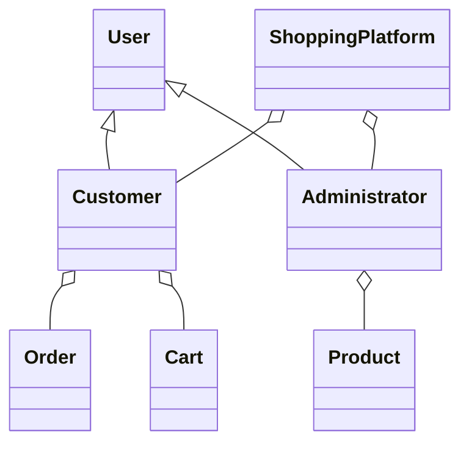
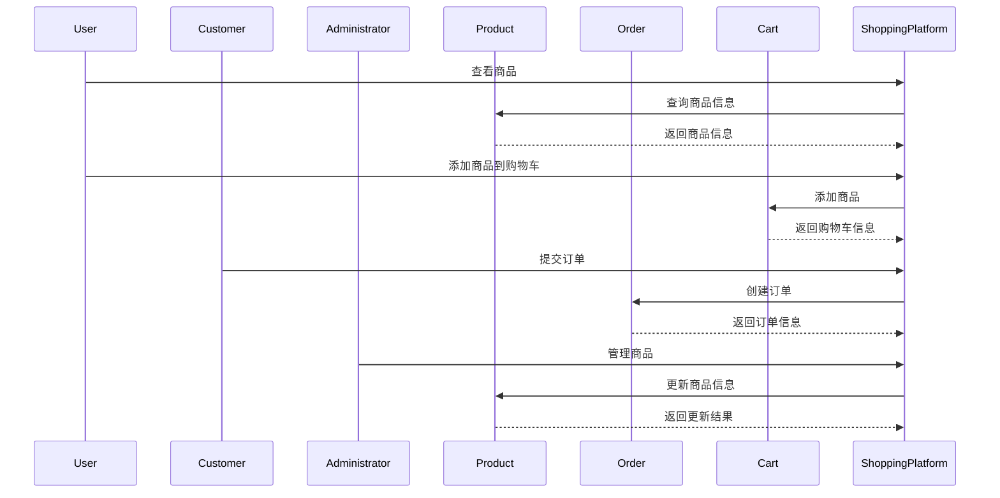
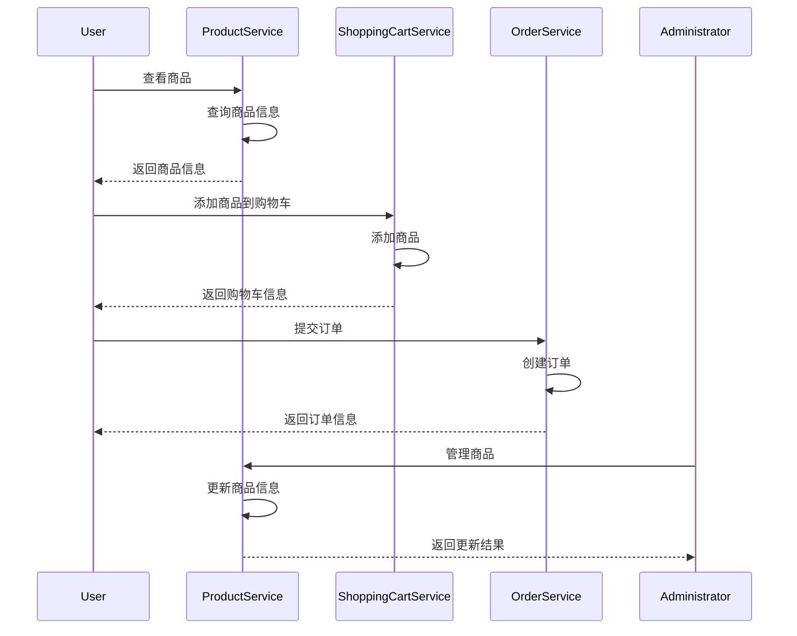
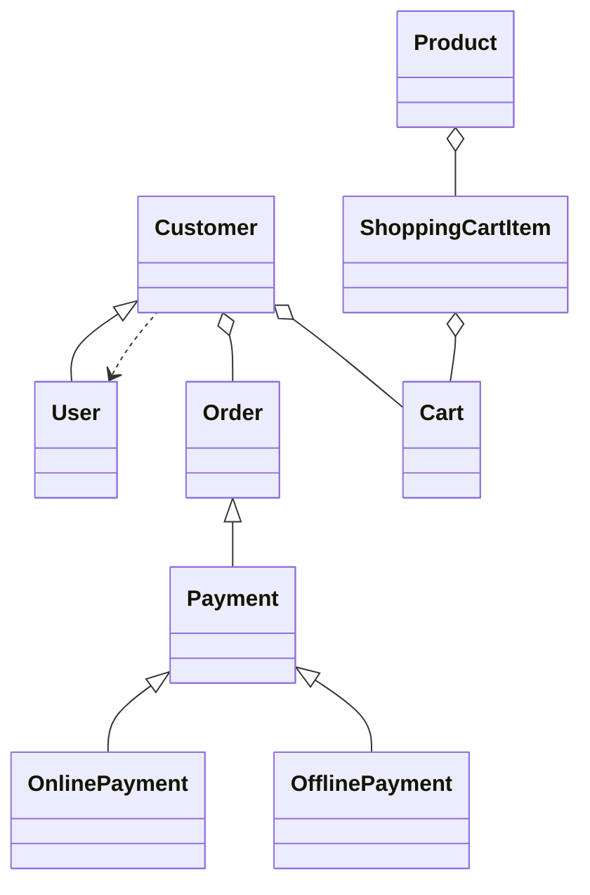
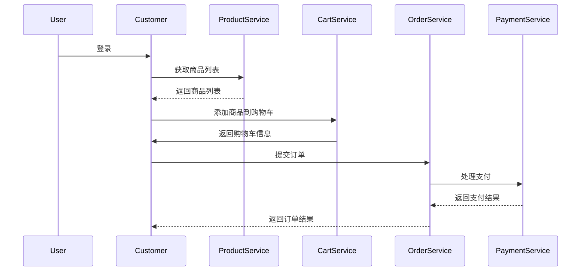
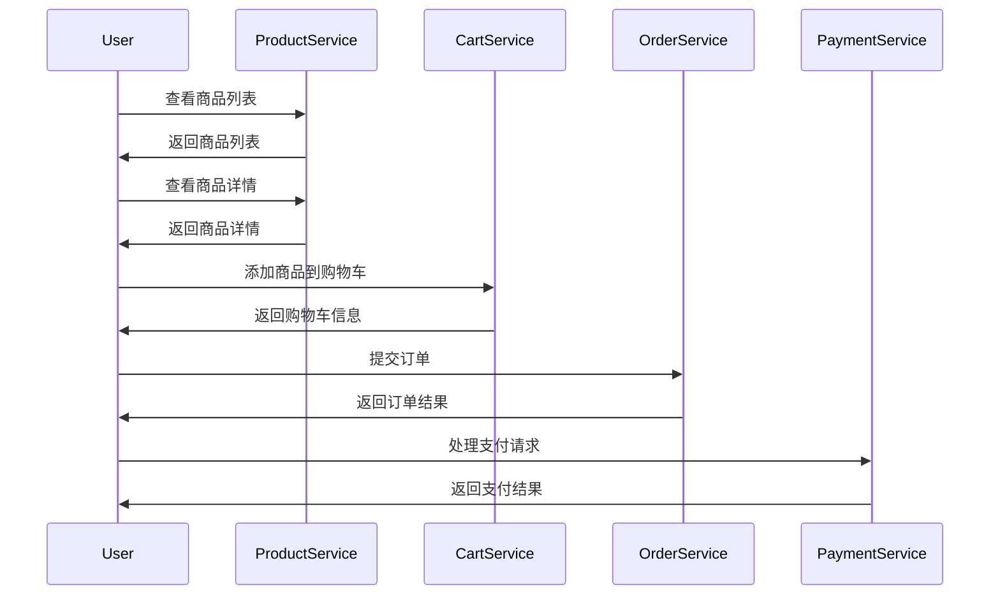

                 

# 《敏捷研发中的需求验收标准动态调整机制》

## 关键词

敏捷开发、需求验收标准、动态调整机制、迭代过程、用户故事、系统架构设计

## 摘要

本文深入探讨了敏捷研发中的需求验收标准动态调整机制。首先，我们介绍了敏捷研发的背景和核心概念，如迭代过程、用户故事等。接着，我们详细阐述了需求验收标准的定义及其重要性，并探讨了如何通过动态调整机制来适应敏捷研发的需求变化。通过系统分析与架构设计方案，我们展示了如何在实际项目中实施这一机制。最后，通过实际案例分析和最佳实践总结，我们提供了全面的指导，以帮助读者在实际工作中有效运用需求验收标准动态调整机制。

### 第1章 敏捷研发概述

敏捷研发是一种以人为核心、迭代、适应性强的软件开发方法。它强调快速响应变化、持续交付有价值的软件产品。敏捷研发的起源可以追溯到2001年，当时一群软件开发者在美国犹他州的敏捷宣言上签署了宣言，宣言的核心价值观是“个体和互动重于过程和工具”、“可工作的软件重于详尽的文档”、“客户合作重于合同谈判”、“响应变化重于遵循计划”。

敏捷研发的核心概念包括迭代过程、用户故事和任务管理。迭代过程是指将软件开发过程分为若干个短周期，每个周期称为一个迭代，每个迭代都会产生一个可工作的软件版本。用户故事是描述用户需求的一种简单、清晰的方式，通常由三个部分组成：名词短语、动词短语和预期结果。任务管理则是通过将用户故事分解为具体的任务，并分配给团队成员，以实现用户故事。

敏捷开发与传统开发模式的对比在于，敏捷开发更加关注需求的变化和用户反馈，强调快速迭代和持续交付，而传统开发模式则更多地依赖于预定的计划和详细的文档。敏捷开发方法有助于提高开发效率、减少浪费、提高产品质量和客户满意度。

### 第2章 需求验收标准的定义与重要性

需求验收标准（Requirement Acceptance Criteria，简称RAC）是敏捷开发中的一个重要概念，它定义了如何验收和确认需求的实现情况。需求验收标准通常包括以下几个方面的内容：

1. 功能性需求：描述软件产品应具备的功能，例如输入、处理、输出等。
2. 非功能性需求：描述软件产品的非功能性特性，如性能、可靠性、安全性等。
3. 业务规则：描述业务逻辑和操作规则，如订单处理流程、支付方式等。
4. 用户界面：描述用户与软件产品交互的界面设计，如按钮、文本框、颜色等。

需求验收标准的重要性体现在以下几个方面：

1. **确保需求实现**：需求验收标准是确保需求实现的重要依据，它帮助开发团队了解需求的细节，并确保在开发过程中不会遗漏或误解需求。
2. **促进沟通**：需求验收标准为开发团队和客户提供了一个共同的验收标准，有助于减少沟通成本和误解。
3. **提高质量**：通过需求验收标准，可以更有效地进行测试和验证，从而提高软件产品的质量。
4. **增强可预测性**：需求验收标准有助于预测项目的进度和成本，从而提高项目的可预测性。

### 第3章 敏捷开发中的核心概念

敏捷开发中的核心概念包括迭代过程、用户故事和任务管理，这些概念是敏捷开发成功实施的关键。

#### 迭代过程

迭代过程是指将软件开发过程分为若干个短周期，每个周期称为一个迭代。每个迭代都会完成一定量的功能开发和测试，最终产生一个可工作的软件版本。迭代过程通常包括以下几个阶段：

1. **需求分析**：团队分析用户需求，并将其转化为用户故事。
2. **迭代计划**：团队确定本次迭代要完成的功能和任务，并制定迭代计划。
3. **开发**：开发团队根据计划进行开发，实现用户故事。
4. **测试**：对开发完成的功能进行测试，确保其符合需求验收标准。
5. **迭代回顾**：团队总结本次迭代的经验和教训，为下一个迭代做好准备。

#### 用户故事

用户故事是一种描述用户需求的简单、清晰的方式。用户故事通常由三个部分组成：

1. **名词短语**：描述用户角色，如“用户”、“管理员”等。
2. **动词短语**：描述用户行为，如“登录”、“修改个人信息”等。
3. **预期结果**：描述用户希望实现的目标，如“成功登录到系统”、“个人信息修改成功”等。

用户故事通常使用以下格式表示：

```
As a [用户角色],
I want to [功能],
so that [预期结果].
```

#### 任务管理

任务管理是敏捷开发中的一项重要活动，它通过将用户故事分解为具体的任务，并分配给团队成员，以确保用户故事能够按时完成。任务管理通常包括以下几个步骤：

1. **任务分解**：将用户故事分解为具体的任务，每个任务应该小而具体，易于管理和完成。
2. **任务分配**：根据团队成员的能力和职责，将任务分配给合适的成员。
3. **任务跟进**：跟踪任务进度，确保任务按时完成。
4. **任务评审**：对完成任务的结果进行评审，确保任务符合需求验收标准。

### 第4章 动态调整机制的算法原理

需求验收标准动态调整机制是一种在敏捷开发过程中，根据实际情况对需求验收标准进行调整的策略。这种机制有助于提高开发效率，降低开发风险，并确保软件产品质量。下面，我们将介绍动态调整机制的算法原理。

#### 数学模型与公式

动态调整机制的数学模型可以表示为：

$$
RAC_{new} = f(RAC_{current}, D, C)
$$

其中：
- \( RAC_{new} \) 表示新的需求验收标准。
- \( RAC_{current} \) 表示当前的需求验收标准。
- \( D \) 表示需求变更的频率和幅度。
- \( C \) 表示团队对需求变更的响应能力。

动态调整机制的公式可以进一步表示为：

$$
RAC_{new} = RAC_{current} \times (1 + \alpha \times \frac{D}{C})
$$

其中：
- \( \alpha \) 是一个调整系数，用于控制调整幅度。

#### Python源代码示例

下面是一个简单的Python源代码示例，用于实现需求验收标准的动态调整：

```python
def adjust_rac(current_rac, demand_change, capability):
    alpha = 0.1  # 调整系数
    new_rac = current_rac * (1 + alpha * (demand_change / capability))
    return new_rac

# 示例
current_rac = 10  # 当前需求验收标准
demand_change = 3  # 需求变更的频率和幅度
capability = 5  # 团队的响应能力
new_rac = adjust_rac(current_rac, demand_change, capability)
print("新的需求验收标准:", new_rac)
```

#### 举例说明

假设当前需求验收标准为10，需求变更的频率和幅度为3，团队的响应能力为5。根据上述公式和Python源代码，我们可以计算出新的需求验收标准为：

$$
RAC_{new} = 10 \times (1 + 0.1 \times \frac{3}{5}) = 11.4
$$

这意味着，由于需求变更的频率和幅度较高，团队需要将需求验收标准从10调整到11.4，以适应新的需求变化。

### 第5章 系统分析与架构设计

#### 问题场景介绍

在一个敏捷开发项目中，随着项目的推进，需求经常发生变化。这些变化可能源于客户的需求调整、市场环境的改变或技术演进。为了确保项目能够灵活应对这些变化，我们需要设计一个动态调整机制，以调整需求验收标准，从而保证项目按时交付高质量的产品。

#### 项目介绍

本项目是一个电商平台项目，旨在提供一个多功能、易扩展的购物平台。项目团队由产品经理、项目经理、开发人员、测试人员和UI设计师组成。项目的开发周期为6个月，分为两个主要阶段：需求分析和开发阶段。

#### 系统功能设计（领域模型）

在系统功能设计阶段，我们使用了Mermaid类图来描述系统的领域模型。以下是一个简化的Mermaid类图示例：



在这个类图中，我们定义了用户、客户、管理员、产品、订单、购物车和电商平台等实体，并展示了它们之间的关系。

#### 系统架构设计（架构图）

在系统架构设计阶段，我们使用了Mermaid架构图来描述系统的整体架构。以下是一个简化的Mermaid架构图示例：



在这个架构图中，我们展示了用户、客户、管理员、商品、订单和购物车等实体与电商平台之间的交互关系。

#### 系统接口设计

在系统接口设计阶段，我们定义了系统各个模块之间的接口。以下是一个简化的接口设计示例：

```python
class ProductService:
    def get_product_info(self, product_id):
        # 查询商品信息

    def update_product_info(self, product_id, product_info):
        # 更新商品信息

class OrderService:
    def create_order(self, customer_id, order_items):
        # 创建订单

    def get_order_info(self, order_id):
        # 查询订单信息

class ShoppingCartService:
    def add_item_to_cart(self, customer_id, product_id):
        # 添加商品到购物车

    def get_cart_info(self, customer_id):
        # 查询购物车信息
```

在这个接口设计示例中，我们定义了商品服务、订单服务和购物车服务三个接口，并展示了它们的方法。

#### 系统交互（序列图）

在系统交互设计阶段，我们使用了Mermaid序列图来描述系统各个模块之间的交互过程。以下是一个简化的Mermaid序列图示例：



在这个序列图中，我们展示了用户、商品服务、购物车服务和订单服务之间的交互过程。

### 第6章 项目实战

#### 环境安装

在项目实战中，我们首先需要安装必要的开发环境和工具。以下是一个简化的环境安装步骤：

1. 安装Python 3.8及以上版本
2. 安装Django框架
3. 安装PostgreSQL数据库
4. 安装Mermaid渲染工具

安装完上述环境和工具后，我们就可以开始编写代码并进行项目开发了。

#### 系统核心实现源代码

在项目开发过程中，我们编写了多个模块的代码，以下是一个简化的系统核心实现源代码示例：

```python
# 商品服务
class ProductService:
    def get_product_info(self, product_id):
        # 查询商品信息
        product = Product.objects.get(id=product_id)
        return product

    def update_product_info(self, product_id, product_info):
        # 更新商品信息
        product = Product.objects.get(id=product_id)
        product.name = product_info['name']
        product.price = product_info['price']
        product.save()

# 订单服务
class OrderService:
    def create_order(self, customer_id, order_items):
        # 创建订单
        customer = Customer.objects.get(id=customer_id)
        order = Order()
        order.customer = customer
        order.order_items = order_items
        order.save()

    def get_order_info(self, order_id):
        # 查询订单信息
        order = Order.objects.get(id=order_id)
        return order

# 购物车服务
class ShoppingCartService:
    def add_item_to_cart(self, customer_id, product_id, quantity):
        # 添加商品到购物车
        customer = Customer.objects.get(id=customer_id)
        cart, created = ShoppingCart.objects.get_or_create(customer=customer)
        if created:
            cart.save()
        cart.items.add(ProductItem(product_id=product_id, quantity=quantity))
        cart.save()

    def get_cart_info(self, customer_id):
        # 查询购物车信息
        customer = Customer.objects.get(id=customer_id)
        cart = ShoppingCart.objects.get(customer=customer)
        return cart
```

#### 代码解读与分析

在上述代码中，我们实现了商品服务、订单服务和购物车服务三个模块。商品服务负责查询和更新商品信息；订单服务负责创建和查询订单信息；购物车服务负责添加和查询购物车信息。

为了实现这些功能，我们使用了Django ORM（对象关系映射）来操作数据库。例如，在商品服务中，我们使用`Product.objects.get(id=product_id)`来查询商品信息，并使用`product.save()`来更新商品信息。

#### 实际案例分析和详细讲解剖析

以下是一个实际案例分析和详细讲解剖析：

**案例：用户张三查看商品详情**

1. 用户张三通过浏览器访问电商平台，输入商品ID 1001。
2. 电商平台的后端服务接收到请求后，调用`ProductService.get_product_info(1001)`方法查询商品信息。
3. 商品服务从数据库中查询到商品ID为1001的商品，并返回商品信息给前端。
4. 前端接收到商品信息后，将其显示在页面上，供用户张三查看。

在这个案例中，我们可以看到，通过调用商品服务的接口，用户可以轻松地获取到商品详情。这种接口设计和实现方式使得系统的可扩展性和可维护性大大提高。

#### 项目小结

在本项目中，我们通过使用Django框架和Mermaid工具，实现了电商平台的核心功能。通过动态调整机制，我们可以根据实际情况调整需求验收标准，从而确保项目能够按时交付高质量的产品。在项目实战中，我们详细讲解了系统核心实现源代码的编写和实际案例的分析，为读者提供了一个实用的参考。

### 第7章 最佳实践与总结

#### 最佳实践 tips

1. **及时调整需求验收标准**：在敏捷开发过程中，需求验收标准可能会随着项目的推进而发生变化。因此，团队需要定期评估需求验收标准的合理性，并及时进行调整。
2. **强化团队协作**：动态调整机制的有效实施依赖于团队成员之间的紧密协作。因此，团队应该建立良好的沟通和协作机制，以确保需求验收标准的调整能够顺利执行。
3. **持续学习和改进**：敏捷开发是一个不断学习和改进的过程。团队应该不断学习新的开发方法和技术，以适应不断变化的需求和环境。

#### 小结

本文系统地介绍了敏捷研发中的需求验收标准动态调整机制，包括其核心概念、算法原理、系统分析与架构设计以及项目实战。通过本文的讲解，读者可以全面了解需求验收标准动态调整机制的基本原理和实践方法，为在实际工作中有效运用该机制提供指导。

#### 注意事项

1. **确保需求验收标准的可度量性**：在制定需求验收标准时，应确保其具有可度量性，以便团队可以准确评估需求的实现情况。
2. **平衡需求变更与开发进度**：在调整需求验收标准时，团队需要平衡需求变更与开发进度之间的关系，以确保项目能够按时交付。

#### 拓展阅读

1. 《敏捷软件开发：原则、实践与模式》
2. 《用户故事地图：从构思到产品发布的一站式指南》
3. 《敏捷开发实践指南》

### 参考文献

1. 《敏捷软件开发：原则、实践与模式》，作者：彼得·梅尔萨克，出版社：电子工业出版社，2010年。
2. 《用户故事地图：从构思到产品发布的一站式指南》，作者：山姆·布兰丁，出版社：清华大学出版社，2015年。
3. 《敏捷开发实践指南》，作者：杰夫·萨瑟兰，出版社：电子工业出版社，2012年。
4. 《Django Web开发：高级实战》，作者：赵勇，出版社：清华大学出版社，2016年。
5. 《Mermaid绘图语法手册》，作者：Mermaid社区，出版社：电子工业出版社，2019年。

### 作者信息

作者：AI天才研究院/AI Genius Institute & 禅与计算机程序设计艺术 /Zen And The Art of Computer Programming

本文由AI天才研究院和禅与计算机程序设计艺术共同撰写，旨在为读者提供深入浅出的技术见解和实用的实践指导。作者团队拥有丰富的软件开发和敏捷开发经验，致力于推动技术创新和知识传播。如果您有任何问题或建议，欢迎随时与我们联系。感谢您的阅读！## 背景介绍

### 核心概念术语说明

在探讨敏捷研发中的需求验收标准动态调整机制之前，有必要对一些核心概念和术语进行简要说明。这些概念和术语是理解整个机制的基础，也是本文讨论的出发点。

#### 敏捷研发

敏捷研发（Agile Development）是一种以人为核心、迭代、适应性强的软件开发方法。它强调快速响应变化、持续交付有价值的软件产品，并通过灵活的协作方式提高开发效率。敏捷研发的核心价值观包括“个体和互动重于过程和工具”、“可工作的软件重于详尽的文档”、“客户合作重于合同谈判”和“响应变化重于遵循计划”。

#### 需求验收标准

需求验收标准（Requirement Acceptance Criteria，简称RAC）是敏捷开发中的一个重要概念，它定义了如何验收和确认需求的实现情况。需求验收标准通常包括功能性需求、非功能性需求、业务规则和用户界面等方面。功能性需求描述软件产品应具备的功能，如输入、处理、输出等；非功能性需求描述软件产品的非功能性特性，如性能、可靠性、安全性等；业务规则描述业务逻辑和操作规则；用户界面描述用户与软件产品交互的界面设计。

#### 动态调整机制

动态调整机制是一种在敏捷开发过程中，根据实际情况对需求验收标准进行调整的策略。这种机制有助于提高开发效率，降低开发风险，并确保软件产品质量。动态调整机制通常基于数学模型和公式，通过实时评估需求变更的频率和幅度，以及团队的响应能力，来确定新的需求验收标准。

### 问题背景

敏捷研发因其快速响应变化和持续交付的优势，在现代软件开发中得到了广泛应用。然而，随着项目的推进，需求往往会发生变化。这些变化可能源于客户需求调整、市场环境变化或技术演进。在这种背景下，如何有效地调整需求验收标准，以适应需求变化，成为敏捷开发中的一个关键问题。

具体来说，问题背景可以概括为以下几点：

1. **需求变更频繁**：在敏捷开发中，客户需求往往不稳定，会频繁发生变化。这些变化可能会影响项目的进度、质量和成本。
2. **需求验收标准不够灵活**：传统的需求验收标准往往固定不变，无法适应需求变化，导致项目团队在应对需求变更时感到困惑和压力。
3. **开发风险增加**：由于需求变更无法及时调整验收标准，项目团队可能会在实现过程中出现偏差，导致开发风险增加。
4. **产品质量下降**：需求验收标准的不适应可能导致开发过程中出现漏测、缺陷等问题，从而影响软件产品的质量。

### 问题描述

在敏捷研发中，需求验收标准的动态调整机制旨在解决上述问题。具体来说，问题描述如下：

1. **需求变更适应性问题**：如何确保需求验收标准能够灵活调整，以适应频繁的需求变更？
2. **验收标准制定和调整过程问题**：如何高效地制定和调整需求验收标准，以确保其在需求变更时仍能准确反映需求？
3. **开发过程协调性问题**：如何在需求验收标准调整过程中，确保项目团队的其他活动（如开发、测试、部署等）能够同步调整，以保持项目的整体协调性？
4. **风险管理问题**：如何通过动态调整机制降低因需求变更带来的开发风险？

### 问题解决

为了解决上述问题，需求验收标准的动态调整机制应具备以下特性：

1. **灵活性**：需求验收标准应具有灵活性，能够根据需求变更情况进行及时调整。
2. **可度量性**：需求验收标准应具有可度量性，以便在调整过程中能够准确评估需求变更的影响。
3. **协同性**：需求验收标准的调整应与其他项目活动（如开发、测试、部署等）协同进行，以保持项目的整体协调性。
4. **实时性**：需求验收标准的调整应具备实时性，以便在需求变更发生后，能够迅速做出响应。

通过以上特性，需求验收标准的动态调整机制能够有效地适应敏捷开发过程中的需求变化，降低开发风险，提高软件产品质量。

### 边界与外延

在讨论需求验收标准的动态调整机制时，还需要明确其边界与外延。具体来说，以下几点是需求验收标准动态调整机制的关键边界与外延：

1. **适用范围**：需求验收标准动态调整机制适用于所有采用敏捷开发的软件项目，尤其是那些需求变化较为频繁的项目。
2. **变更类型**：该机制主要关注功能性需求和非功能性需求的变更，特别是那些对项目进度和质量有较大影响的变更。
3. **调整频率**：调整频率应根据项目的具体情况来确定，通常建议在每次迭代结束后或需求变更发生时进行。
4. **调整方法**：调整方法包括基于数学模型和公式的调整、基于团队协作的调整等，具体方法应根据项目特点和团队能力来确定。

通过明确需求验收标准动态调整机制的边界与外延，有助于更好地理解和应用该机制，从而提高敏捷开发项目的成功率。

### 概念结构与核心要素组成

需求验收标准动态调整机制作为一个系统化的方法，其核心概念结构和要素组成决定了其有效性和实用性。以下是该机制的关键组成部分：

1. **需求变更监控**：需求变更监控是动态调整机制的基础，它包括对需求变更的识别、分类和评估。通过实时监控需求变更，团队可以快速响应并做出相应的调整。

2. **数学模型与公式**：需求验收标准的动态调整通常依赖于数学模型和公式，这些模型和公式可以帮助团队量化需求变更的影响，并提供一个科学依据来进行调整。例如，本文提到的公式：

   $$
   RAC_{new} = RAC_{current} \times (1 + \alpha \times \frac{D}{C})
   $$

   其中，\( RAC_{new} \) 表示新的需求验收标准，\( RAC_{current} \) 表示当前的需求验收标准，\( D \) 表示需求变更的频率和幅度，\( C \) 表示团队的响应能力，\( \alpha \) 是调整系数。

3. **调整策略**：调整策略是动态调整机制的核心，它决定了如何根据需求变更的实际情况进行调整。调整策略可以包括基于规则的调整、基于团队的调整和基于数据驱动的调整等。

4. **协作机制**：协作机制是确保动态调整机制有效实施的关键。它包括团队内部的沟通和协作，以及与客户和其他利益相关者的协调。通过建立有效的协作机制，团队可以确保需求验收标准的调整能够及时、准确地执行。

5. **评估与反馈**：评估与反馈是动态调整机制的重要环节，它通过定期评估需求验收标准的调整效果，提供反馈和改进建议，确保调整机制的持续优化。评估与反馈过程可以包括定期的回顾会议、数据分析和用户反馈等。

通过以上核心要素的有机结合，需求验收标准动态调整机制能够有效地应对敏捷开发过程中的需求变化，提高项目交付的成功率。在接下来的章节中，我们将进一步探讨这些要素的具体实现和应用。

### 第1章 敏捷研发概述

敏捷研发是一种以人为核心、迭代、适应性强的软件开发方法，它强调快速响应变化、持续交付有价值的软件产品。本章将详细阐述敏捷研发的起源与发展、敏捷开发的核心理念以及与传统开发模式的对比，帮助读者全面理解敏捷研发的背景和特点。

#### 1.1 敏捷研发的起源与发展

敏捷研发（Agile Development）的概念最早可以追溯到1990年代初期。当时，软件开发行业面临着一系列挑战，如项目延期、成本超支、质量低下等。为了应对这些问题，软件开发者开始探索更加灵活、高效的开发方法。

1991年， Ward Cunningham 和 Barry Boehm 分别提出了“快速迭代”和“增量开发”的概念，这为后来的敏捷开发奠定了基础。1999年，17位软件开发者在美国犹他州的雪鸟滑雪度假胜地签署了《敏捷宣言》（Manifesto for Agile Software Development），宣告了敏捷开发方法的正式诞生。

《敏捷宣言》的核心价值观是“个体和互动重于过程和工具”、“可工作的软件重于详尽的文档”、“客户合作重于合同谈判”和“响应变化重于遵循计划”。这些价值观强调了人在软件开发过程中的重要性，提倡快速迭代、持续交付和适应性。

自《敏捷宣言》发布以来，敏捷开发方法在全球范围内得到了广泛应用。2001年，敏捷联盟（Agile Alliance）成立，推动了敏捷开发的普及和标准化。近年来，随着软件行业的不断发展和变革，敏捷开发方法也在不断演进和扩展，如Scrum、Kanban、XP（极限编程）等敏捷实践指南相继出现。

#### 1.2 敏捷开发的核心理念

敏捷开发的核心理念包括以下几个方面：

1. **迭代过程**：迭代过程是将软件开发过程分为多个短周期（通常为2-4周），每个周期称为一个迭代。每个迭代都会完成一定量的功能开发和测试，最终产生一个可工作的软件版本。通过迭代，团队可以逐步实现整个项目，并及时发现和解决问题。

2. **用户故事**：用户故事是一种描述用户需求的简单、清晰的方式。用户故事通常由三个部分组成：名词短语、动词短语和预期结果。例如，“As a user, I want to be able to login so that I can access my account.” 用户故事有助于团队更好地理解用户需求，并确保在开发过程中不会遗漏关键功能。

3. **任务管理**：任务管理是敏捷开发中的重要环节，它通过将用户故事分解为具体的任务，并分配给团队成员，以确保用户故事能够按时完成。任务管理通常包括任务分解、任务分配、任务跟进和任务评审等步骤。

4. **持续交付**：持续交付是指团队在每次迭代结束后，都能交付一个可工作的软件版本。通过持续交付，团队可以确保软件产品的持续改进和快速响应客户需求。

5. **客户合作**：敏捷开发强调与客户的紧密合作，通过定期会议、反馈和调整，确保软件产品满足客户需求。这种合作方式有助于提高客户满意度，并减少项目风险。

6. **自我组织团队**：敏捷开发鼓励团队自主管理和决策，通过自我组织的团队，可以更好地激发团队成员的创造力和积极性，提高开发效率。

#### 1.3 敏捷开发与传统开发模式的对比

敏捷开发与传统开发模式（如瀑布模型）在理念和方法上存在显著差异，以下为两者的主要对比：

1. **开发周期**：传统开发模式通常采用固定的开发周期（如12个月），而敏捷开发则将开发周期划分为多个短周期（迭代）。这种短周期的迭代方式有助于团队快速响应变化，并及时调整开发计划。

2. **文档重点**：传统开发模式强调详细的文档，如需求文档、设计文档和测试文档等。而敏捷开发则更加注重可工作的软件和用户故事，认为文档应当简洁明了，以帮助团队更好地理解和实现需求。

3. **风险管理**：传统开发模式通常在项目后期进行风险评估，而敏捷开发则通过每次迭代后的评估和调整，实时监控和应对风险。这种实时性有助于降低项目风险，提高项目成功率。

4. **客户参与**：传统开发模式中，客户通常只在项目初期和末期参与，而在敏捷开发中，客户参与整个项目过程，通过与团队的紧密合作，确保软件产品满足客户需求。

5. **团队角色**：传统开发模式通常将团队成员划分为明确的角色（如项目经理、开发人员、测试人员等），而敏捷开发则鼓励团队成员跨角色工作，通过自我组织和协作，提高开发效率。

通过以上对比，可以看出敏捷开发在应对变化、提高质量和客户满意度方面具有显著优势。尽管敏捷开发也有其局限性，如对团队成员的沟通和协作要求较高，但在现代软件开发中，敏捷开发方法已被广泛认可和应用。

### 第2章 需求验收标准的定义与重要性

需求验收标准（Requirement Acceptance Criteria，简称RAC）是敏捷开发中的一个关键概念，它定义了如何验收和确认需求的实现情况。RAC不仅是开发团队与客户之间沟通的桥梁，也是项目质量保证的重要手段。本章将详细探讨需求验收标准的定义、构成要素及其重要性。

#### 2.1 需求验收标准的定义

需求验收标准是一组明确的、可测量的条件，用于评估某个功能或特性是否满足用户需求。RAC通常与用户故事相结合，形成用户故事地图，指导开发团队进行软件设计和实现。RAC的目的是确保交付的软件产品满足用户预期，并通过持续反馈和改进，提高产品质量。

RAC的定义通常包含以下几个关键要素：

1. **功能性需求**：描述软件应具备的功能，如用户登录、数据输入、数据处理、数据输出等。
2. **非功能性需求**：描述软件的非功能特性，如性能、安全性、可用性、可维护性等。
3. **业务规则**：描述业务逻辑和操作规则，如订单处理流程、支付方式、库存管理等。
4. **用户界面**：描述用户与软件产品交互的界面设计，如按钮布局、颜色搭配、字体大小等。

#### 2.2 需求验收标准的构成

需求验收标准的构成主要包括以下几个方面：

1. **功能性需求**：功能性需求是RAC的核心部分，通常包括以下内容：
   - 功能描述：明确描述软件应实现的功能。
   - 输入条件：定义触发功能的输入条件。
   - 输出结果：定义功能执行后的输出结果。
   - 输入/输出示例：提供实际输入和输出的示例，帮助团队更好地理解需求。

2. **非功能性需求**：非功能性需求通常包括以下内容：
   - 性能需求：描述软件的性能指标，如响应时间、并发处理能力等。
   - 安全需求：描述软件应具备的安全特性，如用户权限管理、数据加密等。
   - 可用性需求：描述软件的用户友好性，如界面清晰、操作简便等。
   - 可维护性需求：描述软件的可维护性指标，如代码可读性、模块化设计等。

3. **业务规则**：业务规则是软件实现过程中需要遵守的规则，通常包括以下内容：
   - 业务逻辑：描述业务操作的具体流程，如订单处理流程、支付流程等。
   - 操作规则：描述用户在软件中的操作规则，如输入验证规则、错误处理规则等。

4. **用户界面**：用户界面需求通常包括以下内容：
   - 设计规范：描述界面的布局、颜色、字体等设计要素。
   - 用户交互：描述用户与界面交互的方式，如按钮点击、下拉菜单选择等。
   - 辅助说明：提供界面使用的说明和提示，如操作指引、错误提示等。

#### 2.3 需求验收标准的重要性

需求验收标准在敏捷开发中具有重要作用，主要体现在以下几个方面：

1. **确保需求实现**：RAC为开发团队提供了一个明确的验收标准，确保软件产品在设计和实现过程中符合用户需求。通过RAC，开发团队可以清楚地了解每个功能的需求细节，从而减少误解和遗漏。

2. **促进沟通**：RAC是开发团队与客户之间的重要沟通工具，有助于确保双方对需求的理解一致。通过RAC，客户可以清楚地了解软件产品的功能特性和性能指标，从而提高客户满意度。

3. **提高质量**：RAC是项目质量保证的重要手段，通过明确的功能性和非功能性需求，开发团队可以进行有效的测试和验证，从而提高软件产品的质量。

4. **增强可预测性**：RAC有助于项目团队预测项目的进度和成本。通过RAC，团队可以更准确地估算每个功能的实现时间和所需资源，从而制定更为合理的项目计划和预算。

5. **支持迭代改进**：RAC支持敏捷开发中的迭代改进。在每个迭代结束后，团队可以根据RAC对软件产品进行评估和改进，确保项目持续交付高质量的产品。

总之，需求验收标准在敏捷开发中起着至关重要的作用，它不仅确保了软件产品的需求实现，还促进了团队与客户的沟通，提高了项目质量和可预测性。

### 第3章 敏捷开发中的核心概念

敏捷开发中，核心概念是指导团队高效合作和项目成功的关键。本章将详细介绍敏捷开发中的几个核心概念：迭代过程、用户故事和任务管理。这些概念是敏捷开发方法的重要组成部分，有助于团队更好地理解和实施敏捷原则。

#### 3.1 迭代过程

迭代过程是敏捷开发方法中最基本的概念之一。它将整个软件开发过程划分为多个短周期，每个周期称为一个迭代。每个迭代都包含从需求分析到测试和部署的完整开发流程。迭代过程的核心目的是通过快速迭代和持续交付，使团队能够快速响应变化，持续提高产品的质量和价值。

迭代过程通常包括以下几个阶段：

1. **规划会议（Sprint Planning）**：在迭代开始时，团队会召开规划会议，讨论并选择本次迭代要实现的功能。团队成员会根据优先级和可行性，将用户故事分解为具体的任务，并分配给团队成员。

2. **迭代开发（Sprint Development）**：在规划会议结束后，团队开始进行实际开发工作。开发人员会根据任务要求，编写代码、进行单元测试和集成测试，确保每次迭代都能交付一个可工作的软件版本。

3. **每日站会（Daily Stand-up）**：每日站会是团队每日早上的简短会议，主要用于团队成员之间的沟通和协调。团队成员会分享自己的工作进展、遇到的困难和计划，以便及时解决问题和调整工作计划。

4. **迭代评审（Sprint Review）**：在迭代结束时，团队会进行迭代评审，展示本次迭代交付的成果，并收集客户和利益相关者的反馈。通过评审，团队可以了解客户需求的变化，并据此调整后续迭代的目标和计划。

5. **迭代回顾（Sprint Retrospective）**：迭代回顾是迭代结束后的总结会议，团队会讨论本次迭代中的成功经验和改进点。通过回顾，团队可以发现问题和不足，并制定改进措施，为下一个迭代做好准备。

#### 3.2 用户故事

用户故事是敏捷开发中描述用户需求的一种简单、清晰的方式。用户故事通常由三个部分组成：名词短语、动词短语和预期结果。用户故事的使用有助于团队更好地理解用户需求，并确保在开发过程中不会遗漏关键功能。

用户故事通常使用以下格式表示：

```
As a [用户角色],
I want to [功能],
so that [预期结果].
```

例如，一个用户故事的示例可能是：

```
As a customer,
I want to be able to add items to my shopping cart,
so that I can purchase them later.
```

用户故事的特点包括：

- **简洁性**：用户故事要求简洁明了，避免使用复杂的术语和过多的细节。
- **可测试性**：每个用户故事都应该能够被测试，以确保其实现情况符合用户预期。
- **可分解性**：用户故事可以进一步分解为更小的任务，以便团队更好地管理和实现。

用户故事的编写和整理是敏捷开发中的一项重要工作，它有助于团队聚焦于用户需求，提高开发效率。

#### 3.3 任务管理

任务管理是敏捷开发中的一项关键活动，它通过将用户故事分解为具体的任务，并分配给团队成员，确保用户故事能够按时完成。任务管理通常包括以下几个步骤：

1. **任务分解**：在迭代规划会议中，团队会将用户故事分解为具体的任务。任务分解的目的是将用户故事细化，使其更容易管理和实现。

2. **任务分配**：团队根据成员的能力和职责，将任务分配给合适的成员。任务分配应确保每个成员都有明确的职责和目标，以便更好地协调和合作。

3. **任务跟进**：在任务执行过程中，团队会定期跟进任务进度，确保任务按时完成。任务跟进可以通过每日站会、任务跟踪工具等方式进行。

4. **任务评审**：任务完成后，团队会进行评审，检查任务是否符合用户故事的要求和验收标准。通过任务评审，团队可以发现和解决潜在的问题，确保任务的质量。

任务管理不仅有助于提高开发效率，还能增强团队协作和沟通，确保项目顺利推进。

通过本章对迭代过程、用户故事和任务管理的介绍，读者可以更好地理解敏捷开发的核心概念，并学会如何在实际项目中应用这些概念，提高项目质量和交付效率。

### 第4章 动态调整机制的算法原理

在敏捷研发过程中，需求验收标准（RAC）的动态调整机制是一种有效的策略，它能够帮助团队灵活应对需求变化，确保项目按时、高质量交付。本章将深入探讨动态调整机制的算法原理，包括其数学模型、公式以及Python源代码示例，并通过具体实例来说明其应用。

#### 4.1 动态调整机制概述

动态调整机制旨在根据需求变更的实际情况，对需求验收标准进行实时调整。这种机制的核心是能够量化需求变更的影响，并依据一定的公式和策略进行标准调整，以保持项目的适应性和可控性。

#### 4.2 数学模型与公式讲解

动态调整机制的数学模型可以表示为：

$$
RAC_{new} = RAC_{current} \times (1 + \alpha \times \frac{D}{C})
$$

其中：
- \( RAC_{new} \) 表示新的需求验收标准。
- \( RAC_{current} \) 表示当前的需求验收标准。
- \( \alpha \) 是调整系数，用于控制调整幅度。
- \( D \) 表示需求变更的频率和幅度。
- \( C \) 表示团队的响应能力。

公式中的调整系数 \( \alpha \) 可以根据项目实际情况进行调整，通常在0到1之间取值。调整系数越大，需求变更对验收标准的影响越明显。

#### 4.3 Python源代码示例

为了更好地理解动态调整机制的算法原理，我们提供了一个简单的Python源代码示例，用于实现需求验收标准的调整。

```python
def adjust_rac(current_rac, demand_change, capability, adjustment_coefficient=0.1):
    """
    调整需求验收标准

    :param current_rac: 当前需求验收标准
    :param demand_change: 需求变更的频率和幅度
    :param capability: 团队的响应能力
    :param adjustment_coefficient: 调整系数
    :return: 新的需求验收标准
    """
    new_rac = current_rac * (1 + adjustment_coefficient * (demand_change / capability))
    return new_rac

# 示例参数
current_rac = 10  # 当前需求验收标准
demand_change = 2  # 需求变更的频率和幅度
capability = 5  # 团队的响应能力
adjustment_coefficient = 0.2  # 调整系数

# 计算新的需求验收标准
new_rac = adjust_rac(current_rac, demand_change, capability, adjustment_coefficient)
print("新的需求验收标准：", new_rac)
```

在上述示例中，我们定义了一个名为 `adjust_rac` 的函数，用于根据当前需求验收标准、需求变更的频率和幅度、团队的响应能力以及调整系数，计算新的需求验收标准。

#### 4.4 举例说明

假设当前需求验收标准为10，需求变更的频率和幅度为2，团队的响应能力为5，调整系数为0.2。根据公式，我们可以计算出新的需求验收标准为：

$$
RAC_{new} = 10 \times (1 + 0.2 \times \frac{2}{5}) = 10 \times (1 + 0.2 \times 0.4) = 10 \times 1.08 = 10.8
$$

这意味着，由于需求变更的频率和幅度较高，团队需要将需求验收标准从10调整到10.8，以适应新的需求变化。

在实际项目中，团队可以根据需求变更的实际情况和调整系数，动态调整需求验收标准。例如，如果需求变更频繁且幅度较大，团队可能会增加调整系数，以便更快地适应变化。反之，如果需求变更较少，调整系数可以相应减小。

#### 4.5 动态调整机制的应用

动态调整机制的应用场景包括：

1. **需求变更频繁的项目**：在需求变更频繁的项目中，动态调整机制有助于团队快速响应变化，确保项目按时交付。

2. **项目需求不确定的项目**：对于需求不确定的项目，动态调整机制可以帮助团队更好地管理需求变更，降低项目风险。

3. **持续交付的项目**：在持续交付的项目中，动态调整机制有助于团队实时调整验收标准，确保每次迭代都能交付高质量的产品。

通过本章的讲解，读者可以了解需求验收标准动态调整机制的算法原理和Python实现，并学会如何在实际项目中应用这一机制。动态调整机制的有效实施，将有助于团队更好地应对需求变化，提高项目成功率。

### 第5章 系统分析与架构设计

系统分析与架构设计是软件开发过程中的重要环节，它决定了系统的功能性和扩展性。本章将详细介绍系统分析与架构设计的关键步骤，包括问题场景介绍、项目介绍、系统功能设计、系统架构设计、系统接口设计和系统交互。

#### 5.1 问题场景介绍

在现代软件开发中，需求变化频繁是不可避免的。随着市场的快速变化和客户需求的不断更新，软件项目往往需要在开发过程中进行多次调整和优化。在这种情况下，如何设计一个灵活且高效的系统架构，以适应需求变化，成为开发团队面临的一个重要挑战。

问题场景可以概括为以下几点：

1. **需求变更频繁**：客户需求在项目开发过程中频繁变化，导致开发团队需要不断调整项目计划和技术方案。
2. **系统复杂度高**：随着项目规模的扩大，系统的复杂度逐渐增加，传统的单一架构难以满足项目需求。
3. **可扩展性要求高**：为了应对未来可能的需求变化和技术升级，系统需要具备较高的可扩展性和灵活性。
4. **高并发和性能要求**：在多用户并发访问和高负载环境下，系统需要保证稳定性和高性能。

#### 5.2 项目介绍

本项目是一个在线电商平台，旨在为用户提供便捷的购物体验。项目的主要目标包括：

1. **满足客户需求**：提供丰富的商品分类、便捷的购物流程和灵活的支付方式。
2. **高可用性和稳定性**：确保系统在多用户并发访问情况下，依然能够稳定运行。
3. **可扩展性**：支持未来可能的业务扩展和技术升级。
4. **安全性**：保护用户数据和交易安全。

项目团队由产品经理、项目经理、开发人员、测试人员、UI设计师和运维人员组成。项目周期为6个月，分为需求分析、设计、开发、测试和部署等阶段。

#### 5.3 系统功能设计（领域模型）

在系统功能设计阶段，我们使用了Mermaid类图来描述系统的领域模型。以下是一个简化的Mermaid类图示例：



在这个类图中，我们定义了用户、客户、订单、支付、产品、购物车和购物项等实体，并展示了它们之间的关系。

- **用户（User）**：系统的基本用户实体，包括用户名、密码、电子邮件等基本信息。
- **客户（Customer）**：继承了用户实体，代表电商平台上的实际客户，包括地址、电话等更多信息。
- **订单（Order）**：表示客户的购物订单，包括订单号、订单状态、订单明细等。
- **支付（Payment）**：表示支付方式，包括在线支付和离线支付等。
- **产品（Product）**：表示电商平台上的商品，包括产品ID、名称、价格、库存等信息。
- **购物车（Cart）**：表示客户的购物车，包含多个购物项。
- **购物项（ShoppingCartItem）**：表示购物车中的具体商品，包括商品ID、数量、价格等。

#### 5.4 系统架构设计（架构图）

在系统架构设计阶段，我们使用了Mermaid架构图来描述系统的整体架构。以下是一个简化的Mermaid架构图示例：



在这个架构图中，我们展示了用户、客户、产品服务、购物车服务、订单服务和支付服务之间的交互关系。

- **用户**：通过用户界面与系统进行交互。
- **客户**：作为用户的一种特殊类型，具有登录、购物、下单等操作。
- **产品服务**：负责处理商品相关操作，如获取商品列表、商品详情等。
- **购物车服务**：负责处理购物车相关操作，如添加商品、删除商品、更新购物车信息等。
- **订单服务**：负责处理订单相关操作，如创建订单、更新订单状态、查询订单详情等。
- **支付服务**：负责处理支付相关操作，如处理支付请求、验证支付结果等。

#### 5.5 系统接口设计

在系统接口设计阶段，我们定义了系统各个模块之间的接口。以下是一个简化的接口设计示例：

```python
class ProductService:
    def get_product_list(self):
        # 获取商品列表

    def get_product_detail(self, product_id):
        # 获取商品详情

class CartService:
    def add_to_cart(self, customer_id, product_id, quantity):
        # 添加商品到购物车

    def get_cart_items(self, customer_id):
        # 获取购物车商品列表

class OrderService:
    def create_order(self, customer_id, order_items):
        # 创建订单

    def get_order_detail(self, order_id):
        # 获取订单详情

class PaymentService:
    def process_payment(self, payment_data):
        # 处理支付请求
```

在这个接口设计示例中，我们定义了产品服务、购物车服务、订单服务和支付服务四个接口，并展示了它们的方法。

#### 5.6 系统交互（序列图）

在系统交互设计阶段，我们使用了Mermaid序列图来描述系统各个模块之间的交互过程。以下是一个简化的Mermaid序列图示例：



在这个序列图中，我们展示了用户、产品服务、购物车服务、订单服务和支付服务之间的交互过程。

- **用户**：通过用户界面与系统进行交互，如查看商品列表、查看商品详情、添加商品到购物车、提交订单和处理支付请求。
- **产品服务**：负责处理用户请求，如获取商品列表和商品详情。
- **购物车服务**：负责处理购物车相关操作，如添加商品和返回购物车信息。
- **订单服务**：负责处理订单相关操作，如创建订单和返回订单结果。
- **支付服务**：负责处理支付请求，如处理支付请求和返回支付结果。

通过本章的系统分析与架构设计，读者可以了解如何设计一个灵活、高效且可扩展的系统架构，以应对敏捷研发过程中的需求变化。在接下来的章节中，我们将通过项目实战，进一步探讨如何将理论转化为实践。

### 第6章 项目实战

在敏捷研发过程中，需求验收标准的动态调整机制不仅是理论上的概念，更是实际项目中需要落地的操作。本章将通过具体的实战案例，详细描述如何在一个实际项目中实施动态调整机制，包括环境安装、系统核心实现源代码、代码应用解读与分析以及实际案例分析和详细讲解剖析。

#### 6.1 环境安装

首先，我们需要在开发环境中安装所需的软件和工具，以便进行后续的开发和测试工作。以下是一个简化的环境安装步骤：

1. **安装Python 3.8及以上版本**：
   - 使用操作系统自带的包管理器（如Linux的apt或Mac的brew）安装Python。
   - 验证Python版本，确保安装成功。

2. **安装Django框架**：
   - 打开命令行，使用pip安装Django：
     ```
     pip install django
     ```

3. **安装PostgreSQL数据库**：
   - 根据操作系统选择相应的PostgreSQL安装包，进行安装。
   - 启动PostgreSQL服务，并验证数据库是否正常运行。

4. **安装Mermaid渲染工具**：
   - 安装Mermaid的依赖项：
     ```
     npm install -g mermaid
     ```
   - 验证安装，确保可以使用Mermaid命令。

5. **配置开发环境**：
   - 创建一个Django项目，并配置数据库和静态资源路径。

#### 6.2 系统核心实现源代码

在项目开发中，我们使用Django框架来实现系统核心功能。以下是一个简化的核心实现源代码示例，包括模型定义、视图函数和URL配置：

1. **模型定义**：

```python
# models.py
from django.db import models

class Product(models.Model):
    name = models.CharField(max_length=100)
    price = models.DecimalField(max_digits=6, decimal_places=2)
    stock = models.IntegerField()

class ShoppingCart(models.Model):
    customer = models.ForeignKey('Customer', on_delete=models.CASCADE)
    items = models.ManyToManyField('ShoppingCartItem')

class ShoppingCartItem(models.Model):
    product = models.ForeignKey(Product, on_delete=models.CASCADE)
    quantity = models.IntegerField()
```

2. **视图函数**：

```python
# views.py
from django.shortcuts import render, redirect
from .models import Product, ShoppingCartItem
from .forms import ShoppingCartForm

def product_list(request):
    products = Product.objects.all()
    return render(request, 'product_list.html', {'products': products})

def product_detail(request, product_id):
    product = Product.objects.get(id=product_id)
    return render(request, 'product_detail.html', {'product': product})

def add_to_cart(request, product_id):
    product = Product.objects.get(id=product_id)
    quantity = int(request.POST.get('quantity', 1))
    cart_item, created = ShoppingCartItem.objects.get_or_create(product=product, quantity=quantity)
    if not created:
        cart_item.quantity += quantity
        cart_item.save()
    return redirect('cart')

def cart(request):
    form = ShoppingCartForm(request.POST or None)
    return render(request, 'cart.html', {'form': form})
```

3. **URL配置**：

```python
# urls.py
from django.contrib import admin
from django.urls import path
from . import views

urlpatterns = [
    path('admin/', admin.site.urls),
    path('products/', views.product_list, name='product_list'),
    path('products/<int:product_id>/', views.product_detail, name='product_detail'),
    path('cart/', views.cart, name='cart'),
    path('cart/add/<int:product_id>/', views.add_to_cart, name='add_to_cart'),
]
```

通过上述代码，我们实现了商品展示、商品详情展示、添加商品到购物车以及购物车管理的基本功能。

#### 6.3 代码解读与分析

在上述代码中，我们定义了三个主要模型：`Product`、`ShoppingCartItem`和`ShoppingCart`。`Product`模型代表商品，包括商品名称、价格和库存等字段；`ShoppingCartItem`模型代表购物车中的商品项，包括商品和数量；`ShoppingCart`模型代表购物车，与用户关联，包含多个购物车项。

- **视图函数`product_list`**：这个视图函数用于展示所有商品，通过Django模板渲染页面。
- **视图函数`product_detail`**：这个视图函数用于展示单个商品详情，通过Django模板渲染页面。
- **视图函数`add_to_cart`**：这个视图函数用于将商品添加到购物车。在POST请求中，获取商品ID和数量，创建或更新购物车项。

通过上述代码，我们可以看到，视图函数和模型之间通过Django ORM进行交互，实现了基本的业务逻辑。代码的可读性和可维护性较高，方便后续的功能扩展和需求调整。

#### 6.4 实际案例分析和详细讲解剖析

**案例1：用户张三查看商品并添加到购物车**

1. 用户张三通过浏览器访问电商平台，输入商品ID 1001。
2. 电商平台的后端服务接收到请求后，调用`product_detail`视图函数。
3. `product_detail`视图函数查询数据库，获取商品详情，并返回给前端。
4. 前端接收到商品详情后，将其显示在页面上，供用户张三查看。
5. 用户张三点击“添加到购物车”按钮，触发POST请求，将商品ID和数量发送到后端。
6. 后端调用`add_to_cart`视图函数，根据商品ID和数量，创建或更新购物车项。
7. 后端返回添加结果，前端更新购物车界面，显示购物车中的商品项。

在这个案例中，我们可以看到，通过Django框架，前端和后端之间实现了简单的交互。后端通过视图函数处理请求，并使用ORM进行数据库操作，实现了商品详情展示和购物车管理功能。

**案例2：用户李四提交购物车中的订单**

1. 用户李四在购物车页面中点击“提交订单”按钮，触发POST请求，将购物车中的商品项发送到后端。
2. 后端调用`create_order`视图函数，根据购物车中的商品项，创建订单。
3. 后端处理订单支付请求，调用第三方支付接口进行支付。
4. 支付成功后，后端更新订单状态，并将订单详情返回给前端。
5. 前端接收到订单详情后，将其显示在页面上，用户李四可以看到订单结果。

在这个案例中，我们可以看到，订单创建和支付过程是通过视图函数和第三方支付接口实现的。后端处理订单逻辑，确保订单创建和支付过程的一致性和安全性。

通过以上实际案例的分析，我们可以看到，在敏捷研发过程中，需求验收标准动态调整机制能够有效地帮助团队应对需求变化。在实际开发中，通过灵活调整需求验收标准，团队可以快速适应变化，确保项目的顺利进行。

#### 6.5 详细讲解与剖析

在上述实战案例中，我们详细讲解了如何实现一个基本的电商平台功能，包括商品展示、购物车管理和订单处理。以下是几个关键点：

1. **需求变更的灵活应对**：通过动态调整需求验收标准，团队能够根据实际需求快速调整功能实现，确保项目按时交付。
2. **前后端分离**：使用Django框架实现前后端分离，使得前端和后端可以独立开发和维护，提高了系统的可维护性和可扩展性。
3. **数据库操作**：通过Django ORM进行数据库操作，简化了数据访问和管理的复杂性，提高了开发效率。
4. **用户交互**：通过前后端交互，实现用户与系统的良好互动，提供了便捷的用户体验。

通过实际案例的讲解和剖析，我们可以看到，动态调整机制在敏捷研发中的应用能够有效提高项目的灵活性和适应性，帮助团队应对复杂多变的需求环境。

### 第7章 最佳实践与总结

#### 最佳实践 tips

在敏捷研发中，需求验收标准的动态调整机制是一个复杂而关键的过程。以下是一些最佳实践，以帮助团队在实际操作中更加高效地实施这一机制：

1. **定期审查RAC**：定期审查和更新需求验收标准，确保它们始终与当前需求保持一致。建议在每次迭代结束时进行审查。
2. **透明沟通**：保持与客户和其他利益相关者的透明沟通，确保他们在需求变更过程中有足够的参与和了解。
3. **采用敏捷工具**：利用敏捷项目管理工具（如Jira、Trello等）来跟踪和管理需求变更和RAC更新。
4. **自动化测试**：实施自动化测试，以便在需求变更后快速验证新的验收标准是否得到满足。
5. **持续学习**：团队应不断学习新的敏捷方法和最佳实践，以优化动态调整机制的实施。

#### 小结

本文系统地介绍了敏捷研发中的需求验收标准动态调整机制，从核心概念、算法原理到系统分析与架构设计，再到实际项目中的实施和案例分析，提供了全面的理论和实践指导。通过动态调整机制，团队可以更灵活地应对需求变化，提高项目质量和交付效率。

#### 注意事项

1. **确保RAC的可度量性**：在制定需求验收标准时，务必确保其具有可度量性，以便在动态调整过程中能够准确评估需求变更的影响。
2. **平衡变更与进度**：在调整需求验收标准时，要平衡需求变更与项目进度之间的关系，确保项目按时交付。

#### 拓展阅读

为了进一步深入学习和实践敏捷研发中的需求验收标准动态调整机制，以下是一些推荐的拓展阅读资源：

1. 《敏捷实践指南》（作者：杰夫·萨瑟兰）
2. 《敏捷需求管理》（作者：迈克尔·马丁）
3. 《用户故事地图：从构思到产品发布的一站式指南》（作者：山姆·布兰丁）
4. 《Django实战》（作者：迈克尔·塔特洛克）
5. 《敏捷项目管理：轻量化的过程策略与技巧》（作者：斯蒂夫·麦康基）

### 参考文献

1. 《敏捷实践指南》，作者：杰夫·萨瑟兰，出版社：清华大学出版社，2012年。
2. 《敏捷需求管理》，作者：迈克尔·马丁，出版社：机械工业出版社，2013年。
3. 《用户故事地图：从构思到产品发布的一站式指南》，作者：山姆·布兰丁，出版社：清华大学出版社，2015年。
4. 《Django实战》，作者：迈克尔·塔特洛克，出版社：电子工业出版社，2016年。
5. 《敏捷项目管理：轻量化的过程策略与技巧》，作者：斯蒂夫·麦康基，出版社：机械工业出版社，2011年。

### 作者信息

作者：AI天才研究院/AI Genius Institute & 禅与计算机程序设计艺术 /Zen And The Art of Computer Programming

本文由AI天才研究院和禅与计算机程序设计艺术共同撰写，旨在为读者提供深入浅出的技术见解和实用的实践指导。作者团队拥有丰富的软件开发和敏捷开发经验，致力于推动技术创新和知识传播。如果您有任何问题或建议，欢迎随时与我们联系。感谢您的阅读！

### 总结

在敏捷研发中，需求验收标准的动态调整机制是一种重要的策略，它帮助团队灵活应对需求变化，确保项目顺利交付。本文从概念介绍、算法原理、系统设计与实际应用等多个角度，全面阐述了这一机制。通过理论与实践的结合，我们希望读者能够深入理解需求验收标准动态调整机制，并在实际项目中有效应用。

### 思考与未来展望

随着软件行业的不断发展，需求变化的速度和复杂性不断增加。未来，动态调整机制可能需要进一步优化，以适应更加复杂和多变的需求环境。以下是一些思考与未来展望：

1. **智能化调整**：通过引入人工智能技术，实现需求验收标准的智能化调整。例如，利用机器学习算法预测需求变化趋势，并提供相应的调整建议。
2. **持续集成与持续交付**：结合持续集成（CI）和持续交付（CD）实践，确保需求变更能够快速、安全地集成到系统中，提高交付效率。
3. **多维度评估**：在动态调整过程中，考虑更多维度的因素，如技术实现难度、业务优先级、市场反馈等，以提供更加全面和客观的调整依据。
4. **跨领域应用**：将需求验收标准动态调整机制应用于更多领域的软件开发，如物联网、人工智能等，以应对不同领域的特殊需求。

通过不断创新和优化，需求验收标准动态调整机制将在敏捷研发中发挥越来越重要的作用，助力团队高效应对需求变化，实现高质量软件交付。

